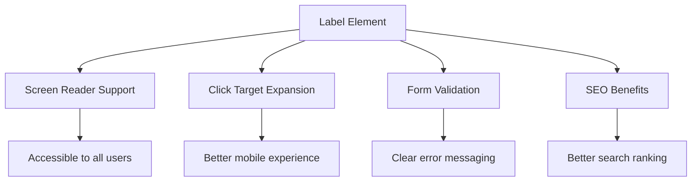
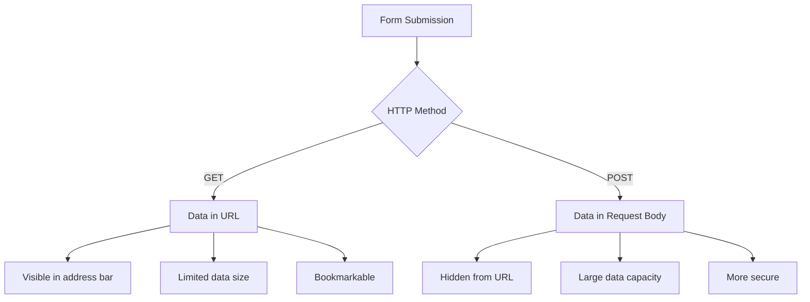
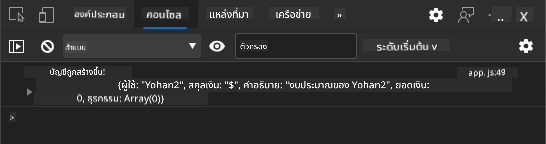
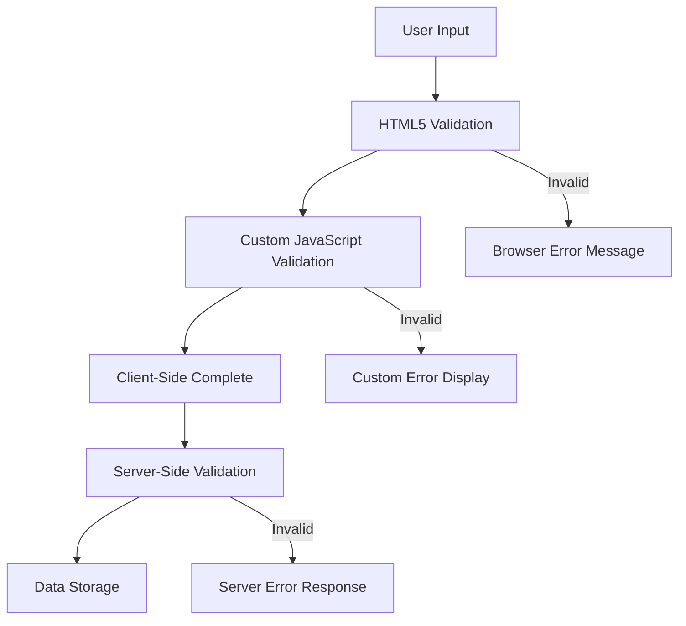
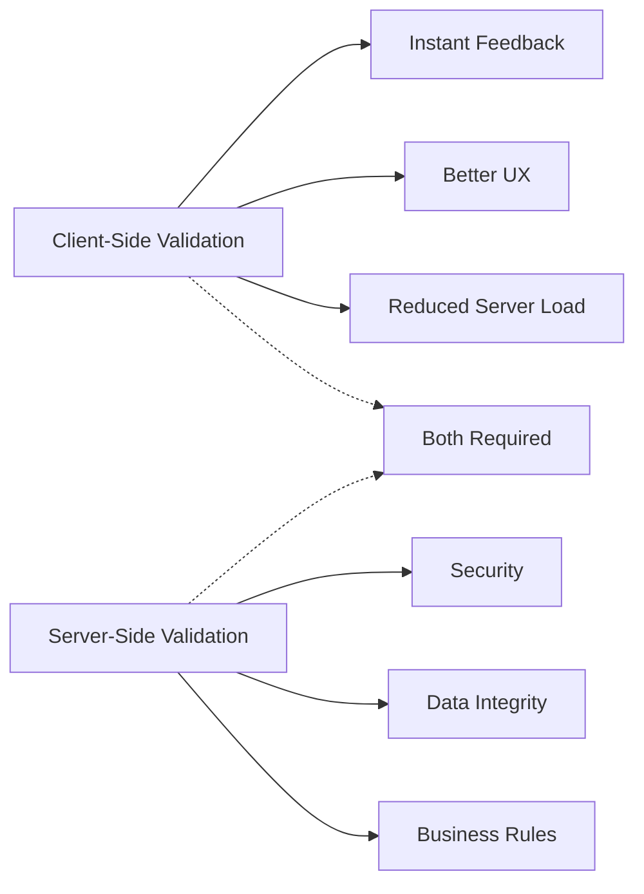
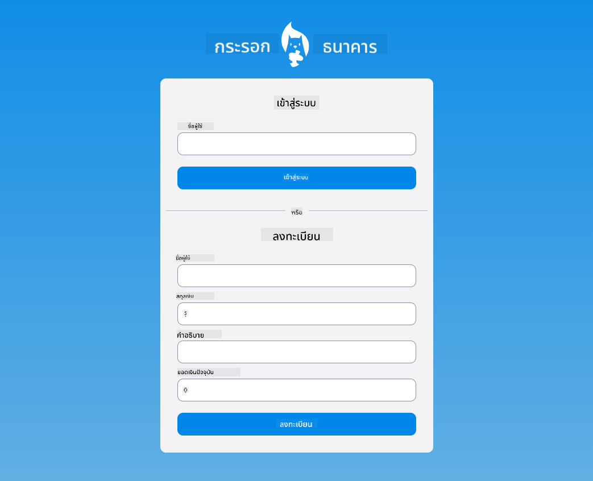

<!--
CO_OP_TRANSLATOR_METADATA:
{
  "original_hash": "b24f28fc46dd473aa9080f174182adde",
  "translation_date": "2025-10-23T21:13:39+00:00",
  "source_file": "7-bank-project/2-forms/README.md",
  "language_code": "th"
}
-->
# สร้างแอปธนาคาร ตอนที่ 2: สร้างฟอร์มเข้าสู่ระบบและลงทะเบียน

## แบบทดสอบก่อนเรียน

[แบบทดสอบก่อนเรียน](https://ff-quizzes.netlify.app/web/quiz/43)

เคยกรอกฟอร์มออนไลน์แล้วอีเมลไม่ผ่านการตรวจสอบ หรือข้อมูลทั้งหมดหายไปเมื่อกดส่งหรือเปล่า? เราทุกคนคงเคยเจอประสบการณ์ที่น่าหงุดหงิดแบบนี้กันมาบ้าง

ฟอร์มเป็นสะพานเชื่อมระหว่างผู้ใช้และฟังก์ชันของแอปพลิเคชันของคุณ เช่นเดียวกับการควบคุมการจราจรทางอากาศที่ช่วยนำเครื่องบินไปยังจุดหมายปลายทางอย่างปลอดภัย ฟอร์มที่ออกแบบมาอย่างดีจะให้คำแนะนำที่ชัดเจนและป้องกันข้อผิดพลาดที่อาจเกิดขึ้นได้ ในทางกลับกัน ฟอร์มที่ออกแบบไม่ดีอาจทำให้ผู้ใช้ไม่อยากใช้งานแอปพลิเคชันของคุณอีกเลย

ในบทเรียนนี้ เราจะเปลี่ยนแอปธนาคารแบบคงที่ของคุณให้กลายเป็นแอปพลิเคชันที่มีการโต้ตอบ คุณจะได้เรียนรู้วิธีสร้างฟอร์มที่ตรวจสอบข้อมูลผู้ใช้ สื่อสารกับเซิร์ฟเวอร์ และให้คำแนะนำที่เป็นประโยชน์ คิดซะว่าเป็นการสร้างอินเทอร์เฟซควบคุมที่ช่วยให้ผู้ใช้สามารถใช้งานฟีเจอร์ต่างๆ ของแอปพลิเคชันของคุณได้

เมื่อจบบทเรียนนี้ คุณจะมีระบบเข้าสู่ระบบและลงทะเบียนที่สมบูรณ์พร้อมการตรวจสอบข้อมูลที่ช่วยให้ผู้ใช้ประสบความสำเร็จแทนที่จะรู้สึกหงุดหงิด

## สิ่งที่ต้องเตรียมก่อนเริ่ม

ก่อนที่เราจะเริ่มสร้างฟอร์ม มาตรวจสอบกันก่อนว่าคุณได้เตรียมทุกอย่างไว้เรียบร้อยแล้ว บทเรียนนี้ต่อเนื่องจากบทเรียนก่อนหน้า ดังนั้นหากคุณข้ามไป คุณอาจต้องย้อนกลับไปเริ่มต้นจากพื้นฐานก่อน

### การตั้งค่าที่จำเป็น

| ส่วนประกอบ | สถานะ | คำอธิบาย |
|------------|-------|-----------|
| [HTML Templates](../1-template-route/README.md) | ✅ จำเป็น | โครงสร้างพื้นฐานของแอปธนาคาร |
| [Node.js](https://nodejs.org) | ✅ จำเป็น | รันไทม์ JavaScript สำหรับเซิร์ฟเวอร์ |
| [Bank API Server](../api/README.md) | ✅ จำเป็น | บริการ backend สำหรับการจัดเก็บข้อมูล |

> 💡 **เคล็ดลับการพัฒนา**: คุณจะต้องรันเซิร์ฟเวอร์สองตัวพร้อมกัน – เซิร์ฟเวอร์สำหรับแอปธนาคารฝั่ง front-end และอีกตัวสำหรับ API backend การตั้งค่านี้สะท้อนถึงการพัฒนาในโลกจริงที่บริการ front-end และ backend ทำงานแยกกัน

### การตั้งค่าเซิร์ฟเวอร์

**สภาพแวดล้อมการพัฒนาของคุณจะประกอบด้วย:**
- **เซิร์ฟเวอร์ฝั่ง front-end**: ให้บริการแอปธนาคารของคุณ (ปกติพอร์ต `3000`)
- **เซิร์ฟเวอร์ API backend**: จัดการการจัดเก็บและดึงข้อมูล (พอร์ต `5000`)
- **ทั้งสองเซิร์ฟเวอร์** สามารถรันพร้อมกันได้โดยไม่มีปัญหา

**การทดสอบการเชื่อมต่อ API ของคุณ:**
```bash
curl http://localhost:5000/api
# Expected response: "Bank API v1.0.0"
```

**หากคุณเห็นการตอบกลับเวอร์ชัน API คุณพร้อมที่จะเริ่มแล้ว!**

---

## ทำความเข้าใจฟอร์ม HTML และการควบคุม

ฟอร์ม HTML คือวิธีที่ผู้ใช้สื่อสารกับแอปพลิเคชันเว็บของคุณ คิดว่ามันเหมือนระบบโทรเลขที่เชื่อมต่อสถานที่ห่างไกลในศตวรรษที่ 19 – มันคือโปรโตคอลการสื่อสารระหว่างความตั้งใจของผู้ใช้และการตอบสนองของแอปพลิเคชัน เมื่อออกแบบอย่างรอบคอบ ฟอร์มจะจับข้อผิดพลาด แนะนำรูปแบบการป้อนข้อมูล และให้คำแนะนำที่เป็นประโยชน์

ฟอร์มในยุคปัจจุบันมีความซับซ้อนมากกว่าการป้อนข้อความพื้นฐาน HTML5 ได้แนะนำประเภทการป้อนข้อมูลเฉพาะที่จัดการการตรวจสอบอีเมล การจัดรูปแบบตัวเลข และการเลือกวันที่โดยอัตโนมัติ การปรับปรุงเหล่านี้เป็นประโยชน์ต่อการเข้าถึงและประสบการณ์ผู้ใช้บนมือถือ

### องค์ประกอบฟอร์มที่จำเป็น

**ส่วนประกอบที่ฟอร์มทุกฟอร์มต้องมี:**

```html
<!-- Basic form structure -->
<form id="userForm" method="POST">
  <label for="username">Username</label>
  <input id="username" name="username" type="text" required>
  
  <button type="submit">Submit</button>
</form>
```

**สิ่งที่โค้ดนี้ทำ:**
- **สร้าง** ตัวบรรจุฟอร์มพร้อมตัวระบุเฉพาะ
- **ระบุ** วิธี HTTP สำหรับการส่งข้อมูล
- **เชื่อมโยง** ป้ายกำกับกับการป้อนข้อมูลเพื่อการเข้าถึง
- **กำหนด** ปุ่มส่งเพื่อประมวลผลฟอร์ม

### ประเภทการป้อนข้อมูลและแอตทริบิวต์ใน HTML5

| ประเภทการป้อนข้อมูล | วัตถุประสงค์ | ตัวอย่างการใช้งาน |
|-----------------------|---------------|---------------------|
| `text` | การป้อนข้อความทั่วไป | `<input type="text" name="username">` |
| `email` | การตรวจสอบอีเมล | `<input type="email" name="email">` |
| `password` | การป้อนข้อความที่ซ่อน | `<input type="password" name="password">` |
| `number` | การป้อนตัวเลข | `<input type="number" name="balance" min="0">` |
| `tel` | หมายเลขโทรศัพท์ | `<input type="tel" name="phone">` |

> 💡 **ข้อดีของ HTML5 สมัยใหม่**: การใช้ประเภทการป้อนข้อมูลเฉพาะช่วยให้การตรวจสอบอัตโนมัติ คีย์บอร์ดที่เหมาะสมสำหรับมือถือ และการสนับสนุนการเข้าถึงที่ดีขึ้นโดยไม่ต้องใช้ JavaScript เพิ่มเติม!

### ประเภทปุ่มและพฤติกรรม

```html
<!-- Different button behaviors -->
<button type="submit">Save Data</button>     <!-- Submits the form -->
<button type="reset">Clear Form</button>    <!-- Resets all fields -->
<button type="button">Custom Action</button> <!-- No default behavior -->
```

**สิ่งที่แต่ละประเภทปุ่มทำ:**
- **ปุ่มส่ง**: เริ่มการส่งฟอร์มและส่งข้อมูลไปยังปลายทางที่ระบุ
- **ปุ่มรีเซ็ต**: คืนค่าฟิลด์ฟอร์มทั้งหมดกลับสู่สถานะเริ่มต้น
- **ปุ่มทั่วไป**: ไม่มีพฤติกรรมเริ่มต้น ต้องการ JavaScript แบบกำหนดเองเพื่อฟังก์ชันการทำงาน

> ⚠️ **หมายเหตุสำคัญ**: องค์ประกอบ `<input>` เป็น self-closing และไม่ต้องการแท็กปิด แนวปฏิบัติที่ดีที่สุดในปัจจุบันคือการเขียน `<input>` โดยไม่มีเครื่องหมายทับ

### สร้างฟอร์มเข้าสู่ระบบของคุณ

ตอนนี้เรามาสร้างฟอร์มเข้าสู่ระบบที่แสดงให้เห็นถึงการปฏิบัติฟอร์ม HTML สมัยใหม่ เราจะเริ่มด้วยโครงสร้างพื้นฐานและค่อยๆ เพิ่มคุณสมบัติการเข้าถึงและการตรวจสอบข้อมูล

```html
<template id="login">
  <h1>Bank App</h1>
  <section>
    <h2>Login</h2>
    <form id="loginForm" novalidate>
      <div class="form-group">
        <label for="username">Username</label>
        <input id="username" name="user" type="text" required 
               autocomplete="username" placeholder="Enter your username">
      </div>
      <button type="submit">Login</button>
    </form>
  </section>
</template>
```

**การแยกสิ่งที่เกิดขึ้นในที่นี้:**
- **จัดโครงสร้าง** ฟอร์มด้วยองค์ประกอบ HTML5 ที่มีความหมาย
- **จัดกลุ่ม** องค์ประกอบที่เกี่ยวข้องโดยใช้ตัวบรรจุ `div` พร้อมคลาสที่มีความหมาย
- **เชื่อมโยง** ป้ายกำกับกับการป้อนข้อมูลโดยใช้แอตทริบิวต์ `for` และ `id`
- **รวม** แอตทริบิวต์สมัยใหม่ เช่น `autocomplete` และ `placeholder` เพื่อ UX ที่ดีขึ้น
- **เพิ่ม** `novalidate` เพื่อจัดการการตรวจสอบข้อมูลด้วย JavaScript แทนค่าเริ่มต้นของเบราว์เซอร์

### พลังของป้ายกำกับที่เหมาะสม

**ทำไมป้ายกำกับถึงสำคัญสำหรับการพัฒนาเว็บสมัยใหม่:**



**สิ่งที่ป้ายกำกับที่เหมาะสมทำ:**
- **ช่วยให้** screen readers ประกาศฟิลด์ฟอร์มได้อย่างชัดเจน
- **ขยาย** พื้นที่คลิก (การคลิกที่ป้ายกำกับจะโฟกัสไปที่การป้อนข้อมูล)
- **ปรับปรุง** การใช้งานบนมือถือด้วยเป้าหมายการสัมผัสที่ใหญ่ขึ้น
- **สนับสนุน** การตรวจสอบฟอร์มด้วยข้อความแสดงข้อผิดพลาดที่มีความหมาย
- **เพิ่ม** SEO โดยให้ความหมายเชิงความหมายกับองค์ประกอบฟอร์ม

> 🎯 **เป้าหมายการเข้าถึง**: ฟิลด์ฟอร์มทุกฟิลด์ควรมีป้ายกำกับที่เกี่ยวข้อง การปฏิบัติที่ง่ายนี้ทำให้ฟอร์มของคุณใช้งานได้สำหรับทุกคน รวมถึงผู้ใช้ที่มีความพิการ และปรับปรุงประสบการณ์สำหรับผู้ใช้ทุกคน

### สร้างฟอร์มลงทะเบียน

ฟอร์มลงทะเบียนต้องการข้อมูลที่ละเอียดมากขึ้นเพื่อสร้างบัญชีผู้ใช้ที่สมบูรณ์ มาสร้างมันด้วยคุณสมบัติ HTML5 สมัยใหม่และการเข้าถึงที่ดีขึ้น

```html
<hr/>
<h2>Register</h2>
<form id="registerForm" novalidate>
  <div class="form-group">
    <label for="user">Username</label>
    <input id="user" name="user" type="text" required 
           autocomplete="username" placeholder="Choose a username">
  </div>
  
  <div class="form-group">
    <label for="currency">Currency</label>
    <input id="currency" name="currency" type="text" value="$" 
           required maxlength="3" placeholder="USD, EUR, etc.">
  </div>
  
  <div class="form-group">
    <label for="description">Account Description</label>
    <input id="description" name="description" type="text" 
           maxlength="100" placeholder="Personal savings, checking, etc.">
  </div>
  
  <div class="form-group">
    <label for="balance">Starting Balance</label>
    <input id="balance" name="balance" type="number" value="0" 
           min="0" step="0.01" placeholder="0.00">
  </div>
  
  <button type="submit">Create Account</button>
</form>
```

**ในโค้ดด้านบน เราได้:**
- **จัดระเบียบ** แต่ละฟิลด์ในตัวบรรจุ div เพื่อการจัดรูปแบบและเลย์เอาต์ที่ดีขึ้น
- **เพิ่ม** แอตทริบิวต์ `autocomplete` ที่เหมาะสมเพื่อสนับสนุนการเติมข้อมูลอัตโนมัติของเบราว์เซอร์
- **รวม** ข้อความแนะนำที่เป็นประโยชน์เพื่อแนะนำการป้อนข้อมูลของผู้ใช้
- **ตั้งค่า** ค่าเริ่มต้นที่เหมาะสมโดยใช้แอตทริบิวต์ `value`
- **ใช้** แอตทริบิวต์การตรวจสอบข้อมูล เช่น `required`, `maxlength` และ `min`
- **ใช้** `type="number"` สำหรับฟิลด์ยอดเงินพร้อมการสนับสนุนทศนิยม

### สำรวจประเภทการป้อนข้อมูลและพฤติกรรม

**ประเภทการป้อนข้อมูลสมัยใหม่ให้ฟังก์ชันการทำงานที่เพิ่มขึ้น:**

| คุณสมบัติ | ประโยชน์ | ตัวอย่าง |
|-----------|----------|----------|
| `type="number"` | คีย์บอร์ดตัวเลขบนมือถือ | การป้อนยอดเงินที่ง่ายขึ้น |
| `step="0.01"` | การควบคุมความแม่นยำของทศนิยม | รองรับหน่วยเงินเซนต์ |
| `autocomplete` | การเติมข้อมูลอัตโนมัติของเบราว์เซอร์ | การกรอกฟอร์มที่รวดเร็วขึ้น |
| `placeholder` | ข้อแนะนำตามบริบท | แนะนำความคาดหวังของผู้ใช้ |

> 🎯 **ความท้าทายด้านการเข้าถึง**: ลองนำทางฟอร์มโดยใช้แค่คีย์บอร์ด! ใช้ `Tab` เพื่อย้ายระหว่างฟิลด์ `Space` เพื่อเลือกกล่อง และ `Enter` เพื่อส่งฟอร์ม ประสบการณ์นี้ช่วยให้คุณเข้าใจว่าผู้ใช้ screen reader โต้ตอบกับฟอร์มของคุณอย่างไร

## ทำความเข้าใจวิธีการส่งฟอร์ม

เมื่อมีคนกรอกฟอร์มของคุณและกดส่ง ข้อมูลนั้นต้องไปที่ไหนสักแห่ง – โดยปกติจะไปยังเซิร์ฟเวอร์ที่สามารถบันทึกข้อมูลได้ มีวิธีการที่แตกต่างกันสองสามวิธีที่สามารถทำได้ และการรู้ว่าควรใช้วิธีใดสามารถช่วยให้คุณหลีกเลี่ยงปัญหาในภายหลังได้

มาดูกันว่าเกิดอะไรขึ้นจริงเมื่อมีคนคลิกปุ่มส่งฟอร์ม

### พฤติกรรมเริ่มต้นของฟอร์ม

ก่อนอื่น มาสังเกตสิ่งที่เกิดขึ้นกับการส่งฟอร์มพื้นฐาน:

**ทดสอบฟอร์มปัจจุบันของคุณ:**
1. คลิกปุ่ม *Register* ในฟอร์มของคุณ
2. สังเกตการเปลี่ยนแปลงในแถบที่อยู่ของเบราว์เซอร์ของคุณ
3. สังเกตว่าหน้าเว็บโหลดใหม่และข้อมูลปรากฏใน URL อย่างไร


### การเปรียบเทียบวิธี HTTP



**ทำความเข้าใจความแตกต่าง:**

| วิธี | กรณีการใช้งาน | ตำแหน่งข้อมูล | ระดับความปลอดภัย | ข้อจำกัดขนาด |
|------|---------------|----------------|--------------------|---------------|
| `GET` | คำค้นหา ตัวกรอง | พารามิเตอร์ URL | ต่ำ (มองเห็นได้) | ~2000 ตัวอักษร |
| `POST` | บัญชีผู้ใช้ ข้อมูลสำคัญ | เนื้อหา request | สูง (ซ่อน) | ไม่มีข้อจำกัดที่ใช้งานได้จริง |

**ทำความเข้าใจความแตกต่างพื้นฐาน:**
- **GET**: เพิ่มข้อมูลฟอร์มลงใน URL เป็นพารามิเตอร์ query (เหมาะสำหรับการค้นหา)
- **POST**: รวมข้อมูลในเนื้อหา request (จำเป็นสำหรับข้อมูลสำคัญ)
- **ข้อจำกัดของ GET**: ข้อจำกัดขนาด ข้อมูลที่มองเห็นได้ ประวัติการเรียกดูที่คงอยู่
- **ข้อดีของ POST**: ความจุข้อมูลขนาดใหญ่ การปกป้องความเป็นส่วนตัว การสนับสนุนการอัปโหลดไฟล์

> 💡 **แนวปฏิบัติที่ดีที่สุด**: ใช้ `GET` สำหรับฟอร์มค้นหาและตัวกรอง (การดึงข้อมูล) ใช้ `POST` สำหรับการลงทะเบียนผู้ใช้ การเข้าสู่ระบบ และการสร้างข้อมูล

### การตั้งค่าการส่งฟอร์ม

มาปรับแต่งฟอร์มลงทะเบียนของคุณให้สื่อสารกับ API backend อย่างเหมาะสมโดยใช้วิธี POST:

```html
<form id="registerForm" action="//localhost:5000/api/accounts" 
      method="POST" novalidate>
```

**สิ่งที่การตั้งค่านี้ทำ:**
- **กำหนด** การส่งฟอร์มไปยังปลายทาง API ของคุณ
- **ใช้** วิธี POST สำหรับการส่งข้อมูลอย่างปลอดภัย
- **รวม** `novalidate` เพื่อจัดการการตรวจสอบข้อมูลด้วย JavaScript

### การทดสอบการส่งฟอร์ม

**ทำตามขั้นตอนเหล่านี้เพื่อทดสอบฟอร์มของคุณ:**
1. **กรอก** ฟอร์มลงทะเบียนด้วยข้อมูลของคุณ
2. **คลิก** ปุ่ม "Create Account"
3. **สังเกต** การตอบกลับของเซิร์ฟเวอร์ในเบราว์เซอร์ของคุณ


**สิ่งที่คุณควรเห็น:**
- **เบราว์เซอร์เปลี่ยนเส้นทาง** ไปยัง URL ปลายทาง API
- **การตอบกลับ JSON** ที่มีข้อมูลบัญชีที่คุณสร้างขึ้นใหม่
- **การยืนยันจากเซิร์ฟเวอร์** ว่าบัญชีถูกสร้างขึ้นสำเร็จ

> 🧪 **เวลาทดลอง**: ลองลงทะเบียนอีกครั้งด้วยชื่อผู้ใช้เดียวกัน คุณได้รับการตอบกลับแบบใด? สิ่งนี้ช่วยให้คุณเข้าใจว่าเซิร์ฟเวอร์จัดการข้อมูลซ้ำและเงื่อนไขข้อผิดพลาดอย่างไร

### ทำความเข้าใจการตอบกลับ JSON

**เมื่อเซิร์ฟเวอร์ประมวลผลฟอร์มของคุณสำเร็จ:**
```json
{
  "user": "john_doe",
  "currency": "$",
  "description": "Personal savings",
  "balance": 100,
  "id": "unique_account_id"
}
```

**การตอบกลับนี้ยืนยันว่า:**
- **สร้าง** บัญชีใหม่ด้วยข้อมูลที่คุณระบุ
- **กำหนด** ตัวระบุเฉพาะสำหรับการอ้างอิงในอนาคต
- **ส่งคืน** ข้อมูลบัญชีทั้งหมดเพื่อการตรวจสอบ
- **ระบุ** การจัดเก็บข้อมูลในฐานข้อมูลสำเร็จ

## การจัดการฟอร์มสมัยใหม่ด้วย JavaScript

การส่งฟอร์มแบบดั้งเดิมทำให้เกิดการโหลดหน้าเว็บใหม่ทั้งหมด คล้ายกับการที่ภารกิจอวกาศในยุคแรกๆ ต้องรีเซ็ตระบบทั้งหมดเพื่อปรับเส้นทาง การส่งแบบนี้ทำให้ประสบการณ์ผู้ใช้ขาดตอนและสูญเสียสถานะของแอปพลิเคชัน

การจัดการฟอร์มด้วย JavaScript ทำงานเหมือนระบบนำทางต่อเนื่องที่ใช้ในยานอวกาศสมัยใหม่ – ทำการปรับเปลี่ยนแบบเรียลไทม์โดยไม่สูญเสียบริบทการนำทาง เราสามารถสกัดการส่งฟอร์ม ให้คำแนะนำทันที จัดการข้อผิดพลาดอย่างราบรื่น และอัปเดตอินเทอร์เฟซตามการตอบกลับของเซิร์ฟเวอร์ในขณะที่รักษาตำแหน่งของผู้ใช้ในแอปพลิเคชัน

### ทำไมต้องหลีกเลี่ยงการโหลดหน้าเว็บใหม่?


**ข้อดีของการจัดการฟอร์มด้วย JavaScript:**
- **รักษา** สถานะของแอปพลิเคชันและบริบทของผู้ใช้
- **ให้** คำแนะนำทันทีและตัวบ่งชี้การโหลด
- **เปิดใช้งาน** การจัดการข้อผิดพลาดและการตรวจสอบข้อมูลแบบไดนามิก
- **สร้าง** ประสบการณ์
- **ให้** ข้อความแสดงข้อผิดพลาดที่ละเอียดสำหรับการดีบัก
- **คืนค่า** โครงสร้างข้อมูลที่สม่ำเสมอสำหรับกรณีสำเร็จและข้อผิดพลาด

### พลังของ Fetch API สมัยใหม่

**ข้อดีของ Fetch API เมื่อเทียบกับวิธีเก่า:**

| ฟีเจอร์ | ประโยชน์ | การใช้งาน |
|---------|---------|-----------|
| ใช้ Promise | โค้ดแบบ async ที่สะอาด | `await fetch()` |
| ปรับแต่งคำขอ | ควบคุม HTTP ได้เต็มที่ | Headers, methods, body |
| จัดการการตอบกลับ | การแปลงข้อมูลที่ยืดหยุ่น | `.json()`, `.text()`, `.blob()` |
| จัดการข้อผิดพลาด | การจับข้อผิดพลาดที่ครอบคลุม | Try/catch blocks |

> 🎥 **เรียนรู้เพิ่มเติม**: [บทเรียน Async/Await](https://youtube.com/watch?v=YwmlRkrxvkk) - เข้าใจรูปแบบ JavaScript แบบ asynchronous สำหรับการพัฒนาเว็บสมัยใหม่

**แนวคิดสำคัญสำหรับการสื่อสารกับเซิร์ฟเวอร์:**
- **ฟังก์ชัน Async** ช่วยหยุดการทำงานเพื่อรอการตอบกลับจากเซิร์ฟเวอร์
- **คำสั่ง Await** ทำให้โค้ดแบบ asynchronous อ่านง่ายเหมือนโค้ดแบบ synchronous
- **Fetch API** ให้การร้องขอ HTTP แบบ promise-based ที่ทันสมัย
- **การจัดการข้อผิดพลาด** ช่วยให้แอปของคุณตอบสนองต่อปัญหาเครือข่ายได้อย่างราบรื่น

### การทำฟังก์ชันลงทะเบียนให้สมบูรณ์

มารวมทุกอย่างเข้าด้วยกันเพื่อสร้างฟังก์ชันลงทะเบียนที่พร้อมใช้งานในระดับ production:

```javascript
async function register() {
  const registerForm = document.getElementById('registerForm');
  const submitButton = registerForm.querySelector('button[type="submit"]');
  
  try {
    // Show loading state
    submitButton.disabled = true;
    submitButton.textContent = 'Creating Account...';
    
    // Process form data
    const formData = new FormData(registerForm);
    const jsonData = JSON.stringify(Object.fromEntries(formData));
    
    // Send to server
    const result = await createAccount(jsonData);
    
    if (result.error) {
      console.error('Registration failed:', result.error);
      alert(`Registration failed: ${result.error}`);
      return;
    }
    
    console.log('Account created successfully!', result);
    alert(`Welcome, ${result.user}! Your account has been created.`);
    
    // Reset form after successful registration
    registerForm.reset();
    
  } catch (error) {
    console.error('Unexpected error:', error);
    alert('An unexpected error occurred. Please try again.');
  } finally {
    // Restore button state
    submitButton.disabled = false;
    submitButton.textContent = 'Create Account';
  }
}
```

**การปรับปรุงนี้รวมถึง:**
- **ให้** การตอบสนองแบบภาพระหว่างการส่งแบบฟอร์ม
- **ปิดใช้งาน**ปุ่มส่งเพื่อป้องกันการส่งซ้ำ
- **จัดการ** ทั้งข้อผิดพลาดที่คาดการณ์ได้และไม่ได้
- **แสดง** ข้อความสำเร็จและข้อผิดพลาดที่เป็นมิตรต่อผู้ใช้
- **รีเซ็ต** แบบฟอร์มหลังจากลงทะเบียนสำเร็จ
- **คืนค่า** สถานะ UI ไม่ว่าจะเกิดผลลัพธ์ใด

### ทดสอบการใช้งานของคุณ

**เปิดเครื่องมือสำหรับนักพัฒนาในเบราว์เซอร์และทดสอบการลงทะเบียน:**

1. **เปิด** คอนโซลเบราว์เซอร์ (F12 → แท็บ Console)
2. **กรอก** แบบฟอร์มลงทะเบียน
3. **คลิก** "สร้างบัญชี"
4. **สังเกต** ข้อความในคอนโซลและการตอบสนองของผู้ใช้



**สิ่งที่คุณควรเห็น:**
- **สถานะการโหลด** ปรากฏบนปุ่มส่ง
- **ข้อความในคอนโซล** แสดงข้อมูลรายละเอียดเกี่ยวกับกระบวนการ
- **ข้อความสำเร็จ** ปรากฏเมื่อการสร้างบัญชีสำเร็จ
- **แบบฟอร์มรีเซ็ต** โดยอัตโนมัติหลังจากการส่งสำเร็จ

> 🔒 **ข้อควรพิจารณาด้านความปลอดภัย**: ปัจจุบันข้อมูลถูกส่งผ่าน HTTP ซึ่งไม่ปลอดภัยสำหรับการใช้งานจริง ในแอปพลิเคชันจริงควรใช้ HTTPS เสมอเพื่อเข้ารหัสการส่งข้อมูล เรียนรู้เพิ่มเติมเกี่ยวกับ [ความปลอดภัย HTTPS](https://en.wikipedia.org/wiki/HTTPS) และเหตุผลที่สำคัญสำหรับการปกป้องข้อมูลผู้ใช้

## การตรวจสอบแบบฟอร์มที่ครอบคลุม

การตรวจสอบแบบฟอร์มช่วยป้องกันประสบการณ์ที่น่าหงุดหงิดจากการพบข้อผิดพลาดหลังการส่ง เช่นเดียวกับระบบสำรองหลายชั้นบนสถานีอวกาศนานาชาติ การตรวจสอบที่มีประสิทธิภาพใช้การตรวจสอบหลายชั้นเพื่อความปลอดภัย

วิธีที่ดีที่สุดคือการรวมการตรวจสอบระดับเบราว์เซอร์เพื่อการตอบสนองทันที การตรวจสอบด้วย JavaScript เพื่อประสบการณ์ผู้ใช้ที่ดีขึ้น และการตรวจสอบฝั่งเซิร์ฟเวอร์เพื่อความปลอดภัยและความสมบูรณ์ของข้อมูล การซ้ำซ้อนนี้ช่วยให้ทั้งผู้ใช้พึงพอใจและระบบปลอดภัย

### เข้าใจชั้นการตรวจสอบ



**กลยุทธ์การตรวจสอบหลายชั้น:**
- **การตรวจสอบ HTML5**: การตรวจสอบทันทีจากเบราว์เซอร์
- **การตรวจสอบด้วย JavaScript**: ตรรกะที่ปรับแต่งและประสบการณ์ผู้ใช้
- **การตรวจสอบฝั่งเซิร์ฟเวอร์**: การตรวจสอบความปลอดภัยและความสมบูรณ์ของข้อมูล
- **การปรับปรุงแบบก้าวหน้า**: ทำงานได้แม้ JavaScript ถูกปิดใช้งาน

### คุณสมบัติการตรวจสอบ HTML5

**เครื่องมือการตรวจสอบสมัยใหม่ที่คุณมี:**

| คุณสมบัติ | วัตถุประสงค์ | ตัวอย่างการใช้งาน | พฤติกรรมเบราว์เซอร์ |
|-----------|---------------|--------------------|-----------------------|
| `required` | ช่องที่จำเป็น | `<input required>` | ป้องกันการส่งแบบฟอร์มที่ว่างเปล่า |
| `minlength`/`maxlength` | ข้อจำกัดความยาวข้อความ | `<input maxlength="20">` | บังคับใช้ข้อจำกัดตัวอักษร |
| `min`/`max` | ช่วงตัวเลข | `<input min="0" max="1000">` | ตรวจสอบขอบเขตตัวเลข |
| `pattern` | กฎ regex แบบกำหนดเอง | `<input pattern="[A-Za-z]+">` | ตรงกับรูปแบบเฉพาะ |
| `type` | การตรวจสอบประเภทข้อมูล | `<input type="email">` | การตรวจสอบรูปแบบเฉพาะ |

### การจัดสไตล์การตรวจสอบด้วย CSS

**สร้างการตอบสนองแบบภาพสำหรับสถานะการตรวจสอบ:**

```css
/* Valid input styling */
input:valid {
  border-color: #28a745;
  background-color: #f8fff9;
}

/* Invalid input styling */
input:invalid {
  border-color: #dc3545;
  background-color: #fff5f5;
}

/* Focus states for better accessibility */
input:focus:valid {
  box-shadow: 0 0 0 0.2rem rgba(40, 167, 69, 0.25);
}

input:focus:invalid {
  box-shadow: 0 0 0 0.2rem rgba(220, 53, 69, 0.25);
}
```

**สิ่งที่การตอบสนองแบบภาพเหล่านี้ทำได้:**
- **ขอบสีเขียว**: แสดงการตรวจสอบสำเร็จ เช่น ไฟเขียวในศูนย์ควบคุมภารกิจ
- **ขอบสีแดง**: แจ้งข้อผิดพลาดการตรวจสอบที่ต้องการความสนใจ
- **ไฮไลต์โฟกัส**: ให้บริบทภาพที่ชัดเจนสำหรับตำแหน่งอินพุตปัจจุบัน
- **การจัดสไตล์ที่สม่ำเสมอ**: สร้างรูปแบบอินเทอร์เฟซที่คาดเดาได้ซึ่งผู้ใช้สามารถเรียนรู้ได้

> 💡 **เคล็ดลับ**: ใช้ pseudo-classes `:valid` และ `:invalid` ของ CSS เพื่อให้การตอบสนองแบบภาพทันทีเมื่อผู้ใช้พิมพ์ สร้างอินเทอร์เฟซที่ตอบสนองและเป็นประโยชน์

### การตรวจสอบแบบครอบคลุม

มาปรับปรุงแบบฟอร์มลงทะเบียนของคุณด้วยการตรวจสอบที่แข็งแกร่งซึ่งให้ประสบการณ์ผู้ใช้ที่ยอดเยี่ยมและคุณภาพข้อมูล:

```html
<form id="registerForm" method="POST" novalidate>
  <div class="form-group">
    <label for="user">Username <span class="required">*</span></label>
    <input id="user" name="user" type="text" required 
           minlength="3" maxlength="20" 
           pattern="[a-zA-Z0-9_]+" 
           autocomplete="username"
           title="Username must be 3-20 characters, letters, numbers, and underscores only">
    <small class="form-text">Choose a unique username (3-20 characters)</small>
  </div>
  
  <div class="form-group">
    <label for="currency">Currency <span class="required">*</span></label>
    <input id="currency" name="currency" type="text" required 
           value="$" maxlength="3" 
           pattern="[A-Z$€£¥₹]+" 
           title="Enter a valid currency symbol or code">
    <small class="form-text">Currency symbol (e.g., $, €, £)</small>
  </div>
  
  <div class="form-group">
    <label for="description">Account Description</label>
    <input id="description" name="description" type="text" 
           maxlength="100" 
           placeholder="Personal savings, checking, etc.">
    <small class="form-text">Optional description (up to 100 characters)</small>
  </div>
  
  <div class="form-group">
    <label for="balance">Starting Balance</label>
    <input id="balance" name="balance" type="number" 
           value="0" min="0" step="0.01" 
           title="Enter a positive number for your starting balance">
    <small class="form-text">Initial account balance (minimum $0.00)</small>
  </div>
  
  <button type="submit">Create Account</button>
</form>
```

**เข้าใจการตรวจสอบที่ปรับปรุงแล้ว:**
- **รวม** ตัวบ่งชี้ช่องที่จำเป็นพร้อมคำอธิบายที่เป็นประโยชน์
- **รวม** คุณสมบัติ `pattern` สำหรับการตรวจสอบรูปแบบ
- **ให้** คุณสมบัติ `title` เพื่อการเข้าถึงและคำแนะนำ
- **เพิ่ม** ข้อความช่วยเหลือเพื่อแนะนำการป้อนข้อมูลของผู้ใช้
- **ใช้** โครงสร้าง HTML เชิงความหมายเพื่อการเข้าถึงที่ดีขึ้น

### กฎการตรวจสอบขั้นสูง

**สิ่งที่แต่ละกฎการตรวจสอบทำได้:**

| ช่อง | กฎการตรวจสอบ | ประโยชน์ต่อผู้ใช้ |
|------|---------------|-------------------|
| ชื่อผู้ใช้ | `required`, `minlength="3"`, `maxlength="20"`, `pattern="[a-zA-Z0-9_]+"` | รับรองตัวระบุที่ถูกต้องและไม่ซ้ำ |
| สกุลเงิน | `required`, `maxlength="3"`, `pattern="[A-Z$€£¥₹]+"` | ยอมรับสัญลักษณ์สกุลเงินทั่วไป |
| ยอดเงิน | `min="0"`, `step="0.01"`, `type="number"` | ป้องกันยอดเงินติดลบ |
| คำอธิบาย | `maxlength="100"` | จำกัดความยาวที่เหมาะสม |

### ทดสอบพฤติกรรมการตรวจสอบ

**ลองสถานการณ์การตรวจสอบเหล่านี้:**
1. **ส่ง** แบบฟอร์มโดยช่องที่จำเป็นว่างเปล่า
2. **ป้อน** ชื่อผู้ใช้ที่สั้นกว่า 3 ตัวอักษร
3. **ลอง** ตัวอักษรพิเศษในช่องชื่อผู้ใช้
4. **ป้อน** ยอดเงินติดลบ


**สิ่งที่คุณจะสังเกตเห็น:**
- **เบราว์เซอร์แสดง** ข้อความการตรวจสอบแบบ native
- **การเปลี่ยนแปลงการจัดสไตล์** ตามสถานะ `:valid` และ `:invalid`
- **การส่งแบบฟอร์ม** ถูกป้องกันจนกว่าการตรวจสอบทั้งหมดจะผ่าน
- **โฟกัสย้ายอัตโนมัติ** ไปยังช่องที่ไม่ถูกต้องช่องแรก

### การตรวจสอบฝั่งไคลเอนต์ vs ฝั่งเซิร์ฟเวอร์



**เหตุผลที่คุณต้องการทั้งสองชั้น:**
- **การตรวจสอบฝั่งไคลเอนต์**: ให้การตอบสนองทันทีและปรับปรุงประสบการณ์ผู้ใช้
- **การตรวจสอบฝั่งเซิร์ฟเวอร์**: รับรองความปลอดภัยและจัดการกฎธุรกิจที่ซับซ้อน
- **วิธีการรวมกัน**: สร้างแอปพลิเคชันที่แข็งแกร่ง เป็นมิตรต่อผู้ใช้ และปลอดภัย
- **การปรับปรุงแบบก้าวหน้า**: ทำงานได้แม้ JavaScript ถูกปิดใช้งาน

> 🛡️ **การเตือนด้านความปลอดภัย**: อย่าเชื่อการตรวจสอบฝั่งไคลเอนต์เพียงอย่างเดียว! ผู้ใช้ที่เป็นอันตรายสามารถข้ามการตรวจสอบฝั่งไคลเอนต์ได้ ดังนั้นการตรวจสอบฝั่งเซิร์ฟเวอร์จึงจำเป็นสำหรับความปลอดภัยและความสมบูรณ์ของข้อมูล

---

---

## ความท้าทาย GitHub Copilot Agent 🚀

ใช้โหมด Agent เพื่อทำความท้าทายต่อไปนี้:

**คำอธิบาย:** ปรับปรุงแบบฟอร์มลงทะเบียนด้วยการตรวจสอบฝั่งไคลเอนต์ที่ครอบคลุมและการตอบสนองของผู้ใช้ ความท้าทายนี้จะช่วยให้คุณฝึกการตรวจสอบแบบฟอร์ม การจัดการข้อผิดพลาด และการปรับปรุงประสบการณ์ผู้ใช้ด้วยการตอบสนองแบบโต้ตอบ

**คำสั่ง:** สร้างระบบการตรวจสอบแบบฟอร์มที่สมบูรณ์สำหรับแบบฟอร์มลงทะเบียน ซึ่งรวมถึง: 1) การตอบสนองการตรวจสอบแบบเรียลไทม์สำหรับแต่ละช่องเมื่อผู้ใช้พิมพ์, 2) ข้อความการตรวจสอบแบบกำหนดเองที่ปรากฏใต้แต่ละช่อง, 3) ช่องยืนยันรหัสผ่านพร้อมการตรวจสอบการจับคู่, 4) ตัวบ่งชี้แบบภาพ (เช่น เครื่องหมายถูกสีเขียวสำหรับช่องที่ถูกต้องและคำเตือนสีแดงสำหรับช่องที่ไม่ถูกต้อง), 5) ปุ่มส่งที่เปิดใช้งานได้เฉพาะเมื่อการตรวจสอบทั้งหมดผ่าน ใช้คุณสมบัติการตรวจสอบ HTML5, CSS สำหรับการจัดสไตล์สถานะการตรวจสอบ และ JavaScript สำหรับพฤติกรรมแบบโต้ตอบ

เรียนรู้เพิ่มเติมเกี่ยวกับ [โหมด Agent](https://code.visualstudio.com/blogs/2025/02/24/introducing-copilot-agent-mode) ที่นี่

## 🚀 ความท้าทาย

แสดงข้อความข้อผิดพลาดใน HTML หากผู้ใช้มีอยู่แล้ว

นี่คือตัวอย่างของหน้าล็อกอินสุดท้ายที่สามารถดูได้หลังจากเพิ่มการจัดสไตล์เล็กน้อย:



## แบบทดสอบหลังการบรรยาย

[แบบทดสอบหลังการบรรยาย](https://ff-quizzes.netlify.app/web/quiz/44)

## ทบทวนและศึกษาด้วยตนเอง

นักพัฒนาได้สร้างสรรค์เกี่ยวกับความพยายามในการสร้างแบบฟอร์ม โดยเฉพาะอย่างยิ่งเกี่ยวกับกลยุทธ์การตรวจสอบ เรียนรู้เกี่ยวกับรูปแบบการทำงานของแบบฟอร์มต่างๆ โดยดูผ่าน [CodePen](https://codepen.com); คุณสามารถหาแบบฟอร์มที่น่าสนใจและสร้างแรงบันดาลใจได้หรือไม่?

## งานที่ได้รับมอบหมาย

[จัดสไตล์แอปธนาคารของคุณ](assignment.md)

---

**ข้อจำกัดความรับผิดชอบ**:  
เอกสารนี้ได้รับการแปลโดยใช้บริการแปลภาษา AI [Co-op Translator](https://github.com/Azure/co-op-translator) แม้ว่าเราจะพยายามให้การแปลมีความถูกต้อง แต่โปรดทราบว่าการแปลโดยอัตโนมัติอาจมีข้อผิดพลาดหรือความไม่ถูกต้อง เอกสารต้นฉบับในภาษาดั้งเดิมควรถือเป็นแหล่งข้อมูลที่เชื่อถือได้ สำหรับข้อมูลที่สำคัญ ขอแนะนำให้ใช้บริการแปลภาษามืออาชีพ เราจะไม่รับผิดชอบต่อความเข้าใจผิดหรือการตีความผิดที่เกิดจากการใช้การแปลนี้