# สร้างแอปธนาคาร ตอนที่ 3: วิธีการดึงข้อมูลและใช้งานข้อมูล

ลองนึกถึงคอมพิวเตอร์ของยาน Enterprise ใน Star Trek - เมื่อกัปตันพิคาร์ดถามสถานะของยาน ข้อมูลจะปรากฏขึ้นทันทีโดยที่อินเตอร์เฟซทั้งหมดไม่ต้องปิดลงและสร้างขึ้นใหม่ การไหลของข้อมูลที่ราบรื่นนี้คือสิ่งที่เรากำลังสร้างที่นี่ด้วยการดึงข้อมูลแบบไดนามิก

ตอนนี้ แอปธนาคารของคุณเหมือนหนังสือพิมพ์ที่พิมพ์ออกมา - ให้ข้อมูลแต่ไม่เปลี่ยนแปลงได้ เรากำลังจะเปลี่ยนมันให้เหมือนกับศูนย์ควบคุมภารกิจของ NASA ซึ่งข้อมูลจะไหลอย่างต่อเนื่องและอัพเดตแบบเรียลไทม์โดยไม่ขัดจังหวะการทำงานของผู้ใช้

คุณจะได้เรียนรู้วิธีสื่อสารกับเซิร์ฟเวอร์แบบอะซิงโครนัส จัดการกับข้อมูลที่มาถึงในเวลาที่ต่างกัน และแปลงข้อมูลดิบให้กลายเป็นสิ่งที่มีความหมายสำหรับผู้ใช้ นี่คือความแตกต่างระหว่างเดโมกับซอฟต์แวร์ที่พร้อมใช้งานจริง

## ⚡ สิ่งที่คุณทำได้ใน 5 นาทีถัดไป

**เส้นทางเริ่มต้นด่วนสำหรับนักพัฒนาที่มีเวลาไม่มาก**

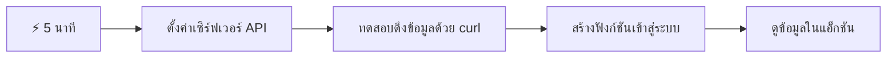
- **นาทีที่ 1-2**: เริ่มเซิร์ฟเวอร์ API ของคุณ (`cd api && npm start`) และทดสอบการเชื่อมต่อ
- **นาทีที่ 3**: สร้างฟังก์ชัน `getAccount()` พื้นฐานโดยใช้ fetch
- **นาทีที่ 4**: เชื่อมต่อแบบฟอร์มเข้าสู่ระบบด้วย `action="javascript:login()"`
- **นาทีที่ 5**: ทดสอบการเข้าสู่ระบบและดูข้อมูลแสดงในคอนโซล

**คำสั่งทดสอบด่วน**:
```bash
# ตรวจสอบว่า API กำลังทำงาน
curl http://localhost:5000/api

# ทดสอบการดึงข้อมูลบัญชี
curl http://localhost:5000/api/accounts/test
```

**ทำไมสิ่งนี้ถึงสำคัญ**: ภายใน 5 นาที คุณจะเห็นเวทมนตร์ของการดึงข้อมูลแบบอะซิงโครนัสที่ขับเคลื่อนทุกแอปเว็บสมัยใหม่ นี่คือพื้นฐานที่ทำให้แอปรู้สึกตอบสนองและมีชีวิตชีวา

## 🗺️ การเดินทางเรียนรู้ของคุณผ่านแอปเว็บที่ขับเคลื่อนด้วยข้อมูล

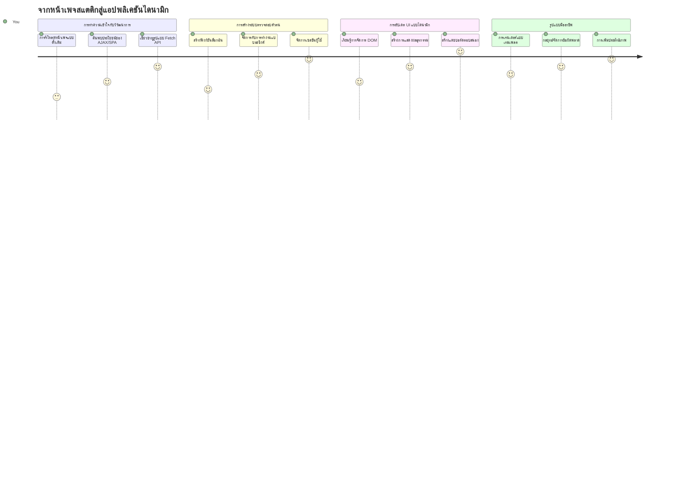
**จุดหมายปลายทางของการเดินทาง**: เมื่อจบบทเรียนนี้ คุณจะเข้าใจว่าแอปเว็บสมัยใหม่ดึงข้อมูล ประมวลผล และแสดงข้อมูลแบบไดนามิกอย่างไร เพื่อสร้างประสบการณ์ผู้ใช้ที่ไหลลื่นตามที่เราเคยคาดหวังจากแอปมืออาชีพ

## แบบทดสอบก่อนเรียน

[แบบทดสอบก่อนเรียน](https://ff-quizzes.netlify.app/web/quiz/45)

### สิ่งที่ต้องเตรียมก่อนเรียน

ก่อนที่จะเริ่มดึงข้อมูล ให้แน่ใจว่าคุณได้เตรียมส่วนประกอบเหล่านี้ไว้แล้ว:

- **บทเรียนก่อนหน้า**: ทำแบบฟอร์ม [เข้าสู่ระบบและลงทะเบียน](../2-forms/README.md) ให้สำเร็จก่อน - เราจะสร้างบนพื้นฐานนี้
- **เซิร์ฟเวอร์ในเครื่อง**: ติดตั้ง [Node.js](https://nodejs.org) และ [รันเซิร์ฟเวอร์ API](../api/README.md) เพื่อให้บริการข้อมูลบัญชี
- **การเชื่อมต่อ API**: ทดสอบการเชื่อมต่อเซิร์ฟเวอร์ด้วยคำสั่งนี้:

```bash
curl http://localhost:5000/api
# การตอบสนองที่คาดไว้: "Bank API v1.0.0"
```

การทดสอบด่วนนี้ทำให้แน่ใจว่าส่วนประกอบทั้งหมดสื่อสารกันได้ดี:
- ตรวจสอบว่า Node.js ทำงานถูกต้องบนระบบของคุณ
- ยืนยันว่าเซิร์ฟเวอร์ API ของคุณใช้งานและตอบสนองอยู่
- ตรวจสอบว่าแอปของคุณสามารถเข้าถึงเซิร์ฟเวอร์ได้ (เหมือนเช็คสัญญาณวิทยุก่อนภารกิจ)

## 🧠 ภาพรวมระบบจัดการข้อมูล

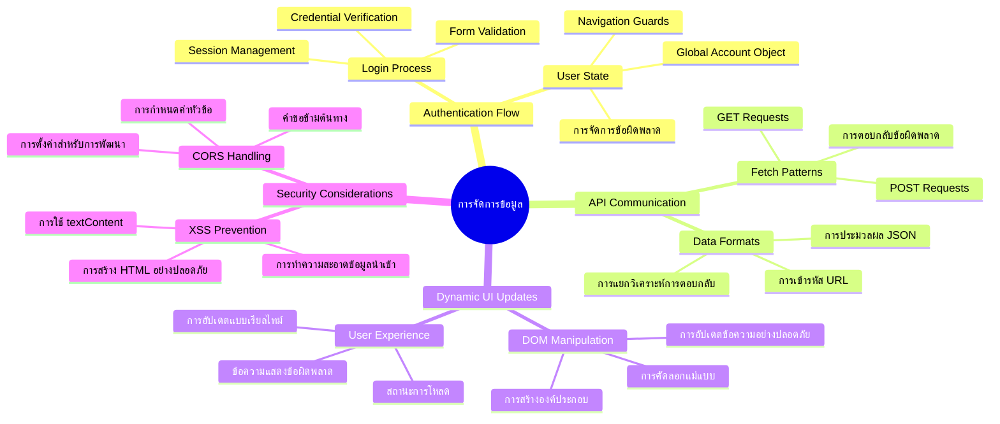
**หลักการสำคัญ**: แอปเว็บสมัยใหม่เป็นระบบประสานงานข้อมูล - พวกมันประสานงานระหว่างอินเตอร์เฟซผู้ใช้ เซิร์ฟเวอร์ API และโมเดลความปลอดภัยของเบราว์เซอร์ เพื่อสร้างประสบการณ์ที่ราบรื่นและตอบสนอง

---

## ทำความเข้าใจกับการดึงข้อมูลในแอปเว็บสมัยใหม่

วิธีที่แอปเว็บจัดการข้อมูลพัฒนาขึ้นอย่างมากในช่วงสองทศวรรษที่ผ่านมา การเข้าใจวิวัฒนาการนี้จะช่วยให้คุณเห็นว่าทำไมเทคนิคสมัยใหม่อย่าง AJAX และ Fetch API จึงทรงพลังและทำไมมันกลายเป็นเครื่องมือจำเป็นสำหรับนักพัฒนาเว็บ

เรามาลองสำรวจว่าเว็บไซต์ดั้งเดิมทำงานอย่างไร และเปรียบเทียบกับแอปพลิเคชันไดนามิกที่ตอบสนองที่เราสร้างขึ้นในวันนี้

### แอปหลายหน้าแบบดั้งเดิม (MPA)

ในยุคแรกของเว็บ ทุกคลิกเหมือนเปลี่ยนช่องโทรทัศน์เก่า - หน้าจอจะว่างเปล่า แล้วค่อยๆ รับสัญญาณเนื้อหาใหม่ นี่คือความจริงของแอปเว็บสมัยแรกที่ทุกการโต้ตอบหมายถึงการสร้างเพจใหม่ทั้งหมดตั้งแต่ต้น

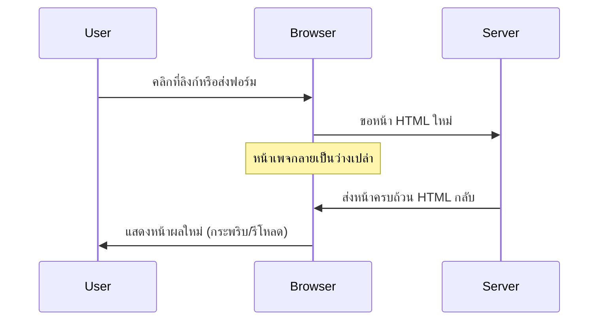
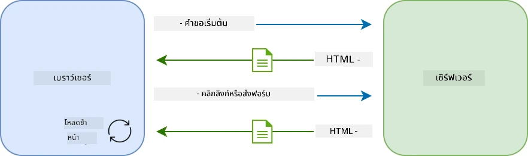

**ทำไมวิธีนี้รู้สึกเกะกะ:**
- ทุกคลิกหมายถึงการสร้างหน้าใหม่ทั้งหมด
- ผู้ใช้ถูกรบกวนขณะคิดโดยการกระพริบหน้าจอเหล่านั้น
- การเชื่อมต่ออินเทอร์เน็ตทำงานหนักโดยดาวน์โหลดส่วนหัวและส่วนท้ายซ้ำๆ
- แอปดูเหมือนการเปิดตู้เก็บเอกสารมากกว่าการใช้งานซอฟต์แวร์

### แอปหน้าเดียวสมัยใหม่ (SPA)

AJAX (Asynchronous JavaScript and XML) เปลี่ยนพาราไดม์นี้อย่างสิ้นเชิง เหมือนกับการออกแบบโมดูลาร์ของสถานีอวกาศนานาชาติ ซึ่งนักบินอวกาศสามารถเปลี่ยนส่วนประกอบรายตัวโดยไม่ต้องสร้างโครงสร้างทั้งหมดใหม่ AJAX อนุญาตให้เราอัพเดตส่วนใดส่วนหนึ่งของหน้าเว็บโดยไม่ต้องโหลดใหม่ทั้งหมด แม้ชื่อจะพูดถึง XML แต่วันนี้เรามักใช้ JSON เป็นหลัก แต่หลักการยังคงเหมือนเดิม: อัพเดตเฉพาะสิ่งที่ต้องเปลี่ยน

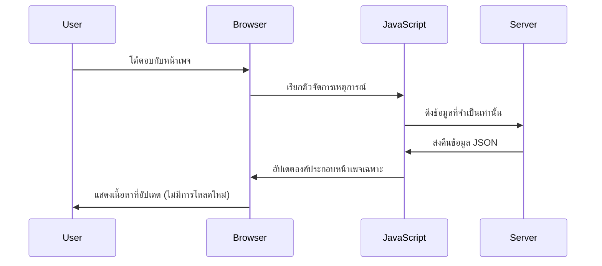
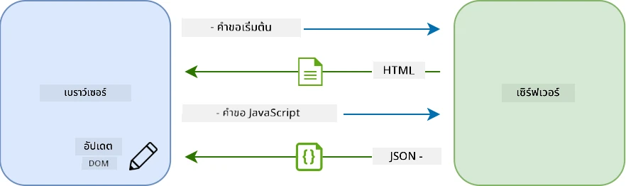

**ทำไม SPA ถึงรู้สึกดีกว่า:**
- แค่ส่วนที่เปลี่ยนจริงๆ เท่านั้นที่อัพเดต (เจ๋งใช่ไหม?)
- ไม่มีการขัดจังหวะที่น่ารำคาญ - ผู้ใช้ยังคงอยู่กับงานของพวกเขา
- ข้อมูลที่ส่งผ่านเครือข่ายน้อยกว่า ทำให้โหลดเร็วขึ้น
- ทุกอย่างตอบสนองและรวดเร็วเหมือนแอปบนโทรศัพท์มือถือ

### วิวัฒนาการสู่ Fetch API สมัยใหม่

เบราว์เซอร์สมัยใหม่ให้ [`Fetch` API](https://developer.mozilla.org/docs/Web/API/Fetch_API) ซึ่งมาแทนที่ [`XMLHttpRequest`](https://developer.mozilla.org/docs/Web/API/XMLHttpRequest/Using_XMLHttpRequest) แบบเก่า เหมือนการเปลี่ยนจากการใช้เทเลกราฟมาใช้เมล Fetch API ใช้ promises เพื่อโค้ดอะซิงโครนัสที่สะอาดกว่าและรองรับ JSON อย่างเป็นธรรมชาติ

| คุณลักษณะ | XMLHttpRequest | Fetch API |
|---------|----------------|----------|
| **ไวยากรณ์** | ซับซ้อน กำหนด callback | สะอาด ใช้ promise |
| **การจัดการ JSON** | ต้องแยกแยะเอง | มีเมธอด `.json()` ในตัว |
| **การจัดการข้อผิดพลาด** | ข้อมูลจำกัด | ข้อผิดพลาดครบถ้วน |
| **รองรับสมัยใหม่** | เข้ากันได้กับรุ่นเก่า | Promise ES6+ และ async/await |

> 💡 **ความเข้ากันได้ของเบราว์เซอร์**: ข่าวดี - Fetch API ทำงานได้ในทุกเบราว์เซอร์สมัยใหม่! ถ้าคุณสนใจเวอร์ชันเฉพาะ [caniuse.com](https://caniuse.com/fetch) มีข้อมูลครบถ้วน
> 
**สรุป:**
- ทำงานได้ดีใน Chrome, Firefox, Safari และ Edge (เกือบทุกที่ที่ผู้ใช้คุณใช้งาน)
- แค่ Internet Explorer ต้องการความช่วยเหลือเพิ่มเติม (และถึงเวลาปล่อย IE ไปแล้ว)
- เตรียมคุณให้พร้อมกับรูปแบบ async/await ที่เราจะใช้ต่อไป

### การใช้งานระบบเข้าสู่ระบบและดึงข้อมูล

ตอนนี้เรามาเขียนระบบเข้าสู่ระบบที่แปลงแอปธนาคารของคุณจากการแสดงผลแบบนิ่งเป็นแอปที่ทำงานได้จริง เหมือนโปรโตคอลการยืนยันตัวตนที่ใช้ในสถานที่ทหารที่ปลอดภัย เราจะตรวจสอบข้อมูลผู้ใช้และให้สิทธิ์เข้าถึงข้อมูลเฉพาะบุคคล

เราจะสร้างอย่างค่อยเป็นค่อยไป เริ่มจากการยืนยันตัวตนพื้นฐานแล้วเพิ่มฟังก์ชันการดึงข้อมูล

#### ขั้นตอนที่ 1: สร้างฟังก์ชันเข้าสู่ระบบพื้นฐาน

เปิดไฟล์ `app.js` ของคุณและเพิ่มฟังก์ชัน `login` ใหม่ ฟังก์ชันนี้จะจัดการกับกระบวนการยืนยันตัวผู้ใช้:

```javascript
async function login() {
  const loginForm = document.getElementById('loginForm');
  const user = loginForm.user.value;
}
```

**มาลองแยกจุดนี้ดู:**
- คำว่า `async` บอก JavaScript ว่า "เฮ้ ฟังก์ชันนี้อาจจะต้องรอบางอย่าง"
- เรากำลังดึงแบบฟอร์มจากหน้า (ไม่ซับซ้อน แค่หาโดย ID)
- แล้วดึงค่าชื่อผู้ใช้ที่ผู้ใช้พิมพ์เข้ามา
- เคล็ดลับคือ: คุณสามารถเข้าถึงอินพุตในฟอร์มใดๆ โดยใช้คุณสมบัติ `name` ของมัน - ไม่จำเป็นต้องใช้ getElementById ซ้ำซ้อน!

> 💡 **วิธีเข้าถึงฟอร์ม**: ทุกคอนโทรลในฟอร์มสามารถเข้าถึงโดยใช้ชื่อที่กำหนดไว้ใน HTML ด้วยแอตทริบิวต์ `name` ซึ่งทำให้การดึงข้อมูลสะอาดและอ่านง่าย

#### ขั้นตอนที่ 2: สร้างฟังก์ชันดึงข้อมูลบัญชี

หลังจากนั้น สร้างฟังก์ชันพิเศษเพื่อดึงข้อมูลบัญชีจากเซิร์ฟเวอร์ ตามแบบฟอร์มของฟังก์ชันลงทะเบียน แต่เน้นดึงข้อมูล:

```javascript
async function getAccount(user) {
  try {
    const response = await fetch('//localhost:5000/api/accounts/' + encodeURIComponent(user));
    return await response.json();
  } catch (error) {
    return { error: error.message || 'Unknown error' };
  }
}
```

**โค้ดนี้ทำอะไรบ้าง:**
- **ใช้** API `fetch` สมัยใหม่เพื่อขอข้อมูลแบบอะซิงโครนัส
- **สร้าง** URL Request แบบ GET โดยมีพารามิเตอร์ชื่อผู้ใช้
- **ใช้** `encodeURIComponent()` เพื่อจัดการตัวอักษรพิเศษใน URL อย่างปลอดภัย
- **แปลง** คำตอบเป็น JSON เพื่อจัดการข้อมูลง่ายขึ้น
- **จัดการ** ข้อผิดพลาดโดยส่งคืนอ็อบเจ็กต์ข้อผิดพลาด แทนการล่มของโปรแกรม

> ⚠️ **หมายเหตุความปลอดภัย**: ฟังก์ชัน `encodeURIComponent()` ใช้จัดการตัวอักษรพิเศษใน URL เช่นเดียวกับระบบเข้ารหัสในสื่อสารทางทะเล เพื่อให้ข้อความของคุณถึงปลายทางอย่างถูกต้อง ป้องกันตัวอักษรอย่าง "#" หรือ "&" ที่อาจทำให้ข้อมูลผิดพลาด
> 
**เหตุผลที่สำคัญ:**
- ป้องกันไม่ให้ตัวอักษรพิเศษทำลาย URL
- ป้องกันการโจมตีด้วยการแก้ไข URL
- ทำให้เซิร์ฟเวอร์ได้รับข้อมูลที่ถูกต้องตามต้องการ
- ปฏิบัติตามแนวทางเขียนโปรแกรมที่ปลอดภัย

#### เข้าใจการร้องขอ HTTP GET

นี่อาจทำให้คุณแปลกใจ: เมื่อใช้ `fetch` โดยไม่เพิ่มออปชันใดๆ มันจะสร้างคำขอ [`GET`](https://developer.mozilla.org/docs/Web/HTTP/Methods/GET) โดยอัตโนมัติ เหมาะสมกับสิ่งที่เราทำ - ขอข้อมูลบัญชีผู้ใช้

คิดว่า GET เหมือนการขอยืมหนังสือจากห้องสมุดอย่างสุภาพ - ร้องขอดูข้อมูลที่มีอยู่แล้ว POST (ที่เราใช้สำหรับลงทะเบียน) เหมือนการส่งหนังสือใหม่เพิ่มลงในคอลเลกชัน

| คำขอ GET | คำขอ POST |
|-------------|-------------|
| **วัตถุประสงค์** | ดึงข้อมูลที่มีอยู่ | ส่งข้อมูลใหม่ไปยังเซิร์ฟเวอร์ |
| **พารามิเตอร์** | ใน URL หรือ query string | ในเนื้อหาของคำขอ |
| **แคช** | สามารถแคชได้โดยเบราว์เซอร์ | โดยทั่วไปไม่แคช |
| **ความปลอดภัย** | เปิดเผยใน URL และบันทึก | ซ่อนในเนื้อหาคำขอ |

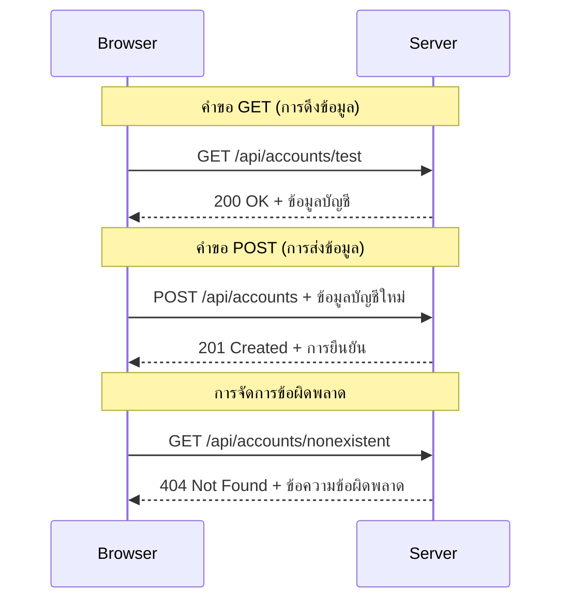
#### ขั้นตอนที่ 3: รวมทุกอย่างเข้าด้วยกัน

ตอนนี้ถึงเวลาส่วนที่น่าพอใจ - เชื่อมฟังก์ชันดึงข้อมูลบัญชีเข้ากับกระบวนการเข้าสู่ระบบ นี่คือจุดที่ทุกอย่างทำงานร่วมกัน:

```javascript
async function login() {
  const loginForm = document.getElementById('loginForm');
  const user = loginForm.user.value;
  const data = await getAccount(user);

  if (data.error) {
    return console.log('loginError', data.error);
  }

  account = data;
  navigate('/dashboard');
}
```

ฟังก์ชันนี้ทำตามลำดับชัดเจน:
- ดึงชื่อผู้ใช้จากอินพุตฟอร์ม
- ขอข้อมูลบัญชีของผู้ใช้จากเซิร์ฟเวอร์
- จัดการข้อผิดพลาดที่เกิดขึ้นระหว่างกระบวนการ
- เก็บข้อมูลบัญชีและไปยังแดชบอร์ดเมื่อสำเร็จ

> 🎯 **รูปแบบ Async/Await**: เนื่องจาก `getAccount` เป็นฟังก์ชันอะซิงโครนัส เราใช้คำสั่ง `await` เพื่อหยุดการทำงานจนกว่าเซิร์ฟเวอร์จะตอบกลับ ป้องกันโค้ดดำเนินต่อโดยใช้ข้อมูลที่ยังไม่ได้

#### ขั้นตอนที่ 4: สร้างที่เก็บข้อมูลของคุณ

แอปของคุณต้องมีที่เก็บข้อมูลบัญชีไว้เมื่อโหลดข้อมูลแล้ว คิดว่านี่เป็นความทรงจำระยะสั้นของแอป - ที่ที่เก็บข้อมูลผู้ใช้ปัจจุบันให้พร้อมใช้งาน เพิ่มบรรทัดนี้ที่บนสุดของไฟล์ `app.js` ของคุณ:

```javascript
// นี่เก็บข้อมูลบัญชีของผู้ใช้ปัจจุบัน
let account = null;
```

**ทำไมเราต้องการแบบนี้:**
- ทำให้ข้อมูลบัญชีเข้าถึงได้จากทุกที่ในแอป
- เริ่มต้นด้วยค่า `null` หมายถึง “ยังไม่มีใครเข้าสู่ระบบ”
- อัพเดตเมื่อมีใครเข้าสู่ระบบหรือสมัครสำเร็จ
- ทำหน้าที่เป็นแหล่งข้อมูลเดียว - ไม่มีความสับสนว่าใครล็อกอินอยู่

#### ขั้นตอนที่ 5: เชื่อมแบบฟอร์มของคุณ

ตอนนี้เชื่อมฟังก์ชันเข้าสู่ระบบใหม่กับแบบฟอร์ม HTML ของคุณ อัพเดตแท็กฟอร์มแบบนี้:

```html
<form id="loginForm" action="javascript:login()">
  <!-- Your existing form inputs -->
</form>
```

**สิ่งที่การเปลี่ยนแปลงนี้ทำ:**
- หยุดการทำงานเริ่มต้นของฟอร์มที่รีโหลดทั้งหน้า
- เรียกฟังก์ชัน JavaScript ที่คุณเขียนแทน
- รักษาความราบรื่นและเหมือนแอปหน้าเดียว
- ให้คุณควบคุมได้เต็มที่เมื่อผู้ใช้กด "Login"

#### ขั้นตอนที่ 6: เพิ่มประสิทธิภาพฟังก์ชันลงทะเบียนของคุณ

เพื่อความสม่ำเสมอ อัพเดตฟังก์ชัน `register` ให้เก็บข้อมูลบัญชีและไปยังแดชบอร์ดด้วย:

```javascript
// เพิ่มบรรทัดเหล่านี้ไว้ที่ท้ายฟังก์ชัน register ของคุณ
account = result;
navigate('/dashboard');
```

**การปรับปรุงนี้ให้:**
- **การเปลี่ยนผ่านอย่างราบรื่น** จากลงทะเบียนสู่แดชบอร์ด
- **ประสบการณ์ผู้ใช้ที่สม่ำเสมอ** ระหว่างการเข้าสู่ระบบและลงทะเบียน
- **เข้าถึงข้อมูลบัญชีทันที** หลังลงทะเบียนสำเร็จ

#### ทดสอบการใช้งานของคุณ

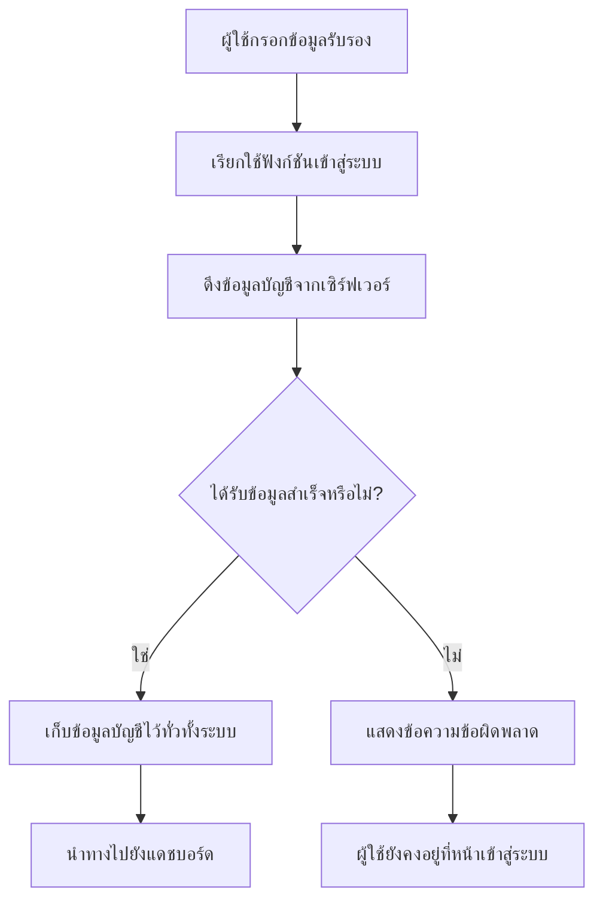
**เวลาลองใช้งาน:**
1. สร้างบัญชีใหม่เพื่อให้แน่ใจว่าทุกอย่างทำงาน
2. ลองเข้าสู่ระบบด้วยข้อมูลนั้น
3. ดูคอนโซลเบราว์เซอร์ (F12) ถ้ามีอะไรผิดปกติ
4. ตรวจสอบว่าคุณไปถึงแดชบอร์ดหลังเข้าสู่ระบบสำเร็จ

ถ้ามีอะไรไม่ทำงาน ไม่ต้องตกใจ! ส่วนใหญ่แก้ไขง่าย เช่น พิมพ์ผิดหรือไม่ได้เปิดเซิร์ฟเวอร์ API

#### คำอธิบายสั้นๆ เรื่อง Cross-Origin

คุณอาจสงสัยว่า: "แอปเว็บฉันพูดคุยกับเซิร์ฟเวอร์ API ได้ยังไงในเมื่อมันรันต่างพอร์ตกัน?" คำถามดี! นี่คือสิ่งที่นักพัฒนาเว็บทุกคนเจอในสักวัน

> 🔒 **ความปลอดภัยข้ามแหล่งที่มา**: เบราว์เซอร์บังคับใช้ "same-origin policy" เพื่อป้องกันการสื่อสารที่ไม่ได้รับอนุญาตระหว่างโดเมนต่างๆ เหมือนระบบตรวจสอบที่ Pentagon พวกเขาตรวจสอบว่าการสื่อสารได้รับอนุญาตก่อนอนุญาตให้ข้อมูลถูกส่ง
> 
**ในระบบของเรา:**
- แอปเว็บของคุณรันที่ `localhost:3000` (เซิร์ฟเวอร์พัฒนา)
- เซิร์ฟเวอร์ API รันที่ `localhost:5000` (เซิร์ฟเวอร์แบ็กเอนด์)
- เซิร์ฟเวอร์ API ใส่ [หัวข้อ CORS](https://developer.mozilla.org/docs/Web/HTTP/CORS) ที่อนุญาตการสื่อสารอย่างชัดเจนจากเว็บแอปของคุณ

การตั้งค่านี้เหมือนกับการพัฒนาในโลกจริงที่แอปฟรอนต์เอนด์และแบ็กเอนด์มักรันบนเซิร์ฟเวอร์แยกกัน

> 📚 **เรียนรู้เพิ่มเติม**: ดำดิ่งลึกใน API และการดึงข้อมูลด้วยบทเรียนครบถ้วนนี้จาก [Microsoft Learn โมดูล API](https://docs.microsoft.com/learn/modules/use-apis-discover-museum-art/?WT.mc_id=academic-77807-sagibbon)

## ส่งข้อมูลของคุณให้มีชีวิตใน HTML

ตอนนี้เราจะทำให้ข้อมูลที่ดึงมาแสดงผลแก่ผู้ใช้ผ่านการจัดการ DOM เหมือนกระบวนการล้างรูปในห้องมืด เรากำลังเปลี่ยนข้อมูลที่มองไม่เห็นให้กลายเป็นสิ่งที่ผู้ใช้เห็นและสามารถโต้ตอบได้
การจัดการ DOM คือเทคนิคที่เปลี่ยนหน้าเว็บแบบสแตติกให้เป็นแอปพลิเคชันไดนามิกที่อัปเดตเนื้อหาตามปฏิสัมพันธ์ของผู้ใช้และการตอบสนองจากเซิร์ฟเวอร์

### การเลือกเครื่องมือที่เหมาะสมกับงาน

เมื่อพูดถึงการอัปเดต HTML ด้วย JavaScript คุณมีตัวเลือกหลายอย่าง คิดเหมือนกับเครื่องมือต่าง ๆ ในกล่องเครื่องมือ – แต่ละอันเหมาะสมกับงานเฉพาะอย่าง:

| วิธี | ดีสำหรับอะไร | เมื่อไหร่ควรใช้ | ระดับความปลอดภัย |
|--------|---------------------|----------------|--------------|
| `textContent` | แสดงข้อมูลผู้ใช้อย่างปลอดภัย | ทุกครั้งที่แสดงข้อความ | ✅ แข็งแกร่งมั่นคง |
| `createElement()` + `append()` | สร้างเลย์เอาต์ซับซ้อน | สร้างส่วนหรือรายการใหม่ | ✅ ปลอดภัยสุด ๆ |
| `innerHTML` | ตั้งค่าเนื้อหา HTML | ⚠️ พยายามหลีกเลี่ยง | ❌ เสี่ยงสูง |

#### วิธีปลอดภัยในการแสดงข้อความ: textContent

คุณสมบัติ [`textContent`](https://developer.mozilla.org/docs/Web/API/Node/textContent) คือเพื่อนที่ดีที่สุดเมื่อแสดงข้อมูลผู้ใช้ มันเหมือนการมีบอดี้การ์ดให้เว็บเพจของคุณ – ไม่มีอะไรอันตรายผ่านเข้ามาได้:

```javascript
// วิธีที่ปลอดภัยและน่าเชื่อถือในการอัปเดตข้อความ
const balanceElement = document.getElementById('balance');
balanceElement.textContent = account.balance;
```

**ข้อดีของ textContent:**
- ถือทุกอย่างเป็นข้อความธรรมดา (ป้องกันการรันสคริปต์)
- ล้างเนื้อหาที่มีอยู่โดยอัตโนมัติ
- มีประสิทธิภาพสำหรับการอัปเดตข้อความเรียบง่าย
- มาพร้อมความปลอดภัยในตัวสำหรับเนื้อหาที่เป็นอันตราย

#### การสร้างองค์ประกอบ HTML ไดนามิก

สำหรับเนื้อหาที่ซับซ้อนมากขึ้น ให้ใช้ [`document.createElement()`](https://developer.mozilla.org/docs/Web/API/Document/createElement) ร่วมกับวิธี [`append()`](https://developer.mozilla.org/docs/Web/API/ParentNode/append):

```javascript
// วิธีที่ปลอดภัยในการสร้างองค์ประกอบใหม่
const transactionItem = document.createElement('div');
transactionItem.className = 'transaction-item';
transactionItem.textContent = `${transaction.date}: ${transaction.description}`;
container.append(transactionItem);
```

**เข้าใจวิธีนี้:**
- **สร้าง** องค์ประกอบ DOM ใหม่ด้วยโปรแกรม
- **ควบคุม** คุณสมบัติและเนื้อหาขององค์ประกอบอย่างเต็มที่
- **อนุญาต** โครงสร้างองค์ประกอบที่ซ้อนกันแบบซับซ้อน
- **รักษา** ความปลอดภัยโดยการแยกโครงสร้างออกจากเนื้อหา

> ⚠️ **ข้อควรระวังด้านความปลอดภัย**: ขณะที่ [`innerHTML`](https://developer.mozilla.org/docs/Web/API/Element/innerHTML) ปรากฏในบทเรียนจำนวนมาก แต่มันสามารถรันสคริปต์ที่ฝังมาได้ เหมือนกับระบบความปลอดภัยที่ CERN ที่ป้องกันการรันโค้ดไม่ได้รับอนุญาต การใช้ `textContent` และ `createElement` จึงเป็นทางเลือกที่ปลอดภัยกว่า
> 
**ความเสี่ยงของ innerHTML:**
- รันแท็ก `<script>` ใด ๆ ที่มากับข้อมูลผู้ใช้
- เสี่ยงต่อการโจมตีด้วยการฝังโค้ด
- สร้างช่องโหว่ด้านความปลอดภัย
- ทางเลือกที่ปลอดภัยกว่าที่เราใช้สามารถทำงานเทียบเท่าได้

### ทำให้ข้อผิดพลาดเป็นมิตรกับผู้ใช้

ปัจจุบันข้อผิดพลาดล็อกอินแสดงเฉพาะในคอนโซลของเบราว์เซอร์ซึ่งมองไม่เห็นสำหรับผู้ใช้ เหมือนกับความแตกต่างระหว่างการวินิจฉัยภายในของนักบินกับระบบข้อมูลผู้โดยสาร เราจำเป็นต้องสื่อสารข้อมูลสำคัญผ่านช่องทางที่เหมาะสม

การแสดงข้อความข้อผิดพลาดที่มองเห็นได้ช่วยให้ผู้ใช้ได้รับฟีดแบ็กทันทีเกี่ยวกับสิ่งที่ผิดพลาดและวิธีการดำเนินการต่อ

#### ขั้นตอนที่ 1: เพิ่มพื้นที่สำหรับข้อความข้อผิดพลาด

ก่อนอื่นให้เราเพิ่มพื้นที่สำหรับข้อความข้อผิดพลาดใน HTML ของคุณ ใส่ก่อนปุ่มล็อกอินเพื่อให้ผู้ใช้เห็นได้อย่างเป็นธรรมชาติ:

```html
<!-- This is where error messages will appear -->
<div id="loginError" role="alert"></div>
<button>Login</button>
```

**สิ่งที่เกิดขึ้นที่นี่:**
- สร้างพื้นที่ว่างที่มองไม่เห็นจนกว่าจะใช้งาน
- วางตำแหน่งที่ผู้ใช้มักมองหลังจากคลิก "Login"
- `role="alert"` เป็นประโยชน์สำหรับเครื่องอ่านหน้าจอ – บอกเทคโนโลยีช่วยเหลือว่า "นี่สำคัญ!"
- `id` เฉพาะช่วยให้ JavaScript ของเราเลือกได้ง่าย

#### ขั้นตอนที่ 2: สร้างฟังก์ชันช่วยเหลือ

มาทำฟังก์ชันยูทิลิตี้เล็ก ๆ ที่สามารถอัปเดตข้อความขององค์ประกอบได้ ฟังก์ชันนี้คือแบบ "เขียนครั้งเดียว ใช้ได้ทุกที่" ที่จะช่วยประหยัดเวลาให้คุณ:

```javascript
function updateElement(id, text) {
  const element = document.getElementById(id);
  element.textContent = text;
}
```

**ข้อดีของฟังก์ชัน:**
- อินเทอร์เฟซเรียบง่าย ต้องการแค่ ID ขององค์ประกอบและข้อความ
- ค้นหาและอัปเดต DOM อย่างปลอดภัย
- รูปแบบการใช้งานซ้ำลดการเขียนโค้ดซ้ำซ้อน
- รักษาพฤติกรรมการอัปเดตในแอปพลิเคชันให้สม่ำเสมอ

#### ขั้นตอนที่ 3: แสดงข้อผิดพลาดที่ผู้ใช้มองเห็นได้

ตอนนี้มาแทนที่ข้อความข้ามคอนโซลที่ซ่อนไว้ด้วยสิ่งที่ผู้ใช้เห็นได้จริง อัปเดตฟังก์ชันล็อกอินของคุณ:

```javascript
// แทนที่จะบันทึกแค่ไปที่คอนโซล ให้แสดงให้ผู้ใช้เห็นว่าเกิดอะไรผิดพลาดขึ้น
if (data.error) {
  return updateElement('loginError', data.error);
}
```

**การเปลี่ยนแปลงจิ๋วนี้สร้างความแตกต่างใหญ่:**
- ข้อความข้อผิดพลาดแสดงที่ที่ผู้ใช้มองอยู่
- ไม่มีความล้มเหลวเงียบที่ไม่ทราบสาเหตุอีกต่อไป
- ผู้ใช้ได้รับฟีดแบ็กแบบทันทีและทำตามได้
- แอปของคุณดูเป็นมืออาชีพและใส่ใจ

ตอนนี้เมื่อคุณทดสอบกับบัญชีไม่ถูกต้อง จะเห็นข้อความข้อผิดพลาดที่แสดงบนหน้าได้เลย!


#### ขั้นตอนที่ 4: ใส่ใจการเข้าถึง (Accessibility)

นี่คือสิ่งเจ๋งเกี่ยวกับ `role="alert"` ที่เราเพิ่มไปก่อนหน้านี้ – มันไม่ใช่แค่ประดับไว้เฉย ๆ! แอตทริบิวต์นี้สร้างสิ่งที่เรียกว่า [Live Region](https://developer.mozilla.org/docs/Web/Accessibility/ARIA/ARIA_Live_Regions) ที่ประกาศการเปลี่ยนแปลงทันทีสำหรับเครื่องอ่านหน้าจอ:

```html
<div id="loginError" role="alert"></div>
```

**ทำไมเรื่องนี้จึงสำคัญ:**
- ผู้ใช้เครื่องอ่านหน้าจอได้ยินข้อความข้อผิดพลาดทันทีที่มันปรากฏ
- ทุกคนได้รับข้อมูลสำคัญเหมือนกัน ไม่ว่าจะใช้งานอย่างไร
- เป็นวิธีง่าย ๆ ที่ทำให้แอปของคุณใช้งานได้กับคนจำนวนมากขึ้น
- แสดงให้เห็นว่าคุณใส่ใจสร้างประสบการณ์ที่ครอบคลุม

รายละเอียดเล็ก ๆ แบบนี้ช่วยแยกนักพัฒนาดีจากนักพัฒนาที่ยอดเยี่ยม!

### 🎯 ตรวจเช็คความเข้าใจ: รูปแบบการยืนยันตัวตน

**หยุดคิด**: คุณเพิ่งทำระบบยืนยันตัวตนสมบูรณ์ คุณลักษณะนี้เป็นรูปแบบพื้นฐานในเว็บ

**ประเมินตนเองอย่างรวดเร็ว**:
- คุณอธิบายได้ไหมว่าทำไมเราจึงใช้ async/await กับการเรียก API?
- จะเกิดอะไรถ้าเราลืมใช้ฟังก์ชัน `encodeURIComponent()`?
- การจัดการข้อผิดพลาดของเราช่วยปรับปรุงประสบการณ์ผู้ใช้อย่างไร?

**เชื่อมโยงสู่โลกจริง**: รูปแบบที่คุณเรียนรู้ที่นี่ (การดึงข้อมูลแบบ async, การจัดการข้อผิดพลาด, ฟีดแบ็กผู้ใช้) ใช้ในเว็บแอปพลิเคชันใหญ่ ๆ ทุกตัว ตั้งแต่แพลตฟอร์มโซเชียลมีเดียจนถึงเว็บไซต์อีคอมเมิร์ซ คุณกำลังสร้างทักษะระดับโปร!

**คำถามท้าทาย**: คุณจะปรับระบบยืนยันตัวตนนี้อย่างไรเพื่อรองรับผู้ใช้หลายบทบาท (ลูกค้า, ผู้ดูแลระบบ, พนักงานธนาคาร)? คิดถึงโครงสร้างข้อมูลและการเปลี่ยนแปลง UI ที่จำเป็น

#### ขั้นตอนที่ 5: ใช้รูปแบบเดียวกันกับการลงทะเบียน

เพื่อความสอดคล้อง ให้ทำการจัดการข้อผิดพลาดในฟอร์มลงทะเบียนเหมือนกัน:

1. **เพิ่ม** องค์ประกอบแสดงข้อผิดพลาดใน HTML ของฟอร์มลงทะเบียน:
```html
<div id="registerError" role="alert"></div>
```

2. **อัปเดต** ฟังก์ชัน register ให้ใช้รูปแบบแสดงข้อผิดพลาดเดียวกัน:
```javascript
if (data.error) {
  return updateElement('registerError', data.error);
}
```

**ข้อดีของการจัดการข้อผิดพลาดที่สม่ำเสมอ:**
- **ให้** ประสบการณ์ผู้ใช้สอดคล้องกันในทุกฟอร์ม
- **ลด** ภาระทางปัญญาด้วยการใช้รูปแบบที่คุ้นเคย
- **ทำให้ง่าย** ต่อการบำรุงรักษาด้วยโค้ดที่ใช้ซ้ำได้
- **รับรอง** มาตรฐานการเข้าถึงในแอปทั้งหมด

## การสร้างแดชบอร์ดไดนามิกของคุณ

ตอนนี้เราจะเปลี่ยนแดชบอร์ดสแตติกของคุณให้เป็นอินเทอร์เฟซไดนามิกที่แสดงข้อมูลบัญชีจริง เหมือนความแตกต่างระหว่างตารางเวลาบินพิมพ์ออกมาและจอแสดงเวลาบินแบบเรียลไทม์ที่สนามบิน เราจะย้ายจากข้อมูลสแตติกไปเป็นหน้าจอแสดงผลตอบสนองเวลาจริง

โดยใช้เทคนิคจัดการ DOM ที่คุณได้เรียนรู้ เราจะสร้างแดชบอร์ดที่อัปเดตโดยอัตโนมัติด้วยข้อมูลบัญชีปัจจุบัน

### ทำความรู้จักกับข้อมูลของคุณ

ก่อนเริ่มสร้าง ลองดูข้อมูลประเภทใดที่เซิร์ฟเวอร์ส่งกลับมา เมื่อใครบางคนล็อกอินสำเร็จ นี่คือสมบัติข้อมูลที่คุณจะได้ใช้:

```json
{
  "user": "test",
  "currency": "$",
  "description": "Test account",
  "balance": 75,
  "transactions": [
    { "id": "1", "date": "2020-10-01", "object": "Pocket money", "amount": 50 },
    { "id": "2", "date": "2020-10-03", "object": "Book", "amount": -10 },
    { "id": "3", "date": "2020-10-04", "object": "Sandwich", "amount": -5 }
  ]
}
```

**โครงสร้างข้อมูลนี้มีอะไรบ้าง:**
- **`user`**: เหมาะสำหรับการปรับแต่งประสบการณ์ ("ยินดีต้อนรับกลับมา, Sarah!")
- **`currency`**: ทำให้แน่ใจว่าแสดงจำนวนเงินถูกต้อง
- **`description`**: ชื่อที่เป็นมิตรสำหรับบัญชี
- **`balance`**: ยอดเงินปัจจุบันที่สำคัญสุด
- **`transactions`**: ประวัติธุรกรรมครบถ้วนพร้อมรายละเอียดทั้งหมด

ทุกอย่างที่จำเป็นสำหรับสร้างแดชบอร์ดธนาคารระดับมืออาชีพ!

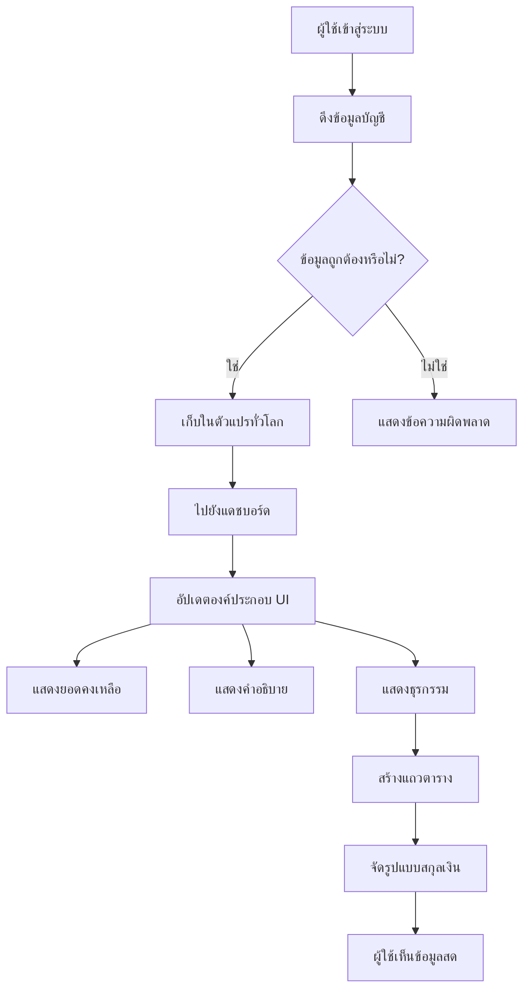
> 💡 **เคล็ดลับโปร**: อยากเห็นแดชบอร์ดของคุณทำงานทันทีหรือเปล่า? ใช้ชื่อผู้ใช้ `test` เมื่อเข้าสู่ระบบ – มันมาพร้อมข้อมูลตัวอย่างให้ดูข้อมูลทั้งหมดโดยไม่ต้องสร้างธุรกรรมก่อน
> 
**ทำไมบัญชีทดสอบถึงสะดวก:**
- มีข้อมูลตัวอย่างสมจริงติดมาแล้ว
- เหมาะสำหรับดูวิธีแสดงธุรกรรม
- ดีสำหรับทดสอบฟีเจอร์แดชบอร์ดของคุณ
- ช่วยให้คุณไม่ต้องสร้างข้อมูลปลอมเอง

### สร้างองค์ประกอบแสดงแดชบอร์ด

มาสร้างอินเทอร์เฟซแดชบอร์ดทีละขั้นตอน เริ่มจากสรุปข้อมูลบัญชีแล้วค่อยไปส่วนซับซ้อน เช่น รายการธุรกรรม

#### ขั้นตอนที่ 1: อัปเดตโครงสร้าง HTML ของคุณ

ก่อนอื่นแทนที่ส่วน "Balance" แบบสแตติกด้วยอิลิเมนต์ตัวแทนแบบไดนามิกที่ JavaScript เติมข้อมูลได้:

```html
<section>
  Balance: <span id="balance"></span><span id="currency"></span>
</section>
```

จากนั้นเพิ่มส่วนสำหรับคำอธิบายบัญชี เนื่องจากนี่ทำหน้าที่เหมือนหัวข้อของเนื้อหาแดชบอร์ด ให้ใช้ HTML เชิงความหมาย:

```html
<h2 id="description"></h2>
```

**เข้าใจโครงสร้าง HTML:**
- **ใช้** อิลิเมนต์ `<span>` แยกสำหรับยอดเงินและสกุลเงิน เพื่อควบคุมแต่ละส่วน
- **ใช้** ID เฉพาะกับแต่ละองค์ประกอบเพื่อให้ JavaScript เลือกได้ง่าย
- **ตาม** HTML เชิงความหมายด้วย `<h2>` สำหรับคำอธิบายบัญชี
- **สร้าง** ลำดับชั้นตรรกะสำหรับเครื่องอ่านหน้าจอและ SEO

> ✅ **คำแนะนำด้านการเข้าถึง**: คำอธิบายบัญชีทำหน้าที่เป็นหัวข้อเนื้อหาของแดชบอร์ด ดังนั้นจึงทำเครื่องหมายเชิงความหมายเป็นหัวข้อ เรียนรู้เพิ่มเติมเกี่ยวกับ [โครงสร้างหัวข้อ](https://www.nomensa.com/blog/2017/how-structure-headings-web-accessibility) ที่ส่งผลต่อการเข้าถึง คุณสามารถระบุองค์ประกอบอื่นในหน้าที่อาจได้ประโยชน์จากแท็กหัวข้อได้หรือไม่?

#### ขั้นตอนที่ 2: สร้างฟังก์ชันอัปเดตแดชบอร์ด

ตอนนี้สร้างฟังก์ชันที่เติมแดชบอร์ดด้วยข้อมูลบัญชีจริง:

```javascript
function updateDashboard() {
  if (!account) {
    return navigate('/login');
  }

  updateElement('description', account.description);
  updateElement('balance', account.balance.toFixed(2));
  updateElement('currency', account.currency);
}
```

**ขั้นตอนทำงานของฟังก์ชันนี้:**
- **ตรวจสอบ** ว่ามีข้อมูลบัญชีก่อนดำเนินการต่อ
- **เปลี่ยนเส้นทาง** ผู้ใช้ที่ยังไม่ล็อกอินกลับไปหน้าเข้าสู่ระบบ
- **อัปเดต** คำอธิบายบัญชีโดยใช้ฟังก์ชัน `updateElement` ที่นำกลับมาใช้ใหม่ได้
- **จัดรูปแบบ** ยอดเงินให้แสดงทศนิยมสองตำแหน่ง
- **แสดง** สัญลักษณ์สกุลเงินที่เหมาะสม

> 💰 **การจัดรูปแบบเงิน**: วิธี [`toFixed(2)`](https://developer.mozilla.org/docs/Web/JavaScript/Reference/Global_Objects/Number/toFixed) เป็นตัวช่วยชีวิต! ทำให้ยอดเงินของคุณดูเหมือนเงินจริงเสมอ – "75.00" แทนที่จะเป็นแค่ "75" ผู้ใช้จะชื่นชอบการเห็นสกุลเงินที่คุ้นเคย

#### ขั้นตอนที่ 3: ทำให้แน่ใจว่าแดชบอร์ดอัปเดต

เพื่อให้แดชบอร์ดรีเฟรชข้อมูลทุกครั้งที่ผู้ใช้เข้าชม เราต้องเชื่อมต่อกับระบบจัดการเส้นทาง ถ้าคุณทำ [แบบฝึกหัดบทเรียน 1](../1-template-route/assignment.md) แล้ว นี่ควรคุ้นเคย หากไม่ก็ไม่ต้องกังวล นี่คือสิ่งที่คุณต้องทำ:

เพิ่มโค้ดนี้ที่ท้ายฟังก์ชัน `updateRoute()` ของคุณ:

```javascript
if (typeof route.init === 'function') {
  route.init();
}
```

แล้วอัปเดตเส้นทางเพื่อรวมการเริ่มต้นแดชบอร์ด:

```javascript
const routes = {
  '/login': { templateId: 'login' },
  '/dashboard': { templateId: 'dashboard', init: updateDashboard }
};
```

**การตั้งค่านี้ทำงานอย่างไร:**
- ตรวจสอบว่าเส้นทางมีโค้ดเริ่มต้นพิเศษหรือไม่
- รันโค้ดนั้นโดยอัตโนมัติเมื่อโหลดเส้นทาง
- ทำให้แดชบอร์ดแสดงข้อมูลใหม่ล่าสุดเสมอ
- รักษาเหตุผลการกำหนดเส้นทางให้สะอาดและเป็นระบบ

#### ทดสอบแดชบอร์ดของคุณ

หลังจากทำการเปลี่ยนแปลงนี้ ทดสอบแดชบอร์ดของคุณ:

1. **ล็อกอิน** ด้วยบัญชีทดสอบ
2. **ตรวจสอบ** ว่าคุณถูกเปลี่ยนไปแดชบอร์ด
3. **เช็ค** คำอธิบายบัญชี ยอดเงิน และสกุลเงินแสดงถูกต้อง
4. **ลองออกจากระบบและล็อกอินอีกครั้ง** เพื่อให้แน่ใจว่าข้อมูลรีเฟรชถูกต้อง

แดชบอร์ดของคุณควรแสดงข้อมูลบัญชีไดนามิกที่อัปเดตตามผู้ใช้ที่ล็อกอินแล้ว!

## สร้างรายการธุรกรรมอัจฉริยะด้วยเทมเพลต

แทนที่จะสร้าง HTML สำหรับแต่ละธุรกรรมด้วยมือ เราจะใช้เทมเพลตเพื่อสร้างฟอร์แมตที่สม่ำเสมอโดยอัตโนมัติ เหมือนชิ้นส่วนมาตรฐานที่ใช้ในการผลิตยานอวกาศ เทมเพลตช่วยให้แต่ละแถวธุรกรรมมีโครงสร้างและลักษณะที่เหมือนกัน

เทคนิคนี้ขยายขนาดได้อย่างมีประสิทธิภาพตั้งแต่ธุรกรรมไม่กี่รายการจนถึงหลายพันรายการโดยรักษาประสิทธิภาพและการนำเสนอที่สม่ำเสมอ

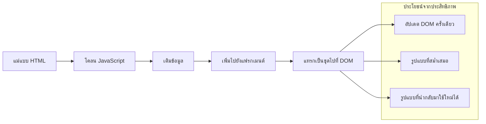

### ขั้นตอนที่ 1: สร้างเทมเพลตรายการธุรกรรม

ก่อนอื่น เพิ่มเทมเพลตที่นำกลับมาใช้ใหม่สำหรับแถวรายการธุรกรรมใน `<body>` ของ HTML:

```html
<template id="transaction">
  <tr>
    <td></td>
    <td></td>
    <td></td>
  </tr>
</template>
```

**เข้าใจเทมเพลต HTML:**
- **กำหนด** โครงสร้างของแถวตารางหนึ่งแถว
- **มองไม่เห็น** จนกว่าจะถูกโคลนและเติมข้อมูลด้วย JavaScript
- **รวม** เซลล์สามช่องสำหรับวันที่ คำอธิบาย และจำนวนเงิน
- **ให้** รูปแบบที่ใช้ซ้ำสำหรับความสม่ำเสมอในการจัดรูปแบบ

### ขั้นตอนที่ 2: เตรียมตารางสำหรับเนื้อหาไดนามิก

ต่อมาเพิ่ม `id` ให้กับ `<tbody>` ของตาราง เพื่อให้ JavaScript เลือกเป้าหมายได้ง่าย:

```html
<tbody id="transactions"></tbody>
```

**สิ่งนี้ช่วยทำอะไร:**
- **สร้าง** จุดชัดเจนสำหรับแทรกแถวธุรกรรม
- **แยก** โครงสร้างตารางออกจากเนื้อหาไดนามิก
- **ทำให้** เคลียร์และเติมข้อมูลธุรกรรมใหม่ง่ายขึ้น

### ขั้นตอนที่ 3: สร้างฟังก์ชันโรงงานแถวธุรกรรม

ตอนนี้สร้างฟังก์ชันที่แปลงข้อมูลธุรกรรมเป็นองค์ประกอบ HTML:

```javascript
function createTransactionRow(transaction) {
  const template = document.getElementById('transaction');
  const transactionRow = template.content.cloneNode(true);
  const tr = transactionRow.querySelector('tr');
  tr.children[0].textContent = transaction.date;
  tr.children[1].textContent = transaction.object;
  tr.children[2].textContent = transaction.amount.toFixed(2);
  return transactionRow;
}
```

**แยกส่วนฟังก์ชันโรงงานนี้:**
- **รับ** อิลิเมนต์เทมเพลตตาม ID
- **โคลน** เนื้อหาเทมเพลตเพื่อการจัดการที่ปลอดภัย
- **เลือก** แถวตารางภายในเนื้อหาโคลน
- **เติม** เซลล์แต่ละช่องด้วยข้อมูลธุรกรรม
- **จัดรูปแบบ** จำนวนเงินให้แสดงทศนิยมอย่างถูกต้อง
- **คืนค่า** แถวที่สมบูรณ์พร้อมสำหรับแทรก

### ขั้นตอนที่ 4: สร้างหลายแถวธุรกรรมอย่างมีประสิทธิภาพ

เพิ่มโค้ดนี้ในฟังก์ชัน `updateDashboard()` เพื่อแสดงธุรกรรมทั้งหมด:

```javascript
const transactionsRows = document.createDocumentFragment();
for (const transaction of account.transactions) {
  const transactionRow = createTransactionRow(transaction);
  transactionsRows.appendChild(transactionRow);
}
updateElement('transactions', transactionsRows);
```

**เข้าใจแนวทางที่มีประสิทธิภาพนี้:**
- **สร้าง** เอกสารแฟรกเมนต์สำหรับดำเนินการ DOM แบบกลุ่ม
- **วนลูป** ธุรกรรมทั้งหมดในข้อมูลบัญชี
- **สร้าง** แถวสำหรับแต่ละธุรกรรมโดยใช้ฟังก์ชันโรงงาน
- **รวบรวม** แถวทั้งหมดในแฟรกเมนต์ก่อนเพิ่มเข้ากับ DOM
- **ทำการอัปเดต DOM เพียงครั้งเดียว แทนที่จะเป็นการแทรกทีละรายการหลายครั้ง**
> ⚡ **การเพิ่มประสิทธิภาพการทำงาน**: [`document.createDocumentFragment()`](https://developer.mozilla.org/docs/Web/API/Document/createDocumentFragment) ทำงานเหมือนกระบวนการประกอบที่ Boeing — ชิ้นส่วนจะถูกเตรียมล่วงหน้าแยกจากสายการผลิตหลัก จากนั้นจึงติดตั้งเป็นหน่วยสมบูรณ์ วิธีการทำงานแบบแบตช์นี้ช่วยลดการรีเฟลกซ์ DOM โดยการแทรกครั้งเดียวแทนที่จะเป็นหลายๆ การดำเนินการแยกกัน

### ขั้นตอนที่ 5: ปรับปรุงฟังก์ชันอัปเดตสำหรับเนื้อหาผสม

ฟังก์ชัน `updateElement()` ของคุณในตอนนี้จัดการเฉพาะเนื้อหาข้อความเท่านั้น ปรับปรุงให้รองรับทั้งข้อความและโหนด DOM:

```javascript
function updateElement(id, textOrNode) {
  const element = document.getElementById(id);
  element.textContent = ''; // ลบลูกทั้งหมด
  element.append(textOrNode);
}
```

**การปรับปรุงที่สำคัญในอัปเดตนี้:**
- **ล้าง** เนื้อหาที่มีอยู่ก่อนเพิ่มเนื้อหาใหม่
- **รับ** พารามิเตอร์เป็นสตริงข้อความหรือโหนด DOM
- **ใช้** เมธอด [`append()`](https://developer.mozilla.org/docs/Web/API/ParentNode/append) เพื่อความยืดหยุ่น
- **คงไว้ซึ่ง** ความเข้ากันได้ย้อนหลังกับการใช้งานแบบข้อความเดิม

### ลองใช้แดชบอร์ดของคุณ

ถึงเวลาลองของจริงแล้ว! มาดูแดชบอร์ดไดนามิกของคุณทำงานกัน:

1. เข้าสู่ระบบด้วยบัญชี `test` (ซึ่งมีข้อมูลตัวอย่างพร้อมใช้งาน)
2. ไปที่แดชบอร์ดของคุณ
3. ตรวจสอบแถวธุรกรรมว่าปรากฏพร้อมรูปแบบที่ถูกต้อง
4. ตรวจสอบวันที่ คำอธิบาย และจำนวนเงินให้ดูถูกต้อง

ถ้าทุกอย่างทำงานถูกต้อง คุณจะเห็นรายการธุรกรรมที่ทำงานได้เต็มรูปแบบบนแดชบอร์ดของคุณ! 🎉

**สิ่งที่คุณทำสำเร็จ:**
- สร้างแดชบอร์ดที่ปรับขนาดได้ตามปริมาณข้อมูล
- สร้างแม่แบบใช้งานซ้ำเพื่อความคงที่ของรูปแบบ
- นำเทคนิคการจัดการ DOM ที่มีประสิทธิภาพมาใช้
- พัฒนาฟังก์ชันที่เทียบเท่ากับแอปธนาคารในระบบการผลิต

คุณได้เปลี่ยนเว็บเพจที่คงที่ให้กลายเป็นแอปเว็บไดนามิกสำเร็จแล้ว

### 🎯 การตรวจสอบเชิงการสอน: การสร้างเนื้อหาไดนามิก

**ความเข้าใจสถาปัตยกรรม**: คุณได้ใช้สายงานการแปลงข้อมูลเป็น UI ที่ซับซ้อนซึ่งเลียนแบบรูปแบบที่ใช้ในเฟรมเวิร์กอย่าง React, Vue และ Angular

**แนวคิดสำคัญที่เชี่ยวชาญ:**
- **การเรนเดอร์ตามแม่แบบ**: การสร้างส่วนประกอบ UI ที่ใช้งานซ้ำได้
- **เอกสารแฟรกเมนต์**: การเพิ่มประสิทธิภาพ DOM
- **การจัดการ DOM อย่างปลอดภัย**: ป้องกันช่องโหว่ด้านความปลอดภัย
- **การแปลงข้อมูล**: การเปลี่ยนข้อมูลเซิร์ฟเวอร์เป็นอินเตอร์เฟสผู้ใช้

**การเชื่อมต่ออุตสาหกรรม**: เทคนิคเหล่านี้เป็นพื้นฐานของเฟรมเวิร์ก frontend สมัยใหม่ทั้งหมด React มี virtual DOM, Vue มีระบบแม่แบบ และ Angular มีสถาปัตยกรรมคอมโพเนนต์ ซึ่งทั้งหมดสร้างบนแนวคิดหลักเหล่านี้

**คำถามให้คิด**: คุณจะขยายระบบนี้อย่างไรเพื่อจัดการกับการอัปเดตแบบเรียลไทม์ (เช่น ธุรกรรมใหม่ที่ปรากฏโดยอัตโนมัติ)? ลองพิจารณาใช้ WebSockets หรือ Server-Sent Events

---

## 📈 ไทม์ไลน์ความชำนาญในการจัดการข้อมูลของคุณ

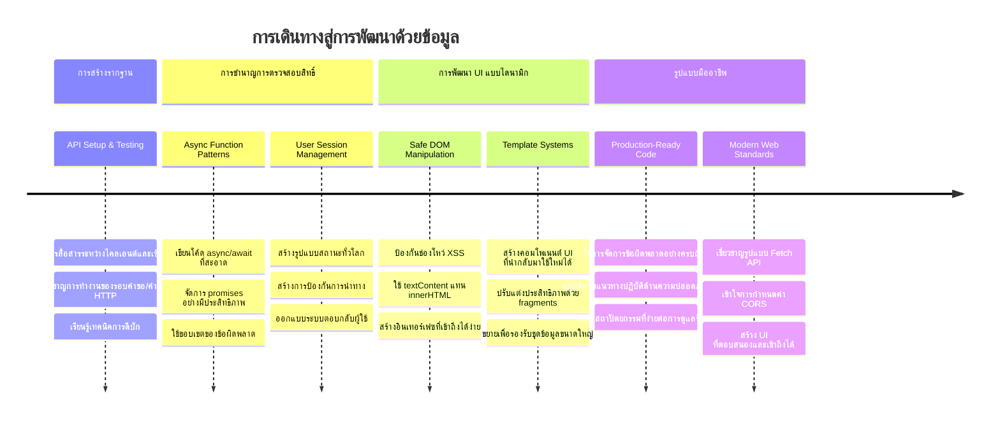
**🎓 เกณฑ์สำเร็จการอบรม**: คุณประสบความสำเร็จในการสร้างเว็บแอปพลิเคชันที่ขับเคลื่อนด้วยข้อมูลโดยใช้รูปแบบ JavaScript สมัยใหม่ ทักษะเหล่านี้สามารถนำไปใช้กับเฟรมเวิร์กอย่าง React, Vue หรือ Angular ได้โดยตรง

**🔄 ความสามารถขั้นถัดไป**:
- พร้อมสำรวจเฟรมเวิร์ก frontend ที่สร้างบนแนวคิดเหล่านี้
- พร้อมพัฒนาฟีเจอร์เรียลไทม์ด้วย WebSockets
- มีเครื่องมือสร้าง Progressive Web Apps ที่ทำงานออฟไลน์ได้
- มีพื้นฐานสำหรับเรียนรู้รูปแบบการจัดการสเตตขั้นสูง

## ความท้าทาย GitHub Copilot Agent 🚀

ใช้โหมด Agent เพื่อแก้โจทย์ความท้าทายดังนี้:

**คำอธิบาย:** พัฒนาแอปธนาคารด้วยการเพิ่มฟีเจอร์ค้นหาและกรองธุรกรรมที่ช่วยให้ผู้ใช้ค้นหาธุรกรรมเฉพาะตามช่วงวันที่ จำนวนเงิน หรือคำอธิบาย

**คำแนะนำ:** สร้างฟังก์ชันค้นหาสำหรับแอปธนาคารที่รวม: 1) แบบฟอร์มค้นหาพร้อมช่องป้อนข้อมูลสำหรับช่วงวันที่ (จาก/ถึง), ยอดขั้นต่ำ/สูงสุด, และคำสำคัญในคำอธิบายธุรกรรม, 2) ฟังก์ชัน `filterTransactions()` ที่กรองอาร์เรย์ account.transactions ตามเกณฑ์ค้นหา, 3) อัปเดตฟังก์ชัน `updateDashboard()` เพื่อนำเสนอผลลัพธ์ที่กรองแล้ว, และ 4) เพิ่มปุ่ม "ล้างตัวกรอง" เพื่อรีเซ็ตการแสดงผล ใช้วิธีการอาร์เรย์ JavaScript สมัยใหม่เช่น `filter()` และจัดการกรณีขอบเขตของเกณฑ์ค้นหาว่างเปล่า

เรียนรู้เพิ่มเติมเกี่ยวกับ [โหมด agent](https://code.visualstudio.com/blogs/2025/02/24/introducing-copilot-agent-mode) ที่นี่

## 🚀 ความท้าทาย

พร้อมยกระดับแอปธนาคารของคุณหรือยัง? มาทำให้มันดูดีและรู้สึกใช้งานได้จริงกันเถอะ นี่คือไอเดียบางอย่างเพื่อกระตุ้นความคิดสร้างสรรค์:

**ทำให้สวยงาม**: เพิ่มสไตล์ CSS เพื่อเปลี่ยนแดชบอร์ดที่ใช้งานได้เป็นสิ่งที่ดูน่าดึงดูดใจ เช่น เส้นที่สะอาด ระยะห่างที่ดี และอาจจะมีแอนิเมชันเบาๆ

**ทำให้ตอบสนอง**: ทดลองใช้ [media queries](https://developer.mozilla.org/docs/Web/CSS/Media_Queries) เพื่อสร้าง [responsive design](https://developer.mozilla.org/docs/Web/Progressive_web_apps/Responsive/responsive_design_building_blocks) ที่ใช้งานได้ดีบนโทรศัพท์ แท็บเล็ต และเดสก์ท็อป ผู้ใช้ของคุณจะขอบคุณ

**เพิ่มลูกเล่น**: พิจารณาการใช้สีแยกประเภทธุรกรรม (สีเขียวสำหรับรายรับ สีแดงสำหรับรายจ่าย) เพิ่มไอคอน หรือสร้างเอฟเฟกต์โฮเวอร์ที่ทำให้หน้าตาดูน่าสนใจมากขึ้น

นี่คือตัวอย่างของแดชบอร์ดที่ผ่านการตกแต่งแล้ว:

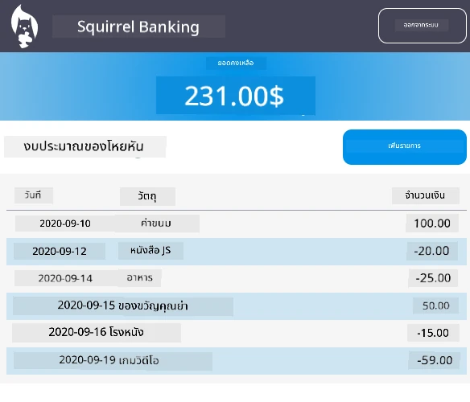

ไม่ต้องรู้สึกว่าต้องทำตามนี้เป๊ะๆ ใช้มันเป็นแรงบันดาลใจและปรับแต่งให้เป็นของคุณเอง!

## แบบทดสอบหลังบรรยาย

[แบบทดสอบหลังบรรยาย](https://ff-quizzes.netlify.app/web/quiz/46)

## การบ้าน

[ปรับโครงสร้างและคอมเมนต์โค้ดของคุณ](assignment.md)

---

<!-- CO-OP TRANSLATOR DISCLAIMER START -->
**ข้อจำกัดความรับผิดชอบ**:  
เอกสารฉบับนี้ได้รับการแปลโดยใช้บริการแปลภาษา AI [Co-op Translator](https://github.com/Azure/co-op-translator) แม้เราจะพยายามให้ความถูกต้องสูงสุด แต่โปรดทราบว่าการแปลอัตโนมัติอาจมีข้อผิดพลาดหรือความไม่ถูกต้อง เอกสารต้นฉบับในภาษาต้นฉบับควรถูกพิจารณาเป็นแหล่งข้อมูลที่เชื่อถือได้ สำหรับข้อมูลที่สำคัญ ขอแนะนำให้ใช้บริการแปลโดยผู้เชี่ยวชาญด้านมนุษย์ เราจะไม่รับผิดชอบต่อความเข้าใจผิดหรือการตีความผิดใดๆ ที่เกิดจากการใช้การแปลนี้
<!-- CO-OP TRANSLATOR DISCLAIMER END -->