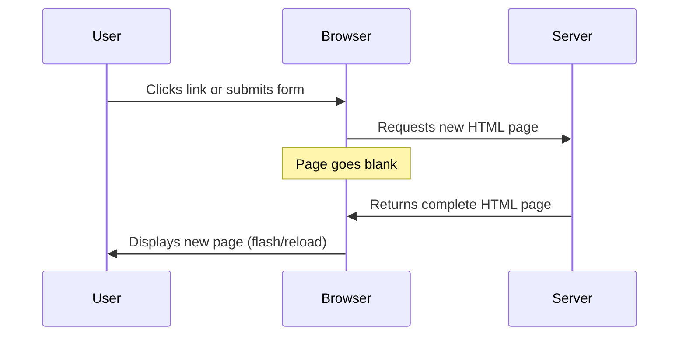
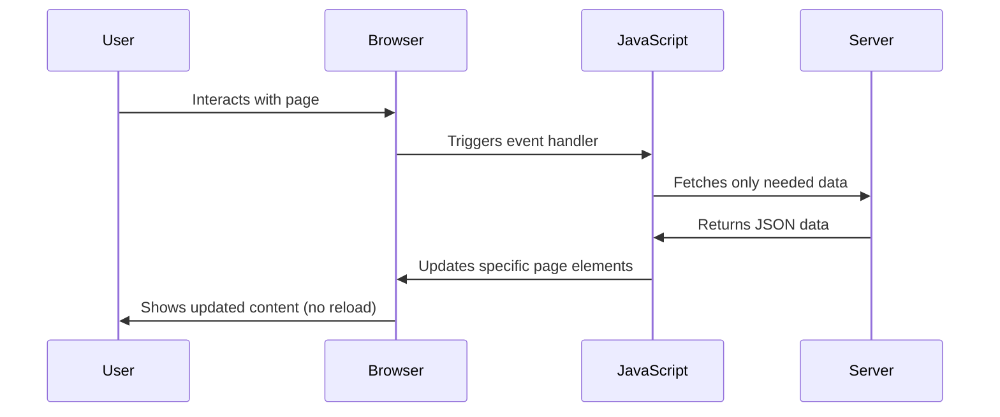
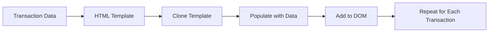

<!--
CO_OP_TRANSLATOR_METADATA:
{
  "original_hash": "2c1164912414820c8efd699b43f64954",
  "translation_date": "2025-10-23T21:09:30+00:00",
  "source_file": "7-bank-project/3-data/README.md",
  "language_code": "th"
}
-->
# สร้างแอปธนาคาร ตอนที่ 3: วิธีการดึงและใช้งานข้อมูล

ลองนึกถึงคอมพิวเตอร์ของ Enterprise ใน Star Trek - เมื่อกัปตัน Picard ขอข้อมูลสถานะของยาน ข้อมูลจะปรากฏขึ้นทันทีโดยที่อินเทอร์เฟซไม่ต้องปิดและสร้างใหม่ทั้งหมด การไหลลื่นของข้อมูลแบบนี้คือสิ่งที่เรากำลังสร้างด้วยการดึงข้อมูลแบบไดนามิก

ตอนนี้แอปธนาคารของคุณเหมือนกับหนังสือพิมพ์ที่พิมพ์ออกมา - มีข้อมูลแต่ไม่เปลี่ยนแปลง เราจะเปลี่ยนมันให้เป็นเหมือนศูนย์ควบคุมภารกิจของ NASA ที่ข้อมูลไหลเวียนอย่างต่อเนื่องและอัปเดตแบบเรียลไทม์โดยไม่รบกวนการทำงานของผู้ใช้

คุณจะได้เรียนรู้วิธีการสื่อสารกับเซิร์ฟเวอร์แบบอะซิงโครนัส จัดการข้อมูลที่มาถึงในเวลาต่างกัน และเปลี่ยนข้อมูลดิบให้เป็นสิ่งที่มีความหมายสำหรับผู้ใช้ นี่คือความแตกต่างระหว่างการสาธิตและซอฟต์แวร์ที่พร้อมใช้งานจริง

## แบบทดสอบก่อนเรียน

[แบบทดสอบก่อนเรียน](https://ff-quizzes.netlify.app/web/quiz/45)

### สิ่งที่ต้องเตรียมก่อนเริ่ม

ก่อนที่จะเริ่มต้นการดึงข้อมูล ให้แน่ใจว่าคุณมีสิ่งเหล่านี้พร้อม:

- **บทเรียนก่อนหน้า**: ทำแบบฟอร์ม [เข้าสู่ระบบและลงทะเบียน](../2-forms/README.md) ให้เสร็จ - เราจะใช้เป็นพื้นฐานในการสร้าง
- **เซิร์ฟเวอร์ในเครื่อง**: ติดตั้ง [Node.js](https://nodejs.org) และ [เรียกใช้ API เซิร์ฟเวอร์](../api/README.md) เพื่อให้ข้อมูลบัญชี
- **การเชื่อมต่อ API**: ทดสอบการเชื่อมต่อเซิร์ฟเวอร์ของคุณด้วยคำสั่งนี้:

```bash
curl http://localhost:5000/api
# Expected response: "Bank API v1.0.0"
```

การทดสอบอย่างรวดเร็วนี้ช่วยให้มั่นใจว่าทุกองค์ประกอบสามารถสื่อสารกันได้อย่างถูกต้อง:
- ตรวจสอบว่า Node.js ทำงานได้อย่างถูกต้องในระบบของคุณ
- ยืนยันว่าเซิร์ฟเวอร์ API ของคุณทำงานและตอบสนอง
- ตรวจสอบว่าแอปของคุณสามารถเข้าถึงเซิร์ฟเวอร์ได้ (เหมือนการตรวจสอบการติดต่อวิทยุก่อนเริ่มภารกิจ)

---

## การทำความเข้าใจการดึงข้อมูลในแอปเว็บสมัยใหม่

วิธีที่แอปพลิเคชันเว็บจัดการข้อมูลได้พัฒนาขึ้นอย่างมากในช่วงสองทศวรรษที่ผ่านมา การทำความเข้าใจวิวัฒนาการนี้จะช่วยให้คุณเข้าใจว่าทำไมเทคนิคสมัยใหม่อย่าง AJAX และ Fetch API ถึงมีประสิทธิภาพและกลายเป็นเครื่องมือสำคัญสำหรับนักพัฒนาเว็บ

มาสำรวจดูว่าการทำงานของเว็บไซต์แบบดั้งเดิมแตกต่างจากแอปพลิเคชันที่ตอบสนองและไดนามิกในปัจจุบันอย่างไร

### แอปพลิเคชันแบบหลายหน้า (MPA)

ในยุคแรกของเว็บ ทุกครั้งที่คลิกเหมือนกับการเปลี่ยนช่องบนโทรทัศน์เก่า - หน้าจอจะว่างเปล่า แล้วค่อยๆ ปรับเข้าสู่เนื้อหาใหม่ นี่คือความจริงของแอปพลิเคชันเว็บในยุคแรก ที่ทุกการโต้ตอบหมายถึงการสร้างหน้าใหม่ทั้งหมดจากศูนย์




**ทำไมวิธีนี้ถึงดูไม่ราบรื่น:**
- ทุกครั้งที่คลิกหมายถึงการสร้างหน้าใหม่ทั้งหมด
- ผู้ใช้ถูกขัดจังหวะกลางความคิดด้วยการกระพริบหน้าจอที่น่ารำคาญ
- การเชื่อมต่ออินเทอร์เน็ตทำงานหนักเพื่อดาวน์โหลดส่วนหัวและส่วนท้ายซ้ำๆ
- แอปพลิเคชันรู้สึกเหมือนการค้นหาเอกสารในตู้เก็บเอกสารมากกว่าการใช้ซอฟต์แวร์

### แอปพลิเคชันแบบหน้าเดียว (SPA)

AJAX (Asynchronous JavaScript and XML) เปลี่ยนแปลงรูปแบบนี้ไปอย่างสิ้นเชิง เหมือนกับการออกแบบแบบโมดูลของสถานีอวกาศนานาชาติ ที่นักบินอวกาศสามารถเปลี่ยนส่วนประกอบแต่ละส่วนได้โดยไม่ต้องสร้างโครงสร้างทั้งหมดใหม่ AJAX ช่วยให้เราสามารถอัปเดตส่วนเฉพาะของหน้าเว็บได้โดยไม่ต้องโหลดใหม่ทั้งหมด แม้ว่าชื่อจะกล่าวถึง XML แต่ปัจจุบันเราใช้ JSON เป็นหลัก แต่หลักการสำคัญยังคงเหมือนเดิม: อัปเดตเฉพาะสิ่งที่ต้องเปลี่ยนแปลง




**ทำไม SPA ถึงดีกว่า:**
- อัปเดตเฉพาะส่วนที่เปลี่ยนแปลงจริงๆ (ฉลาดใช่ไหม?)
- ไม่มีการขัดจังหวะที่น่ารำคาญ - ผู้ใช้สามารถทำงานต่อได้อย่างต่อเนื่อง
- ข้อมูลที่เดินทางผ่านเครือข่ายน้อยลง หมายถึงการโหลดที่เร็วขึ้น
- ทุกอย่างรู้สึกเร็วและตอบสนองได้ดี เหมือนแอปบนมือถือของคุณ

### การพัฒนาไปสู่ Fetch API สมัยใหม่

เบราว์เซอร์สมัยใหม่มี [`Fetch` API](https://developer.mozilla.org/docs/Web/API/Fetch_API) ซึ่งแทนที่ [`XMLHttpRequest`](https://developer.mozilla.org/docs/Web/API/XMLHttpRequest/Using_XMLHttpRequest) แบบเก่า เหมือนกับความแตกต่างระหว่างการใช้โทรเลขและการใช้อีเมล Fetch API ใช้ promises เพื่อเขียนโค้ดอะซิงโครนัสที่สะอาดขึ้นและจัดการ JSON ได้อย่างเป็นธรรมชาติ

| คุณสมบัติ | XMLHttpRequest | Fetch API |
|-----------|----------------|-----------|
| **ไวยากรณ์** | ใช้ callback ที่ซับซ้อน | ใช้ promises ที่สะอาด |
| **การจัดการ JSON** | ต้องแปลงด้วยตนเอง | มี `.json()` ในตัว |
| **การจัดการข้อผิดพลาด** | ข้อมูลข้อผิดพลาดจำกัด | รายละเอียดข้อผิดพลาดครบถ้วน |
| **การสนับสนุนสมัยใหม่** | รองรับแบบเก่า | ใช้ promises และ async/await ของ ES6+ |

> 💡 **ความเข้ากันได้ของเบราว์เซอร์**: ข่าวดี - Fetch API ใช้งานได้ในเบราว์เซอร์สมัยใหม่ทั้งหมด! หากคุณอยากรู้เกี่ยวกับเวอร์ชันเฉพาะ [caniuse.com](https://caniuse.com/fetch) มีข้อมูลความเข้ากันได้ครบถ้วน
> 
**สรุป:**
- ใช้งานได้ดีใน Chrome, Firefox, Safari และ Edge (พื้นฐานที่ผู้ใช้ของคุณอยู่)
- Internet Explorer เท่านั้นที่ต้องการความช่วยเหลือเพิ่มเติม (และจริงๆ ถึงเวลาปล่อย IE ไปแล้ว)
- เตรียมพร้อมสำหรับรูปแบบ async/await ที่สง่างามที่เราจะใช้ในภายหลัง

### การสร้างระบบเข้าสู่ระบบและการดึงข้อมูลบัญชี

ตอนนี้เรามาสร้างระบบเข้าสู่ระบบที่เปลี่ยนแอปธนาคารของคุณจากการแสดงผลแบบคงที่ไปเป็นแอปพลิเคชันที่ใช้งานได้จริง เหมือนกับโปรโตคอลการตรวจสอบสิทธิ์ที่ใช้ในสถานที่ปลอดภัยของทหาร เราจะตรวจสอบข้อมูลรับรองของผู้ใช้และให้สิทธิ์เข้าถึงข้อมูลเฉพาะของพวกเขา

เราจะสร้างสิ่งนี้ทีละขั้นตอน โดยเริ่มจากการตรวจสอบสิทธิ์พื้นฐานและเพิ่มความสามารถในการดึงข้อมูล

#### ขั้นตอนที่ 1: สร้างฟังก์ชันพื้นฐานสำหรับการเข้าสู่ระบบ

เปิดไฟล์ `app.js` ของคุณและเพิ่มฟังก์ชัน `login` ใหม่ ฟังก์ชันนี้จะจัดการกระบวนการตรวจสอบสิทธิ์ของผู้ใช้:

```javascript
async function login() {
  const loginForm = document.getElementById('loginForm');
  const user = loginForm.user.value;
}
```

**มาดูรายละเอียดกัน:**
- คำว่า `async`? มันบอก JavaScript ว่า "เฮ้ ฟังก์ชันนี้อาจต้องรออะไรบางอย่าง"
- เรากำลังดึงฟอร์มจากหน้า (แค่หาโดยใช้ ID)
- จากนั้นเราก็ดึงข้อมูลที่ผู้ใช้พิมพ์เป็นชื่อผู้ใช้
- นี่คือเคล็ดลับที่ดี: คุณสามารถเข้าถึงอินพุตของฟอร์มใดๆ โดยใช้แอตทริบิวต์ `name` - ไม่ต้องใช้ getElementById เพิ่มเติม!

> 💡 **รูปแบบการเข้าถึงฟอร์ม**: ทุกการควบคุมฟอร์มสามารถเข้าถึงได้โดยใช้ชื่อ (ตั้งค่าใน HTML ด้วยแอตทริบิวต์ `name`) เป็น property ของ element ฟอร์ม ซึ่งให้วิธีการที่สะอาดและอ่านง่ายในการดึงข้อมูลฟอร์ม

#### ขั้นตอนที่ 2: สร้างฟังก์ชันดึงข้อมูลบัญชี

ต่อไป เราจะสร้างฟังก์ชันเฉพาะเพื่อดึงข้อมูลบัญชีจากเซิร์ฟเวอร์ ซึ่งจะใช้รูปแบบเดียวกับฟังก์ชันการลงทะเบียนของคุณ แต่เน้นที่การดึงข้อมูล:

```javascript
async function getAccount(user) {
  try {
    const response = await fetch('//localhost:5000/api/accounts/' + encodeURIComponent(user));
    return await response.json();
  } catch (error) {
    return { error: error.message || 'Unknown error' };
  }
}
```

**สิ่งที่โค้ดนี้ทำได้:**
- **ใช้** Fetch API สมัยใหม่เพื่อร้องขอข้อมูลแบบอะซิงโครนัส
- **สร้าง** URL คำขอ GET พร้อมพารามิเตอร์ชื่อผู้ใช้
- **ใช้** `encodeURIComponent()` เพื่อจัดการอักขระพิเศษใน URL อย่างปลอดภัย
- **แปลง** การตอบกลับเป็นรูปแบบ JSON เพื่อการจัดการข้อมูลที่ง่าย
- **จัดการ** ข้อผิดพลาดอย่างมีประสิทธิภาพโดยการส่งคืนวัตถุข้อผิดพลาดแทนการหยุดทำงาน

> ⚠️ **หมายเหตุด้านความปลอดภัย**: ฟังก์ชัน `encodeURIComponent()` จัดการอักข
สำหรับเนื้อหาที่ซับซ้อนมากขึ้น ให้ใช้ [`document.createElement()`](https://developer.mozilla.org/docs/Web/API/Document/createElement) ร่วมกับเมธอด [`append()`](https://developer.mozilla.org/docs/Web/API/ParentNode/append):

```javascript
// Safe way to create new elements
const transactionItem = document.createElement('div');
transactionItem.className = 'transaction-item';
transactionItem.textContent = `${transaction.date}: ${transaction.description}`;
container.append(transactionItem);
```

**ทำความเข้าใจวิธีนี้:**
- **สร้าง**องค์ประกอบ DOM ใหม่ด้วยโปรแกรม
- **ควบคุม**คุณสมบัติและเนื้อหาขององค์ประกอบได้อย่างเต็มที่
- **รองรับ**โครงสร้างองค์ประกอบที่ซับซ้อนและซ้อนกัน
- **รักษา**ความปลอดภัยโดยแยกโครงสร้างออกจากเนื้อหา

> ⚠️ **ข้อควรระวังด้านความปลอดภัย**: แม้ว่า [`innerHTML`](https://developer.mozilla.org/docs/Web/API/Element/innerHTML) จะปรากฏในบทเรียนหลายๆ แห่ง แต่สามารถรันสคริปต์ที่ฝังอยู่ได้ เช่นเดียวกับมาตรการรักษาความปลอดภัยที่ CERN ที่ป้องกันการรันโค้ดที่ไม่ได้รับอนุญาต การใช้ `textContent` และ `createElement` เป็นทางเลือกที่ปลอดภัยกว่า
> 
**ความเสี่ยงของ innerHTML:**
- รันแท็ก `<script>` ที่อยู่ในข้อมูลของผู้ใช้
- เสี่ยงต่อการโจมตีด้วยการฉีดโค้ด
- สร้างช่องโหว่ด้านความปลอดภัย
- ทางเลือกที่ปลอดภัยที่เราใช้นั้นให้ฟังก์ชันการทำงานที่เทียบเท่ากัน

### ทำให้ข้อผิดพลาดเป็นมิตรกับผู้ใช้

ปัจจุบัน ข้อผิดพลาดในการเข้าสู่ระบบปรากฏเฉพาะในคอนโซลของเบราว์เซอร์ ซึ่งผู้ใช้มองไม่เห็น เช่นเดียวกับความแตกต่างระหว่างการวินิจฉัยภายในของนักบินและระบบข้อมูลสำหรับผู้โดยสาร เราจำเป็นต้องสื่อสารข้อมูลสำคัญผ่านช่องทางที่เหมาะสม

การแสดงข้อความข้อผิดพลาดที่มองเห็นได้จะช่วยให้ผู้ใช้ได้รับข้อมูลทันทีเกี่ยวกับสิ่งที่ผิดพลาดและวิธีดำเนินการต่อไป

#### ขั้นตอนที่ 1: เพิ่มพื้นที่สำหรับข้อความข้อผิดพลาด

ก่อนอื่น ให้เพิ่มพื้นที่สำหรับข้อความข้อผิดพลาดใน HTML ของคุณ เพิ่มส่วนนี้ไว้ก่อนปุ่มเข้าสู่ระบบเพื่อให้ผู้ใช้มองเห็นได้ง่าย:

```html
<!-- This is where error messages will appear -->
<div id="loginError" role="alert"></div>
<button>Login</button>
```

**สิ่งที่เกิดขึ้นที่นี่:**
- เรากำลังสร้างคอนเทนเนอร์ว่างที่ยังคงมองไม่เห็นจนกว่าจะมีการใช้งาน
- วางตำแหน่งไว้ในที่ที่ผู้ใช้มักจะมองหลังจากคลิก "เข้าสู่ระบบ"
- `role="alert"` เป็นการเพิ่มที่ดีสำหรับโปรแกรมอ่านหน้าจอ - มันบอกเทคโนโลยีช่วยเหลือว่า "นี่คือสิ่งสำคัญ!"
- `id` ที่ไม่ซ้ำกันช่วยให้ JavaScript ของเราสามารถกำหนดเป้าหมายได้ง่าย

#### ขั้นตอนที่ 2: สร้างฟังก์ชันช่วยเหลือที่ใช้งานง่าย

มาสร้างฟังก์ชันยูทิลิตี้เล็กๆ ที่สามารถอัปเดตข้อความขององค์ประกอบใดๆ ได้ นี่เป็นหนึ่งในฟังก์ชัน "เขียนครั้งเดียว ใช้ได้ทุกที่" ที่จะช่วยประหยัดเวลา:

```javascript
function updateElement(id, text) {
  const element = document.getElementById(id);
  element.textContent = text;
}
```

**ประโยชน์ของฟังก์ชัน:**
- อินเทอร์เฟซที่เรียบง่ายที่ต้องการเพียง ID ขององค์ประกอบและเนื้อหาข้อความ
- ค้นหาและอัปเดตองค์ประกอบ DOM ได้อย่างปลอดภัย
- รูปแบบที่นำกลับมาใช้ใหม่ได้ซึ่งลดการทำซ้ำโค้ด
- รักษาพฤติกรรมการอัปเดตที่สอดคล้องกันทั่วทั้งแอปพลิเคชัน

#### ขั้นตอนที่ 3: แสดงข้อผิดพลาดในที่ที่ผู้ใช้สามารถมองเห็นได้

ตอนนี้มาแทนที่ข้อความคอนโซลที่ซ่อนอยู่ด้วยสิ่งที่ผู้ใช้สามารถมองเห็นได้จริง อัปเดตฟังก์ชันเข้าสู่ระบบของคุณ:

```javascript
// Instead of just logging to console, show the user what's wrong
if (data.error) {
  return updateElement('loginError', data.error);
}
```

**การเปลี่ยนแปลงเล็กน้อยนี้สร้างความแตกต่างอย่างมาก:**
- ข้อความข้อผิดพลาดปรากฏในที่ที่ผู้ใช้กำลังมองหา
- ไม่มีการล้มเหลวแบบเงียบๆ อีกต่อไป
- ผู้ใช้ได้รับข้อมูลย้อนกลับที่สามารถดำเนินการได้ทันที
- แอปของคุณเริ่มให้ความรู้สึกเป็นมืออาชีพและใส่ใจ

ตอนนี้เมื่อคุณทดสอบด้วยบัญชีที่ไม่ถูกต้อง คุณจะเห็นข้อความข้อผิดพลาดที่เป็นประโยชน์ปรากฏบนหน้า!


#### ขั้นตอนที่ 4: การสร้างความครอบคลุมด้วยการเข้าถึง

นี่คือสิ่งที่น่าสนใจเกี่ยวกับ `role="alert"` ที่เราเพิ่มไว้ก่อนหน้านี้ - มันไม่ใช่แค่การตกแต่ง! คุณสมบัตินี้สร้างสิ่งที่เรียกว่า [Live Region](https://developer.mozilla.org/docs/Web/Accessibility/ARIA/ARIA_Live_Regions) ที่ประกาศการเปลี่ยนแปลงให้โปรแกรมอ่านหน้าจอทราบทันที:

```html
<div id="loginError" role="alert"></div>
```

**เหตุผลที่สำคัญ:**
- ผู้ใช้โปรแกรมอ่านหน้าจอจะได้ยินข้อความข้อผิดพลาดทันทีที่มันปรากฏ
- ทุกคนได้รับข้อมูลสำคัญเดียวกัน ไม่ว่าจะนำทางอย่างไร
- เป็นวิธีง่ายๆ ในการทำให้แอปของคุณใช้งานได้สำหรับคนจำนวนมากขึ้น
- แสดงให้เห็นว่าคุณใส่ใจในการสร้างประสบการณ์ที่ครอบคลุม

การใส่ใจในรายละเอียดเล็กๆ น้อยๆ เช่นนี้แยกนักพัฒนาที่ดีออกจากนักพัฒนาที่ยอดเยี่ยม!

#### ขั้นตอนที่ 5: ใช้รูปแบบเดียวกันกับการลงทะเบียน

เพื่อความสอดคล้องกัน ให้ใช้การจัดการข้อผิดพลาดแบบเดียวกันในแบบฟอร์มการลงทะเบียนของคุณ:

1. **เพิ่ม**องค์ประกอบแสดงข้อผิดพลาดใน HTML การลงทะเบียนของคุณ:
```html
<div id="registerError" role="alert"></div>
```

2. **อัปเดต**ฟังก์ชันการลงทะเบียนของคุณเพื่อใช้รูปแบบการแสดงข้อผิดพลาดเดียวกัน:
```javascript
if (data.error) {
  return updateElement('registerError', data.error);
}
```

**ประโยชน์ของการจัดการข้อผิดพลาดที่สอดคล้องกัน:**
- **ให้**ประสบการณ์ผู้ใช้ที่สม่ำเสมอในทุกแบบฟอร์ม
- **ลด**ภาระทางความคิดด้วยการใช้รูปแบบที่คุ้นเคย
- **ทำให้**การบำรุงรักษาง่ายขึ้นด้วยโค้ดที่นำกลับมาใช้ใหม่ได้
- **รับรอง**มาตรฐานการเข้าถึงทั่วทั้งแอป

## การสร้างแดชบอร์ดแบบไดนามิกของคุณ

ตอนนี้เราจะเปลี่ยนแดชบอร์ดแบบคงที่ของคุณให้เป็นอินเทอร์เฟซแบบไดนามิกที่แสดงข้อมูลบัญชีจริง เช่นเดียวกับความแตกต่างระหว่างตารางเวลาการบินที่พิมพ์กับบอร์ดแสดงการออกเดินทางแบบเรียลไทม์ที่สนามบิน เรากำลังเปลี่ยนจากข้อมูลแบบคงที่ไปเป็นการแสดงผลที่ตอบสนองแบบเรียลไทม์

ใช้เทคนิคการจัดการ DOM ที่คุณได้เรียนรู้ เราจะสร้างแดชบอร์ดที่อัปเดตโดยอัตโนมัติด้วยข้อมูลบัญชีปัจจุบัน

### ทำความรู้จักกับข้อมูลของคุณ

ก่อนที่เราจะเริ่มสร้าง มาดูข้อมูลประเภทที่เซิร์ฟเวอร์ของคุณส่งกลับมา เมื่อมีคนเข้าสู่ระบบสำเร็จ นี่คือข้อมูลที่คุณจะได้ใช้งาน:

```json
{
  "user": "test",
  "currency": "$",
  "description": "Test account",
  "balance": 75,
  "transactions": [
    { "id": "1", "date": "2020-10-01", "object": "Pocket money", "amount": 50 },
    { "id": "2", "date": "2020-10-03", "object": "Book", "amount": -10 },
    { "id": "3", "date": "2020-10-04", "object": "Sandwich", "amount": -5 }
  ]
}
```

**โครงสร้างข้อมูลนี้ให้:**
- **`user`**: เหมาะสำหรับการปรับแต่งประสบการณ์ ("ยินดีต้อนรับกลับมา, Sarah!")
- **`currency`**: ทำให้แน่ใจว่าเราแสดงจำนวนเงินได้อย่างถูกต้อง
- **`description`**: ชื่อที่เป็นมิตรสำหรับบัญชี
- **`balance`**: ยอดคงเหลือปัจจุบันที่สำคัญที่สุด
- **`transactions`**: ประวัติการทำธุรกรรมทั้งหมดพร้อมรายละเอียด

ทุกสิ่งที่คุณต้องการเพื่อสร้างแดชบอร์ดธนาคารที่ดูเป็นมืออาชีพ!

> 💡 **เคล็ดลับมือโปร**: อยากเห็นแดชบอร์ดของคุณทำงานทันทีใช่ไหม? ใช้ชื่อผู้ใช้ `test` เมื่อเข้าสู่ระบบ - มันมาพร้อมกับข้อมูลตัวอย่างที่โหลดไว้ล่วงหน้าเพื่อให้คุณเห็นทุกอย่างทำงานโดยไม่ต้องสร้างธุรกรรมก่อน
> 
**เหตุผลที่บัญชีทดสอบมีประโยชน์:**
- มาพร้อมกับข้อมูลตัวอย่างที่สมจริงที่โหลดไว้แล้ว
- เหมาะสำหรับการดูว่าการแสดงผลธุรกรรมทำงานอย่างไร
- ดีสำหรับการทดสอบฟีเจอร์ของแดชบอร์ด
- ช่วยให้คุณไม่ต้องสร้างข้อมูลจำลองด้วยตัวเอง

### การสร้างองค์ประกอบแสดงผลแดชบอร์ด

มาสร้างอินเทอร์เฟซแดชบอร์ดของคุณทีละขั้นตอน โดยเริ่มจากข้อมูลสรุปบัญชีและต่อด้วยฟีเจอร์ที่ซับซ้อนมากขึ้น เช่น รายการธุรกรรม

#### ขั้นตอนที่ 1: อัปเดตโครงสร้าง HTML ของคุณ

ก่อนอื่น แทนที่ส่วน "Balance" แบบคงที่ด้วยองค์ประกอบตัวแทนแบบไดนามิกที่ JavaScript ของคุณสามารถเติมข้อมูลได้:

```html
<section>
  Balance: <span id="balance"></span><span id="currency"></span>
</section>
```

จากนั้นเพิ่มส่วนสำหรับคำอธิบายบัญชี เนื่องจากส่วนนี้ทำหน้าที่เป็นหัวข้อสำหรับเนื้อหาแดชบอร์ด ใช้ HTML เชิงความหมาย:

```html
<h2 id="description"></h2>
```

**ทำความเข้าใจโครงสร้าง HTML:**
- **ใช้**องค์ประกอบ `<span>` แยกสำหรับยอดคงเหลือและสกุลเงินเพื่อการควบคุมแยกกัน
- **กำหนด** ID ที่ไม่ซ้ำกันให้แต่ละองค์ประกอบเพื่อการกำหนดเป้าหมายด้วย JavaScript
- **ปฏิบัติตาม** HTML เชิงความหมายโดยใช้ `<h2>` สำหรับคำอธิบายบัญชี
- **สร้าง**ลำดับชั้นที่มีเหตุผลสำหรับโปรแกรมอ่านหน้าจอและ SEO

> ✅ **ข้อมูลเชิงลึกด้านการเข้าถึง**: คำอธิบายบัญชีทำหน้าที่เป็นหัวข้อสำหรับเนื้อหาแดชบอร์ด ดังนั้นจึงถูกทำเครื่องหมายเชิงความหมายเป็นหัวข้อ เรียนรู้เพิ่มเติมเกี่ยวกับวิธีที่ [โครงสร้างหัวข้อ](https://www.nomensa.com/blog/2017/how-structure-headings-web-accessibility) ส่งผลต่อการเข้าถึง คุณสามารถระบุองค์ประกอบอื่นๆ บนหน้าของคุณที่อาจได้รับประโยชน์จากแท็กหัวข้อได้หรือไม่?

#### ขั้นตอนที่ 2: สร้างฟังก์ชันอัปเดตแดชบอร์ด

ตอนนี้สร้างฟังก์ชันที่เติมข้อมูลแดชบอร์ดของคุณด้วยข้อมูลบัญชีจริง:

```javascript
function updateDashboard() {
  if (!account) {
    return navigate('/login');
  }

  updateElement('description', account.description);
  updateElement('balance', account.balance.toFixed(2));
  updateElement('currency', account.currency);
}
```

**ทีละขั้นตอน นี่คือสิ่งที่ฟังก์ชันนี้ทำ:**
- **ตรวจสอบ**ว่ามีข้อมูลบัญชีก่อนดำเนินการต่อ
- **เปลี่ยนเส้นทาง**ผู้ใช้ที่ไม่ได้รับการรับรองกลับไปยังหน้าล็อกอิน
- **อัปเดต**คำอธิบายบัญชีโดยใช้ฟังก์ชัน `updateElement` ที่นำกลับมาใช้ใหม่ได้
- **จัดรูปแบบ**ยอดคงเหลือให้แสดงทศนิยมสองตำแหน่งเสมอ
- **แสดง**สัญลักษณ์สกุลเงินที่เหมาะสม

> 💰 **การจัดรูปแบบเงิน**: เมธอด [`toFixed(2)`](https://developer.mozilla.org/docs/Web/JavaScript/Reference/Global_Objects/Number/toFixed) นั้นช่วยชีวิต! มันทำให้ยอดคงเหลือของคุณดูเหมือนเงินจริงเสมอ - "75.00" แทนที่จะเป็นแค่ "75" ผู้ใช้ของคุณจะชื่นชอบการเห็นการจัดรูปแบบสกุลเงินที่คุ้นเคย

#### ขั้นตอนที่ 3: ทำให้แน่ใจว่าแดชบอร์ดของคุณอัปเดต

เพื่อให้แน่ใจว่าแดชบอร์ดของคุณรีเฟรชด้วยข้อมูลปัจจุบันทุกครั้งที่มีคนเข้าชม เราจำเป็นต้องเชื่อมต่อกับระบบนำทางของคุณ หากคุณทำงานที่มอบหมายใน [บทเรียนที่ 1](../1-template-route/assignment.md) เสร็จแล้ว สิ่งนี้ควรรู้สึกคุ้นเคย หากยังไม่เสร็จ ไม่ต้องกังวล - นี่คือสิ่งที่คุณต้องการ:

เพิ่มสิ่งนี้ไปยังส่วนท้ายของฟังก์ชัน `updateRoute()` ของคุณ:

```javascript
if (typeof route.init === 'function') {
  route.init();
}
```

จากนั้นอัปเดตเส้นทางของคุณเพื่อรวมการเริ่มต้นแดชบอร์ด:

```javascript
const routes = {
  '/login': { templateId: 'login' },
  '/dashboard': { templateId: 'dashboard', init: updateDashboard }
};
```

**สิ่งที่การตั้งค่าที่ชาญฉลาดนี้ทำ:**
- ตรวจสอบว่าเส้นทางมีโค้ดเริ่มต้นพิเศษหรือไม่
- รันโค้ดนั้นโดยอัตโนมัติเมื่อเส้นทางโหลด
- ทำให้แน่ใจว่าแดชบอร์ดของคุณแสดงข้อมูลปัจจุบันเสมอ
- รักษาเหตุผลและการจัดระเบียบของตรรกะการนำทางของคุณ

#### การทดสอบแดชบอร์ดของคุณ

หลังจากดำเนินการเปลี่ยนแปลงเหล่านี้ ทดสอบแดชบอร์ดของคุณ:

1. **เข้าสู่ระบบ**ด้วยบัญชีทดสอบ
2. **ตรวจสอบ**ว่าคุณถูกเปลี่ยนเส้นทางไปยังแดชบอร์ด
3. **ตรวจสอบ**ว่าคำอธิบายบัญชี ยอดคงเหลือ และสกุลเงินแสดงผลอย่างถูกต้อง
4. **ลองออกจากระบบและเข้าสู่ระบบอีกครั้ง**เพื่อให้แน่ใจว่าข้อมูลรีเฟรชอย่างถูกต้อง

แดชบอร์ดของคุณควรแสดงข้อมูลบัญชีแบบไดนามิกที่อัปเดตตามข้อมูลของผู้ใช้ที่เข้าสู่ระบบ!

## การสร้างรายการธุรกรรมอัจฉริยะด้วยเทมเพลต

แทนที่จะสร้าง HTML สำหรับแต่ละธุรกรรมด้วยตนเอง เราจะใช้เทมเพลตเพื่อสร้างรูปแบบที่สม่ำเสมอโดยอัตโนมัติ เช่นเดียวกับส่วนประกอบมาตรฐานที่ใช้ในกระบวนการผลิตยานอวกาศ เทมเพลตช่วยให้ทุกแถวธุรกรรมมีโครงสร้างและลักษณะเหมือนกัน

เทคนิคนี้สามารถปรับขนาดได้อย่างมีประสิทธิภาพตั้งแต่ธุรกรรมไม่กี่รายการไปจนถึงหลายพันรายการ โดยยังคงรักษาประสิทธิภาพและการนำเสนอที่สม่ำเสมอ



### ขั้นตอนที่ 1: สร้างเทมเพลตธุรกรรม

ก่อนอื่น เพิ่มเทมเพลตที่นำกลับมาใช้ใหม่สำหรับแถวธุรกรรมใน HTML `<body>` ของคุณ:

```html
<template id="transaction">
  <tr>
    <td></td>
    <td></td>
    <td></td>
  </tr>
</template>
```

**ทำความเข้าใจเทมเพลต HTML:**
- **กำหนด**โครงสร้างสำหรับแถวตารางเดียว
- **ยังคง**มองไม่เห็นจนกว่าจะถูกโคลนและเติมข้อมูลด้วย JavaScript
- **รวม**สามเซลล์สำหรับวันที่ คำอธิบาย และจำนวนเงิน
- **ให้**รูปแบบที่นำกลับมาใช้ใหม่ได้สำหรับการจัดรูปแบบที่สม่ำเสมอ

### ขั้นตอนที่ 2: เตรียมตารางของคุณสำหรับเนื้อหาแบบไดนามิก

ถัดไป เพิ่ม `id` ให้กับส่วนตารางของคุณเพื่อให้ JavaScript สามารถกำหนดเป้าหมายได้ง่าย:

```html
<tbody id="transactions"></tbody>
```

**สิ่งที่สิ่งนี้ทำให้สำเร็จ:**
- **สร้าง**เป้าหมายที่ชัดเจนสำหรับการแทรกแถวธุรกรรม
- **แยก**โครงสร้างตารางออกจากเนื้อหาแบบไดนามิก
- **เปิดใช้งาน**การล้างและเติมข้อมูลธุรกรรมได้ง่าย

### ขั้นตอนที่ 3: สร้างฟังก์ชันโรงงานแถวธุรกรรม

ตอนนี้สร้างฟังก์ชันที่เปลี่ยนข้อมูลธุรกรรมเป็นองค์ประกอบ HTML:

```javascript
function createTransactionRow(transaction) {
  const template = document.getElementById('transaction');
  const transactionRow = template.content.cloneNode(true);
  const tr = transactionRow.querySelector('tr');
  tr.children[0].textContent = transaction.date;
  tr.children[1].textContent = transaction.object;
  tr.children[2].textContent = transaction.amount.toFixed(2);
  return transactionRow;
}
```

**การแยกย่อยฟังก์ชันโรงงานนี้:**
- **ดึง**องค์ประกอบเทมเพลตโดย ID ของมัน
- **โคลน**เนื้อหาเทมเพลตเพื่อการจัดการที่ปลอดภัย
- **เลือก**แถวตารางภายในเนื้อหาโคลน
- **เติมข้อมูล**แต่ละเซลล์ด้วยข้อมูลธุรกรรม
- **จัดรูปแบบ**จำนวนเงินให้แสดงตำแหน่งทศนิยมที่เหมาะสม
- **ส่งคืน**แถวที่เสร็จสมบูรณ์พร้อมสำหรับการแทรก

### ขั้นตอนที่ 4: สร้างแถวธุรกรรมหลายแถวอย่างมีประสิทธิภาพ

เพิ่มโค้ดนี้ไปยังฟังก์ชัน `updateDashboard()` ของคุณเพื่อแสดงธุรกรรมทั้งหมด:

```javascript
const transactionsRows = document.createDocumentFragment();
for (const transaction of account.transactions) {
  const transactionRow = createTransactionRow(transaction);
  transactionsRows.appendChild(transactionRow);
}
updateElement('transactions', transactionsRows);
```

**ทำความเข้าใจวิธีการที่มีประสิทธิภาพนี้:**
- **สร้าง**เอกสาร fragment เพื่อจัดการการดำเนินการ DOM แบบกลุ่ม
**คำสั่ง:** สร้างฟังก์ชันการค้นหาสำหรับแอปธนาคารที่รวมถึง: 1) แบบฟอร์มการค้นหาที่มีช่องป้อนข้อมูลสำหรับช่วงวันที่ (จาก/ถึง), จำนวนเงินขั้นต่ำ/สูงสุด และคำสำคัญของคำอธิบายธุรกรรม, 2) ฟังก์ชัน `filterTransactions()` ที่กรองอาร์เรย์ account.transactions ตามเกณฑ์การค้นหา, 3) อัปเดตฟังก์ชัน `updateDashboard()` เพื่อแสดงผลลัพธ์ที่กรองแล้ว, และ 4) เพิ่มปุ่ม "ล้างตัวกรอง" เพื่อรีเซ็ตมุมมอง ใช้วิธีการอาร์เรย์ JavaScript สมัยใหม่ เช่น `filter()` และจัดการกรณีขอบสำหรับเกณฑ์การค้นหาที่ว่างเปล่า

เรียนรู้เพิ่มเติมเกี่ยวกับ [agent mode](https://code.visualstudio.com/blogs/2025/02/24/introducing-copilot-agent-mode) ที่นี่

## 🚀 ความท้าทาย

พร้อมที่จะยกระดับแอปธนาคารของคุณไปอีกขั้นหรือยัง? มาทำให้มันดูดีและใช้งานง่ายกันเถอะ นี่คือไอเดียบางส่วนเพื่อจุดประกายความคิดสร้างสรรค์ของคุณ:

**ทำให้สวยงาม**: เพิ่มการออกแบบ CSS เพื่อเปลี่ยนแดชบอร์ดที่ใช้งานได้ให้กลายเป็นสิ่งที่ดูน่าดึงดูดใจ คิดถึงเส้นที่สะอาดตา การเว้นระยะที่ดี และอาจมีแอนิเมชันเล็กน้อย

**ทำให้ตอบสนองได้ดี**: ลองใช้ [media queries](https://developer.mozilla.org/docs/Web/CSS/Media_Queries) เพื่อสร้าง [การออกแบบที่ตอบสนอง](https://developer.mozilla.org/docs/Web/Progressive_web_apps/Responsive/responsive_design_building_blocks) ที่ใช้งานได้ดีบนโทรศัพท์ แท็บเล็ต และเดสก์ท็อป ผู้ใช้ของคุณจะขอบคุณ!

**เพิ่มความน่าสนใจ**: พิจารณาการใช้สีเพื่อแยกประเภทธุรกรรม (สีเขียวสำหรับรายรับ สีแดงสำหรับรายจ่าย), เพิ่มไอคอน, หรือสร้างเอฟเฟกต์เมื่อวางเมาส์ที่ทำให้ส่วนติดต่อผู้ใช้ดูมีชีวิตชีวา

นี่คือตัวอย่างแดชบอร์ดที่ดูดีหลังจากการออกแบบ:


ไม่จำเป็นต้องทำให้เหมือนตัวอย่างนี้เป๊ะ ๆ - ใช้มันเป็นแรงบันดาลใจและสร้างสรรค์ในแบบของคุณเอง!

## แบบทดสอบหลังการบรรยาย

[แบบทดสอบหลังการบรรยาย](https://ff-quizzes.netlify.app/web/quiz/46)

## งานที่ได้รับมอบหมาย

[ปรับปรุงและแสดงความคิดเห็นในโค้ดของคุณ](assignment.md)

---

**ข้อจำกัดความรับผิดชอบ**:  
เอกสารนี้ได้รับการแปลโดยใช้บริการแปลภาษา AI [Co-op Translator](https://github.com/Azure/co-op-translator) แม้ว่าเราจะพยายามให้การแปลมีความถูกต้อง แต่โปรดทราบว่าการแปลอัตโนมัติอาจมีข้อผิดพลาดหรือความไม่ถูกต้อง เอกสารต้นฉบับในภาษาดั้งเดิมควรถือเป็นแหล่งข้อมูลที่เชื่อถือได้ สำหรับข้อมูลที่สำคัญ ขอแนะนำให้ใช้บริการแปลภาษามืออาชีพ เราไม่รับผิดชอบต่อความเข้าใจผิดหรือการตีความผิดที่เกิดจากการใช้การแปลนี้