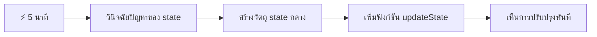
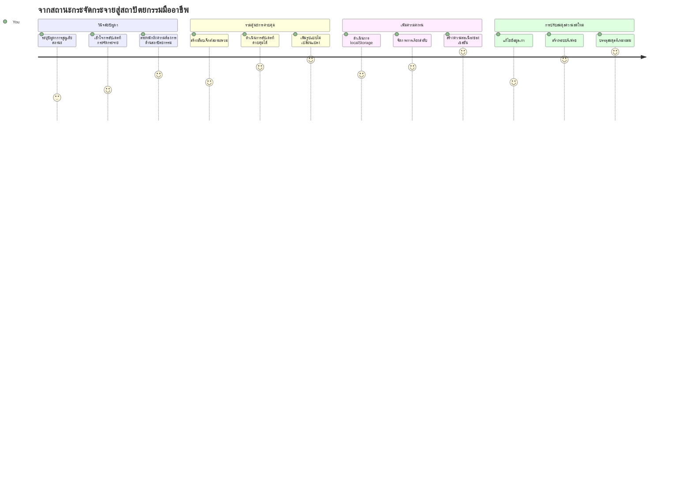
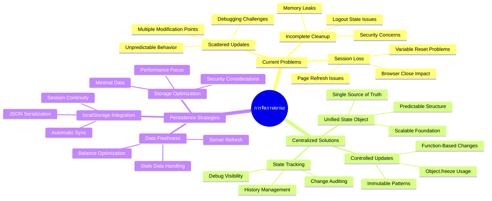
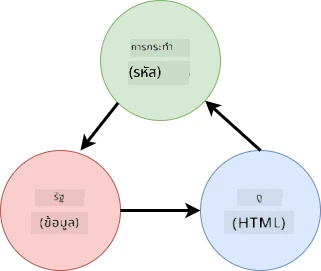
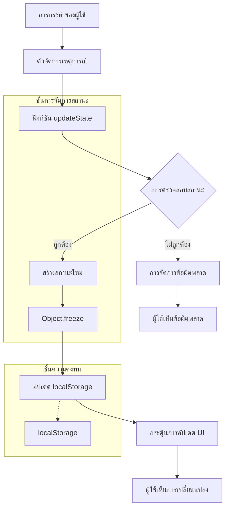
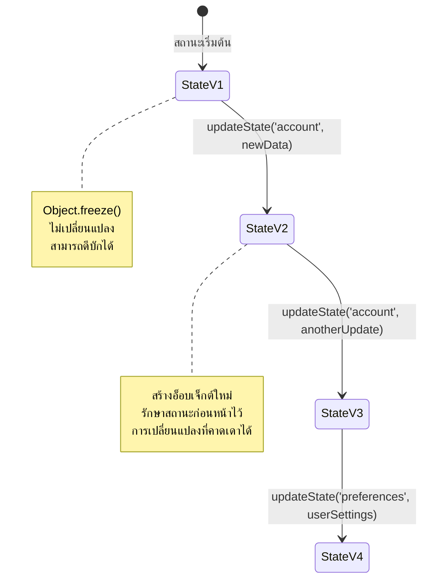
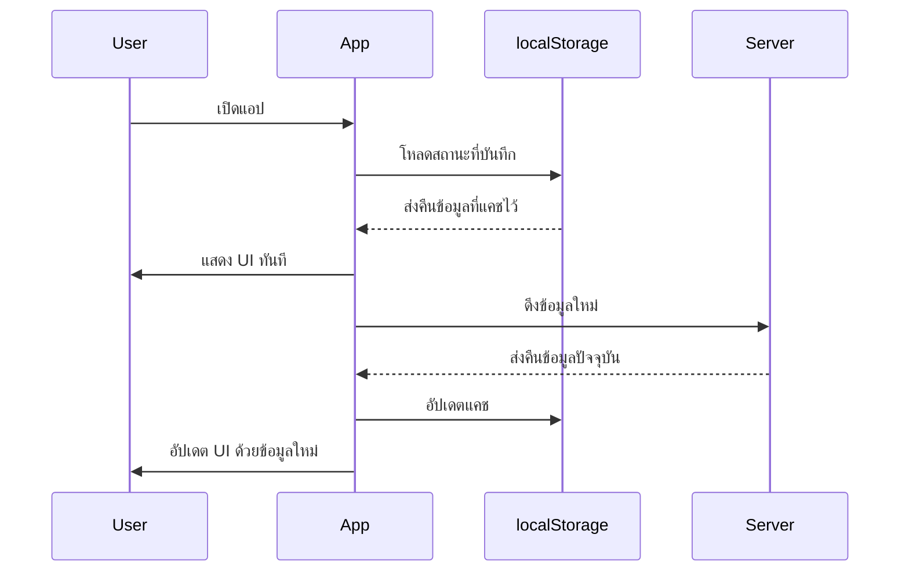
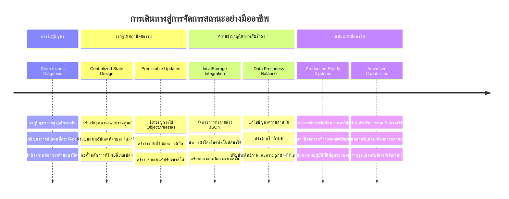
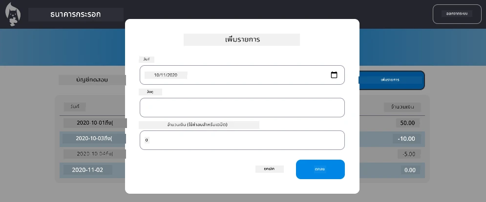

# สร้างแอปธนาคาร ตอนที่ 4: แนวคิดการจัดการสถานะ

## ⚡ สิ่งที่คุณทำได้ใน 5 นาทีถัดไป

**เส้นทางเริ่มต้นด่วนสำหรับนักพัฒนาที่เร่งรีบ**


- **นาทีที่ 1**: ทดสอบปัญหาสถานะปัจจุบัน - ลงชื่อเข้าใช้ ฟื้นฟูหน้าเว็บ สังเกตการออกจากระบบ
- **นาทีที่ 2**: แทนที่ `let account = null` ด้วย `let state = { account: null }`
- **นาทีที่ 3**: สร้างฟังก์ชัน `updateState()` แบบง่ายสำหรับการอัปเดตแบบควบคุม
- **นาทีที่ 4**: อัปเดตฟังก์ชันหนึ่งให้ใช้แบบแผนใหม่
- **นาทีที่ 5**: ทดสอบความสามารถในการทำนายผลและการดีบักที่ดีขึ้น

**ทดสอบวินิจฉัยอย่างรวดเร็ว**:
```javascript
// ก่อนหน้า: สถานะกระจัดกระจาย
let account = null; // หายไปเมื่อรีเฟรช!

// หลังจาก: สถานะศูนย์กลาง
let state = Object.freeze({ account: null }); // ควบคุมได้และติดตามได้!
```

**ทำไมถึงสำคัญ**: ในเวลา 5 นาที คุณจะได้สัมผัสการเปลี่ยนแปลงจากการจัดการสถานะที่ยุ่งเหยิงเป็นแบบแผนที่ทำนายผลและดีบักได้ง่าย นี่คือรากฐานที่ทำให้แอปพลิเคชันที่ซับซ้อนสามารถดูแลรักษาได้

## 🗺️ การเดินทางเรียนรู้ผ่านการเชี่ยวชาญการจัดการสถานะ


**จุดหมายปลายทางของการเดินทาง**: เมื่อจบบทเรียนนี้ คุณจะได้สร้างระบบจัดการสถานะระดับมืออาชีพที่จัดการความคงอยู่ของข้อมูล ความสดใหม่ของข้อมูล และอัปเดตที่ทำนายได้ — แบบแผนเดียวกับที่ใช้ในแอปพลิเคชันจริง

## แบบทดสอบก่อนบรรยาย

[แบบทดสอบก่อนบรรยาย](https://ff-quizzes.netlify.app/web/quiz/47)

## บทนำ

การจัดการสถานะเหมือนระบบนำทางบนยานอวกาศ Voyager — เมื่อทุกอย่างทำงานได้อย่างราบรื่น คุณแทบจะไม่รู้ว่ามันอยู่ แต่เมื่อเกิดปัญหา มันกลายเป็นความแตกต่างระหว่างการเดินทางไปยังอวกาศระหว่างดวงดาวกับการหลงทางในความเวิ้งว้างของจักรวาล ในการพัฒนาเว็บ สถานะคือทุกอย่างที่แอปของคุณต้องจำไว้: สถานะการเข้าสู่ระบบของผู้ใช้ ข้อมูลฟอร์ม ประวัติการนำทาง และสถานะชั่วคราวของส่วนติดต่อผู้ใช้

เมื่อแอปธนาคารของคุณพัฒนาจากฟอร์มเข้าสู่ระบบธรรมดาไปสู่แอปพลิเคชันที่ซับซ้อนขึ้น คุณคงเคยเจอปัญหาทั่วไปบางอย่าง เช่น กดรีเฟรชหน้าแล้วผู้ใช้ถูกออกจากระบบโดยไม่คาดคิด ปิดเบราว์เซอร์แล้วข้อมูลทั้งหมดหายไป ดีบักปัญหาแล้วต้องค้นหาผ่านฟังก์ชันหลายตัวที่แก้ไขข้อมูลเดียวกันในหลายวิธี

สิ่งเหล่านี้ไม่ใช่สัญญาณของการเขียนโค้ดไม่ดี — เป็นอาการธรรมชาติของการเติบโตเมื่อแอปพลิเคชันถึงระดับความซับซ้อนหนึ่ง นักพัฒนาทุกคนต้องเผชิญกับปัญหาเหล่านี้เมื่อแอปเปลี่ยนจาก "หลักฐานแนวคิด" เป็น "พร้อมใช้งานจริง"

ในบทเรียนนี้ เราจะสร้างระบบจัดการสถานะแบบรวมศูนย์ที่เปลี่ยนแอปธนาคารของคุณให้เป็นแอปมืออาชีพที่น่าเชื่อถือ คุณจะได้เรียนรู้การจัดการการไหลของข้อมูลอย่างทำนายได้ รักษาเซสชันของผู้ใช้อย่างเหมาะสม และสร้างประสบการณ์ผู้ใช้ที่ราบรื่นตามที่แอปเว็ปสมัยใหม่ต้องการ

## สิ่งที่ควรเตรียมก่อนเรียน

ก่อนที่จะไปลงลึกกับแนวคิดการจัดการสถานะ คุณต้องตั้งค่าสภาพแวดล้อมการพัฒนาและมีรากฐานแอปธนาคารของคุณพร้อมแล้ว บทเรียนนี้สร้างขึ้นโดยตรงบนแนวคิดและโค้ดจากตอนก่อนๆ ในชุดนี้

ตรวจสอบให้แน่ใจว่าคุณมีส่วนประกอบเหล่านี้พร้อมก่อนดำเนินการ:

**การตั้งค่าที่จำเป็น:**
- ทำ [บทเรียนดึงข้อมูล](../3-data/README.md) ให้เสร็จ — แอปของคุณควรโหลดและแสดงข้อมูลบัญชีได้สำเร็จ
- ติดตั้ง [Node.js](https://nodejs.org) บนระบบของคุณเพื่อรัน API ฝั่งหลัง
- สตาร์ท [เซิร์ฟเวอร์ API](../api/README.md) ในเครื่องเพื่อจัดการการทำงานกับข้อมูลบัญชี

**ทดสอบสภาพแวดล้อมของคุณ:**

ตรวจสอบว่าเซิร์ฟเวอร์ API ของคุณทำงานถูกต้องโดยรันคำสั่งนี้ในเทอร์มินัล:

```sh
curl http://localhost:5000/api
# -> ควรส่งคืน "Bank API v1.0.0" เป็นผลลัพธ์
```

**คำสั่งนี้ทำอะไร:**
- **ส่ง** คำขอ GET ไปยังเซิร์ฟเวอร์ API ในเครื่องของคุณ
- **ทดสอบ** การเชื่อมต่อและตรวจสอบว่าเซิร์ฟเวอร์ตอบสนอง
- **แสดง** ข้อมูลเวอร์ชัน API หากทุกอย่างทำงานถูกต้อง

## 🧠 ภาพรวมสถาปัตยกรรมการจัดการสถานะ


**หลักการสำคัญ**: การจัดการสถานะระดับมืออาชีพต้องมีสมดุลระหว่างการทำนายได้ ความคงอยู่ และประสิทธิภาพ เพื่อสร้างประสบการณ์ผู้ใช้ที่เชื่อถือได้ ซึ่งปรับขนาดได้จากปฏิสัมพันธ์ง่ายๆ ไปสู่เวิร์กโฟลว์แอปพลิเคชันที่ซับซ้อน

---

## วิเคราะห์ปัญหาสถานะปัจจุบัน

เหมือนกับเชอร์ล็อก โฮล์มส์ ที่ตรวจสอบที่เกิดเหตุ เราต้องเข้าใจอย่างชัดเจนว่าสิ่งที่เกิดขึ้นในระบบปัจจุบันของเราคืออะไร ก่อนที่จะแก้ปัญหาการหายไปของเซสชันผู้ใช้

เรามาทดลองอย่างง่ายที่เผยให้เห็นปัญหาการจัดการสถานะพื้นฐาน:

**🧪 ลองทดสอบนี้:**
1. ลงชื่อเข้าใช้แอปธนาคารของคุณและไปที่แดชบอร์ด
2. รีเฟรชหน้าเบราว์เซอร์
3. สังเกตว่าเกิดอะไรขึ้นกับสถานะลงชื่อเข้าใช้ของคุณ

ถ้าคุณถูกเปลี่ยนเส้นทางกลับไปยังหน้าลงชื่อเข้าใช้ แสดงว่าคุณพบปัญหาความคงทนของสถานะคลาสสิก พฤติกรรมนี้เกิดขึ้นเพราะการเก็บข้อมูลผู้ใช้ในตัวแปร JavaScript ถูกรีเซ็ตทุกครั้งที่โหลดหน้าใหม่

**ปัญหาของการใช้งานในปัจจุบัน:**

ตัวแปร `account` แบบง่ายๆ จาก [บทเรียนก่อนหน้า](../3-data/README.md) ก่อให้เกิดปัญหาใหญ่สามข้อที่มีผลกระทบทั้งต่อประสบการณ์ผู้ใช้และความสามารถในการดูแลรักษาโค้ด:

| ปัญหา | สาเหตุทางเทคนิค | ผลกระทบต่อผู้ใช้ |
|---------|--------|----------------|
| **สูญเสียเซสชัน** | รีเฟรชหน้าล้างตัวแปร JavaScript | ผู้ใช้ต้องเข้าสู่ระบบบ่อยครั้ง |
| **อัปเดตกระจัดกระจาย** | หลายฟังก์ชันแก้ไขสถานะโดยตรง | การดีบักทำได้ยากขึ้น |
| **ทำความสะอาดไม่สมบูรณ์** | การออกจากระบบไม่ล้างการอ้างอิงสถานะทั้งหมด | มีความเสี่ยงด้านความปลอดภัยและความเป็นส่วนตัว |

**ความท้าทายด้านสถาปัตยกรรม:**

เหมือนกับการออกแบบห้องกันน้ำของไททานิคที่ดูแข็งแรงจนกระทั่งหลายห้องถูกน้ำท่วมพร้อมกัน การแก้ปัญหาเหล่านี้ทีละอย่างจะไม่แก้ปัญหาสถาปัตยกรรมโดยรวม เราต้องการโซลูชันการจัดการสถานะที่ครอบคลุม

> 💡 **สิ่งที่เราพยายามบรรลุคืออะไร?**

[การจัดการสถานะ](https://en.wikipedia.org/wiki/State_management) คือการแก้ไขปริศนาพื้นฐานสองข้อ:

1. **ข้อมูลของฉันอยู่ที่ไหน?**: ติดตามข้อมูลที่เรามีและที่มาของมัน
2. **ทุกคนเห็นตรงกันไหม?**: ทำให้แน่ใจว่าสิ่งที่ผู้ใช้เห็นตรงกับสิ่งที่เกิดขึ้นจริง

**แผนการของเรา:**

แทนที่จะวิ่งไล่ตามหางตัวเอง เราจะสร้างระบบ **จัดการสถานะแบบรวมศูนย์** เปรียบเสมือนคนที่จัดการเรื่องสำคัญๆ ทั้งหมดอย่างเป็นระเบียบคนเดียว:




**ทำความเข้าใจการไหลของข้อมูลนี้:**
- **รวมศูนย์** สถานะของแอปทั้งหมดไว้ที่เดียว
- **ส่งผ่าน** การเปลี่ยนแปลงสถานะทั้งหมดผ่านฟังก์ชันที่ควบคุม
- **รับประกัน** ให้ UI สอดคล้องกับสถานะปัจจุบัน
- **ให้** แบบแผนที่ชัดเจนและทำนายได้สำหรับการจัดการข้อมูล

> 💡 **ข้อมูลเชิงลึกจากมืออาชีพ**: บทเรียนนี้เน้นที่แนวคิดพื้นฐาน สำหรับแอปซับซ้อน ไลบรารีเช่น [Redux](https://redux.js.org) มีฟีเจอร์จัดการสถานะขั้นสูงมากขึ้น การเข้าใจหลักการเหล่านี้จะช่วยให้คุณเชี่ยวชาญไลบรารีจัดการสถานะใดๆ

> ⚠️ **หัวข้อขั้นสูง**: เราจะไม่ครอบคลุมการอัปเดต UI อัตโนมัติที่เกิดจากการเปลี่ยนแปลงสถานะ เพราะเกี่ยวข้องกับแนวคิด [Reactive Programming](https://en.wikipedia.org/wiki/Reactive_programming) ถือว่าเป็นขั้นตอนต่อไปที่ดีสำหรับการเรียนรู้ของคุณ!

### งาน: รวมศูนย์โครงสร้างสถานะ

เรามาเริ่มเปลี่ยนการจัดการสถานะที่กระจัดกระจายของเราเป็นระบบรวมศูนย์ ขั้นตอนแรกนี้วางรากฐานสำหรับการปรับปรุงทั้งหมดที่จะตามมา

**ขั้นตอนที่ 1: สร้างวัตถุสถานะรวมศูนย์**

แทนที่ประกาศ `account` แบบง่าย:

```js
let account = null;
```

ด้วยวัตถุสถานะที่มีโครงสร้าง:

```js
let state = {
  account: null
};
```

**นี่คือเหตุผลที่เปลี่ยนแปลงนี้สำคัญ:**
- **รวมศูนย์** ข้อมูลแอปทั้งหมดไว้ที่เดียว
- **เตรียม** โครงสร้างเพื่อเพิ่มคุณสมบัติสถานะเพิ่มเติมในอนาคต
- **สร้าง** ขอบเขตชัดเจนระหว่างสถานะกับตัวแปรอื่น
- **วางรากฐาน** สำหรับแบบแผนที่ขยายตัวตามการเติบโตของแอป

**ขั้นตอนที่ 2: อัปเดตแบบแผนการเข้าถึงสถานะ**

ปรับฟังก์ชันของคุณให้ใช้โครงสร้างสถานะใหม่:

**ในฟังก์ชัน `register()` และ `login()`** แทนที่:
```js
account = ...
```

ด้วย:
```js
state.account = ...
```

**ในฟังก์ชัน `updateDashboard()`** เพิ่มบรรทัดนี้ไว้บนสุด:
```js
const account = state.account;
```

**สิ่งที่อัปเดตเหล่านี้สร้างขึ้น:**
- **รักษา** ฟังก์ชันการทำงานเดิมในขณะที่ปรับปรุงโครงสร้าง
- **เตรียม** โค้ดของคุณสำหรับการจัดการสถานะที่ซับซ้อนมากขึ้น
- **สร้าง** แบบแผนที่สม่ำเสมอสำหรับการเข้าถึงข้อมูลสถานะ
- **วางรากฐาน** สำหรับการอัปเดตสถานะแบบรวมศูนย์

> 💡 **หมายเหตุ**: การรีแฟคเตอร์นี้ไม่ได้แก้ปัญหาทันที แต่สร้างรากฐานสำคัญสำหรับการปรับปรุงที่ทรงพลังในขั้นตอนถัดไป!

### 🎯 ตรวจสอบการเรียนรู้: หลักการรวมศูนย์

**หยุดและไตร่ตรอง**: คุณเพิ่งใช้งานการรวมศูนย์การจัดการสถานะ นี่เป็นการตัดสินใจสถาปัตยกรรมที่สำคัญ

**ประเมินตัวเองอย่างรวดเร็ว**:
- คุณอธิบายได้ไหมว่าทำไมการรวมศูนย์สถานะในวัตถุเดียวดีกว่าการกระจายตัวแปร?
- จะเกิดอะไรขึ้นถ้าคุณลืมอัปเดตฟังก์ชันให้ใช้ `state.account`?
- แบบแผนนี้เตรียมโค้ดของคุณสำหรับคุณสมบัติขั้นสูงอย่างไร?

**เชื่อมโยงกับโลกจริง**: แบบแผนรวมศูนย์นี้เป็นรากฐานของเฟรมเวิร์กสมัยใหม่เช่น Redux, Vuex และ React Context คุณกำลังสร้างแนวคิดสถาปัตยกรรมเหมือนกับที่ใช้ในแอปใหญ่ๆ

**คำถามท้าทาย**: หากต้องเพิ่มค่ากำหนดผู้ใช้ (ธีม ภาษา) ลงในแอปคุณ คุณจะเพิ่มลงในโครงสร้างสถานะที่ไหน? และมันจะขยายตัวอย่างไร?

## การใช้งานอัปเดตสถานะแบบควบคุม

หลังจากที่เรารวมศูนย์สถานะ ขั้นตอนถัดไปคือการสร้างกลไกควบคุมสำหรับการแก้ไขข้อมูล วิธีนี้ทำให้การเปลี่ยนแปลงสถานะเป็นไปอย่างทำนายได้และง่ายต่อการดีบัก

หลักการหลักคล้ายกับการควบคุมจราจรทางอากาศ: แทนที่จะให้หลายฟังก์ชันแก้ไขสถานะอย่างอิสระ เราจะส่งผ่านการเปลี่ยนแปลงทั้งหมดผ่านฟังก์ชันเดียวแบบควบคุม แบบแผนนี้ให้ภาพรวมที่ชัดเจนว่าเมื่อใดและอย่างไรที่ข้อมูลมีการเปลี่ยนแปลง

**การจัดการสถานะไม่เปลี่ยนแปลง:**

เราจะถือว่าวัตถุ `state` เป็น [*immutable*](https://en.wikipedia.org/wiki/Immutable_object) หมายความว่าเราไม่แก้ไขโดยตรง แต่แต่ละครั้งที่เปลี่ยนแปลงจะสร้างวัตถุสถานะใหม่ที่มีข้อมูลอัปเดต

ในตอนแรกวิธีนี้อาจดูไม่มีประสิทธิภาพเมื่อเทียบกับการแก้ไขโดยตรง แต่มีข้อดีอย่างมากสำหรับการดีบัก การทดสอบ และการทำนายผลการทำงานของแอป

**ประโยชน์ของการจัดการสถานะแบบไม่เปลี่ยนแปลง:**

| ประโยชน์ | คำอธิบาย | ผลกระทบ |
|---------|-------------|--------|
| **ทำนายผลได้** | การเปลี่ยนแปลงเกิดขึ้นเฉพาะผ่านฟังก์ชันที่ควบคุม | ง่ายต่อการดีบักและทดสอบ |
| **ติดตามประวัติ** | การเปลี่ยนแปลงแต่ละครั้งสร้างวัตถุใหม่ | เปิดใช้งานฟีเจอร์เลิกทำ/ทำซ้ำ |
| **ป้องกันผลข้างเคียง** | ไม่มีการแก้ไขโดยบังเอิญ | ป้องกันบั๊กลึกลับ |
| **เพิ่มประสิทธิภาพ** | ง่ายต่อการตรวจจับเมื่อสถานะเปลี่ยนจริง | อัปเดต UI ได้อย่างมีประสิทธิภาพ |

**ความไม่เปลี่ยนแปลงใน JavaScript ด้วย `Object.freeze()`:**

JavaScript มี [`Object.freeze()`](https://developer.mozilla.org/docs/Web/JavaScript/Reference/Global_Objects/Object/freeze) เพื่อป้องกันการแก้ไขวัตถุ:

```js
const immutableState = Object.freeze({ account: userData });
// ความพยายามใด ๆ ในการแก้ไข immutableState จะทำให้เกิดข้อผิดพลาด
```

**อธิบายสิ่งที่เกิดขึ้นที่นี่:**
- **ป้องกัน** การกำหนดค่าและลบคุณสมบัติโดยตรง
- **ขว้าง** ข้อผิดพลาดถ้ามีความพยายามแก้ไข
- **รับประกัน** การเปลี่ยนแปลงสถานะต้องผ่านฟังก์ชันที่ควบคุม
- **สร้าง** ข้อตกลงชัดเจนเกี่ยวกับวิธีอัปเดตสถานะ

> 💡 **ข้อมูลเชิงลึก**: เรียนรู้ความแตกต่างระหว่างวัตถุไม่เปลี่ยนแปลง *ตื้น* และ *ลึก* ใน [เอกสาร MDN](https://developer.mozilla.org/docs/Web/JavaScript/Reference/Global_Objects/Object/freeze#What_is_shallow_freeze) การเข้าใจความแตกต่างนี้สำคัญสำหรับโครงสร้างสถานะที่ซับซ้อน


### งาน

มาสร้างฟังก์ชันใหม่ `updateState()`:

```js
function updateState(property, newData) {
  state = Object.freeze({
    ...state,
    [property]: newData
  });
}
```

ในฟังก์ชันนี้ เราสร้างวัตถุสถานะใหม่และคัดลอกข้อมูลจากสถานะก่อนหน้าด้วย [*โอเปอเรเตอร์กระจาย (`...`)*](https://developer.mozilla.org/docs/Web/JavaScript/Reference/Operators/Spread_syntax#Spread_in_object_literals) จากนั้นเราทับคุณสมบัติเฉพาะในวัตถุสถานะด้วยข้อมูลใหม่โดยใช้ [สัญกรณ์วงเล็บ](https://developer.mozilla.org/docs/Web/JavaScript/Guide/Working_with_Objects#Objects_and_properties) `[property]` ในการกำหนดค่า สุดท้ายล็อกวัตถุเพื่อป้องกันการแก้ไขด้วย `Object.freeze()` ตอนนี้เรามีเพียงคุณสมบัติ `account` เก็บในสถานะ แต่ด้วยวิธีนี้คุณสามารถเพิ่มคุณสมบัติในสถานะได้เท่าที่ต้องการ

เราจะอัปเดตการเริ่มต้นใช้งาน `state` ให้แน่ใจว่าสถานะเริ่มแรกถูกล็อกด้วย:

```js
let state = Object.freeze({
  account: null
});
```

หลังจากนั้น อัปเดตฟังก์ชัน `register` โดยแทนที่การกำหนดค่า `state.account = result;` ด้วย:

```js
updateState('account', result);
```

ทำเช่นเดียวกันกับฟังก์ชัน `login` แทนที่ `state.account = data;` ด้วย:

```js
updateState('account', data);
```

ตอนนี้เราจะใช้โอกาสนี้แก้ปัญหาข้อมูลบัญชีไม่ถูกล้างเมื่อผู้ใช้คลิก *ออกจากระบบ*

สร้างฟังก์ชันใหม่ `logout()`:

```js
function logout() {
  updateState('account', null);
  navigate('/login');
}
```

ใน `updateDashboard()` แทนที่การเปลี่ยนเส้นทาง `return navigate('/login');` ด้วย `return logout()`;

ลองสมัครบัญชีใหม่ ออกจากระบบ และเข้าสู่ระบบอีกครั้งเพื่อทดสอบว่ายังทำงานได้ถูกต้อง

> เคล็ดลับ: คุณสามารถดูการเปลี่ยนแปลงสถานะทั้งหมดได้โดยเพิ่ม `console.log(state)` ที่ด้านล่างของ `updateState()` แล้วเปิดคอนโซลในเครื่องมือพัฒนาเบราว์เซอร์ของคุณ

## การใช้งานความคงทนของข้อมูล

ปัญหาการสูญเสียเซสชันที่เราระบุไว้ข้างต้นต้องการโซลูชันความคงทนที่รักษาสถานะผู้ใช้ระหว่างเซสชันของเบราว์เซอร์ วิธีนี้เปลี่ยนแอปพลิเคชันของเราให้จากประสบการณ์ชั่วคราวเป็นเครื่องมือมืออาชีพที่เชื่อถือได้

พิจารณาการทำงานของนาฬิกาอะตอมที่รักษาเวลาที่แม่นยำแม้ในระหว่างไฟดับโดยเก็บสถานะสำคัญในหน่วยความจำไม่ลบเลือน เช่นเดียวกับแอปเว็บที่ต้องมีวิธีเก็บข้อมูลถาวรเพื่อรักษาข้อมูลสำคัญของผู้ใช้ระหว่างเซสชันของเบราว์เซอร์และการรีเฟรชหน้า

**คำถามเชิงกลยุทธ์เพื่อความคงทนของข้อมูล:**

ก่อนทำการนำความคงทนมาใช้ ให้พิจารณาปัจจัยสำคัญเหล่านี้:

| คำถาม | บริบทแอปธนาคาร | ผลกระทบต่อการตัดสินใจ |
|----------|-------------------|----------------|
| **ข้อมูลนี้ละเอียดอ่อนหรือไม่?** | ยอดเงินในบัญชี, ประวัติรายการธุรกรรม | เลือกวิธีเก็บข้อมูลที่ปลอดภัย |
| **ควรให้สถานะนี้อยู่ได้นานแค่ไหน?** | สถานะการล็อกอิน เทียบกับ การตั้งค่าชั่วคราวของ UI | เลือกระยะเวลาการจัดเก็บที่เหมาะสม |
| **เซิร์ฟเวอร์จำเป็นต้องใช้หรือไม่?** | โทเค็นการยืนยันตัวตน เทียบกับ การตั้งค่า UI | กำหนดความต้องการแชร์ข้อมูล |

**ตัวเลือกการจัดเก็บเบราว์เซอร์:**

เบราว์เซอร์สมัยใหม่มีวิธีการจัดเก็บข้อมูลหลายอย่างที่ออกแบบมาเพื่อตอบโจทย์การใช้งานที่แตกต่างกัน:

**API จัดเก็บข้อมูลหลัก:**

1. **[`localStorage`](https://developer.mozilla.org/docs/Web/API/Window/localStorage)**: การจัดเก็บแบบ [Key/Value คงทน](https://en.wikipedia.org/wiki/Key%E2%80%93value_database)
   - **คงอยู่** ข้อมูลระหว่างเซสชันของเบราว์เซอร์อย่างไม่มีกำหนด  
   - **รอดตาย** จากการรีสตาร์ทเบราว์เซอร์และคอมพิวเตอร์
   - **แยกหน้าที่** เฉพาะโดเมนของเว็บไซต์นั้น ๆ
   - **เหมาะสม** สำหรับการตั้งค่าผู้ใช้และสถานะการล็อกอิน

2. **[`sessionStorage`](https://developer.mozilla.org/docs/Web/API/Window/sessionStorage)**: การจัดเก็บชั่วคราวในเซสชัน
   - **ทำงาน** เหมือนกับ localStorage ในช่วงเซสชันที่เปิดอยู่
   - **ล้าง** อัตโนมัติเมื่อแท็บเบราว์เซอร์ปิดลง
   - **เหมาะกับ** ข้อมูลชั่วคราวที่ไม่ควรเก็บไว้

3. **[HTTP Cookies](https://developer.mozilla.org/docs/Web/HTTP/Cookies)**: การจัดเก็บที่แชร์กับเซิร์ฟเวอร์
   - **ส่งโดยอัตโนมัติ** กับทุกคำร้องขอไปยังเซิร์ฟเวอร์
   - **เหมาะสม** สำหรับ [โทเค็นการยืนยันตัวตน](https://en.wikipedia.org/wiki/Authentication)
   - **ขนาดจำกัด** และอาจส่งผลต่อประสิทธิภาพ

**ข้อกำหนดเกี่ยวกับการแปลงข้อมูลเป็นรูปแบบข้อความ:**

ทั้ง `localStorage` และ `sessionStorage` เก็บข้อมูลได้เพียง [ข้อความ](https://developer.mozilla.org/docs/Web/JavaScript/Reference/Global_Objects/String) เท่านั้น:

```js
// แปลงอ็อบเจ็กต์เป็นสตริง JSON สำหรับการเก็บข้อมูล
const accountData = { user: 'john', balance: 150 };
localStorage.setItem('account', JSON.stringify(accountData));

// แปลงสตริง JSON กลับเป็นอ็อบเจ็กต์เมื่อดึงข้อมูลออกมา
const savedAccount = JSON.parse(localStorage.getItem('account'));
```

**ทำความเข้าใจการแปลงข้อมูลเป็นข้อความ (serialization):**
- **แปลง** อ็อบเจ็กต์ JavaScript เป็นสายอักขระ JSON โดยใช้ [`JSON.stringify()`](https://developer.mozilla.org/docs/Web/JavaScript/Reference/Global_Objects/JSON/stringify)
- **สร้างใหม่** อ็อบเจ็กต์จาก JSON โดยใช้ [`JSON.parse()`](https://developer.mozilla.org/docs/Web/JavaScript/Reference/Global_Objects/JSON/parse)
- **จัดการ** อ็อบเจ็กต์ซับซ้อนที่มีการซ้อนกันและอาเรย์โดยอัตโนมัติ
- **ล้มเหลว** กับฟังก์ชัน ค่าที่ไม่กำหนด และการอ้างอิงแบบวงกลม

> 💡 **ตัวเลือกขั้นสูง**: สำหรับแอปพลิเคชันออฟไลน์ซับซ้อนที่มีข้อมูลขนาดใหญ่ ลองพิจารณาใช้ [`IndexedDB` API](https://developer.mozilla.org/docs/Web/API/IndexedDB_API) ซึ่งเป็นฐานข้อมูลฝั่งไคลเอนต์เต็มรูปแบบแต่ต้องการการใช้งานที่ซับซ้อนกว่า


### งาน: ติดตั้งความคงทนด้วย localStorage

เราจะติดตั้งการจัดเก็บแบบถาวรเพื่อให้ผู้ใช้ยังคงล็อกอินอยู่จนกว่าจะออกจากระบบโดยชัดเจน ใช้ `localStorage` เพื่อเก็บข้อมูลบัญชีข้ามเซสชันของเบราว์เซอร์

**ขั้นตอนที่ 1: กำหนดการตั้งค่าจัดเก็บ**

```js
const storageKey = 'savedAccount';
```

**สิ่งที่คอนสแตนต์นี้มอบให้:**
- **สร้าง** ตัวระบุตัวตนที่สม่ำเสมอสำหรับข้อมูลที่จัดเก็บ
- **ป้องกัน** การพิมพ์ผิดในการอ้างอิงคีย์จัดเก็บ
- **ช่วยให้** เปลี่ยนคีย์จัดเก็บได้ง่ายหากจำเป็น
- **ปฏิบัติตาม** แนวปฏิบัติที่ดีที่สุดสำหรับโค้ดที่ดูแลรักษาได้

**ขั้นตอนที่ 2: เพิ่มการคงทนอัตโนมัติ**

เพิ่มบรรทัดนี้ที่ท้ายฟังก์ชัน `updateState()`:

```js
localStorage.setItem(storageKey, JSON.stringify(state.account));
```

**อธิบายสิ่งที่เกิดขึ้นที่นี่:**
- **แปลง** อ็อบเจ็กต์บัญชีเป็นสายอักขระ JSON เพื่อจัดเก็บ
- **บันทึก** ข้อมูลโดยใช้คีย์จัดเก็บสม่ำเสมอของเรา
- **ทำงาน** โดยอัตโนมัติทุกครั้งที่มีการเปลี่ยนแปลงสถานะ
- **รับประกัน** ข้อมูลที่จัดเก็บตรงกับสถานะปัจจุบันเสมอ

> 💡 **ข้อดีทางสถาปัตยกรรม**: เพราะเรารวมการอัปเดตทั้งหมดไว้ใน `updateState()` การเพิ่มการคงทนจึงทำได้แค่เพิ่มโค้ดบรรทัดเดียว แสดงให้เห็นถึงพลังของการออกแบบระบบที่ดี!

**ขั้นตอนที่ 3: กู้คืนสถานะเมื่อแอปโหลด**

สร้างฟังก์ชันเริ่มต้นเพื่อกู้คืนข้อมูลที่จัดเก็บ:

```js
function init() {
  const savedAccount = localStorage.getItem(storageKey);
  if (savedAccount) {
    updateState('account', JSON.parse(savedAccount));
  }

  // โค้ดเริ่มต้นก่อนหน้านี้ของเรา
  window.onpopstate = () => updateRoute();
  updateRoute();
}

init();
```

**ทำความเข้าใจกระบวนการเริ่มต้น:**
- **ดึง** ข้อมูลบัญชีที่จัดเก็บไว้ก่อนหน้าจาก localStorage
- **แปลง** สายอักขระ JSON กลับเป็นอ็อบเจ็กต์ JavaScript
- **อัปเดต** สถานะด้วยฟังก์ชันอัปเดตที่ควบคุมได้
- **กู้คืน** เซสชันของผู้ใช้อัตโนมัติเมื่อโหลดหน้า
- **ทำงาน** ก่อนอัปเดตเส้นทางเพื่อให้มั่นใจว่าสถานะพร้อมใช้งาน

**ขั้นตอนที่ 4: ปรับเส้นทางเริ่มต้นให้เหมาะสม**

ปรับเส้นทางเริ่มต้นเพื่อใช้ประโยชน์จากการคงทน:

ใน `updateRoute()`, แทนที่:
```js
// แทนที่: return navigate('/login');
return navigate('/dashboard');
```

**ทำไมการเปลี่ยนแปลงนี้จึงสมเหตุสมผล:**
- **ใช้ประโยชน์** จากระบบความคงทนใหม่ได้อย่างมีประสิทธิภาพ
- **ให้** แดชบอร์ดจัดการการตรวจสอบการยืนยันตัวตน
- **เปลี่ยนเส้นทาง** ไปหน้าล็อกอินอัตโนมัติถ้าไม่มีเซสชันที่บันทึกไว้
- **สร้าง** ประสบการณ์ผู้ใช้ที่ราบรื่นมากขึ้น

**ทดสอบการใช้งานของคุณ:**

1. เข้าสู่ระบบแอปธนาคารของคุณ
2. รีเฟรชหน้าเบราว์เซอร์
3. ตรวจสอบว่าคุณยังคงล็อกอินอยู่และอยู่ที่แดชบอร์ด
4. ปิดแล้วเปิดเบราว์เซอร์อีกครั้ง
5. กลับไปที่แอปและยืนยันว่าคุณยังล็อกอินอยู่

🎉 **สำเร็จ**: คุณติดตั้งระบบจัดการสถานะที่คงทนสำเร็จแล้ว! แอปของคุณทำงานเหมือนเว็บแอปมืออาชีพ

### 🎯 ตรวจสอบความเข้าใจ: สถาปัตยกรรมการคงทน

**ความเข้าใจสถาปัตยกรรม**: คุณได้ติดตั้งเลเยอร์ความคงทนที่ซับซ้อนซึ่งสร้างสมดุลระหว่างประสบการณ์ผู้ใช้และความซับซ้อนของการจัดการข้อมูล

**แนวคิดหลักที่เชี่ยวชาญแล้ว**:
- **การแปลง JSON**: แปลงอ็อบเจ็กต์ซับซ้อนเป็นข้อความที่เก็บได้
- **การซิงโครไนซ์อัตโนมัติ**: การเปลี่ยนสถานะกระตุ้นการจัดเก็บ
- **กู้คืนเซสชัน**: แอปสามารถกู้คืนบริบทของผู้ใช้หลังหยุดชะงัก
- **การคงทนแบบรวมศูนย์**: ฟังก์ชันอัปเดตเดียวจัดการการจัดเก็บทั้งหมด

**การเชื่อมโยงกับอุตสาหกรรม**: รูปแบบนี้เป็นพื้นฐานของ Progressive Web Apps (PWA), แอปออฟไลน์ และประสบการณ์เว็บมือถือสมัยใหม่ คุณกำลังสร้างความสามารถระดับโปรดักชัน

**คำถามสะท้อนคิด**: คุณจะปรับระบบนี้อย่างไรเพื่อรองรับผู้ใช้หลายบัญชีในอุปกรณ์เดียว? คิดถึงความเป็นส่วนตัวและความปลอดภัย

## สมดุลระหว่างความคงทนกับความสดใหม่ของข้อมูล

ระบบคงทนของเราสำเร็จในการรักษาเซสชันผู้ใช้ แต่มีความท้าทายใหม่คือ: ข้อมูลล้าสมัย เมื่อผู้ใช้หรือแอปหลายรายแก้ไขข้อมูลเซิร์ฟเวอร์เดียวกัน ข้อมูลที่แคชไว้ในเครื่องจะไม่อัปเดต

สถานการณ์นี้เหมือนกับนักเดินเรือไวกิ้งที่พึ่งพาทั้งแผนที่ดาวเก็บไว้และการสังเกตท้องฟ้าปัจจุบัน แผนที่ให้ความสม่ำเสมอ แต่ต้องการการสังเกตสดใหม่เพื่อรับมือเงื่อนไขที่เปลี่ยนแปลง ในทำนองเดียวกัน แอปของเราต้องมีทั้งสถานะผู้ใช้ที่คงทนและข้อมูลเซิร์ฟเวอร์ที่สดใหม่

**🧪 ค้นพบปัญหาข้อมูลล้าสมัย:**

1. เข้าสู่แดชบอร์ดโดยใช้บัญชี `test`
2. รันคำสั่งนี้ในเทอร์มินัลเพื่อจำลองการทำธุรกรรมจากที่อื่น:

```sh
curl --request POST \
     --header "Content-Type: application/json" \
     --data "{ \"date\": \"2020-07-24\", \"object\": \"Bought book\", \"amount\": -20 }" \
     http://localhost:5000/api/accounts/test/transactions
```

3. รีเฟรชหน้าแดชบอร์ดในเบราว์เซอร์
4. สังเกตว่าคุณเห็นธุรกรรมใหม่หรือไม่

**สิ่งที่การทดสอบนี้แสดง:**
- **แสดง** ว่าการจัดเก็บข้อมูลในเครื่องอาจกลายเป็น "ล้าสมัย"
- **จำลอง** สถานการณ์จริงที่มีการเปลี่ยนแปลงข้อมูลนอกแอปของคุณ
- **เปิดเผย** ความขัดแย้งระหว่างความคงทนกับความสดใหม่ของข้อมูล

**ความท้าทายข้อมูลล้าสมัย:**

| ปัญหา | สาเหตุ | ผลกระทบต่อผู้ใช้ |
|---------|-------|-------------|
| **ข้อมูลล้าสมัย** | localStorage ไม่มีวันหมดอายุอัตโนมัติ | ผู้ใช้เห็นข้อมูลเก่า |
| **การเปลี่ยนแปลงบนเซิร์ฟเวอร์** | แอปอื่นหรือผู้ใช้แก้ไขข้อมูลเดียวกัน | มุมมองไม่สอดคล้องกันบนแพลตฟอร์มต่างกัน |
| **แคช vs ความจริง** | แคชในเครื่องไม่ตรงกับสถานะเซิร์ฟเวอร์ | ประสบการณ์ผู้ใช้แย่และสับสน |

**กลยุทธ์แก้ไขปัญหา:**

เราจะสร้างรูปแบบ "รีเฟรชเมื่อโหลด" เพื่อสร้างสมดุลระหว่างข้อดีของการคงทนและความต้องการข้อมูลสด ระบบนี้รักษาความราบรื่นของประสบการณ์ผู้ใช้ในขณะเดียวกันรับรองความถูกต้องของข้อมูล


### งาน: ติดตั้งระบบรีเฟรชข้อมูล

เราจะสร้างระบบที่ดึงข้อมูลสดใหม่จากเซิร์ฟเวอร์โดยอัตโนมัติพร้อมกับรักษาข้อดีของการจัดการสถานะที่คงทน

**ขั้นตอนที่ 1: สร้างตัวอัปเดตข้อมูลบัญชี**

```js
async function updateAccountData() {
  const account = state.account;
  if (!account) {
    return logout();
  }

  const data = await getAccount(account.user);
  if (data.error) {
    return logout();
  }

  updateState('account', data);
}
```

**ทำความเข้าใจตรรกะของฟังก์ชันนี้:**
- **ตรวจสอบ** ว่าผู้ใช้ล็อกอินอยู่หรือไม่ (state.account มีอยู่)
- **เปลี่ยนเส้นทาง** ไปหน้าล็อกเอาต์ถ้าไม่มีเซสชันที่ถูกต้อง
- **ดึง** ข้อมูลบัญชีสดใหม่จากเซิร์ฟเวอร์ด้วยฟังก์ชัน `getAccount()`
- **จัดการ** ข้อผิดพลาดจากเซิร์ฟเวอร์อย่างเหมาะสมด้วยการล็อกเอาต์เซสชันที่ไม่ถูกต้อง
- **อัปเดต** สถานะด้วยข้อมูลสดผ่านระบบอัปเดตที่ควบคุมได้
- **กระตุ้น** การคงทนใน localStorage ผ่านฟังก์ชัน `updateState()`

**ขั้นตอนที่ 2: สร้างตัวจัดการรีเฟรชแดชบอร์ด**

```js
async function refresh() {
  await updateAccountData();
  updateDashboard();
}
```

**สิ่งที่ฟังก์ชันรีเฟรชนี้ทำได้:**
- **ประสานงาน** กระบวนการรีเฟรชข้อมูลและอัปเดต UI
- **รอ** ให้ข้อมูลสดใหม่โหลดก่อนอัปเดตการแสดงผล
- **มั่นใจ** ว่าแดชบอร์ดแสดงข้อมูลที่ทันสมัยที่สุด
- **รักษา** การแยกความรับผิดชอบระหว่างการจัดการข้อมูลและการอัปเดต UI อย่างชัดเจน

**ขั้นตอนที่ 3: ผสานเข้ากับระบบเส้นทาง**

ปรับแต่งการตั้งค่าเส้นทางเพื่อเรียกรีเฟรชอัตโนมัติ:

```js
const routes = {
  '/login': { templateId: 'login' },
  '/dashboard': { templateId: 'dashboard', init: refresh }
};
```

**การทำงานของการผสานนี้:**
- **เรียกใช้** ฟังก์ชันรีเฟรชทุกครั้งที่โหลดเส้นทางแดชบอร์ด
- **มั่นใจ** ข้อมูลสดใหม่ถูกแสดงเมื่อไปที่แดชบอร์ด
- **รักษา** โครงสร้างเส้นทางเดิมพร้อมเพิ่มข้อมูลสดใหม่
- **มอบ** แบบแผนที่สม่ำเสมอสำหรับการเริ่มต้นเฉพาะเส้นทาง

**ทดสอบระบบรีเฟรชข้อมูลของคุณ:**

1. เข้าสู่แอปธนาคารของคุณ
2. รันคำสั่ง curl ที่กล่าวไว้ก่อนหน้านี้เพื่อสร้างธุรกรรมใหม่
3. รีเฟรชหน้าแดชบอร์ดหรือเปลี่ยนหน้าแล้วกลับมา
4. ยืนยันว่าธุรกรรมใหม่แสดงขึ้นทันที

🎉 **สมดุลที่สมบูรณ์แบบ**: แอปของคุณตอนนี้ผสมผสานประสบการณ์ราบรื่นของสถานะคงทนกับความถูกต้องของข้อมูลเซิร์ฟเวอร์สดใหม่!

## 📈 เส้นเวลาความเชี่ยวชาญในการจัดการสถานะ


**🎓 จุดสำเร็จการฝึกอบรม**: คุณสร้างระบบจัดการสถานะครบถ้วนโดยใช้หลักการเดียวกับ Redux, Vuex และไลบรารีสถานะระดับมืออาชีพอื่น ๆ รูปแบบเหล่านี้ขยายได้ตั้งแต่แอปง่าย ๆ ถึงโปรเจกต์องค์กร

**🔄 ความสามารถระดับต่อไป**:
- พร้อมเรียนรู้เฟรมเวิร์กจัดการสถานะ (Redux, Zustand, Pinia)
- เตรียมสร้างฟีเจอร์เรียลไทม์ด้วย WebSockets
- มีเครื่องมือรองรับการสร้าง Progressive Web Apps แบบ offline-first
- พื้นฐานพร้อมสำหรับรูปแบบขั้นสูง เช่น แมชชีนสถานะและออบเซิฟเวอร์

## ความท้าทาย GitHub Copilot Agent 🚀

ใช้โหมด Agent ทำความท้าทายต่อไปนี้:

**คำอธิบาย:** สร้างระบบจัดการสถานะที่สมบูรณ์พร้อมฟังก์ชัน undo/redo สำหรับแอปธนาคาร ความท้าทายนี้ช่วยฝึกแนวคิดขั้นสูงเช่น การติดตามประวัติสถานะ, การอัปเดตแบบไม่เปลี่ยนแปลง, และการซิงโครไนซ์กับ UI

**คำสั่ง:** สร้างระบบจัดการสถานะที่พัฒนาขึ้นรวม: 1) อาร์เรย์ประวัติสถานะเก็บสถานะก่อนหน้า, 2) ฟังก์ชัน undo/redo ที่สามารถย้อนกลับไปสถานะก่อนหน้า, 3) ปุ่ม UI สำหรับ undo/redo ในแดชบอร์ด, 4) จำกัดประวัติสูงสุด 10 สถานะเพื่อป้องกันปัญหาหน่วยความจำ, และ 5) ทำความสะอาดประวัติเมื่อผู้ใช้ล็อกเอาต์ ฟังก์ชัน undo/redo ต้องทำงานกับการเปลี่ยนยอดบัญชีและคงอยู่ข้ามการรีเฟรชเบราว์เซอร์

เรียนรู้เพิ่มเติมเกี่ยวกับ [โหมด agent](https://code.visualstudio.com/blogs/2025/02/24/introducing-copilot-agent-mode) ได้ที่นี่

## 🚀 ความท้าทาย: การเพิ่มประสิทธิภาพการจัดเก็บ

ระบบของคุณตอนนี้จัดการเซสชันผู้ใช้ รีเฟรชข้อมูล และจัดการสถานะได้อย่างมีประสิทธิภาพ อย่างไรก็ตาม ลองพิจารณาว่าวิธีการปัจจุบันนั้นสมดุลการใช้พื้นที่จัดเก็บและฟังก์ชันการทำงานได้ดีหรือไม่

เหมือนกับนักเล่นหมากรุกที่แยกแยะระหว่างชิ้นส่วนสำคัญกับเบี้ยเปลือง ระบบจัดการสถานะที่มีประสิทธิภาพต้องระบุว่าข้อมูลใดควรเก็บคงที่และข้อมูลใดควรเป็นข้อมูลสดที่โหลดจากเซิร์ฟเวอร์เสมอ

**การวิเคราะห์เพื่อเพิ่มประสิทธิภาพ:**

ประเมินการใช้งาน localStorage ปัจจุบันและพิจารณาคำถามเชิงกลยุทธ์เหล่านี้:
- ข้อมูลขั้นต่ำที่จำเป็นสำหรับการรักษาการยืนยันตัวตนผู้ใช้คืออะไร?
- ข้อมูลส่วนใดเปลี่ยนบ่อยจนการแคชในเครื่องแทบไม่มีประโยชน์?
- การเพิ่มประสิทธิภาพพื้นที่จัดเก็บช่วยปรับปรุงประสิทธิภาพโดยไม่ลดทอนประสบการณ์ผู้ใช้อย่างไร?

การวิเคราะห์ทางสถาปัตยกรรมประเภทนี้แยกแยะนักพัฒนาที่มีประสบการณ์ซึ่งคำนึงถึงทั้งฟังก์ชันและประสิทธิภาพในการแก้ปัญหา

**กลยุทธ์การใช้งาน:**
- **ระบุ** ข้อมูลสำคัญที่ต้องเก็บไว้ (ส่วนใหญ่คือการระบุตัวผู้ใช้)
- **ปรับปรุง** การใช้งาน localStorage ให้เก็บเฉพาะข้อมูลเซสชันที่จำเป็น
- **รับประกัน** โหลดข้อมูลสดจากเซิร์ฟเวอร์ทุกครั้งเมื่อเปิดแดชบอร์ด
- **ทดสอบ** ว่าวิธีที่ปรับปรุงแล้วยังคงรักษาประสบการณ์ผู้ใช้เหมือนเดิม

**การพิจารณาขั้นสูง:**
- **เปรียบเทียบ** ข้อดีข้อเสียระหว่างจัดเก็บข้อมูลบัญชีเต็มรูปแบบกับแค่โทเค็นการยืนยัน
- **บันทึก** การตัดสินใจและเหตุผลเพื่อสมาชิกทีมในอนาคต

ความท้าทายนี้จะช่วยให้คุณคิดเหมือนนักพัฒนามืออาชีพที่คำนึงถึงทั้งประสบการณ์ผู้ใช้และประสิทธิภาพของแอป ให้เวลาคุณทดลองวิธีต่าง ๆ อย่างเหมาะสม!

## แบบทดสอบหลังบรรยาย

[แบบทดสอบหลังบรรยาย](https://ff-quizzes.netlify.app/web/quiz/48)

## การบ้าน

[สร้างไดอะล็อก "เพิ่มรายการธุรกรรม"](assignment.md)

นี่คือตัวอย่างผลลัพธ์หลังจากทำการบ้านเสร็จ:



---

<!-- CO-OP TRANSLATOR DISCLAIMER START -->
**ข้อจำกัดความรับผิดชอบ**:  
เอกสารนี้ได้รับการแปลโดยใช้บริการแปลด้วย AI [Co-op Translator](https://github.com/Azure/co-op-translator) แม้ว่าเราจะพยายามให้ความถูกต้อง แต่โปรดทราบว่าการแปลอัตโนมัติอาจมีข้อผิดพลาดหรือความไม่ถูกต้องได้ เอกสารต้นฉบับในภาษาต้นฉบับควรถูกพิจารณาเป็นแหล่งข้อมูลที่เชื่อถือได้ สำหรับข้อมูลที่สำคัญ แนะนำให้ใช้การแปลโดยผู้เชี่ยวชาญมนุษย์เป็นหลัก เราไม่รับผิดชอบต่อความเข้าใจผิดหรือการตีความที่ผิดพลาดที่เกิดขึ้นจากการใช้การแปลนี้
<!-- CO-OP TRANSLATOR DISCLAIMER END -->