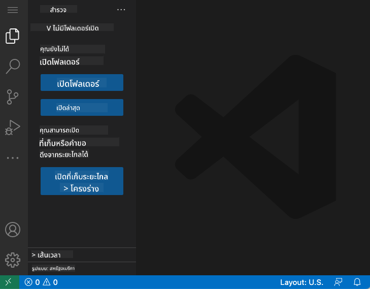
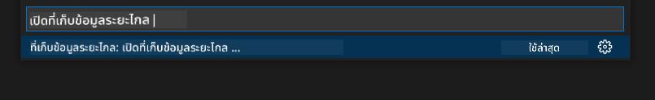
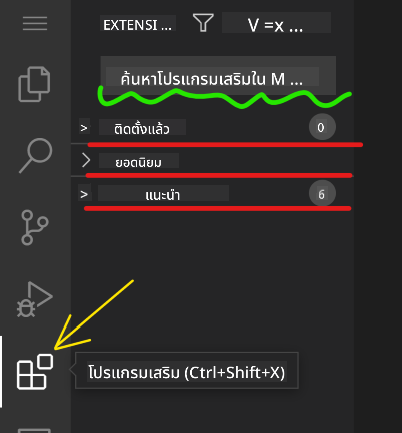

<!--
CO_OP_TRANSLATOR_METADATA:
{
  "original_hash": "7aa6e4f270d38d9cb17f2b5bd86b863d",
  "translation_date": "2025-08-26T22:26:31+00:00",
  "source_file": "8-code-editor/1-using-a-code-editor/README.md",
  "language_code": "th"
}
-->
# การใช้โปรแกรมแก้ไขโค้ด

บทเรียนนี้ครอบคลุมพื้นฐานการใช้ [VSCode.dev](https://vscode.dev) ซึ่งเป็นโปรแกรมแก้ไขโค้ดบนเว็บ เพื่อให้คุณสามารถแก้ไขโค้ดและมีส่วนร่วมในโปรเจกต์โดยไม่ต้องติดตั้งอะไรบนคอมพิวเตอร์ของคุณ

## วัตถุประสงค์การเรียนรู้

ในบทเรียนนี้ คุณจะได้เรียนรู้วิธี:

- ใช้โปรแกรมแก้ไขโค้ดในโปรเจกต์โค้ด
- ติดตามการเปลี่ยนแปลงด้วยระบบควบคุมเวอร์ชัน
- ปรับแต่งโปรแกรมแก้ไขสำหรับการพัฒนา

### สิ่งที่ต้องเตรียมก่อนเริ่ม

ก่อนเริ่มต้น คุณจะต้องสร้างบัญชีกับ [GitHub](https://github.com) หากยังไม่มีบัญชี ให้ไปที่ [GitHub](https://github.com/) และสร้างบัญชีใหม่

### บทนำ

โปรแกรมแก้ไขโค้ดเป็นเครื่องมือสำคัญสำหรับการเขียนโปรแกรมและการทำงานร่วมกับโปรเจกต์โค้ดที่มีอยู่ เมื่อคุณเข้าใจพื้นฐานของโปรแกรมแก้ไขและวิธีใช้ฟีเจอร์ต่าง ๆ คุณจะสามารถนำไปใช้เมื่อเขียนโค้ดได้

## เริ่มต้นใช้งาน VSCode.dev

[VSCode.dev](https://vscode.dev) เป็นโปรแกรมแก้ไขโค้ดบนเว็บ คุณไม่จำเป็นต้องติดตั้งอะไรเพื่อใช้งาน เพียงแค่เปิดเหมือนเว็บไซต์ทั่วไป เพื่อเริ่มต้นใช้งานโปรแกรมแก้ไข ให้เปิดลิงก์ต่อไปนี้: [https://vscode.dev](https://vscode.dev) หากคุณยังไม่ได้ลงชื่อเข้าใช้ [GitHub](https://github.com/) ให้ทำตามคำแนะนำเพื่อเข้าสู่ระบบหรือสร้างบัญชีใหม่แล้วลงชื่อเข้าใช้

เมื่อโหลดเสร็จแล้ว หน้าตาจะคล้ายกับภาพนี้:



มีสามส่วนหลัก เริ่มจากซ้ายไปขวา:

1. _แถบกิจกรรม_ ซึ่งมีไอคอนบางอย่าง เช่น แว่นขยาย 🔎, เกียร์ ⚙️ และอื่น ๆ
2. แถบกิจกรรมที่ขยายออก ซึ่งค่าเริ่มต้นคือ _Explorer_ เรียกว่า _แถบด้านข้าง_
3. และสุดท้าย พื้นที่โค้ดทางด้านขวา

คลิกที่แต่ละไอคอนเพื่อแสดงเมนูที่แตกต่างกัน เมื่อเสร็จแล้ว คลิกที่ _Explorer_ เพื่อกลับไปยังจุดเริ่มต้น

เมื่อคุณเริ่มสร้างหรือแก้ไขโค้ด จะเกิดขึ้นในพื้นที่ใหญ่ที่สุดทางด้านขวา คุณจะใช้พื้นที่นี้เพื่อดูโค้ดที่มีอยู่ด้วย ซึ่งคุณจะทำในขั้นตอนถัดไป

## เปิด GitHub Repository

สิ่งแรกที่คุณต้องทำคือเปิด GitHub repository มีหลายวิธีในการเปิด repository ในส่วนนี้คุณจะเห็นสองวิธีที่แตกต่างกันในการเปิด repository เพื่อเริ่มทำการเปลี่ยนแปลง

### 1. ใช้โปรแกรมแก้ไข

ใช้โปรแกรมแก้ไขเพื่อเปิด repository ระยะไกล หากคุณไปที่ [VSCode.dev](https://vscode.dev) คุณจะเห็นปุ่ม _"Open Remote Repository"_:


คุณยังสามารถใช้ _command palette_ ซึ่งเป็นช่องป้อนข้อมูลที่คุณสามารถพิมพ์คำใด ๆ ที่เป็นส่วนหนึ่งของคำสั่งหรือการกระทำเพื่อค้นหาคำสั่งที่เหมาะสม ใช้เมนูที่มุมบนซ้าย จากนั้นเลือก _View_ และเลือก _Command Palette_ หรือใช้คีย์ลัด: Ctrl-Shift-P (บน MacOS จะเป็น Command-Shift-P)



เมื่อเมนูเปิดขึ้น ให้พิมพ์ _open remote repository_ และเลือกตัวเลือกแรก repository หลายตัวที่คุณเป็นส่วนหนึ่งหรือที่คุณเปิดล่าสุดจะปรากฏขึ้น คุณยังสามารถใช้ URL GitHub เต็มรูปแบบเพื่อเลือกได้ ใช้ URL ต่อไปนี้และวางลงในช่อง:

```
https://github.com/microsoft/Web-Dev-For-Beginners
```

✅ หากสำเร็จ คุณจะเห็นไฟล์ทั้งหมดใน repository นี้โหลดในโปรแกรมแก้ไขข้อความ

### 2. ใช้ URL

คุณยังสามารถใช้ URL โดยตรงเพื่อโหลด repository ตัวอย่างเช่น URL เต็มรูปแบบสำหรับ repo ปัจจุบันคือ [https://github.com/microsoft/Web-Dev-For-Beginners](https://github.com/microsoft/Web-Dev-For-Beginners) แต่คุณสามารถเปลี่ยนโดเมน GitHub เป็น `VSCode.dev/github` และโหลด repository ได้โดยตรง URL ที่ได้จะเป็น [https://vscode.dev/github/microsoft/Web-Dev-For-Beginners](https://vscode.dev/github/microsoft/Web-Dev-For-Beginners)

## แก้ไขไฟล์

เมื่อคุณเปิด repository บนเบราว์เซอร์หรือ vscode.dev ขั้นตอนต่อไปคือการอัปเดตหรือเปลี่ยนแปลงโปรเจกต์

### 1. สร้างไฟล์ใหม่

คุณสามารถสร้างไฟล์ในโฟลเดอร์ที่มีอยู่ หรือสร้างในไดเรกทอรี/โฟลเดอร์ราก เพื่อสร้างไฟล์ใหม่ ให้เปิดตำแหน่ง/ไดเรกทอรีที่คุณต้องการบันทึกไฟล์และเลือกไอคอน _'New file ...'_ บนแถบกิจกรรม _(ซ้าย)_ ตั้งชื่อไฟล์และกด Enter


### 2. แก้ไขและบันทึกไฟล์ใน repository

การใช้ vscode.dev มีประโยชน์เมื่อคุณต้องการอัปเดตโปรเจกต์อย่างรวดเร็วโดยไม่ต้องโหลดซอฟต์แวร์ใด ๆ ในเครื่อง

เพื่ออัปเดตโค้ดของคุณ คลิกไอคอน 'Explorer' ซึ่งอยู่บนแถบกิจกรรมเพื่อดูไฟล์และโฟลเดอร์ใน repository เลือกไฟล์เพื่อเปิดในพื้นที่โค้ด ทำการเปลี่ยนแปลงและบันทึก


เมื่อคุณอัปเดตโปรเจกต์เสร็จแล้ว ให้เลือกไอคอน _`source control`_ ซึ่งมีการเปลี่ยนแปลงใหม่ทั้งหมดที่คุณทำใน repository

เพื่อดูการเปลี่ยนแปลงที่คุณทำในโปรเจกต์ ให้เลือกไฟล์ในโฟลเดอร์ `Changes` ในแถบกิจกรรมที่ขยายออกมา สิ่งนี้จะเปิด 'Working Tree' เพื่อให้คุณเห็นการเปลี่ยนแปลงที่คุณทำในไฟล์ สีแดงแสดงการลบออกจากโปรเจกต์ ในขณะที่สีเขียวแสดงการเพิ่ม


หากคุณพอใจกับการเปลี่ยนแปลงที่ทำ ให้เลื่อนเมาส์ไปที่โฟลเดอร์ `Changes` และคลิกปุ่ม `+` เพื่อเตรียมการเปลี่ยนแปลงสำหรับการ commit การเตรียมการหมายถึงการเตรียมการเปลี่ยนแปลงเพื่อ commit ไปยัง GitHub

หากคุณไม่พอใจกับการเปลี่ยนแปลงบางอย่างและต้องการยกเลิก ให้เลื่อนเมาส์ไปที่โฟลเดอร์ `Changes` และเลือกไอคอน `undo`

จากนั้น พิมพ์ `commit message` _(คำอธิบายของการเปลี่ยนแปลงที่คุณทำในโปรเจกต์)_ คลิกไอคอน `check` เพื่อ commit และ push การเปลี่ยนแปลงของคุณ

เมื่อทำงานกับโปรเจกต์เสร็จแล้ว ให้เลือกไอคอน `hamburger menu` ที่มุมบนซ้ายเพื่อกลับไปยัง repository บน github.com


## การใช้ Extensions

การติดตั้ง Extensions บน VSCode ช่วยเพิ่มฟีเจอร์ใหม่และตัวเลือกการปรับแต่งสภาพแวดล้อมการพัฒนาบนโปรแกรมแก้ไขของคุณเพื่อปรับปรุงการทำงาน Extensions เหล่านี้ยังช่วยเพิ่มการรองรับภาษาการเขียนโปรแกรมหลายภาษา และมักจะเป็น Extensions ทั่วไปหรือ Extensions เฉพาะภาษา

เพื่อเรียกดูรายการ Extensions ที่มีอยู่ทั้งหมด ให้คลิกไอคอน _`Extensions`_ บนแถบกิจกรรมและเริ่มพิมพ์ชื่อ Extension ในช่องข้อความที่มีป้ายกำกับ _'Search Extensions in Marketplace'_ คุณจะเห็นรายการ Extensions แต่ละรายการมี **ชื่อ Extension, ชื่อผู้เผยแพร่, คำอธิบาย 1 ประโยค, จำนวนการดาวน์โหลด** และ **การให้คะแนนดาว**


คุณยังสามารถดู Extensions ที่ติดตั้งไว้ก่อนหน้านี้ได้โดยขยายโฟลเดอร์ _`Installed`_ Extensions ยอดนิยมที่นักพัฒนาส่วนใหญ่ใช้ในโฟลเดอร์ _`Popular`_ และ Extensions ที่แนะนำสำหรับคุณโดยผู้ใช้ใน workspace เดียวกันหรือจากไฟล์ที่คุณเปิดล่าสุดในโฟลเดอร์ _`Recommended`_



### 1. ติดตั้ง Extensions

เพื่อติดตั้ง Extension ให้พิมพ์ชื่อ Extension ในช่องค้นหาและคลิกเพื่อดูข้อมูลเพิ่มเติมเกี่ยวกับ Extension ในพื้นที่โค้ดเมื่อปรากฏในแถบกิจกรรมที่ขยายออกมา

คุณสามารถคลิกปุ่ม _Install_ สีน้ำเงินบนแถบกิจกรรมที่ขยายออกมาเพื่อติดตั้ง หรือใช้ปุ่ม Install ที่ปรากฏในพื้นที่โค้ดเมื่อคุณเลือก Extension เพื่อโหลดข้อมูลเพิ่มเติม


### 2. ปรับแต่ง Extensions

หลังจากติดตั้ง Extension คุณอาจต้องปรับเปลี่ยนพฤติกรรมและปรับแต่งตามความต้องการของคุณ เพื่อทำสิ่งนี้ ให้เลือกไอคอน Extensions และครั้งนี้ Extension ของคุณจะปรากฏในโฟลเดอร์ _Installed_ คลิกที่ _**Gear icon**_ และไปที่ _Extensions Setting_


### 3. จัดการ Extensions

หลังจากติดตั้งและใช้ Extension แล้ว vscode.dev มีตัวเลือกในการจัดการ Extension ตามความต้องการที่แตกต่างกัน ตัวอย่างเช่น คุณอาจเลือก:

- **Disable:** _(คุณสามารถปิดใช้งาน Extension ชั่วคราวเมื่อคุณไม่ต้องการใช้งาน แต่ไม่ต้องการถอนการติดตั้งทั้งหมด)_

    เลือก Extension ที่ติดตั้งในแถบกิจกรรมที่ขยายออกมา > คลิกที่ Gear icon > เลือก 'Disable' หรือ 'Disable (Workspace)' **หรือ** เปิด Extension ในพื้นที่โค้ดและคลิกปุ่ม Disable สีน้ำเงิน

- **Uninstall:** เลือก Extension ที่ติดตั้งในแถบกิจกรรมที่ขยายออกมา > คลิกที่ Gear icon > เลือก 'Uninstall' **หรือ** เปิด Extension ในพื้นที่โค้ดและคลิกปุ่ม Uninstall สีน้ำเงิน

---

## งานที่ได้รับมอบหมาย

[สร้างเว็บไซต์เรซูเม่โดยใช้ vscode.dev](https://github.com/microsoft/Web-Dev-For-Beginners/blob/main/8-code-editor/1-using-a-code-editor/assignment.md)

## ทบทวนและศึกษาด้วยตนเอง

อ่านเพิ่มเติมเกี่ยวกับ [VSCode.dev](https://code.visualstudio.com/docs/editor/vscode-web?WT.mc_id=academic-0000-alfredodeza) และฟีเจอร์อื่น ๆ ของมัน

---

**ข้อจำกัดความรับผิดชอบ**:  
เอกสารนี้ได้รับการแปลโดยใช้บริการแปลภาษา AI [Co-op Translator](https://github.com/Azure/co-op-translator) แม้ว่าเราจะพยายามให้การแปลมีความถูกต้องมากที่สุด แต่โปรดทราบว่าการแปลอัตโนมัติอาจมีข้อผิดพลาดหรือความไม่ถูกต้อง เอกสารต้นฉบับในภาษาดั้งเดิมควรถือเป็นแหล่งข้อมูลที่เชื่อถือได้ สำหรับข้อมูลที่สำคัญ ขอแนะนำให้ใช้บริการแปลภาษามืออาชีพ เราไม่รับผิดชอบต่อความเข้าใจผิดหรือการตีความที่ผิดพลาดซึ่งเกิดจากการใช้การแปลนี้