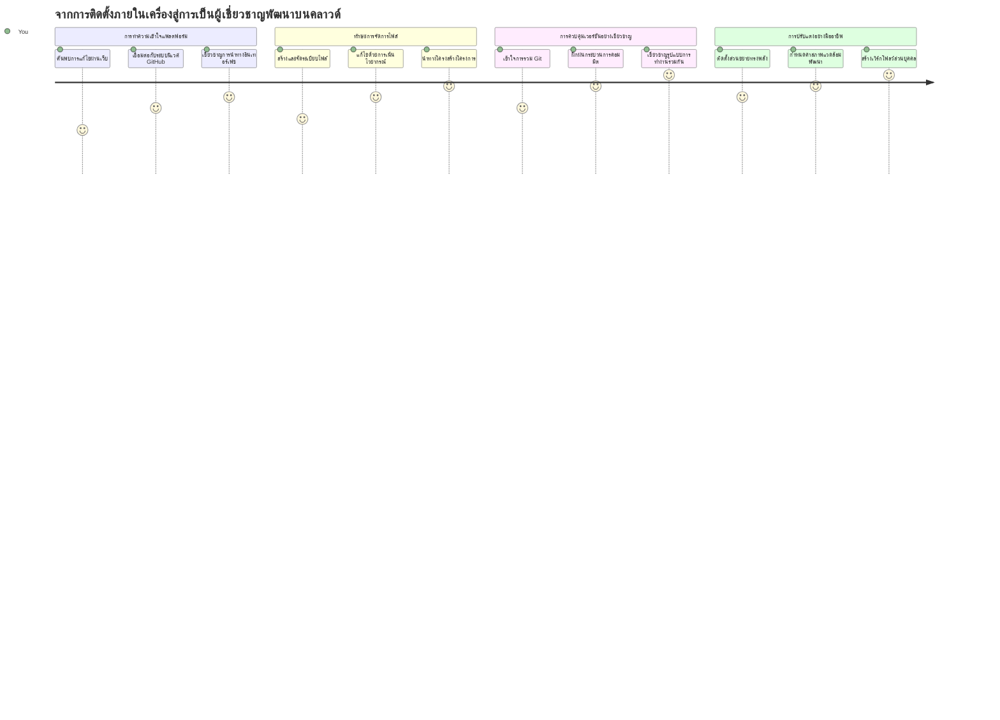
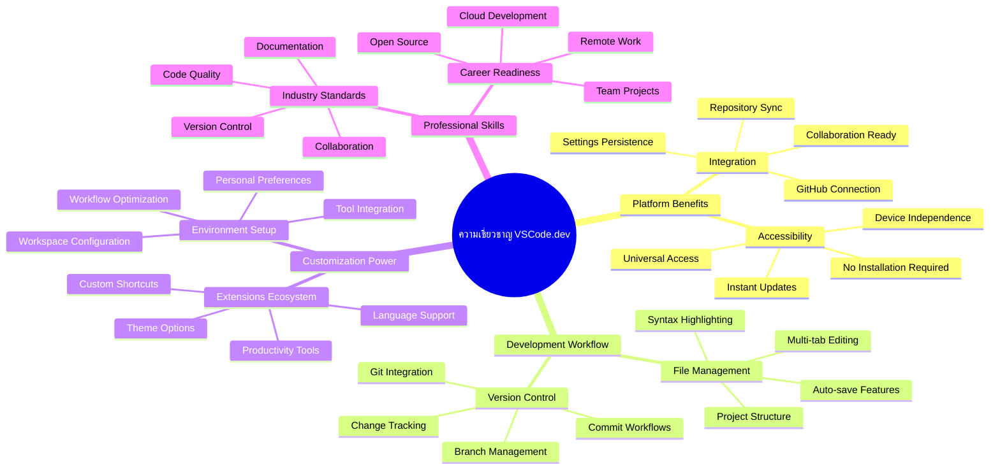
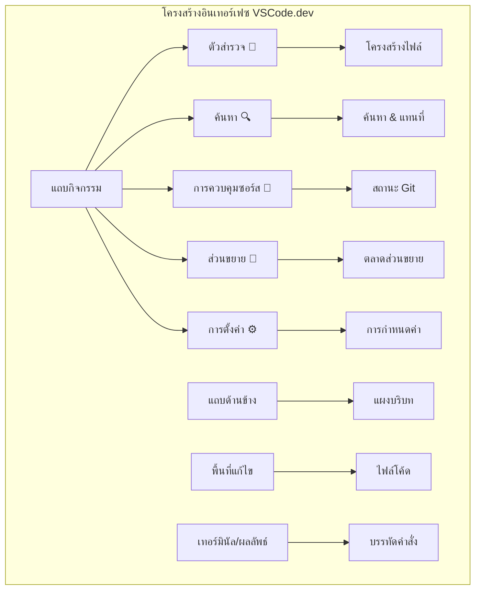
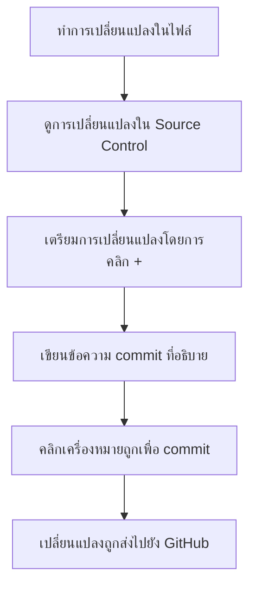
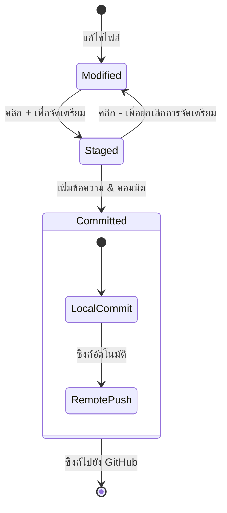
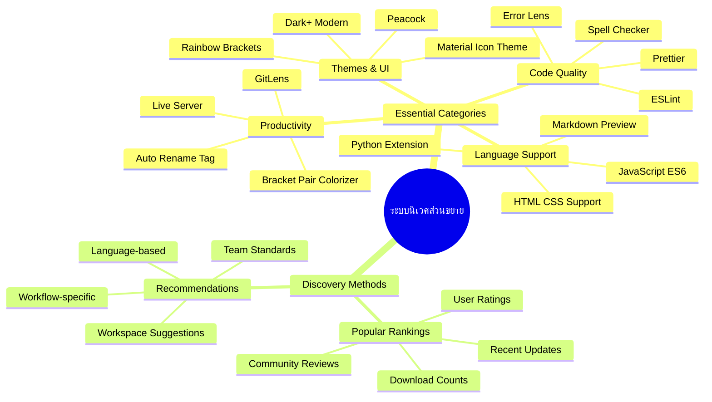
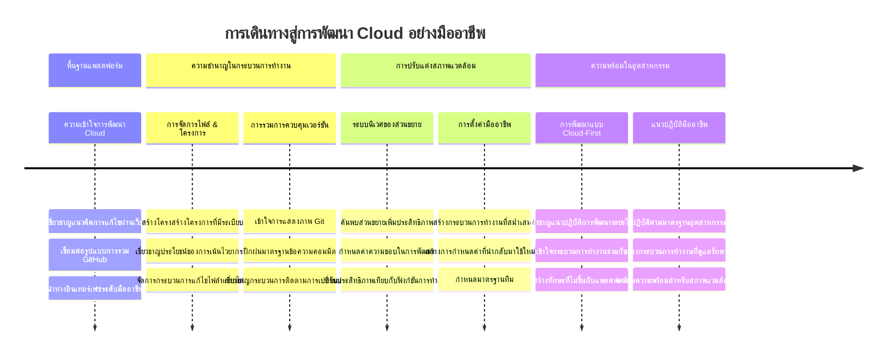

<!--
CO_OP_TRANSLATOR_METADATA:
{
  "original_hash": "a9a3bcc037a447e2d8994d99e871cd9f",
  "translation_date": "2026-01-06T21:44:34+00:00",
  "source_file": "8-code-editor/1-using-a-code-editor/README.md",
  "language_code": "th"
}
-->
# การใช้ตัวแก้ไขโค้ด: การชำนาญ VSCode.dev

จำได้ไหมใน *The Matrix* เมื่อ Neo ต้องเสียบปลั๊กเข้ากับเทอร์มินัลคอมพิวเตอร์ขนาดใหญ่เพื่อเข้าถึงโลกดิจิทัล? เครื่องมือพัฒนาเว็บในวันนี้เป็นเรื่องตรงกันข้าม – มีความสามารถที่ทรงพลังอย่างไม่น่าเชื่อที่เข้าถึงได้จากทุกที่ VSCode.dev เป็นตัวแก้ไขโค้ดบนเบราว์เซอร์ที่นำเครื่องมือพัฒนาระดับมืออาชีพมาไว้บนอุปกรณ์ใดก็ได้ที่มีการเชื่อมต่ออินเทอร์เน็ต

เหมือนกับที่เครื่องพิมพ์ทำให้หนังสือเข้าถึงทุกคน ไม่ใช่แค่พระนักเขียนในวัดเท่านั้น VSCode.dev ทำให้โค้ดดิ้งเป็นของประชาชน คุณสามารถทำงานในโปรเจคจากคอมพิวเตอร์ในห้องสมุด ห้องแล็บโรงเรียน หรือที่ใดก็ได้ที่คุณเข้าถึงเบราว์เซอร์ได้ ไม่มีการติดตั้ง ไม่มีข้อจำกัดแบบ "ฉันต้องการการตั้งค่าของฉันเฉพาะ"

เมื่อจบบทเรียนนี้ คุณจะเข้าใจวิธีนำทางใน VSCode.dev เปิดรีโพสิทอรี GitHub ได้โดยตรงในเบราว์เซอร์ และใช้ Git สำหรับควบคุมเวอร์ชัน – ทักษะทั้งหมดที่นักพัฒนาอาชีพร่วมใช้อย่างทุกวัน

## ⚡ สิ่งที่คุณทำได้ใน 5 นาทีถัดไป

**เส้นทางเริ่มต้นอย่างรวดเร็วสำหรับนักพัฒนาที่เร่งรีบ**


- **นาทีที่ 1**: เข้าสู่ [vscode.dev](https://vscode.dev) – ไม่ต้องติดตั้ง
- **นาทีที่ 2**: ลงชื่อเข้าใช้ด้วย GitHub เพื่อเชื่อมรีโพสิทอรีของคุณ
- **นาทีที่ 3**: ลองเทคนิค URL: เปลี่ยน `github.com` เป็น `vscode.dev/github` ใน URL รีโพสิทอรีใดก็ได้
- **นาทีที่ 4**: สร้างไฟล์ใหม่และดูไฮไลต์ไวยากรณ์ทำงานอัตโนมัติ
- **นาทีที่ 5**: ทำการเปลี่ยนแปลงและคอมมิตผ่านแผงควบคุมต้นทาง

**URL ทดสอบด่วน**:  
```
# Transform this:
github.com/microsoft/Web-Dev-For-Beginners

# Into this:
vscode.dev/github/microsoft/Web-Dev-For-Beginners
```
  
**ทำไมเรื่องนี้ถึงสำคัญ**: ใน 5 นาที คุณจะได้สัมผัสความเสรีในการเขียนโค้ดจากที่ใดก็ได้ด้วยเครื่องมือระดับมืออาชีพ สิ่งนี้เป็นตัวแทนของอนาคตของการพัฒนา – เข้าถึงได้ ทรงพลัง และทันที

## 🗺️ การเดินทางเรียนรู้ผ่านการพัฒนาบนคลาวด์


**ปลายทางของการเดินทางของคุณ**: เมื่อจบบทเรียนนี้ คุณจะชำนาญสภาพแวดล้อมการพัฒนาบนคลาวด์ระดับมืออาชีพที่ทำงานได้จากอุปกรณ์ใดก็ได้ ช่วยให้คุณเขียนโค้ดด้วยเครื่องมือเดียวกับที่นักพัฒนาของบริษัทเทคโนโลยีใหญ่ใช้

## สิ่งที่คุณจะได้เรียนรู้

หลังจากที่เราผ่านไปด้วยกัน คุณจะสามารถ:

- นำทาง VSCode.dev เหมือนบ้านหลังที่สอง – หาทุกอย่างที่ต้องการโดยไม่หลงทาง
- เปิดรีโพสิทอรี GitHub ใดก็ได้ในเบราว์เซอร์และเริ่มแก้ไขทันที (อันนี้ค่อนข้างมหัศจรรย์!)
- ใช้ Git เพื่อติดตามการเปลี่ยนแปลงและบันทึกความก้าวหน้าเหมือนมืออาชีพ
- เพิ่มประสิทธิภาพตัวแก้ไขด้วยส่วนขยายที่ทำให้เขียนโค้ดเร็วและสนุกขึ้น
- สร้างและจัดระเบียบไฟล์โครงการด้วยความมั่นใจ

## สิ่งที่คุณต้องการ

ข้อกำหนดง่าย ๆ:

- [บัญชี GitHub](https://github.com) ฟรี (เราจะแนะนำขั้นตอนการสร้างหากจำเป็น)
- ความคุ้นเคยพื้นฐานกับเว็บเบราว์เซอร์
- บทเรียนพื้นฐาน GitHub ให้นำเสนอข้อมูลเบื้องต้นที่เป็นประโยชน์ ถึงแม้จะไม่จำเป็นต้องเรียนก่อน

> 💡 **ใหม่กับ GitHub?** การสร้างบัญชีเป็นเรื่องฟรีและใช้เวลาไม่กี่นาที เหมือนบัตรห้องสมุดที่ให้คุณเข้าถึงหนังสือทั่วโลก บัญชี GitHub เปิดประตูสู่รีโพสิทอรีโค้ดทั่วอินเทอร์เน็ต

## 🧠 ภาพรวมระบบนิเวศของการพัฒนาบนคลาวด์


**หลักการสำคัญ**: สภาพแวดล้อมการพัฒนาบนคลาวด์แสดงถึงอนาคตของการเขียนโค้ด – การจัดหาเครื่องมือระดับมืออาชีพที่เข้าถึงได้, ร่วมมือกันได้, และไม่ขึ้นกับแพลตฟอร์ม

## ทำไมตัวแก้ไขโค้ดบนเว็บจึงสำคัญ

ก่อนยุคอินเทอร์เน็ต นักวิทยาศาสตร์จากมหาวิทยาลัยต่าง ๆ ไม่สามารถแชร์งานวิจัยได้ง่าย ๆ จากนั้นก็มี ARPANET ในยุค 1960 ที่เชื่อมต่อคอมพิวเตอร์ข้ามระยะทาง ตัวแก้ไขโค้ดบนเว็บใช้หลักการเดียวกัน – ทำให้เครื่องมือทรงพลังเข้าถึงได้โดยไม่ขึ้นกับตำแหน่งหรืออุปกรณ์

ตัวแก้ไขโค้ดคือพื้นที่ทำงานพัฒนาของคุณ ที่คุณเขียน แก้ไข และจัดระเบียบไฟล์โค้ด แตกต่างจากตัวแก้ไขข้อความธรรมดา ตัวแก้ไขโค้ดมืออาชีพมีไฮไลต์ไวยากรณ์, ตรวจจับข้อผิดพลาด และจัดการโปรเจค

VSCode.dev นำความสามารถเหล่านี้มาสู่เบราว์เซอร์ของคุณ:

**ข้อดีของการแก้ไขบนเว็บ:**

| คุณสมบัติ | คำอธิบาย | ประโยชน์เชิงปฏิบัติ |
|---------|-------------|----------|
| **อิสระจากแพลตฟอร์ม** | ใช้งานบนอุปกรณ์ที่มีเบราว์เซอร์ได้ทุกชนิด | ทำงานจากคอมพิวเตอร์ต่าง ๆ ได้อย่างราบรื่น |
| **ไม่ต้องติดตั้ง** | เข้าถึงผ่าน URL เว็บ | ข้ามข้อจำกัดการติดตั้งซอฟต์แวร์ |
| **อัปเดตอัตโนมัติ** | ใช้งานเวอร์ชันล่าสุดเสมอ | เข้าถึงฟีเจอร์ใหม่โดยไม่ต้องอัปเดตด้วยตนเอง |
| **บูรณาการรีโพสิทอรี** | เชื่อมตรงกับ GitHub | แก้ไขโค้ดโดยไม่ต้องจัดการไฟล์ในเครื่อง |

**ผลกระทบเชิงปฏิบัติ:**
- ความต่อเนื่องของงานในสภาพแวดล้อมต่างๆ
- ส่วนติดต่อผู้ใช้ที่เหมือนกันไม่ขึ้นกับระบบปฏิบัติการ
- ความสามารถร่วมมือทันที
- ลดความต้องการพื้นที่เก็บข้อมูลในเครื่อง

## การสำรวจ VSCode.dev

เหมือนที่ห้องแล็บของมารี คูรีมีอุปกรณ์ซับซ้อนในพื้นที่ที่ค่อนข้างเรียบง่าย VSCode.dev รวมเครื่องมือพัฒนาระดับมืออาชีพเข้าไปในอินเทอร์เฟซบนเบราว์เซอร์ แอปเว็บนี้มอบฟังก์ชันหลักเหมือนตัวแก้ไขโค้ดบนเดสก์ท็อป

เริ่มต้นโดยไปที่ [vscode.dev](https://vscode.dev) ในเบราว์เซอร์ อินเตอร์เฟซจะโหลดขึ้นโดยไม่ต้องดาวน์โหลดหรือติดตั้งระบบ – นี่คือการประยุกต์ตามหลักการ cloud computing โดยตรง

### การเชื่อมต่อบัญชี GitHub ของคุณ

เหมือนโทรศัพท์ของ Alexander Graham Bell ที่เชื่อมสถานที่ห่างไกล การลิงก์บัญชี GitHub ของคุณทำให้ VSCode.dev เชื่อมกับรีโพสิทอรีโค้ดของคุณ เมื่อถูกขอให้ลงชื่อเข้าใช้ด้วย GitHub ขอแนะนำให้ยอมรับการเชื่อมต่อนี้

**การรวม GitHub ให้ข้อดี:**
- เข้าถึงรีโพสิทอรีของคุณได้โดยตรงในตัวแก้ไข
- ซิงค์การตั้งค่าและส่วนขยายข้ามอุปกรณ์
- การทำงานบันทึกเข้ากับ GitHub อย่างราบรื่น
- สภาพแวดล้อมการพัฒนาที่ปรับแต่งได้ส่วนตัว

### ทำความรู้จักกับพื้นที่ทำงานใหม่ของคุณ

เมื่อทุกอย่างโหลดขึ้น คุณจะเห็นพื้นที่ทำงานที่สะอาดสวยงาม ออกแบบมาเพื่อให้คุณมีสมาธิกับสิ่งที่สำคัญ – โค้ดของคุณ!


**นี่คือการพาทัวร์รอบบริเวณ:**
- **แถบกิจกรรม** (แถบด้านซ้าย): ตัวนำทางหลักของคุณ โดยมี Explorer 📁, ค้นหา 🔍, ควบคุมต้นทาง 🌿, ส่วนขยาย 🧩 และ การตั้งค่า ⚙️
- **แถบด้านข้าง** (แผงข้าง ๆ): เปลี่ยนเพื่อแสดงข้อมูลที่เกี่ยวข้องตามที่คุณเลือก
- **พื้นที่แก้ไข** (พื้นที่ใหญ่ตรงกลาง): นี่คือที่เวทมนตร์เกิดขึ้น – พื้นที่เขียนโค้ดหลักของคุณ

**สละเวลาสำรวจ:**
- คลิกไอคอนในแถบกิจกรรมและดูว่าทำงานอย่างไรบ้าง
- สังเกตว่าแถบด้านข้างอัพเดตแสดงข้อมูลต่างกัน – เจ๋งใช่ไหม?
- มุมมอง Explorer (📁) น่าจะเป็นที่ที่คุณใช้เวลาส่วนใหญ่ ให้คุ้นเคยกับมัน



## การเปิดรีโพสิทอรี GitHub

ก่อนยุคอินเทอร์เน็ต นักวิจัยต้องเดินทางไปห้องสมุดเพื่อเข้าถึงเอกสาร รีโพสิทอรี GitHub ก็ทำงานคล้ายกัน – เป็นชุดรวมของโค้ดที่เก็บระยะไกล VSCode.dev ขจัดขั้นตอนดั้งเดิมที่ต้องดาวน์โหลดรีโพสิทอรีลงเครื่องก่อนแก้ไข

ฟีเจอร์นี้ทำให้เข้าถึงรีโพสิทอรีสาธารณะใดก็ได้เพื่อดู แก้ไข หรือร่วมพัฒนาได้ทันที นี่คือสองวิธีในการเปิดรีโพสิทอรี:

### วิธีที่ 1: เลือกด้วยการคลิก

เหมาะสำหรับการเริ่มต้นใหม่ใน VSCode.dev และต้องการเปิดรีโพสิทอรีเฉพาะ วิธีนี้ง่ายและเหมาะสำหรับผู้เริ่มต้น:

**วิธีทำ:**

1. ไปที่ [vscode.dev](https://vscode.dev) หากยังไม่เข้าสู่หน้า
2. มองหาปุ่ม "Open Remote Repository" บนหน้าต้อนรับและคลิก

   

3. วาง URL รีโพสิทอรี GitHub ใดก็ได้ (ลองอันนี้: `https://github.com/microsoft/Web-Dev-For-Beginners`)
4. กด Enter แล้วดูเวทมนตร์เกิดขึ้น!

**ทิปโปร – ทางลัด Command Palette:**

อยากรู้สึกเป็นพ่อมดการโค้ดไหม? ลองทางลัดแป้นพิมพ์นี้: Ctrl+Shift+P (หรือ Cmd+Shift+P บน Mac) เพื่อเปิด Command Palette:


**Command Palette เหมือนกับเครื่องมือค้นหาของทุกอย่างที่คุณทำได้:**
- พิมพ์ "open remote" แล้วมันจะหาเครื่องมือเปิดรีโพสิทอรีให้
- มันจำรีโพสิทอรีที่คุณเปิดล่าสุดได้ (สะดวกมาก!)
- พอชินกับมันแล้วคุณจะรู้สึกเขียนโค้ดเร็วขึ้นมาก
- พูดง่ายๆ ว่าเหมือน VSCode.dev มีคำสั่ง "เฮ้ Siri" แต่สำหรับโค้ดดิ้ง

### วิธีที่ 2: เทคนิคแก้ไข URL

เหมือนกับ HTTP และ HTTPS ใช้โพรโตคอลต่างกันแต่ยังใช้โครงสร้างโดเมนเดียวกัน VSCode.dev ใช้รูปแบบ URL ที่สะท้อนระบบที่อยู่ของ GitHub URL รีโพสิทอรี GitHub ใดก็ได้สามารถแก้ไขเพื่อเปิดตรงใน VSCode.dev

**รูปแบบการแปลง URL:**

| ประเภทรีโพสิทอรี | URL GitHub | URL VSCode.dev |
|----------------|---------------------|----------------|
| **รีโพสิทอรีสาธารณะ** | `github.com/microsoft/Web-Dev-For-Beginners` | `vscode.dev/github/microsoft/Web-Dev-For-Beginners` |
| **โปรเจคส่วนตัว** | `github.com/your-username/my-project` | `vscode.dev/github/your-username/my-project` |
| **รีโพสิทอรีที่เข้าถึงได้ทั้งหมด** | `github.com/their-username/awesome-repo` | `vscode.dev/github/their-username/awesome-repo` |

**วิธีใช้งาน:**
- แทนที่ `github.com` ด้วย `vscode.dev/github`
- ส่วนอื่นของ URL คงเดิมทั้งหมด
- ใช้ได้กับรีโพสิทอรีสาธารณะทุกแห่ง
- ให้สิทธิ์การแก้ไขแบบทันที

> 💡 **เคล็ดลับเปลี่ยนชีวิต**: เพิ่มเวอร์ชัน VSCode.dev ของรีโพสิทอรีโปรดของคุณเป็นบุ๊คมาร์ก ฉันมีบุ๊คมาร์กที่ชื่อ "แก้ไข Portfolio ของฉัน" และ "แก้ไขเอกสาร" พาไปที่โหมดแก้ไขทันที!

**ควรใช้วิธีไหน?**
- **วิธีใช้ส่วนติดต่อ**: ดีเมื่อคุณกำลังสำรวจหรือจำชื่อรีโพสิทอรีไม่ได้แน่นอน
- **เทคนิคแก้ไข URL**: เหมาะสำหรับเข้าถึงอย่างรวดเร็วเมื่อรู้เป้าหมายชัดเจน

### 🎯 การตรวจสอบความเข้าใจ: การเข้าถึงการพัฒนาบนคลาวด์

**หยุดคิดและไตร่ตรอง**: คุณเพิ่งเรียนรู้สองวิธีในการเข้าถึงรีโพสิทอรีโค้ดผ่านเว็บเบราว์เซอร์ ซึ่งเป็นการเปลี่ยนแปลงพื้นฐานวิธีการพัฒนา

**ประเมินตนเองอย่างรวดเร็ว**:
- คุณอธิบายได้ไหมว่าทำไมการแก้ไขบนเว็บจึงขจัดขั้นตอนการเซ็ตอัพสภาพแวดล้อมพัฒนาแบบเดิม?
- เทคนิคแก้ไข URL มีข้อดีอะไรเหนือการโคลน git ลงเครื่อง?
- วิธีนี้เปลี่ยนวิธีการที่คุณจะร่วมพัฒนาโครงการเปิดอย่างไรได้บ้าง?

**เชื่อมต่อกับโลกจริง**: บริษัทใหญ่เช่น GitHub, GitLab และ Replit สร้างแพลตฟอร์มพัฒนาตามหลักการคลาวด์เป็นหลัก คุณกำลังเรียนรู้กระบวนการเดียวกับทีมพัฒนามืออาชีพทั่วโลก

**คำถามท้าทาย**: การพัฒนาบนคลาวด์จะเปลี่ยนวิธีการสอนเขียนโค้ดในโรงเรียนอย่างไร? พิจารณาความต้องการอุปกรณ์ การจัดการซอฟต์แวร์ และความเป็นไปได้ในการร่วมมือ

## การทำงานกับไฟล์และโปรเจค

ตอนนี้ที่คุณเปิดรีโพสิทอรีแล้ว มาเริ่มสร้างกันเลย! VSCode.dev ให้ทุกอย่างที่คุณต้องการเพื่อสร้าง แก้ไข และจัดระเบียบไฟล์โค้ดของคุณ คิดว่ามันเหมือนเวิร์กช็อปดิจิทัลของคุณ – ทุกเครื่องมืออยู่ที่ที่คุณต้องการ

มาดูงานประจำวันที่จะเป็นส่วนใหญ่ของการไหลงานเขียนโค้ดของคุณ

### การสร้างไฟล์ใหม่

เหมือนจัดระเบียบแบบแปลนในสำนักงานสถาปนิก การสร้างไฟล์ใน VSCode.dev มีแนวทางเป็นระบบ ระบบรองรับไฟล์เว็บพัฒนามาตรฐานทั้งหมด

**ขั้นตอนการสร้างไฟล์:**

1. ไปที่โฟลเดอร์เป้าหมายในแถบ Explorer ด้านข้าง
2. เลื่อนเมาส์ไปที่ชื่อโฟลเดอร์เพื่อแสดงไอคอน "ไฟล์ใหม่" (📄+)
3. พิมพ์ชื่อไฟล์พร้อมนามสกุลที่เหมาะสม (`style.css`, `script.js`, `index.html`)
4. กด Enter เพื่อสร้างไฟล์


**กฎการตั้งชื่อ:**
- ใช้ชื่อที่บ่งบอกวัตถุประสงค์ของไฟล์
- ใส่นามสกุลไฟล์เพื่อให้ไฮไลต์ไวยากรณ์ทำงานถูกต้อง
- ใช้รูปแบบชื่อที่สม่ำเสมอตลอดโปรเจค
- ใช้ตัวพิมพ์เล็กและขีดกลางแทนช่องว่าง

### การแก้ไขและบันทึกไฟล์

นี่คือส่วนที่สนุกจริง ๆ ตัวแก้ไขของ VSCode.dev เต็มไปด้วยฟีเจอร์ช่วยให้โค้ดลื่นไหลและเข้าใจง่าย เหมือนมีผู้ช่วยเขียนอัจฉริยะ แต่สำหรับโค้ด

**กระบวนการแก้ไขของคุณ:**

1. คลิกไฟล์ใดก็ได้ใน Explorer เพื่อเปิดในพื้นที่หลัก
2. เริ่มพิมพ์และดู VSCode.dev ช่วยด้วยสี, คำแนะนำ และการจับข้อผิดพลาด
3. บันทึกงานด้วย Ctrl+S (Windows/Linux) หรือ Cmd+S (Mac) – แม้มันจะเซฟอัตโนมัติด้วย!


**สิ่งเจ๋งที่เกิดขึ้นขณะเขียนโค้ด:**
- โค้ดของคุณจะถูกทำสีสวยงามทำให้อ่านง่าย
- VSCode.dev แนะนำข้อความเติมเต็มขณะพิมพ์ (เหมือน auto-correct แต่ฉลาดกว่า)
- ตรวจจับคำผิดและข้อผิดพลาดก่อนที่คุณจะบันทึก
- เปิดไฟล์หลายไฟล์พร้อมกันในแท็บ เหมือนใช้งานเบราว์เซอร์
- ทุกอย่างบันทึกอัตโนมัติในพื้นหลัง

> ⚠️ **ทิปด่วน**: แม้จะมี auto-save คอยรองรับแล้ว กด Ctrl+S หรือ Cmd+S ก็ยังเป็นนิสัยที่ดี มันบันทึกทันทีและเปิดใช้ฟีเจอร์ช่วยเหลือเช่นตรวจจับข้อผิดพลาด

### การควบคุมเวอร์ชันด้วย Git

เหมือนนักโบราณคดีทำบันทึกรายละเอียดชั้นขุดค้น Git ติดตามการเปลี่ยนแปลงโค้ดของคุณตามเวลา ระบบนี้เก็บประวัติโครงการและช่วยให้คุณย้อนกลับไปเวอร์ชันก่อนหน้าได้เมื่อจำเป็น VSCode.dev รวมฟังก์ชัน Git ไว้ด้วย

**อินเทอร์เฟซควบคุมต้นทาง:**

1. เข้าถึงแผงควบคุมต้นทางผ่านไอคอน 🌿 ในแถบกิจกรรม
2. ไฟล์ที่แก้ไขจะแสดงในส่วน "Changes"
3. การแยกสีบอกประเภทการเปลี่ยนแปลง: สีเขียวสำหรับการเพิ่ม, สีแดงสำหรับการลบ


**การบันทึกงาน (กระบวนการ commit):**



**นี่คือขั้นตอนทีละขั้นตอนของคุณ:**
- คลิกไอคอน "+" ข้างไฟล์ที่ต้องการบันทึก (เพื่อ "stage" ไฟล์เหล่านั้น)
- ตรวจสอบอีกครั้งว่าคุณพอใจกับการเปลี่ยนแปลงทั้งหมดที่ได้จัดเตรียมไว้แล้ว
- เขียนโน้ตสั้นๆ อธิบายสิ่งที่คุณทำ (นี่คือ "commit message" ของคุณ)
- คลิกปุ่มเครื่องหมายถูกเพื่อบันทึกทุกอย่างลงใน GitHub
- หากเปลี่ยนใจเกี่ยวกับบางอย่าง ไอคอนเลิกทำจะช่วยให้คุณทิ้งการเปลี่ยนแปลงได้

**การเขียนข้อความ commit ที่ดี (ง่ายกว่าที่คิด!):**
- แค่บรรยายสิ่งที่คุณทำ เช่น "เพิ่มฟอร์มติดต่อ" หรือ "แก้ไขเมนูนำทางเสีย"
- ให้สั้นและชัดเจน – ยาวเท่าความยาวทวีต ไม่ใช่เรียงความ
- เริ่มต้นด้วยคำกริยา เช่น "เพิ่ม", "แก้ไข", "อัปเดต" หรือ "ลบ"
- **ตัวอย่างดีๆ**: "เพิ่มเมนูนำทางแบบตอบสนอง", "แก้ไขปัญหาเลย์เอาต์บนมือถือ", "อัปเดตสีเพื่อเข้าถึงได้ดีขึ้น"

> 💡 **เคล็ดลับนำทางด่วน**: ใช้เมนูแฮมเบอร์เกอร์ (☰) ที่มุมบนซ้ายเพื่อกลับไปยังรีโพซิทอรี GitHub ของคุณและดูการเปลี่ยนแปลงที่คุณคอมมิตออนไลน์ มันเหมือนกับประตูเชื่อมระหว่างสภาพแวดล้อมแก้ไขกับที่อยู่อาศัยโปรเจกต์ของคุณบน GitHub!

## การเพิ่มฟังก์ชันด้วยส่วนขยาย

เหมือนกับเวิร์กช็อปของช่างฝีมือที่มีเครื่องมือพิเศษสำหรับงานแต่ละอย่าง VSCode.dev สามารถปรับแต่งได้ด้วยส่วนขยายที่เพิ่มความสามารถเฉพาะ ตัวปลั๊กอินที่พัฒนาจากชุมชนเหล่านี้ตอบโจทย์ความต้องการด้านการพัฒนาทั่วไป เช่น การจัดรูปแบบโค้ด, การดูตัวอย่างสด และการผนวกกับ Git อย่างลึกซึ้ง

ตลาดส่วนขยายมีเครื่องมือฟรีนับพันที่สร้างโดยนักพัฒนาทั่วโลก แต่ละส่วนขยายแก้ปัญหาในเวิร์กโฟลว์เฉพาะ ช่วยให้คุณสร้างสภาพแวดล้อมพัฒนาที่ปรับแต่งได้เหมาะกับความต้องการและความชอบของคุณ


### ค้นหาส่วนขยายที่เหมาะกับคุณ

ตลาดส่วนขยายนั้นจัดระเบียบดีมาก คุณจะไม่สับสนเวลาค้นหาสิ่งที่ต้องการ มันออกแบบมาเพื่อช่วยให้คุณค้นพบทั้งเครื่องมือเฉพาะและของเจ๋งที่คุณอาจไม่เคยรู้จักมาก่อน!

**วิธีเข้าสู่ตลาดส่วนขยาย:**

1. คลิกที่ไอคอนส่วนขยาย (🧩) ในแถบกิจกรรม
2. ลองเรียกดูหรือตามหาสิ่งเฉพาะที่ต้องการ
3. คลิกสิ่งที่ดูน่าสนใจเพื่อเรียนรู้เพิ่มเติม


**สิ่งที่คุณจะเห็นในนั้น:**

| หมวดหมู่ | สิ่งที่อยู่ข้างใน | ประโยชน์ |
|----------|------------------|----------|
| **ติดตั้งแล้ว** | ส่วนขยายที่คุณเพิ่มไปแล้ว | ชุดเครื่องมือสำหรับการเขียนโค้ดส่วนตัวของคุณ |
| **ยอดนิยม** | ที่ได้รับความนิยมสูงสุด | สิ่งที่นักพัฒนาส่วนใหญ่ไว้วางใจ |
| **แนะนำ** | คำแนะนำอัจฉริยะสำหรับโปรเจกต์ของคุณ | คำแนะนำที่ช่วยเหลือจาก VSCode.dev |

**สิ่งที่ทำให้เรียกดูง่าย:**
- แต่ละส่วนขยายแสดงคะแนนรีวิว, จำนวนดาวน์โหลด และความคิดเห็นของผู้ใช้จริง
- คุณจะเห็นภาพหน้าจอและคำอธิบายชัดเจนว่าทำอะไรได้บ้าง
- ทุกอย่างมีข้อมูลความเข้ากันได้อย่างชัดเจน
- มีข้อเสนอแนะส่วนขยายที่คล้ายกันเพื่อให้คุณเปรียบเทียบง่าย

### การติดตั้งส่วนขยาย (ง่ายมาก!)

เพิ่มพลังให้กับตัวแก้ไขของคุณง่ายเหมือนคลิกปุ่ม ส่วนขยายติดตั้งในเวลาไม่กี่วินาทีและเริ่มทำงานทันที — ไม่ต้องรีสตาร์ทหรือรอ

**นี่คือสิ่งที่คุณต้องทำ:**

1. ค้นหาที่คุณต้องการ (ลองค้นหา "live server" หรือ "prettier")
2. คลิกในสิ่งที่ดูดีเพื่อดูรายละเอียดเพิ่ม
3. อ่านว่าทำอะไรและตรวจสอบคะแนน
4. กดปุ่ม "ติดตั้ง" สีฟ้า แล้วเสร็จ!


**สิ่งที่เกิดขึ้นเบื้องหลัง:**
- ส่วนขยายดาวน์โหลดและติดตั้งตัวเองอัตโนมัติ
- ฟีเจอร์ใหม่ปรากฏในอินเทอร์เฟซของคุณทันที
- ทุกอย่างเริ่มใช้งานได้เลย (จริงจังนะ, เร็วมาก!)
- ถ้าคุณลงชื่อเข้าใช้ ส่วนขยายจะซิงค์กับทุกอุปกรณ์ของคุณ

**ส่วนขยายที่แนะนำให้เริ่มใช้งาน:**
- **Live Server**: ดูเว็บไซต์ของคุณอัปเดตแบบเรียลไทม์ขณะเขียนโค้ด (อันนี้วิเศษมาก!)
- **Prettier**: ทำให้โค้ดของคุณดูสะอาดและเป็นมืออาชีพโดยอัตโนมัติ
- **Auto Rename Tag**: เปลี่ยนแท็ก HTML ตัวหนึ่งแล้วแท็กคู่ก็เปลี่ยนด้วย
- **Bracket Pair Colorizer**: โค้ดสีวงเล็บทำให้ไม่หลงลืมตำแหน่ง
- **GitLens**: เพิ่มพลังฟีเจอร์ Git ด้วยข้อมูลที่มีประโยชน์มากมาย

### ปรับแต่งส่วนขยายของคุณ

ส่วนขยายส่วนใหญ่มีการตั้งค่าที่คุณปรับได้เพื่อให้ทำงานตามที่ต้องการ คิดซะว่าคล้ายกับการปรับเบาะและกระจกในรถ – ทุกคนมีความชอบเป็นของตัวเอง!

**การปรับแต่งการตั้งค่าส่วนขยาย:**

1. หาไปที่ส่วนขยายที่ติดตั้งแล้วในแผงส่วนขยาย
2. คลิกไอคอนรูปเฟือง (⚙️) ข้างชื่อส่วนขยาย
3. เลือก "Extension Settings" จากเมนูแบบเลื่อนลง
4. ปรับจนรู้สึกเหมาะกับเวิร์กโฟลว์ของคุณ


**สิ่งที่มักอยากปรับ:**
- วิธีจัดรูปแบบโค้ดของคุณ (แท็บกับช่องว่าง, ความยาวบรรทัด เป็นต้น)
- คีย์ลัดที่กดแล้วจะกระตุ้นการทำงานต่างๆ
- ประเภทไฟล์ที่ส่วนขยายควรทำงานด้วย
- เปิดหรือปิดฟีเจอร์เฉพาะเพื่อให้สะอาดตา

### การจัดการส่วนขยายของคุณให้เป็นระเบียบ

เมื่อค้นพบส่วนขยายเจ๋งๆ มากขึ้น คุณก็อยากเก็บรวบรวมให้เป็นระเบียบและทำงานได้ราบรื่น VSCode.dev ทำให้การจัดการนี้ง่ายมาก

**ตัวเลือกการจัดการส่วนขยาย:**

| สิ่งที่คุณทำได้ | เมื่อไหร่ที่เป็นประโยชน์ | เคล็ดลับโปร |
|----------------|-----------------|------------|
| **ปิดการใช้งาน** | ทดสอบว่าส่วนขยายทำให้เกิดปัญหาหรือไม่ | ดีกว่าการลบถ้าคุณอาจต้องการใช้กลับ |
| **ถอนการติดตั้ง** | ลบส่วนขยายที่ไม่ต้องการออก | รักษาสภาพแวดล้อมให้สะอาดและเร็ว |
| **อัปเดต** | รับฟีเจอร์และแก้ไขบั๊กล่าสุด | ปกติเกิดขึ้นอัตโนมัติ แต่ควรตรวจสอบ |

**วิธีจัดการส่วนขยายของผม:**
- ทุก ๆ สองสามเดือนรีวิวส่วนขยายที่ติดตั้งไว้และลบที่ไม่ได้ใช้ออก
- อัปเดตส่วนขยายให้ล่าสุดเสมอเพื่อรับการปรับปรุงและแก้ไขความปลอดภัย
- ถ้าเครื่องช้า จะปิดการใช้งานส่วนขยายชั่วคราวดูว่าอันไหนเป็นสาเหตุ
- อ่านโน้ตอัปเดตเมื่อส่วนขยายใหญ่ๆ อัปเดต บางครั้งจะมีฟีเจอร์เจ๋งใหม่!

> ⚠️ **เคล็ดลับประสิทธิภาพ**: ส่วนขยายดีมาก แต่ถ้ามีเยอะเกินไปอาจทำให้ระบบช้า เลือกใช้เฉพาะส่วนขยายที่ทำให้ชีวิตง่ายขึ้นจริงๆ และอย่ากลัวที่จะถอนตัวที่ไม่ใช้

### 🎯 จุดเช็คความเข้าใจ: การปรับแต่งสภาพแวดล้อมการพัฒนา

**ความเข้าใจด้านสถาปัตยกรรม**: คุณได้เรียนรู้วิธีการปรับแต่งสภาพแวดล้อมการพัฒนาแบบมืออาชีพด้วยส่วนขยายที่สร้างโดยชุมชน ซึ่งสะท้อนถึงวิธีที่ทีมพัฒนาระดับองค์กรสร้างเครื่องมือที่มาตรฐาน

**แนวคิดหลักที่เข้าใจ:**
- **การค้นหาส่วนขยาย**: หาคำตอบสำหรับความท้าทายการพัฒนาที่เฉพาะเจาะจง
- **การตั้งค่าสภาพแวดล้อม**: ปรับแต่งเครื่องมือให้ตรงกับความชอบส่วนตัวหรือของทีม
- **การปรับประสิทธิภาพ**: สมดุลระหว่างฟังก์ชันและประสิทธิภาพระบบ
- **การทำงานร่วมกันของชุมชน**: ใช้เครื่องมือที่สร้างโดยนักพัฒนาทั่วโลก

**ความเชื่อมโยงในอุตสาหกรรม**: ระบบนิเวศส่วนขยายเป็นพลังของแพลตฟอร์มพัฒนารายใหญ่เช่น VS Code, Chrome DevTools และ IDE สมัยใหม่ การรู้วิธีประเมิน ติดตั้ง และตั้งค่าส่วนขยายเป็นสิ่งสำคัญในเวิร์กโฟลว์การพัฒนาอย่างมืออาชีพ

**คำถามทบทวน**: คุณจะตั้งค่าสภาพแวดล้อมการพัฒนามาตรฐานสำหรับทีมพัฒนาจำนวน 10 คนอย่างไร? คิดถึงความสอดคล้อง ประสิทธิภาพ และความชอบส่วนบุคคล

## 📈 ไทม์ไลน์ชำนาญการพัฒนาด้วยคลาวด์ของคุณ


**🎓 ก้าวสำคัญในการจบการศึกษา**: คุณได้เชี่ยวชาญการพัฒนาด้วยคลาวด์ด้วยเครื่องมือและเวิร์กโฟลว์ที่นักพัฒนามืออาชีพในบริษัทเทคโนโลยีใหญ่ใช้ ทักษะเหล่านี้คืออนาคตของการพัฒนาซอฟต์แวร์

**🔄 ความสามารถในระดับถัดไป**:
- พร้อมสำรวจแพลตฟอร์มพัฒนาด้วยคลาวด์ขั้นสูง (Codespaces, GitPod)
- เตรียมพร้อมทำงานในทีมพัฒนาที่กระจายตัว
- มีเครื่องมือช่วยในการมีส่วนร่วมกับโปรเจกต์โอเพนซอร์สทั่วโลก
- มีพื้นฐานสำหรับแนวปฏิบัติ DevOps และการรวมระบบต่อเนื่องสมัยใหม่

## ท้าทาย GitHub Copilot Agent 🚀

เหมือนวิธีการที่ NASA ใช้สำหรับภารกิจอวกาศอย่างเป็นระบบ ความท้าทายนี้เกี่ยวกับการนำทักษะ VSCode.dev มาใช้ในสถานการณ์เวิร์กโฟลว์ที่ครบถ้วน

**เป้าหมาย:** แสดงความชำนาญกับ VSCode.dev โดยสร้างเวิร์กโฟลว์พัฒนาเว็บอย่างครบถ้วน

**ความต้องการโปรเจกต์:** โดยใช้ความช่วยเหลือโหมด Agent ให้ทำงานดังนี้:
1. Fork รีโพซิทอรีที่มีอยู่หรือสร้างใหม่
2. สร้างโครงสร้างโปรเจกต์ที่ใช้งานได้พร้อมไฟล์ HTML, CSS และ JavaScript
3. ติดตั้งและตั้งค่าส่วนขยายที่ช่วยพัฒนาอย่างน้อยสามชิ้น
4. ฝึกเวอร์ชันคอนโทรลด้วยข้อความ commit ที่อธิบายได้ดี
5. ทดลองสร้างและแก้ไขฟีเจอร์ในสาขาแยก
6. เขียนเอกสารและเล่าเรียนรู้ในไฟล์ README.md

แบบฝึกหัดนี้รวมทุกแนวคิดของ VSCode.dev เข้าไว้ในเวิร์กโฟลว์จริงที่สามารถนำไปใช้ในโปรเจกต์ต่อไปได้

เรียนรู้เพิ่มเติมเกี่ยวกับ [agent mode](https://code.visualstudio.com/blogs/2025/02/24/introducing-copilot-agent-mode) ที่นี่

## แบบฝึกหัด

ถึงเวลานำทักษะเหล่านี้ไปใช้จริงแล้ว! ผมมีโปรเจกต์ปฏิบัติที่ให้คุณฝึกทุกอย่างที่เราผ่านมา: [สร้างเว็บไซต์เรซูเม่ด้วย VSCode.dev](./assignment.md)

แบบฝึกหัดนี้จะพาคุณสร้างเว็บไซต์เรซูเม่มืออาชีพทั้งหมดในเบราว์เซอร์ คุณจะใช้ฟีเจอร์ VSCode.dev ที่เราเรียนรู้มา และเมื่อเสร็จ คุณจะมีเว็บไซต์ที่สวยงามและมั่นใจในเวิร์กโฟลว์ใหม่ของคุณ

## สำรวจและพัฒนาทักษะต่อไป

ตอนนี้คุณมีพื้นฐานแข็งแรงแล้ว แต่ยังมีของเจ๋งมากมายให้ค้นหา! นี่คือทรัพยากรและไอเดียที่จะช่วยยกระดับทักษะ VSCode.dev ของคุณ:

**เอกสารอย่างเป็นทางการที่ควรบันทึก:**
- [เอกสาร VSCode เว็บ](https://code.visualstudio.com/docs/editor/vscode-web?WT.mc_id=academic-0000-alfredodeza) – คู่มือครบถ้วนสำหรับการแก้ไขบนเบราว์เซอร์
- [GitHub Codespaces](https://docs.github.com/en/codespaces) – สำหรับตอนที่คุณต้องการพลังมากขึ้นบนคลาวด์

**ฟีเจอร์เจ๋งๆ ที่ควรทดลองต่อไป:**
- **คีย์ลัดแป้นพิมพ์**: เรียนรู้ชุดคีย์ที่จะทำให้คุณรู้สึกเหมือนนินจาโค้ด
- **การตั้งค่าสภาพแวดล้อมของเวิร์กสเปซ**: ตั้งค่าสภาพแวดล้อมต่างๆ สำหรับโปรเจกต์แต่ละแบบ
- **เวิร์กสเปซหลายรูท**: ทำงานหลายรีโพซิทอรีพร้อมกัน (สะดวกมาก!)
- **การผนวกเทอร์มินัล**: ใช้เครื่องมือบรรทัดคำสั่งได้เลยในเบราว์เซอร์

**ไอเดียสำหรับการฝึก:**
- เข้าร่วมโปรเจกต์โอเพนซอร์สและมีส่วนร่วมผ่าน VSCode.dev – เป็นวิธีดีในการตอบแทน!
- ทดลองส่วนขยายต่างๆ เพื่อหาชุดที่เหมาะกับตัวเอง
- สร้างเทมเพลตโปรเจกต์สำหรับเว็บไซต์แบบที่คุณสร้างบ่อยๆ
- ฝึกเวิร์กโฟลว์ Git เช่น สาขาและการผสาน — ทักษะเหล่านี้มีคุณค่ามากในโปรเจกต์ทีม

---

**คุณเชี่ยวชาญการพัฒนาบนเบราว์เซอร์แล้ว!** 🎉 เหมือนกับที่การประดิษฐ์เครื่องมือพกพาทำให้นักวิทยาศาสตร์สามารถทำวิจัยในสถานที่ห่างไกล VSCode.dev ช่วยให้คุณเขียนโค้ดมืออาชีพจากอุปกรณ์ที่เชื่อมต่ออินเทอร์เน็ตได้ทุกที่

ทักษะเหล่านี้สะท้อนแนวปฏิบัติอุตสาหกรรมปัจจุบัน — นักพัฒนามืออาชีพหลายคนใช้สภาพแวดล้อมพัฒนาด้วยคลาวด์เพื่อความยืดหยุ่นและการเข้าถึง คุณได้เรียนรู้เวิร์กโฟลว์ที่ขยายได้ตั้งแต่โปรเจกต์เดี่ยวจนถึงการทำงานทีมใหญ่

นำเทคนิคเหล่านี้ไปใช้ในโปรเจกต์พัฒนาครั้งต่อไปของคุณ! 🚀

---

<!-- CO-OP TRANSLATOR DISCLAIMER START -->
**ข้อจำกัดความรับผิดชอบ**:  
เอกสารนี้ถูกแปลโดยใช้บริการแปลภาษาอัตโนมัติ [Co-op Translator](https://github.com/Azure/co-op-translator) แม้เราจะพยายามให้ถูกต้องที่สุด แต่โปรดทราบว่าการแปลโดยอัตโนมัติอาจมีข้อผิดพลาดหรือความคลาดเคลื่อนได้ เอกสารต้นฉบับในภาษาต้นทางถือเป็นแหล่งข้อมูลที่ถูกต้องที่สุด สำหรับข้อมูลที่สำคัญ ขอแนะนำให้ใช้บริการแปลโดยผู้เชี่ยวชาญที่เป็นมนุษย์ เราจะไม่รับผิดชอบต่อความเข้าใจผิดหรือการตีความผิดใดๆ ที่เกิดจากการใช้การแปลนี้
<!-- CO-OP TRANSLATOR DISCLAIMER END -->