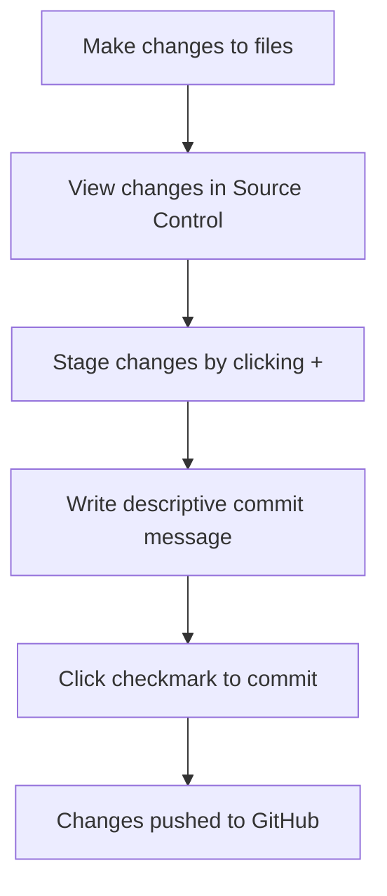

<!--
CO_OP_TRANSLATOR_METADATA:
{
  "original_hash": "cfd4a15974168ca426d50c67682ab9d4",
  "translation_date": "2025-10-23T20:45:40+00:00",
  "source_file": "8-code-editor/1-using-a-code-editor/README.md",
  "language_code": "th"
}
-->
# การใช้โปรแกรมแก้ไขโค้ด: เชี่ยวชาญ VSCode.dev

จำได้ไหมใน *The Matrix* ที่ Neo ต้องเชื่อมต่อกับคอมพิวเตอร์ขนาดใหญ่เพื่อเข้าถึงโลกดิจิทัล? เครื่องมือพัฒนาเว็บในวันนี้เป็นเรื่องตรงกันข้าม – มีความสามารถที่ทรงพลังและเข้าถึงได้จากทุกที่ VSCode.dev เป็นโปรแกรมแก้ไขโค้ดที่ทำงานบนเบราว์เซอร์ ซึ่งนำเครื่องมือพัฒนาระดับมืออาชีพมาสู่ทุกอุปกรณ์ที่มีการเชื่อมต่ออินเทอร์เน็ต

เหมือนกับที่แท่นพิมพ์ทำให้หนังสือเข้าถึงได้สำหรับทุกคน ไม่ใช่แค่ผู้คัดลอกในวัด VSCode.dev ทำให้การเขียนโค้ดเป็นเรื่องง่าย คุณสามารถทำงานในโปรเจกต์จากคอมพิวเตอร์ในห้องสมุด ห้องแล็บในโรงเรียน หรือที่ใดก็ตามที่คุณสามารถเข้าถึงเบราว์เซอร์ได้ โดยไม่ต้องติดตั้งโปรแกรม ไม่มีข้อจำกัดเรื่อง "ฉันต้องการการตั้งค่าที่เฉพาะเจาะจง"

เมื่อจบบทเรียนนี้ คุณจะเข้าใจวิธีการใช้งาน VSCode.dev เปิด GitHub repositories โดยตรงในเบราว์เซอร์ และใช้ Git เพื่อควบคุมเวอร์ชัน – ทักษะที่นักพัฒนามืออาชีพใช้ในทุกวัน

## สิ่งที่คุณจะได้เรียนรู้

หลังจากที่เราเดินผ่านบทเรียนนี้ไปด้วยกัน คุณจะสามารถ:

- ใช้งาน VSCode.dev ได้เหมือนเป็นบ้านหลังที่สอง – หาสิ่งที่คุณต้องการได้โดยไม่หลงทาง
- เปิด GitHub repository ใดๆ ในเบราว์เซอร์และเริ่มแก้ไขได้ทันที (นี่มันมหัศจรรย์มาก!)
- ใช้ Git เพื่อติดตามการเปลี่ยนแปลงและบันทึกความคืบหน้าเหมือนมืออาชีพ
- เพิ่มประสิทธิภาพโปรแกรมแก้ไขด้วยส่วนขยายที่ทำให้การเขียนโค้ดเร็วขึ้นและสนุกขึ้น
- สร้างและจัดระเบียบไฟล์โปรเจกต์ด้วยความมั่นใจ

## สิ่งที่คุณต้องมี

ข้อกำหนดนั้นง่ายมาก:

- [บัญชี GitHub](https://github.com) ฟรี (เราจะช่วยแนะนำการสร้างหากจำเป็น)
- ความคุ้นเคยพื้นฐานกับเบราว์เซอร์
- บทเรียนพื้นฐาน GitHub จะช่วยให้คุณมีพื้นฐานที่ดี แม้จะไม่จำเป็นก็ตาม

> 💡 **ใหม่กับ GitHub?** การสร้างบัญชีฟรีและใช้เวลาเพียงไม่กี่นาที เหมือนกับบัตรห้องสมุดที่ให้คุณเข้าถึงหนังสือทั่วโลก บัญชี GitHub เปิดประตูสู่ repository โค้ดทั่วอินเทอร์เน็ต

## ทำไมโปรแกรมแก้ไขโค้ดบนเว็บถึงสำคัญ

ก่อนที่อินเทอร์เน็ตจะมีอยู่ นักวิทยาศาสตร์ในมหาวิทยาลัยต่างๆ ไม่สามารถแบ่งปันงานวิจัยได้ง่ายๆ จากนั้น ARPANET ในปี 1960 ก็เกิดขึ้น เชื่อมต่อคอมพิวเตอร์ข้ามระยะทาง โปรแกรมแก้ไขโค้ดบนเว็บก็ทำงานตามหลักการเดียวกัน – ทำให้เครื่องมือที่ทรงพลังเข้าถึงได้โดยไม่คำนึงถึงตำแหน่งหรืออุปกรณ์ของคุณ

โปรแกรมแก้ไขโค้ดทำหน้าที่เป็นพื้นที่ทำงานสำหรับการพัฒนา ที่คุณสามารถเขียน แก้ไข และจัดระเบียบไฟล์โค้ดได้ ไม่เหมือนกับโปรแกรมแก้ไขข้อความธรรมดา โปรแกรมแก้ไขโค้ดระดับมืออาชีพมีฟีเจอร์เช่นการเน้นไวยากรณ์ การตรวจจับข้อผิดพลาด และการจัดการโปรเจกต์

VSCode.dev นำความสามารถเหล่านี้มาสู่เบราว์เซอร์ของคุณ:

**ข้อดีของการแก้ไขบนเว็บ:**

| ฟีเจอร์ | คำอธิบาย | ประโยชน์ที่ใช้งานได้จริง |
|---------|-------------|----------|
| **ความเป็นอิสระของแพลตฟอร์ม** | ทำงานบนอุปกรณ์ใดๆ ที่มีเบราว์เซอร์ | ทำงานจากคอมพิวเตอร์ต่างๆ ได้อย่างราบรื่น |
| **ไม่ต้องติดตั้ง** | เข้าถึงผ่าน URL เว็บ | ข้ามข้อจำกัดการติดตั้งซอฟต์แวร์ |
| **อัปเดตอัตโนมัติ** | ใช้เวอร์ชันล่าสุดเสมอ | เข้าถึงฟีเจอร์ใหม่โดยไม่ต้องอัปเดตเอง |
| **การรวมกับ Repository** | เชื่อมต่อโดยตรงกับ GitHub | แก้ไขโค้ดโดยไม่ต้องจัดการไฟล์ในเครื่อง |

**ผลกระทบที่ใช้งานได้จริง:**
- ความต่อเนื่องของงานในสภาพแวดล้อมต่างๆ
- อินเทอร์เฟซที่สม่ำเสมอไม่ว่าจะใช้ระบบปฏิบัติการใด
- ความสามารถในการทำงานร่วมกันทันที
- ลดความต้องการพื้นที่จัดเก็บในเครื่อง

## สำรวจ VSCode.dev

เหมือนกับห้องทดลองของ Marie Curie ที่มีอุปกรณ์ที่ซับซ้อนในพื้นที่ที่เรียบง่าย VSCode.dev รวมเครื่องมือพัฒนาระดับมืออาชีพไว้ในอินเทอร์เฟซเบราว์เซอร์ แอปพลิเคชันเว็บนี้ให้ฟังก์ชันหลักเหมือนกับโปรแกรมแก้ไขโค้ดบนเดสก์ท็อป

เริ่มต้นด้วยการไปที่ [vscode.dev](https://vscode.dev) ในเบราว์เซอร์ของคุณ อินเทอร์เฟซจะโหลดโดยไม่ต้องดาวน์โหลดหรือติดตั้งระบบ – เป็นการประยุกต์ใช้หลักการของการประมวลผลบนคลาวด์โดยตรง

### การเชื่อมต่อบัญชี GitHub ของคุณ

เหมือนกับที่โทรศัพท์ของ Alexander Graham Bell เชื่อมต่อสถานที่ที่ห่างไกล การเชื่อมโยงบัญชี GitHub ของคุณจะเชื่อมต่อ VSCode.dev กับ repository โค้ดของคุณ เมื่อระบบขอให้คุณลงชื่อเข้าใช้ด้วย GitHub ขอแนะนำให้ยอมรับการเชื่อมต่อนี้

**การรวม GitHub ให้:**
- เข้าถึง repository ของคุณโดยตรงในโปรแกรมแก้ไข
- การตั้งค่าและส่วนขยายที่ซิงโครไนซ์ข้ามอุปกรณ์
- เวิร์กโฟลว์การบันทึกที่ง่ายขึ้นไปยัง GitHub
- สภาพแวดล้อมการพัฒนาที่ปรับแต่งได้ตามความต้องการ

### ทำความรู้จักกับพื้นที่ทำงานใหม่ของคุณ

เมื่อทุกอย่างโหลดขึ้นมา คุณจะเห็นพื้นที่ทำงานที่สะอาดและสวยงาม ซึ่งออกแบบมาเพื่อให้คุณมุ่งเน้นไปที่สิ่งสำคัญ – โค้ดของคุณ!

**นี่คือการทัวร์พื้นที่ทำงานของคุณ:**
- **Activity Bar** (แถบด้านซ้าย): การนำทางหลักของคุณที่มี Explorer 📁, Search 🔍, Source Control 🌿, Extensions 🧩 และ Settings ⚙️
- **Sidebar** (แผงข้างๆ): เปลี่ยนเพื่อแสดงข้อมูลที่เกี่ยวข้องตามที่คุณเลือก
- **Editor Area** (พื้นที่ใหญ่ตรงกลาง): นี่คือที่ที่เวทมนตร์เกิดขึ้น – พื้นที่หลักสำหรับการเขียนโค้ดของคุณ

**ลองสำรวจดู:**
- คลิกไอคอนใน Activity Bar และดูว่าแต่ละอันทำอะไร
- สังเกตว่า Sidebar อัปเดตเพื่อแสดงข้อมูลที่แตกต่างกัน – เจ๋งใช่ไหม?
- Explorer view (📁) อาจเป็นที่ที่คุณใช้เวลาส่วนใหญ่ ดังนั้นควรทำความคุ้นเคยกับมัน

## การเปิด GitHub Repositories

ก่อนที่อินเทอร์เน็ตจะมีอยู่ นักวิจัยต้องเดินทางไปยังห้องสมุดเพื่อเข้าถึงเอกสาร GitHub repositories ทำงานคล้ายกัน – เป็นที่เก็บโค้ดที่จัดเก็บไว้ในระยะไกล VSCode.dev ช่วยลดขั้นตอนการดาวน์โหลด repository ไปยังเครื่องของคุณก่อนการแก้ไข

ความสามารถนี้ช่วยให้เข้าถึง repository สาธารณะใดๆ ได้ทันทีเพื่อดู แก้ไข หรือมีส่วนร่วม นี่คือสองวิธีในการเปิด repository:

### วิธีที่ 1: วิธีคลิกง่ายๆ

เหมาะสำหรับเมื่อคุณเริ่มต้นใช้งาน VSCode.dev และต้องการเปิด repository เฉพาะ เป็นวิธีที่ง่ายและเหมาะสำหรับผู้เริ่มต้น:

**วิธีการทำ:**

1. ไปที่ [vscode.dev](https://vscode.dev) หากคุณยังไม่ได้อยู่ที่นั่น
2. มองหาปุ่ม "Open Remote Repository" บนหน้าจอต้อนรับและคลิก

   

3. วาง URL ของ GitHub repository ใดๆ (ลองใช้ URL นี้: `https://github.com/microsoft/Web-Dev-For-Beginners`)
4. กด Enter และดูความมหัศจรรย์เกิดขึ้น!

**เคล็ดลับพิเศษ - ทางลัด Command Palette:**

อยากรู้สึกเหมือนเป็นพ่อมดเขียนโค้ด? ลองใช้ทางลัดแป้นพิมพ์นี้: Ctrl+Shift+P (หรือ Cmd+Shift+P บน Mac) เพื่อเปิด Command Palette:

**Command Palette เหมือนมีเครื่องมือค้นหาสำหรับทุกสิ่งที่คุณสามารถทำได้:**
- พิมพ์ "open remote" และมันจะค้นหาตัวเปิด repository ให้คุณ
- มันจำ repository ที่คุณเปิดล่าสุด (สะดวกมาก!)
- เมื่อคุณคุ้นเคยกับมัน คุณจะรู้สึกเหมือนเขียนโค้ดได้เร็วมาก
- มันเหมือนกับ "Hey Siri" แต่สำหรับการเขียนโค้ด

### วิธีที่ 2: เทคนิคการปรับเปลี่ยน URL

เหมือนกับที่ HTTP และ HTTPS ใช้โปรโตคอลที่แตกต่างกันในขณะที่ยังคงโครงสร้างโดเมนเดียวกัน VSCode.dev ใช้รูปแบบ URL ที่สะท้อนระบบที่อยู่ของ GitHub URL ของ GitHub repository ใดๆ สามารถปรับเปลี่ยนเพื่อเปิดโดยตรงใน VSCode.dev

**รูปแบบการแปลง URL:**

| ประเภท Repository | URL GitHub | URL VSCode.dev |
|----------------|---------------------|----------------|
| **Repository สาธารณะ** | `github.com/microsoft/Web-Dev-For-Beginners` | `vscode.dev/github/microsoft/Web-Dev-For-Beginners` |
| **โปรเจกต์ส่วนตัว** | `github.com/your-username/my-project` | `vscode.dev/github/your-username/my-project` |
| **Repository ที่เข้าถึงได้** | `github.com/their-username/awesome-repo` | `vscode.dev/github/their-username/awesome-repo` |

**การใช้งาน:**
- แทนที่ `github.com` ด้วย `vscode.dev/github`
- รักษาส่วนประกอบ URL อื่นๆ ไว้เหมือนเดิม
- ใช้ได้กับ repository สาธารณะใดๆ ที่เข้าถึงได้
- ให้การเข้าถึงการแก้ไขทันที

> 💡 **เคล็ดลับเปลี่ยนชีวิต**: บุ๊กมาร์กเวอร์ชัน VSCode.dev ของ repository ที่คุณชื่นชอบ ฉันมีบุ๊กมาร์กอย่าง "แก้ไข Portfolio ของฉัน" และ "แก้ไขเอกสาร" ที่พาฉันตรงไปยังโหมดแก้ไข!

**ควรใช้วิธีไหน?**
- **วิธีอินเทอร์เฟซ**: เหมาะเมื่อคุณกำลังสำรวจหรือจำชื่อ repository ไม่ได้
- **เทคนิค URL**: เหมาะสำหรับการเข้าถึงที่รวดเร็วเมื่อคุณรู้ว่าคุณกำลังไปที่ไหน

## การทำงานกับไฟล์และโปรเจกต์

ตอนนี้คุณเปิด repository แล้ว มาเริ่มสร้างกันเลย! VSCode.dev ให้ทุกสิ่งที่คุณต้องการในการสร้าง แก้ไข และจัดระเบียบไฟล์โค้ด คิดว่ามันเป็นเวิร์กช็อปดิจิทัลของคุณ – ทุกเครื่องมืออยู่ในที่ที่คุณต้องการ

มาดำดิ่งสู่การทำงานประจำวันที่จะเป็นส่วนใหญ่ของเวิร์กโฟลว์การเขียนโค้ดของคุณ

### การสร้างไฟล์ใหม่

เหมือนกับการจัดระเบียบแผนผังในสำนักงานสถาปนิก การสร้างไฟล์ใน VSCode.dev เป็นไปตามวิธีการที่มีโครงสร้าง ระบบรองรับไฟล์ประเภทมาตรฐานสำหรับการพัฒนาเว็บทั้งหมด

**กระบวนการสร้างไฟล์:**

1. ไปที่โฟลเดอร์เป้าหมายใน Sidebar Explorer
2. เลื่อนเมาส์ไปที่ชื่อโฟลเดอร์เพื่อแสดงไอคอน "New File" (📄+)
3. ใส่ชื่อไฟล์รวมถึงนามสกุลที่เหมาะสม (`style.css`, `script.js`, `index.html`)
4. กด Enter เพื่อสร้างไฟล์

**การตั้งชื่อไฟล์:**
- ใช้ชื่อที่บ่งบอกถึงวัตถุประสงค์ของไฟล์
- รวมถึงนามสกุลไฟล์เพื่อการเน้นไวยากรณ์ที่เหมาะสม
- ใช้รูปแบบการตั้งชื่อที่สม่ำเสมอในโปรเจกต์
- ใช้อักษรตัวเล็กและขีดกลางแทนการเว้นวรรค

### การแก้ไขและบันทึกไฟล์

นี่คือจุดที่ความสนุกเริ่มต้น! โปรแกรมแก้ไขของ VSCode.dev เต็มไปด้วยฟีเจอร์ที่ช่วยให้การเขียนโค้ดราบรื่นและเป็นธรรมชาติ เหมือนมีผู้ช่วยเขียนที่ฉลาดมาก แต่สำหรับโค้ด

**เวิร์กโฟลว์การแก้ไขของคุณ:**

1. คลิกที่ไฟล์ใดๆ ใน Explorer เพื่อเปิดในพื้นที่หลัก
2. เริ่มพิมพ์และดู VSCode.dev ช่วยคุณด้วยสี ข้อเสนอแนะ และการตรวจจับข้อผิดพลาด
3. บันทึกงานของคุณด้วย Ctrl+S (Windows/Linux) หรือ Cmd+S (Mac) – แม้ว่ามันจะบันทึกอัตโนมัติก็ตาม!

**สิ่งที่เจ๋งที่เกิดขึ้นขณะคุณเขียนโค้ด:**
- โค้ดของคุณถูกเน้นสีอย่างสวยงามเพื่อให้อ่านง่าย
- VSCode.dev เสนอการเติมคำขณะที่คุณพิมพ์ (เหมือนการแก้ไขอัตโนมัติ แต่ฉลาดกว่า)
- มันจับข้อผิดพลาดและข้อผิดพลาดก่อนที่คุณจะบันทึก
- คุณสามารถเปิดไฟล์หลายไฟล์ในแท็บ เหมือนในเบราว์เซอร์
- ทุกอย่างบันทึกอัตโนมัติในพื้นหลัง

> ⚠️ **เคล็ดลับด่วน**: แม้ว่าการบันทึกอัตโนมัติจะช่วยคุณได้ การกด Ctrl+S หรือ Cmd+S ก็ยังเป็นนิสัยที่ดี มันจะบันทึกทุกอย่างทันทีและเปิดใช้งานฟีเจอร์ช่วยเหลือเพิ่มเติม เช่น การตรวจสอบข้อผิดพลาด

### การควบคุมเวอร์ชันด้วย Git

เหมือนกับที่นักโบราณคดีสร้างบันทึกที่ละเอียดของชั้นการขุดค้น Git ติดตามการเปลี่ยนแปลงในโค้ดของคุณเมื่อเวลาผ่านไป ระบบนี้รักษาประวัติของโปรเจกต์และช่วยให้คุณย้อนกลับไปยังเวอร์ชันก่อนหน้าเมื่อจำเป็น VSCode.dev มีฟังก์ชัน Git ในตัว

**อินเทอร์เฟซ Source Control:**

1. เข้าถึงแผง Source Control ผ่านไอคอน 🌿 ใน Activity Bar
2. ไฟล์ที่ถูกแก้ไขจะปรากฏในส่วน "Changes"
3. การใช้สีช่วยบ่งบอกประเภทของการเปลี่ยนแปลง: สีเขียวสำหรับการเพิ่ม สีแดงสำหรับการลบ

**การบันทึกงานของคุณ (เวิร์กโฟลว์ commit):**

**ขั้นตอนการทำงานของคุณ:**
- คลิกไอคอน "+" ข้างไฟล์ที่คุณต้องการบันทึก (นี่คือการ "stage" ไฟล์)
- ตรวจสอบอีกครั้งว่าคุณพอใจกับการเปลี่ยนแปลงที่ stage ทั้งหมด
- เขียนข้อความสั้นๆ อธิบายสิ่งที่คุณทำ (นี่คือ "commit message" ของคุณ)
- คลิกปุ่มเครื่องหมายถูกเพื่อบันทึกทุกอย่างไปยัง GitHub
- หากคุณเปลี่ยนใจเกี่ยวกับบางสิ่ง ไอคอน undo จะช่วยให้คุณยกเลิกการเปลี่ยนแปลง

**การเขียน commit message ที่ดี (ง่ายกว่าที่คุณคิด!):**
- เพียงอธิบายสิ่งที่คุณทำ เช่น "เพิ่มฟอร์มติดต่อ" หรือ "แก้ไขการนำทางที่เสีย"
- เขียนให้สั้นและกระชับ – คิดว่าเป็นความยาวของทวีต ไม่ใช่เรียงความ
- เริ่มต้นด้วยคำที่แสดงการกระทำ เช่น "เพิ่ม", "แก้ไข", "อัปเดต" หรือ "ลบ"
- **ตัวอย่างที่ดี**: "เพิ่มเมนูนำทางที่ตอบสนอง", "แก้ไขปัญหาเลย์เอาต์มือถือ", "อัปเดตสีเพื่อการเข้าถึงที่ดีขึ้น"

> 💡 **เคล็ดลับการนำ
- ส่วนขยายแต่ละตัวจะแสดงคะแนน จำนวนการดาวน์โหลด และรีวิวจากผู้ใช้จริง
- คุณจะได้เห็นภาพตัวอย่างและคำอธิบายที่ชัดเจนเกี่ยวกับสิ่งที่แต่ละส่วนขยายทำ
- ทุกอย่างมีข้อมูลความเข้ากันได้ระบุไว้อย่างชัดเจน
- มีการแนะนำส่วนขยายที่คล้ายกันเพื่อให้คุณเปรียบเทียบตัวเลือกได้

### การติดตั้งส่วนขยาย (ง่ายมาก!)

การเพิ่มความสามารถใหม่ให้กับโปรแกรมแก้ไขของคุณง่ายเหมือนการคลิกปุ่ม ส่วนขยายจะติดตั้งในไม่กี่วินาทีและเริ่มทำงานทันที – ไม่ต้องรีสตาร์ท ไม่ต้องรอ

**สิ่งที่คุณต้องทำมีแค่นี้:**

1. ค้นหาสิ่งที่คุณต้องการ (ลองค้นหา "live server" หรือ "prettier")
2. คลิกที่ส่วนขยายที่ดูน่าสนใจเพื่อดูรายละเอียดเพิ่มเติม
3. อ่านข้อมูลเกี่ยวกับสิ่งที่มันทำและตรวจสอบคะแนนรีวิว
4. กดปุ่ม "Install" สีฟ้า แล้วเสร็จเรียบร้อย!

**สิ่งที่เกิดขึ้นเบื้องหลัง:**
- ส่วนขยายจะดาวน์โหลดและตั้งค่าตัวเองโดยอัตโนมัติ
- ฟีเจอร์ใหม่จะปรากฏในอินเทอร์เฟซของคุณทันที
- ทุกอย่างเริ่มทำงานทันที (จริง ๆ มันเร็วขนาดนั้น!)
- หากคุณลงชื่อเข้าใช้ ส่วนขยายจะซิงค์ไปยังอุปกรณ์ทั้งหมดของคุณ

**ส่วนขยายที่แนะนำให้เริ่มต้น:**
- **Live Server**: ดูเว็บไซต์ของคุณอัปเดตแบบเรียลไทม์ขณะเขียนโค้ด (อันนี้วิเศษมาก!)
- **Prettier**: ทำให้โค้ดของคุณดูสะอาดและเป็นมืออาชีพโดยอัตโนมัติ
- **Auto Rename Tag**: เปลี่ยนแท็ก HTML หนึ่งตัวและคู่ของมันจะอัปเดตตาม
- **Bracket Pair Colorizer**: เพิ่มสีให้กับวงเล็บของคุณเพื่อไม่ให้หลงทาง
- **GitLens**: เพิ่มพลังให้กับฟีเจอร์ Git ของคุณด้วยข้อมูลที่มีประโยชน์มากมาย

### ปรับแต่งส่วนขยายของคุณ

ส่วนขยายส่วนใหญ่มีการตั้งค่าที่คุณสามารถปรับแต่งเพื่อให้มันทำงานตามที่คุณต้องการ คิดเหมือนการปรับเบาะและกระจกในรถ – ทุกคนมีความชอบที่แตกต่างกัน!

**การปรับแต่งการตั้งค่าส่วนขยาย:**

1. ค้นหาส่วนขยายที่คุณติดตั้งในแผง Extensions
2. มองหาไอคอนรูปเฟืองเล็ก ๆ (⚙️) ข้างชื่อของมันแล้วคลิก
3. เลือก "Extension Settings" จากเมนูดรอปดาวน์
4. ปรับแต่งจนกว่าจะเหมาะกับการทำงานของคุณ

**สิ่งที่คุณอาจต้องการปรับแต่ง:**
- วิธีการจัดรูปแบบโค้ดของคุณ (แท็บ vs ช่องว่าง, ความยาวบรรทัด ฯลฯ)
- คีย์ลัดที่ใช้เรียกใช้งานต่าง ๆ
- ประเภทไฟล์ที่ส่วนขยายควรทำงานด้วย
- เปิดหรือปิดฟีเจอร์เฉพาะเพื่อให้ทุกอย่างดูสะอาดตา

### การจัดการส่วนขยายของคุณให้เป็นระเบียบ

เมื่อคุณค้นพบส่วนขยายเจ๋ง ๆ มากขึ้น คุณจะต้องการจัดการคอลเลกชันของคุณให้เป็นระเบียบและทำงานได้อย่างราบรื่น VSCode.dev ทำให้การจัดการนี้ง่ายมาก

**ตัวเลือกการจัดการส่วนขยายของคุณ:**

| สิ่งที่คุณสามารถทำได้ | เมื่อมันมีประโยชน์ | เคล็ดลับ |
|--------|---------|----------|
| **Disable** | ทดสอบว่าส่วนขยายทำให้เกิดปัญหาหรือไม่ | ดีกว่าการถอนการติดตั้งหากคุณอาจต้องการใช้งานอีก |
| **Uninstall** | ลบส่วนขยายที่คุณไม่ต้องการออกไปทั้งหมด | ทำให้สภาพแวดล้อมของคุณสะอาดและเร็วขึ้น |
| **Update** | รับฟีเจอร์ใหม่ล่าสุดและแก้ไขข้อผิดพลาด | โดยปกติจะอัปเดตอัตโนมัติ แต่ควรตรวจสอบ |

**วิธีที่ฉันชอบจัดการส่วนขยาย:**
- ทุก ๆ สองสามเดือน ฉันจะตรวจสอบสิ่งที่ฉันติดตั้งและลบสิ่งที่ไม่ได้ใช้ออก
- ฉันอัปเดตส่วนขยายเพื่อรับการปรับปรุงและการแก้ไขความปลอดภัยล่าสุด
- หากบางสิ่งดูช้า ฉันจะปิดใช้งานส่วนขยายชั่วคราวเพื่อดูว่ามีส่วนขยายใดเป็นสาเหตุ
- ฉันอ่านบันทึกการอัปเดตเมื่อส่วนขยายมีการอัปเดตใหญ่ – บางครั้งมีฟีเจอร์ใหม่ที่น่าสนใจ!

> ⚠️ **เคล็ดลับเรื่องประสิทธิภาพ**: ส่วนขยายเป็นสิ่งที่ยอดเยี่ยม แต่การมีมากเกินไปอาจทำให้ระบบช้าลง เลือกใช้เฉพาะส่วนขยายที่ทำให้ชีวิตคุณง่ายขึ้นจริง ๆ และอย่ากลัวที่จะลบส่วนขยายที่คุณไม่เคยใช้

## การท้าทาย GitHub Copilot Agent 🚀

เหมือนกับวิธีการที่ NASA ใช้สำหรับภารกิจอวกาศ การท้าทายนี้เกี่ยวข้องกับการใช้ทักษะ VSCode.dev อย่างเป็นระบบในสถานการณ์การทำงานแบบครบวงจร

**เป้าหมาย:** แสดงความเชี่ยวชาญใน VSCode.dev โดยการสร้างเวิร์กโฟลว์การพัฒนาเว็บที่ครอบคลุม

**ข้อกำหนดของโปรเจกต์:** ใช้โหมด Agent เพื่อช่วยเหลือในการทำงานให้สำเร็จตามขั้นตอนต่อไปนี้:
1. Fork repository ที่มีอยู่หรือสร้างใหม่
2. สร้างโครงสร้างโปรเจกต์ที่มีไฟล์ HTML, CSS และ JavaScript
3. ติดตั้งและตั้งค่าส่วนขยายที่ช่วยเพิ่มประสิทธิภาพการพัฒนา 3 ตัว
4. ฝึกการควบคุมเวอร์ชันด้วยข้อความ commit ที่อธิบายได้ชัดเจน
5. ทดลองสร้างและแก้ไข branch ของฟีเจอร์
6. บันทึกกระบวนการและสิ่งที่เรียนรู้ในไฟล์ README.md

การฝึกนี้รวมทุกแนวคิดของ VSCode.dev เข้ากับเวิร์กโฟลว์ที่สามารถนำไปใช้กับโปรเจกต์การพัฒนาในอนาคตได้

เรียนรู้เพิ่มเติมเกี่ยวกับ [agent mode](https://code.visualstudio.com/blogs/2025/02/24/introducing-copilot-agent-mode) ได้ที่นี่

## งานที่ได้รับมอบหมาย

ถึงเวลาทดสอบทักษะเหล่านี้จริง ๆ แล้ว! ฉันมีโปรเจกต์แบบลงมือทำที่จะให้คุณฝึกฝนทุกสิ่งที่เราได้พูดถึง: [สร้างเว็บไซต์เรซูเม่โดยใช้ VSCode.dev](./assignment.md)

งานนี้จะนำคุณผ่านการสร้างเว็บไซต์เรซูเม่แบบมืออาชีพทั้งหมดในเบราว์เซอร์ของคุณ คุณจะใช้ฟีเจอร์ทั้งหมดของ VSCode.dev ที่เราได้สำรวจ และเมื่อเสร็จสิ้น คุณจะมีทั้งเว็บไซต์ที่ดูดีและความมั่นใจในเวิร์กโฟลว์ใหม่ของคุณ

## สำรวจและพัฒนาทักษะของคุณต่อไป

ตอนนี้คุณมีพื้นฐานที่แข็งแกร่งแล้ว แต่ยังมีสิ่งเจ๋ง ๆ อีกมากมายให้ค้นพบ! นี่คือทรัพยากรและไอเดียสำหรับการพัฒนาทักษะ VSCode.dev ของคุณไปอีกขั้น:

**เอกสารทางการที่ควรบุ๊กมาร์กไว้:**
- [เอกสาร VSCode Web](https://code.visualstudio.com/docs/editor/vscode-web?WT.mc_id=academic-0000-alfredodeza) – คู่มือฉบับสมบูรณ์สำหรับการแก้ไขในเบราว์เซอร์
- [GitHub Codespaces](https://docs.github.com/en/codespaces) – สำหรับเมื่อคุณต้องการพลังมากขึ้นในระบบคลาวด์

**ฟีเจอร์เจ๋ง ๆ ที่ควรลองต่อไป:**
- **คีย์ลัด**: เรียนรู้การกดคีย์ที่ทำให้คุณรู้สึกเหมือนเป็นนินจาโค้ด
- **การตั้งค่าสภาพแวดล้อมการทำงาน**: ตั้งค่าสภาพแวดล้อมที่แตกต่างกันสำหรับโปรเจกต์ประเภทต่าง ๆ
- **Multi-root Workspaces**: ทำงานกับ repository หลายตัวพร้อมกัน (สะดวกมาก!)
- **การรวม Terminal**: เข้าถึงเครื่องมือ command-line ได้โดยตรงในเบราว์เซอร์ของคุณ

**ไอเดียสำหรับการฝึกฝน:**
- เข้าร่วมโปรเจกต์โอเพ่นซอร์สและมีส่วนร่วมโดยใช้ VSCode.dev – เป็นวิธีที่ดีในการตอบแทนสังคม!
- ลองใช้ส่วนขยายต่าง ๆ เพื่อค้นหาการตั้งค่าที่เหมาะสมที่สุดสำหรับคุณ
- สร้างเทมเพลตโปรเจกต์สำหรับเว็บไซต์ประเภทที่คุณสร้างบ่อยที่สุด
- ฝึกฝนเวิร์กโฟลว์ Git เช่นการสร้าง branch และการรวม branch – ทักษะเหล่านี้มีค่ามากในโปรเจกต์ทีม

---

**คุณได้เชี่ยวชาญการพัฒนาในเบราว์เซอร์แล้ว!** 🎉 เหมือนกับการประดิษฐ์เครื่องมือพกพาที่ช่วยให้นักวิทยาศาสตร์ทำการวิจัยในพื้นที่ห่างไกล VSCode.dev ช่วยให้การเขียนโค้ดแบบมืออาชีพจากอุปกรณ์ที่เชื่อมต่ออินเทอร์เน็ตเป็นไปได้

ทักษะเหล่านี้สะท้อนถึงการปฏิบัติในอุตสาหกรรมปัจจุบัน – นักพัฒนามืออาชีพหลายคนใช้สภาพแวดล้อมการพัฒนาบนคลาวด์เพื่อความยืดหยุ่นและการเข้าถึง คุณได้เรียนรู้เวิร์กโฟลว์ที่สามารถปรับใช้ได้ตั้งแต่โปรเจกต์ส่วนบุคคลไปจนถึงการทำงานร่วมกันในทีมขนาดใหญ่

นำเทคนิคเหล่านี้ไปใช้กับโปรเจกต์การพัฒนาครั้งต่อไปของคุณ! 🚀

---

**ข้อจำกัดความรับผิดชอบ**:  
เอกสารนี้ได้รับการแปลโดยใช้บริการแปลภาษา AI [Co-op Translator](https://github.com/Azure/co-op-translator) แม้ว่าเราจะพยายามให้การแปลมีความถูกต้อง แต่โปรดทราบว่าการแปลอัตโนมัติอาจมีข้อผิดพลาดหรือความไม่ถูกต้อง เอกสารต้นฉบับในภาษาดั้งเดิมควรถือเป็นแหล่งข้อมูลที่เชื่อถือได้ สำหรับข้อมูลสำคัญ ขอแนะนำให้ใช้บริการแปลภาษามืออาชีพ เราไม่รับผิดชอบต่อความเข้าใจผิดหรือการตีความผิดที่เกิดจากการใช้การแปลนี้