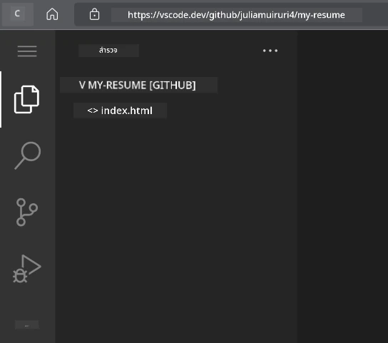
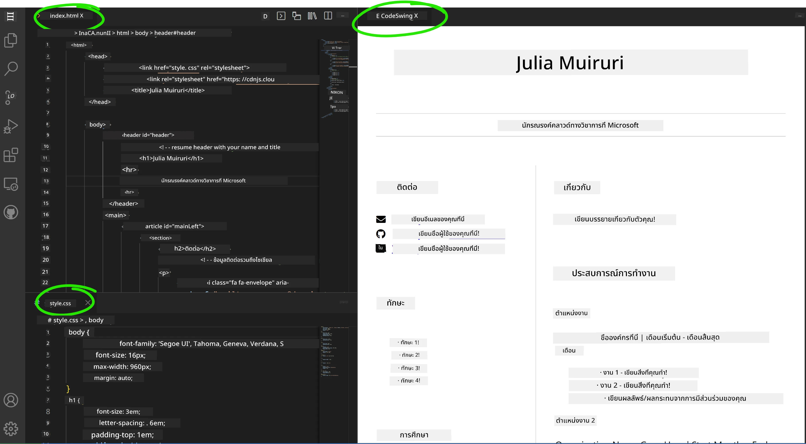

<!--
CO_OP_TRANSLATOR_METADATA:
{
  "original_hash": "effe56ba51c38d7bdfad1ea38288666b",
  "translation_date": "2025-10-23T20:47:01+00:00",
  "source_file": "8-code-editor/1-using-a-code-editor/assignment.md",
  "language_code": "th"
}
-->
# สร้างเว็บไซต์เรซูเม่ด้วย VSCode.dev

เปลี่ยนโอกาสในอาชีพของคุณด้วยการสร้างเว็บไซต์เรซูเม่ที่แสดงทักษะและประสบการณ์ของคุณในรูปแบบที่ทันสมัยและน่าสนใจ แทนที่จะส่งไฟล์ PDF แบบดั้งเดิม ลองจินตนาการถึงการให้ผู้สรรหางานเข้าชมเว็บไซต์ที่ดูดีและตอบสนองได้ดี ซึ่งแสดงทั้งคุณสมบัติและความสามารถในการพัฒนาเว็บของคุณ

งานนี้จะช่วยให้คุณได้ฝึกฝนทักษะการใช้ VSCode.dev พร้อมกับสร้างสิ่งที่มีประโยชน์จริงสำหรับอาชีพของคุณ คุณจะได้สัมผัสกับกระบวนการทำงานของการพัฒนาเว็บอย่างครบถ้วน ตั้งแต่การสร้าง repository ไปจนถึงการเผยแพร่ ทั้งหมดนี้สามารถทำได้ผ่านเบราว์เซอร์ของคุณ

เมื่อคุณทำโปรเจกต์นี้เสร็จ คุณจะมีตัวตนออนไลน์ที่ดูเป็นมืออาชีพ สามารถแชร์ให้กับนายจ้างที่มีศักยภาพได้ง่าย อัปเดตได้เมื่อทักษะของคุณพัฒนา และปรับแต่งให้เข้ากับแบรนด์ส่วนตัวของคุณ นี่คือโปรเจกต์ที่แสดงให้เห็นถึงทักษะการพัฒนาเว็บในโลกจริงอย่างแท้จริง

## วัตถุประสงค์การเรียนรู้

หลังจากทำงานนี้เสร็จ คุณจะสามารถ:

- **สร้าง** และจัดการโปรเจกต์การพัฒนาเว็บอย่างสมบูรณ์ด้วย VSCode.dev
- **จัดโครงสร้าง** เว็บไซต์แบบมืออาชีพด้วยองค์ประกอบ HTML เชิงความหมาย
- **ออกแบบ** เลย์เอาต์ที่ตอบสนองด้วยเทคนิค CSS สมัยใหม่
- **เพิ่ม** ฟีเจอร์แบบโต้ตอบด้วยเทคโนโลยีเว็บพื้นฐาน
- **เผยแพร่** เว็บไซต์ที่ใช้งานได้จริงผ่าน URL ที่สามารถแชร์ได้
- **แสดง** แนวปฏิบัติที่ดีที่สุดในการควบคุมเวอร์ชันตลอดกระบวนการพัฒนา

## สิ่งที่ต้องเตรียมก่อนเริ่ม

ก่อนเริ่มงานนี้ โปรดตรวจสอบว่าคุณมี:

- บัญชี GitHub (สร้างได้ที่ [github.com](https://github.com/) หากยังไม่มี)
- ผ่านบทเรียน VSCode.dev ที่ครอบคลุมการนำทางอินเทอร์เฟซและการใช้งานพื้นฐาน
- ความเข้าใจพื้นฐานเกี่ยวกับโครงสร้าง HTML และแนวคิดการออกแบบ CSS

## การตั้งค่าโปรเจกต์และการสร้าง Repository

เริ่มต้นด้วยการตั้งค่าพื้นฐานของโปรเจกต์ ขั้นตอนนี้สะท้อนถึงกระบวนการทำงานของการพัฒนาในโลกจริง ซึ่งโปรเจกต์เริ่มต้นด้วยการตั้งค่า repository และการวางแผนโครงสร้างอย่างเหมาะสม

### ขั้นตอนที่ 1: สร้าง GitHub Repository ของคุณ

การตั้งค่า repository เฉพาะช่วยให้โปรเจกต์ของคุณมีการจัดระเบียบและควบคุมเวอร์ชันตั้งแต่เริ่มต้น

1. **ไปที่** [GitHub.com](https://github.com) และเข้าสู่ระบบบัญชีของคุณ
2. **คลิก**ปุ่มสีเขียว "New" หรือไอคอน "+" ที่มุมขวาบน
3. **ตั้งชื่อ** repository ของคุณ `my-resume` (หรือเลือกชื่อที่เป็นส่วนตัว เช่น `john-smith-resume`)
4. **เพิ่ม**คำอธิบายสั้น ๆ: "เว็บไซต์เรซูเม่แบบมืออาชีพที่สร้างด้วย HTML และ CSS"
5. **เลือก** "Public" เพื่อให้เรซูเม่ของคุณเข้าถึงได้สำหรับนายจ้างที่มีศักยภาพ
6. **เลือก** "Add a README file" เพื่อสร้างคำอธิบายโปรเจกต์เริ่มต้น
7. **คลิก** "Create repository" เพื่อเสร็จสิ้นการตั้งค่า

> 💡 **เคล็ดลับการตั้งชื่อ Repository**: ใช้ชื่อที่อธิบายได้ชัดเจนและดูเป็นมืออาชีพ ซึ่งช่วยเมื่อแชร์กับนายจ้างหรือในระหว่างการตรวจสอบผลงาน

### ขั้นตอนที่ 2: ตั้งค่าโครงสร้างโปรเจกต์

เนื่องจาก VSCode.dev ต้องการไฟล์อย่างน้อยหนึ่งไฟล์เพื่อเปิด repository เราจะสร้างไฟล์ HTML หลักของเราบน GitHub ก่อนที่จะเปลี่ยนไปใช้เว็บเอดิเตอร์

1. **คลิก**ลิงก์ "creating a new file" ใน repository ใหม่ของคุณ
2. **พิมพ์** `index.html` เป็นชื่อไฟล์
3. **เพิ่ม**โครงสร้าง HTML เริ่มต้นนี้:

```html
<!DOCTYPE html>
<html lang="en">
<head>
    <meta charset="UTF-8">
    <meta name="viewport" content="width=device-width, initial-scale=1.0">
    <title>Your Name - Professional Resume</title>
</head>
<body>
    <h1>Your Name</h1>
    <p>Professional Resume Website</p>
</body>
</html>
```

4. **เขียน**ข้อความ commit: "Add initial HTML structure"
5. **คลิก** "Commit new file" เพื่อบันทึกการเปลี่ยนแปลงของคุณ


**สิ่งที่การตั้งค่าเริ่มต้นนี้ทำได้:**
- **สร้าง**โครงสร้างเอกสาร HTML5 ที่เหมาะสมด้วยองค์ประกอบเชิงความหมาย
- **รวม**แท็ก meta viewport เพื่อความเข้ากันได้กับการออกแบบที่ตอบสนอง
- **ตั้งค่า**ชื่อหน้าเว็บที่อธิบายได้ซึ่งปรากฏในแท็บเบราว์เซอร์
- **สร้าง**พื้นฐานสำหรับการจัดระเบียบเนื้อหาแบบมืออาชีพ

## การทำงานใน VSCode.dev

เมื่อโครงสร้างพื้นฐานของ repository ของคุณถูกตั้งค่าแล้ว มาเปลี่ยนไปใช้ VSCode.dev สำหรับการพัฒนาหลักกัน เว็บเอดิเตอร์นี้มีเครื่องมือทั้งหมดที่จำเป็นสำหรับการพัฒนาเว็บแบบมืออาชีพ

### ขั้นตอนที่ 3: เปิดโปรเจกต์ของคุณใน VSCode.dev

1. **ไปที่** [vscode.dev](https://vscode.dev) ในแท็บเบราว์เซอร์ใหม่
2. **คลิก** "Open Remote Repository" บนหน้าจอต้อนรับ
3. **คัดลอก** URL repository ของคุณจาก GitHub และวางลงในช่องป้อนข้อมูล

   รูปแบบ: `https://github.com/your-username/my-resume`
   
   *แทนที่ `your-username` ด้วยชื่อผู้ใช้ GitHub ของคุณ*

4. **กด** Enter เพื่อโหลดโปรเจกต์ของคุณ

✅ **ตัวบ่งชี้ความสำเร็จ**: คุณควรเห็นไฟล์โปรเจกต์ของคุณในแถบด้านข้าง Explorer และ `index.html` พร้อมสำหรับการแก้ไขในพื้นที่เอดิเตอร์หลัก



**สิ่งที่คุณจะเห็นในอินเทอร์เฟซ:**
- **แถบด้านข้าง Explorer**: **แสดง**ไฟล์และโครงสร้างโฟลเดอร์ของ repository ของคุณ
- **พื้นที่เอดิเตอร์**: **แสดง**เนื้อหาของไฟล์ที่เลือกสำหรับการแก้ไข
- **แถบกิจกรรม**: **ให้**การเข้าถึงฟีเจอร์ต่าง ๆ เช่น Source Control และ Extensions
- **แถบสถานะ**: **แสดง**สถานะการเชื่อมต่อและข้อมูลสาขาปัจจุบัน

### ขั้นตอนที่ 4: สร้างเนื้อหาเรซูเม่ของคุณ

แทนที่เนื้อหาตัวอย่างใน `index.html` ด้วยโครงสร้างเรซูเม่ที่ครอบคลุม HTML นี้ให้พื้นฐานสำหรับการนำเสนอคุณสมบัติของคุณอย่างมืออาชีพ

<details>
<summary><b>โครงสร้าง HTML เรซูเม่ที่สมบูรณ์</b></summary>

```html
<!DOCTYPE html>
<html lang="en">
<head>
    <meta charset="UTF-8">
    <meta name="viewport" content="width=device-width, initial-scale=1.0">
    <link href="style.css" rel="stylesheet">
    <link rel="stylesheet" href="https://cdnjs.cloudflare.com/ajax/libs/font-awesome/5.15.4/css/all.min.css">
    <title>Your Name - Professional Resume</title>
</head>
<body>
    <header id="header">
        <h1>Your Full Name</h1>
        <hr>
        <p class="role">Your Professional Title</p>
        <hr>
    </header>
    
    <main>
        <article id="mainLeft">
            <section>
                <h2>CONTACT</h2>
                <p>
                    <i class="fa fa-envelope" aria-hidden="true"></i>
                    <a href="mailto:your.email@domain.com">your.email@domain.com</a>
                </p>
                <p>
                    <i class="fab fa-github" aria-hidden="true"></i>
                    <a href="https://github.com/your-username">github.com/your-username</a>
                </p>
                <p>
                    <i class="fab fa-linkedin" aria-hidden="true"></i>
                    <a href="https://linkedin.com/in/your-profile">linkedin.com/in/your-profile</a>
                </p>
            </section>
            
            <section>
                <h2>SKILLS</h2>
                <ul>
                    <li>HTML5 & CSS3</li>
                    <li>JavaScript (ES6+)</li>
                    <li>Responsive Web Design</li>
                    <li>Version Control (Git)</li>
                    <li>Problem Solving</li>
                </ul>
            </section>
            
            <section>
                <h2>EDUCATION</h2>
                <h3>Your Degree or Certification</h3>
                <p>Institution Name</p>
                <p>Start Date - End Date</p>
            </section>
        </article>
        
        <article id="mainRight">
            <section>
                <h2>ABOUT</h2>
                <p>Write a compelling summary that highlights your passion for web development, key achievements, and career goals. This section should give employers insight into your personality and professional approach.</p>
            </section>
            
            <section>
                <h2>WORK EXPERIENCE</h2>
                <div class="job">
                    <h3>Job Title</h3>
                    <p class="company">Company Name | Start Date – End Date</p>
                    <ul>
                        <li>Describe a key accomplishment or responsibility</li>
                        <li>Highlight specific skills or technologies used</li>
                        <li>Quantify impact where possible (e.g., "Improved efficiency by 25%")</li>
                    </ul>
                </div>
                
                <div class="job">
                    <h3>Previous Job Title</h3>
                    <p class="company">Previous Company | Start Date – End Date</p>
                    <ul>
                        <li>Focus on transferable skills and achievements</li>
                        <li>Demonstrate growth and learning progression</li>
                        <li>Include any leadership or collaboration experiences</li>
                    </ul>
                </div>
            </section>
            
            <section>
                <h2>PROJECTS</h2>
                <div class="project">
                    <h3>Project Name</h3>
                    <p>Brief description of what the project accomplishes and technologies used.</p>
                    <a href="#" target="_blank">View Project</a>
                </div>
            </section>
        </article>
    </main>
</body>
</html>
```
</details>

**แนวทางการปรับแต่ง:**
- **แทนที่**ข้อความตัวอย่างทั้งหมดด้วยข้อมูลจริงของคุณ
- **ปรับ**ส่วนต่าง ๆ ตามระดับประสบการณ์และเป้าหมายอาชีพของคุณ
- **เพิ่ม**หรือเอาส่วนต่าง ๆ ออกตามความจำเป็น (เช่น การรับรอง การทำงานอาสาสมัคร ภาษา)
- **รวม**ลิงก์ไปยังโปรไฟล์และโปรเจกต์จริงของคุณ

### ขั้นตอนที่ 5: สร้างไฟล์สนับสนุน

เว็บไซต์แบบมืออาชีพต้องการโครงสร้างไฟล์ที่จัดระเบียบ สร้างไฟล์ CSS และไฟล์การตั้งค่าที่จำเป็นสำหรับโปรเจกต์ที่สมบูรณ์

1. **เลื่อนเมาส์**ไปที่ชื่อโฟลเดอร์โปรเจกต์ของคุณในแถบด้านข้าง Explorer
2. **คลิก**ไอคอน "New File" (📄+) ที่ปรากฏ
3. **สร้าง**ไฟล์เหล่านี้ทีละไฟล์:
   - `style.css` (สำหรับการออกแบบและเลย์เอาต์)
   - `codeswing.json` (สำหรับการตั้งค่าการขยายตัวอย่าง)

**การสร้างไฟล์ CSS (`style.css`):**

<details>
<summary><b>การออกแบบ CSS แบบมืออาชีพ</b></summary>

```css
/* Modern Resume Styling */
body {
    font-family: 'Segoe UI', Tahoma, Geneva, Verdana, sans-serif;
    font-size: 16px;
    line-height: 1.6;
    max-width: 960px;
    margin: 0 auto;
    padding: 20px;
    color: #333;
    background-color: #f9f9f9;
}

/* Header Styling */
header {
    text-align: center;
    margin-bottom: 3em;
    padding: 2em;
    background: linear-gradient(135deg, #667eea 0%, #764ba2 100%);
    color: white;
    border-radius: 10px;
    box-shadow: 0 4px 6px rgba(0, 0, 0, 0.1);
}

h1 {
    font-size: 3em;
    letter-spacing: 0.1em;
    margin-bottom: 0.2em;
    font-weight: 300;
}

.role {
    font-size: 1.3em;
    font-weight: 300;
    margin: 1em 0;
}

/* Main Content Layout */
main {
    display: grid;
    grid-template-columns: 35% 65%;
    gap: 3em;
    margin-top: 3em;
    background: white;
    padding: 2em;
    border-radius: 10px;
    box-shadow: 0 2px 10px rgba(0, 0, 0, 0.1);
}

/* Typography */
h2 {
    font-size: 1.4em;
    font-weight: 600;
    margin-bottom: 1em;
    color: #667eea;
    border-bottom: 2px solid #667eea;
    padding-bottom: 0.3em;
}

h3 {
    font-size: 1.1em;
    font-weight: 600;
    margin-bottom: 0.5em;
    color: #444;
}

/* Section Styling */
section {
    margin-bottom: 2.5em;
}

#mainLeft {
    border-right: 1px solid #e0e0e0;
    padding-right: 2em;
}

/* Contact Links */
section a {
    color: #667eea;
    text-decoration: none;
    transition: color 0.3s ease;
}

section a:hover {
    color: #764ba2;
    text-decoration: underline;
}

/* Icons */
i {
    margin-right: 0.8em;
    width: 20px;
    text-align: center;
    color: #667eea;
}

/* Lists */
ul {
    list-style: none;
    padding-left: 0;
}

li {
    margin: 0.5em 0;
    padding: 0.3em 0;
    position: relative;
}

li:before {
    content: "▸";
    color: #667eea;
    margin-right: 0.5em;
}

/* Work Experience */
.job, .project {
    margin-bottom: 2em;
    padding-bottom: 1.5em;
    border-bottom: 1px solid #f0f0f0;
}

.company {
    font-style: italic;
    color: #666;
    margin-bottom: 0.5em;
}

/* Responsive Design */
@media (max-width: 768px) {
    main {
        grid-template-columns: 1fr;
        gap: 2em;
    }
    
    #mainLeft {
        border-right: none;
        border-bottom: 1px solid #e0e0e0;
        padding-right: 0;
        padding-bottom: 2em;
    }
    
    h1 {
        font-size: 2.2em;
    }
    
    body {
        padding: 10px;
    }
}

/* Print Styles */
@media print {
    body {
        background: white;
        color: black;
        font-size: 12pt;
    }
    
    header {
        background: none;
        color: black;
        box-shadow: none;
    }
    
    main {
        box-shadow: none;
    }
}
```
</details>

**การสร้างไฟล์การตั้งค่า (`codeswing.json`):**

```json
{
    "scripts": [],
    "styles": []
}
```

**การทำความเข้าใจคุณสมบัติ CSS:**
- **ใช้** CSS Grid สำหรับโครงสร้างเลย์เอาต์ที่ตอบสนองและดูเป็นมืออาชีพ
- **นำเสนอ**โทนสีสมัยใหม่ด้วยส่วนหัวแบบไล่ระดับสี
- **รวม**เอฟเฟกต์ hover และการเปลี่ยนแปลงที่ราบรื่นเพื่อความโต้ตอบ
- **ให้**การออกแบบที่ตอบสนองซึ่งทำงานได้กับทุกขนาดอุปกรณ์
- **เพิ่ม**สไตล์ที่เหมาะสำหรับการพิมพ์เพื่อสร้าง PDF

### ขั้นตอนที่ 6: ติดตั้งและตั้งค่าการขยาย

การขยายช่วยเพิ่มประสบการณ์การพัฒนาโดยให้ความสามารถในการดูตัวอย่างสดและเครื่องมือปรับปรุงการทำงาน การขยาย CodeSwing มีประโยชน์อย่างยิ่งสำหรับโปรเจกต์การพัฒนาเว็บ

**การติดตั้งการขยาย CodeSwing:**

1. **คลิก**ไอคอน Extensions (🧩) ในแถบกิจกรรม
2. **ค้นหา** "CodeSwing" ในช่องค้นหาตลาด
3. **เลือก**การขยาย CodeSwing จากผลการค้นหา
4. **คลิก**ปุ่มสีฟ้า "Install"


**สิ่งที่ CodeSwing ให้:**
- **เปิดใช้งาน**การดูตัวอย่างสดของเว็บไซต์ของคุณขณะทำการแก้ไข
- **แสดง**การเปลี่ยนแปลงแบบเรียลไทม์โดยไม่ต้องรีเฟรชด้วยตนเอง
- **รองรับ**ไฟล์หลายประเภท รวมถึง HTML, CSS และ JavaScript
- **ให้**ประสบการณ์การพัฒนาแบบบูรณาการ

**ผลลัพธ์ทันทีหลังการติดตั้ง:**
เมื่อ CodeSwing ถูกติดตั้ง คุณจะเห็นการดูตัวอย่างสดของเว็บไซต์เรซูเม่ของคุณปรากฏในเอดิเตอร์ สิ่งนี้ช่วยให้คุณเห็นว่าเว็บไซต์ของคุณมีลักษณะอย่างไรในขณะที่คุณทำการเปลี่ยนแปลง



**การทำความเข้าใจอินเทอร์เฟซที่ปรับปรุง:**
- **มุมมองแยก**: **แสดง**โค้ดของคุณด้านหนึ่งและการดูตัวอย่างสดอีกด้านหนึ่ง
- **การอัปเดตแบบเรียลไทม์**: **สะท้อน**การเปลี่ยนแปลงทันทีขณะที่คุณพิมพ์
- **การดูตัวอย่างแบบโต้ตอบ**: **อนุญาต**ให้คุณทดสอบลิงก์และการโต้ตอบ
- **การจำลองมือถือ**: **ให้**ความสามารถในการทดสอบการออกแบบที่ตอบสนอง

### ขั้นตอนที่ 7: การควบคุมเวอร์ชันและการเผยแพร่

เมื่อเว็บไซต์เรซูเม่ของคุณเสร็จสมบูรณ์ ใช้ Git เพื่อบันทึกงานของคุณและทำให้สามารถใช้งานออนไลน์ได้

**การ commit การเปลี่ยนแปลงของคุณ:**

1. **คลิก**ไอคอน Source Control (🌿) ในแถบกิจกรรม
2. **ตรวจสอบ**ไฟล์ทั้งหมดที่คุณสร้างและแก้ไขในส่วน "Changes"
3. **เพิ่ม**การเปลี่ยนแปลงของคุณโดยคลิกไอคอน "+" ข้างแต่ละไฟล์
4. **เขียน**ข้อความ commit ที่อธิบายได้ เช่น:
   - "Add complete resume website with responsive design"
   - "Implement professional styling and content structure"
5. **คลิก**เครื่องหมายถูก (✓) เพื่อ commit และ push การเปลี่ยนแปลงของคุณ

**ตัวอย่างข้อความ commit ที่มีประสิทธิภาพ:**
- "Add professional resume content and styling"
- "Implement responsive design for mobile compatibility"
- "Update contact information and project links"

> 💡 **เคล็ดลับมืออาชีพ**: ข้อความ commit ที่ดีช่วยติดตามวิวัฒนาการของโปรเจกต์ของคุณและแสดงความใส่ใจในรายละเอียด – คุณสมบัติที่นายจ้างให้คุณค่า

**การเข้าถึงเว็บไซต์ที่เผยแพร่ของคุณ:**
เมื่อ commit แล้ว คุณสามารถกลับไปที่ repository GitHub ของคุณโดยใช้เมนูแฮมเบอร์เกอร์ (☰) ที่มุมซ้ายบน เว็บไซต์เรซูเม่ของคุณตอนนี้ถูกควบคุมเวอร์ชันและพร้อมสำหรับการเผยแพร่หรือแชร์

## ผลลัพธ์และขั้นตอนถัดไป

**ยินดีด้วย! 🎉** คุณได้สร้างเว็บไซต์เรซูเม่แบบมืออาชีพด้วย VSCode.dev สำเร็จแล้ว โปรเจกต์ของคุณแสดงให้เห็น:
**ทักษะทางเทคนิคที่แสดงให้เห็น:**
- **การจัดการ repository**: สร้างและจัดระเบียบโครงสร้างโปรเจกต์ที่สมบูรณ์
- **การพัฒนาเว็บ**: สร้างเว็บไซต์ที่ตอบสนองด้วย HTML5 และ CSS3 สมัยใหม่
- **การควบคุมเวอร์ชัน**: ใช้กระบวนการ Git ที่เหมาะสมพร้อม commit ที่มีความหมาย
- **ความชำนาญในเครื่องมือ**: ใช้อินเทอร์เฟซและระบบการขยายของ VSCode.dev อย่างมีประสิทธิภาพ

**ผลลัพธ์ทางอาชีพที่ได้รับ:**
- **ตัวตนออนไลน์**: URL ที่สามารถแชร์ได้ซึ่งแสดงคุณสมบัติของคุณ
- **รูปแบบทันสมัย**: ทางเลือกแบบโต้ตอบแทนเรซูเม่ PDF แบบดั้งเดิม
- **ทักษะที่แสดงให้เห็น**: หลักฐานที่ชัดเจนของความสามารถในการพัฒนาเว็บของคุณ
- **การอัปเดตง่าย**: พื้นฐานที่คุณสามารถปรับปรุงและปรับแต่งได้อย่างต่อเนื่อง

### ตัวเลือกการเผยแพร่

เพื่อให้เรซูเม่ของคุณเข้าถึงนายจ้างได้ ลองพิจารณาตัวเลือกการโฮสต์เหล่านี้:

**GitHub Pages (แนะนำ):**
1. ไปที่ Settings ของ repository ของคุณบน GitHub
2. เลื่อนลงไปที่ส่วน "Pages"
3. เลือก "Deploy from a branch" และเลือก "main"
4. เว็บไซต์ของคุณจะพร้อมใช้งานที่ `https://your-username.github.io/my-resume`

**แพลตฟอร์มทางเลือก:**
- **Netlify**: การเผยแพร่อัตโนมัติพร้อมโดเมนที่กำหนดเอง
- **Vercel**: การเผยแพร่ที่รวดเร็วพร้อมฟีเจอร์โฮสต์สมัยใหม่
- **GitHub Codespaces**: สภาพแวดล้อมการพัฒนาพร้อมการดูตัวอย่างในตัว

### ข้อเสนอแนะการปรับปรุง

พัฒนาทักษะของคุณต่อไปโดยเพิ่มฟีเจอร์เหล่านี้:

**การปรับปรุงทางเทคนิค:**
- **การโต้ตอบด้วย JavaScript**: เพิ่มการเลื่อนที่ราบรื่นหรือองค์ประกอบแบบโต้ตอบ
- **สลับโหมดมืด**: ใช้การเปลี่ยนธีมตามความชอบของผู้ใช้
- **ฟอร์มติดต่อ**: เปิดใช้งานการสื่อสารโดยตรงจากนายจ้างที่มีศักยภาพ
- **การปรับแต่ง SEO**: เพิ่มแท็ก meta และข้อมูลที่มีโครงสร้างเพื่อการมองเห็นที่ดีขึ้นในเครื่องมือค้นหา

**การปรับปรุงเนื้อหา:**
- **พอร์ตโฟลิโอโปรเจกต์**: ลิงก์ไปยัง repository GitHub และการสาธิตสด
- **การแสดงภาพทักษะ**: สร้างแถบความคืบหน้าหรือระบบการให้คะแนนทักษะ
- **ส่วนคำแนะนำ**: รวมคำแนะนำจากเพื่อนร่วมงานหรือผู้สอน
- **การรวมบล็อก**: เพิ่มส่วนบล็อกเพื่อแสดงการเดินทางการเรียนรู้ของคุณ

## ความท้าทาย GitHub Copilot Agent 🚀

ใช้โหมด Agent เพื่อทำความท้าทายต่อไปนี้:

**คำอธิบาย:** ปรับปรุงเว็บไซต์เรซูเม่ของคุณด้วยฟีเจอร์ขั้นสูงที่แสดงความสามารถในการพัฒนาเว็บแบบมืออาชีพและหลักการออกแบบสมัยใหม่

**คำสั่ง:** สร้างจากเว็บไซต์เรซูเม่ที่มีอยู่ของคุณ เพิ่มฟีเจอร์ขั้นสูงเหล่านี้:
1. เพิ่มการสลับธีมมืด/สว่างพร้อมการเปลี่ยนที่ราบรื่น
2. สร้างส่วนทักษะแบบ
- **การเข้าถึง**: เรียนรู้แนวทาง WCAG สำหรับการออกแบบเว็บไซต์ที่ครอบคลุมทุกคน  
- **ประสิทธิภาพ**: สำรวจเครื่องมืออย่าง Lighthouse เพื่อการปรับปรุงประสิทธิภาพ  
- **SEO**: เข้าใจพื้นฐานของการปรับแต่งเว็บไซต์ให้เหมาะกับเครื่องมือค้นหา  

**การพัฒนาทางวิชาชีพ:**  
- **การสร้างพอร์ตโฟลิโอ**: สร้างโปรเจกต์เพิ่มเติมเพื่อแสดงทักษะที่หลากหลาย  
- **โอเพ่นซอร์ส**: มีส่วนร่วมในโปรเจกต์ที่มีอยู่เพื่อรับประสบการณ์การทำงานร่วมกัน  
- **การสร้างเครือข่าย**: แชร์เว็บไซต์เรซูเม่ของคุณในชุมชนนักพัฒนาเพื่อรับคำแนะนำ  
- **การเรียนรู้อย่างต่อเนื่อง**: ติดตามเทรนด์และเทคโนโลยีใหม่ๆ ในการพัฒนาเว็บไซต์  

---

**ขั้นตอนถัดไปของคุณ:** แชร์เว็บไซต์เรซูเม่ของคุณกับเพื่อน ครอบครัว หรือที่ปรึกษาเพื่อรับคำแนะนำ ใช้ข้อเสนอแนะของพวกเขาในการปรับปรุงและพัฒนาการออกแบบของคุณ อย่าลืมว่าโปรเจกต์นี้ไม่ใช่แค่เรซูเม่ – แต่เป็นการแสดงถึงการเติบโตของคุณในฐานะนักพัฒนาเว็บไซต์!

---

**ข้อจำกัดความรับผิดชอบ**:  
เอกสารนี้ได้รับการแปลโดยใช้บริการแปลภาษา AI [Co-op Translator](https://github.com/Azure/co-op-translator) แม้ว่าเราจะพยายามให้การแปลมีความถูกต้อง แต่โปรดทราบว่าการแปลโดยอัตโนมัติอาจมีข้อผิดพลาดหรือความไม่ถูกต้อง เอกสารต้นฉบับในภาษาดั้งเดิมควรถือเป็นแหล่งข้อมูลที่เชื่อถือได้ สำหรับข้อมูลที่สำคัญ ขอแนะนำให้ใช้บริการแปลภาษามืออาชีพ เราไม่รับผิดชอบต่อความเข้าใจผิดหรือการตีความผิดที่เกิดจากการใช้การแปลนี้