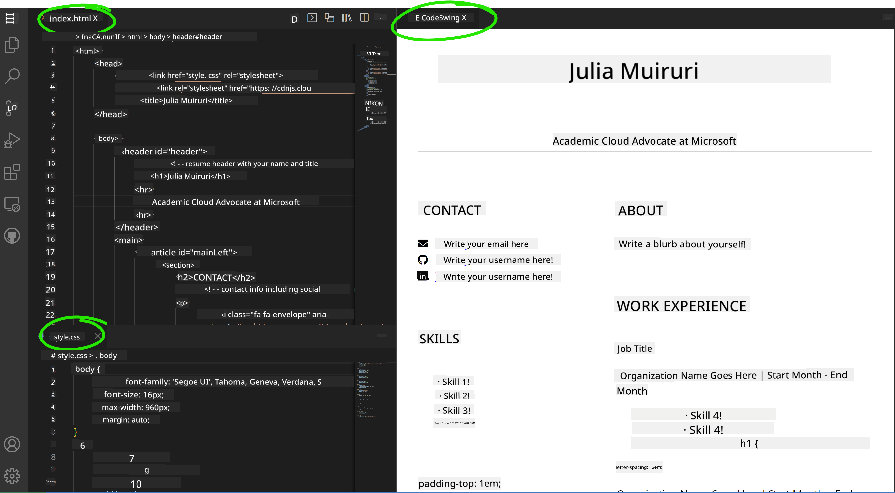

<!--
CO_OP_TRANSLATOR_METADATA:
{
  "original_hash": "bd3aa6d2b879c30ea496c43aec1c49ed",
  "translation_date": "2025-08-29T07:41:13+00:00",
  "source_file": "8-code-editor/1-using-a-code-editor/assignment.md",
  "language_code": "th"
}
-->
# สร้างเว็บไซต์เรซูเม่ด้วย vscode.dev

_จะเจ๋งแค่ไหนถ้าผู้สัมภาษณ์งานขอเรซูเม่ของคุณ แล้วคุณส่งลิงก์เว็บไซต์ให้เขา?_ 😎

## วัตถุประสงค์

หลังจากทำงานนี้ คุณจะได้เรียนรู้วิธี:

- สร้างเว็บไซต์เพื่อแสดงเรซูเม่ของคุณ

### สิ่งที่ต้องเตรียม

1. บัญชี GitHub หากยังไม่มีบัญชี ให้ไปที่ [GitHub](https://github.com/) และสร้างบัญชี

## ขั้นตอน

**ขั้นตอนที่ 1:** สร้าง GitHub Repository ใหม่และตั้งชื่อว่า `my-resume`

**ขั้นตอนที่ 2:** สร้างไฟล์ `index.html` ใน Repository ของคุณ เราจะเพิ่มไฟล์อย่างน้อยหนึ่งไฟล์ใน github.com เพราะคุณไม่สามารถเปิด Repository ที่ว่างเปล่าใน vscode.dev ได้

คลิกที่ลิงก์ `creating a new file` พิมพ์ชื่อไฟล์ว่า `index.html` และเลือกปุ่ม `Commit new file`


**ขั้นตอนที่ 3:** เปิด [VSCode.dev](https://vscode.dev) และเลือกปุ่ม `Open Remote Repository`

คัดลอก URL ของ Repository ที่คุณเพิ่งสร้างสำหรับเว็บไซต์เรซูเม่ของคุณ และวางลงในช่องป้อนข้อมูล:

_แทนที่ `your-username` ด้วยชื่อผู้ใช้ GitHub ของคุณ_

```
https://github.com/your-username/my-resume
```

✅ หากสำเร็จ คุณจะเห็นโปรเจกต์และไฟล์ index.html เปิดขึ้นในตัวแก้ไขข้อความบนเบราว์เซอร์


**ขั้นตอนที่ 4:** เปิดไฟล์ `index.html` วางโค้ดด้านล่างลงในพื้นที่โค้ดของคุณ และบันทึก

<details>
    <summary><b>โค้ด HTML สำหรับเนื้อหาในเว็บไซต์เรซูเม่ของคุณ</b></summary>
    
        <html>

            <head>
                <link href="style.css" rel="stylesheet">
                <link rel="stylesheet" href="https://cdnjs.cloudflare.com/ajax/libs/font-awesome/5.15.4/css/all.min.css">
                <title>ใส่ชื่อของคุณที่นี่!</title>
            </head>
            <body>
                <header id="header">
                    <!-- ส่วนหัวของเรซูเม่ที่มีชื่อและตำแหน่งของคุณ -->
                    <h1>ใส่ชื่อของคุณที่นี่!</h1>
                    <hr>
                    ใส่ตำแหน่งของคุณ!
                    <hr>
                </header>
                <main>
                    <article id="mainLeft">
                        <section>
                            <h2>ติดต่อ</h2>
                            <!-- ข้อมูลการติดต่อรวมถึงโซเชียลมีเดีย -->
                            <p>
                                <i class="fa fa-envelope" aria-hidden="true"></i>
                                <a href="mailto:username@domain.top-level domain">ใส่อีเมลของคุณที่นี่</a>
                            </p>
                            <p>
                                <i class="fab fa-github" aria-hidden="true"></i>
                                <a href="github.com/yourGitHubUsername">ใส่ชื่อผู้ใช้ของคุณที่นี่!</a>
                            </p>
                            <p>
                                <i class="fab fa-linkedin" aria-hidden="true"></i>
                                <a href="linkedin.com/yourLinkedInUsername">ใส่ชื่อผู้ใช้ของคุณที่นี่!</a>
                            </p>
                        </section>
                        <section>
                            <h2>ทักษะ</h2>
                            <!-- ทักษะของคุณ -->
                            <ul>
                                <li>ทักษะ 1!</li>
                                <li>ทักษะ 2!</li>
                                <li>ทักษะ 3!</li>
                                <li>ทักษะ 4!</li>
                            </ul>
                        </section>
                        <section>
                            <h2>การศึกษา</h2>
                            <!-- การศึกษาของคุณ -->
                            <h3>ใส่หลักสูตรของคุณที่นี่!</h3>
                            <p>
                                ใส่ชื่อสถาบันของคุณที่นี่!
                            </p>
                            <p>
                                วันที่เริ่ม - วันที่สิ้นสุด
                            </p>
                        </section>            
                    </article>
                    <article id="mainRight">
                        <section>
                            <h2>เกี่ยวกับ</h2>
                            <!-- เกี่ยวกับตัวคุณ -->
                            <p>เขียนคำอธิบายเกี่ยวกับตัวคุณ!</p>
                        </section>
                        <section>
                            <h2>ประสบการณ์การทำงาน</h2>
                            <!-- ประสบการณ์การทำงานของคุณ -->
                            <h3>ชื่อตำแหน่งงาน</h3>
                            <p>
                                ใส่ชื่อองค์กร | เดือนเริ่ม – เดือนสิ้นสุด
                            </p>
                            <ul>
                                    <li>งานที่ 1 - เขียนสิ่งที่คุณทำ!</li>
                                    <li>งานที่ 2 - เขียนสิ่งที่คุณทำ!</li>
                                    <li>เขียนผลลัพธ์/ผลกระทบจากการมีส่วนร่วมของคุณ</li>
                                    
                            </ul>
                            <h3>ชื่อตำแหน่งงาน 2</h3>
                            <p>
                                ใส่ชื่อองค์กร | เดือนเริ่ม – เดือนสิ้นสุด
                            </p>
                            <ul>
                                    <li>งานที่ 1 - เขียนสิ่งที่คุณทำ!</li>
                                    <li>งานที่ 2 - เขียนสิ่งที่คุณทำ!</li>
                                    <li>เขียนผลลัพธ์/ผลกระทบจากการมีส่วนร่วมของคุณ</li>
                                    
                            </ul>
                        </section>
                    </article>
                </main>
            </body>
        </html>
</details>

เพิ่มรายละเอียดเรซูเม่ของคุณเพื่อแทนที่ _ข้อความตัวอย่าง_ ในโค้ด HTML

**ขั้นตอนที่ 5:** วางเมาส์บนโฟลเดอร์ My-Resume คลิกไอคอน `New File ...` และสร้างไฟล์ใหม่ 2 ไฟล์ในโปรเจกต์ของคุณ: `style.css` และ `codeswing.json`

**ขั้นตอนที่ 6:** เปิดไฟล์ `style.css` วางโค้ดด้านล่างและบันทึก

<details>
        <summary><b>โค้ด CSS สำหรับจัดรูปแบบเลย์เอาต์ของเว็บไซต์</b></summary>
            
            body {
                font-family: 'Segoe UI', Tahoma, Geneva, Verdana, sans-serif;
                font-size: 16px;
                max-width: 960px;
                margin: auto;
            }
            h1 {
                font-size: 3em;
                letter-spacing: .6em;
                padding-top: 1em;
                padding-bottom: 1em;
            }

            h2 {
                font-size: 1.5em;
                padding-bottom: 1em;
            }

            h3 {
                font-size: 1em;
                padding-bottom: 1em;
            }
            main { 
                display: grid;
                grid-template-columns: 40% 60%;
                margin-top: 3em;
            }
            header {
                text-align: center;
                margin: auto 2em;
            }

            section {
                margin: auto 1em 4em 2em;
            }

            i {
                margin-right: .5em;
            }

            p {
                margin: .2em auto
            }

            hr {
                border: none;
                background-color: lightgray;
                height: 1px;
            }

            h1, h2, h3 {
                font-weight: 100;
                margin-bottom: 0;
            }
            #mainLeft {
                border-right: 1px solid lightgray;
            }
            
</details>

**ขั้นตอนที่ 6:** เปิดไฟล์ `codeswing.json` วางโค้ดด้านล่างและบันทึก

    {
    "scripts": [],
    "styles": []
    }

**ขั้นตอนที่ 7:** ติดตั้ง `Codeswing extension` เพื่อดูเว็บไซต์เรซูเม่ในพื้นที่โค้ด

คลิกไอคอน _`Extensions`_ บนแถบกิจกรรมและพิมพ์ Codeswing จากนั้นคลิกปุ่ม _ติดตั้งสีน้ำเงิน_ บนแถบกิจกรรมที่ขยาย หรือใช้ปุ่มติดตั้งที่ปรากฏในพื้นที่โค้ดเมื่อคุณเลือกส่วนขยาย หลังจากติดตั้งส่วนขยาย สังเกตการเปลี่ยนแปลงในโปรเจกต์ของคุณ 😃


นี่คือสิ่งที่คุณจะเห็นบนหน้าจอหลังจากติดตั้งส่วนขยาย



หากคุณพอใจกับการเปลี่ยนแปลงที่ทำไว้ ให้คลิกที่โฟลเดอร์ `Changes` และคลิกปุ่ม `+` เพื่อเพิ่มการเปลี่ยนแปลง

พิมพ์ข้อความ commit _(คำอธิบายการเปลี่ยนแปลงที่คุณทำในโปรเจกต์)_ และ commit การเปลี่ยนแปลงของคุณโดยคลิกที่ `check` เมื่อทำงานในโปรเจกต์เสร็จแล้ว ให้เลือกไอคอนเมนูแฮมเบอร์เกอร์ที่มุมบนซ้ายเพื่อกลับไปยัง Repository บน GitHub

ยินดีด้วย 🎉 คุณเพิ่งสร้างเว็บไซต์เรซูเม่ด้วย vscode.dev ในไม่กี่ขั้นตอน

## 🚀 ความท้าทาย

เปิด Repository ระยะไกลที่คุณมีสิทธิ์แก้ไขและอัปเดตไฟล์บางไฟล์ จากนั้นลองสร้างสาขาใหม่พร้อมการเปลี่ยนแปลงของคุณและสร้าง Pull Request

## ทบทวนและศึกษาด้วยตัวเอง

อ่านเพิ่มเติมเกี่ยวกับ [VSCode.dev](https://code.visualstudio.com/docs/editor/vscode-web?WT.mc_id=academic-0000-alfredodeza) และฟีเจอร์อื่นๆ ของมัน

---

**ข้อจำกัดความรับผิดชอบ**:  
เอกสารนี้ได้รับการแปลโดยใช้บริการแปลภาษา AI [Co-op Translator](https://github.com/Azure/co-op-translator) แม้ว่าเราจะพยายามให้การแปลมีความถูกต้อง แต่โปรดทราบว่าการแปลอัตโนมัติอาจมีข้อผิดพลาดหรือความไม่แม่นยำ เอกสารต้นฉบับในภาษาต้นทางควรถือเป็นแหล่งข้อมูลที่เชื่อถือได้ สำหรับข้อมูลที่สำคัญ แนะนำให้ใช้บริการแปลภาษามนุษย์มืออาชีพ เราจะไม่รับผิดชอบต่อความเข้าใจผิดหรือการตีความที่ผิดพลาดซึ่งเกิดจากการใช้การแปลนี้