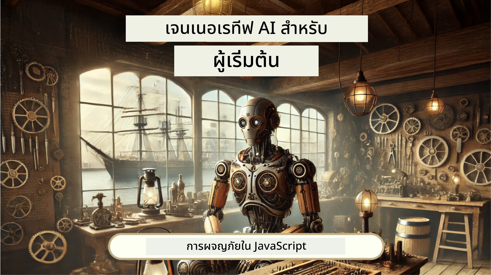
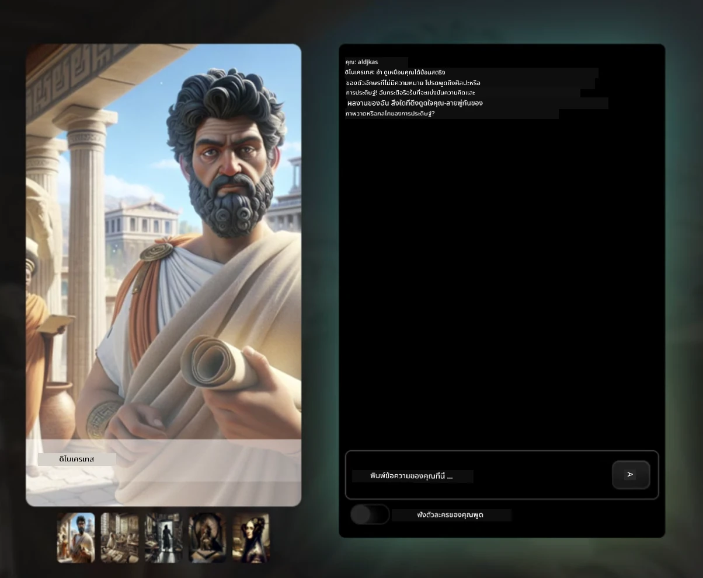
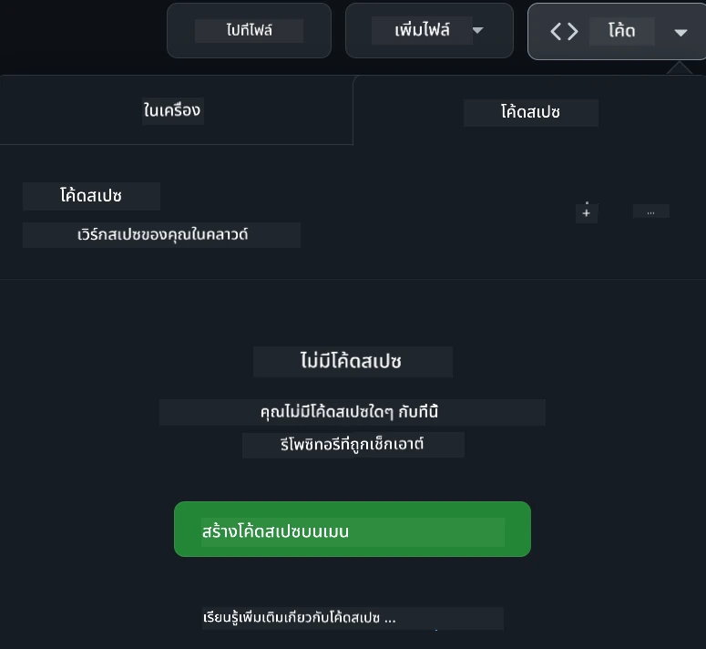

[](https://github.com/microsoft/Web-Dev-For-Beginners/blob/master/LICENSE)
[](https://GitHub.com/microsoft/Web-Dev-For-Beginners/graphs/contributors/)
[](https://GitHub.com/microsoft/Web-Dev-For-Beginners/issues/)
[](https://GitHub.com/microsoft/Web-Dev-For-Beginners/pulls/)
[](http://makeapullrequest.com)

[](https://GitHub.com/microsoft/Web-Dev-For-Beginners/watchers/)
[](https://GitHub.com/microsoft/Web-Dev-For-Beginners/network/)
[](https://GitHub.com/microsoft/Web-Dev-For-Beginners/stargazers/)

[](https://discord.gg/nTYy5BXMWG)

# การพัฒนาเว็บสำหรับผู้เริ่มต้น - หลักสูตร

เรียนรู้พื้นฐานของการพัฒนาเว็บกับหลักสูตรครบวงจร 12 สัปดาห์โดย Microsoft Cloud Advocates แต่ละบทเรียน 24 บทเจาะลึก JavaScript, CSS และ HTML ผ่านโครงการปฏิบัติ เช่น สวนในขวด, ส่วนขยายเบราว์เซอร์ และเกมอวกาศ มีการทดสอบ, การอภิปราย และแบบฝึกหัดเชิงปฏิบัติ เพิ่มพูนทักษะและเพิ่มประสิทธิภาพการจดจำความรู้ด้วยวิธีการสอนที่เน้นโครงการ เริ่มต้นการเขียนโค้ดของคุณวันนี้!

เข้าร่วมชุมชน Azure AI Foundry Discord

[](https://discord.gg/nTYy5BXMWG)

ทำตามขั้นตอนเหล่านี้เพื่อเริ่มต้นใช้แหล่งข้อมูลเหล่านี้:
1. **ทำการ Fork ที่เก็บข้อมูล**: คลิก [](https://GitHub.com/microsoft/Web-Dev-For-Beginners/fork)
2. **โคลนที่เก็บข้อมูล**:   `git clone https://github.com/microsoft/Web-Dev-For-Beginners.git`
3. [**เข้าร่วม Azure AI Foundry Discord เพื่อพบปะผู้เชี่ยวชาญและนักพัฒนาร่วมกัน**](https://discord.com/invite/ByRwuEEgH4)

### 🌐 รองรับหลายภาษา

#### รองรับผ่าน GitHub Action (อัตโนมัติ & อัปเดตตลอดเวลา)

<!-- CO-OP TRANSLATOR LANGUAGES TABLE START -->
[Arabic](../ar/README.md) | [Bengali](../bn/README.md) | [Bulgarian](../bg/README.md) | [Burmese (Myanmar)](../my/README.md) | [Chinese (Simplified)](../zh-CN/README.md) | [Chinese (Traditional, Hong Kong)](../zh-HK/README.md) | [Chinese (Traditional, Macau)](../zh-MO/README.md) | [Chinese (Traditional, Taiwan)](../zh-TW/README.md) | [Croatian](../hr/README.md) | [Czech](../cs/README.md) | [Danish](../da/README.md) | [Dutch](../nl/README.md) | [Estonian](../et/README.md) | [Finnish](../fi/README.md) | [French](../fr/README.md) | [German](../de/README.md) | [Greek](../el/README.md) | [Hebrew](../he/README.md) | [Hindi](../hi/README.md) | [Hungarian](../hu/README.md) | [Indonesian](../id/README.md) | [Italian](../it/README.md) | [Japanese](../ja/README.md) | [Kannada](../kn/README.md) | [Korean](../ko/README.md) | [Lithuanian](../lt/README.md) | [Malay](../ms/README.md) | [Malayalam](../ml/README.md) | [Marathi](../mr/README.md) | [Nepali](../ne/README.md) | [Nigerian Pidgin](../pcm/README.md) | [Norwegian](../no/README.md) | [Persian (Farsi)](../fa/README.md) | [Polish](../pl/README.md) | [Portuguese (Brazil)](../pt-BR/README.md) | [Portuguese (Portugal)](../pt-PT/README.md) | [Punjabi (Gurmukhi)](../pa/README.md) | [Romanian](../ro/README.md) | [Russian](../ru/README.md) | [Serbian (Cyrillic)](../sr/README.md) | [Slovak](../sk/README.md) | [Slovenian](../sl/README.md) | [Spanish](../es/README.md) | [Swahili](../sw/README.md) | [Swedish](../sv/README.md) | [Tagalog (Filipino)](../tl/README.md) | [Tamil](../ta/README.md) | [Telugu](../te/README.md) | [Thai](./README.md) | [Turkish](../tr/README.md) | [Ukrainian](../uk/README.md) | [Urdu](../ur/README.md) | [Vietnamese](../vi/README.md)

> **ต้องการโคลนในเครื่อง?**

> ที่เก็บนี้รวมการแปลมากกว่า 50 ภาษา ซึ่งเพิ่มขนาดการดาวน์โหลดอย่างมาก หากต้องการโคลนโดยไม่มีการแปล ให้ใช้ sparse checkout:
> ```bash
> git clone --filter=blob:none --sparse https://github.com/microsoft/Web-Dev-For-Beginners.git
> cd Web-Dev-For-Beginners
> git sparse-checkout set --no-cone '/*' '!translations' '!translated_images'
> ```
> จะให้ทุกอย่างที่คุณต้องใช้สำหรับทำหลักสูตรนี้ด้วยการดาวน์โหลดที่เร็วขึ้นมาก
<!-- CO-OP TRANSLATOR LANGUAGES TABLE END -->

**หากคุณต้องการรองรับภาษาแปลเพิ่มเติม รายการภาษาที่รองรับอยู่ [ที่นี่](https://github.com/Azure/co-op-translator/blob/main/getting_started/supported-languages.md)**

[](https://open.vscode.dev/microsoft/Web-Dev-For-Beginners)

#### 🧑‍🎓 _คุณเป็นนักเรียนหรือไม่?_

เยี่ยมชม [**หน้า Student Hub**](https://docs.microsoft.com/learn/student-hub/?WT.mc_id=academic-77807-sagibbon) ที่ซึ่งคุณจะพบแหล่งเรียนรู้สำหรับผู้เริ่มต้น, ชุดนักเรียน และแม้แต่ช่องทางรับบัตรรับรองฟรี นี่คือหน้าที่คุณควรบันทึกไว้และตรวจสอบเป็นระยะๆ เนื่องจากเราจะเปลี่ยนเนื้อหาเป็นรายเดือน

### 📣 ประกาศ - ความท้าทายโหมด GitHub Copilot Agent ใหม่ให้ทำให้สำเร็จ!

เพิ่มความท้าทายใหม่ ดูได้ในหัวข้อต่างๆ ชื่อ "GitHub Copilot Agent Challenge 🚀" นี่คือความท้าทายใหม่ที่ให้คุณทำโดยใช้ GitHub Copilot และโหมด Agent หากคุณยังไม่เคยใช้โหมด Agent มาก่อน มันสามารถไม่เพียงแค่สร้างข้อความ แต่ยังสร้างและแก้ไขไฟล์, รันคำสั่ง และอื่น ๆ ได้อีกด้วย

### 📣 ประกาศ - _โครงการใหม่สร้างด้วย Generative AI_

มีการเพิ่มโครงการผู้ช่วย AI ใหม่ ตรวจสอบ [โครงการ](./9-chat-project/README.md)

### 📣 ประกาศ - _หลักสูตรใหม่_ เกี่ยวกับ Generative AI สำหรับ JavaScript ได้เปิดตัวแล้ว

อย่าพลาดหลักสูตร Generative AI ใหม่ของเรา!

เยี่ยมชม [https://aka.ms/genai-js-course](https://aka.ms/genai-js-course) เพื่อเริ่มต้น!



- บทเรียนครอบคลุมทุกอย่างตั้งแต่พื้นฐานถึง RAG
- โต้ตอบกับตัวละครประวัติศาสตร์โดยใช้ GenAI และแอปเสริมของเรา
- เรื่องเล่าสนุกสนานและน่าติดตาม คุณจะได้เดินทางข้ามเวลา!




แต่ละบทเรียนมีงานมอบหมายให้ทำ, การตรวจสอบความรู้ และความท้าทายเพื่อแนะนำคุณในการเรียนรู้หัวข้อต่างๆ เช่น:
- การตั้งคำถามและวิศวกรรมคำถาม (Prompt Engineering)
- การสร้างแอปข้อความและภาพ
- แอปค้นหา

เยี่ยมชม [https://aka.ms/genai-js-course](../../[https:/aka.ms/genai-js-course) เพื่อเริ่มต้น!


## 🌱 เริ่มต้น

> **คุณครู** เราได้ [รวมข้อแนะนำบางส่วน](for-teachers.md) เกี่ยวกับวิธีการใช้หลักสูตรนี้ เรารอรับคำติชมของคุณ [ในฟอรัมการอภิปรายของเรา](https://github.com/microsoft/Web-Dev-For-Beginners/discussions/categories/teacher-corner)!

**[ผู้เรียน](https://aka.ms/student-page/?WT.mc_id=academic-77807-sagibbon)** สำหรับแต่ละบทเรียน ให้เริ่มด้วยแบบทดสอบก่อนบรรยาย แล้วจึงอ่านเนื้อหาบรรยาย ทำกิจกรรมต่างๆ และตรวจสอบความเข้าใจของคุณด้วยแบบทดสอบหลังบรรยาย

เพื่อเพิ่มประสบการณ์การเรียนรู้ของคุณ ให้เชื่อมต่อกับเพื่อนร่วมเรียนเพื่อทำโครงการร่วมกัน! ส่งเสริมการอภิปรายใน [ฟอรัมการอภิปรายของเรา](https://github.com/microsoft/Web-Dev-For-Beginners/discussions) ที่ซึ่งทีมผู้ดูแลของเราจะคอยตอบคำถามของคุณ

เพื่อการศึกษาที่กว้างขวาง เราแนะนำอย่างยิ่งให้สำรวจ [Microsoft Learn](https://learn.microsoft.com/users/wirelesslife/collections/p1ddcy5jwy0jkm?WT.mc_id=academic-77807-sagibbon) เพื่อหาวัสดุการศึกษาเพิ่มเติม

### 📋 การตั้งค่าสภาพแวดล้อมของคุณ

หลักสูตรนี้มีสภาพแวดล้อมการพัฒนาที่พร้อมใช้งาน! เมื่อคุณเริ่มต้นคุณสามารถเลือกที่จะรันหลักสูตรนี้ใน [Codespace](https://github.com/features/codespaces/) (_สภาพแวดล้อมบนเบราว์เซอร์ที่ไม่ต้องติดตั้งใดๆ_), หรือรันในเครื่องของคุณโดยใช้เครื่องมือแก้ไขข้อความเช่น [Visual Studio Code](https://code.visualstudio.com/?WT.mc_id=academic-77807-sagibbon)

#### สร้างที่เก็บของคุณ
เพื่อให้คุณสามารถบันทึกผลงานของคุณได้ง่าย เราแนะนำให้คุณสร้างสำเนาของที่เก็บนี้ คุณสามารถทำได้โดยคลิกปุ่ม **ใช้แม่แบบนี้** ที่ด้านบนของหน้า ซึ่งจะสร้างที่เก็บใหม่ในบัญชี GitHub ของคุณที่มีสำเนาหลักสูตรนี้

ทำตามขั้นตอนนี้:
1. **ทำ Fork ที่เก็บข้อมูล**: คลิกที่ปุ่ม "Fork" ที่มุมขวาบนของหน้านี้
2. **โคลนที่เก็บข้อมูล**:   `git clone https://github.com/microsoft/Web-Dev-For-Beginners.git`

#### การรันหลักสูตรใน Codespace

ในสำเนาที่คุณสร้างขึ้น ให้คลิกปุ่ม **Code** และเลือก **เปิดด้วย Codespaces** เพื่อสร้าง Codespace ใหม่สำหรับคุณทำงาน



#### การรันหลักสูตรในเครื่องของคุณ

หากคุณต้องการรันหลักสูตรนี้ในเครื่องของคุณ คุณจะต้องมีเครื่องมือแก้ไขข้อความ, เบราว์เซอร์ และเครื่องมือบรรทัดคำสั่ง บทเรียนแรกของเรา [บทนำสู่ภาษาโปรแกรมและเครื่องมือการพัฒนา](../../1-getting-started-lessons/1-intro-to-programming-languages) จะนำคุณผ่านตัวเลือกต่าง ๆ สำหรับเครื่องมือเหล่านี้เพื่อให้คุณเลือกใช้ตามที่เหมาะสมกับคุณ

คำแนะนำของเราคือใช้ [Visual Studio Code](https://code.visualstudio.com/?WT.mc_id=academic-77807-sagibbon) เป็นเครื่องมือแก้ไขที่มาพร้อมกับ [เทอร์มินัล](https://code.visualstudio.com/docs/terminal/basics/?WT.mc_id=academic-77807-sagibbon) ในตัว คุณสามารถดาวน์โหลด Visual Studio Code ได้ที่นี่ [ลิงก์ดาวน์โหลด](https://code.visualstudio.com/?WT.mc_id=academic-77807-sagibbon)


1. โคลนที่เก็บของคุณมายังเครื่องคอมพิวเตอร์ของคุณ โดยการคลิกปุ่ม **Code** และคัดลอก URL:

    [CodeSpace](./images/createcodespace.png)
จากนั้น เปิด [Terminal](https://code.visualstudio.com/docs/terminal/basics/?WT.mc_id=academic-77807-sagibbon) ภายใน [Visual Studio Code](https://code.visualstudio.com/?WT.mc_id=academic-77807-sagibbon) แล้วรันคำสั่งต่อไปนี้ โดยแทนที่ `<your-repository-url>` ด้วย URL ที่คุณเพิ่งคัดลอกมา:

    ```bash 
    git clone <your-repository-url>
    ```

2. เปิดโฟลเดอร์ใน Visual Studio Code คุณสามารถทำได้โดยคลิกที่ **File** > **Open Folder** และเลือกโฟลเดอร์ที่คุณเพิ่งโคลนมา


>  ส่วนขยาย Visual Studio Code ที่แนะนำ:
>
> * [Live Server](https://marketplace.visualstudio.com/items?itemName=ritwickdey.LiveServer&WT.mc_id=academic-77807-sagibbon) - เพื่อดูตัวอย่างหน้า HTML ภายใน Visual Studio Code
> * [Copilot](https://marketplace.visualstudio.com/items?itemName=GitHub.copilot&WT.mc_id=academic-77807-sagibbon) - เพื่อช่วยคุณเขียนโค้ดได้เร็วขึ้น

## 📂 แต่ละบทเรียนประกอบด้วย:

- สเก็ตช์โน้ต (optional)
- วิดีโอเสริม (optional)
- แบบทดสอบวอร์มอัพก่อนบทเรียน
- บทเรียนที่เขียน
- สำหรับบทเรียนแบบโปรเจกต์ มีไกด์ทีละขั้นตอนในการสร้างโปรเจกต์
- การตรวจสอบความรู้
- ความท้าทาย
- การอ่านเสริม
- งานมอบหมาย
- [แบบทดสอบหลังบทเรียน](https://ff-quizzes.netlify.app/web/)

> **หมายเหตุเกี่ยวกับแบบทดสอบ**: แบบทดสอบทั้งหมดถูกเก็บไว้ในโฟลเดอร์ Quiz-app รวม 48 แบบทดสอบ แต่ละชุดมีสามคำถาม คุณสามารถเข้าถึงได้ [ที่นี่](https://ff-quizzes.netlify.app/web/) แบบทดสอบสามารถรันได้ในเครื่องหรือจะดีพลอยที่ Azure ตามคำแนะนำในโฟลเดอร์ `quiz-app`

## 🗃️ บทเรียน

|     |                       ชื่อโปรเจกต์                       |                            แนวคิดที่เรียนรู้                             | วัตถุประสงค์การเรียนรู้                                                                                                               |                                                         บทเรียนที่เชื่อมโยง                                                          |         ผู้แต่ง          |
| :-: | :------------------------------------------------------: | :--------------------------------------------------------------------: | ----------------------------------------------------------------------------------------------------------------------------------- | :----------------------------------------------------------------------------------------------------------------------------: | :---------------------: |
| 01  |                     Getting Started                      |           บทนำสู่การเขียนโปรแกรมและเครื่องมือการทำงาน           | เรียนรู้พื้นฐานเบื้องต้นของภาษาการเขียนโปรแกรมส่วนใหญ่และเกี่ยวกับซอฟต์แวร์ที่ช่วยนักพัฒนามืออาชีพทำงานของพวกเขา | [Intro to Programming Languages and Tools of the Trade](./1-getting-started-lessons/1-intro-to-programming-languages/README.md) |         Jasmine         |
| 02  |                     Getting Started                      |             พื้นฐานของ GitHub รวมถึงการทำงานร่วมกับทีม             | วิธีใช้ GitHub ในโปรเจกต์ของคุณ วิธีการทำงานร่วมกับผู้อื่นบนฐานโค้ด                                                             |                            [Intro to GitHub](./1-getting-started-lessons/2-github-basics/README.md)                             |          Floor          |
| 03  |                     Getting Started                      |                             การเข้าถึง                              | เรียนรู้พื้นฐานของการเข้าถึงเว็บไซต์                                                                                                |                       [Accessibility Fundamentals](./1-getting-started-lessons/3-accessibility/README.md)                       |       Christopher       |
| 04  |                        JS Basics                         |                         ประเภทข้อมูลใน JavaScript                          | พื้นฐานของประเภทข้อมูลใน JavaScript                                                                                                |                                       [Data Types](./2-js-basics/1-data-types/README.md)                                        |         Jasmine         |
| 05  |                        JS Basics                         |                         ฟังก์ชันและเมธอด                          | เรียนรู้เกี่ยวกับฟังก์ชันและเมธอดเพื่อจัดการลำดับความคิดของแอปพลิเคชัน                                                           |                              [Functions and Methods](./2-js-basics/2-functions-methods/README.md)                               | Jasmine and Christopher |
| 06  |                        JS Basics                         |                        การตัดสินใจใน JS                        | เรียนรู้วิธีสร้างเงื่อนไขในโค้ดของคุณโดยใช้วิธีการตัดสินใจ                                                                         |                                 [Making Decisions](./2-js-basics/3-making-decisions/README.md)                                  |         Jasmine         |
| 07  |                        JS Basics                         |                            อาร์เรย์และลูป                            | ทำงานกับข้อมูลโดยใช้ arrays และ loops ใน JavaScript                                                                                |                                   [Arrays and Loops](./2-js-basics/4-arrays-loops/README.md)                                    |         Jasmine         |
| 08  |       [Terrarium](./3-terrarium/solution/README.md)       |                            การใช้งาน HTML                            | สร้าง HTML เพื่อสร้างเทอร์ราเรียมออนไลน์ โดยเน้นการสร้างเลย์เอาต์                                                                    |                                 [Introduction to HTML](./3-terrarium/1-intro-to-html/README.md)                                 |           Jen           |
| 09  |       [Terrarium](./3-terrarium/solution/README.md)       |                            การใช้งาน CSS                             | สร้าง CSS เพื่อจัดแต่งเทอร์ราเรียมออนไลน์ โดยเน้นพื้นฐานของ CSS รวมถึงการทำให้หน้าเว็บตอบสนอง                                         |                                  [Introduction to CSS](./3-terrarium/2-intro-to-css/README.md)                                  |           Jen           |
| 10  |            [Terrarium](./3-terrarium/solution/README.md)            |                 JavaScript Closures, DOM manipulation                  | สร้าง JavaScript เพื่อทำให้เทอร์ราเรียมทำงานเป็นอินเทอร์เฟซลากและวาง โดยเน้น closures และ DOM manipulation                         |                  [JavaScript Closures, DOM manipulation](./3-terrarium/3-intro-to-DOM-and-closures/README.md)                   |           Jen           |
| 11  |          [Typing Game](./4-typing-game/solution/README.md)          |                          สร้างเกมพิมพ์                           | เรียนรู้วิธีใช้ keyboard events เพื่อขับเคลื่อนลอจิกของแอป JavaScript ของคุณ                                                     |                                [Event-Driven Programming](./4-typing-game/typing-game/README.md)                                |       Christopher       |
| 12  | [Green Browser Extension](./5-browser-extension/solution/README.md) |                         การทำงานกับเบราว์เซอร์                          | เรียนรู้วิธีการทำงานของเบราว์เซอร์ ประวัติ และวิธีตั้งโครงร่างองค์ประกอบแรกของส่วนขยายเบราว์เซอร์                              |                               [About Browsers](./5-browser-extension/1-about-browsers/README.md)                                |           Jen           |
| 13  | [Green Browser Extension](./5-browser-extension/solution/README.md) | สร้างฟอร์ม เรียกใช้ API และจัดเก็บตัวแปรใน Local Storage | สร้างองค์ประกอบ JavaScript ของส่วนขยายเบราว์เซอร์ของคุณเพื่อเรียกใช้ API โดยใช้ตัวแปรที่เก็บใน Local Storage                       |                [APIs, Forms, and Local Storage](./5-browser-extension/2-forms-browsers-local-storage/README.md)                 |           Jen           |
| 14  | [Green Browser Extension](./5-browser-extension/solution/README.md) |          กระบวนการพื้นหลังในเบราว์เซอร์ การแสดงผลเว็บ          | ใช้กระบวนการพื้นหลังของเบราว์เซอร์เพื่อจัดการไอคอนส่วนขยาย เรียนรู้เกี่ยวกับการแสดงผลเว็บและการปรับแต่งเพื่อประสิทธิภาพที่ดีขึ้น  |             [Background Tasks and Performance](./5-browser-extension/3-background-tasks-and-performance/README.md)              |           Jen           |
| 15  |           [Space Game](./6-space-game/solution/README.md)           |             การพัฒนาเกมขั้นสูงด้วย JavaScript             | เรียนรู้เกี่ยวกับการสืบทอดโดยใช้ทั้ง Classes และ Composition รวมถึงรูปแบบ Pub/Sub เพื่อเตรียมตัวสำหรับการสร้างเกม                |                      [Introduction to Advanced Game Development](./6-space-game/1-introduction/README.md)                       |          Chris          |
| 16  |           [Space Game](./6-space-game/solution/README.md)           |                           การวาดลงบนแคนวาส                            | เรียนรู้เกี่ยวกับ Canvas API ที่ใช้สำหรับวาดองค์ประกอบลงบนหน้าจอ                                                                  |                                [Drawing to Canvas](./6-space-game/2-drawing-to-canvas/README.md)                                |          Chris          |
| 17  |           [Space Game](./6-space-game/solution/README.md)           |                   การเคลื่อนย้ายองค์ประกอบบนหน้าจอ                    | ค้นพบวิธีที่องค์ประกอบสามารถเคลื่อนที่ได้โดยใช้พิกัดคาร์ทีเซียนและ Canvas API                                                    |                           [Moving Elements Around](./6-space-game/3-moving-elements-around/README.md)                           |          Chris          |
| 18  |           [Space Game](./6-space-game/solution/README.md)           |                          การตรวจจับการชน                           | ทำให้องค์ประกอบชนกันและตอบสนองต่อกันโดยใช้การกดปุ่มและเพิ่มฟังก์ชันเย็นตัวเพื่อประสิทธิภาพของเกม                           |                              [Collision Detection](./6-space-game/4-collision-detection/README.md)                              |          Chris          |
| 19  |           [Space Game](./6-space-game/solution/README.md)           |                             การเก็บคะแนน                              | คำนวณทางคณิตศาสตร์ตามสถานะและประสิทธิภาพของเกม                                                                                   |                                    [Keeping Score](./6-space-game/5-keeping-score/README.md)                                    |          Chris          |
| 20  |           [Space Game](./6-space-game/solution/README.md)           |                     การจบและเริ่มเกมใหม่                     | เรียนรู้เกี่ยวกับการจบและเริ่มเกมใหม่ รวมถึงการจัดการกับทรัพยากรและรีเซ็ตค่าตัวแปร                                                 |                                [The Ending Condition](./6-space-game/6-end-condition/README.md)                                 |          Chris          |
| 21  |         [Banking App](./7-bank-project/solution/README.md)          |                 HTML Templates และ Routes ในเว็บแอป                 | เรียนรู้วิธีสร้างโครงสร้างของเว็บหลายหน้าโดยใช้ routing และ HTML templates                                                        |                            [HTML Templates and Routes](./7-bank-project/1-template-route/README.md)                             |          Yohan          |
| 22  |         [Banking App](./7-bank-project/solution/README.md)          |                  สร้างฟอร์มล็อกอินและลงทะเบียน                   | เรียนรู้เกี่ยวกับการสร้างฟอร์มและจัดการตรวจสอบความถูกต้อง                                                                           |                                           [Forms](./7-bank-project/2-forms/README.md)                                           |          Yohan          |
| 23  |         [Banking App](./7-bank-project/solution/README.md)          |                   วิธีการดึงและใช้ข้อมูล                   | วิธีการไหลของข้อมูลเข้าออกแอปของคุณ วิธีการดึงข้อมูล เก็บ และลบทิ้ง                                                                   |                                            [Data](./7-bank-project/3-data/README.md)                                            |          Yohan          |
| 24  |         [Banking App](./7-bank-project/solution/README.md)          |                      แนวคิดการจัดการสถานะ                      | เรียนรู้ว่าแอปของคุณเก็บสถานะอย่างไร และการจัดการด้วยวิธีการเขียนโปรแกรม                                                             |                                [State Management](./7-bank-project/4-state-management/README.md)                                |          Yohan          |
| 25 | [Browser/VScode Code](../../8-code-editor) | การใช้งานกับ VScode | เรียนรู้วิธีใช้ตัวแก้ไขโค้ด | [Use VScode Code Editor](./8-code-editor/1-using-a-code-editor/README.md) | Chris |
| 26 | [AI Assistants](./9-chat-project/README.md) | การทำงานกับ AI | เรียนรู้วิธีสร้างผู้ช่วย AI ของคุณเอง | [AI Assistant project](./9-chat-project/README.md) | Chris |

## 🏫 รูปแบบการสอน

หลักสูตรของเราถูกออกแบบโดยมีหลักการสอนสำคัญสองประการ:
* การเรียนรู้ผ่านโปรเจกต์
* แบบทดสอบบ่อยครั้ง

โปรแกรมนี้สอนพื้นฐานของ JavaScript, HTML และ CSS รวมถึงเครื่องมือและเทคนิคล่าสุดที่นักพัฒนาเว็บสมัยใหม่ใช้ นักเรียนจะมีโอกาสพัฒนาทักษะผ่านการสร้างเกมพิมพ์ เกมเทอร์ราเรียมเสมือนจริง ส่วนขยายเบราว์เซอร์ที่เป็นมิตรต่อสิ่งแวดล้อม เกมสไตล์ space invader และแอปธนาคารสำหรับธุรกิจ เมื่อจบชุดนี้ นักเรียนจะได้ความเข้าใจที่มั่นคงเกี่ยวกับการพัฒนาเว็บ

> 🎓 คุณสามารถเรียนบทเรียนแรกๆ ในหลักสูตรนี้เป็น [เส้นทางการเรียนรู้](https://docs.microsoft.com/learn/paths/web-development-101/?WT.mc_id=academic-77807-sagibbon) บน Microsoft Learn!

โดยการทำให้เนื้อหาสอดคล้องกับโปรเจกต์ กระบวนการเรียนรู้จะน่าสนใจขึ้นและช่วยให้จดจำแนวคิดได้ดีขึ้น นอกจากนี้เรายังเขียนบทเรียนเริ่มต้นในพื้นฐาน JavaScript เพื่อแนะนำแนวคิด คู่กับวิดีโอจากชุด "[Beginners Series to: JavaScript](https://channel9.msdn.com/Series/Beginners-Series-to-JavaScript/?WT.mc_id=academic-77807-sagibbon)" ซึ่งผู้แต่งบางส่วนมีส่วนร่วมในการเขียนหลักสูตรนี้ด้วย

นอกจากนี้ยังมีแบบทดสอบความเสี่ยงต่ำก่อนเข้าชั้นเรียนเพื่อช่วยให้นักเรียนตั้งใจเรียนหัวข้อ และแบบทดสอบอีกชุดหลังเรียนเพื่อเสริมการจดจำ หลักสูตรนี้ออกแบบให้ยืดหยุ่นและสนุกสนาน สามารถเรียนทั้งชุดหรือบางส่วนก็ได้ โปรเจกต์เริ่มเล็กและค่อยๆ มีความซับซ้อนมากขึ้นจนจบรอบ 12 สัปดาห์

แม้ว่าเราจะตั้งใจไม่แนะนำ JavaScript frameworks เพื่อเน้นทักษะพื้นฐานที่จำเป็นก่อนใช้เฟรมเวิร์กขั้นสูง ขั้นตอนถัดไปที่ดีสำหรับการจบหลักสูตรนี้คือการเรียนรู้ Node.js ผ่านชุดวิดีโออีกชุด: "[Beginner Series to: Node.js](https://channel9.msdn.com/Series/Beginners-Series-to-Nodejs/?WT.mc_id=academic-77807-sagibbon)".

> เยี่ยมชม [Code of Conduct](CODE_OF_CONDUCT.md) และแนวทาง [Contributing](CONTRIBUTING.md) ของเรา เรายินดีรับคำติชมเชิงสร้างสรรค์จากคุณ!

## 🧭 การเข้าถึงแบบออฟไลน์

คุณสามารถรันเอกสารนี้แบบออฟไลน์โดยใช้ [Docsify](https://docsify.js.org/#/) โคลน repo นี้, [ติดตั้ง Docsify](https://docsify.js.org/#/quickstart) บนเครื่องของคุณ แล้วในโฟลเดอร์ root ของ repo นี้ ให้พิมพ์คำสั่ง `docsify serve` เว็บไซต์จะให้บริการที่พอร์ต 3000 บน localhost: `localhost:3000`

## 📘 PDF

ไฟล์ PDF ของบทเรียนทั้งหมดสามารถดูได้ [ที่นี่](https://microsoft.github.io/Web-Dev-For-Beginners/pdf/readme.pdf).


## 🎒 หลักสูตรอื่น ๆ
ทีมของเราผลิตหลักสูตรอื่นๆ ด้วย! เชิญดูได้ที่:

<!-- CO-OP TRANSLATOR OTHER COURSES START -->
### LangChain
[](https://aka.ms/langchain4j-for-beginners)
[](https://aka.ms/langchainjs-for-beginners?WT.mc_id=m365-94501-dwahlin)

---

### Azure / Edge / MCP / Agents
[](https://github.com/microsoft/AZD-for-beginners?WT.mc_id=academic-105485-koreyst)
[](https://github.com/microsoft/edgeai-for-beginners?WT.mc_id=academic-105485-koreyst)
[](https://github.com/microsoft/mcp-for-beginners?WT.mc_id=academic-105485-koreyst)
[](https://github.com/microsoft/ai-agents-for-beginners?WT.mc_id=academic-105485-koreyst)

---
 
### Generative AI Series
[](https://github.com/microsoft/generative-ai-for-beginners?WT.mc_id=academic-105485-koreyst)
[-9333EA?style=for-the-badge&labelColor=E5E7EB&color=9333EA)](https://github.com/microsoft/Generative-AI-for-beginners-dotnet?WT.mc_id=academic-105485-koreyst)
[-C084FC?style=for-the-badge&labelColor=E5E7EB&color=C084FC)](https://github.com/microsoft/generative-ai-for-beginners-java?WT.mc_id=academic-105485-koreyst)
[-E879F9?style=for-the-badge&labelColor=E5E7EB&color=E879F9)](https://github.com/microsoft/generative-ai-with-javascript?WT.mc_id=academic-105485-koreyst)

---
 
### Core Learning
[](https://aka.ms/ml-beginners?WT.mc_id=academic-105485-koreyst)
[](https://aka.ms/datascience-beginners?WT.mc_id=academic-105485-koreyst)
[](https://aka.ms/ai-beginners?WT.mc_id=academic-105485-koreyst)
[](https://github.com/microsoft/Security-101?WT.mc_id=academic-96948-sayoung)
[](https://aka.ms/webdev-beginners?WT.mc_id=academic-105485-koreyst)
[](https://aka.ms/iot-beginners?WT.mc_id=academic-105485-koreyst)
[](https://github.com/microsoft/xr-development-for-beginners?WT.mc_id=academic-105485-koreyst)

---
 
### Copilot Series
[](https://aka.ms/GitHubCopilotAI?WT.mc_id=academic-105485-koreyst)
[](https://github.com/microsoft/mastering-github-copilot-for-dotnet-csharp-developers?WT.mc_id=academic-105485-koreyst)
[](https://github.com/microsoft/CopilotAdventures?WT.mc_id=academic-105485-koreyst)
<!-- CO-OP TRANSLATOR OTHER COURSES END -->

## การขอความช่วยเหลือ

หากคุณติดขัดหรือมีคำถามเกี่ยวกับการสร้างแอป AI เข้าร่วมกับผู้เรียนและนักพัฒนาที่มีประสบการณ์ในการอภิปรายเกี่ยวกับ MCP นี่คือชุมชนที่สนับสนุนซึ่งยินดีต้อนรับคำถามและแบ่งปันความรู้กันอย่างเสรี

[](https://discord.gg/nTYy5BXMWG)

หากคุณมีความคิดเห็นเกี่ยวกับผลิตภัณฑ์หรือเกิดข้อผิดพลาดระหว่างการสร้างโปรดไปที่:

[](https://aka.ms/foundry/forum)

## สิทธิ์การใช้งาน

ที่เก็บนี้ได้รับอนุญาตภายใต้ใบอนุญาต MIT ดูไฟล์ [LICENSE](../../LICENSE) สำหรับข้อมูลเพิ่มเติม

---

<!-- CO-OP TRANSLATOR DISCLAIMER START -->
**ข้อจำกัดความรับผิดชอบ**:  
เอกสารนี้ได้รับการแปลโดยใช้บริการแปลด้วย AI [Co-op Translator](https://github.com/Azure/co-op-translator) แม้เราจะพยายามให้มีความถูกต้อง โปรดทราบว่าการแปลอัตโนมัติอาจมีข้อผิดพลาดหรือความไม่แม่นยำ เอกสารต้นฉบับในภาษาต้นทางถือเป็นแหล่งข้อมูลที่ถูกต้องและน่าเชื่อถือ สำหรับข้อมูลที่สำคัญ ควรใช้การแปลโดยมนุษย์มืออาชีพ เราจะไม่รับผิดชอบต่อความเข้าใจผิดหรือการตีความที่ผิดพลาดที่เกิดจากการใช้การแปลนี้
<!-- CO-OP TRANSLATOR DISCLAIMER END -->