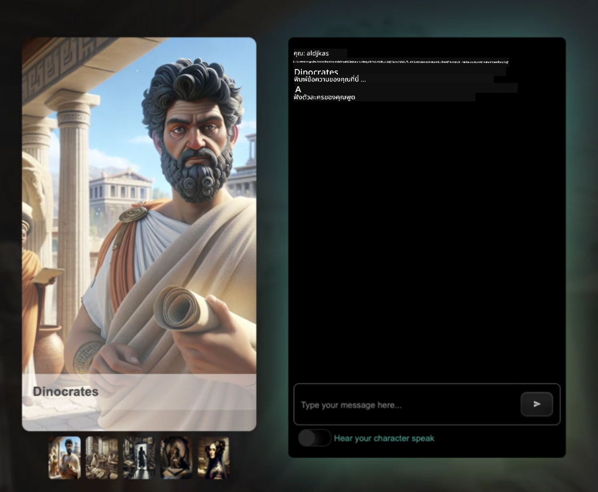

<!--
CO_OP_TRANSLATOR_METADATA:
{
  "original_hash": "8b9d0562ea649b6012d1a67acc630681",
  "translation_date": "2025-10-24T08:52:42+00:00",
  "source_file": "README.md",
  "language_code": "th"
}
-->
[](https://github.com/microsoft/Web-Dev-For-Beginners/blob/master/LICENSE)
[](https://GitHub.com/microsoft/Web-Dev-For-Beginners/graphs/contributors/)
[](https://GitHub.com/microsoft/Web-Dev-For-Beginners/issues/)
[](https://GitHub.com/microsoft/Web-Dev-For-Beginners/pulls/)
[](http://makeapullrequest.com)

[](https://GitHub.com/microsoft/Web-Dev-For-Beginners/watchers/)
[](https://GitHub.com/microsoft/Web-Dev-For-Beginners/network/)
[](https://GitHub.com/microsoft/Web-Dev-For-Beginners/stargazers/)

[](https://discord.gg/zxKYvhSnVp?WT.mc_id=academic-000002-leestott)

# การพัฒนาเว็บไซต์สำหรับผู้เริ่มต้น - หลักสูตร

เรียนรู้พื้นฐานการพัฒนาเว็บไซต์กับหลักสูตร 12 สัปดาห์ที่ครอบคลุมโดย Microsoft Cloud Advocates แต่ละบทเรียนจากทั้งหมด 24 บทจะสอนเกี่ยวกับ JavaScript, CSS และ HTML ผ่านโปรเจกต์ที่ลงมือทำจริง เช่น การสร้างสวนขวด, ส่วนขยายเบราว์เซอร์ และเกมอวกาศ มีการทำแบบทดสอบ การอภิปราย และการมอบหมายงานที่ช่วยเพิ่มทักษะและเสริมสร้างความรู้ของคุณ เริ่มต้นการเดินทางสู่การเขียนโค้ดของคุณวันนี้!

เข้าร่วมชุมชน Azure AI Foundry Discord

[](https://discord.com/invite/ByRwuEEgH4)

ทำตามขั้นตอนเหล่านี้เพื่อเริ่มต้นใช้งานทรัพยากรเหล่านี้:
1. **Fork Repository**: คลิก [](https://GitHub.com/microsoft/Web-Dev-For-Beginners/fork)
2. **Clone Repository**:   `git clone https://github.com/microsoft/Web-Dev-For-Beginners.git`
3. [**เข้าร่วม Azure AI Foundry Discord และพบกับผู้เชี่ยวชาญและนักพัฒนาคนอื่นๆ**](https://discord.com/invite/ByRwuEEgH4)

### 🌐 รองรับหลายภาษา

#### รองรับผ่าน GitHub Action (อัตโนมัติและอัปเดตเสมอ)

<!-- CO-OP TRANSLATOR LANGUAGES TABLE START -->
[Arabic](../ar/README.md) | [Bengali](../bn/README.md) | [Bulgarian](../bg/README.md) | [Burmese (Myanmar)](../my/README.md) | [Chinese (Simplified)](../zh/README.md) | [Chinese (Traditional, Hong Kong)](../hk/README.md) | [Chinese (Traditional, Macau)](../mo/README.md) | [Chinese (Traditional, Taiwan)](../tw/README.md) | [Croatian](../hr/README.md) | [Czech](../cs/README.md) | [Danish](../da/README.md) | [Dutch](../nl/README.md) | [Estonian](../et/README.md) | [Finnish](../fi/README.md) | [French](../fr/README.md) | [German](../de/README.md) | [Greek](../el/README.md) | [Hebrew](../he/README.md) | [Hindi](../hi/README.md) | [Hungarian](../hu/README.md) | [Indonesian](../id/README.md) | [Italian](../it/README.md) | [Japanese](../ja/README.md) | [Korean](../ko/README.md) | [Lithuanian](../lt/README.md) | [Malay](../ms/README.md) | [Marathi](../mr/README.md) | [Nepali](../ne/README.md) | [Norwegian](../no/README.md) | [Persian (Farsi)](../fa/README.md) | [Polish](../pl/README.md) | [Portuguese (Brazil)](../br/README.md) | [Portuguese (Portugal)](../pt/README.md) | [Punjabi (Gurmukhi)](../pa/README.md) | [Romanian](../ro/README.md) | [Russian](../ru/README.md) | [Serbian (Cyrillic)](../sr/README.md) | [Slovak](../sk/README.md) | [Slovenian](../sl/README.md) | [Spanish](../es/README.md) | [Swahili](../sw/README.md) | [Swedish](../sv/README.md) | [Tagalog (Filipino)](../tl/README.md) | [Tamil](../ta/README.md) | [Thai](./README.md) | [Turkish](../tr/README.md) | [Ukrainian](../uk/README.md) | [Urdu](../ur/README.md) | [Vietnamese](../vi/README.md)
<!-- CO-OP TRANSLATOR LANGUAGES TABLE END -->

**หากคุณต้องการให้มีการรองรับภาษาเพิ่มเติม รายการภาษาที่รองรับอยู่ [ที่นี่](https://github.com/Azure/co-op-translator/blob/main/getting_started/supported-languages.md)**

[](https://open.vscode.dev/microsoft/Web-Dev-For-Beginners)

#### 🧑‍🎓 _คุณเป็นนักเรียนหรือไม่?_

เยี่ยมชม [**หน้า Student Hub**](https://docs.microsoft.com/learn/student-hub/?WT.mc_id=academic-77807-sagibbon) ซึ่งคุณจะพบทรัพยากรสำหรับผู้เริ่มต้น ชุดเครื่องมือสำหรับนักเรียน และแม้กระทั่งวิธีการรับบัตรกำนัลใบรับรองฟรี นี่คือหน้าที่คุณควรบันทึกไว้และตรวจสอบเป็นระยะๆ เนื่องจากเรามีการเปลี่ยนแปลงเนื้อหาในทุกเดือน

### 📣 ประกาศ - ความท้าทายใหม่ในโหมด Agent ของ GitHub Copilot!

เพิ่มความท้าทายใหม่แล้ว ค้นหา "GitHub Copilot Agent Challenge 🚀" ในบทส่วนใหญ่ นี่คือความท้าทายใหม่ที่คุณสามารถทำได้โดยใช้ GitHub Copilot และโหมด Agent หากคุณยังไม่เคยใช้โหมด Agent มาก่อน มันสามารถทำได้มากกว่าแค่สร้างข้อความ เช่น สร้างและแก้ไขไฟล์ รันคำสั่ง และอื่นๆ

### 📣 ประกาศ - _โปรเจกต์ใหม่ที่สร้างโดยใช้ Generative AI_

โปรเจกต์ AI Assistant ใหม่เพิ่งถูกเพิ่ม ลองดูได้ที่ [โปรเจกต์](./09-chat-project/README.md)

### 📣 ประกาศ - _หลักสูตรใหม่_ เกี่ยวกับ Generative AI สำหรับ JavaScript เพิ่งถูกปล่อยออกมา

อย่าพลาดหลักสูตร Generative AI ใหม่ของเรา!

เยี่ยมชม [https://aka.ms/genai-js-course](https://aka.ms/genai-js-course) เพื่อเริ่มต้น!


- บทเรียนครอบคลุมทุกอย่างตั้งแต่พื้นฐานจนถึง RAG
- โต้ตอบกับตัวละครในประวัติศาสตร์โดยใช้ GenAI และแอปคู่หูของเรา
- เนื้อหาสนุกและน่าสนใจ คุณจะได้เดินทางข้ามเวลา!



แต่ละบทเรียนมีการมอบหมายงานให้ทำ การตรวจสอบความรู้ และความท้าทายเพื่อช่วยให้คุณเรียนรู้หัวข้อต่างๆ เช่น:
- การสร้างคำสั่งและการออกแบบคำสั่ง
- การสร้างแอปข้อความและภาพ
- แอปค้นหา

เยี่ยมชม [https://aka.ms/genai-js-course](../../[https:/aka.ms/genai-js-course) เพื่อเริ่มต้น!


## 🌱 เริ่มต้นใช้งาน

> **ครู** เราได้ [รวมคำแนะนำบางส่วน](for-teachers.md) เกี่ยวกับวิธีการใช้หลักสูตรนี้ เราอยากได้ความคิดเห็นของคุณ [ในฟอรัมการอภิปรายของเรา](https://github.com/microsoft/Web-Dev-For-Beginners/discussions/categories/teacher-corner)!

**[ผู้เรียน](https://aka.ms/student-page/?WT.mc_id=academic-77807-sagibbon)** สำหรับแต่ละบทเรียน เริ่มต้นด้วยแบบทดสอบก่อนการบรรยายและอ่านเนื้อหาการบรรยาย ทำกิจกรรมต่างๆ และตรวจสอบความเข้าใจของคุณด้วยแบบทดสอบหลังการบรรยาย

เพื่อเพิ่มประสบการณ์การเรียนรู้ของคุณ เชื่อมต่อกับเพื่อนๆ เพื่อทำโปรเจกต์ร่วมกัน! เราสนับสนุนให้มีการอภิปรายใน [ฟอรัมการอภิปราย](https://github.com/microsoft/Web-Dev-For-Beginners/discussions) ซึ่งทีมผู้ดูแลของเราจะพร้อมตอบคำถามของคุณ

เพื่อการศึกษาต่อ เราขอแนะนำให้สำรวจ [Microsoft Learn](https://learn.microsoft.com/users/wirelesslife/collections/p1ddcy5jwy0jkm?WT.mc_id=academic-77807-sagibbon) เพื่อค้นหาเนื้อหาการเรียนเพิ่มเติม

### 📋 การตั้งค่าสภาพแวดล้อมของคุณ

หลักสูตรนี้มีสภาพแวดล้อมการพัฒนาพร้อมใช้งาน! เมื่อคุณเริ่มต้น คุณสามารถเลือกที่จะรันหลักสูตรใน [Codespace](https://github.com/features/codespaces/) (_สภาพแวดล้อมที่ใช้เบราว์เซอร์ ไม่ต้องติดตั้ง_) หรือในเครื่องคอมพิวเตอร์ของคุณโดยใช้โปรแกรมแก้ไขข้อความ เช่น [Visual Studio Code](https://code.visualstudio.com/?WT.mc_id=academic-77807-sagibbon)

#### สร้าง Repository ของคุณ
เพื่อให้คุณสามารถบันทึกงานของคุณได้ง่ายขึ้น ขอแนะนำให้คุณสร้างสำเนาของ Repository นี้ คุณสามารถทำได้โดยคลิกปุ่ม **Use this template** ที่ด้านบนของหน้า ซึ่งจะสร้าง Repository ใหม่ในบัญชี GitHub ของคุณพร้อมสำเนาหลักสูตร

ทำตามขั้นตอนเหล่านี้:
1. **Fork Repository**: คลิกปุ่ม "Fork" ที่มุมขวาบนของหน้านี้
2. **Clone Repository**:   `git clone https://github.com/microsoft/Web-Dev-For-Beginners.git`

#### การรันหลักสูตรใน Codespace

ในสำเนา Repository ที่คุณสร้างขึ้น ให้คลิกปุ่ม **Code** และเลือก **Open with Codespaces** ซึ่งจะสร้าง Codespace ใหม่สำหรับคุณในการทำงาน


#### การรันหลักสูตรในเครื่องคอมพิวเตอร์ของคุณ

เพื่อรันหลักสูตรนี้ในเครื่องคอมพิวเตอร์ของคุณ คุณจะต้องมีโปรแกรมแก้ไขข้อความ เบราว์เซอร์ และเครื่องมือบรรทัดคำสั่ง บทเรียนแรกของเรา [Introduction to Programming Languages and Tools of the Trade](../../1-getting-started-lessons/1-intro-to-programming-languages) จะช่วยแนะนำตัวเลือกต่างๆ สำหรับเครื่องมือเหล่านี้ เพื่อให้คุณเลือกสิ่งที่เหมาะสมที่สุดสำหรับคุณ

คำแนะนำของเราคือใช้ [Visual Studio Code](https://code.visualstudio.com/?WT.mc_id=academic-77807-sagibbon) เป็นโปรแกรมแก้ไข ซึ่งมี [Terminal](https://code.visualstudio.com/docs/terminal/basics/?WT.mc_id=academic-77807-sagibbon) ในตัว คุณสามารถดาวน์โหลด Visual Studio Code [ที่นี่](https://code.visualstudio.com/?WT.mc_id=academic-77807-sagibbon)

1. Clone Repository ของคุณลงในคอมพิวเตอร์ คุณสามารถทำได้โดยคลิกปุ่ม **Code** และคัดลอก URL:

    [CodeSpace](./images/createcodespace.png)

    จากนั้นเปิด [Terminal](https://code.visualstudio.com/docs/terminal/basics/?WT.mc_id=academic-77807-sagibbon) ใน [Visual Studio Code](https://code.visualstudio.com/?WT.mc_id=academic-77807-sagibbon) และรันคำสั่งต่อไปนี้ โดยแทนที่ `<your-repository-url>` ด้วย URL ที่คุณเพิ่งคัดลอกมา:

    ```bash 
    git clone <your-repository-url>
    ```

2. เปิดโฟลเดอร์ใน Visual Studio Code คุณสามารถทำได้โดยคลิก **File** > **Open Folder** และเลือกโฟลเดอร์ที่คุณเพิ่ง Clone มา


>  ส่วนขยายที่แนะนำสำหรับ Visual Studio Code:
>
> * [Live Server](https://marketplace.visualstudio.com/items?itemName=ritwickdey.LiveServer&WT.mc_id=academic-77807-sagibbon) - ใช้สำหรับดูตัวอย่างหน้า HTML ใน Visual Studio Code
> * [Copilot](https://marketplace.visualstudio.com/items?itemName=GitHub.copilot&WT.mc_id=academic-77807-sagibbon) - ช่วยให้คุณเขียนโค้ดได้เร็วขึ้น

## 📂 แต่ละบทเรียนประกอบด้วย:

- สเก็ตโน้ต (ตัวเลือก)
- วิดีโอเสริม (ตัวเลือก)
- แบบทดสอบอุ่นเครื่องก่อนเริ่มบทเรียน
- บทเรียนที่เขียนไว้
- สำหรับบทเรียนที่เน้นโครงการ มีคำแนะนำทีละขั้นตอนเกี่ยวกับวิธีสร้างโครงการ
- การตรวจสอบความรู้
- ความท้าทาย
- การอ่านเสริม
- งานที่มอบหมาย
- [แบบทดสอบหลังบทเรียน](https://ff-quizzes.netlify.app/web/)

> **หมายเหตุเกี่ยวกับแบบทดสอบ**: แบบทดสอบทั้งหมดอยู่ในโฟลเดอร์ Quiz-app มีทั้งหมด 48 แบบทดสอบ แต่ละแบบมี 3 คำถาม สามารถเข้าถึงได้ [ที่นี่](https://ff-quizzes.netlify.app/web/) แอปแบบทดสอบสามารถรันได้ในเครื่องหรือเผยแพร่ไปยัง Azure โดยทำตามคำแนะนำในโฟลเดอร์ `quiz-app`

## 🗃️ บทเรียน

|     |                       ชื่อโครงการ                       |                            แนวคิดที่สอน                             | วัตถุประสงค์การเรียนรู้                                                                                                                 |                                                         ลิงก์บทเรียน                                                          |         ผู้เขียน          |
| :-: | :------------------------------------------------------: | :--------------------------------------------------------------------: | ----------------------------------------------------------------------------------------------------------------------------------- | :----------------------------------------------------------------------------------------------------------------------------: | :---------------------: |
| 01  |                     เริ่มต้นใช้งาน                      |           แนะนำการเขียนโปรแกรมและเครื่องมือที่ใช้ในงาน           | เรียนรู้พื้นฐานของภาษาการเขียนโปรแกรมส่วนใหญ่และซอฟต์แวร์ที่ช่วยให้นักพัฒนามืออาชีพทำงานได้อย่างมีประสิทธิภาพ | [แนะนำภาษาการเขียนโปรแกรมและเครื่องมือที่ใช้ในงาน](./1-getting-started-lessons/1-intro-to-programming-languages/README.md) |         Jasmine         |
| 02  |                     เริ่มต้นใช้งาน                      |             พื้นฐานของ GitHub รวมถึงการทำงานเป็นทีม             | วิธีใช้ GitHub ในโครงการของคุณ วิธีทำงานร่วมกับผู้อื่นในฐานข้อมูลโค้ด                                                    |                            [แนะนำ GitHub](./1-getting-started-lessons/2-github-basics/README.md)                             |          Floor          |
| 03  |                     เริ่มต้นใช้งาน                      |                             การเข้าถึง                              | เรียนรู้พื้นฐานของการเข้าถึงเว็บ                                                                                               |                       [พื้นฐานการเข้าถึง](./1-getting-started-lessons/3-accessibility/README.md)                       |       Christopher       |
| 04  |                        พื้นฐาน JS                         |                         ประเภทข้อมูลใน JavaScript                          | พื้นฐานของประเภทข้อมูลใน JavaScript                                                                                                 |                                       [ประเภทข้อมูล](./2-js-basics/1-data-types/README.md)                                        |         Jasmine         |
| 05  |                        พื้นฐาน JS                         |                         ฟังก์ชันและเมธอด                          | เรียนรู้เกี่ยวกับฟังก์ชันและเมธอดเพื่อจัดการการไหลของตรรกะในแอปพลิเคชัน                                                             |                              [ฟังก์ชันและเมธอด](./2-js-basics/2-functions-methods/README.md)                               | Jasmine and Christopher |
| 06  |                        พื้นฐาน JS                         |                        การตัดสินใจด้วย JS                        | เรียนรู้วิธีสร้างเงื่อนไขในโค้ดของคุณโดยใช้วิธีการตัดสินใจ                                                           |                                 [การตัดสินใจ](./2-js-basics/3-making-decisions/README.md)                                  |         Jasmine         |
| 07  |                        พื้นฐาน JS                         |                            อาร์เรย์และลูป                            | ทำงานกับข้อมูลโดยใช้อาร์เรย์และลูปใน JavaScript                                                                                 |                                   [อาร์เรย์และลูป](./2-js-basics/4-arrays-loops/README.md)                                    |         Jasmine         |
| 08  |       [Terrarium](./3-terrarium/solution/README.md)       |                            HTML ในการปฏิบัติ                            | สร้าง HTML เพื่อสร้าง terrarium ออนไลน์ โดยเน้นการสร้างเลย์เอาต์                                                         |                                 [แนะนำ HTML](./3-terrarium/1-intro-to-html/README.md)                                 |           Jen           |
| 09  |       [Terrarium](./3-terrarium/solution/README.md)       |                            CSS ในการปฏิบัติ                             | สร้าง CSS เพื่อจัดแต่ง terrarium ออนไลน์ โดยเน้นพื้นฐานของ CSS รวมถึงการทำให้หน้าเว็บตอบสนอง                     |                                  [แนะนำ CSS](./3-terrarium/2-intro-to-css/README.md)                                  |           Jen           |
| 10  |            [Terrarium](./3-terrarium/solution/README.md)            |                 JavaScript Closures, การจัดการ DOM                  | สร้าง JavaScript เพื่อทำให้ terrarium ทำงานเป็นอินเทอร์เฟซลาก/วาง โดยเน้นที่ closures และการจัดการ DOM             |                  [JavaScript Closures, การจัดการ DOM](./3-terrarium/3-intro-to-DOM-and-closures/README.md)                   |           Jen           |
| 11  |          [Typing Game](./4-typing-game/solution/README.md)          |                          สร้างเกมพิมพ์                           | เรียนรู้วิธีใช้เหตุการณ์คีย์บอร์ดเพื่อขับเคลื่อนตรรกะของแอป JavaScript ของคุณ                                                          |                                [การเขียนโปรแกรมที่ขับเคลื่อนด้วยเหตุการณ์](./4-typing-game/typing-game/README.md)                                |       Christopher       |
| 12  | [Green Browser Extension](./5-browser-extension/solution/README.md) |                         การทำงานกับเบราว์เซอร์                          | เรียนรู้ว่าเบราว์เซอร์ทำงานอย่างไร ประวัติของมัน และวิธีสร้างองค์ประกอบแรกของส่วนขยายเบราว์เซอร์                               |                               [เกี่ยวกับเบราว์เซอร์](./5-browser-extension/1-about-browsers/README.md)                                |           Jen           |
| 13  | [Green Browser Extension](./5-browser-extension/solution/README.md) | สร้างฟอร์ม เรียก API และจัดเก็บตัวแปรใน local storage | สร้างองค์ประกอบ JavaScript ของส่วนขยายเบราว์เซอร์ของคุณเพื่อเรียก API โดยใช้ตัวแปรที่จัดเก็บใน local storage                      |                [APIs, ฟอร์ม และ local storage](./5-browser-extension/2-forms-browsers-local-storage/README.md)                 |           Jen           |
| 14  | [Green Browser Extension](./5-browser-extension/solution/README.md) |          กระบวนการเบื้องหลังในเบราว์เซอร์ ประสิทธิภาพเว็บ          | ใช้กระบวนการเบื้องหลังของเบราว์เซอร์เพื่อจัดการไอคอนของส่วนขยาย เรียนรู้เกี่ยวกับประสิทธิภาพเว็บและการปรับปรุงบางอย่าง   |             [งานเบื้องหลังและประสิทธิภาพ](./5-browser-extension/3-background-tasks-and-performance/README.md)              |           Jen           |
| 15  |           [Space Game](./6-space-game/solution/README.md)           |             การพัฒนาเกมขั้นสูงเพิ่มเติมด้วย JavaScript             | เรียนรู้เกี่ยวกับการสืบทอดโดยใช้ทั้ง Classes และ Composition และรูปแบบ Pub/Sub เพื่อเตรียมสร้างเกม              |                      [แนะนำการพัฒนาเกมขั้นสูง](./6-space-game/1-introduction/README.md)                       |          Chris          |
| 16  |           [Space Game](./6-space-game/solution/README.md)           |                           การวาดลง canvas                            | เรียนรู้เกี่ยวกับ Canvas API ที่ใช้วาดองค์ประกอบลงบนหน้าจอ                                                                       |                                [การวาดลง canvas](./6-space-game/2-drawing-to-canvas/README.md)                                |          Chris          |
| 17  |           [Space Game](./6-space-game/solution/README.md)           |                   การเคลื่อนย้ายองค์ประกอบบนหน้าจอ                    | ค้นพบว่าองค์ประกอบสามารถเคลื่อนไหวได้อย่างไรโดยใช้พิกัด Cartesian และ Canvas API                                            |                           [การเคลื่อนย้ายองค์ประกอบ](./6-space-game/3-moving-elements-around/README.md)                           |          Chris          |
| 18  |           [Space Game](./6-space-game/solution/README.md)           |                          การตรวจจับการชนกัน                           | ทำให้องค์ประกอบชนกันและตอบสนองต่อกันโดยใช้การกดปุ่มและให้ฟังก์ชัน cooldown เพื่อให้เกมมีประสิทธิภาพ    |                              [การตรวจจับการชนกัน](./6-space-game/4-collision-detection/README.md)                              |          Chris          |
| 19  |           [Space Game](./6-space-game/solution/README.md)           |                             การเก็บคะแนน                              | ทำการคำนวณทางคณิตศาสตร์ตามสถานะและประสิทธิภาพของเกม                                                                |                                    [การเก็บคะแนน](./6-space-game/5-keeping-score/README.md)                                    |          Chris          |
| 20  |           [Space Game](./6-space-game/solution/README.md)           |                     การสิ้นสุดและเริ่มเกมใหม่                     | เรียนรู้เกี่ยวกับการสิ้นสุดและเริ่มเกมใหม่ รวมถึงการล้างข้อมูลและรีเซ็ตค่าตัวแปร                              |                                [เงื่อนไขการสิ้นสุด](./6-space-game/6-end-condition/README.md)                                 |          Chris          |
| 21  |         [Banking App](./7-bank-project/solution/README.md)          |                 เทมเพลต HTML และเส้นทางในเว็บแอป                 | เรียนรู้วิธีสร้างโครงสร้างของเว็บไซต์หลายหน้าโดยใช้ routing และเทมเพลต HTML                             |                            [เทมเพลต HTML และเส้นทาง](./7-bank-project/1-template-route/README.md)                             |          Yohan          |
| 22  |         [Banking App](./7-bank-project/solution/README.md)          |                  สร้างฟอร์มเข้าสู่ระบบและลงทะเบียน                   | เรียนรู้เกี่ยวกับการสร้างฟอร์มและการจัดการกระบวนการตรวจสอบ                                                                          |                                           [ฟอร์ม](./7-bank-project/2-forms/README.md)                                           |          Yohan          |
| 23  |         [Banking App](./7-bank-project/solution/README.md)          |                   วิธีการดึงและใช้ข้อมูล                   | วิธีการที่ข้อมูลไหลเข้าและออกจากแอปของคุณ วิธีดึงข้อมูล จัดเก็บ และลบข้อมูล                                                 |                                            [ข้อมูล](./7-bank-project/3-data/README.md)                                            |          Yohan          |
| 24  |         [Banking App](./7-bank-project/solution/README.md)          |                      แนวคิดการจัดการสถานะ                      | เรียนรู้ว่าแอปของคุณเก็บสถานะอย่างไรและวิธีจัดการสถานะนั้นด้วยโปรแกรม                                                              |                                [การจัดการสถานะ](./7-bank-project/4-state-management/README.md)                                |          Yohan          |
| 25 | [Browser/VScode Code](../../8-code-editor) | การทำงานกับ VScode | เรียนรู้วิธีใช้โปรแกรมแก้ไขโค้ด| [ใช้โปรแกรมแก้ไขโค้ด VScode](./8-code-editor/1-using-a-code-editor/README.md) | Chris |
| 26 | [AI Assistants](./9-chat-project/README.md) | การทำงานกับ AI | เรียนรู้วิธีสร้างผู้ช่วย AI ของคุณเอง | [โครงการผู้ช่วย AI](./9-chat-project/README.md) | Chris |

## 🏫 หลักการสอน

หลักสูตรของเราออกแบบโดยยึดหลักการสอนสำคัญสองประการ:
* การเรียนรู้แบบเน้นโครงการ
* แบบทดสอบบ่อยครั้ง

โปรแกรมนี้สอนพื้นฐานของ JavaScript, HTML และ CSS รวมถึงเครื่องมือและเทคนิคล่าสุดที่นักพัฒนาเว็บในปัจจุบันใช้ นักเรียนจะมีโอกาสพัฒนาประสบการณ์จริงโดยการสร้างเกมพิมพ์, terrarium เสมือน, ส่วนขยายเบราว์เซอร์ที่เป็นมิตรต่อสิ่งแวดล้อม, เกมสไตล์ space-invader และแอปธนาคารสำหรับธุรกิจ เมื่อจบหลักสูตรนี้ นักเรียนจะมีความเข้าใจที่มั่นคงเกี่ยวกับการพัฒนาเว็บ

> 🎓 คุณสามารถเรียนบทเรียนแรกๆ ในหลักสูตรนี้ได้ใน [Learn Path](https://docs.microsoft.com/learn/paths/web-development-101/?WT.mc_id=academic-77807-sagibbon) บน Microsoft Learn!

โดยการทำให้เนื้อหาสอดคล้องกับโครงการ กระบวนการเรียนรู้จะน่าสนใจยิ่งขึ้นสำหรับนักเรียนและการจดจำแนวคิดจะเพิ่มขึ้น เราได้เขียนบทเรียนเริ่มต้นหลายบทในพื้นฐาน JavaScript เพื่อแนะนำแนวคิด พร้อมกับวิดีโอจาก "[Beginners Series to: JavaScript](https://channel9.msdn.com/Series/Beginners-Series-to-JavaScript/?WT.mc_id=academic-77807-sagibbon)" คอลเลกชันวิดีโอสอน ซึ่งผู้เขียนบางคนมีส่วนร่วมในหลักสูตรนี้

นอกจากนี้ แบบทดสอบที่มีความเสี่ยงต่ำก่อนเรียนจะตั้งเจตนาของนักเรียนในการเรียนรู้หัวข้อ ในขณะที่แบบทดสอบที่สองหลังเรียนจะช่วยเพิ่มการจดจำ หลักสูตรนี้ออกแบบมาให้ยืดหยุ่นและสนุกสนาน และสามารถเรียนได้ทั้งหมดหรือบางส่วน โครงการเริ่มต้นเล็กๆ และซับซ้อนขึ้นเรื่อยๆ จนถึงสิ้นสุดรอบ 12 สัปดาห์

แม้ว่าเราจะหลีกเลี่ยงการแนะนำเฟรมเวิร์ก JavaScript เพื่อมุ่งเน้นที่ทักษะพื้นฐานที่จำเป็นในฐานะนักพัฒนาเว็บก่อนที่จะนำเฟรมเวิร์กมาใช้ ขั้นตอนต่อไปที่ดีหลังจากจบหลักสูตรนี้คือการเรียนรู้เกี่ยวกับ Node.js ผ่านคอลเลกชันวิดีโออีกชุดหนึ่ง: "[Beginner Series to: Node.js](https://channel9.msdn.com/Series/Beginners-Series-to-Nodejs/?WT.mc_id=academic-77807-sagibbon)"

> เยี่ยมชม [Code of Conduct](CODE_OF_CONDUCT.md) และ [Contributing](CONTRIBUTING.md) ของเรา เรายินดีรับฟังความคิดเห็นที่สร้างสรรค์ของคุณ!

## 🧭 การเข้าถึงแบบออฟไลน์

คุณสามารถรันเอกสารนี้แบบออฟไลน์โดยใช้ [Docsify](https://docsify.js.org/#/). Fork repo นี้, [ติดตั้ง Docsify](https://docsify.js.org/#/quickstart) บนเครื่องของคุณ และในโฟลเดอร์ root ของ repo นี้ พิมพ์ `docsify serve`. เว็บไซต์จะถูกให้บริการบนพอร์ต 3000 บน localhost ของคุณ: `localhost:3000`.

## 📘 PDF

PDF ของบทเรียนทั้งหมดสามารถพบได้ [ที่นี่](https://microsoft.github.io/Web-Dev-For-Beginners/pdf/readme.pdf).

## 🎒 หลักสูตรอื่นๆ

ทีมของเราผลิตหลักสูตรอื่นๆ! ลองดู:

### Azure / Edge / MCP / Agents
[](https://github.com/microsoft/AZD-for-beginners?WT.mc_id=academic-105485-koreyst)
[](https://github.com/microsoft/edgeai-for-beginners?WT.mc_id=academic-105485-koreyst)  
[](https://github.com/microsoft/mcp-for-beginners?WT.mc_id=academic-105485-koreyst)  
[](https://github.com/microsoft/ai-agents-for-beginners?WT.mc_id=academic-105485-koreyst)  

---

### ซีรีส์ Generative AI  
[](https://github.com/microsoft/generative-ai-for-beginners?WT.mc_id=academic-105485-koreyst)  
[-9333EA?style=for-the-badge&labelColor=E5E7EB&color=9333EA)](https://github.com/microsoft/Generative-AI-for-beginners-dotnet?WT.mc_id=academic-105485-koreyst)  
[-C084FC?style=for-the-badge&labelColor=E5E7EB&color=C084FC)](https://github.com/microsoft/generative-ai-for-beginners-java?WT.mc_id=academic-105485-koreyst)  
[-E879F9?style=for-the-badge&labelColor=E5E7EB&color=E879F9)](https://github.com/microsoft/generative-ai-with-javascript?WT.mc_id=academic-105485-koreyst)  

---

### การเรียนรู้หลัก  
[](https://aka.ms/ml-beginners?WT.mc_id=academic-105485-koreyst)  
[](https://aka.ms/datascience-beginners?WT.mc_id=academic-105485-koreyst)  
[](https://aka.ms/ai-beginners?WT.mc_id=academic-105485-koreyst)  
[](https://github.com/microsoft/Security-101?WT.mc_id=academic-96948-sayoung)  
[](https://aka.ms/webdev-beginners?WT.mc_id=academic-105485-koreyst)  
[](https://aka.ms/iot-beginners?WT.mc_id=academic-105485-koreyst)  
[](https://github.com/microsoft/xr-development-for-beginners?WT.mc_id=academic-105485-koreyst)  

---

### ซีรีส์ Copilot  
[](https://aka.ms/GitHubCopilotAI?WT.mc_id=academic-105485-koreyst)  
[](https://github.com/microsoft/mastering-github-copilot-for-dotnet-csharp-developers?WT.mc_id=academic-105485-koreyst)  
[](https://github.com/microsoft/CopilotAdventures?WT.mc_id=academic-105485-koreyst)  

## ขอความช่วยเหลือ  

หากคุณติดปัญหาหรือมีคำถามเกี่ยวกับการสร้างแอป AI เข้าร่วม:  

[](https://aka.ms/foundry/discord)  

หากคุณมีข้อเสนอแนะเกี่ยวกับผลิตภัณฑ์หรือพบข้อผิดพลาดขณะสร้างแอป โปรดเยี่ยมชม:  

[](https://aka.ms/foundry/forum)  

## ใบอนุญาต  

ที่เก็บนี้ได้รับอนุญาตภายใต้ใบอนุญาต MIT ดูไฟล์ [LICENSE](../../LICENSE) สำหรับข้อมูลเพิ่มเติม

---

**ข้อจำกัดความรับผิดชอบ**:  
เอกสารนี้ได้รับการแปลโดยใช้บริการแปลภาษา AI [Co-op Translator](https://github.com/Azure/co-op-translator) แม้ว่าเราจะพยายามให้การแปลมีความถูกต้อง แต่โปรดทราบว่าการแปลโดยอัตโนมัติอาจมีข้อผิดพลาดหรือความไม่ถูกต้อง เอกสารต้นฉบับในภาษาดั้งเดิมควรถือเป็นแหล่งข้อมูลที่เชื่อถือได้ สำหรับข้อมูลที่สำคัญ ขอแนะนำให้ใช้บริการแปลภาษามืออาชีพ เราไม่รับผิดชอบต่อความเข้าใจผิดหรือการตีความผิดที่เกิดจากการใช้การแปลนี้