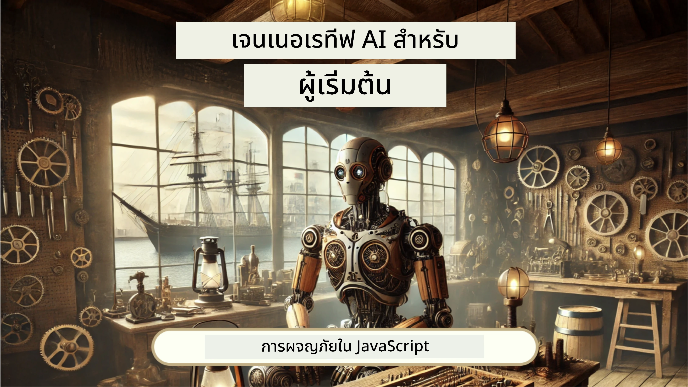
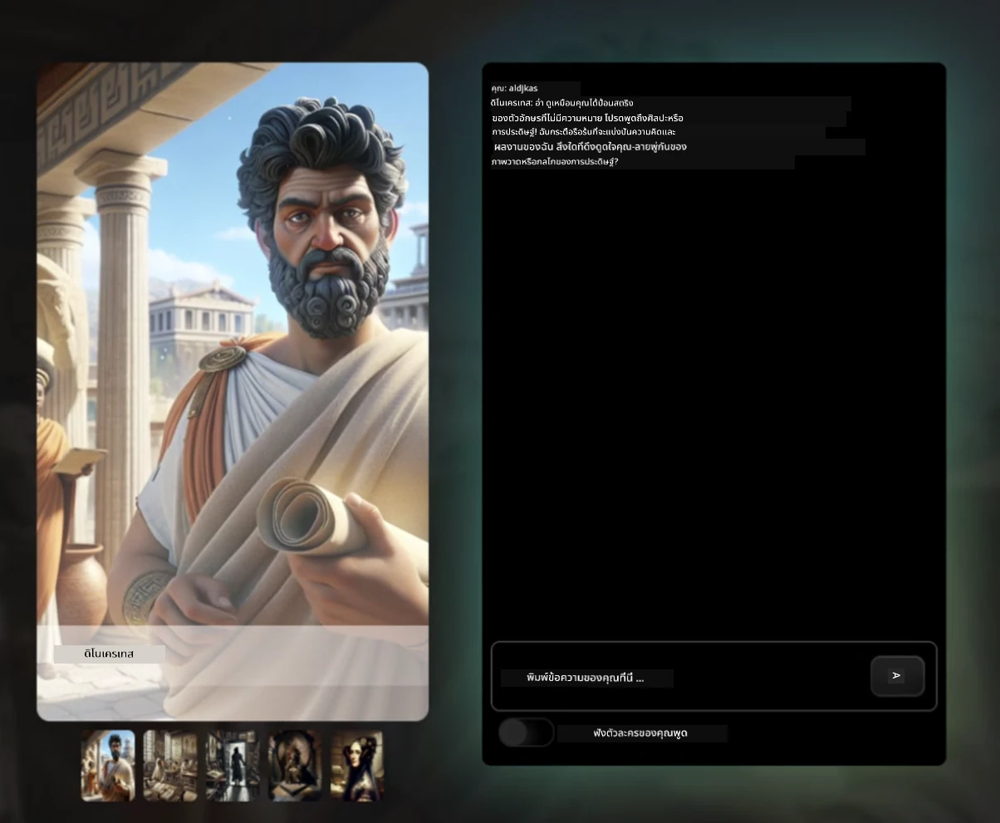
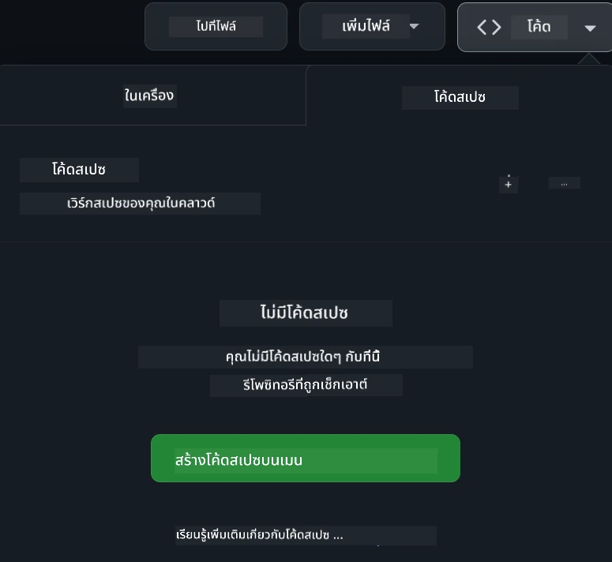

[](https://github.com/microsoft/Web-Dev-For-Beginners/blob/master/LICENSE)
[](https://GitHub.com/microsoft/Web-Dev-For-Beginners/graphs/contributors/)
[](https://GitHub.com/microsoft/Web-Dev-For-Beginners/issues/)
[](https://GitHub.com/microsoft/Web-Dev-For-Beginners/pulls/)
[](http://makeapullrequest.com) 

[](https://GitHub.com/microsoft/Web-Dev-For-Beginners/watchers/)
[](https://GitHub.com/microsoft/Web-Dev-For-Beginners/network/)
[](https://GitHub.com/microsoft/Web-Dev-For-Beginners/stargazers/)

[](https://discord.gg/nTYy5BXMWG)

# การพัฒนาเว็บสำหรับผู้เริ่มต้น - หลักสูตร

เรียนรู้พื้นฐานของการพัฒนาเว็บด้วยคอร์ส 12 สัปดาห์แบบครบวงจรโดย Microsoft Cloud Advocates แต่ละบทเรียน 24 บท จะเจาะลึก JavaScript, CSS และ HTML ผ่านโครงการทำมือเช่น เทอร์ราเรียม, ส่วนขยายเบราว์เซอร์ และเกมอวกาศ มีส่วนร่วมกับแบบทดสอบ, การสนทนา และงานปฏิบัติ เพิ่มพูนทักษะของคุณและเพิ่มประสิทธิภาพในการจดจำความรู้ด้วยวิธีการสอนที่มุ่งเน้นโครงการ เริ่มต้นเส้นทางการเขียนโค้ดของคุณวันนี้!

เข้าร่วมชุมชน Azure AI Foundry Discord

[](https://discord.gg/nTYy5BXMWG)

ทำตามขั้นตอนเหล่านี้เพื่อเริ่มต้นใช้ทรัพยากรเหล่านี้:
1. **ForkRepository**: คลิก [](https://GitHub.com/microsoft/Web-Dev-For-Beginners/fork)
2. **CloneRepository**:   `git clone https://github.com/microsoft/Web-Dev-For-Beginners.git`
3. [**เข้าร่วม Azure AI Foundry Discord และพบปะผู้เชี่ยวชาญและนักพัฒนาร่วมกัน**](https://discord.com/invite/ByRwuEEgH4)

### 🌐 รองรับหลายภาษา

#### รองรับผ่าน GitHub Action (ทำงานอัตโนมัติ & เป็นปัจจุบันเสมอ)

<!-- CO-OP TRANSLATOR LANGUAGES TABLE START -->
[Arabic](../ar/README.md) | [Bengali](../bn/README.md) | [Bulgarian](../bg/README.md) | [Burmese (Myanmar)](../my/README.md) | [Chinese (Simplified)](../zh-CN/README.md) | [Chinese (Traditional, Hong Kong)](../zh-HK/README.md) | [Chinese (Traditional, Macau)](../zh-MO/README.md) | [Chinese (Traditional, Taiwan)](../zh-TW/README.md) | [Croatian](../hr/README.md) | [Czech](../cs/README.md) | [Danish](../da/README.md) | [Dutch](../nl/README.md) | [Estonian](../et/README.md) | [Finnish](../fi/README.md) | [French](../fr/README.md) | [German](../de/README.md) | [Greek](../el/README.md) | [Hebrew](../he/README.md) | [Hindi](../hi/README.md) | [Hungarian](../hu/README.md) | [Indonesian](../id/README.md) | [Italian](../it/README.md) | [Japanese](../ja/README.md) | [Kannada](../kn/README.md) | [Korean](../ko/README.md) | [Lithuanian](../lt/README.md) | [Malay](../ms/README.md) | [Malayalam](../ml/README.md) | [Marathi](../mr/README.md) | [Nepali](../ne/README.md) | [Nigerian Pidgin](../pcm/README.md) | [Norwegian](../no/README.md) | [Persian (Farsi)](../fa/README.md) | [Polish](../pl/README.md) | [Portuguese (Brazil)](../pt-BR/README.md) | [Portuguese (Portugal)](../pt-PT/README.md) | [Punjabi (Gurmukhi)](../pa/README.md) | [Romanian](../ro/README.md) | [Russian](../ru/README.md) | [Serbian (Cyrillic)](../sr/README.md) | [Slovak](../sk/README.md) | [Slovenian](../sl/README.md) | [Spanish](../es/README.md) | [Swahili](../sw/README.md) | [Swedish](../sv/README.md) | [Tagalog (Filipino)](../tl/README.md) | [Tamil](../ta/README.md) | [Telugu](../te/README.md) | [Thai](./README.md) | [Turkish](../tr/README.md) | [Ukrainian](../uk/README.md) | [Urdu](../ur/README.md) | [Vietnamese](../vi/README.md)

> **ต้องการโคลนแบบโลคัล?**
>
> คลังนี้มีการแปลภาษามากกว่า 50 ภาษา ซึ่งเพิ่มขนาดการดาวน์โหลดอย่างมาก หากต้องการโคลนโดยไม่รวมการแปล ให้ใช้ sparse checkout:
>
> **Bash / macOS / Linux:**
> ```bash
> git clone --filter=blob:none --sparse https://github.com/microsoft/Web-Dev-For-Beginners.git
> cd Web-Dev-For-Beginners
> git sparse-checkout set --no-cone '/*' '!translations' '!translated_images'
> ```
>
> **CMD (Windows):**
> ```cmd
> git clone --filter=blob:none --sparse https://github.com/microsoft/Web-Dev-For-Beginners.git
> cd Web-Dev-For-Beginners
> git sparse-checkout set --no-cone "/*" "!translations" "!translated_images"
> ```
>
> นี้จะให้คุณทุกอย่างที่จำเป็นสำหรับการทำคอร์สด้วยความเร็วดาวน์โหลดที่เร็วขึ้นมาก
<!-- CO-OP TRANSLATOR LANGUAGES TABLE END -->

**หากคุณต้องการให้รองรับภาษาการแปลเพิ่มเติม ติดตามได้ที่ [นี่](https://github.com/Azure/co-op-translator/blob/main/getting_started/supported-languages.md)**

[](https://open.vscode.dev/microsoft/Web-Dev-For-Beginners)

#### 🧑‍🎓 _คุณเป็นนักเรียนใช่ไหม?_

เยี่ยมชม [**หน้า Student Hub**](https://docs.microsoft.com/learn/student-hub/?WT.mc_id=academic-77807-sagibbon) ที่จะมีแหล่งข้อมูลสำหรับผู้เริ่มต้น ชุดนักเรียน และวิธีการรับบัตรกำนัลใบประกาศนียบัตรฟรี หน้าเว็บนี้คือหน้าที่คุณควรบันทึกไว้และตรวจสอบเป็นระยะเพราะเราจะเปลี่ยนเนื้อหาทุกเดือน

### 📣 ประกาศ - ความท้าทายแบบ GitHub Copilot Agent โหมดใหม่เพื่อทำให้เสร็จ!

เพิ่มความท้าทายใหม่ ค้นหา "GitHub Copilot Agent Challenge 🚀" ในเกือบทุกบท นี่คือความท้าทายใหม่สำหรับคุณในการทำให้เสร็จโดยใช้ GitHub Copilot และโหมด Agent หากคุณไม่เคยใช้โหมด Agent มาก่อน มันสามารถไม่เพียงแต่สร้างข้อความ แต่ยังสร้างและแก้ไขไฟล์ รันคำสั่ง และอื่น ๆ ได้

### 📣 ประกาศ - _โครงการใหม่ที่ใช้ Generative AI_

เพิ่มโครงการผู้ช่วย AI ใหม่ ตรวจสอบได้ที่ [project](./9-chat-project/README.md)

### 📣 ประกาศ - _หลักสูตรใหม่_ เกี่ยวกับ Generative AI สำหรับ JavaScript เพิ่งปล่อยออกมา

อย่าพลาดหลักสูตรใหม่ของเราใน Generative AI!

เยี่ยมชม [https://aka.ms/genai-js-course](https://aka.ms/genai-js-course) เพื่อเริ่มต้น!



- บทเรียนครอบคลุมตั้งแต่พื้นฐานถึง RAG
- มีปฏิสัมพันธ์กับตัวละครในประวัติศาสตร์โดยใช้ GenAI และแอปคู่หูของเรา
- เรื่องราวสนุกสนานและน่าติดตาม คุณจะได้เดินทางข้ามเวลา!



แต่ละบทเรียนมีการมอบหมายงานให้ทำ การตรวจเช็คความรู้ และความท้าทายเพื่อแนะนำการเรียนรู้หัวข้อต่าง ๆ เช่น:
- การเขียนพรอมต์และการออกแบบพรอมต์
- การสร้างแอปข้อความและภาพ
- แอปค้นหา

เยี่ยมชม [https://aka.ms/genai-js-course](https://aka.ms/genai-js-course) เพื่อเริ่มต้น!


## 🌱 การเริ่มต้น

> **สำหรับครูผู้สอน** เรามี [คำแนะนำบางส่วน](for-teachers.md) เกี่ยวกับวิธีใช้หลักสูตรนี้ เราต้องการรับฟังความคิดเห็นของคุณ [ในฟอรัมสนทนาของเรา](https://github.com/microsoft/Web-Dev-For-Beginners/discussions/categories/teacher-corner)!

**[ผู้เรียน](https://aka.ms/student-page/?WT.mc_id=academic-77807-sagibbon)** สำหรับแต่ละบทเรียน เริ่มด้วยแบบทดสอบก่อนบรรยาย จากนั้นอ่านเนื้อหาบทเรียน ทำกิจกรรมต่าง ๆ และตรวจสอบความเข้าใจด้วยแบบทดสอบหลังบรรยาย

เพื่อเพิ่มประสบการณ์การเรียนรู้ของคุณ ให้เชื่อมต่อกับเพื่อนร่วมชั้นเพื่อทำโครงการด้วยกัน! การสนทนาได้รับการสนับสนุนใน [ฟอรัมสนทนา](https://github.com/microsoft/Web-Dev-For-Beginners/discussions) ที่ซึ่งทีมผู้ควบคุมของเราจะพร้อมตอบคำถามของคุณ

เพื่อเสริมความรู้ของคุณ เราขอแนะนำอย่างยิ่งให้สำรวจ [Microsoft Learn](https://learn.microsoft.com/users/wirelesslife/collections/p1ddcy5jwy0jkm?WT.mc_id=academic-77807-sagibbon) สำหรับวัสดุการศึกษาเพิ่มเติม

### 📋 การตั้งค่าสภาพแวดล้อมของคุณ

หลักสูตรนี้มีสภาพแวดล้อมการพัฒนาพร้อมใช้งาน! เมื่อเริ่มต้น คุณสามารถเลือกที่จะรันหลักสูตรใน [Codespace](https://github.com/features/codespaces/) (_สภาพแวดล้อมผ่านเบราว์เซอร์ที่ไม่ต้องติดตั้งใด ๆ_) หรือรันบนคอมพิวเตอร์ของคุณโดยใช้ตัวแก้ไขข้อความเช่น [Visual Studio Code](https://code.visualstudio.com/?WT.mc_id=academic-77807-sagibbon)

#### สร้าง repository ของคุณ
เพื่อให้คุณบันทึกงานของคุณได้ง่าย ขอแนะนำให้คุณสร้างสำเนาของ repository นี้โดยคลิกปุ่ม **Use this template** ที่ด้านบนของหน้า ซึ่งจะสร้าง repository ใหม่ในบัญชี GitHub ของคุณโดยมีสำเนาหลักสูตรนี้

ทำตามขั้นตอนเหล่านี้:
1. **Fork Repository**: คลิกปุ่ม "Fork" ที่มุมขวาบนของหน้านี้
2. **Clone Repository**:   `git clone https://github.com/microsoft/Web-Dev-For-Beginners.git`

#### รันหลักสูตรใน Codespace

ในสำเนาของ repository ที่คุณสร้าง คลิกปุ่ม **Code** และเลือก **Open with Codespaces** ซึ่งจะสร้าง Codespace ใหม่ให้คุณทำงาน



#### รันหลักสูตรบนคอมพิวเตอร์ของคุณเอง

การรันหลักสูตรนี้บนคอมพิวเตอร์ของคุณ คุณจะต้องมีตัวแก้ไขข้อความ, เบราว์เซอร์ และเครื่องมือบรรทัดคำสั่ง บทเรียนแรกของเรา, [บทนำสู่ภาษาโปรแกรมและเครื่องมือ](../../1-getting-started-lessons/1-intro-to-programming-languages), จะแนะนำตัวเลือกต่าง ๆ สำหรับเครื่องมือเหล่านี้เพื่อให้คุณเลือกใช้ที่เหมาะสมกับคุณ

คำแนะนำของเราคือให้ใช้ [Visual Studio Code](https://code.visualstudio.com/?WT.mc_id=academic-77807-sagibbon) เป็นตัวแก้ไขของคุณ ซึ่งมี [Terminal](https://code.visualstudio.com/docs/terminal/basics/?WT.mc_id=academic-77807-sagibbon) ในตัว คุณสามารถดาวน์โหลด Visual Studio Code ได้ที่นี่ [here](https://code.visualstudio.com/?WT.mc_id=academic-77807-sagibbon)
1. โคลนที่เก็บของคุณไปยังคอมพิวเตอร์ของคุณ คุณสามารถทำได้โดยการคลิกปุ่ม **Code** และคัดลอก URL:

    [CodeSpace](./images/createcodespace.png)

    จากนั้น เปิด [Terminal](https://code.visualstudio.com/docs/terminal/basics/?WT.mc_id=academic-77807-sagibbon) ภายใน [Visual Studio Code](https://code.visualstudio.com/?WT.mc_id=academic-77807-sagibbon) และรันคำสั่งต่อไปนี้ โดยแทนที่ `<your-repository-url>` ด้วย URL ที่คุณเพิ่งคัดลอกมา:

    ```bash 
    git clone <your-repository-url>
    ```

2. เปิดโฟลเดอร์ใน Visual Studio Code คุณสามารถทำได้โดยการคลิก **File** > **Open Folder** และเลือกโฟลเดอร์ที่คุณเพิ่งโคลนมา


>  ส่วนขยายที่แนะนำสำหรับ Visual Studio Code:
>
> * [Live Server](https://marketplace.visualstudio.com/items?itemName=ritwickdey.LiveServer&WT.mc_id=academic-77807-sagibbon) - เพื่อแสดงตัวอย่างหน้า HTML ภายใน Visual Studio Code
> * [Copilot](https://marketplace.visualstudio.com/items?itemName=GitHub.copilot&WT.mc_id=academic-77807-sagibbon) - เพื่อช่วยให้คุณเขียนโค้ดได้เร็วขึ้น

## 📂 แต่ละบทเรียนประกอบด้วย:

- สมุดสเก็ตช์ตัวเลือกเสริม
- วิดีโอเสริมหากต้องการ
- แบบทดสอบทบทวก่อนบทเรียน
- บทเรียนที่เขียนไว้
- สำหรับบทเรียนที่เป็นโครงงาน มีคำแนะนำทีละขั้นตอนเกี่ยวกับวิธีการสร้างโครงงาน
- การตรวจสอบความรู้
- ความท้าทาย
- การอ่านเพิ่มเติมเสริม
- การบ้าน
- [แบบทดสอบหลังบทเรียน](https://ff-quizzes.netlify.app/web/)

> **หมายเหตุเกี่ยวกับแบบทดสอบ**: แบบทดสอบทั้งหมดอยู่ในโฟลเดอร์ Quiz-app มีแบบทดสอบทั้งหมด 48 ชุด ชุดละสามคำถาม คุณสามารถเข้าถึงได้ที่ [นี่](https://ff-quizzes.netlify.app/web/) ซึ่งแอปแบบทดสอบสามารถรันแบบออฟไลน์หรือปรับใช้บน Azure ได้; ทำตามคำแนะนำในโฟลเดอร์ `quiz-app`

## 🗃️ บทเรียน

|     |                       ชื่อโครงการ                       |                            แนวคิดที่สอน                             | วัตถุประสงค์การเรียนรู้                                                                                                                 |                                                         บทเรียนที่ลิงก์                                                          |         ผู้เขียน          |
| :-: | :------------------------------------------------------: | :--------------------------------------------------------------------: | ----------------------------------------------------------------------------------------------------------------------------------- | :----------------------------------------------------------------------------------------------------------------------------: | :---------------------: |
| 01  |                     เริ่มต้นใช้งาน                      |           บทนำสู่การเขียนโปรแกรมและเครื่องมือในงานพัฒนา           | เรียนรู้พื้นฐานเบื้องต้นที่อยู่เบื้องหลังภาษาการเขียนโปรแกรมส่วนใหญ่ และเกี่ยวกับซอฟต์แวร์ที่ช่วยให้นักพัฒนามืออาชีพทำงานได้ | [Intro to Programming Languages and Tools of the Trade](./1-getting-started-lessons/1-intro-to-programming-languages/README.md) |         Jasmine         |
| 02  |                     เริ่มต้นใช้งาน                      |             พื้นฐาน GitHub รวมถึงการทำงานเป็นทีม             | วิธีการใช้ GitHub ในโครงการของคุณ วิธีการร่วมมือกับผู้อื่นในฐานข้อมูลโค้ด                                                    |                            [Intro to GitHub](./1-getting-started-lessons/2-github-basics/README.md)                             |          Floor          |
| 03  |                     เริ่มต้นใช้งาน                      |                             การเข้าถึง                              | เรียนรู้พื้นฐานการเข้าถึงเว็บ                                                                                               |                       [Accessibility Fundamentals](./1-getting-started-lessons/3-accessibility/README.md)                       |       Christopher       |
| 04  |                        JS เบื้องต้น                         |                         ประเภทข้อมูลใน JavaScript                          | พื้นฐานของประเภทข้อมูลใน JavaScript                                                                                                 |                                       [Data Types](./2-js-basics/1-data-types/README.md)                                        |         Jasmine         |
| 05  |                        JS เบื้องต้น                         |                         ฟังก์ชันและเมธอด                          | เรียนรู้เกี่ยวกับฟังก์ชันและเมธอดเพื่อจัดการลอจิกของแอปพลิเคชัน                                                             |                              [Functions and Methods](./2-js-basics/2-functions-methods/README.md)                               | Jasmine and Christopher |
| 06  |                        JS เบื้องต้น                         |                        การตัดสินใจด้วย JS                        | เรียนรู้วิธีสร้างเงื่อนไขในโค้ดของคุณโดยใช้วิธีการตัดสินใจ                                                           |                                 [Making Decisions](./2-js-basics/3-making-decisions/README.md)                                  |         Jasmine         |
| 07  |                        JS เบื้องต้น                         |                            อาร์เรย์และลูป                            | ทำงานกับข้อมูลโดยใช้ arrays และ loops ใน JavaScript                                                                                 |                                   [Arrays and Loops](./2-js-basics/4-arrays-loops/README.md)                                    |         Jasmine         |
| 08  |       [Terrarium](./3-terrarium/solution/README.md)       |                            HTML ในการปฏิบัติ                            | สร้าง HTML เพื่อสร้าง Terrarium ออนไลน์ โดยเน้นการสร้างเลย์เอาต์                                                         |                                 [Introduction to HTML](./3-terrarium/1-intro-to-html/README.md)                                 |           Jen           |
| 09  |       [Terrarium](./3-terrarium/solution/README.md)       |                            CSS ในการปฏิบัติ                             | สร้าง CSS เพื่อจัดสไตล์ Terrarium ออนไลน์ โดยเน้นพื้นฐานของ CSS รวมถึงการทำให้หน้าเว็บตอบสนอง                     |                                  [Introduction to CSS](./3-terrarium/2-intro-to-css/README.md)                                  |           Jen           |
| 10  |            [Terrarium](./3-terrarium/solution/README.md)            |                 JavaScript Closures, การจัดการ DOM                  | สร้าง JavaScript เพื่อให้ Terrarium ทำงานเป็นอินเทอร์เฟซลากและวาง โดยเน้นที่ closures และการจัดการ DOM             |                  [JavaScript Closures, DOM manipulation](./3-terrarium/3-intro-to-DOM-and-closures/README.md)                   |           Jen           |
| 11  |          [Typing Game](./4-typing-game/solution/README.md)          |                          สร้างเกมพิมพ์                           | เรียนรู้วิธีใช้เหตุการณ์คีย์บอร์ดเพื่อควบคุมลอจิกของแอป JavaScript ของคุณ                                                          |                                [Event-Driven Programming](./4-typing-game/typing-game/README.md)                                |       Christopher       |
| 12  | [ส่วนขยายเบราว์เซอร์สีเขียว](./5-browser-extension/solution/README.md) |                         การทำงานกับเบราว์เซอร์                          | เรียนรู้ว่าเบราว์เซอร์ทำงานอย่างไร ประวัติ และวิธีเริ่มต้นส่วนขยายเบราว์เซอร์                                                |                               [About Browsers](./5-browser-extension/1-about-browsers/README.md)                                |           Jen           |
| 13  | [ส่วนขยายเบราว์เซอร์สีเขียว](./5-browser-extension/solution/README.md) | สร้างฟอร์ม เรียก API และเก็บตัวแปรใน local storage | สร้างส่วนขยายเบราว์เซอร์ของคุณโดยใช้ JavaScript เพื่อเรียก API โดยใช้ตัวแปรที่เก็บใน local storage                      |                [APIs, Forms, and Local Storage](./5-browser-extension/2-forms-browsers-local-storage/README.md)                 |           Jen           |
| 14  | [ส่วนขยายเบราว์เซอร์สีเขียว](./5-browser-extension/solution/README.md) |          กระบวนการพื้นหลังในเบราว์เซอร์และประสิทธิภาพเว็บ          | ใช้กระบวนการพื้นหลังของเบราว์เซอร์เพื่อจัดการไอคอนส่วนขยาย เรียนรู้เกี่ยวกับประสิทธิภาพเว็บและการปรับปรุงบางอย่างเพื่อทำให้ดีขึ้น   |             [Background Tasks and Performance](./5-browser-extension/3-background-tasks-and-performance/README.md)              |           Jen           |
| 15  |           [Space Game](./6-space-game/solution/README.md)           |             การพัฒนาเกมขั้นสูงด้วย JavaScript             | เรียนรู้เกี่ยวกับ Inheritance โดยใช้ทั้ง Classes และ Composition และรูปแบบ Pub/Sub เพื่อเตรียมพร้อมสำหรับการสร้างเกม              |                      [Introduction to Advanced Game Development](./6-space-game/1-introduction/README.md)                       |          Chris          |
| 16  |           [Space Game](./6-space-game/solution/README.md)           |                           การวาดบน canvas                            | เรียนรู้เกี่ยวกับ Canvas API ที่ใช้ในการวาดองค์ประกอบบนหน้าจอ                                                                       |                                [Drawing to Canvas](./6-space-game/2-drawing-to-canvas/README.md)                                |          Chris          |
| 17  |           [Space Game](./6-space-game/solution/README.md)           |                   การเคลื่อนย้ายองค์ประกอบรอบจอ                    | ค้นพบว่าสิ่งต่าง ๆ สามารถเคลื่อนไหวโดยใช้พิกัดคาร์ทีเซียนและ Canvas API ได้อย่างไร                                            |                           [Moving Elements Around](./6-space-game/3-moving-elements-around/README.md)                           |          Chris          |
| 18  |           [Space Game](./6-space-game/solution/README.md)           |                          การตรวจจับการชน                           | ทำให้องค์ประกอบชนและตอบสนองต่อกันโดยใช้การกดปุ่ม keypress พร้อมกับฟังก์ชัน cooldown เพื่อประสิทธิภาพของเกม    |                              [Collision Detection](./6-space-game/4-collision-detection/README.md)                              |          Chris          |
| 19  |           [Space Game](./6-space-game/solution/README.md)           |                             การเก็บคะแนน                              | ทำการคำนวณทางคณิตศาสตร์ตามสถานะและประสิทธิภาพของเกม                                                                |                                    [Keeping Score](./6-space-game/5-keeping-score/README.md)                                    |          Chris          |
| 20  |           [Space Game](./6-space-game/solution/README.md)           |                     การจบและเริ่มเกมใหม่                     | เรียนรู้เกี่ยวกับการจบเกมและเริ่มเกมใหม่ รวมถึงการทำความสะอาดทรัพยากรและรีเซ็ตค่าตัวแปร                              |                                [The Ending Condition](./6-space-game/6-end-condition/README.md)                                 |          Chris          |
| 21  |         [Banking App](./7-bank-project/solution/README.md)          |                 เทมเพลต HTML และการกำหนดเส้นทางในเว็บแอป                 | เรียนรู้วิธีสร้างโครงสร้างเว็บไซต์หลายหน้าโดยใช้ routing และเทมเพลต HTML                             |                            [HTML Templates and Routes](./7-bank-project/1-template-route/README.md)                             |          Yohan          |
| 22  |         [Banking App](./7-bank-project/solution/README.md)          |                  สร้างฟอร์มล็อกอินและลงทะเบียน                   | เรียนรู้เกี่ยวกับการสร้างฟอร์มและการจัดการการตรวจสอบความถูกต้อง                                                                          |                                           [Forms](./7-bank-project/2-forms/README.md)                                           |          Yohan          |
| 23  |         [Banking App](./7-bank-project/solution/README.md)          |                   วิธีการดึงและใช้ข้อมูล                   | วิธีการไหลของข้อมูลเข้าและออกจากแอปของคุณ วิธีดึงข้อมูล เก็บข้อมูล และจัดการข้อมูล                                                 |                                            [Data](./7-bank-project/3-data/README.md)                                            |          Yohan          |
| 24  |         [Banking App](./7-bank-project/solution/README.md)          |                      แนวคิดการจัดการสถานะ                      | เรียนรู้วิธีที่แอปของคุณเก็บสถานะและวิธีจัดการสถานะเหล่านั้นโดยใช้โปรแกรม                                                              |                                [State Management](./7-bank-project/4-state-management/README.md)                                |          Yohan          |
| 25 | [Browser/VScode Code](../../8-code-editor) | การทำงานกับ VScode | เรียนรู้วิธีใช้โปรแกรมแก้ไขโค้ด| [Use VScode Code Editor](./8-code-editor/1-using-a-code-editor/README.md) | Chris |
| 26 | [AI Assistants](./9-chat-project/README.md) | การทำงานกับ AI | เรียนรู้วิธีสร้างผู้ช่วย AI ของคุณเอง | [AI Assistant project](./9-chat-project/README.md) | Chris |

## 🏫 การสอน

หลักสูตรของเราได้รับการออกแบบโดยมีหลักการทางการสอนสองประการสำคัญ:
* การเรียนรู้โดยใช้โครงงานเป็นฐาน
* การทำแบบทดสอบบ่อยครั้ง

โปรแกรมสอนพื้นฐานของ JavaScript, HTML และ CSS รวมถึงเครื่องมือและเทคนิคล่าสุดที่นักพัฒนาเว็บในปัจจุบันใช้ นักเรียนจะมีโอกาสสร้างประสบการณ์ปฏิบัติผ่านการสร้างเกมพิมพ์คีย์, Terrarium เสมือนจริง, ส่วนขยายเบราว์เซอร์ที่เป็นมิตรกับสิ่งแวดล้อม, เกมสไตล์ space-invader และแอปธนาคารสำหรับธุรกิจ เมื่อจบชุดบทเรียน นักเรียนจะมีความเข้าใจที่ดีเกี่ยวกับการพัฒนาเว็บ

> 🎓 คุณสามารถเรียนบทเรียนแรก ๆ ในหลักสูตรนี้เป็น [เส้นทางการเรียนรู้](https://docs.microsoft.com/learn/paths/web-development-101/?WT.mc_id=academic-77807-sagibbon) บน Microsoft Learn!

โดยการทำให้เนื้อหาสอดคล้องกับโครงงาน กระบวนการเรียนรู้จะน่าสนใจขึ้นสำหรับนักเรียนและการจดจำแนวคิดจะดีขึ้น เราได้เขียนบทเรียนเริ่มต้นหลายบทเกี่ยวกับพื้นฐาน JavaScript เพื่อแนะนำแนวคิด พร้อมกับวิดีโอจากชุด "[Beginners Series to: JavaScript](https://channel9.msdn.com/Series/Beginners-Series-to-JavaScript/?WT.mc_id=academic-77807-sagibbon)" ชุดวิดีโอสอนซึ่งผู้เขียนบางท่านมีส่วนร่วมในการจัดทำหลักสูตรนี้

นอกจากนี้ แบบทดสอบที่ความกดดันต่ำก่อนเข้าชั้นเรียนจะช่วยให้นักเรียนตั้งใจเรียนหัวข้อ และแบบทดสอบที่สองหลังเข้าชั้นเรียนช่วยเสริมสร้างการจดจำ หลักสูตรนี้ถูกออกแบบมาให้ยืดหยุ่นและสนุก และสามารถเรียนได้ทั้งหมดหรือบางส่วน โครงงานเริ่มเล็กและซับซ้อนมากขึ้นเรื่อย ๆ เมื่อเข้าสู่สัปดาห์ที่ 12

ในขณะที่เราได้ตั้งใจหลีกเลี่ยงการแนะนำเฟรมเวิร์ก JavaScript เพื่อมุ่งเน้นทักษะพื้นฐานที่จำเป็นสำหรับนักพัฒนาเว็บก่อนที่จะใช้เฟรมเวิร์ก ขั้นตอนถัดไปที่ดีในการเรียนรู้หลักสูตรนี้คือการเรียนรู้เกี่ยวกับ Node.js ผ่านชุดวิดีโออีกชุดหนึ่ง: "[Beginner Series to: Node.js](https://channel9.msdn.com/Series/Beginners-Series-to-Nodejs/?WT.mc_id=academic-77807-sagibbon)".

> เยี่ยมชม [Code of Conduct](CODE_OF_CONDUCT.md) และแนวทาง [การมีส่วนร่วม](CONTRIBUTING.md) ของเรา เรายินดีรับข้อเสนอแนะเชิงสร้างสรรค์จากคุณ!


## 🧭 การเข้าถึงแบบออฟไลน์

คุณสามารถรันเอกสารนี้แบบออฟไลน์ได้โดยใช้ [Docsify](https://docsify.js.org/#/). Fork รีโปนี้, [ติดตั้ง Docsify](https://docsify.js.org/#/quickstart) บนเครื่องของคุณ จากนั้นในโฟลเดอร์หลักของรีโปนี้ ให้พิมพ์ `docsify serve`. เว็บไซต์จะถูกให้บริการบนพอร์ต 3000 ที่ localhost ของคุณ: `localhost:3000`.

## 📘 PDF
PDF ของบทเรียนทั้งหมดสามารถดูได้ที่ [นี่](https://microsoft.github.io/Web-Dev-For-Beginners/pdf/readme.pdf)


## 🎒 หลักสูตรอื่นๆ

ทีมงานของเราผลิตหลักสูตรอื่นๆ อีก! ลองดูที่:

<!-- CO-OP TRANSLATOR OTHER COURSES START -->
### LangChain
[](https://aka.ms/langchain4j-for-beginners)
[](https://aka.ms/langchainjs-for-beginners?WT.mc_id=m365-94501-dwahlin)
[](https://github.com/microsoft/langchain-for-beginners?WT.mc_id=m365-94501-dwahlin)
---

### Azure / Edge / MCP / Agents
[](https://github.com/microsoft/AZD-for-beginners?WT.mc_id=academic-105485-koreyst)
[](https://github.com/microsoft/edgeai-for-beginners?WT.mc_id=academic-105485-koreyst)
[](https://github.com/microsoft/mcp-for-beginners?WT.mc_id=academic-105485-koreyst)
[](https://github.com/microsoft/ai-agents-for-beginners?WT.mc_id=academic-105485-koreyst)

---
 
### Generative AI Series
[](https://github.com/microsoft/generative-ai-for-beginners?WT.mc_id=academic-105485-koreyst)
[-9333EA?style=for-the-badge&labelColor=E5E7EB&color=9333EA)](https://github.com/microsoft/Generative-AI-for-beginners-dotnet?WT.mc_id=academic-105485-koreyst)
[-C084FC?style=for-the-badge&labelColor=E5E7EB&color=C084FC)](https://github.com/microsoft/generative-ai-for-beginners-java?WT.mc_id=academic-105485-koreyst)
[-E879F9?style=for-the-badge&labelColor=E5E7EB&color=E879F9)](https://github.com/microsoft/generative-ai-with-javascript?WT.mc_id=academic-105485-koreyst)

---
 
### Core Learning
[](https://aka.ms/ml-beginners?WT.mc_id=academic-105485-koreyst)
[](https://aka.ms/datascience-beginners?WT.mc_id=academic-105485-koreyst)
[](https://aka.ms/ai-beginners?WT.mc_id=academic-105485-koreyst)
[](https://github.com/microsoft/Security-101?WT.mc_id=academic-96948-sayoung)
[](https://aka.ms/webdev-beginners?WT.mc_id=academic-105485-koreyst)
[](https://aka.ms/iot-beginners?WT.mc_id=academic-105485-koreyst)
[](https://github.com/microsoft/xr-development-for-beginners?WT.mc_id=academic-105485-koreyst)

---
 
### Copilot Series
[](https://aka.ms/GitHubCopilotAI?WT.mc_id=academic-105485-koreyst)
[](https://github.com/microsoft/mastering-github-copilot-for-dotnet-csharp-developers?WT.mc_id=academic-105485-koreyst)
[](https://github.com/microsoft/CopilotAdventures?WT.mc_id=academic-105485-koreyst)
<!-- CO-OP TRANSLATOR OTHER COURSES END -->

## การขอความช่วยเหลือ

หากคุณติดขัดหรือมีคำถามเกี่ยวกับการสร้างแอป AI เข้าร่วมกับผู้เรียนคนอื่นๆ และนักพัฒนาที่มีประสบการณ์ในการอภิปรายเกี่ยวกับ MCP นี่คือชุมชนที่สนับสนุนซึ่งเปิดรับคำถามและแบ่งปันความรู้กันอย่างเสรี

[](https://discord.gg/nTYy5BXMWG)

หากคุณมีคำติชมเกี่ยวกับผลิตภัณฑ์หรือพบข้อผิดพลาดระหว่างการสร้าง ให้เยี่ยมชม:

[](https://aka.ms/foundry/forum)

## ใบอนุญาต

ที่เก็บนี้ได้รับใบอนุญาตภายใต้ใบอนุญาต MIT ดูไฟล์ [LICENSE](../../LICENSE) สำหรับข้อมูลเพิ่มเติม

---

<!-- CO-OP TRANSLATOR DISCLAIMER START -->
**ข้อจำกัดความรับผิดชอบ**:
เอกสารนี้ได้รับการแปลโดยใช้บริการแปลภาษา AI [Co-op Translator](https://github.com/Azure/co-op-translator) ถึงแม้เราจะพยายามรักษาความถูกต้อง แต่กรุณาทราบว่าการแปลโดยอัตโนมัติอาจมีข้อผิดพลาดหรือความคลาดเคลื่อน เอกสารต้นฉบับในภาษาดั้งเดิมถือเป็นแหล่งข้อมูลที่เชื่อถือได้ หากเป็นข้อมูลสำคัญ ขอแนะนำให้ใช้บริการแปลโดยมนุษย์มืออาชีพ เราจะไม่รับผิดชอบต่อความเข้าใจผิดหรือการตีความที่ผิดพลาดที่เกิดขึ้นจากการใช้การแปลนี้
<!-- CO-OP TRANSLATOR DISCLAIMER END -->