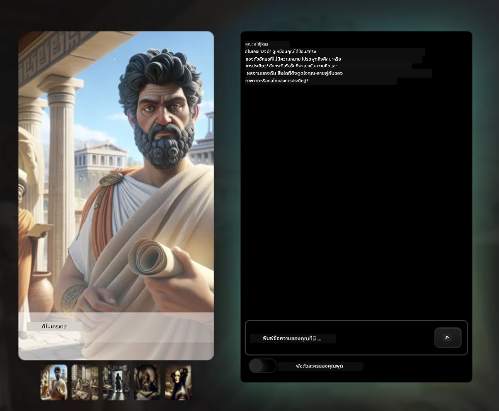
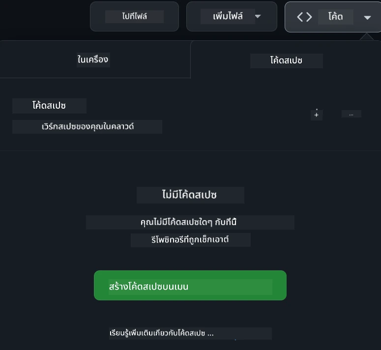

[](https://github.com/microsoft/Web-Dev-For-Beginners/blob/master/LICENSE)
[](https://GitHub.com/microsoft/Web-Dev-For-Beginners/graphs/contributors/)
[](https://GitHub.com/microsoft/Web-Dev-For-Beginners/issues/)
[](https://GitHub.com/microsoft/Web-Dev-For-Beginners/pulls/)
[](http://makeapullrequest.com) 

[](https://GitHub.com/microsoft/Web-Dev-For-Beginners/watchers/)
[](https://GitHub.com/microsoft/Web-Dev-For-Beginners/network/)
[](https://GitHub.com/microsoft/Web-Dev-For-Beginners/stargazers/)

[](https://discord.gg/nTYy5BXMWG)

# การพัฒนาเว็บสำหรับผู้เริ่มต้น - หลักสูตร

เรียนรู้พื้นฐานของการพัฒนาเว็บด้วยหลักสูตรครบวงจร 12 สัปดาห์โดย Microsoft Cloud Advocates แต่ละบทเรียนจากทั้งหมด 24 บทจะเจาะลึก JavaScript, CSS, และ HTML ผ่านโครงการที่ทำจริง เช่น เทอราเรียม, ส่วนขยายเบราว์เซอร์ และเกมอวกาศ เข้าร่วมกับแบบทดสอบ, การอภิปราย และงานปฏิบัติ เพื่อเพิ่มทักษะของคุณและเพิ่มประสิทธิภาพการจดจำความรู้ด้วยวิธีการสอนที่เน้นโครงการ เริ่มต้นเส้นทางการเขียนโค้ดของคุณวันนี้!

เข้าร่วม Discord ของ Azure AI Foundry เพื่อพบปะผู้เชี่ยวชาญและนักพัฒนาร่วมกัน

[](https://discord.gg/nTYy5BXMWG)

ทำตามขั้นตอนเหล่านี้เพื่อเริ่มต้นใช้ทรัพยากรเหล่านี้:
1. **Fork ที่เก็บข้อมูล**: คลิก [](https://GitHub.com/microsoft/Web-Dev-For-Beginners/fork)
2. **โคลนที่เก็บข้อมูล**:   `git clone https://github.com/microsoft/Web-Dev-For-Beginners.git`
3. [**เข้าร่วม The Azure AI Foundry Discord เพื่อพบผู้เชี่ยวชาญและนักพัฒนาร่วมกัน**](https://discord.com/invite/ByRwuEEgH4)

### 🌐 รองรับหลายภาษา

#### รองรับผ่าน GitHub Action (อัตโนมัติ & อัพเดทตลอดเวลา)

<!-- CO-OP TRANSLATOR LANGUAGES TABLE START -->
[Arabic](../ar/README.md) | [Bengali](../bn/README.md) | [Bulgarian](../bg/README.md) | [Burmese (Myanmar)](../my/README.md) | [Chinese (Simplified)](../zh-CN/README.md) | [Chinese (Traditional, Hong Kong)](../zh-HK/README.md) | [Chinese (Traditional, Macau)](../zh-MO/README.md) | [Chinese (Traditional, Taiwan)](../zh-TW/README.md) | [Croatian](../hr/README.md) | [Czech](../cs/README.md) | [Danish](../da/README.md) | [Dutch](../nl/README.md) | [Estonian](../et/README.md) | [Finnish](../fi/README.md) | [French](../fr/README.md) | [German](../de/README.md) | [Greek](../el/README.md) | [Hebrew](../he/README.md) | [Hindi](../hi/README.md) | [Hungarian](../hu/README.md) | [Indonesian](../id/README.md) | [Italian](../it/README.md) | [Japanese](../ja/README.md) | [Kannada](../kn/README.md) | [Khmer](../km/README.md) | [Korean](../ko/README.md) | [Lithuanian](../lt/README.md) | [Malay](../ms/README.md) | [Malayalam](../ml/README.md) | [Marathi](../mr/README.md) | [Nepali](../ne/README.md) | [Nigerian Pidgin](../pcm/README.md) | [Norwegian](../no/README.md) | [Persian (Farsi)](../fa/README.md) | [Polish](../pl/README.md) | [Portuguese (Brazil)](../pt-BR/README.md) | [Portuguese (Portugal)](../pt-PT/README.md) | [Punjabi (Gurmukhi)](../pa/README.md) | [Romanian](../ro/README.md) | [Russian](../ru/README.md) | [Serbian (Cyrillic)](../sr/README.md) | [Slovak](../sk/README.md) | [Slovenian](../sl/README.md) | [Spanish](../es/README.md) | [Swahili](../sw/README.md) | [Swedish](../sv/README.md) | [Tagalog (Filipino)](../tl/README.md) | [Tamil](../ta/README.md) | [Telugu](../te/README.md) | [Thai](./README.md) | [Turkish](../tr/README.md) | [Ukrainian](../uk/README.md) | [Urdu](../ur/README.md) | [Vietnamese](../vi/README.md)

> **ต้องการโคลนแบบโลคอล?**
>
> ที่เก็บข้อมูลนี้มีการแปลมากกว่า 50 ภาษา ซึ่งจะเพิ่มขนาดดาวน์โหลดอย่างมาก หากต้องการโคลนโดยไม่มีการแปล ให้ใช้ sparse checkout:
>
> **Bash / macOS / Linux:**
> ```bash
> git clone --filter=blob:none --sparse https://github.com/microsoft/Web-Dev-For-Beginners.git
> cd Web-Dev-For-Beginners
> git sparse-checkout set --no-cone '/*' '!translations' '!translated_images'
> ```
>
> **CMD (Windows):**
> ```cmd
> git clone --filter=blob:none --sparse https://github.com/microsoft/Web-Dev-For-Beginners.git
> cd Web-Dev-For-Beginners
> git sparse-checkout set --no-cone "/*" "!translations" "!translated_images"
> ```
>
> วิธีนี้จะให้ทุกอย่างที่คุณต้องการเพื่อสำเร็จหลักสูตรด้วยการดาวน์โหลดที่เร็วขึ้นมาก
<!-- CO-OP TRANSLATOR LANGUAGES TABLE END -->

**หากคุณต้องการมีการแปลเพิ่มเติม ภาษาที่รองรับจะแสดงอยู่ที่นี่ [here](https://github.com/Azure/co-op-translator/blob/main/getting_started/supported-languages.md)**

[](https://open.vscode.dev/microsoft/Web-Dev-For-Beginners)

#### 🧑‍🎓 _คุณเป็นนักเรียนหรือไม่?_

เยี่ยมชม [**หน้า Student Hub**](https://docs.microsoft.com/learn/student-hub/?WT.mc_id=academic-77807-sagibbon) ซึ่งคุณจะพบแหล่งข้อมูลสำหรับผู้เริ่มต้น, ชุดสำหรับนักเรียน และวิธีรับบัตรกำนัลใบรับรองฟรี นี่คือหน้าที่คุณควรบุ๊กมาร์กและตรวจสอบเป็นระยะ ๆ เนื่องจากเรามีการสลับเนื้อหาเป็นเดือน ๆ

### 📣 ประกาศ - โหมดท้าทาย GitHub Copilot Agent ใหม่ให้ได้ทำ!

ท้าทายใหม่เพิ่มเข้ามา ดูคำว่า "GitHub Copilot Agent Challenge 🚀" ได้ในหลายบทเรียน นี่คือท้าทายใหม่สำหรับคุณที่จะทำโดยใช้ GitHub Copilot และโหมด Agent หากคุณไม่เคยใช้โหมด Agent มาก่อน โหมดนี้ไม่เพียงแต่สร้างข้อความได้ แต่ยังสามารถสร้างและแก้ไขไฟล์, รันคำสั่ง และอื่น ๆ ได้อีกด้วย

### 📣 ประกาศ - _โครงการใหม่ที่จะสร้างโดยใช้ Generative AI_

โครงการผู้ช่วย AI ใหม่เพิ่งเพิ่มเข้ามา ดูได้ที่ [project](./9-chat-project/README.md)

### 📣 ประกาศ - _หลักสูตรใหม่_ เกี่ยวกับ Generative AI สำหรับ JavaScript เปิดตัวแล้ว

อย่าพลาดหลักสูตรใหม่ของเราเกี่ยวกับ Generative AI!

เยี่ยมชม [https://aka.ms/genai-js-course](https://aka.ms/genai-js-course) เพื่อเริ่มต้น!


- บทเรียนครอบคลุมตั้งแต่พื้นฐานจนถึง RAG
- โต้ตอบกับตัวละครประวัติศาสตร์โดยใช้ GenAI และแอปคู่มือของเรา
- เล่าเรื่องสนุกและน่าติดตาม คุณจะได้เดินทางข้ามเวลา!




แต่ละบทเรียนมีการมอบหมายให้ทำ, ตรวจสอบความรู้ และมีท้าทายเพื่อแนะนำคุณในการเรียนรู้หัวข้อต่าง ๆ เช่น:
- การตั้งค่า prompt และการออกแบบ prompt
- การสร้างแอปข้อความและภาพ
- แอปค้นหา

เยี่ยมชม [https://aka.ms/genai-js-course](https://aka.ms/genai-js-course) เพื่อเริ่มต้น!


## 🌱 เริ่มต้น

> **ครูผู้สอน**, เราได้ [เพิ่มข้อเสนอแนะบางอย่าง](for-teachers.md) เกี่ยวกับวิธีการใช้หลักสูตรนี้ เราต้องการฟังความคิดเห็นของคุณ [ในฟอรัมอภิปรายของเรา](https://github.com/microsoft/Web-Dev-For-Beginners/discussions/categories/teacher-corner)!

**[ผู้เรียน](https://aka.ms/student-page/?WT.mc_id=academic-77807-sagibbon)** สำหรับแต่ละบท เริ่มด้วยแบบทดสอบก่อนบรรยายและอ่านเนื้อหาบรรยาย พร้อมทำกิจกรรมต่าง ๆ และตรวจสอบความเข้าใจด้วยแบบทดสอบหลังบรรยาย

เพื่อเพิ่มประสบการณ์การเรียนรู้ของคุณ เชื่อมต่อกับเพื่อนของคุณเพื่อทำโปรเจกต์ด้วยกัน! สนับสนุนให้มีการอภิปรายใน [ฟอรัมอภิปราย](https://github.com/microsoft/Web-Dev-For-Beginners/discussions) ซึ่งทีมผู้ดูแลของเราจะพร้อมตอบคำถามของคุณ

เพื่อการศึกษาต่อ เราขอแนะนำอย่างยิ่งให้สำรวจ [Microsoft Learn](https://learn.microsoft.com/users/wirelesslife/collections/p1ddcy5jwy0jkm?WT.mc_id=academic-77807-sagibbon) สำหรับวัสดุการศึกษาที่เพิ่มเติม

### 📋 การตั้งค่าสภาพแวดล้อมของคุณ

หลักสูตรนี้มีสภาพแวดล้อมสำหรับการพัฒนาให้พร้อมใช้งาน! เมื่อต้องการเริ่มต้น คุณสามารถเลือกที่จะรันหลักสูตรใน [Codespace](https://github.com/features/codespaces/) (_สภาพแวดล้อมที่ใช้งานผ่านเบราว์เซอร์โดยไม่ต้องติดตั้งอะไร_) หรือรันแบบโลคอลบนคอมพิวเตอร์ของคุณโดยใช้โปรแกรมแก้ไขข้อความเช่น [Visual Studio Code](https://code.visualstudio.com/?WT.mc_id=academic-77807-sagibbon)

#### สร้างที่เก็บข้อมูลของคุณ
เพื่อให้คุณบันทึกงานของคุณได้ง่าย ๆ แนะนำให้คุณสร้างสำเนาของที่เก็บข้อมูลนี้ คุณสามารถทำได้โดยคลิกปุ่ม **Use this template** ที่ด้านบนของหน้า ซึ่งจะสร้างที่เก็บข้อมูลใหม่ในบัญชี GitHub ของคุณพร้อมสำเนาของหลักสูตรนี้

ทำตามขั้นตอนเหล่านี้:
1. **Fork ที่เก็บข้อมูล**: คลิกปุ่ม "Fork" ที่มุมขวาบนของหน้านี้
2. **โคลนที่เก็บข้อมูล**:   `git clone https://github.com/microsoft/Web-Dev-For-Beginners.git`

#### การรันหลักสูตรใน Codespace

ในสำเนาของที่เก็บข้อมูลที่คุณสร้าง คลิกปุ่ม **Code** และเลือก **Open with Codespaces** จะสร้าง Codespace ใหม่สำหรับคุณทำงาน



#### การรันหลักสูตรแบบโลคอลบนคอมพิวเตอร์ของคุณ

ในการรันหลักสูตรนี้แบบโลคอลบนคอมพิวเตอร์ คุณต้องใช้โปรแกรมแก้ไขข้อความ, เบราว์เซอร์ และเครื่องมือบรรทัดคำสั่ง บทเรียนแรกของเรา [Introduction to Programming Languages and Tools of the Trade](../../1-getting-started-lessons/1-intro-to-programming-languages) จะพาคุณไปรู้จักทางเลือกต่าง ๆ ของเครื่องมือเหล่านี้เพื่อให้คุณเลือกใช้ได้ตามที่เหมาะสมกับตัวเอง

คำแนะนำของเราคือใช้ [Visual Studio Code](https://code.visualstudio.com/?WT.mc_id=academic-77807-sagibbon) เป็นโปรแกรมแก้ไขของคุณ ซึ่งมาพร้อมกับ [Terminal](https://code.visualstudio.com/docs/terminal/basics/?WT.mc_id=academic-77807-sagibbon) ในตัว คุณสามารถดาวน์โหลด Visual Studio Code ได้ที่ [นี่](https://code.visualstudio.com/?WT.mc_id=academic-77807-sagibbon)
1. โคลนที่เก็บของคุณมายังเครื่องคอมพิวเตอร์ของคุณ คุณสามารถทำได้โดยการคลิกที่ปุ่ม **Code** และคัดลอก URL:

    [CodeSpace](./images/createcodespace.png)

    จากนั้น เปิด [Terminal](https://code.visualstudio.com/docs/terminal/basics/?WT.mc_id=academic-77807-sagibbon) ภายใน [Visual Studio Code](https://code.visualstudio.com/?WT.mc_id=academic-77807-sagibbon) และรันคำสั่งต่อไปนี้ โดยแทนที่ `<your-repository-url>` ด้วย URL ที่คุณเพิ่งคัดลอกมา:

    ```bash 
    git clone <your-repository-url>
    ```

2. เปิดโฟลเดอร์ใน Visual Studio Code คุณสามารถทำได้โดยการคลิก **File** > **Open Folder** และเลือกโฟลเดอร์ที่คุณเพิ่งโคลนมา


>  ส่วนขยายที่แนะนำสำหรับ Visual Studio Code:
>
> * [Live Server](https://marketplace.visualstudio.com/items?itemName=ritwickdey.LiveServer&WT.mc_id=academic-77807-sagibbon) - สำหรับดูตัวอย่างหน้า HTML ภายใน Visual Studio Code
> * [Copilot](https://marketplace.visualstudio.com/items?itemName=GitHub.copilot&WT.mc_id=academic-77807-sagibbon) - เพื่อช่วยให้คุณเขียนโค้ดได้เร็วขึ้น

## 📂 แต่ละบทเรียนประกอบด้วย:

- สเก็ตช์โน้ตเสริม (ไม่บังคับ)
- วิดีโอเสริม (ไม่บังคับ)
- แบบทดสอบอุ่นเครื่องก่อนบทเรียน
- บทเรียนที่เขียนไว้
- สำหรับบทเรียนที่เน้นโครงการ มีคำแนะนำทีละขั้นตอนในการสร้างโครงการ
- การตรวจสอบความรู้
- ความท้าทาย
- การอ่านเพิ่มเติม
- การบ้าน
- [แบบทดสอบหลังบทเรียน](https://ff-quizzes.netlify.app/web/)

> **บันทึกเกี่ยวกับแบบทดสอบ**: แบบทดสอบทั้งหมดอยู่ในโฟลเดอร์ Quiz-app มีทั้งหมด 48 แบบทดสอบ แต่ละแบบประกอบด้วย 3 คำถาม สามารถเข้าถึงได้ที่ [นี่](https://ff-quizzes.netlify.app/web/) แอปแบบทดสอบสามารถรันในเครื่องหรือปรับใช้บน Azure; ทำตามคำแนะนำในโฟลเดอร์ `quiz-app`

## 🗃️ บทเรียน

|     |                       ชื่อโปรเจค                       |                            แนวคิดที่สอน                             | วัตถุประสงค์การเรียนรู้                                                                                                                 |                                                         บทเรียนที่เชื่อมโยง                                                          |         ผู้แต่ง          |
| :-: | :------------------------------------------------------: | :--------------------------------------------------------------------: | ----------------------------------------------------------------------------------------------------------------------------------- | :----------------------------------------------------------------------------------------------------------------------------: | :---------------------: |
| 01  |                     Getting Started                      |           บทนำการเขียนโปรแกรมและเครื่องมือที่ใช้           | เรียนรู้พื้นฐานเบื้องหลังของภาษาการเขียนโปรแกรมส่วนใหญ่และเกี่ยวกับซอฟต์แวร์ที่ช่วยผู้พัฒนาอาชีพทำงานของตนเอง | [บทนำเกี่ยวกับภาษาการเขียนโปรแกรมและเครื่องมือ](./1-getting-started-lessons/1-intro-to-programming-languages/README.md) |         Jasmine         |
| 02  |                     Getting Started                      |             พื้นฐานของ GitHub รวมถึงการทำงานร่วมกับทีม             | วิธีการใช้ GitHub ในโปรเจคของคุณ วิธีการทำงานร่วมกับผู้อื่นบนฐานโค้ด                                                    |                            [บทนำสู่ GitHub](./1-getting-started-lessons/2-github-basics/README.md)                             |          Floor          |
| 03  |                     Getting Started                      |                             การเข้าถึง                              | เรียนรู้พื้นฐานของการเข้าใช้งานเว็บ                                                                                               |                       [พื้นฐานเกี่ยวกับการเข้าถึง](./1-getting-started-lessons/3-accessibility/README.md)                       |       Christopher       |
| 04  |                        JS Basics                         |                         ประเภทข้อมูล JavaScript                          | พื้นฐานของประเภทข้อมูลใน JavaScript                                                                                                 |                                       [ประเภทข้อมูล](./2-js-basics/1-data-types/README.md)                                        |         Jasmine         |
| 05  |                        JS Basics                         |                         ฟังก์ชันและเมธอด                          | เรียนรู้เกี่ยวกับฟังก์ชันและเมธอดเพื่อจัดการลำดับการทำงานของแอปพลิเคชัน                                                             |                              [ฟังก์ชันและเมธอด](./2-js-basics/2-functions-methods/README.md)                               | Jasmine and Christopher |
| 06  |                        JS Basics                         |                        การตัดสินใจด้วย JS                        | เรียนรู้วิธีสร้างเงื่อนไขในโค้ดของคุณโดยใช้วิธีตัดสินใจ                                                           |                                 [การตัดสินใจ](./2-js-basics/3-making-decisions/README.md)                                  |         Jasmine         |
| 07  |                        JS Basics                         |                            อาร์เรย์และลูป                            | ทำงานกับข้อมูลโดยใช้ arrays และ loops ใน JavaScript                                                                                 |                                   [อาร์เรย์และลูป](./2-js-basics/4-arrays-loops/README.md)                                    |         Jasmine         |
| 08  |       [Terrarium](./3-terrarium/solution/README.md)       |                            HTML ในการปฏิบัติ                            | สร้าง HTML เพื่อสร้างเทอราเรียมออนไลน์ โดยเน้นการสร้างเลย์เอาต์                                                         |                                 [บทนำสู่ HTML](./3-terrarium/1-intro-to-html/README.md)                                 |           Jen           |
| 09  |       [Terrarium](./3-terrarium/solution/README.md)       |                            CSS ในการปฏิบัติ                             | สร้าง CSS เพื่อจัดรูปแบบเทอราเรียมออนไลน์ โดยเน้นพื้นฐานของ CSS รวมถึงการทำให้หน้าเว็บตอบสนอง                     |                                  [บทนำสู่ CSS](./3-terrarium/2-intro-to-css/README.md)                                  |           Jen           |
| 10  |            [Terrarium](./3-terrarium/solution/README.md)            |                 JavaScript Closures, การจัดการ DOM                  | สร้าง JavaScript ให้เทอราเรียมทำงานเป็นอินเทอร์เฟซลากและวาง โดยเน้น closures และการจัดการ DOM             |                  [JavaScript Closures, การจัดการ DOM](./3-terrarium/3-intro-to-DOM-and-closures/README.md)                   |           Jen           |
| 11  |          [Typing Game](./4-typing-game/solution/README.md)          |                          สร้างเกมพิมพ์                            | เรียนรู้วิธีใช้เหตุการณ์คีย์บอร์ดเพื่อควบคุมลอจิกของแอป JavaScript ของคุณ                                                          |                                [การเขียนโปรแกรมเชิงเหตุการณ์](./4-typing-game/typing-game/README.md)                                |       Christopher       |
| 12  | [ส่วนขยายเบราว์เซอร์สีเขียว](./5-browser-extension/solution/README.md) |                         การทำงานกับเบราว์เซอร์                          | เรียนรู้วิธีทำงานของเบราว์เซอร์ ประวัติศาสตร์ และวิธีสร้างส่วนแรกของส่วนขยายเบราว์เซอร์                               |                               [เกี่ยวกับเบราว์เซอร์](./5-browser-extension/1-about-browsers/README.md)                                |           Jen           |
| 13  | [ส่วนขยายเบราว์เซอร์สีเขียว](./5-browser-extension/solution/README.md) | การสร้างฟอร์ม เรียกใช้ API และจัดเก็บตัวแปรใน local storage | สร้างองค์ประกอบ JavaScript ของส่วนขยายเบราว์เซอร์เพื่อเรียกใช้ API โดยใช้ตัวแปรที่เก็บใน local storage                      |                [API, ฟอร์ม และ local storage](./5-browser-extension/2-forms-browsers-local-storage/README.md)                 |           Jen           |
| 14  | [ส่วนขยายเบราว์เซอร์สีเขียว](./5-browser-extension/solution/README.md) |          กระบวนการเบื้องหลังในเบราว์เซอร์ ประสิทธิภาพเว็บ          | ใช้กระบวนการเบื้องหลังของเบราว์เซอร์เพื่อจัดการไอคอนของส่วนขยาย เรียนรู้เกี่ยวกับประสิทธิภาพเว็บและการปรับปรุงบางอย่าง   |             [งานเบื้องหลังและประสิทธิภาพ](./5-browser-extension/3-background-tasks-and-performance/README.md)              |           Jen           |
| 15  |           [Space Game](./6-space-game/solution/README.md)           |             การพัฒนาเกมขั้นสูงด้วย JavaScript             | เรียนรู้เกี่ยวกับการสืบทอดโดยใช้คลาสและคอมโพสิชันและรูปแบบ Pub/Sub เตรียมพร้อมสำหรับการสร้างเกม              |                      [บทนำสู่การพัฒนาเกมขั้นสูง](./6-space-game/1-introduction/README.md)                       |          Chris          |
| 16  |           [Space Game](./6-space-game/solution/README.md)           |                           การวาดลงบน canvas                            | เรียนรู้เกี่ยวกับ Canvas API ซึ่งใช้ในการวาดองค์ประกอบลงบนหน้าจอ                                                                       |                                [การวาดลงบน Canvas](./6-space-game/2-drawing-to-canvas/README.md)                                |          Chris          |
| 17  |           [Space Game](./6-space-game/solution/README.md)           |                   การเคลื่อนย้ายองค์ประกอบบนหน้าจอ                    | ค้นพบว่าวัตถุสามารถเคลื่อนที่ได้อย่างไรโดยใช้พิกัดคาร์ทีเซียนและ Canvas API                                            |                           [การเคลื่อนย้ายองค์ประกอบ](./6-space-game/3-moving-elements-around/README.md)                           |          Chris          |
| 18  |           [Space Game](./6-space-game/solution/README.md)           |                          การตรวจจับการชน                           | ทำให้องค์ประกอบชนและตอบสนองต่อกันโดยใช้การกดปุ่มและมีฟังก์ชันพักเพื่อรักษาประสิทธิภาพของเกม    |                              [การตรวจจับการชน](./6-space-game/4-collision-detection/README.md)                              |          Chris          |
| 19  |           [Space Game](./6-space-game/solution/README.md)           |                             การเก็บคะแนน                              | ทำการคำนวณทางคณิตศาสตร์ตามสถานะและประสิทธิภาพของเกม                                                                |                                    [การเก็บคะแนน](./6-space-game/5-keeping-score/README.md)                                    |          Chris          |
| 20  |           [Space Game](./6-space-game/solution/README.md)           |                     การจบและเริ่มเกมใหม่                     | เรียนรู้เกี่ยวกับการจบเกมและเริ่มเกมใหม่ รวมถึงการล้างข้อมูลและรีเซ็ตตัวแปรต่าง ๆ                              |                                [เงื่อนไขการจบเกม](./6-space-game/6-end-condition/README.md)                                 |          Chris          |
| 21  |         [Banking App](./7-bank-project/solution/README.md)          |                 เทมเพลต HTML และเส้นทางในเว็บแอป                 | เรียนรู้วิธีสร้างโครงสร้างของเว็บไซต์หลายหน้าโดยใช้ routing และเทมเพลต HTML                             |                            [เทมเพลต HTML และเส้นทาง](./7-bank-project/1-template-route/README.md)                             |          Yohan          |
| 22  |         [Banking App](./7-bank-project/solution/README.md)          |                  การสร้างฟอร์มเข้าสู่ระบบและสมัครสมาชิก                   | เรียนรู้เกี่ยวกับการสร้างฟอร์มและการจัดการการตรวจสอบความถูกต้อง                                                                          |                                           [ฟอร์ม](./7-bank-project/2-forms/README.md)                                           |          Yohan          |
| 23  |         [Banking App](./7-bank-project/solution/README.md)          |                   วิธีการดึงและใช้ข้อมูล                   | การไหลของข้อมูลเข้าและออกจากแอปของคุณ วิธีดึงข้อมูล เก็บข้อมูล และจัดการข้อมูล                                                 |                                            [ข้อมูล](./7-bank-project/3-data/README.md)                                            |          Yohan          |
| 24  |         [Banking App](./7-bank-project/solution/README.md)          |                      แนวคิดเกี่ยวกับการจัดการสถานะ                      | เรียนรู้การเก็บสถานะของแอปและวิธีการจัดการสถานะโดยใช้โปรแกรม                                                              |                                [การจัดการสถานะ](./7-bank-project/4-state-management/README.md)                                |          Yohan          |
| 25 | [Browser/VScode Code](../../8-code-editor) | การใช้งาน VScode | เรียนรู้การใช้ตัวแก้ไขโค้ด | [ใช้ตัวแก้ไขโค้ด VScode](./8-code-editor/1-using-a-code-editor/README.md) | Chris |
| 26 | [AI Assistants](./9-chat-project/README.md) | การทำงานกับ AI | เรียนรู้การสร้างผู้ช่วย AI ของคุณเอง | [โปรเจคผู้ช่วย AI](./9-chat-project/README.md) | Chris |

## 🏫 การสอน

หลักสูตรของเราออกแบบโดยยึดหลักการสอนสำคัญสองประการ:
* การเรียนรู้โดยผ่านโปรเจค
* แบบทดสอบบ่อยครั้ง

โปรแกรมสอนพื้นฐานของ JavaScript, HTML, และ CSS รวมถึงเครื่องมือและเทคนิคล่าสุดที่นักพัฒนาเว็บใช้ในปัจจุบัน นักเรียนจะมีโอกาสในการพัฒนาประสบการณ์จริงโดยสร้างเกมพิมพ์ เทอราเรียมเสมือนจริง ส่วนขยายเบราว์เซอร์ที่เป็นมิตรกับสิ่งแวดล้อม เกมสไตล์ Space Invader และแอปธนาคารสำหรับธุรกิจ เมื่อจบชุดบทเรียนนี้ นักเรียนจะมีความเข้าใจที่มั่นคงเกี่ยวกับการพัฒนาเว็บ

> 🎓 คุณสามารถเรียนบทเรียนแรก ๆ ของหลักสูตรนี้ในฐานะ [เส้นทางการเรียนรู้](https://docs.microsoft.com/learn/paths/web-development-101/?WT.mc_id=academic-77807-sagibbon) บน Microsoft Learn!

โดยการทำให้เนื้อหาสอดคล้องกับโปรเจค กระบวนการเรียนรู้จะน่าสนใจยิ่งขึ้นสำหรับนักเรียน และช่วยเสริมสร้างความเข้าใจในแนวคิดต่าง ๆ เรายังได้เขียนบทเรียนเริ่มต้นพื้นฐานของ JavaScript เพื่อแนะนำแนวคิดพร้อมกับวิดีโอจากชุด "[Beginners Series to: JavaScript](https://channel9.msdn.com/Series/Beginners-Series-to-JavaScript/?WT.mc_id=academic-77807-sagibbon)" ซึ่งผู้เขียนบางท่านได้ร่วมสนับสนุนหลักสูตรนี้

นอกจากนี้ แบบทดสอบเล็ก ๆ ก่อนเริ่มคลาสจะช่วยตั้งเป้าหมายของนักเรียนในการเรียนรู้หัวข้อ และแบบทดสอบอีกครั้งหลังคลาสช่วยเสริมสร้างความเข้าใจเพิ่มเติม หลักสูตรนี้ออกแบบให้ยืดหยุ่นและสนุกสนาน สามารถเรียนทั้งหมดหรือบางส่วนได้ โครงการเริ่มจากง่ายและซับซ้อนขึ้นเรื่อย ๆ จนจบในรอบ 12 สัปดาห์

แม้ว่าเราจะตั้งใจหลีกเลี่ยงการแนะนำ JavaScript frameworks เพื่อเน้นทักษะพื้นฐานที่จำเป็นสำหรับนักพัฒนาเว็บก่อนการใช้ framework ก้าวต่อไปที่ดีในการเรียนรู้หลังจากจบหลักสูตรนี้คือการศึกษาการใช้งาน Node.js ผ่านชุดวิดีโออื่น: "[Beginner Series to: Node.js](https://channel9.msdn.com/Series/Beginners-Series-to-Nodejs/?WT.mc_id=academic-77807-sagibbon)"

> เยี่ยมชม [Code of Conduct](CODE_OF_CONDUCT.md) และ [Contributing](CONTRIBUTING.md) ของเรา เรายินดีรับฟังคำติชมที่สร้างสรรค์ของคุณ!


## 🧭 การเข้าถึงแบบออฟไลน์

คุณสามารถเรียกดูเอกสารนี้แบบออฟไลน์โดยใช้ [Docsify](https://docsify.js.org/#/). Fork รีโพนี้, [ติดตั้ง Docsify](https://docsify.js.org/#/quickstart) ในเครื่องของคุณ และจากนั้นในโฟลเดอร์ root ของรีโพนี้ พิมพ์ `docsify serve`. เว็บไซต์จะถูกให้บริการที่พอร์ต 3000 บน localhost ของคุณ: `localhost:3000`

## 📘 PDF
สามารถดาวน์โหลดไฟล์ PDF ของบทเรียนทั้งหมดได้ที่ [นี่](https://microsoft.github.io/Web-Dev-For-Beginners/pdf/readme.pdf)


## 🎒 หลักสูตรอื่นๆ

ทีมงานของเราผลิตหลักสูตรอื่นๆ ด้วย! ลองดูที่:

<!-- CO-OP TRANSLATOR OTHER COURSES START -->
### LangChain
[](https://aka.ms/langchain4j-for-beginners)
[](https://aka.ms/langchainjs-for-beginners?WT.mc_id=m365-94501-dwahlin)
[](https://github.com/microsoft/langchain-for-beginners?WT.mc_id=m365-94501-dwahlin)
---

### Azure / Edge / MCP / Agents
[](https://github.com/microsoft/AZD-for-beginners?WT.mc_id=academic-105485-koreyst)
[](https://github.com/microsoft/edgeai-for-beginners?WT.mc_id=academic-105485-koreyst)
[](https://github.com/microsoft/mcp-for-beginners?WT.mc_id=academic-105485-koreyst)
[](https://github.com/microsoft/ai-agents-for-beginners?WT.mc_id=academic-105485-koreyst)

---
 
### ชุด Generative AI
[](https://github.com/microsoft/generative-ai-for-beginners?WT.mc_id=academic-105485-koreyst)
[-9333EA?style=for-the-badge&labelColor=E5E7EB&color=9333EA)](https://github.com/microsoft/Generative-AI-for-beginners-dotnet?WT.mc_id=academic-105485-koreyst)
[-C084FC?style=for-the-badge&labelColor=E5E7EB&color=C084FC)](https://github.com/microsoft/generative-ai-for-beginners-java?WT.mc_id=academic-105485-koreyst)
[-E879F9?style=for-the-badge&labelColor=E5E7EB&color=E879F9)](https://github.com/microsoft/generative-ai-with-javascript?WT.mc_id=academic-105485-koreyst)

---
 
### การเรียนรู้หลัก
[](https://aka.ms/ml-beginners?WT.mc_id=academic-105485-koreyst)
[](https://aka.ms/datascience-beginners?WT.mc_id=academic-105485-koreyst)
[](https://aka.ms/ai-beginners?WT.mc_id=academic-105485-koreyst)
[](https://github.com/microsoft/Security-101?WT.mc_id=academic-96948-sayoung)
[](https://aka.ms/webdev-beginners?WT.mc_id=academic-105485-koreyst)
[](https://aka.ms/iot-beginners?WT.mc_id=academic-105485-koreyst)
[](https://github.com/microsoft/xr-development-for-beginners?WT.mc_id=academic-105485-koreyst)

---
 
### ชุด Copilot
[](https://aka.ms/GitHubCopilotAI?WT.mc_id=academic-105485-koreyst)
[](https://github.com/microsoft/mastering-github-copilot-for-dotnet-csharp-developers?WT.mc_id=academic-105485-koreyst)
[](https://github.com/microsoft/CopilotAdventures?WT.mc_id=academic-105485-koreyst)
<!-- CO-OP TRANSLATOR OTHER COURSES END -->

## ขอความช่วยเหลือ

หากคุณติดขัดหรืมีคำถามใด ๆ เกี่ยวกับการสร้างแอป AI เข้าร่วมกับผู้เรียนอื่น ๆ และนักพัฒนาที่มีประสบการณ์ในการพูดคุยเกี่ยวกับ MCP นี่คือชุมชนที่ให้การสนับสนุน ที่ซึ่งคำถามเป็นที่ต้อนรับและความรู้ได้รับการแบ่งปันอย่างเสรี

[](https://discord.gg/nTYy5BXMWG)

หากคุณมีความคิดเห็นเกี่ยวกับผลิตภัณฑ์หรือต้องการรายงานข้อผิดพลาดขณะสร้างโปรดเยี่ยมชม:

[](https://aka.ms/foundry/forum)

## ใบอนุญาต

ที่เก็บนี้ได้รับอนุญาตภายใต้ใบอนุญาต MIT ดูไฟล์ [LICENSE](../../LICENSE) สำหรับข้อมูลเพิ่มเติม

---

<!-- CO-OP TRANSLATOR DISCLAIMER START -->
**ข้อจำกัดความรับผิดชอบ**:
เอกสารฉบับนี้ได้รับการแปลโดยใช้บริการแปลภาษา AI [Co-op Translator](https://github.com/Azure/co-op-translator) แม้ว่าเราจะพยายามให้มีความถูกต้อง โปรดทราบว่าการแปลอัตโนมัติอาจมีข้อผิดพลาดหรือความไม่ถูกต้อง เอกสารต้นฉบับในภาษาต้นทางถือเป็นแหล่งข้อมูลที่เชื่อถือได้ สำหรับข้อมูลที่สำคัญ แนะนำให้ใช้การแปลโดยมืออาชีพที่เป็นมนุษย์ เราไม่รับผิดชอบต่อความเข้าใจผิดหรือการตีความที่ผิดพลาดที่เกิดขึ้นจากการใช้การแปลนี้
<!-- CO-OP TRANSLATOR DISCLAIMER END -->