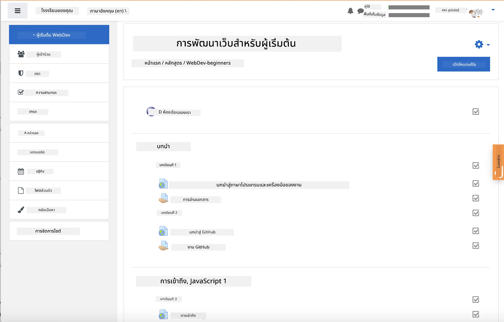
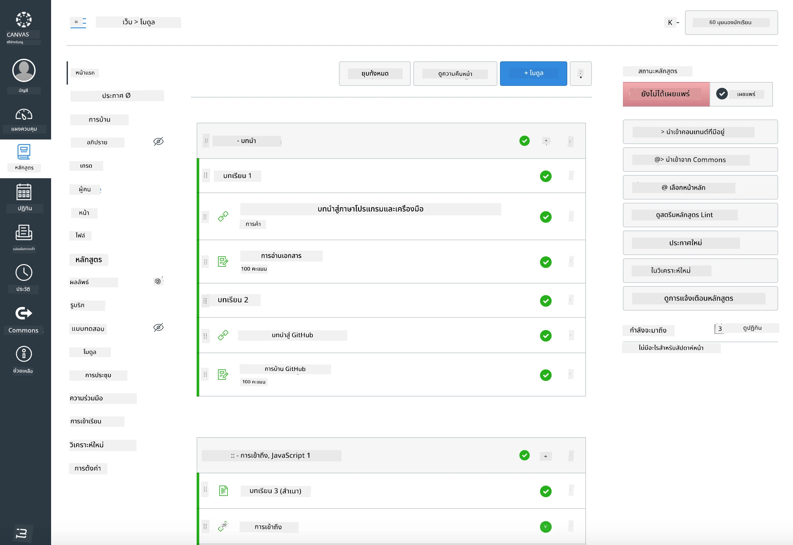

### สำหรับครูผู้สอน

คุณสามารถใช้หลักสูตรนี้ในห้องเรียนของคุณได้ หลักสูตรนี้ทำงานร่วมกับ GitHub Classroom และแพลตฟอร์ม LMS ชั้นนำได้อย่างราบรื่น และยังสามารถใช้เป็น repo เดี่ยวสำหรับนักเรียนของคุณได้อีกด้วย

### การใช้งานร่วมกับ GitHub Classroom

เพื่อจัดการบทเรียนและงานตามกลุ่มนักเรียน ให้สร้าง repository หนึ่งสำหรับแต่ละบทเรียน เพื่อให้ GitHub Classroom สามารถเชื่อมโยงงานแต่ละชิ้นได้อย่างอิสระ

- Fork repo นี้ไปยังองค์กรของคุณ
- สร้าง repo แยกสำหรับแต่ละบทเรียนโดยแยกโฟลเดอร์บทเรียนแต่ละโฟลเดอร์ออกมาเป็น repository ของตัวเอง
  - ตัวเลือก A: สร้าง repo ว่างเปล่า (หนึ่ง repo ต่อบทเรียน) และคัดลอกเนื้อหาในโฟลเดอร์บทเรียนไปยังแต่ละ repo
  - ตัวเลือก B: ใช้วิธีที่รักษาประวัติ Git (เช่น แยกโฟลเดอร์ออกมาเป็น repo ใหม่) หากคุณต้องการเก็บข้อมูลต้นทาง
- ใน GitHub Classroom สร้างงานสำหรับแต่ละบทเรียนและชี้ไปยัง repo ของบทเรียนนั้น
- การตั้งค่าที่แนะนำ:
  - การมองเห็นของ repository: ตั้งค่าเป็น private สำหรับงานของนักเรียน
  - ใช้ starter code จาก branch เริ่มต้นของ repo บทเรียน
  - เพิ่ม template สำหรับ issue และ pull request สำหรับแบบทดสอบและการส่งงาน
  - ตั้งค่าการตรวจสอบอัตโนมัติและการทดสอบหากบทเรียนของคุณมีเนื้อหาเหล่านี้
- แนวทางที่ช่วยให้การทำงานง่ายขึ้น:
  - ตั้งชื่อ repository เช่น lesson-01-intro, lesson-02-html เป็นต้น
  - ใช้ labels เช่น quiz, assignment, needs-review, late, resubmission
  - ใช้ tags/releases ตามกลุ่มนักเรียน (เช่น v2025-term1)

เคล็ดลับ: หลีกเลี่ยงการเก็บ repository ไว้ในโฟลเดอร์ที่ซิงค์ (เช่น OneDrive/Google Drive) เพื่อป้องกันปัญหา Git conflicts บน Windows

### การใช้งานร่วมกับ Moodle, Canvas หรือ Blackboard

หลักสูตรนี้มีแพ็กเกจที่สามารถนำเข้าได้สำหรับการทำงานร่วมกับ LMS ทั่วไป

- Moodle: ใช้ไฟล์อัปโหลด Moodle [Moodle upload file](../../../../../../../teaching-files/webdev-moodle.mbz) เพื่อโหลดหลักสูตรทั้งหมด
- Common Cartridge: ใช้ไฟล์ Common Cartridge [Common Cartridge file](../../../../../../../teaching-files/webdev-common-cartridge.imscc) เพื่อความเข้ากันได้กับ LMS ที่หลากหลาย
- หมายเหตุ:
  - Moodle Cloud มีการรองรับ Common Cartridge ที่จำกัด ควรใช้ไฟล์ Moodle ด้านบน ซึ่งสามารถอัปโหลดเข้า Canvas ได้เช่นกัน
  - หลังการนำเข้า ให้ตรวจสอบโมดูล วันที่กำหนดส่ง และการตั้งค่าแบบทดสอบให้ตรงกับตารางเรียนของคุณ

> หลักสูตรในห้องเรียน Moodle

> หลักสูตรใน Canvas

### การใช้งาน repo โดยตรง (ไม่ใช้ Classroom)

หากคุณไม่ต้องการใช้ GitHub Classroom คุณสามารถดำเนินการหลักสูตรจาก repo นี้โดยตรง

- รูปแบบการเรียนแบบออนไลน์/แบบซิงโครนัส (Zoom/Teams):
  - จัดกิจกรรมอุ่นเครื่องที่นำโดยผู้สอน ใช้ breakout rooms สำหรับแบบทดสอบ
  - ประกาศช่วงเวลาสำหรับแบบทดสอบ นักเรียนส่งคำตอบผ่าน GitHub Issues
  - สำหรับงานที่ทำร่วมกัน นักเรียนทำงานใน repo บทเรียนแบบ public และเปิด pull requests
- รูปแบบการเรียนแบบส่วนตัว/แบบอะซิงโครนัส:
  - นักเรียน fork บทเรียนแต่ละบทไปยัง repo **private** ของตัวเองและเพิ่มคุณเป็น collaborator
  - นักเรียนส่งงานผ่าน Issues (แบบทดสอบ) และ Pull Requests (งาน) บน repo ห้องเรียนของคุณหรือ repo private ของพวกเขา

### แนวทางปฏิบัติที่ดีที่สุด

- จัดบทเรียนปฐมนิเทศเกี่ยวกับพื้นฐาน Git/GitHub, Issues และ PRs
- ใช้ checklists ใน Issues สำหรับแบบทดสอบ/งานที่มีหลายขั้นตอน
- เพิ่ม CONTRIBUTING.md และ CODE_OF_CONDUCT.md เพื่อกำหนดมาตรฐานในห้องเรียน
- เพิ่มหมายเหตุเกี่ยวกับการเข้าถึง (alt text, captions) และเสนอไฟล์ PDF ที่พิมพ์ได้
- เวอร์ชันเนื้อหาของคุณตามเทอมและล็อก repo บทเรียนหลังการเผยแพร่

### ข้อเสนอแนะและการสนับสนุน

เราต้องการให้หลักสูตรนี้ทำงานได้ดีสำหรับคุณและนักเรียนของคุณ โปรดเปิด Issue ใหม่ใน repository นี้สำหรับข้อผิดพลาด คำขอ หรือการปรับปรุง หรือเริ่มการสนทนาใน Teacher Corner

---

**ข้อจำกัดความรับผิดชอบ**:  
เอกสารนี้ได้รับการแปลโดยใช้บริการแปลภาษา AI [Co-op Translator](https://github.com/Azure/co-op-translator) แม้ว่าเราจะพยายามให้การแปลมีความถูกต้อง แต่โปรดทราบว่าการแปลอัตโนมัติอาจมีข้อผิดพลาดหรือความไม่ถูกต้อง เอกสารต้นฉบับในภาษาดั้งเดิมควรถือเป็นแหล่งข้อมูลที่เชื่อถือได้ สำหรับข้อมูลที่สำคัญ ขอแนะนำให้ใช้บริการแปลภาษามนุษย์ที่มีความเชี่ยวชาญ เราไม่รับผิดชอบต่อความเข้าใจผิดหรือการตีความผิดที่เกิดจากการใช้การแปลนี้