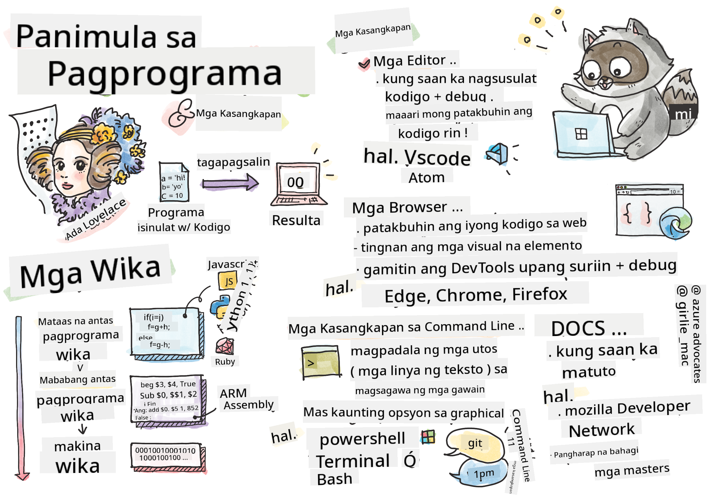

<!--
CO_OP_TRANSLATOR_METADATA:
{
  "original_hash": "3e0da5eb9b275fe3cb431033c1413ec2",
  "translation_date": "2025-10-22T15:20:44+00:00",
  "source_file": "1-getting-started-lessons/1-intro-to-programming-languages/README.md",
  "language_code": "tl"
}
-->
# Panimula sa Mga Wika ng Programming at Modernong Kasangkapan ng Developer

Kamusta, hinaharap na developer! 👋 Pwede ba akong magbahagi ng isang bagay na palaging nagbibigay sa akin ng kilig araw-araw? Malapit mo nang matuklasan na ang programming ay hindi lang tungkol sa mga computer – ito ay parang pagkakaroon ng superpowers para maisakatuparan ang mga pinakamalupit mong ideya!

Alam mo yung sandali na ginagamit mo ang paborito mong app at parang ang lahat ay perpektong gumagana? Kapag pinindot mo ang isang button at may nangyayaring sobrang astig na magpapaisip sa'yo ng "wow, paano nila NAGAWA yun?" Well, may isang tao na katulad mo – marahil nakaupo sa paborito nilang coffee shop ng alas-dos ng umaga na may pangatlong tasa ng espresso – ang nagsulat ng code na lumikha ng mahika na iyon. At eto ang magpapasabog ng utak mo: sa pagtatapos ng araling ito, hindi mo lang maiintindihan kung paano nila ginawa iyon, kundi magiging excited ka na subukan ito mismo!

Alam mo, naiintindihan ko kung bakit nakakatakot ang programming sa simula. Noong nagsimula ako, akala ko kailangan mong maging isang math genius o marunong mag-code mula pa noong limang taong gulang ka. Pero eto ang nagbago ng pananaw ko: ang programming ay parang pag-aaral ng bagong wika. Nagsisimula ka sa "hello" at "thank you," tapos natututo kang mag-order ng kape, at bago mo malaman, nagkakaroon ka na ng malalim na talakayan! Pero sa kasong ito, nakikipag-usap ka sa mga computer, at sa totoo lang? Sila ang pinaka-pasensyosong kausap na makikilala mo – hindi nila hinuhusgahan ang mga pagkakamali mo at palaging handang subukan ulit!

Ngayon, sisilipin natin ang mga kamangha-manghang kasangkapan na ginagawang posible ang modernong web development – at sobrang nakakaadik pa! Pinag-uusapan natin ang parehong mga editor, browser, at workflow na ginagamit ng mga developer sa Netflix, Spotify, at sa paborito mong indie app studio araw-araw. At eto ang magpapasayaw sa'yo: karamihan sa mga propesyonal na kasangkapan na ito ay ganap na libre!


> Sketchnote ni [Tomomi Imura](https://twitter.com/girlie_mac)

## Tingnan Natin Kung Ano na ang Alam Mo!

Bago tayo sumabak sa masayang bahagi, curious ako – ano na ang alam mo tungkol sa mundo ng programming? At pakinggan mo, kung iniisip mo na "Wala akong ideya sa kahit ano dito," hindi lang okay iyon, kundi perpekto! Ibig sabihin nasa tamang lugar ka. Isipin mo ang quiz na ito na parang stretching bago mag-ehersisyo – pinapainit lang natin ang mga utak na muscle!

[Kunin ang pre-lesson quiz](https://forms.office.com/r/dru4TE0U9n?origin=lprLink)

## Ang Pakikipagsapalaran na Pupuntahan Natin

Okay, sobrang excited ako sa mga bagay na matutuklasan natin ngayon! Seryoso, gusto kong makita ang mukha mo kapag naintindihan mo ang ilan sa mga konsepto na ito. Narito ang kamangha-manghang paglalakbay na pupuntahan natin:

- **Ano ang programming (at bakit ito ang pinaka-cool na bagay kailanman!)** – Matutuklasan natin kung paano ang code ay literal na invisible magic na nagpapagana sa lahat ng bagay sa paligid mo, mula sa alarm na alam kung Lunes ng umaga hanggang sa algorithm na perpektong pumipili ng mga rekomendasyon sa Netflix
- **Mga wika ng programming at ang kanilang mga kahanga-hangang personalidad** – Isipin mo na parang pumasok ka sa isang party kung saan ang bawat tao ay may iba't ibang superpowers at paraan ng paglutas ng problema. Ganito ang mundo ng programming languages, at magugustuhan mo ang pagkilala sa kanila!
- **Ang mga pangunahing bahagi na gumagawa ng digital magic** – Isipin mo ito na parang ultimate creative LEGO set. Kapag naintindihan mo kung paano magkasya ang mga piraso, mare-realize mo na kaya mong buuin ang kahit ano na naiisip mo
- **Mga propesyonal na kasangkapan na magpaparamdam sa'yo na parang binigyan ka ng wand ng wizard** – Hindi ako nagiging dramatic dito – ang mga kasangkapan na ito ay talagang magpaparamdam sa'yo na may superpowers ka, at ang pinakamagandang bahagi? Pareho ang ginagamit ng mga propesyonal!

> 💡 **Eto ang bagay**: Huwag mo nang isipin na kailangan mong kabisaduhin ang lahat ngayon! Sa ngayon, gusto ko lang maramdaman mo ang excitement tungkol sa kung ano ang posible. Ang mga detalye ay natural na tatatak habang nagpa-practice tayo – ganito ang tunay na pag-aaral!

> Pwede mong kunin ang araling ito sa [Microsoft Learn](https://docs.microsoft.com/learn/modules/web-development-101/introduction-programming/?WT.mc_id=academic-77807-sagibbon)!

## Ano nga ba ang *Programming*?

Sige, sagutin natin ang tanong na milyon ang halaga: ano nga ba ang programming?

Magbibigay ako ng kwento na nagbago ng pananaw ko tungkol dito. Noong nakaraang linggo, sinubukan kong ipaliwanag sa nanay ko kung paano gamitin ang bagong remote ng smart TV namin. Nahuli ko ang sarili kong nagsasabi ng mga bagay tulad ng "Pindutin ang pulang button, pero hindi yung malaking pulang button, yung maliit na pulang button sa kaliwa... hindi, sa kaliwa mo... okay, hawakan mo ng dalawang segundo, hindi isa, hindi tatlo..." Pamilyar ba? 😅

Yan ang programming! Ito ang sining ng pagbibigay ng sobrang detalyado, step-by-step na mga instruksyon sa isang bagay na napaka-makapangyarihan pero kailangan ang lahat ay malinaw na ipinaliwanag. Pero sa halip na ipaliwanag sa nanay mo (na pwedeng magtanong ng "alin sa pulang button?!"), ipinaliwanag mo ito sa computer (na gagawin lang ang eksaktong sinabi mo, kahit na hindi iyon ang ibig mong sabihin).

Eto ang nagpasabog ng utak ko noong una kong natutunan ito: ang mga computer ay talagang simple sa kanilang core. Literal na naiintindihan lang nila ang dalawang bagay – 1 at 0, na parang "oo" at "hindi" o "on" at "off." Yun lang! Pero eto ang nagiging mahika – hindi natin kailangang magsalita sa 1s at 0s na parang nasa The Matrix tayo. Dito pumapasok ang **programming languages**. Parang pagkakaroon ng pinakamahusay na tagasalin sa mundo na nagko-convert ng mga normal na ideya ng tao sa computer language.

At eto ang nagbibigay pa rin sa akin ng kilig tuwing umaga: literal na *lahat* ng digital sa buhay mo ay nagsimula sa isang tao na katulad mo, marahil nakasuot ng pajama na may tasa ng kape, nagta-type ng code sa kanilang laptop. Yung Instagram filter na nagpapaganda sa'yo? May nag-code nun. Yung rekomendasyon na nagdala sa'yo sa bagong paborito mong kanta? Isang developer ang gumawa ng algorithm na iyon. Yung app na tumutulong sa'yo na hatiin ang bayarin sa hapunan kasama ang mga kaibigan? Yep, may nag-isip ng "nakakainis ito, siguro kaya ko itong ayusin" at pagkatapos... ginawa nila!

Kapag natutunan mong mag-program, hindi ka lang nakakakuha ng bagong kasanayan – nagiging bahagi ka ng kamangha-manghang komunidad ng mga problem-solvers na iniisip araw-araw, "Paano kaya kung makakagawa ako ng isang bagay na magpapasaya sa araw ng iba?" Sa totoo lang, may mas cool pa ba sa ganun?

✅ **Hunt ng Fun Fact**: Eto ang sobrang cool na hanapin kapag may libreng oras ka – sino sa tingin mo ang unang computer programmer sa mundo? Bibigyan kita ng hint: baka hindi mo inaasahan! Ang kwento sa likod ng taong ito ay sobrang fascinating at nagpapakita na ang programming ay palaging tungkol sa creative problem-solving at pag-iisip sa labas ng kahon.

## Ang Mga Programming Languages ay Parang Iba't Ibang Flavors ng Mahika

Okay, medyo weird ito, pero sundan mo ako – ang mga programming languages ay parang iba't ibang uri ng musika. Isipin mo: may jazz, na smooth at improvisational, rock na malakas at straightforward, classical na elegant at structured, at hip-hop na creative at expressive. Ang bawat estilo ay may sariling vibe, sariling komunidad ng passionate fans, at bawat isa ay perpekto para sa iba't ibang mood at okasyon.

Ganito rin ang programming languages! Hindi mo gagamitin ang parehong wika para gumawa ng isang masayang mobile game na gagamitin mo para mag-crunch ng napakalaking dami ng climate data, tulad ng hindi mo tutugtugin ang death metal sa yoga class (well, karamihan ng yoga class anyway! 😄).

Pero eto ang talagang nagpapasabog ng utak ko tuwing iniisip ko ito: ang mga wika na ito ay parang pagkakaroon ng pinaka-pasensyosong, pinakamatalinong interpreter sa mundo na nakaupo sa tabi mo. Pwede mong ipahayag ang mga ideya mo sa paraang natural sa utak ng tao, at sila ang bahala sa sobrang kumplikadong trabaho ng pag-convert nito sa 1s at 0s na talagang naiintindihan ng mga computer. Parang may kaibigan ka na fluent sa parehong "human creativity" at "computer logic" – at hindi sila napapagod, hindi kailangan ng coffee breaks, at hindi ka hinuhusgahan sa pagtatanong ng parehong tanong nang dalawang beses!

### Mga Popular na Programming Languages at Kanilang Gamit

| Wika | Pinakamahusay Para sa | Bakit Popular |
|------|-----------------------|---------------|
| **JavaScript** | Web development, user interfaces | Tumatakbo sa mga browser at nagpapagana ng interactive na mga website |
| **Python** | Data science, automation, AI | Madaling basahin at matutunan, makapangyarihang mga library |
| **Java** | Enterprise applications, Android apps | Platform-independent, matibay para sa malalaking sistema |
| **C#** | Windows applications, game development | Malakas na suporta mula sa Microsoft ecosystem |
| **Go** | Cloud services, backend systems | Mabilis, simple, dinisenyo para sa modernong computing |

### High-Level vs. Low-Level Languages

Okay, eto ang konsepto na talagang nagpaikot ng utak ko noong una akong natututo, kaya ibabahagi ko ang analogy na talagang nagpa-click sa akin – at sana makatulong din sa'yo!

Isipin mo na bumisita ka sa isang bansa kung saan hindi mo alam ang wika, at desperado kang hanapin ang pinakamalapit na banyo (lahat tayo dumaan na diyan, di ba? 😅):

- **Low-level programming** ay parang pag-aaral ng lokal na dialect nang sobrang husay na kaya mong makipag-usap sa lola na nagbebenta ng prutas sa kanto gamit ang mga cultural references, lokal na slang, at inside jokes na naiintindihan lang ng mga lumaki doon. Sobrang impressive at sobrang efficient... kung fluent ka! Pero medyo nakaka-overwhelm kapag naghahanap ka lang ng banyo.

- **High-level programming** ay parang pagkakaroon ng amazing na lokal na kaibigan na gets ka. Pwede mong sabihin "Kailangan ko talagang hanapin ang restroom" sa plain English, at sila ang bahala sa cultural translation at magbibigay ng direksyon sa paraang naiintindihan ng utak mo.

Sa programming terms:
- **Low-level languages** (tulad ng Assembly o C) ay nagbibigay-daan sa'yo na magkaroon ng sobrang detalyadong pag-uusap sa aktwal na hardware ng computer, pero kailangan mong mag-isip na parang makina, na... well, sabihin na lang natin na medyo malaking mental shift!
- **High-level languages** (tulad ng JavaScript, Python, o C#) ay nagbibigay-daan sa'yo na mag-isip na parang tao habang sila ang bahala sa machine-speak sa likod ng eksena. Plus, may mga sobrang welcoming na komunidad na puno ng mga tao na naaalala kung paano maging bago at talagang gustong tumulong!

Hulaan mo kung alin ang irerekomenda kong simulan mo? 😉 Ang high-level languages ay parang training wheels na hindi mo gustong tanggalin dahil mas pinapasaya nila ang buong karanasan!

### Ipakita Ko sa'yo Kung Bakit Mas Friendly ang High-Level Languages

Okay, ipapakita ko sa'yo ang isang bagay na perpektong nagpapakita kung bakit ako na-in love sa high-level languages, pero una – kailangan mong ipangako sa akin ang isang bagay. Kapag nakita mo ang unang halimbawa ng code, huwag kang mag-panic! Dapat itong mukhang nakakatakot. Yan mismo ang punto na ginagawa ko!

Titingnan natin ang parehong task na isinulat sa dalawang magkaibang estilo. Parehong gumagawa ng tinatawag na Fibonacci sequence – ito ay isang magandang mathematical pattern kung saan ang bawat numero ay kabuuan ng dalawang nauna: 0, 1, 1, 2, 3, 5, 8, 13... (Fun fact: makikita mo ang pattern na ito literal na kahit saan sa kalikasan – mga spiral ng buto ng sunflower, mga pattern ng pinecone, kahit ang paraan ng pagbuo ng mga galaxy!)

Handa ka na bang makita ang pagkakaiba? Tara na!

**High-level language (JavaScript) – Friendly sa Tao:**

```javascript
// Step 1: Basic Fibonacci setup
const fibonacciCount = 10;
let current = 0;
let next = 1;

console.log('Fibonacci sequence:');
```

**Eto ang ginagawa ng code na ito:**
- **Magdeklara** ng constant para tukuyin kung ilang Fibonacci numbers ang gusto nating i-generate
- **Mag-initialize** ng dalawang variable para subaybayan ang kasalukuyan at susunod na numero sa sequence
- **I-set up** ang mga panimulang halaga (0 at 1) na tumutukoy sa pattern ng Fibonacci
- **Ipakita** ang header message para tukuyin ang output natin

```javascript
// Step 2: Generate the sequence with a loop
for (let i = 0; i < fibonacciCount; i++) {
  console.log(`Position ${i + 1}: ${current}`);
  
  // Calculate next number in sequence
  const sum = current + next;
  current = next;
  next = sum;
}
```

**Paghiwa-hiwalay ng nangyayari dito:**
- **Mag-loop** sa bawat posisyon sa sequence gamit ang `for` loop
- **Ipakita** ang bawat numero kasama ang posisyon nito gamit ang template literal formatting
- **I-calculate** ang susunod na Fibonacci number sa pamamagitan ng pagdagdag ng kasalukuyan at susunod na halaga
- **I-update** ang tracking variables para lumipat sa susunod na iteration

```javascript
// Step 3: Modern functional approach
const generateFibonacci = (count) => {
  const sequence = [0, 1];
  
  for (let i = 2; i < count; i++) {
    sequence[i] = sequence[i - 1] + sequence[i - 2];
  }
  
  return sequence;
};

// Usage example
const fibSequence = generateFibonacci(10);
console.log(fibSequence);
```

**Sa itaas, ginawa natin:**
- **Lumikha** ng reusable function gamit ang modernong arrow function syntax
- **Bumuo** ng array para i-store ang kumpletong sequence sa halip na ipakita isa-isa
- **Gumamit** ng array indexing para i-calculate ang bawat bagong numero mula sa mga naunang halaga
- **Ibalik** ang kumpletong sequence para sa flexible na paggamit sa ibang bahagi ng programa

**Low-level language (ARM Assembly) – Friendly sa Computer:**

```assembly
 area ascen,code,readonly
 entry
 code32
 adr r0,thumb+1
 bx r0
 code16
thumb
 mov r0,#00
 sub r0,r0,#01
 mov r1,#01
 mov r4,#10
 ldr r2,=0x40000000
back add r0,r1
 str r0,[r2]
 add r2,#04
 mov r3,r0
 mov r0,r1
 mov r1,r3
 sub r4,#01
 cmp r4,#00
 bne back
 end
```

Pansinin kung paano ang bersyon ng JavaScript ay parang English instructions, habang ang Assembly version ay gumagamit ng cryptic commands na direktang kumokontrol sa processor ng computer. Parehong nagagawa ang eksaktong parehong task, pero ang high-level language ay mas madaling maintindihan, isulat, at i-maintain ng tao.

**Mga pangunahing pagkakaiba na mapapansin mo:**
- **Readability**: Ang JavaScript ay gumagamit ng mga descriptive na pangalan tulad ng `fibonacciCount` habang ang Assembly ay gumagamit ng cryptic labels tulad ng `r0`, `r1`
- **Comments**: Ang high-level languages ay hinihikayat ang mga explanatory comments na ginagawang self-documenting ang code
- **Structure**: Ang logical flow ng JavaScript ay tumutugma sa kung paano iniisip ng tao ang mga problema step-by-step
- **Maintenance**: Ang pag-update ng bersyon ng JavaScript para sa iba't ibang requirements ay straightforward at malinaw
✅ **Tungkol sa Fibonacci sequence**: Ang napakagandang pattern ng numero na ito (kung saan ang bawat numero ay katumbas ng kabuuan ng dalawang nauna: 0, 1, 1, 2, 3, 5, 8...) ay makikita *kahit saan* sa kalikasan! Makikita mo ito sa mga spiral ng sunflower, mga pattern ng pinecone, ang kurba ng mga shell ng nautilus, at maging sa paraan ng paglaki ng mga sanga ng puno. Nakakamangha kung paano nagagamit ang math at code para maunawaan at muling likhain ang mga pattern na ginagamit ng kalikasan upang lumikha ng kagandahan!

## Ang Mga Pangunahing Bahagi na Gumagawa ng Mahika

Okay, ngayong nakita mo na kung paano gumagana ang mga programming language, talakayin natin ang mga pangunahing bahagi na bumubuo sa bawat program na kailanman isinulat. Isipin mo ito bilang mga mahahalagang sangkap sa paborito mong recipe – kapag naintindihan mo kung ano ang ginagawa ng bawat isa, magagawa mong magbasa at magsulat ng code sa halos anumang wika!

Parang pag-aaral ng grammar ng programming ito. Naalala mo ba noong nasa paaralan ka at natutunan mo ang tungkol sa mga pangngalan, pandiwa, at kung paano bumuo ng mga pangungusap? Ang programming ay may sarili nitong bersyon ng grammar, at sa totoo lang, mas lohikal at mas madaling intindihin kaysa sa grammar ng Ingles! 😄

### Statements: Ang Hakbang-Hakbang na Instruksyon

Simulan natin sa **statements** – parang mga indibidwal na pangungusap ito sa isang pag-uusap sa iyong computer. Ang bawat statement ay nagsasabi sa computer na gawin ang isang partikular na bagay, parang nagbibigay ng direksyon: "Lumiko sa kaliwa dito," "Huminto sa pulang ilaw," "Mag-park sa lugar na iyon."

Ang gusto ko sa statements ay kung gaano kadalas itong nababasa. Tingnan mo ito:

```javascript
// Basic statements that perform single actions
const userName = "Alex";                    
console.log("Hello, world!");              
const sum = 5 + 3;                         
```

**Narito ang ginagawa ng code na ito:**
- **Magdeklara** ng constant variable para mag-imbak ng pangalan ng user
- **Magpakita** ng greeting message sa console output
- **Magkalkula** at mag-imbak ng resulta ng isang mathematical operation

```javascript
// Statements that interact with web pages
document.title = "My Awesome Website";      
document.body.style.backgroundColor = "lightblue";
```

**Hakbang-hakbang, narito ang nangyayari:**
- **Baguhin** ang pamagat ng webpage na lumalabas sa browser tab
- **Palitan** ang kulay ng background ng buong page body

### Variables: Ang Memory System ng Iyong Programa

Okay, **variables** ay isa sa mga paborito kong konsepto na ituro dahil sobrang katulad ito ng mga bagay na ginagamit mo araw-araw!

Isipin mo ang contact list ng iyong telepono. Hindi mo kabisado ang mga numero ng lahat – sa halip, sine-save mo ang "Nanay," "Best Friend," o "Pizza Place na Bukas Hanggang 2 AM" at hinahayaan ang telepono mong tandaan ang mga aktwal na numero. Ganyan din ang variables! Parang mga lalagyan na may label kung saan maaaring mag-imbak ng impormasyon ang iyong programa at kunin ito gamit ang pangalan na may kahulugan.

Narito ang talagang cool: ang mga variable ay maaaring magbago habang tumatakbo ang iyong programa (kaya nga tinawag itong "variable" – gets mo ba ang ibig sabihin?). Tulad ng pag-update mo sa contact ng pizza place kapag nakahanap ka ng mas maganda, ang mga variable ay maaaring ma-update habang natututo ang iyong programa ng bagong impormasyon o habang nagbabago ang mga sitwasyon!

Hayaan mong ipakita ko sa iyo kung gaano kasimple ito:

```javascript
// Step 1: Creating basic variables
const siteName = "Weather Dashboard";        
let currentWeather = "sunny";               
let temperature = 75;                       
let isRaining = false;                      
```

**Pag-unawa sa mga konsepto:**
- **Mag-imbak** ng mga hindi nagbabagong halaga sa `const` variables (tulad ng pangalan ng site)
- **Gamitin** ang `let` para sa mga halaga na maaaring magbago sa buong programa
- **Mag-assign** ng iba't ibang uri ng data: strings (text), numbers, at booleans (true/false)
- **Pumili** ng mga deskriptibong pangalan na nagpapaliwanag kung ano ang nilalaman ng bawat variable

```javascript
// Step 2: Working with objects to group related data
const weatherData = {                       
  location: "San Francisco",
  humidity: 65,
  windSpeed: 12
};
```

**Sa itaas, ginawa natin ang:**
- **Lumikha** ng object para pagsama-samahin ang mga kaugnay na impormasyon ng panahon
- **Ayusin** ang maraming piraso ng data sa ilalim ng isang pangalan ng variable
- **Gumamit** ng key-value pairs para malinaw na lagyan ng label ang bawat piraso ng impormasyon

```javascript
// Step 3: Using and updating variables
console.log(`${siteName}: Today is ${currentWeather} and ${temperature}°F`);
console.log(`Wind speed: ${weatherData.windSpeed} mph`);

// Updating changeable variables
currentWeather = "cloudy";                  
temperature = 68;                          
```

**Unawain ang bawat bahagi:**
- **Ipakita** ang impormasyon gamit ang template literals na may `${}` syntax
- **I-access** ang mga property ng object gamit ang dot notation (`weatherData.windSpeed`)
- **I-update** ang mga variable na dineklara gamit ang `let` upang ipakita ang nagbabagong kondisyon
- **Pagsamahin** ang maraming variable upang lumikha ng makabuluhang mensahe

```javascript
// Step 4: Modern destructuring for cleaner code
const { location, humidity } = weatherData; 
console.log(`${location} humidity: ${humidity}%`);
```

**Ang kailangan mong malaman:**
- **Kunin** ang mga partikular na property mula sa mga object gamit ang destructuring assignment
- **Lumikha** ng mga bagong variable nang awtomatiko gamit ang parehong pangalan ng mga key ng object
- **Pasimplehin** ang code sa pamamagitan ng pag-iwas sa paulit-ulit na dot notation

### Control Flow: Turuan ang Iyong Programa na Mag-isip

Okay, dito nagiging sobrang kamangha-mangha ang programming! Ang **control flow** ay parang pagtuturo sa iyong programa kung paano gumawa ng matatalinong desisyon, katulad ng ginagawa mo araw-araw nang hindi mo iniisip.

Isipin mo ito: kaninang umaga malamang na dumaan ka sa ganito, "Kung umuulan, magdadala ako ng payong. Kung malamig, magsusuot ako ng jacket. Kung late na ako, hindi na ako mag-aalmusal at bibili na lang ng kape sa daan." Ang utak mo ay natural na sumusunod sa ganitong if-then logic nang maraming beses araw-araw!

Ito ang nagpaparamdam sa mga programa na matalino at buhay sa halip na sumusunod lang sa isang boring na script. Maaari silang tumingin sa isang sitwasyon, suriin kung ano ang nangyayari, at tumugon nang naaangkop. Parang binibigyan mo ang iyong programa ng utak na maaaring umangkop at gumawa ng mga pagpipilian!

Gusto mo bang makita kung gaano kaganda ito gumagana? Hayaan mong ipakita ko sa iyo:

```javascript
// Step 1: Basic conditional logic
const userAge = 17;

if (userAge >= 18) {
  console.log("You can vote!");
} else {
  const yearsToWait = 18 - userAge;
  console.log(`You'll be able to vote in ${yearsToWait} year(s).`);
}
```

**Narito ang ginagawa ng code na ito:**
- **Suriin** kung ang edad ng user ay nakakatugon sa kinakailangan para bumoto
- **Ipatupad** ang iba't ibang code blocks batay sa resulta ng kondisyon
- **Kalkulahin** at ipakita kung gaano katagal bago maging eligible sa pagboto kung wala pang 18
- **Magbigay** ng partikular at kapaki-pakinabang na feedback para sa bawat sitwasyon

```javascript
// Step 2: Multiple conditions with logical operators
const userAge = 17;
const hasPermission = true;

if (userAge >= 18 && hasPermission) {
  console.log("Access granted: You can enter the venue.");
} else if (userAge >= 16) {
  console.log("You need parent permission to enter.");
} else {
  console.log("Sorry, you must be at least 16 years old.");
}
```

**Paghiwa-hiwalay kung ano ang nangyayari dito:**
- **Pagsamahin** ang maraming kondisyon gamit ang `&&` (and) operator
- **Lumikha** ng hierarchy ng mga kondisyon gamit ang `else if` para sa maraming sitwasyon
- **I-handle** ang lahat ng posibleng kaso gamit ang huling `else` statement
- **Magbigay** ng malinaw at maaksiyong feedback para sa bawat iba't ibang sitwasyon

```javascript
// Step 3: Concise conditional with ternary operator
const votingStatus = userAge >= 18 ? "Can vote" : "Cannot vote yet";
console.log(`Status: ${votingStatus}`);
```

**Ang kailangan mong tandaan:**
- **Gamitin** ang ternary operator (`? :`) para sa simpleng dalawang opsyon na kondisyon
- **Isulat** ang kondisyon muna, kasunod ng `?`, pagkatapos ang true result, pagkatapos `:`, pagkatapos ang false result
- **I-apply** ang pattern na ito kapag kailangan mong mag-assign ng mga halaga batay sa mga kondisyon

```javascript
// Step 4: Handling multiple specific cases
const dayOfWeek = "Tuesday";

switch (dayOfWeek) {
  case "Monday":
  case "Tuesday":
  case "Wednesday":
  case "Thursday":
  case "Friday":
    console.log("It's a weekday - time to work!");
    break;
  case "Saturday":
  case "Sunday":
    console.log("It's the weekend - time to relax!");
    break;
  default:
    console.log("Invalid day of the week");
}
```

**Ang code na ito ay nagagawa ang mga sumusunod:**
- **Itugma** ang halaga ng variable sa maraming partikular na kaso
- **Pagsamahin** ang mga magkatulad na kaso (mga araw ng trabaho vs. weekend)
- **Ipatupad** ang naaangkop na code block kapag may natagpuang tugma
- **Isama** ang `default` case para i-handle ang mga hindi inaasahang halaga
- **Gamitin** ang `break` statements para pigilan ang code na magpatuloy sa susunod na case

> 💡 **Analohiya sa totoong buhay**: Isipin ang control flow na parang may pinaka-mahinahon na GPS na nagbibigay sa iyo ng direksyon. Maaaring sabihin nito, "Kung may trapik sa Main Street, dumaan sa highway. Kung may construction sa highway, subukan ang scenic route." Ang mga programa ay gumagamit ng eksaktong parehong uri ng conditional logic upang tumugon nang matalino sa iba't ibang sitwasyon at palaging magbigay sa mga user ng pinakamahusay na posibleng karanasan.

✅ **Ano ang susunod na darating**: Magkakaroon tayo ng sobrang saya sa paglalim sa mga konseptong ito habang patuloy nating tinatahak ang kamangha-manghang paglalakbay na ito! Sa ngayon, mag-focus lang sa pagdama ng excitement tungkol sa lahat ng mga kamangha-manghang posibilidad na nasa harapan mo. Ang mga partikular na kasanayan at teknik ay natural na mananatili habang tayo ay nagsasanay nang magkasama – ipinapangako ko, magiging mas masaya ito kaysa sa inaasahan mo!

## Mga Kasangkapan sa Trabaho

Okay, dito ako sobrang excited na halos hindi ko mapigilan ang sarili ko! 🚀 Pag-uusapan natin ang mga kamangha-manghang tools na magpaparamdam sa iyo na parang binigyan ka ng susi sa isang digital spaceship.

Alam mo kung paano ang isang chef ay may mga perpektong balanseng kutsilyo na parang extension ng kanilang mga kamay? O kung paano ang isang musikero ay may gitara na parang kumakanta sa tuwing hinahawakan nila ito? Well, ang mga developer ay may sarili naming bersyon ng mga mahiwagang tools, at narito ang magpapamangha sa iyo – karamihan sa mga ito ay ganap na libre!

Halos tumatalon ako sa upuan ko sa pag-iisip na ibahagi ang mga ito sa iyo dahil lubos nilang binago kung paano kami bumuo ng software. Pinag-uusapan natin ang mga AI-powered coding assistants na maaaring tumulong sa pagsusulat ng iyong code (hindi ako nagbibiro!), mga cloud environment kung saan maaari kang bumuo ng buong application mula sa kahit saan basta may Wi-Fi, at mga debugging tools na sobrang sopistikado na parang may X-ray vision para sa iyong mga programa.

At narito ang bahagi na nagbibigay pa rin sa akin ng kilabot: ang mga ito ay hindi "beginner tools" na iyong lalampasan. Ang mga ito ay eksaktong parehong mga propesyonal na tools na ginagamit ng mga developer sa Google, Netflix, at sa indie app studio na gusto mo sa kasalukuyang sandali. Mararamdaman mo na parang isang pro sa paggamit ng mga ito!

### Code Editors at IDEs: Ang Iyong Bagong Digital na Kaibigan

Pag-usapan natin ang code editors – ang mga ito ay seryosong magiging paborito mong lugar para maglagi! Isipin mo ito bilang iyong personal na coding sanctuary kung saan gugugol ka ng karamihan ng iyong oras sa paglikha at pagperpekto ng iyong mga digital na likha.

Pero narito ang talagang mahiwaga tungkol sa modernong editors: hindi lang sila fancy text editors. Parang may pinakamatalino at supportive na coding mentor na nakaupo sa tabi mo 24/7. Inaayos nila ang iyong mga typo bago mo pa mapansin, nagmumungkahi ng mga pagpapabuti na nagpapakita sa iyo na parang isang henyo, tumutulong sa iyo na maunawaan kung ano ang ginagawa ng bawat piraso ng code, at ang ilan sa kanila ay maaaring hulaan kung ano ang susunod mong itatype at mag-alok na tapusin ang iyong iniisip!

Naalala ko noong una kong natuklasan ang auto-completion – literal na naramdaman ko na parang nabubuhay ako sa hinaharap. Magsisimula kang mag-type ng isang bagay, at sasabihin ng editor mo, "Hoy, iniisip mo ba ang function na ito na eksaktong ginagawa ang kailangan mo?" Parang may mind reader bilang coding buddy mo!

**Ano ang nagpapaganda sa mga editors na ito?**

Ang mga modernong code editors ay nag-aalok ng kahanga-hangang hanay ng mga feature na dinisenyo upang mapalakas ang iyong produktibidad:

| Feature | Ano ang Ginagawa Nito | Bakit Ito Nakakatulong |
|---------|-----------------------|-----------------------|
| **Syntax Highlighting** | Kulayan ang iba't ibang bahagi ng iyong code | Ginagawang mas madaling basahin ang code at makita ang mga error |
| **Auto-completion** | Nagmumungkahi ng code habang nagta-type ka | Pinapabilis ang coding at binabawasan ang mga typo |
| **Debugging Tools** | Tumutulong sa paghahanap at pag-aayos ng mga error | Nakakatipid ng oras sa troubleshooting |
| **Extensions** | Nagdaragdag ng mga espesyal na feature | I-customize ang editor para sa anumang teknolohiya |
| **AI Assistants** | Nagmumungkahi ng code at paliwanag | Pinapabilis ang pag-aaral at produktibidad |

> 🎥 **Video Resource**: Gusto mo bang makita ang mga tools na ito sa aksyon? Tingnan ang [Tools of the Trade video](https://youtube.com/watch?v=69WJeXGBdxg) para sa komprehensibong overview.

#### Mga Inirerekomendang Editors para sa Web Development

**[Visual Studio Code](https://code.visualstudio.com/?WT.mc_id=academic-77807-sagibbon)** (Libre)
- Pinakapopular sa mga web developer
- Napakahusay na extension ecosystem
- May built-in na terminal at Git integration
- **Mga kailangang extension**:
  - [GitHub Copilot](https://marketplace.visualstudio.com/items?itemName=GitHub.copilot) - AI-powered na mungkahi sa code
  - [Live Share](https://marketplace.visualstudio.com/items?itemName=MS-vsliveshare.vsliveshare) - Real-time na kolaborasyon
  - [Prettier](https://marketplace.visualstudio.com/items?itemName=esbenp.prettier-vscode) - Automatic na pag-format ng code
  - [Code Spell Checker](https://marketplace.visualstudio.com/items?itemName=streetsidesoftware.code-spell-checker) - Nakikita ang mga typo sa iyong code

**[JetBrains WebStorm](https://www.jetbrains.com/webstorm/)** (May bayad, libre para sa mga estudyante)
- Advanced na debugging at testing tools
- Matalinong code completion
- Built-in na version control

**Cloud-Based IDEs** (Iba't ibang presyo)
- [GitHub Codespaces](https://github.com/features/codespaces) - Buong VS Code sa iyong browser
- [Replit](https://replit.com/) - Magaling para sa pag-aaral at pagbabahagi ng code
- [StackBlitz](https://stackblitz.com/) - Instant, full-stack na web development

> 💡 **Tip sa Pagsisimula**: Magsimula sa Visual Studio Code – libre ito, malawakang ginagamit sa industriya, at may napakalaking komunidad na gumagawa ng mga kapaki-pakinabang na tutorial at extension.

### Web Browsers: Ang Iyong Lihim na Laboratoryo sa Pag-develop

Okay, maghanda kang mamangha! Alam mo kung paano mo ginagamit ang mga browser para mag-scroll sa social media at manood ng mga video? Well, lumalabas na may itinatago silang kamangha-manghang lihim na laboratoryo ng developer na naghihintay lang na matuklasan mo!

Sa tuwing magri-right click ka sa isang webpage at pipiliin ang "Inspect Element," binubuksan mo ang isang nakatagong mundo ng developer tools na mas makapangyarihan pa kaysa sa ilang mahal na software na binayaran ko ng daan-daang dolyar noon. Parang natuklasan mo na ang iyong ordinaryong kusina ay may itinatagong propesyonal na laboratoryo ng chef sa likod ng isang lihim na panel!

Noong una akong ipinakita sa browser DevTools, gumugol ako ng halos tatlong oras sa pag-click-click lang at sinasabing "WAIT, KAYA RIN NIYA YUN?!" Literal mong maa-edit ang anumang website nang real-time, makita kung gaano kabilis ang pag-load ng lahat, subukan kung paano ang hitsura ng iyong site sa iba't ibang device, at maging mag-debug ng JavaScript na parang isang pro. Nakakamangha talaga!

**Narito kung bakit ang mga browser ay ang iyong lihim na sandata:**

Kapag gumagawa ka ng website o web application, kailangan mong makita kung paano ito tumingin at kumilos sa totoong mundo. Ang mga browser ay hindi lang nagpapakita ng iyong gawa kundi nagbibigay din ng detalyadong feedback tungkol sa performance, accessibility, at mga posibleng isyu.

#### Browser Developer Tools (DevTools)

Ang mga modernong browser ay may kasamang komprehensibong development suites:

| Tool Category | Ano ang Ginagawa Nito | Halimbawa ng Paggamit |
|---------------|-----------------------|-----------------------|
| **Element Inspector** | Tingnan at i-edit ang HTML/CSS nang real-time | Ayusin ang styling para makita ang agarang resulta |
| **Console** | Tingnan ang mga error message at subukan ang JavaScript | Ayusin ang mga problema at mag-eksperimento sa code |
| **Network Monitor** | Subaybayan kung paano naglo-load ang mga resources | I-optimize ang performance at oras ng pag-load |
| **Accessibility Checker** | Subukan para sa inclusive na disenyo | Siguraduhing gumagana ang iyong site para sa lahat ng user |
| **Device Simulator** | I-preview sa iba't ibang laki ng screen | Subukan ang responsive na disenyo nang hindi kailangan ng maraming device |

#### Mga Inirerekomendang Browser para sa Development

- **[Chrome](https://developers.google.com/web/tools/chrome-devtools/)** - Standard na DevTools ng industriya na may malawak na dokumentasyon
- **[Firefox](https://developer.mozilla.org/docs/Tools)** - Mahusay na CSS Grid at accessibility tools
- **[Edge](https://docs.microsoft.com/microsoft-edge/devtools-guide-chromium/?WT.mc_id=academic-77807-sagibbon)** - Batay sa Chromium na may mga resource para sa developer mula sa Microsoft

> ⚠️ **Mahalagang Tip sa Pagsusuri**: Laging subukan ang iyong mga website sa iba't ibang browser! Ang gumagana nang perpekto sa Chrome ay maaaring magmukhang iba sa Safari o Firefox. Ang mga propesyonal na developer ay nagsusuri sa lahat ng pangunahing browser upang matiyak ang pare-parehong karanasan ng user.

### Mga Command Line Tool: Ang Iyong Gateway sa Developer Superpowers

Okay, magpakatotoo tayo tungkol sa command line, dahil gusto kong marinig mo ito mula sa isang tao na talagang nakakaintindi. Noong una ko itong nakita – isang nakakatakot na itim na screen na may kumikislap na teksto – literal na naisip ko, "Hindi, hindi talaga! Para itong galing sa isang pelikula ng hacker noong 1980s, at siguradong hindi ako sapat na matalino para dito!" 😅

Pero ito ang gusto kong sinabi sa akin noon, at sinasabi ko sa iyo ngayon: ang command line ay hindi nakakatakot – ito ay parang direktang pakikipag-usap sa iyong computer. Isipin mo ito na parang pagkakaiba ng pag-order ng pagkain sa pamamagitan ng isang magarbong app na may mga larawan at menu (na maganda at madali) kumpara sa pagpasok sa paborito mong lokal na restaurant kung saan alam ng chef kung ano ang gusto mo at kayang maghanda ng perpektong pagkain sa simpleng pagsabi mo ng "surprise me with something amazing."

Ang command line ay kung saan pumupunta ang mga developer para maramdaman na sila ay mga wizard. Magta-type ka ng ilang tila mahiwagang salita (okay, mga command lang sila, pero parang mahiwaga!), pindutin ang enter, at BOOM – nakagawa ka ng buong istruktura ng proyekto, nag-install ng makapangyarihang mga tool mula sa iba't ibang panig ng mundo, o na-deploy ang iyong app sa internet para makita ng milyon-milyong tao. Kapag naranasan mo ang kapangyarihang iyon, talagang nakakaadik!

**Bakit magiging paborito mo ang command line:**

Bagama't maganda ang mga graphical interface para sa maraming gawain, ang command line ay mahusay sa automation, precision, at bilis. Maraming development tools ang pangunahing gumagana sa pamamagitan ng command line interfaces, at ang pag-aaral kung paano gamitin ang mga ito nang mahusay ay maaaring lubos na mapabuti ang iyong produktibidad.

```bash
# Step 1: Create and navigate to project directory
mkdir my-awesome-website
cd my-awesome-website
```

**Ano ang ginagawa ng code na ito:**
- **Gumawa** ng bagong direktoryo na tinatawag na "my-awesome-website" para sa iyong proyekto
- **Mag-navigate** sa bagong likhang direktoryo upang simulan ang trabaho

```bash
# Step 2: Initialize project with package.json
npm init -y

# Install modern development tools
npm install --save-dev vite prettier eslint
npm install --save-dev @eslint/js
```

**Hakbang-hakbang, narito ang nangyayari:**
- **I-initialize** ang bagong Node.js project na may default settings gamit ang `npm init -y`
- **I-install** ang Vite bilang modernong build tool para sa mabilis na development at production builds
- **Idagdag** ang Prettier para sa awtomatikong pag-format ng code at ESLint para sa pagsusuri ng kalidad ng code
- **Gamitin** ang `--save-dev` flag upang markahan ang mga ito bilang development-only dependencies

```bash
# Step 3: Create project structure and files
mkdir src assets
echo '<!DOCTYPE html><html><head><title>My Site</title></head><body><h1>Hello World</h1></body></html>' > index.html

# Start development server
npx vite
```

**Sa itaas, ginawa natin ang:**
- **Inayos** ang ating proyekto sa pamamagitan ng paggawa ng magkakahiwalay na folder para sa source code at assets
- **Nag-generate** ng basic HTML file na may tamang istruktura ng dokumento
- **Sinimulan** ang Vite development server para sa live reloading at hot module replacement

#### Mahahalagang Command Line Tools para sa Web Development

| Tool | Layunin | Bakit Kailangan Mo Ito |
|------|---------|-------------------------|
| **[Git](https://git-scm.com/)** | Version control | Subaybayan ang mga pagbabago, makipagtulungan sa iba, i-backup ang iyong trabaho |
| **[Node.js & npm](https://nodejs.org/)** | JavaScript runtime & package management | Patakbuhin ang JavaScript sa labas ng browser, mag-install ng modernong development tools |
| **[Vite](https://vitejs.dev/)** | Build tool & dev server | Napakabilis na development na may hot module replacement |
| **[ESLint](https://eslint.org/)** | Kalidad ng code | Awtomatikong hanapin at ayusin ang mga problema sa iyong JavaScript |
| **[Prettier](https://prettier.io/)** | Pag-format ng code | Panatilihing pare-pareho at nababasa ang iyong code |

#### Mga Opsyon na Partikular sa Platform

**Windows:**
- **[Windows Terminal](https://docs.microsoft.com/windows/terminal/?WT.mc_id=academic-77807-sagibbon)** - Moderno, mayaman sa feature na terminal
- **[PowerShell](https://docs.microsoft.com/powershell/?WT.mc_id=academic-77807-sagibbon)** 💻 - Makapangyarihang scripting environment
- **[Command Prompt](https://docs.microsoft.com/windows-server/administration/windows-commands/?WT.mc_id=academic-77807-sagibbon)** 💻 - Tradisyunal na Windows command line

**macOS:**
- **[Terminal](https://support.apple.com/guide/terminal/)** 💻 - Built-in na terminal application
- **[iTerm2](https://iterm2.com/)** - Pinahusay na terminal na may advanced na features

**Linux:**
- **[Bash](https://www.gnu.org/software/bash/)** 💻 - Standard na Linux shell
- **[KDE Konsole](https://docs.kde.org/trunk5/en/konsole/konsole/index.html)** - Advanced na terminal emulator

> 💻 = Pre-installed sa operating system

> 🎯 **Learning Path**: Simulan sa mga basic na command tulad ng `cd` (change directory), `ls` o `dir` (list files), at `mkdir` (gumawa ng folder). Magpraktis gamit ang mga modernong workflow command tulad ng `npm install`, `git status`, at `code .` (binubuksan ang kasalukuyang direktoryo sa VS Code). Habang nagiging komportable ka, natural mong matututunan ang mas advanced na mga command at automation techniques.

### Dokumentasyon: Ang Iyong Palaging Available na Mentor sa Pag-aaral

Okay, hayaan mo akong magbahagi ng isang lihim na magpapagaan ng pakiramdam mo bilang baguhan: kahit ang mga pinaka-beteranong developer ay gumugugol ng malaking bahagi ng kanilang oras sa pagbabasa ng dokumentasyon. At hindi iyon dahil hindi nila alam ang kanilang ginagawa – ito ay tanda ng karunungan!

Isipin ang dokumentasyon bilang pagkakaroon ng access sa mga pinaka-maunawaing, may kaalaman na guro sa mundo na available 24/7. Nahihirapan sa isang problema ng alas-dos ng umaga? Ang dokumentasyon ay naroon na may mainit na virtual na yakap at eksaktong sagot na kailangan mo. Gusto mong matuto tungkol sa isang cool na bagong feature na pinag-uusapan ng lahat? Ang dokumentasyon ay may suporta sa iyo na may step-by-step na mga halimbawa. Sinusubukang intindihin kung bakit gumagana ang isang bagay sa ganitong paraan? Tama ka – ang dokumentasyon ay handang ipaliwanag ito sa paraang sa wakas ay magpapaliwanag sa iyo!

Narito ang isang bagay na lubos na nagbago sa aking pananaw: ang mundo ng web development ay gumagalaw nang napakabilis, at walang sinuman (ibig sabihin, wala talaga!) ang nagtatago ng lahat sa memorya. Nakita ko ang mga senior developer na may higit sa 15 taon ng karanasan na naghahanap ng basic syntax, at alam mo ba? Hindi iyon nakakahiya – iyon ay matalino! Hindi ito tungkol sa pagkakaroon ng perpektong memorya; ito ay tungkol sa pag-alam kung saan makakahanap ng maaasahang sagot nang mabilis at pag-unawa kung paano ito ilapat.

**Narito kung saan nangyayari ang tunay na mahika:**

Ang mga propesyonal na developer ay gumugugol ng malaking bahagi ng kanilang oras sa pagbabasa ng dokumentasyon – hindi dahil hindi nila alam ang kanilang ginagawa, kundi dahil ang web development landscape ay mabilis na nagbabago kaya't ang pananatiling kasalukuyan ay nangangailangan ng patuloy na pag-aaral. Ang mahusay na dokumentasyon ay tumutulong sa iyo na maunawaan hindi lamang *paano* gamitin ang isang bagay, kundi *bakit* at *kailan* ito gamitin.

#### Mahahalagang Resource ng Dokumentasyon

**[Mozilla Developer Network (MDN)](https://developer.mozilla.org/docs/Web)**
- Ang gold standard para sa dokumentasyon ng web technology
- Komprehensibong gabay para sa HTML, CSS, at JavaScript
- May kasamang impormasyon sa browser compatibility
- Nagtatampok ng mga praktikal na halimbawa at interactive na demo

**[Web.dev](https://web.dev)** (mula sa Google)
- Mga modernong best practices sa web development
- Mga gabay sa pag-optimize ng performance
- Mga prinsipyo ng accessibility at inclusive na disenyo
- Mga case study mula sa mga tunay na proyekto

**[Microsoft Developer Documentation](https://docs.microsoft.com/microsoft-edge/#microsoft-edge-for-developers)**
- Mga resource para sa development ng Edge browser
- Mga gabay sa Progressive Web App
- Mga insight sa cross-platform development

**[Frontend Masters Learning Paths](https://frontendmasters.com/learn/)**
- Mga structured na kurikulum sa pag-aaral
- Mga video course mula sa mga eksperto sa industriya
- Mga hands-on na coding exercise

> 📚 **Strategiya sa Pag-aaral**: Huwag subukang i-memorize ang dokumentasyon – sa halip, matutong i-navigate ito nang mahusay. I-bookmark ang mga madalas gamitin na reference at magpraktis sa paggamit ng mga search function upang mabilis na mahanap ang partikular na impormasyon.

✅ **Pag-isipan ito**: Narito ang isang bagay na kawili-wiling pag-isipan – paano mo sa tingin naiiba ang mga tool para sa paggawa ng mga website (development) mula sa mga tool para sa pagdidisenyo kung paano ito magmumukha (design)? Parang ang pagkakaiba ng pagiging arkitekto na nagdidisenyo ng magandang bahay at ang kontraktor na talagang gumagawa nito. Parehong mahalaga, ngunit kailangan nila ng magkaibang toolbox! Ang ganitong uri ng pag-iisip ay talagang makakatulong sa iyo na makita ang mas malaking larawan kung paano nabubuo ang mga website.

## Hamon ng GitHub Copilot Agent 🚀

Gamitin ang Agent mode upang kumpletuhin ang sumusunod na hamon:

**Deskripsyon:** Tuklasin ang mga tampok ng isang modernong code editor o IDE at ipakita kung paano nito mapapabuti ang iyong workflow bilang isang web developer.

**Prompt:** Pumili ng isang code editor o IDE (tulad ng Visual Studio Code, WebStorm, o isang cloud-based na IDE). Maglista ng tatlong tampok o extension na tumutulong sa iyo na magsulat, mag-debug, o mag-maintain ng code nang mas mahusay. Para sa bawat isa, magbigay ng maikling paliwanag kung paano ito nakakatulong sa iyong workflow.

---

## 🚀 Hamon

**Handa ka na ba, detektib, sa iyong unang kaso?**

Ngayon na mayroon kang kahanga-hangang pundasyon, mayroon akong isang pakikipagsapalaran na magpapakita sa iyo kung gaano kahanga-hanga at iba-iba ang mundo ng programming. At tandaan – hindi ito tungkol sa pagsusulat ng code sa ngayon, kaya walang pressure! Isipin mo ang iyong sarili bilang isang detektib ng programming language sa iyong unang kapanapanabik na kaso!

**Ang iyong misyon, kung pipiliin mong tanggapin ito:**
1. **Maging explorer ng wika**: Pumili ng tatlong programming languages mula sa ganap na magkaibang mundo – marahil isa na gumagawa ng mga website, isa na gumagawa ng mga mobile app, at isa na nagpoproseso ng data para sa mga siyentipiko. Maghanap ng mga halimbawa ng parehong simpleng gawain na isinulat sa bawat wika. Pangako, mamamangha ka sa kung gaano sila kaiba habang ginagawa ang eksaktong parehong bagay!

2. **Tuklasin ang kanilang mga pinagmulan**: Ano ang nagpapasikat sa bawat wika? Narito ang isang cool na katotohanan – bawat programming language ay nilikha dahil may isang tao na nag-isip, "Alam mo ba? Dapat may mas magandang paraan para lutasin ang partikular na problemang ito." Kaya mo bang alamin kung ano ang mga problemang iyon? Ang ilan sa mga kuwentong ito ay talagang nakakaintriga!

3. **Kilalanin ang mga komunidad**: Tingnan kung gaano ka-welcoming at passionate ang komunidad ng bawat wika. Ang ilan ay may milyon-milyong developer na nagbabahagi ng kaalaman at tumutulong sa isa't isa, ang iba naman ay mas maliit ngunit napaka-close at supportive. Magugustuhan mo ang iba't ibang personalidad ng mga komunidad na ito!

4. **Sundin ang iyong kutob**: Alin sa mga wika ang pinaka-approachable para sa iyo ngayon? Huwag mag-alala tungkol sa paggawa ng "perpektong" pagpili – sundin lang ang iyong instincts! Walang maling sagot dito, at palagi kang maaaring mag-explore ng iba sa hinaharap.

**Bonus na trabaho ng detektib**: Subukan mong tuklasin kung anong mga pangunahing website o app ang ginawa gamit ang bawat wika. Sigurado akong magugulat ka sa malaman kung ano ang nagpapatakbo sa Instagram, Netflix, o sa mobile game na hindi mo matigil sa paglalaro!

> 💡 **Tandaan**: Hindi mo sinusubukang maging eksperto sa alinman sa mga wikang ito ngayon. Kilalanin mo lang ang lugar bago ka magdesisyon kung saan mo gustong magsimula. Maglaan ng oras, mag-enjoy, at hayaan ang iyong curiosity na gabayan ka!

## Ipagdiwang ang Iyong Natuklasan!

Grabe, ang dami mong natutunan ngayon! Excited akong makita kung gaano karami sa kamangha-manghang paglalakbay na ito ang natutunan mo. At tandaan – hindi ito pagsusulit kung saan kailangan mong maging perpekto. Mas parang selebrasyon ito ng lahat ng cool na bagay na natutunan mo tungkol sa kamangha-manghang mundong papasukin mo!

[Kunin ang post-lesson quiz](https://ff-quizzes.netlify.app/web/)

## Review at Sariling Pag-aaral

**Maglaan ng oras upang mag-explore at mag-enjoy!**

Ang dami mong natutunan ngayon, at dapat kang maging proud! Ngayon ang masayang bahagi – ang pag-explore sa mga topic na nagpasigla sa iyong curiosity. Tandaan, hindi ito homework – ito ay isang adventure!

**Mas malalim na pag-aaral sa mga bagay na nagpapasaya sa iyo:**

**Mag-hands-on sa mga programming language:**
- Bisitahin ang mga opisyal na website ng 2-3 wika na nagustuhan mo. Ang bawat isa ay may sariling personalidad at kwento!
- Subukan ang mga online coding playground tulad ng [CodePen](https://codepen.io/), [JSFiddle](https://jsfiddle.net/), o [Replit](https://replit.com/). Huwag matakot mag-eksperimento – hindi mo masisira ang kahit ano!
- Basahin ang tungkol sa kung paano nabuo ang paborito mong wika. Seryoso, ang ilan sa mga origin stories na ito ay nakakatuwa at makakatulong sa iyong maunawaan kung bakit gumagana ang mga wika sa ganitong paraan.

**Magpakomportable sa iyong mga bagong tools:**
- I-download ang Visual Studio Code kung hindi mo pa nagagawa – libre ito at magugustuhan mo ito!
- Maglaan ng ilang minuto sa pag-browse sa Extensions marketplace. Para itong app store para sa iyong code editor!
- Buksan ang Developer Tools ng iyong browser at mag-click-click lang. Huwag mag-alala tungkol sa pag-intindi sa lahat – magpakilala ka lang sa kung ano ang naroon.

**Sumali sa komunidad:**
- Sundan ang ilang developer communities sa [Dev.to](https://dev.to/), [Stack Overflow](https://stackoverflow.com/), o [GitHub](https://github.com/). Ang programming community ay sobrang welcoming sa mga baguhan!
- Manood ng mga beginner-friendly na coding videos sa YouTube. Maraming magagaling na creators doon na naaalala kung paano magsimula sa coding.
- Subukang sumali sa mga lokal na meetups o online na komunidad. Maniwala ka, mahilig tumulong ang mga developers sa mga baguhan!

> 🎯 **Pakinggan, ito ang gusto kong tandaan mo**: Hindi inaasahan na magiging coding wizard ka agad-agad! Sa ngayon, nagsisimula ka pa lang makilala ang kamangha-manghang mundo na magiging bahagi mo. Huwag magmadali, i-enjoy ang proseso, at tandaan – bawat developer na hinahangaan mo ay minsan ding nasa posisyon mo ngayon, excited at medyo nalilito. Normal lang 'yan, at ibig sabihin tama ang ginagawa mo!


## Takdang-Aralin

[Pagbasa ng Dokumentasyon](assignment.md)

> 💡 **Kaunting paalala para sa iyong takdang-aralin**: Gustung-gusto kong makita kang mag-explore ng mga tools na hindi pa natin napag-uusapan! Iwasan ang mga editors, browsers, at command line tools na natalakay na natin – may napakalaking mundo ng kamangha-manghang development tools na naghihintay lang na matuklasan. Hanapin ang mga actively maintained at may masigla, helpful na komunidad (karaniwang may pinakamahusay na tutorials at pinaka-suportang tao kapag na-stuck ka at kailangan ng tulong).

---

**Paunawa**:  
Ang dokumentong ito ay isinalin gamit ang AI translation service [Co-op Translator](https://github.com/Azure/co-op-translator). Bagama't sinisikap naming maging tumpak, mangyaring tandaan na ang mga awtomatikong pagsasalin ay maaaring maglaman ng mga pagkakamali o hindi pagkakatugma. Ang orihinal na dokumento sa kanyang katutubong wika ang dapat ituring na mapagkakatiwalaang pinagmulan. Para sa mahalagang impormasyon, inirerekomenda ang propesyonal na pagsasalin ng tao. Hindi kami mananagot sa anumang hindi pagkakaunawaan o maling interpretasyon na dulot ng paggamit ng pagsasaling ito.