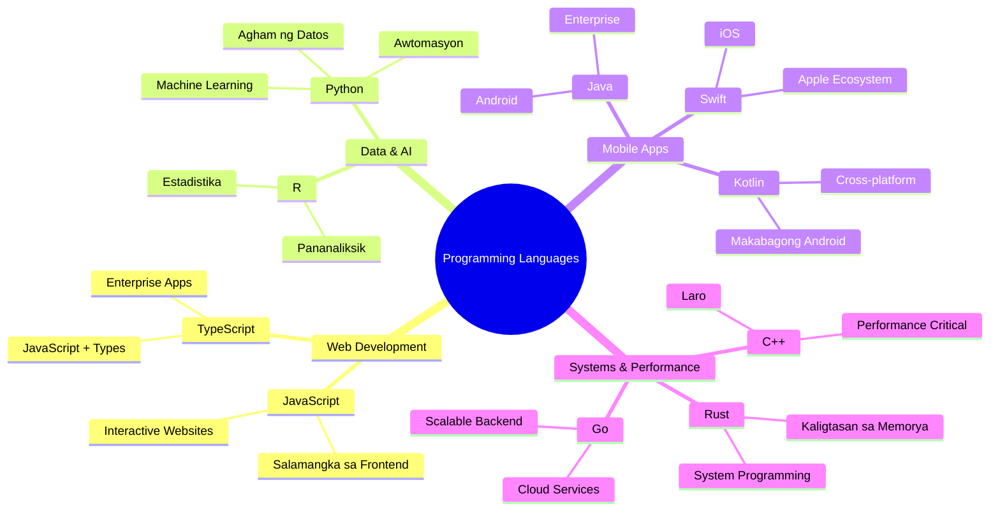
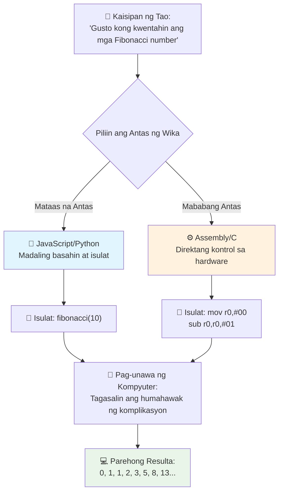
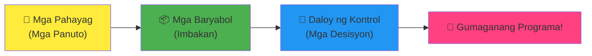
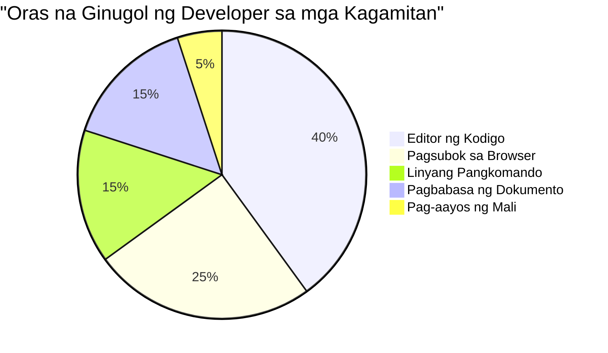
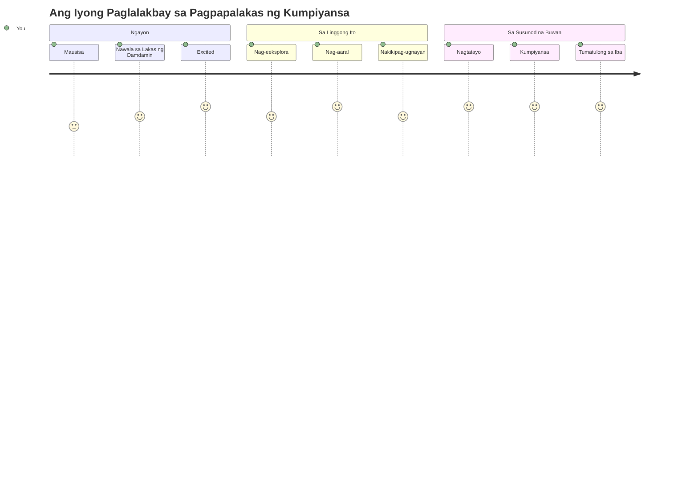

# Panimula sa Programming Languages at Modernong Developer Tools

Kumusta, hinaharap na developer! 👋 Pwede ba kitang sabihing isang bagay na nagpapamanhid sa akin araw-araw? Malapit mo nang matuklasan na ang programming ay hindi lang tungkol sa mga kompyuter – ito ay tungkol sa pagkakaroon ng tunay na mga superpowers para buhayin ang pinakakatiwang-tawang ideya mo!

Alam mo ba yung sandali kapag ginagamit mo ang paborito mong app at lahat ay perpektong nagkakasya? Kapag itinap mo ang isang button at may mangyaring isang bagay na kahima-himala na magpapasabi sa'yo ng, "wow, paano nila 'yun ginawa?" Aba, isang taong katulad mo – malamang nasa paboritong coffee shop niya ng alas-dos ng umaga na may pangatlong espresso – ang nagsulat ng code na gumawa ng magic na 'yon. At heto ang magpapakuha ng iyong hininga: sa pagtatapos ng aralin na ito, hindi lang mo mauunawaan kung paano nila ginawa iyon, kundi ikaw ay magkakaroon ng kagustuhang subukan ito mismo!

Tingnan mo, nauunawaan ko kung ang programming ay nakakatakot sa ngayon. Noong nagsimula ako, inisip ko talaga na kailangan mong maging isang math genius o kaya ay nagsimula ka nang mag-code mula pagkabata. Pero heto ang nagbago sa pananaw ko: ang programming ay katulad ng pag-aaral makipag-usap sa isang bagong wika. Nagsisimula ka sa "hello" at "thank you," pagkatapos ay hanggang sa umorder ng kape, at hindi mo namamalayan, nakikipag-usap ka na sa mga malalalim na pilosopikal na usapan! Pero sa kasong ito, nakikipag-usap ka sa mga kompyuter, at totoo? Sila ang pinakapasyenteng kasamahan sa usapan na makakasama mo – hindi nila hinuhusgahan ang iyong mga pagkakamali at palaging excited na subukan muli!

Ngayon, sisilipin natin ang mga kamangha-manghang tools na nagpapaganap ng modernong web development — hindi lang posible, kundi nakakaadik pa. Pinag-uusapan ko mismo ang mga eksaktong editors, browsers, at workflows na ginagamit ng mga developer sa Netflix, Spotify, at paborito mong indie app studio araw-araw. At heto ang bahagi na magpapasayaw sa'yo sa tuwa: karamihan sa mga professional-grade, industry-standard tools na ito ay ganap na libre!


> Sketchnote by [Tomomi Imura](https://twitter.com/girlie_mac)


```mermaid
journey
    title Ang Iyong Paglalakbay sa Programming Ngayon
    section Tuklasin
      Ano ang Programming: 5: You
      Mga Wika ng Programming: 4: You
      Pangkalahatang-ideya ng Mga Kasangkapan: 5: You
    section Galugarin
      Mga Editor ng Code: 4: You
      Mga Browser at DevTools: 5: You
      Command Line: 3: You
    section Magpraktis
      Language Detective: 4: You
      Pagsisiyasat ng Kasangkapan: 5: You
      Koneksyon sa Komunidad: 5: You
```
## Tingnan Natin Kung Ano Na ang Alam Mo!

Bago tayo sumabak sa mga masayang bahagi, nais kong malaman – ano na ba ang alam mo tungkol sa mundo ng programming? At pakinggan mo, kung tinitingnan mo ang mga tanong na ito at iniisip mong "Wala talaga akong alam dito," ayos lang 'yan, perpekto nga! Ibig sabihin, nasa tamang lugar ka. Isipin mo ang quiz na ito bilang pag-stretch bago mag-ehersisyo – nagpapainit lang tayo ng brain muscles!

[Take the pre-lesson quiz](https://ff-quizzes.netlify.app/web/)


## Ang Pakikipagsapalaran na Sasamahan Natin Ngayon

Okay, sobra akong excited sa kung ano ang ating susuriin ngayon! Seryoso, sana makita ko ang iyong reaksiyon kapag may mga konsepto na biglang lumalabas sa iyo. Heto ang kahanga-hangang paglalakbay na sasamahan natin:

- **Ano ba talaga ang programming (at bakit ito ang pinakakulit na bagay!)** – Tuklasin natin kung paano ang code ay literal na invisible magic na nagpapagana sa lahat ng bagay sa paligid mo, mula sa alarm na somehow alam na Lunes na ngayong umaga hanggang sa algorithm na perpektong pinipili ang mga rekomendasyon mo sa Netflix
- **Mga programming language at ang kanilang mga kamangha-manghang personalidad** – Isipin na pumapasok ka sa isang party kung saan bawat tao ay may iba't ibang superpowers at paraan ng paglutas ng problema. Ganyan ang mundo ng programming languages, at magugustuhan mo silang makilala!
- **Mga pangunahing sangkap na bumubuo ng digital magic** – Isipin mo ito bilang pinaka-kamangha-manghang LEGO set. Kapag naintindihan mo kung paano nag-uugnay ang mga piyesa, malalaman mong literally kayang itayo ang kahit ano na naiisip ng iyong imahinasyon
- **Mga propesyonal na tools na magpaparamdam sa'yo na para kang nabigyan ng wand ng wizard** – Hindi ako nagbibitiw ng drama dito – gagawing parang may superpowers ka talaga ng mga tools na ito, at ang pinakamahusay pa? Gamit din ito ng mga pro!

> 💡 **Heto ang mahalaga**: Huwag mo munang subukang tandaan ang lahat ngayon! Sa ngayon, gusto ko lang maramdaman mo ang spark ng excitement sa mga posibilidad. Kusang tatatak sa iyo ang mga detalye habang tayo ay nagsasanay nang magkasama – ganyan ang totoong pagkatuto!

> Pwede mong kunin ang araling ito sa [Microsoft Learn](https://learn.microsoft.com/en-us/learn/modules/web-development-101/introduction-programming/?WT.mc_id=academic-77807-sagibbon)!

## Ano Nga Ba Talaga ang Programming?

Sige, sagutin natin ang mahalagang tanong: ano ba talaga ang programming?

Ibibigay ko sa'yo ang isang kuwento na nagbago nang lubusan ng pananaw ko tungkol dito. Noong nakaraang linggo, sinubukan kong ipaliwanag sa nanay ko kung paano gamitin ang bagong smart TV remote namin. Napansin kong nasasabi ko ng mga katulad nito, "Pindutin ang pulang button, pero hindi yung malaking pulang button, yung maliit na pulang button sa kaliwa... hindi, yung kabila mong kaliwa... okay, hawakan mo ngayon ng dalawang segundo, hindi isa, hindi tiga..." Pamilyar ba ito? 😅

Iyan ang programming! Sining ng pagbibigay ng sobrang detalyadong mga hakbang-hakbang na tagubilin sa isang bagay na napakalakas ngunit kailangan ng lahat ng nasa detalye. Ngunit imbes na ipaliwanag mo ito sa nanay mo (na pwedeng magtanong ng "Aling pulang button?!"), ipinaliwanag mo ito sa kompyuter (na ginagawa lang ng eksakto ang sinasabi mo, kahit hindi mo ibig sabihin ng husto).

Hele, ito ang nagpahanga sa akin nang una kong matutunan ito: ang mga kompyuter ay talagang simple sa pinakapangunahing antas. Naiintindihan lang nila ang dalawa – 1 at 0, na halos "oo" at "hindi" o "bukas" at "patay." Iyon na lang! Ngunit dito nagiging mahika – hindi natin kailangang magsalita sa 1s at 0s na parang nasa The Matrix tayo. Dito pumapasok ang **programming languages** para tumulong. Sila ang parang pinakamahusay na tagapagsalin ng mundo na kinukuha ang iyong normal na mga ideya at isinasalin ito sa wika ng kompyuter.

At heto ang nagbibigay sa akin ng tunay na kilabot tuwing umaga pag gising ko: literal na *lahat* ng digital sa iyong buhay ay nagsimula sa isang tao na katulad mo, malamang nakaupo sa kanilang pajama na may tasa ng kape, nagtatype ng code sa kanilang laptop. Yung Instagram filter na nagpapaganda sayo? May gumawa niyan. Yung rekomendasyong nagdala sa'yo sa bagong paborito mong kanta? Ang developer ang gumawa ng algorithm na iyon. Yung app na tutulong sa'yo hatiin ang bayarin sa hapunan kasama ang mga kaibigan? Oo, may nag-isip ng "naiinis ako dito, kaya kaya kong ayusin ito" at nagawa!

Kapag natutunan mong mag-program, hindi ka lang natututo ng bagong kasanayan – nagiging bahagi ka ng isang kahanga-hangang komunidad ng mga tagalutas ng problema na ginugugol ang araw nila sa pag-iisip, "Paano kaya makabuo ako ng isang bagay na gagawing mas maganda ang araw ng isang tao?" Seryoso, may mas cool pa ba d'yan?

✅ **Fun Fact Hunt**: Heto ang isang napaka-cool na dapat mong hanapin kapag may libreng oras ka – sino kaya ang unang computer programmer sa mundo? Bibigyan kita ng hint: hindi ito yung inaasahan mo! Ang kuwento tungkol sa taong ito ay kamangha-mangha at nagpapakita na ang programming ay palaging tungkol sa malikhaing paglutas ng problema at pag-iisip sa labas ng kahon.

### 🧠 **Oras ng Check-in: Kumusta Ka Na?**

**Maglaan ng sandali at pag-isipan:**
- Naiintindihan mo na ba ang ideya ng "pagbibigay ng tagubilin sa mga kompyuter" ngayon?
- Ano ang isang araw-araw na gawain na gusto mong automate gamit ang programming?
- Ano ang mga tanong na sumisibol sa isipan mo tungkol sa programming?

> **Tandaan**: Normal lang kung medyo malabo pa ang ilang konsepto ngayon. Ang pag-aaral ng programming ay parang pag-aaral ng bagong wika – kailangan ng oras para mabuo ng utak mo ang mga neural pathways. Magaling ka na!

## Ang Programming Languages ay Parang Iba't Ibang Lasa ng Mahika

Okay, medyo kakaiba itong marinig, pero sundan mo lang ako – ang programming languages ay parang iba't ibang uri ng musika. Isipin mo: meron kang jazz na smooth at improbisasyonal, rock na makapangyarihan at direktang pakinggan, classical na elegante at may istruktura, at hip-hop na malikhain at ekspresibo. Ang bawat estilo ay may kanya-kanyang vibe, komunidad ng mahihilig, at tama para sa iba't ibang mood at okasyon.

Ganyan din ang pag-andar ng programming languages! Hindi mo gagamitin ang parehong wika para gumawa ng masayang mobile game na gagamitin mo naman sa pagproseso ng napakalaking datos ng klima, katulad ng di mo aawitin ang death metal sa yoga class (kahit karamihan ng yoga classes lang! 😄).

Pero ito ang palaging nagpapahanga sa akin tuwing naiisip ko ito: ang mga wikang ito ay parang may pinaka-pasyenteng, matalinong interpreter sa mundo na nakaupo sa tabi mo. Puwede mong ipahayag ang mga ideya mo sa paraan na natural sa tao mong utak, at sila ang humahawak sa napaka-komplikadong gawain ng pagsasalin nito sa 1s at 0s na talagang nauunawaan ng kompyuter. Parang may kaibigang dalubhasa sa parehong "human creativity" at "computer logic" – at hindi sila napapagod, hindi kailangan ng coffee breaks, at hindi ka hinuhusgahan kapag paulit-ulit mong tinanong ang parehong tanong!

### Mga Sikat na Programming Languages at Kanilang Gamit


```mermaid
mindmap
  root((Programming Languages))
    Web Development
      JavaScript
        Salamangka sa Frontend
        Interactive Websites
      TypeScript
        JavaScript + Types
        Enterprise Apps
    Data & AI
      Python
        Agham ng Datos
        Machine Learning
        Awtomasyon
      R
        Estadistika
        Pananaliksik
    Mobile Apps
      Java
        Android
        Enterprise
      Swift
        iOS
        Apple Ecosystem
      Kotlin
        Makabagong Android
        Cross-platform
    Systems & Performance
      C++
        Laro
        Performance Critical
      Rust
        Kaligtasan sa Memorya
        System Programming
      Go
        Cloud Services
        Scalable Backend
```
| Language | Pinakamainam Para sa | Bakit Ito Popular |
|----------|----------------------|-------------------|
| **JavaScript** | Web development, user interfaces | Tumatakbo sa browsers at nagpapatakbo ng interactive websites |
| **Python** | Data science, automation, AI | Madaling basahin at pag-aralan, maraming makapangyarihang libraries |
| **Java** | Enterprise applications, Android apps | Platform-independent, matibay para sa malalaking sistema |
| **C#** | Windows applications, game development | Malakas na suporta mula sa Microsoft ecosystem |
| **Go** | Cloud services, backend systems | Mabilis, simple, disenyo para sa modernong computing |

### High-Level vs. Low-Level Languages

Okay, ito ang konsepto na sumira sa utak ko nung una akong nagsimula, kaya ibabahagi ko ang analogy na sa wakas ay naintindihan ko – sana makatulong din ito sa'yo!

Isipin mong bumisita ka sa isang bansa kung saan hindi ka marunong magsalita ng wika, at desperado kang hanapin ang pinakamalapit na banyo (naranasan na nating lahat ito, 'di ba? 😅):

- **Low-level programming** ay parang pag-aaral ng lokal na dialekto nang husto upang makipag-usap sa lola na nagtitinda ng prutas na gumagamit ng mga lokal na salita, slang, at mga biro na tanging mga tunay na lumaki doon lang ang makakaintindi. Sobrang kahanga-hanga at epektibo... kung bihasa ka nga! Pero sobrang overwhelming kung ang hanap mo lang ay banyo.

- **High-level programming** ay parang may kamangha-manghang lokal na kaibigan na nakakaintindi sa'yo. Puwede mong sabihin sa plain English na "Kailangan ko talaga ng banyo," at siya ang hahawak sa pagsasalin ng kultura at pagbibigay ng direksyon sa paraang maiintindihan ng iyong utak na hindi lokal.

Sa programming:
- **Low-level languages** (tulad ng Assembly o C) ay nagbibigay daan sa'yo na magkaroon ng napakadetalyadong pag-uusap sa hardware ng kompyuter mismo, pero kailangan mong mag-isip na parang makina, at well, malaking mental shift 'yan!
- **High-level languages** (tulad ng JavaScript, Python, o C#) ay pinapayagan kang mag-isip gaya ng tao habang sila ang nag-aasikaso ng pagsasalita ng makina sa likod ng mga eksena. Bukod dito, may mga napaka-welcoming na komunidad ng mga tao na naaalala kung paano maging baguhan at talagang nais tumulong!

Hulaan mo kung alin ang ire-rekomenda kong simulang gamitin? 😉 Ang high-level languages ay parang may training wheels ka na ayaw mo nang tanggalin dahil ginagawa nitong mas masaya ang buong experience!


```mermaid
flowchart TB
    A["👤 Kaisipan ng Tao:<br/>'Gusto kong kwentahin ang mga Fibonacci number'"] --> B{Piliin ang Antas ng Wika}
    
    B -->|Mataas na Antas| C["🌟 JavaScript/Python<br/>Madaling basahin at isulat"]
    B -->|Mababang Antas| D["⚙️ Assembly/C<br/>Direktang kontrol sa hardware"]
    
    C --> E["📝 Isulat: fibonacci(10)"]
    D --> F["📝 Isulat: mov r0,#00<br/>sub r0,r0,#01"]
    
    E --> G["🤖 Pag-unawa ng Kompyuter:<br/>Tagasalin ang humahawak ng komplikasyon"]
    F --> G
    
    G --> H["💻 Parehong Resulta:<br/>0, 1, 1, 2, 3, 5, 8, 13..."]
    
    style C fill:#e1f5fe
    style D fill:#fff3e0
    style H fill:#e8f5e8
```
### Ipapakita Ko Sa Iyo Kung Bakit Mas Friendly ang High-Level Languages

Sige, ipapakita ko sa'yo ang isang bagay na malinaw na nagpapakita kung bakit na-in love ako sa high-level languages, pero bago iyon – kailangan mo munang pangako. Kapag nakita mo ang unang halimbawa ng code, huwag kang mag-panic! Nakakakita ito ng nakakatakot. Iyan ang eksaktong punto na gusto kong ipakita!

Titingnan natin ang parehong gawain na isinulat sa dalawang ganap na magkaibang estilo. Pareho nilang nililikha ang tinatawag na Fibonacci sequence – isang magandang pattern sa matematika kung saan ang bawat numero ay ang kabuuan ng dalawang nauna: 0, 1, 1, 2, 3, 5, 8, 13... (Fun fact: makikita mo ang pattern na ito kahit saan sa kalikasan – sa spiral ng mga sunflower seeds, pattern ng mga pinecones, pati sa pagkabuo ng mga galaxy!)

Handa ka nang makita ang pagkakaiba? Tara!

**High-level language (JavaScript) – Madaling maintindihan:**

```javascript
// Hakbang 1: Pangunahing pagsasaayos ng Fibonacci
const fibonacciCount = 10;
let current = 0;
let next = 1;

console.log('Fibonacci sequence:');
```

**Ito ang ginagawa ng code na ito:**
- **Nagdeklara** ng constant para tukuyin kung ilang Fibonacci numbers ang gustong gawin
- **Nag-initialize** ng dalawang variables para subaybayan ang kasalukuyan at susunod na numero sa sequence
- **Nagdagdag** ng panimulang halaga (0 at 1) na tumutukoy sa Fibonacci pattern
- **Nagpakita** ng header message para malaman ang output

```javascript
// Hakbang 2: Bumuo ng sunod-sunod gamit ang loop
for (let i = 0; i < fibonacciCount; i++) {
  console.log(`Position ${i + 1}: ${current}`);
  
  // Kalkulahin ang susunod na numero sa sunod-sunod
  const sum = current + next;
  current = next;
  next = sum;
}
```

**Paglabag sa mga nangyayaring ito:**
- **Ulit-ulitin** ang bawat posisyon sa sequence gamit ang `for` loop
- **Ipakita** ang bawat numero kasama ang posisyon gamit ang template literal formatting
- **Kalkulahin** ang susunod na Fibonacci number sa pagdaragdag ng kasalukuyan at susunod na halaga
- **I-update** ang mga variable na sumusubaybay upang lumipat sa susunod na iteration

```javascript
// Hakbang 3: Makabagong functional na pamamaraan
const generateFibonacci = (count) => {
  const sequence = [0, 1];
  
  for (let i = 2; i < count; i++) {
    sequence[i] = sequence[i - 1] + sequence[i - 2];
  }
  
  return sequence;
};

// Halimbawa ng paggamit
const fibSequence = generateFibonacci(10);
console.log(fibSequence);
```

**Sa itaas, ginawa natin:**
- **Gumawa** ng reusable na function gamit ang modernong arrow function syntax
- **Nagtayo** ng array para i-store ang buong sequence sa halip na ipakita isa-isa
- **Ginamit** ang array indexing para kalkulahin ang bawat bagong numero mula sa mga naunang halaga
- **Ibinalik** ang buong sequence para sa flexible na paggamit sa ibang bahagi ng programa natin

**Low-level language (ARM Assembly) – Para sa kompyuter:**

```assembly
 area ascen,code,readonly
 entry
 code32
 adr r0,thumb+1
 bx r0
 code16
thumb
 mov r0,#00
 sub r0,r0,#01
 mov r1,#01
 mov r4,#10
 ldr r2,=0x40000000
back add r0,r1
 str r0,[r2]
 add r2,#04
 mov r3,r0
 mov r0,r1
 mov r1,r3
 sub r4,#01
 cmp r4,#00
 bne back
 end
```

Pansinin kung paano ang JavaScript version ay halos parang English instructions habang ang Assembly version ay gumagamit ng mga cryptic na command na direktang kumokontrol sa processor ng kompyuter. Parehong nagagawa ang parehong gawain, pero ang high-level language ay mas madali maintindihan, isulat, at i-maintain ng mga tao.

**Pangunahing pagkakaiba na mapapansin mo:**
- **Nababasa nang madali**: Gumagamit ang JavaScript ng mga naglalarawang pangalan tulad ng `fibonacciCount` habang ang Assembly ay gumagamit ng cryptic na mga label tulad ng `r0`, `r1`
- **Mga Komento**: Hinikayat ng mga high-level na wika ang mga paliwanag na komento na nagpapadokumentaryo sa code mismo
- **Estruktura**: Ang lohikal na daloy ng JavaScript ay tumutugma sa paraan ng pag-iisip ng mga tao ng sunud-sunod na hakbang ng problema
- **Pagpapanatili**: Ang pag-update ng bersyon ng JavaScript para sa iba't ibang mga pangangailangan ay diretso at malinaw

✅ **Tungkol sa Fibonacci sequence**: Ang kahanga-hangang pattern na numerong ito (kung saan ang bawat numero ay katumbas ng suma ng dalawang nauna nito: 0, 1, 1, 2, 3, 5, 8...) ay literal na makikita *kahit saan* sa kalikasan! Makikita mo ito sa mga spiral ng sunflower, pattern ng pinecone, paraan ng pagkakurba ng nautilus shell, at maging sa paraan ng paglaki ng mga sanga ng puno. Nakakamangha kung paano makatutulong ang matematika at code upang maunawaan at makalikha muli ng mga pattern na ginagamit ng kalikasan para lumikha ng kagandahan!

## Ang Mga Pangunahing Bahagi na Nagbibigay ng Salamangka

Sige, ngayon na nakita mo na kung ano ang hitsura ng mga programming language sa aksyon, pag-usapan natin ang mga pundamental na bahagi ng halos bawat programang naisulat kailanman. Isipin mo ito bilang mga mahalagang sangkap sa iyong paboritong ulam – kapag naintindihan mo kung ano ang ginagawa ng bawat isa, magagawa mong magbasa at magsulat ng code sa halos anumang wika!

Para itong pag-aaral ng gramatika ng programming. Naalala mo noong nasa paaralan ka pa at natutunan ang tungkol sa mga pangngalan, pandiwa, at kung paano gumawa ng mga pangungusap? Ang programming ay may sarili nitong bersyon ng gramatika, at sa totoo lang, mas lohikal at maawain ito kumpara sa gramatika ng Ingles! 😄

### Mga Pahayag: Mga Hakbang-hakbang na Tagubilin

Simulan natin sa **mga pahayag** – parang mga indibidwal na pangungusap sa isang pag-uusap sa iyong computer. Bawat pahayag ay nagsasabi sa computer na gawin ang isang partikular na bagay, parang nagbibigay ng mga direksyon: "Lumiko ka sa kaliwa dito," "Huminto sa pulang ilaw," "Mag-park sa lugar na iyon."

Ang gusto ko sa mga pahayag ay ang karaniwang pagiging madaling basahin nila. Tingnan mo ito:

```javascript
// Mga pangunahing pahayag na nagsasagawa ng iisang aksyon
const userName = "Alex";                    
console.log("Hello, world!");              
const sum = 5 + 3;                         
```
  
**Ganito ang ginagawa ng code na ito:**  
- **Magdeklara** ng isang constant variable para sa pangalan ng user  
- **Ipakita** ang greeting message sa console output  
- **Kalkulahin** at iimbak ang resulta ng isang matematikal na operasyon  

```javascript
// Mga pahayag na nakikipag-ugnayan sa mga pahina ng web
document.title = "My Awesome Website";      
document.body.style.backgroundColor = "lightblue";
```
  
**Sunod-sunod, ito ang nangyayari:**  
- **Baguhin** ang pamagat ng webpage na nakikita sa browser tab  
- **Palitan** ang kulay ng background ng buong katawan ng pahina  

### Mga Variable: Sistema ng Memorya ng Iyong Programa

O sige, ang **mga variable** ay isa sa mga paborito kong konsepto na ituro dahil talagang parang mga bagay na ginagamit mo na araw-araw!

Isipin mo ang listahan ng kontak sa iyong telepono. Hindi mo kailangang alalahanin ang bawat numero ng telepono – sa halip, sine-save mo ang "Nanay," "Pinakamatalik na Kaibigan," o "Pizza Place That Delivers Until 2 AM" at hinahayaan mong alalahanin ng iyong telepono ang aktwal na mga numero. Ganon din ang mga variable! Mga lalagyan na may label kung saan pwedeng mag-imbak ng impormasyon ang iyong programa at kunin ito mamaya gamit ang pangalang madaling maintindihan.

Ang talagang astig dito: maaaring magbago ang mga variable habang tumatakbo ang iyong programa (kaya 'variable' ang pangalan – nakikita mo?). Parang pag-update mo ng contact sa pizza place kapag may mas magandang napuntahan, puwedeng baguhin ang mga variable habang natututo ang programa ng bagong impormasyon o nagbabago ang mga sitwasyon!

Ipakikita ko sa'yo kung gaano ito kapadaling gawin:

```javascript
// Hakbang 1: Gumagawa ng mga pangunahing variable
const siteName = "Weather Dashboard";        
let currentWeather = "sunny";               
let temperature = 75;                       
let isRaining = false;                      
```
  
**Pag-unawa sa mga konseptong ito:**  
- **Imbak** ang mga hindi nagbabagong halaga gamit ang `const` variables (tulad ng pangalan ng site)  
- **Gamitin** ang `let` para sa mga halagang puwedeng magbago habang tumatakbo ang programa  
- **Mag-assign** ng iba't ibang uri ng data: strings (teksto), numero, at boolean (true/false)  
- **Pumili** ng mga naglalarawang pangalan na nagpapaliwanag kung ano ang nilalaman ng bawat variable  

```javascript
// Hakbang 2: Paggawa sa mga object para pagsamahin ang magkakaugnay na datos
const weatherData = {                       
  location: "San Francisco",
  humidity: 65,
  windSpeed: 12
};
```
  
**Sa itaas, ginawa natin:**  
- **Lumikha** ng isang object para pagsamahin ang mga kaugnay na impormasyon ng weather  
- **Iayos** ang maraming piraso ng data sa ilalim ng iisang pangalan ng variable  
- **Gamitin** ang mga key-value pairs para malinaw na pangalanan ang bawat bahagi ng impormasyon  

```javascript
// Hakbang 3: Paggamit at pag-update ng mga variable
console.log(`${siteName}: Today is ${currentWeather} and ${temperature}°F`);
console.log(`Wind speed: ${weatherData.windSpeed} mph`);

// Pag-update ng mga nababagong variable
currentWeather = "cloudy";                  
temperature = 68;                          
```
  
**Unawain natin bawat bahagi:**  
- **Ipakita** ang impormasyon gamit ang template literals na may `${}` syntax  
- **I-access** ang mga property ng object gamit ang dot notation (`weatherData.windSpeed`)  
- **I-update** ang mga variable na dineklara gamit ang `let` para ipakita ang nagbabagong kalagayan  
- **Pagsamahin** ang maraming variable para makalikha ng makahulugang mga mensahe  

```javascript
// Hakbang 4: Modernong destructuring para sa mas malinis na kodigo
const { location, humidity } = weatherData; 
console.log(`${location} humidity: ${humidity}%`);
```
  
**Mga kailangang malaman:**  
- **I-extract** ang mga espesyal na property mula sa mga object gamit ang destructuring assignment  
- **Lumikha** ng mga bagong variable nang awtomatiko gamit ang mga parehong pangalan tulad ng mga key ng object  
- **Papasimplehin** ang code sa pamamagitan ng pag-iwas sa paulit-ulit na dot notation  

### Control Flow: Pagtuturo sa Iyong Programa na Mag-isip

Sige, dito talagang nakakamangha ang programming! Ang **control flow** ay parang pagtuturo sa iyong programa kung paano gumawa ng matalinong mga desisyon, katulad ng ginagawa mo araw-araw kahit hindi mo iniisip.

Isipin mo ito: kaninang umaga marahil nag-isip ka ng mga katulad nito, "Kung umuulan, kukuha ako ng payong. Kung malamig, magsusuot ako ng jacket. Kung nahuhuli ako, hindi na ako kakain ng almusal at kukuha na lang ng kape sa daan." Natural na sinusunod ng iyong utak ang ganitong if-then logic nang maraming beses bawat araw!

Ito ang dahilan kung bakit parang may katalinuhan ang mga programa at hindi lang sumusunod sa nakababagot, predictable na script. Kaya nilang tingnan ang sitwasyon, suriin ang nangyayari, at tumugon ng naaayon. Parang binibigyan mo ang iyong programa ng utak na kaya nitong mag-adapt at gumawa ng mga pagpili!

Gusto mo bang makita kung gaano ito kaganda gumana? Ipakikita ko sa’yo:

```javascript
// Hakbang 1: Pangunahing lohika ng kundisyon
const userAge = 17;

if (userAge >= 18) {
  console.log("You can vote!");
} else {
  const yearsToWait = 18 - userAge;
  console.log(`You'll be able to vote in ${yearsToWait} year(s).`);
}
```
  
**Ganito ang ginagawa ng code na ito:**  
- **Suriin** kung ang edad ng user ay sapat na para bumoto  
- **Isakatuparan** ang iba't ibang mga block ng code depende sa resulta ng kondisyon  
- **Kalkulahin** at ipakita kung gaano katagal hanggang maging karapat-dapat sa pagboto kung wala pa sa 18  
- **Magbigay** ng tiyak at kapaki-pakinabang na feedback para sa bawat scenario  

```javascript
// Hakbang 2: Maramihang mga kondisyon gamit ang mga lohikal na operator
const userAge = 17;
const hasPermission = true;

if (userAge >= 18 && hasPermission) {
  console.log("Access granted: You can enter the venue.");
} else if (userAge >= 16) {
  console.log("You need parent permission to enter.");
} else {
  console.log("Sorry, you must be at least 16 years old.");
}
```
  
**Suriin natin kung ano ang nangyayari dito:**  
- **Pagsamahin** ang maraming kondisyon gamit ang `&&` (at) operator  
- **Gumawa** ng hierarchy ng mga kondisyon gamit ang `else if` para sa iba't ibang mga scenario  
- **Hawakan** ang lahat ng posibleng kaso gamit ang huling `else` na pahayag  
- **Magbigay** ng malinaw at maaksyong feedback para sa bawat ibang sitwasyon  

```javascript
// Hakbang 3: Maikling kondisyon gamit ang ternary operator
const votingStatus = userAge >= 18 ? "Can vote" : "Cannot vote yet";
console.log(`Status: ${votingStatus}`);
```
  
**Kailangang tandaan:**  
- **Gamitin** ang ternary operator (`? :`) para sa simpleng dalawang-opisyong mga kondisyon  
- **Isulat** ang kondisyon muna, sinusundan ng `?`, pagkatapos ang true result, pagkatapos ay `:`, at pagkatapos ang false result  
- **I-apply** ang pattern na ito kapag kailangan mong mag-assign ng halaga base sa mga kondisyon  

```javascript
// Hakbang 4: Paghawak ng maraming partikular na kaso
const dayOfWeek = "Tuesday";

switch (dayOfWeek) {
  case "Monday":
  case "Tuesday":
  case "Wednesday":
  case "Thursday":
  case "Friday":
    console.log("It's a weekday - time to work!");
    break;
  case "Saturday":
  case "Sunday":
    console.log("It's the weekend - time to relax!");
    break;
  default:
    console.log("Invalid day of the week");
}
```
  
**Nagagawa ng code na ito:**  
- **Itugma** ang halaga ng variable sa maraming tiyak na kaso  
- **I-grupo** ang magkatulad na mga kaso (mga araw sa trabaho vs. weekend)  
- **Isagawa** ang angkop na block ng code kapag may nahanap na tugma  
- **Isama** ang `default` na kaso para hawakan ang hindi inaasahang mga halaga  
- **Gamitin** ang mga `break` na pahayag upang pigilan ang code na magpatuloy sa susunod na kaso  

> 💡 **Halimbawa mula sa totoong mundo**: Isipin ang control flow na parang pinaka-mapagpasensyang GPS sa mundo na nagbibigay sa'yo ng mga direksyon. Sabi nito, "Kung may traffic sa Main Street, dumaan ka na lang sa highway. Kung may konstruksiyon na sumasakop sa highway, subukan mo ang tanawin na ruta." Ginagamit ng mga programa ang eksaktong ganitong conditional logic upang tumugon nang matalino sa mga iba't ibang sitwasyon at palaging ibigay ang pinakamahusay na karanasan sa mga gumagamit.

### 🎯 **Pagsusulit sa Konsepto: Pagsasanay ng Mga Pangunahing Bahagi**

**Tingnan natin kung paano mo nauunawaan ang mga pundasyon:**  
- Kaya mo bang ipaliwanag ang pagkakaiba ng variable at pahayag gamit ang sarili mong salita?  
- Mag-isip ng tunay na sitwasyon kung saan gagamitin mo ang if-then decision (tulad ng halimbawa tungkol sa pagboto)  
- Ano ang isang bagay tungkol sa lohika ng programming na ikinagulat mo?  

**Mabilis na pampalakas ng loob:**  

```mermaid
flowchart LR
    A["📝 Mga Pahayag<br/>(Mga Panuto)"] --> B["📦 Mga Baryabol<br/>(Imbakan)"] --> C["🔀 Daloy ng Kontrol<br/>(Mga Desisyon)"] --> D["🎉 Gumaganang Programa!"]
    
    style A fill:#ffeb3b
    style B fill:#4caf50
    style C fill:#2196f3
    style D fill:#ff4081
```  
✅ **Ano ang susunod na darating**: Magkakaroon tayo ng malaking saya habang lalalim pa tayo sa mga konseptong ito habang nagpapatuloy ang ating kamangha-manghang paglalakbay! Sa ngayon, ituon mo muna ang sarili sa excitement tungkol sa lahat ng mga kamangha-manghang posibilidad na naghihintay sa'yo. Kusang matututunan ang mga espesipikong kasanayan at teknik habang magkasama tayong nagsasanay – nangangako ako na magiging mas masaya ito kaysa sa inaasahan mo!

## Mga Kagamitan sa Trabaho

Sige, dito na talaga ako nagiging sobrang excited na halos hindi ko na mapigilan ang sarili ko! 🚀 Pag-uusapan natin ang mga kahanga-hangang kagamitan na magpaparamdam sa'yo na parang nabigyan ka ng susi sa isang digital na spaceship.

Alam mo kung paano ang chef ay may mga perpektong balanse na kutsilyo na parang bahagi na ng kanilang mga kamay? O kung paanong ang isang musikero ay may gitarang parang kumakanta sa galaw lamang ng kanilang kamay? Sa mga developer, meron kaming sariling bersyon ng mga ganitong mahikang kagamitan, at ito ang magpapahanga sa’yo nang labis – karamihan sa mga ito ay libre!

Halos tumatalon ako sa upuan sa saya na maibahagi ito sa'yo dahil binago nito nang husto kung paano tayo bumubuo ng software. Pinag-uusapan natin ang mga AI-powered na katuwang sa pagsulat ng code (hindi ako nagbibiro!), mga cloud environments kung saan maaari kang bumuo ng buong applications mula sa kahit saan basta may Wi-Fi, at mga debugging tools na sobrang sopistikado na parang may X-ray vision ka para sa iyong mga programa.

At ito ang bahagi na nagpapahanga sa akin: hindi ito mga "kagamitan para sa nagsisimula" na lalampasan mo lang. Ito ang eksaktong mga professional-grade na kagamitan na ginagamit ng mga developer sa Google, Netflix, at sa indie app studio na paborito mo sa kasalukuyan. Parang sobra kang magiging propesyonal sa paggamit nila!


```mermaid
graph TD
    A["💡 Ang Iyong Ideya"] --> B["⌨️ Code Editor<br/>(VS Code)"] 
    B --> C["🌐 Browser DevTools<br/>(Pagsusuri at Pag-debug)"]
    C --> D["⚡ Command Line<br/>(Awtomasyon at Mga Kasangkapan)"]
    D --> E["📚 Dokumentasyon<br/>(Pagkatuto at Sanggunian)"]
    E --> F["🚀 Kamangha-manghang Web App!"]
    
    B -.-> G["🤖 AI Assistant<br/>(GitHub Copilot)"]
    C -.-> H["📱 Pagsusuri ng Device<br/>(Responsive Design)"]
    D -.-> I["📦 Package Managers<br/>(npm, yarn)"]
    E -.-> J["👥 Komunidad<br/>(Stack Overflow)"]
    
    style A fill:#fff59d
    style F fill:#c8e6c9
    style G fill:#e1f5fe
    style H fill:#f3e5f5
    style I fill:#ffccbc
    style J fill:#e8eaf6
```  
### Mga Code Editor at IDE: Mga Bagong Digital na Kaibigan Mo

Pag-usapan natin ang mga code editor – ito talaga ang magiging bagong paborito mong lugar na titirhan! Isipin mo ito bilang iyong personal na sanctuary sa coding kung saan mo ginugugol ang karamihan ng oras mo sa paglikha at pagpapahusay ng iyong mga digital na likha.

Ngunit ang talagang mahika ng mga modernong editor: hindi lang sila basta mga magandang text editor. Parang may pinakamahusay na sumusuportang mentor sa coding na nakaupo lang sa tabi mo 24/7. Nahuhuli nila ang iyong mga typo bago mo pa mapansin, nagmumungkahi ng mga pag-ayos na magpapagawa sa'yo na parang henyo, tinutulungan kang maintindihan kung ano ang ginagawa ng bawat bahagi ng code, at may ilan na maaari pang hulaan kung ano ang susulat mo at nag-aalok na tapusin ang mga naiisip mo!

Naalala ko noong unang beses kong natuklasan ang auto-completion – ang pakiramdam ko ay para akong nasa hinaharap. Sisimulan mo lang magsulat, saka sasabihin ng editor, "Uy, ito ba ang function na iniisip mo na gumagawa ng eksaktong kailangan mo?" Parang may reader ng isip bilang coding buddy mo!

**Ano ang gumagawa sa mga editor na ito na kamangha-mangha?**

Nag-aalok ang mga modernong code editor ng kahanga-hangang mga katangian na idinisenyo para mapabilis ang iyong produktibidad:

| Katangian | Ano ang Ginagawa Nito | Bakit Ito Nakakatulong |  
|---------|--------------|--------------|  
| **Syntax Highlighting** | Kulayan ang iba't ibang bahagi ng iyong code | Ginagawa itong mas madaling basahin at tuklasin ang mga error |  
| **Auto-completion** | Nagmumungkahi ng code habang nagsusulat ka | Pinapabilis ang coding at binabawasan ang typo |  
| **Debugging Tools** | Tinutulungan kang mahanap at ayusin ang mga error | Nagtitipid ng oras sa pag-troubleshoot |  
| **Extensions** | Nagdaragdag ng mga specialized na feature | Inaangkop ang iyong editor para sa anumang teknolohiya |  
| **AI Assistants** | Nagmumungkahi ng code at paliwanag | Pinapabilis ang pagkatuto at produktibidad |  

> 🎥 **Video Resource**: Gusto mo bang makita ang mga gamit na ito sa aksyon? Tignan ang [Tools of the Trade video](https://youtube.com/watch?v=69WJeXGBdxg) para sa isang komprehensibong overview.

#### Mga Inirekomendang Editor para sa Web Development

**[Visual Studio Code](https://code.visualstudio.com/?WT.mc_id=academic-77807-sagibbon)** (Libre)  
- Pinaka-popular sa mga web developer  
- Mahusay na ecosystem ng extension  
- Built-in na terminal at Git integration  
- **Mga kailangang extension**:  
  - [GitHub Copilot](https://marketplace.visualstudio.com/items?itemName=GitHub.copilot) - AI-powered na mga mungkahing code  
  - [Live Share](https://marketplace.visualstudio.com/items?itemName=MS-vsliveshare.vsliveshare) - Kooperasyon sa real-time  
  - [Prettier](https://marketplace.visualstudio.com/items?itemName=esbenp.prettier-vscode) - Automatic na pag-format ng code  
  - [Code Spell Checker](https://marketplace.visualstudio.com/items?itemName=streetsidesoftware.code-spell-checker) - Tagahanap ng typo sa code  

**[JetBrains WebStorm](https://www.jetbrains.com/webstorm/)** (Bayad, libre para sa mga estudyante)  
- Advanced na debugging at testing tools  
- Matalinong auto completion ng code  
- Built-in na version control  

**Cloud-Based IDEs** (Iba't ibang presyo)  
- [GitHub Codespaces](https://github.com/features/codespaces) - Buong VS Code sa browser mo  
- [Replit](https://replit.com/) - Magaling para sa pag-aaral at pagbabahagi ng code  
- [StackBlitz](https://stackblitz.com/) - Instant, full-stack na web development  

> 💡 **Tip sa Pagsisimula**: Magsimula sa Visual Studio Code – libre ito, malawak ang paggamit sa industriya, at may malaking komunidad na gumagawa ng mga kapaki-pakinabang na tutorial at extension.

### Mga Web Browser: Iyong Sekretong Laboratoryo sa Pag-unlad

O sige, maghanda kang ma-wow nang husto! Alam mo kung paano mo ginagamit ang mga browser para mag-scroll sa social media at manood ng mga video? Ito pala ay itinago ang isang kahanga-hangang sekretong laboratoryo para sa mga developer na buong panahon ay naghihintay lang na madiskubre mo!

Tuwing nag-right-click ka sa isang webpage at pinili ang "Inspect Element," binubuksan mo ang isang nakatagong mundo ng mga developer tools na tunay na mas makapangyarihan kaysa sa ilang mahal na software na dating binabayaran ko ng daan-daang dolyar. Para itong matuklasan na ang karaniwan mong kusina ay may itinatagong propesyonal na laboratoryo ng chef sa likod ng isang lihim na panel!
Nang unang ipakita sa akin ng isang tao ang browser DevTools, ginugol ko ang halos tatlong oras na nagki-click lang at nagsabing "HINTAY, KAYA NITO YAN?!" Literal mong ma-e-edit ang kahit anong website nang real-time, makita kung gaano kabilis mag-load ang lahat, subukan kung paano itsura ang site mo sa iba't ibang device, at maging debug ang JavaScript na parang pro na talaga. Talagang nakakagulat!

**Ito ang dahilan kung bakit browsers ang iyong lihim na sandata:**

Kapag gumawa ka ng website o web application, kailangan mong makita kung paano ito itsura at asal sa totoong mundo. Hindi lang ipinapakita ng browsers ang iyong gawa, nagbibigay din ito ng detalyadong feedback tungkol sa performance, accessibility, at mga posibleng isyu.

#### Browser Developer Tools (DevTools)

Kasama sa mga modernong browser ang kumpletong development suites:

| Tool Category | Ano ang Ginagawa Nito | Halimbawa ng Paggamit |
|---------------|----------------------|----------------------|
| **Element Inspector** | Tingnan at i-edit ang HTML/CSS nang real-time | Ayusin ang estilo para makita agad ang resulta |
| **Console** | Tingnan ang mga error message at subukan ang JavaScript | I-debug ang mga problema at magsubok ng code |
| **Network Monitor** | Subaybayan kung paano naglo-load ang mga resources | I-optimize ang performance at oras ng pag-load |
| **Accessibility Checker** | Subukan ang inclusive design | Siguraduhing gumagana ang site para sa lahat ng user |
| **Device Simulator** | Tingnan sa iba't ibang sukat ng screen | Subukan ang responsive design nang hindi nangangailangan ng maraming device |

#### Mga Inirerekomendang Browser para sa Development

- **[Chrome](https://developers.google.com/web/tools/chrome-devtools/)** - Industry-standard DevTools na may malawak na dokumentasyon
- **[Firefox](https://developer.mozilla.org/docs/Tools)** - Napakahusay sa CSS Grid at accessibility tools
- **[Edge](https://docs.microsoft.com/microsoft-edge/devtools-guide-chromium/?WT.mc_id=academic-77807-sagibbon)** - Naka-base sa Chromium na may mga developer resources ng Microsoft

> ⚠️ **Mahalagang Tip sa Pagsusuri**: Palaging subukan ang iyong mga website sa maraming browser! Ang gumagana nang perpekto sa Chrome ay maaaring magmukhang iba sa Safari o Firefox. Sinusubukan ng mga propesyonal na developer sa lahat ng pangunahing browser para siguraduhin ang consistent na karanasan.

### Mga Command Line Tools: Ang Iyong Gate papuntang Developer Superpowers

Sige, magkaroon tayo ng isang tapat na usapan tungkol sa command line, dahil gusto kong marinig mo ito mula sa isang taong tunay na nakakaintindi. Nang una kong makita ito – yung nakakatakot na itim na screen na kumikislap ang text – literal kong inisip, "Hindi, hindi talaga! Para ito sa pelikula ng hacker noong 1980s, at hindi ako sapat ang talino para dito!" 😅

Pero heto ang gusto kong sana ay nasabi sa akin noon, at ngayon sinasabi ko sa iyo: hindi nakakatakot ang command line – parang isang direktang pag-uusap mo sa iyong computer ito. Isipin mo ito na parang pagkakaiba ng pag-order ng pagkain sa isang fancy na app na may mga larawan at menu (na madali at maganda) kumpara sa pagpasok mo sa paborito mong local na kainan kung saan kilala ng chef ang gusto mo at kayang lutuin agad ang espesyal na sorpresa sa sinabi mo lang na "surprise me with something amazing."

Dito sa command line pumupunta ang mga developer para maramdaman ang kanilang kapangyarihan. Magta-type ka lang ng ilang tila mahiwagang salita (okay, mga command lang sila, pero parang mahiwaga!), pindutin ang enter, at BOOM – nakagawa ka na ng buong project structure, naka-install ng mga makapangyarihang tools mula sa buong mundo, o nailunsad ang app mo sa internet para makita ng milyun-milyong tao. Kapag natikman mo na ang kapangyarihang iyon, adik ka na talaga!

**Bakit magiging paborito mong tool ang command line:**

Habang maganda ang graphical interfaces para sa maraming gawain, nangingibabaw ang command line sa automation, katumpakan, at bilis. Maraming development tools ang gumagana gamit ang command line interfaces, at ang pag-aaral gamitin ito nang mahusay ay makakapagpataas nang husto ng iyong produktibidad.

```bash
# Hakbang 1: Gumawa at mag-navigate sa direktoryo ng proyekto
mkdir my-awesome-website
cd my-awesome-website
```

**Ano ang ginagawa ng code na ito:**
- **Gumawa** ng bagong direktoryo na tinatawag na "my-awesome-website" para sa iyong proyekto
- **Pumaroon** sa bagong likhang direktoryo para simulan ang trabaho

```bash
# Hakbang 2: I-initialize ang proyekto gamit ang package.json
npm init -y

# Mag-install ng mga modernong kasangkapan sa pag-develop
npm install --save-dev vite prettier eslint
npm install --save-dev @eslint/js
```

**Hakbang-hakbang, ganito ang nangyayari:**
- **I-initialize** ang bagong Node.js project gamit ang default na settings gamit ang `npm init -y`
- **I-install** ang Vite bilang modernong build tool para sa mabilis na development at production builds
- **Idagdag** ang Prettier para sa automatic na pag-format ng code at ESLint para sa pagsusuri ng kalidad ng code
- **Gamitin** ang flag na `--save-dev` para markahan ito bilang development-only na dependencies

```bash
# Hakbang 3: Gumawa ng istruktura ng proyekto at mga file
mkdir src assets
echo '<!DOCTYPE html><html><head><title>My Site</title></head><body><h1>Hello World</h1></body></html>' > index.html

# Simulan ang development server
npx vite
```

**Sa itaas, ginawa namin ang mga sumusunod:**
- **Inayos** ang proyekto sa pamamagitan ng paggawa ng hiwalay na folders para sa source code at assets
- **Nagawa** ng basic na HTML file na may tamang istruktura ng dokumento
- **Sinimulan** ang Vite development server para sa live reloading at hot module replacement

#### Mahahalagang Command Line Tools para sa Web Development

| Tool | Layunin | Bakit Kailangan Mo Ito |
|------|---------|-----------------------|
| **[Git](https://git-scm.com/)** | Version control | Subaybayan ang mga pagbabago, makipagtulungan, at backup ang trabaho |
| **[Node.js & npm](https://nodejs.org/)** | JavaScript runtime at package management | Patakbuhin ang JavaScript sa labas ng browser, i-install ang modernong development tools |
| **[Vite](https://vitejs.dev/)** | Build tool at dev server | Napakabilis na development na may hot module replacement |
| **[ESLint](https://eslint.org/)** | Kalidad ng code | Awtomatikong hanapin at ayusin ang mga problema sa iyong JavaScript |
| **[Prettier](https://prettier.io/)** | Pag-format ng code | Panatilihing konsistent ang format at nababasang mabuti ang code |

#### Mga Platform-Specific na Opsyon

**Windows:**
- **[Windows Terminal](https://docs.microsoft.com/windows/terminal/?WT.mc_id=academic-77807-sagibbon)** - Moderno at maraming feature na terminal
- **[PowerShell](https://docs.microsoft.com/powershell/?WT.mc_id=academic-77807-sagibbon)** 💻 - Malakas na scripting environment
- **[Command Prompt](https://docs.microsoft.com/windows-server/administration/windows-commands/?WT.mc_id=academic-77807-sagibbon)** 💻 - Tradisyunal na Windows command line

**macOS:**
- **[Terminal](https://support.apple.com/guide/terminal/)** 💻 - Built-in na terminal application
- **[iTerm2](https://iterm2.com/)** - Pinalawak na terminal na may advanced features

**Linux:**
- **[Bash](https://www.gnu.org/software/bash/)** 💻 - Standard na Linux shell
- **[KDE Konsole](https://docs.kde.org/trunk5/en/konsole/konsole/index.html)** - Advanced na terminal emulator

> 💻 = Pre-installed sa operating system

> 🎯 **Learning Path**: Magsimula sa mga basic command tulad ng `cd` (palitan ng directory), `ls` o `dir` (ipakita ang mga files), at `mkdir` (gumawa ng folder). Mag-ensayo gamit ang modernong workflow commands gaya ng `npm install`, `git status`, at `code .` (bubuksan ang kasalukuyang directory sa VS Code). Kapag naging komportable ka na, natural mong matututunan ang mas advanced na mga command at automation techniques.

### Dokumentasyon: Ang Iyong Laging Nariyan na Learning Mentor

Sige, ibabahagi ko sa iyo ang isang maliit na sikreto na magpapagaan ng loob mo bilang isang baguhan: kahit ang pinaka-experienced na developer ay gumugugol ng malaking bahagi ng kanilang oras sa pagbabasa ng dokumentasyon. At hindi ito dahil hindi nila alam ang ginagawa nila – ito ay palatandaan ng karunungan!

Isipin ang dokumentasyon na parang may access ka sa mga pinakapasyenteng at madalas sanang mga guro na available 24/7. Nabarahan ka ng problema sa alas-dos ng madaling araw? Naroon ang dokumentasyon na may mainit-init na virtual na yakap at eksaktong sagot na kailangan mo. Gusto mong matutunan ang tungkol sa pinakabagong feature na pinag-uusapan ng lahat? Sagot ka ng dokumentasyon na may step-by-step na mga halimbawa. Sinusubukan mong intindihin kung bakit gumagana ang isang bagay sa ganoong paraan? Siyempre, nandiyan ang dokumentasyon para ipaliwanag ito nang sa wakas ay mag-click sa iyo!

Narito ang isang bagay na talagang nagbago ng aking pananaw: ang mundo ng web development ay napakabilis ang takbo, at wala (ibig sabihin, walang sinuman!) ang naka-memorize lahat. Nakita ko na ang mga senior developers na may higit 15 taong karanasan ay naghahanap pa rin ng basic syntax, at alam mo ba? Hindi ito nakakahiya – ito ay matalino! Hindi ito tungkol sa perfect memory; ito ay tungkol sa kung saan mabilis kang makakahanap ng maaasahang sagot at kung paano ito ilalapat.

**Dito nagaganap ang tunay na mahika:**

Ang mga propesyonal na developer ay gumugugol ng malaking bahagi ng kanilang oras sa pagbabasa ng dokumentasyon – hindi dahil hindi nila alam ang ginagawa nilang trabaho, kundi dahil napakabilis na nagbabago ang landscape ng web development kaya't ang manatiling up-to-date ay nangangailangan ng patuloy na pag-aaral. Mahusay na dokumentasyon ang tumutulong sa iyo na maintindihan hindi lang *paano* gagamitin ang isang bagay, kundi *bakit* at *kailan* gagamitin ito.

#### Mahahalagang Documentation Resources

**[Mozilla Developer Network (MDN)](https://developer.mozilla.org/docs/Web)**
- Ang gold standard para sa web technology documentation
- Komprehensibong gabay para sa HTML, CSS, at JavaScript
- Kasama ang impormasyon tungkol sa compatibility ng browser
- May praktikal na mga halimbawa at interactive demos

**[Web.dev](https://web.dev)** (mula sa Google)
- Mga best practice para sa modernong web development
- Mga gabay sa pag-optimize ng performance
- Mga prinsipyo ng accessibility at inclusive design
- Mga case study mula sa totoong proyekto

**[Microsoft Developer Documentation](https://docs.microsoft.com/microsoft-edge/#microsoft-edge-for-developers)**
- Mga resources para sa pag-develop ng Edge browser
- Mga gabay para sa Progressive Web Apps
- Insights sa cross-platform development

**[Frontend Masters Learning Paths](https://frontendmasters.com/learn/)**
- Structured na mga kurikulum sa pag-aaral
- Mga video courses mula sa eksperto sa industriya
- Mga hands-on coding exercises

> 📚 **Strategiya sa Pag-aaral**: Huwag subukang i-memorize ang dokumentasyon – sa halip, matutong mag-navigate nito nang mahusay. I-bookmark ang mga madalas gamitin na references at magsanay sa paggamit ng search functions para mabilis makahanap ng partikular na impormasyon.

### 🔧 **Tool Mastery Check: Ano ang Pinakanakakaresonate sa Iyo?**

**Maglaan ng sandali para isipin:**
- Aling tool ang pinakagusto mong subukan muna? (Walang maling sagot!)
- Nakakatakot pa rin ba ang command line, o naiintriga ka na ba rito?
- Maiimagine mo bang gamitin ang browser DevTools para tignan ang likod ng mga paborito mong website?


```mermaid
pie title "Oras na Ginugol ng Developer sa mga Kagamitan"
    "Editor ng Kodigo" : 40
    "Pagsubok sa Browser" : 25
    "Linyang Pangkomando" : 15
    "Pagbabasa ng Dokumento" : 15
    "Pag-aayos ng Mali" : 5
```
> **Masayang insight**: Karamihan sa mga developer ay gumugugol ng mga 40% ng kanilang oras sa code editor, pero mapapansin mo na malaking bahagi ng oras ay napupunta sa pagsubok, pag-aaral, at paglutas ng problema. Ang programming ay hindi lang tungkol sa pagsusulat ng code – ito ay tungkol sa paggawa ng mga karanasan!

✅ **Saloobin na dapat pag-isipan**: Narito ang isang bagay na dapat mong pagnilayan – paano kaya nagkakaiba ang mga tools para sa paggawa ng website (development) sa mga tools para sa pagdisenyo ng hitsura nito (design)? Para itong pagkakaiba ng arkitekto na nagdidisenyo ng magandang bahay at ng kontraktor na gumagawa nito. Parehong mahalaga, pero kailangan nila ng magkakaibang toolbox! Ang ganitong paraan ng pag-iisip ay talagang makakatulong sa iyo na makita ang mas malaking larawan kung paano nabubuo ang mga website.

## GitHub Copilot Agent Challenge 🚀

Gamitin ang Agent mode para tapusin ang sumusunod na hamon:

**Deskripsyon:** Tuklasin ang mga tampok ng isang modernong code editor o IDE at ipakita kung paano nito mapapabuti ang iyong workflow bilang web developer.

**Prompt:** Pumili ng code editor o IDE (tulad ng Visual Studio Code, WebStorm, o isang cloud-based IDE). Ilahad ang tatlong features o extensions na tumutulong sa iyo na magsulat, mag-debug, o mag-maintain ng code nang mas epektibo. Para sa bawat isa, magbigay ng maikling paliwanag kung paano nito pinapabuti ang iyong workflow.

---

## 🚀 Hamon

**Sige, detective, handa ka na ba sa iyong unang kaso?**

Ngayon na meron ka nang napakagandang pundasyon, may isang adventure ako na makakatulong sa iyo na makita kung gaano talaga kahalaga at kaiba-iba ang mundo ng programming. At tandaan – hindi pa ito tungkol sa pagsusulat ng code, kaya walang pressure! Isipin mo ang sarili mo bilang isang programming language detective sa iyong unang kapanapanabik na kaso!

**Ang iyong misyon, kung tatanggapin mo ito:**
1. **Maging isang language explorer**: Pumili ng tatlong programming languages mula sa ganap na magkakaibang uniberso – siguro isang ginagamit para gumawa ng website, isang para sa paggawa ng mobile apps, at isang para sa pagproseso ng data para sa siyentipiko. Humanap ng mga halimbawa ng parehong simpleng gawain na nakasulat sa bawat wika. Pahangaing talaga ang sarili mo kung gaano sila kaiba habang pareho ang ginagawa!

2. **Alamin ang kanilang mga pinagmulan**: Ano ang nagpapaspecial sa bawat wika? Narito ang isang cool na katotohanan – bawat programming language ay ginawa dahil may nag-isip, "Alam mo, dapat may mas maganda pang paraan para lutasin ang partikular na problemang ito." Maiintindihan mo ba kung ano ang mga problemang iyon? Ang ilan sa mga kuwentong ito ay talagang nakakapanabik!

3. **Kilalanin ang mga community**: Tingnan kung gaano kasarap at passionate ang bawat community ng mga language na ito. Ang iba ay may milyon-milyong developer na nagbabahagi ng kaalaman at nagtutulungan, ang iba naman ay mas maliit pero napakalapit at supportive. Magugustuhan mo ang iba't ibang personalidad ng mga komunidad na ito!

4. **Sundin ang gut feeling mo**: Aling language ang pinaka-comfortable sa pakiramdam mo ngayon? Huwag mag-alala tungkol sa paggawa ng "perfect" na desisyon – pakinggan lang ang instincts mo! Talagang walang maling sagot dito, at maaari kang mag-explore ng iba pang wika mamaya.

**Bonus detective work**: Tingnan kung makikita mo kung anong mga major websites o apps ang ginawa gamit ang bawat language. Garantiya, magugulat ka sa malalaman mo kung ano ang nagpapagana sa Instagram, Netflix, o yung mobile game na hindi mo mapigilang laruin!

> 💡 **Tandaan**: Hindi mo kailangang maging eksperto sa alinman sa mga wikang ito ngayon. Kilalanin mo lang muna ang paligid bago ka magdesisyon kung saan ka magtatayo ng shop. Maglaan ng oras, magsaya, at hayaan ang iyong curiosity ang maggabay sa iyo!

## Ipagdiwang natin ang Iyong Natuklasan!

Grabe, ang dami mong natutunan na kahanga-hanga ngayon! Talagang excited ako na makita kung gaano karami ang tumatak sa iyo sa kahanga-hangang paglalakbay na ito. At tandaan – hindi ito isang pagsusulit kung saan kailangang perfect ang iyong sagot. Isa itong selebrasyon ng lahat ng cool na bagay na natutunan mo tungkol sa kahanga-hangang mundong ito na iyong susubukan!

[Take the post-lesson quiz](https://ff-quizzes.netlify.app/web/)

## Review & Self Study

**Maglaan ng oras para mag-explore at magsaya!**
Nasaklaw mo ang maraming bagay ngayon, at iyon ay isang bagay na dapat ipagmalaki! Ngayon naman ay ang masayang bahagi – ang pagsaliksik sa mga paksang nagpalakas ng iyong kuryosidad. Tandaan, ito ay hindi takdang-aralin – ito ay isang pakikipagsapalaran!

**Sumisid nang mas malalim sa mga bagay na nagpapasaya sa iyo:**

**Magsanay gamit ang mga programming language:**
- Bisitahin ang mga opisyal na website ng 2-3 na mga lengguwaheng nakatawag-pansin sa iyo. Bawat isa ay may kanya-kanyang personalidad at kwento!
- Subukan ang ilang online coding playgrounds tulad ng [CodePen](https://codepen.io/), [JSFiddle](https://jsfiddle.net/), o [Replit](https://replit.com/). Huwag matakot mag-eksperimento – hindi mo masisira ang kahit ano!
- Basahin kung paano nagsimula ang iyong paboritong lengguwahe. Talaga, ang ilan sa mga kwento ng pinagmulan ay kawili-wili at makakatulong sa iyo na maunawaan kung bakit gumagana ang mga lengguwahe sa ganoong paraan.

**Magsanay gamit ang mga bagong kagamitan:**
- I-download ang Visual Studio Code kung hindi mo pa nagagawa – libre ito at tiyak na magugustuhan mo!
- Maglaan ng ilang minuto sa pag-browse sa Extensions marketplace. Parang app store ito para sa iyong code editor!
- Buksan ang Developer Tools ng iyong browser at mag-click-click lang. Huwag mag-alala kung hindi mo maintindihan lahat – maging pamilyar ka lang sa mga naroon.

**Sumali sa komunidad:**
- Sundan ang ilang mga developer communities sa [Dev.to](https://dev.to/), [Stack Overflow](https://stackoverflow.com/), o [GitHub](https://github.com/). Napaka-welcome ng komunidad ng programming sa mga bagong salta!
- Manood ng mga beginner-friendly coding videos sa YouTube. Maraming mahusay na mga creator na naaalala kung ano ang maging nagsisimula pa lang.
- Isaalang-alang ang pagsali sa mga lokal na meetups o online communities. Maniwala ka, gustong-gusto ng mga developer na tumulong sa mga bagong salta!

> 🎯 **Pakinggan, ito ang nais kong tandaan mo**: Hindi inaasahan na maging coding wizard ka agad-agad! Sa ngayon, nakikilala mo pa lang ang kahanga-hangang bagong mundong ito na papasukan mo. Huwag magmadali, sulitin ang paglalakbay, at tandaan – bawat developer na hinahangaan mo ay minsang nakaupo mismo kung saan ka naroon ngayon, masaya at baka medyo nala-loka pa. Normal iyon, at nangangahulugan na tama ang ginagawa mo!


## Assignment

[Reading the Docs](assignment.md)

> 💡 **Isang maliit na paalala para sa iyong takdang-aralin**: Gustong-gusto kong makita kang magsaliksik ng ilang mga tool na hindi pa natin natalakay! I-skip muna ang mga editor, browser, at command line tools na napagusapan na natin – mayroong isang buong kamangha-manghang uniberso ng mga kahanga-hangang development tools na naghihintay lang na matuklasan. Maghanap ng mga aktibong pinapanatili at may buhay at tumutulong na komunidad (karaniwan silang may pinakamahusay na mga tutorial at pinakamatulungin na tao kapag ikaw ay natigil at kailangang humingi ng tulong).

---

## 🚀 Ang Iyong Timeline sa Paglalakbay sa Programming

### ⚡ **Mga Magagawa Mo sa Susunod na 5 Minuto**
- [ ] I-bookmark ang 2-3 na mga website ng programming languages na nakatawag-pansin sa iyo
- [ ] I-download ang Visual Studio Code kung hindi mo pa nagagawa
- [ ] Buksan ang DevTools ng iyong browser (F12) at mag-click sa kahit anong website
- [ ] Sumali sa isang programming community (Dev.to, Reddit r/webdev, o Stack Overflow)

### ⏰ **Mga Magagawa Mo na Sa Isang Oras na Ito**
- [ ] Tapusin ang post-lesson quiz at magmuni-muni sa iyong mga sagot
- [ ] I-setup ang VS Code gamit ang extension na GitHub Copilot
- [ ] Subukan ang isang "Hello World" na halimbawa sa 2 magkaibang programming languages online
- [ ] Manood ng video na "Day in the Life of a Developer" sa YouTube
- [ ] Simulan ang iyong pagtuklas sa programming language (mula sa hamon)

### 📅 **Iyong Linggong Pakikipagsapalaran**
- [ ] Tapusin ang takdang-aralin at tuklasin ang 3 bagong development tools
- [ ] Sundan ang 5 developer o programming accounts sa social media
- [ ] Subukang gumawa ng maliit na proyekto sa CodePen o Replit (kahit "Hello, [Your Name]!" lang!)
- [ ] Basahin ang isang developer blog post tungkol sa paglalakbay ng isang programmer
- [ ] Sumali sa virtual meetup o manood ng programming talk
- [ ] Simulan ang pag-aaral ng napiling lengguwahe gamit ang mga online tutorials

### 🗓️ **Buwanang Pagbabago Mo**
- [ ] Gumawa ng iyong unang maliit na proyekto (kahit simpleng webpage lang!)
- [ ] Mag-ambag sa isang open-source project (simulan sa mga dokumentasyon)
- [ ] Mag-mentor ng isang taong nagsisimula pa lang sa programming
- [ ] Gumawa ng portfolio website para sa developer mo
- [ ] Kumonekta sa mga lokal na komunidad ng developer o study groups
- [ ] Simulan ang pagpaplano ng iyong susunod na learning milestone

### 🎯 **Panghuling Pagmumuni-muni**

**Bago ka magpatuloy, maglaan ng sandali upang magdiwang:**
- Ano ang isa sa mga bagay tungkol sa programming na nagpasiya sa iyo ngayon?
- Anong tool o konsepto ang gusto mong tuklasin muna?
- Paano ang pakiramdam mo tungkol sa pagsisimula ng paglalakbay na ito sa programming?
- Ano ang isang tanong na gusto mong itanong sa isang developer ngayon?


```mermaid
journey
    title Ang Iyong Paglalakbay sa Pagpapalakas ng Kumpiyansa
    section Ngayon
      Mausisa: 3: You
      Nawala sa Lakas ng Damdamin: 4: You
      Excited: 5: You
    section Sa Linggong Ito
      Nag-eeksplora: 4: You
      Nag-aaral: 5: You
      Nakikipag-ugnayan: 4: You
    section Sa Susunod na Buwan
      Nagtatayo: 5: You
      Kumpiyansa: 5: You
      Tumatulong sa Iba: 5: You
```
> 🌟 **Tandaan**: Bawat eksperto ay minsang nagsimula bilang baguhan. Bawat senior developer ay minsang naramdaman ang eksaktong nararamdaman mo ngayon – excited, maaaring medyo natalo, at siguradong mausisa tungkol sa mga posibleng gawin. Kasama ka sa kahanga-hangang grupo, at ang paglalakbay na ito ay magiging pambihira. Maligayang pagdating sa kahanga-hangang mundo ng programming! 🎉

---

<!-- CO-OP TRANSLATOR DISCLAIMER START -->
**Pahayag ng Pagsuway**:
Ang dokumentong ito ay naisalin gamit ang AI translation service na [Co-op Translator](https://github.com/Azure/co-op-translator). Bagamat nagsusumikap kami para sa katumpakan, pakitandaan na ang awtomatikong pagsasalin ay maaaring maglaman ng mga pagkakamali o di-tumpak na bahagi. Ang orihinal na dokumento sa kanyang sariling wika ang dapat ituring na pangunahing sanggunian. Para sa mahalagang impormasyon, inirerekomenda ang propesyonal na pagsasalin ng tao. Hindi kami mananagot sa anumang hindi pagkakaunawaan o maling interpretasyon na maaaring magmula sa paggamit ng pagsasaling ito.
<!-- CO-OP TRANSLATOR DISCLAIMER END -->