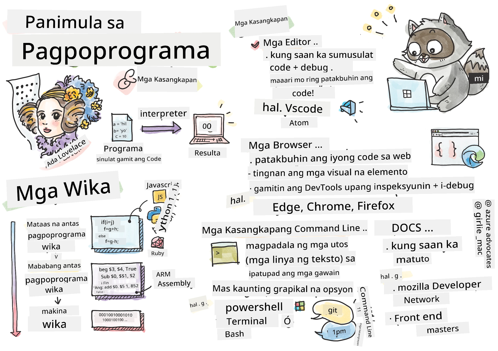
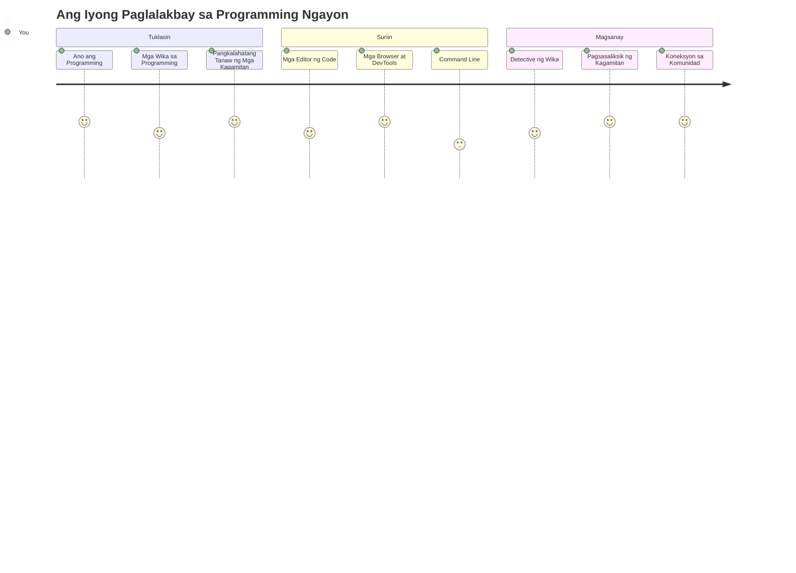
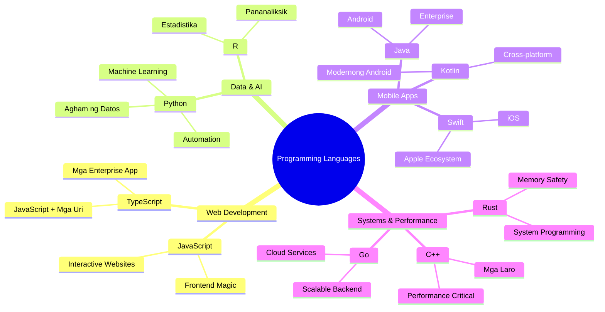
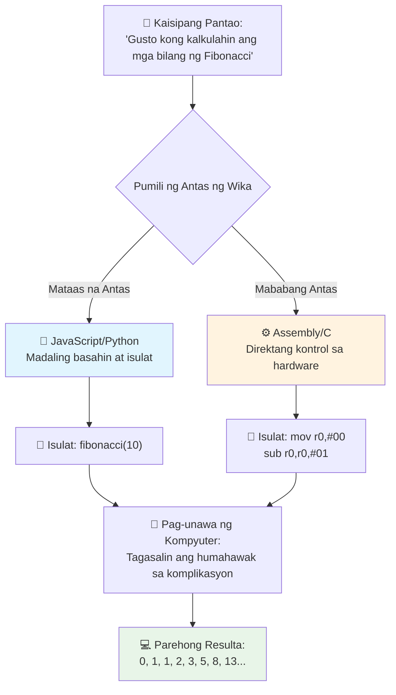
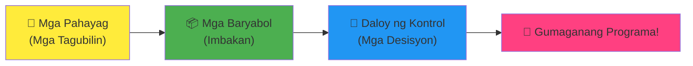
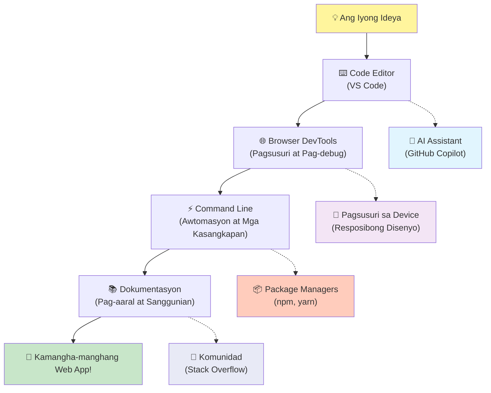
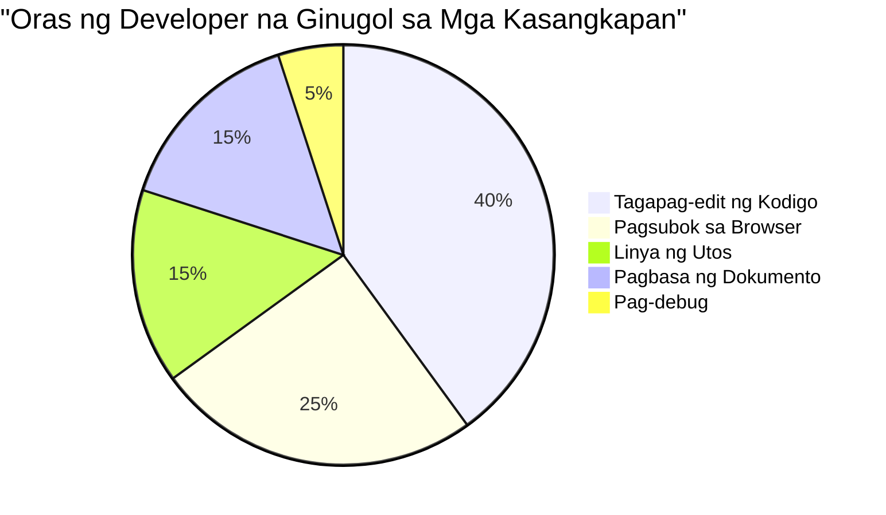
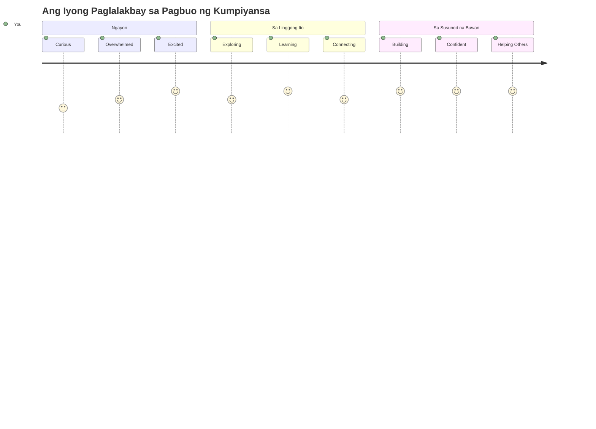

# Panimula sa Mga Wika ng Programming at Mga Makabagong Tool para sa Developer
 
Kumusta, hinaharap na developer! 👋 Pwede ba kitang sabihan ng isang bagay na talagang nakakakilabot sa akin araw-araw? Malapit mo nang matuklasan na ang programming ay hindi lang tungkol sa mga computer – ito ay tungkol sa pagkakaroon ng tunay na mga superpower para buhayin ang iyong pinaka-wild na mga ideya!

Alam mo ba yung sandaling ginagamit mo ang paborito mong app at parang perpektong tumutugma ang lahat? Kapag pinindot mo ang isang button at may nangyayaring bagay na talagang mahiwaga na magpapaisip sa'yo ng "wow, paano nila GINAWA yun?" Aba, may isang taong katulad mo lang – marahil ay nakaupo sa kanilang paboritong coffee shop ng alas-dose ng gabi na may third espresso – ang sumulat ng code na gumawa ng mahika na iyon. At ito ang magpapanga sa'yo: sa katapusan ng leksyon na ito, hindi mo lang maiintindihan kung paano nila ginawa, kundi magtataka kang subukan mo ito mismo!

Tingnan mo, naiintindihan ko kung nakakakaba ang programming sa ngayon. Noong una kong nagsimula, inayawan ko talaga iniisip na kailangan mo maging math genius o nag-cocode ka na mula pagkabata. Pero ito ang ganap na nagbago ng pananaw ko: ang programming ay eksaktong parang pag-aaral ng bagong wika para makipag-usap. Nagsisimula ka sa "hello" at "thank you," tapos nagsasanay kang umorder ng kape, at bago mo malaman, may malalalim na usapan ka na! Maliban na lang na nakikipag-usap ka sa mga computer, at sa totoo lang? Sila ang pinaka-matiyagang kasama mo sa pag-uusap – hindi nila huhusgahan ang mga mali mo at laging masigasig na ulitin ang pagsubok!

Ngayon, i-eexplore natin ang mga kamangha-manghang tool na nagpapagawa ng moderno at kaakit-akit na web development. Pinag-uusapan ko ang eksaktong parehong mga editor, browser, at workflows na ginagamit ng mga developer sa Netflix, Spotify, at paborito mong indie app studio araw-araw. At ito ang bahagi na magpapasayaw sa'yo ng saya: karamihan sa mga propesyonal at industry-standard na tool ay ganap na libre!


> Sketchnote ni [Tomomi Imura](https://twitter.com/girlie_mac)


```mermaid
journey
    title Ang Iyong Paglalakbay sa Programming Ngayon
    section Tuklasin
      Ano ang Programming: 5: You
      Mga Wika sa Programming: 4: You
      Pangkalahatang Tanaw ng Mga Kagamitan: 5: You
    section Suriin
      Mga Editor ng Code: 4: You
      Mga Browser at DevTools: 5: You
      Command Line: 3: You
    section Magsanay
      Detective ng Wika: 4: You
      Pagsasaliksik ng Kagamitan: 5: You
      Koneksyon sa Komunidad: 5: You
```
## Tingnan Natin Kung Ano ang Alam Mo Na!

Bago tayo sumabak sa masayang bahagi, curious ako – ano na ba ang alam mo tungkol sa mundo ng programming? At pakinggan mo, kung tinitingnan mo ang mga tanong na ito at iniisip na "Wala talaga akong ideya tungkol dito," ayos lang ‘yan, perfect pa nga! Ibig sabihin nandito ka sa tamang lugar. Isipin mo ang quiz na ito parang paghahanda bago mag-ehersisyo – pinapainit lang natin ang mga muskulo ng utak!

[Subukan ang pre-lesson quiz](https://ff-quizzes.netlify.app/web/)


## Ang Pakikipagsapalaran na Sasamahan Natin Ngayon

Okay, totoo lang sobrang saya ko sa mga pag-eexplore natin ngayon! Sana makita ko ang reaksyon mo kapag may mga konseptong biglang lumilinaw. Heto ang kamangha-manghang paglalakbay natin:

- **Ano talaga ang programming (at bakit ito ang pinaka-cool!)** – Matutuklasan natin kung paano ang code ay literal na invisible na mahika na nagpapaandar ng lahat ng nakapaligid sa’yo, mula sa alarm na parang alam na Lunes na hanggang sa algorithm na perpektong pumipili ng mga rekomendasyon sa Netflix
- **Mga wikang programming at ang kanilang mga kamangha-manghang personalidad** – Ipagpaumanhin mo, isipin mong pumasok ka sa party kung saan ang bawat tao ay may kanya-kanyang superpower at solusyon sa problema. Ganyan ang mundo ng programming language, at mag-eenjoy kang makilala sila!
- **Mga pundamental na piraso na bumubuo ng digital na mahika** – Isipin ito bilang pinakamamahalin na LEGO set sa paglikha. Kapag naintindihan mo kung paano nag-uugnay ang mga ito, mapapagtanto mong maaari kang magtayo ng kahit ano sa imahinasyon mo
- **Mga propesyonal na tools na magpaparamdam sa’yo na may hawak kang wand ng mangkukulam** – Hindi ako nang-aapekto dito – talagang mararamdaman mong parang may superpowers ka, at ang pinakamagandang balita? Ginagamit ito ng mga propesyonal!

> 💡 **Paalala**: Huwag mo munang piliting tandaan ang lahat ngayon! Sa ngayon, gusto ko lang maramdaman mo yung spark ng excitement tungkol sa mga posibleng gawin. Dadikit ang mga detalye habang magkakasama tayong nagpa-practice – ganyan talaga matututo nang tunay!

> Maaari mong kunin ang araling ito sa [Microsoft Learn](https://learn.microsoft.com/en-us/learn/modules/web-development-101/introduction-programming/?WT.mc_id=academic-77807-sagibbon)!

## Ano nga ba talaga ang *Programming*?

Sige, harapin natin ang tanong na napakahalaga: ano nga ba ang programming?

May kwento akong babahaginan na lubos na nagbago ng pananaw ko dito. Kamakailan lang, tinatangka kong ipaliwanag sa nanay ko kung paano gamitin ang bago naming smart TV remote. Napansin ko na sinasabi ko na "Pindutin mo yung pulang button, pero hindi yung malaking pulang button, yung maliit na pulang button sa kaliwa... hindi, yung kabilang kaliwa mo... okay, hawakan mo ngayon ng dalawang segundo, hindi isa, hindi tatlo..." Parang familiar? 😅

Iyon ang programming! Sining ng pagbibigay ng detalyadong, hakbang-hakbang na mga utos sa isang bagay na malakas ngunit kailangang ipaliwanag ng husto. Pero sa halip na ipaliwanag mo ito sa nanay mo (na maaaring magtanong ng "alin sa mga pulang button?!"), ipinapaliwanag mo ito sa computer (na ginagawa lang ang eksaktong sinabi mo, kahit na hindi iyon ang ibig mong sabihin).

Ito ang pumukaw ng isip ko nung una kong natutunan: ang mga computer ay talagang simpleng mga makina sa pinaka-ugat. Nauunawaan nila ang dalawang bagay lang – 1 at 0, na parang "oo" at "hindi" o "bukas" at "patay." Iyon lang! Pero dito nagsisimula ang mahika – hindi natin kailangang magsalita sa 1s at 0s gaya ng nasa The Matrix tayo. Dito pumapasok ang **programming languages** para tumulong. Para silang pinakamagaling na tagasalin ng mundo na kumukuha ng normal mong mga ideya bilang tao at kino-convert ito sa wika ng computer.

At ito pa ang talagang nakakakilabot sa akin tuwing umaga pag gising: literal *lahat* ng digital sa buhay mo ay nagsimula sa isang taong katulad mo, marahil nakasuot ng pajama may hawak ng tasa ng kape, nagta-type ng code sa laptop. Ang Instagram filter na nagpapaganda sa iyong itsura? May sumulat ng code niyan. Ang rekomendasyon na nagdala sa'yo sa bagong paboritong kanta? Isang developer ang bumuo ng algorithm na iyon. Ang app na tumutulong sa'yo hatiin ang bayarin sa kain ng mga kaibigan? Oo, may naisip na "nakakainis ito, sigurado akong kaya kong ayusin ito" at ginawa nga nila!

Kapag natutunan mong mag-program, hindi ka lang nagkakaroon ng bagong kasanayan – nagiging bahagi ka ng kahanga-hangang komunidad ng mga tagasolver ng problema na araw-araw iniisip, "Paano kaya ako makakagawa ng bagay na makakatulong kahit kaunti sa araw ng iba?" Totoo, mayroon pa bang mas astig kaysa dyan?

✅ **Masayang Paghahanap ng Katotohanan**: Heto ang isang napaka-astig na bagay na pwedeng mong hanapin kapag may libreng oras – sino kaya ang unang programmer ng mundo? Bibigyan kita ng clue: maaaring hindi siya yung inaasahan mo! Ang kwento ng taong ito ay talagang nakakatuwa at nagpapakita na ang programming ay laging tungkol sa malikhaing paglutas ng problema at pag-iisip sa labas ng kahon.

### 🧠 **Oras ng Pagsusuri: Kumusta ang Pakiramdam Mo?**

**Sandaling mag-isip:**
- Naiintindihan mo ba na ngayon ang ideya ng "pagbibigay ng mga utos sa computer"?
- Maiisip mo ba ang isang pang-araw-araw na gawain na gusto mong i-automate gamit ang programming?
- Anong mga tanong ang sumisiklab sa isip mo tungkol sa programming?

> **Tandaan**: Normal lang na medyo malabo ang ilang konsepto ngayon. Ang pag-aaral ng programming ay parang pag-aaral ng bagong wika – kailangan ng panahon para makabuo ang utak ng mga koneksyon. Ayos ka lang at magaling ang ginagawa mo!

## Ang Mga Wika ng Programming ay Parang Iba't Ibang Lasa ng Mahika

Okay, medyo kakaiba ang pag-iisip nito, pero samahan mo ako – ang mga wikang programming ay parang iba't ibang uri ng musika. Isipin mo: may jazz, na smooth at improvisational, rock na malakas at direkta, classical na elegant at istrukturado, at hip-hop na malikhaing nagpapa-express. Bawat istilo ay may sariling vibe, komunidad ng mga passionate na tagahanga, at perpekto para sa iba't ibang moods at okasyon.

Ganoon din ang mga wikang programming! Hindi mo gagamitin ang parehong wika para gumawa ng masayang larong mobile na gagamitin para i-proseso ang malalaking data ng klima, katulad ng hindi ka magpapatugtog ng death metal sa yoga class (well, karamihan ng yoga class naman! 😄).

Pero ito ang nagpapamangha sa akin sa tuwing naiisip ko: ang mga wikang ito ay parang ang pinaka-pasyenteng at talinong interpreter na katabi mo. Naipapahayag mo ang mga ideya sa paraang natural sa utak mo bilang tao, at sila ang nag-aasikaso ng sobrang komplikadong pagsasalin sa mga 1s at 0s na ginagamit ng mga computer. Parang may kaibigan kang bihasa sa parehong "malikhain bilang tao" at "lohika ng computer" – at hindi sila napapagod, hindi kailangan ng coffee breaks, at hindi hinuhusgahan kapag paulit-ulit kang nagtatanong!

### Mga Sikat na Programming Languages at Kanilang Mga Gamit


```mermaid
mindmap
  root((Programming Languages))
    Web Development
      JavaScript
        Frontend Magic
        Interactive Websites
      TypeScript
        JavaScript + Mga Uri
        Mga Enterprise App
    Data & AI
      Python
        Agham ng Datos
        Machine Learning
        Automation
      R
        Estadistika
        Pananaliksik
    Mobile Apps
      Java
        Android
        Enterprise
      Swift
        iOS
        Apple Ecosystem
      Kotlin
        Modernong Android
        Cross-platform
    Systems & Performance
      C++
        Mga Laro
        Performance Critical
      Rust
        Memory Safety
        System Programming
      Go
        Cloud Services
        Scalable Backend
```
| Wika | Pinakamainam Para sa | Bakit Sikat |
|----------|----------|------------------|
| **JavaScript** | Web development, user interfaces | Tumatakbo sa mga browser at nagpapaandar sa mga interactive na website |
| **Python** | Data science, automation, AI | Madaling basahin at aralin, may malakas na libraries |
| **Java** | Enterprise applications, Android apps | Hindi nakadepende sa platform, matibay para sa malalaking sistema |
| **C#** | Windows applications, paglalaro | Malakas ang suporta ng Microsoft ecosystem |
| **Go** | Cloud services, backend systems | Mabilis, simple, idinisenyo para sa modernong computing |

### High-Level vs. Low-Level na Mga Wika

Okay, ito talaga yung konseptong nasira ang utak ko nung nagsimula akong matuto, kaya babahaginan kita ng analogiyang sa wakas ay pumukaw ng pagkaunawa ko – at sana makatulong ito sa'yo rin!

Isipin mo na bumisita ka sa isang bansa na hindi mo alam ang wika, at desperadong kailangan mong hanapin ang pinakamalapit na banyo (naranasan na nating lahat 'yan, di ba? 😅):

- **Low-level programming** ay parang pag-aaral ng lokal na diyalekto nang sobrang galing para makipag-usap ka sa lola na nagtitinda sa kanto gamit ang mga cultural references, slang, at jokes na tanging mga nakatira doon lang ang nakakaintindi. Super kahanga-hanga at epektibo… kung bihasa ka! Pero napakahirap kapag naghahanap ka lang ng banyo.

- **High-level programming** ay parang may kamangha-manghang lokal na kaibigan na nakakaintindi sa'yo. Pwede mong sabihin lang ang “Kailangang-kailangan kong makahanap ng banyo” sa simpleng English, at siya na ang bahala sa pagsasalin at pagsasabi ng daan na maiintindihan ng utak mo na hindi taga-roon.

Sa programming:
- **Low-level languages** (tulad ng Assembly o C) pinahihintulutan kang makipag-usap nang detalyado sa hardware ng computer, pero kailangan mong mag-isip tulad ng makina, na… sabihin nating, malaking pagbabago ng mindset!
- **High-level languages** (tulad ng JavaScript, Python, o C#) pinapayagan kang mag-isip tulad ng tao habang sila ang nag-aasikaso sa lahat ng machine-speak sa likod. Bukod dito, may mga malalugod na komunidad sila, puno ng mga taong nakakaalala na sila ay baguhan din at totoong gustong tumulong!

Hulaan mo kung alin ang irerekomenda kong simulan mo? 😉 Ang mga high-level languages ay parang may gulong pang-training na ayaw mo nang tanggalin dahil ginagawa nilang mas masaya ang buong karanasan!


```mermaid
flowchart TB
    A["👤 Kaisipang Pantao:<br/>'Gusto kong kalkulahin ang mga bilang ng Fibonacci'"] --> B{Pumili ng Antas ng Wika}
    
    B -->|Mataas na Antas| C["🌟 JavaScript/Python<br/>Madaling basahin at isulat"]
    B -->|Mababang Antas| D["⚙️ Assembly/C<br/>Direktang kontrol sa hardware"]
    
    C --> E["📝 Isulat: fibonacci(10)"]
    D --> F["📝 Isulat: mov r0,#00<br/>sub r0,r0,#01"]
    
    E --> G["🤖 Pag-unawa ng Kompyuter:<br/>Tagasalin ang humahawak sa komplikasyon"]
    F --> G
    
    G --> H["💻 Parehong Resulta:<br/>0, 1, 1, 2, 3, 5, 8, 13..."]
    
    style C fill:#e1f5fe
    style D fill:#fff3e0
    style H fill:#e8f5e8
```
### Ipapakita Ko Sa'yo Bakit Mas Friendly ang High-Level Languages

Okay, ipapakita ko sa’yo ang isang halimbawa na nagpapakita kung bakit na-in love ako sa high-level languages, pero bago iyon – pangako, ha. Kapag nakita mo ang unang code example, huwag mag-panic! Dapat lang niyang magmukhang nakakatakot. Iyan ay punto ko lang!

Titingnan natin ang parehong gawain na isinulat sa dalawang magkaibang estilo. Pareho silang gumagawa ng tinatawag na Fibonacci sequence – isang magandang matematikal na pattern kung saan ang bawat numero ay kabuuan ng dalawang nauna: 0, 1, 1, 2, 3, 5, 8, 13... (Fun fact: makikita mo ang pattern na ito sa buong kalikasan – spiral ng sunflower seeds, mga pattern ng pinecone, pati na sa pagbuo ng mga galaxies!)

Handa ka na bang makita ang pagkakaiba? Tara na!

**High-level language (JavaScript) – Madaling maintindihan ng tao:**

```javascript
// Hakbang 1: Pangunahing pagsasaayos ng Fibonacci
const fibonacciCount = 10;
let current = 0;
let next = 1;

console.log('Fibonacci sequence:');
```

**Ganito ang ginagawa ng code na ito:**
- **Declare** ng constant para tukuyin kung ilang Fibonacci numbers ang gusto nating gawin
- **Initialize** ng dalawang variable para subaybayan ang kasalukuyan at susunod na numero sa sequence
- **I-set up** ang panimulang values (0 at 1) na nagde-define ng Fibonacci pattern
- **Ipakita** ang header message para tukuyin ang output natin

```javascript
// Hakbang 2: Bumuo ng pagkakasunod-sunod gamit ang isang loop
for (let i = 0; i < fibonacciCount; i++) {
  console.log(`Position ${i + 1}: ${current}`);
  
  // Kalkulahin ang susunod na numero sa pagkakasunod-sunod
  const sum = current + next;
  current = next;
  next = sum;
}
```

**Hatiin natin ang nangyayari dito:**
- **Ulitin** ang bawat posisyon sa sequence gamit ang `for` loop
- **Ipakita** ang bawat numero kasabay ng posisyon gamit ang template literal formatting
- **Kalkulahin** ang susunod na Fibonacci number sa pamamagitan ng pagdagdag ng kasalukuyan at susunod na halaga
- **I-update** ang mga tracking variables para lumipat sa susunod na iteration

```javascript
// Hakbang 3: Makabagong punsiyonal na pamamaraan
const generateFibonacci = (count) => {
  const sequence = [0, 1];
  
  for (let i = 2; i < count; i++) {
    sequence[i] = sequence[i - 1] + sequence[i - 2];
  }
  
  return sequence;
};

// Halimbawa ng paggamit
const fibSequence = generateFibonacci(10);
console.log(fibSequence);
```

**Sa itaas, ginawa natin:**
- **Gumawa** ng reusable function gamit ang modernong arrow function syntax
- **Bumuo** ng array upang itago ang kumpletong sequence sa halip na ipakita isa-isa
- **Gumamit** ng array indexing para kalkulahin ang bawat bagong numero base sa mga nauna
- **Ibalik** ang kumpletong sequence para magamit nang flexible sa iba pang bahagi ng programa

**Low-level language (ARM Assembly) – Madaling maintindihan ng computer:**

```assembly
 area ascen,code,readonly
 entry
 code32
 adr r0,thumb+1
 bx r0
 code16
thumb
 mov r0,#00
 sub r0,r0,#01
 mov r1,#01
 mov r4,#10
 ldr r2,=0x40000000
back add r0,r1
 str r0,[r2]
 add r2,#04
 mov r3,r0
 mov r0,r1
 mov r1,r3
 sub r4,#01
 cmp r4,#00
 bne back
 end
```

Pansinin kung paano halos parang English ang pagbasa ng JavaScript version, samantalang ang Assembly version ay gumagamit ng mga cryptic na utos na direktang nagkokontrol sa processor ng computer. Pareho silang nakakagawa ng eksaktong parehong gawain, pero mas madali para sa mga tao ang high-level language maintindihan, isulat, at pangalagaan.

**Mga pangunahing pagkakaiba na mapapansin mo:**
- **Kababasaang-madali**: Gumagamit ang JavaScript ng mga deskriptibong pangalan tulad ng `fibonacciCount` habang ang Assembly ay gumagamit ng mga cryptic na label tulad ng `r0`, `r1`
- **Mga Komento**: Hinikayat ng mga high-level na wika ang mga paliwanag na komento na nagpapadokumenta sa sarili ng code
- **Estruktura**: Ang lohikal na daloy ng JavaScript ay tumutugma sa paraan ng pag-iisip ng mga tao tungkol sa mga problema ng hakbang-hakbang
- **Pagpapanatili**: Ang pag-update ng bersyon ng JavaScript para sa iba't ibang pangangailangan ay diretso at malinaw

✅ **Tungkol sa Fibonacci sequence**: Ang napakagandang pattern ng numero na ito (kung saan ang bawat numero ay katumbas ng suma ng dalawang nauna: 0, 1, 1, 2, 3, 5, 8...) ay literal na makikita *saanman* sa kalikasan! Makikita mo ito sa mga spiral ng sunflower, mga pattern ng pinecone, sa paikot ng mga kabibe ng nautilus, at maging sa paglaki ng mga sanga ng puno. Kamangha-mangha kung paano tinutulungan tayo ng matematika at code na maunawaan at muling likhain ang mga pattern na ginagamit ng kalikasan upang lumikha ng kagandahan!

## Ang Mga Pangunahing Bahagi Na Gumagawa ng Mahika

Sige, ngayon na nakita mo kung paano gumagana ang mga programming na wika, hatiin natin ang mga pundamental na bahagi na bumubuo ng literal na bawat programang naisulat kailanman. Isipin mo ito bilang mga mahalagang sangkap sa iyong paboritong recipe – kapag naunawaan mo ang ginagawa ng bawat isa, magagawa mong magbasa at magsulat ng code sa halos anumang wika!

Ito ay parang pag-aaral ng gramatika ng programming. Naalala mo ba noong nasa paaralan ka kapag tinuruan ka tungkol sa mga pangngalan, pandiwa, at kung paano bumuo ng mga pangungusap? May sarili ang programming na gramatika, at sa totoo lang, mas lohikal at mas mapagpatawad ito kumpara sa gramatika ng Ingles! 😄

### Mga Pahayag: Mga Hakbang-hakbang na Tagubilin

Magsimula tayo sa **mga pahayag** – para itong mga indibidwal na pangungusap sa usapan kasama ang iyong computer. Bawat pahayag ay nagsasabi sa computer na gawin ang isang partikular na bagay, parang pagbibigay ng mga direksyon: "Lumiko ka sa kaliwa dito," "Huminto sa pulang ilaw," "Mag-park sa lugar na iyon."

Ang gusto ko sa mga pahayag ay kung gaano sila kadaling basahin karaniwan. Tingnan mo ito:

```javascript
// Mga pangunahing pahayag na nagsasagawa ng iisang aksyon
const userName = "Alex";                    
console.log("Hello, world!");              
const sum = 5 + 3;                         
```

**Narito kung ano ang ginagawa ng code na ito:**
- **Ideklara** ang isang constant variable para itago ang pangalan ng user
- **Ipakita** ang greeting na mensahe sa console output
- **Ikwenta** at itago ang resulta ng isang matematikal na operasyon

```javascript
// Mga pahayag na nakikipag-ugnayan sa mga web page
document.title = "My Awesome Website";      
document.body.style.backgroundColor = "lightblue";
```

**Hakbang-hakbang, ito ang nangyayari:**
- **Baguhin** ang pamagat ng webpage na lumalabas sa tab ng browser
- **Palitan** ang kulay ng background ng buong katawan ng pahina

### Mga Variable: Ang Memory System ng Iyong Programa

Sige, ang **mga variable** ay isa talaga sa mga paborito kong konsepto na ituro dahil parang mga bagay sila na ginagamit mo araw-araw!

Isipin mo ang contact list ng iyong telepono. Hindi mo ni-memorize ang numero ng telepono ng lahat – sa halip, sine-save mo ang "Nanay," "Pinakamatalik na Kaibigan," o "Pizza Place Na Nagde-deliver Hanggang 2 AM" at hayaan mong tandaan ng iyong telepono ang aktwal na mga numero. Ganon din ang mga variable! Parang mga lalagyan na may label kung saan maaaring mag-imbak ng impormasyon ang iyong programa at kunin ito mamaya gamit ang pangalan na may kabuluhan.

Ang cool ay: pwedeng magbago ang mga variable habang tumatakbo ang iyong programa (kaya variable ang tawag – get it?). Parang ine-update mo ang contact ng pizza place kapag nakakita ka ng mas magaling na lugar, pwedeng baguhin ang mga variable habang natututo ang programa ng bagong impormasyon o habang nagbabago ang mga sitwasyon!

Ipakikita ko sa iyo kung gaano ito kapasimple:

```javascript
// Hakbang 1: Gumagawa ng mga pangunahing variable
const siteName = "Weather Dashboard";        
let currentWeather = "sunny";               
let temperature = 75;                       
let isRaining = false;                      
```

**Pag-unawa sa mga konseptong ito:**
- **Itago** ang mga hindi nagbabagong halaga sa mga `const` na variable (tulad ng pangalan ng site)
- **Gamitin** ang `let` para sa mga halaga na maaaring magbago sa buong programa
- **Itakda** ang iba't ibang uri ng data: string (teksto), numero, at boolean (tama/mali)
- **Piliin** ang mga deskriptibong pangalan na nagpapaliwanag kung ano ang laman ng bawat variable

```javascript
// Hakbang 2: Paggamit ng mga bagay para pagsamahin ang magkakaugnay na datos
const weatherData = {                       
  location: "San Francisco",
  humidity: 65,
  windSpeed: 12
};
```

**Sa itaas, ginawa namin:**
- **Lumikha** ng isang object upang pagsamahin ang magkaugnay na impormasyon ng panahon
- **Inaayos** ang maraming piraso ng data sa ilalim ng isang pangalan ng variable
- **Gumamit** ng mga key-value pairs para malinaw na markahan ang bawat piraso ng impormasyon

```javascript
// Hakbang 3: Paggamit at pag-update ng mga variable
console.log(`${siteName}: Today is ${currentWeather} and ${temperature}°F`);
console.log(`Wind speed: ${weatherData.windSpeed} mph`);

// Pag-update ng mga nababagong variable
currentWeather = "cloudy";                  
temperature = 68;                          
```

**Unawain natin ang bawat bahagi:**
- **Ipakita** ang impormasyon gamit ang template literals na may `${}` syntax
- **I-access** ang mga property ng object gamit ang dot notation (`weatherData.windSpeed`)
- **I-update** ang mga variable na dineklara gamit ang `let` para ipakita ang nagbabagong kondisyon
- **Pagsamahin** ang maraming variable upang lumikha ng makabuluhang mga mensahe

```javascript
// Hakbang 4: Makabagong pagdidisimula para sa mas malinis na code
const { location, humidity } = weatherData; 
console.log(`${location} humidity: ${humidity}%`);
```

**Mga kailangan mong malaman:**
- **I-extract** ang mga tiyak na property mula sa mga object gamit ang destructuring assignment
- **Lumikha** ng mga bagong variable nang awtomatiko gamit ang parehong pangalan ng mga key ng object
- **Pasimplehin** ang code sa pamamagitan ng pag-iwas sa paulit-ulit na dot notation

### Daloy ng Kontrol: Pagtuturo sa Iyong Programa na Mag-isip

Sige, dito nakakabigla talaga ang programming! Ang **daloy ng kontrol** ay parang pagtuturo sa iyong programa kung paano gumawa ng matatalinong desisyon, katulad ng ginagawa mo araw-araw nang hindi pinag-iisipan.

Isipin mo ito: ngayong umaga marahil dumaan ka sa mga ganitong bagay: "Kung umuulan, kukuha ako ng payong. Kung malamig, magsusuot ako ng jacket. Kung late ako, hahayaan kong hindi kumain ng almusal at kukuha na lang ng kape." Natural na sinusunod ng utak mo ang ganitong if-then na lohika maraming beses araw-araw!

Ito ang nagpapa-intelligent at buhay na buhay sa mga programa imbes na sumunod lang sila sa boring at predictable na script. Kaya nilang tingnan ang sitwasyon, suriin ang nangyayari, at tumugon ng tama. Parang binibigyan mo ng utak ang programa para makapag-adapt at makapili!

Gusto mo bang makita kung gaano kaganda ito gumana? Ipakikita ko:

```javascript
// Hakbang 1: Pangunahing lohika ng kundisyon
const userAge = 17;

if (userAge >= 18) {
  console.log("You can vote!");
} else {
  const yearsToWait = 18 - userAge;
  console.log(`You'll be able to vote in ${yearsToWait} year(s).`);
}
```

**Ganito ang ginagawa ng code na ito:**
- **Suriin** kung ang edad ng user ay pasok sa requirement sa pagboto
- **Patakbuhin** ang iba't ibang code block depende sa resulta ng kondisyon
- **Ikwenta** at ipakita kung gaano katagal bago maging karapat-dapat bumoto kapag wala pang 18
- **Magbigay** ng tiyak at kapaki-pakinabang na feedback sa bawat senaryo

```javascript
// Hakbang 2: Maramihang mga kondisyon gamit ang mga lohikal na operator
const userAge = 17;
const hasPermission = true;

if (userAge >= 18 && hasPermission) {
  console.log("Access granted: You can enter the venue.");
} else if (userAge >= 16) {
  console.log("You need parent permission to enter.");
} else {
  console.log("Sorry, you must be at least 16 years old.");
}
```

**Hatiin natin ang nangyayari dito:**
- **Pagsamahin** ang maraming kundisyon gamit ang `&&` (at) operator
- **Gumawa** ng hierarchy ng kondisyon gamit ang `else if` para sa maraming senaryo
- **I-handle** ang lahat ng posibleng kaso gamit ang panghuling `else` statement
- **Magbigay** ng malinaw at naaaksyunang feedback para sa bawat iba't ibang sitwasyon

```javascript
// Hakbang 3: Maikling kondisyon gamit ang ternary operator
const votingStatus = userAge >= 18 ? "Can vote" : "Cannot vote yet";
console.log(`Status: ${votingStatus}`);
```

**Mga kailangan mong tandaan:**
- **Gamitin** ang ternary operator (`? :`) para sa simpleng dalawang pagpipilian na kondisyon
- **Isulat** muna ang kondisyon, kasunod ang `?`, ang true na resulta, `:`, pagkatapos ang false na resulta
- **Ilapat** ito kapag kailangan mong magtalaga ng mga halaga base sa mga kondisyon

```javascript
// Hakbang 4: Paghawak ng maraming tiyak na kaso
const dayOfWeek = "Tuesday";

switch (dayOfWeek) {
  case "Monday":
  case "Tuesday":
  case "Wednesday":
  case "Thursday":
  case "Friday":
    console.log("It's a weekday - time to work!");
    break;
  case "Saturday":
  case "Sunday":
    console.log("It's the weekend - time to relax!");
    break;
  default:
    console.log("Invalid day of the week");
}
```

**Ang ginagawa ng code na ito ay:**
- **Itugma** ang halaga ng variable laban sa maraming tiyak na kaso
- **I-grupo** ang magkaparehong kaso (mga araw ng trabaho kumpara sa weekend)
- **Patakbuhin** ang tamang block ng code kapag may natagpuang tugma
- **Isama** ang `default` na kaso para hawakan ang mga hindi inaasahang mga halaga
- **Gamitin** ang `break` statements para pigilan ang pagpapatuloy ng code sa susunod na kaso

> 💡 **Analohiya sa totoong mundo**: Isipin ang daloy ng kontrol na parang may pinaka-matiyagang GPS sa mundo na nagbibigay ng direksyon. Maaaring sabihin nito "Kung may traffic sa Main Street, dumaan ka sa highway na lang. Kung construction naman ang humaharang sa highway, subukan ang scenic route." Gumagamit ang mga programa ng ganitong uri ng conditional logic para tumugon ng matalino sa iba't ibang sitwasyon at palaging ibigay sa mga user ang pinakamahusay na karanasan.

### 🎯 **Concept Check: Mastery ng Mga Pangunahing Bahagi**

**Tingnan natin kung paano ka mag-perform sa mga batayan:**
- Kaya mo bang ipaliwanag ang pagkakaiba sa pagitan ng variable at pahayag sa sarili mong mga salita?
- Isipin ang isang totoong senaryo kung saan gagamit ka ng if-then na desisyon (tulad ng halimbawa ng pagboto)
- Ano ang isang bagay tungkol sa lohika ng programming na naka-surprise sa iyo?

**Mabilis na pampalakas ng loob:**

```mermaid
flowchart LR
    A["📝 Mga Pahayag<br/>(Mga Tagubilin)"] --> B["📦 Mga Baryabol<br/>(Imbakan)"] --> C["🔀 Daloy ng Kontrol<br/>(Mga Desisyon)"] --> D["🎉 Gumaganang Programa!"]
    
    style A fill:#ffeb3b
    style B fill:#4caf50
    style C fill:#2196f3
    style D fill:#ff4081
```
✅ **Susunod na darating**: Magsasaya tayo ng todo sa pagtuklas nang mas malalim sa mga konseptong ito habang ipinagpapatuloy natin ang kahanga-hangang paglalakbay na ito! Sa ngayon, magpokus lang sa pagdamdam ng excitement tungkol sa lahat ng kamangha-manghang mga posibilidad sa harap mo. Dumaragdag ang mga espesipikong kasanayan at teknik habang nagsasanay tayo ng magkasama – pangako, magiging mas masaya ito kaysa sa inaasahan mo!

## Mga Kagamitan sa Trabaho

Sige, dito ako talaga tine-thrill na hindi ko mapigilan ang sarili! 🚀 Pag-uusapan natin ang mga kamangha-manghang kasangkapan na magpaparamdam sa iyo na parang hawak mo na ang mga susi sa isang digital na spaceship.

Alam mo ba ang isang chef ay may mga perpektong balanseng kutsilyo na para bang mga extension ng kanilang mga kamay? O ang isang musikero ay may gitara na parang umaawit sa sandaling hawakan nila? Well, ang mga developer ay may sarili nating bersyon ng mga mahiwagang kagamitan na ito, at ito ang magpapamangha talaga sa iyo – karamihan sa mga ito ay ganap na libre!

Halos hindi ako makahinga sa saya na ibahagi ito sa iyo dahil lubos nitong binago kung paano tayo gumagawa ng software. Pinag-uusapan natin ang mga AI-powered coding assistant na makakatulong sumulat ng iyong code (hindi ako nangbibiro!), mga cloud environment kung saan pwede kang bumuo ng buong aplikasyon sa literal na kahit saan basta may Wi-Fi, at mga debugging tool na sobrang sopistikado na parang may X-ray vision ka para sa iyong mga programa.

At ito ang bahagi na nagpapakiliti pa rin sa akin: hindi ito mga "beginner tools" na lalampasan mo lang. Ito ang parehong professional-grade tools na ginagamit ng mga developer sa Google, Netflix, at ng paborito mong indie app studio ngayong sandali. Magiging pro ka talaga sa paggamit nito!


```mermaid
graph TD
    A["💡 Ang Iyong Ideya"] --> B["⌨️ Code Editor<br/>(VS Code)"] 
    B --> C["🌐 Browser DevTools<br/>(Pagsusuri at Pag-debug)"]
    C --> D["⚡ Command Line<br/>(Awtomasyon at Mga Kasangkapan)"]
    D --> E["📚 Dokumentasyon<br/>(Pag-aaral at Sanggunian)"]
    E --> F["🚀 Kamangha-manghang Web App!"]
    
    B -.-> G["🤖 AI Assistant<br/>(GitHub Copilot)"]
    C -.-> H["📱 Pagsusuri sa Device<br/>(Resposibong Disenyo)"]
    D -.-> I["📦 Package Managers<br/>(npm, yarn)"]
    E -.-> J["👥 Komunidad<br/>(Stack Overflow)"]
    
    style A fill:#fff59d
    style F fill:#c8e6c9
    style G fill:#e1f5fe
    style H fill:#f3e5f5
    style I fill:#ffccbc
    style J fill:#e8eaf6
```
### Code Editors at IDEs: Ang Iyong Mga Bagong Digital na Kaibigan

Pag-usapan natin ang mga code editor – sila talaga ang magiging paborito mong lugar na tambayan! Isipin mo silang personal mong sanctuary ng coding kung saan marami kang oras na gugugulin sa paggawa at pagpapaganda ng iyong mga digital na likha.

Ngunit ito ang napakahalagang magic sa mga modernong editor: hindi lang sila basta mga kumpol ng text editor. Para silang pinaka-matalinong coding mentor na palaging nasa tabi mo 24/7. Nahuhuli nila ang mga typo mo bago mo pa man mapansin, nagmumungkahi ng mga improvements na ginagawa kang kamangha-mangha, tinutulungan kang maintindihan kung ano ang ginagawa ng bawat piraso ng code, at ang ilan sa kanila ay parang may kakayahang mahulaan ang susunod mong itatype at ialok na tapusin ang iyong iniisip!

Naalala ko noong unang matuklasan ko ang auto-completion – para akong nasa future na. Magsisimula kang mag-type, tapos sasabihin ng editor mo, "Hoy, baka ito ang function na kailangan mo?" Parang may kasama kang mind reader na coding buddy!

**Ano ang nagpapahanga sa mga editor na ito?**

Nag-aalok ang mga modernong code editor ng kahanga-hangang array ng mga tampok na dinisenyo upang pataasin ang iyong produktibidad:

| Tampok | Ano ang Ginagawa Nito | Bakit Ito Tumatabang |
|---------|----------------------|---------------------|
| **Syntax Highlighting** | Kulayan ang iba't ibang bahagi ng iyong code | Pinapadali ang pagbabasa ng code at paghahanap ng errors |
| **Auto-completion** | Nagsusuggest ng code habang nagta-type ka | Pinapabilis ang pag-code at binabawasan ang typo |
| **Debugging Tools** | Tinutulungan kang hanapin at ayusin ang mga error | Nakakatipid ng oras sa pag-troubleshoot |
| **Extensions** | Nagdadagdag ng specialized na mga feature | Inaangkop ang editor mo sa anumang teknolohiya |
| **AI Assistants** | Nagsusuggest ng code at paliwanag | Pinapabilis ang pag-aaral at produktibidad |

> 🎥 **Video Resource**: Gusto mo bang makita ang mga tools na ito habang ginagamit? Pasulyapan mo ang [Tools of the Trade video](https://youtube.com/watch?v=69WJeXGBdxg) para sa komprehensibong overview.

#### Inirerekomendang Editors para sa Web Development

**[Visual Studio Code](https://code.visualstudio.com/?WT.mc_id=academic-77807-sagibbon)** (Libre)
- Pinakapopular sa mga web developer
- Napakahusay na ecosystem ng mga extension
- May built-in na terminal at Git integration
- **Mga kinakailangang extension**:
  - [GitHub Copilot](https://marketplace.visualstudio.com/items?itemName=GitHub.copilot) - AI na nagsusuggest ng code
  - [Live Share](https://marketplace.visualstudio.com/items?itemName=MS-vsliveshare.vsliveshare) - Real-time na kolaborasyon
  - [Prettier](https://marketplace.visualstudio.com/items?itemName=esbenp.prettier-vscode) - Awtomatikong pag-format ng code
  - [Code Spell Checker](https://marketplace.visualstudio.com/items?itemName=streetsidesoftware.code-spell-checker) - Nahuhuli ang mga typo sa code

**[JetBrains WebStorm](https://www.jetbrains.com/webstorm/)** (Bayad, libre para sa mga estudyante)
- Advanced debugging at testing tools
- Matalinong code completion
- Built-in na version control

**Mga Cloud-Based IDE** (Iba-ibang presyo)
- [GitHub Codespaces](https://github.com/features/codespaces) - Buong VS Code sa browser mo
- [Replit](https://replit.com/) - Magaling para sa pag-aaral at pagbabahagi ng code
- [StackBlitz](https://stackblitz.com/) - Instant, full-stack web development

> 💡 **Tip sa Pagsisimula**: Magsimula sa Visual Studio Code – libre ito, malawakang ginagamit sa industriya, at may malaking komunidad na gumagawa ng kapakipakinabang na tutorials at extension.

### Mga Web Browser: Ang Iyong Lihim na Laboratoryo sa Pag-develop

Sige, maghanda kang mamangha ng todo! Alam mo naman kung paano ginagamit mo ang browsers para mag-scroll sa social media at manood ng video? Aba, heto ang sikreto, tinatago nila ang napakagandang lihim ng mga developer tools na matagal nang hinihintay mong madiskubre!

Bawat ulit na nag-right click ka sa isang webpage at pinili ang "Inspect Element," binubuksan mo ang isang nakatagong mundo ng mga developer tools na, sa totoo lang, ay mas makapangyarihan pa kaysa sa ibang mamahaling software na binayaran ko noon nang daang-daang dolyar. Parang nadiskubre mo na ang ordinaryong kusina mo ay may tinatagong propesyonal na laboratoryo ng chef sa likod ng isang sikreto na panel!
Nang unang ipinakita sa akin ang browser DevTools, gumugol ako ng halos tatlong oras na nagki-click lamang at sinasabi, "HINTAY, KAYA PALA NITO YAN?!" Literal mong ma-eedit ang anumang website nang real-time, makita kung gaano kabilis mag-load ang lahat, subukan kung paano itsura ng iyong site sa iba't ibang device, at kahit i-debug ang JavaScript na parang isang total na propesyonal. Talagang nakakagulat!

**Narito kung bakit ang mga browser ang iyong lihim na sandata:**

Kapag gumawa ka ng website o web application, kailangan mong makita kung paano ito itsura at kumilos sa totoong mundo. Hindi lamang ipinapakita ng mga browser ang iyong gawa kundi nagbibigay din ng detalyadong feedback tungkol sa performance, accessibility, at mga posibleng isyu.

#### Browser Developer Tools (DevTools)

Kasama sa mga modernong browser ang komprehensibong development suites:

| Tool Category | Ano ang Ginagawa Nito | Halimbawa ng Paggamit |
|---------------|-----------------------|----------------------|
| **Element Inspector** | Tingnan at i-edit ang HTML/CSS nang real-time | Ayusin ang estilo upang makita ang agarang epekto |
| **Console** | Tingnan ang mga error messages at subukan ang JavaScript | I-debug ang mga problema at mag-eksperimento sa code |
| **Network Monitor** | Subaybayan kung paano naglo-load ang mga resources | I-optimize ang performance at oras ng pag-load |
| **Accessibility Checker** | Subukan ang inclusive design | Siguraduhing gumagana ang iyong site para sa lahat ng user |
| **Device Simulator** | Preview sa iba't ibang laki ng screen | Subukan ang responsive design nang hindi kailangan ng maraming device |

#### Inirerekomendang Browser para sa Development

- **[Chrome](https://developers.google.com/web/tools/chrome-devtools/)** - Industry-standard DevTools na may malawak na dokumentasyon
- **[Firefox](https://developer.mozilla.org/docs/Tools)** - Mahusay na CSS Grid at accessibility tools
- **[Edge](https://docs.microsoft.com/microsoft-edge/devtools-guide-chromium/?WT.mc_id=academic-77807-sagibbon)** - Naka-base sa Chromium na may resources mula sa Microsoft para sa mga developer

> ⚠️ **Mahalagang Tip sa Testing**: Laging subukan ang iyong mga website sa iba't ibang browser! Ang gumagana nang perpekto sa Chrome ay maaaring magmukhang iba sa Safari o Firefox. Tinitiyak ng mga propesyonal na developer ang consistent na karanasan ng user sa lahat ng malaking browser.

### Command Line Tools: Ang Iyong Pinto sa mga Superpowers ng Developer

Sige, maging tapat tayo tungkol sa command line, dahil gusto kong marinig mo ito mula sa isang taong tunay na nakakaintindi. Nang una ko itong makita – yung nakakatakot na itim na screen na kumikindat ang mga teksto – literal kong naisip, "Hindi, hindi talaga! Parang galing ito sa pelikula ng hacker noong 1980s, at hindi ako sapat ang talino para dito!" 😅

Pero ito ang wish ko na may nagsabi sa akin noon, at ito ang sinasabi ko sa iyo ngayon: hindi nakakatakot ang command line – parang direktang pag-uusap ito ng iyong computer. Isipin mo ito parang pagkakaiba sa pagitan ng pag-order ng pagkain sa isang pormal na app na may mga larawan at menu (na maganda at madali) kumpara sa pagpasok sa iyong paboritong lokal na restoran kung saan alam ng chef kung ano ang gusto mo at kaya niyang gumawa ng perfect na putahe sa pamamagitan lang ng pagsabi mo ng "surprise me with something amazing."

Dito sa command line nararamdaman ng mga developer na parang mga wizard sila. Magta-type ka ng ilang tila mahiwagang salita (ok lang, mga command lang ito pero parang magic!), pindutin ang enter, at BOOM – nakagawa ka ng buong istruktura ng proyekto, nakapag-install ng makapangyarihang mga tool mula sa buong mundo, o naipadala ang iyong app sa internet para makita ng milyun-milyong tao. Kapag natikman mo na ang kapangyarihang iyon, madalas itong nakakaadik!

**Bakit magiging paborito mong tool ang command line:**

Habang mahusay ang mga graphical interface sa maraming gawain, nangingibabaw ang command line sa automation, presisyon, at bilis. Maraming development tool ang pangunahing ginagamit sa command line interfaces, at ang pag-aaral kung paano epektibong gamitin ito ay makakapagpabuti nang malaki sa iyong produktibidad.

```bash
# Hakbang 1: Lumikha at mag-navigate sa direktoryo ng proyekto
mkdir my-awesome-website
cd my-awesome-website
```

**Ganito ang ginagawa ng code na ito:**
- **Gumawa** ng bagong directory na tinatawag na "my-awesome-website" para sa iyong proyekto
- **Pumasok** sa bagong likhang directory upang magsimulang magtrabaho

```bash
# Hakbang 2: I-initialize ang proyekto gamit ang package.json
npm init -y

# Mag-install ng mga makabagong kasangkapan sa pag-develop
npm install --save-dev vite prettier eslint
npm install --save-dev @eslint/js
```

**Hakbang-hakbang, ito ang nangyayari:**
- **Mag-initialize** ng bagong Node.js project gamit ang default na mga setting gamit ang `npm init -y`
- **Mag-install** ng Vite bilang modernong build tool para sa mabilis na development at production builds
- **Magdagdag** ng Prettier para sa awtomatikong pag-format ng code at ESLint para sa pagsusuri ng kalidad ng code
- **Gamitin** ang `--save-dev` flag upang markahan ang mga ito bilang mga dependency lamang sa development

```bash
# Hakbang 3: Gumawa ng istruktura ng proyekto at mga file
mkdir src assets
echo '<!DOCTYPE html><html><head><title>My Site</title></head><body><h1>Hello World</h1></body></html>' > index.html

# Simulan ang development server
npx vite
```

**Sa itaas, ginawa namin:**
- **Naayos** ang proyekto sa pamamagitan ng paggawa ng hiwalay na mga folder para sa source code at assets
- **Nagawa** ang isang basic na HTML file na may tamang istruktura ng dokumento
- **Sinimulan** ang Vite development server para sa live reloading at hot module replacement

#### Mahalagang Command Line Tools para sa Web Development

| Tool | Layunin | Bakit Kailangan Ito |
|------|---------|--------------------|
| **[Git](https://git-scm.com/)** | Version control | Subaybayan ang mga pagbabago, makipagtulungan sa iba, mag-backup ng trabaho |
| **[Node.js & npm](https://nodejs.org/)** | JavaScript runtime & package management | Patakbuhin ang JavaScript sa labas ng browser, mag-install ng modernong development tools |
| **[Vite](https://vitejs.dev/)** | Build tool & dev server | Napakabilis na development na may hot module replacement |
| **[ESLint](https://eslint.org/)** | Code quality | Awtomatikong hanapin at ayusin ang mga problema sa JavaScript mo |
| **[Prettier](https://prettier.io/)** | Code formatting | Panatilihing consistent at madaling basahin ang format ng iyong code |

#### Mga Opsyon Para sa Iba't Ibang Platform

**Windows:**
- **[Windows Terminal](https://docs.microsoft.com/windows/terminal/?WT.mc_id=academic-77807-sagibbon)** - Moderno at maraming tampok na terminal
- **[PowerShell](https://docs.microsoft.com/powershell/?WT.mc_id=academic-77807-sagibbon)** 💻 - Makapangyarihang scripting environment
- **[Command Prompt](https://learn.microsoft.com/windows-server/administration/windows-commands/windows-commands)** 💻 - Tradisyunal na Windows command line

**macOS:**
- **[Terminal](https://support.apple.com/guide/terminal/)** 💻 - Built-in na terminal application
- **[iTerm2](https://iterm2.com/)** - Pinalakas na terminal na may advanced na mga tampok

**Linux:**
- **[Bash](https://www.gnu.org/software/bash/)** 💻 - Standard na Linux shell
- **[KDE Konsole](https://docs.kde.org/trunk5/en/konsole/konsole/index.html)** - Advanced na terminal emulator

> 💻 = Pre-installed sa operating system

> 🎯 **Learning Path**: Simulan sa mga basic na command tulad ng `cd` (palitan ang directory), `ls` o `dir` (ilista ang mga file), at `mkdir` (gumawa ng folder). Magpraktis sa mga modern workflow command tulad ng `npm install`, `git status`, at `code .` (binubuksan ang kasalukuyang directory sa VS Code). Habang nasasanay ka, natural mong matututunan ang mas advanced na mga command at automation techniques.

### Dokumentasyon: Ang Iyong Laging Nariyan na Mentor sa Pag-aaral

Sige, ibabahagi ko ang isang maliit na sikreto na magpapagaan ng loob mo bilang isang baguhan: kahit na ang pinakamaraming karanasang developer ay gumugugol ng malaking bahagi ng kanilang oras sa pagbabasa ng dokumentasyon. At hindi ito dahil hindi nila alam ang ginagawa nila – tanda ito ng karunungan!

Isipin ang dokumentasyon bilang pagkakaroon ng access sa pinakapasyensyang, pinakaalam na mga guro sa buong mundo na palaging available 24/7. Nahihirapan ka sa problema ng alas-dos ng umaga? Nandiyan ang dokumentasyon na may mainit na virtual na yakap at eksaktong sagot na kailangan mo. Gusto mong matutunan ang tungkol sa bagong cool na feature na pinag-uusapan ng lahat? Suportado ka ng dokumentasyon sa pamamagitan ng step-by-step na mga halimbawa. Sinusubukan mong intindihin kung bakit gumagana ang isang bagay nang ganoon? Tama, nandiyan ang dokumentasyon upang ipaliwanag ito nang malinaw at mabilis mong maintindihan!

Narito ang isang bagay na lubos na nagbago ng pananaw ko: ang mundo ng web development ay sobrang bilis ang paggalaw, at wala talagang, pero wala talaga kahit sino, ang nakaka-memorize ng lahat. Nakita ko ang mga senior developer na may 15+ taon ng karanasan na tumitingin pa rin sa basic syntax, at alam mo ba? Hindi ito nakakahiya – talino lang yan! Hindi ito tungkol sa perfect memory; ito ay tungkol sa pagiging marunong hanapin ang maaasahang sagot nang mabilis at maintindihan kung paano ito gamitin.

**Dito nagaganap ang tunay na mahika:**

Gumugugol ang mga propesyonal na developer ng malaking bahagi ng kanilang oras sa pagbabasa ng dokumentasyon – hindi dahil hindi nila alam ang ginagawa nila, kundi dahil ang landscape ng web development ay mabilis na nagbabago kaya kailangan ng tuloy-tuloy na pag-aaral. Ang mahusay na dokumentasyon ay tumutulong sa iyo na maintindihan hindi lang *paano* gamitin ang isang bagay, kundi *bakit* at *kailan* ito gagamitin.

#### Mahalagang Dokumentasyon na Mapagkukunan

**[Mozilla Developer Network (MDN)](https://developer.mozilla.org/docs/Web)**
- Ang gold standard para sa dokumentasyon ng web technology
- Kumpletong mga gabay para sa HTML, CSS, at JavaScript
- Kasama ang impormasyon tungkol sa browser compatibility
- May mga praktikal na halimbawa at interactive demos

**[Web.dev](https://web.dev)** (mula sa Google)
- Mga modernong best practices sa web development
- Mga gabay sa pag-optimize ng performance
- Accessibility at mga prinsipyo ng inclusive design
- Mga case study mula sa totoong proyekto

**[Microsoft Developer Documentation](https://docs.microsoft.com/microsoft-edge/#microsoft-edge-for-developers)**
- Mga resource para sa Edge browser development
- Mga gabay sa Progressive Web Apps
- Pananaw sa cross-platform development

**[Frontend Masters Learning Paths](https://frontendmasters.com/learn/)**
- Mga structured learning curriculum
- Mga video course mula sa mga eksperto sa industriya
- Hands-on coding exercises

> 📚 **Study Strategy**: Huwag pilitin na i-memorize ang dokumentasyon – sa halip, matutunan kung paano ito i-navigate nang epektibo. I-bookmark ang mga madalas gamiting reference at magpraktis ng paggamit ng search functions para mabilis makahanap ng tiyak na impormasyon.

### 🔧 **Tool Mastery Check: Ano ang Pinaka-naaantig sa Iyo?**

**Maglaan ng sandali para pag-isipan:**
- Anong tool ang pinaka-excited kang subukan muna? (Walang maling sagot!)
- Nakakatakot pa ba ang command line, o curious ka na dito?
- Maiisip mo bang gamitin ang browser DevTools para silipin ang likod ng pinto ng iyong paboritong mga website?


```mermaid
pie title "Oras ng Developer na Ginugol sa Mga Kasangkapan"
    "Tagapag-edit ng Kodigo" : 40
    "Pagsubok sa Browser" : 25
    "Linya ng Utos" : 15
    "Pagbasa ng Dokumento" : 15
    "Pag-debug" : 5
```
> **Masayang insight**: Karamihan ng mga developer ay gumugugol ng 40% ng kanilang oras sa kanilang code editor, pero pansinin kung gaano karami ang nakalaan sa testing, pag-aaral, at paglutas ng problema. Ang programming ay hindi lang tungkol sa pagsusulat ng code – ito ay tungkol sa paglikha ng mga karanasan!

✅ **Pagka-isip na pagkain**: Narito ang isang interesting na tanong – paano kaya magkaiba ang mga tools para sa pagbuo ng websites (development) mula sa mga tools para sa pagdisenyo ng kanilang hitsura (design)? Parang pagkakaiba ito ng isang arkitekto na gumuhit ng magandang bahay at contractor na siyang aktwal na nagtatayo nito. Pareho silang mahalaga ngunit kailangan ng magkaibang toolbox! Makakatulong talaga ang ganitong pag-iisip para makita mo ang mas malaking larawan kung paano nabubuhay ang mga website.

## GitHub Copilot Agent Challenge 🚀

Gamitin ang Agent mode upang kumpletuhin ang sumusunod na hamon:

**Paglalarawan:** Tuklasin ang mga tampok ng isang modernong code editor o IDE at ipakita kung paano nito mapapabuti ang iyong workflow bilang isang web developer.

**Prompt:** Pumili ng isang code editor o IDE (katulad ng Visual Studio Code, WebStorm, o isang cloud-based na IDE). Ilahad ang tatlong tampok o extension na tumutulong sa iyo na magsulat, mag-debug, o mag-maintain ng code nang mas epektibo. Para sa bawat isa, magbigay ng maikling paliwanag kung paano ito nakakatulong sa iyong workflow.

---

## 🚀 Hamon

**Sige, detektib, handa ka na ba sa iyong unang kaso?**

Ngayong nakuha mo na ang kahanga-hangang pundasyong ito, mayroon akong isang adventure na tutulong sa iyo upang makita kung gaano talaga kahalaga at kapana-panabik ang mundo ng programming. At pakinggan mo – hindi pa ito tungkol sa pagsusulat ng code, kaya walang pressure! Isipin mo ang sarili mo bilang isang programming language detective sa iyong unang kapanapanabik na kaso!

**Ang iyong misyon, kung tatanggapin mo ito:**
1. **Maging isang language explorer**: Pumili ng tatlong programming languages mula sa magkakaibang mundo – siguro isa na gumagawa ng mga website, isa na gumagawa ng mobile apps, at isa na nag-a-analyze ng data para sa mga siyentipiko. Hanapin ang halimbawa ng parehong simpleng gawain na naisulat sa bawat wika. Seryoso, mabibighani ka kung paano iba-iba ang anyo habang pareho ang ginagawa!

2. **Alamin ang kanilang pinagmulan**: Ano ang gumagawa sa bawat wika na espesyal? Narito ang isang cool na katotohanan – bawat programming language ay nilikha dahil may isang tao na naisip, "Alam mo, kailangang may mas maganda at mas epektibong paraan upang lutasin ang spesipikong problemang ito." Kaya kaya mo bang alamin kung ano ang mga problemang iyon? Ang ilan sa mga kwentong ito ay talaga namang nakakatuwa!

3. **Kilalanin ang mga komunidad**: Tingnan kung gaano kagiliw at passionate ang bawat wika na komunidad. May ilan na milyon-milyong developers ang nagbabahagi ng kaalaman at nagtutulungan, mayroon din na mas maliit pero sobrang tight at supportive. Magugustuhan mo ang iba't ibang personalidad ng mga komunidad na ito!

4. **Sundin ang iyong kutob**: Alin sa mga wika ang pinaka-accessible para sa iyo ngayon? Huwag mag-alala tungkol sa paggawa ng "perfect" na pagpili – makinig ka lang sa iyong pakiramdam! Walang maling sagot dito, at palagi kang pwedeng mag-explore pa ng iba sa hinaharap.

**Bonus detective task**: Tingnan kung matutuklasan mo kung anong mga malalaking website o app ang ginawa gamit ang bawat wika. Sigurado akong magugulat ka kapag nalaman mo kung ano ang nagpapatakbo ng Instagram, Netflix, o yung mobile game na hindi mo mapigilang laruin!

> 💡 **Tandaan**: Hindi mo kailangang maging eksperto sa alinmang wikang ito ngayon. Nakikilala mo lang muna ang lugar bago magdesisyon kung saan mo gustong mag-focus. Mag-take it slow, mag-enjoy, at hayaan ang iyong curiosity ang maging guide mo!

## Ipagdiwang Natin ang Iyong mga Natuklasan!

Grabe, sobrang dami mong natutunan ngayong araw! Excited talaga akong makita kung gaano karami sa kahanga-hangang paglalakbay na ito ang tumatak sa iyo. At tandaan – hindi ito isang pagsusulit kung saan kailangan mong makuha lahat nang tama. Parang isang selebrasyon ito ng lahat ng cool na bagay na natutunan mo tungkol sa kahanga-hangang mundong ito na malapit mo nang simulan!

[Kunwari quiz pagkatapos ng aralin](https://ff-quizzes.netlify.app/web/)

## Review at Self Study

**Maglaan ng oras para mag-explore at mag-enjoy!**
Napakarami mo nang naabot ngayon, at ito ay isang bagay na dapat ipagmalaki! Ngayon, narito na ang masayang bahagi – ang pagsiyasat sa mga paksang nagpasigla ng iyong kuryusidad. Tandaan, hindi ito takdang-aralin – ito ay isang pakikipagsapalaran!

**Lalimang tuklasin ang mga bagay na nagpapasaya sa iyo:**

**Makipagpraktis sa mga programming language:**
- Bisitahin ang mga opisyal na website ng 2-3 wika na umakit sa iyong pansin. Bawat isa ay may kanya-kanyang personalidad at kwento!
- Subukan ang ilang online coding playgrounds gaya ng [CodePen](https://codepen.io/), [JSFiddle](https://jsfiddle.net/), o [Replit](https://replit.com/). Huwag matakot mag-eksperimento – hindi ka makakagawa ng mali!
- Basahin kung paano nagsimula ang paborito mong wika. Seryoso, ilan sa mga kwento ng pinagmulan nila ay kamangha-mangha at makakatulong sa iyo na maintindihan kung bakit sila gumagana sa ganitong paraan.

**Magpakasaya sa bagong mga gamit mo:**
- I-download ang Visual Studio Code kung hindi mo pa nagagawa – libre ito at tiyak na magugustuhan mo!
- Maglaan ng ilang minuto para mag-browse sa Extensions marketplace. Ito'y parang app store para sa iyong code editor!
- Buksan ang Developer Tools ng iyong browser at mag-click lang sa paligid. Huwag mag-alala kung hindi mo agad maiintindihan lahat – makilala mo lang muna kung ano ang nariyan.

**Sumali sa komunidad:**
- Sundan ang ilang mga developer community sa [Dev.to](https://dev.to/), [Stack Overflow](https://stackoverflow.com/), o [GitHub](https://github.com/). Ang komunidad ng mga programmer ay sobrang bukas-palad sa mga baguhan!
- Manood ng beginner-friendly na mga coding video sa YouTube. Napakaraming magagaling na mga creator na nakakaalala kung paano magsimula noon.
- Isaalang-alang ang pagsali sa mga lokal na meetup o online na komunidad. Maniwala ka, gustong-gusto ng mga developer na tumulong sa mga baguhan!

> 🎯 **Pakinggan mo, ito ang gusto kong tandaan mo**: Hindi inaasahan na magiging coding wizard ka agad-agad! Sa ngayon, nakakakilala ka lang ng kahanga-hangang bagong mundo na sasamahan mo. Maglaan ng oras, mag-enjoy sa paglalakbay, at tandaan – bawat developer na hinahangaan mo ay dating nasa katulad mong sitwasyon, sabik at baka medyo nabibigatan din. Normal lang 'yan, at ibig sabihin ay tama ang ginagawa mo!


## Assignment

[Reading the Docs](assignment.md)

> 💡 **Kaunting tulak para sa iyong assignment**: Gustung-gusto kong makita kang mag-eksplora ng mga tool na hindi pa natin napag-usapan! I-skip mo na ang mga editor, browser, at command line tools na napagusapan na – may isang buong kamangha-manghang uniberso ng mga development tool na naghihintay na matuklasan. Hanapin ang mga aktibong pinananatili at may masigla, matulunging mga komunidad (karaniwan silang may pinakamahusay na mga tutorial at pinakasuportang tao kapag may kelangan kang tulong).

---

## 🚀 Ang Iyong Programming Journey Timeline

### ⚡ **Ano ang Maaari Mong Gawin sa Susunod na 5 Minuto**
- [ ] I-bookmark ang 2-3 website ng programming language na umakit sa iyo
- [ ] I-download ang Visual Studio Code kung hindi mo pa nagagawa
- [ ] Buksan ang Developer Tools ng iyong browser (F12) at mag-click sa kahit anong website
- [ ] Sumali sa isang programming community (Dev.to, Reddit r/webdev, o Stack Overflow)

### ⏰ **Ano ang Maaari Mong Makamit Ngayong Oras**
- [ ] Kumpletuhin ang post-lesson quiz at pag-isipan ang iyong mga sagot
- [ ] Isaayos ang VS Code gamit ang GitHub Copilot extension
- [ ] Subukan ang "Hello World" na halimbawa sa 2 iba't ibang programming language online
- [ ] Manood ng video na "Day in the Life of a Developer" sa YouTube
- [ ] Simulan ang iyong detective work para sa programming language (mula sa hamon)

### 📅 **Ang Iyong Linggo-Linggong Pakikipagsapalaran**
- [ ] Kumpletuhin ang assignment at tuklasin ang 3 bagong development tool
- [ ] Sundan ang 5 developer o programming accounts sa social media
- [ ] Subukan bumuo ng isang maliit na proyekto sa CodePen o Replit (kahit "Hello, [Your Name]!" lang)
- [ ] Basahin ang isang developer blog post tungkol sa coding journey ng isang tao
- [ ] Sumali sa virtual meetup o manood ng programming talk
- [ ] Simulan ang pag-aaral ng iyong napiling wika gamit ang online tutorial

### 🗓️ **Ang Iyong Buwanang Transformasyon**
- [ ] Bumuo ng iyong unang maliit na proyekto (kahit simpleng webpage lang!)
- [ ] Mag-ambag sa isang open-source project (simulan sa dokumentasyon)
- [ ] Maging mentor sa isang bagong programmer na nagsisimula pa lang
- [ ] Gumawa ng developer portfolio website mo
- [ ] Kumonekta sa lokal na mga developer community o study groups
- [ ] Simulang planuhin ang iyong susunod na learning milestone

### 🎯 **Pangwakas na Pagninilay**

**Bago ka magpatuloy, maglaan ng sandali para magdiwang:**
- Ano ang isang bagay tungkol sa programming na nagpasaya sa iyo ngayon?
- Alin sa mga tool o konsepto ang gusto mong unahin tuklasin?
- Ano ang pakiramdam mo sa pagsisimula ng programming journey na ito?
- Ano ang isang tanong na nais mong itanong sa isang developer ngayon?


```mermaid
journey
    title Ang Iyong Paglalakbay sa Pagbuo ng Kumpiyansa
    section Ngayon
      Curious: 3: You
      Overwhelmed: 4: You
      Excited: 5: You
    section Sa Linggong Ito
      Exploring: 4: You
      Learning: 5: You
      Connecting: 4: You
    section Sa Susunod na Buwan
      Building: 5: You
      Confident: 5: You
      Helping Others: 5: You
```
> 🌟 **Tandaan**: Bawat eksperto ay dating baguhan. Bawat senior developer ay nakaramdam ng katulad ng nararamdaman mo ngayon – sabik, baka medyo labis ang naiisip, at tiyak na mausisa tungkol sa mga posibleng mangyari. Nasa napakagandang samahan ka, at ang paglalakbay na ito ay magiging kamangha-mangha. Maligayang pagdating sa kahanga-hangang mundo ng programming! 🎉

---

<!-- CO-OP TRANSLATOR DISCLAIMER START -->
**Pahayag ng Paunawa**:  
Ang dokumentong ito ay isinalin gamit ang AI translation service na [Co-op Translator](https://github.com/Azure/co-op-translator). Bagamat nagsusumikap kami para sa katumpakan, pakitandaan na ang mga awtomatikong pagsasalin ay maaaring maglaman ng mga pagkakamali o kawastuhan. Ang orihinal na dokumento sa likas nitong wika ang dapat ituring na pinakapinagkukunan ng katotohanan. Para sa mahahalagang impormasyon, inirerekomenda ang propesyonal na pagsasalin ng tao. Hindi kami mananagot para sa anumang hindi pagkakaintindihan o maling interpretasyon na nagmula sa paggamit ng pagsasaling ito.
<!-- CO-OP TRANSLATOR DISCLAIMER END -->