<!--
CO_OP_TRANSLATOR_METADATA:
{
  "original_hash": "d45ddcc54eb9232a76d08328b09d792e",
  "translation_date": "2025-11-03T13:47:42+00:00",
  "source_file": "1-getting-started-lessons/1-intro-to-programming-languages/README.md",
  "language_code": "tl"
}
-->
# Panimula sa Mga Wika ng Programming at Modernong Developer Tools

Kamusta, hinaharap na developer! 👋 Pwede ba akong magbahagi ng isang bagay na palaging nagbibigay sa akin ng kilig araw-araw? Malapit mo nang matuklasan na ang programming ay hindi lang tungkol sa mga computer – ito ay parang pagkakaroon ng superpowers para maisakatuparan ang mga pinakamalupit mong ideya!

Alam mo yung sandali na ginagamit mo ang paborito mong app at parang ang lahat ay perpektong gumagana? Kapag pinindot mo ang isang button at may nangyayaring sobrang astig na magpapaisip sa'yo ng "wow, paano nila NAGAWA yun?" Well, may isang tao na katulad mo – marahil nakaupo sa paborito nilang coffee shop ng alas-dos ng umaga na may pangatlong tasa ng espresso – ang nagsulat ng code na lumikha ng mahika na iyon. At eto ang magpapasabog ng utak mo: sa pagtatapos ng araling ito, hindi mo lang maiintindihan kung paano nila ginawa iyon, kundi magiging excited ka na subukan ito mismo!

Alam mo, naiintindihan ko kung bakit nakakatakot ang programming sa simula. Noong nagsimula ako, akala ko kailangan mong maging isang math genius o marunong mag-code mula limang taong gulang. Pero eto ang nagbago ng pananaw ko: ang programming ay parang pag-aaral ng bagong wika. Nagsisimula ka sa "hello" at "thank you," tapos natututo kang mag-order ng kape, at bago mo malaman, nakikipag-usap ka na tungkol sa malalalim na pilosopikal na usapan! Pero sa kasong ito, nakikipag-usap ka sa mga computer, at sa totoo lang? Sila ang pinaka-pasensyosong kausap – hindi sila humuhusga sa mga pagkakamali mo at palaging handang subukan ulit!

Ngayon, sisilipin natin ang mga kamangha-manghang tools na ginagawang posible ang modernong web development – at sobrang nakakaadik! Pinag-uusapan natin ang parehong editors, browsers, at workflows na ginagamit ng mga developer sa Netflix, Spotify, at sa paborito mong indie app studio araw-araw. At eto ang magpapasayaw sa'yo: karamihan sa mga propesyonal-grade, industry-standard tools na ito ay ganap na libre!


> Sketchnote ni [Tomomi Imura](https://twitter.com/girlie_mac)


## Tingnan Natin Kung Ano na ang Alam Mo!

Bago tayo sumabak sa masayang bahagi, curious ako – ano na ang alam mo tungkol sa mundo ng programming? At pakinggan mo, kung tinitingnan mo ang mga tanong na ito at iniisip na "Wala akong ideya sa kahit ano dito," hindi lang okay iyon, kundi perpekto! Ibig sabihin nasa tamang lugar ka. Isipin ang quiz na ito na parang stretching bago mag-workout – pinapainit lang natin ang mga brain muscles!

[Kunin ang pre-lesson quiz](https://forms.office.com/r/dru4TE0U9n?origin=lprLink)

## Ang Pakikipagsapalaran na Pupuntahan Natin Magkasama

Okay, sobrang excited ako sa mga bagay na matutuklasan natin ngayon! Seryoso, gusto kong makita ang mukha mo kapag naintindihan mo ang ilang mga konsepto. Narito ang kamangha-manghang paglalakbay na pupuntahan natin:

- **Ano ang programming (at bakit ito ang pinakamalupit na bagay kailanman!)** – Matutuklasan natin kung paano ang code ay literal na invisible magic na nagpapagana sa lahat ng bagay sa paligid mo, mula sa alarm na somehow alam na Lunes ng umaga hanggang sa algorithm na perpektong pumipili ng mga rekomendasyon sa Netflix mo
- **Mga wika ng programming at ang kanilang mga kahanga-hangang personalidad** – Isipin mo na parang pumasok ka sa isang party kung saan ang bawat tao ay may iba't ibang superpowers at paraan ng paglutas ng mga problema. Ganyan ang mundo ng programming languages, at magugustuhan mo silang makilala!
- **Ang mga pangunahing bahagi na gumagawa ng digital magic** – Isipin mo ito na parang ultimate creative LEGO set. Kapag naintindihan mo kung paano magkasya ang mga piraso, mare-realize mo na pwede kang gumawa ng kahit ano na iniisip mo
- **Mga propesyonal na tools na magpaparamdam sa'yo na parang binigyan ka ng wand ng wizard** – Hindi ako nagiging dramatic dito – ang mga tools na ito ay talagang magpaparamdam sa'yo na may superpowers ka, at ang pinakamagandang bahagi? Pareho ang ginagamit ng mga propesyonal!

> 💡 **Eto ang bagay**: Huwag mo nang isipin na kailangan mong kabisaduhin ang lahat ngayon! Sa ngayon, gusto ko lang maramdaman mo ang excitement tungkol sa kung ano ang posible. Ang mga detalye ay natural na tatatak habang nagpa-practice tayo – ganito ang tunay na pag-aaral!

> Pwede mong kunin ang araling ito sa [Microsoft Learn](https://docs.microsoft.com/learn/modules/web-development-101/introduction-programming/?WT.mc_id=academic-77807-sagibbon)!

## Ano nga ba ang *Programming*?

Sige, sagutin natin ang tanong na milyon ang halaga: ano nga ba ang programming?

Magbibigay ako ng kwento na nagbago ng pananaw ko tungkol dito. Noong nakaraang linggo, sinubukan kong ipaliwanag sa nanay ko kung paano gamitin ang bagong remote ng aming smart TV. Nahuli ko ang sarili kong nagsasabi ng mga bagay tulad ng "Pindutin ang pulang button, pero hindi yung malaking pulang button, yung maliit na pulang button sa kaliwa... hindi, sa kabila mong kaliwa... okay, ngayon pindutin mo ng dalawang segundo, hindi isa, hindi tatlo..." Pamilyar ba? 😅

Yan ang programming! Ito ang sining ng pagbibigay ng sobrang detalyado, step-by-step na mga instruksyon sa isang bagay na napaka-powerful pero kailangan ng lahat ng bagay na ipaliwanag nang perpekto. Pero sa halip na ipaliwanag sa nanay mo (na pwedeng magtanong ng "alin sa pulang button?!"), ipinaliwanag mo ito sa computer (na gagawin lang ang eksaktong sinabi mo, kahit na hindi eksaktong iyon ang ibig mong sabihin).

Eto ang nagpasabog ng utak ko noong una kong natutunan ito: ang mga computer ay talagang simple sa kanilang core. Literal na naiintindihan lang nila ang dalawang bagay – 1 at 0, na basically ay "oo" at "hindi" o "on" at "off." Yun lang! Pero eto ang nagiging magical – hindi natin kailangang magsalita sa 1s at 0s na parang nasa The Matrix tayo. Dito pumapasok ang **programming languages**. Parang pagkakaroon ng pinakamahusay na tagasalin sa mundo na nagko-convert ng mga normal na human thoughts mo sa computer language.

At eto ang nagbibigay pa rin sa akin ng kilig tuwing umaga: literal na *lahat* ng digital sa buhay mo ay nagsimula sa isang tao na katulad mo, marahil nakasuot ng pajama na may tasa ng kape, nagta-type ng code sa kanilang laptop. Yung Instagram filter na nagpapaganda sa'yo? May nag-code niyan. Yung rekomendasyon na nagdala sa'yo sa bagong paborito mong kanta? Isang developer ang gumawa ng algorithm na iyon. Yung app na tumutulong sa'yo na hatiin ang bayarin sa hapunan kasama ang mga kaibigan? Yep, may nag-isip ng "ang hassle nito, siguro pwede ko itong ayusin" at pagkatapos... ginawa nila!

Kapag natutunan mong mag-program, hindi ka lang nakakakuha ng bagong skill – nagiging bahagi ka ng kamangha-manghang komunidad ng mga problem-solvers na iniisip araw-araw, "Paano kaya kung makakagawa ako ng isang bagay na magpapasaya sa araw ng iba?" Sa totoo lang, may mas cool pa ba sa ganun?

✅ **Huntahan ng Fun Fact**: Eto ang sobrang astig na hanapin kapag may libreng oras ka – sino sa tingin mo ang unang computer programmer sa mundo? Bibigyan kita ng hint: baka hindi mo inaasahan! Ang kwento sa likod ng taong ito ay sobrang fascinating at nagpapakita na ang programming ay palaging tungkol sa creative problem-solving at pag-iisip sa labas ng kahon.

### 🧠 **Check-in Time: Kamusta ang Pakiramdam Mo?**

**Mag-reflect saglit:**
- Naiintindihan mo na ba ang ideya ng "pagbibigay ng instruksyon sa mga computer"?
- May maisip ka bang pang-araw-araw na gawain na gusto mong i-automate gamit ang programming?
- Anong mga tanong ang bumubuo sa isip mo tungkol sa programming?

> **Tandaan**: Normal lang kung may mga konsepto na medyo malabo pa ngayon. Ang pag-aaral ng programming ay parang pag-aaral ng bagong wika – kailangan ng oras para mabuo ng utak mo ang mga neural pathways. Ang galing mo!

## Ang Mga Programming Languages ay Parang Iba't Ibang Flavors ng Mahika

Okay, medyo weird ito pero sundan mo ako – ang mga programming languages ay parang iba't ibang uri ng musika. Isipin mo: may jazz, na smooth at improvisational, rock na powerful at straightforward, classical na elegant at structured, at hip-hop na creative at expressive. Ang bawat style ay may sariling vibe, sariling komunidad ng passionate fans, at bawat isa ay perpekto para sa iba't ibang mood at okasyon.

Ganyan din ang programming languages! Hindi mo gagamitin ang parehong language para gumawa ng masayang mobile game na gagamitin mo para mag-crunch ng massive na climate data, tulad ng hindi mo tutugtugin ang death metal sa yoga class (well, karamihan ng yoga classes anyway! 😄).

Pero eto ang sobrang nakakabaliw tuwing iniisip ko ito: ang mga languages na ito ay parang pagkakaroon ng pinaka-pasensyosong, pinakamatalinong interpreter sa mundo na laging nasa tabi mo. Pwede mong ipahayag ang mga ideya mo sa paraang natural sa utak ng tao, at sila ang bahala sa sobrang komplikadong trabaho ng pag-convert nito sa 1s at 0s na naiintindihan ng mga computer. Parang may kaibigan ka na fluent sa parehong "human creativity" at "computer logic" – at hindi sila napapagod, hindi kailangan ng coffee breaks, at hindi ka hinuhusgahan sa paulit-ulit na tanong!

### Mga Popular na Programming Languages at Kanilang Gamit


| Wika | Pinakamahusay Para sa | Bakit Popular |
|------|-----------------------|---------------|
| **JavaScript** | Web development, user interfaces | Tumatakbo sa browsers at nagpapagana ng interactive websites |
| **Python** | Data science, automation, AI | Madaling basahin at matutunan, malalakas na libraries |
| **Java** | Enterprise applications, Android apps | Platform-independent, matibay para sa malalaking sistema |
| **C#** | Windows applications, game development | Malakas na suporta mula sa Microsoft ecosystem |
| **Go** | Cloud services, backend systems | Mabilis, simple, dinisenyo para sa modernong computing |

### High-Level vs. Low-Level Languages

Okay, eto ang konsepto na talagang nagpaikot ng utak ko noong nagsimula ako, kaya ibabahagi ko ang analogy na nagpa-click sa akin – at sana makatulong din sa'yo!

Isipin mo na bumisita ka sa isang bansa kung saan hindi mo alam ang wika, at desperately kailangan mong hanapin ang pinakamalapit na banyo (lahat tayo napunta na sa ganitong sitwasyon, di ba? 😅):

- **Low-level programming** ay parang pag-aaral ng lokal na dialect nang sobrang husay na kaya mong makipag-usap sa lola na nagtitinda ng prutas sa kanto gamit ang cultural references, lokal na slang, at inside jokes na naiintindihan lang ng mga lumaki doon. Sobrang impressive at sobrang efficient... kung fluent ka! Pero medyo overwhelming kapag naghahanap ka lang ng banyo.

- **High-level programming** ay parang pagkakaroon ng amazing na lokal na kaibigan na gets ka. Pwede mong sabihin "Kailangan ko talagang hanapin ang restroom" sa plain English, at sila ang bahala sa cultural translation at magbibigay ng direksyon sa paraang naiintindihan ng utak mo.

Sa programming terms:
- **Low-level languages** (tulad ng Assembly o C) ay nagbibigay-daan sa'yo na magkaroon ng sobrang detalyadong usapan sa actual hardware ng computer, pero kailangan mong mag-isip na parang makina, na... well, sabihin na lang natin na malaking mental shift ito!
- **High-level languages** (tulad ng JavaScript, Python, o C#) ay nagbibigay-daan sa'yo na mag-isip na parang tao habang sila ang bahala sa machine-speak sa likod ng eksena. Plus, may mga sobrang welcoming na komunidad na puno ng mga tao na naaalala kung paano maging bago at talagang gustong tumulong!

Hulaan mo kung alin ang irerekomenda kong simulan mo? 😉 Ang high-level languages ay parang training wheels na hindi mo gustong tanggalin dahil mas enjoyable ang buong experience!

```mermaid
flowchart TB
    A["👤 Human Thought:<br/>'I want to calculate Fibonacci numbers'"] --> B{Choose Language Level}
    
    B -->|High-Level| C["🌟 JavaScript/Python<br/>Easy to read and write"]
    B -->|Low-Level| D["⚙️ Assembly/C<br/>Direct hardware control"]
    
    C --> E["📝 Write: fibonacci(10)"]
    D --> F["📝 Write: mov r0,#00<br/>sub r0,r0,#01"]
    
    E --> G["🤖 Computer Understanding:<br/>Translator handles complexity"]
    F --> G
    
    G --> H["💻 Same Result:<br/>0, 1, 1, 2, 3, 5, 8, 13..."]
    
    style C fill:#e1f5fe
    style D fill:#fff3e0
    style H fill:#e8f5e8
```



### Ipakita Ko sa'yo Kung Bakit Mas Friendly ang High-Level Languages

Alright, ipapakita ko sa'yo ang isang bagay na perpektong nagpapakita kung bakit na-inlove ako sa high-level languages, pero una – kailangan mo akong pangakuan ng isang bagay. Kapag nakita mo ang unang code example, huwag kang mag-panic! Dapat itong mukhang intimidating. Yan ang punto na ginagawa ko!

Titingnan natin ang parehong task na isinulat sa dalawang magkaibang style. Parehong gumagawa ng tinatawag na Fibonacci sequence – ito ay isang magandang mathematical pattern kung saan ang bawat numero ay ang kabuuan ng dalawang nauna: 0, 1, 1, 2, 3, 5, 8, 13... (Fun fact: makikita mo ang pattern na ito literal na kahit saan sa kalikasan – sunflower seed spirals, pinecone patterns, kahit ang paraan ng pagbuo ng mga galaxy!)

Handa ka na bang makita ang pagkakaiba? Tara na!

**High-level language (JavaScript) – Friendly sa Tao:**

```javascript
// Step 1: Basic Fibonacci setup
const fibonacciCount = 10;
let current = 0;
let next = 1;

console.log('Fibonacci sequence:');
```

**Eto ang ginagawa ng code na ito:**
- **Magdeklara** ng constant para tukuyin kung ilang Fibonacci numbers ang gusto nating i-generate
- **Mag-initialize** ng dalawang variables para i-track ang kasalukuyan at susunod na numero sa sequence
- **Mag-set up** ng starting values (0 at 1) na nagde-define ng Fibonacci pattern
- **Mag-display** ng header message para tukuyin ang output natin

```javascript
// Step 2: Generate the sequence with a loop
for (let i = 0; i < fibonacciCount; i++) {
  console.log(`Position ${i + 1}: ${current}`);
  
  // Calculate next number in sequence
  const sum = current + next;
  current = next;
  next = sum;
}
```

**Paghiwa-hiwalay ng nangyayari dito:**
- **Mag-loop** sa bawat posisyon sa sequence gamit ang `for` loop
- **Mag-display** ng bawat numero kasama ang posisyon nito gamit ang template literal formatting
- **Mag-calculate** ng susunod na Fibonacci number sa pamamagitan ng pagdagdag ng kasalukuyan at susunod na values
- **Mag-update** ng tracking variables para lumipat sa susunod na iteration

```javascript
// Step 3: Modern functional approach
const generateFibonacci = (count) => {
  const sequence = [0, 1];
  
  for (let i = 2; i < count; i++) {
    sequence[i] = sequence[i - 1] + sequence[i - 2];
  }
  
  return sequence;
};

// Usage example
const fibSequence = generateFibonacci(10);
console.log(fibSequence);
```

**Sa itaas, ginawa natin ang:**
- **Paglikha** ng reusable function gamit ang modernong arrow function syntax
- **Pagbuo** ng array para i-store ang buong sequence sa halip na i-display isa-isa
- **Paggamit** ng array indexing para i-calculate ang bawat bagong numero mula sa mga naunang values
- **Pag-return** ng buong sequence para sa flexible na paggamit sa ibang bahagi ng programa

**Low-level language (ARM Assembly) – Friendly sa Computer:**

```assembly
 area ascen,code,readonly
 entry
 code32
 adr r0,thumb+1
 bx r0
 code16
thumb
 mov r0,#00
 sub r0,r0,#01
 mov r1,#01
 mov r4,#10
 ldr r2,=0x40000000
back add r0,r1
 str r0,[r2]
 add r2,#04
 mov r3,r0
 mov r0,r1
 mov r1,r3
 sub r4,#01
 cmp r4,#00
 bne back
 end
```

Pansinin kung paano ang JavaScript version ay parang English instructions, habang ang Assembly version ay gumagamit ng cryptic commands na direktang kumokontrol sa processor ng computer. Parehong nagagawa ang parehong task, pero ang high-level language ay mas madaling maintindihan, isulat, at i-maintain.

**Mga pangunahing pagkakaiba na mapapansin mo:**
- **Readability**: Ang JavaScript ay gumagamit ng mga descriptive names tulad ng `fibonacciCount` habang ang Assembly ay gumagamit ng cryptic labels tulad ng `r0`, `r1`
- **Mga Komento**: Ang mga high-level na wika ay nagtataguyod ng mga paliwanag na komento na nagpapadali sa pag-unawa ng code.
- **Estruktura**: Ang lohikal na daloy ng JavaScript ay tumutugma sa paraan ng pag-iisip ng tao tungkol sa mga problema nang hakbang-hakbang.
- **Pagpapanatili**: Ang pag-update ng bersyon ng JavaScript para sa iba't ibang pangangailangan ay madali at malinaw.

✅ **Tungkol sa Fibonacci sequence**: Ang napakagandang pattern ng numero na ito (kung saan ang bawat numero ay katumbas ng kabuuan ng dalawang nauna: 0, 1, 1, 2, 3, 5, 8...) ay literal na makikita *kahit saan* sa kalikasan! Makikita mo ito sa mga spiral ng sunflower, mga pattern ng pinecone, ang kurba ng mga shell ng nautilus, at maging sa paraan ng paglaki ng mga sanga ng puno. Nakakamangha kung paano nakakatulong ang matematika at code sa pag-unawa at paglikha ng mga pattern na ginagamit ng kalikasan upang lumikha ng kagandahan!

## Ang Mga Pundasyon na Gumagawa ng Mahika

Sige, ngayong nakita mo na kung paano gumagana ang mga programming language, talakayin natin ang mga pangunahing bahagi na bumubuo sa bawat program na kailanman isinulat. Isipin ang mga ito bilang mahahalagang sangkap sa iyong paboritong recipe – kapag naintindihan mo kung ano ang ginagawa ng bawat isa, magagawa mong magbasa at magsulat ng code sa halos anumang wika!

Parang pag-aaral ng grammar ng programming. Naalala mo ba noong nasa paaralan ka at natutunan mo ang tungkol sa mga pangngalan, pandiwa, at kung paano bumuo ng mga pangungusap? Ang programming ay may sarili nitong bersyon ng grammar, at sa totoo lang, mas lohikal at mas madaling intindihin kaysa sa grammar ng Ingles! 😄

### Mga Pahayag: Ang Hakbang-hakbang na Instruksyon

Magsimula tayo sa **mga pahayag** – ang mga ito ay parang mga indibidwal na pangungusap sa isang pag-uusap sa iyong computer. Ang bawat pahayag ay nagsasabi sa computer na gawin ang isang partikular na bagay, parang nagbibigay ng direksyon: "Lumiko sa kaliwa dito," "Huminto sa pulang ilaw," "Mag-park sa lugar na iyon."

Ang gusto ko sa mga pahayag ay kung gaano kadaling basahin ang mga ito. Tingnan mo ito:

```javascript
// Basic statements that perform single actions
const userName = "Alex";                    
console.log("Hello, world!");              
const sum = 5 + 3;                         
```

**Narito ang ginagawa ng code na ito:**
- **Magdeklara** ng constant variable para mag-imbak ng pangalan ng user
- **Magpakita** ng greeting message sa console output
- **Magkalkula** at mag-imbak ng resulta ng isang mathematical operation

```javascript
// Statements that interact with web pages
document.title = "My Awesome Website";      
document.body.style.backgroundColor = "lightblue";
```

**Hakbang-hakbang, narito ang nangyayari:**
- **Baguhin** ang pamagat ng webpage na lumalabas sa browser tab
- **Palitan** ang kulay ng background ng buong page body

### Mga Variable: Sistema ng Memorya ng Iyong Programa

Okay, **mga variable** ay isa sa mga paborito kong konsepto na ituro dahil ang mga ito ay parang mga bagay na ginagamit mo na araw-araw!

Isipin ang listahan ng mga contact sa iyong telepono. Hindi mo naman kabisado ang mga numero ng lahat – sa halip, sine-save mo ang "Nanay," "Best Friend," o "Pizza Place na Bukas Hanggang 2 AM" at hinahayaan ang telepono mo na tandaan ang aktwal na mga numero. Ganito rin gumagana ang mga variable! Ang mga ito ay parang mga lalagyan na may label kung saan maaaring mag-imbak ng impormasyon ang iyong programa at kunin ito gamit ang pangalan na may kahulugan.

Narito ang talagang cool: ang mga variable ay maaaring magbago habang tumatakbo ang iyong programa (kaya nga tinawag na "variable" – gets mo ba?). Parang ina-update mo ang contact ng pizza place kapag nakahanap ka ng mas maganda, ang mga variable ay maaaring ma-update habang natututo ang iyong programa ng bagong impormasyon o habang nagbabago ang mga sitwasyon!

Hayaan mo akong ipakita kung gaano kasimple ito:

```javascript
// Step 1: Creating basic variables
const siteName = "Weather Dashboard";        
let currentWeather = "sunny";               
let temperature = 75;                       
let isRaining = false;                      
```

**Pag-unawa sa mga konsepto:**
- **Mag-imbak** ng mga hindi nagbabagong halaga sa `const` variables (tulad ng pangalan ng site)
- **Gamitin** ang `let` para sa mga halaga na maaaring magbago sa buong programa
- **Mag-assign** ng iba't ibang uri ng data: strings (text), numbers, at booleans (true/false)
- **Pumili** ng mga deskriptibong pangalan na nagpapaliwanag kung ano ang nilalaman ng bawat variable

```javascript
// Step 2: Working with objects to group related data
const weatherData = {                       
  location: "San Francisco",
  humidity: 65,
  windSpeed: 12
};
```

**Sa itaas, ginawa natin ang:**
- **Lumikha** ng object para pagsama-samahin ang mga kaugnay na impormasyon ng panahon
- **Ayusin** ang maraming piraso ng data sa ilalim ng isang pangalan ng variable
- **Gamitin** ang key-value pairs para malinaw na ma-label ang bawat piraso ng impormasyon

```javascript
// Step 3: Using and updating variables
console.log(`${siteName}: Today is ${currentWeather} and ${temperature}°F`);
console.log(`Wind speed: ${weatherData.windSpeed} mph`);

// Updating changeable variables
currentWeather = "cloudy";                  
temperature = 68;                          
```

**Unawain natin ang bawat bahagi:**
- **Ipakita** ang impormasyon gamit ang template literals na may `${}` syntax
- **I-access** ang mga property ng object gamit ang dot notation (`weatherData.windSpeed`)
- **I-update** ang mga variable na dineklara gamit ang `let` para ipakita ang nagbabagong kondisyon
- **Pagsamahin** ang maraming variable para makagawa ng makabuluhang mga mensahe

```javascript
// Step 4: Modern destructuring for cleaner code
const { location, humidity } = weatherData; 
console.log(`${location} humidity: ${humidity}%`);
```

**Ang kailangan mong malaman:**
- **Kunwari** ang mga partikular na property mula sa mga object gamit ang destructuring assignment
- **Lumikha** ng mga bagong variable nang awtomatiko gamit ang parehong mga pangalan ng key ng object
- **Pagandahin** ang code sa pamamagitan ng pag-iwas sa paulit-ulit na dot notation

### Control Flow: Turuan ang Iyong Programa na Mag-isip

Okay, dito nagiging sobrang kamangha-mangha ang programming! **Control flow** ay ang pagtuturo sa iyong programa kung paano gumawa ng matatalinong desisyon, katulad ng ginagawa mo araw-araw nang hindi mo namamalayan.

Isipin ito: ngayong umaga malamang na dumaan ka sa ganito, "Kung umuulan, magdadala ako ng payong. Kung malamig, magsusuot ako ng jacket. Kung late na ako, hindi na ako mag-aalmusal at bibili na lang ng kape sa daan." Ang utak mo ay natural na sumusunod sa ganitong if-then logic nang maraming beses araw-araw!

Ito ang nagpaparamdam sa mga programa na matalino at buhay sa halip na sumusunod lang sa isang boring na script. Maaari nilang tingnan ang isang sitwasyon, suriin kung ano ang nangyayari, at tumugon nang naaangkop. Parang binibigyan mo ang iyong programa ng utak na maaaring umangkop at gumawa ng mga desisyon!

Gusto mo bang makita kung gaano kaganda ang gumagana nito? Hayaan mo akong ipakita:

```javascript
// Step 1: Basic conditional logic
const userAge = 17;

if (userAge >= 18) {
  console.log("You can vote!");
} else {
  const yearsToWait = 18 - userAge;
  console.log(`You'll be able to vote in ${yearsToWait} year(s).`);
}
```

**Narito ang ginagawa ng code na ito:**
- **Suriin** kung ang edad ng user ay nakakatugon sa kinakailangan para bumoto
- **Ipatupad** ang iba't ibang code blocks batay sa resulta ng kondisyon
- **Kalkulahin** at ipakita kung gaano katagal bago maging kwalipikado sa pagboto kung wala pang 18
- **Magbigay** ng tiyak at kapaki-pakinabang na feedback para sa bawat sitwasyon

```javascript
// Step 2: Multiple conditions with logical operators
const userAge = 17;
const hasPermission = true;

if (userAge >= 18 && hasPermission) {
  console.log("Access granted: You can enter the venue.");
} else if (userAge >= 16) {
  console.log("You need parent permission to enter.");
} else {
  console.log("Sorry, you must be at least 16 years old.");
}
```

**Paghiwa-hiwalay kung ano ang nangyayari dito:**
- **Pagsamahin** ang maraming kondisyon gamit ang `&&` (and) operator
- **Lumikha** ng hierarchy ng mga kondisyon gamit ang `else if` para sa maraming sitwasyon
- **I-handle** ang lahat ng posibleng kaso gamit ang huling `else` statement
- **Magbigay** ng malinaw at maaksiyong feedback para sa bawat iba't ibang sitwasyon

```javascript
// Step 3: Concise conditional with ternary operator
const votingStatus = userAge >= 18 ? "Can vote" : "Cannot vote yet";
console.log(`Status: ${votingStatus}`);
```

**Ang kailangan mong tandaan:**
- **Gamitin** ang ternary operator (`? :`) para sa simpleng dalawang opsyon na kondisyon
- **Isulat** ang kondisyon muna, kasunod ang `?`, pagkatapos ang true result, pagkatapos ang `:`, pagkatapos ang false result
- **I-apply** ang pattern na ito kapag kailangan mong mag-assign ng mga halaga batay sa mga kondisyon

```javascript
// Step 4: Handling multiple specific cases
const dayOfWeek = "Tuesday";

switch (dayOfWeek) {
  case "Monday":
  case "Tuesday":
  case "Wednesday":
  case "Thursday":
  case "Friday":
    console.log("It's a weekday - time to work!");
    break;
  case "Saturday":
  case "Sunday":
    console.log("It's the weekend - time to relax!");
    break;
  default:
    console.log("Invalid day of the week");
}
```

**Ang code na ito ay nagagawa ang mga sumusunod:**
- **Itugma** ang halaga ng variable sa maraming partikular na kaso
- **Pagsamahin** ang mga magkatulad na kaso (weekdays vs. weekends)
- **Ipatupad** ang naaangkop na code block kapag may natagpuang tugma
- **Isama** ang `default` case para sa mga hindi inaasahang halaga
- **Gamitin** ang `break` statements para pigilan ang code na magpatuloy sa susunod na kaso

> 💡 **Analohiya sa Totoong Buhay**: Isipin ang control flow na parang ang pinaka-mahinahon na GPS na nagbibigay sa iyo ng direksyon. Maaari nitong sabihin, "Kung may trapiko sa Main Street, dumaan sa highway. Kung may construction sa highway, subukan ang scenic route." Ang mga programa ay gumagamit ng eksaktong parehong uri ng conditional logic para tumugon nang matalino sa iba't ibang sitwasyon at palaging magbigay sa mga user ng pinakamahusay na karanasan.

### 🎯 **Pag-check ng Konsepto: Mastery ng Mga Pundasyon**

**Tingnan natin kung paano ka sa mga pundasyon:**
- Kaya mo bang ipaliwanag ang pagkakaiba ng variable at pahayag sa sarili mong mga salita?
- Mag-isip ng isang sitwasyon sa totoong buhay kung saan gagamit ka ng if-then na desisyon (tulad ng halimbawa sa pagboto)
- Ano ang isang bagay tungkol sa lohika ng programming na nagulat ka?

**Mabilis na pampalakas ng kumpiyansa:**

```mermaid
flowchart LR
    A["📝 Statements<br/>(Instructions)"] --> B["📦 Variables<br/>(Storage)"] --> C["🔀 Control Flow<br/>(Decisions)"] --> D["🎉 Working Program!"]
    
    style A fill:#ffeb3b
    style B fill:#4caf50
    style C fill:#2196f3
    style D fill:#ff4081
```


✅ **Ang susunod na darating**: Magkakaroon tayo ng sobrang saya sa paglalim sa mga konseptong ito habang patuloy ang kamangha-manghang paglalakbay na ito! Sa ngayon, mag-focus lang sa pakiramdam ng excitement tungkol sa lahat ng mga kamangha-manghang posibilidad sa hinaharap. Ang mga partikular na kasanayan at teknika ay natural na mananatili habang tayo ay nagsasanay nang magkasama – ipinapangako ko na magiging mas masaya ito kaysa sa inaasahan mo!

## Mga Kasangkapan sa Trabaho

Sige, dito ako sobrang excited na halos hindi ko mapigilan ang sarili ko! 🚀 Pag-uusapan natin ang mga kamangha-manghang kasangkapan na magpaparamdam sa iyo na parang binigyan ka ng susi sa isang digital spaceship.

Alam mo kung paano ang isang chef ay may mga perpektong balanseng kutsilyo na parang extension ng kanilang mga kamay? O kung paano ang isang musikero ay may isang gitara na parang kumakanta sa sandaling hawakan nila ito? Well, ang mga developer ay may sarili naming bersyon ng mga mahiwagang kasangkapan, at narito ang magpapamangha sa iyo – karamihan sa mga ito ay ganap na libre!

Halos tumatalon ako sa upuan ko sa pag-iisip na ibahagi ang mga ito sa iyo dahil lubos nilang binago kung paano kami bumubuo ng software. Pinag-uusapan natin ang mga AI-powered coding assistants na maaaring tumulong sa pagsulat ng iyong code (hindi ako nagbibiro!), mga cloud environment kung saan maaari kang bumuo ng buong aplikasyon mula sa kahit saan basta may Wi-Fi, at mga debugging tools na sobrang sopistikado na parang may X-ray vision para sa iyong mga programa.

At narito ang bahagi na nagbibigay pa rin sa akin ng kilabot: ang mga ito ay hindi "beginner tools" na iyong lalampasan. Ang mga ito ay eksaktong parehong mga kasangkapan na ginagamit ng mga developer sa Google, Netflix, at sa indie app studio na gusto mo sa mismong sandaling ito. Magiging pakiramdam mo na parang isang pro sa paggamit ng mga ito!

```mermaid
graph TD
    A["💡 Your Idea"] --> B["⌨️ Code Editor<br/>(VS Code)"] 
    B --> C["🌐 Browser DevTools<br/>(Testing & Debugging)"]
    C --> D["⚡ Command Line<br/>(Automation & Tools)"]
    D --> E["📚 Documentation<br/>(Learning & Reference)"]
    E --> F["🚀 Amazing Web App!"]
    
    B -.-> G["🤖 AI Assistant<br/>(GitHub Copilot)"]
    C -.-> H["📱 Device Testing<br/>(Responsive Design)"]
    D -.-> I["📦 Package Managers<br/>(npm, yarn)"]
    E -.-> J["👥 Community<br/>(Stack Overflow)"]
    
    style A fill:#fff59d
    style F fill:#c8e6c9
    style G fill:#e1f5fe
    style H fill:#f3e5f5
    style I fill:#ffccbc
    style J fill:#e8eaf6
```



### Mga Code Editor at IDE: Ang Iyong Bagong Digital na Kaibigan

Pag-usapan natin ang mga code editor – ang mga ito ay seryosong magiging iyong bagong paboritong lugar na tambayan! Isipin ang mga ito bilang iyong personal na coding sanctuary kung saan gugugol ka ng karamihan ng iyong oras sa paglikha at pagperpekto ng iyong mga digital na likha.

Pero narito ang talagang mahiwaga tungkol sa mga modernong editor: hindi lang sila magarbong text editor. Parang may pinakamatalino, supportive na coding mentor na nakaupo sa tabi mo 24/7. Nahuhuli nila ang iyong mga typo bago mo pa mapansin, nagmumungkahi ng mga pagpapabuti na magpaparamdam sa iyo na parang henyo, tumutulong sa iyo na maunawaan kung ano ang ginagawa ng bawat piraso ng code, at ang ilan sa kanila ay maaaring hulaan pa kung ano ang susunod mong itatype at mag-alok na tapusin ang iyong iniisip!

Naalala ko noong una kong natuklasan ang auto-completion – literal na pakiramdam ko ay nasa hinaharap na ako. Nagsisimula kang mag-type ng isang bagay, at sinasabi ng editor mo, "Hoy, iniisip mo ba ang function na ito na eksaktong kailangan mo?" Parang may mind reader bilang coding buddy mo!

**Ano ang nagpapaganda sa mga editor na ito?**

Ang mga modernong code editor ay nag-aalok ng kahanga-hangang hanay ng mga tampok na idinisenyo upang mapalakas ang iyong produktibidad:

| Tampok | Ano ang Ginagawa Nito | Bakit Ito Nakakatulong |
|-------|-----------------------|-----------------------|
| **Syntax Highlighting** | Kulayan ang iba't ibang bahagi ng iyong code | Ginagawang mas madali ang pagbabasa ng code at makita ang mga error |
| **Auto-completion** | Nagmumungkahi ng code habang nagta-type ka | Pinapabilis ang pag-code at binabawasan ang mga typo |
| **Mga Tool sa Debugging** | Tumutulong sa paghahanap at pag-aayos ng mga error | Nakakatipid ng oras sa pag-troubleshoot |
| **Mga Extension** | Nagdaragdag ng mga espesyal na tampok | I-customize ang editor para sa anumang teknolohiya |
| **AI Assistants** | Nagmumungkahi ng code at mga paliwanag | Pinapabilis ang pag-aaral at produktibidad |

> 🎥 **Video Resource**: Gusto mo bang makita ang mga tool na ito sa aksyon? Tingnan ang [Tools of the Trade video](https://youtube.com/watch?v=69WJeXGBdxg) para sa isang komprehensibong overview.

#### Mga Inirerekomendang Editor para sa Web Development

**[Visual Studio Code](https://code.visualstudio.com/?WT.mc_id=academic-77807-sagibbon)** (Libre)
- Pinakapopular sa mga web developer
- Napakahusay na extension ecosystem
- Built-in terminal at Git integration
- **Mga kailangang extension**:
  - [GitHub Copilot](https://marketplace.visualstudio.com/items?itemName=GitHub.copilot) - AI-powered code suggestions
  - [Live Share](https://marketplace.visualstudio.com/items?itemName=MS-vsliveshare.vsliveshare) - Real-time collaboration
  - [Prettier](https://marketplace.visualstudio.com/items?itemName=esbenp.prettier-vscode) - Automatic code formatting
  - [Code Spell Checker](https://marketplace.visualstudio.com/items?itemName=streetsidesoftware.code-spell-checker) - Nag-detect ng mga typo sa iyong code

**[JetBrains WebStorm](https://www.jetbrains.com/webstorm/)** (May bayad, libre para sa mga estudyante)
- Advanced debugging at testing tools
- Intelligent code completion
- Built-in version control

**Cloud-Based IDEs** (Iba't ibang presyo)
- [GitHub Codespaces](https://github.com/features/codespaces) - Buong VS Code sa iyong browser
- [Replit](https://replit.com/) - Maganda para sa pag-aaral at pagbabahagi ng code
- [StackBlitz](https://stackblitz.com/) - Instant, full-stack web development

> 💡 **Tip sa Pagsisimula**: Magsimula sa Visual Studio Code – ito ay libre, malawakang ginagamit sa industriya, at may malaking komunidad na gumagawa ng mga kapaki-pakinabang na tutorial at extension.

### Mga Web Browser: Ang Iyong Lihim na Laboratoryo sa Pag-develop

Okay, maghanda para sa isang mind-blowing na karanasan! Alam mo kung paano mo ginagamit ang mga browser para mag-scroll sa social media at manood ng mga video? Well, lumalabas na may tinatago silang kamangha-manghang lihim na laboratoryo ng developer na naghihintay lang na matuklasan mo!

Tuwing mag-right-click ka sa isang webpage at piliin ang "Inspect Element," binubuksan mo ang isang nakatagong mundo ng mga developer tools na mas makapangyarihan pa kaysa sa ilang mahal na software na dati kong binabayaran ng daan-daang dolyar. Parang natuklasan mo na ang iyong ordinaryong kusina ay may nakatagong laboratoryo ng propesyonal na chef sa likod ng isang lihim na panel!
Noong unang ipinakita sa akin ang browser DevTools, ginugol ko ang halos tatlong oras sa kakaklik at sinasabi, "WAIT, KAYA NIYA RIN YUN?!" Literal na pwede mong i-edit ang kahit anong website nang real-time, makita kung gaano kabilis mag-load ang lahat, subukan kung paano ang hitsura ng site mo sa iba't ibang device, at kahit i-debug ang JavaScript na parang isang pro. Talagang nakakagulat!

**Narito kung bakit ang mga browser ang iyong lihim na sandata:**

Kapag gumagawa ka ng website o web application, kailangan mong makita kung paano ito tumatakbo sa totoong mundo. Hindi lang ipinapakita ng mga browser ang iyong gawa, nagbibigay din sila ng detalyadong feedback tungkol sa performance, accessibility, at mga posibleng isyu.

#### Mga Tool ng Browser Developer (DevTools)

Ang mga modernong browser ay may kasamang komprehensibong development suites:

| Kategorya ng Tool | Ano ang Ginagawa Nito | Halimbawa ng Paggamit |
|--------------------|-----------------------|-----------------------|
| **Element Inspector** | Tingnan at i-edit ang HTML/CSS nang real-time | Ayusin ang styling para makita agad ang resulta |
| **Console** | Tingnan ang mga error message at subukan ang JavaScript | I-debug ang mga problema at mag-eksperimento sa code |
| **Network Monitor** | Subaybayan kung paano naglo-load ang mga resources | I-optimize ang performance at oras ng pag-load |
| **Accessibility Checker** | Subukan ang inclusive design | Siguraduhing gumagana ang site mo para sa lahat ng user |
| **Device Simulator** | I-preview sa iba't ibang laki ng screen | Subukan ang responsive design nang hindi kailangan ng maraming device |

#### Mga Inirerekomendang Browser para sa Development

- **[Chrome](https://developers.google.com/web/tools/chrome-devtools/)** - Standard na DevTools sa industriya na may malawak na dokumentasyon
- **[Firefox](https://developer.mozilla.org/docs/Tools)** - Mahusay na CSS Grid at accessibility tools
- **[Edge](https://docs.microsoft.com/microsoft-edge/devtools-guide-chromium/?WT.mc_id=academic-77807-sagibbon)** - Batay sa Chromium na may mga resource mula sa Microsoft para sa mga developer

> ⚠️ **Mahalagang Tip sa Pagsusuri**: Laging subukan ang iyong mga website sa iba't ibang browser! Ang gumagana nang perpekto sa Chrome ay maaaring magmukhang iba sa Safari o Firefox. Ang mga propesyonal na developer ay nagsusuri sa lahat ng pangunahing browser upang matiyak ang pare-parehong karanasan ng user.

### Mga Tool sa Command Line: Ang Iyong Gateway sa Developer Superpowers

Okay, magpakatotoo tayo tungkol sa command line, dahil gusto kong marinig mo ito mula sa isang taong talagang nakakaintindi. Noong una ko itong nakita – isang nakakatakot na itim na screen na may kumikislap na teksto – literal na naisip ko, "Hindi, hindi talaga! Mukha itong galing sa pelikula ng hacker noong 1980s, at siguradong hindi ako matalino para dito!" 😅

Pero narito ang gusto kong sana sinabi sa akin noon, at sinasabi ko sa'yo ngayon: ang command line ay hindi nakakatakot – para kang nakikipag-usap nang direkta sa iyong computer. Isipin mo ito na parang pagkakaiba ng pag-order ng pagkain sa isang fancy app na may mga larawan at menu (na maganda at madali) kumpara sa pagpunta sa paborito mong lokal na restaurant kung saan alam ng chef ang gusto mo at kayang magluto ng perpekto sa simpleng pagsabi mo ng "surprise me with something amazing."

Ang command line ang lugar kung saan ang mga developer ay parang wizard. Magta-type ka ng ilang tila mahiwagang salita (okay, mga command lang sila, pero parang mahiwaga!), pindutin ang enter, at BOOM – nakagawa ka ng buong istruktura ng proyekto, naka-install ng makapangyarihang mga tool mula sa iba't ibang panig ng mundo, o na-deploy ang app mo sa internet para makita ng milyon-milyong tao. Kapag naranasan mo ang kapangyarihang iyon, talagang nakakaadik!

**Bakit magiging paborito mo ang command line:**

Habang maganda ang graphical interfaces para sa maraming gawain, ang command line ay mahusay sa automation, precision, at bilis. Maraming development tools ang pangunahing gumagana sa pamamagitan ng command line interfaces, at ang pag-aaral kung paano gamitin ang mga ito nang epektibo ay maaaring lubos na mapabuti ang iyong produktibidad.

```bash
# Step 1: Create and navigate to project directory
mkdir my-awesome-website
cd my-awesome-website
```

**Ano ang ginagawa ng code na ito:**
- **Gumawa** ng bagong directory na tinatawag na "my-awesome-website" para sa iyong proyekto
- **Mag-navigate** sa bagong directory para simulan ang trabaho

```bash
# Step 2: Initialize project with package.json
npm init -y

# Install modern development tools
npm install --save-dev vite prettier eslint
npm install --save-dev @eslint/js
```

**Hakbang-hakbang, narito ang nangyayari:**
- **I-initialize** ang bagong Node.js project gamit ang default settings sa pamamagitan ng `npm init -y`
- **I-install** ang Vite bilang modernong build tool para sa mabilis na development at production builds
- **Magdagdag** ng Prettier para sa automatic code formatting at ESLint para sa code quality checks
- **Gamitin** ang `--save-dev` flag para markahan ang mga ito bilang development-only dependencies

```bash
# Step 3: Create project structure and files
mkdir src assets
echo '<!DOCTYPE html><html><head><title>My Site</title></head><body><h1>Hello World</h1></body></html>' > index.html

# Start development server
npx vite
```

**Sa itaas, ginawa natin ang:**
- **Inayos** ang proyekto sa pamamagitan ng paggawa ng hiwalay na mga folder para sa source code at assets
- **Nag-generate** ng basic HTML file na may tamang istruktura ng dokumento
- **Sinimulan** ang Vite development server para sa live reloading at hot module replacement

#### Mahahalagang Command Line Tools para sa Web Development

| Tool | Layunin | Bakit Kailangan Mo Ito |
|------|---------|-------------------------|
| **[Git](https://git-scm.com/)** | Version control | Subaybayan ang mga pagbabago, makipagtulungan sa iba, i-backup ang iyong trabaho |
| **[Node.js & npm](https://nodejs.org/)** | JavaScript runtime & package management | Patakbuhin ang JavaScript sa labas ng browser, mag-install ng modernong development tools |
| **[Vite](https://vitejs.dev/)** | Build tool & dev server | Napakabilis na development na may hot module replacement |
| **[ESLint](https://eslint.org/)** | Code quality | Awtomatikong hanapin at ayusin ang mga problema sa iyong JavaScript |
| **[Prettier](https://prettier.io/)** | Code formatting | Panatilihing maayos at nababasa ang iyong code |

#### Mga Opsyon na Specific sa Platform

**Windows:**
- **[Windows Terminal](https://docs.microsoft.com/windows/terminal/?WT.mc_id=academic-77807-sagibbon)** - Moderno, mayaman sa feature na terminal
- **[PowerShell](https://docs.microsoft.com/powershell/?WT.mc_id=academic-77807-sagibbon)** 💻 - Makapangyarihang scripting environment
- **[Command Prompt](https://docs.microsoft.com/windows-server/administration/windows-commands/?WT.mc_id=academic-77807-sagibbon)** 💻 - Tradisyunal na Windows command line

**macOS:**
- **[Terminal](https://support.apple.com/guide/terminal/)** 💻 - Built-in na terminal application
- **[iTerm2](https://iterm2.com/)** - Pinahusay na terminal na may advanced features

**Linux:**
- **[Bash](https://www.gnu.org/software/bash/)** 💻 - Standard na Linux shell
- **[KDE Konsole](https://docs.kde.org/trunk5/en/konsole/konsole/index.html)** - Advanced na terminal emulator

> 💻 = Pre-installed sa operating system

> 🎯 **Learning Path**: Simulan sa mga basic na command tulad ng `cd` (change directory), `ls` o `dir` (list files), at `mkdir` (gumawa ng folder). Magpraktis gamit ang mga modernong workflow command tulad ng `npm install`, `git status`, at `code .` (binubuksan ang kasalukuyang directory sa VS Code). Habang nagiging komportable ka, natural mong matututunan ang mas advanced na mga command at automation techniques.

### Dokumentasyon: Ang Iyong Palaging Available na Mentor sa Pag-aaral

Okay, hayaan mo akong magbahagi ng isang lihim na magpapagaan ng pakiramdam mo bilang baguhan: kahit ang pinaka-experienced na mga developer ay gumugugol ng malaking bahagi ng kanilang oras sa pagbabasa ng dokumentasyon. At hindi ito dahil hindi nila alam ang kanilang ginagawa – ito ay tanda ng karunungan!

Isipin ang dokumentasyon na parang may access ka sa mga pinaka-mahinahon at may kaalaman na guro sa mundo na available 24/7. Nahihirapan sa isang problema ng alas-dos ng umaga? Nandiyan ang dokumentasyon na may mainit na virtual na yakap at eksaktong sagot na kailangan mo. Gusto mong matutunan ang isang cool na bagong feature na pinag-uusapan ng lahat? Nandiyan ang dokumentasyon na may step-by-step na mga halimbawa. Sinusubukang intindihin kung bakit gumagana ang isang bagay sa ganitong paraan? Tama ka – handa ang dokumentasyon na ipaliwanag ito sa paraang magpapaklik sa'yo!

Narito ang isang bagay na lubos na nagbago ng aking pananaw: ang mundo ng web development ay gumagalaw nang napakabilis, at walang sinuman (ibig sabihin, wala talaga!) ang nagtatago ng lahat sa memorya. Nakita ko ang mga senior developer na may 15+ taon ng karanasan na naghahanap ng basic syntax, at alam mo kung ano? Hindi iyon nakakahiya – iyon ay matalino! Hindi ito tungkol sa pagkakaroon ng perpektong memorya; ito ay tungkol sa pag-alam kung saan makakahanap ng maaasahang sagot nang mabilis at pag-unawa kung paano ito ilapat.

**Narito kung saan nangyayari ang tunay na magic:**

Ang mga propesyonal na developer ay gumugugol ng malaking bahagi ng kanilang oras sa pagbabasa ng dokumentasyon – hindi dahil hindi nila alam ang kanilang ginagawa, kundi dahil ang web development landscape ay mabilis na nagbabago kaya't ang pananatiling updated ay nangangailangan ng patuloy na pag-aaral. Ang mahusay na dokumentasyon ay tumutulong sa iyo na maunawaan hindi lang *paano* gamitin ang isang bagay, kundi *bakit* at *kailan* ito gamitin.

#### Mahahalagang Dokumentasyon na Resources

**[Mozilla Developer Network (MDN)](https://developer.mozilla.org/docs/Web)**
- Ang gold standard para sa dokumentasyon ng web technology
- Komprehensibong gabay para sa HTML, CSS, at JavaScript
- May kasamang impormasyon sa browser compatibility
- Nagtatampok ng mga praktikal na halimbawa at interactive na demo

**[Web.dev](https://web.dev)** (by Google)
- Mga modernong best practices sa web development
- Mga gabay sa performance optimization
- Mga prinsipyo ng accessibility at inclusive design
- Mga case study mula sa mga totoong proyekto

**[Microsoft Developer Documentation](https://docs.microsoft.com/microsoft-edge/#microsoft-edge-for-developers)**
- Mga resource para sa Edge browser development
- Mga gabay sa Progressive Web App
- Mga insight sa cross-platform development

**[Frontend Masters Learning Paths](https://frontendmasters.com/learn/)**
- Mga structured learning curricula
- Mga video course mula sa mga eksperto sa industriya
- Mga hands-on coding exercises

> 📚 **Study Strategy**: Huwag subukang i-memorize ang dokumentasyon – sa halip, matutong i-navigate ito nang epektibo. I-bookmark ang mga madalas gamitin na reference at magpraktis sa paggamit ng search functions para mabilis na mahanap ang partikular na impormasyon.

### 🔧 **Tool Mastery Check: Ano ang Nakakaengganyo sa Iyo?**

**Maglaan ng sandali para pag-isipan:**
- Aling tool ang pinaka-nakaka-excite subukan muna? (Walang maling sagot!)
- Ang command line ba ay nakakatakot pa rin, o interesado ka na dito?
- Naiisip mo bang gamitin ang browser DevTools para silipin ang likod ng paborito mong mga website?


> **Nakakatuwang insight**: Karamihan sa mga developer ay gumugugol ng halos 40% ng kanilang oras sa kanilang code editor, pero pansinin kung gaano karaming oras ang napupunta sa pagsusuri, pag-aaral, at paglutas ng problema. Ang programming ay hindi lang tungkol sa pagsusulat ng code – ito ay tungkol sa paglikha ng mga karanasan!

✅ **Pag-isipan ito**: Narito ang isang kawili-wiling bagay na pag-isipan – paano mo iniisip na ang mga tool para sa paggawa ng mga website (development) ay maaaring naiiba sa mga tool para sa pagdidisenyo kung paano ito magmumukha (design)? Parang ang pagkakaiba ng pagiging arkitekto na nagdidisenyo ng magandang bahay at ang kontraktor na talagang gumagawa nito. Parehong mahalaga, pero kailangan ng magkaibang toolbox! Ang ganitong uri ng pag-iisip ay talagang makakatulong sa iyo na makita ang mas malaking larawan kung paano nabubuo ang mga website.

## Hamon ng GitHub Copilot Agent 🚀

Gamitin ang Agent mode para kumpletuhin ang sumusunod na hamon:

**Deskripsyon:** Tuklasin ang mga feature ng isang modernong code editor o IDE at ipakita kung paano nito mapapabuti ang iyong workflow bilang isang web developer.

**Prompt:** Pumili ng code editor o IDE (tulad ng Visual Studio Code, WebStorm, o isang cloud-based IDE). Maglista ng tatlong feature o extension na tumutulong sa iyo na magsulat, mag-debug, o mag-maintain ng code nang mas epektibo. Para sa bawat isa, magbigay ng maikling paliwanag kung paano ito nakakatulong sa iyong workflow.

---

## 🚀 Hamon

**Alright, detective, handa ka na ba sa iyong unang kaso?**

Ngayon na mayroon kang kahanga-hangang pundasyon, mayroon akong adventure na makakatulong sa iyo na makita kung gaano ka-diverse at kamangha-mangha ang programming world. At pakinggan mo – hindi pa ito tungkol sa pagsusulat ng code, kaya walang pressure doon! Isipin mo ang sarili mo bilang isang programming language detective sa iyong unang exciting na kaso!

**Ang iyong misyon, kung pipiliin mong tanggapin ito:**
1. **Maging isang language explorer**: Pumili ng tatlong programming languages mula sa ganap na magkaibang mundo – marahil isa na gumagawa ng mga website, isa na gumagawa ng mga mobile app, at isa na nagpoproseso ng data para sa mga siyentipiko. Maghanap ng mga halimbawa ng parehong simpleng gawain na isinulat sa bawat wika. Pangako, mamamangha ka sa kung gaano sila kaiba habang ginagawa ang parehong bagay!

2. **Tuklasin ang kanilang origin stories**: Ano ang nagpapasikat sa bawat wika? Narito ang isang cool na fact – bawat programming language ay nilikha dahil may nag-isip, "Alam mo ba? Dapat may mas magandang paraan para lutasin ang partikular na problemang ito." Kaya mo bang alamin kung ano ang mga problemang iyon? Ang ilan sa mga kuwentong ito ay talagang nakakatuwa!

3. **Kilalanin ang mga komunidad**: Tingnan kung gaano ka-welcoming at passionate ang komunidad ng bawat wika. Ang iba ay may milyon-milyong developer na nagbabahagi ng kaalaman at tumutulong sa isa't isa, ang iba naman ay mas maliit pero sobrang close-knit at supportive. Magugustuhan mo ang makakita ng iba't ibang personalidad ng mga komunidad na ito!

4. **Sundin ang iyong kutob**: Aling wika ang pinaka-approachable para sa iyo ngayon? Huwag mag-stress sa paggawa ng "perpektong" pagpili – sundin lang ang iyong instincts! Walang maling sagot dito, at palagi mong pwedeng tuklasin ang iba sa hinaharap.

**Bonus detective work**: Subukan mong tuklasin kung anong mga major websites o apps ang ginawa gamit ang bawat wika. Sigurado akong magugulat ka sa malaman kung ano ang nagpapatakbo sa Instagram, Netflix, o sa mobile game na hindi mo matigil sa paglalaro!

> 💡 **Tandaan**: Hindi mo sinusubukang maging eksperto sa alinman sa mga wikang ito ngayon. Kilalanin mo lang ang lugar bago ka magdesisyon kung saan mo gustong mag-setup. Maglaan ng oras, mag-enjoy, at hayaan ang iyong curiosity na gabayan ka!

## Ipagdiwang ang Iyong Natuklasan!

Grabe, ang dami mong natutunan ngayong araw! Excited akong makita kung gaano karami sa kahanga-hangang paglalakbay na ito ang nanatili sa iyo. At tandaan – hindi ito isang pagsusulit kung saan kailangan mong maging perpekto. Mas parang selebrasyon ito ng lahat ng cool na bagay na natutunan mo tungkol sa kamangha-manghang mundong papasukin mo!

[Kunin ang post-lesson quiz](https://ff-quizzes.netlify.app/web/)
## Review & Pag-aaral sa Sarili

**Maglaan ng oras para mag-explore at mag-enjoy!**

Marami kang natutunan ngayong araw, at dapat mo itong ipagmalaki! Ngayon ang masayang bahagi – ang pag-explore sa mga paksa na nagpasiklab ng iyong interes. Tandaan, hindi ito takdang-aralin – ito ay isang pakikipagsapalaran!

**Mas malalim na pag-aaral sa mga bagay na kinagigiliwan mo:**

**Subukan ang mga programming language:**
- Bisitahin ang mga opisyal na website ng 2-3 programming language na nagustuhan mo. Bawat isa ay may sariling personalidad at kwento!
- Subukan ang mga online coding playground tulad ng [CodePen](https://codepen.io/), [JSFiddle](https://jsfiddle.net/), o [Replit](https://replit.com/). Huwag matakot mag-eksperimento – wala kang masisira!
- Magbasa tungkol sa kung paano nagsimula ang paborito mong programming language. Totoo, ang ilan sa mga kwentong ito ay nakakatuwa at makakatulong sa iyong maunawaan kung bakit gumagana ang mga language sa ganitong paraan.

**Sanayin ang sarili sa mga bagong tools:**
- I-download ang Visual Studio Code kung hindi mo pa nagagawa – libre ito at magugustuhan mo ito!
- Maglaan ng ilang minuto para mag-browse sa Extensions marketplace. Para itong app store para sa iyong code editor!
- Buksan ang Developer Tools ng iyong browser at mag-click-click lang. Huwag mag-alala kung hindi mo pa naiintindihan ang lahat – magpakilala ka lang sa kung ano ang nandiyan.

**Sumali sa komunidad:**
- Sundan ang ilang developer communities sa [Dev.to](https://dev.to/), [Stack Overflow](https://stackoverflow.com/), o [GitHub](https://github.com/). Ang programming community ay sobrang welcoming sa mga baguhan!
- Manood ng mga beginner-friendly coding videos sa YouTube. Maraming magagaling na creators na naaalala kung paano magsimula.
- Isaalang-alang ang pagsali sa mga local meetups o online communities. Maniwala ka, mahilig tumulong ang mga developer sa mga baguhan!

> 🎯 **Pakinggan, ito ang gusto kong tandaan mo**: Hindi inaasahan na magiging coding wizard ka agad-agad! Sa ngayon, kinikilala mo pa lang ang kamangha-manghang mundo na magiging bahagi mo. Maglaan ng oras, mag-enjoy sa paglalakbay, at tandaan – bawat developer na hinahangaan mo ay minsan ding nasa eksaktong posisyon mo ngayon, excited at maaaring medyo nalilito. Normal lang yan, at ibig sabihin tama ang ginagawa mo!


## Takdang-Aralin

[Pagbabasa ng Docs](assignment.md)

> 💡 **Kaunting tulong para sa iyong takdang-aralin**: Gustung-gusto kong makita kang mag-explore ng mga tools na hindi pa natin napag-uusapan! Iwasan ang mga editors, browsers, at command line tools na natalakay na natin – mayroong buong kamangha-manghang uniberso ng mga development tools na naghihintay na ma-discover. Hanapin ang mga actively maintained tools na may vibrant at helpful na communities (karaniwang may pinakamahusay na tutorials at supportive na tao kapag kailangan mo ng tulong).

---

## 🚀 Timeline ng Iyong Programming Journey

### ⚡ **Ano ang Pwede Mong Gawin sa Susunod na 5 Minuto**
- [ ] I-bookmark ang 2-3 programming language websites na nagustuhan mo
- [ ] I-download ang Visual Studio Code kung hindi mo pa nagagawa
- [ ] Buksan ang DevTools ng iyong browser (F12) at mag-click-click sa kahit anong website
- [ ] Sumali sa isang programming community (Dev.to, Reddit r/webdev, o Stack Overflow)

### ⏰ **Ano ang Pwede Mong Makamit sa Loob ng Isang Oras**
- [ ] Kumpletuhin ang post-lesson quiz at pag-isipan ang iyong mga sagot
- [ ] I-set up ang VS Code gamit ang GitHub Copilot extension
- [ ] Subukan ang "Hello World" example sa 2 magkaibang programming language online
- [ ] Manood ng "Day in the Life of a Developer" video sa YouTube
- [ ] Simulan ang iyong programming language detective work (mula sa challenge)

### 📅 **Ang Iyong Pakikipagsapalaran sa Loob ng Isang Linggo**
- [ ] Kumpletuhin ang takdang-aralin at mag-explore ng 3 bagong development tools
- [ ] Sundan ang 5 developers o programming accounts sa social media
- [ ] Subukan ang paggawa ng isang maliit na bagay sa CodePen o Replit (kahit "Hello, [Your Name]!")
- [ ] Magbasa ng isang developer blog post tungkol sa coding journey ng isang tao
- [ ] Sumali sa isang virtual meetup o manood ng programming talk
- [ ] Simulan ang pag-aaral ng napiling language gamit ang online tutorials

### 🗓️ **Ang Iyong Transformasyon sa Loob ng Isang Buwan**
- [ ] Gumawa ng iyong unang maliit na proyekto (kahit simpleng webpage ay pwede!)
- [ ] Mag-contribute sa isang open-source project (simulan sa documentation fixes)
- [ ] Mag-mentor ng isang tao na nagsisimula pa lang sa programming journey
- [ ] Gumawa ng iyong developer portfolio website
- [ ] Kumonekta sa mga local developer communities o study groups
- [ ] Simulan ang pagpaplano ng iyong susunod na learning milestone

### 🎯 **Final Reflection Check-in**

**Bago ka magpatuloy, maglaan ng sandali para magdiwang:**
- Ano ang isang bagay tungkol sa programming na nagpasaya sa iyo ngayong araw?
- Aling tool o konsepto ang gusto mong i-explore muna?
- Ano ang nararamdaman mo tungkol sa pagsisimula ng programming journey na ito?
- Ano ang isang tanong na gusto mong itanong sa isang developer ngayon?


> 🌟 **Tandaan**: Bawat eksperto ay minsang naging baguhan. Bawat senior developer ay minsang naramdaman ang eksaktong nararamdaman mo ngayon – excited, maaaring medyo nalilito, at tiyak na curious sa mga posibilidad. Nasa maganda kang kumpanya, at ang paglalakbay na ito ay magiging kamangha-mangha. Maligayang pagdating sa kahanga-hangang mundo ng programming! 🎉

---

**Paunawa**:  
Ang dokumentong ito ay isinalin gamit ang AI translation service na [Co-op Translator](https://github.com/Azure/co-op-translator). Bagama't sinisikap naming maging tumpak, mangyaring tandaan na ang mga awtomatikong pagsasalin ay maaaring maglaman ng mga pagkakamali o hindi pagkakatugma. Ang orihinal na dokumento sa kanyang katutubong wika ang dapat ituring na mapagkakatiwalaang pinagmulan. Para sa mahalagang impormasyon, inirerekomenda ang propesyonal na pagsasalin ng tao. Hindi kami mananagot sa anumang hindi pagkakaunawaan o maling interpretasyon na dulot ng paggamit ng pagsasaling ito.