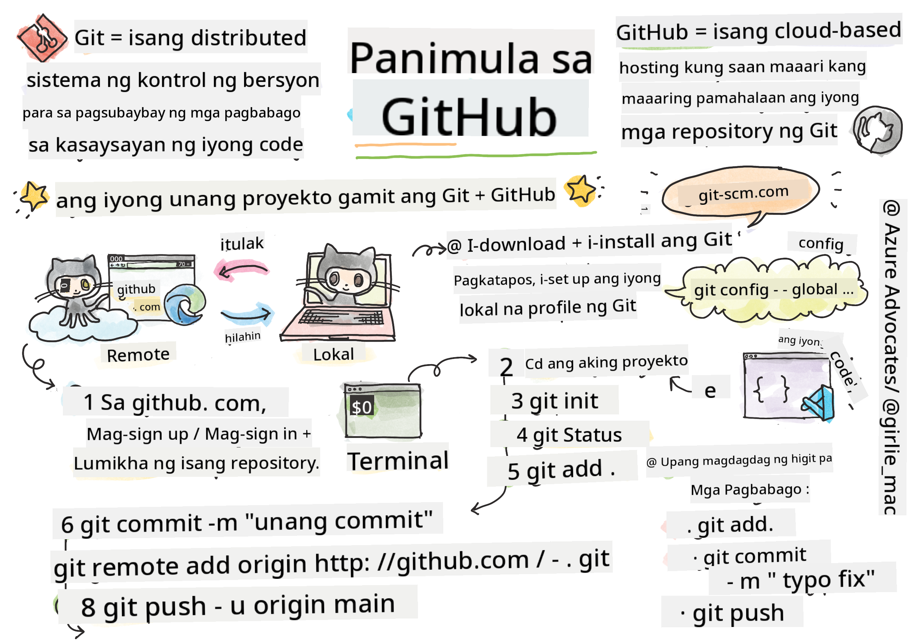

<!--
CO_OP_TRANSLATOR_METADATA:
{
  "original_hash": "05666cecb8983a72cf0ce1d18932b5b7",
  "translation_date": "2025-08-27T23:22:27+00:00",
  "source_file": "1-getting-started-lessons/2-github-basics/README.md",
  "language_code": "tl"
}
-->
# Panimula sa GitHub

Ang araling ito ay tumatalakay sa mga pangunahing kaalaman tungkol sa GitHub, isang platform para mag-host at mag-manage ng mga pagbabago sa iyong code.


> Sketchnote ni [Tomomi Imura](https://twitter.com/girlie_mac)

## Pre-Lecture Quiz
[Pre-lecture quiz](https://ff-quizzes.netlify.app/web/quiz/3)

## Panimula

Sa araling ito, tatalakayin natin ang:

- pagsubaybay sa mga gawaing ginagawa mo sa iyong makina
- pakikipagtulungan sa mga proyekto kasama ang iba
- paano mag-ambag sa open source software

### Mga Kinakailangan

Bago magsimula, kailangan mong tiyakin kung naka-install na ang Git. Sa terminal, i-type:  
`git --version`

Kung hindi pa naka-install ang Git, [i-download ang Git](https://git-scm.com/downloads). Pagkatapos, i-setup ang iyong lokal na Git profile sa terminal:
* `git config --global user.name "your-name"`
* `git config --global user.email "your-email"`

Para suriin kung naka-configure na ang Git, maaari mong i-type:
`git config --list`

Kailangan mo rin ng GitHub account, isang code editor (tulad ng Visual Studio Code), at kailangan mong buksan ang iyong terminal (o: command prompt).

Pumunta sa [github.com](https://github.com/) at gumawa ng account kung wala ka pa, o mag-login at punan ang iyong profile.

✅ Hindi lang GitHub ang code repository sa mundo; may iba pang mga platform, ngunit ang GitHub ang pinakakilala.

### Paghahanda

Kailangan mo ng folder na may code project sa iyong lokal na makina (laptop o PC), at isang pampublikong repository sa GitHub, na magsisilbing halimbawa kung paano mag-ambag sa mga proyekto ng iba.

---

## Pamamahala ng Code

Halimbawa, mayroon kang folder sa iyong lokal na makina na may code project at gusto mong simulan ang pagsubaybay sa iyong progreso gamit ang git - ang version control system. Ang iba ay ikinukumpara ang paggamit ng git sa pagsusulat ng love letter para sa iyong hinaharap na sarili. Sa pagbabasa ng iyong mga commit message makalipas ang ilang araw, linggo, o buwan, maaalala mo kung bakit mo ginawa ang isang desisyon, o "i-rollback" ang isang pagbabago - iyon ay, kung nagsusulat ka ng magagandang "commit messages."

### Gawain: Gumawa ng repository at mag-commit ng code  

> Panoorin ang video
> 
> [](https://www.youtube.com/watch?v=9R31OUPpxU4)

1. **Gumawa ng repository sa GitHub**. Sa GitHub.com, sa tab ng repositories, o mula sa navigation bar sa kanang itaas, hanapin ang **new repo** button.

   1. Bigyan ng pangalan ang iyong repository (folder).
   1. Piliin ang **create repository**.

1. **Pumunta sa iyong working folder**. Sa iyong terminal, lumipat sa folder (kilala rin bilang directory) na gusto mong simulan ang pagsubaybay. I-type:

   ```bash
   cd [name of your folder]
   ```

1. **I-initialize ang git repository**. Sa iyong proyekto, i-type:

   ```bash
   git init
   ```

1. **Suriin ang status**. Para suriin ang status ng iyong repository, i-type:

   ```bash
   git status
   ```

   Ang output ay maaaring ganito:

   ```output
   Changes not staged for commit:
   (use "git add <file>..." to update what will be committed)
   (use "git checkout -- <file>..." to discard changes in working directory)

        modified:   file.txt
        modified:   file2.txt
   ```

   Karaniwan, ang `git status` command ay nagsasabi ng mga bagay tulad ng kung anong mga file ang handa nang _i-save_ sa repo o may mga pagbabago na maaaring gusto mong i-persist.

1. **Idagdag ang lahat ng file para sa pagsubaybay**  
   Tinatawag din itong staging files/ pagdaragdag ng mga file sa staging area.

   ```bash
   git add .
   ```

   Ang `git add` kasama ang `.` argument ay nagpapahiwatig na lahat ng iyong mga file at pagbabago ay isasama para sa pagsubaybay.

1. **Idagdag ang mga napiling file para sa pagsubaybay**

   ```bash
   git add [file or folder name]
   ```

   Nakakatulong ito para idagdag lamang ang mga napiling file sa staging area kapag ayaw mong i-commit ang lahat ng file nang sabay-sabay.

1. **I-unstage ang lahat ng file**

   ```bash
   git reset
   ```

   Ang command na ito ay nakakatulong para i-unstage ang lahat ng file nang sabay-sabay.

1. **I-unstage ang partikular na file**

   ```bash
   git reset [file or folder name]
   ```

   Ang command na ito ay nakakatulong para i-unstage lamang ang isang partikular na file na ayaw mong isama sa susunod na commit.

1. **I-persist ang iyong trabaho**. Sa puntong ito, naidagdag mo na ang mga file sa tinatawag na _staging area_. Isang lugar kung saan sinusubaybayan ng Git ang iyong mga file. Para gawing permanente ang pagbabago, kailangan mong _i-commit_ ang mga file. Para gawin ito, gumawa ng _commit_ gamit ang `git commit` command. Ang _commit_ ay kumakatawan sa isang saving point sa kasaysayan ng iyong repo. I-type ang sumusunod para gumawa ng _commit_:

   ```bash
   git commit -m "first commit"
   ```

   Iko-commit nito ang lahat ng iyong file, na may mensaheng "first commit". Para sa mga susunod na commit message, mas mainam na maging mas detalyado sa iyong paglalarawan upang maipahayag kung anong uri ng pagbabago ang ginawa mo.

1. **Ikonekta ang iyong lokal na Git repo sa GitHub**. Ang Git repo ay maganda sa iyong makina ngunit sa isang punto, gusto mong magkaroon ng backup ng iyong mga file sa ibang lugar at mag-imbita ng ibang tao na makipagtulungan sa iyong repo. Ang isang mahusay na lugar para gawin ito ay ang GitHub. Tandaan na gumawa na tayo ng repo sa GitHub kaya ang tanging kailangan nating gawin ay ikonekta ang lokal na Git repo sa GitHub. Ang command na `git remote add` ang gagawa nito. I-type ang sumusunod na command:

   > Tandaan, bago i-type ang command, pumunta sa iyong GitHub repo page para hanapin ang repository URL. Gagamitin mo ito sa command sa ibaba. Palitan ang ```https://github.com/username/repository_name.git``` ng iyong GitHub URL.

   ```bash
   git remote add origin https://github.com/username/repository_name.git
   ```

   Gumagawa ito ng _remote_, o koneksyon, na pinangalanang "origin" na tumuturo sa GitHub repository na ginawa mo kanina.

1. **Ipadala ang mga lokal na file sa GitHub**. Sa ngayon, gumawa ka ng _connection_ sa pagitan ng lokal na repo at ng GitHub repo. Ipadala natin ang mga file na ito sa GitHub gamit ang sumusunod na command na `git push`, ganito: 

   > Tandaan, maaaring iba ang pangalan ng iyong branch sa default na ```main```.

   ```bash
   git push -u origin main
   ```

   Ipinapadala nito ang iyong mga commit sa iyong "main" branch sa GitHub.

2. **Magdagdag ng higit pang mga pagbabago**. Kung gusto mong magpatuloy sa paggawa ng mga pagbabago at i-push ang mga ito sa GitHub, kakailanganin mo lang gamitin ang sumusunod na tatlong command:

   ```bash
   git add .
   git commit -m "type your commit message here"
   git push
   ```

   > Tip, Maaaring gusto mo ring gumamit ng `.gitignore` file para maiwasan ang mga file na ayaw mong i-track na lumitaw sa GitHub - tulad ng notes file na iniimbak mo sa parehong folder ngunit walang lugar sa pampublikong repository. Makakahanap ka ng mga template para sa `.gitignore` files sa [.gitignore templates](https://github.com/github/gitignore).

#### Mga Commit Message

Ang isang mahusay na Git commit subject line ay kumukumpleto sa sumusunod na pangungusap:  
Kung maipapatupad, ang commit na ito ay <ang iyong subject line dito>

Para sa subject, gamitin ang imperative, present tense: "change" hindi "changed" o "changes".  
Tulad ng sa subject, sa body (opsyonal) ay gamitin din ang imperative, present tense. Ang body ay dapat maglaman ng motibasyon para sa pagbabago at ikumpara ito sa nakaraang behavior. Ipinaliwanag mo ang `bakit`, hindi ang `paano`.

✅ Maglaan ng ilang minuto para mag-surf sa GitHub. Makakakita ka ba ng isang mahusay na commit message? Makakakita ka ba ng isang napaka-minimal na mensahe? Anong impormasyon ang sa tingin mo ay pinakamahalaga at kapaki-pakinabang na ipahayag sa isang commit message?

### Gawain: Makipagtulungan

Ang pangunahing dahilan ng paglalagay ng mga bagay sa GitHub ay upang gawing posible ang pakikipagtulungan sa ibang mga developer.

## Pagtatrabaho sa mga proyekto kasama ang iba

> Panoorin ang video
>
> [](https://www.youtube.com/watch?v=bFCM-PC3cu8)

Sa iyong repository, pumunta sa `Insights > Community` para makita kung paano ikinukumpara ang iyong proyekto sa mga inirerekomendang pamantayan ng komunidad.

Narito ang ilang bagay na maaaring magpabuti sa iyong GitHub repo:
- **Description**. Nagdagdag ka ba ng description para sa iyong proyekto?
- **README**. Nagdagdag ka ba ng README? Nagbibigay ang GitHub ng gabay para sa pagsusulat ng [README](https://docs.github.com/articles/about-readmes/?WT.mc_id=academic-77807-sagibbon).
- **Contributing guideline**. Mayroon bang [contributing guidelines](https://docs.github.com/articles/setting-guidelines-for-repository-contributors/?WT.mc_id=academic-77807-sagibbon) ang iyong proyekto?  
- **Code of Conduct**. Mayroon bang [Code of Conduct](https://docs.github.com/articles/adding-a-code-of-conduct-to-your-project/)?  
- **License**. Marahil ang pinakamahalaga, mayroon bang [license](https://docs.github.com/articles/adding-a-license-to-a-repository/)?

Ang lahat ng mga resource na ito ay makakatulong sa onboarding ng mga bagong miyembro ng team. At ang mga ito ay karaniwang ang mga bagay na tinitingnan ng mga bagong contributor bago pa man tingnan ang iyong code, upang malaman kung ang iyong proyekto ay ang tamang lugar para sa kanila na gugulin ang kanilang oras.

✅ Ang mga README file, bagama't nangangailangan ng oras upang ihanda, ay madalas na napapabayaan ng mga abalang maintainer. Makakakita ka ba ng halimbawa ng isang partikular na detalyadong README? Tandaan: may ilang [tools para tumulong gumawa ng magagandang README](https://www.makeareadme.com/) na maaaring gusto mong subukan.

### Gawain: Mag-merge ng code

Ang mga contributing docs ay tumutulong sa mga tao na mag-ambag sa proyekto. Ipinaliwanag nito kung anong uri ng mga kontribusyon ang hinahanap mo at kung paano gumagana ang proseso. Ang mga contributor ay kailangang dumaan sa isang serye ng mga hakbang upang makapag-ambag sa iyong repo sa GitHub:

1. **Forking ng iyong repo**. Malamang gusto mong ipa-fork ang iyong proyekto sa mga tao. Ang forking ay nangangahulugan ng paggawa ng replika ng iyong repository sa kanilang GitHub profile.
1. **Clone**. Mula doon, i-clone nila ang proyekto sa kanilang lokal na makina.
1. **Gumawa ng branch**. Gusto mong hilingin sa kanila na gumawa ng _branch_ para sa kanilang trabaho.
1. **Mag-focus sa isang lugar**. Hilingin sa mga contributor na ituon ang kanilang kontribusyon sa isang bagay lamang sa bawat pagkakataon - sa ganitong paraan, mas mataas ang tsansa na ma-merge ang kanilang trabaho. Halimbawa, nagsulat sila ng bug fix, nagdagdag ng bagong feature, at nag-update ng ilang test - paano kung gusto mo, o maaari mo lamang i-implement ang 2 sa 3, o 1 sa 3 pagbabago?

✅ Mag-isip ng sitwasyon kung saan ang mga branch ay partikular na mahalaga sa pagsusulat at pagpapadala ng magandang code. Anong mga use case ang naiisip mo?

> Tandaan, maging ang pagbabago na gusto mong makita sa mundo, at gumawa ng mga branch para sa iyong sariling trabaho. Ang anumang mga commit na gagawin mo ay gagawin sa branch na kasalukuyan mong "checked out". Gamitin ang `git status` para makita kung aling branch iyon.

Dumaan tayo sa workflow ng isang contributor. Ipagpalagay na ang contributor ay naka-fork at naka-clone na ang repo kaya mayroon silang Git repo na handa nang trabahuin, sa kanilang lokal na makina:

1. **Gumawa ng branch**. Gamitin ang command na `git branch` para gumawa ng branch na maglalaman ng mga pagbabago na balak nilang i-ambag:

   ```bash
   git branch [branch-name]
   ```

1. **Lumipat sa working branch**. Lumipat sa tinukoy na branch at i-update ang working directory gamit ang `git switch`:

   ```bash
   git switch [branch-name]
   ```

1. **Gumawa ng trabaho**. Sa puntong ito, gusto mong idagdag ang iyong mga pagbabago. Huwag kalimutang ipaalam ito sa Git gamit ang mga sumusunod na command:

   ```bash
   git add .
   git commit -m "my changes"
   ```

   Siguraduhing bigyan ang iyong commit ng magandang pangalan, para sa iyong kapakanan pati na rin sa maintainer ng repo na tinutulungan mo.

1. **Pagsamahin ang iyong trabaho sa `main` branch**. Sa isang punto, tapos ka na sa paggawa at gusto mong pagsamahin ang iyong trabaho sa `main` branch. Ang `main` branch ay maaaring nagbago sa pagitan kaya siguraduhing i-update muna ito sa pinakabago gamit ang mga sumusunod na command:

   ```bash
   git switch main
   git pull
   ```

   Sa puntong ito, siguraduhing ang anumang _conflicts_, mga sitwasyon kung saan hindi madaling ma-combine ng Git ang mga pagbabago, ay nangyayari sa iyong working branch. Kaya't patakbuhin ang mga sumusunod na command:

   ```bash
   git switch [branch_name]
   git merge main
   ```

   Dadalhin nito ang lahat ng pagbabago mula sa `main` papunta sa iyong branch at sana ay maaari kang magpatuloy. Kung hindi, ipapakita sa iyo ng VS Code kung saan nalilito ang Git at babaguhin mo lang ang mga apektadong file upang sabihin kung aling content ang pinaka-tama.

1. **Ipadala ang iyong trabaho sa GitHub**. Ang pagpapadala ng iyong trabaho sa GitHub ay nangangahulugan ng dalawang bagay. Ang pag-push ng iyong branch sa iyong repo at pagkatapos ay magbukas ng PR, Pull Request.

   ```bash
   git push --set-upstream origin [branch-name]
   ```

   Ang command sa itaas ay lumilikha ng branch sa iyong forked repo.

1. **Magbukas ng PR**. Susunod, gusto mong magbukas ng PR. Gawin ito sa pamamagitan ng pagpunta sa forked repo sa GitHub. Makikita mo ang indikasyon sa GitHub kung saan tinatanong kung gusto mong gumawa ng bagong PR, i-click mo iyon at dadalhin ka sa interface kung saan maaari mong baguhin ang commit message title, bigyan ito ng mas angkop na paglalarawan. Ngayon makikita ng maintainer ng repo na na-fork mo ang PR na ito at _fingers crossed_ maa-appreciate nila at _merge_ ang iyong PR. Isa ka nang contributor, yay :)

1. **Linisin ang mga file**. Itinuturing na magandang kasanayan ang _linisin_ ang iyong mga file pagkatapos mong matagumpay na ma-merge ang isang PR. Gusto mong linisin ang parehong lokal na branch at ang branch na na-push mo sa GitHub. Una, tanggalin ito nang lokal gamit ang sumusunod na command:

   ```bash
   git branch -d [branch-name]
   ```
Siguraduhing pumunta ka sa GitHub page ng forked repo at tanggalin ang remote branch na kakapush mo lang dito.

Ang `Pull request` ay tila nakakatawang termino dahil ang gusto mo talagang gawin ay i-push ang mga pagbabago mo sa proyekto. Ngunit ang maintainer (may-ari ng proyekto) o core team ay kailangang suriin ang mga pagbabago mo bago ito i-merge sa "main" branch ng proyekto, kaya't talagang humihiling ka ng desisyon sa pagbabago mula sa maintainer.

Ang pull request ay lugar kung saan maikukumpara at mapag-uusapan ang mga pagkakaiba na ipinakilala sa isang branch gamit ang mga review, komento, integrated tests, at iba pa. Ang isang mahusay na pull request ay sumusunod sa halos parehong mga patakaran tulad ng isang commit message. Maaari kang magdagdag ng reference sa isang isyu sa issue tracker, halimbawa kung ang trabaho mo ay nag-aayos ng isang isyu. Ginagawa ito gamit ang `#` na sinusundan ng numero ng isyu. Halimbawa, `#97`.

🤞Sana lahat ng checks ay pumasa at i-merge ng may-ari ng proyekto ang mga pagbabago mo sa proyekto🤞

I-update ang kasalukuyang lokal na working branch mo gamit ang lahat ng bagong commits mula sa kaukulang remote branch sa GitHub:

`git pull`

## Paano mag-ambag sa open source

Una, maghanap ng repository (o **repo**) sa GitHub na interesado ka at gusto mong magdagdag ng pagbabago. Kakailanganin mong kopyahin ang mga nilalaman nito sa iyong makina.

✅ Isang magandang paraan para makahanap ng mga 'beginner-friendly' na repo ay ang [maghanap gamit ang tag na 'good-first-issue'](https://github.blog/2020-01-22-browse-good-first-issues-to-start-contributing-to-open-source/).


May ilang paraan para kopyahin ang code. Isa sa mga paraan ay ang "clone" ng mga nilalaman ng repository, gamit ang HTTPS, SSH, o ang GitHub CLI (Command Line Interface).

Buksan ang terminal mo at i-clone ang repository tulad nito:
`git clone https://github.com/ProjectURL`

Para magtrabaho sa proyekto, lumipat sa tamang folder:
`cd ProjectURL`

Maaari mo ring buksan ang buong proyekto gamit ang [Codespaces](https://github.com/features/codespaces), ang embedded code editor / cloud development environment ng GitHub, o [GitHub Desktop](https://desktop.github.com/).

Sa huli, maaari mong i-download ang code sa isang zipped folder.

### Ilang mga kawili-wiling bagay tungkol sa GitHub

Maaari kang mag-star, mag-watch, at/o "fork" ng anumang pampublikong repository sa GitHub. Makikita mo ang mga starred repositories mo sa drop-down menu sa kanang itaas. Para itong pag-bookmark, pero para sa code.

Ang mga proyekto ay may issue tracker, kadalasan sa GitHub sa tab na "Issues" maliban kung may ibang indikasyon, kung saan pinag-uusapan ng mga tao ang mga isyu na may kaugnayan sa proyekto. At ang Pull Requests tab ay kung saan pinag-uusapan at nire-review ang mga pagbabago na nasa proseso.

Ang mga proyekto ay maaaring may diskusyon sa forums, mailing lists, o chat channels tulad ng Slack, Discord, o IRC.

✅ Tingnan ang paligid ng bagong GitHub repo mo at subukan ang ilang bagay, tulad ng pag-edit ng mga setting, pagdaragdag ng impormasyon sa repo mo, at paglikha ng proyekto (tulad ng Kanban board). Maraming magagawa!

---

## 🚀 Hamon

Makipag-partner sa isang kaibigan para magtrabaho sa code ng isa't isa. Gumawa ng proyekto nang magkasama, mag-fork ng code, gumawa ng mga branch, at mag-merge ng mga pagbabago.

## Post-Lecture Quiz
[Post-lecture quiz](https://ff-quizzes.netlify.app/web/quiz/4)

## Review at Pag-aaral sa Sarili

Magbasa pa tungkol sa [pag-aambag sa open source software](https://opensource.guide/how-to-contribute/#how-to-submit-a-contribution).

[Git cheatsheet](https://training.github.com/downloads/github-git-cheat-sheet/).

Magpraktis, magpraktis, magpraktis. Ang GitHub ay may magagandang learning paths na makikita sa [skills.github.com](https://skills.github.com):

- [First Week on GitHub](https://skills.github.com/#first-week-on-github)

Makakakita ka rin ng mas advanced na mga kurso.

## Takdang-Aralin

Kumpletuhin ang [First Week on GitHub course](https://skills.github.com/#first-week-on-github).

---

**Paunawa**:  
Ang dokumentong ito ay isinalin gamit ang AI translation service na [Co-op Translator](https://github.com/Azure/co-op-translator). Bagama't sinisikap naming maging tumpak, pakitandaan na ang mga awtomatikong pagsasalin ay maaaring maglaman ng mga pagkakamali o hindi pagkakatugma. Ang orihinal na dokumento sa kanyang katutubong wika ang dapat ituring na opisyal na pinagmulan. Para sa mahalagang impormasyon, inirerekomenda ang propesyonal na pagsasalin ng tao. Hindi kami mananagot sa anumang hindi pagkakaunawaan o maling interpretasyon na dulot ng paggamit ng pagsasaling ito.