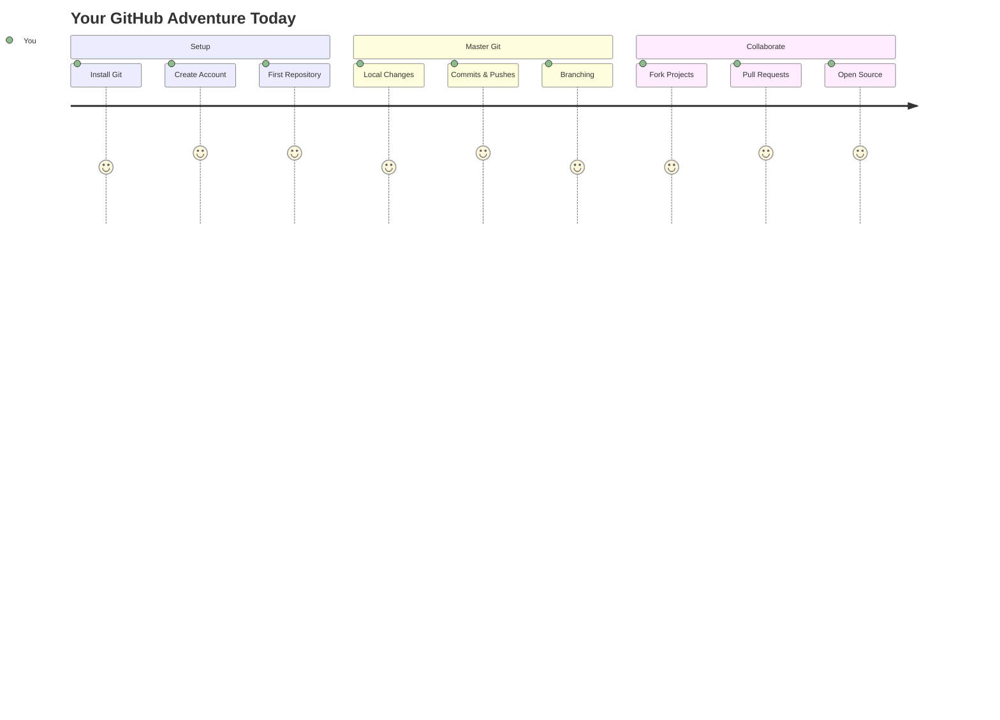
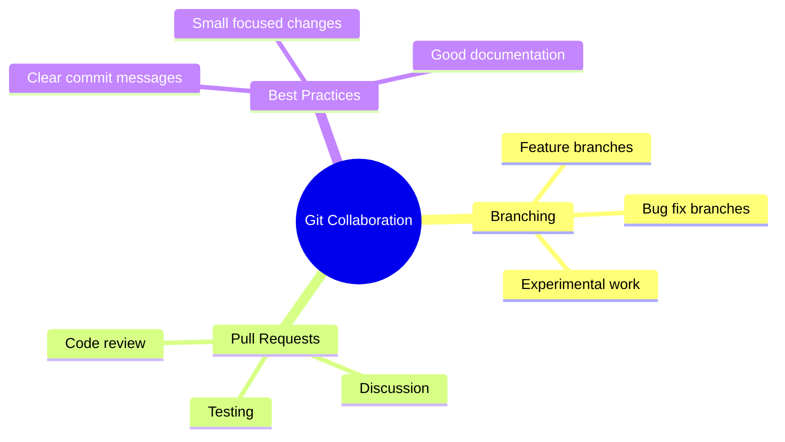
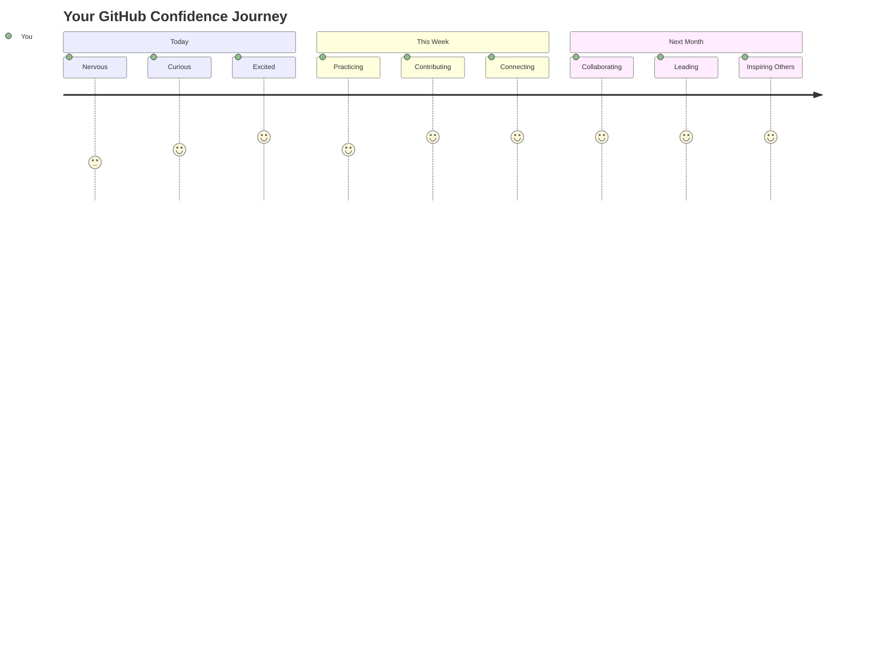

<!--
CO_OP_TRANSLATOR_METADATA:
{
  "original_hash": "0fe3ff66299b447f1c8cb34dcbf0c5ef",
  "translation_date": "2025-11-03T13:51:07+00:00",
  "source_file": "1-getting-started-lessons/2-github-basics/README.md",
  "language_code": "tl"
}
-->
# Panimula sa GitHub

Kamusta, hinaharap na developer! 👋 Handa ka na bang sumali sa milyon-milyong coder sa buong mundo? Talagang excited akong ipakilala sa iyo ang GitHub – isipin mo ito bilang social media platform para sa mga programmer, pero sa halip na magbahagi ng mga larawan ng tanghalian, nagbabahagi tayo ng code at gumagawa ng mga kamangha-manghang bagay nang sama-sama!

Narito ang nakakabilib: bawat app sa iyong telepono, bawat website na binibisita mo, at karamihan sa mga tool na matututunan mong gamitin ay ginawa ng mga team ng developer na nagtutulungan sa mga platform tulad ng GitHub. Yung music app na mahal mo? May isang tulad mo na nag-ambag dito. Yung laro na hindi mo mabitawan? Oo, malamang ginawa gamit ang GitHub collaboration. At ngayon, IKAW ang matututo kung paano maging bahagi ng kamangha-manghang komunidad na iyon!

Alam ko na maaaring medyo nakakatakot ito sa simula – naaalala ko pa ang unang beses kong tumingin sa GitHub page at iniisip "Ano ang ibig sabihin ng lahat ng ito?" Pero ganito kasi: bawat developer ay nagsimula sa eksaktong posisyon mo ngayon. Sa pagtatapos ng araling ito, magkakaroon ka ng sarili mong GitHub repository (isipin mo ito bilang personal na showcase ng iyong proyekto sa cloud), at malalaman mo kung paano i-save ang iyong trabaho, ibahagi ito sa iba, at mag-ambag sa mga proyekto na ginagamit ng milyon-milyong tao.

Sama-sama nating tatahakin ang paglalakbay na ito, hakbang-hakbang. Walang pagmamadali, walang pressure – ikaw, ako, at ilang napakagandang tools na magiging bagong matalik mong kaibigan!


> Sketchnote ni [Tomomi Imura](https://twitter.com/girlie_mac)



## Pre-Lecture Quiz
[Pre-lecture quiz](https://ff-quizzes.netlify.app)

## Panimula

Bago tayo sumabak sa mga talagang exciting na bagay, ihanda muna natin ang iyong computer para sa GitHub magic! Isipin mo ito na parang inaayos ang iyong mga art supplies bago gumawa ng obra maestra – ang pagkakaroon ng tamang tools ay nagpapadali at mas masaya ang lahat.

Sasamahan kita sa bawat hakbang ng setup, at ipinapangako ko na hindi ito kasing nakakatakot gaya ng maaaring isipin sa unang tingin. Kung may hindi agad maunawaan, normal lang iyon! Naalala ko pa ang unang beses kong mag-setup ng development environment at pakiramdam ko ay nagbabasa ako ng sinaunang hieroglyphics. Bawat developer ay dumaan sa eksaktong posisyon mo ngayon, iniisip kung tama ba ang ginagawa nila. Spoiler alert: kung nandito ka at nag-aaral, tama na ang ginagawa mo! 🌟

Sa araling ito, tatalakayin natin:

- paano subaybayan ang trabaho mo sa iyong computer
- paano makipagtulungan sa mga proyekto kasama ang iba
- paano mag-ambag sa open source software

### Mga Kinakailangan

Ihanda natin ang iyong computer para sa GitHub magic! Huwag mag-alala – ang setup na ito ay isang beses mo lang gagawin, at pagkatapos ay handa ka na para sa buong coding journey mo.

Sige, simulan natin sa pundasyon! Una, kailangan nating tingnan kung naka-install na ang Git sa iyong computer. Ang Git ay parang super-smart na assistant na naaalala ang bawat pagbabago na ginawa mo sa iyong code – mas magaling kaysa sa paulit-ulit na pag-hit ng Ctrl+S bawat dalawang segundo (lahat tayo nagawa na iyon!).

Tingnan kung naka-install na ang Git sa pamamagitan ng pag-type ng magic command na ito sa iyong terminal:
`git --version`

Kung wala pa ang Git, huwag mag-alala! Pumunta lang sa [download Git](https://git-scm.com/downloads) at kunin ito. Kapag na-install mo na, kailangan nating ipakilala ang Git sa iyo nang maayos:

> 💡 **Unang Setup**: Ang mga command na ito ay nagsasabi sa Git kung sino ka. Ang impormasyong ito ay ilalagay sa bawat commit na gagawin mo, kaya pumili ng pangalan at email na komportable kang ibahagi sa publiko.

```bash
git config --global user.name "your-name"
git config --global user.email "your-email"
```

Para tingnan kung naka-configure na ang Git, maaari kang mag-type:
```bash
git config --list
```

Kakailanganin mo rin ng GitHub account, isang code editor (tulad ng Visual Studio Code), at kailangan mong buksan ang iyong terminal (o: command prompt).

Pumunta sa [github.com](https://github.com/) at gumawa ng account kung wala ka pa, o mag-login at punan ang iyong profile.

💡 **Modernong Tip**: Isaalang-alang ang pag-setup ng [SSH keys](https://docs.github.com/en/authentication/connecting-to-github-with-ssh) o paggamit ng [GitHub CLI](https://cli.github.com/) para sa mas madaling authentication nang walang password.

✅ Hindi lang GitHub ang code repository sa mundo; may iba pa, pero ang GitHub ang pinakakilala.

### Paghahanda

Kakailanganin mo ng folder na may code project sa iyong lokal na makina (laptop o PC), at isang public repository sa GitHub, na magsisilbing halimbawa kung paano mag-ambag sa mga proyekto ng iba.

### Panatilihing Ligtas ang Iyong Code

Pag-usapan natin ang seguridad sandali – pero huwag mag-alala, hindi natin ito gagawing nakakatakot! Isipin mo ang mga security practices na ito na parang pag-lock ng iyong kotse o bahay. Simple lang ang mga ito, nagiging natural na ugali, at pinoprotektahan ang iyong pinaghirapan.

Ipapakita namin sa iyo ang modernong, secure na paraan ng paggamit ng GitHub mula sa simula. Sa ganitong paraan, makakabuo ka ng magagandang gawi na magagamit mo sa buong coding career mo.

Kapag gumagamit ng GitHub, mahalagang sundin ang mga best practices sa seguridad:

| Security Area | Best Practice | Bakit Mahalaga |
|---------------|---------------|----------------|
| **Authentication** | Gumamit ng SSH keys o Personal Access Tokens | Ang mga password ay hindi gaanong secure at unti-unting inaalis |
| **Two-Factor Authentication** | I-enable ang 2FA sa iyong GitHub account | Nagdadagdag ng karagdagang proteksyon sa account |
| **Repository Security** | Huwag kailanman i-commit ang sensitibong impormasyon | Ang mga API keys at password ay hindi dapat nasa public repos |
| **Dependency Management** | I-enable ang Dependabot para sa updates | Pinapanatiling secure at updated ang iyong mga dependencies |

> ⚠️ **Mahalagang Paalala sa Seguridad**: Huwag kailanman i-commit ang mga API keys, password, o iba pang sensitibong impormasyon sa anumang repository. Gumamit ng environment variables at `.gitignore` files para protektahan ang sensitibong data.

**Modernong Authentication Setup:**

```bash
# Generate SSH key (modern ed25519 algorithm)
ssh-keygen -t ed25519 -C "your_email@example.com"

# Set up Git to use SSH
git remote set-url origin git@github.com:username/repository.git
```

> 💡 **Pro Tip**: Ang SSH keys ay nag-aalis ng pangangailangan na paulit-ulit na maglagay ng password at mas secure kaysa sa tradisyunal na authentication methods.

---

## Pamamahala ng Iyong Code na Parang Pro

Okay, DITO na nagiging exciting ang lahat! 🎉 Matututo tayo kung paano subaybayan at pamahalaan ang iyong code na parang mga pro, at sa totoo lang, isa ito sa mga paborito kong ituro dahil sobrang game-changer nito.

Isipin mo ito: nagsusulat ka ng isang kamangha-manghang kuwento, at gusto mong subaybayan ang bawat draft, bawat brilliant edit, at bawat "wait, ang galing nito!" moment sa daan. Iyan ang ginagawa ng Git para sa iyong code! Parang may pinaka-kamangha-manghang time-traveling notebook na naaalala ang LAHAT – bawat keystroke, bawat pagbabago, bawat "oops, nasira ang lahat" moment na maaari mong agad na balikan.

Aaminin ko – maaaring nakaka-overwhelm ito sa simula. Noong nagsimula ako, iniisip ko "Bakit hindi ko na lang i-save ang mga files ko nang normal?" Pero magtiwala ka sa akin: kapag naintindihan mo ang Git (at mangyayari ito!), magkakaroon ka ng lightbulb moment kung saan iisipin mo "Paano ako NAG-CODE nang wala ito?" Parang natuklasan mong kaya mong lumipad pagkatapos maglakad sa lahat ng lugar sa buong buhay mo!

Halimbawa, mayroon kang folder na may code project at gusto mong simulan ang pagsubaybay sa iyong progreso gamit ang git - ang version control system. Ang iba ay ikinukumpara ang paggamit ng git sa pagsusulat ng love letter sa iyong hinaharap na sarili. Sa pagbabasa ng iyong commit messages ilang araw, linggo, o buwan pagkatapos, maaalala mo kung bakit mo ginawa ang isang desisyon, o "rollback" ang isang pagbabago – iyon ay, kapag nagsusulat ka ng magagandang "commit messages."

```mermaid
flowchart TD
    A[📁 Your Project Files] --> B{Is it a Git Repository?}
    B -->|No| C[git init]
    B -->|Yes| D[Make Changes]
    C --> D
    D --> E[git add .]
    E --> F["git commit -m 'message'"]
    F --> G[git push]
    G --> H[🌟 Code on GitHub!]
    
    H --> I{Want to collaborate?}
    I -->|Yes| J[Fork & Clone]
    I -->|No| D
    J --> K[Create Branch]
    K --> L[Make Changes]
    L --> M[Pull Request]
    M --> N[🎉 Contributing!]
    
    style A fill:#fff59d
    style H fill:#c8e6c9
    style N fill:#ff4081,color:#fff
```



### Gawain: Gumawa ng Iyong Unang Repository!

> 🎯 **Ang Iyong Misyon (at sobrang excited ako para sa iyo!)**: Gagawa tayo ng iyong unang GitHub repository nang magkasama! Sa oras na matapos tayo dito, magkakaroon ka ng sarili mong maliit na sulok sa internet kung saan nakatira ang iyong code, at magagawa mo ang iyong unang "commit" (developer speak para sa pag-save ng iyong trabaho sa napakatalinong paraan).
>
> Ito ay talagang espesyal na sandali – opisyal ka nang sasali sa global na komunidad ng mga developer! Naalala ko pa ang thrill ng paggawa ng aking unang repo at iniisip "Wow, ginagawa ko talaga ito!"

Sama-sama nating lakbayin ang adventure na ito, hakbang-hakbang. Dahan-dahan sa bawat bahagi – walang premyo para sa pagmamadali, at ipinapangako ko na bawat hakbang ay magkakaroon ng kahulugan. Tandaan, bawat coding superstar na hinahangaan mo ay minsang nakaupo sa eksaktong posisyon mo, handang gumawa ng kanilang unang repository. Ang cool, di ba?

> Panoorin ang video
> 
> [](https://www.youtube.com/watch?v=9R31OUPpxU4)

**Gawin Natin Ito Nang Magkasama:**

1. **Gumawa ng iyong repository sa GitHub**. Pumunta sa GitHub.com at hanapin ang maliwanag na berdeng **New** button (o ang **+** sign sa kanang itaas). I-click ito at piliin ang **New repository**.

   Narito ang gagawin:
   1. Bigyan ang iyong repository ng pangalan – gawing makabuluhan ito para sa iyo!
   1. Magdagdag ng description kung gusto mo (makakatulong ito sa iba na maunawaan kung tungkol saan ang iyong proyekto)
   1. Magdesisyon kung gusto mo itong public (makikita ng lahat) o private (para lang sa iyo)
   1. Inirerekumenda kong i-check ang box para magdagdag ng README file – parang front page ng iyong proyekto
   1. I-click ang **Create repository** at magdiwang – ginawa mo na ang iyong unang repo! 🎉

2. **Pumunta sa iyong project folder**. Ngayon buksan natin ang iyong terminal (huwag mag-alala, hindi ito kasing nakakatakot gaya ng hitsura nito!). Kailangan nating sabihin sa iyong computer kung nasaan ang iyong project files. I-type ang command na ito:

   ```bash
   cd [name of your folder]
   ```

   **Ang ginagawa natin dito:**
   - Parang sinasabi natin "Hey computer, dalhin mo ako sa project folder ko"
   - Parang binubuksan ang isang specific folder sa iyong desktop, pero ginagawa natin ito gamit ang text commands
   - Palitan ang `[name of your folder]` ng aktwal na pangalan ng iyong project folder

3. **Gawin ang iyong folder bilang Git repository**. Dito nangyayari ang magic! I-type:

   ```bash
   git init
   ```

   **Narito ang nangyari (sobrang cool na bagay!):**
   - Gumawa ang Git ng nakatagong `.git` folder sa iyong proyekto – hindi mo ito makikita, pero nandiyan ito!
   - Ang iyong regular na folder ay ngayon isang "repository" na maaaring subaybayan ang bawat pagbabago na ginagawa mo
   - Isipin mo ito na parang binibigyan ang iyong folder ng superpowers para maalala ang lahat

4. **Tingnan kung ano ang nangyayari**. Tingnan natin kung ano ang iniisip ng Git tungkol sa iyong proyekto ngayon:

   ```bash
   git status
   ```

   **Pag-unawa sa sinasabi ng Git:**
   
   Maaaring makakita ka ng ganito:

   ```output
   Changes not staged for commit:
   (use "git add <file>..." to update what will be committed)
   (use "git restore <file>..." to discard changes in working directory)

        modified:   file.txt
        modified:   file2.txt
   ```

   **Huwag mag-panic! Narito ang ibig sabihin nito:**
   - Ang mga file na **pula** ay mga file na may mga pagbabago pero hindi pa handang i-save
   - Ang mga file na **berde** (kapag nakita mo sila) ay handa nang i-save
   - Ang Git ay tumutulong sa pamamagitan ng pagsasabi kung ano ang maaari mong gawin sa susunod

   > 💡 **Pro tip**: Ang `git status` command ay ang iyong matalik na kaibigan! Gamitin ito anumang oras na nalilito ka sa kung ano ang nangyayari. Parang tinatanong mo ang Git "Hey, ano ang sitwasyon ngayon?"

5. **Ihanda ang iyong mga file para i-save** (tinatawag itong "staging"):

   ```bash
   git add .
   ```

   **Ang ginawa natin:**
   - Sinabi natin sa Git "Hey, gusto kong isama LAHAT ng files ko sa susunod na save"
   - Ang `.` ay parang sinasabi "lahat ng nasa folder na ito"
   - Ngayon ang iyong mga file ay "staged" at handa na para sa susunod na hakbang

   **Gusto mo bang maging mas mapili?** Maaari mong idagdag ang specific na mga file lamang:

   ```bash
   git add [file or folder name]
   ```

   **Bakit mo gustong gawin ito?**
   - Minsan gusto mong i-save ang mga kaugnay na pagbabago nang sabay-sabay
   - Nakakatulong ito sa pag-organisa ng iyong trabaho sa lohikal na mga bahagi
   - Pinapadali ang pag-unawa kung ano ang nagbago at kailan

   **Nagbago ang isip mo?** Walang problema! Maaari mong alisin ang mga file sa staging gamit ito:

   ```bash
   # Unstage everything
   git reset
   
   # Unstage just one file
   git reset [file name]
   ```

   Huwag mag-alala – hindi nito binubura ang iyong trabaho, tinatanggal lang nito ang mga file sa "ready to save" pile.

6. **I-save ang iyong trabaho nang permanente** (gawin ang iyong unang commit!):

   ```bash
   git commit -m "first commit"
   ```

   **🎉 Binabati kita! Ginawa mo na ang iyong unang commit!**
   
   **Narito ang nangyari:**
   - Kinuha ng Git ang "snapshot" ng lahat ng iyong staged files sa eksaktong sandaling ito
   - Ang iyong commit message na "first commit" ay nagpapaliwanag kung tungkol saan ang save point na ito
   - Binigyan ng Git ang snapshot na ito ng unique ID para palaging mahanap mo ito sa hinaharap
   - Opisyal mo nang nasimulan ang pagsubaybay sa kasaysayan ng iyong proyekto!

   > 💡 **Mga susunod na commit messages**: Para sa iyong mga susunod na commit, maging mas descriptive! Sa halip na "updated stuff", subukang "Add contact form to homepage" o "Fix navigation menu bug". Magpapasalamat ang iyong hinaharap na sarili!

7. **Ikonekta ang iyong lokal na proyekto sa GitHub**. Sa ngayon, ang iyong proyekto ay nasa iyong computer lamang. Ikonekta natin ito sa iyong GitHub repository para maibahagi mo ito sa mundo!

   Una, pumunta sa iyong GitHub repository page at kopyahin ang URL. Pagkatapos bumalik dito at i-type:

   ```bash
   git remote add origin https://github.com/username/repository_name.git
   ```
   
   (Palitan ang URL na iyon ng aktwal na URL ng iyong repository!)
**Ang ginawa natin:**
- Gumawa tayo ng koneksyon sa pagitan ng iyong lokal na proyekto at ng iyong GitHub repository.
- Ang "Origin" ay parang palayaw para sa iyong GitHub repository – parang pagdaragdag ng contact sa iyong telepono.
- Ngayon, alam na ng iyong lokal na Git kung saan ipapadala ang iyong code kapag handa ka nang ibahagi ito.

💡 **Mas madali**: Kung may naka-install kang GitHub CLI, magagawa mo ito gamit ang isang command:
   ```bash
   gh repo create my-repo --public --push --source=.
   ```

8. **I-upload ang iyong code sa GitHub** (ang malaking sandali!):

   ```bash
   git push -u origin main
   ```

**🚀 Ito na! Ina-upload mo ang iyong code sa GitHub!**

**Ano ang nangyayari:**
- Ang iyong mga commit ay naglalakbay mula sa iyong computer papunta sa GitHub.
- Ang `-u` flag ay nagse-set up ng permanenteng koneksyon para mas madali ang mga susunod na push.
- Ang "main" ay ang pangalan ng iyong pangunahing branch (parang pangunahing folder).
- Pagkatapos nito, maaari mo na lang gamitin ang `git push` para sa mga susunod na upload!

💡 **Mabilis na paalala**: Kung ang pangalan ng iyong branch ay iba (halimbawa, "master"), gamitin ang pangalan na iyon. Maaari mong i-check gamit ang `git branch --show-current`.

9. **Ang iyong bagong pang-araw-araw na coding rhythm** (dito na nagiging nakakaadik!):

Simula ngayon, tuwing may babaguhin ka sa iyong proyekto, mayroon kang simpleng tatlong hakbang na gagawin:

   ```bash
   git add .
   git commit -m "describe what you changed"
   git push
   ```

**Ito ang magiging tibok ng iyong coding:**
- Gumawa ng mga kahanga-hangang pagbabago sa iyong code ✨
- I-stage ang mga ito gamit ang `git add` ("Hey Git, pansinin mo ang mga pagbabagong ito!")
- I-save ang mga ito gamit ang `git commit` at maglagay ng detalyadong mensahe (magpapasalamat ka sa sarili mo sa hinaharap!)
- Ibahagi ang mga ito sa mundo gamit ang `git push` 🚀
- Ulitin lang – seryoso, magiging natural na ito tulad ng paghinga!

Gusto ko ang workflow na ito dahil parang may maraming save points sa isang video game. May nagawa kang pagbabago na gusto mo? I-commit ito! Gusto mong subukan ang isang risky na bagay? Walang problema – palaging pwede kang bumalik sa huling commit kung may hindi maganda.

> 💡 **Tip**: Baka gusto mo ring gumamit ng `.gitignore` file para maiwasan ang pag-track ng mga file na ayaw mong makita sa GitHub - tulad ng mga notes file na nasa parehong folder pero walang lugar sa isang public repository. Makakahanap ka ng mga template para sa `.gitignore` files sa [.gitignore templates](https://github.com/github/gitignore) o gumawa ng isa gamit ang [gitignore.io](https://www.toptal.com/developers/gitignore).

### 🧠 **Unang Check-in ng Repository: Ano ang Pakiramdam?**

**Maglaan ng sandali para magdiwang at magmuni-muni:**
- Ano ang pakiramdam na makita ang iyong code sa GitHub sa unang pagkakataon?
- Aling hakbang ang pinaka-nakalilito, at alin ang nakakagulat na madali?
- Kaya mo bang ipaliwanag ang pagkakaiba ng `git add`, `git commit`, at `git push` sa sarili mong mga salita?

```mermaid
stateDiagram-v2
    [*] --> LocalFiles: Create project
    LocalFiles --> Staged: git add .
    Staged --> Committed: git commit
    Committed --> GitHub: git push
    GitHub --> [*]: Success! 🎉
    
    note right of Staged
        Files ready to save
    end note
    
    note right of Committed
        Snapshot created
    end note
```



> **Tandaan**: Kahit ang mga bihasang developer ay minsan nakakalimutan ang eksaktong mga command. Ang pagbuo ng muscle memory para sa workflow na ito ay nangangailangan ng pagsasanay - mahusay ang ginagawa mo!

#### Modernong Git workflows

Isaalang-alang ang paggamit ng mga modernong praktis:

- **Conventional Commits**: Gumamit ng standardized na format ng commit message tulad ng `feat:`, `fix:`, `docs:`, atbp. Alamin pa sa [conventionalcommits.org](https://www.conventionalcommits.org/)
- **Atomic commits**: Gawin ang bawat commit na kumakatawan sa isang lohikal na pagbabago.
- **Frequent commits**: Mag-commit nang madalas na may detalyadong mga mensahe kaysa sa malalaking, bihirang mga commit.

#### Mga mensahe ng commit

Ang isang mahusay na subject line ng Git commit ay kumukumpleto sa sumusunod na pangungusap:
Kung ilalapat, ang commit na ito ay <iyong subject line dito>

Para sa subject, gumamit ng imperative, present tense: "baguhin" hindi "binago" o "binabago". Tulad ng sa subject, sa body (opsyonal) ay gumamit din ng imperative, present tense. Ang body ay dapat maglaman ng motibasyon para sa pagbabago at ikumpara ito sa nakaraang behavior. Ipinaliwanag mo ang `bakit`, hindi ang `paano`.

✅ Maglaan ng ilang minuto para mag-browse sa GitHub. Makakakita ka ba ng isang talagang mahusay na mensahe ng commit? Makakakita ka ba ng isang talagang minimal na mensahe? Anong impormasyon ang sa tingin mo ay pinaka-mahalaga at kapaki-pakinabang na ipahayag sa isang commit message?

## Pakikipagtulungan sa Iba (Ang Masayang Bahagi!)

Humanda ka dahil DITO nagiging sobrang kamangha-mangha ang GitHub! 🪄 Master mo na ang pamamahala sa sarili mong code, pero ngayon papasok tayo sa paborito kong bahagi – ang pakikipagtulungan sa mga kahanga-hangang tao mula sa iba't ibang bahagi ng mundo.

Isipin ito: paggising mo bukas, may isang tao sa Tokyo na nagpa-improve ng iyong code habang natutulog ka. Pagkatapos, may isang tao sa Berlin na nag-ayos ng bug na matagal mo nang sinusubukan. Sa hapon, may developer sa São Paulo na nagdagdag ng feature na hindi mo man lang naisip. Hindi ito science fiction – ito lang ang normal na Martes sa GitHub universe!

Ang talagang nagpapasaya sa akin ay ang mga kasanayan sa pakikipagtulungan na matututunan mo? Ito ang EXACT na workflows na ginagamit ng mga team sa Google, Microsoft, at ng mga paborito mong startup araw-araw. Hindi ka lang natututo ng cool na tool – natututo ka ng lihim na wika na nagpapagana sa buong software world na magtulungan.

Seryoso, kapag naranasan mo ang rush ng may nag-merge ng iyong unang pull request, maiintindihan mo kung bakit sobrang passionate ang mga developer tungkol sa open source. Parang bahagi ka ng pinakamalaking, pinaka-malikhain na team project sa mundo!

> Tingnan ang video
>
> [](https://www.youtube.com/watch?v=bFCM-PC3cu8)

Ang pangunahing dahilan ng paglalagay ng mga bagay sa GitHub ay upang gawing posible ang pakikipagtulungan sa ibang mga developer.

```mermaid
flowchart LR
    A[🔍 Find Project] --> B[🍴 Fork Repository]
    B --> C[📥 Clone to Local]
    C --> D[🌿 Create Branch]
    D --> E[✏️ Make Changes]
    E --> F[💾 Commit Changes]
    F --> G[📤 Push Branch]
    G --> H[🔄 Create Pull Request]
    H --> I{Maintainer Review}
    I -->|✅ Approved| J[🎉 Merge!]
    I -->|❓ Changes Requested| K[📝 Make Updates]
    K --> F
    J --> L[🧹 Clean Up Branches]
    
    style A fill:#e3f2fd
    style J fill:#e8f5e8
    style L fill:#fff3e0
```



Sa iyong repository, mag-navigate sa `Insights > Community` para makita kung paano ikinukumpara ang iyong proyekto sa mga inirerekomendang pamantayan ng komunidad.

Gusto mo bang gawing propesyonal at welcoming ang iyong repository? Pumunta sa iyong repository at i-click ang `Insights > Community`. Ipinapakita ng cool na feature na ito kung paano ikinukumpara ang iyong proyekto sa kung ano ang itinuturing ng komunidad ng GitHub na "magandang praktis sa repository."

> 🎯 **Pagpapaganda ng Iyong Proyekto**: Ang maayos na repository na may magandang dokumentasyon ay parang malinis, welcoming na storefront. Ipinapakita nito na mahalaga sa iyo ang iyong trabaho at nakakaengganyo sa iba na mag-contribute!

**Narito ang mga bagay na nagpapaganda sa isang repository:**

| Ano ang Idadagdag | Bakit Mahalaga | Ano ang Nagagawa Nito para sa Iyo |
|-------------------|---------------|-----------------------------------|
| **Description** | Mahalaga ang unang impresyon! | Malalaman agad ng mga tao kung ano ang ginagawa ng iyong proyekto |
| **README** | Front page ng iyong proyekto | Parang friendly na tour guide para sa mga bagong bisita |
| **Contributing Guidelines** | Ipinapakita na welcome ang tulong | Malalaman ng mga tao kung paano sila makakatulong sa iyo |
| **Code of Conduct** | Lumilikha ng friendly na espasyo | Lahat ay makakaramdam ng welcome na makilahok |
| **License** | Legal na kalinawan | Malalaman ng iba kung paano nila magagamit ang iyong code |
| **Security Policy** | Ipinapakita na responsable ka | Nagpapakita ng propesyonal na praktis |

> 💡 **Pro Tip**: Nagbibigay ang GitHub ng mga template para sa lahat ng mga file na ito. Kapag gumagawa ng bagong repository, i-check ang mga kahon para awtomatikong makabuo ng mga file na ito.

**Mga Modernong Feature ng GitHub na Dapat Tuklasin:**

🤖 **Automation & CI/CD:**
- **GitHub Actions** para sa automated testing at deployment
- **Dependabot** para sa automatic dependency updates

💬 **Komunidad at Pamamahala ng Proyekto:**
- **GitHub Discussions** para sa mga pag-uusap ng komunidad na lampas sa mga isyu
- **GitHub Projects** para sa kanban-style na pamamahala ng proyekto
- **Branch protection rules** para maipatupad ang mga pamantayan sa kalidad ng code

Ang lahat ng mga resource na ito ay makakatulong sa onboarding ng mga bagong miyembro ng team. At ito ang mga bagay na karaniwang tinitingnan ng mga bagong contributor bago pa man tingnan ang iyong code, upang malaman kung ang iyong proyekto ay tamang lugar para sa kanila na gugulin ang kanilang oras.

✅ Ang mga README files, bagama't nangangailangan ng oras para ihanda, ay madalas na napapabayaan ng mga abalang maintainer. Makakakita ka ba ng halimbawa ng isang partikular na detalyado? Tandaan: may ilang [tools para tumulong gumawa ng magagandang README](https://www.makeareadme.com/) na maaaring gusto mong subukan.

### Gawain: Mag-merge ng code

Ang mga contributing docs ay tumutulong sa mga tao na mag-contribute sa proyekto. Ipinapaliwanag nito kung anong uri ng mga kontribusyon ang hinahanap mo at kung paano gumagana ang proseso. Ang mga contributor ay kailangang dumaan sa isang serye ng mga hakbang upang makapag-contribute sa iyong repo sa GitHub:

1. **Forking your repo**. Malamang gusto mong ipa-_fork_ ang iyong proyekto sa mga tao. Ang forking ay nangangahulugan ng paggawa ng replica ng iyong repository sa kanilang GitHub profile.
1. **Clone**. Mula doon, i-clone nila ang proyekto sa kanilang lokal na makina.
1. **Create a branch**. Gusto mong hilingin sa kanila na gumawa ng _branch_ para sa kanilang trabaho.
1. **Focus their change on one area**. Hilingin sa mga contributor na i-concentrate ang kanilang kontribusyon sa isang bagay sa bawat pagkakataon - sa ganitong paraan mas mataas ang tsansa na ma-_merge_ ang kanilang trabaho. Isipin na gumawa sila ng bug fix, nagdagdag ng bagong feature, at nag-update ng ilang tests - paano kung gusto mo, o maaari mo lang i-implement ang 2 sa 3, o 1 sa 3 pagbabago?

✅ Isipin ang isang sitwasyon kung saan ang mga branch ay partikular na mahalaga sa pagsusulat at pagpapadala ng magandang code. Anong mga use case ang naiisip mo?

> Tandaan, maging ang pagbabago na gusto mong makita sa mundo, at gumawa ng mga branch para sa sarili mong trabaho. Ang anumang mga commit na gagawin mo ay gagawin sa branch na kasalukuyan mong "checked out". Gamitin ang `git status` para makita kung aling branch iyon.

Dumaan tayo sa workflow ng isang contributor. Ipagpalagay na ang contributor ay naka-_fork_ at naka-_clone_ na ang repo kaya mayroon silang Git repo na handa nang trabahuin sa kanilang lokal na makina:

1. **Gumawa ng branch**. Gamitin ang command na `git branch` para gumawa ng branch na maglalaman ng mga pagbabagong nais nilang i-contribute:

   ```bash
   git branch [branch-name]
   ```

   > 💡 **Modernong Paraan**: Maaari ka ring gumawa at lumipat sa bagong branch gamit ang isang command:
   ```bash
   git switch -c [branch-name]
   ```

1. **Lumipat sa working branch**. Lumipat sa tinukoy na branch at i-update ang working directory gamit ang `git switch`:

   ```bash
   git switch [branch-name]
   ```

   > 💡 **Modernong Paalala**: Ang `git switch` ay ang modernong kapalit ng `git checkout` kapag nagbabago ng branch. Mas malinaw at mas ligtas para sa mga baguhan.

1. **Gumawa ng trabaho**. Sa puntong ito gusto mong idagdag ang iyong mga pagbabago. Huwag kalimutang ipaalam ito sa Git gamit ang mga sumusunod na command:

   ```bash
   git add .
   git commit -m "my changes"
   ```

   > ⚠️ **Kalidad ng Commit Message**: Siguraduhing magbigay ka ng magandang pangalan sa iyong commit, para sa iyong kapakanan at sa maintainer ng repo na tinutulungan mo. Maging specific sa kung ano ang binago mo!

1. **Pagsamahin ang iyong trabaho sa `main` branch**. Sa isang punto tapos ka na sa trabaho at gusto mong pagsamahin ang iyong trabaho sa `main` branch. Ang `main` branch ay maaaring nagbago sa pagitan kaya siguraduhing i-update muna ito sa pinakabago gamit ang mga sumusunod na command:

   ```bash
   git switch main
   git pull
   ```

   Sa puntong ito gusto mong tiyakin na ang anumang _conflicts_, mga sitwasyon kung saan hindi madaling ma-_combine_ ng Git ang mga pagbabago, ay mangyayari sa iyong working branch. Kaya't patakbuhin ang mga sumusunod na command:

   ```bash
   git switch [branch_name]
   git merge main
   ```

   Ang `git merge main` command ay magdadala ng lahat ng pagbabago mula sa `main` papunta sa iyong branch. Sana ay maaari kang magpatuloy. Kung hindi, ipapakita sa iyo ng VS Code kung saan nalilito ang Git at babaguhin mo lang ang mga apektadong file upang sabihin kung aling content ang pinaka-tama.

   💡 **Modernong alternatibo**: Isaalang-alang ang paggamit ng `git rebase` para sa mas malinis na history:
   ```bash
   git rebase main
   ```
   Ire-replay nito ang iyong mga commit sa ibabaw ng pinakabagong main branch, na lumilikha ng linear na history.

1. **I-upload ang iyong trabaho sa GitHub**. Ang pag-upload ng iyong trabaho sa GitHub ay nangangahulugan ng dalawang bagay. Ang pag-push ng iyong branch sa iyong repo at pagkatapos ay magbukas ng PR, Pull Request.

   ```bash
   git push --set-upstream origin [branch-name]
   ```

   Ang command sa itaas ay lumilikha ng branch sa iyong forked repo.

### 🤝 **Pag-check ng Kasanayan sa Pakikipagtulungan: Handa Ka Na Bang Makipagtulungan?**

**Tingnan natin kung ano ang pakiramdam mo tungkol sa pakikipagtulungan:**
- Naiintindihan mo na ba ang ideya ng forking at pull requests?
- Ano ang isang bagay tungkol sa paggamit ng mga branch na gusto mong mas pag-aralan?
- Gaano ka komportable sa pag-contribute sa proyekto ng ibang tao?



> **Pampalakas ng loob**: Ang bawat developer na hinahangaan mo ay minsang kinakabahan sa kanilang unang pull request. Ang komunidad ng GitHub ay sobrang welcoming sa mga baguhan!

1. **Magbukas ng PR**. Susunod, gusto mong magbukas ng PR. Gawin mo ito sa pamamagitan ng pag-navigate sa forked repo sa GitHub. Makikita mo ang indikasyon sa GitHub kung saan tinatanong kung gusto mong gumawa ng bagong PR, i-click mo iyon at dadalhin ka sa interface kung saan maaari mong baguhin ang commit message title, magbigay ng mas angkop na deskripsyon. Ngayon makikita ng maintainer ng repo na na-fork mo ang PR na ito at _fingers crossed_ maa-appreciate nila at _merge_ ang iyong PR. Isa ka nang contributor, yay :)

💡 **Modernong tip**: Maaari ka ring gumawa ng PR gamit ang GitHub CLI:
   ```bash
   gh pr create --title "Your PR title" --body "Description of changes"
   ```

🔧 **Pinakamahusay na praktis para sa PRs**:
- I-link ang mga kaugnay na isyu gamit ang mga keyword tulad ng "Fixes #123".
- Magdagdag ng screenshots para sa mga pagbabago sa UI.
- Mag-request ng specific na reviewers.
- Gumamit ng draft PRs para sa work-in-progress.
- Siguraduhing pumasa ang lahat ng CI checks bago mag-request ng review.
1. **Linisin**. Itinuturing na magandang kasanayan ang _linisin_ pagkatapos mong matagumpay na ma-merge ang isang PR. Gusto mong linisin ang parehong lokal na branch mo at ang branch na na-push mo sa GitHub. Una, tanggalin ito sa lokal gamit ang sumusunod na utos:

   ```bash
   git branch -d [branch-name]
   ```

   Siguraduhing pumunta ka sa pahina ng GitHub para sa forked na repo at alisin ang remote branch na na-push mo dito.

Ang `Pull request` ay tila nakakatawang termino dahil ang totoo ay gusto mong i-push ang mga pagbabago mo sa proyekto. Ngunit ang maintainer (may-ari ng proyekto) o core team ay kailangang isaalang-alang ang mga pagbabago mo bago ito i-merge sa "main" branch ng proyekto, kaya't talagang humihiling ka ng desisyon sa pagbabago mula sa maintainer.

Ang pull request ay lugar para ikumpara at talakayin ang mga pagkakaiba na ipinakilala sa isang branch gamit ang mga review, komento, integrated tests, at iba pa. Ang isang mahusay na pull request ay sumusunod sa halos parehong mga patakaran tulad ng isang commit message. Maaari kang magdagdag ng reference sa isang isyu sa issue tracker, halimbawa kung ang trabaho mo ay nag-aayos ng isang isyu. Ginagawa ito gamit ang `#` na sinusundan ng numero ng isyu mo. Halimbawa, `#97`.

🤞Sana lahat ng checks ay pumasa at i-merge ng may-ari ng proyekto ang mga pagbabago mo sa proyekto🤞

I-update ang kasalukuyang lokal na working branch mo gamit ang lahat ng bagong commits mula sa kaukulang remote branch sa GitHub:

`git pull`

## Pag-aambag sa Open Source (Ang Iyong Pagkakataon na Magkaroon ng Epekto!)

Handa ka na ba para sa isang bagay na magpapamangha sa iyo? 🤯 Pag-usapan natin ang pag-aambag sa mga open source na proyekto – at kinikilabutan ako sa tuwing iniisip kong ibahagi ito sa iyo!

Ito ang pagkakataon mo na maging bahagi ng isang bagay na tunay na kahanga-hanga. Isipin mong pinapabuti ang mga tool na ginagamit ng milyon-milyong mga developer araw-araw, o inaayos ang isang bug sa isang app na mahal ng mga kaibigan mo. Hindi lang ito pangarap – ito ang tungkol sa pag-aambag sa open source!

Narito ang nagbibigay sa akin ng kilabot tuwing iniisip ko ito: bawat tool na natutunan mo – ang code editor mo, ang mga framework na pag-aaralan natin, kahit ang browser na binabasa mo ito – nagsimula sa isang tao na katulad mo na gumagawa ng kanilang unang kontribusyon. Ang magaling na developer na gumawa ng paborito mong VS Code extension? Sila rin ay minsang baguhan na nagki-click ng "create pull request" na nanginginig ang mga kamay, tulad ng gagawin mo.

At narito ang pinakamagandang bahagi: ang open source na komunidad ay parang pinakamalaking group hug ng internet. Karamihan sa mga proyekto ay aktibong naghahanap ng mga baguhan at may mga isyung may tag na "good first issue" na partikular para sa mga tulad mo! Ang mga maintainer ay talagang nasasabik kapag nakikita nila ang mga bagong contributor dahil naaalala nila ang kanilang sariling unang hakbang.

```mermaid
flowchart TD
    A[🔍 Explore GitHub] --> B[🏷️ Find "good first issue"]
    B --> C[📖 Read Contributing Guidelines]
    C --> D[🍴 Fork Repository]
    D --> E[💻 Set Up Local Environment]
    E --> F[🌿 Create Feature Branch]
    F --> G[✨ Make Your Contribution]
    G --> H[🧪 Test Your Changes]
    H --> I[📝 Write Clear Commit]
    I --> J[📤 Push & Create PR]
    J --> K[💬 Engage with Feedback]
    K --> L[🎉 Merged! You're a Contributor!]
    L --> M[🌟 Find Next Issue]
    
    style A fill:#e1f5fe
    style L fill:#c8e6c9
    style M fill:#fff59d
```

Hindi ka lang natututo ng coding dito – naghahanda ka para sumali sa isang pandaigdigang pamilya ng mga tagabuo na gumigising araw-araw na iniisip "Paano natin mapapabuti ang digital na mundo?" Maligayang pagdating sa club! 🌟

Una, maghanap tayo ng repository (o **repo**) sa GitHub na interesado ka at kung saan gusto mong mag-ambag ng pagbabago. Gusto mong kopyahin ang nilalaman nito sa iyong makina.

✅ Isang magandang paraan para makahanap ng 'beginner-friendly' na mga repo ay ang [maghanap gamit ang tag na 'good-first-issue'](https://github.blog/2020-01-22-browse-good-first-issues-to-start-contributing-to-open-source/).


May ilang paraan para kopyahin ang code. Isa sa mga paraan ay ang "clone" ng nilalaman ng repository, gamit ang HTTPS, SSH, o gamit ang GitHub CLI (Command Line Interface).

Buksan ang terminal mo at i-clone ang repository tulad nito:
```bash
# Using HTTPS
git clone https://github.com/ProjectURL

# Using SSH (requires SSH key setup)
git clone git@github.com:username/repository.git

# Using GitHub CLI
gh repo clone username/repository
```

Para magtrabaho sa proyekto, lumipat sa tamang folder:
`cd ProjectURL`

Maaari mo ring buksan ang buong proyekto gamit ang:
- **[GitHub Codespaces](https://github.com/features/codespaces)** - Cloud development environment ng GitHub na may VS Code sa browser
- **[GitHub Desktop](https://desktop.github.com/)** - GUI application para sa mga operasyon ng Git  
- **[GitHub.dev](https://github.dev)** - Pindutin ang `.` key sa anumang GitHub repo para buksan ang VS Code sa browser
- **VS Code** na may GitHub Pull Requests extension

Sa huli, maaari mong i-download ang code sa isang zipped folder.

### Ilang mga kawili-wiling bagay tungkol sa GitHub

Maaari kang mag-star, mag-watch, at/o "fork" ng anumang pampublikong repository sa GitHub. Makikita mo ang mga starred repositories mo sa drop-down menu sa kanang itaas. Parang bookmarking, pero para sa code.

Ang mga proyekto ay may issue tracker, kadalasan sa GitHub sa "Issues" tab maliban kung may ibang indikasyon, kung saan tinatalakay ng mga tao ang mga isyu na may kaugnayan sa proyekto. At ang Pull Requests tab ay kung saan tinatalakay at nire-review ang mga pagbabago na nasa proseso.

Ang mga proyekto ay maaaring may diskusyon sa mga forum, mailing lists, o chat channels tulad ng Slack, Discord o IRC.

🔧 **Mga modernong tampok ng GitHub**:
- **GitHub Discussions** - Built-in forum para sa mga pag-uusap ng komunidad
- **GitHub Sponsors** - Suportahan ang mga maintainer sa pinansyal na paraan  
- **Security tab** - Mga ulat ng kahinaan at mga security advisories
- **Actions tab** - Tingnan ang mga automated workflows at CI/CD pipelines
- **Insights tab** - Analytics tungkol sa mga contributor, commits, at kalusugan ng proyekto
- **Projects tab** - Built-in na mga tool sa pamamahala ng proyekto ng GitHub

✅ Tingnan ang paligid ng bagong GitHub repo mo at subukan ang ilang bagay, tulad ng pag-edit ng mga setting, pagdaragdag ng impormasyon sa repo mo, paggawa ng proyekto (tulad ng Kanban board), at pag-set up ng GitHub Actions para sa automation. Maraming magagawa!

---

## 🚀 Hamon

Alright, oras na para subukan ang bago mong mga superpower sa GitHub! 🚀 Narito ang isang hamon na magpapaklik sa lahat ng natutunan mo sa pinaka-satisfying na paraan:

Kumuha ng kaibigan (o miyembro ng pamilya na laging nagtatanong kung ano ang ginagawa mo sa "computer stuff" na ito) at magsimula ng isang collaborative coding adventure nang magkasama! Dito nangyayari ang tunay na mahika – gumawa ng proyekto, hayaan silang i-fork ito, gumawa ng ilang branches, at i-merge ang mga pagbabago tulad ng mga propesyonal na nagiging ikaw.

Hindi ko itatago – malamang tatawa kayo sa isang punto (lalo na kapag pareho kayong nag-try na baguhin ang parehong linya), maaaring magkamot ng ulo sa pagkalito, ngunit tiyak na magkakaroon kayo ng mga kamangha-manghang "aha!" na sandali na nagpapahalaga sa lahat ng pag-aaral. Dagdag pa, may espesyal na bagay tungkol sa pagbabahagi ng unang matagumpay na merge sa iba – parang maliit na selebrasyon ng kung gaano kalayo na ang narating mo!

Wala pang coding buddy? Walang problema! Ang komunidad ng GitHub ay puno ng mga tao na sobrang welcoming at naaalala kung paano maging bago. Maghanap ng mga repository na may "good first issue" labels – parang sinasabi nila "Hey beginners, come learn with us!" Gaano ito kaganda?

## Post-Lecture Quiz
[Post-lecture quiz](https://ff-quizzes.netlify.app/web/en/)

## Review & Patuloy na Pag-aaral

Whew! 🎉 Tingnan mo – na-master mo ang mga basics ng GitHub tulad ng isang tunay na champion! Kung pakiramdam mo ay medyo puno ang utak mo ngayon, normal lang iyon at sa totoo lang, magandang senyales. Natutunan mo ang mga tool na inabot ako ng ilang linggo para maging komportable.

Ang Git at GitHub ay sobrang makapangyarihan (seryoso, makapangyarihan), at bawat developer na kilala ko – kabilang ang mga mukhang wizard ngayon – ay kailangang magpraktis at magkamali bago ito tuluyang maunawaan. Ang katotohanan na natapos mo ang araling ito ay nangangahulugang nasa daan ka na para ma-master ang ilan sa pinakamahalagang tool sa toolkit ng isang developer.

Narito ang ilang kamangha-manghang resources para tulungan kang magpraktis at maging mas kahanga-hanga pa:

- [Contributing to open source software guide](https://opensource.guide/how-to-contribute/#how-to-submit-a-contribution) – Ang roadmap mo para gumawa ng pagbabago
- [Git cheatsheet](https://training.github.com/downloads/github-git-cheat-sheet/) – Panatilihin ito para sa mabilisang reference!

At tandaan: ang praktis ay nagdudulot ng progreso, hindi perpeksyon! Habang mas ginagamit mo ang Git at GitHub, mas nagiging natural ito. Ang GitHub ay gumawa ng ilang kamangha-manghang interactive courses na nagpapahintulot sa iyo na magpraktis sa isang ligtas na kapaligiran:

- [Introduction to GitHub](https://github.com/skills/introduction-to-github)
- [Communicate using Markdown](https://github.com/skills/communicate-using-markdown)  
- [GitHub Pages](https://github.com/skills/github-pages)
- [Managing merge conflicts](https://github.com/skills/resolve-merge-conflicts)

**Pakiramdam mo ba handa ka na para sa mas matitinding hamon? Tingnan ang mga modernong tool na ito:**
- [GitHub CLI documentation](https://cli.github.com/manual/) – Para sa mga gustong maging wizard sa command-line
- [GitHub Codespaces documentation](https://docs.github.com/en/codespaces) – Mag-code sa cloud!
- [GitHub Actions documentation](https://docs.github.com/en/actions) – I-automate ang lahat ng bagay
- [Git best practices](https://www.atlassian.com/git/tutorials/comparing-workflows) – I-level up ang workflow mo

## Hamon ng GitHub Copilot Agent 🚀

Gamitin ang Agent mode para tapusin ang sumusunod na hamon:

**Deskripsyon:** Gumawa ng collaborative web development project na nagpapakita ng kumpletong GitHub workflow na natutunan mo sa araling ito. Ang hamon na ito ay tutulong sa iyo na magpraktis ng repository creation, collaboration features, at modern Git workflows sa isang real-world na senaryo.

**Prompt:** Gumawa ng bagong pampublikong GitHub repository para sa isang simpleng proyekto na "Web Development Resources". Ang repository ay dapat maglaman ng maayos na naka-istrukturang README.md file na naglilista ng mga kapaki-pakinabang na web development tools at resources, na nakaayos ayon sa mga kategorya (HTML, CSS, JavaScript, atbp.). I-set up ang repository na may tamang community standards kabilang ang isang lisensya, mga patnubay sa pag-aambag, at isang code of conduct. Gumawa ng hindi bababa sa dalawang feature branches: isa para sa pagdaragdag ng mga CSS resources at isa pa para sa mga JavaScript resources. Gumawa ng mga commits sa bawat branch na may mga deskriptibong commit messages, pagkatapos ay gumawa ng mga pull requests para i-merge ang mga pagbabago pabalik sa main. I-enable ang mga tampok ng GitHub tulad ng Issues, Discussions, at mag-set up ng basic na GitHub Actions workflow para sa automated checks.

## Takdang-Aralin

Ang misyon mo, kung pipiliin mong tanggapin ito: Tapusin ang [Introduction to GitHub](https://github.com/skills/introduction-to-github) course sa GitHub Skills. Ang interactive na kursong ito ay magpapahintulot sa iyo na magpraktis ng lahat ng natutunan mo sa isang ligtas, guided na kapaligiran. Dagdag pa, makakakuha ka ng cool na badge kapag natapos mo ito! 🏅

**Pakiramdam mo ba handa ka na para sa mas matitinding hamon?**
- I-set up ang SSH authentication para sa GitHub account mo (wala nang passwords!)
- Subukan ang paggamit ng GitHub CLI para sa pang-araw-araw na Git operations
- Gumawa ng repository na may GitHub Actions workflow
- I-explore ang GitHub Codespaces sa pamamagitan ng pagbukas ng repository na ito sa isang cloud-based editor

---

## 🚀 Timeline ng Iyong GitHub Mastery

### ⚡ **Ano ang Magagawa Mo sa Susunod na 5 Minuto**
- [ ] I-star ang repository na ito at 3 pang ibang proyekto na interesado ka
- [ ] I-set up ang two-factor authentication sa GitHub account mo
- [ ] Gumawa ng simpleng README para sa unang repository mo
- [ ] I-follow ang 5 developer na nagbibigay inspirasyon sa iyo

### 🎯 **Ano ang Maaaring Makamit Mo sa Loob ng Isang Oras**
- [ ] Tapusin ang post-lesson quiz at pagnilayan ang GitHub journey mo
- [ ] I-set up ang SSH keys para sa password-free na GitHub authentication
- [ ] Gumawa ng unang meaningful commit na may mahusay na commit message
- [ ] I-explore ang "Explore" tab ng GitHub para matuklasan ang trending projects
- [ ] Magpraktis ng pag-fork ng repository at paggawa ng maliit na pagbabago

### 📅 **Ang Iyong Lingguhang GitHub Adventure**
- [ ] Tapusin ang GitHub Skills courses (Introduction to GitHub, Markdown)
- [ ] Gumawa ng unang pull request sa isang open source na proyekto
- [ ] I-set up ang GitHub Pages site para ipakita ang mga gawa mo
- [ ] Sumali sa GitHub Discussions sa mga proyektong interesado ka
- [ ] Gumawa ng repository na may tamang community standards (README, License, atbp.)
- [ ] Subukan ang GitHub Codespaces para sa cloud-based development

### 🌟 **Ang Iyong Buwanang Transformasyon**
- [ ] Mag-ambag sa 3 iba't ibang open source na proyekto
- [ ] Mag-mentor ng isang bagong user sa GitHub (ibahagi ang kaalaman!)
- [ ] I-set up ang automated workflows gamit ang GitHub Actions
- [ ] Gumawa ng portfolio na nagpapakita ng mga kontribusyon mo sa GitHub
- [ ] Sumali sa Hacktoberfest o katulad na mga community events
- [ ] Maging maintainer ng sarili mong proyekto na inaambagan ng iba

### 🎓 **Huling Pagsusuri sa Iyong GitHub Mastery**

**I-celebrate kung gaano kalayo na ang narating mo:**
- Ano ang paborito mong bagay tungkol sa paggamit ng GitHub?
- Aling tampok ng collaboration ang pinaka-nakakapukaw sa iyo?
- Gaano ka na ka-kumpiyansa sa pag-aambag sa open source ngayon?
- Ano ang unang proyekto na gusto mong ambagan?



> 🌍 **Maligayang pagdating sa pandaigdigang komunidad ng mga developer!** Ngayon ay mayroon ka nang mga tool para makipagtulungan sa milyon-milyong mga developer sa buong mundo. Ang unang kontribusyon mo ay maaaring mukhang maliit, ngunit tandaan - bawat malaking open source na proyekto ay nagsimula sa isang tao na gumagawa ng kanilang unang commit. Ang tanong ay hindi kung magkakaroon ka ng epekto, kundi kung anong kamangha-manghang proyekto ang unang makikinabang sa natatanging pananaw mo! 🚀

Tandaan: bawat eksperto ay minsang baguhan. Kaya mo 'to! 💪

---

**Paunawa**:  
Ang dokumentong ito ay isinalin gamit ang AI translation service na [Co-op Translator](https://github.com/Azure/co-op-translator). Bagama't sinisikap naming maging tumpak, mangyaring tandaan na ang mga awtomatikong pagsasalin ay maaaring maglaman ng mga pagkakamali o hindi pagkakatugma. Ang orihinal na dokumento sa kanyang katutubong wika ang dapat ituring na opisyal na pinagmulan. Para sa mahalagang impormasyon, inirerekomenda ang propesyonal na pagsasalin ng tao. Hindi kami mananagot sa anumang hindi pagkakaunawaan o maling interpretasyon na dulot ng paggamit ng pagsasaling ito.