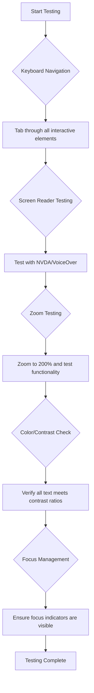
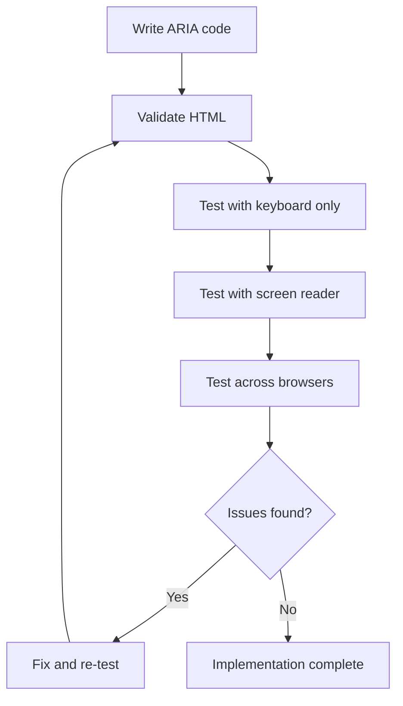

<!--
CO_OP_TRANSLATOR_METADATA:
{
  "original_hash": "300c1562e01f21065ae0b8e9d9181a86",
  "translation_date": "2025-10-20T21:02:48+00:00",
  "source_file": "1-getting-started-lessons/3-accessibility/README.md",
  "language_code": "tl"
}
-->
# Paglikha ng Accessible na Mga Webpage


> Sketchnote ni [Tomomi Imura](https://twitter.com/girlie_mac)

## Pre-Lecture Quiz
[Pre-lecture quiz](https://ff-quizzes.netlify.app/web/)

> Ang kapangyarihan ng Web ay nasa pagiging unibersal nito. Ang pag-access ng lahat, anuman ang kapansanan, ay mahalagang aspeto.
>
> \- Sir Timothy Berners-Lee, Direktor ng W3C at imbentor ng World Wide Web

Ang web accessibility ay hindi lamang isang magandang karagdagan—ito ay isang pangunahing prinsipyo na nagpapahalaga sa internet bilang tunay na unibersal. Kapag gumagawa ka ng mga accessible na website, hindi mo lang tinutulungan ang mga taong may kapansanan; lumilikha ka rin ng mas magagandang karanasan para sa lahat. Isipin ang mga curb cuts na idinisenyo para sa mga wheelchair na nakakatulong din sa mga taong may stroller, bagahe, o bisikleta. Ang accessible na disenyo ng web ay gumagana sa parehong paraan.

Sa araling ito, matutuklasan mo kung paano gumawa ng mga website na gumagana para sa lahat, anuman ang kanilang kakayahan o teknolohiyang ginagamit nila sa pag-browse sa web. Matututo ka ng mga praktikal na teknik na nakapaloob sa mga modernong pamantayan ng web, mag-eexplore ng mga makapangyarihang tool sa pagsusuri ng accessibility, at mauunawaan kung paano pinapahusay ng accessibility ang usability para sa lahat ng user.

Sa pagtatapos ng araling ito, magkakaroon ka ng kaalaman at mga tool upang gawing natural na bahagi ng iyong proseso ng pag-develop ang accessibility mula sa simula. Tuklasin natin kung paano ang maingat na mga desisyon sa disenyo ay maaaring magbukas ng web para sa bilyun-bilyong user sa buong mundo.

> Maaari mong kunin ang araling ito sa [Microsoft Learn](https://docs.microsoft.com/learn/modules/web-development-101/accessibility/?WT.mc_id=academic-77807-sagibbon)!

## Pag-unawa sa Assistive Technologies

Bago tayo sumabak sa paggawa ng mga accessible na website, unawain muna natin kung paano nagna-navigate ang mga taong may iba't ibang kakayahan sa web. Ang kaalamang ito ay makakatulong sa iyo na gumawa ng mas maayos na desisyon tungkol sa iyong mga disenyo at pagpipilian sa pag-develop.

Ang assistive technologies ay mga espesyal na tool na tumutulong sa mga taong may kapansanan na makipag-ugnayan sa digital na nilalaman. Ang pag-unawa kung paano gumagana ang mga tool na ito ay mahalaga para sa paglikha ng tunay na accessible na karanasan sa web.

### Screen readers

[Screen readers](https://en.wikipedia.org/wiki/Screen_reader) ay mga kahanga-hangang assistive technologies na nagko-convert ng digital na teksto sa speech o braille output. Pangunahing ginagamit ito ng mga taong may kapansanan sa paningin, ngunit nakakatulong din ito sa mga user na may learning disabilities tulad ng dyslexia.

Isipin ang screen reader bilang isang tagapagsalaysay ng web. Binabasa nito ang nilalaman nang malakas sa isang lohikal na pagkakasunod-sunod, ina-anunsyo ang mga interactive na elemento tulad ng mga button at link, at nagbibigay ng mga keyboard shortcut para sa mas epektibong pag-navigate. Gayunpaman, ang mga screen reader ay epektibo lamang kung ang mga website ay ginawa gamit ang tamang istruktura at makabuluhang nilalaman.

**Mga sikat na screen readers sa iba't ibang platform:**
- **Windows**: [NVDA](https://www.nvaccess.org/about-nvda/) (libre at pinakasikat), [JAWS](https://webaim.org/articles/jaws/), [Narrator](https://support.microsoft.com/windows/complete-guide-to-narrator-e4397a0d-ef4f-b386-d8ae-c172f109bdb1/?WT.mc_id=academic-77807-sagibbon) (built-in)
- **macOS/iOS**: [VoiceOver](https://support.apple.com/guide/voiceover/welcome/10) (built-in at napaka-kakayahan)
- **Android**: [TalkBack](https://support.google.com/accessibility/android/answer/6283677) (built-in)
- **Linux**: [Orca](https://wiki.gnome.org/Projects/Orca) (libre at open-source)

**Paano nagna-navigate ang mga screen reader sa web content:**

Ang mga screen reader ay nagbibigay ng maraming paraan ng pag-navigate na ginagawang mas epektibo ang pag-browse para sa mga bihasang user:
- **Sequential reading**: Binabasa ang nilalaman mula itaas hanggang ibaba, tulad ng pagbabasa ng libro
- **Landmark navigation**: Tumalon sa pagitan ng mga seksyon ng pahina (header, nav, main, footer)
- **Heading navigation**: Lumaktaw sa pagitan ng mga heading upang maunawaan ang istruktura ng pahina
- **Link lists**: Gumawa ng listahan ng lahat ng link para sa mabilisang pag-access
- **Form controls**: Direktang mag-navigate sa pagitan ng mga input field at button

> 💡 **Insight ng Developer**: 68% ng mga user ng screen reader ay pangunahing nagna-navigate gamit ang mga heading ([WebAIM Survey](https://webaim.org/projects/screenreadersurvey9/#finding)). Kaya't napakahalaga ng tamang istruktura ng heading!

### Pagbuo ng iyong workflow sa pagsusuri

Ang epektibong pagsusuri ng accessibility ay nangangailangan ng parehong automated tools at manual na beripikasyon. Narito ang isang sistematikong paraan na nakakahuli ng karamihan sa mga isyu:

**Essential manual testing workflow:**



**Step-by-step testing checklist:**
1. **Keyboard navigation**: Gumamit lamang ng Tab, Shift+Tab, Enter, Space, at Arrow keys
2. **Screen reader testing**: I-enable ang NVDA, VoiceOver, o Narrator at mag-navigate nang nakapikit ang mata
3. **Zoom testing**: Subukan sa 200% at 400% zoom levels
4. **Color contrast verification**: Suriin ang lahat ng teksto at UI components
5. **Focus indicator testing**: Siguraduhing lahat ng interactive na elemento ay may nakikitang focus states

✅ **Simulan gamit ang Lighthouse**: Buksan ang DevTools ng iyong browser, magpatakbo ng Lighthouse accessibility audit, pagkatapos ay gamitin ang mga resulta upang gabayan ang iyong mga focus area sa manual testing.

### Zoom at magnification tools

Maraming user ang umaasa sa magnification upang gawing mas nababasa ang nilalaman. Kasama dito ang mga taong may mababang paningin, matatanda, at maging ang mga user sa maliwanag na sikat ng araw o may pansamantalang isyu sa paningin. Ang modernong zoom technologies ay mas advanced na ngayon kaysa sa simpleng pag-scale ng imahe.

Ang pag-unawa kung paano gumagana ang zoom ay tumutulong sa iyo na lumikha ng mga responsive na disenyo na nananatiling functional at maganda sa anumang antas ng magnification.

**Modern browser zoom capabilities:**
- **Page zoom**: Ini-scale ang lahat ng nilalaman nang proporsyonal (teksto, imahe, layout) - ito ang mas pinapaboran
- **Text-only zoom**: Pinapalaki ang font size habang pinapanatili ang orihinal na layout
- **Pinch-to-zoom**: Suporta sa mobile gesture para sa pansamantalang magnification
- **Browser support**: Lahat ng modernong browser ay sumusuporta sa zoom hanggang 500% nang hindi nasisira ang functionality

**Specialized magnification software:**
- **Windows**: [Magnifier](https://support.microsoft.com/windows/use-magnifier-to-make-things-on-the-screen-easier-to-see-414948ba-8b1c-d3bd-8615-0e5e32204198) (built-in), [ZoomText](https://www.freedomscientific.com/training/zoomtext/getting-started/)
- **macOS/iOS**: [Zoom](https://www.apple.com/accessibility/mac/vision/) (built-in na may advanced features)

> ⚠️ **Design Consideration**: Ang WCAG ay nangangailangan na ang nilalaman ay nananatiling functional kapag ini-zoom sa 200%. Sa antas na ito, ang horizontal scrolling ay dapat minimal, at lahat ng interactive na elemento ay dapat nananatiling accessible.

✅ **Subukan ang iyong responsive design**: I-zoom ang iyong browser sa 200% at 400%. Ang iyong layout ba ay maayos na umaangkop? Maa-access mo pa rin ba ang lahat ng functionality nang walang labis na pag-scroll?

## Modern Accessibility Testing Tools

Ngayon na nauunawaan mo kung paano gumagana ang assistive technologies, tuklasin natin ang mga tool na tumutulong sa iyo na bumuo at mag-test ng mga accessible na website. Ang pagsasama ng automated testing sa manual na beripikasyon ay nagbibigay ng kumpiyansa na ang iyong mga site ay gumagana para sa lahat.

Ang modernong pagsusuri ng accessibility ay sumusunod sa isang komprehensibong paraan: ang automated tools ay nakakahuli ng mga halatang isyu, habang ang manual testing ay nagsisiguro ng usability sa totoong mundo.

### Color contrast testing

Ang color contrast ay isa sa mga pinakakaraniwang isyu sa accessibility, ngunit ito rin ang isa sa pinakamadaling ayusin. Ang magandang contrast ay nakikinabang sa lahat—mula sa mga user na may kapansanan sa paningin hanggang sa mga taong tumitingin sa screen sa maliwanag na sikat ng araw.

**Mga kinakailangan sa contrast ng WCAG:**

| Uri ng Teksto | WCAG AA (Minimum) | WCAG AAA (Enhanced) |
|---------------|-------------------|---------------------|
| **Normal na teksto** (mas mababa sa 18pt) | 4.5:1 contrast ratio | 7:1 contrast ratio |
| **Malaking teksto** (18pt+ o 14pt+ bold) | 3:1 contrast ratio | 4.5:1 contrast ratio |
| **UI components** (mga button, form borders) | 3:1 contrast ratio | 3:1 contrast ratio |

**Mga mahalagang tool sa pagsusuri:**
- [Colour Contrast Analyser](https://www.tpgi.com/color-contrast-checker/) - Desktop app na may color picker
- [WebAIM Contrast Checker](https://webaim.org/resources/contrastchecker/) - Web-based na may instant feedback
- [Stark](https://www.getstark.co/) - Plugin ng design tool para sa Figma, Sketch, Adobe XD
- [Accessible Colors](https://accessible-colors.com/) - Hanapin ang mga accessible na color palettes

✅ **Bumuo ng mas magagandang color palettes**: Simulan sa iyong brand colors at gamitin ang mga contrast checkers upang lumikha ng mga accessible na variation. I-dokumenta ang mga ito bilang mga accessible na color tokens ng iyong design system.

### Comprehensive accessibility auditing

Ang pinaka-epektibong pagsusuri ng accessibility ay ang pagsasama ng iba't ibang paraan. Walang isang tool na nakakahuli ng lahat, kaya ang pagbuo ng routine sa pagsusuri gamit ang iba't ibang pamamaraan ay nagsisiguro ng mas malawak na coverage.

**Browser-based testing (built into DevTools):**
- **Chrome/Edge**: Lighthouse accessibility audit + Accessibility panel
- **Firefox**: Accessibility Inspector na may detalyadong tree view
- **Safari**: Audit tab sa Web Inspector na may VoiceOver simulation

**Professional testing extensions:**
- [axe DevTools](https://www.deque.com/axe/devtools/) - Industry-standard automated testing
- [WAVE](https://wave.webaim.org/extension/) - Visual feedback na may error highlighting
- [Accessibility Insights](https://accessibilityinsights.io/) - Comprehensive testing suite ng Microsoft

**Command-line at CI/CD integration:**
- [axe-core](https://github.com/dequelabs/axe-core) - JavaScript library para sa automated testing
- [Pa11y](https://pa11y.org/) - Command-line accessibility testing tool
- [Lighthouse CI](https://github.com/GoogleChrome/lighthouse-ci) - Automated accessibility scoring

> 🎯 **Testing Goal**: Sikapin ang Lighthouse accessibility score na 95+ bilang baseline. Tandaan, ang automated tools ay nakakahuli lamang ng humigit-kumulang 30-40% ng mga isyu sa accessibility—ang manual testing ay mahalaga pa rin!

## Pagbuo ng Accessibility mula sa Simula

Ang pinaka-epektibong paraan sa web accessibility ay ang pagbuo nito sa iyong pundasyon mula sa simula. Ang pag-retrofit ng accessibility sa huli ay hindi lamang mas mahal at mas matrabaho—madalas itong nagreresulta sa hindi gaanong maayos na karanasan ng user.

Isipin ang accessibility tulad ng pagbuo ng bahay: mas madali itong isama ang wheelchair accessibility sa mga paunang plano ng arkitektura kaysa magdagdag ng mga rampa at mas malalaking pintuan pagkatapos ng konstruksyon.

### Ang mga prinsipyo ng POUR: Ang iyong pundasyon sa accessibility

Ang Web Content Accessibility Guidelines (WCAG) ay binuo sa paligid ng apat na pangunahing prinsipyo na kilala bilang POUR. Ang mga prinsipyong ito ay nagbibigay ng framework para gawing accessible ang nilalaman sa mga user na may iba't ibang kakayahan at teknolohiya.

Ang pag-unawa sa POUR ay tumutulong sa iyo na gumawa ng mga desisyon sa accessibility na lumilikha ng inclusive na karanasan para sa lahat.

**🔍 Perceivable**: Ang impormasyon ay dapat maipakita sa mga paraan na maaaring ma-perceive ng mga user sa pamamagitan ng kanilang available na senses

- Magbigay ng text alternatives para sa non-text content (mga imahe, video, audio)
- Siguraduhin ang sapat na color contrast para sa lahat ng teksto at UI components
- Magbigay ng captions at transcripts para sa multimedia content
- Disenyuhin ang nilalaman na nananatiling functional kapag ini-resize hanggang 200%
- Gumamit ng maraming sensory characteristics (hindi lang kulay) upang magpahayag ng impormasyon

**🎮 Operable**: Lahat ng interface components ay dapat ma-operate sa pamamagitan ng available na input methods

- Gawing accessible ang lahat ng functionality sa pamamagitan ng keyboard navigation
- Magbigay ng sapat na oras para sa mga user na basahin at makipag-ugnayan sa nilalaman
- Iwasan ang nilalaman na nagdudulot ng seizures o vestibular disorders
- Tulungan ang mga user na mag-navigate nang epektibo gamit ang malinaw na istruktura at landmarks
- Siguraduhin ang interactive na mga elemento ay may sapat na target sizes (44px minimum)

**📖 Understandable**: Ang impormasyon at operasyon ng UI ay dapat malinaw at madaling maunawaan

- Gumamit ng malinaw, simpleng wika na angkop para sa iyong audience
- Siguraduhin ang nilalaman ay lumilitaw at gumagana sa predictable, consistent na paraan
- Magbigay ng malinaw na mga instruksyon at error messages para sa user input
- Tulungan ang mga user na maunawaan at maitama ang mga pagkakamali sa mga form
- Ayusin ang nilalaman na may lohikal na reading order at information hierarchy

**💪 Robust**: Ang nilalaman ay dapat gumana nang maaasahan sa iba't ibang teknolohiya at assistive devices

- Gumamit ng valid, semantic HTML bilang iyong pundasyon
- Siguraduhin ang compatibility sa kasalukuyan at hinaharap na assistive technologies
- Sundin ang web standards at best practices para sa markup
- Mag-test sa iba't ibang browser, device, at assistive tools
- Istruktura ang nilalaman upang ito ay mag-degrade nang maayos kapag ang advanced features ay hindi suportado

## Paglikha ng Accessible Visual Design

Ang magandang visual design at accessibility ay magkaugnay. Kapag nagdisenyo ka nang may accessibility sa isip, madalas mong matutuklasan na ang mga limitasyong ito ay nagdudulot ng mas malinis, mas eleganteng solusyon na nakikinabang sa lahat ng user.

Tuklasin natin kung paano lumikha ng mga disenyo na kaaya-aya sa mata at gumagana para sa lahat, anuman ang kanilang kakayahan sa paningin o ang mga kondisyon kung saan nila tinitingnan ang iyong nilalaman.

### Mga estratehiya sa kulay at visual accessibility

Ang kulay ay makapangyarihan para sa komunikasyon, ngunit hindi ito dapat ang tanging paraan upang maipahayag ang mahalagang impormasyon. Ang pagdidisenyo nang lampas sa kulay ay lumilikha ng mas matibay, inclusive na karanasan na gumagana sa mas maraming sitwasyon.

**Disenyo para sa mga pagkakaiba sa color vision:**

Humigit-kumulang 8% ng mga lalaki at 0.5% ng mga babae ay may ilang uri ng pagkakaiba sa color vision (madalas na tinatawag na "color blindness"). Ang mga pinakakaraniwang uri ay:
- **Deuteranopia**: Hirap sa pagkilala ng pula at berde
- **Protanopia**: Ang pula ay mas dim
- **Tritanopia**: Hirap sa asul at dilaw (bihira)

**Mga inclusive na estratehiya sa kulay:**

```css
/* ❌ Bad: Using only color to indicate status */
.error { color: red; }
.success { color: green; }

/* ✅ Good: Color plus icons and context */
.error {
  color: #d32f2f;
  border-left: 4px solid #d32f2f;
}
.error::before {
  content: "⚠️";
  margin-right: 8px;
}

.success {
  color: #2e7d32;
  border-left: 4px solid #2e7d32;
}
.success::before {
  content: "✅";
  margin-right: 8px;
}
```

**Lampas sa mga pangunahing kinakailangan sa contrast:**
- Subukan ang iyong mga pagpipilian sa kulay gamit ang mga color blind simulators
- Gumamit ng mga pattern, texture, o hugis kasabay ng color coding
- Siguraduhin ang interactive states ay nananatiling naiiba kahit walang kulay
- Isaalang-alang kung paano ang iyong disenyo ay lumilitaw sa high contrast mode

✅ **Subukan ang iyong color accessibility**: Gumamit ng mga tool tulad ng [Coblis](https://www.color-blindness.com/coblis-color-blindness-simulator/) upang makita kung paano lumilitaw ang iyong site sa mga user na may iba't ibang uri ng color vision.
### Mga Indicator ng Pokus at Disenyo ng Interaksyon

Ang mga indicator ng pokus ay katumbas ng cursor sa digital—ipinapakita nila sa mga gumagamit ng keyboard kung nasaan sila sa pahina. Ang maayos na disenyo ng mga indicator ng pokus ay nagpapabuti sa karanasan ng lahat sa pamamagitan ng paggawa ng malinaw at predictable na interaksyon.

**Mga modernong best practices para sa indicator ng pokus:**

```css
/* Enhanced focus styles that work across browsers */
button:focus-visible {
  outline: 2px solid #0066cc;
  outline-offset: 2px;
  box-shadow: 0 0 0 4px rgba(0, 102, 204, 0.25);
}

/* Remove focus outline for mouse users, preserve for keyboard users */
button:focus:not(:focus-visible) {
  outline: none;
}

/* Focus-within for complex components */
.card:focus-within {
  box-shadow: 0 0 0 3px rgba(74, 144, 164, 0.5);
  border-color: #4A90A4;
}

/* Ensure focus indicators meet contrast requirements */
.custom-focus:focus-visible {
  outline: 3px solid #ffffff;
  outline-offset: 2px;
  box-shadow: 0 0 0 6px #000000;
}
```

**Mga kinakailangan para sa indicator ng pokus:**
- **Visibility**: Dapat may hindi bababa sa 3:1 na contrast ratio sa mga nakapaligid na elemento
- **Lapad**: Minimum na 2px na kapal sa buong elemento
- **Persistence**: Dapat manatiling nakikita hanggang sa lumipat ang pokus sa ibang lugar
- **Distinction**: Dapat visually naiiba sa iba pang estado ng UI

> 💡 **Tip sa Disenyo**: Ang mahusay na mga indicator ng pokus ay kadalasang gumagamit ng kombinasyon ng outline, box-shadow, at pagbabago ng kulay upang matiyak ang visibility sa iba't ibang background at konteksto.

✅ **I-audit ang mga indicator ng pokus**: Mag-tab sa iyong website at suriin kung aling mga elemento ang may malinaw na indicator ng pokus. Mayroon bang mahirap makita o ganap na nawawala?

### Semantic HTML: Ang pundasyon ng accessibility

Ang Semantic HTML ay parang pagbibigay ng malinaw na mapa para sa mga assistive technologies. Kapag ginamit mo ang tamang mga elemento ng HTML para sa kanilang layunin, nagbibigay ka ng impormasyon sa mga screen reader, keyboard, at iba pang tools upang matulungan ang mga user na mag-navigate nang epektibo.

Isipin ang Semantic HTML bilang pagkakaiba ng maayos na organisadong library na may malinaw na kategorya at mga palatandaan kumpara sa isang warehouse kung saan ang mga libro ay nakakalat nang walang sistema. Pareho silang may parehong impormasyon, ngunit isa lang ang tunay na magagamit.

**Mga pundasyon ng accessible na istruktura ng pahina:**

```html
<!-- Landmark elements provide page navigation structure -->
<header>
  <h1>Your Site Name</h1>
  <nav aria-label="Main navigation">
    <ul>
      <li><a href="/home">Home</a></li>
      <li><a href="/about">About</a></li>
      <li><a href="/services">Services</a></li>
    </ul>
  </nav>
</header>

<main>
  <article>
    <header>
      <h1>Article Title</h1>
      <p>Published on <time datetime="2024-10-14">October 14, 2024</time></p>
    </header>
    
    <section>
      <h2>First Section</h2>
      <p>Content that relates to this section...</p>
    </section>
    
    <section>
      <h2>Second Section</h2>
      <p>More related content...</p>
    </section>
  </article>
  
  <aside>
    <h2>Related Links</h2>
    <nav aria-label="Related articles">
      <ul>
        <li><a href="/related-1">First related article</a></li>
        <li><a href="/related-2">Second related article</a></li>
      </ul>
    </nav>
  </aside>
</main>

<footer>
  <p>&copy; 2024 Your Site Name. All rights reserved.</p>
  <nav aria-label="Footer links">
    <ul>
      <li><a href="/privacy">Privacy Policy</a></li>
      <li><a href="/contact">Contact Us</a></li>
    </ul>
  </nav>
</footer>
```

**Bakit binabago ng Semantic HTML ang accessibility:**

| Semantic Element | Layunin | Benepisyo sa Screen Reader |
|------------------|---------|---------------------------|
| `<header>` | Header ng pahina o seksyon | "Banner landmark" - mabilis na pag-navigate sa itaas |
| `<nav>` | Mga navigation link | "Navigation landmark" - listahan ng mga seksyon ng nav |
| `<main>` | Pangunahing nilalaman ng pahina | "Main landmark" - direktang pagpunta sa nilalaman |
| `<article>` | Self-contained na nilalaman | Ipinapahayag ang mga hangganan ng artikulo |
| `<section>` | Mga grupo ng nilalaman na may tema | Nagbibigay ng istruktura ng nilalaman |
| `<aside>` | Kaugnay na nilalaman sa sidebar | "Complementary landmark" |
| `<footer>` | Footer ng pahina o seksyon | "Contentinfo landmark" |

**Mga superpower ng screen reader gamit ang Semantic HTML:**
- **Landmark navigation**: Mabilis na paglipat sa mga pangunahing seksyon ng pahina
- **Heading outlines**: Gumawa ng table of contents mula sa istruktura ng heading
- **Element lists**: Gumawa ng listahan ng lahat ng link, button, o form controls
- **Context awareness**: Nauunawaan ang relasyon sa pagitan ng mga seksyon ng nilalaman

> 🎯 **Mabilis na Pagsubok**: Subukang mag-navigate sa iyong site gamit ang screen reader gamit ang mga shortcut sa landmark (D para sa landmark, H para sa heading, K para sa link sa NVDA/JAWS). Angkop ba ang navigation?

✅ **I-audit ang iyong semantic na istruktura**: Gamitin ang Accessibility panel sa DevTools ng iyong browser upang makita ang accessibility tree at tiyaking ang iyong markup ay lumilikha ng lohikal na istruktura.

### Hierarchy ng Heading: Paglikha ng lohikal na outline ng nilalaman

Ang mga heading ang gulugod ng accessible na istruktura ng nilalaman. Ang mga gumagamit ng screen reader ay lubos na umaasa sa mga heading upang maunawaan at mag-navigate sa iyong nilalaman—parang nagbibigay ng detalyadong table of contents para sa iyong pahina.

**Ang panuntunan sa hierarchy ng heading:**
Huwag laktawan ang mga antas ng heading. Palaging magpatuloy nang lohikal mula `<h1>` hanggang `<h2>` hanggang `<h3>`, at iba pa. Isipin ang mga heading na parang outline structure sa isang dokumento.

**Halimbawa ng perpektong istruktura ng heading:**

```html
<!-- ✅ Excellent: Logical, hierarchical progression -->
<main>
  <h1>Complete Guide to Web Accessibility</h1>
  
  <section>
    <h2>Understanding Screen Readers</h2>
    <p>Introduction to screen reader technology...</p>
    
    <h3>Popular Screen Reader Software</h3>
    <p>NVDA, JAWS, and VoiceOver comparison...</p>
    
    <h3>Testing with Screen Readers</h3>
    <p>Step-by-step testing instructions...</p>
  </section>
  
  <section>
    <h2>Color and Contrast Guidelines</h2>
    <p>Designing with sufficient contrast...</p>
    
    <h3>WCAG Contrast Requirements</h3>
    <p>Understanding the different contrast levels...</p>
    
    <h3>Testing Tools and Techniques</h3>
    <p>Tools for verifying contrast ratios...</p>
  </section>
</main>
```

```html
<!-- ❌ Problematic: Skipping levels, inconsistent structure -->
<h1>Page Title</h1>
<h3>Subsection</h3> <!-- Skipped h2 -->
<h2>This should come before h3</h2>
<h1>Another main heading?</h1> <!-- Multiple h1s -->
```

**Mga best practices sa heading:**
- **Isang `<h1>` bawat pahina**: Karaniwang ang pangunahing pamagat ng pahina o pangunahing heading ng nilalaman
- **Lohikal na pag-unlad**: Huwag laktawan ang mga antas (h1 → h2 → h3, hindi h1 → h3)
- **Descriptive na nilalaman**: Gawing makabuluhan ang mga heading kahit basahin nang wala sa konteksto
- **Visual styling gamit ang CSS**: Gamitin ang CSS para sa hitsura, HTML levels para sa istruktura

**Mga istatistika ng navigation ng screen reader:**
- 68% ng mga gumagamit ng screen reader ay nag-navigate gamit ang mga heading ([WebAIM Survey](https://webaim.org/projects/screenreadersurvey9/#finding))
- Inaasahan ng mga user na makakita ng lohikal na outline ng heading
- Ang mga heading ang pinakamabilis na paraan upang maunawaan ang istruktura ng pahina

> 💡 **Pro Tip**: Gumamit ng mga browser extension tulad ng "HeadingsMap" upang makita ang istruktura ng iyong heading. Dapat itong basahin na parang maayos na table of contents.

✅ **Subukan ang istruktura ng iyong heading**: Gamitin ang heading navigation ng screen reader (H key sa NVDA) upang tumalon sa iyong mga heading. Angkop ba ang progression sa kwento ng iyong nilalaman?

### Mga Advanced na Teknik sa Visual Accessibility

Bukod sa mga pangunahing kaalaman ng contrast at kulay, may mga sopistikadong teknik na tumutulong sa paglikha ng tunay na inclusive na visual na karanasan. Ang mga pamamaraang ito ay tinitiyak na ang iyong nilalaman ay gumagana sa iba't ibang kondisyon ng pagtingin at assistive technologies.

**Mga mahalagang estratehiya sa visual na komunikasyon:**

- **Multi-modal feedback**: Pagsamahin ang visual, textual, at minsan audio cues
- **Progressive disclosure**: Ipakita ang impormasyon sa mga digestible na bahagi
- **Consistent interaction patterns**: Gumamit ng pamilyar na UI conventions
- **Responsive typography**: I-scale ang teksto nang naaangkop sa iba't ibang device
- **Loading at error states**: Magbigay ng malinaw na feedback para sa lahat ng aksyon ng user

**Mga utility ng CSS para sa pinahusay na accessibility:**

```css
/* Screen reader only text - visually hidden but accessible */
.sr-only {
  position: absolute;
  width: 1px;
  height: 1px;
  padding: 0;
  margin: -1px;
  overflow: hidden;
  clip: rect(0, 0, 0, 0);
  white-space: nowrap;
  border: 0;
}

/* Skip link for keyboard navigation */
.skip-link {
  position: absolute;
  top: -40px;
  left: 6px;
  background: #000000;
  color: #ffffff;
  padding: 8px 16px;
  text-decoration: none;
  border-radius: 4px;
  font-weight: bold;
  transition: top 0.3s ease;
  z-index: 1000;
}

.skip-link:focus {
  top: 6px;
}

/* Reduced motion respect */
@media (prefers-reduced-motion: reduce) {
  .skip-link {
    transition: none;
  }
  
  * {
    animation-duration: 0.01ms !important;
    animation-iteration-count: 1 !important;
    transition-duration: 0.01ms !important;
  }
}

/* High contrast mode support */
@media (prefers-contrast: high) {
  .button {
    border: 2px solid;
  }
}
```

> 🎯 **Accessibility Pattern**: Ang "skip link" ay mahalaga para sa mga gumagamit ng keyboard. Dapat itong unang focusable na elemento sa iyong pahina at direktang tumalon sa pangunahing nilalaman.

✅ **Ipatupad ang skip navigation**: Magdagdag ng skip links sa iyong mga pahina at subukan ito sa pamamagitan ng pag-press ng Tab sa sandaling mag-load ang pahina. Dapat itong lumitaw at payagan kang tumalon sa pangunahing nilalaman.

## Paggawa ng Makabuluhang Link Text

Ang mga link ang daan ng web, ngunit ang hindi maayos na pagsulat ng link text ay nagdudulot ng hadlang para sa mga gumagamit na may kapansanan. Ang mahusay na link text ay ginagawang scannable at navigable ang iyong nilalaman para sa lahat.

Maaaring kunin ng mga screen reader ang lahat ng link mula sa isang pahina at ipakita ang mga ito bilang isang listahan—isipin kung ang iyong mga link ay lumitaw bilang isang direktoryo. Maiintindihan ba ang bawat link nang walang nakapaligid na konteksto?

### Pag-unawa sa mga pattern ng navigation ng link

Nag-aalok ang mga screen reader ng makapangyarihang mga feature ng navigation ng link na umaasa sa maayos na pagsulat ng link text:

**Mga paraan ng navigation ng link:**
- **Sequential reading**: Binabasa ang mga link sa konteksto bilang bahagi ng daloy ng nilalaman
- **Link list generation**: Lahat ng link sa pahina ay pinagsama sa isang searchable na direktoryo
- **Quick navigation**: Tumalon sa pagitan ng mga link gamit ang keyboard shortcuts (K sa NVDA)
- **Search functionality**: Hanapin ang partikular na mga link sa pamamagitan ng pag-type ng partial na teksto

**Bakit mahalaga ang konteksto:**
Kapag ang mga gumagamit ng screen reader ay bumuo ng listahan ng link, makikita nila ang ganito:
- "I-download ang ulat"
- "Alamin pa"
- "I-click dito"
- "Privacy policy"
- "I-click dito"

Dalawa lang sa mga link na ito ang nagbibigay ng kapaki-pakinabang na impormasyon kapag binasa nang wala sa konteksto!

> 📊 **Epekto sa User**: Ang mga gumagamit ng screen reader ay nag-scan ng mga listahan ng link upang mabilis na maunawaan ang nilalaman ng pahina. Ang generic na link text ay pinipilit silang bumalik sa konteksto ng bawat link, na lubos na nagpapabagal sa kanilang karanasan sa pag-browse.

### Mga Karaniwang Pagkakamali sa Link Text na Dapat Iwasan

Ang pag-unawa sa kung ano ang hindi gumagana ay tumutulong sa iyo na kilalanin at ayusin ang mga isyu sa accessibility sa umiiral na nilalaman.

**❌ Generic na link text na walang konteksto:**

```html
<!-- Meaningless when read from a link list -->
<p>Our sustainability efforts are detailed in our recent report. 
   <a href="/sustainability-2024.pdf">Click here</a> to view it.</p>

<!-- Repeated generic text throughout the page -->
<div class="article-card">
  <h3>Web Accessibility Guide</h3>
  <p>Learn the fundamentals...</p>
  <a href="/accessibility-guide">Read more</a>
</div>
<div class="article-card">
  <h3>Color Contrast Tips</h3>
  <p>Improve your design...</p>
  <a href="/color-contrast">Read more</a>
</div>

<!-- URLs as link text (difficult for screen readers to announce) -->
<p>Visit https://www.w3.org/WAI/WCAG21/quickref/ for WCAG guidelines.</p>

<!-- Vague action words -->
<a href="/contact">Go</a> | <a href="/about">See</a> | <a href="/help">View</a>
```

**Bakit nabigo ang mga pattern na ito:**
- **"I-click dito"** ay walang sinasabi sa mga user tungkol sa destinasyon
- **"Basahin pa"** na paulit-ulit ay nagdudulot ng kalituhan
- **Raw URLs** ay mahirap bigkasin nang malinaw ng mga screen reader
- **Mga solong salita** tulad ng "Punta" o "Tingnan" ay kulang sa descriptive na konteksto

### Pagsulat ng Mahusay na Link Text

Ang descriptive na link text ay kapaki-pakinabang para sa lahat—ang mga gumagamit na may paningin ay maaaring mabilis na mag-scan ng mga link, at ang mga gumagamit ng screen reader ay agad na nauunawaan ang mga destinasyon.

**✅ Malinaw, descriptive na halimbawa ng link text:**

```html
<!-- Descriptive text that explains the destination -->
<p>Our comprehensive <a href="/sustainability-2024.pdf">2024 sustainability report (PDF, 2.1MB)</a> details our environmental initiatives.</p>

<!-- Specific, unique link text for each card -->
<div class="article-card">
  <h3>Web Accessibility Guide</h3>
  <p>Learn the fundamentals of inclusive design...</p>
  <a href="/accessibility-guide">Read our complete web accessibility guide</a>
</div>
<div class="article-card">
  <h3>Color Contrast Tips</h3>
  <p>Improve your design with better color choices...</p>
  <a href="/color-contrast">Explore color contrast best practices</a>
</div>

<!-- Meaningful text instead of raw URLs -->
<p>The <a href="https://www.w3.org/WAI/WCAG21/quickref/">WCAG 2.1 Quick Reference guide</a> provides comprehensive accessibility guidelines.</p>

<!-- Descriptive action links -->
<a href="/contact">Contact our support team</a> | 
<a href="/about">About our company</a> | 
<a href="/help">Get help with your account</a>
```

**Mga best practices sa link text:**
- **Maging specific**: "I-download ang quarterly financial report" kumpara sa "I-download"
- **Isama ang file type at size**: "(PDF, 1.2MB)" para sa mga downloadable na file
- **Banggitin kung ang mga link ay magbubukas sa labas**: "(magbubukas sa bagong window)" kung naaangkop
- **Gumamit ng active na wika**: "Makipag-ugnayan sa amin" kumpara sa "Contact page"
- **Panatilihing maikli**: Hangarin ang 2-8 salita kung maaari

### Mga Advanced na Pattern ng Accessibility ng Link

Minsan ang mga constraint sa visual na disenyo o teknikal na kinakailangan ay nangangailangan ng espesyal na solusyon. Narito ang mga sopistikadong teknik para sa mga karaniwang hamon:

**Paggamit ng ARIA para sa pinahusay na konteksto:**

```html
<!-- When button text must be short but needs more context -->
<a href="/report.pdf" 
   aria-label="Download 2024 annual financial report, PDF format, 2.3MB">
  Download Report
</a>

<!-- When the full context comes from surrounding content -->
<h3 id="sustainability-heading">Sustainability Initiative</h3>
<p>Our efforts to reduce environmental impact...</p>
<a href="/sustainability-details" 
   aria-labelledby="sustainability-heading"
   aria-describedby="sustainability-summary">
  Learn more
</a>
<p id="sustainability-summary">Detailed breakdown of our 2024 environmental goals and achievements</p>
```

**Pagpapahiwatig ng mga file type at external na destinasyon:**

```html
<!-- Method 1: Include information in visible link text -->
<a href="/annual-report.pdf">
  Download our 2024 annual report (PDF, 2.3MB)
</a>

<!-- Method 2: Use screen reader-only text for file details -->
<a href="/annual-report.pdf">
  Download our 2024 annual report
  <span class="sr-only">(PDF format, 2.3MB)</span>
</a>

<!-- Method 3: External link indication -->
<a href="https://example.com" 
   target="_blank" 
   aria-describedby="external-link-warning">
  Visit external resource
</a>
<span id="external-link-warning" class="sr-only">
  (opens in new window)
</span>

<!-- Method 4: Using CSS for visual indicators -->
<a href="https://example.com" class="external-link">
  External resource
</a>
```

```css
/* Visual indicator for external links */
.external-link::after {
  content: " ↗";
  font-size: 0.8em;
  color: #666;
}

/* Screen reader announcement for external links */
.external-link::before {
  content: "External link: ";
  position: absolute;
  left: -10000px;
  width: 1px;
  height: 1px;
  overflow: hidden;
}
```

> ⚠️ **Mahalaga**: Kapag gumagamit ng `target="_blank"`, palaging ipaalam sa mga user na ang link ay magbubukas sa bagong window o tab. Ang hindi inaasahang pagbabago sa navigation ay maaaring magdulot ng disorientasyon.

✅ **Subukan ang konteksto ng iyong link**: Gamitin ang developer tools ng iyong browser upang bumuo ng listahan ng lahat ng link sa iyong pahina. Maiintindihan ba ang layunin ng bawat link nang walang nakapaligid na konteksto?

## ARIA: Pagpapalakas ng Accessibility ng HTML

[Accessible Rich Internet Applications (ARIA)](https://developer.mozilla.org/docs/Web/Accessibility/ARIA) ay parang universal translator sa pagitan ng iyong mga kumplikadong web application at assistive technologies. Kapag hindi kayang ipahayag ng HTML ang buong kahulugan ng iyong mga interactive na component, pinupunan ng ARIA ang mga puwang.

Isipin ang ARIA bilang pagdaragdag ng mga kapaki-pakinabang na annotation sa iyong HTML—parang mga direksyon sa entablado sa isang script ng dula na tumutulong sa mga aktor na maunawaan ang kanilang mga papel at relasyon.

**Ang pangunahing panuntunan ng ARIA**: Gamitin muna ang semantic HTML, ARIA pangalawa. Ang ARIA ay dapat magpahusay at maglinaw, hindi kailanman papalitan ang tamang istruktura ng HTML.

### Strategic na Implementasyon ng ARIA

Makapangyarihan ang ARIA, ngunit may kaakibat na responsibilidad ang kapangyarihan. Ang maling paggamit ng ARIA ay maaaring magpalala ng accessibility kaysa sa wala nito. Narito kung kailan at paano ito epektibong gamitin:

**✅ Gamitin ang ARIA kapag:**
- Gumagawa ng custom na interactive widgets (accordions, tabs, carousels)
- Gumagawa ng dynamic na nilalaman na nagbabago nang walang page reloads
- Nagbibigay ng karagdagang konteksto para sa mga kumplikadong relasyon sa UI
- Nagpapahiwatig ng loading states o live content updates
- Gumagawa ng app-like interfaces na may custom controls

**❌ Iwasan ang ARIA kapag:**
- Ang mga standard na elemento ng HTML ay nagbibigay na ng kinakailangang semantics
- Hindi ka sigurado kung paano ito ipapatupad nang tama
- Inuulit nito ang impormasyon na ibinibigay na ng semantic HTML
- Hindi mo pa ito nasubukan gamit ang aktwal na assistive technology

> 🎯 **Golden Rule ng ARIA**: "Huwag baguhin ang semantics maliban kung talagang kailangan, tiyakin ang accessibility ng keyboard palagi, at subukan gamit ang totoong assistive technology."

**Ang limang kategorya ng ARIA:**

1. **Roles**: Ano ang elementong ito? (`button`, `tab`, `dialog`)
2. **Properties**: Ano ang mga katangian nito? (`aria-required`, `aria-haspopup`)
3. **States**: Ano ang kasalukuyang kondisyon nito? (`aria-expanded`, `aria-checked`)
4. **Landmarks**: Nasaan ito sa istruktura ng pahina? (`banner`, `navigation`, `main`)
5. **Live regions**: Paano dapat i-anunsyo ang mga pagbabago? (`aria-live`, `aria-atomic`)

### Mga Mahahalagang Pattern ng ARIA para sa Modernong Web Apps

Ang mga pattern na ito ay naglutas ng mga karaniwang hamon sa accessibility sa mga interactive na web application:

**Pagpapangalan at paglalarawan ng mga elemento:**

```html
<!-- aria-label: Provides accessible name when visible text isn't sufficient -->
<button aria-label="Close newsletter subscription dialog">×</button>

<!-- aria-labelledby: References existing text as the accessible name -->
<section aria-labelledby="news-heading">
  <h2 id="news-heading">Latest News</h2>
  <!-- news content -->
</section>

<!-- aria-describedby: Links to additional descriptive text -->
<input type="password" 
       aria-describedby="pwd-requirements pwd-strength"
       required>
<div id="pwd-requirements">
  Password must contain at least 8 characters, including uppercase, lowercase, and numbers.
</div>
<div id="pwd-strength" aria-live="polite">
  <!-- Dynamic password strength indicator -->
</div>
```

**Live regions para sa dynamic na nilalaman:**

```html
<!-- Polite announcements (don't interrupt current speech) -->
<div aria-live="polite" id="status-updates">
  <!-- Status messages appear here -->
</div>

<!-- Assertive announcements (interrupt and announce immediately) -->
<div aria-live="assertive" id="urgent-alerts">
  <!-- Error messages and critical alerts -->
</div>

<!-- Loading states with live regions -->
<button id="submit-btn" aria-describedby="loading-status">
  Submit Application
</button>
<div id="loading-status" aria-live="polite" aria-atomic="true">
  <!-- "Processing your application..." appears here -->
</div>
```

**Halimbawa ng interactive widget (accordion):**

```html
<div class="accordion">
  <h3>
    <button aria-expanded="false" 
            aria-controls="panel-1" 
            id="accordion-trigger-1"
            class="accordion-trigger">
      Accessibility Guidelines
    </button>
  </h3>
  <div id="panel-1" 
       role="region"
       aria-labelledby="accordion-trigger-1" 
       hidden>
    <p>WCAG 2.1 provides comprehensive guidelines...</p>
  </div>
</div>
```

```javascript
// JavaScript to manage accordion state
function toggleAccordion(trigger) {
  const panel = document.getElementById(trigger.getAttribute('aria-controls'));
  const isExpanded = trigger.getAttribute('aria-expanded') === 'true';
  
  // Toggle states
  trigger.setAttribute('aria-expanded', !isExpanded);
  panel.hidden = isExpanded;
  
  // Announce change to screen readers
  const status = document.getElementById('status-updates');
  status.textContent = isExpanded ? 'Section collapsed' : 'Section expanded';
}
```

### Mga Best Practices sa Implementasyon ng ARIA

Makapangyarihan ang ARIA ngunit nangangailangan ng maingat na implementasyon. Ang pagsunod sa mga alituntuning ito ay tumutulong na matiyak na ang iyong ARIA ay nagpapahusay sa halip na nakakasama sa accessibility:

**🛡️ Mga pangunahing prinsipyo:**

1. **Semantic HTML muna**: Palaging piliin ang `<button>` kaysa sa `<div role="button">`
2. **Huwag sirain ang semantics**: Huwag kailanman i-override ang umiiral na kahulugan ng HTML (iwasan ang `<h1 role="button">`)
3. **Panatilihin ang accessibility ng keyboard**: Ang lahat ng interactive na elemento ng ARIA ay dapat ganap na accessible sa keyboard
4. **Subukan sa totoong mga user**: Ang suporta sa ARIA ay lubos na nag-iiba sa pagitan ng assistive technologies
5. **Magsimula nang simple**: Ang mga kumplikadong implementasyon ng ARIA ay mas malamang na magkaroon ng mga error

**🔍 Workflow ng Pagsubok:**



**🚫 Mga Karaniwang Pagkakamali sa ARIA na Dapat Iwasan:**

- **Conflicting information**: Huwag kontrahin ang semantics ng HTML
- **Over-labeling**: Ang sobrang impormasyon ng ARIA ay nakakalito sa mga user
- **Static ARIA**: Nakakalimutang i-update ang mga estado ng ARIA kapag nagbago ang nilalaman
- **Hindi nasubukang implementasyon**: ARIA na gumagana sa teorya ngunit nabibigo sa praktika
- **Kakulangan sa suporta sa keyboard**: Mga role ng ARIA na walang kaukulang interaksyon sa keyboard

> 💡 **Mga Resource sa Pagsubok**: Gumamit ng mga tool tulad ng [accessibility-checker](https://www.npmjs.com/package/accessibility-checker) para sa automated na validation ng ARIA, ngunit palaging subukan gamit ang totoong screen readers para sa kumpletong karanasan.

✅ **Matuto mula sa mga eksperto**: Pag-aralan ang [ARIA Authoring Practices Guide](https://w3c.github.io/aria-practices/) para sa mga subok na pattern at implementasyon ng mga kumplikadong interactive na widget.

## Paggawa ng Accessible na Mga Larawan at Media

Ang visual at audio na nilalaman ay mahalagang bahagi ng modernong web experiences, ngunit maaari itong magdulot ng hadlang kung hindi maingat na ipinatupad. Ang layunin ay tiyakin na ang impormasyon at emosyonal na epekto ng iyong media ay maabot ang bawat user.

Ang iba't ibang uri ng nilalaman ng media ay nangangailangan ng iba't ibang diskarte sa accessibility—ang pag-un
**Mga Functional na Imahe** - nagsisilbing mga button o kontrol:
```html
<button>
  
</button>
```

**Mga Komplikadong Imahe** - mga tsart, diagram, infographics:
```html

<div id="chart-description">
  <p>Detailed description: Sales data shows a steady increase across all quarters...</p>
</div>
```

### Accessibility ng Video at Audio

**Mga Pangangailangan sa Video:**
- **Mga Caption**: Tekstong bersyon ng sinasalitang nilalaman at mga sound effect
- **Audio Descriptions**: Pagkukuwento ng mga visual na elemento para sa mga bulag na gumagamit
- **Transcripts**: Buong tekstong bersyon ng lahat ng audio at visual na nilalaman

```html
<video controls>
  <source src="video.mp4" type="video/mp4">
  <track kind="captions" src="captions.vtt" srclang="en" label="English">
  <track kind="descriptions" src="descriptions.vtt" srclang="en" label="Audio descriptions">
</video>
```

**Mga Pangangailangan sa Audio:**
- **Transcripts**: Tekstong bersyon ng lahat ng sinasalitang nilalaman
- **Mga Visual na Indikasyon**: Para sa audio-only na nilalaman, magbigay ng mga visual na palatandaan

### Makabagong Teknik sa Imahe

**Paggamit ng CSS para sa mga dekoratibong imahe:**
```css
.hero-section {
  background-image: url('decorative-hero.jpg');
  /* Decorative images in CSS don't need alt text */
}
```

**Mga Responsive na Imahe na may Accessibility:**
```html
<picture>
  <source media="(min-width: 800px)" srcset="large-chart.png">
  <source media="(min-width: 400px)" srcset="medium-chart.png">
  
</picture>
```

✅ **Subukan ang accessibility ng imahe**: Gumamit ng screen reader upang mag-navigate sa isang pahina na may mga imahe. Nakakakuha ka ba ng sapat na impormasyon upang maunawaan ang nilalaman?

## Keyboard Navigation at Pamamahala ng Focus

Maraming gumagamit ang umaasa lamang sa keyboard navigation. Mahalagang tiyakin na gumagana nang maayos ang iyong site gamit ang input ng keyboard para sa accessibility.

### Mahahalagang Pattern ng Keyboard Navigation

**Karaniwang Interaksyon sa Keyboard:**
- **Tab**: Ilipat ang focus pasulong sa mga interactive na elemento
- **Shift + Tab**: Ilipat ang focus pabalik
- **Enter**: I-activate ang mga button at link
- **Space**: I-activate ang mga button, i-check ang mga checkbox
- **Arrow keys**: Mag-navigate sa loob ng mga grupo ng component (mga radio button, menu)
- **Escape**: Isara ang mga modal, dropdown, o kanselahin ang mga operasyon

### Mga Pinakamahusay na Praktika sa Pamamahala ng Focus

**Mga Nakikitang Indikasyon ng Focus:**
```css
/* Ensure focus is always visible */
button:focus-visible {
  outline: 2px solid #4A90A4;
  outline-offset: 2px;
}

/* Custom focus styles for different components */
.card:focus-within {
  box-shadow: 0 0 0 3px rgba(74, 144, 164, 0.5);
}
```

**Mga Skip Link para sa Mas Mabisang Navigation:**
```html
<a href="#main-content" class="skip-link">Skip to main content</a>
<a href="#navigation" class="skip-link">Skip to navigation</a>

<nav id="navigation">
  <!-- navigation content -->
</nav>
<main id="main-content">
  <!-- main content -->
</main>
```

**Tamang Tab Order:**
```html
<!-- Use semantic HTML for natural tab order -->
<form>
  <label for="name">Name:</label>
  <input type="text" id="name" tabindex="0">
  
  <label for="email">Email:</label>
  <input type="email" id="email" tabindex="0">
  
  <button type="submit" tabindex="0">Submit</button>
</form>
```

### Focus Trapping sa Mga Modal

Kapag nagbukas ng modal dialogs, dapat nakatrap ang focus sa loob ng modal:

```javascript
// Modern focus trap implementation
function trapFocus(element) {
  const focusableElements = element.querySelectorAll(
    'button, [href], input, select, textarea, [tabindex]:not([tabindex="-1"])'
  );
  
  const firstElement = focusableElements[0];
  const lastElement = focusableElements[focusableElements.length - 1];

  element.addEventListener('keydown', (e) => {
    if (e.key === 'Tab') {
      if (e.shiftKey && document.activeElement === firstElement) {
        e.preventDefault();
        lastElement.focus();
      } else if (!e.shiftKey && document.activeElement === lastElement) {
        e.preventDefault();
        firstElement.focus();
      }
    }
    
    if (e.key === 'Escape') {
      closeModal();
    }
  });
  
  // Focus first element when modal opens
  firstElement.focus();
}
```

✅ **Subukan ang keyboard navigation**: Subukang mag-navigate sa iyong website gamit lamang ang Tab key. Naabot mo ba ang lahat ng interactive na elemento? Ang order ng focus ba ay lohikal? Malinaw ba ang mga indikasyon ng focus?

## Accessibility ng Form

Ang mga form ay mahalaga para sa interaksyon ng gumagamit at nangangailangan ng espesyal na atensyon para sa accessibility.

### Asosasyon ng Label at Form Control

**Ang bawat form control ay nangangailangan ng label:**
```html
<!-- Explicit labeling (preferred) -->
<label for="username">Username:</label>
<input type="text" id="username" name="username" required>

<!-- Implicit labeling -->
<label>
  Password:
  <input type="password" name="password" required>
</label>

<!-- Using aria-label when visual label isn't desired -->
<input type="search" aria-label="Search products" placeholder="Search...">
```

### Paghawak ng Error at Pag-validate

**Mga Accessible na Mensahe ng Error:**
```html
<label for="email">Email Address:</label>
<input type="email" id="email" name="email" 
       aria-describedby="email-error" 
       aria-invalid="true" required>
<div id="email-error" role="alert">
  Please enter a valid email address
</div>
```

**Mga Pinakamahusay na Praktika sa Pag-validate ng Form:**
- Gumamit ng `aria-invalid` upang ipakita ang mga invalid na field
- Magbigay ng malinaw, tiyak na mga mensahe ng error
- Gumamit ng `role="alert"` para sa mahahalagang anunsyo ng error
- Ipakita ang mga error parehong agad-agad at sa pag-submit ng form

### Fieldsets at Pag-group

**I-group ang mga kaugnay na form control:**
```html
<fieldset>
  <legend>Shipping Address</legend>
  <label for="street">Street Address:</label>
  <input type="text" id="street" name="street">
  
  <label for="city">City:</label>
  <input type="text" id="city" name="city">
</fieldset>

<fieldset>
  <legend>Preferred Contact Method</legend>
  <input type="radio" id="contact-email" name="contact" value="email">
  <label for="contact-email">Email</label>
  
  <input type="radio" id="contact-phone" name="contact" value="phone">
  <label for="contact-phone">Phone</label>
</fieldset>
```

## Ang Iyong Accessibility Journey: Mga Pangunahing Aral

Binabati kita! Natutunan mo na ang mga pangunahing kaalaman upang lumikha ng tunay na inklusibong karanasan sa web. Ang web accessibility ay hindi lamang tungkol sa pagsunod—ito ay tungkol sa pagkilala sa iba't ibang paraan ng interaksyon ng mga tao sa digital na nilalaman at pagdidisenyo para sa masalimuot na kagandahan na iyon.

**🎯 Ang iyong toolkit sa accessibility ngayon ay naglalaman ng:**

| Pangunahing Prinsipyo | Implementasyon | Epekto |
|----------------|----------------|---------|
| **Semantic HTML Foundation** | Gumamit ng tamang HTML elements para sa kanilang layunin | Ang mga screen reader ay maaaring mag-navigate nang mahusay, ang mga keyboard ay awtomatikong gumagana |
| **Inclusive Visual Design** | Sapat na contrast, makabuluhang paggamit ng kulay, nakikitang focus indicators | Malinaw para sa lahat sa anumang kondisyon ng ilaw |
| **Descriptive Content** | Makabuluhang link text, alt text, headings | Nauunawaan ng mga gumagamit ang nilalaman nang walang visual na konteksto |
| **Keyboard Accessibility** | Tab order, keyboard shortcuts, focus management | Accessibility para sa motor at kahusayan ng power user |
| **ARIA Enhancement** | Strategic na paggamit upang punan ang semantic gaps | Gumagana ang mga komplikadong aplikasyon sa assistive technologies |
| **Comprehensive Testing** | Mga automated na tool + manual na beripikasyon + totoong user testing | Nahuhuli ang mga isyu bago makaapekto sa mga gumagamit |

**🚀 Ang iyong susunod na hakbang:**

1. **Isama ang accessibility sa iyong workflow**: Gawing natural na bahagi ng iyong proseso ng pag-develop ang testing
2. **Matuto mula sa totoong mga gumagamit**: Humingi ng feedback mula sa mga taong gumagamit ng assistive technologies
3. **Manatiling updated**: Ang mga teknik sa accessibility ay nagbabago kasabay ng mga bagong teknolohiya at pamantayan
4. **I-promote ang inklusyon**: Ibahagi ang iyong kaalaman at gawing prayoridad ng team ang accessibility

> 💡 **Tandaan**: Ang mga limitasyon sa accessibility ay madalas na humahantong sa mga makabago, eleganteng solusyon na kapaki-pakinabang para sa lahat. Ang curb cuts, captions, at voice controls ay nagsimula bilang mga feature ng accessibility at naging mainstream na mga pagpapabuti.

**Malinaw ang business case**: Ang mga accessible na website ay umaabot sa mas maraming gumagamit, mas mataas ang ranggo sa search engines, mas mababa ang gastos sa maintenance, at naiiwasan ang mga legal na panganib. Ngunit higit sa lahat, ang mga accessible na website ay sumasalamin sa pinakamagandang halaga ng web—pagiging bukas, inklusibo, at pantay na access sa impormasyon.

Handa ka na ngayong bumuo ng inklusibong web ng hinaharap. Ang bawat accessible na site na iyong nililikha ay ginagawang mas welcoming ang internet para sa lahat.

## Karagdagang Resources

Ipagpatuloy ang iyong pag-aaral sa accessibility gamit ang mga mahahalagang resources na ito:

**📚 Opisyal na Pamantayan at Gabay:**
- [WCAG 2.1 Guidelines](https://www.w3.org/WAI/WCAG21/quickref/) - Ang opisyal na pamantayan sa accessibility na may quick reference
- [ARIA Authoring Practices Guide](https://w3c.github.io/aria-practices/) - Komprehensibong patterns para sa mga interactive na widget
- [WebAIM Guidelines](https://webaim.org/) - Praktikal, beginner-friendly na gabay sa accessibility

**🛠️ Mga Tool at Resources sa Testing:**
- [axe DevTools](https://www.deque.com/axe/devtools/) - Industry-standard na accessibility testing
- [A11y Project Checklist](https://www.a11yproject.com/checklist/) - Step-by-step na beripikasyon sa accessibility
- [Accessibility Insights](https://accessibilityinsights.io/) - Komprehensibong testing suite ng Microsoft
- [Color Oracle](https://colororacle.org/) - Simulator ng color blindness para sa design testing

**🎓 Pag-aaral at Komunidad:**
- [WebAIM Screen Reader Survey](https://webaim.org/projects/screenreadersurvey9/) - Mga totoong preference at behavior ng user
- [Inclusive Components](https://inclusive-components.design/) - Modernong accessible na component patterns
- [A11y Coffee](https://a11y.coffee/) - Mga mabilisang tips at insights sa accessibility
- [Web Accessibility Initiative (WAI)](https://www.w3.org/WAI/) - Komprehensibong resources sa accessibility ng W3C

**🎥 Hands-on Learning:**
- [Accessibility Developer Guide](https://www.accessibility-developer-guide.com/) - Praktikal na gabay sa implementasyon
- [Deque University](https://dequeuniversity.com/) - Mga propesyonal na kurso sa accessibility training

## Hamon ng GitHub Copilot Agent 🚀

Gamitin ang Agent mode upang tapusin ang sumusunod na hamon:

**Deskripsyon:** Gumawa ng accessible na modal dialog component na nagpapakita ng tamang pamamahala ng focus, ARIA attributes, at mga pattern ng keyboard navigation.

**Prompt:** Bumuo ng kumpletong modal dialog component gamit ang HTML, CSS, at JavaScript na may kasamang: tamang focus trapping, ESC key para isara, click sa labas para isara, ARIA attributes para sa screen readers, at nakikitang focus indicators. Ang modal ay dapat maglaman ng form na may tamang labels at paghawak ng error. Tiyakin na ang component ay sumusunod sa WCAG 2.1 AA standards.

## 🚀 Hamon

Kunin ang HTML na ito at isulat muli upang maging mas accessible, gamit ang mga estratehiyang natutunan mo.

```html
<!DOCTYPE html>
<html lang="en">
  <head>
    <meta charset="UTF-8">
    <meta name="viewport" content="width=device-width, initial-scale=1.0">
    <title>Turtle Ipsum - The World's Premier Turtle Fan Club</title>
    <link href='../assets/style.css' rel='stylesheet' type='text/css'>
  </head>
  <body>
    <header class="site-header">
      <h1 class="site-title">Turtle Ipsum</h1>
      <p class="site-subtitle">The World's Premier Turtle Fan Club</p>
    </header>
    
    <nav class="main-nav" aria-label="Main navigation">
      <h2 class="nav-header">Resources</h2>
      <ul class="nav-list">
        <li><a href="https://www.youtube.com/watch?v=CMNry4PE93Y">"I like turtles" video</a></li>
        <li><a href="https://en.wikipedia.org/wiki/Turtle">Basic turtle information</a></li>
        <li><a href="https://en.wikipedia.org/wiki/Turtles_(chocolate)">Chocolate turtles candy</a></li>
      </ul>
    </nav>
    
    <main class="main-content">
      <article>
        <h1>Welcome to Turtle Ipsum</h1>
        <p class="intro">
          <a href="/about">Learn more about our turtle community</a> and discover fascinating facts about these amazing creatures.
        </p>
        <p class="article-text">
          Turtle ipsum dolor sit amet, consectetur adipiscing elit, sed do eiusmod tempor incididunt ut labore et dolore magna aliqua. Ut enim ad minim veniam, quis nostrud exercitation ullamco laboris nisi ut aliquip ex ea commodo consequat. Duis aute irure dolor in reprehenderit in voluptate velit esse cillum dolore eu fugiat nulla pariatur. Excepteur sint occaecat cupidatat non proident, sunt in culpa qui officia deserunt mollit anim id est laborum.
        </p>
      </article>
    </main>
    
    <footer class="footer">
      <section class="newsletter-signup">
        <h2>Stay Updated</h2>
        <button type="button" onclick="showNewsletterForm()">Sign up for turtle news</button>
      </section>
      
      <nav class="footer-nav" aria-label="Footer navigation">
        <h2>Site Pages</h2>
        <ul>
          <li><a href="../">Home</a></li>
          <li><a href="../semantic">Semantic HTML example</a></li>
        </ul>
      </nav>
      
      <p class="footer-copyright">&copy; 2024 Instrument. All rights reserved.</p>
    </footer>
  </body>
</html>
```

**Mga Key na Pagpapabuti na Ginawa:**
- Nagdagdag ng tamang semantic HTML structure
- Inayos ang hierarchy ng heading (isang h1, lohikal na progression)
- Nagdagdag ng makabuluhang link text sa halip na "click here"
- Isinama ang tamang ARIA labels para sa navigation
- Nagdagdag ng lang attribute at tamang meta tags
- Gumamit ng button element para sa mga interactive na elemento
- Istruktura ng footer content gamit ang tamang landmarks

## Post-Lecture Quiz
[Post-lecture quiz](https://ff-quizzes.netlify.app/web/en/)

## Review at Pag-aaral sa Sarili

Maraming gobyerno ang may mga batas tungkol sa accessibility requirements. Magbasa tungkol sa mga batas sa accessibility ng iyong sariling bansa. Ano ang saklaw, at ano ang hindi? Isang halimbawa ay [ang website ng gobyerno na ito](https://accessibility.blog.gov.uk/).

## Takdang-Aralin

[Pag-aralan ang isang hindi-accessible na website](assignment.md)

Credits: [Turtle Ipsum](https://github.com/Instrument/semantic-html-sample) by Instrument

---

**Paunawa**:  
Ang dokumentong ito ay isinalin gamit ang AI translation service [Co-op Translator](https://github.com/Azure/co-op-translator). Bagamat sinisikap naming maging tumpak, mangyaring tandaan na ang mga awtomatikong pagsasalin ay maaaring maglaman ng mga pagkakamali o hindi pagkakatugma. Ang orihinal na dokumento sa kanyang katutubong wika ang dapat ituring na opisyal na pinagmulan. Para sa mahalagang impormasyon, inirerekomenda ang propesyonal na pagsasalin ng tao. Hindi kami mananagot sa anumang hindi pagkakaunawaan o maling interpretasyon na dulot ng paggamit ng pagsasaling ito.