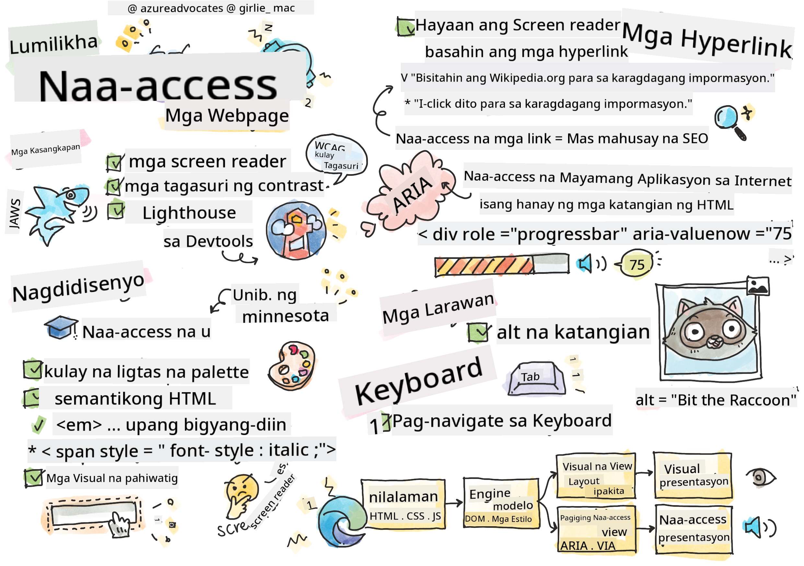

<!--
CO_OP_TRANSLATOR_METADATA:
{
  "original_hash": "e4cd5b1faed4adab5acf720f82798003",
  "translation_date": "2025-08-27T23:18:26+00:00",
  "source_file": "1-getting-started-lessons/3-accessibility/README.md",
  "language_code": "tl"
}
-->
# Paglikha ng Accessible na Mga Webpage


> Sketchnote ni [Tomomi Imura](https://twitter.com/girlie_mac)

## Pre-Lecture Quiz
[Pre-lecture quiz](https://ff-quizzes.netlify.app/web/quiz/5)

> Ang kapangyarihan ng Web ay nasa pagiging unibersal nito. Ang pag-access ng lahat, anuman ang kapansanan, ay isang mahalagang aspeto.
>
> \- Sir Timothy Berners-Lee, W3C Director at imbentor ng World Wide Web

Ang siping ito ay perpektong nagpapakita ng kahalagahan ng paggawa ng mga accessible na website. Ang isang aplikasyon na hindi ma-access ng lahat ay, sa esensya, nagiging eksklusibo. Bilang mga web developer, dapat nating laging isaisip ang accessibility. Sa pamamagitan ng pagtutok dito mula sa simula, masisiguro mong ma-access ng lahat ang mga pahinang iyong nilikha. Sa araling ito, matututuhan mo ang mga tool na makakatulong sa iyong tiyakin na ang iyong mga web asset ay accessible at kung paano magdisenyo nang may accessibility sa isip.

> Maaari mong kunin ang araling ito sa [Microsoft Learn](https://docs.microsoft.com/learn/modules/web-development-101/accessibility/?WT.mc_id=academic-77807-sagibbon)!

## Mga Tool na Gagamitin

### Screen Readers

Isa sa mga pinakakilalang accessibility tool ay ang screen readers.

[Screen readers](https://en.wikipedia.org/wiki/Screen_reader) ay karaniwang ginagamit ng mga taong may kapansanan sa paningin. Habang ginugugol natin ang oras upang tiyakin na maayos na naipapakita ng browser ang impormasyong nais nating ibahagi, dapat din nating tiyakin na magagawa rin ito ng screen reader.

Sa pinaka-basic na antas, ang screen reader ay babasahin ang isang pahina mula itaas hanggang ibaba nang pasalita. Kung ang iyong pahina ay puro teksto, ang reader ay magpapahayag ng impormasyon sa paraang katulad ng browser. Siyempre, bihira ang mga web page na puro teksto lamang; karaniwan itong naglalaman ng mga link, graphics, kulay, at iba pang visual na bahagi. Kailangang tiyakin na ang impormasyong ito ay maipapahayag nang tama ng screen reader.

Dapat maging pamilyar ang bawat web developer sa paggamit ng screen reader. Tulad ng nabanggit, ito ang kliyente na gagamitin ng iyong mga user. Katulad ng pagiging pamilyar mo sa kung paano gumagana ang isang browser, dapat mo ring alamin kung paano gumagana ang isang screen reader. Sa kabutihang-palad, ang mga screen reader ay built-in na sa karamihan ng mga operating system.

Ang ilang browser ay mayroon ding mga built-in na tool at extension na maaaring magbasa ng teksto nang malakas o magbigay ng mga pangunahing feature sa pag-navigate, tulad ng [mga accessibility-focused na tool ng Edge browser](https://support.microsoft.com/help/4000734/microsoft-edge-accessibility-features). Mahalaga rin ang mga tool na ito, ngunit iba ang kanilang layunin kumpara sa mga screen reader at hindi dapat gamitin bilang mga tool sa pagsubok ng screen reader.

✅ Subukan ang isang screen reader at browser text reader. Sa Windows, ang [Narrator](https://support.microsoft.com/windows/complete-guide-to-narrator-e4397a0d-ef4f-b386-d8ae-c172f109bdb1/?WT.mc_id=academic-77807-sagibbon) ay kasama na bilang default, at maaaring i-install ang [JAWS](https://webaim.org/articles/jaws/) at [NVDA](https://www.nvaccess.org/about-nvda/). Sa macOS at iOS, ang [VoiceOver](https://support.apple.com/guide/voiceover/welcome/10) ay naka-install na bilang default.

### Zoom

Isa pang tool na karaniwang ginagamit ng mga taong may kapansanan sa paningin ay ang pag-zoom. Ang pinaka-basic na uri ng pag-zoom ay static zoom, na kinokontrol sa pamamagitan ng `Control + plus sign (+)` o sa pamamagitan ng pagbabawas ng screen resolution. Ang ganitong uri ng pag-zoom ay nagdudulot ng pag-resize ng buong pahina, kaya mahalaga ang paggamit ng [responsive design](https://developer.mozilla.org/docs/Learn/CSS/CSS_layout/Responsive_Design) upang magbigay ng magandang karanasan sa user kahit sa mas mataas na antas ng pag-zoom.

Ang isa pang uri ng pag-zoom ay umaasa sa espesyal na software upang palakihin ang isang bahagi ng screen at mag-pan, katulad ng paggamit ng totoong magnifying glass. Sa Windows, ang [Magnifier](https://support.microsoft.com/windows/use-magnifier-to-make-things-on-the-screen-easier-to-see-414948ba-8b1c-d3bd-8615-0e5e32204198) ay built-in, at ang [ZoomText](https://www.freedomscientific.com/training/zoomtext/getting-started/) ay isang third-party magnification software na may mas maraming feature at mas malaking user base. Parehong macOS at iOS ay may built-in na magnification software na tinatawag na [Zoom](https://www.apple.com/accessibility/mac/vision/).

### Contrast Checkers

Ang mga kulay sa mga website ay kailangang maingat na piliin upang matugunan ang pangangailangan ng mga user na may color blindness o hirap makakita ng mga kulay na mababa ang contrast.

✅ Subukan ang isang website na gusto mong gamitin para sa pagsusuri ng kulay gamit ang isang browser extension tulad ng [WCAG's color checker](https://microsoftedge.microsoft.com/addons/detail/wcag-color-contrast-check/idahaggnlnekelhgplklhfpchbfdmkjp?hl=en-US&WT.mc_id=academic-77807-sagibbon). Ano ang natutunan mo?

### Lighthouse

Sa developer tool area ng iyong browser, makikita mo ang Lighthouse tool. Mahalaga ang tool na ito upang makakuha ng unang pagsusuri sa accessibility (pati na rin ang iba pang pagsusuri) ng isang website. Bagama't mahalagang huwag umasa lamang sa Lighthouse, ang 100% na score ay napakahalaga bilang baseline.

✅ Hanapin ang Lighthouse sa developer tool panel ng iyong browser at magsagawa ng pagsusuri sa anumang site. Ano ang natuklasan mo?

## Pagdidisenyo para sa Accessibility

Ang accessibility ay isang medyo malawak na paksa. Upang matulungan ka, maraming mga mapagkukunan ang magagamit.

- [Accessible U - University of Minnesota](https://accessibility.umn.edu/your-role/web-developers)

Bagama't hindi natin matatalakay ang bawat aspeto ng paggawa ng mga accessible na site, narito ang ilan sa mga pangunahing prinsipyo na nais mong ipatupad. Ang pagdidisenyo ng isang accessible na pahina mula sa simula ay **laging** mas madali kaysa sa pagbalik sa isang umiiral na pahina upang gawing accessible ito.

## Magandang Prinsipyo sa Display

### Mga Color Safe Palette

Iba't ibang paraan ang nakikita ng mga tao sa mundo, kabilang na ang mga kulay. Kapag pumipili ng color scheme para sa iyong site, dapat mong tiyakin na ito ay accessible sa lahat. Isang mahusay na [tool para sa pagbuo ng mga color palette ay ang Color Safe](http://colorsafe.co/).

✅ Tukuyin ang isang website na may malaking problema sa paggamit ng kulay. Bakit?

### Gumamit ng Tamang HTML

Sa pamamagitan ng CSS at JavaScript, posible na gawing mukhang anumang uri ng control ang anumang elemento. Ang `<span>` ay maaaring gamitin upang lumikha ng `<button>`, at ang `<b>` ay maaaring maging hyperlink. Bagama't maaaring mas madali itong i-style, wala itong naipapahayag sa isang screen reader. Gumamit ng tamang HTML kapag gumagawa ng mga control sa isang pahina. Kung nais mo ng hyperlink, gumamit ng `<a>`. Ang paggamit ng tamang HTML para sa tamang control ay tinatawag na paggamit ng Semantic HTML.

✅ Pumunta sa anumang website at tingnan kung ang mga designer at developer ay gumagamit ng HTML nang tama. Makakakita ka ba ng button na dapat ay isang link? Tip: i-right click at piliin ang 'View Page Source' sa iyong browser upang tingnan ang underlying code.

### Gumawa ng Descriptive na Heading Hierarchy

Ang mga gumagamit ng screen reader ay [umaasa nang malaki sa mga heading](https://webaim.org/projects/screenreadersurvey8/#finding) upang makahanap ng impormasyon at mag-navigate sa isang pahina. Ang pagsusulat ng descriptive na nilalaman ng heading at paggamit ng semantic heading tags ay mahalaga para sa paggawa ng isang site na madaling ma-navigate para sa mga gumagamit ng screen reader.

### Gumamit ng Magandang Visual Clues

Ang CSS ay nag-aalok ng kumpletong kontrol sa hitsura ng anumang elemento sa isang pahina. Maaari kang lumikha ng mga text box na walang outline o mga hyperlink na walang underline. Sa kasamaang-palad, ang pagtanggal ng mga clue na ito ay maaaring gawing mas mahirap para sa isang taong umaasa sa mga ito upang makilala ang uri ng control.

## Ang Kahalagahan ng Link Text

Ang mga hyperlink ay mahalaga sa pag-navigate sa web. Dahil dito, ang pagtiyak na maayos na mababasa ng screen reader ang mga link ay nagbibigay-daan sa lahat ng user na mag-navigate sa iyong site.

### Screen Readers at Mga Link

Tulad ng inaasahan, binabasa ng screen readers ang link text sa parehong paraan na binabasa nila ang anumang iba pang teksto sa pahina. Sa ganitong pananaw, ang teksto sa ibaba ay maaaring mukhang katanggap-tanggap.

> Ang maliit na penguin, na kilala rin bilang fairy penguin, ang pinakamaliit na penguin sa mundo. [I-click dito](https://en.wikipedia.org/wiki/Little_penguin) para sa karagdagang impormasyon.

> Ang maliit na penguin, na kilala rin bilang fairy penguin, ang pinakamaliit na penguin sa mundo. Bisitahin ang https://en.wikipedia.org/wiki/Little_penguin para sa karagdagang impormasyon.

> **NOTE** Tulad ng mababasa mo, **huwag kailanman** lumikha ng mga link na katulad ng nasa itaas.

Tandaan, ang screen readers ay ibang interface mula sa mga browser na may ibang set ng mga feature.

### Ang Problema sa Paggamit ng URL

Binabasa ng screen readers ang teksto. Kung ang URL ay lumalabas sa teksto, babasahin ito ng screen reader. Sa pangkalahatan, ang URL ay hindi nagbibigay ng makabuluhang impormasyon at maaaring nakakainis pakinggan. Maaaring naranasan mo ito kung ang iyong telepono ay kailanman nagbasa nang malakas ng isang text message na may URL.

### Ang Problema sa "I-click Dito"

May kakayahan ang screen readers na basahin lamang ang mga hyperlink sa isang pahina, katulad ng paraan ng pag-scan ng isang taong nakakakita sa pahina para sa mga link. Kung ang link text ay palaging "i-click dito", ang maririnig lamang ng user ay "i-click dito, i-click dito, i-click dito, i-click dito, i-click dito, ..." Ang lahat ng link ay nagiging hindi makilala mula sa isa't isa.

### Magandang Link Text

Ang magandang link text ay maikli ngunit naglalarawan kung ano ang nasa kabilang dulo ng link. Sa halimbawa sa itaas tungkol sa maliit na penguin, ang link ay patungo sa Wikipedia page tungkol sa species. Ang pariralang *maliit na penguin* ay magiging perpektong link text dahil malinaw nitong ipinapakita kung ano ang matututuhan ng isang tao kung i-click ang link - maliit na penguin.

> Ang [maliit na penguin](https://en.wikipedia.org/wiki/Little_penguin), na kilala rin bilang fairy penguin, ang pinakamaliit na penguin sa mundo.

✅ Mag-surf sa web nang ilang minuto upang makahanap ng mga pahina na gumagamit ng hindi malinaw na mga estratehiya sa pag-link. Ihambing ang mga ito sa iba pang mas mahusay na naka-link na mga site. Ano ang natutunan mo?

#### Mga Tala sa Search Engine

Bilang karagdagang benepisyo ng pagtiyak na ang iyong site ay accessible sa lahat, matutulungan mo rin ang mga search engine na mag-navigate sa iyong site. Ginagamit ng mga search engine ang link text upang matutunan ang mga paksa ng mga pahina. Kaya ang paggamit ng magandang link text ay nakakatulong sa lahat!

### ARIA

Isipin ang sumusunod na pahina:

| Produkto     | Paglalarawan       | Order        |
| ------------ | ------------------ | ------------ |
| Widget       | [Paglalarawan](../../../../1-getting-started-lessons/3-accessibility/') | [Order](../../../../1-getting-started-lessons/3-accessibility/') |
| Super widget | [Paglalarawan](../../../../1-getting-started-lessons/3-accessibility/') | [Order](../../../../1-getting-started-lessons/3-accessibility/') |

Sa halimbawang ito, ang pag-uulit ng teksto ng paglalarawan at order ay may katuturan para sa isang taong gumagamit ng browser. Gayunpaman, ang isang taong gumagamit ng screen reader ay maririnig lamang ang mga salitang *paglalarawan* at *order* na paulit-ulit nang walang konteksto.

Upang suportahan ang mga ganitong uri ng sitwasyon, sinusuportahan ng HTML ang isang set ng mga attribute na kilala bilang [Accessible Rich Internet Applications (ARIA)](https://developer.mozilla.org/docs/Web/Accessibility/ARIA). Ang mga attribute na ito ay nagbibigay-daan sa iyo na magbigay ng karagdagang impormasyon sa mga screen reader.

> **NOTE**: Tulad ng maraming aspeto ng HTML, maaaring mag-iba ang suporta ng browser at screen reader. Gayunpaman, karamihan sa mga pangunahing kliyente ay sumusuporta sa mga ARIA attribute.

Maaari mong gamitin ang `aria-label` upang ilarawan ang link kapag hindi pinapayagan ng format ng pahina. Ang paglalarawan para sa widget ay maaaring itakda bilang

``` html
<a href="#" aria-label="Widget description">description</a>
```

✅ Sa pangkalahatan, ang paggamit ng Semantic markup tulad ng inilarawan sa itaas ay mas mainam kaysa sa paggamit ng ARIA, ngunit kung minsan ay walang semantic na katumbas para sa iba't ibang HTML widgets. Isang magandang halimbawa ay ang Tree. Walang HTML na katumbas para sa isang tree, kaya't tinutukoy mo ang generic na `<div>` para sa elementong ito gamit ang tamang role at mga ARIA value. Ang [MDN documentation sa ARIA](https://developer.mozilla.org/docs/Web/Accessibility/ARIA) ay naglalaman ng mas kapaki-pakinabang na impormasyon.

```html
<h2 id="tree-label">File Viewer</h2>
<div role="tree" aria-labelledby="tree-label">
  <div role="treeitem" aria-expanded="false" tabindex="0">Uploads</div>
</div>
```

## Mga Larawan

Hindi na kailangang sabihin, ang mga screen reader ay hindi awtomatikong mababasa kung ano ang nasa isang larawan. Ang pagtiyak na ang mga larawan ay accessible ay hindi nangangailangan ng maraming trabaho - ito ang layunin ng `alt` attribute. Ang lahat ng makabuluhang larawan ay dapat magkaroon ng `alt` upang ilarawan kung ano ang mga ito.  
Ang mga larawang purely decorative ay dapat may `alt` attribute na nakatakda sa isang walang laman na string: `alt=""`. Pinipigilan nito ang mga screen reader na hindi kinakailangang i-anunsyo ang decorative na larawan.

✅ Tulad ng inaasahan, ang mga search engine ay hindi rin kayang maunawaan kung ano ang nasa isang larawan. Ginagamit din nila ang alt text. Kaya muli, ang pagtiyak na ang iyong pahina ay accessible ay nagbibigay ng karagdagang benepisyo!

## Ang Keyboard

Ang ilang mga user ay hindi kayang gumamit ng mouse o trackpad, sa halip ay umaasa sa mga keyboard interaction upang mag-tab mula sa isang elemento patungo sa susunod. Mahalaga para sa iyong website na ipakita ang iyong nilalaman sa lohikal na pagkakasunod-sunod upang ma-access ng isang keyboard user ang bawat interactive na elemento habang sila ay gumagalaw pababa sa dokumento. Kung itatayo mo ang iyong mga web page gamit ang semantic markup at gagamit ng CSS upang i-style ang kanilang visual layout, ang iyong site ay dapat na navigable gamit ang keyboard, ngunit mahalagang subukan ito nang manu-mano. Alamin ang higit pa tungkol sa [mga estratehiya sa keyboard navigation](https://webaim.org/techniques/keyboard/).

✅ Pumunta sa anumang website at subukang mag-navigate dito gamit lamang ang iyong keyboard. Ano ang gumagana, ano ang hindi gumagana? Bakit?

## Buod

Ang web na accessible lamang sa ilan ay hindi tunay na 'world-wide web'. Ang pinakamahusay na paraan upang matiyak na ang mga site na iyong nilikha ay accessible ay ang pagsama ng mga pinakamahusay na kasanayan sa accessibility mula sa simula. Bagama't may mga karagdagang hakbang na kasangkot, ang pagsasama ng mga kasanayang ito sa iyong workflow ngayon ay nangangahulugan na ang lahat ng mga pahinang iyong nilikha ay magiging accessible.

---

## 🚀 Hamon

Kunin ang HTML na ito at isulat muli ito upang maging mas accessible hangga't maaari, gamit ang mga estratehiyang natutunan mo.

```html
<!DOCTYPE html>
<html>
  <head>
    <title>
      Example
    </title>
    <link href='../assets/style.css' rel='stylesheet' type='text/css'>
  </head>
  <body>
    <div class="site-header">
      <p class="site-title">Turtle Ipsum</p>
      <p class="site-subtitle">The World's Premier Turtle Fan Club</p>
    </div>
    <div class="main-nav">
      <p class="nav-header">Resources</p>
      <div class="nav-list">
        <p class="nav-item nav-item-bull"><a href="https://www.youtube.com/watch?v=CMNry4PE93Y">"I like turtles"</a></p>
        <p class="nav-item nav-item-bull"><a href="https://en.wikipedia.org/wiki/Turtle">Basic Turtle Info</a></p>
        <p class="nav-item nav-item-bull"><a href="https://en.wikipedia.org/wiki/Turtles_(chocolate)">Chocolate Turtles</a></p>
      </div>
    </div>
    <div class="main-content">
      <div>
        <p class="page-title">Welcome to Turtle Ipsum. 
            <a href="">Click here</a> to learn more.
        </p>
        <p class="article-text">
          Turtle ipsum dolor sit amet, consectetur adipiscing elit, sed do eiusmod tempor incididunt ut labore et dolore magna aliqua. Ut enim ad minim veniam, quis nostrud exercitation ullamco laboris nisi ut aliquip ex ea commodo consequat. Duis aute irure dolor in reprehenderit in voluptate velit esse cillum dolore eu fugiat nulla pariatur. Excepteur sint occaecat cupidatat non proident, sunt in culpa qui officia deserunt mollit anim id est laborum
        </p>
      </div>
    </div>
    <div class="footer">
      <div class="footer-section">
        <span class="button">Sign up for turtle news</span>
      </div><div class="footer-section">
        <p class="nav-header footer-title">
          Internal Pages
        </p>
        <div class="nav-list">
          <p class="nav-item nav-item-bull"><a href="../">Index</a></p>
          <p class="nav-item nav-item-bull"><a href="../semantic">Semantic Example</a></p>
        </div>
      </div>
      <p class="footer-copyright">&copy; 2016 Instrument</span>
    </div>
  </body>
</html>
```

## Post-Lecture Quiz
[Post-lecture quiz](https://ff-quizzes.netlify.app/web/quiz/6)

## Review at Pag-aaral ng Sarili
Maraming gobyerno ang may mga batas tungkol sa mga kinakailangan sa accessibility. Alamin ang mga batas sa accessibility sa iyong sariling bansa. Ano ang saklaw nito, at ano ang hindi? Isang halimbawa ay [ang web site ng gobyernong ito](https://accessibility.blog.gov.uk/).

## Takdang-Aralin

[Surian ang isang web site na hindi accessible](assignment.md)

Mga Kredito: [Turtle Ipsum](https://github.com/Instrument/semantic-html-sample) mula sa Instrument

---

**Paunawa**:  
Ang dokumentong ito ay isinalin gamit ang AI translation service na [Co-op Translator](https://github.com/Azure/co-op-translator). Bagama't sinisikap naming maging tumpak, tandaan na ang mga awtomatikong pagsasalin ay maaaring maglaman ng mga pagkakamali o hindi pagkakatugma. Ang orihinal na dokumento sa kanyang katutubong wika ang dapat ituring na opisyal na sanggunian. Para sa mahalagang impormasyon, inirerekomenda ang propesyonal na pagsasalin ng tao. Hindi kami mananagot sa anumang hindi pagkakaunawaan o maling interpretasyon na maaaring magmula sa paggamit ng pagsasaling ito.