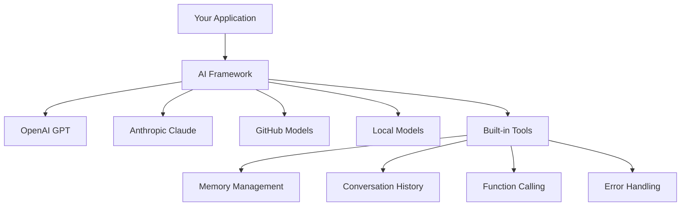
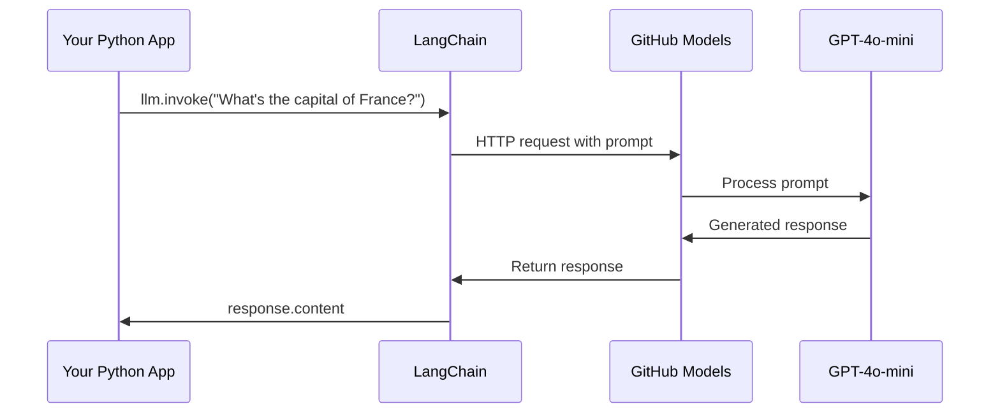
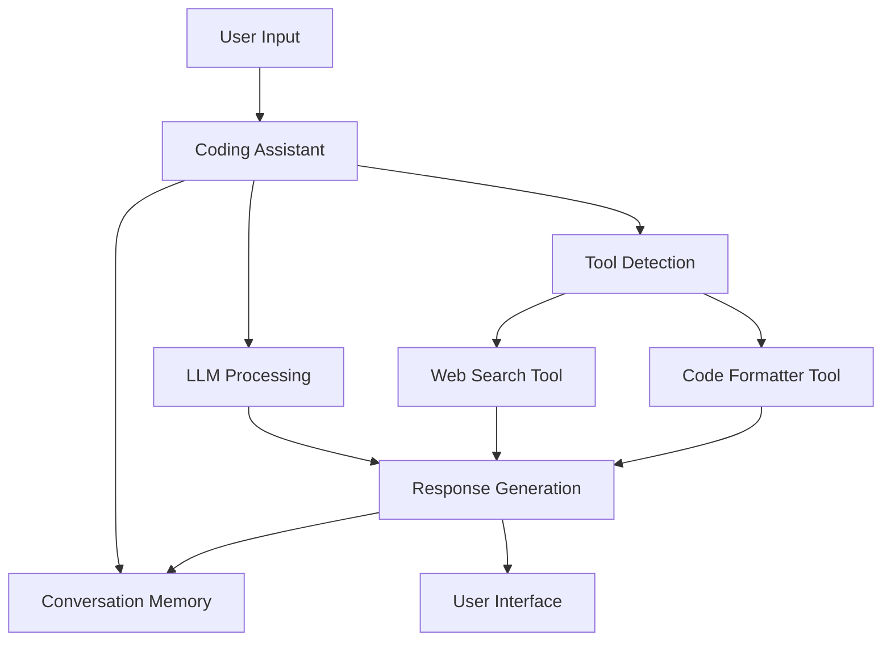
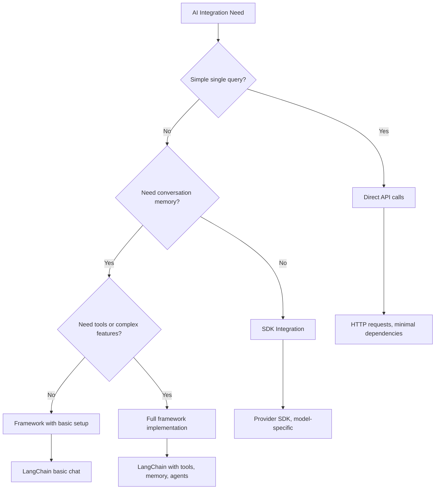

<!--
CO_OP_TRANSLATOR_METADATA:
{
  "original_hash": "e2c4ae5688e34b4b8b09d52aec56c79e",
  "translation_date": "2025-10-22T15:25:13+00:00",
  "source_file": "10-ai-framework-project/README.md",
  "language_code": "tl"
}
-->
# AI Framework

Naranasan mo na bang ma-overwhelm sa pagbuo ng AI applications mula sa simula? Hindi ka nag-iisa! Ang mga AI framework ay parang Swiss Army knife para sa AI development - makapangyarihang mga tool na makakatipid sa iyo ng oras at sakit ng ulo sa paggawa ng mga intelligent na application. Isipin ang AI framework bilang isang maayos na library: nagbibigay ito ng mga pre-built na bahagi, standardized na API, at matatalinong abstraction para makapag-focus ka sa paglutas ng mga problema kaysa sa pag-aayos ng mga detalye ng implementasyon.

Sa araling ito, tatalakayin natin kung paano ang mga framework tulad ng LangChain ay maaaring gawing malinis at nababasa ang dating komplikadong AI integration tasks. Matutuklasan mo kung paano harapin ang mga hamon sa totoong mundo tulad ng pagsubaybay sa mga pag-uusap, pag-implement ng tool calling, at pag-juggle ng iba't ibang AI models sa pamamagitan ng isang unified interface.

Pagkatapos ng araling ito, malalaman mo kung kailan gagamit ng mga framework sa halip na raw API calls, kung paano epektibong gamitin ang kanilang mga abstraction, at kung paano bumuo ng AI applications na handa para sa totoong mundo. Tuklasin natin kung ano ang magagawa ng AI frameworks para sa iyong mga proyekto.

## Bakit pumili ng framework?

Handa ka nang bumuo ng AI app - astig! Pero ganito kasi 'yan: may iba't ibang paraan para magawa ito, at bawat isa ay may sariling pros at cons. Parang pagpili kung maglalakad, magbibisikleta, o magmamaneho para makarating sa isang lugar - lahat sila makakarating ka, pero magkaiba ang karanasan (at effort).

Tingnan natin ang tatlong pangunahing paraan para mag-integrate ng AI sa iyong mga proyekto:

| Paraan | Mga Bentahe | Pinakamainam Para sa | Mga Dapat Isaalang-alang |
|----------|------------|----------|--------------|
| **Direct HTTP Requests** | Buong kontrol, walang dependencies | Simpleng queries, pag-aaral ng mga fundamentals | Mas verbose na code, manual na error handling |
| **SDK Integration** | Mas kaunting boilerplate, model-specific optimization | Single-model applications | Limitado sa specific na providers |
| **AI Frameworks** | Unified API, built-in abstractions | Multi-model apps, complex workflows | Learning curve, posibleng over-abstraction |

### Mga Benepisyo ng Framework sa Praktika



**Bakit mahalaga ang frameworks:**
- **Pinagsasama-sama** ang iba't ibang AI providers sa isang interface
- **Awtomatikong inaasikaso** ang conversation memory
- **Nagbibigay** ng ready-made tools para sa mga karaniwang tasks tulad ng embeddings at function calling
- **Inaayos** ang error handling at retry logic
- **Ginagawang** nababasa ang mga complex workflows sa pamamagitan ng method calls

> 💡 **Pro Tip**: Gumamit ng frameworks kapag lumilipat sa iba't ibang AI models o gumagawa ng mga complex na features tulad ng agents, memory, o tool calling. Gumamit ng direct APIs kapag nag-aaral ng basics o gumagawa ng simple, focused applications.

**Bottom line**: Parang pagpili sa pagitan ng specialized tools ng isang craftsman at isang kumpletong workshop, ito ay tungkol sa pag-match ng tool sa task. Ang frameworks ay mahusay para sa complex, feature-rich applications, habang ang direct APIs ay maganda para sa straightforward na use cases.

## Panimula

Sa araling ito, matututunan natin:

- Gumamit ng karaniwang AI framework.
- Harapin ang mga karaniwang problema tulad ng chat conversations, paggamit ng tools, memory, at context.
- Gamitin ito para bumuo ng AI apps.

## Ang iyong unang AI prompt

Simulan natin sa mga fundamentals sa pamamagitan ng paggawa ng iyong unang AI application na nagpapadala ng tanong at nakakakuha ng sagot. Parang si Archimedes na natuklasan ang prinsipyo ng displacement sa kanyang paliguan, minsan ang pinakasimpleng obserbasyon ang nagdadala ng pinakamakapangyarihang insight - at ginagawang accessible ng frameworks ang mga insight na ito.

### Pag-setup ng LangChain gamit ang GitHub Models

Gagamitin natin ang LangChain para kumonekta sa GitHub Models, na maganda dahil nagbibigay ito ng libreng access sa iba't ibang AI models. Ang pinakamagandang bahagi? Kailangan mo lang ng ilang simpleng configuration parameters para makapagsimula:

```python
from langchain_openai import ChatOpenAI
import os

llm = ChatOpenAI(
    api_key=os.environ["GITHUB_TOKEN"],
    base_url="https://models.github.ai/inference",
    model="openai/gpt-4o-mini",
)

# Send a simple prompt
response = llm.invoke("What's the capital of France?")
print(response.content)
```

**Ano ang nangyayari dito:**
- **Gumagawa** ng LangChain client gamit ang `ChatOpenAI` class - ito ang iyong gateway sa AI!
- **Kinokonekta** ang GitHub Models gamit ang iyong authentication token
- **Tinutukoy** kung aling AI model ang gagamitin (`gpt-4o-mini`) - isipin ito bilang pagpili ng iyong AI assistant
- **Nagpapadala** ng tanong gamit ang `invoke()` method - dito nangyayari ang magic
- **Kinukuha** at ipinapakita ang sagot - at voilà, nakikipag-chat ka na sa AI!

> 🔧 **Setup Note**: Kung gumagamit ka ng GitHub Codespaces, swerte ka - naka-set up na ang `GITHUB_TOKEN` para sa iyo! Gumagamit ng lokal? Walang problema, kailangan mo lang gumawa ng personal access token na may tamang permissions.

**Inaasahang output:**
```text
The capital of France is Paris.
```



## Pagbuo ng conversational AI

Ipinakita ng unang halimbawa ang mga basics, pero ito ay isang single exchange lang - magtanong ka, makakakuha ka ng sagot, at tapos na. Sa totoong applications, gusto mong maalala ng AI ang mga napag-usapan, tulad ng kung paano binuo nina Watson at Holmes ang kanilang mga investigatory conversations sa paglipas ng panahon.

Dito nagiging partikular na kapaki-pakinabang ang LangChain. Nagbibigay ito ng iba't ibang uri ng mensahe na tumutulong sa pag-structure ng mga pag-uusap at nagbibigay-daan sa iyo na bigyan ang AI ng personalidad. Magtatayo ka ng chat experiences na may context at character.

### Pag-unawa sa mga uri ng mensahe

Isipin ang mga uri ng mensahe bilang iba't ibang "sumbrero" na isinusuot ng mga kalahok sa isang pag-uusap. Gumagamit ang LangChain ng iba't ibang klase ng mensahe para subaybayan kung sino ang nagsasabi ng ano:

| Uri ng Mensahe | Layunin | Halimbawa ng Paggamit |
|--------------|---------|------------------|
| `SystemMessage` | Tinutukoy ang personalidad at ugali ng AI | "Ikaw ay isang helpful coding assistant" |
| `HumanMessage` | Kinakatawan ang input ng user | "Ipaliwanag kung paano gumagana ang functions" |
| `AIMessage` | Nagtatago ng mga sagot ng AI | Mga nakaraang sagot ng AI sa pag-uusap |

### Paglikha ng iyong unang pag-uusap

Gumawa tayo ng pag-uusap kung saan ang AI ay may partikular na role. Gagawin natin itong embody si Captain Picard - isang karakter na kilala sa kanyang diplomatic wisdom at leadership:

```python
messages = [
    SystemMessage(content="You are Captain Picard of the Starship Enterprise"),
    HumanMessage(content="Tell me about you"),
]
```

**Pag-unawa sa setup ng pag-uusap:**
- **Itinatakda** ang role at personalidad ng AI sa pamamagitan ng `SystemMessage`
- **Nagbibigay** ng initial user query gamit ang `HumanMessage`
- **Lumilikha** ng pundasyon para sa multi-turn conversation

Ang buong code para sa halimbawang ito ay ganito:

```python
from langchain_core.messages import HumanMessage, SystemMessage
from langchain_openai import ChatOpenAI
import os

llm = ChatOpenAI(
    api_key=os.environ["GITHUB_TOKEN"],
    base_url="https://models.github.ai/inference",
    model="openai/gpt-4o-mini",
)

messages = [
    SystemMessage(content="You are Captain Picard of the Starship Enterprise"),
    HumanMessage(content="Tell me about you"),
]


# works
response  = llm.invoke(messages)
print(response.content)
```

Makikita mo ang resulta na katulad ng:

```text
I am Captain Jean-Luc Picard, the commanding officer of the USS Enterprise (NCC-1701-D), a starship in the United Federation of Planets. My primary mission is to explore new worlds, seek out new life and new civilizations, and boldly go where no one has gone before. 

I believe in the importance of diplomacy, reason, and the pursuit of knowledge. My crew is diverse and skilled, and we often face challenges that test our resolve, ethics, and ingenuity. Throughout my career, I have encountered numerous species, grappled with complex moral dilemmas, and have consistently sought peaceful solutions to conflicts.

I hold the ideals of the Federation close to my heart, believing in the importance of cooperation, understanding, and respect for all sentient beings. My experiences have shaped my leadership style, and I strive to be a thoughtful and just captain. How may I assist you further?
```

Para mapanatili ang continuity ng pag-uusap (sa halip na i-reset ang context bawat oras), kailangan mong patuloy na idagdag ang mga sagot sa iyong message list. Parang oral traditions na nagpreserba ng mga kwento sa paglipas ng henerasyon, ang approach na ito ay bumubuo ng lasting memory:

```python
from langchain_core.messages import HumanMessage, SystemMessage
from langchain_openai import ChatOpenAI
import os

llm = ChatOpenAI(
    api_key=os.environ["GITHUB_TOKEN"],
    base_url="https://models.github.ai/inference",
    model="openai/gpt-4o-mini",
)

messages = [
    SystemMessage(content="You are Captain Picard of the Starship Enterprise"),
    HumanMessage(content="Tell me about you"),
]


# works
response  = llm.invoke(messages)

print(response.content)

print("---- Next ----")

messages.append(response)
messages.append(HumanMessage(content="Now that I know about you, I'm Chris, can I be in your crew?"))

response  = llm.invoke(messages)

print(response.content)

```

Astig, di ba? Ang nangyayari dito ay tinatawag natin ang LLM nang dalawang beses - una gamit ang initial na dalawang mensahe, at pagkatapos ay muli gamit ang buong history ng pag-uusap. Parang sinusundan talaga ng AI ang ating chat!

Kapag pinatakbo mo ang code na ito, makakakuha ka ng pangalawang sagot na parang ganito:

```text
Welcome aboard, Chris! It's always a pleasure to meet those who share a passion for exploration and discovery. While I cannot formally offer you a position on the Enterprise right now, I encourage you to pursue your aspirations. We are always in need of talented individuals with diverse skills and backgrounds. 

If you are interested in space exploration, consider education and training in the sciences, engineering, or diplomacy. The values of curiosity, resilience, and teamwork are crucial in Starfleet. Should you ever find yourself on a starship, remember to uphold the principles of the Federation: peace, understanding, and respect for all beings. Your journey can lead you to remarkable adventures, whether in the stars or on the ground. Engage!
```

Mukhang pwede na 'yan ;)

## Streaming responses

Napansin mo ba kung paano parang "nagta-type" ang ChatGPT ng mga sagot nito nang real-time? Iyan ang streaming sa aksyon. Parang nanonood ng isang skilled calligrapher na nagtatrabaho - nakikita ang mga character na lumilitaw stroke by stroke sa halip na biglaang lumitaw - ang streaming ay nagpaparamdam na mas natural ang interaction at nagbibigay ng agarang feedback.

### Pag-implement ng streaming gamit ang LangChain

```python
from langchain_openai import ChatOpenAI
import os

llm = ChatOpenAI(
    api_key=os.environ["GITHUB_TOKEN"],
    base_url="https://models.github.ai/inference",
    model="openai/gpt-4o-mini",
    streaming=True
)

# Stream the response
for chunk in llm.stream("Write a short story about a robot learning to code"):
    print(chunk.content, end="", flush=True)
```

**Bakit astig ang streaming:**
- **Ipinapakita** ang content habang ito ay ginagawa - wala nang awkward na paghihintay!
- **Pinaparamdam** sa users na may nangyayari talaga
- **Mas mabilis ang pakiramdam**, kahit technically hindi
- **Pinapayagan** ang users na magsimulang magbasa habang "nag-iisip" pa ang AI

> 💡 **User Experience Tip**: Ang streaming ay talagang kapaki-pakinabang kapag humaharap sa mas mahahabang sagot tulad ng code explanations, creative writing, o detalyadong tutorials. Magugustuhan ng iyong users ang makitang may progress kaysa sa nakatingin sa blankong screen!

## Prompt templates

Ang prompt templates ay parang mga rhetorical structures na ginamit sa classical oratory - isipin kung paano inangkop ni Cicero ang kanyang speech patterns para sa iba't ibang audience habang pinapanatili ang parehong persuasive framework. Pinapayagan ka nitong gumawa ng reusable prompts kung saan maaari mong palitan ang iba't ibang piraso ng impormasyon nang hindi nire-rewrite ang lahat. Kapag na-set up mo na ang template, pupunan mo na lang ang mga variables ng anumang values na kailangan mo.

### Paglikha ng reusable prompts

```python
from langchain_core.prompts import ChatPromptTemplate

# Define a template for code explanations
template = ChatPromptTemplate.from_messages([
    ("system", "You are an expert programming instructor. Explain concepts clearly with examples."),
    ("human", "Explain {concept} in {language} with a practical example for {skill_level} developers")
])

# Use the template with different values
questions = [
    {"concept": "functions", "language": "JavaScript", "skill_level": "beginner"},
    {"concept": "classes", "language": "Python", "skill_level": "intermediate"},
    {"concept": "async/await", "language": "JavaScript", "skill_level": "advanced"}
]

for question in questions:
    prompt = template.format_messages(**question)
    response = llm.invoke(prompt)
    print(f"Topic: {question['concept']}\n{response.content}\n---\n")
```

**Bakit magugustuhan mo ang paggamit ng templates:**
- **Pinapanatili** ang consistency ng iyong prompts sa buong app
- **Wala nang** magulo na string concatenation - malinis, simpleng variables lang
- **Ang iyong AI** ay predictable dahil pareho ang structure
- **Madaling** mag-update - baguhin ang template nang isang beses, at fixed na ito kahit saan

## Structured output

Naiinis ka ba sa pag-parse ng AI responses na bumabalik bilang unstructured text? Ang structured output ay parang pagtuturo sa iyong AI na sundin ang sistematikong approach na ginamit ni Linnaeus para sa biological classification - organized, predictable, at madaling gamitin. Maaari kang humiling ng JSON, specific data structures, o anumang format na kailangan mo.

### Pagde-define ng output schemas

```python
from langchain_core.prompts import ChatPromptTemplate
from langchain_core.output_parsers import JsonOutputParser
from pydantic import BaseModel, Field

class CodeReview(BaseModel):
    score: int = Field(description="Code quality score from 1-10")
    strengths: list[str] = Field(description="List of code strengths")
    improvements: list[str] = Field(description="List of suggested improvements")
    overall_feedback: str = Field(description="Summary feedback")

# Set up the parser
parser = JsonOutputParser(pydantic_object=CodeReview)

# Create prompt with format instructions
prompt = ChatPromptTemplate.from_messages([
    ("system", "You are a code reviewer. {format_instructions}"),
    ("human", "Review this code: {code}")
])

# Format the prompt with instructions
chain = prompt | llm | parser

# Get structured response
code_sample = """
def calculate_average(numbers):
    return sum(numbers) / len(numbers)
"""

result = chain.invoke({
    "code": code_sample,
    "format_instructions": parser.get_format_instructions()
})

print(f"Score: {result['score']}")
print(f"Strengths: {', '.join(result['strengths'])}")
```

**Bakit game-changer ang structured output:**
- **Wala nang** hula kung anong format ang babalik - consistent ito palagi
- **Direktang** kumokonekta sa iyong databases at APIs nang walang dagdag na trabaho
- **Hinuhuli** ang mga kakaibang AI responses bago masira ang iyong app
- **Ginagawang** mas malinis ang iyong code dahil alam mo kung ano ang iyong ginagamit

## Tool calling

Ngayon narating natin ang isa sa pinakamakapangyarihang features: tools. Ganito mo binibigyan ang iyong AI ng praktikal na kakayahan lampas sa pag-uusap. Parang kung paano ang mga medieval guilds ay nag-develop ng specialized tools para sa specific crafts, maaari mong bigyan ang iyong AI ng mga nakatuon na instrumento. I-describe mo kung anong tools ang available, at kapag may nag-request ng bagay na tumutugma, maaaring kumilos ang iyong AI.

### Paggamit ng Python

Magdagdag tayo ng tools tulad nito:

```python
from typing_extensions import Annotated, TypedDict

class add(TypedDict):
    """Add two integers."""

    # Annotations must have the type and can optionally include a default value and description (in that order).
    a: Annotated[int, ..., "First integer"]
    b: Annotated[int, ..., "Second integer"]

tools = [add]

functions = {
    "add": lambda a, b: a + b
}
```

Ano ang nangyayari dito? Gumagawa tayo ng blueprint para sa tool na tinatawag na `add`. Sa pamamagitan ng pag-inherit mula sa `TypedDict` at paggamit ng mga fancy `Annotated` types para sa `a` at `b`, binibigyan natin ang LLM ng malinaw na larawan kung ano ang ginagawa ng tool na ito at kung ano ang kailangan nito. Ang `functions` dictionary ay parang toolbox natin - sinasabi nito sa ating code kung ano ang gagawin kapag nagpasya ang AI na gumamit ng specific tool.

Tingnan natin kung paano natin tatawagin ang LLM gamit ang tool na ito:

```python
llm = ChatOpenAI(
    api_key=os.environ["GITHUB_TOKEN"],
    base_url="https://models.github.ai/inference",
    model="openai/gpt-4o-mini",
)

llm_with_tools = llm.bind_tools(tools)
```

Dito natin tinatawag ang `bind_tools` gamit ang `tools` array at sa gayon ang LLM `llm_with_tools` ay may kaalaman na sa tool na ito.

Para magamit ang bagong LLM na ito, maaari nating i-type ang sumusunod na code:

```python
query = "What is 3 + 12?"

res = llm_with_tools.invoke(query)
if(res.tool_calls):
    for tool in res.tool_calls:
        print("TOOL CALL: ", functions[tool["name"]](../../../10-ai-framework-project/**tool["args"]))
print("CONTENT: ",res.content)
```

Ngayon kapag tinawag natin ang `invoke` sa bagong llm na may tools, maaaring mapuno ang property na `tool_calls`. Kung oo, anumang identified tools ay may `name` at `args` property na tumutukoy kung anong tool ang dapat tawagin at may arguments. Ang buong code ay ganito:

```python
from langchain_core.messages import HumanMessage, SystemMessage
from langchain_openai import ChatOpenAI
import os
from typing_extensions import Annotated, TypedDict

class add(TypedDict):
    """Add two integers."""

    # Annotations must have the type and can optionally include a default value and description (in that order).
    a: Annotated[int, ..., "First integer"]
    b: Annotated[int, ..., "Second integer"]

tools = [add]

functions = {
    "add": lambda a, b: a + b
}

llm = ChatOpenAI(
    api_key=os.environ["GITHUB_TOKEN"],
    base_url="https://models.github.ai/inference",
    model="openai/gpt-4o-mini",
)

llm_with_tools = llm.bind_tools(tools)

query = "What is 3 + 12?"

res = llm_with_tools.invoke(query)
if(res.tool_calls):
    for tool in res.tool_calls:
        print("TOOL CALL: ", functions[tool["name"]](../../../10-ai-framework-project/**tool["args"]))
print("CONTENT: ",res.content)
```

Kapag pinatakbo mo ang code na ito, makakakita ka ng output na katulad ng:

```text
TOOL CALL:  15
CONTENT: 
```

Sinuri ng AI ang "What is 3 + 12" at kinilala ito bilang isang task para sa `add` tool. Parang isang skilled librarian na alam kung aling reference ang dapat konsultahin base sa uri ng tanong, ginawa nito ang determinasyon mula sa pangalan ng tool, description, at field specifications. Ang resulta na 15 ay nagmula sa ating `functions` dictionary na nag-execute ng tool:

```python
print("TOOL CALL: ", functions[tool["name"]](../../../10-ai-framework-project/**tool["args"]))
```

### Isang mas kawili-wiling tool na tumatawag sa web API

Ang pagdaragdag ng mga numero ay nagpapakita ng konsepto, pero ang mga totoong tools ay karaniwang gumagawa ng mas kumplikadong operasyon, tulad ng pagtawag sa web APIs. Palawakin natin ang halimbawa para hayaan ang AI na kumuha ng content mula sa internet - katulad ng kung paano ang mga telegraph operators ay minsang nagkonekta ng mga malalayong lokasyon:

```python
class joke(TypedDict):
    """Tell a joke."""

    # Annotations must have the type and can optionally include a default value and description (in that order).
    category: Annotated[str, ..., "The joke category"]

def get_joke(category: str) -> str:
    response = requests.get(f"https://api.chucknorris.io/jokes/random?category={category}", headers={"Accept": "application/json"})
    if response.status_code == 200:
        return response.json().get("value", f"Here's a {category} joke!")
    return f"Here's a {category} joke!"

functions = {
    "add": lambda a, b: a + b,
    "joke": lambda category: get_joke(category)
}

query = "Tell me a joke about animals"

# the rest of the code is the same
```

Ngayon kapag pinatakbo mo ang code na ito makakakuha ka ng sagot na parang ganito:

```text
TOOL CALL:  Chuck Norris once rode a nine foot grizzly bear through an automatic car wash, instead of taking a shower.
CONTENT:  
```

Narito ang buong code:

```python
from langchain_openai import ChatOpenAI
import requests
import os
from typing_extensions import Annotated, TypedDict

class add(TypedDict):
    """Add two integers."""

    # Annotations must have the type and can optionally include a default value and description (in that order).
    a: Annotated[int, ..., "First integer"]
    b: Annotated[int, ..., "Second integer"]

class joke(TypedDict):
    """Tell a joke."""

    # Annotations must have the type and can optionally include a default value and description (in that order).
    category: Annotated[str, ..., "The joke category"]

tools = [add, joke]

def get_joke(category: str) -> str:
    response = requests.get(f"https://api.chucknorris.io/jokes/random?category={category}", headers={"Accept": "application/json"})
    if response.status_code == 200:
        return response.json().get("value", f"Here's a {category} joke!")
    return f"Here's a {category} joke!"

functions = {
    "add": lambda a, b: a + b,
    "joke": lambda category: get_joke(category)
}

llm = ChatOpenAI(
    api_key=os.environ["GITHUB_TOKEN"],
    base_url="https://models.github.ai/inference",
    model="openai/gpt-4o-mini",
)

llm_with_tools = llm.bind_tools(tools)

query = "Tell me a joke about animals"

res = llm_with_tools.invoke(query)
if(res.tool_calls):
    for tool in res.tool_calls:
        # print("TOOL CALL: ", tool)
        print("TOOL CALL: ", functions[tool["name"]](../../../10-ai-framework-project/**tool["args"]))
print("CONTENT: ",res.content)
```

## Embeddings at pagproseso ng dokumento

Ang embeddings ay isa sa mga pinaka-eleganteng solusyon sa modernong AI. Isipin kung maaari mong kunin ang anumang piraso ng teksto at i-convert ito sa numerical coordinates na naglalarawan ng kahulugan nito. Iyan ang ginagawa ng embeddings - binabago nila ang teksto sa mga puntos sa multi-dimensional space kung saan ang mga magkatulad na konsepto ay nagkakluster. Parang may coordinate system para sa mga ideya, na kahawig ng kung paano inayos ni Mendeleev ang periodic table base sa atomic properties.

### Paglikha at paggamit ng embeddings

```python
from langchain_openai import OpenAIEmbeddings
from langchain_community.vectorstores import FAISS
from langchain_community.document_loaders import TextLoader
from langchain.text_splitter import CharacterTextSplitter

# Initialize embeddings
embeddings = OpenAIEmbeddings(
    api_key=os.environ["GITHUB_TOKEN"],
    base_url="https://models.github.ai/inference",
    model="text-embedding-3-small"
)

# Load and split documents
loader = TextLoader("documentation.txt")
documents = loader.load()

text_splitter = CharacterTextSplitter(chunk_size=1000, chunk_overlap=0)
texts = text_splitter.split_documents(documents)

# Create vector store
vectorstore = FAISS.from_documents(texts, embeddings)

# Perform similarity search
query = "How do I handle user authentication?"
similar_docs = vectorstore.similarity_search(query, k=3)

for doc in similar_docs:
    print(f"Relevant content: {doc.page_content[:200]}...")
```

### Document loaders para sa iba't ibang format

```python
from langchain_community.document_loaders import (
    PyPDFLoader,
    CSVLoader,
    JSONLoader,
    WebBaseLoader
)

# Load different document types
pdf_loader = PyPDFLoader("manual.pdf")
csv_loader = CSVLoader("data.csv")
json_loader = JSONLoader("config.json")
web_loader = WebBaseLoader("https://example.com/docs")

# Process all documents
all_documents = []
for loader in [pdf_loader, csv_loader, json_loader, web_loader]:
    docs = loader.load()
    all_documents.extend(docs)
```

**Ano ang magagawa mo gamit ang embeddings:**
- **Bumuo** ng search na talagang nauunawaan ang ibig mong sabihin, hindi lang keyword matching
- **Lumikha** ng AI na maaaring sumagot sa mga tanong tungkol sa iyong mga dokumento
- **Gumawa** ng recommendation systems na nagmumungkahi ng tunay na relevant na content
- **Awtomatikong** mag-organize at mag-categorize ng iyong content

## Pagbuo ng kumpletong AI application

Ngayon ay i-integrate natin ang lahat ng natutunan mo sa isang komprehensibong application - isang coding assistant na maaaring sumagot sa mga tanong, gumamit ng tools, at magpanatili ng conversation memory. Parang kung paano pinagsama ng printing press ang mga existing technologies (movable type, ink, paper, at pressure) sa isang bagay na transformative, pagsasamahin natin ang ating AI components sa isang bagay na praktikal at kapaki-pakinabang.

### Halimbawa ng kumpletong application

```python
from langchain_openai import ChatOpenAI, OpenAIEmbeddings
from langchain_core.prompts import ChatPromptTemplate
from langchain_core.messages import HumanMessage, SystemMessage, AIMessage
from langchain_community.vectorstores import FAISS
from typing_extensions import Annotated, TypedDict
import os
import requests

class CodingAssistant:
    def __init__(self):
        self.llm = ChatOpenAI(
            api_key=os.environ["GITHUB_TOKEN"],
            base_url="https://models.github.ai/inference",
            model="openai/gpt-4o-mini"
        )
        
        self.conversation_history = [
            SystemMessage(content="""You are an expert coding assistant. 
            Help users learn programming concepts, debug code, and write better software.
            Use tools when needed and maintain a helpful, encouraging tone.""")
        ]
        
        # Define tools
        self.setup_tools()
    
    def setup_tools(self):
        class web_search(TypedDict):
            """Search for programming documentation or examples."""
            query: Annotated[str, "Search query for programming help"]
        
        class code_formatter(TypedDict):
            """Format and validate code snippets."""
            code: Annotated[str, "Code to format"]
            language: Annotated[str, "Programming language"]
        
        self.tools = [web_search, code_formatter]
        self.llm_with_tools = self.llm.bind_tools(self.tools)
    
    def chat(self, user_input: str):
        # Add user message to conversation
        self.conversation_history.append(HumanMessage(content=user_input))
        
        # Get AI response
        response = self.llm_with_tools.invoke(self.conversation_history)
        
        # Handle tool calls if any
        if response.tool_calls:
            for tool_call in response.tool_calls:
                tool_result = self.execute_tool(tool_call)
                print(f"🔧 Tool used: {tool_call['name']}")
                print(f"📊 Result: {tool_result}")
        
        # Add AI response to conversation
        self.conversation_history.append(response)
        
        return response.content
    
    def execute_tool(self, tool_call):
        tool_name = tool_call['name']
        args = tool_call['args']
        
        if tool_name == 'web_search':
            return f"Found documentation for: {args['query']}"
        elif tool_name == 'code_formatter':
            return f"Formatted {args['language']} code: {args['code'][:50]}..."
        
        return "Tool execution completed"

# Usage example
assistant = CodingAssistant()

print("🤖 Coding Assistant Ready! Type 'quit' to exit.\n")

while True:
    user_input = input("You: ")
    if user_input.lower() == 'quit':
        break
    
    response = assistant.chat(user_input)
    print(f"🤖 Assistant: {response}\n")
```

**Application architecture:**



**Mga pangunahing tampok na na-implement natin:**
- **Naaalala** ang buong pag-uusap para sa continuity ng context
- **Gumagawa ng aksyon** sa pamamagitan ng tool calling, hindi lang pag-uusap
- **Sumusunod** sa predictable interaction patterns
- **Awtomatikong inaasikaso** ang error handling at complex workflows

## Assignment: Gumawa ng sarili mong AI-powered study assistant

**Layunin**: Gumawa ng AI application na tumutulong sa mga estudyante na matutunan ang mga programming concepts sa pamamagitan ng pagbibigay ng mga paliwanag, halimbawa ng code, at interactive na quizzes.

### Mga Kinakailangan

**Core Features (Required):**
1. **Conversational Interface**: Mag-implement ng chat system na nagpapanatili ng context sa maraming tanong
2. **Educational Tools**: Gumawa ng hindi bababa sa dalawang tools na tumutulong sa pag-aaral:
   - Tool para sa paliwanag ng code
   - Generator ng concept quiz
3. **Personalized Learning**: Gumamit ng mga mensahe ng sistema upang iangkop ang mga sagot sa iba't ibang antas ng kasanayan  
4. **Response Formatting**: Magpatupad ng naka-istrukturang output para sa mga tanong sa pagsusulit  

### Mga Hakbang sa Pagpapatupad  

**Hakbang 1: I-setup ang iyong environment**  
```bash
pip install langchain langchain-openai
```
  
**Hakbang 2: Pangunahing functionality ng chat**  
- Gumawa ng `StudyAssistant` na klase  
- Magpatupad ng memorya ng pag-uusap  
- Magdagdag ng configuration ng personalidad para sa suporta sa edukasyon  

**Hakbang 3: Magdagdag ng mga kasangkapan sa edukasyon**  
- **Code Explainer**: Hinahati ang code sa mga bahagi na madaling maunawaan  
- **Quiz Generator**: Gumagawa ng mga tanong tungkol sa mga konsepto ng programming  
- **Progress Tracker**: Nagsusubaybay sa mga paksang natakpan  

**Hakbang 4: Mga pinahusay na tampok (Opsyonal)**  
- Magpatupad ng streaming responses para sa mas mahusay na karanasan ng user  
- Magdagdag ng pag-load ng dokumento upang maisama ang mga materyales ng kurso  
- Gumawa ng embeddings para sa retrieval ng nilalaman batay sa pagkakatulad  

### Pamantayan sa Pagsusuri  

| Tampok | Napakahusay (4) | Maganda (3) | Katanggap-tanggap (2) | Kailangan ng Pagpapabuti (1) |  
|--------|-----------------|-------------|-----------------------|-----------------------------|  
| **Daloy ng Pag-uusap** | Natural, may kamalayan sa konteksto | Magandang pagpapanatili ng konteksto | Pangunahing pag-uusap | Walang memorya sa pagitan ng mga palitan |  
| **Pagsasama ng Kasangkapan** | Maraming kapaki-pakinabang na kasangkapan na gumagana nang maayos | 2+ kasangkapan na maayos na ipinatupad | 1-2 pangunahing kasangkapan | Hindi gumagana ang mga kasangkapan |  
| **Kalidad ng Code** | Malinis, mahusay na na-dokumentado, may error handling | Magandang istruktura, may kaunting dokumentasyon | Pangunahing functionality ay gumagana | Mahinang istruktura, walang error handling |  
| **Halaga sa Edukasyon** | Talagang nakakatulong sa pag-aaral, adaptive | Magandang suporta sa pag-aaral | Pangunahing paliwanag | Limitadong benepisyo sa edukasyon |  

### Sample na istruktura ng code  

```python
class StudyAssistant:
    def __init__(self, skill_level="beginner"):
        # Initialize LLM, tools, and conversation memory
        pass
    
    def explain_code(self, code, language):
        # Tool: Explain how code works
        pass
    
    def generate_quiz(self, topic, difficulty):
        # Tool: Create practice questions
        pass
    
    def chat(self, user_input):
        # Main conversation interface
        pass

# Example usage
assistant = StudyAssistant(skill_level="intermediate")
response = assistant.chat("Explain how Python functions work")
```
  
**Bonus na Hamon:**  
- Magdagdag ng kakayahan sa input/output ng boses  
- Magpatupad ng web interface gamit ang Streamlit o Flask  
- Gumawa ng knowledge base mula sa mga materyales ng kurso gamit ang embeddings  
- Magdagdag ng pagsubaybay sa progreso at personalized na mga landas sa pag-aaral  

## Buod  

🎉 Ngayon ay na-master mo na ang mga pangunahing kaalaman ng pagbuo ng AI framework at natutunan kung paano gumawa ng mga sopistikadong AI application gamit ang LangChain. Tulad ng pagkumpleto ng isang komprehensibong apprenticeship, nakakuha ka ng malawak na toolkit ng mga kasanayan. Balikan natin ang iyong mga nagawa.  

### Ano ang iyong natutunan  

**Mga Pangunahing Konsepto ng Framework:**  
- **Mga Benepisyo ng Framework**: Pag-unawa kung kailan pipiliin ang mga framework kaysa sa direktang API calls  
- **Mga Pangunahing Kaalaman ng LangChain**: Pag-setup at pag-configure ng koneksyon ng AI model  
- **Mga Uri ng Mensahe**: Paggamit ng `SystemMessage`, `HumanMessage`, at `AIMessage` para sa naka-istrukturang pag-uusap  

**Mga Advanced na Tampok:**  
- **Tool Calling**: Paglikha at pagsasama ng mga custom na kasangkapan para sa pinahusay na kakayahan ng AI  
- **Memorya ng Pag-uusap**: Pagpapanatili ng konteksto sa maraming pag-uusap  
- **Streaming Responses**: Pagpapatupad ng real-time na paghahatid ng sagot  
- **Prompt Templates**: Pagbuo ng reusable, dynamic na mga prompt  
- **Naka-istrukturang Output**: Pagtiyak ng pare-pareho, parseable na mga sagot ng AI  
- **Embeddings**: Paglikha ng semantic search at kakayahan sa pagproseso ng dokumento  

**Praktikal na Aplikasyon:**  
- **Pagbuo ng Kumpletong Apps**: Pagsasama ng maraming tampok sa mga production-ready na application  
- **Error Handling**: Pagpapatupad ng matibay na pamamahala ng error at validation  
- **Pagsasama ng Kasangkapan**: Paglikha ng mga custom na kasangkapan na nagpapalawak ng kakayahan ng AI  

### Mga Pangunahing Puntos  

> 🎯 **Tandaan**: Ang mga AI framework tulad ng LangChain ay parang mga kaibigan na puno ng tampok na nagtatago ng kumplikado. Perpekto ang mga ito kapag kailangan mo ng memorya ng pag-uusap, tool calling, o gusto mong magtrabaho sa maraming AI model nang hindi nawawala ang iyong katinuan.  

**Framework ng Desisyon para sa Pagsasama ng AI:**  


  
### Saan ka pupunta mula rito?  

**Simulan ang paggawa ngayon:**  
- Gamitin ang mga konseptong ito at gumawa ng isang bagay na nagpapasaya sa IYO!  
- Mag-eksperimento sa iba't ibang AI model gamit ang LangChain - parang playground ng AI models  
- Gumawa ng mga kasangkapan na talagang nakakatugon sa mga problema mo sa trabaho o proyekto  

**Handa na para sa susunod na antas?**  
- **AI Agents**: Gumawa ng mga sistema ng AI na talagang makakapagplano at makakagawa ng mga kumplikadong gawain nang mag-isa  
- **RAG (Retrieval-Augmented Generation)**: Pagsamahin ang AI sa iyong sariling knowledge bases para sa mga super-powered na application  
- **Multi-Modal AI**: Magtrabaho gamit ang text, mga larawan, at audio nang sabay-sabay - walang limitasyon ang mga posibilidad!  
- **Production Deployment**: Matutunan kung paano i-scale ang iyong AI apps at i-monitor ang mga ito sa totoong mundo  

**Sumali sa komunidad:**  
- Ang komunidad ng LangChain ay kahanga-hanga para sa pananatiling updated at pag-aaral ng mga pinakamahusay na kasanayan  
- Ang GitHub Models ay nagbibigay sa iyo ng access sa mga cutting-edge na kakayahan ng AI - perpekto para sa pag-eksperimento  
- Patuloy na magsanay gamit ang iba't ibang use cases - bawat proyekto ay magtuturo sa iyo ng bago  

Ngayon ay mayroon ka nang kaalaman upang bumuo ng mga intelligent, conversational na application na makakatulong sa mga tao na lutasin ang mga totoong problema. Tulad ng mga artisan ng Renaissance na pinagsama ang artistikong pananaw sa teknikal na kasanayan, maaari mo nang pagsamahin ang mga kakayahan ng AI sa praktikal na aplikasyon. Ang tanong ay: ano ang iyong gagawin? 🚀  

## Hamon ng GitHub Copilot Agent 🚀  

Gamitin ang Agent mode upang kumpletuhin ang sumusunod na hamon:  

**Deskripsyon:** Gumawa ng advanced na AI-powered code review assistant na pinagsasama ang maraming tampok ng LangChain kabilang ang tool calling, structured output, at memorya ng pag-uusap upang magbigay ng komprehensibong feedback sa mga pagsusumite ng code.  

**Prompt:** Gumawa ng CodeReviewAssistant na klase na nagpapatupad ng:  
1. Isang kasangkapan para sa pagsusuri ng complexity ng code at pagbibigay ng mga mungkahi para sa pagpapabuti  
2. Isang kasangkapan para sa pag-check ng code laban sa mga pinakamahusay na kasanayan  
3. Naka-istrukturang output gamit ang Pydantic models para sa pare-parehong format ng review  
4. Memorya ng pag-uusap upang subaybayan ang mga session ng review  
5. Pangunahing chat interface na maaaring humawak ng mga pagsusumite ng code at magbigay ng detalyado, actionable na feedback  

Dapat magawa ng assistant na mag-review ng code sa maraming programming languages, magpanatili ng konteksto sa maraming pagsusumite ng code sa isang session, at magbigay ng parehong summary scores at detalyadong mungkahi para sa pagpapabuti.  

Matuto pa tungkol sa [agent mode](https://code.visualstudio.com/blogs/2025/02/24/introducing-copilot-agent-mode) dito.  

---

**Paunawa**:  
Ang dokumentong ito ay isinalin gamit ang AI translation service na [Co-op Translator](https://github.com/Azure/co-op-translator). Bagama't sinisikap naming maging tumpak, mangyaring tandaan na ang mga awtomatikong pagsasalin ay maaaring maglaman ng mga pagkakamali o hindi pagkakatugma. Ang orihinal na dokumento sa kanyang katutubong wika ang dapat ituring na opisyal na pinagmulan. Para sa mahalagang impormasyon, inirerekomenda ang propesyonal na pagsasalin ng tao. Hindi kami mananagot sa anumang hindi pagkakaunawaan o maling interpretasyon na dulot ng paggamit ng pagsasaling ito.