# AI Framework

Naranasan mo na bang ma-overwhelm sa paggawa ng AI applications mula sa simula? Hindi ka nag-iisa! Ang mga AI framework ay parang Swiss Army knife para sa AI development - mga makapangyarihang tool na makakatipid sa iyo ng oras at sakit ng ulo sa paggawa ng mga intelligent na application. Isipin ang AI framework bilang isang maayos na library: nagbibigay ito ng mga pre-built na bahagi, standardized na API, at matatalinong abstraction para makapag-focus ka sa paglutas ng mga problema sa halip na magpakaabala sa mga detalye ng implementasyon.

Sa araling ito, tatalakayin natin kung paano ang mga framework tulad ng LangChain ay maaaring gawing malinis at madaling basahin ang dating komplikadong mga gawain sa AI integration. Matutuklasan mo kung paano harapin ang mga hamon sa totoong buhay tulad ng pagsubaybay sa mga pag-uusap, paggamit ng mga tool, at pamamahala sa iba't ibang AI models sa pamamagitan ng isang unified interface.

Sa pagtatapos ng araling ito, malalaman mo kung kailan gagamit ng mga framework sa halip na raw API calls, kung paano epektibong gamitin ang kanilang mga abstraction, at kung paano gumawa ng mga AI application na handa para sa totoong mundo. Tuklasin natin kung ano ang magagawa ng AI frameworks para sa iyong mga proyekto.

## ⚡ Ano ang Magagawa Mo sa Loob ng 5 Minuto

**Mabilisang Gabay para sa Abalang Developers**

```mermaid
flowchart LR
    A[⚡ 5 minutes] --> B[Install LangChain]
    B --> C[Create ChatOpenAI client]
    C --> D[Send first prompt]
    D --> E[See framework power]
```



- **Minuto 1**: I-install ang LangChain: `pip install langchain langchain-openai`
- **Minuto 2**: I-set up ang iyong GitHub token at i-import ang ChatOpenAI client
- **Minuto 3**: Gumawa ng simpleng pag-uusap gamit ang system at human messages
- **Minuto 4**: Magdagdag ng basic na tool (tulad ng add function) at makita ang AI tool calling
- **Minuto 5**: Maranasan ang pagkakaiba ng raw API calls at framework abstraction

**Mabilisang Test Code**:
```python
from langchain_openai import ChatOpenAI
from langchain_core.messages import SystemMessage, HumanMessage

llm = ChatOpenAI(
    api_key=os.environ["GITHUB_TOKEN"],
    base_url="https://models.github.ai/inference",
    model="openai/gpt-4o-mini"
)

response = llm.invoke([
    SystemMessage(content="You are a helpful coding assistant"),
    HumanMessage(content="Explain Python functions briefly")
])
print(response.content)
```

**Bakit Mahalaga Ito**: Sa loob ng 5 minuto, mararanasan mo kung paano binabago ng AI frameworks ang komplikadong AI integration sa simpleng method calls. Ito ang pundasyon na nagpapagana sa mga production AI applications.

## Bakit pumili ng framework?

Handa ka nang gumawa ng AI app - ang galing! Pero ganito kasi 'yan: may iba't ibang paraan para magawa ito, at bawat isa ay may sariling pros at cons. Parang pagpili kung maglalakad, magbibisikleta, o magmamaneho papunta sa isang lugar - lahat sila makakarating ka, pero magkaiba ang karanasan (at effort).

Tingnan natin ang tatlong pangunahing paraan para mag-integrate ng AI sa iyong mga proyekto:

| Paraan | Mga Bentahe | Pinakamainam Para sa | Mga Dapat Isaalang-alang |
|--------|-------------|----------------------|--------------------------|
| **Direct HTTP Requests** | Buong kontrol, walang dependencies | Simpleng queries, pag-aaral ng mga pangunahing kaalaman | Mas verbose na code, manual na error handling |
| **SDK Integration** | Mas kaunting boilerplate, model-specific optimization | Single-model applications | Limitado sa partikular na mga provider |
| **AI Frameworks** | Unified API, built-in abstractions | Multi-model apps, complex workflows | Learning curve, posibleng over-abstraction |

### Mga Benepisyo ng Framework sa Praktikal na Gamit


**Bakit mahalaga ang frameworks:**
- **Pinagsasama-sama** ang iba't ibang AI providers sa isang interface
- **Awtomatikong hinahandle** ang conversation memory
- **Nagbibigay** ng ready-made tools para sa mga karaniwang gawain tulad ng embeddings at function calling
- **Pinamamahalaan** ang error handling at retry logic
- **Ginagawang** madaling basahin ang mga kumplikadong workflows

> 💡 **Pro Tip**: Gumamit ng frameworks kapag lumilipat sa iba't ibang AI models o gumagawa ng mga kumplikadong features tulad ng agents, memory, o tool calling. Gumamit ng direct APIs kapag nag-aaral ng mga pangunahing kaalaman o gumagawa ng simpleng, nakatuon na mga application.

**Bottom line**: Parang pagpili sa pagitan ng mga specialized tools ng isang craftsman at isang kumpletong workshop, ang tamang tool ay nakadepende sa gawain. Ang mga frameworks ay mahusay para sa mga kumplikado at feature-rich na applications, habang ang direct APIs ay angkop para sa mga simpleng use cases.

## 🗺️ Ang Iyong Learning Journey sa AI Framework Mastery


**Destinasyon ng Iyong Paglalakbay**: Sa pagtatapos ng araling ito, magiging bihasa ka sa AI framework development at makakagawa ng mga sopistikado at production-ready na AI applications na maihahambing sa mga komersyal na AI assistants.

## Panimula

Sa araling ito, matututunan natin:

- Gumamit ng karaniwang AI framework.
- Harapin ang mga karaniwang problema tulad ng chat conversations, paggamit ng tool, memory, at context.
- Gamitin ito para gumawa ng AI apps.

## 🧠 Ecosystem ng AI Framework Development


**Pangunahing Prinsipyo**: Ang AI frameworks ay nag-a-abstract ng complexity habang nagbibigay ng makapangyarihang abstractions para sa conversation management, tool integration, at document processing, na nagpapahintulot sa mga developer na gumawa ng sopistikadong AI applications na may malinis at maayos na code.

## Ang Iyong Unang AI Prompt

Simulan natin sa mga pangunahing kaalaman sa pamamagitan ng paggawa ng iyong unang AI application na magpapadala ng tanong at makakakuha ng sagot. Parang si Archimedes na natuklasan ang prinsipyo ng displacement sa kanyang paliguan, minsan ang pinakasimpleng obserbasyon ang nagdadala ng pinakamakapangyarihang insight - at ginagawang accessible ng frameworks ang mga insight na ito.

### Pag-setup ng LangChain gamit ang GitHub Models

Gagamitin natin ang LangChain para kumonekta sa GitHub Models, na maganda dahil nagbibigay ito ng libreng access sa iba't ibang AI models. Ang pinakamagandang bahagi? Kailangan mo lang ng ilang simpleng configuration parameters para makapagsimula:

```python
from langchain_openai import ChatOpenAI
import os

llm = ChatOpenAI(
    api_key=os.environ["GITHUB_TOKEN"],
    base_url="https://models.github.ai/inference",
    model="openai/gpt-4o-mini",
)

# Send a simple prompt
response = llm.invoke("What's the capital of France?")
print(response.content)
```

**Ano ang nangyayari dito:**
- **Gumagawa** ng LangChain client gamit ang `ChatOpenAI` class - ito ang iyong gateway sa AI!
- **Kinokonekta** ang GitHub Models gamit ang iyong authentication token
- **Tinutukoy** kung aling AI model ang gagamitin (`gpt-4o-mini`) - isipin ito bilang pagpili ng iyong AI assistant
- **Nagpapadala** ng tanong gamit ang `invoke()` method - dito nangyayari ang magic
- **Kinukuha** at ipinapakita ang sagot - at voilà, nakikipag-usap ka na sa AI!

> 🔧 **Setup Note**: Kung gumagamit ka ng GitHub Codespaces, swerte ka - naka-set up na ang `GITHUB_TOKEN` para sa iyo! Lokal na trabaho? Walang problema, kailangan mo lang gumawa ng personal access token na may tamang permissions.

**Inaasahang output:**
```text
The capital of France is Paris.
```


## Paggawa ng Conversational AI

Ang unang halimbawa ay nagpapakita ng mga pangunahing kaalaman, pero ito ay isang single exchange lang - magtatanong ka, makakakuha ng sagot, at tapos na. Sa totoong applications, gusto mong maalala ng AI ang mga napag-usapan, tulad ng kung paano binuo nina Watson at Holmes ang kanilang mga investigatoryong pag-uusap sa paglipas ng panahon.

Dito nagiging partikular na kapaki-pakinabang ang LangChain. Nagbibigay ito ng iba't ibang uri ng message na tumutulong sa pag-structure ng mga pag-uusap at nagbibigay-daan sa iyo na bigyan ang iyong AI ng personalidad. Magtatayo ka ng mga chat experiences na may context at character.

### Pag-unawa sa mga Uri ng Mensahe

Isipin ang mga uri ng mensahe na ito bilang iba't ibang "sumbrero" na isinusuot ng mga kalahok sa isang pag-uusap. Ginagamit ng LangChain ang iba't ibang klase ng mensahe para subaybayan kung sino ang nagsasabi ng ano:

| Uri ng Mensahe | Layunin | Halimbawa ng Gamit |
|----------------|---------|--------------------|
| `SystemMessage` | Tinutukoy ang personalidad at ugali ng AI | "Ikaw ay isang helpful coding assistant" |
| `HumanMessage` | Kinakatawan ang input ng user | "Ipaliwanag kung paano gumagana ang functions" |
| `AIMessage` | Nagtatago ng mga sagot ng AI | Mga naunang sagot ng AI sa pag-uusap |

### Paggawa ng Iyong Unang Pag-uusap

Gumawa tayo ng pag-uusap kung saan ang AI natin ay may tiyak na papel. Gagawin natin itong embody si Captain Picard - isang karakter na kilala sa kanyang diplomatic wisdom at leadership:

```python
messages = [
    SystemMessage(content="You are Captain Picard of the Starship Enterprise"),
    HumanMessage(content="Tell me about you"),
]
```

**Pagpapaliwanag sa setup ng pag-uusap:**
- **Itinatakda** ang papel at personalidad ng AI sa pamamagitan ng `SystemMessage`
- **Nagbibigay** ng unang tanong ng user gamit ang `HumanMessage`
- **Lumilikha** ng pundasyon para sa multi-turn na pag-uusap

Ang buong code para sa halimbawang ito ay ganito:

```python
from langchain_core.messages import HumanMessage, SystemMessage
from langchain_openai import ChatOpenAI
import os

llm = ChatOpenAI(
    api_key=os.environ["GITHUB_TOKEN"],
    base_url="https://models.github.ai/inference",
    model="openai/gpt-4o-mini",
)

messages = [
    SystemMessage(content="You are Captain Picard of the Starship Enterprise"),
    HumanMessage(content="Tell me about you"),
]


# works
response  = llm.invoke(messages)
print(response.content)
```

Makikita mo ang resulta na katulad ng:

```text
I am Captain Jean-Luc Picard, the commanding officer of the USS Enterprise (NCC-1701-D), a starship in the United Federation of Planets. My primary mission is to explore new worlds, seek out new life and new civilizations, and boldly go where no one has gone before. 

I believe in the importance of diplomacy, reason, and the pursuit of knowledge. My crew is diverse and skilled, and we often face challenges that test our resolve, ethics, and ingenuity. Throughout my career, I have encountered numerous species, grappled with complex moral dilemmas, and have consistently sought peaceful solutions to conflicts.

I hold the ideals of the Federation close to my heart, believing in the importance of cooperation, understanding, and respect for all sentient beings. My experiences have shaped my leadership style, and I strive to be a thoughtful and just captain. How may I assist you further?
```

Para mapanatili ang continuity ng pag-uusap (sa halip na i-reset ang context sa bawat pagkakataon), kailangan mong patuloy na idagdag ang mga sagot sa iyong message list. Parang oral traditions na nagpreserba ng mga kwento sa paglipas ng mga henerasyon, ang approach na ito ay bumubuo ng lasting memory:

```python
from langchain_core.messages import HumanMessage, SystemMessage
from langchain_openai import ChatOpenAI
import os

llm = ChatOpenAI(
    api_key=os.environ["GITHUB_TOKEN"],
    base_url="https://models.github.ai/inference",
    model="openai/gpt-4o-mini",
)

messages = [
    SystemMessage(content="You are Captain Picard of the Starship Enterprise"),
    HumanMessage(content="Tell me about you"),
]


# works
response  = llm.invoke(messages)

print(response.content)

print("---- Next ----")

messages.append(response)
messages.append(HumanMessage(content="Now that I know about you, I'm Chris, can I be in your crew?"))

response  = llm.invoke(messages)

print(response.content)

```

Ang galing, di ba? Ang nangyayari dito ay tinatawag natin ang LLM nang dalawang beses - una gamit ang initial na dalawang mensahe, at pagkatapos ay muli gamit ang buong history ng pag-uusap. Parang sinusundan talaga ng AI ang ating chat!

Kapag pinatakbo mo ang code na ito, makakakuha ka ng pangalawang sagot na parang ganito:

```text
Welcome aboard, Chris! It's always a pleasure to meet those who share a passion for exploration and discovery. While I cannot formally offer you a position on the Enterprise right now, I encourage you to pursue your aspirations. We are always in need of talented individuals with diverse skills and backgrounds. 

If you are interested in space exploration, consider education and training in the sciences, engineering, or diplomacy. The values of curiosity, resilience, and teamwork are crucial in Starfleet. Should you ever find yourself on a starship, remember to uphold the principles of the Federation: peace, understanding, and respect for all beings. Your journey can lead you to remarkable adventures, whether in the stars or on the ground. Engage!
```


Mukhang pwede na 'yan ;)

## Streaming Responses

Napansin mo ba kung paano parang "nagta-type" ang ChatGPT ng mga sagot nito nang real-time? Iyan ang streaming. Parang nanonood ng isang bihasang calligrapher na gumagawa - nakikita ang mga character na lumilitaw stroke by stroke sa halip na biglaang lumitaw - ang streaming ay nagpaparamdam na mas natural ang interaction at nagbibigay ng agarang feedback.

### Pag-implement ng Streaming gamit ang LangChain

```python
from langchain_openai import ChatOpenAI
import os

llm = ChatOpenAI(
    api_key=os.environ["GITHUB_TOKEN"],
    base_url="https://models.github.ai/inference",
    model="openai/gpt-4o-mini",
    streaming=True
)

# Stream the response
for chunk in llm.stream("Write a short story about a robot learning to code"):
    print(chunk.content, end="", flush=True)
```

**Bakit kahanga-hanga ang streaming:**
- **Ipinapakita** ang content habang ito ay ginagawa - wala nang awkward na paghihintay!
- **Pinaparamdam** sa mga user na may nangyayari talaga
- **Mas mabilis ang pakiramdam**, kahit hindi naman talaga
- **Pinapayagan** ang mga user na magsimulang magbasa habang "nag-iisip" pa ang AI

> 💡 **Tip sa User Experience**: Ang streaming ay talagang kapaki-pakinabang kapag humaharap sa mas mahahabang sagot tulad ng mga paliwanag sa code, creative writing, o detalyadong tutorials. Magugustuhan ng mga user ang makitang may progreso sa halip na tumitig sa blankong screen!

### 🎯 Pedagogical Check-in: Framework Abstraction Benefits

**Pahinga at Pagmuni-muni**: Naranasan mo na ang kapangyarihan ng AI framework abstractions. Ikumpara ang natutunan mo sa raw API calls mula sa mga nakaraang aralin.

**Mabilisang Self-Assessment**:
- Kaya mo bang ipaliwanag kung paano pinapadali ng LangChain ang conversation management kumpara sa manual message tracking?
- Ano ang pagkakaiba ng `invoke()` at `stream()` methods, at kailan mo gagamitin ang bawat isa?
- Paano pinapabuti ng message type system ng framework ang code organization?

**Koneksyon sa Totoong Mundo**: Ang mga abstraction patterns na natutunan mo (message types, streaming interfaces, conversation memory) ay ginagamit sa bawat pangunahing AI application - mula sa interface ng ChatGPT hanggang sa code assistance ng GitHub Copilot. Master mo na ang parehong architectural patterns na ginagamit ng mga propesyonal na AI development teams.

**Challenge Question**: Paano mo idedesign ang framework abstraction para sa pag-handle ng iba't ibang AI model providers (OpenAI, Anthropic, Google) gamit ang isang interface? Isaalang-alang ang mga benepisyo at trade-offs.

## Prompt Templates

Ang prompt templates ay parang mga rhetorical structures na ginagamit sa classical oratory - isipin kung paano ina-adapt ni Cicero ang kanyang speech patterns para sa iba't ibang audience habang pinapanatili ang parehong persuasive framework. Pinapayagan ka nitong gumawa ng reusable prompts kung saan maaari mong palitan ang iba't ibang impormasyon nang hindi kailangang magsulat muli mula sa simula. Kapag na-set up mo na ang template, pupunan mo na lang ang mga variable ng anumang halaga na kailangan mo.

### Paggawa ng Reusable Prompts

```python
from langchain_core.prompts import ChatPromptTemplate

# Define a template for code explanations
template = ChatPromptTemplate.from_messages([
    ("system", "You are an expert programming instructor. Explain concepts clearly with examples."),
    ("human", "Explain {concept} in {language} with a practical example for {skill_level} developers")
])

# Use the template with different values
questions = [
    {"concept": "functions", "language": "JavaScript", "skill_level": "beginner"},
    {"concept": "classes", "language": "Python", "skill_level": "intermediate"},
    {"concept": "async/await", "language": "JavaScript", "skill_level": "advanced"}
]

for question in questions:
    prompt = template.format_messages(**question)
    response = llm.invoke(prompt)
    print(f"Topic: {question['concept']}\n{response.content}\n---\n")
```

**Bakit magugustuhan mo ang paggamit ng templates:**
- **Pinapanatili** ang consistency ng iyong prompts sa buong app
- **Wala nang** magulo na string concatenation - malinis, simpleng variables lang
- **Ang iyong AI** ay kumikilos nang predictable dahil pareho ang structure
- **Madaling i-update** - baguhin ang template nang isang beses, at ayos na ito sa lahat

## Structured Output

Naiinis ka ba sa pag-parse ng AI responses na bumabalik bilang unstructured text? Ang structured output ay parang pagtuturo sa iyong AI na sundin ang sistematikong approach na ginamit ni Linnaeus para sa biological classification - organisado, predictable, at madaling gamitin. Maaari kang humiling ng JSON, specific data structures, o anumang format na kailangan mo.

### Pagde-define ng Output Schemas

```python
from langchain_core.prompts import ChatPromptTemplate
from langchain_core.output_parsers import JsonOutputParser
from pydantic import BaseModel, Field

class CodeReview(BaseModel):
    score: int = Field(description="Code quality score from 1-10")
    strengths: list[str] = Field(description="List of code strengths")
    improvements: list[str] = Field(description="List of suggested improvements")
    overall_feedback: str = Field(description="Summary feedback")

# Set up the parser
parser = JsonOutputParser(pydantic_object=CodeReview)

# Create prompt with format instructions
prompt = ChatPromptTemplate.from_messages([
    ("system", "You are a code reviewer. {format_instructions}"),
    ("human", "Review this code: {code}")
])

# Format the prompt with instructions
chain = prompt | llm | parser

# Get structured response
code_sample = """
def calculate_average(numbers):
    return sum(numbers) / len(numbers)
"""

result = chain.invoke({
    "code": code_sample,
    "format_instructions": parser.get_format_instructions()
})

print(f"Score: {result['score']}")
print(f"Strengths: {', '.join(result['strengths'])}")
```

**Bakit game-changer ang structured output:**
- **Wala nang** hula kung anong format ang babalik - consistent ito sa bawat pagkakataon
- **Direktang nakakabit** sa iyong databases at APIs nang walang dagdag na trabaho
- **Nahuhuli** ang mga kakaibang AI responses bago pa masira ang iyong app
- **Ginagawang** mas malinis ang iyong code dahil alam mo kung ano ang eksaktong gamit mo

## Tool Calling

Ngayon narating natin ang isa sa pinakamakapangyarihang features: tools. Ganito mo binibigyan ang iyong AI ng praktikal na kakayahan lampas sa pag-uusap. Parang kung paano ang mga medieval guilds ay nag-develop ng specialized tools para sa partikular na crafts, maaari mong bigyan ang iyong AI ng mga nakatuon na instrumento. I-describe mo kung anong tools ang available, at kapag may nag-request ng bagay na tumutugma, ang iyong AI ay maaaring kumilos.

### Paggamit ng Python

Magdagdag tayo ng mga tools tulad nito:

```python
from typing_extensions import Annotated, TypedDict

class add(TypedDict):
    """Add two integers."""

    # Annotations must have the type and can optionally include a default value and description (in that order).
    a: Annotated[int, ..., "First integer"]
    b: Annotated[int, ..., "Second integer"]

tools = [add]

functions = {
    "add": lambda a, b: a + b
}
```

Ano ang nangyayari dito? Gumagawa tayo ng blueprint para sa tool na tinatawag na `add`. Sa pamamagitan ng pag-inherit mula sa `TypedDict` at paggamit ng mga fancy na `Annotated` types para sa `a` at `b`, binibigyan natin ang LLM ng malinaw na larawan kung ano ang ginagawa ng tool na ito at kung ano ang kailangan nito. Ang `functions` dictionary ay parang toolbox natin - sinasabi nito sa ating code kung ano ang gagawin kapag nagdesisyon ang AI na gumamit ng partikular na tool.

Tingnan natin kung paano natin tatawagin ang LLM gamit ang tool na ito:

```python
llm = ChatOpenAI(
    api_key=os.environ["GITHUB_TOKEN"],
    base_url="https://models.github.ai/inference",
    model="openai/gpt-4o-mini",
)

llm_with_tools = llm.bind_tools(tools)
```

Dito natin tinatawag ang `bind_tools` gamit ang ating `tools` array at sa gayon ang LLM `llm_with_tools` ay may kaalaman na sa tool na ito.

Para magamit ang bagong LLM na ito, maaari nating i-type ang sumusunod na code:

```python
query = "What is 3 + 12?"

res = llm_with_tools.invoke(query)
if(res.tool_calls):
    for tool in res.tool_calls:
        print("TOOL CALL: ", functions[tool["name"]](../../../10-ai-framework-project/**tool["args"]))
print("CONTENT: ",res.content)
```

Ngayon na tinatawag natin ang `invoke` sa bagong llm na may tools, maaaring mapuno ang property na `tool_calls`. Kung oo, ang anumang natukoy na tools ay may `name` at `args` property na tumutukoy kung anong tool ang dapat tawagin at may mga argumento. Ang buong code ay ganito:

```python
from langchain_core.messages import HumanMessage, SystemMessage
from langchain_openai import ChatOpenAI
import os
from typing_extensions import Annotated, TypedDict

class add(TypedDict):
    """Add two integers."""

    # Annotations must have the type and can optionally include a default value and description (in that order).
    a: Annotated[int, ..., "First integer"]
    b: Annotated[int, ..., "Second integer"]

tools = [add]

functions = {
    "add": lambda a, b: a + b
}

llm = ChatOpenAI(
    api_key=os.environ["GITHUB_TOKEN"],
    base_url="https://models.github.ai/inference",
    model="openai/gpt-4o-mini",
)

llm_with_tools = llm.bind_tools(tools)

query = "What is 3 + 12?"

res = llm_with_tools.invoke(query)
if(res.tool_calls):
    for tool in res.tool_calls:
        print("TOOL CALL: ", functions[tool["name"]](../../../10-ai-framework-project/**tool["args"]))
print("CONTENT: ",res.content)
```

Kapag pinatakbo mo ang code na ito, makikita mo ang output na katulad ng:

```text
TOOL CALL:  15
CONTENT: 
```

Ininspeksyon ng AI ang "Ano ang 3 + 12" at kinilala ito bilang isang gawain para sa `add` tool. Parang isang bihasang librarian na alam kung aling reference ang dapat konsultahin base sa uri ng tanong, ginawa nito ang desisyon mula sa pangalan ng tool, description, at field specifications. Ang resulta na 15 ay nagmula sa ating `functions` dictionary na nagpatakbo ng tool:

```python
print("TOOL CALL: ", functions[tool["name"]](../../../10-ai-framework-project/**tool["args"]))
```

### Isang mas kawili-wiling tool na tumatawag sa isang web API
Ang pagdaragdag ng mga numero ay nagpapakita ng konsepto, ngunit ang mga tunay na tool ay karaniwang gumagawa ng mas kumplikadong mga operasyon, tulad ng pagtawag sa mga web API. Palawakin natin ang ating halimbawa upang hayaan ang AI na kumuha ng nilalaman mula sa internet - katulad ng kung paano ikinonekta ng mga operator ng telegrapo ang mga malalayong lokasyon:

```python
class joke(TypedDict):
    """Tell a joke."""

    # Annotations must have the type and can optionally include a default value and description (in that order).
    category: Annotated[str, ..., "The joke category"]

def get_joke(category: str) -> str:
    response = requests.get(f"https://api.chucknorris.io/jokes/random?category={category}", headers={"Accept": "application/json"})
    if response.status_code == 200:
        return response.json().get("value", f"Here's a {category} joke!")
    return f"Here's a {category} joke!"

functions = {
    "add": lambda a, b: a + b,
    "joke": lambda category: get_joke(category)
}

query = "Tell me a joke about animals"

# the rest of the code is the same
```

Ngayon, kung patakbuhin mo ang code na ito, makakakuha ka ng tugon na parang ganito:

```text
TOOL CALL:  Chuck Norris once rode a nine foot grizzly bear through an automatic car wash, instead of taking a shower.
CONTENT:  
```

```mermaid
flowchart TD
    A[User Query: "Tell me a joke about animals"] --> B[LangChain Analysis]
    B --> C{Tool Available?}
    C -->|Yes| D[Select joke tool]
    C -->|No| E[Generate direct response]
    
    D --> F[Extract Parameters]
    F --> G[Call joke(category="animals")]
    G --> H[API Request to chucknorris.io]
    H --> I[Return joke content]
    I --> J[Display to user]
    
    E --> K[AI-generated response]
    K --> J
    
    subgraph "Tool Definition Layer"
        L[TypedDict Schema]
        M[Function Implementation]
        N[Parameter Validation]
    end
    
    D --> L
    F --> N
    G --> M
```

Narito ang buong code:

```python
from langchain_openai import ChatOpenAI
import requests
import os
from typing_extensions import Annotated, TypedDict

class add(TypedDict):
    """Add two integers."""

    # Annotations must have the type and can optionally include a default value and description (in that order).
    a: Annotated[int, ..., "First integer"]
    b: Annotated[int, ..., "Second integer"]

class joke(TypedDict):
    """Tell a joke."""

    # Annotations must have the type and can optionally include a default value and description (in that order).
    category: Annotated[str, ..., "The joke category"]

tools = [add, joke]

def get_joke(category: str) -> str:
    response = requests.get(f"https://api.chucknorris.io/jokes/random?category={category}", headers={"Accept": "application/json"})
    if response.status_code == 200:
        return response.json().get("value", f"Here's a {category} joke!")
    return f"Here's a {category} joke!"

functions = {
    "add": lambda a, b: a + b,
    "joke": lambda category: get_joke(category)
}

llm = ChatOpenAI(
    api_key=os.environ["GITHUB_TOKEN"],
    base_url="https://models.github.ai/inference",
    model="openai/gpt-4o-mini",
)

llm_with_tools = llm.bind_tools(tools)

query = "Tell me a joke about animals"

res = llm_with_tools.invoke(query)
if(res.tool_calls):
    for tool in res.tool_calls:
        # print("TOOL CALL: ", tool)
        print("TOOL CALL: ", functions[tool["name"]](../../../10-ai-framework-project/**tool["args"]))
print("CONTENT: ",res.content)
```

## Embeddings at pagproseso ng dokumento

Ang embeddings ay kumakatawan sa isa sa mga pinaka-eleganteng solusyon sa modernong AI. Isipin kung maaari mong kunin ang anumang piraso ng teksto at gawing mga numerikal na coordinate na sumasalamin sa kahulugan nito. Iyan mismo ang ginagawa ng embeddings - binabago nila ang teksto sa mga punto sa multi-dimensional na espasyo kung saan ang mga magkatulad na konsepto ay nagkukumpol. Parang may sistema ng coordinate para sa mga ideya, na kahalintulad sa kung paano inayos ni Mendeleev ang periodic table batay sa mga katangian ng atom.

### Paglikha at paggamit ng embeddings

```python
from langchain_openai import OpenAIEmbeddings
from langchain_community.vectorstores import FAISS
from langchain_community.document_loaders import TextLoader
from langchain.text_splitter import CharacterTextSplitter

# Initialize embeddings
embeddings = OpenAIEmbeddings(
    api_key=os.environ["GITHUB_TOKEN"],
    base_url="https://models.github.ai/inference",
    model="text-embedding-3-small"
)

# Load and split documents
loader = TextLoader("documentation.txt")
documents = loader.load()

text_splitter = CharacterTextSplitter(chunk_size=1000, chunk_overlap=0)
texts = text_splitter.split_documents(documents)

# Create vector store
vectorstore = FAISS.from_documents(texts, embeddings)

# Perform similarity search
query = "How do I handle user authentication?"
similar_docs = vectorstore.similarity_search(query, k=3)

for doc in similar_docs:
    print(f"Relevant content: {doc.page_content[:200]}...")
```

### Mga loader ng dokumento para sa iba't ibang format

```python
from langchain_community.document_loaders import (
    PyPDFLoader,
    CSVLoader,
    JSONLoader,
    WebBaseLoader
)

# Load different document types
pdf_loader = PyPDFLoader("manual.pdf")
csv_loader = CSVLoader("data.csv")
json_loader = JSONLoader("config.json")
web_loader = WebBaseLoader("https://example.com/docs")

# Process all documents
all_documents = []
for loader in [pdf_loader, csv_loader, json_loader, web_loader]:
    docs = loader.load()
    all_documents.extend(docs)
```

**Ano ang magagawa mo gamit ang embeddings:**
- **Magbuo** ng search na talagang nauunawaan ang ibig mong sabihin, hindi lang keyword matching
- **Lumikha** ng AI na makakasagot sa mga tanong tungkol sa iyong mga dokumento
- **Gumawa** ng mga recommendation system na nagmumungkahi ng tunay na may kaugnayang nilalaman
- **Awtomatikong** ayusin at ikategorya ang iyong nilalaman

```mermaid
flowchart LR
    A[Documents] --> B[Text Splitter]
    B --> C[Create Embeddings]
    C --> D[Vector Store]
    
    E[User Query] --> F[Query Embedding]
    F --> G[Similarity Search]
    G --> D
    D --> H[Relevant Documents]
    H --> I[AI Response]
    
    subgraph "Vector Space"
        J[Document A: [0.1, 0.8, 0.3...]]
        K[Document B: [0.2, 0.7, 0.4...]]
        L[Query: [0.15, 0.75, 0.35...]]
    end
    
    C --> J
    C --> K
    F --> L
    G --> J
    G --> K
```

## Pagbuo ng kumpletong AI application

Ngayon, pagsasamahin natin ang lahat ng natutunan mo sa isang komprehensibong application - isang coding assistant na makakasagot sa mga tanong, gagamit ng mga tool, at magpapanatili ng memorya ng pag-uusap. Katulad ng kung paano pinagsama ng printing press ang mga umiiral na teknolohiya (movable type, tinta, papel, at presyon) sa isang bagay na makabago, pagsasamahin natin ang mga bahagi ng AI sa isang bagay na praktikal at kapaki-pakinabang.

### Halimbawa ng kumpletong application

```python
from langchain_openai import ChatOpenAI, OpenAIEmbeddings
from langchain_core.prompts import ChatPromptTemplate
from langchain_core.messages import HumanMessage, SystemMessage, AIMessage
from langchain_community.vectorstores import FAISS
from typing_extensions import Annotated, TypedDict
import os
import requests

class CodingAssistant:
    def __init__(self):
        self.llm = ChatOpenAI(
            api_key=os.environ["GITHUB_TOKEN"],
            base_url="https://models.github.ai/inference",
            model="openai/gpt-4o-mini"
        )
        
        self.conversation_history = [
            SystemMessage(content="""You are an expert coding assistant. 
            Help users learn programming concepts, debug code, and write better software.
            Use tools when needed and maintain a helpful, encouraging tone.""")
        ]
        
        # Define tools
        self.setup_tools()
    
    def setup_tools(self):
        class web_search(TypedDict):
            """Search for programming documentation or examples."""
            query: Annotated[str, "Search query for programming help"]
        
        class code_formatter(TypedDict):
            """Format and validate code snippets."""
            code: Annotated[str, "Code to format"]
            language: Annotated[str, "Programming language"]
        
        self.tools = [web_search, code_formatter]
        self.llm_with_tools = self.llm.bind_tools(self.tools)
    
    def chat(self, user_input: str):
        # Add user message to conversation
        self.conversation_history.append(HumanMessage(content=user_input))
        
        # Get AI response
        response = self.llm_with_tools.invoke(self.conversation_history)
        
        # Handle tool calls if any
        if response.tool_calls:
            for tool_call in response.tool_calls:
                tool_result = self.execute_tool(tool_call)
                print(f"🔧 Tool used: {tool_call['name']}")
                print(f"📊 Result: {tool_result}")
        
        # Add AI response to conversation
        self.conversation_history.append(response)
        
        return response.content
    
    def execute_tool(self, tool_call):
        tool_name = tool_call['name']
        args = tool_call['args']
        
        if tool_name == 'web_search':
            return f"Found documentation for: {args['query']}"
        elif tool_name == 'code_formatter':
            return f"Formatted {args['language']} code: {args['code'][:50]}..."
        
        return "Tool execution completed"

# Usage example
assistant = CodingAssistant()

print("🤖 Coding Assistant Ready! Type 'quit' to exit.\n")

while True:
    user_input = input("You: ")
    if user_input.lower() == 'quit':
        break
    
    response = assistant.chat(user_input)
    print(f"🤖 Assistant: {response}\n")
```

**Arkitektura ng application:**


**Mga pangunahing tampok na naipatupad:**
- **Naaalala** ang buong pag-uusap para sa tuloy-tuloy na konteksto
- **Gumagawa ng mga aksyon** sa pamamagitan ng pagtawag sa mga tool, hindi lang pag-uusap
- **Sumusunod** sa mga predictable na pattern ng interaksyon
- **Nangangasiwa** ng error handling at mga kumplikadong workflow nang awtomatiko

### 🎯 Pedagogical Check-in: Production AI Architecture

**Pag-unawa sa Arkitektura**: Nakabuo ka ng kumpletong AI application na pinagsasama ang pamamahala ng pag-uusap, pagtawag sa mga tool, at mga structured workflow. Ito ay kumakatawan sa production-level na pagbuo ng AI application.

**Mga Pangunahing Konseptong Na-master**:
- **Class-Based Architecture**: Organisado, maayos na istruktura ng AI application
- **Tool Integration**: Pasadyang functionality na lampas sa pag-uusap
- **Memory Management**: Patuloy na konteksto ng pag-uusap
- **Error Handling**: Matatag na pag-uugali ng application

**Koneksyon sa Industriya**: Ang mga pattern ng arkitektura na iyong naipatupad (mga klase ng pag-uusap, mga sistema ng tool, pamamahala ng memorya) ay parehong pattern na ginagamit sa mga enterprise AI application tulad ng Slack's AI assistant, GitHub Copilot, at Microsoft Copilot. Nagtatayo ka gamit ang propesyonal na antas ng pag-iisip sa arkitektura.

**Tanong sa Pagmumuni-muni**: Paano mo palalawakin ang application na ito upang pamahalaan ang maraming user, persistent storage, o integration sa mga external na database? Isaalang-alang ang mga hamon sa scalability at state management.

## Takdang-Aralin: Bumuo ng sarili mong AI-powered study assistant

**Layunin**: Gumawa ng AI application na tumutulong sa mga mag-aaral na matutunan ang mga konsepto sa programming sa pamamagitan ng pagbibigay ng mga paliwanag, halimbawa ng code, at interactive na mga pagsusulit.

### Mga Kinakailangan

**Mga Core Feature (Kinakailangan):**
1. **Conversational Interface**: Magpatupad ng chat system na nagpapanatili ng konteksto sa maraming tanong
2. **Mga Educational Tool**: Gumawa ng hindi bababa sa dalawang tool na tumutulong sa pag-aaral:
   - Tool para sa pagpapaliwanag ng code
   - Generator ng pagsusulit sa konsepto
3. **Personalized Learning**: Gumamit ng mga system message upang iakma ang mga sagot sa iba't ibang antas ng kasanayan
4. **Response Formatting**: Magpatupad ng structured output para sa mga tanong sa pagsusulit

### Mga Hakbang sa Pagpapatupad

**Hakbang 1: I-setup ang iyong environment**
```bash
pip install langchain langchain-openai
```

**Hakbang 2: Pangunahing functionality ng chat**
- Gumawa ng `StudyAssistant` class
- Magpatupad ng memorya ng pag-uusap
- Magdagdag ng personality configuration para sa suporta sa edukasyon

**Hakbang 3: Magdagdag ng mga educational tool**
- **Code Explainer**: Hinahati ang code sa mga bahagi na madaling maunawaan
- **Quiz Generator**: Gumagawa ng mga tanong tungkol sa mga konsepto sa programming
- **Progress Tracker**: Nagsusubaybay sa mga paksang natalakay

**Hakbang 4: Mga Pinahusay na Tampok (Opsyonal)**
- Magpatupad ng streaming responses para sa mas magandang karanasan ng user
- Magdagdag ng document loading upang maisama ang mga materyales sa kurso
- Gumawa ng embeddings para sa similarity-based na pagkuha ng nilalaman

### Pamantayan sa Pagsusuri

| Tampok | Mahusay (4) | Maganda (3) | Katanggap-tanggap (2) | Kailangan ng Pagpapabuti (1) |
|--------|-------------|-------------|-----------------------|-----------------------------|
| **Daloy ng Pag-uusap** | Natural, konteksto-aware na mga sagot | Magandang retention ng konteksto | Pangunahing pag-uusap | Walang memorya sa pagitan ng mga palitan |
| **Tool Integration** | Maraming kapaki-pakinabang na tool na gumagana nang maayos | 2+ tool na naipatupad nang tama | 1-2 pangunahing tool | Hindi gumagana ang mga tool |
| **Kalidad ng Code** | Malinis, maayos na dokumentado, may error handling | Magandang istruktura, may kaunting dokumentasyon | Pangunahing functionality ay gumagana | Mahinang istruktura, walang error handling |
| **Halaga sa Edukasyon** | Tunay na nakakatulong sa pag-aaral, adaptive | Magandang suporta sa pag-aaral | Pangunahing paliwanag | Limitadong benepisyo sa edukasyon |

### Sample na istruktura ng code

```python
class StudyAssistant:
    def __init__(self, skill_level="beginner"):
        # Initialize LLM, tools, and conversation memory
        pass
    
    def explain_code(self, code, language):
        # Tool: Explain how code works
        pass
    
    def generate_quiz(self, topic, difficulty):
        # Tool: Create practice questions
        pass
    
    def chat(self, user_input):
        # Main conversation interface
        pass

# Example usage
assistant = StudyAssistant(skill_level="intermediate")
response = assistant.chat("Explain how Python functions work")
```

**Mga Bonus na Hamon:**
- Magdagdag ng voice input/output capabilities
- Magpatupad ng web interface gamit ang Streamlit o Flask
- Gumawa ng knowledge base mula sa mga materyales sa kurso gamit ang embeddings
- Magdagdag ng progress tracking at personalized learning paths

## 📈 Timeline ng Mastery sa Pagbuo ng AI Framework


**🎓 Milestone ng Pagtatapos**: Matagumpay mong na-master ang pagbuo ng AI framework gamit ang parehong mga tool at pattern na nagpapagana sa modernong AI applications. Ang mga kasanayang ito ay kumakatawan sa cutting edge ng pagbuo ng AI application at naghahanda sa iyo para sa paggawa ng enterprise-grade na intelligent systems.

**🔄 Mga Kakayahan sa Susunod na Antas**:
- Handa nang tuklasin ang advanced na AI architectures (agents, multi-agent systems)
- Handa nang bumuo ng RAG systems gamit ang vector databases
- May kakayahang gumawa ng multi-modal AI applications
- Naka-set ang pundasyon para sa pag-scale at pag-optimize ng AI application

## Buod

🎉 Na-master mo na ngayon ang mga pangunahing kaalaman sa pagbuo ng AI framework at natutunan kung paano gumawa ng mga sopistikadong AI application gamit ang LangChain. Katulad ng pagkumpleto ng isang komprehensibong apprenticeship, nakakuha ka ng malawak na toolkit ng mga kasanayan. Balikan natin ang iyong mga nagawa.

### Ano ang iyong natutunan

**Mga Pangunahing Konsepto ng Framework:**
- **Mga Benepisyo ng Framework**: Pag-unawa kung kailan pipiliin ang mga framework kaysa sa direktang API calls
- **Mga Pangunahing Kaalaman sa LangChain**: Pag-setup at pag-configure ng mga koneksyon sa AI model
- **Mga Uri ng Mensahe**: Paggamit ng `SystemMessage`, `HumanMessage`, at `AIMessage` para sa structured na pag-uusap

**Mga Advanced na Tampok:**
- **Tool Calling**: Paglikha at pagsasama ng mga pasadyang tool para sa pinahusay na kakayahan ng AI
- **Memorya ng Pag-uusap**: Pagpapanatili ng konteksto sa maraming pag-uusap
- **Streaming Responses**: Pagpapatupad ng real-time na paghahatid ng sagot
- **Prompt Templates**: Pagbuo ng reusable, dynamic na mga prompt
- **Structured Output**: Pagtiyak ng pare-pareho, parseable na mga sagot ng AI
- **Embeddings**: Paglikha ng semantic search at kakayahan sa pagproseso ng dokumento

**Praktikal na Aplikasyon:**
- **Pagbuo ng Kumpletong Apps**: Pagsasama ng maraming tampok sa production-ready na mga application
- **Error Handling**: Pagpapatupad ng matatag na pamamahala ng error at validation
- **Tool Integration**: Paglikha ng mga pasadyang tool na nagpapalawak ng kakayahan ng AI

### Mga Pangunahing Puntos

> 🎯 **Tandaan**: Ang mga AI framework tulad ng LangChain ay parang mga kaibigan na nagtatago ng kumplikado at puno ng mga tampok. Perpekto ang mga ito kapag kailangan mo ng memorya ng pag-uusap, tool calling, o gusto mong magtrabaho gamit ang maraming AI model nang hindi nawawala ang iyong katinuan.

**Framework ng Desisyon para sa AI Integration:**


### Saan ka pupunta mula rito?

**Simulan ang paggawa ngayon:**
- Kunin ang mga konseptong ito at gumawa ng isang bagay na nagpapasaya sa IYO!
- Maglaro gamit ang iba't ibang AI model sa pamamagitan ng LangChain - parang playground ng mga AI model
- Gumawa ng mga tool na talagang nakakatulong sa mga problema mo sa trabaho o proyekto

**Handa na para sa susunod na antas?**
- **AI Agents**: Gumawa ng mga AI system na talagang makakapagplano at makakagawa ng mga kumplikadong gawain nang mag-isa
- **RAG (Retrieval-Augmented Generation)**: Pagsamahin ang AI sa sarili mong knowledge bases para sa mga super-powered na application
- **Multi-Modal AI**: Magtrabaho gamit ang teksto, mga larawan, at audio nang sabay-sabay - walang hanggan ang mga posibilidad!
- **Production Deployment**: Matutunan kung paano i-scale ang iyong mga AI app at i-monitor ang mga ito sa totoong mundo

**Sumali sa komunidad:**
- Ang komunidad ng LangChain ay kahanga-hanga para sa pananatiling updated at pag-aaral ng mga best practices
- Ang GitHub Models ay nagbibigay sa iyo ng access sa cutting-edge na AI capabilities - perpekto para sa pag-eeksperimento
- Patuloy na magsanay gamit ang iba't ibang use cases - bawat proyekto ay magtuturo sa iyo ng bago

Ngayon ay mayroon ka nang kaalaman upang bumuo ng mga intelligent, conversational application na makakatulong sa mga tao na lutasin ang mga totoong problema. Katulad ng mga Renaissance craftsmen na pinagsama ang artistikong pananaw sa teknikal na kasanayan, maaari mo nang pagsamahin ang mga kakayahan ng AI sa praktikal na aplikasyon. Ang tanong ay: ano ang iyong gagawin? 🚀

## Hamon ng GitHub Copilot Agent 🚀

Gamitin ang Agent mode upang kumpletuhin ang sumusunod na hamon:

**Deskripsyon:** Gumawa ng advanced na AI-powered code review assistant na pinagsasama ang maraming tampok ng LangChain kabilang ang tool calling, structured output, at memorya ng pag-uusap upang magbigay ng komprehensibong feedback sa mga code submission.

**Prompt:** Gumawa ng CodeReviewAssistant class na nagpatupad ng:
1. Tool para sa pagsusuri ng code complexity at pagmumungkahi ng mga pagpapabuti
2. Tool para sa pag-check ng code laban sa best practices
3. Structured output gamit ang Pydantic models para sa consistent na format ng review
4. Memorya ng pag-uusap upang subaybayan ang mga review session
5. Pangunahing chat interface na maaaring humawak ng mga code submission at magbigay ng detalyado, actionable na feedback

Dapat magawa ng assistant na suriin ang code sa maraming programming language, magpanatili ng konteksto sa maraming code submission sa isang session, at magbigay ng parehong summary scores at detalyadong mga mungkahi para sa pagpapabuti.

Alamin pa ang tungkol sa [agent mode](https://code.visualstudio.com/blogs/2025/02/24/introducing-copilot-agent-mode) dito.

---

**Paunawa**:  
Ang dokumentong ito ay isinalin gamit ang AI translation service na [Co-op Translator](https://github.com/Azure/co-op-translator). Bagama't sinisikap naming maging tumpak, mangyaring tandaan na ang mga awtomatikong pagsasalin ay maaaring maglaman ng mga pagkakamali o hindi pagkakatugma. Ang orihinal na dokumento sa kanyang katutubong wika ang dapat ituring na mapagkakatiwalaang pinagmulan. Para sa mahalagang impormasyon, inirerekomenda ang propesyonal na pagsasalin ng tao. Hindi kami mananagot sa anumang hindi pagkakaunawaan o maling interpretasyon na dulot ng paggamit ng pagsasaling ito.