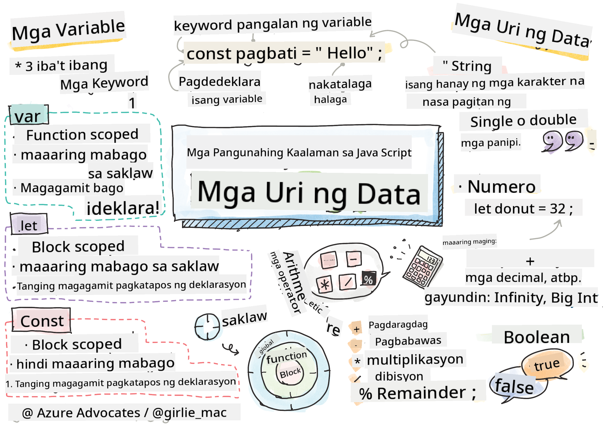

<!--
CO_OP_TRANSLATOR_METADATA:
{
  "original_hash": "b95fdd8310ef467305015ece1b0f9411",
  "translation_date": "2025-08-28T15:47:47+00:00",
  "source_file": "2-js-basics/1-data-types/README.md",
  "language_code": "tl"
}
-->
# Mga Pangunahing Kaalaman sa JavaScript: Mga Uri ng Datos


> Sketchnote ni [Tomomi Imura](https://twitter.com/girlie_mac)

## Pre-Lecture Quiz
[Pre-lecture quiz](https://ff-quizzes.netlify.app/web/)

Tatalakayin sa araling ito ang mga pangunahing kaalaman sa JavaScript, ang wika na nagbibigay ng interaktibidad sa web.

> Maaari mong kunin ang araling ito sa [Microsoft Learn](https://docs.microsoft.com/learn/modules/web-development-101-variables/?WT.mc_id=academic-77807-sagibbon)!

[](https://youtube.com/watch?v=JNIXfGiDWM8 "Mga Variable sa JavaScript")

[](https://youtube.com/watch?v=AWfA95eLdq8 "Mga Uri ng Datos sa JavaScript")

> 🎥 I-click ang mga larawan sa itaas para sa mga video tungkol sa mga variable at uri ng datos

Simulan natin sa mga variable at ang mga uri ng datos na nilalaman nito!

## Mga Variable

Ang mga variable ay nag-iimbak ng mga halaga na maaaring gamitin at baguhin sa iyong code.

Ang paggawa at **pagdedeklara** ng isang variable ay may sumusunod na syntax **[keyword] [pangalan]**. Binubuo ito ng dalawang bahagi:

- **Keyword**. Ang mga keyword ay maaaring `let` o `var`.  

✅ Ang keyword na `let` ay ipinakilala sa ES6 at nagbibigay sa iyong variable ng tinatawag na _block scope_. Inirerekomenda na gamitin ang `let` kaysa sa `var`. Tatalakayin natin ang block scopes nang mas malalim sa mga susunod na bahagi.
- **Pangalan ng variable**, ito ay pangalan na ikaw mismo ang pipili.

### Gawain - Paggamit ng mga Variable

1. **Magdeklara ng isang variable**. Magdeklara tayo ng isang variable gamit ang keyword na `let`:

    ```javascript
    let myVariable;
    ```

   Ang `myVariable` ay nadeklara na gamit ang keyword na `let`. Sa kasalukuyan, wala pa itong halaga.

1. **Mag-assign ng halaga**. Mag-imbak ng halaga sa isang variable gamit ang operator na `=`, kasunod ang inaasahang halaga.

    ```javascript
    myVariable = 123;
    ```

   > Tandaan: ang paggamit ng `=` sa araling ito ay nangangahulugan na ginagamit natin ang "assignment operator", na ginagamit upang magtakda ng halaga sa isang variable. Hindi ito nangangahulugang pagkakapantay-pantay.

   Ang `myVariable` ay na-*initialize* na ngayon gamit ang halagang 123.

1. **Refactor**. Palitan ang iyong code ng sumusunod na pahayag.

    ```javascript
    let myVariable = 123;
    ```

    Ang nasa itaas ay tinatawag na _explicit initialization_ kung saan ang isang variable ay nadeklara at nabigyan ng halaga nang sabay.

1. **Baguhin ang halaga ng variable**. Baguhin ang halaga ng variable sa sumusunod na paraan:

   ```javascript
   myVariable = 321;
   ```

   Kapag ang isang variable ay nadeklara na, maaari mong baguhin ang halaga nito anumang oras sa iyong code gamit ang operator na `=` at ang bagong halaga.

   ✅ Subukan ito! Maaari kang magsulat ng JavaScript direkta sa iyong browser. Buksan ang isang browser window at pumunta sa Developer Tools. Sa console, makikita mo ang isang prompt; i-type ang `let myVariable = 123`, pindutin ang return, pagkatapos ay i-type ang `myVariable`. Ano ang nangyari? Tandaan, matututunan mo pa ang mga konseptong ito sa mga susunod na aralin.

## Mga Constants

Ang deklarasyon at pag-initialize ng isang constant ay sumusunod sa parehong konsepto ng isang variable, maliban sa paggamit ng keyword na `const`. Ang mga constant ay karaniwang dineklara gamit ang lahat ng uppercase na letra.

```javascript
const MY_VARIABLE = 123;
```

Ang mga constant ay katulad ng mga variable, ngunit may dalawang pagkakaiba:

- **Dapat may halaga**. Ang mga constant ay kailangang ma-initialize, kung hindi ay magkakaroon ng error kapag pinatakbo ang code.
- **Hindi maaaring baguhin ang reference**. Ang reference ng isang constant ay hindi maaaring baguhin kapag na-initialize na, kung hindi ay magkakaroon ng error kapag pinatakbo ang code. Tingnan natin ang dalawang halimbawa:
   - **Simpleng halaga**. Ang sumusunod ay HINDI pinapayagan:
   
      ```javascript
      const PI = 3;
      PI = 4; // not allowed
      ```
 
   - **Protektado ang reference ng object**. Ang sumusunod ay HINDI pinapayagan.
   
      ```javascript
      const obj = { a: 3 };
      obj = { b: 5 } // not allowed
      ```

    - **Hindi protektado ang halaga ng object**. Ang sumusunod ay PINAPAYAGAN:
    
      ```javascript
      const obj = { a: 3 };
      obj.a = 5;  // allowed
      ```

      Sa itaas, binabago mo ang halaga ng object ngunit hindi ang reference mismo, kaya't ito ay pinapayagan.

   > Tandaan, ang `const` ay nangangahulugang protektado ang reference mula sa reassignment. Gayunpaman, ang halaga ay hindi _immutable_ at maaaring magbago, lalo na kung ito ay isang komplikadong istruktura tulad ng isang object.

## Mga Uri ng Datos

Ang mga variable ay maaaring mag-imbak ng iba't ibang uri ng mga halaga, tulad ng mga numero at teksto. Ang iba't ibang uri ng mga halagang ito ay kilala bilang **uri ng datos**. Ang mga uri ng datos ay mahalagang bahagi ng pagbuo ng software dahil nakakatulong ito sa mga developer na magdesisyon kung paano dapat isulat ang code at kung paano dapat tumakbo ang software. Bukod dito, ang ilang mga uri ng datos ay may natatanging mga katangian na tumutulong sa pagbabago o pagkuha ng karagdagang impormasyon mula sa isang halaga.

✅ Ang mga Uri ng Datos ay tinatawag ding mga JavaScript data primitives, dahil sila ang pinakamababang antas ng mga uri ng datos na ibinibigay ng wika. Mayroong 7 primitive na uri ng datos: string, number, bigint, boolean, undefined, null, at symbol. Maglaan ng isang minuto upang isipin kung ano ang maaaring kumatawan sa bawat isa sa mga primitives na ito. Ano ang `zebra`? Paano naman ang `0`? `true`?

### Mga Numero

Sa nakaraang seksyon, ang halaga ng `myVariable` ay isang uri ng datos na numero.

`let myVariable = 123;`

Ang mga variable ay maaaring mag-imbak ng lahat ng uri ng mga numero, kabilang ang mga decimal o negatibong numero. Ang mga numero ay maaari ring gamitin sa mga arithmetic operator, na tatalakayin sa [susunod na seksyon](../../../../2-js-basics/1-data-types).

### Mga Arithmetic Operator

Mayroong iba't ibang uri ng mga operator na maaaring gamitin sa pagsasagawa ng mga arithmetic function, at ilan sa mga ito ay nakalista dito:

| Simbolo | Deskripsyon                                                             | Halimbawa                         |
| ------- | ----------------------------------------------------------------------- | --------------------------------- |
| `+`     | **Addition**: Kinakalkula ang kabuuan ng dalawang numero                | `1 + 2 //inaasahang sagot ay 3`   |
| `-`     | **Subtraction**: Kinakalkula ang diperensya ng dalawang numero          | `1 - 2 //inaasahang sagot ay -1`  |
| `*`     | **Multiplication**: Kinakalkula ang produkto ng dalawang numero         | `1 * 2 //inaasahang sagot ay 2`   |
| `/`     | **Division**: Kinakalkula ang quotient ng dalawang numero               | `1 / 2 //inaasahang sagot ay 0.5` |
| `%`     | **Remainder**: Kinakalkula ang natira mula sa paghahati ng dalawang numero | `1 % 2 //inaasahang sagot ay 1`   |

✅ Subukan ito! Subukan ang isang arithmetic operation sa console ng iyong browser. Ikaw ba ay nagulat sa mga resulta?

### Mga String

Ang mga string ay mga set ng mga karakter na nakapaloob sa pagitan ng single o double quotes.

- `'Ito ay isang string'`
- `"Ito rin ay isang string"`
- `let myString = 'Ito ay isang string na halaga na nakaimbak sa isang variable';`

Tandaan na gumamit ng mga quotes kapag nagsusulat ng string, kung hindi ay iisipin ng JavaScript na ito ay pangalan ng variable.

### Pag-format ng Mga String

Ang mga string ay tekstuwal, at kakailanganin ng pag-format paminsan-minsan.

Upang **i-concatenate** o pagsamahin ang dalawa o higit pang mga string, gamitin ang operator na `+`.

```javascript
let myString1 = "Hello";
let myString2 = "World";

myString1 + myString2 + "!"; //HelloWorld!
myString1 + " " + myString2 + "!"; //Hello World!
myString1 + ", " + myString2 + "!"; //Hello, World!

```

✅ Bakit ang `1 + 1 = 2` sa JavaScript, ngunit `'1' + '1' = 11?` Pag-isipan ito. Paano naman ang `'1' + 1`?

Ang **template literals** ay isa pang paraan upang i-format ang mga string, maliban sa halip na quotes, ginagamit ang backtick. Anumang hindi plain text ay kailangang ilagay sa loob ng placeholders `${ }`. Kasama rito ang anumang variable na maaaring mga string.

```javascript
let myString1 = "Hello";
let myString2 = "World";

`${myString1} ${myString2}!` //Hello World!
`${myString1}, ${myString2}!` //Hello, World!
```

Maaari mong makamit ang iyong mga layunin sa pag-format gamit ang alinmang paraan, ngunit ang template literals ay igagalang ang anumang espasyo at line breaks.

✅ Kailan mo gagamitin ang template literal kumpara sa plain string?

### Mga Boolean

Ang mga Boolean ay maaari lamang magkaroon ng dalawang halaga: `true` o `false`. Ang mga Boolean ay nakakatulong sa paggawa ng mga desisyon kung aling mga linya ng code ang dapat tumakbo kapag natugunan ang ilang mga kondisyon. Sa maraming kaso, ang [mga operator](../../../../2-js-basics/1-data-types) ay tumutulong sa pagtatakda ng halaga ng isang Boolean at madalas mong mapapansin at maisusulat ang mga variable na na-initialize o ang kanilang mga halaga ay ina-update gamit ang isang operator.

- `let myTrueBool = true`
- `let myFalseBool = false`

✅ Ang isang variable ay maaaring ituring na 'truthy' kung ito ay nag-e-evaluate sa isang boolean `true`. Nakakatuwa, sa JavaScript, [lahat ng halaga ay truthy maliban kung tinukoy bilang falsy](https://developer.mozilla.org/docs/Glossary/Truthy).

---

## 🚀 Hamon

Ang JavaScript ay kilala sa mga nakakagulat nitong paraan ng paghawak sa mga uri ng datos paminsan-minsan. Mag-research tungkol sa mga 'gotchas' na ito. Halimbawa: ang case sensitivity ay maaaring magdulot ng problema! Subukan ito sa iyong console: `let age = 1; let Age = 2; age == Age` (nagri-resulta sa `false` -- bakit?). Ano pang ibang mga gotchas ang maaari mong mahanap?

## Post-Lecture Quiz
[Post-lecture quiz](https://ff-quizzes.netlify.app)

## Review at Pag-aaral sa Sarili

Tingnan ang [listahang ito ng mga JavaScript exercises](https://css-tricks.com/snippets/javascript/) at subukan ang isa. Ano ang natutunan mo?

## Takdang-Aralin

[Data Types Practice](assignment.md)

---

**Paunawa**:  
Ang dokumentong ito ay isinalin gamit ang AI translation service na [Co-op Translator](https://github.com/Azure/co-op-translator). Bagama't sinisikap naming maging tumpak, tandaan na ang mga awtomatikong pagsasalin ay maaaring maglaman ng mga pagkakamali o hindi pagkakatugma. Ang orihinal na dokumento sa kanyang katutubong wika ang dapat ituring na opisyal na pinagmulan. Para sa mahalagang impormasyon, inirerekomenda ang propesyonal na pagsasalin ng tao. Hindi kami mananagot sa anumang hindi pagkakaunawaan o maling interpretasyon na maaaring magmula sa paggamit ng pagsasaling ito.