<!--
CO_OP_TRANSLATOR_METADATA:
{
  "original_hash": "672b0bb6e8b431075f3bdb7130590d2d",
  "translation_date": "2025-11-03T13:44:02+00:00",
  "source_file": "2-js-basics/1-data-types/README.md",
  "language_code": "tl"
}
-->
# Mga Pangunahing Kaalaman sa JavaScript: Mga Uri ng Data


> Sketchnote ni [Tomomi Imura](https://twitter.com/girlie_mac)


Ang mga uri ng data ay isa sa mga pangunahing konsepto sa JavaScript na makikita mo sa bawat programang iyong isusulat. Isipin ang mga uri ng data na parang sistema ng pag-aayos na ginamit ng mga sinaunang librarian sa Alexandria – may partikular na lugar para sa mga scroll na naglalaman ng tula, matematika, at kasaysayan. Ang JavaScript ay nag-aayos ng impormasyon sa katulad na paraan gamit ang iba't ibang kategorya para sa iba't ibang uri ng data.

Sa araling ito, tatalakayin natin ang mga pangunahing uri ng data na nagpapagana sa JavaScript. Matututuhan mo kung paano hawakan ang mga numero, teksto, mga halaga ng true/false, at mauunawaan kung bakit mahalaga ang tamang pagpili ng uri para sa iyong mga programa. Maaaring mukhang abstrakto ang mga konseptong ito sa simula, ngunit sa pagsasanay, magiging natural na ito sa iyo.

Ang pag-unawa sa mga uri ng data ay magpapalinaw sa lahat ng iba pang aspeto ng JavaScript. Tulad ng mga arkitekto na kailangang maunawaan ang iba't ibang materyales sa pagtatayo bago magtayo ng katedral, ang mga pundasyong ito ang magiging suporta sa lahat ng iyong itatayo sa hinaharap.

## Pre-Lecture Quiz
[Pre-lecture quiz](https://ff-quizzes.netlify.app/web/)

Ang araling ito ay sumasaklaw sa mga pangunahing kaalaman ng JavaScript, ang wika na nagbibigay ng interaktibidad sa web.

> Maaari mong kunin ang araling ito sa [Microsoft Learn](https://docs.microsoft.com/learn/modules/web-development-101-variables/?WT.mc_id=academic-77807-sagibbon)!

[](https://youtube.com/watch?v=JNIXfGiDWM8 "Mga Variable sa JavaScript")

[](https://youtube.com/watch?v=AWfA95eLdq8 "Mga Uri ng Data sa JavaScript")

> 🎥 I-click ang mga larawan sa itaas para sa mga video tungkol sa mga variable at uri ng data

Simulan natin sa mga variable at ang mga uri ng data na bumubuo sa mga ito!


## Mga Variable

Ang mga variable ay pangunahing bahagi ng programming. Tulad ng mga garapon na may label na ginamit ng mga alkemistang medieval para mag-imbak ng iba't ibang sangkap, ang mga variable ay nagbibigay-daan sa iyo na mag-imbak ng impormasyon at bigyan ito ng deskriptibong pangalan para magamit mo ito sa hinaharap. Kailangang tandaan ang edad ng isang tao? I-imbak ito sa isang variable na tinatawag na `age`. Gusto mong subaybayan ang pangalan ng isang user? Itago ito sa isang variable na tinatawag na `userName`.

Tututukan natin ang modernong paraan ng paggawa ng mga variable sa JavaScript. Ang mga teknik na matututunan mo dito ay kumakatawan sa mga taon ng ebolusyon ng wika at pinakamahusay na kasanayan na binuo ng komunidad ng programming.

Ang paggawa at **pagdeklara** ng isang variable ay may sumusunod na syntax **[keyword] [name]**. Binubuo ito ng dalawang bahagi:

- **Keyword**. Gamitin ang `let` para sa mga variable na maaaring magbago, o `const` para sa mga halaga na mananatiling pareho.
- **Pangalan ng variable**, ito ay isang deskriptibong pangalan na ikaw mismo ang pipili.

✅ Ang keyword na `let` ay ipinakilala sa ES6 at nagbibigay sa iyong variable ng tinatawag na _block scope_. Inirerekomenda na gamitin mo ang `let` o `const` sa halip na ang mas lumang keyword na `var`. Tatalakayin natin ang block scopes nang mas malalim sa mga susunod na bahagi.

### Gawain - Paggamit ng mga Variable

1. **Magdeklara ng isang variable**. Magsimula tayo sa paggawa ng ating unang variable:

    ```javascript
    let myVariable;
    ```

   **Ano ang nagagawa nito:**
   - Sinasabi nito sa JavaScript na gumawa ng isang storage location na tinatawag na `myVariable`
   - Naglalaan ang JavaScript ng espasyo sa memorya para sa variable na ito
   - Ang variable ay kasalukuyang walang halaga (undefined)

2. **Bigyan ito ng halaga**. Ngayon, maglagay tayo ng isang bagay sa ating variable:

    ```javascript
    myVariable = 123;
    ```

   **Paano gumagana ang assignment:**
   - Ang operator na `=` ay nag-a-assign ng halaga na 123 sa ating variable
   - Ang variable ay naglalaman na ngayon ng halagang ito sa halip na undefined
   - Maaari mong i-refer ang halagang ito sa buong code gamit ang `myVariable`

   > Tandaan: ang paggamit ng `=` sa araling ito ay nangangahulugan na ginagamit natin ang "assignment operator", na ginagamit upang mag-set ng halaga sa isang variable. Hindi ito nangangahulugang pagkakapantay-pantay.

3. **Gawin ito sa mas matalinong paraan**. Sa totoo lang, pagsamahin natin ang dalawang hakbang na iyon:

    ```javascript
    let myVariable = 123;
    ```

    **Mas epektibo ang pamamaraang ito:**
    - Nagdeklara ka ng variable at nag-a-assign ng halaga sa isang statement
    - Ito ang karaniwang kasanayan sa mga developer
    - Binabawasan nito ang haba ng code habang pinapanatili ang kalinawan

4. **Baguhin ang iyong isip**. Paano kung gusto nating mag-imbak ng ibang numero?

   ```javascript
   myVariable = 321;
   ```

   **Pag-unawa sa reassignment:**
   - Ang variable ay naglalaman na ngayon ng 321 sa halip na 123
   - Ang dating halaga ay napalitan – ang mga variable ay nag-iimbak lamang ng isang halaga sa isang pagkakataon
   - Ang mutability na ito ang pangunahing katangian ng mga variable na idineklara gamit ang `let`

   ✅ Subukan ito! Maaari kang magsulat ng JavaScript mismo sa iyong browser. Buksan ang isang browser window at pumunta sa Developer Tools. Sa console, makikita mo ang isang prompt; i-type ang `let myVariable = 123`, pindutin ang return, pagkatapos ay i-type ang `myVariable`. Ano ang nangyayari? Tandaan, matututunan mo ang higit pa tungkol sa mga konseptong ito sa mga susunod na aralin.

### 🧠 **Pag-master ng Mga Variable: Pagiging Komportable**

**Tingnan natin kung gaano ka komportable sa mga variable:**
- Kaya mo bang ipaliwanag ang pagkakaiba ng pagdeklara at pag-a-assign ng variable?
- Ano ang mangyayari kung susubukan mong gamitin ang isang variable bago mo ito ideklara?
- Kailan mo pipiliin ang `let` sa halip na `const` para sa isang variable?


> **Mabilis na tip**: Isipin ang mga variable bilang mga kahon na may label. Gumawa ka ng kahon (`let`), maglagay ng isang bagay dito (`=`), at maaari mong palitan ang laman nito kung kinakailangan!

## Constants

Minsan kailangan mong mag-imbak ng impormasyon na hindi dapat magbago habang tumatakbo ang programa. Isipin ang constants na parang mga prinsipyo ng matematika na itinatag ni Euclid sa sinaunang Greece – kapag napatunayan at naitala, nananatili itong hindi nagbabago para sa lahat ng susunod na sanggunian.

Ang constants ay gumagana nang katulad sa mga variable, ngunit may mahalagang limitasyon: kapag na-assign mo na ang kanilang halaga, hindi na ito maaaring baguhin. Ang immutability na ito ay nakakatulong na maiwasan ang hindi sinasadyang pagbabago sa mga mahahalagang halaga sa iyong programa.

Ang deklarasyon at inisyal na pag-assign ng isang constant ay sumusunod sa parehong konsepto ng isang variable, maliban sa paggamit ng keyword na `const`. Ang constants ay karaniwang idinedeklara gamit ang lahat ng uppercase na letra.

```javascript
const MY_VARIABLE = 123;
```

**Ano ang ginagawa ng code na ito:**
- **Gumagawa** ng constant na pinangalanang `MY_VARIABLE` na may halagang 123
- **Gumagamit** ng uppercase naming convention para sa constants
- **Pinipigilan** ang anumang pagbabago sa halagang ito sa hinaharap

Ang constants ay may dalawang pangunahing tuntunin:

- **Dapat mong bigyan agad ng halaga** – walang puwedeng walang laman na constants!
- **Hindi mo maaaring baguhin ang halagang iyon** – maglalabas ng error ang JavaScript kung susubukan mo. Tingnan natin ang ibig sabihin nito:

   **Simpleng halaga** - Ang sumusunod ay HINDI pinapayagan:
   
      ```javascript
      const PI = 3;
      PI = 4; // hindi pinapayagan
      ```

   **Ano ang dapat tandaan:**
   - **Mga pagtatangka** na i-reassign ang isang constant ay magdudulot ng error
   - **Pinoprotektahan** ang mahahalagang halaga mula sa hindi sinasadyang pagbabago
   - **Tinitiyak** na ang halaga ay nananatiling pare-pareho sa buong programa
 
   **Protektado ang reference ng object** - Ang sumusunod ay HINDI pinapayagan:
   
      ```javascript
      const obj = { a: 3 };
      obj = { b: 5 } // hindi pinapayagan
      ```

   **Pag-unawa sa mga konseptong ito:**
   - **Pinipigilan** ang pagpapalit ng buong object ng bago
   - **Pinoprotektahan** ang reference sa orihinal na object
   - **Pinapanatili** ang pagkakakilanlan ng object sa memorya

    **Hindi protektado ang halaga ng object** - Ang sumusunod ay PINAPAYAGAN:
    
      ```javascript
      const obj = { a: 3 };
      obj.a = 5;  // pinapayagan
      ```

      **Pag-unawa sa nangyayari dito:**
      - **Binabago** ang halaga ng property sa loob ng object
      - **Pinapanatili** ang parehong reference ng object
      - **Ipinapakita** na ang mga nilalaman ng object ay maaaring magbago habang nananatiling pareho ang reference

   > Tandaan, ang `const` ay nangangahulugang protektado ang reference mula sa reassignment. Ang halaga ay hindi _immutable_ at maaaring magbago, lalo na kung ito ay isang komplikadong construct tulad ng isang object.

## Mga Uri ng Data

Ang JavaScript ay nag-aayos ng impormasyon sa iba't ibang kategorya na tinatawag na mga uri ng data. Ang konseptong ito ay kahalintulad sa kung paano ikinategorya ng mga sinaunang iskolar ang kaalaman – inihiwalay ni Aristotle ang iba't ibang uri ng pangangatwiran, alam na ang mga prinsipyo ng lohika ay hindi maaaring pantay na ilapat sa tula, matematika, at natural na pilosopiya.

Mahalaga ang mga uri ng data dahil ang iba't ibang operasyon ay gumagana sa iba't ibang uri ng impormasyon. Tulad ng hindi mo maaaring gawin ang aritmetika sa pangalan ng isang tao o i-alpabeto ang isang equation sa matematika, ang JavaScript ay nangangailangan ng tamang uri ng data para sa bawat operasyon. Ang pag-unawa dito ay nakakaiwas sa mga error at nagpapaganda ng pagiging maaasahan ng iyong code.

Ang mga variable ay maaaring mag-imbak ng iba't ibang uri ng halaga, tulad ng mga numero at teksto. Ang iba't ibang uri ng mga halagang ito ay kilala bilang **uri ng data**. Ang mga uri ng data ay mahalagang bahagi ng pagbuo ng software dahil nakakatulong ito sa mga developer na magdesisyon kung paano dapat isulat ang code at kung paano dapat tumakbo ang software. Bukod pa rito, ang ilang uri ng data ay may natatanging mga tampok na tumutulong sa pagbabago o pagkuha ng karagdagang impormasyon sa isang halaga.

✅ Ang mga Uri ng Data ay tinatawag ding mga JavaScript data primitives, dahil sila ang pinakamababang antas ng mga uri ng data na ibinibigay ng wika. Mayroong 7 primitive na uri ng data: string, number, bigint, boolean, undefined, null, at symbol. Maglaan ng sandali upang maisip kung ano ang maaaring kumatawan sa bawat isa sa mga primitives na ito. Ano ang `zebra`? Paano naman ang `0`? `true`?

### Mga Numero

Ang mga numero ang pinakasimple sa mga uri ng data sa JavaScript. Kung nagtatrabaho ka man sa mga buong numero tulad ng 42, mga decimal tulad ng 3.14, o mga negatibong numero tulad ng -5, pare-pareho ang paghawak ng JavaScript sa mga ito.

Tandaan ang ating variable mula kanina? Ang 123 na ating iniimbak ay talagang isang uri ng data na numero:

```javascript
let myVariable = 123;
```

**Mga Pangunahing Katangian:**
- Awtomatikong kinikilala ng JavaScript ang mga numerong halaga
- Maaari kang magsagawa ng mga operasyong matematika gamit ang mga variable na ito
- Walang kinakailangang tahasang deklarasyon ng uri

Ang mga variable ay maaaring mag-imbak ng lahat ng uri ng mga numero, kabilang ang mga decimal o negatibong numero. Ang mga numero ay maaari ring gamitin sa mga arithmetic operator, na tatalakayin sa [susunod na seksyon](../../../../2-js-basics/1-data-types).

```mermaid
flowchart LR
    A["🔢 Numbers"] --> B["➕ Addition"]
    A --> C["➖ Subtraction"]
    A --> D["✖️ Multiplication"]
    A --> E["➗ Division"]
    A --> F["📊 Remainder %"]
    
    B --> B1["1 + 2 = 3"]
    C --> C1["5 - 3 = 2"]
    D --> D1["4 * 3 = 12"]
    E --> E1["10 / 2 = 5"]
    F --> F1["7 % 3 = 1"]
    
    style A fill:#e3f2fd
    style B fill:#e8f5e8
    style C fill:#fff3e0
    style D fill:#f3e5f5
    style E fill:#e0f2f1
    style F fill:#fce4ec
```



### Mga Arithmetic Operator

Ang mga arithmetic operator ay nagbibigay-daan sa iyo na magsagawa ng mga kalkulasyong matematika sa JavaScript. Ang mga operator na ito ay sumusunod sa parehong mga prinsipyo na ginamit ng mga mathematician sa loob ng maraming siglo – ang parehong mga simbolo na lumitaw sa mga gawa ng mga iskolar tulad ni Al-Khwarizmi, na bumuo ng algebraic notation.

Ang mga operator ay gumagana tulad ng inaasahan mula sa tradisyunal na matematika: plus para sa addition, minus para sa subtraction, at iba pa.

Mayroong ilang mga uri ng operator na magagamit kapag nagsasagawa ng mga arithmetic function, at ilan ay nakalista dito:

| Simbolo | Paglalarawan                                                              | Halimbawa                          |
| ------ | ------------------------------------------------------------------------ | -------------------------------- |
| `+`    | **Addition**: Kinakalkula ang kabuuan ng dalawang numero                 | `1 + 2 //expected answer is 3`   |
| `-`    | **Subtraction**: Kinakalkula ang pagkakaiba ng dalawang numero           | `1 - 2 //expected answer is -1`  |
| `*`    | **Multiplication**: Kinakalkula ang produkto ng dalawang numero          | `1 * 2 //expected answer is 2`   |
| `/`    | **Division**: Kinakalkula ang quotient ng dalawang numero                | `1 / 2 //expected answer is 0.5` |
| `%`    | **Remainder**: Kinakalkula ang natira mula sa division ng dalawang numero | `1 % 2 //expected answer is 1`   |

✅ Subukan ito! Subukan ang isang arithmetic operation sa console ng iyong browser. Nagulat ka ba sa mga resulta?

### 🧮 **Pag-check ng Kakayahan sa Math: Pagkalkula nang May Kumpiyansa**

**Subukan ang iyong pag-unawa sa arithmetic:**
- Ano ang pagkakaiba ng `/` (division) at `%` (remainder)?
- Kaya mo bang hulaan kung ano ang `10 % 3`? (Hint: hindi ito 3.33...)
- Bakit maaaring maging kapaki-pakinabang ang remainder operator sa programming?


> **Insight sa Totoong Mundo**: Ang remainder operator (%) ay sobrang kapaki-pakinabang para sa pag-check kung ang mga numero ay even/odd, paggawa ng mga pattern, o pag-ikot sa mga array!

### Mga Strings

Sa JavaScript, ang tekstuwal na data ay kinakatawan bilang mga string. Ang terminong "string" ay nagmula sa konsepto ng mga character na magkakasunod na pinagsama-sama, tulad ng paraan ng mga tagasulat sa mga monasteryo noong medieval na nag-uugnay ng mga letra upang bumuo ng mga salita at pangungusap sa kanilang mga manuskrito.

Ang mga string ay mahalaga sa web development. Ang bawat piraso ng teksto na ipinapakita sa isang website – mga username, label ng button, mga mensahe ng error, nilalaman – ay hinahawakan bilang string data. Ang pag-unawa sa mga string ay mahalaga para sa paggawa ng mga functional na user interface.

Ang mga string ay mga set ng mga character na nakapaloob sa pagitan ng single o double quotes.

```javascript
'This is a string'
"This is also a string"
let myString = 'This is a string value stored in a variable';
```

**Pag-unawa sa mga konseptong ito:**
- **Gumagamit** ng single quotes `'` o double quotes `"` upang tukuyin ang mga string
- **Nag-iimbak** ng tekstuwal na data na maaaring maglaman ng mga letra, numero, at simbolo
- **Nag-a-assign** ng mga halaga ng string sa mga variable para magamit sa hinaharap
- **Nangangailangan** ng mga quotes upang maiba ang teksto mula sa mga pangalan ng variable

Tandaan na gumamit ng mga quotes kapag nagsusulat ng string, kung hindi, iisipin ng JavaScript na ito ay pangalan ng variable.

```mermaid
flowchart TD
    A["📝 Strings"] --> B["Single Quotes"]
    A --> C["Double Quotes"]
    A --> D["Template Literals"]
    
    B --> B1["'Hello World'"]
    C --> C1["\"Hello World\""]
    D --> D1["`Hello \${name}`"]
    
    E["String Operations"] --> F["Concatenation"]
    E --> G["Template Insertion"]
    E --> H["Length & Methods"]
    
    F --> F1["'Hello' + ' ' + 'World'"]
    G --> G1["`Hello \${firstName} \${lastName}`"]
    H --> H1["myString.length"]
    
    style A fill:#e3f2fd
    style E fill:#fff3e0
    style D fill:#e8f5e8
    style G fill:#e8f5e8
```



### Pag-format ng Mga String

Ang manipulasyon ng string ay nagbibigay-daan sa iyo na pagsamahin ang mga elemento ng teksto, isama ang mga variable, at lumikha ng dynamic na nilalaman na tumutugon sa estado ng programa. Ang teknik na ito ay nagbibigay-daan sa iyo na bumuo ng teksto nang programmatically.

Kadalasan kailangan mong pagsamahin ang maraming string – ang prosesong ito ay tinatawag na concatenation.
Upang **pagsamahin** ang dalawa o higit pang mga string, o pagsamahin ang mga ito, gamitin ang `+` operator.

```javascript
let myString1 = "Hello";
let myString2 = "World";

myString1 + myString2 + "!"; //HelloWorld!
myString1 + " " + myString2 + "!"; //Hello World!
myString1 + ", " + myString2 + "!"; //Hello, World!
```

**Hakbang-hakbang, narito ang nangyayari:**
- **Pinagsasama** ang maraming string gamit ang `+` operator
- **Pinagsasama** ang mga string nang direkta nang walang espasyo sa unang halimbawa
- **Nagdaragdag** ng mga espasyo `" "` sa pagitan ng mga string para sa mas malinaw na pagbabasa
- **Naglalagay** ng mga bantas tulad ng mga kuwit upang makabuo ng tamang format

✅ Bakit `1 + 1 = 2` sa JavaScript, pero `'1' + '1' = 11?` Pag-isipan ito. Paano naman ang `'1' + 1`?

**Template literals** ay isa pang paraan upang mag-format ng mga string, maliban sa halip na mga quotes, ginagamit ang backtick. Anumang hindi plain text ay kailangang ilagay sa loob ng placeholders `${ }`. Kasama dito ang anumang mga variable na maaaring mga string.

```javascript
let myString1 = "Hello";
let myString2 = "World";

`${myString1} ${myString2}!` //Hello World!
`${myString1}, ${myString2}!` //Hello, World!
```

**Unawain natin ang bawat bahagi:**
- **Gumagamit** ng backticks `` ` `` sa halip na regular na quotes upang lumikha ng template literals
- **Naglalagay** ng mga variable nang direkta gamit ang syntax ng placeholder `${}`
- **Pinapanatili** ang mga espasyo at format nang eksakto kung paano ito isinulat
- **Nagbibigay** ng mas malinis na paraan upang lumikha ng mas kumplikadong mga string na may mga variable

Maaari mong makamit ang iyong mga layunin sa pag-format gamit ang alinmang paraan, ngunit ang template literals ay igagalang ang anumang mga espasyo at line breaks.

✅ Kailan mo gagamitin ang template literal kumpara sa plain string?

### 🔤 **Pag-master ng String: Kumpiyansa sa Manipulasyon ng Teksto**

**Suriin ang iyong kakayahan sa string:**
- Kaya mo bang ipaliwanag kung bakit `'1' + '1'` ay nagiging `'11'` sa halip na `2`?
- Alin sa mga string method ang mas nababasa para sa iyo: concatenation o template literals?
- Ano ang mangyayari kung nakalimutan mo ang mga quotes sa paligid ng isang string?


> **Pro tip**: Ang template literals ay karaniwang mas pinipili para sa mas kumplikadong pagbuo ng string dahil mas nababasa ito at mahusay sa paghawak ng multi-line strings!

### Booleans

Ang Booleans ay kumakatawan sa pinakasimpleng anyo ng data: maaari lamang itong maglaman ng isa sa dalawang halaga – `true` o `false`. Ang binary logic system na ito ay nagmula sa trabaho ni George Boole, isang mathematician noong ika-19 na siglo na nag-develop ng Boolean algebra.

Sa kabila ng kanilang pagiging simple, mahalaga ang booleans para sa program logic. Pinapayagan nila ang iyong code na gumawa ng desisyon batay sa mga kondisyon – kung naka-log in ang isang user, kung na-click ang isang button, o kung natugunan ang ilang pamantayan.

Ang Booleans ay maaari lamang magkaroon ng dalawang halaga: `true` o `false`. Ang Booleans ay makakatulong sa paggawa ng desisyon kung aling mga linya ng code ang dapat tumakbo kapag natugunan ang ilang mga kondisyon. Sa maraming kaso, ang [operators](../../../../2-js-basics/1-data-types) ay tumutulong sa pagtatakda ng halaga ng Boolean at madalas mong mapapansin at isusulat ang mga variable na ini-initialize o ang kanilang mga halaga ay ina-update gamit ang operator.

```javascript
let myTrueBool = true;
let myFalseBool = false;
```

**Sa itaas, ginawa natin ang sumusunod:**
- **Lumikha** ng variable na nag-iimbak ng Boolean value na `true`
- **Ipinakita** kung paano mag-imbak ng Boolean value na `false`
- **Gumamit** ng eksaktong mga keyword na `true` at `false` (walang quotes na kailangan)
- **Ipinaghanda** ang mga variable na ito para sa paggamit sa mga conditional statements

✅ Ang isang variable ay maaaring ituring na 'truthy' kung ito ay nag-e-evaluate sa boolean na `true`. Nakakatuwa, sa JavaScript, [lahat ng mga halaga ay truthy maliban kung tinukoy bilang falsy](https://developer.mozilla.org/docs/Glossary/Truthy).

```mermaid
flowchart LR
    A["🔘 Boolean Values"] --> B["true"]
    A --> C["false"]
    
    D["Truthy Values"] --> D1["'hello'"]
    D --> D2["42"]
    D --> D3["[]"]
    D --> D4["{}"]
    
    E["Falsy Values"] --> E1["false"]
    E --> E2["0"]
    E --> E3["''"]
    E --> E4["null"]
    E --> E5["undefined"]
    E --> E6["NaN"]
    
    style B fill:#e8f5e8
    style C fill:#ffebee
    style D fill:#e3f2fd
    style E fill:#fff3e0
```



### 🎯 **Suriin ang Boolean Logic: Kakayahan sa Paggawa ng Desisyon**

**Subukan ang iyong pag-unawa sa boolean:**
- Bakit sa tingin mo may "truthy" at "falsy" values ang JavaScript bukod sa `true` at `false`?
- Kaya mo bang hulaan kung alin sa mga ito ang falsy: `0`, `"0"`, `[]`, `"false"`?
- Paano maaaring maging kapaki-pakinabang ang booleans sa pagkontrol ng daloy ng programa?


> **Tandaan**: Sa JavaScript, anim na halaga lamang ang falsy: `false`, `0`, `""`, `null`, `undefined`, at `NaN`. Ang lahat ng iba pa ay truthy!

---

## 📊 **Buod ng Iyong Toolkit sa Data Types**

```mermaid
graph TD
    A["🎯 JavaScript Data Types"] --> B["📦 Variables"]
    A --> C["🔢 Numbers"]
    A --> D["📝 Strings"]
    A --> E["🔘 Booleans"]
    
    B --> B1["let mutable"]
    B --> B2["const immutable"]
    
    C --> C1["42, 3.14, -5"]
    C --> C2["+ - * / %"]
    
    D --> D1["'quotes' or \\\"quotes\\\""]
    D --> D2["`template literals`"]
    
    E --> E1["true or false"]
    E --> E2["truthy vs falsy"]
    
    F["⚡ Key Concepts"] --> F1["Type matters for operations"]
    F --> F2["JavaScript is dynamically typed"]
    F --> F3["Variables can change types"]
    F --> F4["Naming is case-sensitive"]
    
    style A fill:#e3f2fd
    style B fill:#e8f5e8
    style C fill:#fff3e0
    style D fill:#f3e5f5
    style E fill:#e0f2f1
    style F fill:#fce4ec
```



## Hamon ng GitHub Copilot Agent 🚀

Gamitin ang Agent mode upang kumpletuhin ang sumusunod na hamon:

**Deskripsyon:** Gumawa ng personal information manager na nagpapakita ng lahat ng JavaScript data types na natutunan mo sa araling ito habang hinahawakan ang mga real-world data scenarios.

**Prompt:** Gumawa ng JavaScript program na lumilikha ng user profile object na naglalaman ng: pangalan ng tao (string), edad (number), status bilang estudyante (boolean), mga paboritong kulay bilang array, at isang address object na may street, city, at zip code properties. Isama ang mga function upang ipakita ang impormasyon ng profile at i-update ang mga indibidwal na field. Siguraduhing ipakita ang string concatenation, template literals, arithmetic operations gamit ang edad, at boolean logic para sa status bilang estudyante.

Alamin pa ang tungkol sa [agent mode](https://code.visualstudio.com/blogs/2025/02/24/introducing-copilot-agent-mode) dito.

## 🚀 Hamon

May ilang mga behavior ang JavaScript na maaaring magulat ang mga developer. Narito ang isang klasikong halimbawa upang tuklasin: subukang i-type ito sa iyong browser console: `let age = 1; let Age = 2; age == Age` at obserbahan ang resulta. Ito ay nagbabalik ng `false` – kaya mo bang tukuyin kung bakit?

Ito ay kumakatawan sa isa sa maraming mga behavior ng JavaScript na mahalagang maunawaan. Ang pagiging pamilyar sa mga kakaibang ito ay makakatulong sa iyo na magsulat ng mas maaasahang code at mas epektibong mag-debug ng mga isyu.

## Post-Lecture Quiz
[Post-lecture quiz](https://ff-quizzes.netlify.app)

## Review & Self Study

Tingnan ang [listahan ng mga JavaScript exercises](https://css-tricks.com/snippets/javascript/) at subukan ang isa. Ano ang natutunan mo?

## Assignment

[Data Types Practice](assignment.md)

## 🚀 Timeline ng Iyong Mastery sa JavaScript Data Types

### ⚡ **Ano ang Magagawa Mo sa Loob ng Susunod na 5 Minuto**
- [ ] Buksan ang iyong browser console at gumawa ng 3 variables na may iba't ibang data types
- [ ] Subukan ang hamon: `let age = 1; let Age = 2; age == Age` at alamin kung bakit ito false
- [ ] Magpraktis ng string concatenation gamit ang iyong pangalan at paboritong numero
- [ ] Subukan kung ano ang mangyayari kapag nagdagdag ka ng numero sa isang string

### 🎯 **Ano ang Maaaring Makamit Mo sa Loob ng Isang Oras**
- [ ] Kumpletuhin ang post-lesson quiz at suriin ang anumang nakakalitong konsepto
- [ ] Gumawa ng mini calculator na nagdadagdag, nagbabawas, nagmumultiply, at naghahati ng dalawang numero
- [ ] Bumuo ng simpleng name formatter gamit ang template literals
- [ ] Tuklasin ang mga pagkakaiba sa pagitan ng `==` at `===` comparison operators
- [ ] Magpraktis ng pag-convert sa pagitan ng iba't ibang data types

### 📅 **Ang Iyong Foundation sa JavaScript sa Loob ng Isang Linggo**
- [ ] Kumpletuhin ang assignment nang may kumpiyansa at pagkamalikhain
- [ ] Gumawa ng personal profile object gamit ang lahat ng data types na natutunan
- [ ] Magpraktis gamit ang [JavaScript exercises mula sa CSS-Tricks](https://css-tricks.com/snippets/javascript/)
- [ ] Bumuo ng simpleng form validator gamit ang boolean logic
- [ ] Mag-eksperimento sa array at object data types (preview ng mga susunod na aralin)
- [ ] Sumali sa JavaScript community at magtanong tungkol sa data types

### 🌟 **Ang Iyong Transformation sa Loob ng Isang Buwan**
- [ ] Isama ang kaalaman sa data type sa mas malalaking programming projects
- [ ] Unawain kung kailan at bakit gagamitin ang bawat data type sa mga tunay na aplikasyon
- [ ] Tulungan ang ibang mga baguhan na maunawaan ang mga pundasyon ng JavaScript
- [ ] Bumuo ng maliit na application na nagma-manage ng iba't ibang uri ng user data
- [ ] Tuklasin ang mga advanced na konsepto ng data type tulad ng type coercion at strict equality
- [ ] Mag-ambag sa mga open source JavaScript projects sa pamamagitan ng pagpapabuti ng dokumentasyon

### 🧠 **Huling Suriin ang Iyong Mastery sa Data Types**

**I-celebrate ang iyong pundasyon sa JavaScript:**
- Aling data type ang pinaka-nakagulat sa iyo sa mga tuntunin ng behavior nito?
- Gaano ka komportable sa pagpapaliwanag ng variables vs. constants sa isang kaibigan?
- Ano ang pinaka-kawili-wiling bagay na natuklasan mo tungkol sa type system ng JavaScript?
- Aling tunay na aplikasyon ang naiisip mong gawin gamit ang mga pundasyong ito?


> 💡 **Naabot mo na ang pundasyon!** Ang pag-unawa sa data types ay parang pag-aaral ng alpabeto bago magsulat ng mga kwento. Ang bawat JavaScript program na isusulat mo ay gagamit ng mga pundasyong konsepto na ito. Ngayon ay mayroon ka nang mga building blocks upang lumikha ng mga interactive na website, dynamic na aplikasyon, at lutasin ang mga tunay na problema gamit ang code. Maligayang pagdating sa kamangha-manghang mundo ng JavaScript! 🎉

---

**Paunawa**:  
Ang dokumentong ito ay isinalin gamit ang AI translation service na [Co-op Translator](https://github.com/Azure/co-op-translator). Bagama't sinisikap naming maging tumpak, mangyaring tandaan na ang mga awtomatikong pagsasalin ay maaaring maglaman ng mga pagkakamali o hindi pagkakatugma. Ang orihinal na dokumento sa kanyang katutubong wika ang dapat ituring na mapagkakatiwalaang pinagmulan. Para sa mahalagang impormasyon, inirerekomenda ang propesyonal na pagsasalin ng tao. Hindi kami mananagot sa anumang hindi pagkakaunawaan o maling interpretasyon na dulot ng paggamit ng pagsasaling ito.