<!--
CO_OP_TRANSLATOR_METADATA:
{
  "original_hash": "71f7d7dafa1c7194d79ddac87f669ff9",
  "translation_date": "2025-11-03T13:44:52+00:00",
  "source_file": "2-js-basics/2-functions-methods/README.md",
  "language_code": "tl"
}
-->
# Mga Pangunahing Kaalaman sa JavaScript: Mga Pamamaraan at Function


> Sketchnote ni [Tomomi Imura](https://twitter.com/girlie_mac)


## Pre-Lecture Quiz
[Pre-lecture quiz](https://ff-quizzes.netlify.app)

Ang paulit-ulit na pagsusulat ng parehong code ay isa sa mga pinakakaraniwang pagkabigo sa programming. Ang mga function ay nag-aayos ng problemang ito sa pamamagitan ng pagpapahintulot sa iyo na i-package ang code sa mga reusable na bloke. Isipin ang mga function na parang mga standardized na bahagi na nagpa-rebolusyon sa assembly line ni Henry Ford – kapag nakagawa ka ng maaasahang bahagi, magagamit mo ito kahit saan nang hindi kailangang magsimula muli.

Ang mga function ay nagbibigay-daan sa iyo na mag-bundle ng mga piraso ng code upang magamit mo ang mga ito sa buong programa. Sa halip na kopyahin at i-paste ang parehong lohika sa lahat ng dako, maaari kang lumikha ng isang function nang isang beses at tawagin ito tuwing kinakailangan. Ang ganitong paraan ay nagpapanatili ng organisado ang iyong code at ginagawang mas madali ang mga update.

Sa araling ito, matututunan mo kung paano lumikha ng sarili mong mga function, magpasa ng impormasyon sa mga ito, at makakuha ng kapaki-pakinabang na resulta. Malalaman mo ang pagkakaiba ng mga function at mga pamamaraan, matutunan ang mga modernong syntax na diskarte, at makikita kung paano gumagana ang mga function kasama ang iba pang mga function. Bubuuin natin ang mga konseptong ito nang paunti-unti.

[](https://youtube.com/watch?v=XgKsD6Zwvlc "Mga Pamamaraan at Function")

> 🎥 I-click ang imahe sa itaas para sa isang video tungkol sa mga pamamaraan at function.

> Maaari mong kunin ang araling ito sa [Microsoft Learn](https://docs.microsoft.com/learn/modules/web-development-101-functions/?WT.mc_id=academic-77807-sagibbon)!


## Mga Function

Ang isang function ay isang self-contained na bloke ng code na gumaganap ng isang partikular na gawain. Pinagsasama nito ang lohika na maaari mong isagawa tuwing kinakailangan.

Sa halip na isulat ang parehong code nang maraming beses sa buong programa, maaari mo itong i-package sa isang function at tawagin ang function na iyon tuwing kailangan mo ito. Ang ganitong paraan ay nagpapanatili ng malinis ang iyong code at ginagawang mas madali ang mga update. Isipin ang hamon sa pagpapanatili kung kailangan mong baguhin ang lohika na nakakalat sa 20 iba't ibang lokasyon sa iyong codebase.

Napakahalaga ng pagbibigay ng mga deskriptibong pangalan sa iyong mga function. Ang isang maayos na pinangalanang function ay malinaw na nagpapahayag ng layunin nito – kapag nakita mo ang `cancelTimer()`, agad mong maiintindihan kung ano ang ginagawa nito, tulad ng isang malinaw na nakalabel na button na nagsasabi sa iyo kung ano ang mangyayari kapag na-click mo ito.

## Paglikha at pagtawag sa isang function

Tingnan natin kung paano lumikha ng isang function. Ang syntax ay sumusunod sa isang pare-parehong pattern:

```javascript
function nameOfFunction() { // function definition
 // function definition/body
}
```

Himayin natin ito:
- Ang keyword na `function` ay nagsasabi sa JavaScript na "Hoy, gumagawa ako ng isang function!"
- Ang `nameOfFunction` ay kung saan mo bibigyan ng deskriptibong pangalan ang iyong function
- Ang mga panaklong `()` ay kung saan maaari kang magdagdag ng mga parameter (pag-uusapan natin ito mamaya)
- Ang mga kulot na braces `{}` ay naglalaman ng aktwal na code na tumatakbo kapag tinawag mo ang function

Gumawa tayo ng simpleng greeting function upang makita ito sa aksyon:

```javascript
function displayGreeting() {
  console.log('Hello, world!');
}
```

Ang function na ito ay nagpi-print ng "Hello, world!" sa console. Kapag na-define mo na ito, magagamit mo ito nang maraming beses kung kinakailangan.

Upang maisagawa (o "tawagin") ang iyong function, isulat ang pangalan nito na sinusundan ng mga panaklong. Pinapayagan ka ng JavaScript na i-define ang iyong function bago o pagkatapos mo itong tawagin – ang JavaScript engine ang bahala sa pagkakasunod-sunod ng pagpapatupad.

```javascript
// calling our function
displayGreeting();
```

Kapag pinatakbo mo ang linyang ito, isinasagawa nito ang lahat ng code sa loob ng iyong `displayGreeting` function, na nagpapakita ng "Hello, world!" sa console ng iyong browser. Maaari mong tawagin ang function na ito nang paulit-ulit.

### 🧠 **Pag-unawa sa Mga Pangunahing Kaalaman sa Function: Pagbuo ng Iyong Unang Mga Function**

**Tingnan natin kung paano mo naiintindihan ang mga pangunahing function:**
- Maaari mo bang ipaliwanag kung bakit ginagamit ang mga kulot na braces `{}` sa mga definition ng function?
- Ano ang mangyayari kung isusulat mo ang `displayGreeting` nang walang mga panaklong?
- Bakit mo gustong tawagin ang parehong function nang maraming beses?

```mermaid
flowchart TD
    A["✏️ Define Function"] --> B["📦 Package Code"]
    B --> C["🏷️ Give it a Name"]
    C --> D["📞 Call When Needed"]
    D --> E["🔄 Reuse Anywhere"]
    
    F["💡 Benefits"] --> F1["No code repetition"]
    F --> F2["Easy to maintain"]
    F --> F3["Clear organization"]
    F --> F4["Easier testing"]
    
    style A fill:#e3f2fd
    style E fill:#e8f5e8
    style F fill:#fff3e0
```



> **Note:** Gumagamit ka na ng **mga pamamaraan** sa buong mga araling ito. Ang `console.log()` ay isang pamamaraan – mahalagang isang function na kabilang sa `console` object. Ang pangunahing pagkakaiba ay ang mga pamamaraan ay nakakabit sa mga object, habang ang mga function ay nakatayo nang mag-isa. Maraming developer ang gumagamit ng mga terminong ito nang palitan sa kaswal na usapan.

### Mga pinakamahusay na kasanayan sa function

Narito ang ilang mga tip upang matulungan kang magsulat ng mahusay na mga function:

- Bigyan ang iyong mga function ng malinaw, deskriptibong mga pangalan – pasasalamatan ka ng iyong hinaharap na sarili!
- Gumamit ng **camelCasing** para sa mga pangalan na may maraming salita (tulad ng `calculateTotal` sa halip na `calculate_total`)
- Panatilihing nakatuon ang bawat function sa paggawa ng isang bagay nang mahusay

## Pagpapasa ng impormasyon sa isang function

Ang aming `displayGreeting` function ay limitado – maaari lamang itong magpakita ng "Hello, world!" para sa lahat. Ang mga parameter ay nagbibigay-daan sa amin na gawing mas flexible at kapaki-pakinabang ang mga function.

Ang **mga parameter** ay kumikilos na parang mga placeholder kung saan maaari kang magpasok ng iba't ibang mga halaga sa bawat oras na gamitin mo ang function. Sa ganitong paraan, ang parehong function ay maaaring gumana sa iba't ibang impormasyon sa bawat tawag.

Ililista mo ang mga parameter sa loob ng mga panaklong kapag dinefine mo ang iyong function, na naghihiwalay sa maraming parameter gamit ang mga kuwit:

```javascript
function name(param, param2, param3) {

}
```

Ang bawat parameter ay kumikilos na parang placeholder – kapag may tumawag sa iyong function, magbibigay sila ng aktwal na mga halaga na ipapasok sa mga lugar na ito.

I-update natin ang aming greeting function upang tanggapin ang pangalan ng isang tao:

```javascript
function displayGreeting(name) {
  const message = `Hello, ${name}!`;
  console.log(message);
}
```

Pansinin kung paano namin ginagamit ang backticks (`` ` ``) at `${}` upang ipasok ang pangalan nang direkta sa aming mensahe – ito ay tinatawag na template literal, at ito ay isang napaka-kapaki-pakinabang na paraan upang bumuo ng mga string na may halong mga variable.

Ngayon kapag tinawag namin ang aming function, maaari naming ipasa ang anumang pangalan:

```javascript
displayGreeting('Christopher');
// displays "Hello, Christopher!" when run
```

Kinukuha ng JavaScript ang string na `'Christopher'`, itinalaga ito sa parameter na `name`, at lumilikha ng personalized na mensahe na "Hello, Christopher!"

```mermaid
flowchart LR
    A["🎯 Function Call"] --> B["📥 Parameters"]
    B --> C["⚙️ Function Body"]
    C --> D["📤 Result"]
    
    A1["displayGreeting('Alice')"] --> A
    B1["name = 'Alice'"] --> B
    C1["Template literal\n\`Hello, \${name}!\`"] --> C
    D1["'Hello, Alice!'"] --> D
    
    E["🔄 Parameter Types"] --> E1["Strings"]
    E --> E2["Numbers"]
    E --> E3["Booleans"]
    E --> E4["Objects"]
    E --> E5["Functions"]
    
    style A fill:#e3f2fd
    style C fill:#e8f5e8
    style D fill:#fff3e0
    style E fill:#f3e5f5
```



## Mga default na halaga

Paano kung gusto nating gawing opsyonal ang ilang mga parameter? Dito nagiging kapaki-pakinabang ang mga default na halaga!

Sabihin nating gusto nating pahintulutan ang mga tao na i-customize ang salutation, ngunit kung hindi sila magbigay ng isa, gagamitin lang natin ang "Hello" bilang fallback. Maaari kang mag-set up ng mga default na halaga sa pamamagitan ng paggamit ng equals sign, tulad ng pag-set ng variable:

```javascript
function displayGreeting(name, salutation='Hello') {
  console.log(`${salutation}, ${name}`);
}
```

Dito, ang `name` ay kinakailangan pa rin, ngunit ang `salutation` ay may backup na halaga na `'Hello'` kung walang magbigay ng ibang pagbati.

Ngayon maaari naming tawagin ang function na ito sa dalawang magkaibang paraan:

```javascript
displayGreeting('Christopher');
// displays "Hello, Christopher"

displayGreeting('Christopher', 'Hi');
// displays "Hi, Christopher"
```

Sa unang tawag, ginagamit ng JavaScript ang default na "Hello" dahil hindi kami nagbigay ng salutation. Sa pangalawang tawag, ginagamit nito ang aming custom na "Hi" sa halip. Ang flexibility na ito ay ginagawang adaptable ang mga function sa iba't ibang sitwasyon.

### 🎛️ **Pag-unawa sa Mga Parameter: Ginagawang Flexible ang Mga Function**

**Subukan ang iyong pag-unawa sa parameter:**
- Ano ang pagkakaiba ng parameter at argument?
- Bakit kapaki-pakinabang ang mga default na halaga sa totoong programming?
- Maaari mo bang hulaan kung ano ang mangyayari kung magpasa ka ng mas maraming argumento kaysa sa mga parameter?


> **Pro tip**: Ang mga default na parameter ay ginagawang mas user-friendly ang iyong mga function. Ang mga user ay maaaring magsimula nang mabilis gamit ang mga makatuwirang default, ngunit maaari pa ring mag-customize kung kinakailangan!

## Mga return value

Ang aming mga function sa ngayon ay nagpi-print lang ng mga mensahe sa console, ngunit paano kung gusto mong mag-compute ang isang function at ibalik sa iyo ang resulta?

Dito pumapasok ang **mga return value**. Sa halip na magpakita lang ng isang bagay, ang isang function ay maaaring magbigay sa iyo ng isang halaga na maaari mong i-store sa isang variable o gamitin sa iba pang bahagi ng iyong code.

Upang magpadala ng halaga pabalik, gagamitin mo ang keyword na `return` na sinusundan ng anumang gusto mong ibalik:

```javascript
return myVariable;
```

Narito ang isang mahalagang bagay: kapag ang isang function ay tumama sa isang `return` statement, agad itong humihinto sa pagtakbo at ipinapadala ang halagang iyon pabalik sa tumawag dito.

I-modify natin ang aming greeting function upang ibalik ang mensahe sa halip na i-print ito:

```javascript
function createGreetingMessage(name) {
  const message = `Hello, ${name}`;
  return message;
}
```

Ngayon sa halip na i-print ang pagbati, ang function na ito ay lumilikha ng mensahe at ibinibigay ito pabalik sa amin.

Upang magamit ang ibinalik na halaga, maaari naming i-store ito sa isang variable tulad ng anumang iba pang halaga:

```javascript
const greetingMessage = createGreetingMessage('Christopher');
```

Ngayon ang `greetingMessage` ay naglalaman ng "Hello, Christopher" at magagamit namin ito kahit saan sa aming code – upang ipakita ito sa isang webpage, isama ito sa isang email, o ipasa ito sa isa pang function.

```mermaid
flowchart TD
    A["🔧 Function Processing"] --> B{"return statement?"}
    B -->|Yes| C["📤 Return Value"]
    B -->|No| D["📭 Return undefined"]
    
    C --> E["💾 Store in Variable"]
    C --> F["🔗 Use in Expression"]
    C --> G["📞 Pass to Function"]
    
    D --> H["⚠️ Usually not useful"]
    
    I["📋 Return Value Uses"] --> I1["Calculate results"]
    I --> I2["Validate input"]
    I --> I3["Transform data"]
    I --> I4["Create objects"]
    
    style C fill:#e8f5e8
    style D fill:#ffebee
    style I fill:#e3f2fd
```



### 🔄 **Pag-unawa sa Mga Return Value: Pagkuha ng Mga Resulta**

**Suriin ang iyong pag-unawa sa return value:**
- Ano ang nangyayari sa code pagkatapos ng isang `return` statement sa isang function?
- Bakit mas madalas na mas mahusay ang pagbabalik ng mga halaga kaysa sa pagpi-print lang sa console?
- Maaari bang magbalik ang isang function ng iba't ibang uri ng mga halaga (string, number, boolean)?


> **Key insight**: Ang mga function na nagbabalik ng mga halaga ay mas versatile dahil ang tumatawag ang magpapasya kung ano ang gagawin sa resulta. Ginagawa nitong mas modular at reusable ang iyong code!

## Mga function bilang mga parameter para sa mga function

Ang mga function ay maaaring ipasa bilang mga parameter sa iba pang mga function. Bagama't maaaring mukhang kumplikado ang konseptong ito sa simula, ito ay isang makapangyarihang tampok na nagbibigay-daan sa mga flexible na pattern ng programming.

Ang pattern na ito ay karaniwang ginagamit kapag gusto mong sabihin na "kapag may nangyari, gawin ang ibang bagay na ito." Halimbawa, "kapag natapos ang timer, patakbuhin ang code na ito" o "kapag nag-click ang user sa button, tawagin ang function na ito."

Tingnan natin ang `setTimeout`, na isang built-in na function na naghihintay ng tiyak na oras at pagkatapos ay nagpapatakbo ng ilang code. Kailangan nating sabihin dito kung anong code ang tatakbo – perpektong kaso para sa pagpapasa ng isang function!

Subukan ang code na ito – pagkatapos ng 3 segundo, makakakita ka ng mensahe:

```javascript
function displayDone() {
  console.log('3 seconds has elapsed');
}
// timer value is in milliseconds
setTimeout(displayDone, 3000);
```

Pansinin kung paano namin ipinapasa ang `displayDone` (nang walang mga panaklong) sa `setTimeout`. Hindi namin tinatawag ang function mismo – ibinibigay namin ito sa `setTimeout` at sinasabing "tawagin ito sa loob ng 3 segundo."

### Mga anonymous na function

Minsan kailangan mo ng isang function para sa isang bagay lang at ayaw mong bigyan ito ng pangalan. Isipin ito – kung gagamitin mo lang ang isang function nang isang beses, bakit mo pa ito bibigyan ng pangalan na magpapasikip sa iyong code?

Pinapayagan ka ng JavaScript na lumikha ng **mga anonymous na function** – mga function na walang pangalan na maaari mong i-define kung saan mo ito kailangan.

Narito kung paano natin maaaring isulat muli ang halimbawa ng timer gamit ang isang anonymous na function:

```javascript
setTimeout(function() {
  console.log('3 seconds has elapsed');
}, 3000);
```

Nakakamit nito ang parehong resulta, ngunit ang function ay na-define nang direkta sa loob ng tawag sa `setTimeout`, na inaalis ang pangangailangan para sa isang hiwalay na deklarasyon ng function.

### Mga fat arrow function

Ang modernong JavaScript ay may mas maikling paraan upang magsulat ng mga function na tinatawag na **arrow functions**. Ginagamit nila ang `=>` (na mukhang isang arrow – gets mo?) at napakapopular sa mga developer.

Ang mga arrow function ay nagbibigay-daan sa iyo na laktawan ang keyword na `function` at magsulat ng mas maikli na code.

Narito ang halimbawa ng timer gamit ang isang arrow function:

```javascript
setTimeout(() => {
  console.log('3 seconds has elapsed');
}, 3000);
```

Ang `()` ay kung saan ilalagay ang mga parameter (walang laman sa kasong ito), pagkatapos ay darating ang arrow `=>`, at sa wakas ang katawan ng function sa mga kulot na braces. Nagbibigay ito ng parehong functionality na may mas maikling syntax.

```mermaid
flowchart LR
    A["📝 Function Styles"] --> B["Traditional"]
    A --> C["Arrow"]
    A --> D["Anonymous"]
    
    B --> B1["function name() {}"]
    B --> B2["Hoisted"]
    B --> B3["Named"]
    
    C --> C1["const name = () => {}"]
    C --> C2["Concise syntax"]
    C --> C3["Modern style"]
    
    D --> D1["function() {}"]
    D --> D2["No name"]
    D --> D3["One-time use"]
    
    E["⏰ When to Use"] --> E1["Traditional: Reusable functions"]
    E --> E2["Arrow: Short callbacks"]
    E --> E3["Anonymous: Event handlers"]
    
    style A fill:#e3f2fd
    style B fill:#e8f5e8
    style C fill:#fff3e0
    style D fill:#f3e5f5
    style E fill:#e0f2f1
```



### Kailan gagamitin ang bawat diskarte

Kailan mo dapat gamitin ang bawat approach? Isang praktikal na gabay: kung gagamitin mo ang function nang maraming beses, bigyan ito ng pangalan at i-define ito nang hiwalay. Kung ito ay para sa isang partikular na paggamit, isaalang-alang ang isang anonymous na function. Parehong valid ang arrow functions at tradisyunal na syntax, bagama't ang arrow functions ay laganap sa mga modernong JavaScript codebase.

### 🎨 **Pag-unawa sa Mga Estilo ng Function: Pagpili ng Tamang Syntax**

**Subukan ang iyong pag-unawa sa syntax:**
- Kailan mo mas gugustuhin ang arrow functions kaysa sa tradisyunal na syntax ng function?
- Ano ang pangunahing bentahe ng mga anonymous na function?
- Maaari mo bang isipin ang isang sitwasyon kung saan mas maganda ang isang named function kaysa sa isang anonymous na function?


> **Modern trend**: Ang mga arrow function ay nagiging default na pagpipilian para sa maraming developer dahil sa kanilang maikling syntax, ngunit ang tradisyunal na mga function ay mayroon pa ring lugar!

---

## 🚀 Hamon

Maaari mo bang ipaliwanag sa isang pangungusap ang pagkakaiba ng mga function at mga pamamaraan? Subukan mo!

## Hamon ng GitHub Copilot Agent 🚀

Gamitin ang Agent mode upang tapusin ang sumusunod na hamon:

**Deskripsyon:** Gumawa ng utility library ng mga mathematical function na nagpapakita ng iba't ibang konsepto ng function na tinalakay sa araling ito, kabilang ang mga parameter, default na halaga, return value, at arrow functions.

**Prompt:** Gumawa ng JavaScript file na tinatawag na `mathUtils.js` na naglalaman ng mga sumusunod na function:
1. Isang function na `add` na tumatanggap ng dalawang parameter at ibinabalik ang kanilang kabuuan
2. Isang function na `multiply` na may default na halaga ng parameter (ang pangalawang parameter ay default sa 1)
3. Isang arrow function na `square` na tumatanggap ng isang numero at ibinabalik ang square nito
4. Isang function na `calculate` na tumatanggap ng isa pang function bilang parameter at dalawang numero, pagkatapos ay inilalapat ang function sa mga numerong iyon
5. Ipakita ang pagtawag sa bawat function gamit ang mga angkop na test case

Alamin ang higit pa tungkol sa [agent mode](https://code.visualstudio.com/blogs/2025/02/24/introducing-copilot-agent-mode) dito.

## Post-Lecture Quiz
[Post-lecture quiz](https://ff-quizzes.netlify.app)

## Review & Self Study

Sulit na [magbasa pa tungkol sa arrow functions](https://developer.mozilla.org/docs/Web/JavaScript/Reference/Functions/Arrow_functions), dahil mas madalas na ginagamit ang mga ito sa mga code base. Magpraktis sa pagsusulat ng isang function, at pagkatapos ay isulat ito muli gamit ang syntax na ito.

## Assignment

[Masaya sa Mga Function](assignment.md)

---

## 🧰 **Buod ng Iyong Toolkit sa JavaScript Functions**

```mermaid
graph TD
    A["🎯 JavaScript Functions"] --> B["📋 Function Declaration"]
    A --> C["📥 Parameters"]
    A --> D["📤 Return Values"]
    A --> E["🎨 Modern Syntax"]
    
    B --> B1["function name() {}"]
    B --> B2["Descriptive naming"]
    B --> B3["Reusable code blocks"]
    
    C --> C1["Input data"]
    C --> C2["Default values"]
    C --> C3["Multiple parameters"]
    
    D --> D1["return statement"]
    D --> D2["Exit function"]
    D --> D3["Pass data back"]
    
    E --> E1["Arrow functions: () =>"]
    E --> E2["Anonymous functions"]
    E --> E3["Higher-order functions"]
    
    F["⚡ Key Benefits"] --> F1["Code reusability"]
    F --> F2["Better organization"]
    F --> F3["Easier testing"]
    F --> F4["Modular design"]
    
    style A fill:#e3f2fd
    style B fill:#e8f5e8
    style C fill:#fff3e0
    style D fill:#f3e5f5
    style E fill:#e0f2f1
    style F fill:#fce4ec
```



---

## 🚀 Timeline ng Iyong Mastery sa JavaScript Functions

### ⚡ **Ano ang Magagawa Mo sa Susunod na 5 Minuto**
- [ ] Sumulat ng simpleng function na nagbabalik ng iyong paboritong numero
- [ ] Gumawa ng function na may dalawang parameter na nagdadagdag sa kanila
- [ ] Subukan ang pag-convert ng isang tradisyunal na function sa arrow function syntax  
- [ ] Sanayin ang hamon: ipaliwanag ang pagkakaiba ng functions at methods  

### 🎯 **Ano ang Maaaring Magawa Mo sa Loob ng Isang Oras**  
- [ ] Kumpletuhin ang post-lesson quiz at balikan ang anumang nakakalitong konsepto  
- [ ] Bumuo ng math utilities library mula sa GitHub Copilot challenge  
- [ ] Gumawa ng function na gumagamit ng ibang function bilang parameter  
- [ ] Sanayin ang pagsusulat ng functions na may default parameters  
- [ ] Subukan ang paggamit ng template literals sa mga return value ng function  

### 📅 **Ang Iyong Lingguhang Pag-master ng Functions**  
- [ ] Kumpletuhin ang "Fun with Functions" na assignment nang may pagkamalikhain  
- [ ] I-refactor ang ilang paulit-ulit na code na nagawa mo sa reusable functions  
- [ ] Bumuo ng maliit na calculator gamit lamang ang functions (walang global variables)  
- [ ] Sanayin ang arrow functions gamit ang array methods tulad ng `map()` at `filter()`  
- [ ] Gumawa ng koleksyon ng utility functions para sa mga karaniwang gawain  
- [ ] Pag-aralan ang higher-order functions at mga konsepto ng functional programming  

### 🌟 **Ang Iyong Buwanang Transformasyon**  
- [ ] Pag-master ng advanced function concepts tulad ng closures at scope  
- [ ] Bumuo ng proyekto na malaki ang paggamit ng function composition  
- [ ] Mag-ambag sa open source sa pamamagitan ng pagpapabuti ng function documentation  
- [ ] Magturo sa iba tungkol sa functions at iba't ibang syntax styles  
- [ ] Tuklasin ang mga paradigms ng functional programming sa JavaScript  
- [ ] Gumawa ng personal na library ng reusable functions para sa mga susunod na proyekto  

### 🏆 **Huling Check-in ng Functions Champion**  

**I-celebrate ang iyong pag-master ng functions:**  
- Ano ang pinaka-kapaki-pakinabang na function na nagawa mo?  
- Paano nabago ng pag-aaral tungkol sa functions ang pananaw mo sa pag-organisa ng code?  
- Aling syntax ng function ang mas gusto mo at bakit?  
- Anong totoong problema ang nais mong lutasin sa pamamagitan ng pagsusulat ng function?  


  
> 🎉 **Na-master mo na ang isa sa pinakamakapangyarihang konsepto ng programming!** Ang functions ay ang pundasyon ng mas malalaking programa. Ang bawat application na gagawin mo ay gagamit ng functions upang mag-organisa, mag-reuse, at mag-structure ng code. Naiintindihan mo na ngayon kung paano i-package ang logic sa reusable components, na ginagawa kang mas mahusay at epektibong programmer. Maligayang pagdating sa mundo ng modular programming! 🚀  

---

**Paunawa**:  
Ang dokumentong ito ay isinalin gamit ang AI translation service na [Co-op Translator](https://github.com/Azure/co-op-translator). Bagama't sinisikap naming maging tumpak, mangyaring tandaan na ang mga awtomatikong pagsasalin ay maaaring maglaman ng mga pagkakamali o hindi pagkakatugma. Ang orihinal na dokumento sa kanyang katutubong wika ang dapat ituring na mapagkakatiwalaang pinagmulan. Para sa mahalagang impormasyon, inirerekomenda ang propesyonal na pagsasalin ng tao. Hindi kami mananagot sa anumang hindi pagkakaunawaan o maling interpretasyon na dulot ng paggamit ng pagsasaling ito.