# Mga Pangunahing Kaalaman sa JavaScript: Paggawa ng Desisyon


> Sketchnote ni [Tomomi Imura](https://twitter.com/girlie_mac)


Naisip mo na ba kung paano gumagawa ng matatalinong desisyon ang mga aplikasyon? Tulad ng kung paano pumipili ang isang navigation system ng pinakamabilis na ruta, o kung paano nagdedesisyon ang isang thermostat kung kailan bubuksan ang init? Ito ang pangunahing konsepto ng paggawa ng desisyon sa programming.

Katulad ng Analytical Engine ni Charles Babbage na idinisenyo upang sundin ang iba't ibang sequence ng operasyon batay sa mga kondisyon, ang mga modernong JavaScript program ay kailangang gumawa ng mga pagpipilian batay sa iba't ibang sitwasyon. Ang kakayahang mag-branch at gumawa ng desisyon ang nagbabago sa static na code upang maging responsive at matalino na mga aplikasyon.

Sa araling ito, matututunan mo kung paano ipatupad ang conditional logic sa iyong mga programa. Susuriin natin ang mga conditional statement, comparison operator, at logical expression na nagpapahintulot sa iyong code na suriin ang mga sitwasyon at tumugon nang naaangkop.

## Pre-Lecture Quiz

[Pre-lecture quiz](https://ff-quizzes.netlify.app/web/quiz/11)

Ang kakayahang gumawa ng desisyon at kontrolin ang daloy ng programa ay isang mahalagang aspeto ng programming. Saklaw ng seksyong ito kung paano kontrolin ang execution path ng iyong mga JavaScript program gamit ang Boolean values at conditional logic.

[](https://youtube.com/watch?v=SxTp8j-fMMY "Paggawa ng Desisyon")

> 🎥 I-click ang imahe sa itaas para sa isang video tungkol sa paggawa ng desisyon.

> Maaari mong kunin ang araling ito sa [Microsoft Learn](https://docs.microsoft.com/learn/modules/web-development-101-if-else/?WT.mc_id=academic-77807-sagibbon)!


## Maikling Pagbabalik-tanaw sa Booleans

Bago suriin ang paggawa ng desisyon, balikan natin ang Boolean values mula sa nakaraang aralin. Pinangalanan mula sa mathematician na si George Boole, ang mga value na ito ay kumakatawan sa binary states – alinman `true` o `false`. Walang kalabuan, walang gitnang estado.

Ang mga binary value na ito ang bumubuo sa pundasyon ng lahat ng computational logic. Ang bawat desisyon na ginagawa ng iyong programa ay sa huli ay nagreresulta sa isang Boolean evaluation.

Ang paggawa ng Boolean variables ay simple:

```javascript
let myTrueBool = true;
let myFalseBool = false;
```

Ito ay lumilikha ng dalawang variable na may explicit na Boolean values.

✅ Ang Booleans ay pinangalanan mula sa English mathematician, philosopher, at logician na si George Boole (1815–1864).

## Mga Comparison Operator at Booleans

Sa praktika, bihira kang mag-set ng Boolean values nang manu-mano. Sa halip, gagawa ka ng mga ito sa pamamagitan ng pagsusuri ng mga kondisyon: "Mas malaki ba ang numerong ito kaysa sa isa?" o "Magkakapareho ba ang mga value na ito?"

Ang mga comparison operator ang nagbibigay-daan sa mga pagsusuring ito. Kinukumpara nila ang mga value at nagbabalik ng Boolean results batay sa relasyon ng mga operand.

| Simbolo | Deskripsyon                                                                                                                                                   | Halimbawa          |
| ------ | ------------------------------------------------------------------------------------------------------------------------------------------------------------- | ------------------ |
| `<`    | **Mas mababa sa**: Kinukumpara ang dalawang value at nagbabalik ng `true` Boolean data type kung ang value sa kaliwang bahagi ay mas mababa kaysa sa kanan    | `5 < 6 // true`    |
| `<=`   | **Mas mababa o katumbas ng**: Kinukumpara ang dalawang value at nagbabalik ng `true` Boolean data type kung ang value sa kaliwang bahagi ay mas mababa o katumbas ng kanan | `5 <= 6 // true`   |
| `>`    | **Mas mataas sa**: Kinukumpara ang dalawang value at nagbabalik ng `true` Boolean data type kung ang value sa kaliwang bahagi ay mas mataas kaysa sa kanan    | `5 > 6 // false`   |
| `>=`   | **Mas mataas o katumbas ng**: Kinukumpara ang dalawang value at nagbabalik ng `true` Boolean data type kung ang value sa kaliwang bahagi ay mas mataas o katumbas ng kanan | `5 >= 6 // false`  |
| `===`  | **Strict equality**: Kinukumpara ang dalawang value at nagbabalik ng `true` Boolean data type kung ang mga value sa kanan at kaliwa ay magkapareho AT magkapareho ng data type. | `5 === 6 // false` |
| `!==`  | **Inequality**: Kinukumpara ang dalawang value at nagbabalik ng kabaligtaran na Boolean value ng kung ano ang ibabalik ng strict equality operator            | `5 !== 6 // true`  |

✅ Subukan ang iyong kaalaman sa pamamagitan ng pagsusulat ng ilang mga comparison sa console ng iyong browser. May data bang nagbalik na ikinagulat mo?

```mermaid
flowchart LR
    A["🔢 Values"] --> B["⚖️ Comparison"]
    B --> C["✅ Boolean Result"]
    
    D["5"] --> E["< 6"]
    E --> F["true"]
    
    G["10"] --> H["=== '10'"]
    H --> I["false"]
    
    J["'hello'"] --> K["!== 'world'"]
    K --> L["true"]
    
    M["📋 Operator Types"] --> M1["Equality: === !=="]
    M --> M2["Relational: < > <= >="]
    M --> M3["Strict vs Loose"]
    
    style A fill:#e3f2fd
    style C fill:#e8f5e8
    style M fill:#fff3e0
```



### 🧠 **Pag-master ng Comparison: Pag-unawa sa Boolean Logic**

**Subukan ang iyong pag-unawa sa comparison:**
- Bakit sa tingin mo mas karaniwang ginagamit ang `===` (strict equality) kaysa sa `==` (loose equality)?
- Kaya mo bang hulaan kung ano ang ibabalik ng `5 === '5'`? Paano naman ang `5 == '5'`?
- Ano ang pagkakaiba ng `!==` at `!=`?


> **Pro tip**: Palaging gamitin ang `===` at `!==` para sa equality checks maliban na lang kung talagang kailangan mo ng type conversion. Pinipigilan nito ang hindi inaasahang behavior!

## If Statement

Ang `if` statement ay parang pagtatanong sa iyong code. "Kung ang kondisyong ito ay totoo, gawin ang bagay na ito." Marahil ito ang pinakamahalagang tool na gagamitin mo para sa paggawa ng desisyon sa JavaScript.

Ganito ito gumagana:

```javascript
if (condition) {
  // Condition is true. Code in this block will run.
}
```

Ang kondisyon ay inilalagay sa loob ng parentheses, at kung ito ay `true`, tatakbo ang JavaScript sa code sa loob ng curly braces. Kung ito ay `false`, lalaktawan lang ng JavaScript ang buong block.

Madalas mong gagamitin ang mga comparison operator upang lumikha ng mga kondisyong ito. Tingnan natin ang isang praktikal na halimbawa:

```javascript
let currentMoney = 1000;
let laptopPrice = 800;

if (currentMoney >= laptopPrice) {
  // Condition is true. Code in this block will run.
  console.log("Getting a new laptop!");
}
```

Dahil ang `1000 >= 800` ay nag-evaluate sa `true`, ang code sa loob ng block ay tatakbo, na magpapakita ng "Getting a new laptop!" sa console.

```mermaid
flowchart TD
    A["🚀 Program Start"] --> B{"💰 currentMoney >= laptopPrice?"}
    B -->|true| C["🎉 'Getting a new laptop!'"]
    B -->|false| D["⏭️ Skip code block"]
    C --> E["📋 Continue program"]
    D --> E
    
    F["📊 If Statement Structure"] --> F1["if (condition) {"]
    F1 --> F2["  // code to run if true"]
    F2 --> F3["}"]
    
    style B fill:#fff3e0
    style C fill:#e8f5e8
    style D fill:#ffebee
    style F fill:#e3f2fd
```



## If..Else Statement

Pero paano kung gusto mong gawin ng iyong programa ang ibang bagay kapag ang kondisyon ay false? Dito papasok ang `else` – parang may backup plan ka.

Ang `else` statement ay nagbibigay sa iyo ng paraan upang sabihin "kung ang kondisyong ito ay hindi totoo, gawin ang ibang bagay na ito."

```javascript
let currentMoney = 500;
let laptopPrice = 800;

if (currentMoney >= laptopPrice) {
  // Condition is true. Code in this block will run.
  console.log("Getting a new laptop!");
} else {
  // Condition is false. Code in this block will run.
  console.log("Can't afford a new laptop, yet!");
}
```

Ngayon, dahil ang `500 >= 800` ay `false`, lalaktawan ng JavaScript ang unang block at tatakbo sa `else` block. Makikita mo ang "Can't afford a new laptop, yet!" sa console.

✅ Subukan ang iyong pag-unawa sa code na ito at sa susunod na code sa pamamagitan ng pagpapatakbo nito sa console ng browser. Palitan ang mga value ng mga variable na currentMoney at laptopPrice upang baguhin ang ibinalik na `console.log()`.

### 🎯 **Pagsusuri ng If-Else Logic: Mga Sanga ng Landas**

**Suriin ang iyong pag-unawa sa conditional logic:**
- Ano ang mangyayari kung ang `currentMoney` ay eksaktong katumbas ng `laptopPrice`?
- Makakaisip ka ba ng isang sitwasyon sa totoong buhay kung saan magiging kapaki-pakinabang ang if-else logic?
- Paano mo ito mapapalawak upang hawakan ang maraming saklaw ng presyo?

```mermaid
flowchart TD
    A["🔍 Evaluate Condition"] --> B{"Condition True?"}
    B -->|Yes| C["📤 Execute IF block"]
    B -->|No| D["📥 Execute ELSE block"]
    
    C --> E["✅ One path taken"]
    D --> E
    
    F["🌐 Real-world Examples"] --> F1["User login status"]
    F --> F2["Age verification"]
    F --> F3["Form validation"]
    F --> F4["Game state changes"]
    
    style B fill:#fff3e0
    style C fill:#e8f5e8
    style D fill:#e3f2fd
    style F fill:#f3e5f5
```



> **Pangunahing pananaw**: Tinitiyak ng If-else na eksaktong isang landas ang tatahakin. Tinitiyak nito na ang iyong programa ay palaging may tugon sa anumang kondisyon!

## Switch Statement

Minsan kailangan mong ikumpara ang isang value laban sa maraming opsyon. Bagama't maaari kang mag-chain ng maraming `if..else` statements, nagiging magulo ang ganitong paraan. Ang `switch` statement ay nagbibigay ng mas malinis na istruktura para sa paghawak ng maraming discrete na value.

Ang konsepto ay kahalintulad ng mechanical switching systems na ginamit sa mga unang telephone exchanges – isang input value ang tumutukoy kung aling partikular na landas ang susundan ng execution.

```javascript
switch (expression) {
  case x:
    // code block
    break;
  case y:
    // code block
    break;
  default:
    // code block
}
```

Ganito ang istruktura:
- Sinusuri ng JavaScript ang expression nang isang beses
- Tinitingnan nito ang bawat `case` upang makahanap ng tugma
- Kapag nakahanap ng tugma, tatakbo ang code block na iyon
- Ang `break` ay nagsasabi sa JavaScript na huminto at lumabas sa switch
- Kung walang tugma sa mga case, tatakbo ang `default` block (kung mayroon ka nito)

```javascript
// Program using switch statement for day of week
let dayNumber = 2;
let dayName;

switch (dayNumber) {
  case 1:
    dayName = "Monday";
    break;
  case 2:
    dayName = "Tuesday";
    break;
  case 3:
    dayName = "Wednesday";
    break;
  default:
    dayName = "Unknown day";
    break;
}
console.log(`Today is ${dayName}`);
```

Sa halimbawang ito, nakikita ng JavaScript na ang `dayNumber` ay `2`, hinahanap ang tugmang `case 2`, itinatakda ang `dayName` sa "Tuesday", at pagkatapos ay lumalabas sa switch. Ang resulta? "Today is Tuesday" ang makikita sa console.

```mermaid
flowchart TD
    A["📥 switch(expression)"] --> B["🔍 Evaluate once"]
    B --> C{"Match case 1?"}
    C -->|Yes| D["📋 Execute case 1"]
    C -->|No| E{"Match case 2?"}
    E -->|Yes| F["📋 Execute case 2"]
    E -->|No| G{"Match case 3?"}
    G -->|Yes| H["📋 Execute case 3"]
    G -->|No| I["📋 Execute default"]
    
    D --> J["🛑 break"]
    F --> K["🛑 break"]
    H --> L["🛑 break"]
    
    J --> M["✅ Exit switch"]
    K --> M
    L --> M
    I --> M
    
    style A fill:#e3f2fd
    style B fill:#fff3e0
    style M fill:#e8f5e8
```



✅ Subukan ang iyong pag-unawa sa code na ito at sa susunod na code sa pamamagitan ng pagpapatakbo nito sa console ng browser. Palitan ang mga value ng variable a upang baguhin ang ibinalik na `console.log()`.

### 🔄 **Pag-master ng Switch Statement: Maraming Opsyon**

**Subukan ang iyong pag-unawa sa switch:**
- Ano ang mangyayari kung nakalimutan mo ang `break` statement?
- Kailan mo gagamitin ang `switch` sa halip na maraming `if-else` statements?
- Bakit kapaki-pakinabang ang `default` case kahit na sa tingin mo ay nasaklaw mo na ang lahat ng posibilidad?


> **Pinakamahusay na kasanayan**: Gamitin ang `switch` kapag ikinukumpara ang isang variable laban sa maraming partikular na value. Gamitin ang `if-else` para sa mga range checks o mas kumplikadong kondisyon!

## Logical Operators at Booleans

Ang mga kumplikadong desisyon ay madalas na nangangailangan ng pagsusuri ng maraming kondisyon nang sabay-sabay. Katulad ng Boolean algebra na nagpapahintulot sa mga mathematician na pagsamahin ang mga logical expression, nagbibigay ang programming ng logical operators upang ikonekta ang maraming Boolean na kondisyon.

Ang mga operator na ito ay nagbibigay-daan sa sopistikadong conditional logic sa pamamagitan ng pagsasama-sama ng mga simpleng true/false evaluations.

| Simbolo | Deskripsyon                                                                                     | Halimbawa                                                                 |
| ------ | ----------------------------------------------------------------------------------------------- | ----------------------------------------------------------------------- |
| `&&`   | **Logical AND**: Kinukumpara ang dalawang Boolean expression. Nagbabalik ng true **lamang** kung parehong true ang magkabilang panig | `(5 > 3) && (5 < 10) // Parehong true ang magkabilang panig. Nagbabalik ng true` |
| `\|\|` | **Logical OR**: Kinukumpara ang dalawang Boolean expression. Nagbabalik ng true kung kahit isa sa magkabilang panig ay true     | `(5 > 10) \|\| (5 < 10) // Isa ay false, ang isa ay true. Nagbabalik ng true` |
| `!`    | **Logical NOT**: Nagbabalik ng kabaligtaran na value ng isang Boolean expression                             | `!(5 > 10) // Ang 5 ay hindi mas mataas sa 10, kaya ang "!" ay ginagawang true`         |

Ang mga operator na ito ay nagbibigay-daan sa iyo na pagsamahin ang mga kondisyon sa kapaki-pakinabang na paraan:
- AND (`&&`) nangangahulugan na parehong kondisyon ay dapat true
- OR (`||`) nangangahulugan na kahit isa sa kondisyon ay dapat true  
- NOT (`!`) binabaliktad ang true sa false (at kabaliktaran)

```mermaid
flowchart LR
    A["🔗 Logical Operators"] --> B["&& AND"]
    A --> C["|| OR"]
    A --> D["! NOT"]
    
    B --> B1["Both must be true"]
    B --> B2["true && true = true"]
    B --> B3["true && false = false"]
    
    C --> C1["At least one true"]
    C --> C2["true || false = true"]
    C --> C3["false || false = false"]
    
    D --> D1["Flips the value"]
    D --> D2["!true = false"]
    D --> D3["!false = true"]
    
    E["🌍 Real Examples"] --> E1["Age >= 18 && hasLicense"]
    E --> E2["isWeekend || isHoliday"]
    E --> E3["!isLoggedIn"]
    
    style A fill:#e3f2fd
    style B fill:#e8f5e8
    style C fill:#fff3e0
    style D fill:#f3e5f5
    style E fill:#e0f2f1
```



## Mga Kondisyon at Desisyon gamit ang Logical Operators

Tingnan natin ang mga logical operator na ito sa aksyon gamit ang mas makatotohanang halimbawa:

```javascript
let currentMoney = 600;
let laptopPrice = 800;
let laptopDiscountPrice = laptopPrice - (laptopPrice * 0.2); // Laptop price at 20 percent off

if (currentMoney >= laptopPrice || currentMoney >= laptopDiscountPrice) {
  // Condition is true. Code in this block will run.
  console.log("Getting a new laptop!");
} else {
  // Condition is false. Code in this block will run.
  console.log("Can't afford a new laptop, yet!");
}
```

Sa halimbawang ito: kinakalkula natin ang 20% discount price (640), pagkatapos ay sinusuri kung ang ating available funds ay sapat para sa buong presyo O sa discounted price. Dahil ang 600 ay tumutugma sa threshold ng discounted price na 640, ang kondisyon ay nag-evaluate sa true.

### 🧮 **Pagsusuri ng Logical Operators: Pagsasama-sama ng Kondisyon**

**Subukan ang iyong pag-unawa sa logical operator:**
- Sa expression na `A && B`, ano ang mangyayari kung ang A ay false? Ang B ba ay susuriin pa?
- Makakaisip ka ba ng sitwasyon kung saan kakailanganin mo ang lahat ng tatlong operator (&&, ||, !)?
- Ano ang pagkakaiba ng `!user.isActive` at `user.isActive !== true`?


> **Tip sa Performance**: Ginagamit ng JavaScript ang "short-circuit evaluation" - sa `A && B`, kung ang A ay false, ang B ay hindi na susuriin. Gamitin ito sa iyong kalamangan!

### Negation Operator

Minsan mas madali ang mag-isip tungkol sa kung kailan ang isang bagay ay HINDI totoo. Tulad ng sa halip na magtanong "Naka-log in ba ang user?", baka gusto mong magtanong "Hindi ba naka-log in ang user?" Ang exclamation mark (`!`) operator ang nagbabaliktad ng logic para sa iyo.

```javascript
if (!condition) {
  // runs if condition is false
} else {
  // runs if condition is true
}
```

Ang `!` operator ay parang sinasabi "ang kabaligtaran ng..." – kung ang isang bagay ay `true`, ginagawang `false` ng `!`, at kabaliktaran.

### Ternary Expressions

Para sa simpleng conditional assignments, nagbibigay ang JavaScript ng **ternary operator**. Ang maikling syntax na ito ay nagbibigay-daan sa iyo na magsulat ng conditional expression sa isang linya, kapaki-pakinabang kapag kailangan mong mag-assign ng isa sa dalawang value batay sa kondisyon.

```javascript
let variable = condition ? returnThisIfTrue : returnThisIfFalse;
```

Binabasa ito na parang tanong: "Ang kondisyong ito ba ay totoo? Kung oo, gamitin ang value na ito. Kung hindi, gamitin ang value na iyon."

Narito ang mas konkretong halimbawa:

```javascript
let firstNumber = 20;
let secondNumber = 10;
let biggestNumber = firstNumber > secondNumber ? firstNumber : secondNumber;
```

✅ Maglaan ng sandali upang basahin ang code na ito nang ilang beses. Nauunawaan mo ba kung paano gumagana ang mga operator na ito?

Narito ang sinasabi ng linyang ito: "Mas mataas ba ang `firstNumber` kaysa sa `secondNumber`? Kung oo, ilagay ang `firstNumber` sa `biggestNumber`. Kung hindi, ilagay ang `secondNumber` sa `biggestNumber`."

Ang ternary operator ay mas maikling paraan lamang upang isulat ang tradisyunal na `if..else` statement:

```javascript
let biggestNumber;
if (firstNumber > secondNumber) {
  biggestNumber = firstNumber;
} else {
  biggestNumber = secondNumber;
}
```

Parehong nagbubunga ng magkaparehong resulta ang dalawang paraan. Ang ternary operator ay nag-aalok ng pagiging maikli, habang ang tradisyunal na if-else na istruktura ay maaaring mas madaling basahin para sa mas kumplikadong kondisyon.


---


## 🚀 Hamon

Gumawa ng programa na unang isinulat gamit ang logical operators, at pagkatapos ay isulat muli ito gamit ang ternary expression. Ano ang mas gusto mong syntax?

---

## Hamon ng GitHub Copilot Agent 🚀

Gamitin ang Agent mode upang kumpletuhin ang sumusunod na hamon:

**Deskripsyon:** Gumawa ng komprehensibong grade calculator na nagpapakita ng maraming konsepto ng paggawa ng desisyon mula sa araling ito, kabilang ang if-else statements, switch statements, logical operators, at ternary expressions.

**Prompt:** Sumulat ng JavaScript program na tumatanggap ng numerical score ng isang estudyante (0-100) at tinutukoy ang kanilang letter grade gamit ang sumusunod na pamantayan:
- A: 90-100
- B: 80-89  
- C: 70-79
- D: 60-69
- F: Mas mababa sa 60

Mga Kinakailangan:
1. Gumamit ng if-else statement upang matukoy ang letter grade
2. Gumamit ng mga logical operator para suriin kung pasado ang estudyante (grade >= 60) AT may honors (grade >= 90)  
3. Gumamit ng switch statement para magbigay ng partikular na feedback para sa bawat letter grade  
4. Gumamit ng ternary operator para matukoy kung kwalipikado ang estudyante para sa susunod na kurso (grade >= 70)  
5. Maglagay ng input validation para masigurong ang score ay nasa pagitan ng 0 at 100  

Subukan ang iyong programa gamit ang iba't ibang scores kabilang ang mga edge cases tulad ng 59, 60, 89, 90, at mga invalid na input.  

Alamin pa ang tungkol sa [agent mode](https://code.visualstudio.com/blogs/2025/02/24/introducing-copilot-agent-mode) dito.  

## Post-Lecture Quiz  

[Post-lecture quiz](https://ff-quizzes.netlify.app/web/quiz/12)  

## Review & Self Study  

Basahin pa ang tungkol sa iba't ibang operators na magagamit ng user [sa MDN](https://developer.mozilla.org/docs/Web/JavaScript/Reference/Operators).  

Suriin ang kahanga-hangang [operator lookup](https://joshwcomeau.com/operator-lookup/) ni Josh Comeau!  

## Assignment  

[Operators](assignment.md)  

---

## 🧠 **Buod ng Iyong Decision-Making Toolkit**  

```mermaid
graph TD
    A["🎯 JavaScript Decisions"] --> B["🔍 Boolean Logic"]
    A --> C["📊 Conditional Statements"]
    A --> D["🔗 Logical Operators"]
    A --> E["⚡ Advanced Patterns"]
    
    B --> B1["true/false values"]
    B --> B2["Comparison operators"]
    B --> B3["Truthiness concepts"]
    
    C --> C1["if statements"]
    C --> C2["if-else chains"]
    C --> C3["switch statements"]
    
    D --> D1["&& (AND)"]
    D --> D2["|| (OR)"]
    D --> D3["! (NOT)"]
    
    E --> E1["Ternary operator"]
    E --> E2["Short-circuit evaluation"]
    E --> E3["Complex conditions"]
    
    F["💡 Key Principles"] --> F1["Clear readable conditions"]
    F --> F2["Consistent comparison style"]
    F --> F3["Proper operator precedence"]
    F --> F4["Efficient evaluation order"]
    
    style A fill:#e3f2fd
    style B fill:#e8f5e8
    style C fill:#fff3e0
    style D fill:#f3e5f5
    style E fill:#e0f2f1
    style F fill:#fce4ec
```


  
---

## 🚀 Ang Iyong JavaScript Decision-Making Mastery Timeline  

### ⚡ **Mga Magagawa Mo sa Loob ng Susunod na 5 Minuto**  
- [ ] Magpraktis ng comparison operators sa browser console  
- [ ] Gumawa ng simpleng if-else statement na sumusuri sa iyong edad  
- [ ] Subukan ang hamon: isulat muli ang isang if-else gamit ang ternary operator  
- [ ] Subukan kung ano ang mangyayari sa iba't ibang "truthy" at "falsy" values  

### 🎯 **Mga Magagawa Mo sa Loob ng Isang Oras**  
- [ ] Kumpletuhin ang post-lesson quiz at suriin ang anumang nakakalitong konsepto  
- [ ] Bumuo ng komprehensibong grade calculator mula sa GitHub Copilot challenge  
- [ ] Gumawa ng simpleng decision tree para sa isang real-world na sitwasyon (tulad ng pagpili ng isusuot)  
- [ ] Magpraktis ng pagsasama-sama ng maraming kondisyon gamit ang logical operators  
- [ ] Mag-eksperimento sa switch statements para sa iba't ibang gamit  

### 📅 **Logic Mastery Mo sa Loob ng Isang Linggo**  
- [ ] Kumpletuhin ang operators assignment gamit ang mga malikhaing halimbawa  
- [ ] Bumuo ng mini quiz application gamit ang iba't ibang conditional structures  
- [ ] Gumawa ng form validator na sumusuri sa maraming kondisyon ng input  
- [ ] Magpraktis ng mga exercise sa [operator lookup](https://joshwcomeau.com/operator-lookup/) ni Josh Comeau  
- [ ] I-refactor ang umiiral na code para gumamit ng mas angkop na conditional structures  
- [ ] Pag-aralan ang short-circuit evaluation at ang mga implikasyon nito sa performance  

### 🌟 **Transformation Mo sa Loob ng Isang Buwan**  
- [ ] Masterin ang mga complex nested conditions at panatilihin ang readability ng code  
- [ ] Bumuo ng application na may sopistikadong decision-making logic  
- [ ] Mag-ambag sa open source sa pamamagitan ng pagpapabuti ng conditional logic sa umiiral na mga proyekto  
- [ ] Magturo sa iba tungkol sa iba't ibang conditional structures at kung kailan gagamitin ang bawat isa  
- [ ] Tuklasin ang mga functional programming approach sa conditional logic  
- [ ] Gumawa ng personal na reference guide para sa mga best practices sa conditional logic  

### 🏆 **Final Decision-Making Champion Check-in**  

**I-celebrate ang iyong mastery sa logical thinking:**  
- Ano ang pinaka-komplikadong decision logic na matagumpay mong na-implement?  
- Aling conditional structure ang pinaka-natural para sa iyo at bakit?  
- Paano binago ng pag-aaral tungkol sa logical operators ang iyong paraan ng paglutas ng problema?  
- Anong real-world application ang makikinabang sa sopistikadong decision-making logic?  


  
> 🧠 **Na-master mo na ang sining ng digital decision-making!** Ang bawat interactive na application ay umaasa sa conditional logic para tumugon nang matalino sa mga aksyon ng user at nagbabagong kondisyon. Naiintindihan mo na ngayon kung paano gawing "mag-isip," mag-evaluate, at pumili ng angkop na tugon ang iyong mga programa. Ang pundasyong ito ng lohika ang magpapalakas sa bawat dynamic na application na iyong bubuuin! 🎉  

---

**Paunawa**:  
Ang dokumentong ito ay isinalin gamit ang AI translation service na [Co-op Translator](https://github.com/Azure/co-op-translator). Bagamat sinisikap naming maging tumpak, pakatandaan na ang mga awtomatikong pagsasalin ay maaaring maglaman ng mga pagkakamali o hindi pagkakatugma. Ang orihinal na dokumento sa kanyang katutubong wika ang dapat ituring na opisyal na pinagmulan. Para sa mahalagang impormasyon, inirerekomenda ang propesyonal na pagsasalin ng tao. Hindi kami mananagot sa anumang hindi pagkakaunawaan o maling interpretasyon na dulot ng paggamit ng pagsasaling ito.