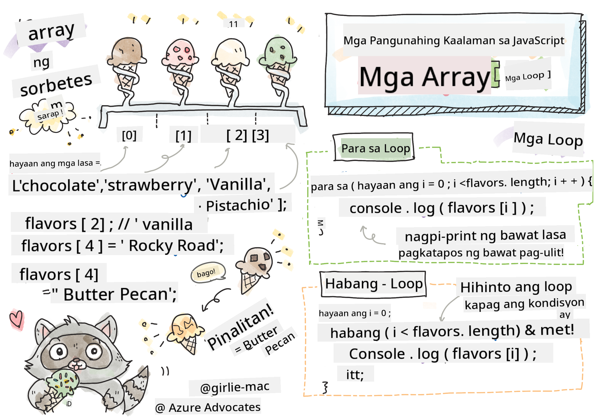

<!--
CO_OP_TRANSLATOR_METADATA:
{
  "original_hash": "3f7f87871312cf6cc12662da7d973182",
  "translation_date": "2025-08-27T22:53:01+00:00",
  "source_file": "2-js-basics/4-arrays-loops/README.md",
  "language_code": "tl"
}
-->
# Mga Pangunahing Kaalaman sa JavaScript: Arrays at Loops


> Sketchnote ni [Tomomi Imura](https://twitter.com/girlie_mac)

## Pre-Lecture Quiz
[Pre-lecture quiz](https://ff-quizzes.netlify.app/web/quiz/13)

Tatalakayin sa araling ito ang mga pangunahing kaalaman sa JavaScript, ang wika na nagbibigay ng interaktibidad sa web. Sa araling ito, matututuhan mo ang tungkol sa arrays at loops, na ginagamit upang manipulahin ang data.

[](https://youtube.com/watch?v=1U4qTyq02Xw "Arrays")

[](https://www.youtube.com/watch?v=Eeh7pxtTZ3k "Loops")

> 🎥 I-click ang mga larawan sa itaas para sa mga video tungkol sa arrays at loops.

> Maaari mong kunin ang araling ito sa [Microsoft Learn](https://docs.microsoft.com/learn/modules/web-development-101-arrays/?WT.mc_id=academic-77807-sagibbon)!

## Arrays

Ang pagproseso ng data ay isang karaniwang gawain sa anumang wika, at mas madali itong gawin kapag ang data ay nakaayos sa isang istruktura tulad ng arrays. Sa arrays, ang data ay iniimbak sa isang istruktura na parang listahan. Isang malaking benepisyo ng arrays ay maaari kang mag-imbak ng iba't ibang uri ng data sa isang array.

✅ Ang arrays ay nasa paligid natin! Makakaisip ka ba ng isang halimbawa ng array sa totoong buhay, tulad ng isang hanay ng solar panels?

Ang syntax para sa isang array ay isang pares ng square brackets.

```javascript
let myArray = [];
```

Ito ay isang walang laman na array, ngunit ang arrays ay maaaring ideklara na may laman na data. Ang maraming halaga sa isang array ay pinaghihiwalay ng kuwit.

```javascript
let iceCreamFlavors = ["Chocolate", "Strawberry", "Vanilla", "Pistachio", "Rocky Road"];
```

Ang mga halaga sa array ay binibigyan ng natatanging halaga na tinatawag na **index**, isang buong numero na itinalaga batay sa layo nito mula sa simula ng array. Sa halimbawa sa itaas, ang string na "Chocolate" ay may index na 0, at ang index ng "Rocky Road" ay 4. Gamitin ang index na may square brackets upang kunin, baguhin, o ipasok ang mga halaga ng array.

✅ Ikaw ba ay nagulat na ang arrays ay nagsisimula sa zero index? Sa ilang programming languages, ang mga index ay nagsisimula sa 1. Mayroong isang kawili-wiling kasaysayan tungkol dito, na maaari mong [basahin sa Wikipedia](https://en.wikipedia.org/wiki/Zero-based_numbering).

```javascript
let iceCreamFlavors = ["Chocolate", "Strawberry", "Vanilla", "Pistachio", "Rocky Road"];
iceCreamFlavors[2]; //"Vanilla"
```

Maaari mong gamitin ang index upang baguhin ang isang halaga, tulad nito:

```javascript
iceCreamFlavors[4] = "Butter Pecan"; //Changed "Rocky Road" to "Butter Pecan"
```

At maaari kang magpasok ng bagong halaga sa isang partikular na index tulad nito:

```javascript
iceCreamFlavors[5] = "Cookie Dough"; //Added "Cookie Dough"
```

✅ Isang mas karaniwang paraan upang magdagdag ng mga halaga sa isang array ay sa pamamagitan ng paggamit ng mga array operator tulad ng array.push()

Upang malaman kung ilang item ang nasa isang array, gamitin ang `length` property.

```javascript
let iceCreamFlavors = ["Chocolate", "Strawberry", "Vanilla", "Pistachio", "Rocky Road"];
iceCreamFlavors.length; //5
```

✅ Subukan mo ito! Gumamit ng console ng iyong browser upang lumikha at manipulahin ang isang array na ikaw mismo ang gumawa.

## Loops

Ang loops ay nagbibigay-daan sa atin na magsagawa ng mga paulit-ulit o **iterative** na gawain, at makakatipid ng maraming oras at code. Ang bawat iteration ay maaaring mag-iba sa kanilang mga variable, halaga, at kondisyon. May iba't ibang uri ng loops sa JavaScript, at lahat sila ay may maliliit na pagkakaiba, ngunit sa esensya ay ginagawa ang parehong bagay: mag-loop sa data.

### For Loop

Ang `for` loop ay nangangailangan ng 3 bahagi upang mag-iterate:
- `counter` Isang variable na karaniwang sinisimulan sa isang numero na nagbibilang ng bilang ng iterations
- `condition` Expression na gumagamit ng comparison operators upang itigil ang loop kapag `false`
- `iteration-expression` Tumakbo sa dulo ng bawat iteration, karaniwang ginagamit upang baguhin ang halaga ng counter
  
```javascript
// Counting up to 10
for (let i = 0; i < 10; i++) {
  console.log(i);
}
```

✅ Patakbuhin ang code na ito sa console ng browser. Ano ang mangyayari kapag gumawa ka ng maliliit na pagbabago sa counter, condition, o iteration expression? Kaya mo bang gawing pabaliktad ito, na parang countdown?

### While loop

Hindi tulad ng syntax ng `for` loop, ang `while` loops ay nangangailangan lamang ng isang kondisyon na magpapahinto sa loop kapag ang kondisyon ay naging `false`. Ang mga kondisyon sa loops ay karaniwang umaasa sa ibang mga halaga tulad ng counters, at kailangang pamahalaan sa loob ng loop. Ang mga panimulang halaga para sa counters ay kailangang likhain sa labas ng loop, at anumang expression upang matugunan ang isang kondisyon, kabilang ang pagbabago ng counter, ay kailangang panatilihin sa loob ng loop.

```javascript
//Counting up to 10
let i = 0;
while (i < 10) {
 console.log(i);
 i++;
}
```

✅ Bakit mo pipiliin ang isang for loop kumpara sa isang while loop? 17K na mga manonood ang may parehong tanong sa StackOverflow, at ang ilan sa mga opinyon [maaaring maging interesante sa iyo](https://stackoverflow.com/questions/39969145/while-loops-vs-for-loops-in-javascript).

## Loops at Arrays

Ang arrays ay madalas gamitin kasama ng loops dahil karamihan sa mga kondisyon ay nangangailangan ng haba ng array upang itigil ang loop, at ang index ay maaari ring maging halaga ng counter.

```javascript
let iceCreamFlavors = ["Chocolate", "Strawberry", "Vanilla", "Pistachio", "Rocky Road"];

for (let i = 0; i < iceCreamFlavors.length; i++) {
  console.log(iceCreamFlavors[i]);
} //Ends when all flavors are printed
```

✅ Mag-eksperimento sa pag-loop sa isang array na ikaw mismo ang gumawa sa console ng iyong browser. 

---

## 🚀 Hamon

May iba pang mga paraan ng pag-loop sa arrays bukod sa for at while loops. Mayroong [forEach](https://developer.mozilla.org/docs/Web/JavaScript/Reference/Global_Objects/Array/forEach), [for-of](https://developer.mozilla.org/docs/Web/JavaScript/Reference/Statements/for...of), at [map](https://developer.mozilla.org/docs/Web/JavaScript/Reference/Global_Objects/Array/map). Isulat muli ang iyong array loop gamit ang isa sa mga teknik na ito.

## Post-Lecture Quiz
[Post-lecture quiz](https://ff-quizzes.netlify.app/web/quiz/14)

## Review at Pag-aaral sa Sarili

Ang arrays sa JavaScript ay may maraming mga method na nakakabit sa kanila, na napaka-kapaki-pakinabang para sa pag-manipula ng data. [Basahin ang tungkol sa mga method na ito](https://developer.mozilla.org/docs/Web/JavaScript/Reference/Global_Objects/Array) at subukan ang ilan sa mga ito (tulad ng push, pop, slice, at splice) sa isang array na ikaw mismo ang gumawa.

## Takdang-Aralin

[Loop an Array](assignment.md)

---

**Paunawa**:  
Ang dokumentong ito ay isinalin gamit ang AI translation service na [Co-op Translator](https://github.com/Azure/co-op-translator). Bagama't sinisikap naming maging tumpak, tandaan na ang mga awtomatikong pagsasalin ay maaaring maglaman ng mga pagkakamali o hindi pagkakatugma. Ang orihinal na dokumento sa kanyang katutubong wika ang dapat ituring na opisyal na sanggunian. Para sa mahalagang impormasyon, inirerekomenda ang propesyonal na pagsasalin ng tao. Hindi kami mananagot sa anumang hindi pagkakaunawaan o maling interpretasyon na dulot ng paggamit ng pagsasaling ito.