<!--
CO_OP_TRANSLATOR_METADATA:
{
  "original_hash": "1710a50a519a6e4a1b40a5638783018d",
  "translation_date": "2025-11-03T13:45:30+00:00",
  "source_file": "2-js-basics/4-arrays-loops/README.md",
  "language_code": "tl"
}
-->
# Mga Pangunahing Kaalaman sa JavaScript: Arrays at Loops


> Sketchnote ni [Tomomi Imura](https://twitter.com/girlie_mac)


## Pre-Lecture Quiz
[Pre-lecture quiz](https://ff-quizzes.netlify.app/web/quiz/13)

Naisip mo na ba kung paano nagtatala ang mga website ng mga item sa shopping cart o nagpapakita ng listahan ng mga kaibigan? Diyan pumapasok ang arrays at loops. Ang arrays ay parang mga digital na lalagyan na nag-iimbak ng maraming impormasyon, habang ang loops ay nagbibigay-daan sa iyo na magtrabaho sa lahat ng data nang epektibo nang hindi inuulit ang code.

Ang dalawang konseptong ito ay bumubuo ng pundasyon para sa paghawak ng impormasyon sa iyong mga programa. Matututo kang lumipat mula sa manu-manong pagsusulat ng bawat hakbang patungo sa paggawa ng matalino at epektibong code na maaaring magproseso ng daan-daang o libu-libong item nang mabilis.

Sa pagtatapos ng araling ito, maiintindihan mo kung paano magawa ang mga kumplikadong gawain sa data gamit ang ilang linya ng code lamang. Tuklasin natin ang mga mahahalagang konsepto sa programming na ito.

[](https://youtube.com/watch?v=1U4qTyq02Xw "Arrays")

[](https://www.youtube.com/watch?v=Eeh7pxtTZ3k "Loops")

> 🎥 I-click ang mga imahe sa itaas para sa mga video tungkol sa arrays at loops.

> Maaari mong kunin ang araling ito sa [Microsoft Learn](https://docs.microsoft.com/learn/modules/web-development-101-arrays/?WT.mc_id=academic-77807-sagibbon)!


## Arrays

Isipin ang arrays bilang isang digital na filing cabinet - sa halip na mag-imbak ng isang dokumento bawat drawer, maaari mong ayusin ang maraming kaugnay na item sa isang solong, maayos na lalagyan. Sa mga termino ng programming, ang arrays ay nagbibigay-daan sa iyo na mag-imbak ng maraming piraso ng impormasyon sa isang maayos na pakete.

Kung ikaw ay gumagawa ng photo gallery, nagma-manage ng to-do list, o nagtatala ng mga high scores sa isang laro, ang arrays ang pundasyon para sa organisasyon ng data. Tingnan natin kung paano ito gumagana.

✅ Ang arrays ay nasa paligid natin! Makakaisip ka ba ng isang halimbawa ng array sa totoong buhay, tulad ng isang solar panel array?

### Paglikha ng Arrays

Napakadaling gumawa ng array - gumamit lang ng square brackets!

```javascript
// Empty array - like an empty shopping cart waiting for items
const myArray = [];
```

**Ano ang nangyayari dito?**
Kakagawa mo lang ng isang walang laman na lalagyan gamit ang mga square brackets `[]`. Isipin ito na parang isang walang laman na istante ng aklatan - handa na itong maglaman ng anumang mga aklat na nais mong ayusin doon.

Maaari mo ring punan ang iyong array ng mga paunang halaga mula sa simula:

```javascript
// Your ice cream shop's flavor menu
const iceCreamFlavors = ["Chocolate", "Strawberry", "Vanilla", "Pistachio", "Rocky Road"];

// A user's profile info (mixing different types of data)
const userData = ["John", 25, true, "developer"];

// Test scores for your favorite class
const scores = [95, 87, 92, 78, 85];
```

**Mga cool na bagay na mapapansin:**
- Maaari kang mag-imbak ng text, numero, o kahit mga true/false na halaga sa parehong array
- Paghiwalayin lang ang bawat item gamit ang comma - madali!
- Perpekto ang arrays para sa pag-iimbak ng mga kaugnay na impormasyon

```mermaid
flowchart LR
    A["📦 Arrays"] --> B["Create [ ]"]
    A --> C["Store Multiple Items"]
    A --> D["Access by Index"]
    
    B --> B1["const arr = []"]
    B --> B2["const arr = [1,2,3]"]
    
    C --> C1["Numbers"]
    C --> C2["Strings"]
    C --> C3["Booleans"]
    C --> C4["Mixed Types"]
    
    D --> D1["arr[0] = first"]
    D --> D2["arr[1] = second"]
    D --> D3["arr[2] = third"]
    
    E["📊 Array Index"] --> E1["Index 0: First"]
    E --> E2["Index 1: Second"]
    E --> E3["Index 2: Third"]
    E --> E4["Index n-1: Last"]
    
    style A fill:#e3f2fd
    style B fill:#e8f5e8
    style C fill:#fff3e0
    style D fill:#f3e5f5
    style E fill:#e0f2f1
```



### Pag-index ng Array

Narito ang isang bagay na maaaring mukhang hindi pangkaraniwan sa simula: ang mga array ay nagbibilang ng kanilang mga item simula sa 0, hindi 1. Ang zero-based indexing na ito ay may ugat sa kung paano gumagana ang memorya ng computer - ito ay naging isang programming convention mula pa noong unang panahon ng mga wika sa programming tulad ng C. Ang bawat puwesto sa array ay may sariling numero ng address na tinatawag na **index**.

| Index | Halaga | Paglalarawan |
|-------|-------|-------------|
| 0 | "Chocolate" | Unang elemento |
| 1 | "Strawberry" | Ikalawang elemento |
| 2 | "Vanilla" | Ikatlong elemento |
| 3 | "Pistachio" | Ikaapat na elemento |
| 4 | "Rocky Road" | Ikalimang elemento |

✅ Nagulat ka ba na ang arrays ay nagsisimula sa zero index? Sa ilang programming languages, ang mga index ay nagsisimula sa 1. Mayroong isang kawili-wiling kasaysayan tungkol dito, na maaari mong [basahin sa Wikipedia](https://en.wikipedia.org/wiki/Zero-based_numbering).

**Pag-access sa mga Elemento ng Array:**

```javascript
const iceCreamFlavors = ["Chocolate", "Strawberry", "Vanilla", "Pistachio", "Rocky Road"];

// Access individual elements using bracket notation
console.log(iceCreamFlavors[0]); // "Chocolate" - first element
console.log(iceCreamFlavors[2]); // "Vanilla" - third element
console.log(iceCreamFlavors[4]); // "Rocky Road" - last element
```

**Pag-unawa sa nangyayari dito:**
- **Gumagamit** ng square bracket notation na may numero ng index para ma-access ang mga elemento
- **Nagbabalik** ng halaga na nakaimbak sa partikular na posisyon sa array
- **Nagsisimula** sa pagbilang mula sa 0, kaya ang unang elemento ay index 0

**Pagbabago ng mga Elemento ng Array:**

```javascript
// Change an existing value
iceCreamFlavors[4] = "Butter Pecan";
console.log(iceCreamFlavors[4]); // "Butter Pecan"

// Add a new element at the end
iceCreamFlavors[5] = "Cookie Dough";
console.log(iceCreamFlavors[5]); // "Cookie Dough"
```

**Sa itaas, ginawa natin:**
- **Binago** ang elemento sa index 4 mula "Rocky Road" patungong "Butter Pecan"
- **Nagdagdag** ng bagong elemento "Cookie Dough" sa index 5
- **Pinalawak** ang haba ng array nang awtomatiko kapag nagdagdag ng lampas sa kasalukuyang hangganan

### Haba ng Array at Karaniwang Mga Pamamaraan

Ang arrays ay may mga built-in na properties at methods na nagpapadali sa pagtrabaho sa data.

**Paghanap ng Haba ng Array:**

```javascript
const iceCreamFlavors = ["Chocolate", "Strawberry", "Vanilla", "Pistachio", "Rocky Road"];
console.log(iceCreamFlavors.length); // 5

// Length updates automatically as array changes
iceCreamFlavors.push("Mint Chip");
console.log(iceCreamFlavors.length); // 6
```

**Mga mahalagang punto na dapat tandaan:**
- **Nagbabalik** ng kabuuang bilang ng mga elemento sa array
- **Ina-update** nang awtomatiko kapag may idinagdag o tinanggal na mga elemento
- **Nagbibigay** ng dynamic na bilang na kapaki-pakinabang para sa loops at validation

**Mahahalagang Pamamaraan ng Array:**

```javascript
const fruits = ["apple", "banana", "orange"];

// Add elements
fruits.push("grape");           // Adds to end: ["apple", "banana", "orange", "grape"]
fruits.unshift("strawberry");   // Adds to beginning: ["strawberry", "apple", "banana", "orange", "grape"]

// Remove elements
const lastFruit = fruits.pop();        // Removes and returns "grape"
const firstFruit = fruits.shift();     // Removes and returns "strawberry"

// Find elements
const index = fruits.indexOf("banana"); // Returns 1 (position of "banana")
const hasApple = fruits.includes("apple"); // Returns true
```

**Pag-unawa sa mga pamamaraang ito:**
- **Nagdaragdag** ng mga elemento gamit ang `push()` (dulo) at `unshift()` (simula)
- **Nag-aalis** ng mga elemento gamit ang `pop()` (dulo) at `shift()` (simula)
- **Hinahanap** ang mga elemento gamit ang `indexOf()` at sinusuri ang pagkakaroon gamit ang `includes()`
- **Nagbabalik** ng mga kapaki-pakinabang na halaga tulad ng mga tinanggal na elemento o mga posisyon ng index

✅ Subukan mo ito! Gumamit ng console ng browser para gumawa at manipulahin ang isang array na ikaw mismo ang lumikha.

### 🧠 **Pag-check ng Mga Pangunahing Kaalaman sa Array: Pag-aayos ng Iyong Data**

**Subukan ang iyong kaalaman sa array:**
- Bakit sa tingin mo nagsisimula ang arrays sa pagbilang mula sa 0 sa halip na 1?
- Ano ang mangyayari kung susubukan mong i-access ang isang index na hindi umiiral (tulad ng `arr[100]` sa isang 5-element array)?
- Makakaisip ka ba ng tatlong sitwasyon sa totoong buhay kung saan magiging kapaki-pakinabang ang arrays?


> **Insight sa Totoong Buhay**: Ang arrays ay nasa lahat ng dako sa programming! Mga feed sa social media, shopping carts, photo galleries, mga kanta sa playlist - lahat ng ito ay arrays sa likod ng eksena!

## Loops

Isipin ang sikat na parusa mula sa mga nobela ni Charles Dickens kung saan kailangang magsulat ng mga linya nang paulit-ulit ang mga estudyante sa isang slate. Isipin kung maaari mong simpleng utusan ang isang tao na "isulat ang pangungusap na ito ng 100 beses" at magawa ito nang awtomatiko. Iyan ang eksaktong ginagawa ng loops para sa iyong code.

Ang loops ay parang may walang pagod na katulong na maaaring ulitin ang mga gawain nang walang error. Kung kailangan mong suriin ang bawat item sa shopping cart o ipakita ang lahat ng mga larawan sa isang album, ang loops ang humahawak sa pag-uulit nang epektibo.

Nagbibigay ang JavaScript ng ilang uri ng loops na maaari mong pagpilian. Tingnan natin ang bawat isa at unawain kung kailan ito gagamitin.

```mermaid
flowchart TD
    A["🔄 Loop Types"] --> B["For Loop"]
    A --> C["While Loop"]
    A --> D["For...of Loop"]
    A --> E["forEach Method"]
    
    B --> B1["Known iterations"]
    B --> B2["Counter-based"]
    B --> B3["for(init; condition; increment)"]
    
    C --> C1["Unknown iterations"]
    C --> C2["Condition-based"]
    C --> C3["while(condition)"]
    
    D --> D1["Modern ES6+"]
    D --> D2["Array iteration"]
    D --> D3["for(item of array)"]
    
    E --> E1["Functional style"]
    E --> E2["Array method"]
    E --> E3["array.forEach(callback)"]
    
    F["⏰ When to Use"] --> F1["For: Counting, indexes"]
    F --> F2["While: User input, searching"]
    F --> F3["For...of: Simple iteration"]
    F --> F4["forEach: Functional programming"]
    
    style A fill:#e3f2fd
    style B fill:#e8f5e8
    style C fill:#fff3e0
    style D fill:#f3e5f5
    style E fill:#e0f2f1
    style F fill:#fce4ec
```



### For Loop

Ang `for` loop ay parang pag-set ng timer - alam mo nang eksakto kung ilang beses mo gustong mangyari ang isang bagay. Napaka-organisado at predictable nito, kaya perpekto ito kapag nagtatrabaho ka sa arrays o kailangang magbilang ng mga bagay.

**Struktura ng For Loop:**

| Komponent | Layunin | Halimbawa |
|-----------|---------|----------|
| **Initialization** | Nagtatakda ng panimulang punto | `let i = 0` |
| **Condition** | Kailan magpapatuloy | `i < 10` |
| **Increment** | Paano mag-update | `i++` |

```javascript
// Counting from 0 to 9
for (let i = 0; i < 10; i++) {
  console.log(`Count: ${i}`);
}

// More practical example: processing scores
const testScores = [85, 92, 78, 96, 88];
for (let i = 0; i < testScores.length; i++) {
  console.log(`Student ${i + 1}: ${testScores[i]}%`);
}
```

**Hakbang-hakbang, narito ang nangyayari:**
- **Nagsisimula** ang counter variable `i` sa 0 sa simula
- **Sinusuri** ang kondisyon `i < 10` bago ang bawat iteration
- **Isinasagawa** ang code block kapag ang kondisyon ay totoo
- **Ina-update** ang `i` ng 1 pagkatapos ng bawat iteration gamit ang `i++`
- **Humihinto** kapag ang kondisyon ay naging false (kapag umabot ang `i` sa 10)

✅ Patakbuhin ang code na ito sa console ng browser. Ano ang nangyayari kapag gumawa ka ng maliliit na pagbabago sa counter, kondisyon, o expression ng iteration? Kaya mo bang gawing paatras ito, na gumagawa ng countdown?

### 🗓️ **Pag-check ng Mastery sa For Loop: Kinokontrol na Pag-uulit**

**Suriin ang iyong kaalaman sa for loop:**
- Ano ang tatlong bahagi ng isang for loop, at ano ang ginagawa ng bawat isa?
- Paano mo i-loop ang isang array nang paatras?
- Ano ang mangyayari kung nakalimutan mo ang bahagi ng increment (`i++`)?

```mermaid
flowchart TD
    A["🚀 Start For Loop"] --> B["Initialize: let i = 0"]
    B --> C{"Condition: i < array.length?"}
    C -->|true| D["Execute code block"]
    D --> E["Increment: i++"]
    E --> C
    C -->|false| F["✅ Exit loop"]
    
    G["📋 Common Patterns"] --> G1["for(let i=0; i<n; i++)"]
    G --> G2["for(let i=n-1; i>=0; i--)"]
    G --> G3["for(let i=0; i<arr.length; i+=2)"]
    
    style A fill:#e3f2fd
    style F fill:#e8f5e8
    style G fill:#fff3e0
```



> **Karunungan sa Loop**: Ang for loops ay perpekto kapag alam mo nang eksakto kung ilang beses mo kailangang ulitin ang isang bagay. Ito ang pinakakaraniwang pagpipilian para sa pagproseso ng array!

### While Loop

Ang `while` loop ay parang sinasabi na "patuloy na gawin ito hanggang..." - maaaring hindi mo alam nang eksakto kung ilang beses itong tatakbo, pero alam mo kung kailan titigil. Perpekto ito para sa mga bagay tulad ng paghingi ng input mula sa user hanggang sa ibigay nila ang kailangan mo, o paghahanap sa data hanggang sa makita mo ang hinahanap mo.

**Mga Katangian ng While Loop:**
- **Nagpapatuloy** sa pag-execute hangga't ang kondisyon ay totoo
- **Nangangailangan** ng manu-manong pamamahala ng anumang counter variables
- **Sinusuri** ang kondisyon bago ang bawat iteration
- **May panganib** ng infinite loops kung ang kondisyon ay hindi kailanman magiging false

```javascript
// Basic counting example
let i = 0;
while (i < 10) {
  console.log(`While count: ${i}`);
  i++; // Don't forget to increment!
}

// More practical example: processing user input
let userInput = "";
let attempts = 0;
const maxAttempts = 3;

while (userInput !== "quit" && attempts < maxAttempts) {
  userInput = prompt(`Enter 'quit' to exit (attempt ${attempts + 1}):`);
  attempts++;
}

if (attempts >= maxAttempts) {
  console.log("Maximum attempts reached!");
}
```

**Pag-unawa sa mga halimbawa:**
- **Pinamamahalaan** ang counter variable `i` nang manu-mano sa loob ng loop body
- **Ina-update** ang counter para maiwasan ang infinite loops
- **Nagpapakita** ng praktikal na paggamit sa input ng user at limitasyon ng mga pagtatangka
- **Kasama** ang mga safety mechanisms para maiwasan ang walang katapusang execution

### ♾️ **Pag-check ng Karunungan sa While Loop: Pag-uulit Batay sa Kondisyon**

**Subukan ang iyong kaalaman sa while loop:**
- Ano ang pangunahing panganib kapag gumagamit ng while loops?
- Kailan mo pipiliin ang while loop kaysa sa for loop?
- Paano mo maiiwasan ang infinite loops?

```mermaid
flowchart LR
    A["🔄 While vs For"] --> B["While Loop"]
    A --> C["For Loop"]
    
    B --> B1["Unknown iterations"]
    B --> B2["Condition-driven"]
    B --> B3["User input, searching"]
    B --> B4["⚠️ Risk: infinite loops"]
    
    C --> C1["Known iterations"]
    C --> C2["Counter-driven"]
    C --> C3["Array processing"]
    C --> C4["✅ Safe: predictable end"]
    
    D["🛡️ Safety Tips"] --> D1["Always modify condition variable"]
    D --> D2["Include escape conditions"]
    D --> D3["Set maximum iteration limits"]
    
    style A fill:#e3f2fd
    style B fill:#fff3e0
    style C fill:#e8f5e8
    style D fill:#ffebee
```



> **Safety first**: Ang while loops ay makapangyarihan pero nangangailangan ng maingat na pamamahala ng kondisyon. Siguraduhin palagi na ang kondisyon ng iyong loop ay magiging false sa kalaunan!

### Mga Modernong Alternatibo sa Loop

Nag-aalok ang JavaScript ng modernong syntax ng loop na maaaring gawing mas nababasa at mas kaunti ang error sa iyong code.

**For...of Loop (ES6+):**

```javascript
const colors = ["red", "green", "blue", "yellow"];

// Modern approach - cleaner and safer
for (const color of colors) {
  console.log(`Color: ${color}`);
}

// Compare with traditional for loop
for (let i = 0; i < colors.length; i++) {
  console.log(`Color: ${colors[i]}`);
}
```

**Mga pangunahing bentahe ng for...of:**
- **Inaalis** ang pamamahala ng index at potensyal na mga error sa off-by-one
- **Nagbibigay** ng direktang access sa mga elemento ng array
- **Pinapabuti** ang readability ng code at binabawasan ang syntax complexity

**Pamamaraan ng forEach:**

```javascript
const prices = [9.99, 15.50, 22.75, 8.25];

// Using forEach for functional programming style
prices.forEach((price, index) => {
  console.log(`Item ${index + 1}: $${price.toFixed(2)}`);
});

// forEach with arrow functions for simple operations
prices.forEach(price => console.log(`Price: $${price}`));
```

**Mga dapat mong malaman tungkol sa forEach:**
- **Isinasagawa** ang isang function para sa bawat elemento ng array
- **Nagbibigay** ng parehong halaga ng elemento at index bilang mga parameter
- **Hindi** maaaring ihinto nang maaga (hindi tulad ng tradisyunal na loops)
- **Nagbabalik** ng undefined (hindi gumagawa ng bagong array)

✅ Bakit mo pipiliin ang for loop kumpara sa while loop? 17K na mga manonood ang may parehong tanong sa StackOverflow, at ang ilan sa mga opinyon [maaaring maging kawili-wili sa iyo](https://stackoverflow.com/questions/39969145/while-loops-vs-for-loops-in-javascript).

### 🎨 **Pag-check ng Modernong Syntax ng Loop: Pagtanggap sa ES6+**

**Suriin ang iyong kaalaman sa modernong JavaScript:**
- Ano ang mga bentahe ng `for...of` kumpara sa tradisyunal na for loops?
- Kailan mo mas pipiliin ang tradisyunal na for loops?
- Ano ang pagkakaiba ng `forEach` at `map`?


> **Modernong trend**: Ang syntax ng ES6+ tulad ng `for...of` at `forEach` ay nagiging mas pinapaboran para sa pag-ikot sa array dahil mas malinis ito at mas kaunti ang error!

## Loops at Arrays

Ang pagsasama ng arrays sa loops ay lumilikha ng makapangyarihang kakayahan sa pagproseso ng data. Ang kombinasyong ito ay mahalaga sa maraming gawain sa programming, mula sa pagpapakita ng mga listahan hanggang sa pagkalkula ng mga istatistika.

**Tradisyunal na Pagproseso ng Array:**

```javascript
const iceCreamFlavors = ["Chocolate", "Strawberry", "Vanilla", "Pistachio", "Rocky Road"];

// Classic for loop approach
for (let i = 0; i < iceCreamFlavors.length; i++) {
  console.log(`Flavor ${i + 1}: ${iceCreamFlavors[i]}`);
}

// Modern for...of approach
for (const flavor of iceCreamFlavors) {
  console.log(`Available flavor: ${flavor}`);
}
```

**Unawain ang bawat paraan:**
- **Gumagamit** ng property ng haba ng array para matukoy ang hangganan ng loop
- **Ina-access** ang mga elemento sa pamamagitan ng index sa tradisyunal na for loops
- **Nagbibigay** ng direktang access sa mga elemento sa for...of loops
- **Pinoproseso** ang bawat elemento ng array nang eksakto isang beses

**Halimbawa ng Praktikal na Pagproseso ng Data:**

```javascript
const studentGrades = [85, 92, 78, 96, 88, 73, 89];
let total = 0;
let highestGrade = studentGrades[0];
let lowestGrade = studentGrades[0];

// Process all grades with a single loop
for (let i = 0; i < studentGrades.length; i++) {
  const grade = studentGrades[i];
  total += grade;
  
  if (grade > highestGrade) {
    highestGrade = grade;
  }
  
  if (grade < lowestGrade) {
    lowestGrade = grade;
  }
}

const average = total / studentGrades.length;
console.log(`Average: ${average.toFixed(1)}`);
console.log(`Highest: ${highestGrade}`);
console.log(`Lowest: ${lowestGrade}`);
```

**Narito kung paano gumagana ang code na ito:**
- **Nagsisimula** ng mga tracking variables para sa kabuuan at extremes
- **Pinoproseso** ang bawat grade gamit ang isang epektibong loop
- **Nag-iipon** ng kabuuan para sa pagkalkula ng average
- **Nagtatala** ng pinakamataas at pinakamababang halaga sa panahon ng iteration
- **Kinakalkula** ang panghuling istatistika pagkatapos ng loop

✅ Subukan ang pag-loop sa isang array na ikaw mismo ang lumikha sa console ng iyong browser.

```mermaid
flowchart TD
    A["📦 Array Data"] --> B["🔄 Loop Processing"]
    B --> C["📈 Results"]
    
    A1["[85, 92, 78, 96, 88]"] --> A
    
    B --> B1["Calculate total"]
    B --> B2["Find min/max"]
    B --> B3["Count conditions"]
    B --> B4["Transform data"]
    
    C --> C1["Average: 87.8"]
    C --> C2["Highest: 96"]
    C --> C3["Passing: 5/5"]
    C --> C4["Letter grades"]
    
    D["⚡ Processing Patterns"] --> D1["Accumulation (sum)"]
    D --> D2["Comparison (min/max)"]
    D --> D3["Filtering (conditions)"]
    D --> D4["Mapping (transformation)"]
    
    style A fill:#e3f2fd
    style B fill:#fff3e0
    style C fill:#e8f5e8
    style D fill:#f3e5f5
```



---

## Hamon ng GitHub Copilot Agent 🚀

Gamitin ang Agent mode para tapusin ang sumusunod na hamon:

**Deskripsyon:** Gumawa ng komprehensibong function sa pagproseso ng data na pinagsasama ang arrays at loops para suriin ang isang dataset at makabuo ng makabuluhang mga insight.

**Prompt:** Gumawa ng function na tinatawag na `analyzeGrades` na tumatanggap ng array ng mga object ng grade ng estudyante (bawat isa ay naglalaman ng name at score properties) at nagbabalik ng object na may mga istatistika kabilang ang pinakamataas na score, pinakamababang score, average score, bilang ng mga estudyanteng pumasa (score >= 70), at isang array ng mga pangalan ng estudyante na nakakuha ng score na mas mataas sa average. Gumamit ng hindi bababa sa dalawang magkaibang uri ng loop sa iyong solusyon.

Alamin pa ang tungkol sa [agent mode](https://code.visualstudio.com/blogs/2025/02/24/introducing-copilot-agent-mode) dito.

## 🚀 Hamon
Nag-aalok ang JavaScript ng ilang modernong pamamaraan para sa array na maaaring pumalit sa tradisyunal na mga loop para sa partikular na mga gawain. Tuklasin ang [forEach](https://developer.mozilla.org/docs/Web/JavaScript/Reference/Global_Objects/Array/forEach), [for-of](https://developer.mozilla.org/docs/Web/JavaScript/Reference/Statements/for...of), [map](https://developer.mozilla.org/docs/Web/JavaScript/Reference/Global_Objects/Array/map), [filter](https://developer.mozilla.org/docs/Web/JavaScript/Reference/Global_Objects/Array/filter), at [reduce](https://developer.mozilla.org/docs/Web/JavaScript/Reference/Global_Objects/Array/reduce). 

**Ang iyong hamon:** I-refactor ang halimbawa ng mga grado ng estudyante gamit ang hindi bababa sa tatlong iba't ibang pamamaraan para sa array. Pansinin kung gaano kalinis at mas madaling basahin ang code gamit ang modernong syntax ng JavaScript.

## Post-Lecture Quiz
[Post-lecture quiz](https://ff-quizzes.netlify.app/web/quiz/14)


## Review & Self Study

Ang mga array sa JavaScript ay may maraming mga pamamaraan na nakakabit sa kanila, na napaka-kapaki-pakinabang para sa pagmamanipula ng data. [Basahin ang tungkol sa mga pamamaraang ito](https://developer.mozilla.org/docs/Web/JavaScript/Reference/Global_Objects/Array) at subukan ang ilan sa mga ito (tulad ng push, pop, slice, at splice) sa isang array na iyong ginawa.

## Assignment

[Loop an Array](assignment.md)

---

## 📊 **Buod ng Iyong Toolkit para sa Arrays at Loops**

```mermaid
graph TD
    A["🎯 Arrays & Loops Mastery"] --> B["📦 Array Fundamentals"]
    A --> C["🔄 Loop Types"]
    A --> D["🔗 Data Processing"]
    A --> E["🎨 Modern Techniques"]
    
    B --> B1["Creation: [ ]"]
    B --> B2["Indexing: arr[0]"]
    B --> B3["Methods: push, pop"]
    B --> B4["Properties: length"]
    
    C --> C1["For: Known iterations"]
    C --> C2["While: Condition-based"]
    C --> C3["For...of: Direct access"]
    C --> C4["forEach: Functional"]
    
    D --> D1["Statistics calculation"]
    D --> D2["Data transformation"]
    D --> D3["Filtering & searching"]
    D --> D4["Real-time processing"]
    
    E --> E1["Arrow functions"]
    E --> E2["Method chaining"]
    E --> E3["Destructuring"]
    E --> E4["Template literals"]
    
    F["💡 Key Benefits"] --> F1["Efficient data handling"]
    F --> F2["Reduced code repetition"]
    F --> F3["Scalable solutions"]
    F --> F4["Cleaner syntax"]
    
    style A fill:#e3f2fd
    style B fill:#e8f5e8
    style C fill:#fff3e0
    style D fill:#f3e5f5
    style E fill:#e0f2f1
    style F fill:#fce4ec
```



---

## 🚀 Timeline ng Iyong Mastery sa Arrays at Loops

### ⚡ **Ano ang Magagawa Mo sa Susunod na 5 Minuto**
- [ ] Gumawa ng array ng iyong mga paboritong pelikula at i-access ang mga partikular na elemento
- [ ] Sumulat ng isang for loop na nagbibilang mula 1 hanggang 10
- [ ] Subukan ang hamon sa modernong pamamaraan ng array mula sa aralin
- [ ] Magpraktis ng pag-index ng array sa console ng iyong browser

### 🎯 **Ano ang Maaaring Makamit Mo sa Loob ng Isang Oras**
- [ ] Kumpletuhin ang post-lesson quiz at suriin ang anumang mahirap na konsepto
- [ ] Bumuo ng komprehensibong grade analyzer mula sa hamon ng GitHub Copilot
- [ ] Gumawa ng simpleng shopping cart na nagdadagdag at nag-aalis ng mga item
- [ ] Magpraktis ng pag-convert sa pagitan ng iba't ibang uri ng loop
- [ ] Mag-eksperimento sa mga pamamaraan ng array tulad ng `push`, `pop`, `slice`, at `splice`

### 📅 **Ang Iyong Lingguhang Paglalakbay sa Pagproseso ng Data**
- [ ] Kumpletuhin ang "Loop an Array" na assignment na may malikhaing mga pagpapahusay
- [ ] Bumuo ng isang to-do list application gamit ang arrays at loops
- [ ] Gumawa ng simpleng calculator ng istatistika para sa numerikal na data
- [ ] Magpraktis gamit ang [MDN array methods](https://developer.mozilla.org/docs/Web/JavaScript/Reference/Global_Objects/Array)
- [ ] Bumuo ng photo gallery o music playlist interface
- [ ] Tuklasin ang functional programming gamit ang `map`, `filter`, at `reduce`

### 🌟 **Ang Iyong Buwanang Transformasyon**
- [ ] Masterin ang advanced na mga operasyon sa array at pag-optimize ng performance
- [ ] Bumuo ng kumpletong dashboard para sa data visualization
- [ ] Mag-ambag sa mga open source na proyekto na may kaugnayan sa pagproseso ng data
- [ ] Magturo sa iba tungkol sa arrays at loops gamit ang mga praktikal na halimbawa
- [ ] Gumawa ng personal na library ng mga reusable na function para sa pagproseso ng data
- [ ] Tuklasin ang mga algorithm at istruktura ng data na nakabatay sa arrays

### 🏆 **Huling Check-in para sa Data Processing Champion**

**I-celebrate ang iyong mastery sa arrays at loops:**
- Ano ang pinaka-kapaki-pakinabang na operasyon sa array na natutunan mo para sa mga aplikasyon sa totoong mundo?
- Aling uri ng loop ang pinaka-natural para sa iyo at bakit?
- Paano binago ng pag-unawa sa arrays at loops ang iyong paraan ng pag-oorganisa ng data?
- Anong masalimuot na gawain sa pagproseso ng data ang nais mong harapin sa susunod?


> 📦 **Na-unlock mo na ang kapangyarihan ng organisasyon at pagproseso ng data!** Ang arrays at loops ang pundasyon ng halos bawat aplikasyon na iyong gagawin. Mula sa simpleng mga listahan hanggang sa masalimuot na pagsusuri ng data, mayroon ka nang mga kasangkapan upang hawakan ang impormasyon nang mahusay at elegante. Ang bawat dynamic na website, mobile app, at data-driven na aplikasyon ay umaasa sa mga pangunahing konseptong ito. Maligayang pagdating sa mundo ng scalable data processing! 🎉

---

**Paunawa**:  
Ang dokumentong ito ay isinalin gamit ang AI translation service [Co-op Translator](https://github.com/Azure/co-op-translator). Bagamat sinisikap naming maging tumpak, mangyaring tandaan na ang mga awtomatikong pagsasalin ay maaaring maglaman ng mga pagkakamali o hindi pagkakatugma. Ang orihinal na dokumento sa kanyang katutubong wika ang dapat ituring na mapagkakatiwalaang pinagmulan. Para sa mahalagang impormasyon, inirerekomenda ang propesyonal na pagsasalin ng tao. Hindi kami mananagot sa anumang hindi pagkakaunawaan o maling interpretasyon na dulot ng paggamit ng pagsasaling ito.