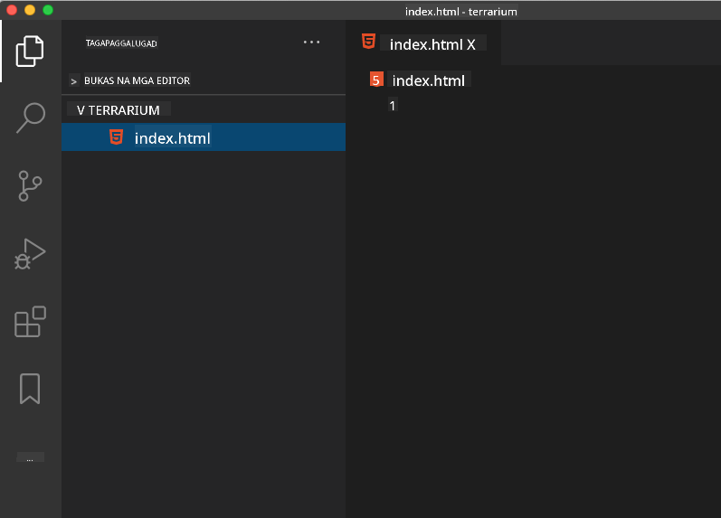

<!--
CO_OP_TRANSLATOR_METADATA:
{
  "original_hash": "f6235d42b9e6862267e92c53f1be2655",
  "translation_date": "2025-10-20T21:06:39+00:00",
  "source_file": "3-terrarium/1-intro-to-html/README.md",
  "language_code": "tl"
}
-->
# Proyekto ng Terrarium Bahagi 1: Panimula sa HTML


> Sketchnote ni [Tomomi Imura](https://twitter.com/girlie_mac)

## Pre-Lecture Quiz

[Pre-lecture quiz](https://ff-quizzes.netlify.app/web/quiz/15)


> Panoorin ang video

> 
> [](https://www.youtube.com/watch?v=1TvxJKBzhyQ)

### Panimula

Ang HTML, o HyperText Markup Language, ay ang 'balangkas' ng web. Kung ang CSS ang 'nagpapaganda' sa iyong HTML at ang JavaScript ang nagbibigay-buhay dito, ang HTML ang katawan ng iyong web application. Ang syntax ng HTML ay sumasalamin sa ideyang ito, dahil kasama nito ang mga tag na "head", "body", at "footer".

Sa araling ito, gagamit tayo ng HTML upang mag-layout ng 'balangkas' ng interface ng ating virtual terrarium. Magkakaroon ito ng pamagat at tatlong kolum: isang kanan at kaliwang kolum kung saan matatagpuan ang mga draggable na halaman, at isang gitnang lugar na magiging parang salamin na terrarium. Sa pagtatapos ng araling ito, makikita mo ang mga halaman sa mga kolum, ngunit medyo kakaiba ang hitsura ng interface; huwag mag-alala, sa susunod na seksyon magdadagdag ka ng mga estilo ng CSS upang mas maganda ang hitsura nito.

### Gawain

Sa iyong computer, gumawa ng folder na tinatawag na 'terrarium' at sa loob nito, isang file na tinatawag na 'index.html'. Maaari mo itong gawin sa Visual Studio Code pagkatapos mong likhain ang folder ng terrarium sa pamamagitan ng pagbukas ng bagong VS Code window, pag-click sa 'open folder', at pag-navigate sa iyong bagong folder. I-click ang maliit na 'file' button sa Explorer pane at gumawa ng bagong file:



O

Gamitin ang mga command na ito sa iyong git bash:
* `mkdir terrarium`
* `cd terrarium`
* `touch index.html`
* `code index.html` o `nano index.html`

> Ang mga index.html file ay nagpapahiwatig sa browser na ito ang default na file sa isang folder; ang mga URL tulad ng `https://anysite.com/test` ay maaaring binuo gamit ang istruktura ng folder na may kasamang folder na tinatawag na `test` na may `index.html` sa loob nito; hindi kailangang ipakita ang `index.html` sa URL.

---

## Ang DocType at mga html tag

Ang unang linya ng isang HTML file ay ang doctype nito. Medyo nakakagulat na kailangan mong magkaroon ng linyang ito sa pinakataas ng file, ngunit sinasabi nito sa mga lumang browser na kailangang i-render ng browser ang pahina sa standard mode, na sumusunod sa kasalukuyang html specification.

> Tip: sa VS Code, maaari kang mag-hover sa isang tag at makakuha ng impormasyon tungkol sa paggamit nito mula sa MDN Reference guides.

Ang pangalawang linya ay dapat ang opening tag ng `<html>`, na sinusundan ng closing tag nito `</html>`. Ang mga tag na ito ang root elements ng iyong interface.

### Gawain

Idagdag ang mga linyang ito sa itaas ng iyong `index.html` file:

```HTML
<!DOCTYPE html>
<html></html>
```

✅ May ilang iba't ibang mode na maaaring matukoy sa pamamagitan ng pag-set ng DocType gamit ang query string: [Quirks Mode at Standards Mode](https://developer.mozilla.org/docs/Web/HTML/Quirks_Mode_and_Standards_Mode). Ang mga mode na ito ay ginagamit upang suportahan ang mga lumang browser na hindi na karaniwang ginagamit ngayon (Netscape Navigator 4 at Internet Explorer 5). Maaari kang manatili sa standard na deklarasyon ng doctype.

---

## Ang 'head' ng dokumento

Ang 'head' na bahagi ng HTML document ay naglalaman ng mahalagang impormasyon tungkol sa iyong web page, na kilala rin bilang [metadata](https://developer.mozilla.org/docs/Web/HTML/Element/meta). Sa ating kaso, sinasabi natin sa web server kung saan ipapadala ang pahinang ito upang ma-render, ang apat na bagay na ito:

-   ang pamagat ng pahina
-   metadata ng pahina kabilang ang:
    -   ang 'character set', na nagsasabi kung anong character encoding ang ginagamit sa pahina
    -   impormasyon ng browser, kabilang ang `x-ua-compatible` na nagpapahiwatig na ang IE=edge browser ay suportado
    -   impormasyon tungkol sa kung paano dapat kumilos ang viewport kapag ito ay na-load. Ang pag-set ng viewport upang magkaroon ng initial scale na 1 ay kumokontrol sa zoom level kapag unang na-load ang pahina.

### Gawain

Magdagdag ng 'head' block sa iyong dokumento sa pagitan ng opening at closing `<html>` tags.

```html
<head>
	<title>Welcome to my Virtual Terrarium</title>
	<meta charset="utf-8" />
	<meta http-equiv="X-UA-Compatible" content="IE=edge" />
	<meta name="viewport" content="width=device-width, initial-scale=1" />
</head>
```

✅ Ano ang mangyayari kung mag-set ka ng viewport meta tag tulad nito: `<meta name="viewport" content="width=600">`? Basahin pa ang tungkol sa [viewport](https://developer.mozilla.org/docs/Web/HTML/Viewport_meta_tag).

---

## Ang `body` ng dokumento

### Mga HTML Tag

Sa HTML, nagdadagdag ka ng mga tag sa iyong .html file upang lumikha ng mga elemento ng isang web page. Ang bawat tag ay karaniwang may opening at closing tag, tulad nito: `<p>hello</p>` upang ipahiwatig ang isang talata. Gumawa ng katawan ng iyong interface sa pamamagitan ng pagdaragdag ng isang set ng `<body>` tags sa loob ng `<html>` tag pair; ang iyong markup ay ngayon ganito:

### Gawain

```html
<!DOCTYPE html>
<html>
	<head>
		<title>Welcome to my Virtual Terrarium</title>
		<meta charset="utf-8" />
		<meta http-equiv="X-UA-Compatible" content="IE=edge" />
		<meta name="viewport" content="width=device-width, initial-scale=1" />
	</head>
	<body></body>
</html>
```

Ngayon, maaari mong simulan ang pagbuo ng iyong pahina. Karaniwan, ginagamit mo ang `<div>` tags upang lumikha ng mga hiwalay na elemento sa isang pahina. Gumawa tayo ng serye ng `<div>` elements na maglalaman ng mga larawan.

### Mga Larawan

Ang isang html tag na hindi nangangailangan ng closing tag ay ang `` tag, dahil mayroon itong `src` element na naglalaman ng lahat ng impormasyon na kailangan ng pahina upang i-render ang item.

Gumawa ng folder sa iyong app na tinatawag na `images` at sa loob nito, idagdag ang lahat ng mga larawan sa [source code folder](../../../../3-terrarium/solution/images); (mayroong 14 na larawan ng mga halaman).

### Gawain

Idagdag ang mga larawan ng halaman sa dalawang kolum sa pagitan ng `<body></body>` tags:

```html
<div id="page">
	<div id="left-container" class="container">
		<div class="plant-holder">
			
		</div>
		<div class="plant-holder">
			
		</div>
		<div class="plant-holder">
			
		</div>
		<div class="plant-holder">
			
		</div>
		<div class="plant-holder">
			
		</div>
		<div class="plant-holder">
			
		</div>
		<div class="plant-holder">
			
		</div>
	</div>
	<div id="right-container" class="container">
		<div class="plant-holder">
			
		</div>
		<div class="plant-holder">
			
		</div>
		<div class="plant-holder">
			
		</div>
		<div class="plant-holder">
			
		</div>
		<div class="plant-holder">
			
		</div>
		<div class="plant-holder">
			
		</div>
		<div class="plant-holder">
			
		</div>
	</div>
</div>
```

> Note: Spans vs. Divs. Ang Divs ay itinuturing na 'block' elements, at ang Spans ay 'inline'. Ano ang mangyayari kung i-transform mo ang mga divs sa spans?

Sa markup na ito, ang mga halaman ay ngayon makikita sa screen. Mukhang hindi maganda, dahil hindi pa sila naka-style gamit ang CSS, at gagawin natin iyon sa susunod na aralin.

Ang bawat larawan ay may alt text na lalabas kahit hindi mo makita o ma-render ang isang larawan. Ito ay isang mahalagang attribute na isama para sa accessibility. Matuto pa tungkol sa accessibility sa mga susunod na aralin; sa ngayon, tandaan na ang alt attribute ay nagbibigay ng alternatibong impormasyon para sa isang larawan kung sakaling hindi ito makita ng user (dahil sa mabagal na koneksyon, error sa src attribute, o kung gumagamit ang user ng screen reader).

✅ Napansin mo ba na ang bawat larawan ay may parehong alt tag? Magandang kasanayan ba ito? Bakit o bakit hindi? Maaari mo bang pagandahin ang code na ito?

---

## Semantic markup

Sa pangkalahatan, mas mainam na gumamit ng makabuluhang 'semantics' kapag nagsusulat ng HTML. Ano ang ibig sabihin nito? Nangangahulugan ito na ginagamit mo ang mga HTML tag upang kumatawan sa uri ng data o interaksyon na dinisenyo para sa kanila. Halimbawa, ang pangunahing pamagat na teksto sa isang pahina ay dapat gumamit ng `<h1>` tag.

Idagdag ang sumusunod na linya sa ibaba ng iyong opening `<body>` tag:

```html
<h1>My Terrarium</h1>
```

Ang paggamit ng semantic markup tulad ng pagkakaroon ng mga header na `<h1>` at ang mga unordered list na naka-render bilang `<ul>` ay tumutulong sa mga screen reader na mag-navigate sa isang pahina. Sa pangkalahatan, ang mga button ay dapat isulat bilang `<button>` at ang mga listahan ay dapat na `<li>`. Bagama't _posible_ na gumamit ng mga espesyal na styled `<span>` elements na may click handlers upang gayahin ang mga button, mas mabuti para sa mga may kapansanan na gumamit ng mga teknolohiya upang matukoy kung saan sa isang pahina matatagpuan ang isang button, at makipag-ugnayan dito, kung ang elemento ay lumilitaw bilang isang button. Para sa kadahilanang ito, subukang gumamit ng semantic markup hangga't maaari.

✅ Tingnan ang isang screen reader at [kung paano ito nakikipag-ugnayan sa isang web page](https://www.youtube.com/watch?v=OUDV1gqs9GA). Nakikita mo ba kung bakit ang pagkakaroon ng non-semantic markup ay maaaring makainis sa user?

## Ang terrarium

Ang huling bahagi ng interface na ito ay kinabibilangan ng paglikha ng markup na i-style upang lumikha ng isang terrarium.

### Gawain:

Idagdag ang markup na ito sa itaas ng huling `</div>` tag:

```html
<div id="terrarium">
	<div class="jar-top"></div>
	<div class="jar-walls">
		<div class="jar-glossy-long"></div>
		<div class="jar-glossy-short"></div>
	</div>
	<div class="dirt"></div>
	<div class="jar-bottom"></div>
</div>
```

✅ Kahit na idinagdag mo ang markup na ito sa screen, wala kang makikitang na-render. Bakit?

---

## Hamon ng GitHub Copilot Agent 🚀

Gamitin ang Agent mode upang tapusin ang sumusunod na hamon:

**Deskripsyon:** Gumawa ng semantic HTML na istruktura para sa isang seksyon ng gabay sa pangangalaga ng halaman na maaaring idagdag sa proyekto ng terrarium.

**Prompt:** Gumawa ng semantic HTML section na naglalaman ng pangunahing pamagat na "Plant Care Guide", tatlong subseksyon na may mga pamagat na "Watering", "Light Requirements", at "Soil Care", bawat isa ay naglalaman ng talata ng impormasyon sa pangangalaga ng halaman. Gumamit ng tamang semantic HTML tags tulad ng `<section>`, `<h2>`, `<h3>`, at `<p>` upang maayos na maistruktura ang nilalaman.

## 🚀Hamon

May ilang kakaibang 'lumang' tag sa HTML na masaya pa ring gamitin, bagama't hindi mo dapat gamitin ang mga deprecated na tag tulad ng [mga tag na ito](https://developer.mozilla.org/docs/Web/HTML/Element#Obsolete_and_deprecated_elements) sa iyong markup. Gayunpaman, magagamit mo ba ang lumang `<marquee>` tag upang mag-scroll nang pahalang ang pamagat na h1? (kung gagawin mo, huwag kalimutang alisin ito pagkatapos)

## Post-Lecture Quiz

[Post-lecture quiz](https://ff-quizzes.netlify.app/web/quiz/16)

## Review & Self Study

Ang HTML ay ang 'subok na sistema ng pagbuo' na tumulong sa pagbuo ng web sa kung ano ito ngayon. Alamin ang kaunti tungkol sa kasaysayan nito sa pamamagitan ng pag-aaral ng ilang lumang at bagong mga tag. Kaya mo bang alamin kung bakit ang ilang mga tag ay na-deprecate at ang iba ay idinagdag? Anong mga tag ang maaaring ipakilala sa hinaharap?

Matuto pa tungkol sa pagbuo ng mga site para sa web at mga mobile device sa [Microsoft Learn](https://docs.microsoft.com/learn/modules/build-simple-website/?WT.mc_id=academic-77807-sagibbon).


## Takdang-Aralin

[Sanayin ang iyong HTML: Gumawa ng mockup ng blog](assignment.md)

---

**Paunawa**:  
Ang dokumentong ito ay isinalin gamit ang AI translation service [Co-op Translator](https://github.com/Azure/co-op-translator). Bagamat sinisikap naming maging tumpak, mangyaring tandaan na ang mga awtomatikong pagsasalin ay maaaring maglaman ng mga pagkakamali o hindi pagkakatugma. Ang orihinal na dokumento sa kanyang katutubong wika ang dapat ituring na mapagkakatiwalaang pinagmulan. Para sa mahalagang impormasyon, inirerekomenda ang propesyonal na pagsasalin ng tao. Hindi kami mananagot sa anumang hindi pagkakaunawaan o maling interpretasyon na dulot ng paggamit ng pagsasaling ito.