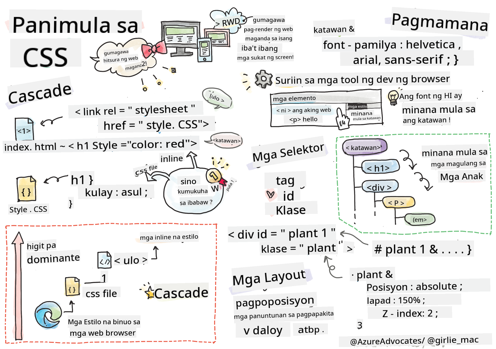
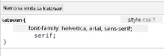

<!--
CO_OP_TRANSLATOR_METADATA:
{
  "original_hash": "acb5ae00cde004304296bb97da8ff4c3",
  "translation_date": "2025-08-28T15:49:53+00:00",
  "source_file": "3-terrarium/2-intro-to-css/README.md",
  "language_code": "tl"
}
-->
# Terrarium Project Part 2: Panimula sa CSS


> Sketchnote ni [Tomomi Imura](https://twitter.com/girlie_mac)

## Pre-Lecture Quiz

[Pre-lecture quiz](https://ff-quizzes.netlify.app/web/quiz/17)

### Panimula

Ang CSS, o Cascading Style Sheets, ay naglutas ng mahalagang problema sa web development: kung paano gawing maganda ang hitsura ng iyong website. Ang pag-istilo ng iyong mga app ay nagpapaganda sa kanilang usability at hitsura; maaari mo ring gamitin ang CSS upang lumikha ng Responsive Web Design (RWD) - na nagpapahintulot sa iyong mga app na magmukhang maganda anuman ang laki ng screen kung saan sila ipinapakita. Ang CSS ay hindi lamang tungkol sa pagpapaganda ng hitsura ng iyong app; kasama sa spec nito ang mga animation at transform na maaaring magbigay-daan sa mas sopistikadong interaksyon para sa iyong mga app. Ang CSS Working Group ang tumutulong sa pagpapanatili ng kasalukuyang mga CSS specification; maaari mong sundan ang kanilang trabaho sa [site ng World Wide Web Consortium](https://www.w3.org/Style/CSS/members).

> Tandaan, ang CSS ay isang wika na patuloy na nagbabago, tulad ng lahat ng bagay sa web, at hindi lahat ng browser ay sumusuporta sa mga mas bagong bahagi ng specification. Palaging suriin ang iyong mga implementasyon sa pamamagitan ng pagbisita sa [CanIUse.com](https://caniuse.com).

Sa araling ito, magdadagdag tayo ng mga estilo sa ating online terrarium at matututo pa tungkol sa ilang mga konsepto ng CSS: ang cascade, inheritance, at ang paggamit ng selectors, positioning, at paggamit ng CSS upang bumuo ng mga layout. Sa proseso, ilalayout natin ang terrarium at gagawin ang aktwal na terrarium mismo.

### Paunang Kailangan

Dapat mayroon ka nang HTML para sa iyong terrarium na handa nang istiluhin.

> Panoorin ang video

> 
> [](https://www.youtube.com/watch?v=6yIdOIV9p1I)

### Gawain

Sa iyong terrarium folder, gumawa ng bagong file na tinatawag na `style.css`. I-import ang file na iyon sa seksyong `<head>`:

```html
<link rel="stylesheet" href="./style.css" />
```

---

## Ang Cascade

Ang Cascading Style Sheets ay nagtataglay ng ideya na ang mga estilo ay 'nagka-cascade' kung saan ang aplikasyon ng isang estilo ay ginagabayan ng kanyang priority. Ang mga estilo na itinakda ng may-akda ng website ay may mas mataas na priority kaysa sa mga itinakda ng browser. Ang mga estilo na itinakda 'inline' ay may mas mataas na priority kaysa sa mga itinakda sa isang external style sheet.

### Gawain

Magdagdag ng inline style na "color: red" sa iyong `<h1>` tag:

```HTML
<h1 style="color: red">My Terrarium</h1>
```

Pagkatapos, idagdag ang sumusunod na code sa iyong `style.css` file:

```CSS
h1 {
 color: blue;
}
```

✅ Anong kulay ang lumalabas sa iyong web app? Bakit? Maaari mo bang hanapin ang paraan upang i-override ang mga estilo? Kailan mo gustong gawin ito, o bakit hindi?

---

## Inheritance

Ang mga estilo ay namamana mula sa isang ancestor style patungo sa isang descendent, kung saan ang mga nested na elemento ay namamana ang mga estilo ng kanilang mga magulang.

### Gawain

Itakda ang font ng body sa isang ibinigay na font, at suriin kung ang font ng isang nested na elemento:

```CSS
body {
	font-family: helvetica, arial, sans-serif;
}
```

Buksan ang console ng iyong browser sa tab na 'Elements' at obserbahan ang font ng H1. Namamana nito ang font mula sa body, tulad ng nakasaad sa loob ng browser:



✅ Maaari mo bang gawing iba ang property na namamana ng isang nested na estilo?

---

## CSS Selectors

### Tags

Sa ngayon, ang iyong `style.css` file ay may kaunting mga tag na may estilo, at mukhang kakaiba ang app:

```CSS
body {
	font-family: helvetica, arial, sans-serif;
}

h1 {
	color: #3a241d;
	text-align: center;
}
```

Ang ganitong paraan ng pag-istilo ng isang tag ay nagbibigay sa iyo ng kontrol sa mga natatanging elemento, ngunit kailangan mong kontrolin ang mga estilo ng maraming halaman sa iyong terrarium. Upang gawin ito, kailangan mong gamitin ang mga CSS selectors.

### Ids

Magdagdag ng ilang estilo upang ilayout ang mga kaliwa at kanang container. Dahil may isa lamang kaliwang container at isa lamang kanang container, binigyan sila ng mga id sa markup. Upang istiluhin ang mga ito, gamitin ang `#`:

```CSS
#left-container {
	background-color: #eee;
	width: 15%;
	left: 0px;
	top: 0px;
	position: absolute;
	height: 100%;
	padding: 10px;
}

#right-container {
	background-color: #eee;
	width: 15%;
	right: 0px;
	top: 0px;
	position: absolute;
	height: 100%;
	padding: 10px;
}
```

Dito, inilagay mo ang mga container na ito gamit ang absolute positioning sa dulong kaliwa at kanan ng screen, at ginamit ang mga porsyento para sa kanilang lapad upang mag-scale para sa maliliit na mobile screen.

✅ Ang code na ito ay medyo paulit-ulit, kaya hindi "DRY" (Don't Repeat Yourself); maaari mo bang hanapin ang mas mahusay na paraan upang istiluhin ang mga id na ito, marahil gamit ang isang id at isang class? Kailangan mong baguhin ang markup at i-refactor ang CSS:

```html
<div id="left-container" class="container"></div>
```

### Classes

Sa halimbawa sa itaas, istinilo mo ang dalawang natatanging elemento sa screen. Kung gusto mong ang mga estilo ay mag-apply sa maraming elemento sa screen, maaari kang gumamit ng mga CSS classes. Gawin ito upang ilayout ang mga halaman sa kaliwa at kanang container.

Pansinin na ang bawat halaman sa HTML markup ay may kombinasyon ng mga id at class. Ang mga id dito ay ginagamit ng JavaScript na idadagdag mo sa susunod upang manipulahin ang paglalagay ng halaman sa terrarium. Ang mga class, gayunpaman, ay nagbibigay sa lahat ng halaman ng isang ibinigay na estilo.

```html
<div class="plant-holder">
	
</div>
```

Idagdag ang sumusunod sa iyong `style.css` file:

```CSS
.plant-holder {
	position: relative;
	height: 13%;
	left: -10px;
}

.plant {
	position: absolute;
	max-width: 150%;
	max-height: 150%;
	z-index: 2;
}
```

Kapansin-pansin sa snippet na ito ang halo ng relative at absolute positioning, na tatalakayin natin sa susunod na seksyon. Tingnan ang paraan ng paghawak sa mga taas gamit ang mga porsyento:

Itinakda mo ang taas ng plant holder sa 13%, isang magandang numero upang matiyak na ang lahat ng halaman ay ipinapakita sa bawat vertical container nang walang pangangailangan para sa pag-scroll.

Itinakda mo ang plant holder na lumipat sa kaliwa upang ang mga halaman ay mas nakasentro sa kanilang container. Ang mga imahe ay may malaking dami ng transparent na background upang gawing mas madaling i-drag, kaya kailangang itulak sa kaliwa upang mas magkasya sa screen.

Pagkatapos, ang halaman mismo ay binigyan ng max-width na 150%. Pinapayagan nito itong mag-scale pababa habang ang browser ay nag-scale pababa. Subukang i-resize ang iyong browser; nananatili ang mga halaman sa kanilang mga container ngunit nag-scale pababa upang magkasya.

Kapansin-pansin din ang paggamit ng z-index, na kumokontrol sa relative altitude ng isang elemento (upang ang mga halaman ay nakaupo sa ibabaw ng container at mukhang nakaupo sa loob ng terrarium).

✅ Bakit kailangan mo ng parehong plant holder at plant CSS selector?

## CSS Positioning

Ang paghahalo ng mga position properties (may static, relative, fixed, absolute, at sticky positions) ay maaaring medyo mahirap, ngunit kapag ginawa nang maayos, nagbibigay ito ng magandang kontrol sa mga elemento sa iyong mga pahina.

Ang mga absolute positioned na elemento ay nakaposisyon batay sa kanilang pinakamalapit na positioned na ancestor, at kung wala, ito ay nakaposisyon ayon sa document body.

Ang mga relative positioned na elemento ay nakaposisyon batay sa direksyon ng CSS upang ayusin ang kanilang placement mula sa kanilang initial position.

Sa ating halimbawa, ang `plant-holder` ay isang relative-positioned na elemento na nakaposisyon sa loob ng isang absolute-positioned na container. Ang resultant behavior ay ang mga sidebar container ay naka-pin sa kaliwa at kanan, at ang plant-holder ay nested, ina-adjust ang sarili sa loob ng mga sidebar, nagbibigay ng espasyo para sa mga halaman na ilagay sa isang vertical row.

> Ang `plant` mismo ay mayroon ding absolute positioning, na kinakailangan upang gawing draggable ito, tulad ng matutuklasan mo sa susunod na aralin.

✅ Subukan ang pagpapalit ng mga uri ng positioning ng mga side container at ng plant-holder. Ano ang nangyayari?

## CSS Layouts

Ngayon ay gagamitin mo ang natutunan upang buuin ang terrarium mismo, lahat gamit ang CSS!

Una, istiluhin ang mga anak ng `.terrarium` div bilang isang rounded rectangle gamit ang CSS:

```CSS
.jar-walls {
	height: 80%;
	width: 60%;
	background: #d1e1df;
	border-radius: 1rem;
	position: absolute;
	bottom: 0.5%;
	left: 20%;
	opacity: 0.5;
	z-index: 1;
}

.jar-top {
	width: 50%;
	height: 5%;
	background: #d1e1df;
	position: absolute;
	bottom: 80.5%;
	left: 25%;
	opacity: 0.7;
	z-index: 1;
}

.jar-bottom {
	width: 50%;
	height: 1%;
	background: #d1e1df;
	position: absolute;
	bottom: 0%;
	left: 25%;
	opacity: 0.7;
}

.dirt {
	width: 60%;
	height: 5%;
	background: #3a241d;
	position: absolute;
	border-radius: 0 0 1rem 1rem;
	bottom: 1%;
	left: 20%;
	opacity: 0.7;
	z-index: -1;
}
```

Pansinin ang paggamit ng mga porsyento dito. Kung i-scale mo ang iyong browser pababa, makikita mo kung paano nag-scale ang jar. Pansinin din ang mga lapad at taas na porsyento para sa mga elemento ng jar at kung paano ang bawat elemento ay absolutely positioned sa gitna, naka-pin sa ilalim ng viewport.

Gumagamit din tayo ng `rem` para sa border-radius, isang font-relative length. Basahin pa ang tungkol sa ganitong uri ng relative measurement sa [CSS spec](https://www.w3.org/TR/css-values-3/#font-relative-lengths).

✅ Subukang baguhin ang mga kulay at opacity ng jar kumpara sa mga nasa lupa. Ano ang nangyayari? Bakit?

---

## 🚀Hamunin

Magdagdag ng 'bubble' shine sa kaliwang ibabang bahagi ng jar upang magmukhang mas parang salamin. Istiluhin ang `.jar-glossy-long` at `.jar-glossy-short` upang magmukhang reflected shine. Ganito ang magiging hitsura:


Upang makumpleto ang post-lecture quiz, dumaan sa Learn module na ito: [Style your HTML app with CSS](https://docs.microsoft.com/learn/modules/build-simple-website/4-css-basics/?WT.mc_id=academic-77807-sagibbon)

## Post-Lecture Quiz

[Post-lecture quiz](https://ff-quizzes.netlify.app/web/quiz/18)

## Review at Pag-aaral sa Sarili

Ang CSS ay mukhang simple, ngunit maraming hamon kapag sinusubukang istiluhin ang isang app nang perpekto para sa lahat ng browser at lahat ng laki ng screen. Ang CSS-Grid at Flexbox ay mga tool na na-develop upang gawing mas structured at mas maaasahan ang trabaho. Matuto tungkol sa mga tool na ito sa pamamagitan ng paglalaro ng [Flexbox Froggy](https://flexboxfroggy.com/) at [Grid Garden](https://codepip.com/games/grid-garden/).

## Takdang-Aralin

[CSS Refactoring](assignment.md)

---

**Paunawa**:  
Ang dokumentong ito ay isinalin gamit ang AI translation service na [Co-op Translator](https://github.com/Azure/co-op-translator). Bagama't sinisikap naming maging tumpak, tandaan na ang mga awtomatikong pagsasalin ay maaaring maglaman ng mga pagkakamali o hindi pagkakatugma. Ang orihinal na dokumento sa kanyang katutubong wika ang dapat ituring na opisyal na sanggunian. Para sa mahalagang impormasyon, inirerekomenda ang propesyonal na pagsasalin ng tao. Hindi kami mananagot sa anumang hindi pagkakaunawaan o maling interpretasyon na dulot ng paggamit ng pagsasaling ito.