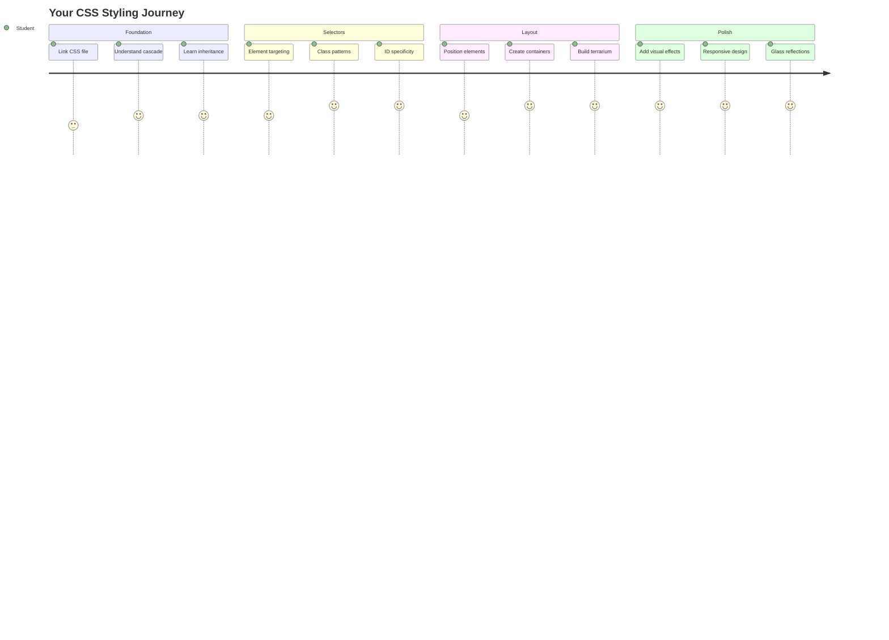
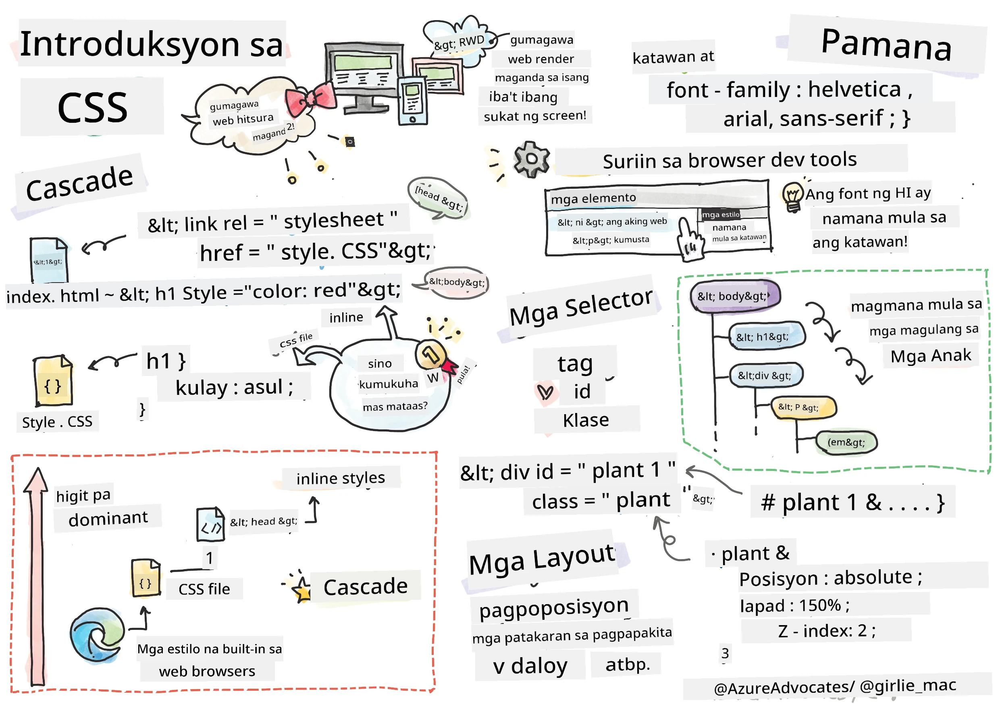
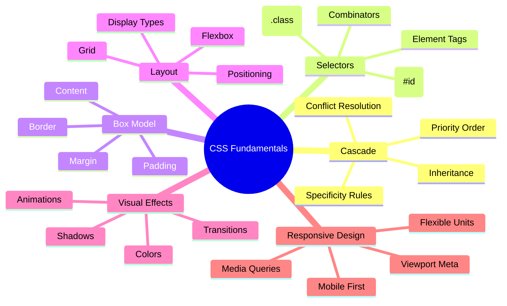
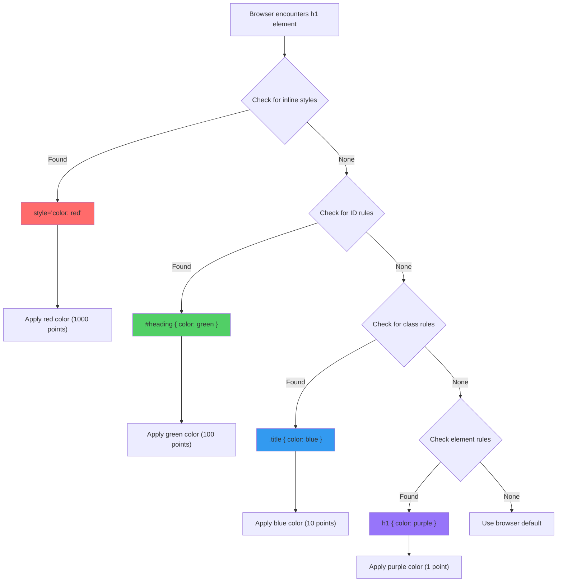
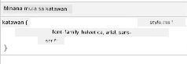
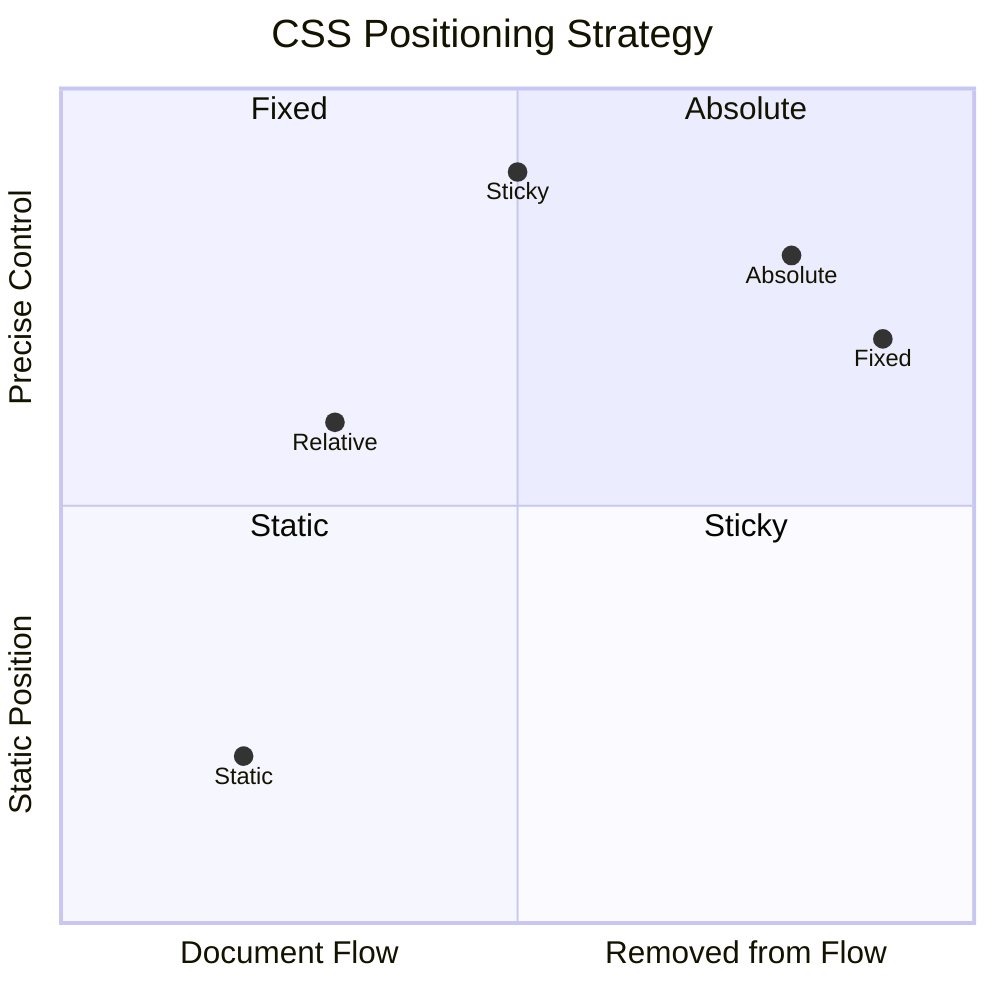
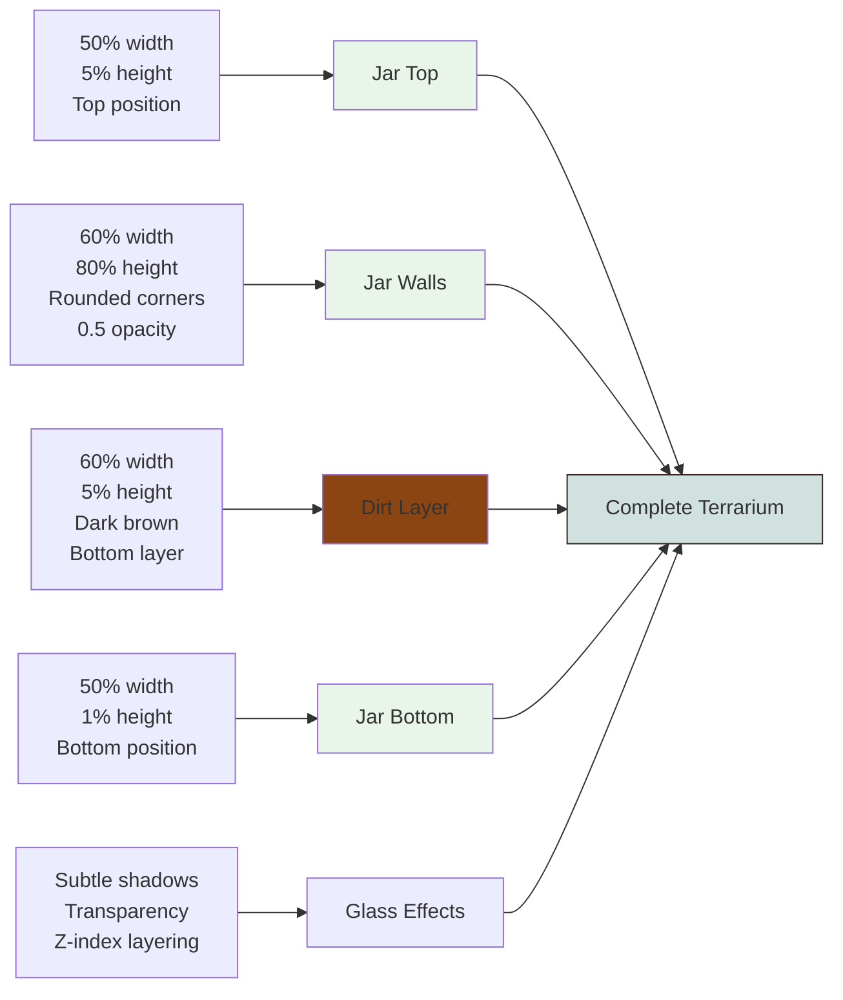
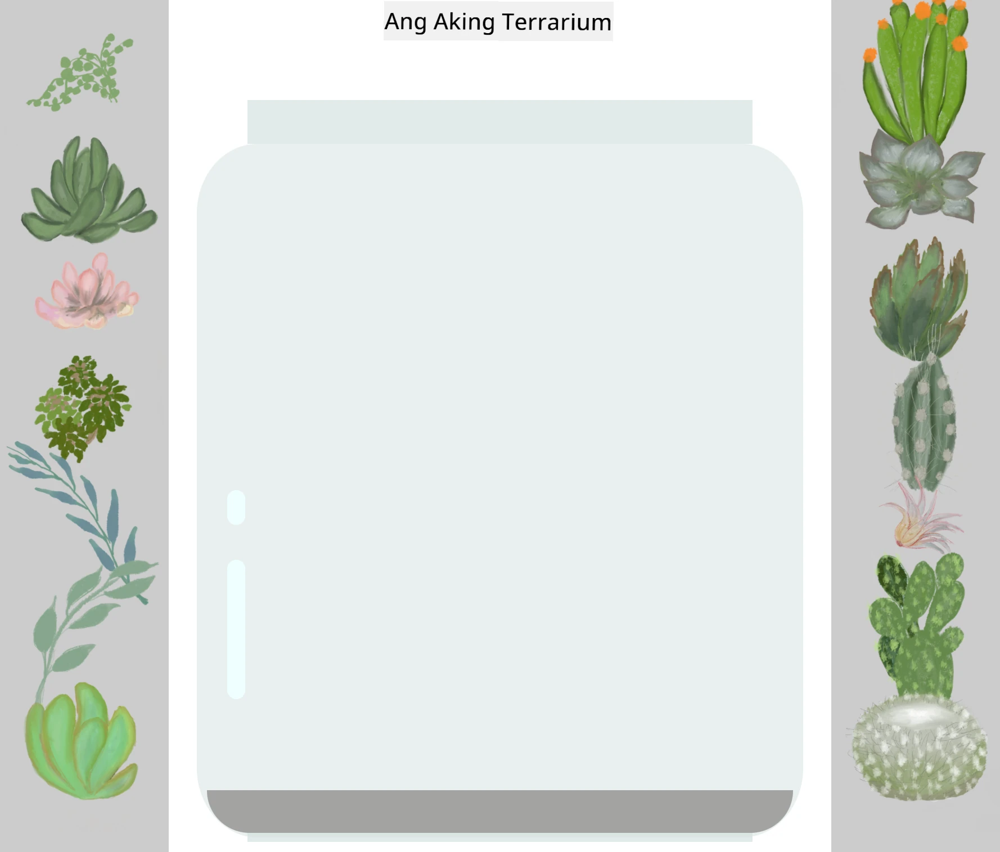
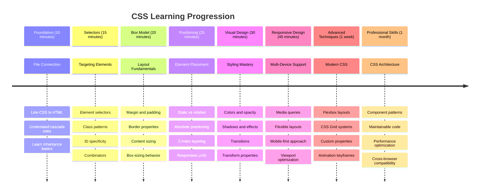

<!--
CO_OP_TRANSLATOR_METADATA:
{
  "original_hash": "e39f3a4e3bcccf94639e3af1248f8a4d",
  "translation_date": "2025-11-03T13:56:26+00:00",
  "source_file": "3-terrarium/2-intro-to-css/README.md",
  "language_code": "tl"
}
-->
# Terrarium Project Part 2: Panimula sa CSS




> Sketchnote ni [Tomomi Imura](https://twitter.com/girlie_mac)

Naalala mo ba kung gaano kasimple ang hitsura ng iyong HTML terrarium? Sa CSS, binabago natin ang simpleng istruktura na iyon upang maging mas kaakit-akit sa paningin.

Kung ang HTML ay parang paggawa ng balangkas ng isang bahay, ang CSS naman ang lahat ng nagbibigay ng ganda at ginhawa - ang kulay ng pintura, ang ayos ng mga kasangkapan, ang ilaw, at kung paano magkakaugnay ang mga silid. Isipin kung paano nagsimula ang Palasyo ng Versailles bilang isang simpleng hunting lodge, ngunit sa maingat na pag-aayos at disenyo, naging isa ito sa pinakamagnificenteng gusali sa mundo.

Ngayon, babaguhin natin ang iyong terrarium mula sa functional patungo sa polished. Matututo kang magposisyon ng mga elemento nang eksakto, gawing responsive ang mga layout sa iba't ibang laki ng screen, at lumikha ng visual na kaakit-akit na nagpapaganda sa mga website.

Sa pagtatapos ng araling ito, makikita mo kung paano ang maingat na CSS styling ay maaaring lubos na mapaganda ang iyong proyekto. Simulan na natin ang pagdaragdag ng estilo sa iyong terrarium.



## Pre-Lecture Quiz

[Pre-lecture quiz](https://ff-quizzes.netlify.app/web/quiz/17)

## Pagsisimula sa CSS

Madalas iniisip na ang CSS ay para lang sa "pagpapaganda ng mga bagay," ngunit mas malawak ang layunin nito. Ang CSS ay parang direktor ng pelikula - kontrolado mo hindi lang ang hitsura ng lahat, kundi pati ang galaw, tugon sa interaksyon, at pag-aangkop sa iba't ibang sitwasyon.

Ang modernong CSS ay napaka-kakayahan. Maaari kang magsulat ng code na awtomatikong ina-adjust ang mga layout para sa mga telepono, tablet, at desktop computer. Maaari kang lumikha ng makinis na animasyon na umaakit sa atensyon ng mga user kung kinakailangan. Ang resulta ay maaaring maging kahanga-hanga kapag ang lahat ay nagtutulungan.

> 💡 **Pro Tip**: Ang CSS ay patuloy na nagbabago sa mga bagong tampok at kakayahan. Palaging suriin ang [CanIUse.com](https://caniuse.com) upang tiyakin ang suporta ng browser para sa mga bagong tampok ng CSS bago ito gamitin sa mga production project.

**Narito ang mga layunin natin sa araling ito:**
- **Lumikha** ng kumpletong visual na disenyo para sa iyong terrarium gamit ang modernong mga teknik sa CSS
- **Tuklasin** ang mga pangunahing konsepto tulad ng cascade, inheritance, at CSS selectors
- **Ipatupad** ang mga responsive na estratehiya sa pagposisyon at layout
- **Bumuo** ng terrarium container gamit ang CSS shapes at styling

### Paunang Kaalaman

Dapat ay natapos mo na ang HTML na istruktura para sa iyong terrarium mula sa nakaraang aralin at handa na itong i-style.

> 📺 **Video Resource**: Tingnan ang kapaki-pakinabang na video walkthrough
>
> [](https://www.youtube.com/watch?v=6yIdOIV9p1I)

### Pag-set Up ng Iyong CSS File

Bago tayo magsimulang mag-style, kailangan nating ikonekta ang CSS sa ating HTML. Ang koneksyon na ito ang nagsasabi sa browser kung saan hahanapin ang mga tagubilin sa pag-style para sa ating terrarium.

Sa iyong terrarium folder, gumawa ng bagong file na tinatawag na `style.css`, pagkatapos ay i-link ito sa `<head>` section ng iyong HTML document:

```html
<link rel="stylesheet" href="./style.css" />
```

**Narito ang ginagawa ng code na ito:**
- **Lumilikha** ng koneksyon sa pagitan ng iyong HTML at CSS files
- **Sinasabi** sa browser na i-load at i-apply ang mga style mula sa `style.css`
- **Gumagamit** ng `rel="stylesheet"` na attribute upang tukuyin na ito ay isang CSS file
- **Tinutukoy** ang file path gamit ang `href="./style.css"`

## Pag-unawa sa CSS Cascade

Naisip mo na ba kung bakit tinawag na "Cascading" Style Sheets ang CSS? Ang mga style ay bumababa tulad ng talon, at minsan nagkakaroon ng salungatan sa isa't isa.

Isipin kung paano gumagana ang istruktura ng utos sa militar - maaaring sabihin ng pangkalahatang utos na "lahat ng tropa ay magsuot ng berde," ngunit ang tiyak na utos sa iyong yunit ay maaaring magsabi na "magsuot ng dress blues para sa seremonya." Ang mas tiyak na utos ang masusunod. Ang CSS ay sumusunod sa katulad na lohika, at ang pag-unawa sa hierarchy na ito ay nagpapadali sa pag-debug.

### Pagsubok sa Cascade Priority

Tingnan natin ang cascade sa aksyon sa pamamagitan ng paglikha ng style conflict. Una, magdagdag ng inline style sa iyong `<h1>` tag:

```html
<h1 style="color: red">My Terrarium</h1>
```

**Ano ang ginagawa ng code na ito:**
- **Nag-aapply** ng red na kulay direkta sa `<h1>` element gamit ang inline styling
- **Gumagamit** ng `style` attribute upang mag-embed ng CSS direkta sa HTML
- **Lumilikha** ng pinakamataas na priority na style rule para sa partikular na element na ito

Susunod, idagdag ang rule na ito sa iyong `style.css` file:

```css
h1 {
  color: blue;
}
```

**Sa itaas, ginawa natin:**
- **Nag-defina** ng CSS rule na target ang lahat ng `<h1>` elements
- **Nag-set** ng text color sa blue gamit ang external stylesheet
- **Lumilikha** ng mas mababang priority rule kumpara sa inline styles

✅ **Knowledge Check**: Anong kulay ang makikita sa iyong web app? Bakit iyon ang nanalo? Makakaisip ka ba ng mga sitwasyon kung saan nais mong i-override ang mga style?



> 💡 **CSS Priority Order (pinakamataas hanggang pinakamababa):**
> 1. **Inline styles** (style attribute)
> 2. **IDs** (#myId)
> 3. **Classes** (.myClass) at attributes
> 4. **Element selectors** (h1, div, p)
> 5. **Browser defaults**

## CSS Inheritance sa Aksyon

Ang CSS inheritance ay gumagana tulad ng genetics - ang mga elemento ay nagmamana ng ilang properties mula sa kanilang parent elements. Kung mag-set ka ng font family sa body element, lahat ng text sa loob ay awtomatikong gagamit ng parehong font. Parang kung paano ang natatanging jawline ng pamilya Habsburg ay lumitaw sa iba't ibang henerasyon nang hindi tinukoy para sa bawat indibidwal.

Gayunpaman, hindi lahat ay namamana. Ang mga text styles tulad ng fonts at colors ay namamana, ngunit ang mga layout properties tulad ng margins at borders ay hindi. Parang ang mga anak ay maaaring magmana ng pisikal na katangian ngunit hindi ang fashion choices ng kanilang mga magulang.

### Pagmamasid sa Font Inheritance

Tingnan natin ang inheritance sa aksyon sa pamamagitan ng pag-set ng font family sa `<body>` element:

```css
body {
  font-family: 'Segoe UI', Tahoma, Geneva, Verdana, sans-serif;
}
```

**Pagpapaliwanag sa nangyayari dito:**
- **Nag-set** ng font family para sa buong page sa pamamagitan ng pag-target sa `<body>` element
- **Gumagamit** ng font stack na may fallback options para sa mas mahusay na browser compatibility
- **Nag-aapply** ng modernong system fonts na maganda ang hitsura sa iba't ibang operating systems
- **Tinitiyak** na lahat ng child elements ay magmamana ng font maliban kung partikular na na-override

Buksan ang developer tools ng iyong browser (F12), pumunta sa Elements tab, at i-inspect ang iyong `<h1>` element. Makikita mo na namamana nito ang font family mula sa body:



✅ **Experiment Time**: Subukang mag-set ng iba pang inheritable properties sa `<body>` tulad ng `color`, `line-height`, o `text-align`. Ano ang nangyayari sa iyong heading at iba pang elemento?

> 📝 **Mga Namamanang Properties**: `color`, `font-family`, `font-size`, `line-height`, `text-align`, `visibility`
>
> **Mga Hindi Namamanang Properties**: `margin`, `padding`, `border`, `width`, `height`, `position`

### 🔄 **Pedagogical Check-in**
**Pag-unawa sa CSS Foundation**: Bago lumipat sa selectors, tiyakin na kaya mong:
- ✅ Ipaliwanag ang pagkakaiba ng cascade at inheritance
- ✅ Hulaan kung aling style ang mananalo sa specificity conflict
- ✅ Tukuyin kung aling properties ang namamana mula sa parent elements
- ✅ Ikonekta ang CSS files sa HTML nang maayos

**Quick Test**: Kung mayroon kang mga style na ito, anong kulay ang magiging `<h1>` sa loob ng `<div class="special">`?
```css
div { color: blue; }
.special { color: green; }
h1 { color: red; }
```
*Sagot: Pula (element selector na direktang nagta-target sa h1)*

## Pag-master ng CSS Selectors

Ang CSS selectors ang paraan mo para i-target ang partikular na mga elemento para sa styling. Gumagana ito tulad ng pagbibigay ng eksaktong direksyon - sa halip na sabihing "ang bahay," maaari mong sabihin "ang asul na bahay na may pulang pinto sa Maple Street."

Nagbibigay ang CSS ng iba't ibang paraan para maging tiyak, at ang pagpili ng tamang selector ay parang pagpili ng tamang tool para sa gawain. Minsan kailangan mong i-style ang bawat pinto sa kapitbahayan, at minsan isang partikular na pinto lang.

### Element Selectors (Tags)

Ang element selectors ay nagta-target ng HTML elements sa pamamagitan ng kanilang tag name. Perpekto ang mga ito para sa pag-set ng base styles na malawak na ina-apply sa iyong page:

```css
body {
  font-family: 'Segoe UI', Tahoma, Geneva, Verdana, sans-serif;
  margin: 0;
  padding: 0;
}

h1 {
  color: #3a241d;
  text-align: center;
  font-size: 2.5rem;
  margin-bottom: 1rem;
}
```

**Pag-unawa sa mga style na ito:**
- **Nag-set** ng consistent na typography sa buong page gamit ang `body` selector
- **Nag-aalis** ng default na browser margins at padding para sa mas mahusay na kontrol
- **Nag-style** ng lahat ng heading elements gamit ang kulay, alignment, at spacing
- **Gumagamit** ng `rem` units para sa scalable, accessible na font sizing

Habang ang element selectors ay mahusay para sa pangkalahatang styling, kakailanganin mo ng mas tiyak na selectors para i-style ang mga indibidwal na bahagi tulad ng mga halaman sa iyong terrarium.

### ID Selectors para sa Natatanging Mga Elemento

Ang ID selectors ay gumagamit ng `#` symbol at nagta-target ng mga elemento na may partikular na `id` attributes. Dahil ang IDs ay dapat na natatangi sa isang page, perpekto ang mga ito para sa pag-style ng mga indibidwal, espesyal na elemento tulad ng ating left at right plant containers.

Gumawa tayo ng styling para sa mga side containers ng terrarium kung saan maninirahan ang mga halaman:

```css
#left-container {
  background-color: #f5f5f5;
  width: 15%;
  left: 0;
  top: 0;
  position: absolute;
  height: 100vh;
  padding: 1rem;
  box-sizing: border-box;
}

#right-container {
  background-color: #f5f5f5;
  width: 15%;
  right: 0;
  top: 0;
  position: absolute;
  height: 100vh;
  padding: 1rem;
  box-sizing: border-box;
}
```

**Narito ang nagagawa ng code na ito:**
- **Nagpo-posisyon** ng mga container sa dulong kaliwa at kanan gamit ang `absolute` positioning
- **Gumagamit** ng `vh` (viewport height) units para sa responsive na height na umaangkop sa laki ng screen
- **Nag-aapply** ng `box-sizing: border-box` upang maisama ang padding sa kabuuang width
- **Nag-aalis** ng hindi kinakailangang `px` units mula sa zero values para sa mas malinis na code
- **Nag-set** ng subtle na background color na mas magaan sa mata kaysa sa matinding gray

✅ **Code Quality Challenge**: Pansinin kung paano nilalabag ng CSS na ito ang prinsipyo ng DRY (Don't Repeat Yourself). Maaari mo bang i-refactor ito gamit ang parehong ID at class?

**Pinahusay na approach:**
```html
<div id="left-container" class="container"></div>
<div id="right-container" class="container"></div>
```

```css
.container {
  background-color: #f5f5f5;
  width: 15%;
  top: 0;
  position: absolute;
  height: 100vh;
  padding: 1rem;
  box-sizing: border-box;
}

#left-container {
  left: 0;
}

#right-container {
  right: 0;
}
```

### Class Selectors para sa Reusable Styles

Ang class selectors ay gumagamit ng `.` symbol at perpekto kapag nais mong i-apply ang parehong styles sa maraming elemento. Hindi tulad ng IDs, ang classes ay maaaring gamitin nang paulit-ulit sa iyong HTML, na ginagawa itong ideal para sa consistent na styling patterns.

Sa ating terrarium, bawat halaman ay nangangailangan ng parehong styling ngunit kailangan din ng indibidwal na posisyon. Gagamit tayo ng kombinasyon ng classes para sa shared styles at IDs para sa unique na posisyon.

**Narito ang HTML structure para sa bawat halaman:**
```html
<div class="plant-holder">
  
</div>
```

**Mga pangunahing elemento na ipinaliwanag:**
- **Gumagamit** ng `class="plant-holder"` para sa consistent na container styling sa lahat ng halaman
- **Nag-aapply** ng `class="plant"` para sa shared image styling at behavior
- **Naglalaman** ng unique na `id="plant1"` para sa indibidwal na posisyon at JavaScript interaction
- **Nagbibigay** ng descriptive na alt text para sa accessibility ng screen reader

Ngayon, idagdag ang mga style na ito sa iyong `style.css` file:

```css
.plant-holder {
  position: relative;
  height: 13%;
  left: -0.6rem;
}

.plant {
  position: absolute;
  max-width: 150%;
  max-height: 150%;
  z-index: 2;
  transition: transform 0.3s ease;
}

.plant:hover {
  transform: scale(1.05);
}
```

**Pagpapaliwanag sa mga style na ito:**
- **Lumilikha** ng relative positioning para sa plant holder upang magtatag ng positioning context
- **Nag-set** ng bawat plant holder sa 13% height, tinitiyak na lahat ng halaman ay magkasya nang patayo nang walang scrolling
- **Nag-shift** ng holders bahagyang kaliwa upang mas ma-center ang mga halaman sa kanilang containers
- **Nagpapahintulot** sa mga halaman na mag-scale nang responsive gamit ang `max-width` at `max-height` properties
- **Gumagamit** ng `z-index` upang i-layer ang mga halaman sa ibabaw ng ibang elemento sa terrarium
- **Nagdadagdag** ng subtle na hover effect gamit ang CSS transitions para sa mas mahusay na user interaction

✅ **Critical Thinking**: Bakit kailangan natin ang parehong `.plant-holder` at `.plant` selectors? Ano ang mangyayari kung subukan nating gumamit ng isa lang?

> 💡 **Design Pattern**: Ang container (`.plant-holder`) ang nagkokontrol sa layout at posisyon, habang ang content (`.plant`) ang nagkokontrol sa hitsura at scaling. Ang paghihiwalay na ito ay nagpapadali sa pag-maintain at flexibility ng code.

## Pag-unawa sa CSS Positioning

Ang CSS positioning ay parang pagiging stage director ng isang play - ikaw ang nagdidirekta kung saan tatayo ang bawat aktor at kung paano sila gagalaw sa entablado. Ang ilang aktor ay sumusunod sa standard formation, habang ang iba ay nangangailangan ng partikular na posisyon para sa dramatic effect.

Kapag naintindihan mo ang positioning, maraming layout challenges ang nagiging mas madali. Kailangan mo ba ng navigation bar na nananatili sa itaas habang nag-scroll ang user? Ang positioning ang bahala diyan. Gusto mo ba ng tooltip na lumilitaw sa partikular na lokasyon? Positioning din ang sagot.

### Ang Limang Position Values



| Position Value | Pag-uugali | Gamit |
|----------------|------------|-------|
| `static` | Default flow, hindi pinapansin ang top/left/right/bottom | Normal na layout ng dokumento |
| `relative` | Nakaposisyon kaugnay sa normal na posisyon nito | Maliit na adjustments, paglikha ng positioning context |
| `absolute` | Nakaposisyon kaugnay sa pinakamalapit na positioned ancestor | Eksaktong paglalagay, overlays |
| `fixed` | Nakaposisyon kaugnay sa viewport | Navigation bars, floating elements |
| `sticky` | Nagpapalit sa pagitan ng relative at fixed base sa scroll | Headers na nananatili habang nag-scroll |

### Positioning sa Ating Terrarium

Ang terrarium natin ay gumagamit ng strategic na kombinasyon ng positioning types upang makamit ang nais na layout:

```css
/* Container positioning */
.container {
  position: absolute; /* Removes from normal flow */
  /* ... other styles ... */
}

/* Plant holder positioning */
.plant-holder {
  position: relative; /* Creates positioning context */
  /* ... other styles ... */
}

/* Plant positioning */
.plant {
  position: absolute; /* Allows precise placement within holder */
  /* ... other styles ... */
}
```

**Pag-unawa sa positioning strategy:**
- **Absolute containers** ay tinanggal sa normal na document flow at naka-pin sa mga gilid ng screen
- **Relative plant holders** ay lumilikha ng positioning context habang nananatili sa document flow
- **Absolute plants** ay maaaring i-posisyon nang eksakto sa loob ng kanilang relative containers
- **Ang kombinasyong ito** ay nagpapahintulot sa mga halaman na mag-stack nang patayo habang maaaring i-posisyon nang indibidwal

> 🎯 **Bakit Mahalaga Ito**: Ang `plant` elements ay nangangailangan ng absolute positioning upang maging draggable sa susunod na aralin. Ang absolute positioning ay nag-aalis sa kanila sa normal na layout flow, na ginagawang posible ang drag-and-drop interactions.

✅ **Experiment Time**: Subukang baguhin ang positioning values at obserbahan ang resulta:
- Ano ang mangyayari kung baguhin mo ang `.container` mula `absolute` patungong `relative`?
- Paano nagbabago ang layout kung ang `.plant-holder` ay gagamit ng `absolute` sa halip na `relative`?
- Ano ang mangyayari kapag binago ang `.plant` sa `relative` positioning?

### 🔄 **Pedagogical Check-in**
**Mastery sa CSS Positioning**: Huminto sandali upang suriin ang iyong kaalaman:
- ✅ Kaya mo bang ipaliwanag kung bakit kailangan ng absolute positioning ang mga halaman para sa drag-and-drop?
- ✅ Nauunawaan mo ba kung paano ang mga relative containers ay lumilikha ng positioning context?
- ✅ Bakit gumagamit ng absolute positioning ang mga side containers?
- ✅ Ano ang mangyayari kung aalisin mo ang mga deklarasyon ng position?

**Koneksyon sa Tunay na Mundo**: Isipin kung paano ginagaya ng CSS positioning ang layout sa totoong buhay:
- **Static**: Mga libro sa istante (natural na pagkakaayos)
- **Relative**: Paggalaw ng libro nang bahagya ngunit nananatili sa lugar nito
- **Absolute**: Paglalagay ng bookmark sa eksaktong pahina
- **Fixed**: Isang sticky note na nananatiling nakikita habang nagbabasa ng mga pahina

## Pagbuo ng Terrarium gamit ang CSS

Ngayon, gagawa tayo ng glass jar gamit lamang ang CSS - walang mga imahe o graphic software.

Ang paggawa ng realistic-looking glass, shadows, at depth effects gamit ang positioning at transparency ay nagpapakita ng kakayahan ng CSS sa visual design. Ang teknik na ito ay kahalintulad ng paraan ng mga arkitekto sa Bauhaus movement na gumamit ng simpleng geometric forms upang lumikha ng maganda at komplikadong istruktura. Kapag naintindihan mo ang mga prinsipyong ito, makikilala mo ang mga teknik ng CSS sa likod ng maraming disenyo ng web.



### Paglikha ng Mga Komponent ng Glass Jar

Gawin natin ang terrarium jar nang paisa-isa. Ang bawat bahagi ay gumagamit ng absolute positioning at percentage-based sizing para sa responsive design:

```css
.jar-walls {
  height: 80%;
  width: 60%;
  background: #d1e1df;
  border-radius: 1rem;
  position: absolute;
  bottom: 0.5%;
  left: 20%;
  opacity: 0.5;
  z-index: 1;
  box-shadow: inset 0 0 2rem rgba(0, 0, 0, 0.1);
}

.jar-top {
  width: 50%;
  height: 5%;
  background: #d1e1df;
  position: absolute;
  bottom: 80.5%;
  left: 25%;
  opacity: 0.7;
  z-index: 1;
  border-radius: 0.5rem 0.5rem 0 0;
}

.jar-bottom {
  width: 50%;
  height: 1%;
  background: #d1e1df;
  position: absolute;
  bottom: 0;
  left: 25%;
  opacity: 0.7;
  border-radius: 0 0 0.5rem 0.5rem;
}

.dirt {
  width: 60%;
  height: 5%;
  background: #3a241d;
  position: absolute;
  border-radius: 0 0 1rem 1rem;
  bottom: 1%;
  left: 20%;
  opacity: 0.7;
  z-index: -1;
}
```

**Pag-unawa sa konstruksyon ng terrarium:**
- **Gumagamit** ng percentage-based dimensions para sa responsive scaling sa lahat ng screen sizes
- **Nagpo-posisyon** ng mga elemento nang absolute upang ma-stack at ma-align nang eksakto
- **Nag-aaplay** ng iba't ibang opacity values upang lumikha ng glass transparency effect
- **Nagpapatupad** ng `z-index` layering upang ang mga halaman ay lumitaw sa loob ng jar
- **Nagdadagdag** ng subtle box-shadow at refined border-radius para sa mas realistic na hitsura

### Responsive Design gamit ang Percentages

Pansinin kung paano lahat ng dimensions ay gumagamit ng percentages sa halip na fixed pixel values:

**Bakit ito mahalaga:**
- **Tinitiyak** ang proportional scaling ng terrarium sa anumang screen size
- **Pinapanatili** ang visual relationships sa pagitan ng mga bahagi ng jar
- **Nagbibigay** ng consistent na karanasan mula sa mobile phones hanggang sa malalaking desktop monitors
- **Pinapayagan** ang disenyo na mag-adapt nang hindi nasisira ang visual layout

### CSS Units in Action

Gumagamit tayo ng `rem` units para sa border-radius, na nag-scale batay sa root font size. Ito ay lumilikha ng mas accessible na disenyo na iginagalang ang font preferences ng user. Alamin pa ang tungkol sa [CSS relative units](https://www.w3.org/TR/css-values-3/#font-relative-lengths) sa opisyal na spesipikasyon.

✅ **Visual Experimentation**: Subukang baguhin ang mga value na ito at obserbahan ang epekto:
- Baguhin ang jar opacity mula 0.5 hanggang 0.8 – paano nito naaapektuhan ang hitsura ng glass?
- Ayusin ang kulay ng lupa mula `#3a241d` hanggang `#8B4513` – anong visual na epekto ang nangyayari?
- Baguhin ang `z-index` ng lupa sa 2 – ano ang nangyayari sa layering?

### 🔄 **Pedagogical Check-in**
**Pag-unawa sa Visual Design ng CSS**: Kumpirmahin ang iyong kaalaman sa visual CSS:
- ✅ Paano lumilikha ng responsive design ang percentage-based dimensions?
- ✅ Bakit lumilikha ng transparency effect ang opacity?
- ✅ Anong papel ang ginagampanan ng z-index sa layering ng mga elemento?
- ✅ Paano lumilikha ng jar shape ang border-radius values?

**Prinsipyo ng Disenyo**: Pansinin kung paano tayo bumubuo ng komplikadong visuals mula sa simpleng hugis:
1. **Mga Rectangles** → **Mga Rounded Rectangles** → **Mga Komponent ng Jar**
2. **Flat Colors** → **Opacity** → **Glass Effect**
3. **Indibidwal na Elemento** → **Layered Composition** → **3D Appearance**

---

## Hamon ng GitHub Copilot Agent 🚀

Gamitin ang Agent mode upang tapusin ang sumusunod na hamon:

**Deskripsyon:** Gumawa ng CSS animation na nagpapagalaw sa mga halaman sa terrarium nang banayad, na parang hinahanginan. Ito ay makakatulong sa iyo na magpraktis ng CSS animations, transforms, at keyframes habang pinapaganda ang visual appeal ng terrarium.

**Prompt:** Magdagdag ng CSS keyframe animations upang ang mga halaman sa terrarium ay gumalaw nang banayad mula kaliwa hanggang kanan. Gumawa ng swaying animation na bahagyang nagro-rotate sa bawat halaman (2-3 degrees) pakaliwa at pakanan na may duration na 3-4 seconds, at i-apply ito sa `.plant` class. Siguraduhing ang animation ay mag-loop infinitely at may easing function para sa natural na galaw.

Alamin pa ang tungkol sa [agent mode](https://code.visualstudio.com/blogs/2025/02/24/introducing-copilot-agent-mode) dito.

## 🚀 Hamon: Pagdaragdag ng Glass Reflections

Handa ka na bang pagandahin ang iyong terrarium gamit ang realistic glass reflections? Ang teknik na ito ay magdadagdag ng depth at realism sa disenyo.

Gagawa ka ng subtle highlights na ginagaya kung paano nagre-reflect ang ilaw sa glass surfaces. Ang approach na ito ay kahalintulad ng paraan ng mga pintor noong Renaissance tulad ni Jan van Eyck na gumamit ng ilaw at reflection upang gawing three-dimensional ang painted glass. Narito ang layunin mo:



**Ang iyong hamon:**
- **Gumawa** ng subtle white o light-colored oval shapes para sa glass reflections
- **I-posisyon** ang mga ito nang maayos sa kaliwang bahagi ng jar
- **Mag-apply** ng tamang opacity at blur effects para sa realistic na light reflection
- **Gumamit** ng `border-radius` upang lumikha ng organic, bubble-like shapes
- **Mag-eksperimento** gamit ang gradients o box-shadows para sa mas pinong realism

## Post-Lecture Quiz

[Post-lecture quiz](https://ff-quizzes.netlify.app/web/quiz/18)

## Palawakin ang Iyong Kaalaman sa CSS

Ang CSS ay maaaring mukhang komplikado sa simula, ngunit ang pag-unawa sa mga pangunahing konsepto ay nagbibigay ng matibay na pundasyon para sa mas advanced na teknik.

**Ang iyong susunod na mga lugar ng pag-aaral sa CSS:**
- **Flexbox** - nagpapadali sa alignment at distribution ng mga elemento
- **CSS Grid** - nagbibigay ng makapangyarihang tools para sa paggawa ng komplikadong layouts
- **CSS Variables** - binabawasan ang pag-uulit at pinapabuti ang maintainability
- **Responsive design** - tinitiyak na gumagana nang maayos ang mga site sa iba't ibang screen sizes

### Mga Interactive na Learning Resources

Pagpraktisan ang mga konseptong ito gamit ang mga engaging, hands-on games:
- 🐸 [Flexbox Froggy](https://flexboxfroggy.com/) - Masterin ang Flexbox sa pamamagitan ng masayang hamon
- 🌱 [Grid Garden](https://codepip.com/games/grid-garden/) - Matutunan ang CSS Grid sa pamamagitan ng pagtatanim ng virtual na carrots
- 🎯 [CSS Battle](https://cssbattle.dev/) - Subukan ang iyong kakayahan sa CSS gamit ang coding challenges

### Karagdagang Pag-aaral

Para sa komprehensibong pundasyon sa CSS, kumpletuhin ang Microsoft Learn module na ito: [Style your HTML app with CSS](https://docs.microsoft.com/learn/modules/build-simple-website/4-css-basics/?WT.mc_id=academic-77807-sagibbon)

### ⚡ **Ano ang Pwede Mong Gawin sa Susunod na 5 Minuto**
- [ ] Buksan ang DevTools at inspeksyunin ang CSS styles sa anumang website gamit ang Elements panel
- [ ] Gumawa ng simpleng CSS file at i-link ito sa isang HTML page
- [ ] Subukang baguhin ang mga kulay gamit ang iba't ibang paraan: hex, RGB, at named colors
- [ ] Pagpraktisan ang box model sa pamamagitan ng pagdaragdag ng padding at margin sa isang div

### 🎯 **Ano ang Pwede Mong Makamit sa Loob ng Isang Oras**
- [ ] Kumpletuhin ang post-lesson quiz at repasuhin ang mga pundasyon ng CSS
- [ ] I-style ang iyong HTML page gamit ang fonts, colors, at spacing
- [ ] Gumawa ng simpleng layout gamit ang flexbox o grid
- [ ] Mag-eksperimento sa CSS transitions para sa smooth effects
- [ ] Pagpraktisan ang responsive design gamit ang media queries

### 📅 **Ang Iyong Lingguhang CSS Adventure**
- [ ] Kumpletuhin ang terrarium styling assignment na may creative flair
- [ ] Masterin ang CSS Grid sa pamamagitan ng paggawa ng photo gallery layout
- [ ] Matutunan ang CSS animations upang magbigay-buhay sa iyong mga disenyo
- [ ] Tuklasin ang CSS preprocessors tulad ng Sass o Less
- [ ] Pag-aralan ang mga prinsipyo ng disenyo at i-apply ang mga ito sa iyong CSS
- [ ] Suriin at gayahin ang mga kawili-wiling disenyo na makikita mo online

### 🌟 **Ang Iyong Buwanang Paglalakbay sa Pagiging Eksperto sa Disenyo**
- [ ] Gumawa ng kumpletong responsive website design system
- [ ] Matutunan ang CSS-in-JS o utility-first frameworks tulad ng Tailwind
- [ ] Mag-ambag sa mga open source projects gamit ang CSS improvements
- [ ] Masterin ang advanced na mga konsepto ng CSS tulad ng CSS custom properties at containment
- [ ] Gumawa ng reusable component libraries gamit ang modular CSS
- [ ] Magturo sa iba na nag-aaral ng CSS at magbahagi ng kaalaman sa disenyo

## 🎯 Ang Iyong CSS Mastery Timeline



### 🛠️ Buod ng Iyong CSS Toolkit

Pagkatapos ng lesson na ito, mayroon ka na:
- **Pag-unawa sa Cascade**: Paano nagmamana at nag-o-override ang mga style
- **Mastery sa Selector**: Tumpak na pag-target gamit ang elements, classes, at IDs
- **Kakayahan sa Positioning**: Estratehikong paglalagay at pag-layer ng mga elemento
- **Visual Design**: Paglikha ng glass effects, shadows, at transparency
- **Responsive Techniques**: Percentage-based layouts na nag-a-adapt sa anumang screen
- **Organisasyon ng Code**: Malinis, maayos na istruktura ng CSS
- **Modern Practices**: Paggamit ng relative units at accessible design patterns

**Susunod na Hakbang**: Ang iyong terrarium ay mayroon nang istruktura (HTML) at estilo (CSS). Ang huling lesson ay magdadagdag ng interactivity gamit ang JavaScript!

## Assignment

[CSS Refactoring](assignment.md)

---

**Paunawa**:  
Ang dokumentong ito ay isinalin gamit ang AI translation service na [Co-op Translator](https://github.com/Azure/co-op-translator). Bagamat sinisikap naming maging tumpak, mangyaring tandaan na ang mga awtomatikong pagsasalin ay maaaring maglaman ng mga pagkakamali o hindi pagkakatugma. Ang orihinal na dokumento sa kanyang katutubong wika ang dapat ituring na opisyal na sanggunian. Para sa mahalagang impormasyon, inirerekomenda ang propesyonal na pagsasalin ng tao. Hindi kami mananagot sa anumang hindi pagkakaunawaan o maling interpretasyon na dulot ng paggamit ng pagsasaling ito.