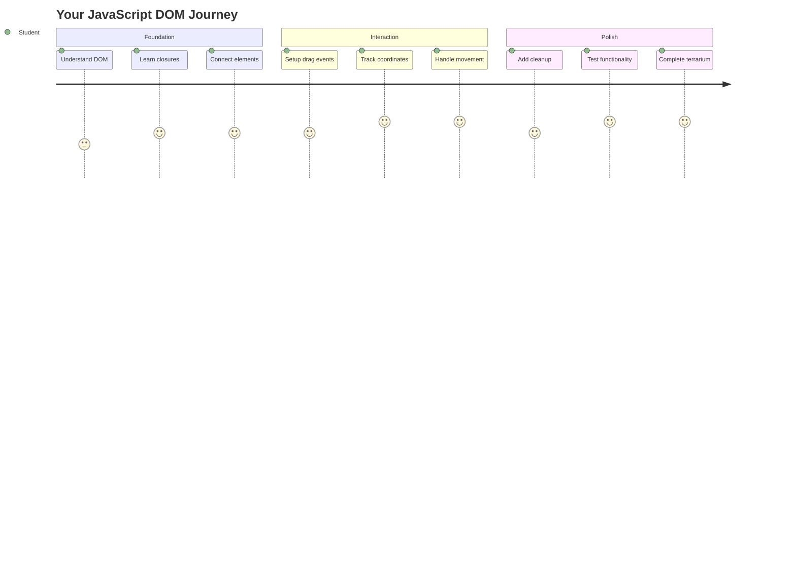
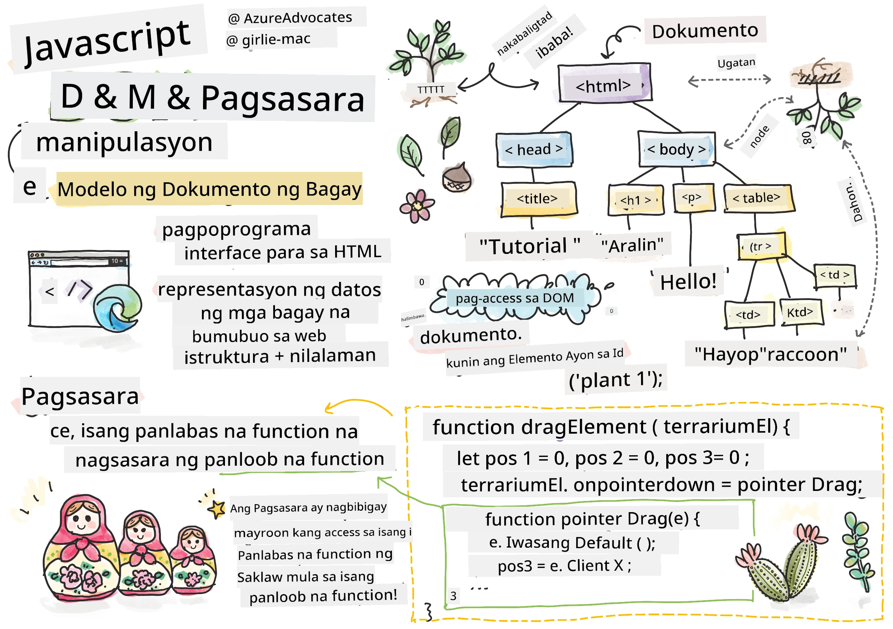
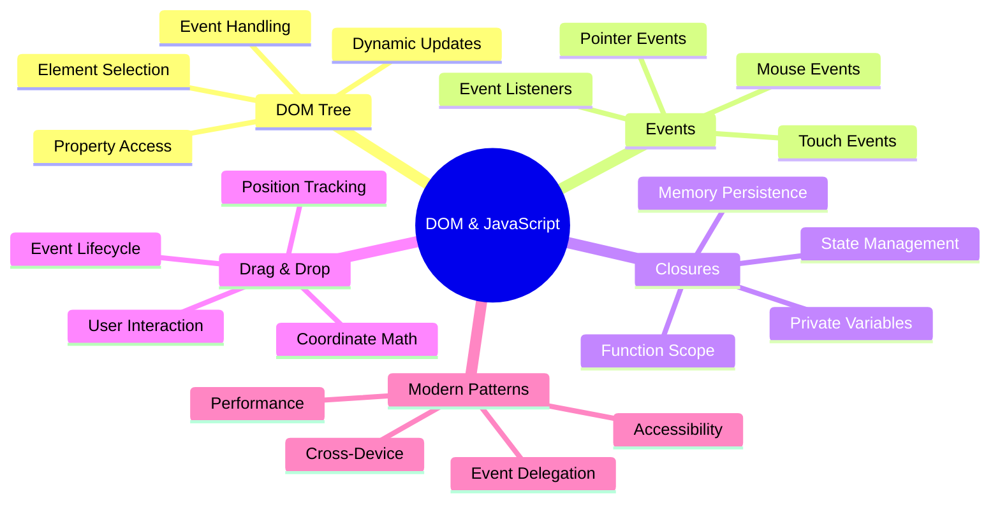
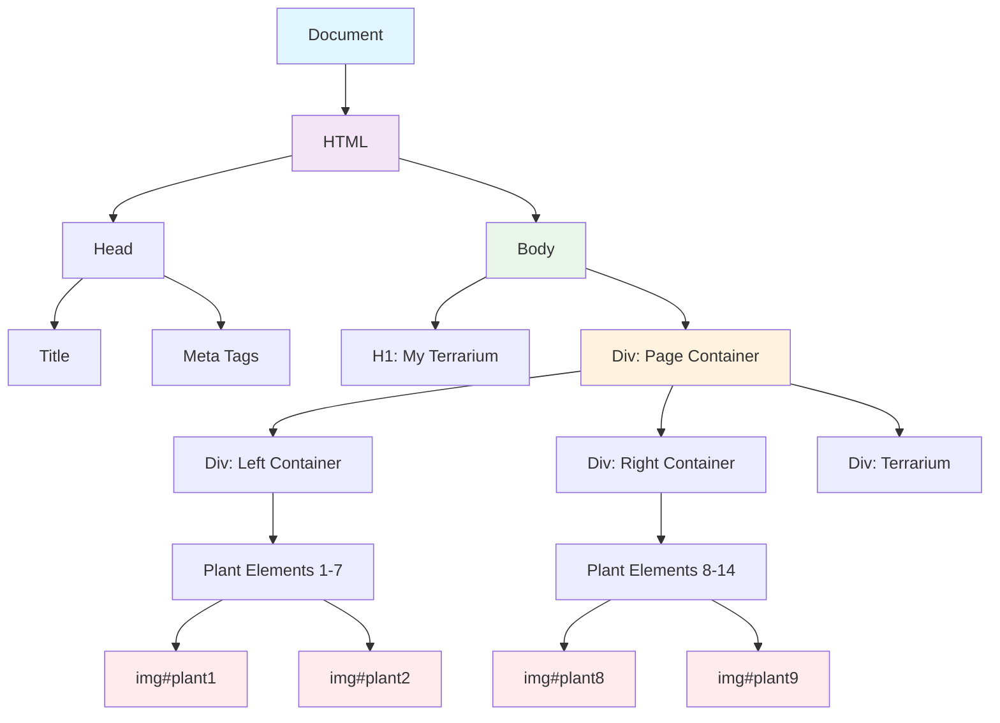
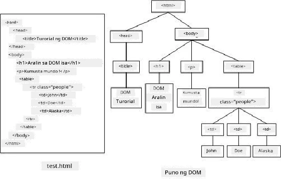
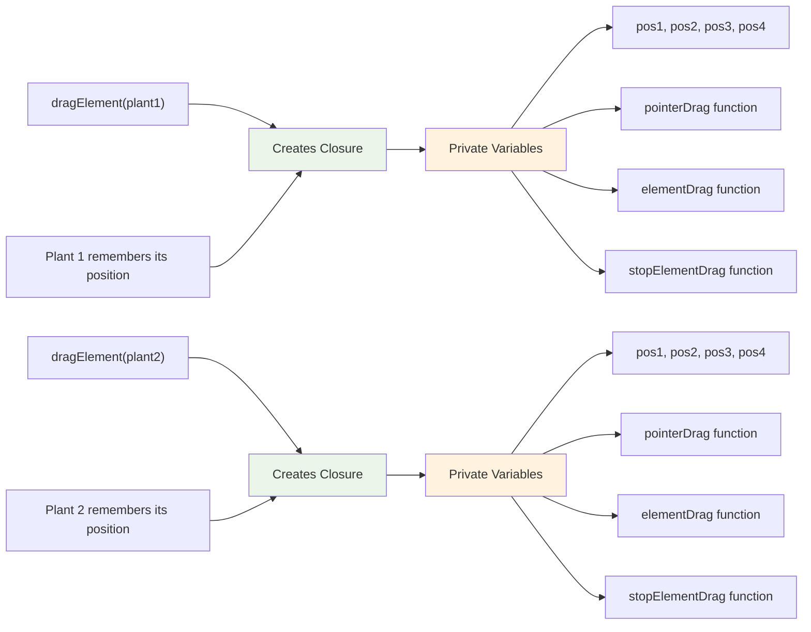
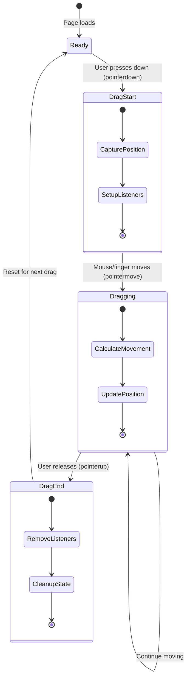
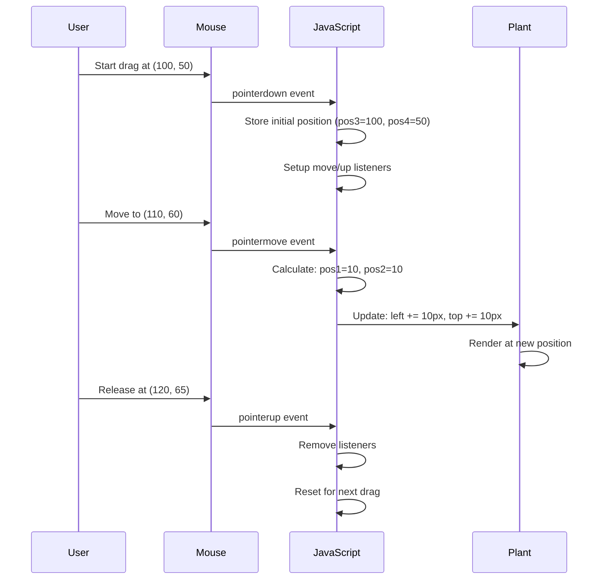
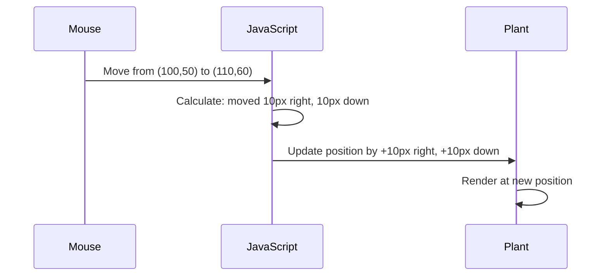
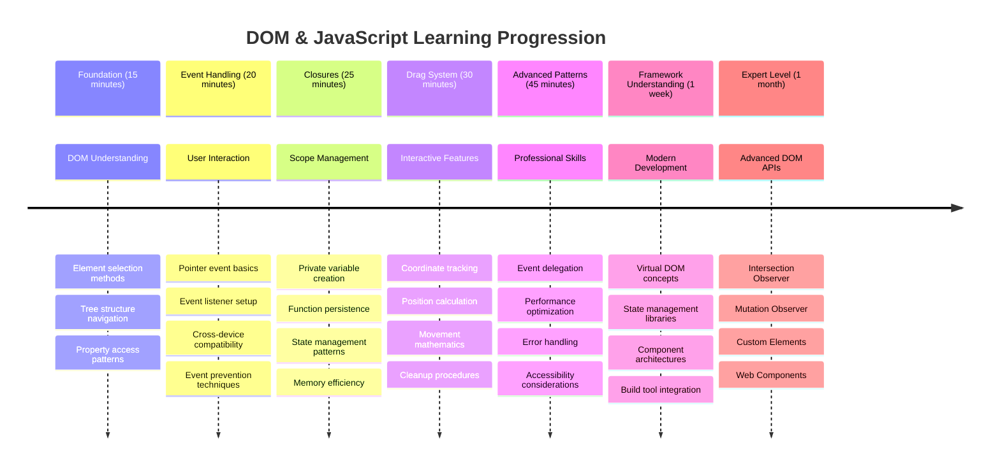

# Terrarium Project Part 3: Manipulasyon ng DOM at JavaScript Closures




> Sketchnote ni [Tomomi Imura](https://twitter.com/girlie_mac)

Maligayang pagdating sa isa sa mga pinaka-kapanapanabik na aspeto ng web development - ang paggawa ng mga bagay na interactive! Ang Document Object Model (DOM) ay parang tulay sa pagitan ng iyong HTML at JavaScript, at ngayon gagamitin natin ito upang buhayin ang iyong terrarium. Nang likhain ni Tim Berners-Lee ang unang web browser, inisip niya ang isang web kung saan ang mga dokumento ay maaaring maging dynamic at interactive - ang DOM ang nagpapaganap ng pangitain na iyon.

Pag-aaralan din natin ang JavaScript closures, na maaaring mukhang nakakatakot sa simula. Isipin ang closures bilang paglikha ng "memory pockets" kung saan ang iyong mga function ay maaaring magtanda ng mahalagang impormasyon. Parang bawat halaman sa iyong terrarium ay may sariling talaan ng data upang subaybayan ang posisyon nito. Sa pagtatapos ng araling ito, maiintindihan mo kung gaano sila ka-natural at kapaki-pakinabang.

Narito ang ating gagawin: isang terrarium kung saan maaaring i-drag at i-drop ng mga user ang mga halaman kahit saan nila gusto. Matutunan mo ang mga teknik sa manipulasyon ng DOM na ginagamit sa lahat mula sa drag-and-drop file uploads hanggang sa mga interactive na laro. Gawin nating buhay ang iyong terrarium.



## Pre-Lecture Quiz

[Pre-lecture quiz](https://ff-quizzes.netlify.app/web/quiz/19)

## Pag-unawa sa DOM: Ang Iyong Gateway sa Interactive na Mga Web Page

Ang Document Object Model (DOM) ang paraan ng JavaScript upang makipag-usap sa iyong mga elemento ng HTML. Kapag nag-load ang iyong browser ng isang HTML page, gumagawa ito ng isang structured na representasyon ng page na iyon sa memorya - iyon ang DOM. Isipin ito bilang isang family tree kung saan ang bawat elemento ng HTML ay isang miyembro ng pamilya na maaaring ma-access, mabago, o maayos ng JavaScript.

Ang manipulasyon ng DOM ang nagbabago ng mga static na page sa mga interactive na website. Sa tuwing makikita mo ang isang button na nagbabago ng kulay kapag hinover, content na nag-a-update nang hindi nagre-refresh ang page, o mga elementong maaaring i-drag, iyon ang manipulasyon ng DOM na gumagana.





> Isang representasyon ng DOM at ang HTML markup na tumutukoy dito. Mula kay [Olfa Nasraoui](https://www.researchgate.net/publication/221417012_Profile-Based_Focused_Crawler_for_Social_Media-Sharing_Websites)

**Narito ang nagpapalakas sa DOM:**
- **Nagbibigay** ng structured na paraan upang ma-access ang anumang elemento sa iyong page
- **Nagpapahintulot** ng dynamic na pag-update ng content nang walang page refresh
- **Nagbibigay-daan** sa real-time na tugon sa mga interaksyon ng user tulad ng pag-click at pag-drag
- **Lumilikha** ng pundasyon para sa mga modernong interactive na web application

## JavaScript Closures: Paglikha ng Organisado at Makapangyarihang Code

Ang [JavaScript closure](https://developer.mozilla.org/docs/Web/JavaScript/Closures) ay parang pagbibigay sa isang function ng sarili nitong pribadong workspace na may persistent memory. Isipin kung paano ang mga finch ni Darwin sa Galápagos Islands ay nagkaroon ng specialized na mga tuka batay sa kanilang partikular na kapaligiran - ang closures ay gumagana nang katulad, lumilikha ng mga specialized na function na "nagtatanda" ng kanilang partikular na konteksto kahit na matapos ang kanilang parent function.

Sa ating terrarium, ang closures ay tumutulong sa bawat halaman na matandaan ang sarili nitong posisyon nang independyente. Ang pattern na ito ay makikita sa buong propesyonal na pag-develop ng JavaScript, kaya't mahalagang maunawaan ito.



> 💡 **Pag-unawa sa Closures**: Ang closures ay isang mahalagang paksa sa JavaScript, at maraming developer ang gumagamit nito sa loob ng maraming taon bago lubos na maunawaan ang lahat ng teoretikal na aspeto. Ngayon, magpo-focus tayo sa praktikal na aplikasyon - makikita mo ang closures na natural na lumilitaw habang binubuo natin ang ating mga interactive na feature. Ang pag-unawa ay lalago habang nakikita mo kung paano nila nilulutas ang mga totoong problema.


> Isang representasyon ng DOM at ang HTML markup na tumutukoy dito. Mula kay [Olfa Nasraoui](https://www.researchgate.net/publication/221417012_Profile-Based_Focused_Crawler_for_Social_Media-Sharing_Websites)

Sa araling ito, tatapusin natin ang ating interactive na terrarium project sa pamamagitan ng paglikha ng JavaScript na magpapahintulot sa isang user na manipulahin ang mga halaman sa page.

## Bago Tayo Magsimula: Paghahanda para sa Tagumpay

Kakailanganin mo ang iyong mga HTML at CSS file mula sa mga nakaraang aralin sa terrarium - gagawin nating interactive ang static na disenyo na iyon. Kung ngayon ka lang sumali, ang pagkompleto sa mga araling iyon muna ay magbibigay ng mahalagang konteksto.

Narito ang ating gagawin:
- **Smooth drag-and-drop** para sa lahat ng halaman sa terrarium
- **Coordinate tracking** upang matandaan ng mga halaman ang kanilang mga posisyon
- **Isang kumpletong interactive na interface** gamit ang vanilla JavaScript
- **Malinis, organisadong code** gamit ang closure patterns

## Pag-set Up ng Iyong JavaScript File

Gumawa tayo ng JavaScript file na magpapainteractive sa iyong terrarium.

**Hakbang 1: Gumawa ng iyong script file**

Sa iyong terrarium folder, gumawa ng bagong file na tinatawag na `script.js`.

**Hakbang 2: I-link ang JavaScript sa iyong HTML**

Idagdag ang script tag na ito sa seksyon ng `<head>` ng iyong `index.html` file:

```html
<script src="./script.js" defer></script>
```

**Bakit mahalaga ang `defer` attribute:**
- **Tinitiyak** na ang iyong JavaScript ay maghihintay hanggang sa ma-load ang lahat ng HTML
- **Iniiwasan** ang mga error kung saan hinahanap ng JavaScript ang mga elementong hindi pa handa
- **Tinitiyak** na ang lahat ng iyong mga elemento ng halaman ay available para sa interaksyon
- **Nagbibigay** ng mas mahusay na performance kaysa sa paglalagay ng mga script sa ibaba ng page

> ⚠️ **Mahalagang Paalala**: Ang `defer` attribute ay pumipigil sa mga karaniwang timing issues. Kung wala ito, maaaring subukan ng JavaScript na i-access ang mga elemento ng HTML bago sila ma-load, na nagdudulot ng mga error.

---

## Pagkonekta ng JavaScript sa Iyong Mga Elemento ng HTML

Bago natin magawang draggable ang mga elemento, kailangang mahanap ng JavaScript ang mga ito sa DOM. Isipin ito na parang sistema ng katalogo sa library - kapag mayroon kang catalog number, maaari mong mahanap ang eksaktong libro na kailangan mo at ma-access ang lahat ng nilalaman nito.

Gagamitin natin ang `document.getElementById()` method upang gawin ang mga koneksyon na ito. Parang mayroong eksaktong filing system - magbibigay ka ng ID, at matutukoy nito ang eksaktong elemento na kailangan mo sa iyong HTML.

### Pag-enable ng Drag Functionality para sa Lahat ng Halaman

Idagdag ang code na ito sa iyong `script.js` file:

```javascript
// Enable drag functionality for all 14 plants
dragElement(document.getElementById('plant1'));
dragElement(document.getElementById('plant2'));
dragElement(document.getElementById('plant3'));
dragElement(document.getElementById('plant4'));
dragElement(document.getElementById('plant5'));
dragElement(document.getElementById('plant6'));
dragElement(document.getElementById('plant7'));
dragElement(document.getElementById('plant8'));
dragElement(document.getElementById('plant9'));
dragElement(document.getElementById('plant10'));
dragElement(document.getElementById('plant11'));
dragElement(document.getElementById('plant12'));
dragElement(document.getElementById('plant13'));
dragElement(document.getElementById('plant14'));
```

**Narito ang nagagawa ng code na ito:**
- **Hinahanap** ang bawat elemento ng halaman sa DOM gamit ang natatanging ID nito
- **Kinukuha** ang JavaScript reference sa bawat elemento ng HTML
- **Ipinapasa** ang bawat elemento sa isang `dragElement` function (na gagawin natin sa susunod)
- **Ipinaghahanda** ang bawat halaman para sa drag-and-drop interaction
- **Kinokonekta** ang iyong HTML structure sa JavaScript functionality

> 🎯 **Bakit Gamitin ang IDs Imbes na Classes?** Ang IDs ay nagbibigay ng natatanging identifier para sa mga partikular na elemento, habang ang CSS classes ay idinisenyo para sa pag-style ng mga grupo ng elemento. Kapag kailangang manipulahin ng JavaScript ang mga indibidwal na elemento, ang IDs ang nagbibigay ng precision at performance na kailangan natin.

> 💡 **Pro Tip**: Pansinin kung paano natin tinatawag ang `dragElement()` para sa bawat halaman nang paisa-isa. Ang approach na ito ay tinitiyak na ang bawat halaman ay magkakaroon ng sarili nitong independent na dragging behavior, na mahalaga para sa smooth na interaksyon ng user.

### 🔄 **Pedagogical Check-in**
**Pag-unawa sa Koneksyon ng DOM**: Bago lumipat sa drag functionality, tiyaking kaya mong:
- ✅ Ipaliwanag kung paano hinahanap ng `document.getElementById()` ang mga elemento ng HTML
- ✅ Unawain kung bakit gumagamit tayo ng natatanging IDs para sa bawat halaman
- ✅ Ilarawan ang layunin ng `defer` attribute sa script tags
- ✅ Kilalanin kung paano kumokonekta ang JavaScript at HTML sa pamamagitan ng DOM

**Quick Self-Test**: Ano ang mangyayari kung dalawang elemento ay may parehong ID? Bakit ang `getElementById()` ay nagbabalik lamang ng isang elemento?
*Sagot: Ang IDs ay dapat natatangi; kung may duplicate, ang unang elemento lamang ang ibinabalik*

---

## Pagbuo ng Drag Element Closure

Ngayon gagawin natin ang puso ng ating dragging functionality: isang closure na magpapatakbo ng dragging behavior para sa bawat halaman. Ang closure na ito ay maglalaman ng maraming inner functions na magtutulungan upang subaybayan ang mga galaw ng mouse at i-update ang mga posisyon ng elemento.

Ang closures ay perpekto para sa gawaing ito dahil pinapayagan nila tayong lumikha ng "pribadong" mga variable na nagpapatuloy sa pagitan ng mga tawag sa function, na nagbibigay sa bawat halaman ng sarili nitong independent na sistema ng pagsubaybay sa coordinate.

### Pag-unawa sa Closures gamit ang Simpleng Halimbawa

Hayaan akong ipakita ang closures gamit ang isang simpleng halimbawa na naglalarawan ng konsepto:

```javascript
function createCounter() {
    let count = 0; // This is like a private variable
    
    function increment() {
        count++; // The inner function remembers the outer variable
        return count;
    }
    
    return increment; // We're giving back the inner function
}

const myCounter = createCounter();
console.log(myCounter()); // 1
console.log(myCounter()); // 2
```

**Narito ang nangyayari sa pattern ng closure na ito:**
- **Lumilikha** ng pribadong `count` variable na umiiral lamang sa loob ng closure na ito
- **Ang inner function** ay maaaring ma-access at mabago ang outer variable (ang mekanismo ng closure)
- **Kapag ibinalik natin** ang inner function, pinapanatili nito ang koneksyon sa pribadong data na iyon
- **Kahit matapos** ang `createCounter()` na tapusin ang execution, ang `count` ay nagpapatuloy at natatandaan ang halaga nito

### Bakit Perpekto ang Closures para sa Drag Functionality

Para sa ating terrarium, kailangang matandaan ng bawat halaman ang kasalukuyang posisyon ng mga coordinate nito. Ang closures ang nagbibigay ng perpektong solusyon:

**Mga pangunahing benepisyo para sa ating proyekto:**
- **Pinapanatili** ang pribadong position variables para sa bawat halaman nang independyente
- **Pinapanatili** ang coordinate data sa pagitan ng mga drag events
- **Pinipigilan** ang mga conflict ng variable sa pagitan ng iba't ibang draggable elements
- **Lumilikha** ng malinis, organisadong code structure

> 🎯 **Layunin sa Pag-aaral**: Hindi mo kailangang ma-master ang bawat aspeto ng closures ngayon. Mag-focus sa kung paano nila tinutulungan tayong mag-organisa ng code at magpanatili ng state para sa ating dragging functionality.



### Paglikha ng dragElement Function

Ngayon, buuin natin ang pangunahing function na magpapatakbo ng lahat ng logic sa dragging. Idagdag ang function na ito sa ibaba ng iyong mga deklarasyon ng elemento ng halaman:

```javascript
function dragElement(terrariumElement) {
    // Initialize position tracking variables
    let pos1 = 0,  // Previous mouse X position
        pos2 = 0,  // Previous mouse Y position  
        pos3 = 0,  // Current mouse X position
        pos4 = 0;  // Current mouse Y position
    
    // Set up the initial drag event listener
    terrariumElement.onpointerdown = pointerDrag;
}
```

**Pag-unawa sa sistema ng pagsubaybay sa posisyon:**
- **`pos1` at `pos2`**: Nag-iimbak ng pagkakaiba sa pagitan ng lumang at bagong posisyon ng mouse
- **`pos3` at `pos4`**: Nagta-track ng kasalukuyang mouse coordinates
- **`terrariumElement`**: Ang partikular na elemento ng halaman na ginagawa nating draggable
- **`onpointerdown`**: Ang event na nagti-trigger kapag sinimulan ng user ang pag-drag

**Narito kung paano gumagana ang pattern ng closure:**
- **Lumilikha** ng pribadong position variables para sa bawat elemento ng halaman
- **Pinapanatili** ang mga variable na ito sa buong lifecycle ng dragging
- **Tinitiyak** na ang bawat halaman ay nagta-track ng sarili nitong mga coordinate nang independyente
- **Nagbibigay** ng malinis na interface sa pamamagitan ng `dragElement` function

### Bakit Gumamit ng Pointer Events?

Maaaring magtanong ka kung bakit natin ginagamit ang `onpointerdown` imbes na ang mas pamilyar na `onclick`. Narito ang paliwanag:

| Uri ng Event | Pinakamahusay Para sa | Ang Catch |
|--------------|-----------------------|-----------|
| `onclick` | Simpleng pag-click ng button | Hindi kayang hawakan ang dragging (click lang at release) |
| `onpointerdown` | Parehong mouse at touch | Mas bago, pero suportado na ngayon |
| `onmousedown` | Desktop mouse lang | Hindi kasama ang mga mobile user |

**Bakit perpekto ang pointer events para sa ating ginagawa:**
- **Gumagana nang mahusay** kahit gumagamit ng mouse, daliri, o stylus
- **Pareho ang pakiramdam** sa laptop, tablet, o phone
- **Hinahawakan** ang aktwal na galaw ng dragging (hindi lang click-and-done)
- **Lumilikha** ng smooth na karanasan na inaasahan ng mga user mula sa modernong web apps

> 💡 **Pagpapahusay sa Hinaharap**: Ang pointer events ang modernong paraan upang hawakan ang mga interaksyon ng user. Imbes na magsulat ng hiwalay na code para sa mouse at touch, makukuha mo ang pareho nang libre. Ang galing, di ba?

### 🔄 **Pedagogical Check-in**
**Pag-unawa sa Event Handling**: Mag-pause upang kumpirmahin ang iyong pagkaunawa sa mga events:
- ✅ Bakit natin ginagamit ang pointer events imbes na mouse events?
- ✅ Paano nagpapatuloy ang mga closure variables sa pagitan ng mga tawag sa function?
- ✅ Anong papel ang ginagampanan ng `preventDefault()` sa smooth na dragging?
- ✅ Bakit natin ikinakabit ang mga listener sa dokumento imbes na sa mga indibidwal na elemento?

**Real-World Connection**: Isipin ang mga drag-and-drop interface na ginagamit mo araw-araw:
- **File uploads**: Pag-drag ng mga file sa isang browser window
- **Kanban boards**: Paglipat ng mga task sa pagitan ng mga column
- **Image galleries**: Pag-aayos ng pagkakasunod-sunod ng mga larawan
- **Mobile interfaces**: Pag-swipe at pag-drag sa mga touchscreen

---

## Ang pointerDrag Function: Pagkuha ng Simula ng Isang Drag

Kapag pinindot ng user ang isang halaman (gamit ang mouse click o finger touch), ang `pointerDrag` function ay agad na gumagana. Ang function na ito ay kumukuha ng initial coordinates at nagse-set up ng dragging system.

Idagdag ang function na ito sa loob ng iyong `dragElement` closure, pagkatapos ng linya na `terrariumElement.onpointerdown = pointerDrag;`:

```javascript
function pointerDrag(e) {
    // Prevent default browser behavior (like text selection)
    e.preventDefault();
    
    // Capture the initial mouse/touch position
    pos3 = e.clientX;  // X coordinate where drag started
    pos4 = e.clientY;  // Y coordinate where drag started
    
    // Set up event listeners for the dragging process
    document.onpointermove = elementDrag;
    document.onpointerup = stopElementDrag;
}
```

**Hakbang-hakbang, narito ang nangyayari:**
- **Pinipigilan** ang default na browser behaviors na maaaring makasagabal sa dragging
- **Nire-record** ang eksaktong coordinates kung saan sinimulan ng user ang drag gesture
- **Nagse-set up** ng event listeners para sa patuloy na galaw ng drag
- **Ipinaghahanda** ang sistema upang mag-track ng galaw ng mouse/daliri sa buong dokumento

### Pag-unawa sa Event Prevention

Ang linya na `e.preventDefault()` ay mahalaga para sa smooth na dragging:

**Kung walang prevention, maaaring:**
- **Mag-select** ng text kapag nag-drag sa page
- **Mag-trigger** ng context menus sa right-click drag
- **Makialam** sa ating custom na dragging behavior
- **Lumikha** ng visual artifacts sa panahon ng drag operation

> 🔍 **Eksperimento**: Pagkatapos ng araling ito, subukang tanggalin ang `e.preventDefault()` at tingnan kung paano nito naaapektuhan ang dragging experience. Mabilis mong mauunawaan kung bakit mahalaga ang linyang ito!

### Sistema ng Pagsubaybay sa Coordinate

Ang mga property na `e.clientX` at `e.clientY` ay nagbibigay sa atin ng eksaktong mouse/touch coordinates:

| Property | Ano ang Sinusukat | Gamit |
|----------|-------------------|-------|
| `clientX` | Posisyon sa horizontal na may kaugnayan sa viewport | Pagsubaybay sa galaw pakaliwa-pakanan |
| `clientY` | Posisyon sa vertical na may kaugnayan sa viewport | Pagsubaybay sa galaw pataas-pababa |
**Pag-unawa sa mga koordinato:**
- **Nagbibigay** ng pixel-perfect na impormasyon sa posisyon
- **Nag-a-update** nang real-time habang gumagalaw ang pointer ng user
- **Nanatiling** pare-pareho sa iba't ibang laki ng screen at antas ng zoom
- **Nagpapagana** ng makinis at tumutugong drag interactions

### Pag-set Up ng Document-Level Event Listeners

Pansinin kung paano natin ikinakabit ang move at stop events sa buong `document`, hindi lamang sa plant element:

```javascript
document.onpointermove = elementDrag;
document.onpointerup = stopElementDrag;
```

**Bakit ikabit sa document:**
- **Patuloy** na sinusubaybayan kahit lumabas ang mouse sa plant element
- **Pinipigilan** ang pagkaantala ng drag kung mabilis gumalaw ang user
- **Nagbibigay** ng makinis na pag-drag sa buong screen
- **Hinahawakan** ang mga edge case kung saan lumalabas ang cursor sa window ng browser

> ⚡ **Tandaan sa Performance**: Lilinisin natin ang mga document-level listeners kapag tumigil ang pag-drag upang maiwasan ang memory leaks at mga isyu sa performance.

## Pagkumpleto sa Drag System: Movement at Cleanup

Ngayon, idadagdag natin ang dalawang natitirang function na humahawak sa aktwal na paggalaw ng drag at ang cleanup kapag tumigil ang pag-drag. Ang mga function na ito ay nagtutulungan upang lumikha ng makinis at tumutugong paggalaw ng halaman sa iyong terrarium.

### Ang elementDrag Function: Pagsubaybay sa Paggalaw

Idagdag ang `elementDrag` function pagkatapos ng closing curly bracket ng `pointerDrag`:

```javascript
function elementDrag(e) {
    // Calculate the distance moved since the last event
    pos1 = pos3 - e.clientX;  // Horizontal distance moved
    pos2 = pos4 - e.clientY;  // Vertical distance moved
    
    // Update the current position tracking
    pos3 = e.clientX;  // New current X position
    pos4 = e.clientY;  // New current Y position
    
    // Apply the movement to the element's position
    terrariumElement.style.top = (terrariumElement.offsetTop - pos2) + 'px';
    terrariumElement.style.left = (terrariumElement.offsetLeft - pos1) + 'px';
}
```

**Pag-unawa sa coordinate mathematics:**
- **`pos1` at `pos2`**: Kinakalkula kung gaano kalayo ang mouse mula sa huling update
- **`pos3` at `pos4`**: Iniimbak ang kasalukuyang posisyon ng mouse para sa susunod na kalkulasyon
- **`offsetTop` at `offsetLeft`**: Kinukuha ang kasalukuyang posisyon ng elemento sa pahina
- **Subtraction logic**: Inililipat ang elemento sa parehong dami ng paggalaw ng mouse



**Narito ang breakdown ng kalkulasyon ng paggalaw:**
1. **Sinusukat** ang pagkakaiba sa pagitan ng lumang at bagong posisyon ng mouse
2. **Kinakalkula** kung gaano kalayo ang ililipat ang elemento batay sa paggalaw ng mouse
3. **Ina-update** ang CSS position properties ng elemento nang real-time
4. **Iniimbak** ang bagong posisyon bilang baseline para sa susunod na kalkulasyon ng paggalaw

### Visual na Representasyon ng Math



### Ang stopElementDrag Function: Paglilinis

Idagdag ang cleanup function pagkatapos ng closing curly bracket ng `elementDrag`:

```javascript
function stopElementDrag() {
    // Remove the document-level event listeners
    document.onpointerup = null;
    document.onpointermove = null;
}
```

**Bakit mahalaga ang cleanup:**
- **Pinipigilan** ang memory leaks mula sa mga natitirang event listeners
- **Pinatitigil** ang dragging behavior kapag binitiwan ng user ang halaman
- **Pinapayagan** ang ibang elemento na ma-drag nang independyente
- **Ire-reset** ang sistema para sa susunod na drag operation

**Ano ang mangyayari kung walang cleanup:**
- Patuloy na tumatakbo ang event listeners kahit tumigil na ang pag-drag
- Bumababa ang performance habang dumarami ang hindi nagagamit na listeners
- Hindi inaasahang behavior kapag nakikipag-ugnayan sa ibang elemento
- Nasasayang ang resources ng browser sa hindi kinakailangang event handling

### Pag-unawa sa CSS Position Properties

Ang ating drag system ay nagma-manipula ng dalawang pangunahing CSS properties:

| Property | Ano ang Kinokontrol | Paano Natin Ginagamit |
|----------|---------------------|-----------------------|
| `top` | Distansya mula sa itaas na gilid | Vertical positioning habang nagda-drag |
| `left` | Distansya mula sa kaliwang gilid | Horizontal positioning habang nagda-drag |

**Mga mahalagang insight tungkol sa offset properties:**
- **`offsetTop`**: Kasalukuyang distansya mula sa itaas ng positioned parent element
- **`offsetLeft`**: Kasalukuyang distansya mula sa kaliwa ng positioned parent element
- **Positioning context**: Ang mga value na ito ay relative sa pinakamalapit na positioned ancestor
- **Real-time updates**: Agad na nagbabago kapag binago natin ang CSS properties

> 🎯 **Disenyo ng Filosopiya**: Ang drag system na ito ay sadyang flexible – walang "drop zones" o mga limitasyon. Maaaring ilagay ng mga user ang mga halaman kahit saan, binibigyan sila ng ganap na creative control sa disenyo ng kanilang terrarium.

## Pagsasama-sama: Ang Iyong Kumpletong Drag System

Binabati kita! Nakagawa ka ng isang sopistikadong drag-and-drop system gamit ang vanilla JavaScript. Ang iyong kumpletong `dragElement` function ay naglalaman na ngayon ng isang makapangyarihang closure na namamahala sa:

**Ano ang nagagawa ng iyong closure:**
- **Nagpapanatili** ng pribadong position variables para sa bawat halaman nang independyente
- **Humahawak** sa buong drag lifecycle mula simula hanggang matapos
- **Nagbibigay** ng makinis at tumutugong paggalaw sa buong screen
- **Naglilinis** ng resources nang maayos upang maiwasan ang memory leaks
- **Lumilikha** ng intuitive at creative na interface para sa disenyo ng terrarium

### Pagsubok sa Iyong Interactive Terrarium

Ngayon, subukan ang iyong interactive terrarium! Buksan ang iyong `index.html` file sa isang web browser at subukan ang functionality:

1. **I-click at hawakan** ang anumang halaman upang simulan ang pag-drag
2. **Igalaw ang iyong mouse o daliri** at panoorin ang halaman na maayos na sumusunod
3. **Bitawan** upang ilagay ang halaman sa bagong posisyon
4. **Mag-eksperimento** sa iba't ibang ayos upang tuklasin ang interface

🥇 **Tagumpay**: Nakagawa ka ng isang ganap na interactive na web application gamit ang mga pangunahing konsepto na ginagamit ng mga propesyonal na developer araw-araw. Ang drag-and-drop functionality na ito ay gumagamit ng parehong prinsipyo sa likod ng file uploads, kanban boards, at marami pang ibang interactive interfaces.

### 🔄 **Pedagogical Check-in**
**Pag-unawa sa Kumpletong Sistema**: Suriin ang iyong mastery sa buong drag system:
- ✅ Paano pinapanatili ng closures ang independiyenteng estado para sa bawat halaman?
- ✅ Bakit mahalaga ang coordinate calculation math para sa makinis na paggalaw?
- ✅ Ano ang mangyayari kung nakalimutan nating linisin ang event listeners?
- ✅ Paano nasusukat ang pattern na ito sa mas kumplikadong interactions?

**Pagmuni-muni sa Kalidad ng Code**: Suriin ang iyong kumpletong solusyon:
- **Modular na disenyo**: Ang bawat halaman ay may sariling closure instance
- **Event efficiency**: Tamang setup at cleanup ng listeners
- **Suporta sa iba't ibang device**: Gumagana sa desktop at mobile
- **Performance conscious**: Walang memory leaks o redundant calculations


---

## Hamon ng GitHub Copilot Agent 🚀

Gamitin ang Agent mode upang kumpletuhin ang sumusunod na hamon:

**Deskripsyon:** Pagandahin ang terrarium project sa pamamagitan ng pagdaragdag ng reset functionality na ibabalik ang lahat ng halaman sa kanilang orihinal na posisyon gamit ang smooth animations.

**Prompt:** Gumawa ng reset button na, kapag na-click, ay mag-a-animate ng lahat ng halaman pabalik sa kanilang orihinal na sidebar positions gamit ang CSS transitions. Ang function ay dapat mag-imbak ng orihinal na posisyon kapag nag-load ang pahina at maayos na i-transition ang mga halaman pabalik sa mga posisyong iyon sa loob ng 1 segundo kapag na-click ang reset button.

Alamin pa ang tungkol sa [agent mode](https://code.visualstudio.com/blogs/2025/02/24/introducing-copilot-agent-mode) dito.

## 🚀 Karagdagang Hamon: Palawakin ang Iyong Kasanayan

Handa ka na bang dalhin ang iyong terrarium sa susunod na antas? Subukan ang pagpapatupad ng mga pagpapahusay na ito:

**Mga Creative Extensions:**
- **Double-click** ang halaman upang ilagay ito sa harapan (z-index manipulation)
- **Magdagdag ng visual feedback** tulad ng banayad na glow kapag nag-hover sa mga halaman
- **Magpatupad ng boundaries** upang pigilan ang mga halaman na ma-drag sa labas ng terrarium
- **Gumawa ng save function** na nagtatanda ng posisyon ng halaman gamit ang localStorage
- **Magdagdag ng sound effects** para sa pag-pick up at paglagay ng mga halaman

> 💡 **Pagkakataon sa Pag-aaral**: Ang bawat isa sa mga hamon na ito ay magtuturo sa iyo ng mga bagong aspeto ng DOM manipulation, event handling, at disenyo ng user experience.

## Post-Lecture Quiz

[Post-lecture quiz](https://ff-quizzes.netlify.app/web/quiz/20)

## Review & Self Study: Pagpapalalim ng Iyong Pag-unawa

Na-master mo na ang mga pangunahing kaalaman ng DOM manipulation at closures, ngunit palaging may mas marami pang matutunan! Narito ang ilang mga landas upang palawakin ang iyong kaalaman at kasanayan.

### Mga Alternatibong Paraan ng Drag and Drop

Ginamit natin ang pointer events para sa maximum na flexibility, ngunit nag-aalok ang web development ng maraming paraan:

| Paraan | Pinakamahusay Para sa | Halaga ng Pag-aaral |
|-------|------------------------|---------------------|
| [HTML Drag and Drop API](https://developer.mozilla.org/docs/Web/API/HTML_Drag_and_Drop_API) | File uploads, formal drag zones | Pag-unawa sa native browser capabilities |
| [Touch Events](https://developer.mozilla.org/docs/Web/API/Touch_events) | Mobile-specific interactions | Mga pattern ng mobile-first development |
| CSS `transform` properties | Smooth animations | Mga teknik sa pag-optimize ng performance |

### Mga Advanced na Paksa sa DOM Manipulation

**Mga susunod na hakbang sa iyong paglalakbay sa pag-aaral:**
- **Event delegation**: Mahusay na paghawak ng events para sa maraming elemento
- **Intersection Observer**: Pagtukoy kung kailan pumapasok/lumalabas ang mga elemento sa viewport
- **Mutation Observer**: Pagsubaybay sa mga pagbabago sa istruktura ng DOM
- **Web Components**: Paglikha ng reusable, encapsulated UI elements
- **Virtual DOM concepts**: Pag-unawa kung paano ino-optimize ng mga framework ang DOM updates

### Mahahalagang Resources para sa Patuloy na Pag-aaral

**Teknikal na Dokumentasyon:**
- [MDN Pointer Events Guide](https://developer.mozilla.org/docs/Web/API/Pointer_events) - Komprehensibong pointer event reference
- [W3C Pointer Events Specification](https://www.w3.org/TR/pointerevents1/) - Opisyal na dokumentasyon ng standards
- [JavaScript Closures Deep Dive](https://developer.mozilla.org/docs/Web/JavaScript/Closures) - Advanced closure patterns

**Browser Compatibility:**
- [CanIUse.com](https://caniuse.com/) - Suriin ang suporta ng feature sa iba't ibang browser
- [MDN Browser Compatibility Data](https://github.com/mdn/browser-compat-data) - Detalyadong impormasyon sa compatibility

**Mga Pagkakataon sa Practice:**
- **Gumawa** ng puzzle game gamit ang katulad na drag mechanics
- **Lumikha** ng kanban board na may drag-and-drop task management
- **Magdisenyo** ng image gallery na may draggable photo arrangements
- **Mag-eksperimento** sa touch gestures para sa mobile interfaces

> 🎯 **Estratehiya sa Pag-aaral**: Ang pinakamahusay na paraan upang ma-solidify ang mga konseptong ito ay sa pamamagitan ng practice. Subukang gumawa ng mga variation ng draggable interfaces – bawat proyekto ay magtuturo sa iyo ng bago tungkol sa user interaction at DOM manipulation.

### ⚡ **Ano ang Magagawa Mo sa Susunod na 5 Minuto**
- [ ] Buksan ang browser DevTools at i-type ang `document.querySelector('body')` sa console
- [ ] Subukang baguhin ang text ng isang webpage gamit ang `innerHTML` o `textContent`
- [ ] Magdagdag ng click event listener sa anumang button o link sa isang webpage
- [ ] I-inspect ang istruktura ng DOM tree gamit ang Elements panel

### 🎯 **Ano ang Magagawa Mo sa Loob ng Isang Oras**
- [ ] Kumpletuhin ang post-lesson quiz at repasuhin ang mga konsepto ng DOM manipulation
- [ ] Gumawa ng interactive na webpage na tumutugon sa mga pag-click ng user
- [ ] Mag-practice ng event handling gamit ang iba't ibang uri ng event (click, mouseover, keypress)
- [ ] Bumuo ng simpleng to-do list o counter gamit ang DOM manipulation
- [ ] Tuklasin ang relasyon sa pagitan ng mga HTML element at JavaScript objects

### 📅 **Ang Iyong JavaScript Journey sa Loob ng Isang Linggo**
- [ ] Kumpletuhin ang interactive terrarium project na may drag-and-drop functionality
- [ ] Masterin ang event delegation para sa mahusay na paghawak ng events
- [ ] Alamin ang tungkol sa event loop at asynchronous JavaScript
- [ ] Mag-practice ng closures sa pamamagitan ng paggawa ng modules na may private state
- [ ] Tuklasin ang mga modernong DOM APIs tulad ng Intersection Observer
- [ ] Bumuo ng interactive components nang hindi gumagamit ng frameworks

### 🌟 **Ang Iyong JavaScript Mastery sa Loob ng Isang Buwan**
- [ ] Gumawa ng kumplikadong single-page application gamit ang vanilla JavaScript
- [ ] Matutunan ang isang modernong framework (React, Vue, o Angular) at ikumpara ito sa vanilla DOM
- [ ] Mag-ambag sa mga open source JavaScript projects
- [ ] Masterin ang mga advanced na konsepto tulad ng web components at custom elements
- [ ] Bumuo ng mga performant web applications gamit ang optimal DOM patterns
- [ ] Magturo sa iba tungkol sa DOM manipulation at mga pangunahing kaalaman sa JavaScript

## 🎯 Ang Iyong JavaScript DOM Mastery Timeline



### 🛠️ Buod ng Iyong JavaScript Toolkit

Pagkatapos ng lesson na ito, mayroon ka na:
- **DOM Mastery**: Element selection, property manipulation, at tree navigation
- **Event Expertise**: Cross-device interaction handling gamit ang pointer events
- **Closure Understanding**: Private state management at function persistence
- **Interactive Systems**: Kumpletong drag-and-drop implementation mula sa simula
- **Performance Awareness**: Tamang event cleanup at memory management
- **Modern Patterns**: Mga teknik sa pag-organisa ng code na ginagamit sa propesyonal na development
- **User Experience**: Paglikha ng intuitive at tumutugong interfaces

**Mga Propesyonal na Kasanayan na Nakuha**: Nakagawa ka ng mga features gamit ang parehong teknik tulad ng:
- **Trello/Kanban boards**: Pag-drag ng card sa pagitan ng mga column
- **File upload systems**: Drag-and-drop file handling
- **Image galleries**: Mga interface sa pag-aayos ng larawan
- **Mobile apps**: Mga pattern ng touch-based interaction

**Susunod na Antas**: Handa ka nang tuklasin ang mga modernong frameworks tulad ng React, Vue, o Angular na nakabatay sa mga pangunahing konsepto ng DOM manipulation!

## Assignment

[Magtrabaho pa sa DOM](assignment.md)

---

**Paunawa**:  
Ang dokumentong ito ay isinalin gamit ang AI translation service [Co-op Translator](https://github.com/Azure/co-op-translator). Bagamat sinisikap naming maging tumpak, pakatandaan na ang mga awtomatikong pagsasalin ay maaaring maglaman ng mga pagkakamali o hindi pagkakatugma. Ang orihinal na dokumento sa kanyang katutubong wika ang dapat ituring na opisyal na sanggunian. Para sa mahalagang impormasyon, inirerekomenda ang propesyonal na pagsasalin ng tao. Hindi kami mananagot sa anumang hindi pagkakaunawaan o maling interpretasyon na dulot ng paggamit ng pagsasaling ito.