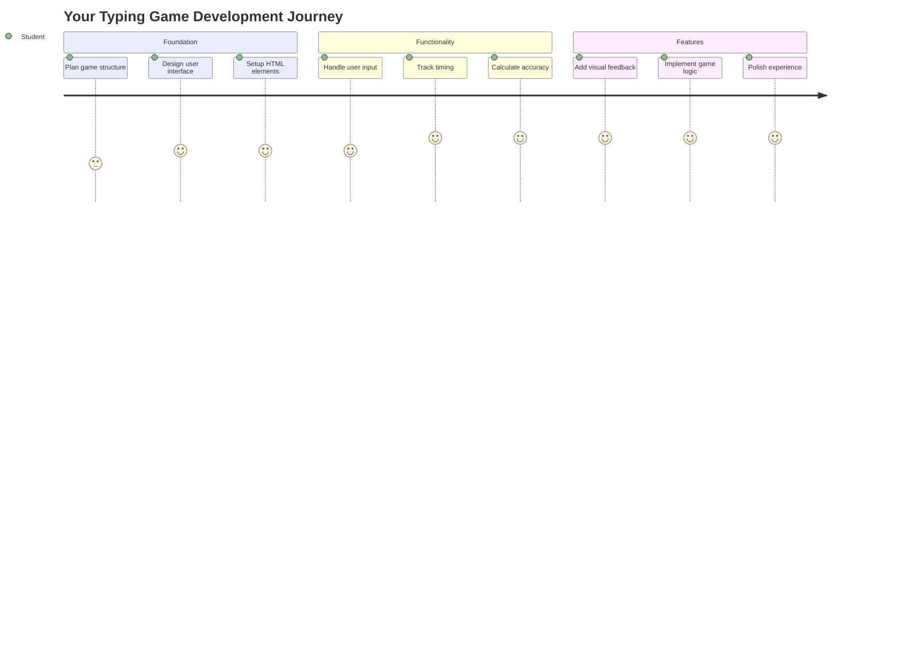
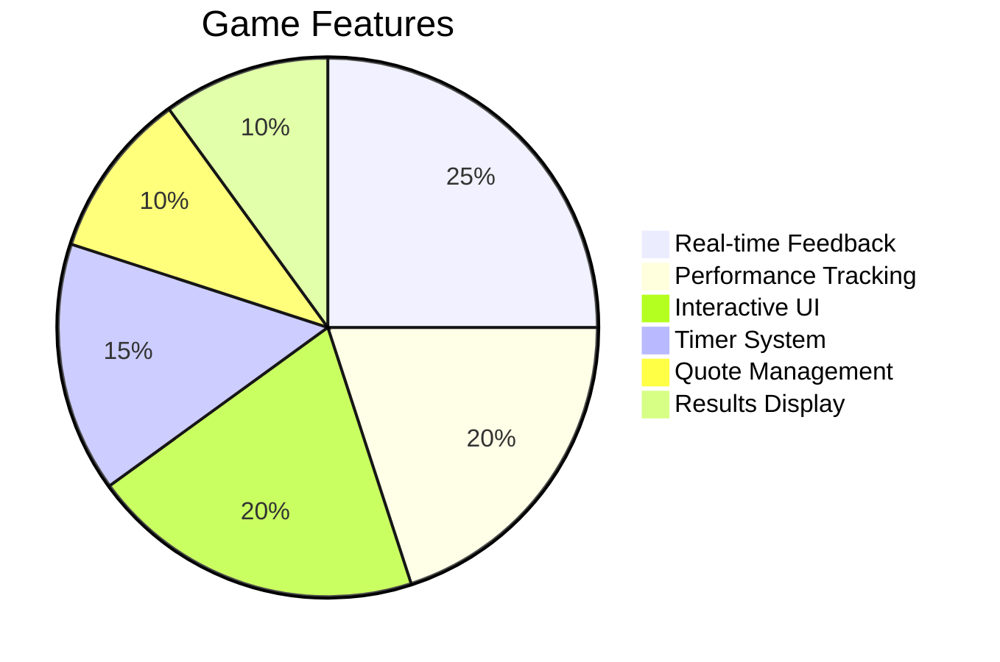
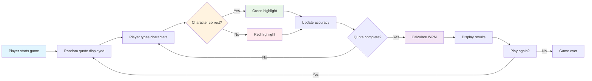
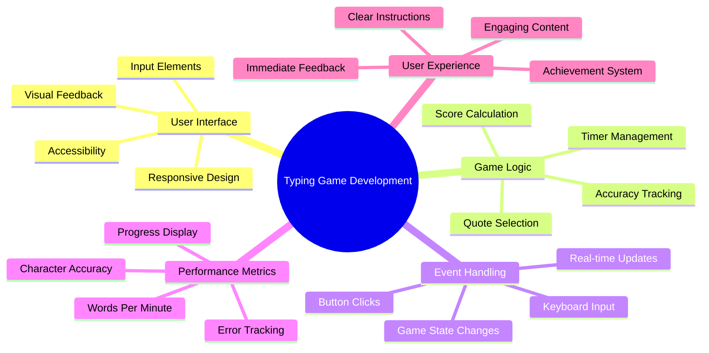
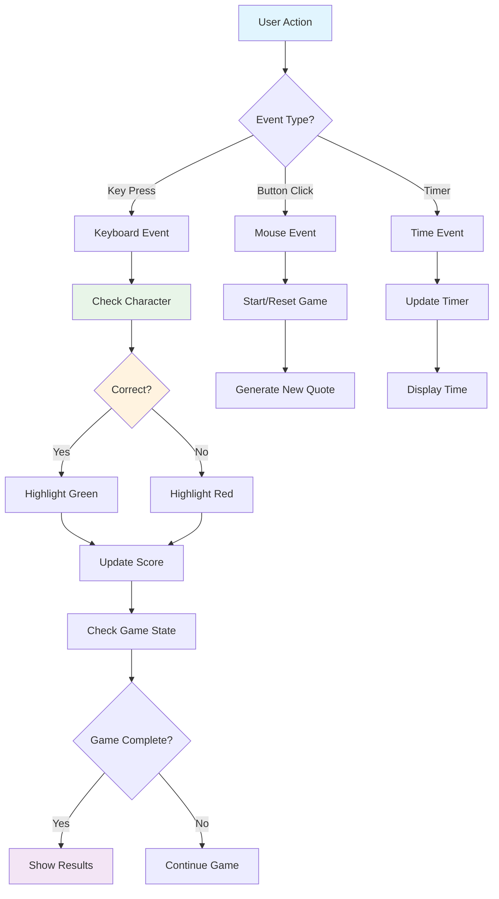
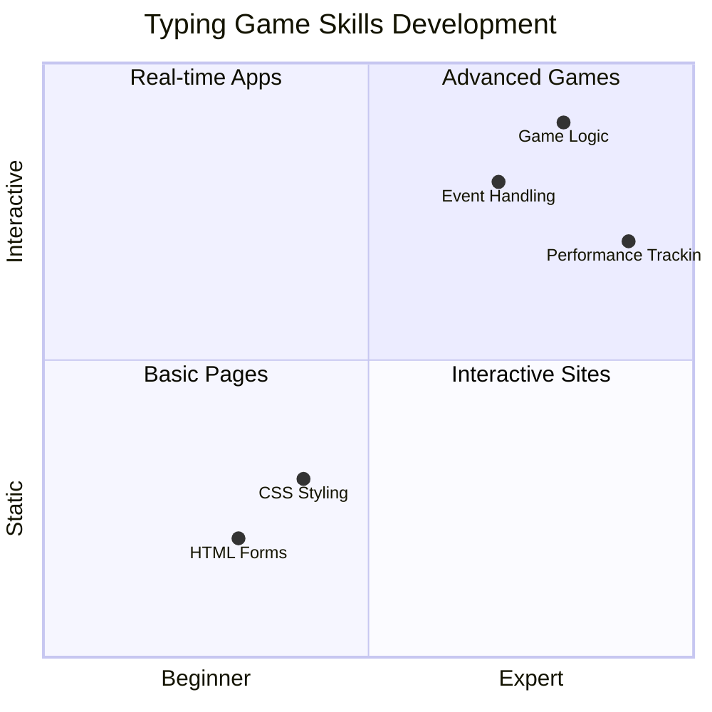
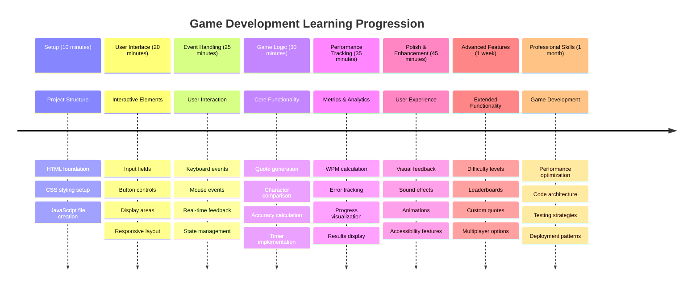

<!--
CO_OP_TRANSLATOR_METADATA:
{
  "original_hash": "efa2ab875b8bb5a7883816506da6b6d2",
  "translation_date": "2025-11-03T14:02:18+00:00",
  "source_file": "4-typing-game/README.md",
  "language_code": "tl"
}
-->
# Event-Driven Programming - Gumawa ng Typing Game

## Panimula

Narito ang isang bagay na alam ng bawat developer pero bihirang pag-usapan: ang mabilis na pagta-type ay isang superpower! 🚀 Isipin mo - mas mabilis mong maipapasa ang iyong mga ideya mula sa utak papunta sa code editor, mas malaya ang daloy ng iyong pagkamalikhain. Para itong direktang koneksyon sa pagitan ng iyong mga iniisip at ng screen.

Gusto mo bang malaman ang isa sa mga pinakamahusay na paraan para mahasa ang kakayahang ito? Tama ang hula mo - gagawa tayo ng isang laro!

> Gumawa tayo ng isang kahanga-hangang typing game!

Handa ka na bang gamitin ang lahat ng JavaScript, HTML, at CSS skills na natutunan mo? Gagawa tayo ng typing game na magpapakilala sa iyo ng mga random na quotes mula sa sikat na detektib na si [Sherlock Holmes](https://en.wikipedia.org/wiki/Sherlock_Holmes). Susukatin ng laro kung gaano ka kabilis at ka-eksakto mag-type - at maniwala ka, mas nakakaadik ito kaysa sa inaakala mo!

## Mga Kailangan Mong Malaman

Bago tayo magsimula, siguraduhing komportable ka sa mga konseptong ito (huwag mag-alala kung kailangan mo ng mabilisang pag-review - normal lang 'yan!):

- Paglikha ng text input at button controls
- CSS at pag-set ng styles gamit ang mga klase  
- Mga pangunahing kaalaman sa JavaScript
  - Paglikha ng array
  - Paglikha ng random na numero
  - Pagkuha ng kasalukuyang oras

Kung medyo malabo ang ilan sa mga ito, ayos lang! Minsan ang pinakamagandang paraan para mapalalim ang kaalaman ay ang sumabak sa proyekto at matutunan habang ginagawa.

### 🔄 **Pedagogical Check-in**
**Foundation Assessment**: Bago magsimula sa development, siguraduhing nauunawaan mo:
- ✅ Paano gumagana ang HTML forms at input elements
- ✅ CSS classes at dynamic styling
- ✅ JavaScript event listeners at handlers
- ✅ Manipulasyon ng array at random na pagpili
- ✅ Pagsukat ng oras at kalkulasyon

**Quick Self-Test**: Kaya mo bang ipaliwanag kung paano nagtutulungan ang mga konseptong ito sa isang interactive na laro?
- **Events** ang nagti-trigger kapag may interaksyon ang user sa mga elemento
- **Handlers** ang nagpoproseso ng mga events at nag-a-update ng estado ng laro
- **CSS** ang nagbibigay ng visual na feedback para sa mga aksyon ng user
- **Timing** ang nagbibigay-daan sa pagsukat ng performance at progreso ng laro

## Simulan Natin Ito!

[Paglikha ng typing game gamit ang event-driven programming](./typing-game/README.md)

### ⚡ **Mga Magagawa Mo sa Susunod na 5 Minuto**
- [ ] Buksan ang browser console at subukang makinig sa keyboard events gamit ang `addEventListener`
- [ ] Gumawa ng simpleng HTML page na may input field at subukang i-detect ang pagta-type
- [ ] Magpraktis ng string manipulation sa pamamagitan ng paghahambing ng typed text sa target text
- [ ] Mag-eksperimento gamit ang `setTimeout` para maunawaan ang timing functions

### 🎯 **Mga Magagawa Mo sa Loob ng Isang Oras**
- [ ] Tapusin ang post-lesson quiz at maunawaan ang event-driven programming
- [ ] Gumawa ng basic na bersyon ng typing game na may word validation
- [ ] Magdagdag ng visual feedback para sa tamang at maling pagta-type
- [ ] Mag-implement ng simpleng scoring system base sa bilis at eksaktong pagta-type
- [ ] I-style ang iyong laro gamit ang CSS para maging kaaya-aya sa mata

### 📅 **Pagbuo ng Laro sa Loob ng Isang Linggo**
- [ ] Tapusin ang buong typing game na may lahat ng features at polish
- [ ] Magdagdag ng difficulty levels na may iba't ibang complexity ng salita
- [ ] Mag-implement ng user statistics tracking (WPM, accuracy sa paglipas ng oras)
- [ ] Gumawa ng sound effects at animations para sa mas magandang user experience
- [ ] Gawing mobile-responsive ang iyong laro para sa touch devices
- [ ] Ibahagi ang iyong laro online at mangolekta ng feedback mula sa mga user

### 🌟 **Pagbuo ng Interactive Development sa Loob ng Isang Buwan**
- [ ] Gumawa ng maraming laro na nag-eexplore ng iba't ibang interaction patterns
- [ ] Matutunan ang tungkol sa game loops, state management, at performance optimization
- [ ] Mag-contribute sa open source game development projects
- [ ] Masterin ang advanced timing concepts at smooth animations
- [ ] Gumawa ng portfolio na nagpapakita ng iba't ibang interactive applications
- [ ] Mag-mentor sa iba na interesado sa game development at user interaction

## 🎯 Timeline ng Iyong Typing Game Mastery

### 🛠️ Buod ng Iyong Game Development Toolkit

Pagkatapos tapusin ang proyektong ito, ma-master mo ang:
- **Event-Driven Programming**: Responsive user interfaces na tumutugon sa input
- **Real-Time Feedback**: Instant visual at performance updates
- **Performance Measurement**: Eksaktong timing at scoring systems
- **Game State Management**: Pagkontrol sa daloy ng application at user experience
- **Interactive Design**: Paglikha ng engaging, nakakaadik na user experiences
- **Modern Web APIs**: Paggamit ng browser capabilities para sa rich interactions
- **Accessibility Patterns**: Inclusive design para sa lahat ng user

**Real-World Applications**: Ang mga skills na ito ay direktang magagamit sa:
- **Web Applications**: Anumang interactive interface o dashboard
- **Educational Software**: Mga learning platform at skill assessment tools
- **Productivity Tools**: Text editors, IDEs, at collaboration software
- **Gaming Industry**: Browser games at interactive entertainment
- **Mobile Development**: Touch-based interfaces at gesture handling

**Next Level**: Handa ka nang mag-explore ng advanced game frameworks, real-time multiplayer systems, o complex interactive applications!

## Credits

Isinulat nang may ♥️ ni [Christopher Harrison](http://www.twitter.com/geektrainer)

---

**Paunawa**:  
Ang dokumentong ito ay isinalin gamit ang AI translation service na [Co-op Translator](https://github.com/Azure/co-op-translator). Bagamat sinisikap naming maging tumpak, mangyaring tandaan na ang mga awtomatikong pagsasalin ay maaaring maglaman ng mga pagkakamali o hindi pagkakatugma. Ang orihinal na dokumento sa kanyang katutubong wika ang dapat ituring na opisyal na sanggunian. Para sa mahalagang impormasyon, inirerekomenda ang propesyonal na pagsasalin ng tao. Hindi kami mananagot sa anumang hindi pagkakaunawaan o maling interpretasyon na dulot ng paggamit ng pagsasaling ito.