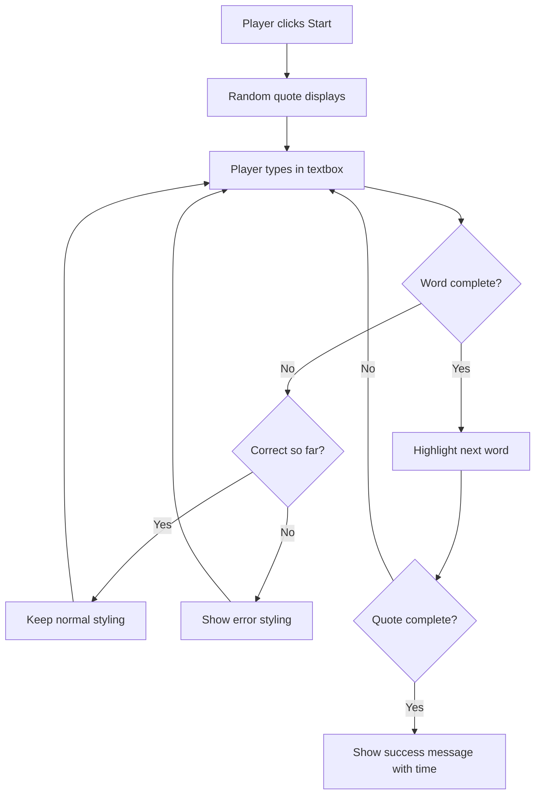
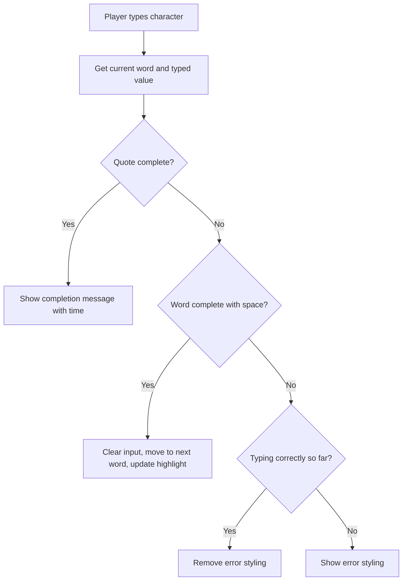
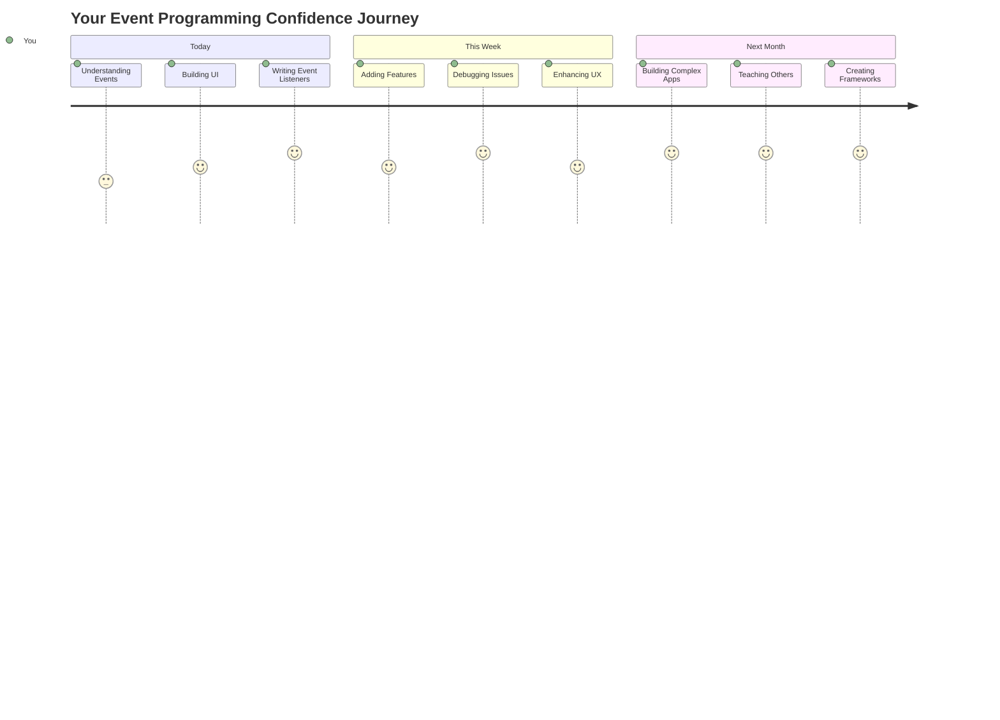

<!--
CO_OP_TRANSLATOR_METADATA:
{
  "original_hash": "da8bc72041a2bb3826a54654ee1a8844",
  "translation_date": "2025-11-03T14:02:32+00:00",
  "source_file": "4-typing-game/typing-game/README.md",
  "language_code": "tl"
}
-->
# Paggawa ng laro gamit ang mga event

Naisip mo na ba kung paano nalalaman ng mga website kapag nag-click ka sa isang button o nag-type sa isang text box? Iyan ang mahika ng event-driven programming! Ano pa ang mas magandang paraan para matutunan ang mahalagang kasanayang ito kundi ang paggawa ng isang kapaki-pakinabang na bagay - isang typing speed game na tumutugon sa bawat pindot mo sa keyboard.

Makikita mo mismo kung paano "nakikipag-usap" ang mga web browser sa iyong JavaScript code. Sa tuwing magki-click, magta-type, o gagalaw ang iyong mouse, nagpapadala ang browser ng maliliit na mensahe (tinatawag natin itong mga event) sa iyong code, at ikaw ang magpapasya kung paano tutugon!

Kapag natapos na natin ito, makakagawa ka ng isang tunay na typing game na sumusubaybay sa iyong bilis at katumpakan. Mas mahalaga, maiintindihan mo ang mga pangunahing konsepto na nagpapatakbo sa bawat interactive na website na nagamit mo. Tara, simulan na natin!

## Pre-Lecture Quiz

[Pre-lecture quiz](https://ff-quizzes.netlify.app/web/quiz/21)

## Event-driven programming

Isipin ang paborito mong app o website - ano ang nagpaparamdam na ito ay buhay at tumutugon? Lahat ng ito ay tungkol sa kung paano ito tumutugon sa iyong ginagawa! Ang bawat tap, click, swipe, o pindot ay lumilikha ng tinatawag nating "event," at dito nagaganap ang tunay na mahika ng web development.

Narito ang dahilan kung bakit kawili-wili ang programming para sa web: hindi natin alam kung kailan magki-click ang isang tao sa button o magsisimulang mag-type sa text box. Maaaring mag-click sila kaagad, maghintay ng limang minuto, o baka hindi mag-click kailanman! Ang kawalang-katiyakan na ito ay nangangahulugan na kailangan nating mag-isip nang iba tungkol sa kung paano natin isusulat ang ating code.

Sa halip na magsulat ng code na tumatakbo mula itaas hanggang ibaba tulad ng isang recipe, nagsusulat tayo ng code na matiyagang naghihintay para sa isang bagay na mangyari. Katulad ito ng kung paano ang mga operator ng telegrapo noong 1800s ay nakaupo sa kanilang mga makina, handang tumugon sa sandaling dumating ang isang mensahe sa wire.

Ano nga ba ang "event"? Sa simpleng salita, ito ay isang bagay na nangyayari! Kapag nag-click ka sa isang button - iyon ay isang event. Kapag nag-type ka ng isang letra - iyon ay isang event. Kapag gumalaw ang iyong mouse - isa pang event iyon.

Ang event-driven programming ay nagbibigay-daan sa atin na i-set up ang ating code upang makinig at tumugon. Gumagawa tayo ng mga espesyal na function na tinatawag na **event listeners** na matiyagang naghihintay para sa mga partikular na bagay na mangyari, pagkatapos ay kumikilos kapag nangyari ang mga ito.

Isipin ang event listeners na parang doorbell para sa iyong code. I-set up mo ang doorbell (`addEventListener()`), sasabihin mo kung anong tunog ang pakikinggan (tulad ng 'click' o 'keypress'), at pagkatapos ay tukuyin kung ano ang dapat mangyari kapag may nag-ring nito (ang iyong custom function).

**Ganito gumagana ang event listeners:**
- **Nakikinig** sa mga partikular na aksyon ng user tulad ng pag-click, pag-type, o paggalaw ng mouse
- **Nagpapatupad** ng iyong custom na code kapag nangyari ang tinukoy na event
- **Tumutugon** kaagad sa mga interaksyon ng user, na lumilikha ng seamless na karanasan
- **Humahawak** ng maraming event sa parehong elemento gamit ang iba't ibang listeners

> **NOTE:** Mahalaga ring tandaan na maraming paraan upang gumawa ng event listeners. Maaari kang gumamit ng anonymous functions, o gumawa ng mga named functions. Maaari kang gumamit ng iba't ibang shortcut, tulad ng pag-set sa `click` property, o paggamit ng `addEventListener()`. Sa ating exercise, magpo-focus tayo sa `addEventListener()` at anonymous functions, dahil ito ang pinakakaraniwang teknik na ginagamit ng mga web developer. Ito rin ang pinaka-flexible, dahil gumagana ang `addEventListener()` para sa lahat ng event, at ang pangalan ng event ay maaaring ibigay bilang parameter.

### Karaniwang mga event

Bagama't nag-aalok ang mga web browser ng dose-dosenang iba't ibang event na maaari mong pakinggan, karamihan sa mga interactive na application ay umaasa lamang sa ilang mahahalagang event. Ang pag-unawa sa mga core event na ito ay magbibigay sa iyo ng pundasyon upang makabuo ng mga sopistikadong interaksyon ng user.

Mayroong [dose-dosenang mga event](https://developer.mozilla.org/docs/Web/Events) na magagamit mo upang pakinggan kapag gumagawa ng application. Karaniwang anumang ginagawa ng user sa isang pahina ay nagdudulot ng event, na nagbibigay sa iyo ng maraming kapangyarihan upang matiyak na makakamit nila ang karanasang nais mo. Sa kabutihang-palad, karaniwang kailangan mo lamang ng ilang mahahalagang event. Narito ang ilang karaniwang mga event (kasama ang dalawa na gagamitin natin sa paggawa ng ating laro):

| Event | Deskripsyon | Karaniwang Gamit |
|-------|-------------|------------------|
| `click` | Nag-click ang user sa isang bagay | Mga button, link, interactive na elemento |
| `contextmenu` | Nag-right click ang user gamit ang mouse | Custom na right-click na menu |
| `select` | Nag-highlight ang user ng ilang teksto | Pag-edit ng teksto, mga operasyon ng kopya |
| `input` | Nag-input ang user ng teksto | Pag-validate ng form, real-time na paghahanap |

**Pag-unawa sa mga uri ng event na ito:**
- **Nagti-trigger** kapag nakipag-interact ang mga user sa mga partikular na elemento sa iyong pahina
- **Nagbibigay** ng detalyadong impormasyon tungkol sa aksyon ng user sa pamamagitan ng event objects
- **Nagpapahintulot** sa iyo na lumikha ng mga tumutugon, interactive na web application
- **Gumagana** nang pare-pareho sa iba't ibang browser at device

## Paggawa ng laro

Ngayon na nauunawaan mo kung paano gumagana ang mga event, ilagay natin ang kaalamang iyon sa praktika sa pamamagitan ng paggawa ng isang kapaki-pakinabang na bagay. Gagawa tayo ng typing speed game na nagpapakita ng event handling habang tinutulungan kang bumuo ng isang mahalagang kasanayan bilang developer.

Gagawa tayo ng laro upang tuklasin kung paano gumagana ang mga event sa JavaScript. Susubukan ng ating laro ang kasanayan ng isang manlalaro sa pag-type, na isa sa mga pinaka-underrated na kasanayan na dapat taglayin ng lahat ng developer. Fun fact: ang QWERTY keyboard layout na ginagamit natin ngayon ay talagang dinisenyo noong 1870s para sa mga typewriter - at ang mahusay na kasanayan sa pag-type ay mahalaga pa rin para sa mga programmer ngayon! Ang pangkalahatang daloy ng laro ay ganito:



**Ganito gumagana ang ating laro:**
- **Nagsisimula** kapag nag-click ang manlalaro sa start button at nagpapakita ng random na quote
- **Sinusubaybayan** ang progreso ng pag-type ng manlalaro word by word sa real-time
- **Ine-highlight** ang kasalukuyang salita upang gabayan ang focus ng manlalaro
- **Nagbibigay** ng agarang visual feedback para sa mga error sa pag-type
- **Kinakalkula** at ipinapakita ang kabuuang oras kapag natapos ang quote

Simulan na natin ang paggawa ng ating laro, at matutunan ang tungkol sa mga event!

### File structure

Bago tayo magsimulang mag-code, mag-organize muna tayo! Ang pagkakaroon ng malinis na file structure mula sa simula ay makakatulong upang maiwasan ang sakit ng ulo sa hinaharap at gawing mas propesyonal ang iyong proyekto. 😊

Mananatili tayo sa simpleng setup na may tatlong file lamang: `index.html` para sa istruktura ng pahina, `script.js` para sa lahat ng game logic, at `style.css` upang gawing maganda ang lahat. Ito ang klasikong trio na nagpapatakbo ng karamihan sa web!

**Gumawa ng bagong folder para sa iyong trabaho sa pamamagitan ng pagbukas ng console o terminal window at pag-type ng sumusunod na command:**

```bash
# Linux or macOS
mkdir typing-game && cd typing-game

# Windows
md typing-game && cd typing-game
```

**Ganito ang ginagawa ng mga command na ito:**
- **Gumagawa** ng bagong direktoryo na tinatawag na `typing-game` para sa iyong mga file ng proyekto
- **Nag-navigate** sa bagong likhang direktoryo nang awtomatiko
- **Nagse-set up** ng malinis na workspace para sa iyong game development

**Buksan ang Visual Studio Code:**

```bash
code .
```

**Ang command na ito:**
- **Nagla-launch** ng Visual Studio Code sa kasalukuyang direktoryo
- **Binubuksan** ang iyong project folder sa editor
- **Nagbibigay** ng access sa lahat ng development tools na kakailanganin mo

**Magdagdag ng tatlong file sa folder sa Visual Studio Code na may mga sumusunod na pangalan:**
- `index.html` - Naglalaman ng istruktura at nilalaman ng iyong laro
- `script.js` - Humahawak sa lahat ng game logic at event listeners
- `style.css` - Nagde-define ng visual appearance at styling

## Gumawa ng user interface

Ngayon, gawin natin ang stage kung saan magaganap ang lahat ng aksyon sa ating laro! Isipin ito na parang disenyo ng control panel para sa isang spaceship - kailangan nating tiyakin na ang lahat ng kailangan ng ating mga manlalaro ay nasa tamang lugar.

Alamin natin kung ano ang talagang kailangan ng ating laro. Kung ikaw ay naglalaro ng typing game, ano ang gusto mong makita sa screen? Narito ang mga kailangan natin:

| UI Element | Layunin | HTML Element |
|------------|---------|-------------|
| Quote Display | Nagpapakita ng text na ita-type | `<p>` na may `id="quote"` |
| Message Area | Nagpapakita ng status at success messages | `<p>` na may `id="message"` |
| Text Input | Kung saan nagta-type ang mga manlalaro ng quote | `<input>` na may `id="typed-value"` |
| Start Button | Nagsisimula ng laro | `<button>` na may `id="start"` |

**Pag-unawa sa istruktura ng UI:**
- **Inaayos** ang nilalaman nang lohikal mula itaas pababa
- **Nag-aassign** ng mga unique IDs sa mga elemento para sa JavaScript targeting
- **Nagbibigay** ng malinaw na visual hierarchy para sa mas mahusay na karanasan ng user
- **Kasama** ang semantic HTML elements para sa accessibility

Ang bawat isa sa mga ito ay kakailanganin ng mga ID upang magamit natin ang mga ito sa ating JavaScript. Magdaragdag din tayo ng mga reference sa CSS at JavaScript files na gagawin natin.

Gumawa ng bagong file na pinangalanang `index.html`. Idagdag ang sumusunod na HTML:

```html
<!-- inside index.html -->
<html>
<head>
  <title>Typing game</title>
  <link rel="stylesheet" href="style.css">
</head>
<body>
  <h1>Typing game!</h1>
  <p>Practice your typing skills with a quote from Sherlock Holmes. Click **start** to begin!</p>
  <p id="quote"></p> <!-- This will display our quote -->
  <p id="message"></p> <!-- This will display any status messages -->
  <div>
    <input type="text" aria-label="current word" id="typed-value" /> <!-- The textbox for typing -->
    <button type="button" id="start">Start</button> <!-- To start the game -->
  </div>
  <script src="script.js"></script>
</body>
</html>
```

**Pag-unawa sa nagagawa ng istruktura ng HTML na ito:**
- **Nagli-link** sa CSS stylesheet sa `<head>` para sa styling
- **Gumagawa** ng malinaw na heading at mga instruksyon para sa mga user
- **Nag-eestablish** ng placeholder paragraphs na may mga partikular na ID para sa dynamic content
- **Kasama** ang input field na may accessibility attributes
- **Nagbibigay** ng start button upang i-trigger ang laro
- **Naglo-load** ng JavaScript file sa dulo para sa optimal na performance

### I-launch ang application

Ang madalas na pag-test sa iyong application habang nagde-develop ay nakakatulong upang mahanap ang mga isyu nang maaga at makita ang iyong progreso sa real-time. Ang Live Server ay isang napakahalagang tool na awtomatikong nagre-refresh ng iyong browser tuwing nagsa-save ka ng mga pagbabago, na ginagawang mas epektibo ang development.

Palaging pinakamahusay na mag-develop nang paunti-unti upang makita kung paano ang hitsura ng mga bagay. I-launch natin ang ating application. Mayroong isang kahanga-hangang extension para sa Visual Studio Code na tinatawag na [Live Server](https://marketplace.visualstudio.com/items?itemName=ritwickdey.LiveServer&WT.mc_id=academic-77807-sagibbon) na magho-host ng iyong application locally at magre-refresh ng browser sa tuwing magsa-save ka.

**I-install ang [Live Server](https://marketplace.visualstudio.com/items?itemName=ritwickdey.LiveServer&WT.mc_id=academic-77807-sagibbon) sa pamamagitan ng pagsunod sa link at pag-click sa Install:**

**Narito ang nangyayari sa panahon ng pag-install:**
- **Nagpo-prompt** sa iyong browser na buksan ang Visual Studio Code
- **Gumagabay** sa iyo sa proseso ng pag-install ng extension
- **Maaaring mangailangan** ng pag-restart ng Visual Studio Code upang makumpleto ang setup

**Kapag na-install na, sa Visual Studio Code, pindutin ang Ctrl-Shift-P (o Cmd-Shift-P) upang buksan ang command palette:**

**Pag-unawa sa command palette:**
- **Nagbibigay** ng mabilis na access sa lahat ng VS Code commands
- **Nagha-hanap** ng mga command habang nagta-type ka
- **Nag-aalok** ng mga keyboard shortcut para sa mas mabilis na development

**I-type ang "Live Server: Open with Live Server":**

**Ano ang ginagawa ng Live Server:**
- **Nag-i-start** ng local development server para sa iyong proyekto
- **Awtomatikong** nagre-refresh ng browser kapag nagsa-save ng mga file
- **Nagse-serve** ng iyong mga file mula sa local URL (karaniwang `localhost:5500`)

**Buksan ang browser at pumunta sa `https://localhost:5500`:**

Makikita mo na ngayon ang pahinang ginawa mo! Magdagdag na tayo ng functionality.

## Idagdag ang CSS

Ngayon, gawing maganda ang mga bagay! Ang visual feedback ay mahalaga para sa user interfaces mula pa noong unang panahon ng computing. Noong 1980s, natuklasan ng mga mananaliksik na ang agarang visual feedback ay lubos na nagpapabuti sa performance ng user at nagpapababa ng mga error. Iyan mismo ang gagawin natin.

Ang ating laro ay kailangang maging malinaw kung ano ang nangyayari. Dapat agad malaman ng mga manlalaro kung aling salita ang dapat nilang i-type, at kung nagkamali sila, dapat nila itong makita kaagad. Gumawa tayo ng simple ngunit epektibong styling:

Gumawa ng bagong file na pinangalanang `style.css` at idagdag ang sumusunod na syntax.

```css
/* inside style.css */
.highlight {
  background-color: yellow;
}

.error {
  background-color: lightcoral;
  border: red;
}
```

**Pag-unawa sa mga CSS classes na ito:**
- **Ine-highlight** ang kasalukuyang salita gamit ang yellow background para sa malinaw na visual guidance
- **Nagpapahiwatig** ng mga error sa pag-type gamit ang light coral background color
- **Nagbibigay** ng agarang feedback nang hindi nakakaabala sa daloy ng pag-type ng user
- **Gumagamit** ng contrasting colors para sa accessibility at malinaw na visual communication

✅ Pagdating sa CSS, maaari mong i-layout ang iyong pahina ayon sa gusto mo. Maglaan ng kaunting oras at gawing mas kaakit-akit ang pahina:

- Pumili ng ibang font
- Kulayan ang mga headers
- I-resize ang mga item

## JavaScript

Narito ang masaya! 🎉 Mayroon na tayong HTML structure at CSS styling, ngunit sa ngayon ang ating laro ay parang maganda ngunit walang makina. Ang JavaScript ang magiging makina - ito ang magpapagana sa lahat at magpaparamdam na tumutugon sa ginagawa ng mga manlalaro.

Dito mo makikita ang iyong likha na nabubuhay. Gagawin natin ito nang hakbang-hakbang upang hindi ito maging nakaka-overwhelm:

| Hakbang | Layunin | Matututunan Mo |
|--------|---------|----------------|
| [Gumawa ng constants](../../../../4-typing-game/typing-game) | I-set up ang quotes at DOM references | Pamamahala ng variable at DOM selection |
| [Event listener para simulan ang laro](../../../../4-typing-game/typing-game) | Pangasiwaan ang game initialization | Event handling at UI updates |
| [Event listener para sa pag-type](../../../../4-typing-game/typing-game) | Proseso ng user input sa real-time | Input validation at dynamic feedback |

**Ang structured approach na ito ay tumutulong sa iyo:**
- **Inaayos** ang iyong code sa lohikal, manageable na mga seksyon
- **Nagbuo** ng functionality nang paunti-unti para sa mas madaling debugging
- **Naiintindihan** kung paano nagtutulungan ang iba't ibang bahagi ng iyong application
- **Lumilikha** ng reusable patterns para sa mga susunod na proyekto

Ngunit una, gumawa ng bagong file na pinangalanang `script.js`.

### Idagdag ang constants

Bago tayo sumabak sa aksyon, kolektahin muna natin ang lahat ng ating resources! Katulad ng kung paano naghahanda ang NASA mission control ng lahat ng kanilang monitoring systems bago ang launch, mas madali kapag handa na ang lahat. Nakakatipid ito sa atin mula sa paghahanap ng mga bagay-bagay sa hinaharap at nakakatulong na maiwasan ang mga typo.

Narito ang mga kailangan nating i-set up muna:

| Uri ng Data | Layunin | Halimbawa |
|-------------|---------|----------|
| Array ng mga quote | I-store ang lahat ng posibleng quote para sa laro | `['Quote 1', 'Quote 2', ...]` |
| Word array | Hatiin ang kasalukuyang quote sa mga indibidwal na salita | `['When', 'you', 'have', ...]` |
| Word index | Subaybayan kung aling salita ang tina-type ng player | `0, 1, 2, 3...` |
| Start time | Kalkulahin ang lumipas na oras para sa scoring | `Date.now()` |

**Kailangan din natin ng mga reference sa ating mga UI element:**
| Elemento | ID | Layunin |
|----------|----|---------|
| Text input | `typed-value` | Kung saan nagta-type ang mga player |
| Quote display | `quote` | Ipinapakita ang quote na ita-type |
| Message area | `message` | Nagpapakita ng mga status update |

```javascript
// inside script.js
// all of our quotes
const quotes = [
    'When you have eliminated the impossible, whatever remains, however improbable, must be the truth.',
    'There is nothing more deceptive than an obvious fact.',
    'I ought to know by this time that when a fact appears to be opposed to a long train of deductions it invariably proves to be capable of bearing some other interpretation.',
    'I never make exceptions. An exception disproves the rule.',
    'What one man can invent another can discover.',
    'Nothing clears up a case so much as stating it to another person.',
    'Education never ends, Watson. It is a series of lessons, with the greatest for the last.',
];
// store the list of words and the index of the word the player is currently typing
let words = [];
let wordIndex = 0;
// the starting time
let startTime = Date.now();
// page elements
const quoteElement = document.getElementById('quote');
const messageElement = document.getElementById('message');
const typedValueElement = document.getElementById('typed-value');
```

**Paghiwa-hiwalay ng mga nagagawa ng setup code na ito:**
- **Nag-iimbak** ng array ng mga quote ni Sherlock Holmes gamit ang `const` dahil hindi magbabago ang mga quote
- **Nag-i-initialize** ng mga tracking variable gamit ang `let` dahil magbabago ang mga value na ito habang naglalaro
- **Kinukuha** ang mga reference sa mga DOM element gamit ang `document.getElementById()` para sa mas mabilis na access
- **Nagsesetup** ng pundasyon para sa lahat ng functionality ng laro gamit ang malinaw at deskriptibong mga pangalan ng variable
- **Inaayos** ang mga kaugnay na data at elemento nang lohikal para sa mas madaling maintenance ng code

✅ Magdagdag ng mas maraming quote sa iyong laro

> 💡 **Pro Tip**: Maaari nating kunin ang mga elemento kahit kailan sa code gamit ang `document.getElementById()`. Dahil madalas nating ire-refer ang mga elementong ito, iiwasan natin ang mga typo sa string literals sa pamamagitan ng paggamit ng constants. Ang mga framework tulad ng [Vue.js](https://vuejs.org/) o [React](https://reactjs.org/) ay makakatulong sa mas mahusay na pamamahala ng sentralisasyon ng iyong code.
>
**Bakit epektibo ang approach na ito:**
- **Pinipigilan** ang mga maling spelling kapag nire-refer ang mga elemento nang maraming beses
- **Pinapabuti** ang readability ng code gamit ang deskriptibong pangalan ng constants
- **Nagbibigay-daan** sa mas mahusay na suporta ng IDE gamit ang autocomplete at error checking
- **Ginagawang** mas madali ang refactoring kung magbabago ang mga ID ng elemento sa hinaharap

Maglaan ng oras para manood ng video tungkol sa paggamit ng `const`, `let`, at `var`

[](https://youtube.com/watch?v=JNIXfGiDWM8 "Mga Uri ng Variable")

> 🎥 I-click ang imahe sa itaas para sa video tungkol sa mga variable.

### Magdagdag ng start logic

Dito magsisimula ang lahat! 🚀 Malapit ka nang magsulat ng iyong unang tunay na event listener, at may kakaibang kasiyahan sa pagtingin sa iyong code na tumutugon sa isang button click.

Isipin mo: may isang player na magki-click sa "Start" button, at kailangang handa ang iyong code para sa kanila. Hindi natin alam kung kailan nila ito i-click - maaaring agad-agad, maaaring pagkatapos nilang mag-kape - pero kapag ginawa nila, magsisimula ang iyong laro.

Kapag nag-click ang user sa `start`, kailangan nating pumili ng quote, i-setup ang user interface, at i-setup ang tracking para sa kasalukuyang salita at timing. Narito ang JavaScript na kailangan mong idagdag; tatalakayin natin ito pagkatapos ng script block.

```javascript
// at the end of script.js
document.getElementById('start').addEventListener('click', () => {
  // get a quote
  const quoteIndex = Math.floor(Math.random() * quotes.length);
  const quote = quotes[quoteIndex];
  // Put the quote into an array of words
  words = quote.split(' ');
  // reset the word index for tracking
  wordIndex = 0;

  // UI updates
  // Create an array of span elements so we can set a class
  const spanWords = words.map(function(word) { return `<span>${word} </span>`});
  // Convert into string and set as innerHTML on quote display
  quoteElement.innerHTML = spanWords.join('');
  // Highlight the first word
  quoteElement.childNodes[0].className = 'highlight';
  // Clear any prior messages
  messageElement.innerText = '';

  // Setup the textbox
  // Clear the textbox
  typedValueElement.value = '';
  // set focus
  typedValueElement.focus();
  // set the event handler

  // Start the timer
  startTime = new Date().getTime();
});
```

**Paghiwa-hiwalay ng code sa lohikal na mga seksyon:**

**📊 Word Tracking Setup:**
- **Pinipili** ang random na quote gamit ang `Math.floor()` at `Math.random()` para sa variety
- **Kinoconvert** ang quote sa isang array ng mga indibidwal na salita gamit ang `split(' ')`
- **Ire-reset** ang `wordIndex` sa 0 dahil magsisimula ang mga player sa unang salita
- **Ine-prepare** ang estado ng laro para sa bagong round

**🎨 UI Setup at Display:**
- **Gumagawa** ng array ng `<span>` elements, binabalot ang bawat salita para sa indibidwal na styling
- **Pinagsasama** ang mga span element sa isang string para sa mas mabilis na pag-update ng DOM
- **Ine-highlight** ang unang salita sa pamamagitan ng pagdaragdag ng `highlight` CSS class
- **Nililinis** ang anumang naunang mensahe ng laro para sa malinis na simula

**⌨️ Textbox Preparation:**
- **Nililinis** ang anumang existing na text sa input field
- **Itinatakda ang focus** sa textbox para makapagsimula agad ang mga player sa pagta-type
- **Ine-prepare** ang input area para sa bagong session ng laro

**⏱️ Timer Initialization:**
- **Kinukuha** ang kasalukuyang timestamp gamit ang `new Date().getTime()`
- **Nagbibigay-daan** sa tumpak na kalkulasyon ng bilis ng pagta-type at oras ng pagkumpleto
- **Sinisimulan** ang performance tracking para sa session ng laro

### Magdagdag ng typing logic

Dito natin haharapin ang puso ng ating laro! Huwag mag-alala kung mukhang marami ito sa simula - dadaanan natin ang bawat bahagi, at sa huli, makikita mo kung gaano ito ka-lohikal.

Ang binubuo natin dito ay medyo sopistikado: bawat beses na may magta-type ng letra, iche-check ng ating code ang kanilang tina-type, bibigyan sila ng feedback, at magdedesisyon kung ano ang susunod na mangyayari. Katulad ito ng kung paano nagbibigay ng real-time feedback ang mga unang word processor tulad ng WordStar noong 1970s sa mga nagta-type.

```javascript
// at the end of script.js
typedValueElement.addEventListener('input', () => {
  // Get the current word
  const currentWord = words[wordIndex];
  // get the current value
  const typedValue = typedValueElement.value;

  if (typedValue === currentWord && wordIndex === words.length - 1) {
    // end of sentence
    // Display success
    const elapsedTime = new Date().getTime() - startTime;
    const message = `CONGRATULATIONS! You finished in ${elapsedTime / 1000} seconds.`;
    messageElement.innerText = message;
  } else if (typedValue.endsWith(' ') && typedValue.trim() === currentWord) {
    // end of word
    // clear the typedValueElement for the new word
    typedValueElement.value = '';
    // move to the next word
    wordIndex++;
    // reset the class name for all elements in quote
    for (const wordElement of quoteElement.childNodes) {
      wordElement.className = '';
    }
    // highlight the new word
    quoteElement.childNodes[wordIndex].className = 'highlight';
  } else if (currentWord.startsWith(typedValue)) {
    // currently correct
    // highlight the next word
    typedValueElement.className = '';
  } else {
    // error state
    typedValueElement.className = 'error';
  }
});
```

**Pag-unawa sa daloy ng typing logic:**

Ang function na ito ay gumagamit ng waterfall approach, na nagche-check ng mga kondisyon mula sa pinaka-specific hanggang sa pinaka-general. Hatiin natin ang bawat senaryo:



**🏁 Quote Complete (Senaryo 1):**
- **Sinusuri** kung ang typed value ay tumutugma sa kasalukuyang salita AT nasa huling salita na tayo
- **Kinakalkula** ang lumipas na oras sa pamamagitan ng pagbabawas ng start time mula sa kasalukuyang oras
- **Kinoconvert** ang milliseconds sa seconds sa pamamagitan ng paghahati sa 1,000
- **Ipinapakita** ang congratulatory message na may completion time

**✅ Word Complete (Senaryo 2):**
- **Nadidetect** ang pagkumpleto ng salita kapag ang input ay nagtatapos sa space
- **Ine-validate** na ang trimmed input ay eksaktong tumutugma sa kasalukuyang salita
- **Nililinis** ang input field para sa susunod na salita
- **Umaabante** sa susunod na salita sa pamamagitan ng pag-increment ng `wordIndex`
- **Ina-update** ang visual highlighting sa pamamagitan ng pag-aalis ng lahat ng klase at pag-highlight sa bagong salita

**📝 Typing in Progress (Senaryo 3):**
- **Sinusuri** na ang kasalukuyang salita ay nagsisimula sa kung ano ang na-type na
- **Inaalis** ang anumang error styling para ipakita na tama ang input
- **Pinapayagan** ang patuloy na pagta-type nang walang interruption

**❌ Error State (Senaryo 4):**
- **Nagti-trigger** kapag ang na-type na teksto ay hindi tumutugma sa inaasahang simula ng salita
- **Nag-aapply** ng error CSS class para magbigay ng agarang visual feedback
- **Tumutulong** sa mga player na mabilis na matukoy at maitama ang mga pagkakamali

## Subukan ang iyong aplikasyon

Tingnan ang iyong nagawa! 🎉 Nakatapos ka lang ng isang tunay na gumaganang typing game mula sa simula gamit ang event-driven programming. Maglaan ng sandali para pahalagahan ito - hindi ito maliit na bagay!

Ngayon ay dumating ang testing phase! Gagana ba ito ayon sa inaasahan? May nakaligtaan ba tayo? Narito ang bagay: kung may hindi gumana nang perpekto agad, normal lang iyon. Kahit ang mga bihasang developer ay regular na nakakahanap ng mga bug sa kanilang code. Bahagi ito ng proseso ng pag-develop!

I-click ang `start`, at magsimulang mag-type! Dapat itong magmukhang katulad ng animation na nakita natin dati.


**Ano ang dapat i-test sa iyong aplikasyon:**
- **Sinusuri** na ang pag-click sa Start ay nagpapakita ng random na quote
- **Kinukumpirma** na ang pagta-type ay ine-highlight ang kasalukuyang salita nang tama
- **Sinusuri** na lumalabas ang error styling para sa maling pagta-type
- **Tinitiyak** na ang pagkumpleto ng mga salita ay maayos na umaabante sa highlight
- **Sinusubukan** na ang pagtatapos ng quote ay nagpapakita ng completion message na may timing

**Mga karaniwang debugging tips:**
- **Suriin** ang browser console (F12) para sa mga error sa JavaScript
- **Siguraduhin** na ang lahat ng pangalan ng file ay eksaktong tumutugma (case-sensitive)
- **Tiyakin** na ang Live Server ay tumatakbo at nagre-refresh nang maayos
- **Subukan** ang iba't ibang quote para masigurado na gumagana ang random selection

---

## Hamon ng GitHub Copilot Agent 🎮

Gamitin ang Agent mode para tapusin ang sumusunod na hamon:

**Deskripsyon:** Palawakin ang typing game sa pamamagitan ng pag-implement ng difficulty system na ina-adjust ang laro base sa performance ng player. Ang hamon na ito ay makakatulong sa iyo na magpraktis ng advanced event handling, data analysis, at dynamic UI updates.

**Prompt:** Gumawa ng difficulty adjustment system para sa typing game na:
1. Subaybayan ang bilis ng pagta-type ng player (words per minute) at accuracy percentage
2. Awtomatikong ina-adjust sa tatlong difficulty level: Madali (simpleng mga quote), Katamtaman (kasalukuyang mga quote), Mahirap (mga kumplikadong quote na may punctuation)
3. Ipinapakita ang kasalukuyang difficulty level at player statistics sa UI
4. Nagpapatupad ng streak counter na nagpapataas ng difficulty pagkatapos ng 3 sunod-sunod na magagandang performance
5. Nagdadagdag ng visual feedback (kulay, animation) para ipakita ang mga pagbabago sa difficulty

Magdagdag ng kinakailangang HTML elements, CSS styles, at JavaScript functions para ma-implement ang feature na ito. Isama ang tamang error handling at tiyakin na nananatiling accessible ang laro gamit ang angkop na ARIA labels.

Alamin pa ang tungkol sa [agent mode](https://code.visualstudio.com/blogs/2025/02/24/introducing-copilot-agent-mode) dito.

## 🚀 Hamon

Handa ka na bang dalhin ang iyong typing game sa susunod na antas? Subukan ang pag-implement ng mga advanced na feature na ito upang mas mapalalim ang iyong kaalaman sa event handling at DOM manipulation:

**Magdagdag ng mas maraming functionality:**

| Feature | Deskripsyon | Mga Kasanayang Mapapraktis |
|---------|-------------|----------------------------|
| **Input Control** | I-disable ang `input` event listener kapag natapos, at i-enable ito kapag na-click ang button | Pamamahala ng event at state control |
| **UI State Management** | I-disable ang textbox kapag natapos ng player ang quote | Manipulasyon ng DOM properties |
| **Modal Dialog** | Magpakita ng modal dialog box na may success message | Advanced UI patterns at accessibility |
| **High Score System** | I-store ang high scores gamit ang `localStorage` | Browser storage APIs at data persistence |

**Mga tip sa implementasyon:**
- **Mag-research** sa `localStorage.setItem()` at `localStorage.getItem()` para sa persistent storage
- **Magpraktis** sa pagdaragdag at pag-aalis ng event listeners nang dynamic
- **Mag-explore** sa HTML dialog elements o CSS modal patterns
- **Isaalang-alang** ang accessibility kapag nagdi-disable at nag-e-enable ng form controls

## Post-Lecture Quiz

[Post-lecture quiz](https://ff-quizzes.netlify.app/web/quiz/22)

---

## 🚀 Ang Iyong Typing Game Mastery Timeline

### ⚡ **Ano ang Magagawa Mo sa Susunod na 5 Minuto**
- [ ] Subukan ang iyong typing game gamit ang iba't ibang quote para masigurado na gumagana ito nang maayos
- [ ] Mag-eksperimento sa CSS styling - subukang baguhin ang highlight at error colors
- [ ] Buksan ang DevTools ng iyong browser (F12) at panoorin ang Console habang naglalaro
- [ ] Hamunin ang sarili na tapusin ang isang quote nang pinakamabilis

### ⏰ **Ano ang Maaaring Magawa Mo sa Loob ng Isang Oras**
- [ ] Magdagdag ng mas maraming quote sa array (maaaring mula sa iyong paboritong libro o pelikula)
- [ ] I-implement ang localStorage high score system mula sa challenge section
- [ ] Gumawa ng words-per-minute calculator na nagpapakita pagkatapos ng bawat laro
- [ ] Magdagdag ng sound effects para sa tamang pagta-type, mga error, at pagkumpleto

### 📅 **Ang Iyong Lingguhang Pakikipagsapalaran**
- [ ] Gumawa ng multiplayer na bersyon kung saan maaaring magkompetensya ang mga kaibigan
- [ ] Gumawa ng iba't ibang difficulty levels na may iba't ibang complexity ng quote
- [ ] Magdagdag ng progress bar na nagpapakita kung gaano karami sa quote ang natapos
- [ ] Magpatupad ng user accounts na may personal statistics tracking
- [ ] Magdisenyo ng custom themes at hayaan ang mga user na pumili ng kanilang gustong estilo

### 🗓️ **Ang Iyong Buwanang Transformasyon**
- [ ] Gumawa ng typing course na may mga lesson na unti-unting nagtuturo ng tamang paglalagay ng daliri
- [ ] Gumawa ng analytics na nagpapakita kung aling mga letra o salita ang nagdudulot ng pinakamaraming error
- [ ] Magdagdag ng suporta para sa iba't ibang wika at layout ng keyboard
- [ ] Mag-integrate sa mga educational APIs para kumuha ng mga quote mula sa mga database ng literatura
- [ ] I-publish ang iyong pinahusay na typing game para magamit at ma-enjoy ng iba

### 🎯 **Final Reflection Check-in**

**Bago ka magpatuloy, maglaan ng sandali para magdiwang:**
- Ano ang pinakamasayang sandali habang ginagawa ang larong ito?
- Ano ang nararamdaman mo tungkol sa event-driven programming kumpara noong nagsimula ka?
- Ano ang isang feature na excited kang idagdag para gawing natatangi ang larong ito?
- Paano mo maaaring i-apply ang mga konsepto ng event handling sa iba pang proyekto?



> 🌟 **Tandaan**: Nakatapos ka lang ng isa sa mga pangunahing konsepto na nagpapagana sa bawat interactive na website at aplikasyon. Ang event-driven programming ang dahilan kung bakit ang web ay parang buhay at tumutugon. Tuwing makakakita ka ng dropdown menu, isang form na nagva-validate habang nagta-type, o isang laro na tumutugon sa iyong mga click, naiintindihan mo na ngayon ang magic sa likod nito. Hindi ka lang natututo mag-code - natututo kang lumikha ng mga karanasan na intuitive at engaging! 🎉

---

## Review & Self Study

Magbasa tungkol sa [lahat ng mga event na available](https://developer.mozilla.org/docs/Web/Events) sa developer sa pamamagitan ng web browser, at isaalang-alang ang mga senaryo kung saan gagamitin mo ang bawat isa.

## Assignment

[Gumawa ng bagong keyboard game](assignment.md)

---

**Paunawa**:  
Ang dokumentong ito ay isinalin gamit ang AI translation service na [Co-op Translator](https://github.com/Azure/co-op-translator). Bagamat sinisikap naming maging tumpak, mangyaring tandaan na ang mga awtomatikong pagsasalin ay maaaring maglaman ng mga pagkakamali o hindi pagkakatugma. Ang orihinal na dokumento sa kanyang katutubong wika ang dapat ituring na opisyal na sanggunian. Para sa mahalagang impormasyon, inirerekomenda ang propesyonal na pagsasalin ng tao. Hindi kami mananagot sa anumang hindi pagkakaunawaan o maling interpretasyon na dulot ng paggamit ng pagsasaling ito.