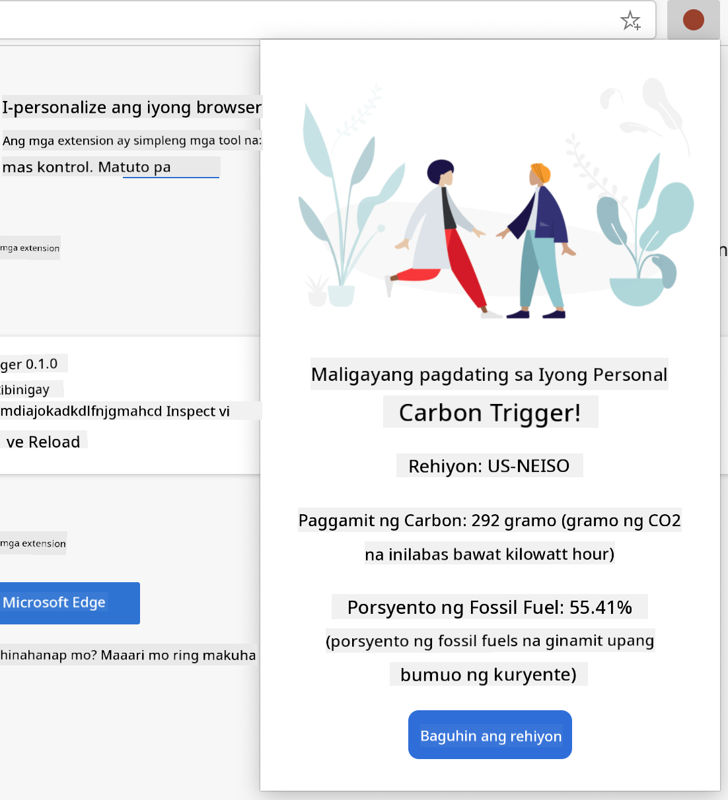

<!--
CO_OP_TRANSLATOR_METADATA:
{
  "original_hash": "0bb55e0b98600afab801eea115228873",
  "translation_date": "2025-08-27T22:18:03+00:00",
  "source_file": "5-browser-extension/1-about-browsers/README.md",
  "language_code": "tl"
}
-->
# Browser Extension Project Part 1: Tungkol sa Mga Browser


> Sketchnote ni [Wassim Chegham](https://dev.to/wassimchegham/ever-wondered-what-happens-when-you-type-in-a-url-in-an-address-bar-in-a-browser-3dob)

## Pre-Lecture Quiz

[Pre-lecture quiz](https://ff-quizzes.netlify.app/web/quiz/23)

### Panimula

Ang mga browser extension ay nagdadagdag ng karagdagang functionality sa isang browser. Ngunit bago ka gumawa ng isa, mahalagang maunawaan kung paano gumagana ang mga browser.

### Tungkol sa Browser

Sa serye ng mga araling ito, matututuhan mong gumawa ng browser extension na gagana sa Chrome, Firefox, at Edge browsers. Sa bahaging ito, matutuklasan mo kung paano gumagana ang mga browser at bubuuin ang mga elemento ng browser extension.

Ngunit ano nga ba ang browser? Isa itong software application na nagbibigay-daan sa end user na ma-access ang nilalaman mula sa isang server at maipakita ito sa mga web page.

✅ Kaunting kasaysayan: ang unang browser ay tinawag na 'WorldWideWeb' at nilikha ni Sir Timothy Berners-Lee noong 1990.


> Ilang mga naunang browser, mula kay [Karen McGrane](https://www.slideshare.net/KMcGrane/week-4-ixd-history-personal-computing)

Kapag ang isang user ay kumonekta sa internet gamit ang isang URL (Uniform Resource Locator) address, karaniwang gamit ang Hypertext Transfer Protocol sa pamamagitan ng `http` o `https` address, ang browser ay nakikipag-ugnayan sa isang web server at kinukuha ang isang web page.

Sa puntong ito, ang rendering engine ng browser ang nagpapakita nito sa device ng user, maaaring ito ay isang mobile phone, desktop, o laptop.

May kakayahan din ang mga browser na mag-cache ng nilalaman upang hindi na ito kailangang kunin mula sa server sa bawat pagkakataon. Maaari rin nilang i-record ang kasaysayan ng browsing activity ng user, mag-imbak ng 'cookies', na maliliit na piraso ng data na naglalaman ng impormasyon para sa pag-iimbak ng aktibidad ng user, at marami pang iba.

Isang mahalagang bagay na dapat tandaan tungkol sa mga browser ay hindi lahat ng mga ito ay pareho! Ang bawat browser ay may kani-kaniyang lakas at kahinaan, at mahalaga para sa isang propesyonal na web developer na maunawaan kung paano gawing mahusay ang performance ng mga web page sa iba't ibang browser. Kasama rito ang paghawak sa maliliit na viewports tulad ng sa isang mobile phone, pati na rin ang user na offline.

Isang kapaki-pakinabang na website na dapat mong i-bookmark sa kahit anong browser na ginagamit mo ay ang [caniuse.com](https://www.caniuse.com). Kapag gumagawa ka ng mga web page, napakahalaga na gamitin ang mga listahan ng mga suportadong teknolohiya ng caniuse upang mas mahusay mong masuportahan ang iyong mga user.

✅ Paano mo malalaman kung aling mga browser ang pinakapopular sa mga gumagamit ng iyong website? Tingnan ang iyong analytics - maaari kang mag-install ng iba't ibang analytics packages bilang bahagi ng iyong proseso ng web development, at ipapakita nito kung aling mga browser ang pinakaginagamit ng mga user.

## Mga Browser Extension

Bakit mo gugustuhing gumawa ng browser extension? Kapaki-pakinabang ito para sa mabilisang pag-access sa mga gawain na madalas mong inuulit. Halimbawa, kung madalas mong kailangang suriin ang mga kulay sa iba't ibang web page na iyong ginagamit, maaari kang mag-install ng color-picker browser extension. Kung nahihirapan kang tandaan ang mga password, maaari kang gumamit ng password-management browser extension.

Masaya ring gumawa ng browser extensions. Karaniwan, ang mga ito ay nagma-manage ng limitadong bilang ng mga gawain na mahusay nilang nagagawa.

✅ Ano ang mga paborito mong browser extension? Anong mga gawain ang ginagawa ng mga ito?

### Pag-install ng Extensions

Bago ka magsimulang gumawa, tingnan ang proseso ng paggawa at pag-deploy ng isang browser extension. Bagama't bahagyang nagkakaiba ang bawat browser sa kung paano nila pinamamahalaan ang prosesong ito, halos pareho ang proseso sa Chrome at Firefox tulad ng halimbawa sa Edge:


> Note: Siguraduhing i-toggle ang developer mode at payagan ang extension mula sa ibang mga tindahan.

Sa esensya, ang proseso ay:

- gawin ang iyong extension gamit ang `npm run build` 
- mag-navigate sa browser papunta sa extensions pane gamit ang "Settings and more" button (ang `...` icon) sa kanang itaas
- kung ito ay bagong installation, piliin ang `load unpacked` upang i-upload ang bagong extension mula sa build folder nito (sa ating kaso ito ay `/dist`) 
- o, i-click ang `reload` kung nire-reload mo ang dati nang naka-install na extension

✅ Ang mga tagubiling ito ay para sa mga extension na ikaw mismo ang gumawa; upang mag-install ng mga extension na nailabas na sa browser extension store ng bawat browser, dapat kang mag-navigate sa mga [store](https://microsoftedge.microsoft.com/addons/Microsoft-Edge-Extensions-Home) at i-install ang extension na gusto mo.

### Magsimula Na

Gagawa ka ng browser extension na nagpapakita ng carbon footprint ng iyong rehiyon, ipinapakita ang paggamit ng enerhiya ng iyong rehiyon at ang pinagmulan ng enerhiya. Ang extension ay magkakaroon ng form na nangongolekta ng API key upang ma-access mo ang API ng CO2 Signal.

**Kailangan mo ng:**

- [isang API key](https://www.co2signal.com/); ilagay ang iyong email sa kahon sa pahinang ito at ipapadala ito sa iyo
- ang [code para sa iyong rehiyon](http://api.electricitymap.org/v3/zones) na tumutugma sa [Electricity Map](https://www.electricitymap.org/map) (halimbawa, sa Boston, ginagamit ko ang 'US-NEISO').
- ang [starter code](../../../../5-browser-extension/start). I-download ang `start` folder; kukumpletuhin mo ang code sa folder na ito.
- [NPM](https://www.npmjs.com) - Ang NPM ay isang package management tool; i-install ito nang lokal at ang mga package na nakalista sa iyong `package.json` file ay mai-install para magamit sa iyong web asset

✅ Matuto pa tungkol sa package management sa [napakahusay na Learn module na ito](https://docs.microsoft.com/learn/modules/create-nodejs-project-dependencies/?WT.mc_id=academic-77807-sagibbon)

Maglaan ng oras upang tingnan ang codebase:

dist
    -|manifest.json (dito naka-set ang mga default)
    -|index.html (dito ang front-end HTML markup)
    -|background.js (dito ang background JS)
    -|main.js (built JS)
src
    -|index.js (dito ilalagay ang iyong JS code)

✅ Kapag nakuha mo na ang iyong API key at Region code, itabi ang mga ito sa isang tala para sa hinaharap na paggamit.

### Gumawa ng HTML para sa Extension

Ang extension na ito ay may dalawang view. Isa para mangolekta ng API key at region code:


At ang pangalawa para ipakita ang carbon usage ng rehiyon:



Magsimula tayo sa paggawa ng HTML para sa form at pag-style nito gamit ang CSS.

Sa folder na `/dist`, gagawa ka ng form at isang result area. Sa file na `index.html`, punan ang delineated form area:

```HTML
<form class="form-data" autocomplete="on">
	<div>
		<h2>New? Add your Information</h2>
	</div>
	<div>
		<label for="region">Region Name</label>
		<input type="text" id="region" required class="region-name" />
	</div>
	<div>
		<label for="api">Your API Key from tmrow</label>
		<input type="text" id="api" required class="api-key" />
	</div>
	<button class="search-btn">Submit</button>
</form>	
```
Ito ang form kung saan ilalagay at ise-save ang iyong impormasyon sa local storage.

Susunod, gumawa ng results area; sa ilalim ng final form tag, magdagdag ng ilang divs:

```HTML
<div class="result">
	<div class="loading">loading...</div>
	<div class="errors"></div>
	<div class="data"></div>
	<div class="result-container">
		<p><strong>Region: </strong><span class="my-region"></span></p>
		<p><strong>Carbon Usage: </strong><span class="carbon-usage"></span></p>
		<p><strong>Fossil Fuel Percentage: </strong><span class="fossil-fuel"></span></p>
	</div>
	<button class="clear-btn">Change region</button>
</div>
```
Sa puntong ito, maaari kang mag-try ng build. Siguraduhing i-install ang mga package dependencies ng extension na ito:

```
npm install
```

Ang command na ito ay gagamit ng npm, ang Node Package Manager, upang i-install ang webpack para sa build process ng iyong extension. Makikita mo ang output ng prosesong ito sa pamamagitan ng pagtingin sa `/dist/main.js` - makikita mo na ang code ay na-bundle na.

Sa ngayon, dapat mag-build ang extension at, kung ide-deploy mo ito sa Edge bilang isang extension, makikita mo ang isang form na maayos na naka-display.

Binabati kita, nagawa mo na ang unang hakbang sa paggawa ng isang browser extension. Sa mga susunod na aralin, gagawin mo itong mas functional at kapaki-pakinabang.

---

## 🚀 Hamon

Tingnan ang isang browser extension store at mag-install ng isa sa iyong browser. Maaari mong suriin ang mga file nito sa mga kawili-wiling paraan. Ano ang natuklasan mo?

## Post-Lecture Quiz

[Post-lecture quiz](https://ff-quizzes.netlify.app/web/quiz/24)

## Review at Pag-aaral sa Sarili

Sa araling ito, natutunan mo ang kaunti tungkol sa kasaysayan ng web browser; samantalahin ang pagkakataong ito upang matuto pa tungkol sa kung paano inisip ng mga imbentor ng World Wide Web ang paggamit nito sa pamamagitan ng pagbabasa ng higit pa tungkol sa kasaysayan nito. Ilang kapaki-pakinabang na site ay:

[The History of Web Browsers](https://www.mozilla.org/firefox/browsers/browser-history/)

[History of the Web](https://webfoundation.org/about/vision/history-of-the-web/)

[Isang panayam kay Tim Berners-Lee](https://www.theguardian.com/technology/2019/mar/12/tim-berners-lee-on-30-years-of-the-web-if-we-dream-a-little-we-can-get-the-web-we-want)

## Gawain 

[Restyle your extension](assignment.md)

---

**Paunawa**:  
Ang dokumentong ito ay isinalin gamit ang AI translation service na [Co-op Translator](https://github.com/Azure/co-op-translator). Bagama't sinisikap naming maging tumpak, pakatandaan na ang mga awtomatikong pagsasalin ay maaaring maglaman ng mga pagkakamali o hindi pagkakatugma. Ang orihinal na dokumento sa kanyang katutubong wika ang dapat ituring na opisyal na sanggunian. Para sa mahalagang impormasyon, inirerekomenda ang propesyonal na pagsasalin ng tao. Hindi kami mananagot sa anumang hindi pagkakaunawaan o maling interpretasyon na maaaring magmula sa paggamit ng pagsasaling ito.