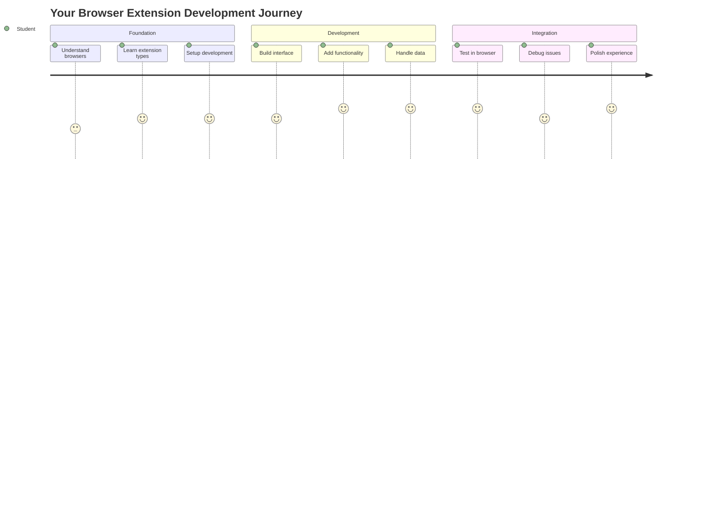
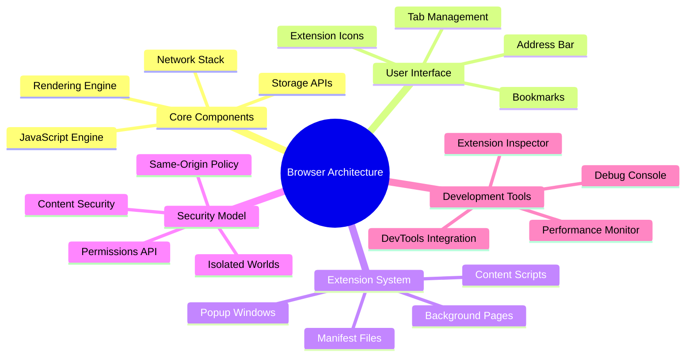
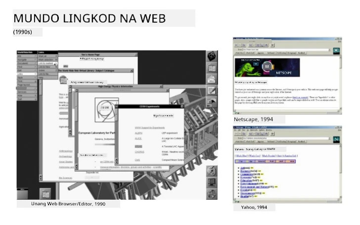
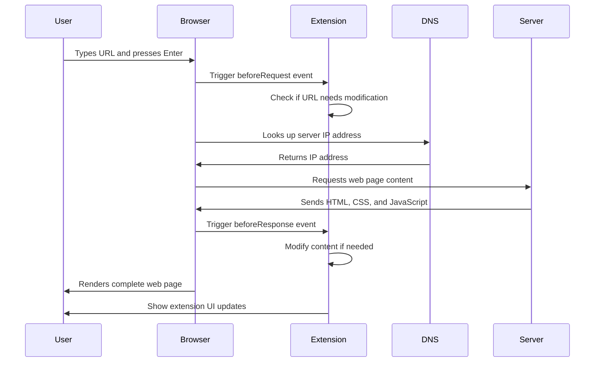
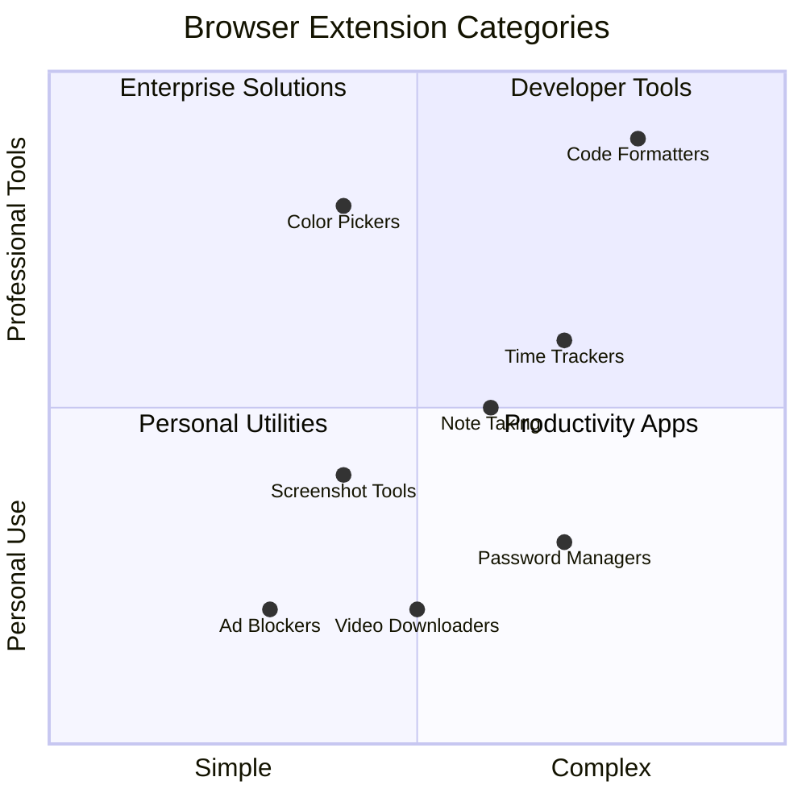
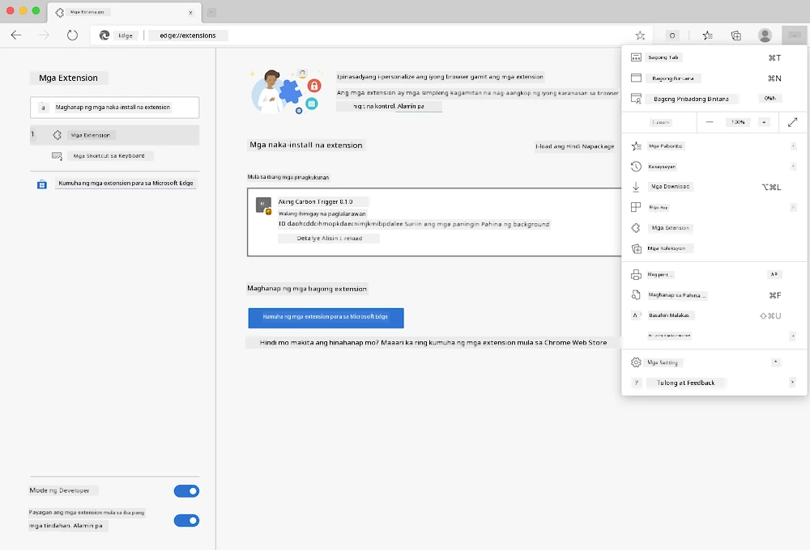
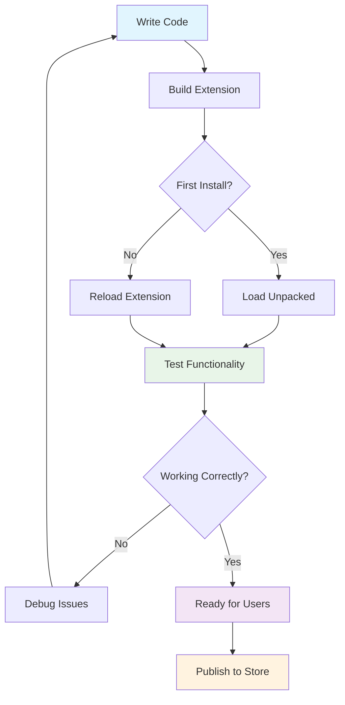
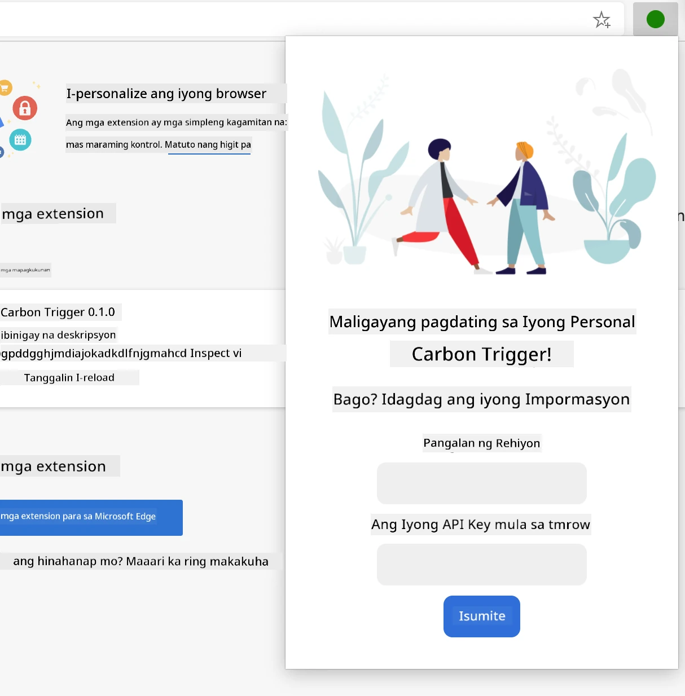
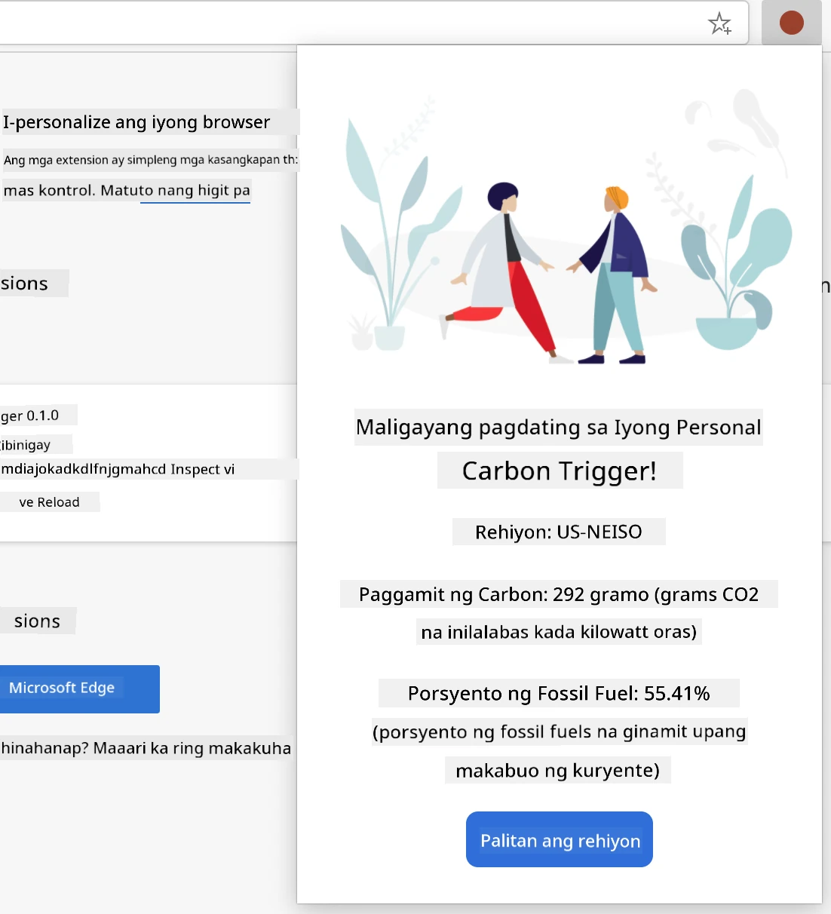
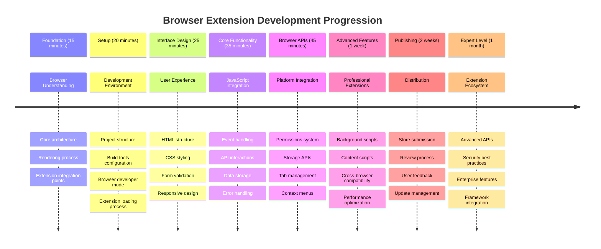

<!--
CO_OP_TRANSLATOR_METADATA:
{
  "original_hash": "00aa85715e1efd4930c17a23e3012e69",
  "translation_date": "2025-11-03T14:09:19+00:00",
  "source_file": "5-browser-extension/1-about-browsers/README.md",
  "language_code": "tl"
}
-->
# Browser Extension Project Part 1: Lahat Tungkol sa Mga Browser




> Sketchnote ni [Wassim Chegham](https://dev.to/wassimchegham/ever-wondered-what-happens-when-you-type-in-a-url-in-an-address-bar-in-a-browser-3dob)

## Pre-Lecture Quiz

[Pre-lecture quiz](https://ff-quizzes.netlify.app/web/quiz/23)

### Panimula

Ang mga browser extension ay mga mini-application na nagpapahusay sa iyong karanasan sa pag-browse sa web. Tulad ng orihinal na pananaw ni Tim Berners-Lee para sa isang interactive na web, ang mga extension ay nagpapalawak ng kakayahan ng browser lampas sa simpleng pagtingin ng mga dokumento. Mula sa mga password manager na nagpapanatili ng seguridad ng iyong mga account hanggang sa mga color picker na tumutulong sa mga designer na makuha ang perpektong kulay, ang mga extension ay nag-aayos ng mga pang-araw-araw na hamon sa pag-browse.

Bago natin simulan ang paggawa ng iyong unang extension, unawain muna natin kung paano gumagana ang mga browser. Tulad ng kailangang maunawaan ni Alexander Graham Bell ang transmisyon ng tunog bago maimbento ang telepono, ang kaalaman sa mga pangunahing kaalaman ng browser ay makakatulong sa iyo na lumikha ng mga extension na seamless na nag-iintegrate sa mga umiiral na sistema ng browser.

Sa pagtatapos ng araling ito, mauunawaan mo ang arkitektura ng browser at makakapagsimula ka nang bumuo ng iyong unang extension.



## Pag-unawa sa Mga Web Browser

Ang web browser ay mahalagang isang sopistikadong tagasalin ng dokumento. Kapag nag-type ka ng "google.com" sa address bar, ang browser ay nagsasagawa ng isang kumplikadong serye ng mga operasyon - humihiling ng nilalaman mula sa mga server sa buong mundo, pagkatapos ay ini-parse at ini-render ang code sa mga interactive na web page na nakikita mo.

Ang prosesong ito ay sumasalamin sa disenyo ng unang web browser, ang WorldWideWeb, na ginawa ni Tim Berners-Lee noong 1990 upang gawing accessible sa lahat ang mga hyperlinked na dokumento.

✅ **Kaunting Kasaysayan**: Ang unang browser ay tinawag na 'WorldWideWeb' at nilikha ni Sir Timothy Berners-Lee noong 1990.


> Ilang maagang browser, mula kay [Karen McGrane](https://www.slideshare.net/KMcGrane/week-4-ixd-history-personal-computing)

### Paano Pinoproseso ng Mga Browser ang Web Content

Ang proseso sa pagitan ng pag-type ng URL at pagtingin sa isang webpage ay may kasamang ilang magkakaugnay na hakbang na nangyayari sa loob ng ilang segundo:



**Narito ang nagagawa ng prosesong ito:**
- **Isinasalin** ang URL na nababasa ng tao sa isang IP address ng server sa pamamagitan ng DNS lookup
- **Nag-eestablish** ng secure na koneksyon sa web server gamit ang HTTP o HTTPS protocols
- **Humihiling** ng partikular na nilalaman ng web page mula sa server
- **Tumatanggap** ng HTML markup, CSS styling, at JavaScript code mula sa server
- **Ini-render** ang lahat ng nilalaman sa interactive na web page na nakikita mo

### Mga Pangunahing Tampok ng Browser

Ang mga modernong browser ay nagbibigay ng maraming tampok na maaaring magamit ng mga developer ng extension:

| Tampok | Layunin | Mga Oportunidad sa Extension |
|---------|---------|------------------------|
| **Rendering Engine** | Nagpapakita ng HTML, CSS, at JavaScript | Pagbabago ng nilalaman, pag-inject ng estilo |
| **JavaScript Engine** | Nagpapatupad ng JavaScript code | Mga custom na script, API interactions |
| **Local Storage** | Nag-iimbak ng data nang lokal | Mga user preference, cached data |
| **Network Stack** | Humahawak ng mga web request | Pag-monitor ng request, pagsusuri ng data |
| **Security Model** | Pinoprotektahan ang mga user mula sa malisyosong nilalaman | Pag-filter ng nilalaman, mga pagpapahusay sa seguridad |

**Ang pag-unawa sa mga tampok na ito ay tumutulong sa iyo:**
- **Tukuyin** kung saan maaaring magdagdag ng pinakamalaking halaga ang iyong extension
- **Pumili** ng tamang browser APIs para sa functionality ng iyong extension
- **Magdisenyo** ng mga extension na mahusay na gumagana sa mga sistema ng browser
- **Siguraduhin** na ang iyong extension ay sumusunod sa mga pinakamahusay na kasanayan sa seguridad ng browser

### Mga Pagsasaalang-alang sa Cross-Browser Development

Iba't ibang browser ang nagpapatupad ng mga pamantayan na may bahagyang pagkakaiba, katulad ng kung paano maaaring hawakan ng iba't ibang programming language ang parehong algorithm nang magkakaiba. Ang Chrome, Firefox, at Safari ay may kani-kaniyang natatanging katangian na dapat isaalang-alang ng mga developer sa panahon ng pagbuo ng extension.

> 💡 **Pro Tip**: Gamitin ang [caniuse.com](https://www.caniuse.com) upang suriin kung aling mga teknolohiya sa web ang sinusuportahan sa iba't ibang browser. Napakahalaga nito kapag nagpaplano ng mga tampok ng iyong extension!

**Mga pangunahing pagsasaalang-alang para sa pagbuo ng extension:**
- **Subukan** ang iyong extension sa Chrome, Firefox, at Edge browsers
- **Iangkop** sa iba't ibang browser extension APIs at manifest formats
- **Hawakan** ang iba't ibang performance characteristics at limitasyon
- **Magbigay** ng mga fallback para sa mga tampok na partikular sa browser na maaaring hindi magagamit

✅ **Analytics Insight**: Maaari mong matukoy kung aling mga browser ang mas gusto ng iyong mga user sa pamamagitan ng pag-install ng mga analytics package sa iyong mga proyekto sa web development. Ang data na ito ay tumutulong sa iyo na unahin kung aling mga browser ang dapat suportahan muna.

## Pag-unawa sa Mga Browser Extension

Ang mga browser extension ay nag-aayos ng mga karaniwang hamon sa pag-browse sa web sa pamamagitan ng pagdaragdag ng functionality nang direkta sa interface ng browser. Sa halip na mangailangan ng hiwalay na mga application o kumplikadong mga workflow, ang mga extension ay nagbibigay ng agarang access sa mga tool at tampok.

Ang konseptong ito ay sumasalamin sa kung paano naisip ng mga maagang pioneer ng computer tulad ni Douglas Engelbart ang pagpapahusay ng kakayahan ng tao gamit ang teknolohiya - ang mga extension ay nagpapahusay sa pangunahing functionality ng iyong browser.



**Mga sikat na kategorya ng extension at kanilang mga benepisyo:**
- **Mga Productivity Tool**: Mga task manager, note-taking apps, at time trackers na tumutulong sa iyo na maging organisado
- **Mga Pagpapahusay sa Seguridad**: Mga password manager, ad blocker, at mga tool sa privacy na nagpoprotekta sa iyong data
- **Mga Developer Tool**: Mga code formatter, color picker, at debugging utilities na nagpapadali sa pag-develop
- **Pagpapahusay ng Nilalaman**: Mga reading mode, video downloader, at screenshot tools na nagpapabuti sa iyong karanasan sa web

✅ **Reflection Question**: Ano ang iyong mga paboritong browser extension? Anong partikular na gawain ang kanilang ginagawa, at paano nila pinapabuti ang iyong karanasan sa pag-browse?

### 🔄 **Pedagogical Check-in**
**Pag-unawa sa Arkitektura ng Browser**: Bago lumipat sa pagbuo ng extension, tiyaking kaya mong:
- ✅ Ipaliwanag kung paano pinoproseso ng mga browser ang mga web request at ini-render ang nilalaman
- ✅ Tukuyin ang mga pangunahing bahagi ng arkitektura ng browser
- ✅ Unawain kung paano nag-iintegrate ang mga extension sa functionality ng browser
- ✅ Kilalanin ang security model na nagpoprotekta sa mga user

**Quick Self-Test**: Kaya mo bang i-trace ang landas mula sa pag-type ng URL hanggang sa pagtingin sa isang webpage?
1. **DNS lookup** nagko-convert ng URL sa IP address
2. **HTTP request** kumukuha ng nilalaman mula sa server
3. **Parsing** nagpoproseso ng HTML, CSS, at JavaScript
4. **Rendering** nagpapakita ng final webpage
5. **Extensions** maaaring magbago ng nilalaman sa maraming hakbang

## Pag-install at Pamamahala ng Mga Extension

Ang pag-unawa sa proseso ng pag-install ng extension ay tumutulong sa iyo na ma-anticipate ang karanasan ng user kapag ini-install nila ang iyong extension. Ang proseso ng pag-install ay standardized sa mga modernong browser, na may kaunting pagkakaiba sa disenyo ng interface.



> **Mahalaga**: Siguraduhing i-toggle ang developer mode at payagan ang mga extension mula sa ibang mga tindahan kapag sinusubukan ang iyong sariling mga extension.

### Proseso ng Pag-install ng Development Extension

Kapag ikaw ay nagde-develop at nagte-test ng iyong sariling mga extension, sundin ang workflow na ito:



```bash
# Step 1: Build your extension
npm run build
```

**Ano ang nagagawa ng command na ito:**
- **Kinokompyla** ang iyong source code sa mga browser-ready files
- **Binubuo** ang mga JavaScript module sa mga optimized na package
- **Nagge-generate** ng final extension files sa `/dist` folder
- **Ipinaprepara** ang iyong extension para sa pag-install at testing

**Hakbang 2: Pumunta sa Browser Extensions**
1. **Buksan** ang extensions management page ng iyong browser
2. **I-click** ang "Settings and more" button (ang `...` icon) sa kanang itaas
3. **Piliin** ang "Extensions" mula sa dropdown menu

**Hakbang 3: I-load ang Iyong Extension**
- **Para sa bagong pag-install**: Piliin ang `load unpacked` at piliin ang iyong `/dist` folder
- **Para sa mga update**: I-click ang `reload` sa tabi ng iyong naka-install na extension
- **Para sa testing**: I-enable ang "Developer mode" upang ma-access ang mga karagdagang debugging features

### Proseso ng Pag-install ng Production Extension

> ✅ **Tandaan**: Ang mga development instructions na ito ay partikular para sa mga extension na ikaw mismo ang bumuo. Para mag-install ng mga published extension, bisitahin ang mga opisyal na browser extension store tulad ng [Microsoft Edge Add-ons store](https://microsoftedge.microsoft.com/addons/Microsoft-Edge-Extensions-Home).

**Pag-unawa sa pagkakaiba:**
- **Development installations** nagbibigay-daan sa iyo na i-test ang mga unpublished extension sa panahon ng development
- **Store installations** nagbibigay ng vetted, published extensions na may automatic updates
- **Sideloading** nagbibigay-daan sa pag-install ng mga extension mula sa labas ng mga opisyal na tindahan (nangangailangan ng developer mode)

## Pagbuo ng Iyong Carbon Footprint Extension

Gagawa tayo ng browser extension na nagpapakita ng carbon footprint ng energy use sa iyong rehiyon. Ang proyektong ito ay nagpapakita ng mahahalagang konsepto sa pagbuo ng extension habang gumagawa ng praktikal na tool para sa kamalayan sa kapaligiran.

Ang approach na ito ay sumusunod sa prinsipyo ng "learning by doing" na napatunayang epektibo mula pa sa mga teorya sa edukasyon ni John Dewey - pinagsasama ang teknikal na kasanayan sa makabuluhang aplikasyon sa totoong mundo.

### Mga Kinakailangan sa Proyekto

Bago simulan ang development, magtipon tayo ng mga kinakailangang resources at dependencies:

**Kinakailangang API Access:**
- **[CO2 Signal API key](https://www.co2signal.com/)**: Ipasok ang iyong email address upang makuha ang iyong libreng API key
- **[Region code](http://api.electricitymap.org/v3/zones)**: Hanapin ang iyong region code gamit ang [Electricity Map](https://www.electricitymap.org/map) (halimbawa, ang Boston ay gumagamit ng 'US-NEISO')

**Mga Development Tools:**
- **[Node.js and NPM](https://www.npmjs.com)**: Tool sa pamamahala ng package para sa pag-install ng mga dependencies ng proyekto
- **[Starter code](../../../../5-browser-extension/start)**: I-download ang `start` folder upang simulan ang development

✅ **Matuto Pa**: Palawakin ang iyong mga kasanayan sa pamamahala ng package gamit ang [komprehensibong Learn module](https://docs.microsoft.com/learn/modules/create-nodejs-project-dependencies/?WT.mc_id=academic-77807-sagibbon)

### Pag-unawa sa Estruktura ng Proyekto

Ang pag-unawa sa estruktura ng proyekto ay tumutulong sa maayos na pag-organisa ng trabaho sa development. Tulad ng kung paano inayos ang Library of Alexandria para sa madaling retrieval ng kaalaman, ang maayos na codebase ay nagpapabilis sa development:

```
project-root/
├── dist/                    # Built extension files
│   ├── manifest.json        # Extension configuration
│   ├── index.html           # User interface markup
│   ├── background.js        # Background script functionality
│   └── main.js              # Compiled JavaScript bundle
├── src/                     # Source development files
│   └── index.js             # Your main JavaScript code
├── package.json             # Project dependencies and scripts
└── webpack.config.js        # Build configuration
```

**Paghiwa-hiwalay kung ano ang nagagawa ng bawat file:**
- **`manifest.json`**: **Tinutukoy** ang metadata ng extension, mga permission, at mga entry point
- **`index.html`**: **Lumilikha** ng user interface na lumalabas kapag na-click ng mga user ang iyong extension
- **`background.js`**: **Humahawak** ng mga background task at browser event listeners
- **`main.js`**: **Naglalaman** ng final bundled JavaScript pagkatapos ng build process
- **`src/index.js`**: **Naglalaman** ng iyong pangunahing development code na kino-compile sa `main.js`

> 💡 **Tip sa Organisasyon**: Itago ang iyong API key at region code sa isang secure na note para sa madaling reference sa panahon ng development. Kakailanganin mo ang mga value na ito upang i-test ang functionality ng iyong extension.

✅ **Tandaan sa Seguridad**: Huwag kailanman i-commit ang mga API key o sensitibong credentials sa iyong code repository. Ipapakita namin sa iyo kung paano ito ligtas na hawakan sa mga susunod na hakbang.

## Paglikha ng Interface ng Extension

Ngayon ay gagawa tayo ng mga component ng user interface. Ang extension ay gumagamit ng two-screen approach: isang configuration screen para sa paunang setup at isang results screen para sa pagpapakita ng data.

Ito ay sumusunod sa prinsipyo ng progressive disclosure na ginagamit sa disenyo ng interface mula pa noong unang panahon ng computing - unti-unting ipinapakita ang impormasyon at mga opsyon sa lohikal na pagkakasunod-sunod upang maiwasan ang pag-overwhelm sa mga user.

### Overview ng Extension Views

**Setup View** - Paunang configuration ng user:


**Results View** - Pagpapakita ng data ng carbon footprint:


### Pagbuo ng Configuration Form

Ang setup form ay nangongolekta ng data ng user configuration sa unang paggamit. Kapag na-configure na, ang impormasyong ito ay mananatili sa browser storage para sa mga susunod na session.

Sa file na `/dist/index.html`, idagdag ang istruktura ng form na ito:

```html
<form class="form-data" autocomplete="on">
    <div>
        <h2>New? Add your Information</h2>
    </div>
    <div>
        <label for="region">Region Name</label>
        <input type="text" id="region" required class="region-name" />
    </div>
    <div>
        <label for="api">Your API Key from tmrow</label>
        <input type="text" id="api" required class="api-key" />
    </div>
    <button class="search-btn">Submit</button>
</form>
```

**Narito ang nagagawa ng form na ito:**
- **Lumilikha** ng semantic na istruktura ng form na may tamang labels at input associations
- **Nagpapagana** ng browser autocomplete functionality para sa mas mahusay na karanasan ng user
- **Nangangailangan** ng parehong field na mapunan bago isumite gamit ang `required` attribute
- **Inaayos** ang mga input gamit ang mga deskriptibong class name para sa madaling pag-style at pag-target ng JavaScript
- **Nagbibigay** ng malinaw na instruksyon para sa mga user na nagse-setup ng extension sa unang pagkakataon

### Pagbuo ng Results Display

Susunod, gumawa ng results area na magpapakita ng data ng carbon footprint. Idagdag ang HTML na ito sa ibaba ng form:

```html
<div class="result">
    <div class="loading">loading...</div>
    <div class="errors"></div>
    <div class="data"></div>
    <div class="result-container">
        <p><strong>Region: </strong><span class="my-region"></span></p>
        <p><strong>Carbon Usage: </strong><span class="carbon-usage"></span></p>
        <p><strong>Fossil Fuel Percentage: </strong><span class="fossil-fuel"></span></p>
    </div>
    <button class="clear-btn">Change region</button>
</div>
```

**Paghiwa-hiwalay kung ano ang ibinibigay ng istrukturang ito:**
- **`loading`**: **Nagpapakita** ng loading message habang kinukuha ang data ng API
- **`errors`**: **Nagpapakita** ng error messages kung nabigo ang API calls o invalid ang data
- **`data`**: **Naglalaman** ng raw data para sa debugging sa panahon ng development
- **`result-container`**: **Nagpapakita** ng formatted na impormasyon ng carbon footprint sa mga user
- **`clear-btn`**: **Nagbibigay-daan** sa mga user na baguhin ang kanilang rehiyon at muling i-configure ang extension

### Pag-setup ng Build Process

Ngayon, i-install natin ang mga dependencies ng proyekto at i-test ang build process:

```bash
npm install
```

**Ano ang nagagawa ng proseso ng pag-install na ito:**
- **Nagda-download** ng Webpack at iba pang development dependencies na tinukoy sa `package.json`
- **Kinokonfigura** ang build toolchain para sa pag-compile ng modernong JavaScript
- **Ipinaprepara** ang development environment para sa pagbuo at pag-test ng extension
- **Nagpapagana** ng code bundling, optimization, at cross-browser compatibility features

> 💡 **Insight sa Build Process**: Binubuo ng Webpack ang iyong source code mula sa `/src/index.js` papunta sa `/dist/main.js`. Ang prosesong ito ay nag-o-optimize ng iyong code para sa production at tinitiyak ang compatibility sa browser.

### Pagsubok ng Iyong Progreso

Sa puntong ito, maaari mo nang i-test ang iyong extension:
1. **Patakbuhin** ang build command upang i-compile ang iyong code  
2. **I-load** ang extension sa iyong browser gamit ang developer mode  
3. **Siguraduhin** na tama ang pagpapakita ng form at mukhang propesyonal  
4. **Suriin** na maayos ang pagkaka-align at gumagana ang lahat ng elemento ng form  

**Mga Naabot Mo:**  
- **Nabuo** ang pundasyon ng HTML structure para sa iyong extension  
- **Nilikha** ang parehong configuration at results interfaces gamit ang tamang semantic markup  
- **Na-set up** ang modernong development workflow gamit ang mga industry-standard tools  
- **Naihanda** ang pundasyon para sa pagdaragdag ng interactive na JavaScript functionality  

### 🔄 **Pedagogical Check-in**  
**Pag-unlad sa Extension Development**: Suriin ang iyong kaalaman bago magpatuloy:  
- ✅ Kaya mo bang ipaliwanag ang layunin ng bawat file sa project structure?  
- ✅ Naiintindihan mo ba kung paano binabago ng build process ang iyong source code?  
- ✅ Bakit natin hinihiwalay ang configuration at results sa magkaibang UI sections?  
- ✅ Paano sinusuportahan ng form structure ang usability at accessibility?  

**Pag-unawa sa Development Workflow**: Dapat kaya mo nang:  
1. **Baguhin** ang HTML at CSS para sa interface ng iyong extension  
2. **Patakbuhin** ang build command upang i-compile ang iyong mga pagbabago  
3. **I-reload** ang extension sa iyong browser upang subukan ang mga update  
4. **I-debug** ang mga isyu gamit ang browser developer tools  

Natapos mo na ang unang yugto ng pag-develop ng browser extension. Tulad ng mga Wright brothers na kailangang maunawaan ang aerodynamics bago makalipad, ang pag-unawa sa mga pundasyong konsepto na ito ay naghahanda sa iyo para sa pagbuo ng mas kumplikadong interactive na features sa susunod na aralin.  

## Hamon sa GitHub Copilot Agent 🚀  

Gamitin ang Agent mode upang tapusin ang sumusunod na hamon:  

**Deskripsyon:** Pagandahin ang browser extension sa pamamagitan ng pagdaragdag ng form validation at user feedback features upang mapabuti ang karanasan ng user kapag naglalagay ng API keys at region codes.  

**Prompt:** Gumawa ng mga JavaScript validation functions na sumusuri kung ang API key field ay may hindi bababa sa 20 characters at kung ang region code ay sumusunod sa tamang format (halimbawa, 'US-NEISO'). Magdagdag ng visual feedback sa pamamagitan ng pagbabago ng input border colors sa berde para sa valid inputs at pula para sa invalid ones. Magdagdag din ng toggle feature upang ipakita/itago ang API key para sa seguridad.  

Alamin pa ang tungkol sa [agent mode](https://code.visualstudio.com/blogs/2025/02/24/introducing-copilot-agent-mode) dito.  

## 🚀 Hamon  

Tingnan ang isang browser extension store at mag-install ng isa sa iyong browser. Maaari mong suriin ang mga file nito sa mga kawili-wiling paraan. Ano ang iyong natuklasan?  

## Post-Lecture Quiz  

[Post-lecture quiz](https://ff-quizzes.netlify.app/web/quiz/24)  

## Review at Sariling Pag-aaral  

Sa araling ito, natutunan mo ang kaunting kasaysayan ng web browser; samantalahin ang pagkakataong ito upang matuto pa tungkol sa kung paano inisip ng mga imbentor ng World Wide Web ang paggamit nito sa pamamagitan ng pagbabasa ng higit pa tungkol sa kasaysayan nito. Ilang kapaki-pakinabang na site ay:  

[The History of Web Browsers](https://www.mozilla.org/firefox/browsers/browser-history/)  

[History of the Web](https://webfoundation.org/about/vision/history-of-the-web/)  

[An interview with Tim Berners-Lee](https://www.theguardian.com/technology/2019/mar/12/tim-berners-lee-on-30-years-of-the-web-if-we-dream-a-little-we-can-get-the-web-we-want)  

### ⚡ **Mga Pwede Mong Gawin sa Loob ng 5 Minuto**  
- [ ] Buksan ang Chrome/Edge extensions page (chrome://extensions) at tuklasin ang mga naka-install mo  
- [ ] Tingnan ang Network tab ng DevTools ng iyong browser habang naglo-load ng webpage  
- [ ] Subukang tingnan ang page source (Ctrl+U) upang makita ang HTML structure  
- [ ] I-inspect ang anumang elemento ng webpage at baguhin ang CSS nito sa DevTools  

### 🎯 **Mga Pwede Mong Makamit sa Loob ng Isang Oras**  
- [ ] Tapusin ang post-lesson quiz at unawain ang mga pangunahing kaalaman sa browser  
- [ ] Gumawa ng simpleng manifest.json file para sa isang browser extension  
- [ ] Bumuo ng simpleng "Hello World" extension na nagpapakita ng popup  
- [ ] Subukan ang pag-load ng iyong extension sa developer mode  
- [ ] Tuklasin ang dokumentasyon ng browser extension para sa iyong target na browser  

### 📅 **Ang Iyong Isang Linggong Extension Journey**  
- [ ] Tapusin ang isang functional browser extension na may tunay na gamit  
- [ ] Matutunan ang tungkol sa content scripts, background scripts, at popup interactions  
- [ ] Masterin ang browser APIs tulad ng storage, tabs, at messaging  
- [ ] Magdisenyo ng user-friendly interfaces para sa iyong extension  
- [ ] Subukan ang iyong extension sa iba't ibang website at senaryo  
- [ ] I-publish ang iyong extension sa extension store ng browser  

### 🌟 **Ang Iyong Buwanang Browser Development**  
- [ ] Bumuo ng maraming extension na naglutas ng iba't ibang problema ng user  
- [ ] Matutunan ang advanced browser APIs at mga pinakamahusay na kasanayan sa seguridad  
- [ ] Mag-ambag sa mga open source browser extension projects  
- [ ] Masterin ang cross-browser compatibility at progressive enhancement  
- [ ] Gumawa ng mga extension development tools at templates para sa iba  
- [ ] Maging eksperto sa browser extension na tumutulong sa ibang mga developer  

## 🎯 Ang Iyong Browser Extension Mastery Timeline  


  
### 🛠️ Buod ng Iyong Extension Development Toolkit  

Pagkatapos ng araling ito, mayroon ka na:  
- **Kaalaman sa Browser Architecture**: Pag-unawa sa rendering engines, security models, at extension integration  
- **Development Environment**: Modernong toolchain na may Webpack, NPM, at debugging capabilities  
- **UI/UX Foundation**: Semantic HTML structure na may progressive disclosure patterns  
- **Security Awareness**: Pag-unawa sa browser permissions at ligtas na development practices  
- **Cross-Browser Concepts**: Kaalaman sa compatibility considerations at testing approaches  
- **API Integration**: Pundasyon para sa pakikipag-ugnayan sa external data sources  
- **Professional Workflow**: Industry-standard development at testing procedures  

**Mga Aplikasyon sa Tunay na Mundo**: Ang mga kasanayang ito ay direktang naaangkop sa:  
- **Web Development**: Single-page applications at progressive web apps  
- **Desktop Applications**: Electron at web-based desktop software  
- **Mobile Development**: Hybrid apps at web-based mobile solutions  
- **Enterprise Tools**: Internal productivity applications at workflow automation  
- **Open Source**: Pag-ambag sa browser extension projects at web standards  

**Next Level**: Handa ka nang magdagdag ng interactive functionality, magtrabaho gamit ang browser APIs, at gumawa ng mga extension na naglutas ng tunay na problema ng user!  

## Assignment  

[Restyle your extension](assignment.md)  

---

**Paunawa**:  
Ang dokumentong ito ay isinalin gamit ang AI translation service na [Co-op Translator](https://github.com/Azure/co-op-translator). Bagama't sinisikap naming maging tumpak, mangyaring tandaan na ang mga awtomatikong pagsasalin ay maaaring maglaman ng mga pagkakamali o hindi pagkakatugma. Ang orihinal na dokumento sa kanyang katutubong wika ang dapat ituring na opisyal na pinagmulan. Para sa mahalagang impormasyon, inirerekomenda ang propesyonal na pagsasalin ng tao. Hindi kami mananagot sa anumang hindi pagkakaunawaan o maling interpretasyon na dulot ng paggamit ng pagsasaling ito.