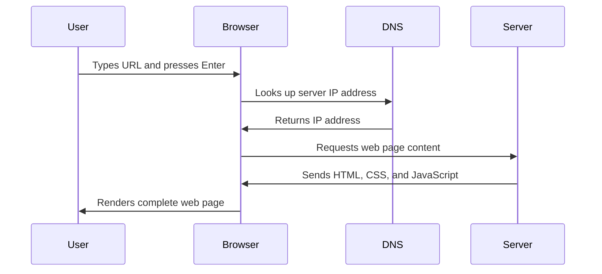

<!--
CO_OP_TRANSLATOR_METADATA:
{
  "original_hash": "33a875c522f237a2026e4653240dfc07",
  "translation_date": "2025-10-22T15:45:03+00:00",
  "source_file": "5-browser-extension/1-about-browsers/README.md",
  "language_code": "tl"
}
-->
# Browser Extension Project Part 1: Lahat Tungkol sa Mga Browser


> Sketchnote ni [Wassim Chegham](https://dev.to/wassimchegham/ever-wondered-what-happens-when-you-type-in-a-url-in-an-address-bar-in-a-browser-3dob)

## Pre-Lecture Quiz

[Pre-lecture quiz](https://ff-quizzes.netlify.app/web/quiz/23)

### Panimula

Ang mga browser extension ay mga mini-application na nagpapahusay sa iyong karanasan sa pag-browse sa web. Tulad ng orihinal na pananaw ni Tim Berners-Lee para sa isang interactive na web, ang mga extension ay nagpapalawak ng kakayahan ng browser lampas sa simpleng pagtingin ng mga dokumento. Mula sa mga password manager na nagpoprotekta sa iyong mga account hanggang sa mga color picker na tumutulong sa mga designer na makuha ang perpektong kulay, ang mga extension ay nag-aayos ng mga pang-araw-araw na hamon sa pag-browse.

Bago tayo magtayo ng iyong unang extension, unawain muna natin kung paano gumagana ang mga browser. Tulad ng kailangan ni Alexander Graham Bell na maunawaan ang transmisyon ng tunog bago maimbento ang telepono, ang kaalaman sa mga pangunahing kaalaman ng browser ay makakatulong sa iyo na lumikha ng mga extension na seamless na nag-iintegrate sa mga umiiral na sistema ng browser.

Sa pagtatapos ng araling ito, mauunawaan mo ang arkitektura ng browser at makakapagsimula ka nang magtayo ng iyong unang extension.

## Pag-unawa sa Mga Web Browser

Ang web browser ay mahalagang isang sopistikadong tagapag-interpret ng dokumento. Kapag nag-type ka ng "google.com" sa address bar, ang browser ay gumagawa ng isang kumplikadong serye ng mga operasyon - humihiling ng nilalaman mula sa mga server sa buong mundo, pagkatapos ay ini-parse at ini-render ang code sa mga interactive na web page na nakikita mo.

Ang prosesong ito ay kahalintulad sa kung paano idinisenyo ang unang web browser, ang WorldWideWeb, ni Tim Berners-Lee noong 1990 upang gawing accessible sa lahat ang mga hyperlinked na dokumento.

✅ **Kaunting Kasaysayan**: Ang unang browser ay tinawag na 'WorldWideWeb' at nilikha ni Sir Timothy Berners-Lee noong 1990.


> Ilang maagang browser, mula kay [Karen McGrane](https://www.slideshare.net/KMcGrane/week-4-ixd-history-personal-computing)

### Paano Pinoproseso ng Mga Browser ang Web Content

Ang proseso sa pagitan ng pagpasok ng URL at pagtingin sa isang webpage ay binubuo ng ilang magkakaugnay na hakbang na nangyayari sa loob ng ilang segundo:



**Narito ang nagagawa ng prosesong ito:**
- **Isinasalin** ang URL na nababasa ng tao sa IP address ng server sa pamamagitan ng DNS lookup
- **Nag-eestablish** ng secure na koneksyon sa web server gamit ang HTTP o HTTPS protocols
- **Humihiling** ng partikular na nilalaman ng web page mula sa server
- **Tumatanggap** ng HTML markup, CSS styling, at JavaScript code mula sa server
- **Ini-render** ang lahat ng nilalaman sa interactive na web page na nakikita mo

### Mga Pangunahing Tampok ng Browser

Ang mga modernong browser ay nagbibigay ng maraming tampok na maaaring magamit ng mga developer ng extension:

| Tampok | Layunin | Mga Oportunidad sa Extension |
|---------|---------|------------------------|
| **Rendering Engine** | Nagpapakita ng HTML, CSS, at JavaScript | Pagbabago ng nilalaman, pag-inject ng estilo |
| **JavaScript Engine** | Nagpapatupad ng JavaScript code | Custom na script, API interactions |
| **Local Storage** | Nag-iimbak ng data nang lokal | Mga preference ng user, cached na data |
| **Network Stack** | Humahawak ng mga web request | Pag-monitor ng request, pagsusuri ng data |
| **Security Model** | Nagpoprotekta sa mga user mula sa malisyosong nilalaman | Pag-filter ng nilalaman, pagpapahusay ng seguridad |

**Ang pag-unawa sa mga tampok na ito ay tumutulong sa iyo:**
- **Tukuyin** kung saan maaaring magdagdag ng pinakamalaking halaga ang iyong extension
- **Pumili** ng tamang browser APIs para sa functionality ng iyong extension
- **Magdisenyo** ng mga extension na mahusay na gumagana sa mga sistema ng browser
- **Siguraduhin** na ang iyong extension ay sumusunod sa mga pinakamahusay na kasanayan sa seguridad ng browser

### Mga Pagsasaalang-alang sa Cross-Browser Development

Iba't ibang browser ang nag-iimplement ng mga pamantayan na may bahagyang pagkakaiba, katulad ng kung paano maaaring hawakan ng iba't ibang programming language ang parehong algorithm nang magkakaiba. Ang Chrome, Firefox, at Safari ay may kani-kaniyang katangian na dapat isaalang-alang ng mga developer sa pagbuo ng extension.

> 💡 **Pro Tip**: Gamitin ang [caniuse.com](https://www.caniuse.com) upang suriin kung aling mga teknolohiya sa web ang sinusuportahan sa iba't ibang browser. Napakahalaga nito kapag nagpaplano ng mga tampok ng iyong extension!

**Mga pangunahing pagsasaalang-alang para sa pagbuo ng extension:**
- **Subukan** ang iyong extension sa Chrome, Firefox, at Edge browsers
- **Iangkop** sa iba't ibang browser extension APIs at manifest formats
- **Hawakan** ang iba't ibang katangian ng performance at limitasyon
- **Magbigay** ng mga fallback para sa mga tampok na partikular sa browser na maaaring hindi magagamit

✅ **Analytics Insight**: Maaari mong matukoy kung aling mga browser ang mas gusto ng iyong mga user sa pamamagitan ng pag-install ng mga analytics package sa iyong mga proyekto sa web development. Ang data na ito ay tumutulong sa iyo na unahin kung aling mga browser ang dapat suportahan muna.

## Pag-unawa sa Mga Browser Extension

Ang mga browser extension ay nag-aayos ng mga karaniwang hamon sa pag-browse sa web sa pamamagitan ng pagdaragdag ng functionality nang direkta sa interface ng browser. Sa halip na mangailangan ng hiwalay na mga application o kumplikadong workflows, ang mga extension ay nagbibigay ng agarang access sa mga tool at tampok.

Ang konseptong ito ay kahalintulad sa kung paano inisip ng mga maagang pioneer ng computer tulad ni Douglas Engelbart ang pagpapahusay ng kakayahan ng tao gamit ang teknolohiya - ang mga extension ay nagpapahusay sa pangunahing functionality ng iyong browser.

**Mga sikat na kategorya ng extension at kanilang mga benepisyo:**
- **Mga Productivity Tool**: Mga task manager, apps para sa pagkuha ng tala, at mga time tracker na tumutulong sa iyo na maging organisado
- **Mga Pagpapahusay sa Seguridad**: Mga password manager, ad blocker, at mga tool sa privacy na nagpoprotekta sa iyong data
- **Mga Developer Tool**: Mga code formatter, color picker, at mga debugging utility na nagpapadali sa development
- **Pagpapahusay ng Nilalaman**: Mga reading mode, video downloader, at mga screenshot tool na nagpapabuti sa iyong karanasan sa web

✅ **Reflection Question**: Ano ang iyong mga paboritong browser extension? Anong mga partikular na gawain ang kanilang ginagawa, at paano nila pinapabuti ang iyong karanasan sa pag-browse?

## Pag-install at Pamamahala ng Mga Extension

Ang pag-unawa sa proseso ng pag-install ng extension ay tumutulong sa iyo na ma-anticipate ang karanasan ng user kapag ini-install nila ang iyong extension. Ang proseso ng pag-install ay standardized sa mga modernong browser, na may kaunting pagkakaiba sa disenyo ng interface.


> **Mahalaga**: Siguraduhing i-toggle ang developer mode at payagan ang mga extension mula sa ibang mga tindahan kapag sinusubukan ang iyong sariling mga extension.

### Proseso ng Pag-install ng Development Extension

Kapag ikaw ay nagde-develop at nagte-test ng iyong sariling mga extension, sundin ang workflow na ito:

```bash
# Step 1: Build your extension
npm run build
```

**Ano ang nagagawa ng command na ito:**
- **Kinokompile** ang iyong source code sa mga file na handa para sa browser
- **Binubuo** ang mga JavaScript module sa mga optimized na package
- **Gumagawa** ng mga final extension file sa `/dist` folder
- **Ipinaprepara** ang iyong extension para sa pag-install at testing

**Hakbang 2: Pumunta sa Browser Extensions**
1. **Buksan** ang page ng pamamahala ng extension ng iyong browser
2. **I-click** ang "Settings and more" button (ang `...` icon) sa kanang itaas
3. **Piliin** ang "Extensions" mula sa dropdown menu

**Hakbang 3: I-load ang Iyong Extension**
- **Para sa bagong pag-install**: Piliin ang `load unpacked` at piliin ang iyong `/dist` folder
- **Para sa mga update**: I-click ang `reload` sa tabi ng iyong naka-install na extension
- **Para sa testing**: I-enable ang "Developer mode" upang ma-access ang mga karagdagang debugging feature

### Pag-install ng Production Extension

> ✅ **Note**: Ang mga development instructions na ito ay partikular para sa mga extension na ikaw mismo ang bumuo. Para mag-install ng mga published extension, bisitahin ang mga opisyal na tindahan ng browser extension tulad ng [Microsoft Edge Add-ons store](https://microsoftedge.microsoft.com/addons/Microsoft-Edge-Extensions-Home).

**Pag-unawa sa pagkakaiba:**
- **Development installations** ay nagbibigay-daan sa iyo na subukan ang mga unpublished extension habang nasa development
- **Store installations** ay nagbibigay ng vetted, published extensions na may automatic updates
- **Sideloading** ay nagbibigay-daan sa pag-install ng mga extension mula sa labas ng opisyal na tindahan (nangangailangan ng developer mode)

## Pagtatayo ng Iyong Carbon Footprint Extension

Gagawa tayo ng browser extension na nagpapakita ng carbon footprint ng paggamit ng enerhiya sa iyong rehiyon. Ang proyektong ito ay nagpapakita ng mahahalagang konsepto sa pagbuo ng extension habang gumagawa ng praktikal na tool para sa kamalayan sa kapaligiran.

Ang approach na ito ay sumusunod sa prinsipyo ng "learning by doing" na napatunayang epektibo mula pa sa mga teorya sa edukasyon ni John Dewey - pinagsasama ang teknikal na kasanayan sa makabuluhang aplikasyon sa totoong mundo.

### Mga Kinakailangan sa Proyekto

Bago simulan ang development, magtipon tayo ng mga kinakailangang resources at dependencies:

**Kinakailangang API Access:**
- **[CO2 Signal API key](https://www.co2signal.com/)**: Ipasok ang iyong email address upang makuha ang iyong libreng API key
- **[Region code](http://api.electricitymap.org/v3/zones)**: Hanapin ang iyong region code gamit ang [Electricity Map](https://www.electricitymap.org/map) (halimbawa, ang Boston ay gumagamit ng 'US-NEISO')

**Mga Development Tools:**
- **[Node.js and NPM](https://www.npmjs.com)**: Tool para sa package management sa pag-install ng mga dependency ng proyekto
- **[Starter code](../../../../5-browser-extension/start)**: I-download ang `start` folder upang simulan ang development

✅ **Matuto Pa**: Palawakin ang iyong kaalaman sa package management gamit ang [komprehensibong Learn module](https://docs.microsoft.com/learn/modules/create-nodejs-project-dependencies/?WT.mc_id=academic-77807-sagibbon)

### Pag-unawa sa Estruktura ng Proyekto

Ang pag-unawa sa estruktura ng proyekto ay tumutulong sa maayos na pag-organisa ng trabaho sa development. Tulad ng kung paano inayos ang Library of Alexandria para sa madaling retrieval ng kaalaman, ang maayos na codebase ay nagpapabilis sa development:

```
project-root/
├── dist/                    # Built extension files
│   ├── manifest.json        # Extension configuration
│   ├── index.html           # User interface markup
│   ├── background.js        # Background script functionality
│   └── main.js              # Compiled JavaScript bundle
└── src/                     # Source development files
    └── index.js             # Your main JavaScript code
```

**Paghiwa-hiwalay ng nagagawa ng bawat file:**
- **`manifest.json`**: **Nagde-define** ng metadata ng extension, permissions, at entry points
- **`index.html`**: **Gumagawa** ng user interface na lumalabas kapag kinlik ng user ang iyong extension
- **`background.js`**: **Humahawak** ng mga background task at browser event listeners
- **`main.js`**: **Naglalaman** ng final bundled JavaScript pagkatapos ng build process
- **`src/index.js`**: **Naglalaman** ng pangunahing development code na kino-compile sa `main.js`

> 💡 **Tip sa Organisasyon**: I-store ang iyong API key at region code sa isang secure na note para sa madaling reference habang nasa development. Kakailanganin mo ang mga value na ito upang subukan ang functionality ng iyong extension.

✅ **Security Note**: Huwag kailanman i-commit ang mga API key o sensitibong credentials sa iyong code repository. Ipapakita namin sa iyo kung paano ito hahawakan nang ligtas sa mga susunod na hakbang.

## Paggawa ng Extension Interface

Ngayon ay gagawa tayo ng mga user interface components. Ang extension ay gumagamit ng two-screen approach: isang configuration screen para sa initial setup at isang results screen para sa data display.

Ito ay sumusunod sa prinsipyo ng progressive disclosure na ginagamit sa interface design mula pa noong unang panahon ng computing - unti-unting ipinapakita ang impormasyon at mga opsyon sa lohikal na pagkakasunod-sunod upang maiwasan ang pag-overwhelm sa mga user.

### Overview ng Extension Views

**Setup View** - Configuration ng unang beses na user:


**Results View** - Pagpapakita ng data ng carbon footprint:


### Paggawa ng Configuration Form

Ang setup form ay nangongolekta ng configuration data ng user sa unang paggamit. Kapag na-configure, ang impormasyong ito ay nananatili sa browser storage para sa mga susunod na session.

Sa file na `/dist/index.html`, idagdag ang istruktura ng form na ito:

```html
<form class="form-data" autocomplete="on">
    <div>
        <h2>New? Add your Information</h2>
    </div>
    <div>
        <label for="region">Region Name</label>
        <input type="text" id="region" required class="region-name" />
    </div>
    <div>
        <label for="api">Your API Key from tmrow</label>
        <input type="text" id="api" required class="api-key" />
    </div>
    <button class="search-btn">Submit</button>
</form>
```

**Narito ang nagagawa ng form na ito:**
- **Gumagawa** ng semantic na istruktura ng form na may tamang labels at input associations
- **Nagpapagana** ng browser autocomplete functionality para sa mas mahusay na karanasan ng user
- **Nangangailangan** ng parehong fields na mapunan bago ang submission gamit ang `required` attribute
- **Inaayos** ang mga input gamit ang mga descriptive class names para sa madaling styling at JavaScript targeting
- **Nagbibigay** ng malinaw na instruksyon para sa mga user na nagse-set up ng extension sa unang pagkakataon

### Paggawa ng Results Display

Susunod, gumawa ng results area na magpapakita ng data ng carbon footprint. Idagdag ang HTML na ito sa ibaba ng form:

```html
<div class="result">
    <div class="loading">loading...</div>
    <div class="errors"></div>
    <div class="data"></div>
    <div class="result-container">
        <p><strong>Region: </strong><span class="my-region"></span></p>
        <p><strong>Carbon Usage: </strong><span class="carbon-usage"></span></p>
        <p><strong>Fossil Fuel Percentage: </strong><span class="fossil-fuel"></span></p>
    </div>
    <button class="clear-btn">Change region</button>
</div>
```

**Paghiwa-hiwalay ng ibinibigay ng istrukturang ito:**
- **`loading`**: **Nagpapakita** ng loading message habang kinukuha ang data ng API
- **`errors`**: **Nagpapakita** ng error messages kung nabigo ang API calls o invalid ang data
- **`data`**: **Naglalaman** ng raw data para sa debugging purposes habang nasa development
- **`result-container`**: **Nagpapakita** ng formatted na impormasyon ng carbon footprint sa mga user
- **`clear-btn`**: **Nagbibigay-daan** sa mga user na baguhin ang kanilang rehiyon at muling i-configure ang extension

### Pag-set Up ng Build Process

Ngayon ay i-install natin ang mga dependency ng proyekto at subukan ang build process:

```bash
npm install
```

**Ano ang nagagawa ng proseso ng pag-install na ito:**
- **Nagda-download** ng Webpack at iba pang development dependencies na tinukoy sa `package.json`
- **Kinokompile** ang build toolchain para sa pag-compile ng modernong JavaScript
- **Ipinaprepara** ang development environment para sa pagbuo at testing ng extension
- **Nagpapagana** ng code bundling, optimization, at mga cross-browser compatibility features

> 💡 **Insight sa Build Process**: Binubuo ng Webpack ang iyong source code mula sa `/src/index.js` papunta sa `/dist/main.js`. Ang prosesong ito ay nag-o-optimize ng iyong code para sa production at tinitiyak ang compatibility sa browser.

### Pagsubok ng Iyong Progreso

Sa puntong ito, maaari mong subukan ang iyong extension:

1. **Patakbuhin** ang build command upang i-compile ang iyong code
2. **I-load** ang extension sa iyong browser gamit ang developer mode
3. **I-verify** na ang form ay nagpapakita nang tama at mukhang propesyonal
4. **Suriin** na ang lahat ng form elements ay maayos na naka-align at functional

**Ano ang iyong nagawa:**
- **Naitayo** ang pundasyong HTML structure para sa iyong extension
- **Nagawa** ang parehong configuration at results interfaces na may tamang semantic markup
- **Na-set up** ang modernong development workflow gamit ang mga industry-standard tools
- **Naiprepara** ang pundasyon para sa pagdaragdag ng interactive na JavaScript functionality

Natapos mo na ang unang yugto ng pagbuo ng browser extension. Tulad ng kailangan ng Wright brothers na maunawaan ang aerodynamics bago makamit ang paglipad, ang pag-unawa sa mga pundasyong konsepto na ito ay naghahanda sa iyo para sa pagbuo ng mas kumplikadong interactive na mga tampok sa susunod na aralin.

## Hamon ng GitHub Copilot Agent 🚀

Gamitin ang Agent mode upang tapusin ang sumusunod na hamon:
**Deskripsyon:** Pagandahin ang browser extension sa pamamagitan ng pagdaragdag ng form validation at mga tampok ng feedback para mapabuti ang karanasan ng user kapag naglalagay ng API keys at mga region code.

**Prompt:** Gumawa ng mga JavaScript validation function na susuri kung ang field ng API key ay may hindi bababa sa 20 karakter at kung ang region code ay sumusunod sa tamang format (tulad ng 'US-NEISO'). Magdagdag ng visual feedback sa pamamagitan ng pagbabago ng kulay ng border ng input sa berde para sa tamang input at pula para sa maling input. Magdagdag din ng toggle feature para ipakita/itago ang API key para sa seguridad.

Alamin pa ang tungkol sa [agent mode](https://code.visualstudio.com/blogs/2025/02/24/introducing-copilot-agent-mode) dito.

## 🚀 Hamon

Tingnan ang isang browser extension store at mag-install ng isa sa iyong browser. Maaari mong suriin ang mga file nito sa mga kawili-wiling paraan. Ano ang iyong natuklasan?

## Post-Lecture Quiz

[Post-lecture quiz](https://ff-quizzes.netlify.app/web/quiz/24)

## Review & Pag-aaral sa Sarili

Sa araling ito, natutunan mo nang kaunti tungkol sa kasaysayan ng web browser; samantalahin ang pagkakataong ito upang matuto tungkol sa kung paano inisip ng mga imbentor ng World Wide Web ang paggamit nito sa pamamagitan ng pagbabasa pa tungkol sa kasaysayan nito. Ilang kapaki-pakinabang na site ay:

[Ang Kasaysayan ng Web Browsers](https://www.mozilla.org/firefox/browsers/browser-history/)

[Kasaysayan ng Web](https://webfoundation.org/about/vision/history-of-the-web/)

[Isang panayam kay Tim Berners-Lee](https://www.theguardian.com/technology/2019/mar/12/tim-berners-lee-on-30-years-of-the-web-if-we-dream-a-little-we-can-get-the-web-we-want)

## Takdang-Aralin

[Baguhin ang estilo ng iyong extension](assignment.md)

---

**Paunawa**:  
Ang dokumentong ito ay isinalin gamit ang AI translation service [Co-op Translator](https://github.com/Azure/co-op-translator). Bagamat sinisikap naming maging tumpak, mangyaring tandaan na ang mga awtomatikong pagsasalin ay maaaring maglaman ng mga pagkakamali o hindi pagkakatugma. Ang orihinal na dokumento sa kanyang katutubong wika ang dapat ituring na awtoritatibong pinagmulan. Para sa mahalagang impormasyon, inirerekomenda ang propesyonal na pagsasalin ng tao. Hindi kami mananagot sa anumang hindi pagkakaunawaan o maling interpretasyon na dulot ng paggamit ng pagsasaling ito.