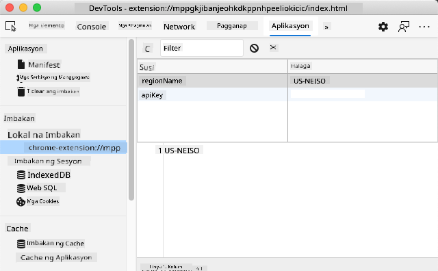

<!--
CO_OP_TRANSLATOR_METADATA:
{
  "original_hash": "e10f168beac4e7b05e30e0eb5c92bf11",
  "translation_date": "2025-08-27T22:30:45+00:00",
  "source_file": "5-browser-extension/2-forms-browsers-local-storage/README.md",
  "language_code": "tl"
}
-->
# Proyekto ng Browser Extension Bahagi 2: Tumawag sa API, gumamit ng Local Storage

## Pre-Lecture Quiz

[Pre-lecture quiz](https://ashy-river-0debb7803.1.azurestaticapps.net/quiz/25)

### Panimula

Sa araling ito, tatawag ka sa isang API sa pamamagitan ng pagsusumite ng form ng iyong browser extension at ipapakita ang mga resulta sa iyong browser extension. Bukod dito, matututo ka kung paano mag-imbak ng data sa local storage ng iyong browser para sa hinaharap na paggamit at sanggunian.

✅ Sundin ang mga numeradong bahagi sa mga kaukulang file upang malaman kung saan ilalagay ang iyong code.

### I-set up ang mga elementong gagamitin sa extension:

Sa puntong ito, nagawa mo na ang HTML para sa form at ang `<div>` ng mga resulta para sa iyong browser extension. Mula ngayon, kakailanganin mong magtrabaho sa file na `/src/index.js` at buuin ang iyong extension unti-unti. Balikan ang [nakaraang aralin](../1-about-browsers/README.md) para sa pag-set up ng iyong proyekto at sa proseso ng pagbuo.

Sa pagtatrabaho sa iyong `index.js` file, magsimula sa pamamagitan ng paglikha ng ilang `const` na mga variable upang hawakan ang mga halaga na nauugnay sa iba't ibang field:

```JavaScript
// form fields
const form = document.querySelector('.form-data');
const region = document.querySelector('.region-name');
const apiKey = document.querySelector('.api-key');

// results
const errors = document.querySelector('.errors');
const loading = document.querySelector('.loading');
const results = document.querySelector('.result-container');
const usage = document.querySelector('.carbon-usage');
const fossilfuel = document.querySelector('.fossil-fuel');
const myregion = document.querySelector('.my-region');
const clearBtn = document.querySelector('.clear-btn');
```

Ang lahat ng mga field na ito ay tinutukoy sa pamamagitan ng kanilang css class, tulad ng itinakda mo sa HTML sa nakaraang aralin.

### Magdagdag ng mga listener

Susunod, magdagdag ng mga event listener sa form at sa clear button na nagre-reset ng form, upang kapag nagsumite ang user ng form o nag-click sa reset button, may mangyayari. Idagdag din ang tawag upang i-initialize ang app sa ibaba ng file:

```JavaScript
form.addEventListener('submit', (e) => handleSubmit(e));
clearBtn.addEventListener('click', (e) => reset(e));
init();
```

✅ Pansinin ang pinaikling paraan ng pakikinig para sa isang submit o click event, at kung paano ipinapasa ang event sa handleSubmit o reset functions. Kaya mo bang isulat ang katumbas nito sa mas mahabang format? Alin ang mas gusto mo?

### Buuin ang init() function at ang reset() function:

Ngayon, gagawin mo ang function na nag-i-initialize ng extension, na tinatawag na init():

```JavaScript
function init() {
	//if anything is in localStorage, pick it up
	const storedApiKey = localStorage.getItem('apiKey');
	const storedRegion = localStorage.getItem('regionName');

	//set icon to be generic green
	//todo

	if (storedApiKey === null || storedRegion === null) {
		//if we don't have the keys, show the form
		form.style.display = 'block';
		results.style.display = 'none';
		loading.style.display = 'none';
		clearBtn.style.display = 'none';
		errors.textContent = '';
	} else {
        //if we have saved keys/regions in localStorage, show results when they load
        displayCarbonUsage(storedApiKey, storedRegion);
		results.style.display = 'none';
		form.style.display = 'none';
		clearBtn.style.display = 'block';
	}
};

function reset(e) {
	e.preventDefault();
	//clear local storage for region only
	localStorage.removeItem('regionName');
	init();
}

```

Sa function na ito, mayroong ilang kawili-wiling lohika. Sa pagbabasa nito, makikita mo ba kung ano ang nangyayari?

- Dalawang `const` ang itinakda upang suriin kung ang user ay nag-imbak ng APIKey at region code sa local storage.
- Kung alinman sa mga ito ay null, ipakita ang form sa pamamagitan ng pagbabago ng style nito upang ipakita bilang 'block'.
- Itago ang mga resulta, loading, at clearBtn at itakda ang anumang error text bilang walang laman na string.
- Kung mayroong key at rehiyon, simulan ang isang routine upang:
  - Tawagan ang API upang makuha ang data ng carbon usage.
  - Itago ang lugar ng mga resulta.
  - Itago ang form.
  - Ipakita ang reset button.

Bago magpatuloy, kapaki-pakinabang na matutunan ang isang napakahalagang konsepto na magagamit sa mga browser: [LocalStorage](https://developer.mozilla.org/docs/Web/API/Window/localStorage). Ang LocalStorage ay isang kapaki-pakinabang na paraan upang mag-imbak ng mga string sa browser bilang isang `key-value` pair. Ang ganitong uri ng web storage ay maaaring manipulahin ng JavaScript upang pamahalaan ang data sa browser. Ang LocalStorage ay hindi nag-e-expire, habang ang SessionStorage, isa pang uri ng web storage, ay nalilinis kapag isinara ang browser. Ang iba't ibang uri ng storage ay may mga kalamangan at kahinaan sa kanilang paggamit.

> Tandaan - ang iyong browser extension ay may sariling local storage; ang pangunahing browser window ay ibang instance at gumagana nang hiwalay.

Itakda ang iyong APIKey upang magkaroon ng string value, halimbawa, at makikita mo na ito ay nakatakda sa Edge sa pamamagitan ng "pag-i-inspect" ng isang web page (maaari kang mag-right-click sa browser upang mag-inspect) at pumunta sa Applications tab upang makita ang storage.



✅ Mag-isip ng mga sitwasyon kung saan HINDI mo gustong mag-imbak ng ilang data sa LocalStorage. Sa pangkalahatan, ang paglalagay ng API Keys sa LocalStorage ay isang masamang ideya! Nakikita mo ba kung bakit? Sa ating kaso, dahil ang ating app ay para lamang sa pag-aaral at hindi ilalathala sa isang app store, gagamitin natin ang pamamaraang ito.

Pansinin na ginagamit mo ang Web API upang manipulahin ang LocalStorage, alinman sa pamamagitan ng paggamit ng `getItem()`, `setItem()`, o `removeItem()`. Malawak itong sinusuportahan sa iba't ibang browser.

Bago buuin ang `displayCarbonUsage()` function na tinatawag sa `init()`, gawin muna ang functionality upang hawakan ang paunang pagsusumite ng form.

### Hawakan ang pagsusumite ng form

Gumawa ng function na tinatawag na `handleSubmit` na tumatanggap ng isang event argument `(e)`. Pigilan ang event mula sa pag-propagate (sa kasong ito, gusto nating pigilan ang browser mula sa pag-refresh) at tawagan ang isang bagong function, `setUpUser`, na ipinapasa ang mga argumento `apiKey.value` at `region.value`. Sa ganitong paraan, ginagamit mo ang dalawang halaga na dinala sa pamamagitan ng paunang form kapag napunan ang mga kaukulang field.

```JavaScript
function handleSubmit(e) {
	e.preventDefault();
	setUpUser(apiKey.value, region.value);
}
```

✅ Balikan ang iyong memorya - ang HTML na itinakda mo sa nakaraang aralin ay may dalawang input field na ang mga `value` ay kinukuha sa pamamagitan ng `const` na itinakda mo sa itaas ng file, at pareho silang `required` kaya pinipigilan ng browser ang mga user na maglagay ng null values.

### I-set up ang user

Paglipat sa `setUpUser` function, dito mo itinatakda ang mga local storage value para sa apiKey at regionName. Magdagdag ng bagong function:

```JavaScript
function setUpUser(apiKey, regionName) {
	localStorage.setItem('apiKey', apiKey);
	localStorage.setItem('regionName', regionName);
	loading.style.display = 'block';
	errors.textContent = '';
	clearBtn.style.display = 'block';
	//make initial call
	displayCarbonUsage(apiKey, regionName);
}
```

Itinatakda ng function na ito ang loading message upang ipakita habang tinatawag ang API. Sa puntong ito, narating mo na ang paggawa ng pinakamahalagang function ng browser extension na ito!

### Ipakita ang Carbon Usage

Sa wakas, oras na upang mag-query sa API!

Bago magpatuloy, dapat nating talakayin ang mga API. Ang mga API, o [Application Programming Interfaces](https://www.webopedia.com/TERM/A/API.html), ay isang mahalagang bahagi ng toolbox ng isang web developer. Nagbibigay ang mga ito ng mga pamantayang paraan para sa mga programa upang makipag-ugnayan at mag-interface sa isa't isa. Halimbawa, kung gumagawa ka ng isang website na kailangang mag-query sa isang database, maaaring may gumawa ng API na magagamit mo. Habang maraming uri ng API, isa sa mga pinakasikat ay ang [REST API](https://www.smashingmagazine.com/2018/01/understanding-using-rest-api/).

✅ Ang terminong 'REST' ay nangangahulugang 'Representational State Transfer' at nagtatampok ng paggamit ng iba't ibang naka-configure na mga URL upang kumuha ng data. Mag-research ng kaunti tungkol sa iba't ibang uri ng API na magagamit ng mga developer. Aling format ang pinaka-interesante para sa iyo?

May mga mahahalagang bagay na dapat tandaan tungkol sa function na ito. Una, pansinin ang [`async` keyword](https://developer.mozilla.org/docs/Web/JavaScript/Reference/Statements/async_function). Ang pagsulat ng iyong mga function upang tumakbo nang asynchronous ay nangangahulugan na naghihintay ang mga ito para sa isang aksyon, tulad ng pagbabalik ng data, bago magpatuloy.

Narito ang isang mabilis na video tungkol sa `async`:

[](https://youtube.com/watch?v=YwmlRkrxvkk "Async at Await para sa pamamahala ng mga promises")

> 🎥 I-click ang larawan sa itaas para sa isang video tungkol sa async/await.

Gumawa ng bagong function upang mag-query sa C02Signal API:

```JavaScript
import axios from '../node_modules/axios';

async function displayCarbonUsage(apiKey, region) {
	try {
		await axios
			.get('https://api.co2signal.com/v1/latest', {
				params: {
					countryCode: region,
				},
				headers: {
					'auth-token': apiKey,
				},
			})
			.then((response) => {
				let CO2 = Math.floor(response.data.data.carbonIntensity);

				//calculateColor(CO2);

				loading.style.display = 'none';
				form.style.display = 'none';
				myregion.textContent = region;
				usage.textContent =
					Math.round(response.data.data.carbonIntensity) + ' grams (grams C02 emitted per kilowatt hour)';
				fossilfuel.textContent =
					response.data.data.fossilFuelPercentage.toFixed(2) +
					'% (percentage of fossil fuels used to generate electricity)';
				results.style.display = 'block';
			});
	} catch (error) {
		console.log(error);
		loading.style.display = 'none';
		results.style.display = 'none';
		errors.textContent = 'Sorry, we have no data for the region you have requested.';
	}
}
```

Ito ay isang malaking function. Ano ang nangyayari dito?

- Ayon sa pinakamahusay na kasanayan, gumagamit ka ng `async` keyword upang gawing asynchronous ang function na ito. Ang function ay naglalaman ng isang `try/catch` block dahil magbabalik ito ng isang promise kapag ang API ay nagbalik ng data. Dahil wala kang kontrol sa bilis ng pagtugon ng API (maaaring hindi ito tumugon!), kailangan mong harapin ang kawalang-katiyakan na ito sa pamamagitan ng pagtawag dito nang asynchronous.
- Nag-query ka sa co2signal API upang makuha ang data ng iyong rehiyon, gamit ang iyong API Key. Upang magamit ang key na iyon, kailangan mong gumamit ng uri ng authentication sa iyong header parameters.
- Kapag tumugon ang API, itinalaga mo ang iba't ibang elemento ng response data nito sa mga bahagi ng iyong screen na itinakda mo upang ipakita ang data na ito.
- Kung may error, o kung walang resulta, nagpapakita ka ng error message.

✅ Ang paggamit ng asynchronous programming patterns ay isa pang napaka-kapaki-pakinabang na tool sa iyong toolbox. Basahin ang [iba't ibang paraan](https://developer.mozilla.org/docs/Web/JavaScript/Reference/Statements/async_function) kung paano mo mai-configure ang ganitong uri ng code.

Binabati kita! Kung binuo mo ang iyong extension (`npm run build`) at ni-refresh ito sa iyong extensions pane, mayroon ka nang gumaganang extension! Ang tanging hindi gumagana ay ang icon, at aayusin mo iyon sa susunod na aralin.

---

## 🚀 Hamon

Napag-usapan natin ang ilang uri ng API sa mga araling ito. Pumili ng isang web API at saliksikin nang malalim kung ano ang inaalok nito. Halimbawa, tingnan ang mga API na magagamit sa loob ng mga browser tulad ng [HTML Drag and Drop API](https://developer.mozilla.org/docs/Web/API/HTML_Drag_and_Drop_API). Ano ang gumagawa ng isang mahusay na API sa iyong opinyon?

## Post-Lecture Quiz

[Post-lecture quiz](https://ashy-river-0debb7803.1.azurestaticapps.net/quiz/26)

## Review at Pag-aaral sa Sarili

Natuto ka tungkol sa LocalStorage at mga API sa araling ito, parehong napaka-kapaki-pakinabang para sa isang propesyonal na web developer. Maisip mo ba kung paano nagtutulungan ang dalawang bagay na ito? Isipin kung paano mo ia-architect ang isang website na mag-iimbak ng mga item na gagamitin ng isang API.

## Takdang-Aralin

[Adopt an API](assignment.md)

---

**Paunawa**:  
Ang dokumentong ito ay isinalin gamit ang AI translation service na [Co-op Translator](https://github.com/Azure/co-op-translator). Bagama't sinisikap naming maging tumpak, pakitandaan na ang mga awtomatikong pagsasalin ay maaaring maglaman ng mga pagkakamali o hindi pagkakatugma. Ang orihinal na dokumento sa kanyang katutubong wika ang dapat ituring na opisyal na sanggunian. Para sa mahalagang impormasyon, inirerekomenda ang propesyonal na pagsasalin ng tao. Hindi kami mananagot sa anumang hindi pagkakaunawaan o maling interpretasyon na maaaring magmula sa paggamit ng pagsasaling ito.