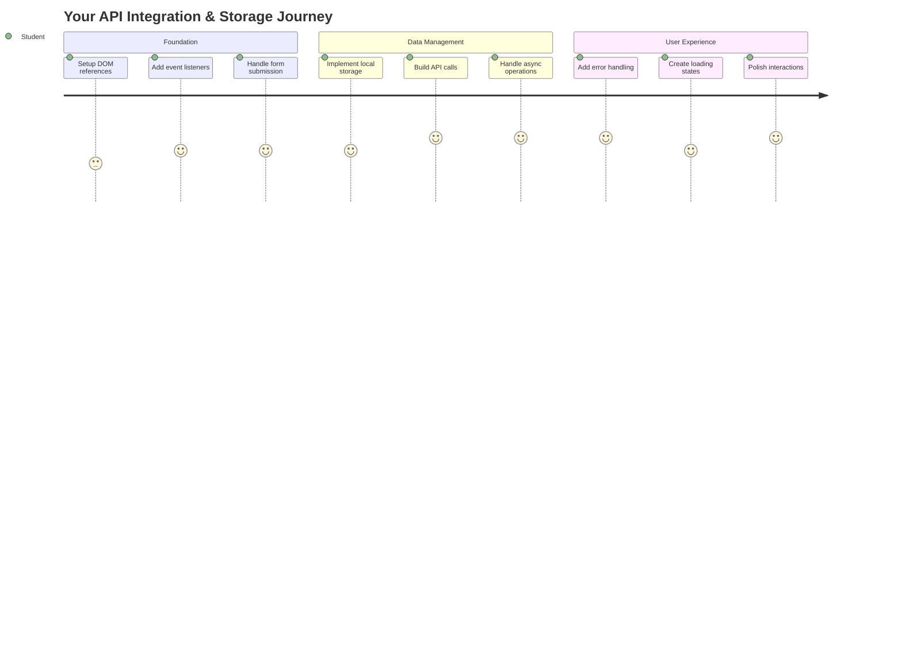
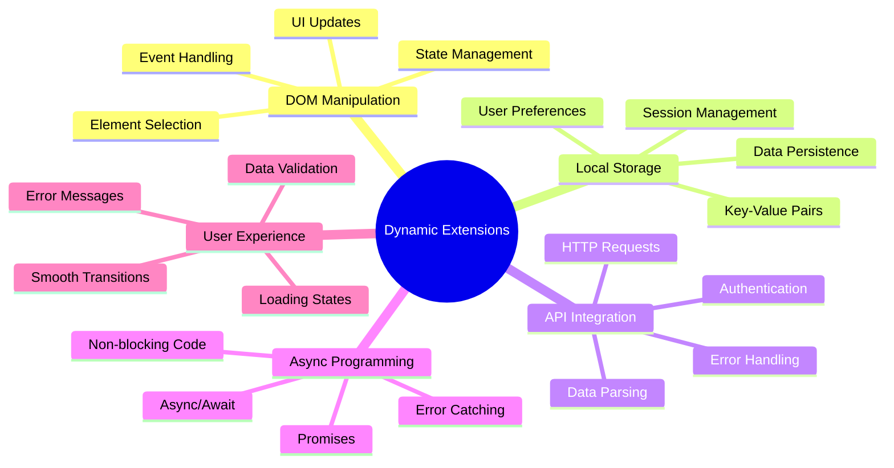
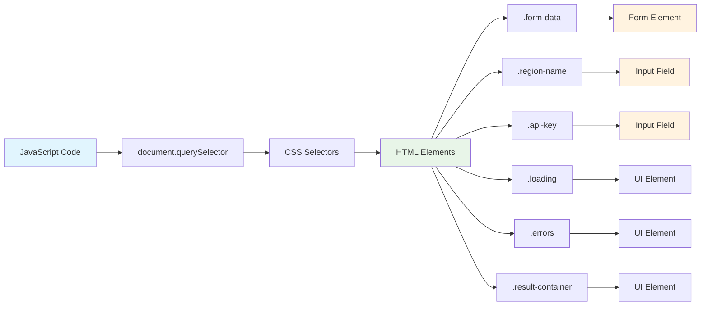
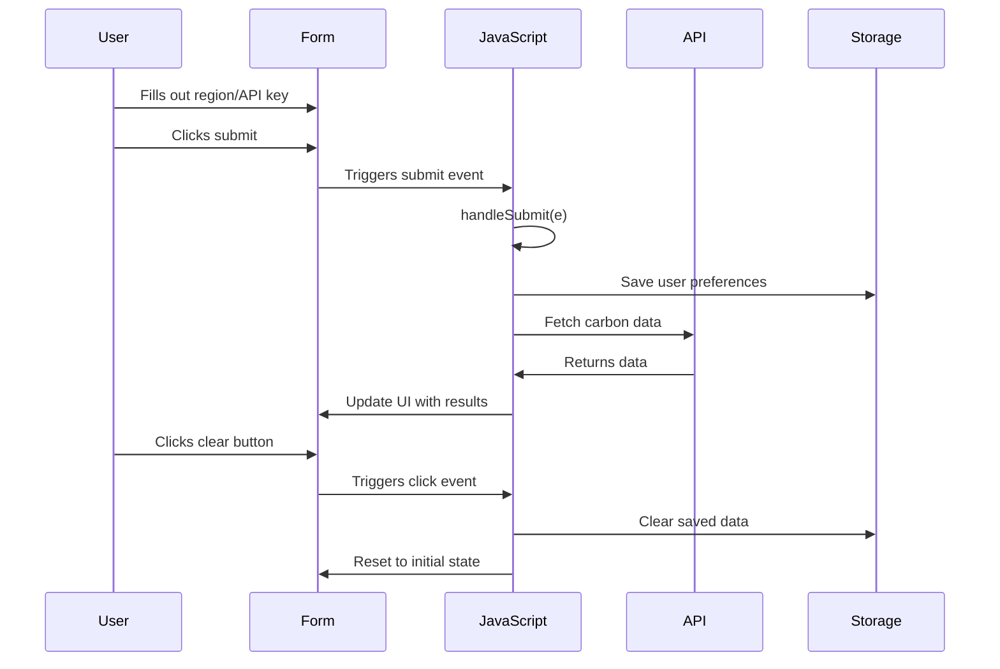
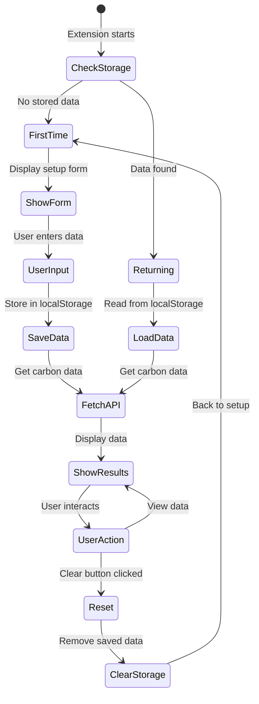
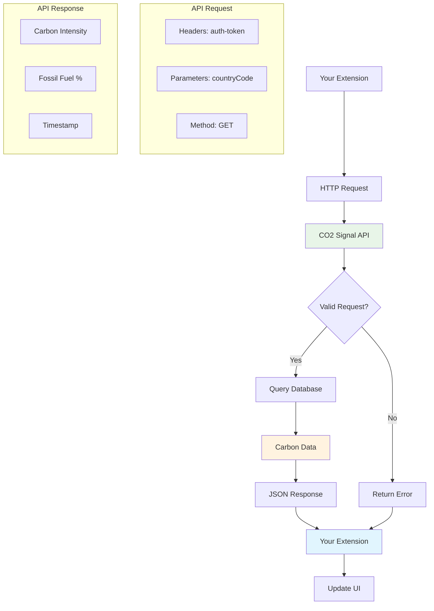
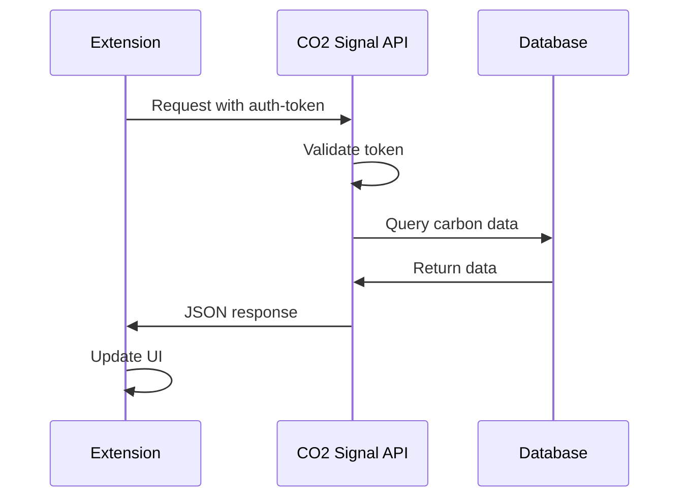
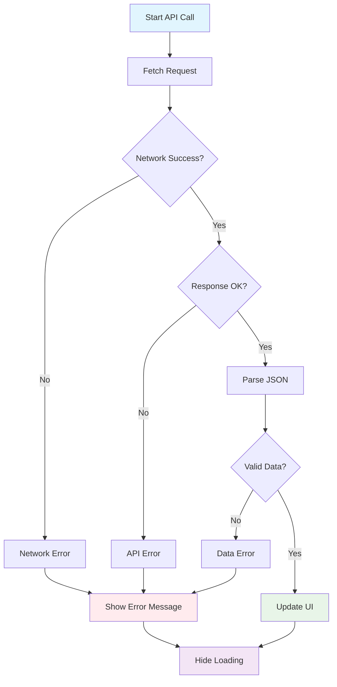
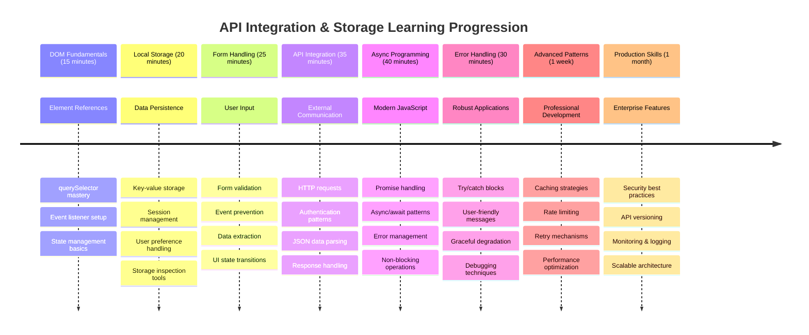

<!--
CO_OP_TRANSLATOR_METADATA:
{
  "original_hash": "2b6203a48c48d8234e0948353b47d84e",
  "translation_date": "2025-11-03T14:08:38+00:00",
  "source_file": "5-browser-extension/2-forms-browsers-local-storage/README.md",
  "language_code": "tl"
}
-->
# Browser Extension Project Part 2: Gumamit ng API, Local Storage



## Pre-Lecture Quiz

[Pre-lecture quiz](https://ff-quizzes.netlify.app/web/quiz/25)

## Panimula

Naalala mo ba ang browser extension na sinimulan mong gawin? Sa ngayon, mayroon kang magandang form, ngunit ito ay static pa rin. Ngayon, bibigyan natin ito ng buhay sa pamamagitan ng pagkonekta sa totoong data at pagbibigay ng memorya.

Isipin ang mga computer ng Apollo mission control - hindi lang sila nagpapakita ng nakapirming impormasyon. Patuloy silang nakikipag-ugnayan sa spacecraft, ina-update gamit ang telemetry data, at inaalala ang mahahalagang parameter ng misyon. Ganitong uri ng dynamic na pag-uugali ang itatayo natin ngayon. Ang iyong extension ay makakakuha ng totoong environmental data mula sa internet at maaalala ang iyong mga setting para sa susunod.

Ang API integration ay maaaring mukhang kumplikado, ngunit ito ay simpleng pagtuturo sa iyong code kung paano makipag-usap sa ibang mga serbisyo. Kung ikaw man ay kumukuha ng weather data, social media feeds, o impormasyon tungkol sa carbon footprint tulad ng gagawin natin ngayon, ito ay tungkol sa pagtatatag ng mga digital na koneksyon. Tatalakayin din natin kung paano maaaring mag-imbak ng impormasyon ang mga browser - katulad ng kung paano ginamit ng mga library ang card catalogs para maalala kung saan nakalagay ang mga libro.

Sa pagtatapos ng araling ito, magkakaroon ka ng browser extension na kumukuha ng totoong data, nag-iimbak ng mga preference ng user, at nagbibigay ng maayos na karanasan. Simulan na natin!



✅ Sundin ang mga numeradong segment sa mga kaukulang file para malaman kung saan ilalagay ang iyong code

## I-set up ang mga elementong gagamitin sa extension

Bago manipulahin ng iyong JavaScript ang interface, kailangan nito ng mga reference sa mga partikular na HTML element. Isipin ito na parang teleskopyo na kailangang itutok sa mga partikular na bituin - bago mapag-aralan ni Galileo ang mga buwan ng Jupiter, kailangan niyang hanapin at ituon ang teleskopyo sa Jupiter mismo.

Sa iyong `index.js` file, gagawa tayo ng mga `const` variable na kumukuha ng mga reference sa bawat mahalagang element ng form. Katulad ito ng kung paano nilalagyan ng label ng mga siyentipiko ang kanilang kagamitan - sa halip na maghanap sa buong laboratoryo sa bawat pagkakataon, maaari nilang direktang ma-access ang kanilang kailangan.



```javascript
// form fields
const form = document.querySelector('.form-data');
const region = document.querySelector('.region-name');
const apiKey = document.querySelector('.api-key');

// results
const errors = document.querySelector('.errors');
const loading = document.querySelector('.loading');
const results = document.querySelector('.result-container');
const usage = document.querySelector('.carbon-usage');
const fossilfuel = document.querySelector('.fossil-fuel');
const myregion = document.querySelector('.my-region');
const clearBtn = document.querySelector('.clear-btn');
```

**Narito ang ginagawa ng code na ito:**
- **Kinukuha** ang mga element ng form gamit ang `document.querySelector()` na may CSS class selectors
- **Gumagawa** ng mga reference sa input fields para sa pangalan ng rehiyon at API key
- **Nag-eestablish** ng koneksyon sa mga element ng display para sa carbon usage data
- **Nagse-set up** ng access sa mga UI element tulad ng loading indicators at error messages
- **Nag-iimbak** ng bawat reference ng element sa isang `const` variable para madaling magamit sa buong code

## Magdagdag ng mga event listener

Ngayon gagawin natin ang iyong extension na tumugon sa mga aksyon ng user. Ang mga event listener ay paraan ng iyong code para subaybayan ang mga interaksyon ng user. Isipin ito na parang mga operator sa mga unang telephone exchanges - nakikinig sila sa mga tawag at ikinokonekta ang tamang circuit kapag may gustong tumawag.



```javascript
form.addEventListener('submit', (e) => handleSubmit(e));
clearBtn.addEventListener('click', (e) => reset(e));
init();
```

**Pag-unawa sa mga konsepto:**
- **Nag-a-attach** ng submit listener sa form na nagti-trigger kapag pinindot ng user ang Enter o click submit
- **Nagkokonekta** ng click listener sa clear button para i-reset ang form
- **Nagpapasa** ng event object `(e)` sa mga handler function para sa karagdagang kontrol
- **Tumatawag** sa `init()` function kaagad para i-set up ang initial state ng iyong extension

✅ Pansinin ang shorthand arrow function syntax na ginamit dito. Ang modernong JavaScript approach na ito ay mas malinis kaysa sa tradisyunal na function expressions, ngunit pareho silang gumagana nang maayos!

### 🔄 **Pedagogical Check-in**
**Pag-unawa sa Event Handling**: Bago magpatuloy sa initialization, tiyaking kaya mong:
- ✅ Ipaliwanag kung paano ikinokonekta ng `addEventListener` ang mga aksyon ng user sa mga JavaScript function
- ✅ Unawain kung bakit natin ipinapasa ang event object `(e)` sa mga handler function
- ✅ Kilalanin ang pagkakaiba ng `submit` at `click` events
- ✅ Ilarawan kung kailan tumatakbo ang `init()` function at kung bakit

**Mabilis na Self-Test**: Ano ang mangyayari kung nakalimutan mo ang `e.preventDefault()` sa isang form submission?
*Sagot: Mare-reload ang page, mawawala ang lahat ng JavaScript state at maaabala ang karanasan ng user*

## Bumuo ng initialization at reset functions

Gagawa tayo ng initialization logic para sa iyong extension. Ang `init()` function ay parang navigation system ng barko na nagche-check sa mga instrumento nito - tinutukoy nito ang kasalukuyang estado at ina-adjust ang interface nang naaayon. Tinitingnan nito kung may gumamit na sa iyong extension dati at ina-load ang kanilang mga nakaraang setting.

Ang `reset()` function ay nagbibigay sa mga user ng bagong simula - katulad ng kung paano nire-reset ng mga siyentipiko ang kanilang mga instrumento sa pagitan ng mga eksperimento para masigurado ang malinis na data.

```javascript
function init() {
	// Check if user has previously saved API credentials
	const storedApiKey = localStorage.getItem('apiKey');
	const storedRegion = localStorage.getItem('regionName');

	// Set extension icon to generic green (placeholder for future lesson)
	// TODO: Implement icon update in next lesson

	if (storedApiKey === null || storedRegion === null) {
		// First-time user: show the setup form
		form.style.display = 'block';
		results.style.display = 'none';
		loading.style.display = 'none';
		clearBtn.style.display = 'none';
		errors.textContent = '';
	} else {
		// Returning user: load their saved data automatically
		displayCarbonUsage(storedApiKey, storedRegion);
		results.style.display = 'none';
		form.style.display = 'none';
		clearBtn.style.display = 'block';
	}
}

function reset(e) {
	e.preventDefault();
	// Clear stored region to allow user to choose a new location
	localStorage.removeItem('regionName');
	// Restart the initialization process
	init();
}
```

**Paghiwa-hiwalay kung ano ang nangyayari dito:**
- **Kinukuha** ang naka-store na API key at rehiyon mula sa local storage ng browser
- **Tinitingnan** kung ito ay unang beses na user (walang naka-store na credentials) o bumabalik na user
- **Ipinapakita** ang setup form para sa mga bagong user at itinatago ang ibang mga element ng interface
- **Ina-load** ang naka-save na data nang awtomatiko para sa mga bumabalik na user at ipinapakita ang reset option
- **Pinamamahalaan** ang estado ng user interface batay sa available na data

**Mga pangunahing konsepto tungkol sa Local Storage:**
- **Nagpe-persist** ng data sa pagitan ng mga session ng browser (hindi tulad ng session storage)
- **Nag-iimbak** ng data bilang key-value pairs gamit ang `getItem()` at `setItem()`
- **Nagbabalik** ng `null` kapag walang data para sa isang partikular na key
- **Nagbibigay** ng simpleng paraan para maalala ang mga preference at setting ng user

> 💡 **Pag-unawa sa Browser Storage**: Ang [LocalStorage](https://developer.mozilla.org/docs/Web/API/Window/localStorage) ay parang nagbibigay ng persistent memory sa iyong extension. Isipin kung paano ang sinaunang Library of Alexandria ay nag-imbak ng mga scroll - nananatiling available ang impormasyon kahit umalis at bumalik ang mga iskolar.
>
> **Mga pangunahing katangian:**
> - **Nagpe-persist** ng data kahit na isara mo ang browser
> - **Nananatili** kahit mag-restart ang computer o mag-crash ang browser
> - **Nagbibigay** ng malawak na storage space para sa mga preference ng user
> - **Nag-aalok** ng instant access nang walang network delays

> **Mahalagang Paalala**: Ang browser extension mo ay may sariling isolated local storage na hiwalay sa regular na mga web page. Nagbibigay ito ng seguridad at pinipigilan ang mga conflict sa ibang mga website.

Makikita mo ang iyong naka-store na data sa pamamagitan ng pagbukas ng browser Developer Tools (F12), pagpunta sa **Application** tab, at pag-expand ng **Local Storage** section.




> ⚠️ **Pagsasaalang-alang sa Seguridad**: Sa mga production application, ang pag-iimbak ng API keys sa LocalStorage ay may panganib sa seguridad dahil maa-access ito ng JavaScript. Para sa layunin ng pag-aaral, ang approach na ito ay maayos, ngunit ang mga totoong application ay dapat gumamit ng secure server-side storage para sa mga sensitibong credentials.

## I-handle ang form submission

Ngayon, hahawakan natin kung ano ang mangyayari kapag may nagsumite ng iyong form. Sa default, nire-reload ng mga browser ang page kapag nagsusumite ng form, ngunit i-intercept natin ang behavior na ito para makagawa ng mas maayos na karanasan.

Ang approach na ito ay katulad ng kung paano hinahandle ng mission control ang komunikasyon ng spacecraft - sa halip na i-reset ang buong sistema sa bawat transmission, pinapanatili nila ang tuloy-tuloy na operasyon habang pinoproseso ang bagong impormasyon.

Gumawa ng function na kumukuha ng form submission event at nag-eextract ng input ng user:

```javascript
function handleSubmit(e) {
	e.preventDefault();
	setUpUser(apiKey.value, region.value);
}
```

**Sa itaas, ginawa natin ang:**
- **Pinipigilan** ang default na behavior ng form submission na magre-refresh ng page
- **Kinukuha** ang mga input value ng user mula sa API key at region fields
- **Ipinapasa** ang form data sa `setUpUser()` function para sa processing
- **Pinapanatili** ang single-page application behavior sa pamamagitan ng pag-iwas sa page reloads

✅ Tandaan na ang iyong HTML form fields ay may `required` attribute, kaya awtomatikong sine-check ng browser na magbigay ang user ng parehong API key at rehiyon bago tumakbo ang function na ito.

## I-set up ang mga preference ng user

Ang `setUpUser` function ang responsable sa pag-save ng credentials ng user at pag-initiate ng unang API call. Ginagawa nitong maayos ang transition mula sa setup patungo sa pagpapakita ng resulta.

```javascript
function setUpUser(apiKey, regionName) {
	// Save user credentials for future sessions
	localStorage.setItem('apiKey', apiKey);
	localStorage.setItem('regionName', regionName);
	
	// Update UI to show loading state
	loading.style.display = 'block';
	errors.textContent = '';
	clearBtn.style.display = 'block';
	
	// Fetch carbon usage data with user's credentials
	displayCarbonUsage(apiKey, regionName);
}
```

**Hakbang-hakbang, narito ang nangyayari:**
- **Sine-save** ang API key at pangalan ng rehiyon sa local storage para sa susunod na paggamit
- **Ipinapakita** ang loading indicator para ipaalam sa user na kumukuha ng data
- **Nililinis** ang anumang naunang error messages mula sa display
- **Ipinapakita** ang clear button para sa user na i-reset ang kanilang settings sa susunod
- **Ini-initiate** ang API call para kumuha ng totoong carbon usage data

Ang function na ito ay lumilikha ng seamless user experience sa pamamagitan ng sabay-sabay na pamamahala ng data persistence at mga update sa user interface.

## I-display ang carbon usage data

Ngayon, ikokonekta natin ang iyong extension sa mga external data sources sa pamamagitan ng APIs. Binabago nito ang iyong extension mula sa standalone tool patungo sa isang bagay na makakakuha ng real-time na impormasyon mula sa internet.

**Pag-unawa sa APIs**

[APIs](https://www.webopedia.com/TERM/A/API.html) ang paraan kung paano nag-uusap ang iba't ibang application sa isa't isa. Isipin ito na parang telegraph system na nagkonekta sa mga malalayong lungsod noong ika-19 na siglo - nagpapadala ang mga operator ng mga request sa malalayong istasyon at tumatanggap ng mga sagot na may hinihinging impormasyon. Sa tuwing nagche-check ka ng social media, nagtatanong sa voice assistant, o gumagamit ng delivery app, ang APIs ang nagpapadali sa mga data exchanges.



**Mga pangunahing konsepto tungkol sa REST APIs:**
- **REST** ay nangangahulugang 'Representational State Transfer'
- **Gumagamit** ng standard HTTP methods (GET, POST, PUT, DELETE) para makipag-ugnayan sa data
- **Nagbabalik** ng data sa predictable formats, kadalasang JSON
- **Nagbibigay** ng consistent, URL-based endpoints para sa iba't ibang uri ng request

✅ Ang [CO2 Signal API](https://www.co2signal.com/) na gagamitin natin ay nagbibigay ng real-time na carbon intensity data mula sa mga electrical grid sa buong mundo. Nakakatulong ito sa mga user na maunawaan ang environmental impact ng kanilang electricity usage!

> 💡 **Pag-unawa sa Asynchronous JavaScript**: Ang [`async` keyword](https://developer.mozilla.org/docs/Web/JavaScript/Reference/Statements/async_function) ay nagbibigay-daan sa iyong code na mag-handle ng maraming operasyon nang sabay-sabay. Kapag humihiling ka ng data mula sa server, ayaw mong mag-freeze ang buong extension - parang air traffic control na tumitigil sa lahat ng operasyon habang naghihintay ng sagot mula sa isang eroplano.
>
> **Mga pangunahing benepisyo:**
> - **Pinapanatili** ang responsiveness ng extension habang naglo-load ang data
> - **Pinapayagan** ang ibang code na magpatuloy sa pagtakbo habang may network requests
> - **Pinapaganda** ang readability ng code kumpara sa tradisyunal na callback patterns
> - **Nagbibigay-daan** sa maayos na error handling para sa mga network issues

Narito ang isang mabilis na video tungkol sa `async`:

[](https://youtube.com/watch?v=YwmlRkrxvkk "Async and Await para sa pamamahala ng promises")

> 🎥 I-click ang imahe sa itaas para sa video tungkol sa async/await.

### 🔄 **Pedagogical Check-in**
**Pag-unawa sa Async Programming**: Bago sumabak sa API function, tiyaking nauunawaan mo:
- ✅ Bakit natin ginagamit ang `async/await` sa halip na i-block ang buong extension
- ✅ Paano hinahandle ng `try/catch` blocks ang mga network error nang maayos
- ✅ Ang pagkakaiba ng synchronous at asynchronous operations
- ✅ Bakit maaaring mag-fail ang API calls at paano ito hinahandle

**Real-World Connection**: Isipin ang mga pang-araw-araw na async na halimbawa:
- **Pag-order ng pagkain**: Hindi ka naghihintay sa kusina - makakakuha ka ng resibo at magpapatuloy sa ibang aktibidad
- **Pagpapadala ng email**: Hindi nag-freeze ang email app habang nagpapadala - maaari kang gumawa ng iba pang email
- **Paglo-load ng web pages**: Progressive na naglo-load ang mga imahe habang maaari mo nang basahin ang teksto

**API Authentication Flow**:


Gumawa ng function para kumuha at mag-display ng carbon usage data:

```javascript
// Modern fetch API approach (no external dependencies needed)
async function displayCarbonUsage(apiKey, region) {
	try {
		// Fetch carbon intensity data from CO2 Signal API
		const response = await fetch('https://api.co2signal.com/v1/latest', {
			method: 'GET',
			headers: {
				'auth-token': apiKey,
				'Content-Type': 'application/json'
			},
			// Add query parameters for the specific region
			...new URLSearchParams({ countryCode: region }) && {
				url: `https://api.co2signal.com/v1/latest?countryCode=${region}`
			}
		});

		// Check if the API request was successful
		if (!response.ok) {
			throw new Error(`API request failed: ${response.status}`);
		}

		const data = await response.json();
		const carbonData = data.data;

		// Calculate rounded carbon intensity value
		const carbonIntensity = Math.round(carbonData.carbonIntensity);

		// Update the user interface with fetched data
		loading.style.display = 'none';
		form.style.display = 'none';
		myregion.textContent = region.toUpperCase();
		usage.textContent = `${carbonIntensity} grams (grams CO₂ emitted per kilowatt hour)`;
		fossilfuel.textContent = `${carbonData.fossilFuelPercentage.toFixed(2)}% (percentage of fossil fuels used to generate electricity)`;
		results.style.display = 'block';

		// TODO: calculateColor(carbonIntensity) - implement in next lesson

	} catch (error) {
		console.error('Error fetching carbon data:', error);
		
		// Show user-friendly error message
		loading.style.display = 'none';
		results.style.display = 'none';
		errors.textContent = 'Sorry, we couldn\'t fetch data for that region. Please check your API key and region code.';
	}
}
```

**Paghiwa-hiwalay kung ano ang nangyayari dito:**
- **Gumagamit** ng modernong `fetch()` API sa halip na external libraries tulad ng Axios para sa mas malinis, dependency-free na code
- **Nag-iimplement** ng tamang error checking gamit ang `response.ok` para ma-catch ang API failures nang maaga
- **Hinahandle** ang asynchronous operations gamit ang `async/await` para sa mas nababasang code flow
- **Nag-aauthenticate** sa CO2 Signal API gamit ang `auth-token` header
- **Nagpa-parse** ng JSON response data at kumukuha ng carbon intensity information
- **Ina-update** ang maraming UI element gamit ang formatted environmental data
- **Nagbibigay** ng user-friendly error messages kapag nag-fail ang API calls

**Mga pangunahing modernong JavaScript concepts na ipinakita:**
- **Template literals** gamit ang `${}` syntax para sa malinis na string formatting
- **Error handling** gamit ang try/catch blocks para sa robust applications
- **Async/await** pattern para sa maayos na pag-handle ng network requests
- **Object destructuring** para makuha ang partikular na data mula sa API responses
- **Method chaining** para sa maraming DOM manipulations

✅ Ang function na ito ay nagpapakita ng ilang mahahalagang konsepto sa web development - pakikipag-ugnayan sa mga external server, pag-handle ng authentication, pagproseso ng data, pag-update ng interface, at maayos na pag-handle ng errors. Ito ay mga pangunahing kasanayan na regular na ginagamit ng mga propesyonal na developer.



### 🔄 **Pedagogical Check-in**
**Pag-unawa sa Buong Sistema**: Tiyaking master mo ang buong flow:
- ✅ Paano ang DOM references ay nagbibigay-daan sa JavaScript na kontrolin ang interface
- ✅ Bakit ang local storage ay lumilikha ng persistence sa pagitan ng mga session ng browser
- ✅ Paano ang async/await ay gumagawa ng API calls nang hindi nag-freeze ang extension
- ✅ Ano ang nangyayari kapag nag-fail ang API calls at paano hinahandle ang errors
- ✅ Bakit ang user experience ay may kasamang loading states at error messages

🎉 **Ano ang iyong na-accomplish:** Nakagawa ka ng browser extension na:
- **Kumokonekta** sa internet at kumukuha ng totoong environmental data
- **Nagpe-persist** ng user settings sa pagitan ng mga session
- **Hinahandle** ang errors nang maayos sa halip na mag-crash
- **Nagbibigay** ng maayos, propesyonal na user experience

I-test ang iyong gawa sa pamamagitan ng pag-run ng `npm run build` at pag-refresh ng iyong extension sa browser. Mayroon ka na ngayong functional carbon footprint tracker. Sa susunod na aralin, magdadagdag tayo ng dynamic icon functionality para makumpleto ang extension.

---

## GitHub Copilot Agent Challenge 🚀

Gamitin ang Agent mode para kumpletuhin ang sumusunod na challenge:
**Deskripsyon:** Pagandahin ang browser extension sa pamamagitan ng pagdaragdag ng mga pagpapabuti sa error handling at mga tampok para sa mas magandang karanasan ng user. Ang hamon na ito ay makakatulong sa iyo na magsanay sa paggamit ng APIs, local storage, at DOM manipulation gamit ang mga modernong pattern ng JavaScript.

**Prompt:** Gumawa ng pinahusay na bersyon ng displayCarbonUsage function na may kasamang: 1) Isang retry mechanism para sa mga nabigong API call gamit ang exponential backoff, 2) Input validation para sa region code bago gumawa ng API call, 3) Isang loading animation na may progress indicators, 4) Pag-cache ng mga API response sa localStorage na may expiration timestamps (cache para sa 30 minuto), at 5) Isang tampok para ipakita ang historical data mula sa mga nakaraang API call. Magdagdag din ng tamang TypeScript-style na JSDoc comments para idokumento ang lahat ng parameters ng function at mga return types.

Alamin pa ang tungkol sa [agent mode](https://code.visualstudio.com/blogs/2025/02/24/introducing-copilot-agent-mode) dito.

## 🚀 Hamon

Palawakin ang iyong kaalaman sa APIs sa pamamagitan ng pag-explore sa iba't ibang browser-based APIs na magagamit para sa web development. Pumili ng isa sa mga browser APIs na ito at gumawa ng maliit na demonstration:

- [Geolocation API](https://developer.mozilla.org/docs/Web/API/Geolocation_API) - Kunin ang kasalukuyang lokasyon ng user
- [Notification API](https://developer.mozilla.org/docs/Web/API/Notifications_API) - Magpadala ng desktop notifications
- [HTML Drag and Drop API](https://developer.mozilla.org/docs/Web/API/HTML_Drag_and_Drop_API) - Gumawa ng interactive na drag interfaces
- [Web Storage API](https://developer.mozilla.org/docs/Web/API/Web_Storage_API) - Mga advanced na teknik sa local storage
- [Fetch API](https://developer.mozilla.org/docs/Web/API/Fetch_API) - Modernong alternatibo sa XMLHttpRequest

**Mga tanong para sa pananaliksik:**
- Anong mga totoong problema ang nilulutas ng API na ito?
- Paano hinahandle ng API ang mga error at edge cases?
- Anong mga konsiderasyon sa seguridad ang umiiral kapag ginagamit ang API na ito?
- Gaano kalawak ang suporta ng API na ito sa iba't ibang browser?

Pagkatapos ng iyong pananaliksik, tukuyin kung anong mga katangian ang nagpapaganda sa isang API para sa mga developer at maaasahan.

## Post-Lecture Quiz

[Post-lecture quiz](https://ff-quizzes.netlify.app/web/quiz/26)

## Review & Self Study

Natutunan mo ang tungkol sa LocalStorage at APIs sa araling ito, parehong napaka-kapaki-pakinabang para sa mga propesyonal na web developer. Maiisip mo ba kung paano nagtutulungan ang dalawang bagay na ito? Isipin kung paano mo ididisenyo ang isang website na mag-iimbak ng mga item na gagamitin ng isang API.

### ⚡ **Ano ang Pwede Mong Gawin sa Loob ng 5 Minuto**
- [ ] Buksan ang DevTools Application tab at i-explore ang localStorage sa anumang website
- [ ] Gumawa ng simpleng HTML form at subukan ang form validation sa browser
- [ ] Subukan ang pag-iimbak at pagkuha ng data gamit ang localStorage sa browser console
- [ ] I-inspect ang form data na isinusumite gamit ang Network tab

### 🎯 **Ano ang Pwede Mong Makamit sa Loob ng Isang Oras**
- [ ] Kumpletuhin ang post-lesson quiz at unawain ang mga konsepto ng form handling
- [ ] Gumawa ng browser extension form na nagse-save ng user preferences
- [ ] Mag-implement ng client-side form validation na may kapaki-pakinabang na error messages
- [ ] Magsanay sa paggamit ng chrome.storage API para sa data persistence ng extension
- [ ] Gumawa ng user interface na tumutugon sa mga na-save na user settings

### 📅 **Ang Iyong Extension Building sa Loob ng Isang Linggo**
- [ ] Kumpletuhin ang isang full-featured browser extension na may form functionality
- [ ] Masterin ang iba't ibang storage options: local, sync, at session storage
- [ ] Mag-implement ng advanced form features tulad ng autocomplete at validation
- [ ] Magdagdag ng import/export functionality para sa user data
- [ ] Subukan ang iyong extension nang maigi sa iba't ibang browser
- [ ] Pagandahin ang user experience at error handling ng iyong extension

### 🌟 **Ang Iyong Web API Mastery sa Loob ng Isang Buwan**
- [ ] Gumawa ng mga kumplikadong aplikasyon gamit ang iba't ibang browser storage APIs
- [ ] Matutunan ang offline-first development patterns
- [ ] Mag-ambag sa mga open source projects na may kinalaman sa data persistence
- [ ] Masterin ang privacy-focused development at pagsunod sa GDPR
- [ ] Gumawa ng reusable libraries para sa form handling at data management
- [ ] Magbahagi ng kaalaman tungkol sa web APIs at extension development

## 🎯 Ang Iyong Extension Development Mastery Timeline



### 🛠️ Buod ng Iyong Full-Stack Development Toolkit

Pagkatapos ng araling ito, mayroon ka nang:
- **DOM Mastery**: Tumpak na pag-target at pag-manipula ng mga elemento
- **Storage Expertise**: Pamamahala ng persistent data gamit ang localStorage
- **API Integration**: Real-time na pagkuha ng data at authentication
- **Async Programming**: Non-blocking operations gamit ang modernong JavaScript
- **Error Handling**: Mga matibay na aplikasyon na maayos na humahawak ng mga pagkakamali
- **User Experience**: Loading states, validation, at maayos na interaksyon
- **Modern Patterns**: fetch API, async/await, at ES6+ features

**Mga Propesyonal na Kasanayan na Nakuha:** Naipatupad mo ang mga pattern na ginagamit sa:
- **Web Applications**: Single-page apps na may external data sources
- **Mobile Development**: Mga API-driven apps na may offline capabilities
- **Desktop Software**: Electron apps na may persistent storage
- **Enterprise Systems**: Authentication, caching, at error handling
- **Modern Frameworks**: React/Vue/Angular data management patterns

**Susunod na Antas:** Handa ka nang mag-explore ng mga advanced na paksa tulad ng caching strategies, real-time WebSocket connections, o kumplikadong state management!

## Assignment

[Adopt an API](assignment.md)

---

**Paunawa**:  
Ang dokumentong ito ay isinalin gamit ang AI translation service na [Co-op Translator](https://github.com/Azure/co-op-translator). Bagamat sinisikap naming maging tumpak, pakatandaan na ang mga awtomatikong pagsasalin ay maaaring maglaman ng mga pagkakamali o hindi pagkakatugma. Ang orihinal na dokumento sa kanyang katutubong wika ang dapat ituring na opisyal na pinagmulan. Para sa mahalagang impormasyon, inirerekomenda ang propesyonal na pagsasalin ng tao. Hindi kami mananagot sa anumang hindi pagkakaunawaan o maling interpretasyon na dulot ng paggamit ng pagsasaling ito.