<!--
CO_OP_TRANSLATOR_METADATA:
{
  "original_hash": "b275fed2c6fc90d2b9b6661a3225faa2",
  "translation_date": "2025-11-03T14:07:52+00:00",
  "source_file": "5-browser-extension/3-background-tasks-and-performance/README.md",
  "language_code": "tl"
}
-->
# Proyekto ng Browser Extension Bahagi 3: Alamin ang Tungkol sa Background Tasks at Performance

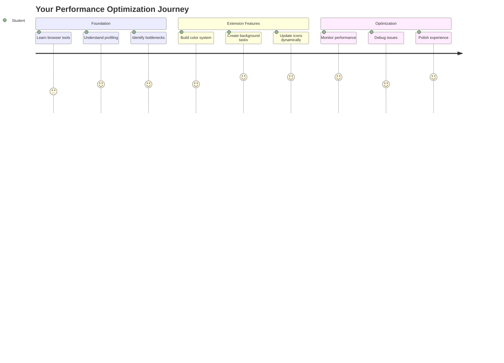

Naisip mo na ba kung bakit ang ilang browser extensions ay mabilis at tumutugon habang ang iba ay tila mabagal? Ang sikreto ay nasa likod ng mga eksena. Habang nagki-click ang mga user sa interface ng iyong extension, may isang mundo ng mga background process na tahimik na nagma-manage ng pagkuha ng data, pag-update ng mga icon, at mga system resources.

Ito ang huling aralin natin sa serye ng browser extension, at gagawin nating maayos ang takbo ng iyong carbon footprint tracker. Magdadagdag ka ng mga dynamic na pag-update ng icon at matututo kung paano matukoy ang mga isyu sa performance bago pa ito maging problema. Para itong pag-tune ng race car - ang maliliit na pag-optimize ay maaaring magdulot ng malaking pagbabago sa takbo ng lahat.

Kapag natapos na tayo, magkakaroon ka ng isang pulidong extension at maiintindihan mo ang mga prinsipyo ng performance na nagtatangi sa magagandang web apps mula sa mga mahusay na web apps. Halina't sumisid sa mundo ng browser optimization.

## Pre-Lecture Quiz

[Pre-lecture quiz](https://ff-quizzes.netlify.app/web/quiz/27)

### Panimula

Sa mga nakaraang aralin, gumawa ka ng form, ikinonekta ito sa isang API, at hinarap ang asynchronous na pagkuha ng data. Maganda na ang hugis ng iyong extension.

Ngayon, kailangan nating idagdag ang mga huling detalye - tulad ng pagpapalit ng kulay ng icon ng extension base sa carbon data. Parang kung paano kailangang i-optimize ng NASA ang bawat sistema sa Apollo spacecraft. Hindi sila maaaring mag-aksaya ng kahit anong cycle o memorya dahil buhay ang nakasalalay sa performance. Bagamat hindi kasing kritikal ang ating browser extension, pareho pa rin ang mga prinsipyo - ang mahusay na code ay lumilikha ng mas magagandang karanasan para sa user.

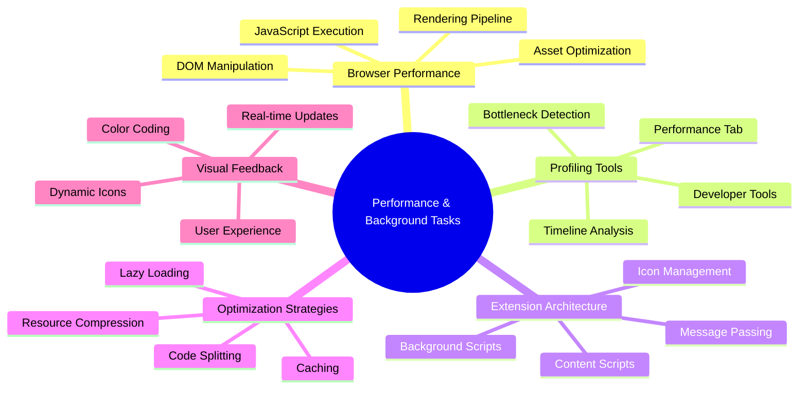

## Mga Pangunahing Kaalaman sa Web Performance

Kapag ang iyong code ay tumatakbo nang mahusay, mararamdaman talaga ito ng mga tao. Alam mo ba ang pakiramdam kapag ang isang pahina ay agad na naglo-load o ang animation ay maayos na gumagalaw? Iyan ang magandang performance sa trabaho.

Ang performance ay hindi lang tungkol sa bilis - ito ay tungkol sa paggawa ng mga web experience na natural ang pakiramdam sa halip na mabagal at nakakainis. Noong unang panahon ng computing, si Grace Hopper ay kilalang may nanosecond (isang piraso ng kawad na humigit-kumulang isang talampakan ang haba) sa kanyang mesa upang ipakita kung gaano kalayo ang nararating ng liwanag sa isang bilyong bahagi ng isang segundo. Ito ang paraan niya ng pagpapaliwanag kung bakit mahalaga ang bawat microsecond sa computing. Tuklasin natin ang mga tool na tumutulong sa iyong matukoy kung ano ang nagpapabagal sa mga bagay.

> "Ang performance ng website ay tungkol sa dalawang bagay: kung gaano kabilis mag-load ang pahina, at kung gaano kabilis tumakbo ang code nito." -- [Zack Grossbart](https://www.smashingmagazine.com/2012/06/javascript-profiling-chrome-developer-tools/)

Ang paksa ng kung paano gawing napakabilis ang iyong mga website sa lahat ng uri ng device, para sa lahat ng uri ng user, sa lahat ng uri ng sitwasyon, ay hindi nakakagulat na malawak. Narito ang ilang mga punto na dapat tandaan habang bumubuo ka ng isang karaniwang web project o browser extension.

Ang unang hakbang sa pag-optimize ng iyong site ay ang pag-unawa sa kung ano talaga ang nangyayari sa likod ng eksena. Sa kabutihang-palad, ang iyong browser ay may makapangyarihang mga tool na pang-detect na naka-built in.

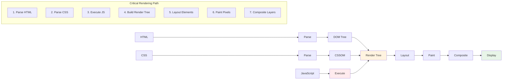

Upang buksan ang Developer Tools sa Edge, i-click ang tatlong tuldok sa kanang itaas, pagkatapos pumunta sa More Tools > Developer Tools. O gamitin ang keyboard shortcut: `Ctrl` + `Shift` + `I` sa Windows o `Option` + `Command` + `I` sa Mac. Kapag naroon ka na, i-click ang Performance tab - dito mo gagawin ang iyong imbestigasyon.

**Narito ang iyong toolkit para sa performance detective:**
- **Buksan** ang Developer Tools (palagi mo itong gagamitin bilang developer!)
- **Pumunta** sa Performance tab - isipin ito bilang fitness tracker ng iyong web app
- **I-click** ang Record button at panoorin ang iyong pahina sa aksyon
- **Pag-aralan** ang mga resulta upang matukoy kung ano ang nagpapabagal sa mga bagay

Subukan natin ito. Buksan ang isang website (Microsoft.com ay maganda para dito) at i-click ang 'Record' button. Ngayon i-refresh ang pahina at panoorin ang profiler na kinukuha ang lahat ng nangyayari. Kapag tumigil ka sa pag-record, makikita mo ang detalyadong breakdown kung paano 'scripts', 'renders', at 'paints' ng browser ang site. Parang kung paano mino-monitor ng mission control ang bawat sistema sa panahon ng paglulunsad ng rocket - makakakuha ka ng real-time na data sa eksaktong nangyayari at kailan.

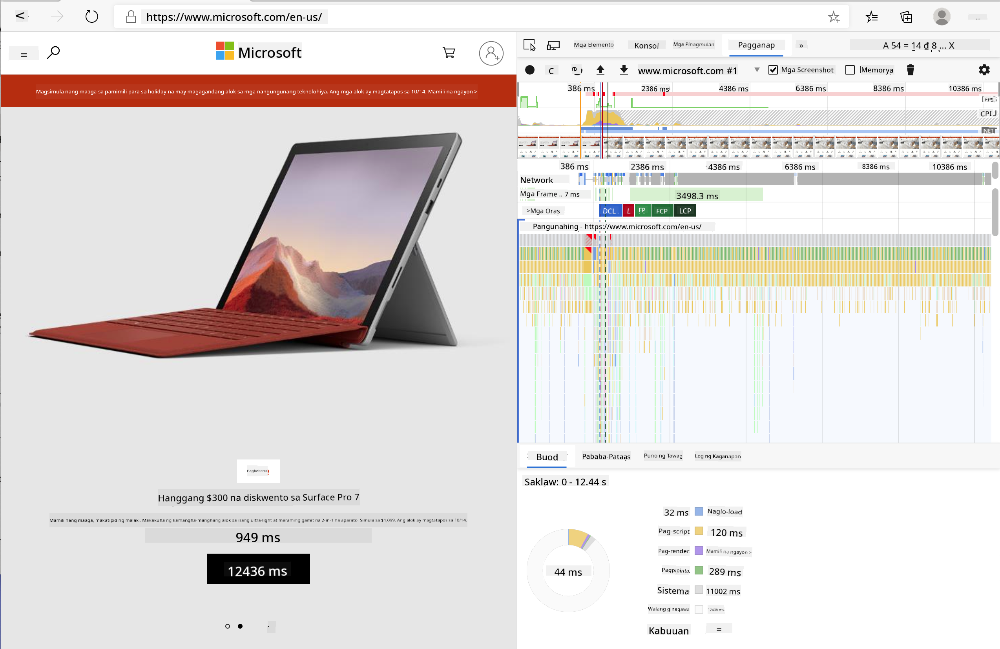

✅ Ang [Microsoft Documentation](https://docs.microsoft.com/microsoft-edge/devtools-guide/performance/?WT.mc_id=academic-77807-sagibbon) ay may maraming detalye kung nais mong mas malalim na pag-aralan.

> Pro tip: I-clear ang cache ng iyong browser bago mag-test upang makita kung paano gumagana ang iyong site para sa mga unang beses na bisita - kadalasang iba ito sa mga paulit-ulit na pagbisita!

Piliin ang mga elemento ng profile timeline upang mag-zoom in sa mga event na nangyayari habang naglo-load ang iyong pahina.

Kumuha ng snapshot ng performance ng iyong pahina sa pamamagitan ng pagpili ng bahagi ng profile timeline at pagtingin sa summary pane:

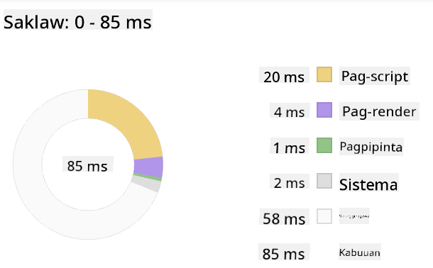

Suriin ang Event Log pane upang makita kung may anumang event na tumagal ng higit sa 15 ms:

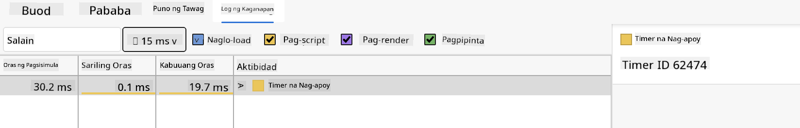

✅ Kilalanin ang iyong profiler! Buksan ang developer tools sa site na ito at tingnan kung may mga bottleneck. Ano ang pinakamabagal na naglo-load na asset? Ang pinakamabilis?

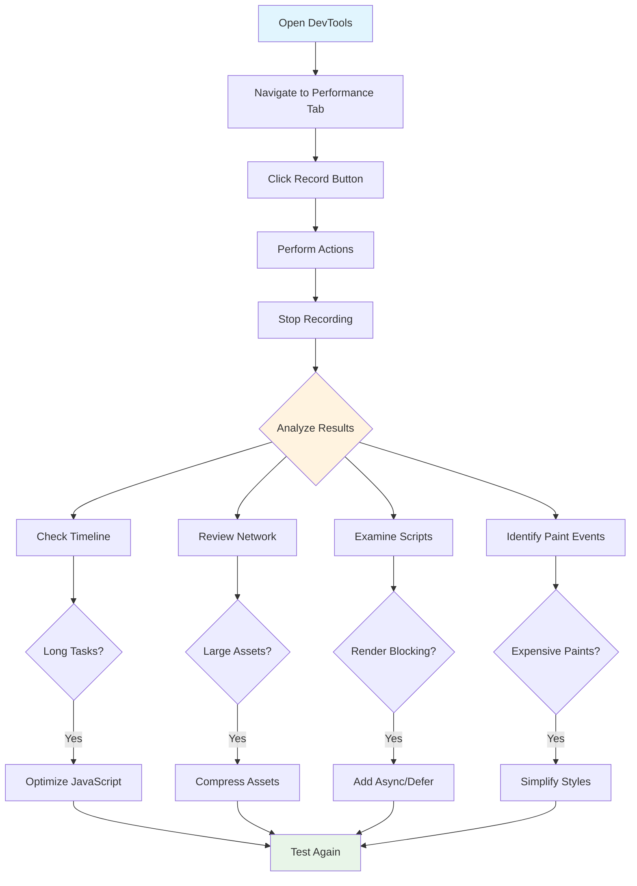

## Ano ang Dapat Hanapin Kapag Nagpo-profile

Ang pagtakbo ng profiler ay simula pa lamang - ang tunay na kasanayan ay ang pag-alam kung ano ang sinasabi ng mga makukulay na chart na iyon. Huwag mag-alala, makukuha mo ang kasanayan sa pagbabasa nito. Ang mga bihasang developer ay natututo kung paano makita ang mga babala bago ito maging ganap na problema.

Pag-usapan natin ang mga karaniwang salarin - ang mga problema sa performance na madalas sumingit sa mga web project. Parang kung paano kailangang maingat na i-monitor ni Marie Curie ang radiation levels sa kanyang lab, kailangan nating bantayan ang ilang pattern na nagpapahiwatig ng paparating na problema. Ang maagang pagtukoy sa mga ito ay makakatipid sa iyo (at sa iyong mga user) ng maraming frustration.

**Mga laki ng asset**: Ang mga website ay nagiging "mas mabigat" sa paglipas ng mga taon, at karamihan sa dagdag na timbang na ito ay mula sa mga imahe. Parang naglalagay tayo ng mas marami sa ating digital na maleta.

✅ Tingnan ang [Internet Archive](https://httparchive.org/reports/page-weight) upang makita kung paano lumaki ang mga laki ng pahina sa paglipas ng panahon - ito ay talagang nakakagulat.

**Narito kung paano panatilihing optimized ang iyong mga asset:**
- **I-compress** ang mga imahe! Ang mga modernong format tulad ng WebP ay maaaring magbawas ng laki ng file nang malaki
- **I-serve** ang tamang laki ng imahe para sa bawat device - walang pangangailangan na magpadala ng malalaking desktop images sa mga telepono
- **I-minify** ang iyong CSS at JavaScript - bawat byte ay mahalaga
- **Gamitin** ang lazy loading upang ang mga imahe ay mag-download lamang kapag talagang na-scroll ng mga user

**DOM traversals**: Kailangang buuin ng browser ang Document Object Model base sa code na isinulat mo, kaya't mahalaga para sa magandang performance ng pahina na panatilihing minimal ang iyong mga tag, gamit lamang ang kailangan ng pahina.

**Mga pangunahing estratehiya para sa DOM optimization:**
- **Minimizes** ang bilang ng mga HTML elements at nesting levels
- **Removes** ang mga hindi nagagamit na CSS rules at pinagsasama-sama ang mga stylesheet nang mahusay
- **Organizes** ang CSS upang mag-load lamang ng kailangan para sa bawat pahina
- **Structures** ang HTML nang semantiko para sa mas mahusay na parsing ng browser

**JavaScript**: Ang bawat JavaScript developer ay dapat magbantay para sa 'render-blocking' scripts na kailangang ma-load bago ma-traverse at ma-paint ang natitirang DOM sa browser. Isaalang-alang ang paggamit ng `defer` sa iyong inline scripts (tulad ng ginawa sa Terrarium module).

**Mga modernong teknik sa pag-optimize ng JavaScript:**
- **Uses** ang `defer` attribute upang ma-load ang mga script pagkatapos ng DOM parsing
- **Implements** ang code splitting upang ma-load lamang ang kinakailangang JavaScript
- **Applies** ang lazy loading para sa mga non-critical functionality
- **Minimizes** ang paggamit ng mabibigat na libraries at frameworks kung maaari

✅ Subukan ang ilang mga site sa isang [Site Speed Test website](https://www.webpagetest.org/) upang matuto pa tungkol sa mga karaniwang pagsusuri na ginagawa upang matukoy ang performance ng site.

### 🔄 **Pedagogical Check-in**
**Pag-unawa sa Performance**: Bago magtayo ng mga feature ng extension, tiyakin na kaya mong:
- ✅ Ipaliwanag ang critical rendering path mula HTML hanggang pixels
- ✅ Tukuyin ang mga karaniwang bottleneck sa performance ng web applications
- ✅ Gamitin ang browser developer tools upang i-profile ang performance ng pahina
- ✅ Maunawaan kung paano nakakaapekto ang laki ng asset at komplikasyon ng DOM sa bilis

**Mabilis na Self-Test**: Ano ang nangyayari kapag mayroon kang render-blocking JavaScript?
*Sagot: Kailangang i-download at i-execute ng browser ang script bago ito magpatuloy sa pag-parse ng HTML at pag-render ng pahina*

**Epekto ng Performance sa Tunay na Mundo**:
- **100ms delay**: Napapansin ng mga user ang pagbagal
- **1 segundo delay**: Nagsisimulang mawalan ng focus ang mga user
- **3+ segundo**: 40% ng mga user ay iniiwan ang pahina
- **Mobile networks**: Mas mahalaga ang performance

Ngayon na mayroon kang ideya kung paano nire-render ng browser ang mga asset na ipinapadala mo rito, tingnan natin ang huling mga bagay na kailangan mong gawin upang makumpleto ang iyong extension:

### Gumawa ng function upang kalkulahin ang kulay

Ngayon gagawa tayo ng function na magpapalit ng numerical data sa makabuluhang mga kulay. Isipin ito na parang sistema ng traffic light - berde para sa malinis na enerhiya, pula para sa mataas na carbon intensity.

Ang function na ito ay kukuha ng CO2 data mula sa ating API at tutukuyin kung anong kulay ang pinakamahusay na kumakatawan sa epekto sa kapaligiran. Katulad ito ng kung paano ginagamit ng mga siyentipiko ang color-coding sa heat maps upang maipakita ang mga kumplikadong pattern ng data - mula sa temperatura ng karagatan hanggang sa pagbuo ng bituin. Idagdag natin ito sa `/src/index.js`, pagkatapos ng mga `const` variables na na-set up natin kanina:

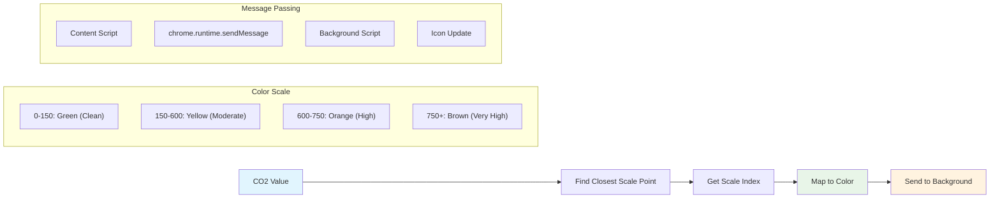

```javascript
function calculateColor(value) {
	// Define CO2 intensity scale (grams per kWh)
	const co2Scale = [0, 150, 600, 750, 800];
	// Corresponding colors from green (clean) to dark brown (high carbon)
	const colors = ['#2AA364', '#F5EB4D', '#9E4229', '#381D02', '#381D02'];

	// Find the closest scale value to our input
	const closestNum = co2Scale.sort((a, b) => {
		return Math.abs(a - value) - Math.abs(b - value);
	})[0];
	
	console.log(`${value} is closest to ${closestNum}`);
	
	// Find the index for color mapping
	const num = (element) => element > closestNum;
	const scaleIndex = co2Scale.findIndex(num);

	const closestColor = colors[scaleIndex];
	console.log(scaleIndex, closestColor);

	// Send color update message to background script
	chrome.runtime.sendMessage({ action: 'updateIcon', value: { color: closestColor } });
}
```

**I-breakdown natin ang matalinong maliit na function na ito:**
- **Nagse-set up** ng dalawang arrays - isa para sa CO2 levels, isa pa para sa mga kulay (berde = malinis, kayumanggi = marumi!)
- **Hinahanap** ang pinakamalapit na tugma sa ating aktwal na CO2 value gamit ang ilang magaling na array sorting
- **Kinukuha** ang matching color gamit ang findIndex() method
- **Nagpapadala** ng mensahe sa background script ng Chrome gamit ang napiling kulay
- **Gumagamit** ng template literals (ang mga backticks) para sa mas malinis na string formatting
- **Pinapanatili** ang lahat ng maayos gamit ang const declarations

Ang `chrome.runtime` [API](https://developer.chrome.com/extensions/runtime) ay parang nervous system ng iyong extension - ito ang humahawak sa lahat ng komunikasyon at gawain sa likod ng eksena:

> "Gamitin ang chrome.runtime API upang makuha ang background page, magbalik ng mga detalye tungkol sa manifest, at makinig at tumugon sa mga event sa lifecycle ng app o extension. Maaari mo ring gamitin ang API na ito upang i-convert ang relative path ng mga URL sa fully-qualified URLs."

**Bakit kapaki-pakinabang ang Chrome Runtime API:**
- **Pinapayagan** ang iba't ibang bahagi ng iyong extension na makipag-usap sa isa't isa
- **Humahawak** ng mga background na gawain nang hindi nagha-hang ang user interface
- **Nagma-manage** ng mga lifecycle events ng iyong extension
- **Ginagawang** madali ang pagpapasa ng mensahe sa pagitan ng mga script

✅ Kung ikaw ay nagde-develop ng browser extension na ito para sa Edge, maaaring magulat ka na ginagamit mo ang chrome API. Ang mga mas bagong bersyon ng Edge browser ay tumatakbo sa Chromium browser engine, kaya maaari mong gamitin ang mga tool na ito.

```mermaid
architecture-beta
    group browser(logos:chrome)[Browser]
    
    service popup(logos:html5)[Popup UI] in browser
    service content(logos:javascript)[Content Script] in browser
    service background(database)[Background Script] in browser
    service api(logos:api)[External API] in browser
    
    popup:R -- L:content
    content:R -- L:background
    background:T -- B:api
    content:T -- B:api
    
    junction junctionCenter in browser
    popup:R -- L:junctionCenter
    junctionCenter:R -- L:background
```

> **Pro Tip**: Kung nais mong i-profile ang isang browser extension, buksan ang dev tools mula sa loob ng extension mismo, dahil ito ay isang hiwalay na browser instance. Bibigyan ka nito ng access sa mga extension-specific performance metrics.

### Mag-set ng default na kulay ng icon

Bago tayo magsimulang kumuha ng totoong data, bigyan natin ang ating extension ng panimulang punto. Walang may gusto ng blangkong icon o mukhang sira. Magsisimula tayo sa kulay berde upang malaman ng mga user na gumagana ang extension mula sa sandaling ito ay kanilang mai-install.

Sa iyong `init()` function, mag-set tayo ng default na berde na icon:

```javascript
chrome.runtime.sendMessage({
	action: 'updateIcon',
	value: {
		color: 'green',
	},
});
```

**Ano ang nagagawa ng initialization na ito:**
- **Nagse-set** ng neutral na berde na kulay bilang default na estado
- **Nagbibigay** ng agarang visual na feedback kapag nag-load ang extension
- **Nagtatatag** ng pattern ng komunikasyon sa background script
- **Tinitiyak** na makikita ng mga user ang functional na extension bago mag-load ang data

### Tawagin ang function, i-execute ang tawag

Ngayon, ikonekta natin ang lahat upang kapag dumating ang sariwang CO2 data, ang iyong icon ay awtomatikong mag-update gamit ang tamang kulay. Parang pag-konekta sa huling circuit sa isang electronic device - biglang gumagana ang lahat ng indibidwal na bahagi bilang isang sistema.

Idagdag ang linyang ito pagkatapos mong makuha ang CO2 data mula sa API:

```javascript
// After retrieving CO2 data from the API
// let CO2 = data.data[0].intensity.actual;
calculateColor(CO2);
```

**Ang integration na ito ay nagagawa:**
- **Kinokonekta** ang daloy ng API data sa sistema ng visual indicator
- **Nagti-trigger** ng mga pag-update ng icon nang awtomatiko kapag dumating ang bagong data
- **Tinitiyak** ang real-time na visual feedback base sa kasalukuyang carbon intensity
- **Pinapanatili** ang paghihiwalay ng mga alalahanin sa pagitan ng pagkuha ng data at display logic

At sa wakas, sa `/dist/background.js`, idagdag ang listener para sa mga tawag sa background action:

```javascript
// Listen for messages from the content script
chrome.runtime.onMessage.addListener(function (msg, sender, sendResponse) {
	if (msg.action === 'updateIcon') {
		chrome.action.setIcon({ imageData: drawIcon(msg.value) });
	}
});

// Draw dynamic icon using Canvas API
// Borrowed from energy lollipop extension - nice feature!
function drawIcon(value) {
	// Create an offscreen canvas for better performance
	const canvas = new OffscreenCanvas(200, 200);
	const context = canvas.getContext('2d');

	// Draw a colored circle representing carbon intensity
	context.beginPath();
	context.fillStyle = value.color;
	context.arc(100, 100, 50, 0, 2 * Math.PI);
	context.fill();

	// Return the image data for the browser icon
	return context.getImageData(50, 50, 100, 100);
}
```

**Narito ang ginagawa ng background script na ito:**
- **Nakikinig** sa mga mensahe mula sa iyong main script (parang receptionist na tumatanggap ng tawag)
- **Pinoproseso** ang mga 'updateIcon' requests upang baguhin ang toolbar icon
- **Lumilikha** ng mga bagong icon gamit ang Canvas API
- **Nagdo-drawing** ng simpleng colored circle na nagpapakita ng kasalukuyang carbon intensity
- **Ina-update** ang toolbar ng browser gamit ang sariwang icon
- **Gumagamit** ng OffscreenCanvas para sa maayos na performance (walang UI blocking)

✅ Matututo ka pa tungkol sa Canvas API sa [Space Game lessons](../../6-space-game/2-drawing-to-canvas/README.md).

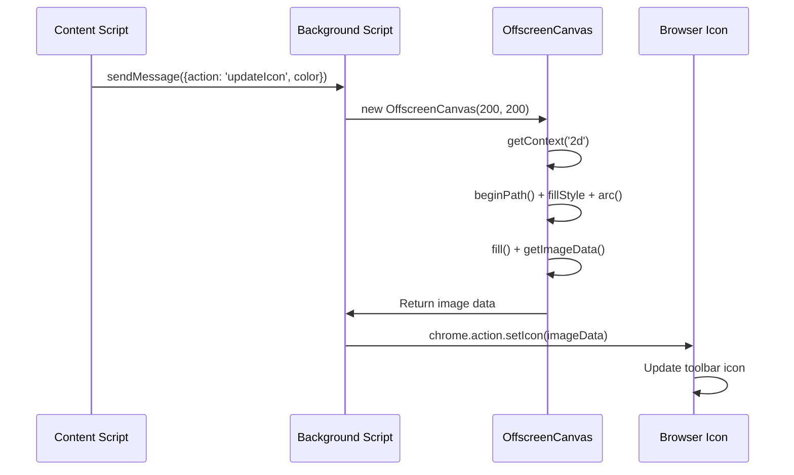

### 🔄 **Pedagogical Check-in**
**Pag-unawa sa Kumpletong Extension**: Siguraduhin ang mastery mo sa buong sistema:
- ✅ Paano gumagana ang message passing sa pagitan ng iba't ibang extension scripts?
- ✅ Bakit natin ginagamit ang OffscreenCanvas sa halip na regular na Canvas para sa performance?
- ✅ Anong papel ang ginagampanan ng Chrome Runtime API sa arkitektura ng extension?
- ✅ Paano nagmamapa ang algorithm ng pagkalkula ng kulay ng data sa visual na feedback?

**Mga Pagsasaalang-alang sa Pagganap**: Ang iyong extension ngayon ay nagpapakita ng:
- **Epektibong messaging**: Malinis na komunikasyon sa pagitan ng mga script contexts
- **Optimized na rendering**: Ang OffscreenCanvas ay pumipigil sa pag-block ng UI
- **Real-time na updates**: Dinamikong pagbabago ng icon base sa live na data
- **Pamamahala ng memorya**: Tamang paglilinis at paghawak ng mga resources

**Oras na para subukan ang iyong extension:**
- **I-build** ang lahat gamit ang `npm run build`
- **I-reload** ang iyong extension sa browser (huwag kalimutan ang hakbang na ito)
- **Buksan** ang iyong extension at panoorin ang pagbabago ng kulay ng icon
- **Suriin** kung paano ito tumutugon sa totoong carbon data mula sa iba't ibang bahagi ng mundo

Ngayon, malalaman mo agad kung magandang oras na para maglaba o kung mas mabuting maghintay para sa mas malinis na enerhiya. Nakagawa ka ng isang bagay na tunay na kapaki-pakinabang at natutunan ang tungkol sa pagganap ng browser sa proseso.

## Hamon ng GitHub Copilot Agent 🚀

Gamitin ang Agent mode para tapusin ang sumusunod na hamon:

**Deskripsyon:** Pagandahin ang kakayahan ng browser extension sa pagsubaybay sa pagganap sa pamamagitan ng pagdaragdag ng feature na sumusubaybay at nagpapakita ng load times para sa iba't ibang bahagi ng extension.

**Prompt:** Gumawa ng sistema ng pagsubaybay sa pagganap para sa browser extension na sumusukat at naglo-log ng oras na kinakailangan upang kunin ang CO2 data mula sa API, kalkulahin ang mga kulay, at i-update ang icon. Magdagdag ng function na tinatawag na `performanceTracker` na gumagamit ng Performance API upang sukatin ang mga operasyong ito at ipakita ang mga resulta sa browser console na may timestamps at duration metrics.

Alamin pa ang tungkol sa [agent mode](https://code.visualstudio.com/blogs/2025/02/24/introducing-copilot-agent-mode) dito.

## 🚀 Hamon

Narito ang isang kawili-wiling misyon ng detektibo: pumili ng ilang open source na mga website na matagal nang umiiral (halimbawa Wikipedia, GitHub, o Stack Overflow) at suriin ang kanilang commit history. Kaya mo bang matukoy kung saan sila gumawa ng mga pagpapabuti sa pagganap? Anong mga problema ang paulit-ulit na lumilitaw?

**Ang iyong paraan ng pagsisiyasat:**
- **Maghanap** ng mga commit messages na may mga salitang tulad ng "optimize," "performance," o "faster"
- **Tingnan** ang mga pattern - patuloy ba nilang inaayos ang parehong uri ng mga isyu?
- **Kilalanin** ang mga karaniwang sanhi ng pagbagal ng mga website
- **Ibahagi** ang iyong natuklasan - matututo ang ibang mga developer mula sa mga totoong halimbawa

## Post-Lecture Quiz

[Post-lecture quiz](https://ff-quizzes.netlify.app/web/quiz/28)

## Review & Self Study

Isaalang-alang ang pag-sign up para sa isang [performance newsletter](https://perf.email/)

Suriin ang ilan sa mga paraan kung paano sinusukat ng mga browser ang web performance sa pamamagitan ng pagtingin sa performance tabs sa kanilang web tools. May nakita ka bang malalaking pagkakaiba?

### ⚡ **Ano ang Magagawa Mo sa Loob ng Susunod na 5 Minuto**
- [ ] Buksan ang browser Task Manager (Shift+Esc sa Chrome) upang makita ang paggamit ng resource ng extension
- [ ] Gamitin ang DevTools Performance tab upang mag-record at suriin ang performance ng webpage
- [ ] Tingnan ang Extensions page ng browser upang makita kung aling mga extension ang nakakaapekto sa startup time
- [ ] Subukang i-disable ang mga extension pansamantala upang makita ang mga pagkakaiba sa performance

### 🎯 **Ano ang Maaaring Makamit sa Loob ng Isang Oras**
- [ ] Tapusin ang post-lesson quiz at unawain ang mga konsepto ng pagganap
- [ ] Mag-implement ng background script para sa iyong browser extension
- [ ] Matutunan ang paggamit ng browser.alarms para sa epektibong background tasks
- [ ] Magpraktis ng message passing sa pagitan ng content scripts at background scripts
- [ ] Sukatin at i-optimize ang paggamit ng resource ng iyong extension

### 📅 **Ang Iyong Lingguhang Paglalakbay sa Pagganap**
- [ ] Kumpletuhin ang isang high-performance browser extension na may background functionality
- [ ] Masterin ang service workers at modern extension architecture
- [ ] Mag-implement ng epektibong data synchronization at caching strategies
- [ ] Matutunan ang advanced debugging techniques para sa pagganap ng extension
- [ ] I-optimize ang iyong extension para sa parehong functionality at resource efficiency
- [ ] Gumawa ng komprehensibong tests para sa mga senaryo ng pagganap ng extension

### 🌟 **Ang Iyong Buwanang Mastery sa Optimization**
- [ ] Gumawa ng enterprise-grade browser extensions na may optimal performance
- [ ] Matutunan ang tungkol sa Web Workers, Service Workers, at modern web performance
- [ ] Mag-ambag sa mga open source projects na nakatuon sa performance optimization
- [ ] Masterin ang browser internals at advanced debugging techniques
- [ ] Gumawa ng mga performance monitoring tools at best practices guides
- [ ] Maging isang performance expert na tumutulong sa pag-optimize ng web applications

## 🎯 Ang Iyong Browser Extension Mastery Timeline

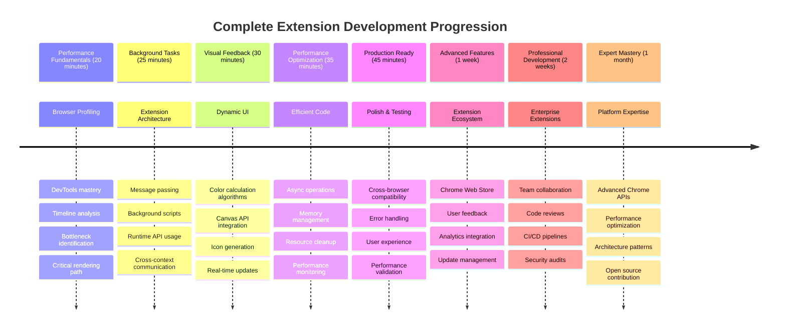

### 🛠️ Ang Iyong Kumpletong Toolkit sa Pag-develop ng Extension

Matapos tapusin ang trilogy na ito, na-master mo na ang:
- **Arkitektura ng Browser**: Malalim na pag-unawa kung paano nag-iintegrate ang mga extension sa mga sistema ng browser
- **Profiling ng Pagganap**: Kakayahang tukuyin at ayusin ang mga bottlenecks gamit ang developer tools
- **Async Programming**: Modernong JavaScript patterns para sa responsive, non-blocking operations
- **API Integration**: Pagkuha ng external data na may authentication at error handling
- **Disenyo ng Visual**: Dinamikong UI updates at Canvas-based graphics generation
- **Message Passing**: Komunikasyon sa pagitan ng mga script sa arkitektura ng extension
- **User Experience**: Loading states, error handling, at intuitive interactions
- **Production Skills**: Testing, debugging, at optimization para sa real-world deployment

**Mga Aplikasyon sa Totoong Buhay**: Ang iyong mga kasanayan sa pag-develop ng extension ay direktang naaangkop sa:
- **Progressive Web Apps**: Katulad na arkitektura at mga pattern ng pagganap
- **Electron Desktop Apps**: Cross-platform applications gamit ang web technologies
- **Mobile Hybrid Apps**: Cordova/PhoneGap development gamit ang web APIs
- **Enterprise Web Applications**: Mga kumplikadong dashboard at productivity tools
- **Chrome DevTools Extensions**: Advanced developer tooling at debugging
- **Web API Integration**: Anumang application na nakikipag-ugnayan sa external services

**Propesyonal na Epekto**: Ngayon ay kaya mo nang:
- **Gumawa** ng production-ready browser extensions mula sa konsepto hanggang deployment
- **I-optimize** ang pagganap ng web application gamit ang industry-standard profiling tools
- **Mag-arkitekto** ng scalable systems na may tamang separation of concerns
- **Mag-debug** ng mga kumplikadong async operations at cross-context communication
- **Mag-ambag** sa mga open source extension projects at browser standards

**Mga Susunod na Oportunidad**:
- **Chrome Web Store Developer**: Mag-publish ng mga extension para sa milyun-milyong user
- **Web Performance Engineer**: Mag-specialize sa optimization at user experience
- **Browser Platform Developer**: Mag-ambag sa pag-develop ng browser engine
- **Extension Framework Creator**: Gumawa ng mga tools na tumutulong sa ibang developer
- **Developer Relations**: Magbahagi ng kaalaman sa pamamagitan ng pagtuturo at paggawa ng content

🌟 **Achievement Unlocked**: Nakagawa ka ng isang kumpleto, functional na browser extension na nagpapakita ng mga propesyonal na kasanayan sa pag-develop at modernong web standards!

## Assignment

[Analyze a site for performance](assignment.md)

---

**Paunawa**:  
Ang dokumentong ito ay isinalin gamit ang AI translation service [Co-op Translator](https://github.com/Azure/co-op-translator). Bagamat sinisikap naming maging tumpak, mangyaring tandaan na ang mga awtomatikong pagsasalin ay maaaring maglaman ng mga pagkakamali o hindi eksaktong impormasyon. Ang orihinal na dokumento sa kanyang katutubong wika ang dapat ituring na opisyal na pinagmulan. Para sa mahalagang impormasyon, inirerekomenda ang propesyonal na pagsasalin ng tao. Hindi kami mananagot sa anumang hindi pagkakaunawaan o maling interpretasyon na dulot ng paggamit ng pagsasaling ito.