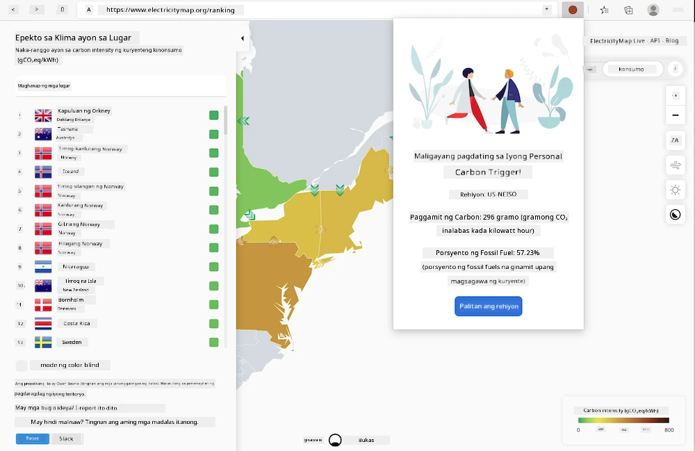

<!--
CO_OP_TRANSLATOR_METADATA:
{
  "original_hash": "9361268ca430b2579375009e1eceb5e5",
  "translation_date": "2025-08-27T22:27:39+00:00",
  "source_file": "5-browser-extension/solution/translation/README.fr.md",
  "language_code": "tl"
}
-->
# Extension ng Browser Carbon Trigger: Kumpletong Kodigo

Gamit ang API ng CO2 Signal mula sa tmrow para subaybayan ang konsumo ng kuryente, gumawa ng browser extension upang magkaroon ka ng paalala direkta sa iyong browser tungkol sa konsumo ng kuryente sa iyong lugar. Ang paggamit ng extension na ito ay makakatulong sa iyo na magpasya sa iyong mga aktibidad base sa impormasyong ito.



## Pagsisimula

Kailangan mong magkaroon ng [npm](https://npmjs.com) na naka-install. I-download ang kopya ng kodigong ito sa isang folder sa iyong computer.

I-install ang lahat ng kinakailangang package:

```
npm install
```

I-build ang extension gamit ang webpack:

```
npm run build
```

Para i-install sa Edge, gamitin ang menu na 'tatlong tuldok' sa kanang itaas na bahagi ng browser upang hanapin ang panel ng Extensions. Mula doon, piliin ang 'Load unpacked extension' upang mag-load ng bagong extension. Buksan ang folder na 'dist' kapag na-prompt, at ang extension ay maglo-load. Para magamit ito, kakailanganin mo ng API key para sa CO2 Signal API ([kumuha ng isa dito sa pamamagitan ng email](https://www.co2signal.com/) - ilagay ang iyong email sa kahon sa pahinang ito) at ang [code para sa iyong rehiyon](http://api.electricitymap.org/v3/zones) na tumutugma sa [Electricity Map](https://www.electricitymap.org/map) (halimbawa, sa Boston, ginagamit ko ang 'US-NEISO').


Kapag nailagay na ang API key at rehiyon sa interface ng extension, ang kulay ng tuldok sa extension bar ng browser ay dapat magbago upang ipakita ang konsumo ng enerhiya sa iyong lugar at magbigay ng indikasyon kung anong mga aktibidad na mataas sa enerhiya ang angkop gawin. Ang konsepto sa likod ng sistemang ito ng 'mga tuldok' ay inspirasyon ng [extension na Energy Lollipop](https://energylollipop.com/) para sa mga emisyon sa California.

---

**Paunawa**:  
Ang dokumentong ito ay isinalin gamit ang AI translation service na [Co-op Translator](https://github.com/Azure/co-op-translator). Bagama't sinisikap naming maging tumpak, tandaan na ang mga awtomatikong pagsasalin ay maaaring maglaman ng mga pagkakamali o hindi pagkakatugma. Ang orihinal na dokumento sa kanyang katutubong wika ang dapat ituring na opisyal na sanggunian. Para sa mahalagang impormasyon, inirerekomenda ang propesyonal na pagsasalin ng tao. Hindi kami mananagot sa anumang hindi pagkakaunawaan o maling interpretasyon na maaaring magmula sa paggamit ng pagsasaling ito.