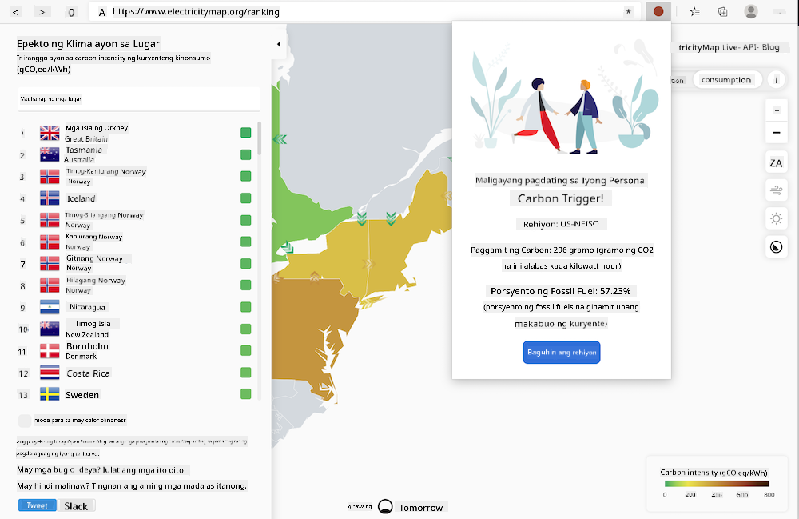
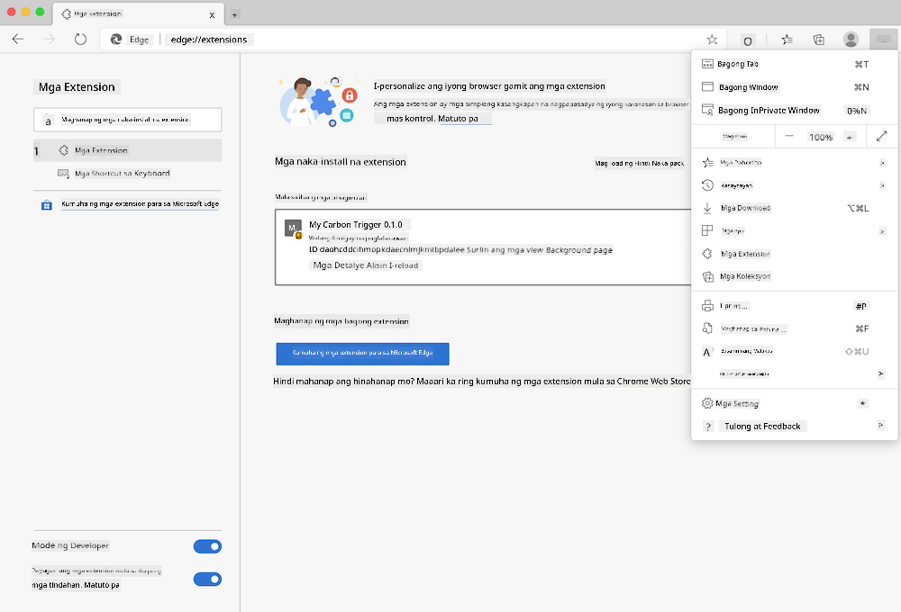

<!--
CO_OP_TRANSLATOR_METADATA:
{
  "original_hash": "21b364c158c8e4f698de65eeac16c9fe",
  "translation_date": "2025-08-27T22:27:05+00:00",
  "source_file": "5-browser-extension/solution/translation/README.ms.md",
  "language_code": "tl"
}
-->
# Carbon Trigger Browser Extension: Kumpletong Kodigo

Gamit ang API ng CO2 Signal mula sa tmrow para subaybayan ang paggamit ng kuryente, gumawa ng isang browser extension na magbibigay ng abiso sa iyong browser tungkol sa bigat ng paggamit ng kuryente sa iyong lugar. Ang paggamit ng extension na ito ay makakatulong sa iyo na magdesisyon tungkol sa iyong mga aktibidad base sa impormasyong ito.



## Paano Magsimula

Kailangan mong mag-install ng [npm](https://npmjs.com). I-download ang kopya ng kodigong ito sa isang folder sa iyong computer.

I-install ang lahat ng kinakailangang package:

```
npm install
```

I-build ang extension gamit ang webpack:

```
npm run build
```

Para i-install sa Edge, gamitin ang menu na 'tatlong tuldok' sa kanang itaas na bahagi ng browser para hanapin ang panel ng Extensions. Mula roon, piliin ang 'Load Unpacked' para mag-load ng bagong extension. Buksan ang folder na 'dist' kapag hiniling, at ang extension ay mai-load. Para magamit ito, kakailanganin mo ng API key para sa CO2 Signal API ([kumuha ng isa dito sa pamamagitan ng email](https://www.co2signal.com/) - ilagay ang iyong email sa kahon sa pahinang ito) at [code para sa iyong rehiyon](http://api.electricitymap.org/v3/zones) na tumutugma sa [Electricity Map](https://www.electricitymap.org/map) (halimbawa, sa Boston, ginamit ko ang 'US-NEISO').



Kapag nailagay na ang API key at rehiyon sa interface ng extension, ang kulay ng tuldok sa extension bar ng browser ay magbabago upang ipakita ang paggamit ng enerhiya sa iyong lugar at magbibigay ng mga rekomendasyon tungkol sa mga aktibidad na angkop gawin. Ang konsepto sa likod ng sistemang 'dot' na ito ay nakuha ko mula sa [Energy Lollipop browser extension](https://energylollipop.com/) para sa emissions sa California.

---

**Paunawa**:  
Ang dokumentong ito ay isinalin gamit ang AI translation service na [Co-op Translator](https://github.com/Azure/co-op-translator). Bagama't sinisikap naming maging tumpak, tandaan na ang mga awtomatikong pagsasalin ay maaaring maglaman ng mga pagkakamali o hindi pagkakatugma. Ang orihinal na dokumento sa kanyang katutubong wika ang dapat ituring na opisyal na sanggunian. Para sa mahalagang impormasyon, inirerekomenda ang propesyonal na pagsasalin ng tao. Hindi kami mananagot sa anumang hindi pagkakaunawaan o maling interpretasyon na dulot ng paggamit ng pagsasaling ito.