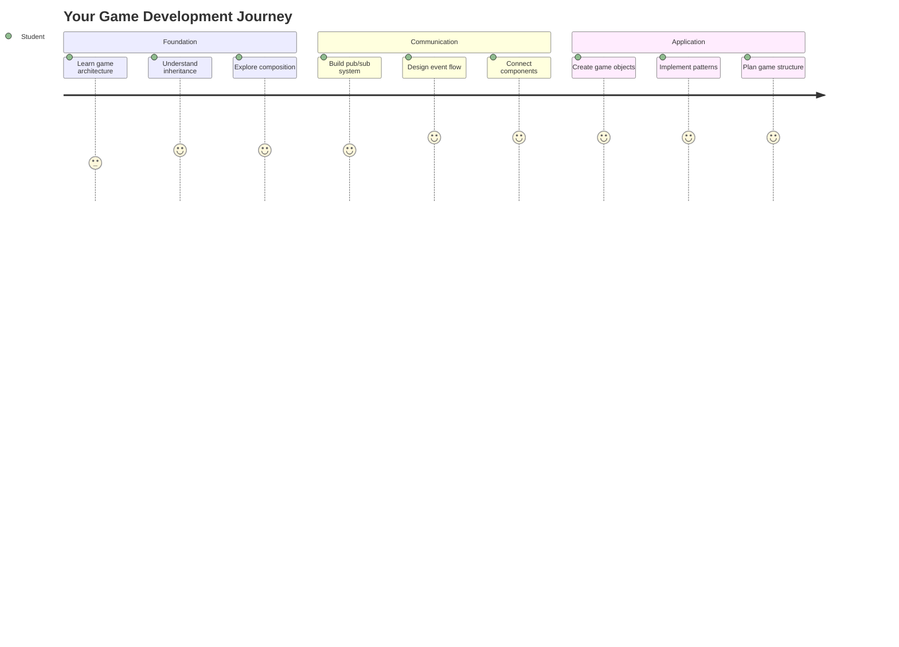
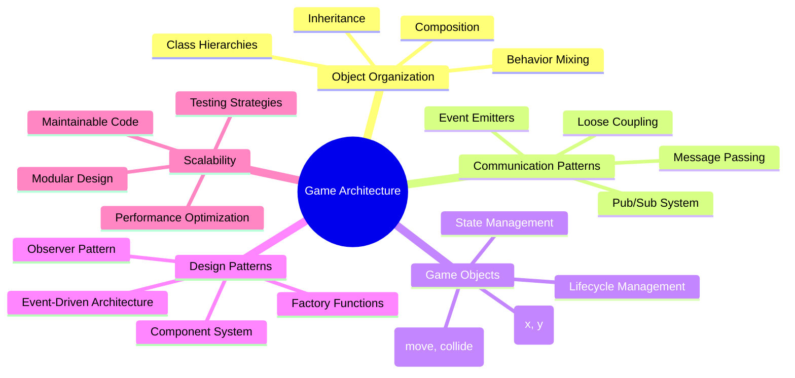
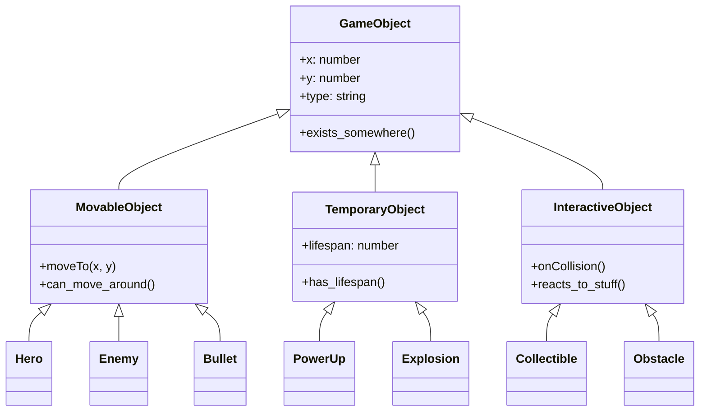
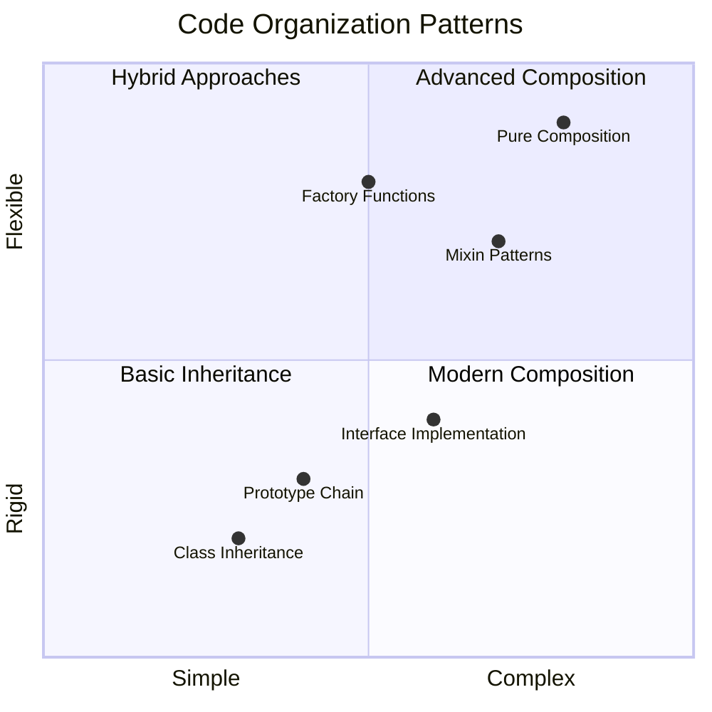
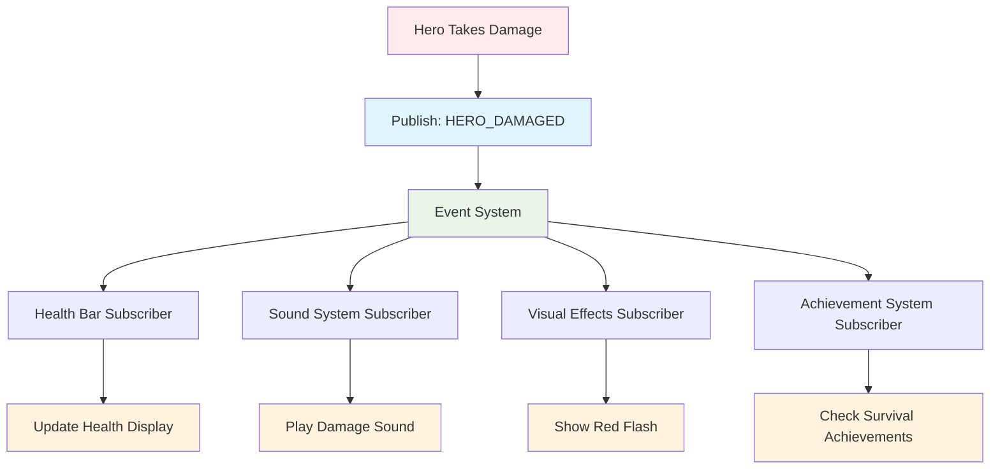
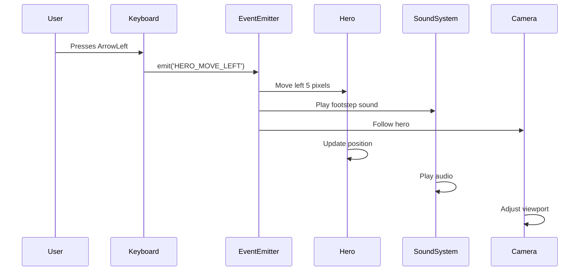
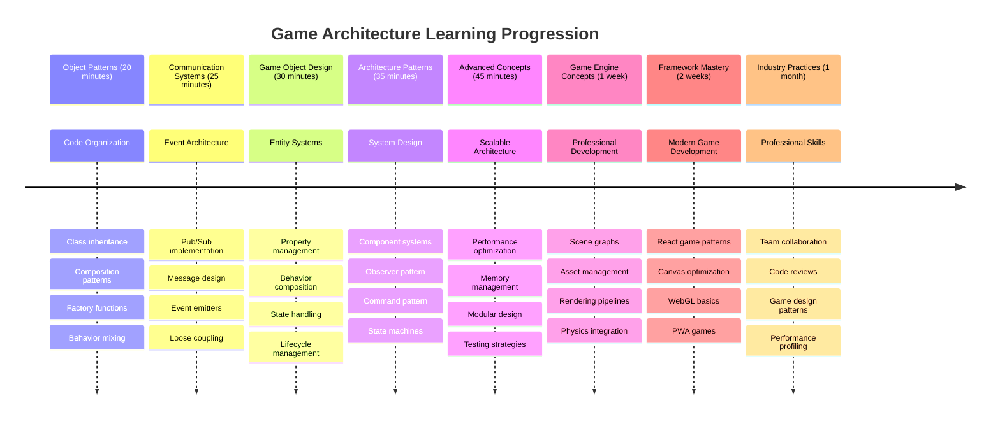

<!--
CO_OP_TRANSLATOR_METADATA:
{
  "original_hash": "a6332a7bb4d0be3bfd24199c83993777",
  "translation_date": "2025-11-03T14:06:41+00:00",
  "source_file": "6-space-game/1-introduction/README.md",
  "language_code": "tl"
}
-->
# Gumawa ng Space Game Bahagi 1: Panimula




Katulad ng misyon ng NASA na nagkokoordina ng iba't ibang sistema sa isang space launch, gagawa tayo ng space game na nagpapakita kung paano maaaring magtulungan ang iba't ibang bahagi ng isang programa nang maayos. Habang gumagawa ng isang bagay na maaari mong laruin, matututo ka ng mahahalagang konsepto sa programming na magagamit sa anumang proyekto ng software.

Tatalakayin natin ang dalawang pangunahing paraan ng pag-aayos ng code: inheritance at composition. Hindi lang ito mga akademikong konsepto – ito ang mga pattern na ginagamit sa lahat mula sa video games hanggang sa mga sistema ng bangko. Magpapatupad din tayo ng isang sistema ng komunikasyon na tinatawag na pub/sub na gumagana tulad ng mga network ng komunikasyon na ginagamit sa spacecraft, na nagpapahintulot sa iba't ibang bahagi na magbahagi ng impormasyon nang hindi nagkakaroon ng direktang dependencies.

Sa pagtatapos ng seryeng ito, maiintindihan mo kung paano gumawa ng mga application na maaaring mag-scale at mag-evolve – maging ito ay mga laro, web applications, o anumang sistema ng software.



## Pre-Lecture Quiz

[Pre-lecture quiz](https://ff-quizzes.netlify.app/web/quiz/29)

## Inheritance at Composition sa Pagbuo ng Laro

Habang lumalaki ang mga proyekto sa pagiging kumplikado, nagiging mahalaga ang tamang pag-aayos ng code. Ang isang simpleng script ay maaaring maging mahirap panatilihin nang walang tamang istruktura – katulad ng kung paano ang Apollo missions ay nangangailangan ng maingat na koordinasyon sa libu-libong bahagi.

Tatalakayin natin ang dalawang pangunahing paraan ng pag-aayos ng code: inheritance at composition. Ang bawat isa ay may natatanging benepisyo, at ang pag-unawa sa pareho ay makakatulong sa iyo na pumili ng tamang paraan para sa iba't ibang sitwasyon. Ipapakita namin ang mga konseptong ito sa pamamagitan ng aming space game, kung saan ang mga bayani, kalaban, power-ups, at iba pang mga bagay ay kailangang mag-interact nang mahusay.

✅ Isa sa mga pinakasikat na aklat sa programming na naisulat ay tungkol sa [design patterns](https://en.wikipedia.org/wiki/Design_Patterns).

Sa anumang laro, mayroon kang `game objects` – ang mga interactive na elemento na bumubuo sa mundo ng iyong laro. Ang mga bayani, kalaban, power-ups, at mga visual effects ay lahat ng game objects. Ang bawat isa ay may partikular na lokasyon sa screen gamit ang mga `x` at `y` na halaga, katulad ng pag-plot ng mga punto sa isang coordinate plane.

Sa kabila ng kanilang visual na pagkakaiba, madalas na may mga karaniwang ugali ang mga bagay na ito:

- **May lokasyon sila** – Ang bawat bagay ay may x at y coordinates para malaman ng laro kung saan ito iguguhit
- **Marami ang maaaring gumalaw** – Tumakbo ang mga bayani, habulin ng mga kalaban, lumipad ang mga bala sa screen
- **May lifespan sila** – Ang iba ay nananatili magpakailanman, ang iba (tulad ng mga pagsabog) ay lumilitaw sandali at nawawala
- **Reaktibo sila** – Kapag nagbanggaan, nakokolekta ang mga power-ups, nag-a-update ang mga health bar

✅ Isipin ang isang laro tulad ng Pac-Man. Maaari mo bang tukuyin ang apat na uri ng object na nakalista sa itaas sa larong ito?



### Pagpapahayag ng Ugali sa Pamamagitan ng Code

Ngayon na nauunawaan mo ang mga karaniwang ugali na ibinabahagi ng mga game objects, tuklasin natin kung paano ipatupad ang mga ugaling ito sa JavaScript. Maaari mong ipahayag ang ugali ng object sa pamamagitan ng mga methods na nakakabit sa mga klase o indibidwal na mga object, at may ilang mga paraan na maaari mong piliin.

**Ang Paraan ng Class-Based**

Ang mga klase at inheritance ay nagbibigay ng istrukturadong paraan ng pag-aayos ng mga game objects. Katulad ng taxonomic classification system na binuo ni Carl Linnaeus, magsisimula ka sa isang base class na naglalaman ng mga karaniwang properties, pagkatapos ay gagawa ng mga specialized na klase na nagmamana ng mga pundasyon habang nagdadagdag ng mga partikular na kakayahan.

✅ Ang inheritance ay isang mahalagang konsepto na dapat maunawaan. Matuto pa sa [artikulo ng MDN tungkol sa inheritance](https://developer.mozilla.org/docs/Web/JavaScript/Inheritance_and_the_prototype_chain).

Narito kung paano mo maipapatupad ang mga game objects gamit ang mga klase at inheritance:

```javascript
// Step 1: Create the base GameObject class
class GameObject {
  constructor(x, y, type) {
    this.x = x;
    this.y = y;
    this.type = type;
  }
}
```

**Himayin natin ito hakbang-hakbang:**
- Gumagawa tayo ng basic template na magagamit ng bawat game object
- Ang constructor ay nagse-save kung saan ang object ay (`x`, `y`) at kung anong uri ito
- Ito ang nagiging pundasyon na gagamitin ng lahat ng iyong game objects

```javascript
// Step 2: Add movement capability through inheritance
class Movable extends GameObject {
  constructor(x, y, type) {
    super(x, y, type); // Call parent constructor
  }

  // Add the ability to move to a new position
  moveTo(x, y) {
    this.x = x;
    this.y = y;
  }
}
```

**Sa itaas, ginawa natin ang:**
- **Pag-extend** ng GameObject class para magdagdag ng functionality sa paggalaw
- **Pag-call** sa parent constructor gamit ang `super()` para i-initialize ang inherited properties
- **Pagdagdag** ng `moveTo()` method na nag-a-update sa posisyon ng object

```javascript
// Step 3: Create specific game object types
class Hero extends Movable {
  constructor(x, y) {
    super(x, y, 'Hero'); // Set type automatically
  }
}

class Tree extends GameObject {
  constructor(x, y) {
    super(x, y, 'Tree'); // Trees don't need movement
  }
}

// Step 4: Use your game objects
const hero = new Hero(0, 0);
hero.moveTo(5, 5); // Hero can move!

const tree = new Tree(10, 15);
// tree.moveTo() would cause an error - trees can't move
```

**Pag-unawa sa mga konseptong ito:**
- **Gumagawa** ng mga specialized na uri ng object na nagmamana ng tamang ugali
- **Nagpapakita** kung paano pinapayagan ng inheritance ang selective feature inclusion
- **Ipinapakita** na ang mga bayani ay maaaring gumalaw habang ang mga puno ay nananatiling stationary
- **Nagpapakita** kung paano pinipigilan ng class hierarchy ang mga hindi angkop na aksyon

✅ Maglaan ng ilang minuto upang muling isipin ang isang Pac-Man hero (Inky, Pinky o Blinky, halimbawa) at kung paano ito isusulat sa JavaScript.

**Ang Paraan ng Composition**

Ang composition ay sumusunod sa modular na disenyo, katulad ng kung paano dinisenyo ng mga engineer ang spacecraft na may mga interchangeable na bahagi. Sa halip na magmana mula sa isang parent class, pinagsasama mo ang mga partikular na ugali upang makagawa ng mga object na may eksaktong functionality na kailangan nila. Ang paraang ito ay nag-aalok ng flexibility nang walang mahigpit na hierarchical constraints.

```javascript
// Step 1: Create base behavior objects
const gameObject = {
  x: 0,
  y: 0,
  type: ''
};

const movable = {
  moveTo(x, y) {
    this.x = x;
    this.y = y;
  }
};
```

**Narito ang ginagawa ng code na ito:**
- **Nagde-define** ng base `gameObject` na may position at type properties
- **Gumagawa** ng hiwalay na `movable` behavior object na may functionality sa paggalaw
- **Naghiwalay** ng mga concern sa pamamagitan ng paghiwalay ng position data at movement logic

```javascript
// Step 2: Compose objects by combining behaviors
const movableObject = { ...gameObject, ...movable };

// Step 3: Create factory functions for different object types
function createHero(x, y) {
  return {
    ...movableObject,
    x,
    y,
    type: 'Hero'
  };
}

function createStatic(x, y, type) {
  return {
    ...gameObject,
    x,
    y,
    type
  };
}
```

**Sa itaas, ginawa natin ang:**
- **Pag-combine** ng base object properties sa movement behavior gamit ang spread syntax
- **Paglikha** ng factory functions na nagbabalik ng customized na mga object
- **Pag-enable** ng flexible object creation nang walang mahigpit na class hierarchies
- **Pagpayag** sa mga object na magkaroon ng eksaktong ugali na kailangan nila

```javascript
// Step 4: Create and use your composed objects
const hero = createHero(10, 10);
hero.moveTo(5, 5); // Works perfectly!

const tree = createStatic(0, 0, 'Tree');
// tree.moveTo() is undefined - no movement behavior was composed
```

**Mga mahalagang punto na dapat tandaan:**
- **Nagko-compose** ng mga object sa pamamagitan ng pag-mix ng mga ugali sa halip na magmana
- **Nagbibigay** ng mas maraming flexibility kaysa sa mahigpit na inheritance hierarchies
- **Nagpapahintulot** sa mga object na magkaroon ng eksaktong features na kailangan nila
- **Gumagamit** ng modernong JavaScript spread syntax para sa malinis na object combination
```

**Which Pattern Should You Choose?**

**Which Pattern Should You Choose?**



> 💡 **Pro Tip**: Parehong may lugar ang mga pattern na ito sa modernong JavaScript development. Ang mga klase ay mahusay para sa malinaw na hierarchies, habang ang composition ay magaling kapag kailangan mo ng maximum flexibility.
> 
**Narito kung kailan gagamitin ang bawat paraan:**
- **Piliin** ang inheritance kapag may malinaw na "is-a" relationships (ang Hero *is-a* Movable object)
- **Piliin** ang composition kapag kailangan mo ng "has-a" relationships (ang Hero *has* movement abilities)
- **Isaalang-alang** ang mga preference ng iyong team at mga pangangailangan ng proyekto
- **Tandaan** na maaari mong pagsamahin ang parehong paraan sa parehong application

### 🔄 **Pedagogical Check-in**
**Pag-unawa sa Organisasyon ng Object**: Bago lumipat sa mga pattern ng komunikasyon, tiyakin na kaya mong:
- ✅ Ipaliwanag ang pagkakaiba ng inheritance at composition
- ✅ Tukuyin kung kailan gagamit ng mga klase vs factory functions
- ✅ Maunawaan kung paano gumagana ang `super()` keyword sa inheritance
- ✅ Kilalanin ang mga benepisyo ng bawat paraan para sa pagbuo ng laro

**Mabilis na Self-Test**: Paano mo gagawin ang isang Flying Enemy na maaaring gumalaw at lumipad?
- **Inheritance approach**: `class FlyingEnemy extends Movable`
- **Composition approach**: `{ ...movable, ...flyable, ...gameObject }`

**Koneksyon sa Tunay na Mundo**: Ang mga pattern na ito ay makikita kahit saan:
- **React Components**: Props (composition) vs class inheritance
- **Game Engines**: Entity-component systems na gumagamit ng composition
- **Mobile Apps**: UI frameworks na madalas gumagamit ng inheritance hierarchies

## Mga Pattern ng Komunikasyon: Ang Pub/Sub System

Habang lumalaki ang mga application sa pagiging kumplikado, nagiging hamon ang pamamahala ng komunikasyon sa pagitan ng mga bahagi. Ang publish-subscribe pattern (pub/sub) ay nag-aayos ng problemang ito gamit ang mga prinsipyo na katulad ng radio broadcasting – isang transmitter ay maaaring maabot ang maraming receiver nang hindi alam kung sino ang nakikinig.

Isipin kung ano ang nangyayari kapag ang isang bayani ay nasaktan: nag-a-update ang health bar, tumutugtog ang sound effects, lumilitaw ang visual feedback. Sa halip na direktang ikabit ang hero object sa mga sistemang ito, pinapayagan ng pub/sub ang hero na mag-broadcast ng "damage taken" message. Ang anumang sistema na kailangang tumugon ay maaaring mag-subscribe sa ganitong uri ng mensahe at tumugon nang naaayon.

✅ **Pub/Sub** ay nangangahulugang 'publish-subscribe'



### Pag-unawa sa Pub/Sub Architecture

Pinapanatili ng pub/sub pattern ang iba't ibang bahagi ng iyong application na loosely coupled, ibig sabihin maaari silang magtulungan nang hindi direktang umaasa sa isa't isa. Ang paghihiwalay na ito ay ginagawang mas madali ang pag-maintain, pag-test, at pag-adjust ng iyong code.

**Ang mga pangunahing bahagi ng pub/sub:**
- **Mga Mensahe** – Simpleng text labels tulad ng `'PLAYER_SCORED'` na naglalarawan kung ano ang nangyari (plus anumang dagdag na impormasyon)
- **Mga Publisher** – Ang mga object na sumisigaw ng "May nangyari!" sa sinumang nakikinig
- **Mga Subscriber** – Ang mga object na nagsasabing "Interesado ako sa event na iyon" at tumutugon kapag nangyari ito
- **Event System** – Ang tagapamagitan na tinitiyak na ang mga mensahe ay makarating sa tamang listener

### Pagbuo ng Event System

Gumawa tayo ng simple ngunit makapangyarihang event system na nagpapakita ng mga konseptong ito:

```javascript
// Step 1: Create the EventEmitter class
class EventEmitter {
  constructor() {
    this.listeners = {}; // Store all event listeners
  }
  
  // Register a listener for a specific message type
  on(message, listener) {
    if (!this.listeners[message]) {
      this.listeners[message] = [];
    }
    this.listeners[message].push(listener);
  }
  
  // Send a message to all registered listeners
  emit(message, payload = null) {
    if (this.listeners[message]) {
      this.listeners[message].forEach(listener => {
        listener(message, payload);
      });
    }
  }
}
```

**Paghimay sa nangyayari dito:**
- **Gumagawa** ng central event management system gamit ang simpleng klase
- **Nag-iimbak** ng mga listener sa isang object na nakaayos ayon sa uri ng mensahe
- **Nagre-rehistro** ng mga bagong listener gamit ang `on()` method
- **Nagbo-broadcast** ng mga mensahe sa lahat ng interesadong listener gamit ang `emit()`
- **Sumusuporta** sa optional na data payloads para sa pagpapasa ng kaugnay na impormasyon

### Pagsasama-sama: Isang Praktikal na Halimbawa

Sige, tingnan natin ito sa aksyon! Gagawa tayo ng simpleng movement system na nagpapakita kung gaano kalinis at flexible ang pub/sub:

```javascript
// Step 1: Define your message types
const Messages = {
  HERO_MOVE_LEFT: 'HERO_MOVE_LEFT',
  HERO_MOVE_RIGHT: 'HERO_MOVE_RIGHT',
  ENEMY_SPOTTED: 'ENEMY_SPOTTED'
};

// Step 2: Create your event system and game objects
const eventEmitter = new EventEmitter();
const hero = createHero(0, 0);
```

**Narito ang ginagawa ng code na ito:**
- **Nagde-define** ng constants object para maiwasan ang typo sa mga pangalan ng mensahe
- **Gumagawa** ng event emitter instance para pamahalaan ang lahat ng komunikasyon
- **Nag-iinitialize** ng hero object sa starting position

```javascript
// Step 3: Set up event listeners (subscribers)
eventEmitter.on(Messages.HERO_MOVE_LEFT, () => {
  hero.moveTo(hero.x - 5, hero.y);
  console.log(`Hero moved to position: ${hero.x}, ${hero.y}`);
});

eventEmitter.on(Messages.HERO_MOVE_RIGHT, () => {
  hero.moveTo(hero.x + 5, hero.y);
  console.log(`Hero moved to position: ${hero.x}, ${hero.y}`);
});
```

**Sa itaas, ginawa natin ang:**
- **Nag-rehistro** ng mga event listener na tumutugon sa mga movement message
- **Nag-update** ng posisyon ng hero base sa direksyon ng paggalaw
- **Nagdagdag** ng console logging para subaybayan ang mga pagbabago sa posisyon ng hero
- **Naghiwalay** ng movement logic mula sa input handling

```javascript
// Step 4: Connect keyboard input to events (publishers)
window.addEventListener('keydown', (event) => {
  switch(event.key) {
    case 'ArrowLeft':
      eventEmitter.emit(Messages.HERO_MOVE_LEFT);
      break;
    case 'ArrowRight':
      eventEmitter.emit(Messages.HERO_MOVE_RIGHT);
      break;
  }
});
```

**Pag-unawa sa mga konseptong ito:**
- **Kumokonekta** ng keyboard input sa game events nang walang tight coupling
- **Nagpapahintulot** sa input system na makipag-usap sa mga game object nang hindi direktang konektado
- **Nagpapahintulot** sa maraming sistema na tumugon sa parehong keyboard events
- **Ginagawang** madali ang pagbabago ng key bindings o pagdagdag ng bagong input methods



> 💡 **Pro Tip**: Ang kagandahan ng pattern na ito ay ang flexibility! Madali kang makakapagdagdag ng sound effects, screen shake, o particle effects sa pamamagitan lamang ng pagdagdag ng higit pang event listener – walang kailangang baguhin sa umiiral na keyboard o movement code.
> 
**Narito kung bakit magugustuhan mo ang paraang ito:**
- Ang pagdagdag ng bagong features ay nagiging napakadali – makinig lang sa mga event na mahalaga sa iyo
- Maraming bagay ang maaaring tumugon sa parehong event nang hindi nagkakagulo
- Ang testing ay nagiging mas simple dahil ang bawat bahagi ay gumagana nang independyente
- Kapag may nasira, alam mo kung saan eksaktong titingnan

### Bakit Epektibo ang Pag-scale ng Pub/Sub

Pinapanatili ng pub/sub pattern ang pagiging simple habang lumalaki ang pagiging kumplikado ng mga application. Maging ito ay pamamahala ng dose-dosenang mga kalaban, dynamic na pag-update ng UI, o mga sound system, hinahawakan ng pattern ang pagtaas ng scale nang walang pagbabago sa arkitektura. Ang mga bagong feature ay madaling isama sa umiiral na event system nang hindi naaapektuhan ang naitatag na functionality.

> ⚠️ **Karaniwang Pagkakamali**: Huwag gumawa ng masyadong maraming partikular na uri ng mensahe sa simula. Magsimula sa malawak na kategorya at i-refine ang mga ito habang nagiging malinaw ang pangangailangan ng iyong laro.
> 
**Mga pinakamahusay na kasanayan na dapat sundin:**
- **I-grupo** ang mga kaugnay na mensahe sa lohikal na mga kategorya
- **Gumamit** ng mga deskriptibong pangalan na malinaw na nagpapahiwatig kung ano ang nangyari
- **Panatilihin** ang mga payload ng mensahe na simple at nakatuon
- **I-dokumento** ang iyong mga uri ng mensahe para sa pakikipagtulungan ng team

### 🔄 **Pedagogical Check-in**
**Pag-unawa sa Event-Driven Architecture**: Siguraduhing nauunawaan mo ang buong sistema:
- ✅ Paano pinipigilan ng pub/sub pattern ang tight coupling sa pagitan ng mga bahagi?
- ✅ Bakit mas madali ang pagdagdag ng bagong features gamit ang event-driven architecture?
- ✅ Anong papel ang ginagampanan ng EventEmitter sa daloy ng komunikasyon?
- ✅ Paano nakakatulong ang message constants sa pag-iwas sa bugs at pagpapabuti ng maintainability?

**Design Challenge**: Paano mo hahawakan ang mga game scenarios na ito gamit ang pub/sub?
1. **Kalaban namatay**: Mag-update ng score, tumugtog ng sound, mag-spawn ng power-up, alisin sa screen
2. **Natapos ang level**: Itigil ang musika, ipakita ang UI, i-save ang progress, i-load ang susunod na level
3. **Nakolekta ang power-up**: Mag-enhance ng abilities, mag-update ng UI, tumugtog ng effect, mag-start ng timer

**Koneksyon sa Propesyonal**: Ang pattern na ito ay makikita sa:
- **Frontend Frameworks**: React/Vue event systems
- **Backend Services**: Microservice communication
- **Game Engines**: Unity's event system
- **Mobile Development**: iOS/Android notification systems

---

## Hamon ng GitHub Copilot Agent 🚀

Gamitin ang Agent mode upang tapusin ang sumusunod na hamon:

**Deskripsyon:** Gumawa ng simpleng game object system gamit ang parehong inheritance at pub/sub pattern. Magpapatupad ka ng basic na laro kung saan ang iba't ibang object ay maaaring makipag-usap sa pamamagitan ng events nang hindi direktang nalalaman ang tungkol sa isa't isa.

**Prompt:** Gumawa ng JavaScript game system na may sumusunod na requirements: 1) Gumawa ng base GameObject class na may x, y coordinates at type property. 2) Gumawa ng Hero class na nag-extend sa GameObject at maaaring gumalaw. 3) Gumawa ng Enemy class na nag-extend sa GameObject at maaaring habulin ang hero. 4) Magpatupad ng EventEmitter class para sa pub/sub pattern. 5) Mag-set up ng event listeners para kapag gumalaw ang hero, ang mga kalaban na malapit ay makakatanggap ng 'HERO_MOVED' event at mag-update ng kanilang
Isaalang-alang kung paano mapapahusay ng pub-sub pattern ang arkitektura ng laro. Tukuyin kung aling mga bahagi ang dapat maglabas ng mga event at kung paano dapat tumugon ang sistema. Magdisenyo ng konsepto ng laro at i-map ang mga pattern ng komunikasyon sa pagitan ng mga bahagi nito.

## Post-Lecture Quiz

[Post-lecture quiz](https://ff-quizzes.netlify.app/web/quiz/30)

## Review & Self Study

Matuto pa tungkol sa Pub/Sub sa pamamagitan ng [pagbabasa tungkol dito](https://docs.microsoft.com/azure/architecture/patterns/publisher-subscriber/?WT.mc_id=academic-77807-sagibbon).

### ⚡ **Mga Pwede Mong Gawin sa Susunod na 5 Minuto**
- [ ] Buksan ang anumang HTML5 na laro online at suriin ang code nito gamit ang DevTools
- [ ] Gumawa ng simpleng HTML5 Canvas element at gumuhit ng basic na hugis
- [ ] Subukan ang paggamit ng `setInterval` para gumawa ng simpleng animation loop
- [ ] Tuklasin ang Canvas API documentation at subukan ang isang drawing method

### 🎯 **Mga Pwede Mong Makamit sa Loob ng Isang Oras**
- [ ] Kumpletuhin ang post-lesson quiz at unawain ang mga konsepto ng game development
- [ ] I-set up ang istruktura ng iyong game project gamit ang HTML, CSS, at JavaScript files
- [ ] Gumawa ng basic na game loop na patuloy na nag-a-update at nagre-render
- [ ] Gumuhit ng iyong unang game sprites sa canvas
- [ ] Mag-implement ng basic asset loading para sa mga imahe at tunog

### 📅 **Paglikha ng Laro sa Loob ng Isang Linggo**
- [ ] Kumpletuhin ang buong space game na may lahat ng planadong features
- [ ] Magdagdag ng polished graphics, sound effects, at smooth animations
- [ ] Mag-implement ng game states (start screen, gameplay, game over)
- [ ] Gumawa ng scoring system at player progress tracking
- [ ] Gawing responsive at accessible ang iyong laro sa iba't ibang devices
- [ ] Ibahagi ang iyong laro online at mangalap ng feedback mula sa mga manlalaro

### 🌟 **Pag-develop ng Laro sa Loob ng Isang Buwan**
- [ ] Gumawa ng maraming laro na nag-eexplore ng iba't ibang genre at mechanics
- [ ] Matutunan ang isang game development framework tulad ng Phaser o Three.js
- [ ] Mag-ambag sa mga open source na proyekto ng game development
- [ ] Masterin ang advanced game programming patterns at optimization
- [ ] Gumawa ng portfolio na nagpapakita ng iyong game development skills
- [ ] Mag-mentor sa iba na interesado sa game development at interactive media

## 🎯 Timeline ng Iyong Game Development Mastery



### 🛠️ Buod ng Iyong Game Architecture Toolkit

Pagkatapos ng leksyong ito, mayroon ka na:
- **Mastery sa Design Pattern**: Pag-unawa sa trade-offs ng inheritance vs composition
- **Event-Driven Architecture**: Pag-implement ng pub/sub para sa scalable na komunikasyon
- **Object-Oriented Design**: Class hierarchies at behavior composition
- **Modernong JavaScript**: Factory functions, spread syntax, at ES6+ patterns
- **Scalable Architecture**: Loose coupling at modular design principles
- **Foundation ng Game Development**: Entity systems at component patterns
- **Professional Patterns**: Mga industry-standard na approach sa code organization

**Mga Real-World Application**: Ang mga pattern na ito ay direktang naaangkop sa:
- **Frontend Frameworks**: React/Vue component architecture at state management
- **Backend Services**: Microservice communication at event-driven systems
- **Mobile Development**: Arkitektura ng iOS/Android app at notification systems
- **Game Engines**: Unity, Unreal, at web-based game development
- **Enterprise Software**: Event sourcing at distributed system design
- **API Design**: RESTful services at real-time communication

**Mga Propesyonal na Kasanayan na Nakuha**: Ngayon ay kaya mo nang:
- **Magdisenyo** ng scalable software architectures gamit ang mga proven patterns
- **Mag-implement** ng event-driven systems na humahawak ng mga kumplikadong interaksyon
- **Pumili** ng angkop na code organization strategies para sa iba't ibang sitwasyon
- **Mag-debug** at mag-maintain ng loosely coupled systems nang epektibo
- **Mag-communicate** ng mga teknikal na desisyon gamit ang industry-standard terminology

**Next Level**: Handa ka nang i-implement ang mga pattern na ito sa isang tunay na laro, mag-explore ng advanced game development topics, o i-apply ang mga architectural concepts na ito sa web applications!

🌟 **Achievement Unlocked**: Na-master mo ang mga fundamental software architecture patterns na nagpapagana sa lahat mula sa simpleng laro hanggang sa kumplikadong enterprise systems!

## Assignment

[Mock up a game](assignment.md)

---

**Paunawa**:  
Ang dokumentong ito ay isinalin gamit ang AI translation service [Co-op Translator](https://github.com/Azure/co-op-translator). Bagama't sinisikap naming maging tumpak, mangyaring tandaan na ang mga awtomatikong pagsasalin ay maaaring maglaman ng mga pagkakamali o hindi pagkakatugma. Ang orihinal na dokumento sa kanyang katutubong wika ang dapat ituring na awtoritatibong pinagmulan. Para sa mahalagang impormasyon, inirerekomenda ang propesyonal na pagsasalin ng tao. Hindi kami mananagot sa anumang hindi pagkakaunawaan o maling interpretasyon na dulot ng paggamit ng pagsasaling ito.