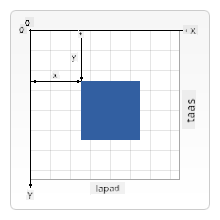

<!--
CO_OP_TRANSLATOR_METADATA:
{
  "original_hash": "84053695dca714e16ed064366503ebd5",
  "translation_date": "2025-10-22T15:40:15+00:00",
  "source_file": "6-space-game/2-drawing-to-canvas/README.md",
  "language_code": "tl"
}
-->
# Gumawa ng Space Game Bahagi 2: I-drawing ang Hero at Monsters sa Canvas

Ang Canvas API ay isa sa mga pinakamakapangyarihang tampok ng web development para sa paglikha ng dynamic at interactive na graphics direkta sa iyong browser. Sa araling ito, gagawin nating isang mundo ng laro ang blangkong HTML `<canvas>` element na puno ng mga bayani at halimaw. Isipin ang canvas bilang iyong digital na art board kung saan nagiging visual ang code.

Bubuo tayo mula sa natutunan mo sa nakaraang aralin, at ngayon ay sisid tayo sa mga visual na aspeto. Matutunan mo kung paano mag-load at mag-display ng game sprites, mag-posisyon ng mga elemento nang eksakto, at lumikha ng visual na pundasyon para sa iyong space game. Ito ang tulay sa pagitan ng static na mga web page at dynamic, interactive na mga karanasan.

Sa pagtatapos ng araling ito, magkakaroon ka ng kumpletong game scene na may tamang posisyon ng iyong hero ship at mga pormasyon ng kalaban na handa para sa labanan. Maiintindihan mo kung paano nagre-render ng graphics ang mga modernong laro sa mga browser at magkakaroon ka ng kakayahan na lumikha ng sarili mong interactive na visual na karanasan. Tuklasin natin ang canvas graphics at buhayin ang iyong space game!

## Pre-Lecture Quiz

[Pre-lecture quiz](https://ff-quizzes.netlify.app/web/quiz/31)

## Ang Canvas

Ano nga ba ang `<canvas>` element? Ito ang solusyon ng HTML5 para sa paglikha ng dynamic na graphics at animations sa mga web browser. Hindi tulad ng mga regular na imahe o video na static, binibigyan ka ng canvas ng pixel-level na kontrol sa lahat ng lumalabas sa screen. Perpekto ito para sa mga laro, data visualizations, at interactive na sining. Isipin ito bilang isang programmable na drawing surface kung saan ang JavaScript ang iyong paintbrush.

Sa default, ang canvas element ay mukhang isang blangkong, transparent na rectangle sa iyong pahina. Pero dito nakasalalay ang potensyal! Ang tunay na kapangyarihan nito ay lumalabas kapag ginamit mo ang JavaScript para mag-drawing ng mga hugis, mag-load ng mga imahe, lumikha ng animations, at gawing interactive ang mga bagay. Katulad ito ng ginawa ng mga unang computer graphics pioneers sa Bell Labs noong 1960s na kailangang i-program ang bawat pixel para makalikha ng unang digital animations.

✅ Basahin ang [karagdagang impormasyon tungkol sa Canvas API](https://developer.mozilla.org/docs/Web/API/Canvas_API) sa MDN.

Ganito karaniwang ideklara ang canvas bilang bahagi ng body ng pahina:

```html
<canvas id="myCanvas" width="200" height="100"></canvas>
```

**Ano ang ginagawa ng code na ito:**
- **Itinatakda** ang `id` attribute para ma-reference ang partikular na canvas element sa JavaScript
- **Tinutukoy** ang `width` sa pixels para kontrolin ang horizontal na laki ng canvas
- **Itinatakda** ang `height` sa pixels para tukuyin ang vertical na sukat ng canvas

## Pag-drawing ng Simpleng Geometry

Ngayon na alam mo kung ano ang canvas element, tuklasin natin ang aktwal na pag-drawing dito! Ang canvas ay gumagamit ng coordinate system na maaaring pamilyar mula sa math class, pero may isang mahalagang twist na partikular sa computer graphics.

Ang canvas ay gumagamit ng Cartesian coordinates na may x-axis (horizontal) at y-axis (vertical) para i-posisyon ang lahat ng iyong idinodrawing. Pero narito ang mahalagang pagkakaiba: hindi tulad ng coordinate system sa math class, ang origin point `(0,0)` ay nagsisimula sa top-left corner, kung saan ang x-values ay tumataas habang gumagalaw pakanan at ang y-values ay tumataas habang gumagalaw pababa. Ang approach na ito ay nagmula sa mga unang computer displays kung saan ang electron beams ay nag-scan mula sa itaas pababa, kaya ang top-left ang natural na starting point.


> Imahe mula sa [MDN](https://developer.mozilla.org/docs/Web/API/Canvas_API/Tutorial/Drawing_shapes)

Para mag-drawing sa canvas element, susundin mo ang parehong tatlong hakbang na proseso na bumubuo sa pundasyon ng lahat ng canvas graphics. Kapag nagawa mo ito ng ilang beses, magiging natural na ito:

1. **Kumuha ng reference** sa iyong Canvas element mula sa DOM (katulad ng ibang HTML element)
2. **Kunin ang 2D rendering context** – ito ang nagbibigay ng lahat ng drawing methods
3. **Simulan ang pag-drawing!** Gamitin ang built-in methods ng context para lumikha ng graphics

Ganito ang itsura nito sa code:

```javascript
// Step 1: Get the canvas element
const canvas = document.getElementById("myCanvas");

// Step 2: Get the 2D rendering context
const ctx = canvas.getContext("2d");

// Step 3: Set fill color and draw a rectangle
ctx.fillStyle = 'red';
ctx.fillRect(0, 0, 200, 200); // x, y, width, height
```

**I-break down natin ito step by step:**
- **Kinukuha** natin ang canvas element gamit ang ID nito at ini-store sa isang variable
- **Kinukuha** natin ang 2D rendering context – ito ang toolkit na puno ng drawing methods
- **Sinasabi** natin sa canvas na gusto nating punuin ng pula gamit ang `fillStyle` property
- **Nagdo-drawing** tayo ng rectangle simula sa top-left corner (0,0) na 200 pixels ang lapad at taas

✅ Ang Canvas API ay pangunahing nakatuon sa 2D shapes, pero maaari ka ring mag-drawing ng 3D elements sa isang website; para dito, maaaring gamitin ang [WebGL API](https://developer.mozilla.org/docs/Web/API/WebGL_API).

Maraming bagay ang maaari mong i-drawing gamit ang Canvas API tulad ng:

- **Geometrical shapes**, naipakita na namin kung paano mag-drawing ng rectangle, pero marami pang iba ang maaari mong i-drawing.
- **Text**, maaari kang mag-drawing ng text gamit ang anumang font at kulay na gusto mo.
- **Images**, maaari kang mag-drawing ng imahe batay sa isang image asset tulad ng .jpg o .png halimbawa.

✅ Subukan ito! Alam mo na kung paano mag-drawing ng rectangle, kaya kaya mo bang mag-drawing ng bilog sa isang pahina? Tingnan ang ilang mga kawili-wiling Canvas drawings sa CodePen. Narito ang isang [napaka-impressive na halimbawa](https://codepen.io/dissimulate/pen/KrAwx).

## Mag-load at Mag-drawing ng Image Asset

Ang pag-drawing ng basic shapes ay kapaki-pakinabang para sa pagsisimula, pero karamihan sa mga laro ay nangangailangan ng aktwal na mga imahe! Ang sprites, backgrounds, at textures ang nagbibigay ng visual na appeal sa mga laro. Ang pag-load at pag-display ng mga imahe sa canvas ay gumagana nang iba kaysa sa pag-drawing ng geometric shapes, pero madali itong maunawaan kapag naintindihan mo ang proseso.

Kailangan nating lumikha ng `Image` object, i-load ang ating image file (ito ay nangyayari asynchronously, ibig sabihin "sa background"), at pagkatapos ay i-drawing ito sa canvas kapag handa na. Ang approach na ito ay tinitiyak na maayos na magdi-display ang iyong mga imahe nang hindi nakaka-block sa iyong application habang naglo-load.

### Basic Image Loading

```javascript
const img = new Image();
img.src = 'path/to/my/image.png';
img.onload = () => {
  // Image loaded and ready to be used
  console.log('Image loaded successfully!');
};
```

**Ano ang nangyayari sa code na ito:**
- **Lumilikha** tayo ng bagong Image object para mag-hold ng ating sprite o texture
- **Sinasabi** natin kung aling image file ang dapat i-load sa pamamagitan ng pag-set ng source path
- **Nakikinig** tayo sa load event para malaman kung kailan handa na ang imahe para gamitin

### Mas Magandang Paraan ng Pag-load ng Imahe

Narito ang mas maayos na paraan para mag-handle ng image loading na karaniwang ginagamit ng mga propesyonal na developer. I-wrap natin ang image loading sa isang Promise-based function – ang approach na ito, na naging popular nang maging standard ang JavaScript Promises sa ES6, ay mas organisado at maayos mag-handle ng errors:

```javascript
function loadAsset(path) {
  return new Promise((resolve, reject) => {
    const img = new Image();
    img.src = path;
    img.onload = () => {
      resolve(img);
    };
    img.onerror = () => {
      reject(new Error(`Failed to load image: ${path}`));
    };
  });
}

// Modern usage with async/await
async function initializeGame() {
  try {
    const heroImg = await loadAsset('hero.png');
    const monsterImg = await loadAsset('monster.png');
    // Images are now ready to use
  } catch (error) {
    console.error('Failed to load game assets:', error);
  }
}
```

**Ano ang ginawa natin dito:**
- **I-wrap** ang lahat ng image loading logic sa isang Promise para mas maayos itong ma-handle
- **Nagdagdag** ng error handling na nagsasabi kung may mali
- **Gumamit** ng modern async/await syntax dahil mas malinis itong basahin
- **Naglagay** ng try/catch blocks para maayos na ma-handle ang anumang loading hiccups

Kapag na-load na ang iyong mga imahe, ang pag-drawing nito sa canvas ay talagang simple:

```javascript
async function renderGameScreen() {
  try {
    // Load game assets
    const heroImg = await loadAsset('hero.png');
    const monsterImg = await loadAsset('monster.png');

    // Get canvas and context
    const canvas = document.getElementById("myCanvas");
    const ctx = canvas.getContext("2d");

    // Draw images to specific positions
    ctx.drawImage(heroImg, canvas.width / 2, canvas.height / 2);
    ctx.drawImage(monsterImg, 0, 0);
  } catch (error) {
    console.error('Failed to render game screen:', error);
  }
}
```

**I-break down natin ito step by step:**
- **Naglo-load** tayo ng parehong hero at monster images sa background gamit ang await
- **Kinukuha** natin ang canvas element at ang 2D rendering context na kailangan natin
- **Pinoposisyon** natin ang hero image sa gitna gamit ang mabilis na coordinate math
- **Nilalagay** ang monster image sa top-left corner para simulan ang enemy formation
- **Hinuhuli** ang anumang errors na maaaring mangyari sa loading o rendering

## Panahon na Para Simulan ang Paggawa ng Iyong Laro

Ngayon ay pagsasama-samahin natin ang lahat para lumikha ng visual na pundasyon ng iyong space game. May solidong kaalaman ka na sa canvas fundamentals at image loading techniques, kaya ang hands-on na seksyon na ito ay gagabay sa iyo sa paggawa ng kumpletong game screen na may tamang posisyon ng sprites.

### Ano ang Bubuuin

Bubuo ka ng isang web page na may Canvas element. Dapat itong mag-render ng black screen na `1024*768`. Mayroon kaming ibinigay na dalawang imahe:

- Hero ship

   

- 5*5 monster

   

### Mga Inirerekomendang Hakbang para Simulan ang Development

Hanapin ang starter files na ginawa para sa iyo sa `your-work` sub folder. Ang istruktura ng iyong proyekto ay dapat maglaman ng:

```bash
your-work/
├── assets/
│   ├── enemyShip.png
│   └── player.png
├── index.html
├── app.js
└── package.json
```

**Ano ang mayroon ka:**
- **Game sprites** ay nasa `assets/` folder para manatiling organisado ang lahat
- **Ang iyong pangunahing HTML file** ay nagse-set up ng canvas element at naghahanda ng lahat
- **Isang JavaScript file** kung saan mo isusulat ang lahat ng game rendering magic
- **Isang package.json** na nagse-set up ng development server para ma-test mo nang lokal

Buksan ang folder na ito sa Visual Studio Code para simulan ang development. Kakailanganin mo ng lokal na development environment na may Visual Studio Code, NPM, at Node.js na naka-install. Kung wala kang `npm` sa iyong computer, [narito kung paano ito i-install](https://www.npmjs.com/get-npm).

Simulan ang iyong development server sa pamamagitan ng pag-navigate sa `your-work` folder:

```bash
cd your-work
npm start
```

**Ang command na ito ay gumagawa ng mga cool na bagay:**
- **Sinisimulan** ang isang lokal na server sa `http://localhost:5000` para ma-test mo ang iyong laro
- **Sineserve** ang lahat ng iyong files nang maayos para ma-load ito ng browser
- **Binabantayan** ang iyong files para sa mga pagbabago para ma-develop mo nang maayos
- **Binibigyan ka** ng professional development environment para ma-test ang lahat

> 💡 **Tandaan**: Ang iyong browser ay magpapakita ng blangkong pahina sa simula – normal ito! Habang nagdadagdag ka ng code, i-refresh ang iyong browser para makita ang mga pagbabago. Ang iterative development approach na ito ay katulad ng ginawa ng NASA sa Apollo guidance computer – tinest ang bawat component bago ito isinama sa mas malaking sistema.

### Magdagdag ng Code

Magdagdag ng kinakailangang code sa `your-work/app.js` para makumpleto ang mga sumusunod na gawain:

1. **Mag-drawing ng canvas na may black background**
   > 💡 **Narito kung paano**: Hanapin ang TODO sa `/app.js` at magdagdag ng dalawang linya. I-set ang `ctx.fillStyle` sa black, pagkatapos gamitin ang `ctx.fillRect()` simula sa (0,0) gamit ang sukat ng iyong canvas. Madali lang!

2. **Mag-load ng game textures**
   > 💡 **Narito kung paano**: Gamitin ang `await loadAsset()` para i-load ang iyong player at enemy images. I-store ang mga ito sa variables para magamit mo sa susunod. Tandaan – hindi ito magpapakita hangga't hindi mo ito idinodrawing!

3. **I-drawing ang hero ship sa center-bottom position**
   > 💡 **Narito kung paano**: Gamitin ang `ctx.drawImage()` para i-posisyon ang iyong hero. Para sa x-coordinate, subukan ang `canvas.width / 2 - 45` para i-center ito, at para sa y-coordinate gamitin ang `canvas.height - canvas.height / 4` para ilagay ito sa bottom area.

4. **I-drawing ang 5×5 formation ng enemy ships**
   > 💡 **Narito kung paano**: Hanapin ang `createEnemies` function at mag-set up ng nested loop. Kailangan mong gumawa ng math para sa spacing at positioning, pero huwag mag-alala – ipapakita ko sa iyo kung paano!

Una, mag-set ng constants para sa tamang layout ng enemy formation:

```javascript
const ENEMY_TOTAL = 5;
const ENEMY_SPACING = 98;
const FORMATION_WIDTH = ENEMY_TOTAL * ENEMY_SPACING;
const START_X = (canvas.width - FORMATION_WIDTH) / 2;
const STOP_X = START_X + FORMATION_WIDTH;
```

**I-break down natin kung ano ang ginagawa ng constants na ito:**
- **Itinatakda** ang 5 enemies bawat row at column (isang magandang 5×5 grid)
- **Tinutukoy** kung gaano kalayo ang pagitan ng mga enemies para hindi magmukhang masikip
- **Kinakalkula** kung gaano kalawak ang buong formation
- **Tinutukoy** kung saan magsisimula at magtatapos para magmukhang centered ang formation

Pagkatapos, gumawa ng nested loops para i-drawing ang enemy formation:

```javascript
for (let x = START_X; x < STOP_X; x += ENEMY_SPACING) {
  for (let y = 0; y < 50 * 5; y += 50) {
    ctx.drawImage(enemyImg, x, y);
  }
}
```

**Ano ang ginagawa ng nested loop na ito:**
- Ang outer loop ay **gumagalaw** mula kaliwa pakanan sa formation
- Ang inner loop ay **pumupunta** mula itaas pababa para lumikha ng maayos na rows
- **Idinodrawing** ang bawat enemy sprite sa eksaktong x,y coordinates na kinalkula
- Lahat ay nananatiling **pantay-pantay ang spacing** para magmukhang propesyonal at organisado

## Resulta

Ang tapos na resulta ay dapat magmukhang ganito:


## Solusyon

Subukan mo munang lutasin ito sa sarili mo pero kung mahihirapan ka, tingnan ang [solusyon](../../../../6-space-game/2-drawing-to-canvas/solution/app.js)

---

## Hamon ng GitHub Copilot Agent 🚀

Gamitin ang Agent mode para kumpletuhin ang sumusunod na hamon:

**Deskripsyon:** Pagandahin ang canvas ng iyong space game sa pamamagitan ng pagdaragdag ng visual effects at interactive elements gamit ang mga teknik ng Canvas API na natutunan mo.

**Prompt:** Gumawa ng bagong file na tinatawag na `enhanced-canvas.html` na may canvas na nagpapakita ng animated na mga bituin sa background, isang pulsing health bar para sa hero ship, at mga enemy ships na dahan-dahang bumababa. Isama ang JavaScript code na nagdo-drawing ng twinkling stars gamit ang random na posisyon at opacity, nag-iimplement ng health bar na nagbabago ng kulay batay sa health level (green > yellow > red), at nag-aanimate ng mga enemy ships para bumaba sa screen sa iba't ibang bilis.

Alamin ang higit pa tungkol sa [agent mode](https://code.visualstudio.com/blogs/2025/02/24/introducing-copilot-agent-mode) dito.

## 🚀 Hamon

Natutunan mo ang tungkol sa pag-drawing gamit ang 2D-focused Canvas API; tingnan ang [WebGL API](https://developer.mozilla.org/docs/Web/API/WebGL_API), at subukang mag-drawing ng 3D object.

## Post-Lecture Quiz

[Post-lecture quiz](https://ff-quizzes.netlify.app/web/quiz/32)

## Review & Self Study

Alamin ang higit pa tungkol sa Canvas API sa pamamagitan ng [pagbabasa tungkol dito](https://developer.mozilla.org/docs/Web/API/Canvas_API).

## Assignment

[Maglaro gamit ang Canvas API](assignment.md)

---

**Paunawa**:  
Ang dokumentong ito ay isinalin gamit ang AI translation service [Co-op Translator](https://github.com/Azure/co-op-translator). Bagamat sinisikap naming maging tumpak, pakitandaan na ang mga awtomatikong pagsasalin ay maaaring maglaman ng mga pagkakamali o hindi pagkakatugma. Ang orihinal na dokumento sa kanyang katutubong wika ang dapat ituring na opisyal na sanggunian. Para sa mahalagang impormasyon, inirerekomenda ang propesyonal na pagsasalin ng tao. Hindi kami mananagot sa anumang hindi pagkakaunawaan o maling interpretasyon na dulot ng paggamit ng pagsasaling ito.