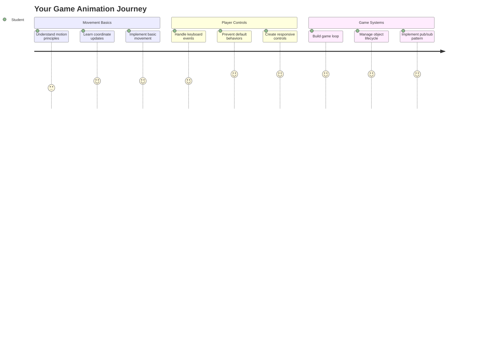
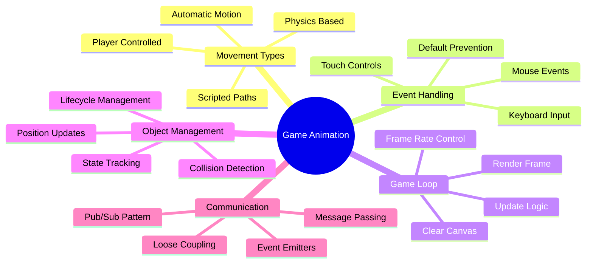
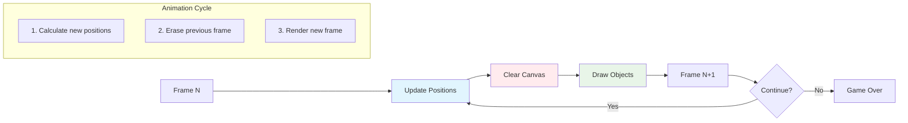
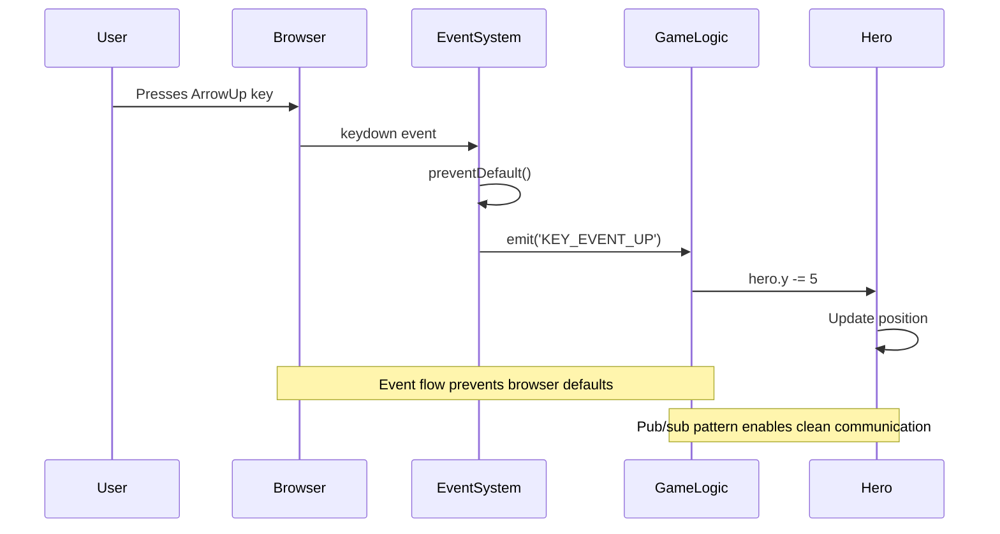
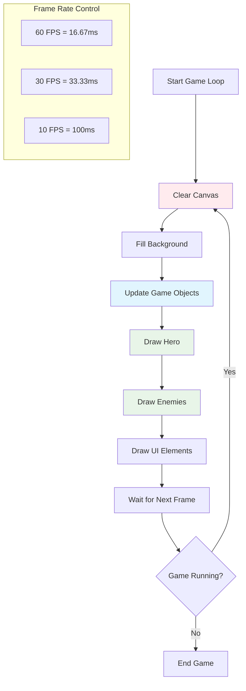
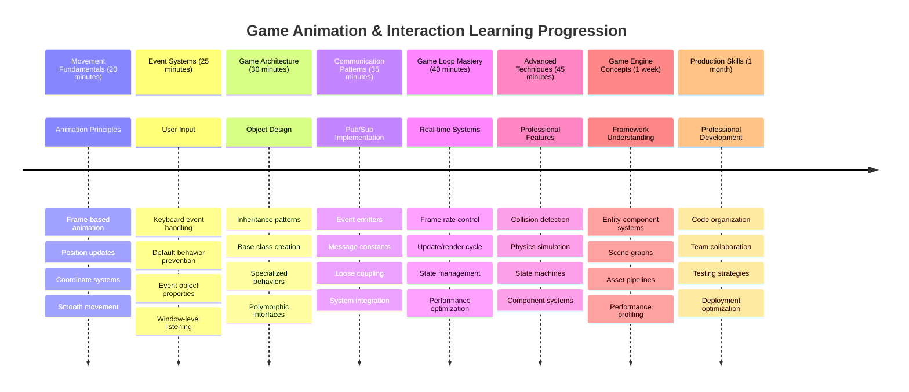

# Gumawa ng Space Game Bahagi 3: Pagdaragdag ng Galaw



Isipin ang iyong mga paboritong laro – ang nagpapaganda sa kanila ay hindi lang ang magagandang graphics, kundi ang paraan ng paggalaw ng lahat at ang tugon sa iyong mga aksyon. Sa ngayon, ang iyong space game ay parang isang magandang painting, pero malapit na nating idagdag ang galaw na magbibigay-buhay dito.

Noong pinrograma ng mga inhinyero ng NASA ang guidance computer para sa Apollo missions, hinarap nila ang parehong hamon: paano mo gagawing tumugon ang spacecraft sa input ng piloto habang awtomatikong pinapanatili ang mga pagwawasto ng kurso? Ang mga prinsipyo na matututunan natin ngayon ay kahalintulad ng mga konseptong iyon – pamamahala sa galaw na kontrolado ng manlalaro kasabay ng awtomatikong mga sistema.

Sa araling ito, matututunan mo kung paano magpapalipad ng mga spaceship sa screen, tumugon sa mga utos ng manlalaro, at lumikha ng makinis na mga pattern ng galaw. Hahatiin natin ang lahat sa mga konseptong madaling maunawaan na natural na magtataguyod sa isa't isa.

Sa dulo, magpapalipad na ang mga manlalaro ng kanilang hero ship sa screen habang ang mga barko ng kalaban ay nagpa-patrol sa itaas. Mas mahalaga, mauunawaan mo ang mga pangunahing prinsipyo na nagpapatakbo sa mga sistema ng galaw sa laro.



## Pre-Lecture Quiz

[Pre-lecture quiz](https://ff-quizzes.netlify.app/web/quiz/33)

## Pag-unawa sa Galaw ng Laro

Nagiging buhay ang mga laro kapag nagsimulang gumalaw ang mga bagay, at may dalawang pangunahing paraan kung paano ito nangyayari:

- **Galaw na kontrolado ng manlalaro**: Kapag pinindot mo ang isang key o nag-click gamit ang mouse, may gumagalaw. Ito ang direktang koneksyon sa pagitan mo at ng mundo ng laro.
- **Awtomatikong galaw**: Kapag ang laro mismo ang nagpasya na gumalaw ang mga bagay – tulad ng mga barko ng kalaban na kailangang magpatrol sa screen kahit wala kang ginagawa.

Ang pagpapagalaw ng mga bagay sa screen ng computer ay mas simple kaysa sa iniisip mo. Naalala mo ba ang x at y coordinates mula sa math class? Iyan mismo ang ginagamit natin dito. Noong sinusubaybayan ni Galileo ang mga buwan ng Jupiter noong 1610, ginagawa niya ang parehong bagay – nagpo-plot ng mga posisyon sa paglipas ng panahon upang maunawaan ang mga pattern ng galaw.

Ang pagpapagalaw ng mga bagay sa screen ay parang paglikha ng flipbook animation – kailangan mong sundin ang tatlong simpleng hakbang:



1. **I-update ang posisyon** – Baguhin kung saan dapat naroon ang iyong object (halimbawa, ilipat ito ng 5 pixels pakanan)
2. **Burahin ang lumang frame** – Linisin ang screen para hindi makita ang mga ghostly trails
3. **I-draw ang bagong frame** – Ilagay ang iyong object sa bagong posisyon nito

Gawin ito nang mabilis, at boom! Mayroon kang makinis na galaw na natural na nararamdaman ng mga manlalaro.

Ganito ang itsura nito sa code:

```javascript
// Set the hero's location
hero.x += 5;
// Clear the rectangle that hosts the hero
ctx.clearRect(0, 0, canvas.width, canvas.height);
// Redraw the game background and hero
ctx.fillRect(0, 0, canvas.width, canvas.height);
ctx.fillStyle = "black";
ctx.drawImage(heroImg, hero.x, hero.y);
```

**Ang ginagawa ng code na ito:**
- **Ina-update** ang x-coordinate ng hero ng 5 pixels para gumalaw ito nang pahalang
- **Binubura** ang buong canvas area para alisin ang nakaraang frame
- **Pinupuno** ang canvas ng itim na background na kulay
- **I-dinodraw** ang hero image sa bagong posisyon nito

✅ Maisip mo ba ang dahilan kung bakit ang pag-redraw ng iyong hero nang maraming frames kada segundo ay maaaring magdulot ng performance costs? Basahin ang tungkol sa [mga alternatibo sa pattern na ito](https://developer.mozilla.org/en-US/docs/Web/API/Canvas_API/Tutorial/Optimizing_canvas).

## Pag-handle ng keyboard events

Dito natin ikokonekta ang input ng manlalaro sa aksyon ng laro. Kapag pinindot ng isang tao ang spacebar para magpaputok ng laser o pinindot ang arrow key para umiwas sa asteroid, kailangang ma-detect at tumugon ang iyong laro sa input na iyon.

Ang mga keyboard events ay nangyayari sa window level, ibig sabihin ang buong browser window mo ang nakikinig sa mga keypresses na iyon. Ang mga mouse clicks, sa kabilang banda, ay maaaring itali sa mga partikular na elemento (tulad ng pag-click sa isang button). Para sa ating space game, magpo-focus tayo sa keyboard controls dahil ito ang nagbibigay sa mga manlalaro ng klasikong arcade feel.

Naalala ko ang mga operator ng telegrapo noong 1800s na kailangang i-translate ang morse code input sa mga makabuluhang mensahe – gumagawa tayo ng katulad na bagay, tinatranslate ang mga keypresses sa mga utos ng laro.

Para mag-handle ng isang event, kailangan mong gamitin ang `addEventListener()` method ng window at magbigay ng dalawang input parameters. Ang unang parameter ay ang pangalan ng event, halimbawa `keyup`. Ang pangalawang parameter ay ang function na dapat i-invoke bilang resulta ng event na naganap.

Narito ang isang halimbawa:

```javascript
window.addEventListener('keyup', (evt) => {
  // evt.key = string representation of the key
  if (evt.key === 'ArrowUp') {
    // do something
  }
});
```

**Pagpapaliwanag sa nangyayari dito:**
- **Nakikinig** sa mga keyboard events sa buong window
- **Kinukuha** ang event object na naglalaman ng impormasyon tungkol sa kung anong key ang pinindot
- **Sinusuri** kung ang pinindot na key ay tumutugma sa isang partikular na key (sa kasong ito, ang up arrow)
- **Nag-eexecute** ng code kapag natugunan ang kondisyon

Para sa key events, may dalawang properties sa event na maaari mong gamitin upang makita kung anong key ang pinindot:

- `key` - ito ay isang string representation ng pinindot na key, halimbawa `'ArrowUp'`
- `keyCode` - ito ay isang number representation, halimbawa `37`, na tumutugma sa `ArrowLeft`

✅ Ang pag-manipula ng key events ay kapaki-pakinabang kahit sa labas ng game development. Ano pang ibang gamit ang naiisip mo para sa teknik na ito?



### Mga espesyal na key: isang paalala!

Ang ilang mga key ay may built-in na browser behaviors na maaaring makagambala sa iyong laro. Ang mga arrow keys ay nag-scroll sa page at ang spacebar ay tumatalon pababa – mga behavior na ayaw mo kapag sinusubukang i-pilot ng isang tao ang kanilang spaceship.

Maaari nating pigilan ang mga default na behaviors na ito at hayaan ang ating laro na mag-handle ng input sa halip. Katulad ito ng kung paano kailangang i-override ng mga unang programmer ng computer ang system interrupts upang lumikha ng custom na behaviors – ginagawa lang natin ito sa browser level. Narito kung paano:

```javascript
const onKeyDown = function (e) {
  console.log(e.keyCode);
  switch (e.keyCode) {
    case 37:
    case 39:
    case 38:
    case 40: // Arrow keys
    case 32:
      e.preventDefault();
      break; // Space
    default:
      break; // do not block other keys
  }
};

window.addEventListener('keydown', onKeyDown);
```

**Pag-unawa sa prevention code na ito:**
- **Sinusuri** ang mga partikular na key codes na maaaring magdulot ng hindi kanais-nais na browser behavior
- **Pinipigilan** ang default na aksyon ng browser para sa mga arrow keys at spacebar
- **Pinapayagan** ang ibang mga key na gumana nang normal
- **Gumagamit** ng `e.preventDefault()` upang ihinto ang built-in na behavior ng browser

### 🔄 **Pedagogical Check-in**
**Pag-unawa sa Event Handling**: Bago lumipat sa awtomatikong galaw, tiyaking kaya mong:
- ✅ Ipaliwanag ang pagkakaiba ng `keydown` at `keyup` events
- ✅ Unawain kung bakit natin pinipigilan ang default na browser behaviors
- ✅ Ilarawan kung paano ikinokonekta ng event listeners ang input ng user sa game logic
- ✅ Tukuyin kung aling mga key ang maaaring makagambala sa game controls

**Mabilis na Self-Test**: Ano ang mangyayari kung hindi mo pipigilan ang default na behavior para sa mga arrow keys?
*Sagot: Mag-scroll ang browser sa page, na makakagambala sa galaw ng laro*

**Arkitektura ng Event System**: Nauunawaan mo na ngayon:
- **Window-level listening**: Pagkuha ng events sa browser level
- **Properties ng event object**: `key` strings vs `keyCode` numbers
- **Pag-iwas sa default**: Pagpigil sa hindi kanais-nais na browser behaviors
- **Conditional logic**: Pagtugon sa mga partikular na kombinasyon ng key

## Galaw na dulot ng laro

Ngayon, pag-usapan natin ang mga object na gumagalaw nang walang input ng manlalaro. Isipin ang mga barko ng kalaban na naglalakbay sa screen, mga bala na lumilipad sa tuwid na linya, o mga ulap na dahan-dahang gumagalaw sa background. Ang awtomatikong galaw na ito ang nagpaparamdam na buhay ang mundo ng laro kahit walang humahawak sa controls.

Gumagamit tayo ng built-in timers ng JavaScript upang i-update ang mga posisyon sa regular na intervals. Ang konseptong ito ay kahalintulad ng kung paano gumagana ang mga pendulum clocks – isang regular na mekanismo na nagti-trigger ng consistent, timed actions. Narito kung gaano ito kasimple:

```javascript
const id = setInterval(() => {
  // Move the enemy on the y axis
  enemy.y += 10;
}, 100);
```

**Ang ginagawa ng movement code na ito:**
- **Gumagawa** ng timer na tumatakbo tuwing 100 milliseconds
- **Ina-update** ang y-coordinate ng kalaban ng 10 pixels bawat beses
- **Ini-store** ang interval ID para maihinto ito mamaya kung kinakailangan
- **Pinapagalaw** ang kalaban pababa sa screen nang awtomatiko

## Ang game loop

Narito ang konsepto na nag-uugnay sa lahat – ang game loop. Kung ang iyong laro ay isang pelikula, ang game loop ang magiging film projector, nagpapakita ng frame pagkatapos ng frame nang napakabilis kaya't ang lahat ay mukhang gumagalaw nang maayos.

Ang bawat laro ay may isa sa mga loop na ito na tumatakbo sa likod ng eksena. Isa itong function na nag-a-update sa lahat ng game objects, nagre-redraw ng screen, at inuulit ang prosesong ito nang tuloy-tuloy. Pinapanatili nito ang track ng iyong hero, lahat ng kalaban, anumang lasers na lumilipad – ang buong estado ng laro.

Ang konseptong ito ay nagpapaalala sa akin kung paano kailangang i-redraw ng mga unang animator ng pelikula tulad ni Walt Disney ang mga karakter frame by frame upang lumikha ng ilusyon ng galaw. Ginagawa natin ang parehong bagay, gamit ang code sa halip na lapis.

Ganito ang itsura ng isang game loop, na ipinapahayag sa code:



```javascript
const gameLoopId = setInterval(() => {
  function gameLoop() {
    ctx.clearRect(0, 0, canvas.width, canvas.height);
    ctx.fillStyle = "black";
    ctx.fillRect(0, 0, canvas.width, canvas.height);
    drawHero();
    drawEnemies();
    drawStaticObjects();
  }
  gameLoop();
}, 200);
```

**Pag-unawa sa istruktura ng game loop:**
- **Binubura** ang buong canvas upang alisin ang nakaraang frame
- **Pinupuno** ang background ng solidong kulay
- **I-dinodraw** ang lahat ng game objects sa kanilang kasalukuyang posisyon
- **Inuulit** ang prosesong ito tuwing 200 milliseconds upang lumikha ng makinis na animation
- **Pinamamahalaan** ang frame rate sa pamamagitan ng pagkontrol sa interval timing

## Pagpapatuloy ng Space Game

Ngayon, magdadagdag tayo ng galaw sa static na eksena na ginawa mo dati. Gagawin natin itong mula sa isang screenshot patungo sa isang interactive na karanasan. Gagawin natin ito hakbang-hakbang upang matiyak na ang bawat bahagi ay magtataguyod sa huli.

Kunin ang code mula sa kung saan tayo tumigil sa nakaraang aralin (o magsimula sa code sa [Part II- starter](../../../../6-space-game/3-moving-elements-around/your-work) folder kung kailangan mo ng bagong simula).

**Narito ang ating itatayo ngayon:**
- **Hero controls**: Ang mga arrow keys ang magpapalipad sa iyong spaceship sa screen
- **Galaw ng kalaban**: Ang mga alien ships ay magsisimula ng kanilang pag-atake

Simulan na natin ang pag-implementa ng mga feature na ito.

## Mga Inirerekomendang Hakbang

Hanapin ang mga file na ginawa para sa iyo sa `your-work` sub folder. Dapat itong naglalaman ng sumusunod:

```bash
-| assets
  -| enemyShip.png
  -| player.png
-| index.html
-| app.js
-| package.json
```

Simulan ang iyong proyekto sa `your-work` folder sa pamamagitan ng pag-type:

```bash
cd your-work
npm start
```

**Ang ginagawa ng command na ito:**
- **Nagna-navigate** sa iyong project directory
- **Nag-i-start** ng HTTP Server sa address na `http://localhost:5000`
- **Nagsi-serve** ng iyong game files para ma-test mo ito sa browser

Ang nasa itaas ay mag-i-start ng HTTP Server sa address na `http://localhost:5000`. Buksan ang browser at i-input ang address na iyon, sa ngayon dapat itong mag-render ng hero at lahat ng kalaban; wala pang gumagalaw - sa ngayon!

### Magdagdag ng code

1. **Magdagdag ng dedicated objects** para sa `hero`, `enemy`, at `game object`, dapat silang may `x` at `y` properties. (Tandaan ang bahagi tungkol sa [Inheritance o composition](../README.md)).

   *HINT* Ang `game object` ang dapat may `x` at `y` at ang kakayahang i-draw ang sarili nito sa canvas.

   > **Tip**: Simulan sa pamamagitan ng pagdaragdag ng bagong `GameObject` class na may constructor na delineated tulad ng nasa ibaba, at pagkatapos ay i-draw ito sa canvas:

    ```javascript
    class GameObject {
      constructor(x, y) {
        this.x = x;
        this.y = y;
        this.dead = false;
        this.type = "";
        this.width = 0;
        this.height = 0;
        this.img = undefined;
      }
    
      draw(ctx) {
        ctx.drawImage(this.img, this.x, this.y, this.width, this.height);
      }
    }
    ```

    **Pag-unawa sa base class na ito:**
    - **Nagde-define** ng mga karaniwang properties na lahat ng game objects ay mayroong (posisyon, laki, imahe)
    - **Kasama** ang `dead` flag upang subaybayan kung ang object ay dapat alisin
    - **Nagbibigay** ng `draw()` method na nagre-render ng object sa canvas
    - **Nagse-set** ng default values para sa lahat ng properties na maaaring i-override ng child classes

    ```mermaid
    classDiagram
        class GameObject {
            +x: number
            +y: number
            +dead: boolean
            +type: string
            +width: number
            +height: number
            +img: Image
            +draw(ctx)
        }
        
        class Hero {
            +speed: number
            +type: "Hero"
            +width: 98
            +height: 75
        }
        
        class Enemy {
            +type: "Enemy"
            +width: 98
            +height: 50
            +setInterval()
        }
        
        GameObject <|-- Hero
        GameObject <|-- Enemy
        
        class EventEmitter {
            +listeners: object
            +on(message, listener)
            +emit(message, payload)
        }
    ```

    Ngayon, i-extend ang `GameObject` upang lumikha ng `Hero` at `Enemy`:
    
    ```javascript
    class Hero extends GameObject {
      constructor(x, y) {
        super(x, y);
        this.width = 98;
        this.height = 75;
        this.type = "Hero";
        this.speed = 5;
      }
    }
    ```

    ```javascript
    class Enemy extends GameObject {
      constructor(x, y) {
        super(x, y);
        this.width = 98;
        this.height = 50;
        this.type = "Enemy";
        const id = setInterval(() => {
          if (this.y < canvas.height - this.height) {
            this.y += 5;
          } else {
            console.log('Stopped at', this.y);
            clearInterval(id);
          }
        }, 300);
      }
    }
    ```

    **Mga pangunahing konsepto sa mga klase na ito:**
    - **Nagmamana** mula sa `GameObject` gamit ang `extends` keyword
    - **Tinatawag** ang parent constructor gamit ang `super(x, y)`
    - **Nagse-set** ng partikular na dimensyon at properties para sa bawat uri ng object
    - **Nag-iimplementa** ng awtomatikong galaw para sa mga kalaban gamit ang `setInterval()`

2. **Magdagdag ng key-event handlers** upang mag-handle ng key navigation (igalaw ang hero pataas/pababa kaliwa/kanan)

   *TANDAAN* ito ay isang cartesian system, ang top-left ay `0,0`. Tandaan din na magdagdag ng code upang ihinto ang *default behavior*

   > **Tip**: Gumawa ng iyong `onKeyDown` function at i-attach ito sa window:

   ```javascript
   const onKeyDown = function (e) {
     console.log(e.keyCode);
     // Add the code from the lesson above to stop default behavior
     switch (e.keyCode) {
       case 37:
       case 39:
       case 38:
       case 40: // Arrow keys
       case 32:
         e.preventDefault();
         break; // Space
       default:
         break; // do not block other keys
     }
   };

   window.addEventListener("keydown", onKeyDown);
   ```
    
   **Ang ginagawa ng event handler na ito:**
   - **Nakikinig** sa keydown events sa buong window
   - **Naglo-log** ng key code upang matulungan kang i-debug kung aling mga key ang pinipindot
   - **Pinipigilan** ang default na browser behavior para sa mga arrow keys at spacebar
   - **Pinapayagan** ang ibang mga key na gumana nang normal
   
   Tingnan ang console ng iyong browser sa puntong ito, at panoorin ang mga keystrokes na nalolog.

3. **I-implementa** ang [Pub sub pattern](../README.md), mapapanatili nitong malinis ang iyong code habang sinusundan mo ang natitirang mga bahagi.

   Ang Publish-Subscribe pattern ay tumutulong sa pag-organisa ng iyong code sa pamamagitan ng paghihiwalay ng event detection mula sa event handling. Ginagawa nitong mas modular at mas madaling i-maintain ang iyong code.

   Para magawa ang huling bahagi na ito, maaari mong:

   1. **Magdagdag ng event listener** sa window:

       ```javascript
       window.addEventListener("keyup", (evt) => {
         if (evt.key === "ArrowUp") {
           eventEmitter.emit(Messages.KEY_EVENT_UP);
         } else if (evt.key === "ArrowDown") {
           eventEmitter.emit(Messages.KEY_EVENT_DOWN);
         } else if (evt.key === "ArrowLeft") {
           eventEmitter.emit(Messages.KEY_EVENT_LEFT);
         } else if (evt.key === "ArrowRight") {
           eventEmitter.emit(Messages.KEY_EVENT_RIGHT);
         }
       });
       ```

   **Ang ginagawa ng event system na ito:**
   - **Nadidetect** ang keyboard input at kino-convert ito sa custom na game events
   - **Ihinhiwalay** ang input detection mula sa game logic
   - **Ginagawang** madali ang pagbabago ng controls sa hinaharap nang hindi naaapektuhan ang game code
   - **Pinapayagan** ang maraming sistema na tumugon sa parehong input

   ```mermaid
   flowchart TD
       A["Keyboard Input"] --> B["Window Event Listener"]
       B --> C["Event Emitter"]
       C --> D["KEY_EVENT_UP"]
       C --> E["KEY_EVENT_DOWN"]
       C --> F["KEY_EVENT_LEFT"]
       C --> G["KEY_EVENT_RIGHT"]
       
       D --> H["Hero Movement"]
       D --> I["Sound System"]
       D --> J["Visual Effects"]
       
       E --> H
       F --> H
       G --> H
       
       style A fill:#e1f5fe
       style C fill:#e8f5e8
       style H fill:#fff3e0
   ```

   2. **Gumawa ng EventEmitter class** upang mag-publish at mag-subscribe sa mga mensahe:

       ```javascript
       class EventEmitter {
         constructor() {
           this.listeners = {};
         }
       
         on(message, listener) {
           if (!this.listeners[message]) {
             this.listeners[message] = [];
           }
           this.listeners[message].push(listener);
         }
       
   3. **Magdagdag ng constants** at i-set up ang EventEmitter:

       ```javascript
       const Messages = {
         KEY_EVENT_UP: "KEY_EVENT_UP",
         KEY_EVENT_DOWN: "KEY_EVENT_DOWN",
         KEY_EVENT_LEFT: "KEY_EVENT_LEFT",
         KEY_EVENT_RIGHT: "KEY_EVENT_RIGHT",
       };
       
       let heroImg, 
           enemyImg, 
           laserImg,
           canvas, ctx, 
           gameObjects = [], 
           hero, 
           eventEmitter = new EventEmitter();
       ```

   **Pag-unawa sa setup:**
   - **Nagde-define** ng mga message constants upang maiwasan ang mga typo at gawing mas madali ang pag-refactor
   - **Nagdeklara** ng mga variable para sa mga imahe, canvas context, at estado ng laro
   - **Gumagawa** ng global event emitter para sa pub-sub system
   - **Inisyalisa** ang isang array para maglaman ng lahat ng game objects

   4. **I-inisyalisa ang laro**

       ```javascript
       function initGame() {
         gameObjects = [];
         createEnemies();
         createHero();
       
         eventEmitter.on(Messages.KEY_EVENT_UP, () => {
           hero.y -= 5;
         });
       
         eventEmitter.on(Messages.KEY_EVENT_DOWN, () => {
           hero.y += 5;
         });
       
         eventEmitter.on(Messages.KEY_EVENT_LEFT, () => {
           hero.x -= 5;
         });
       
4. **I-setup ang game loop**

   I-refactor ang `window.onload` function para i-inisyalisa ang laro at i-setup ang game loop sa tamang interval. Magdadagdag ka rin ng laser beam:

    ```javascript
    window.onload = async () => {
      canvas = document.getElementById("canvas");
      ctx = canvas.getContext("2d");
      heroImg = await loadTexture("assets/player.png");
      enemyImg = await loadTexture("assets/enemyShip.png");
      laserImg = await loadTexture("assets/laserRed.png");
    
      initGame();
      const gameLoopId = setInterval(() => {
        ctx.clearRect(0, 0, canvas.width, canvas.height);
        ctx.fillStyle = "black";
        ctx.fillRect(0, 0, canvas.width, canvas.height);
        drawGameObjects(ctx);
      }, 100);
    };
    ```

   **Pag-unawa sa game setup:**
   - **Naghihintay** na ganap na mag-load ang pahina bago magsimula
   - **Kinukuha** ang canvas element at ang 2D rendering context nito
   - **Ina-load** ang lahat ng image assets nang asynchronous gamit ang `await`
   - **Sinisimulan** ang game loop na tumatakbo sa 100ms intervals (10 FPS)
   - **Nililinis** at muling iginuguhit ang buong screen sa bawat frame

5. **Magdagdag ng code** para gumalaw ang mga kalaban sa tiyak na interval

    I-refactor ang `createEnemies()` function para lumikha ng mga kalaban at idagdag ang mga ito sa bagong gameObjects class:

    ```javascript
    function createEnemies() {
      const MONSTER_TOTAL = 5;
      const MONSTER_WIDTH = MONSTER_TOTAL * 98;
      const START_X = (canvas.width - MONSTER_WIDTH) / 2;
      const STOP_X = START_X + MONSTER_WIDTH;
    
      for (let x = START_X; x < STOP_X; x += 98) {
        for (let y = 0; y < 50 * 5; y += 50) {
          const enemy = new Enemy(x, y);
          enemy.img = enemyImg;
          gameObjects.push(enemy);
        }
      }
    }
    ```

    **Ano ang ginagawa ng paglikha ng kalaban:**
    - **Kinakalkula** ang mga posisyon para ma-center ang mga kalaban sa screen
    - **Lumilikha** ng grid ng mga kalaban gamit ang nested loops
    - **Ina-assign** ang enemy image sa bawat enemy object
    - **Idinadagdag** ang bawat kalaban sa global game objects array
    
    at magdagdag ng `createHero()` function para gawin ang katulad na proseso para sa hero.
    
    ```javascript
    function createHero() {
      hero = new Hero(
        canvas.width / 2 - 45,
        canvas.height - canvas.height / 4
      );
      hero.img = heroImg;
      gameObjects.push(hero);
    }
    ```

    **Ano ang ginagawa ng paglikha ng hero:**
    - **Inaayos** ang posisyon ng hero sa ibabang gitna ng screen
    - **Ina-assign** ang hero image sa hero object
    - **Idinadagdag** ang hero sa game objects array para sa rendering

    at sa wakas, magdagdag ng `drawGameObjects()` function para simulan ang pagguhit:

    ```javascript
    function drawGameObjects(ctx) {
      gameObjects.forEach(go => go.draw(ctx));
    }
    ```

    **Pag-unawa sa drawing function:**
    - **Ini-iterate** ang lahat ng game objects sa array
    - **Tinatawag** ang `draw()` method sa bawat object
    - **Ipinapasa** ang canvas context para ma-render ng mga object ang kanilang sarili

    ### 🔄 **Pedagogical Check-in**
    **Kumpletong Pag-unawa sa Game System**: Siguraduhing na-master mo ang buong arkitektura:
    - ✅ Paano nakakatulong ang inheritance para ma-share ng Hero at Enemy ang mga karaniwang GameObject properties?
    - ✅ Bakit mas pinapanatili ng pub/sub pattern ang iyong code?
    - ✅ Ano ang papel ng game loop sa paglikha ng smooth animation?
    - ✅ Paano nakakonekta ang event listeners sa user input at game object behavior?

    **System Integration**: Ang iyong laro ngayon ay nagpapakita ng:
    - **Object-Oriented Design**: Base classes na may specialized inheritance
    - **Event-Driven Architecture**: Pub/sub pattern para sa loose coupling
    - **Animation Framework**: Game loop na may consistent frame updates
    - **Input Handling**: Keyboard events na may default prevention
    - **Asset Management**: Image loading at sprite rendering

    **Professional Patterns**: Na-implement mo na:
    - **Separation of Concerns**: Input, logic, at rendering na magkakahiwalay
    - **Polymorphism**: Lahat ng game objects ay may karaniwang drawing interface
    - **Message Passing**: Malinis na komunikasyon sa pagitan ng mga components
    - **Resource Management**: Efficient sprite at animation handling

    Ang iyong mga kalaban ay dapat magsimulang umabante sa iyong hero spaceship!
      }
    }
    ```
    
    and add a `createHero()` function to do a similar process for the hero.
    
    ```javascript
    function createHero() {
      hero = new Hero(
        canvas.width / 2 - 45,
        canvas.height - canvas.height / 4
      );
      hero.img = heroImg;
      gameObjects.push(hero);
    }
    ```

    at sa wakas, magdagdag ng `drawGameObjects()` function para simulan ang pagguhit:

    ```javascript
    function drawGameObjects(ctx) {
      gameObjects.forEach(go => go.draw(ctx));
    }
    ```

    Ang iyong mga kalaban ay dapat magsimulang umabante sa iyong hero spaceship!

---

## Hamon ng GitHub Copilot Agent 🚀

Narito ang isang hamon na magpapaganda sa iyong laro: pagdaragdag ng boundaries at smooth controls. Sa kasalukuyan, ang iyong hero ay maaaring lumipad palabas ng screen, at maaaring medyo choppy ang galaw.

**Ang Iyong Misyon:** Gawing mas makatotohanan ang iyong spaceship sa pamamagitan ng pag-implement ng screen boundaries at fluid movement. Katulad ito ng kung paano pinipigilan ng flight control systems ng NASA ang spacecraft na lumampas sa ligtas na operational parameters.

**Narito ang dapat gawin:** Gumawa ng sistema na magpapanatili sa iyong hero spaceship sa screen, at gawing mas smooth ang controls. Kapag pinindot ng mga manlalaro ang arrow key, dapat mag-glide ang ship nang tuloy-tuloy sa halip na gumalaw sa discrete steps. Isaalang-alang ang pagdaragdag ng visual feedback kapag naabot ng ship ang screen boundaries – marahil isang subtle effect para ipakita ang gilid ng play area.

Alamin pa ang tungkol sa [agent mode](https://code.visualstudio.com/blogs/2025/02/24/introducing-copilot-agent-mode) dito.

## 🚀 Hamon

Ang organisasyon ng code ay nagiging mas mahalaga habang lumalaki ang mga proyekto. Maaaring napansin mo na ang iyong file ay nagiging masikip sa mga functions, variables, at classes na halo-halo. Paalala ito kung paano kailangang lumikha ng malinaw at maayos na sistema ang mga engineer ng Apollo mission code na maaaring sabay-sabay na magtrabaho ang maraming team.

**Ang iyong misyon:**
Mag-isip tulad ng isang software architect. Paano mo iaayos ang iyong code para sa anim na buwan mula ngayon, ikaw (o isang teammate) ay madaling maunawaan kung ano ang nangyayari? Kahit na lahat ay manatili sa isang file sa ngayon, maaari kang lumikha ng mas maayos na organisasyon:

- **Pag-group ng mga kaugnay na functions** na may malinaw na comment headers
- **Paghiwalay ng mga concerns** - panatilihing hiwalay ang game logic mula sa rendering
- **Paggamit ng consistent naming** conventions para sa variables at functions
- **Paglikha ng modules** o namespaces para ayusin ang iba't ibang aspeto ng iyong laro
- **Pagdaragdag ng dokumentasyon** na nagpapaliwanag ng layunin ng bawat pangunahing seksyon

**Mga tanong para sa pagninilay:**
- Aling bahagi ng iyong code ang pinakamahirap maunawaan kapag binalikan mo ito?
- Paano mo iaayos ang iyong code para mas madali para sa iba na mag-contribute?
- Ano ang mangyayari kung gusto mong magdagdag ng mga bagong features tulad ng power-ups o iba't ibang uri ng kalaban?

## Post-Lecture Quiz

[Post-lecture quiz](https://ff-quizzes.netlify.app/web/quiz/34)

## Review & Self Study

Ginawa natin ang lahat mula sa simula, na napakahusay para sa pag-aaral, ngunit narito ang isang maliit na lihim – may mga kamangha-manghang JavaScript frameworks na maaaring mag-handle ng maraming trabaho para sa iyo. Kapag komportable ka na sa mga fundamentals na natalakay natin, sulit [alamin kung ano ang available](https://github.com/collections/javascript-game-engines).

Isipin ang frameworks tulad ng pagkakaroon ng mahusay na toolbox sa halip na gawin ang bawat tool nang mano-mano. Maaari nilang solusyunan ang maraming hamon sa code organization na natalakay natin, at mag-alok ng mga features na aabutin ng linggo para gawin mo mismo.

**Mga bagay na sulit tuklasin:**
- Paano inaayos ng game engines ang code – magugulat ka sa mga matatalinong patterns na ginagamit nila
- Mga performance tricks para gawing butter-smooth ang canvas games  
- Mga modernong JavaScript features na maaaring gawing mas malinis at mas maayos ang iyong code
- Iba't ibang paraan ng pamamahala sa game objects at ang kanilang mga relasyon

## 🎯 Ang Iyong Game Animation Mastery Timeline



### 🛠️ Buod ng Iyong Game Development Toolkit

Pagkatapos makumpleto ang araling ito, na-master mo na:
- **Animation Principles**: Frame-based movement at smooth transitions
- **Event-Driven Programming**: Keyboard input handling na may tamang event management
- **Object-Oriented Design**: Inheritance hierarchies at polymorphic interfaces
- **Communication Patterns**: Pub/sub architecture para sa maintainable code
- **Game Loop Architecture**: Real-time update at rendering cycles
- **Input Systems**: User control mapping na may default behavior prevention
- **Asset Management**: Sprite loading at efficient rendering techniques

### ⚡ **Ano ang Magagawa Mo sa Susunod na 5 Minuto**
- [ ] Buksan ang browser console at subukan ang `addEventListener('keydown', console.log)` para makita ang keyboard events
- [ ] Gumawa ng simpleng div element at igalaw ito gamit ang arrow keys
- [ ] Mag-eksperimento sa `setInterval` para lumikha ng tuloy-tuloy na galaw
- [ ] Subukang pigilan ang default behavior gamit ang `event.preventDefault()`

### 🎯 **Ano ang Maaaring Magawa Mo sa Loob ng Isang Oras**
- [ ] Kumpletuhin ang post-lesson quiz at unawain ang event-driven programming
- [ ] Bumuo ng gumagalaw na hero spaceship na may kumpletong keyboard controls
- [ ] Mag-implement ng smooth enemy movement patterns
- [ ] Magdagdag ng boundaries para pigilan ang game objects na lumabas sa screen
- [ ] Gumawa ng basic collision detection sa pagitan ng game objects

### 📅 **Ang Iyong Week-Long Animation Journey**
- [ ] Kumpletuhin ang buong space game na may polished movement at interactions
- [ ] Magdagdag ng advanced movement patterns tulad ng curves, acceleration, at physics
- [ ] Mag-implement ng smooth transitions at easing functions
- [ ] Gumawa ng particle effects at visual feedback systems
- [ ] I-optimize ang game performance para sa smooth 60fps gameplay
- [ ] Magdagdag ng mobile touch controls at responsive design

### 🌟 **Ang Iyong Month-Long Interactive Development**
- [ ] Bumuo ng complex interactive applications na may advanced animation systems
- [ ] Matutunan ang animation libraries tulad ng GSAP o gumawa ng sarili mong animation engine
- [ ] Mag-contribute sa open source game development at animation projects
- [ ] Masterin ang performance optimization para sa graphics-intensive applications
- [ ] Gumawa ng educational content tungkol sa game development at animation
- [ ] Bumuo ng portfolio na nagpapakita ng advanced interactive programming skills

**Mga Real-World Applications**: Ang iyong game animation skills ay direktang magagamit sa:
- **Interactive Web Applications**: Dynamic dashboards at real-time interfaces
- **Data Visualization**: Animated charts at interactive graphics
- **Educational Software**: Interactive simulations at learning tools
- **Mobile Development**: Touch-based games at gesture handling
- **Desktop Applications**: Electron apps na may smooth animations
- **Web Animations**: CSS at JavaScript animation libraries

**Mga Professional Skills na Nakuha**: Ngayon ay kaya mo nang:
- **Mag-architect** ng event-driven systems na scalable sa complexity
- **Mag-implement** ng smooth animations gamit ang mathematical principles
- **Mag-debug** ng complex interaction systems gamit ang browser developer tools
- **Mag-optimize** ng game performance para sa iba't ibang devices at browsers
- **Mag-design** ng maintainable code structures gamit ang proven patterns

**Mga Game Development Concepts na Na-master**:
- **Frame Rate Management**: Pag-unawa sa FPS at timing controls
- **Input Handling**: Cross-platform keyboard at event systems
- **Object Lifecycle**: Mga pattern ng creation, update, at destruction
- **State Synchronization**: Pagpapanatili ng game state na consistent sa bawat frame
- **Event Architecture**: Decoupled communication sa pagitan ng game systems

**Next Level**: Handa ka nang magdagdag ng collision detection, scoring systems, sound effects, o tuklasin ang modern game frameworks tulad ng Phaser o Three.js!

🌟 **Achievement Unlocked**: Naitayo mo na ang isang kumpletong interactive game system na may professional architecture patterns!

## Assignment

[Comment your code](assignment.md)

---

**Paunawa**:  
Ang dokumentong ito ay isinalin gamit ang AI translation service [Co-op Translator](https://github.com/Azure/co-op-translator). Bagamat sinisikap naming maging tumpak, mangyaring tandaan na ang mga awtomatikong pagsasalin ay maaaring maglaman ng mga pagkakamali o hindi pagkakatugma. Ang orihinal na dokumento sa kanyang katutubong wika ang dapat ituring na opisyal na sanggunian. Para sa mahalagang impormasyon, inirerekomenda ang propesyonal na pagsasalin ng tao. Hindi kami mananagot sa anumang hindi pagkakaunawaan o maling interpretasyon na dulot ng paggamit ng pagsasaling ito.