<!--
CO_OP_TRANSLATOR_METADATA:
{
  "original_hash": "039b4d8ce65f5edd82cf48d9c3e6728c",
  "translation_date": "2025-11-03T14:05:57+00:00",
  "source_file": "6-space-game/4-collision-detection/README.md",
  "language_code": "tl"
}
-->
# Gumawa ng Space Game Bahagi 4: Pagdaragdag ng Laser at Pagtukoy ng Mga Banggaan


## Pre-Lecture Quiz

[Pre-lecture quiz](https://ff-quizzes.netlify.app/web/quiz/35)

Isipin ang eksena sa Star Wars kung saan tumama ang proton torpedoes ni Luke sa exhaust port ng Death Star. Ang eksaktong pagtukoy ng banggaan na iyon ang nagbago sa kapalaran ng kalawakan! Sa mga laro, ang pagtukoy ng banggaan ay gumagana sa parehong paraan - tinutukoy nito kung kailan nagkakaroon ng interaksyon ang mga bagay at kung ano ang susunod na mangyayari.

Sa araling ito, magdaragdag ka ng laser weapons sa iyong space game at magpapatupad ng collision detection. Katulad ng mga tagaplano ng misyon ng NASA na nagkakalkula ng mga trajectory ng spacecraft upang maiwasan ang debris, matututo kang tukuyin kung kailan nagkakaroon ng interseksyon ang mga bagay sa laro. Hahatiin natin ito sa mga hakbang na madaling sundan.

Sa dulo, magkakaroon ka ng gumaganang combat system kung saan ang mga laser ay sumisira ng mga kalaban at ang mga banggaan ay nagti-trigger ng mga event sa laro. Ang parehong prinsipyo ng banggaan ay ginagamit sa lahat mula sa physics simulations hanggang sa interactive web interfaces.


✅ Mag-research ng kaunti tungkol sa pinakaunang computer game na kailanman isinulat. Ano ang functionality nito?

## Pagtukoy ng Banggaan

Ang pagtukoy ng banggaan ay gumagana tulad ng proximity sensors sa Apollo lunar module - patuloy nitong sinusuri ang distansya at nagti-trigger ng alerto kapag ang mga bagay ay masyadong malapit. Sa mga laro, ang sistemang ito ang tumutukoy kung kailan nagkakaroon ng interaksyon ang mga bagay at kung ano ang dapat mangyari.

Ang approach na gagamitin natin ay ituturing ang bawat game object bilang isang rectangle, katulad ng kung paano ginagamit ng mga air traffic control systems ang mga simpleng geometric shapes upang subaybayan ang mga aircraft. Ang rectangular method na ito ay maaaring mukhang basic, ngunit ito ay computationally efficient at mahusay para sa karamihan ng mga senaryo sa laro.

### Representasyon ng Rectangle

Ang bawat game object ay nangangailangan ng coordinate boundaries, katulad ng kung paano minapa ng Mars Pathfinder rover ang lokasyon nito sa ibabaw ng Mars. Narito kung paano natin tinutukoy ang mga boundary coordinates na ito:

```mermaid
flowchart TD
    A["🎯 Game Object"] --> B["📍 Position (x, y)"]
    A --> C["📏 Dimensions (width, height)"]
    
    B --> D["Top: y"]
    B --> E["Left: x"]
    
    C --> F["Bottom: y + height"]
    C --> G["Right: x + width"]
    
    D --> H["🔲 Rectangle Bounds"]
    E --> H
    F --> H
    G --> H
    
    H --> I["Collision Detection Ready"]
    
    style A fill:#e3f2fd
    style H fill:#e8f5e8
    style I fill:#fff3e0
```



```javascript
rectFromGameObject() {
  return {
    top: this.y,
    left: this.x,
    bottom: this.y + this.height,
    right: this.x + this.width
  }
}
```

**Hatiin natin ito:**
- **Top edge**: Ito ang simula ng iyong object sa vertical (ang y position nito)
- **Left edge**: Kung saan ito nagsisimula sa horizontal (ang x position nito)
- **Bottom edge**: Idagdag ang height sa y position - ngayon alam mo kung saan ito nagtatapos!
- **Right edge**: Idagdag ang width sa x position - at nakuha mo na ang kumpletong boundary

### Algorithm ng Interseksyon

Ang pagtukoy ng interseksyon ng rectangle ay gumagamit ng logic na katulad ng kung paano tinutukoy ng Hubble Space Telescope kung ang mga celestial object ay nag-o-overlap sa field of view nito. Ang algorithm ay sumusuri ng separation:


```javascript
function intersectRect(r1, r2) {
  return !(r2.left > r1.right ||
    r2.right < r1.left ||
    r2.top > r1.bottom ||
    r2.bottom < r1.top);
}
```

**Ang separation test ay gumagana tulad ng radar systems:**
- Ang rectangle 2 ba ay ganap na nasa kanan ng rectangle 1?
- Ang rectangle 2 ba ay ganap na nasa kaliwa ng rectangle 1?
- Ang rectangle 2 ba ay ganap na nasa ibaba ng rectangle 1?
- Ang rectangle 2 ba ay ganap na nasa itaas ng rectangle 1?

Kung wala sa mga kondisyong ito ang totoo, ang mga rectangle ay dapat na nag-o-overlap. Ang approach na ito ay katulad ng kung paano tinutukoy ng mga radar operator kung ang dalawang aircraft ay nasa ligtas na distansya.

## Pamamahala ng Lifecycle ng Object

Kapag ang laser ay tumama sa kalaban, parehong object ang kailangang alisin sa laro. Gayunpaman, ang pag-delete ng mga object sa gitna ng loop ay maaaring magdulot ng crashes - isang aral na natutunan sa masakit na paraan sa mga maagang computer systems tulad ng Apollo Guidance Computer. Sa halip, gumagamit tayo ng "mark for deletion" approach na ligtas na nag-aalis ng mga object sa pagitan ng mga frame.


Narito kung paano natin minamarkahan ang isang bagay para sa pag-alis:

```javascript
// Mark object for removal
enemy.dead = true;
```

**Bakit gumagana ang approach na ito:**
- Minamarkahan natin ang object bilang "patay" ngunit hindi agad ito dine-delete
- Pinapayagan nitong matapos ang kasalukuyang game frame nang ligtas
- Walang crashes mula sa pagsubok na gamitin ang isang bagay na wala na!

Pagkatapos ay i-filter ang mga minarkahang object bago ang susunod na render cycle:

```javascript
gameObjects = gameObjects.filter(go => !go.dead);
```

**Ano ang ginagawa ng filtering na ito:**
- Gumagawa ng bagong listahan na may lamang "buhay" na mga object
- Itinatapon ang anumang minarkahan bilang patay
- Pinapanatiling maayos ang takbo ng laro
- Pinipigilan ang memory bloat mula sa naipong mga nasirang object

## Pagpapatupad ng Laser Mechanics

Ang mga laser projectile sa mga laro ay gumagana sa parehong prinsipyo ng photon torpedoes sa Star Trek - sila ay mga discrete object na gumagalaw sa tuwid na linya hanggang sa tumama sila sa isang bagay. Ang bawat pag-pindot sa spacebar ay lumilikha ng bagong laser object na gumagalaw sa screen.

Upang magawa ito, kailangan nating i-coordinate ang ilang iba't ibang bahagi:

**Mga pangunahing bahagi na ipapatupad:**
- **Gumawa** ng laser objects na nagmumula sa posisyon ng hero
- **I-handle** ang keyboard input upang i-trigger ang paglikha ng laser
- **Pamahalaan** ang paggalaw at lifecycle ng laser
- **Ipapatupad** ang visual representation para sa laser projectiles

## Pagpapatupad ng Firing Rate Control

Ang walang limitasyong firing rates ay mag-o-overload sa game engine at gagawing masyadong madali ang gameplay. Ang mga tunay na weapon systems ay may parehong mga limitasyon - kahit ang phasers ng USS Enterprise ay nangangailangan ng oras upang mag-recharge sa pagitan ng mga shot.

Magpapatupad tayo ng cooldown system na pumipigil sa rapid-fire spamming habang pinapanatili ang responsive controls:


```javascript
class Cooldown {
  constructor(time) {
    this.cool = false;
    setTimeout(() => {
      this.cool = true;
    }, time);
  }
}

class Weapon {
  constructor() {
    this.cooldown = null;
  }
  
  fire() {
    if (!this.cooldown || this.cooldown.cool) {
      // Create laser projectile
      this.cooldown = new Cooldown(500);
    } else {
      // Weapon is still cooling down
    }
  }
}
```

**Paano gumagana ang cooldown:**
- Kapag ginawa, ang weapon ay nagsisimula bilang "hot" (hindi pa maaaring mag-fire)
- Pagkatapos ng timeout period, ito ay nagiging "cool" (handa nang mag-fire)
- Bago mag-fire, sinisigurado natin: "Ang weapon ba ay cool?"
- Pinipigilan nito ang spam-clicking habang pinapanatili ang responsive controls

✅ Balikan ang aralin 1 sa serye ng space game upang alalahanin ang tungkol sa cooldowns.

## Pagbuo ng Collision System

Palalawakin mo ang iyong umiiral na space game code upang lumikha ng collision detection system. Katulad ng automated collision avoidance system ng International Space Station, ang iyong laro ay patuloy na magmo-monitor ng mga posisyon ng object at tutugon sa mga interseksyon.

Simula sa code ng iyong nakaraang aralin, magdaragdag ka ng collision detection na may mga partikular na patakaran na namamahala sa interaksyon ng mga object.

> 💡 **Pro Tip**: Ang laser sprite ay kasama na sa iyong assets folder at naka-reference na sa iyong code, handa na para sa pagpapatupad.

### Mga Patakaran ng Banggaan na Ipapatupad

**Mga mekanika ng laro na idaragdag:**
1. **Laser tumama sa kalaban**: Ang kalaban ay nasisira kapag tinamaan ng laser projectile
2. **Laser tumama sa hangganan ng screen**: Ang laser ay tinatanggal kapag naabot ang itaas na gilid ng screen
3. **Kalaban at hero banggaan**: Parehong object ang nasisira kapag nagkaroon ng interseksyon
4. **Kalaban umabot sa ibaba**: Kondisyon ng game over kapag ang mga kalaban ay umabot sa ibaba ng screen

### 🔄 **Pedagogical Check-in**
**Pundasyon ng Pagtukoy ng Banggaan**: Bago ipatupad, siguraduhing nauunawaan mo:
- ✅ Paano ang rectangle boundaries ay tumutukoy sa collision zones
- ✅ Bakit ang separation testing ay mas efficient kaysa sa intersection calculation
- ✅ Ang kahalagahan ng object lifecycle management sa game loops
- ✅ Paano ang event-driven systems ay nagko-coordinate ng collision responses

**Mabilis na Self-Test**: Ano ang mangyayari kung dinelete mo agad ang mga object sa halip na markahan sila?
*Sagot: Ang mid-loop deletion ay maaaring magdulot ng crashes o mag-skip ng mga object sa iteration*

**Pag-unawa sa Physics**: Nauunawaan mo na ngayon:
- **Coordinate Systems**: Paano ang posisyon at sukat ay lumilikha ng boundaries
- **Intersection Logic**: Mga prinsipyo ng matematika sa likod ng collision detection
- **Performance Optimization**: Bakit mahalaga ang efficient algorithms sa real-time systems
- **Memory Management**: Mga ligtas na pattern ng lifecycle ng object para sa stability

## Pagsasaayos ng Iyong Development Environment

Magandang balita - na-set up na namin ang karamihan ng mga pundasyon para sa iyo! Ang lahat ng iyong game assets at basic structure ay naghihintay sa `your-work` subfolder, handa ka nang idagdag ang mga cool na collision features.

### Estruktura ng Proyekto

```bash
-| assets
  -| enemyShip.png
  -| player.png
  -| laserRed.png
-| index.html
-| app.js
-| package.json
```

**Pag-unawa sa file structure:**
- **Naglalaman** ng lahat ng sprite images na kailangan para sa mga game object
- **Kasama** ang pangunahing HTML document at JavaScript application file
- **Nagbibigay** ng package configuration para sa local development server

### Pagsisimula ng Development Server

Pumunta sa iyong project folder at simulan ang local server:

```bash
cd your-work
npm start
```

**Ang sequence ng command na ito:**
- **Nagbabago** ng directory sa iyong working project folder
- **Nagsisimula** ng local HTTP server sa `http://localhost:5000`
- **Nagsisilbi** ng iyong game files para sa testing at development
- **Nagpapagana** ng live development na may automatic reloading

Buksan ang iyong browser at pumunta sa `http://localhost:5000` upang makita ang kasalukuyang estado ng iyong laro na may hero at mga kalaban na naka-render sa screen.

### Step-by-step Implementation

Katulad ng sistematikong approach na ginamit ng NASA upang i-program ang Voyager spacecraft, ipapatupad natin ang collision detection nang maayos, itatayo ang bawat component nang hakbang-hakbang.

```mermaid
flowchart TD
    A["1. Rectangle Bounds"] --> B["2. Intersection Detection"]
    B --> C["3. Laser System"]
    C --> D["4. Event Handling"]
    D --> E["5. Collision Rules"]
    E --> F["6. Cooldown System"]
    
    G["Object Boundaries"] --> A
    H["Physics Algorithm"] --> B
    I["Projectile Creation"] --> C
    J["Keyboard Input"] --> D
    K["Game Logic"] --> E
    L["Rate Limiting"] --> F
    
    F --> M["🎮 Complete Game"]
    
    style A fill:#e3f2fd
    style B fill:#e8f5e8
    style C fill:#fff3e0
    style D fill:#f3e5f5
    style E fill:#e0f2f1
    style F fill:#fce4ec
    style M fill:#e1f5fe
```



#### 1. Magdagdag ng Rectangle Collision Bounds

Una, turuan natin ang mga game object kung paano ilarawan ang kanilang mga boundaries. Idagdag ang method na ito sa iyong `GameObject` class:

```javascript
rectFromGameObject() {
    return {
      top: this.y,
      left: this.x,
      bottom: this.y + this.height,
      right: this.x + this.width,
    };
  }
```

**Ang method na ito ay nagagawa:**
- **Lumilikha** ng rectangle object na may eksaktong boundary coordinates
- **Kinakalkula** ang bottom at right edges gamit ang posisyon plus dimensions
- **Nagbabalik** ng object na handa para sa collision detection algorithms
- **Nagbibigay** ng standardized interface para sa lahat ng game objects

#### 2. Ipatupad ang Intersection Detection

Ngayon, gumawa tayo ng collision detective - isang function na makakapagsabi kung ang dalawang rectangle ay nag-o-overlap:

```javascript
function intersectRect(r1, r2) {
  return !(
    r2.left > r1.right ||
    r2.right < r1.left ||
    r2.top > r1.bottom ||
    r2.bottom < r1.top
  );
}
```

**Ang algorithm na ito ay gumagana sa pamamagitan ng:**
- **Pagsusuri** ng apat na separation conditions sa pagitan ng mga rectangle
- **Nagbabalik** ng `false` kung ang anumang separation condition ay totoo
- **Nagpapahiwatig** ng banggaan kapag walang separation na umiiral
- **Gumagamit** ng negation logic para sa efficient intersection testing

#### 3. Ipatupad ang Laser Firing System

Narito kung saan nagiging exciting ang mga bagay! I-set up natin ang laser firing system.

##### Mga Constants ng Mensahe

Una, mag-define tayo ng ilang uri ng mensahe upang makapag-usap ang iba't ibang bahagi ng ating laro:

```javascript
KEY_EVENT_SPACE: "KEY_EVENT_SPACE",
COLLISION_ENEMY_LASER: "COLLISION_ENEMY_LASER",
COLLISION_ENEMY_HERO: "COLLISION_ENEMY_HERO",
```

**Ang mga constants na ito ay nagbibigay:**
- **Nag-standardize** ng mga pangalan ng event sa buong application
- **Nagpapagana** ng consistent communication sa pagitan ng game systems
- **Pinipigilan** ang mga typo sa event handler registration

##### Pag-handle ng Keyboard Input

Idagdag ang space key detection sa iyong key event listener:

```javascript
} else if(evt.keyCode === 32) {
  eventEmitter.emit(Messages.KEY_EVENT_SPACE);
}
```

**Ang input handler na ito:**
- **Tinutukoy** ang space key presses gamit ang keyCode 32
- **Nag-eemit** ng standardized event message
- **Nagpapagana** ng decoupled firing logic

##### Setup ng Event Listener

Irehistro ang firing behavior sa iyong `initGame()` function:

```javascript
eventEmitter.on(Messages.KEY_EVENT_SPACE, () => {
 if (hero.canFire()) {
   hero.fire();
 }
});
```

**Ang event listener na ito:**
- **Tumutugon** sa space key events
- **Sinusuri** ang firing cooldown status
- **Nagti-trigger** ng laser creation kapag pinapayagan

Idagdag ang collision handling para sa laser-enemy interactions:

```javascript
eventEmitter.on(Messages.COLLISION_ENEMY_LASER, (_, { first, second }) => {
  first.dead = true;
  second.dead = true;
});
```

**Ang collision handler na ito:**
- **Tumanggap** ng collision event data na may parehong object
- **Minamarkahan** ang parehong object para sa pag-alis
- **Tinitiyak** ang tamang cleanup pagkatapos ng banggaan

#### 4. Gumawa ng Laser Class

Ipatupad ang laser projectile na gumagalaw pataas at namamahala sa sarili nitong lifecycle:

```javascript
class Laser extends GameObject {
  constructor(x, y) {
    super(x, y);
    this.width = 9;
    this.height = 33;
    this.type = 'Laser';
    this.img = laserImg;
    
    let id = setInterval(() => {
      if (this.y > 0) {
        this.y -= 15;
      } else {
        this.dead = true;
        clearInterval(id);
      }
    }, 100);
  }
}
```

**Ang class implementation na ito:**
- **Nag-extend** ng GameObject upang magmana ng basic functionality
- **Nag-set** ng tamang dimensions para sa laser sprite
- **Lumilikha** ng automatic upward movement gamit ang `setInterval()`
- **Nag-handle** ng self-destruction kapag naabot ang screen top
- **Namamahala** sa sariling animation timing at cleanup

#### 5. Ipatupad ang Collision Detection System

Gumawa ng comprehensive collision detection function:

```javascript
function updateGameObjects() {
  const enemies = gameObjects.filter(go => go.type === 'Enemy');
  const lasers = gameObjects.filter(go => go.type === "Laser");
  
  // Test laser-enemy collisions
  lasers.forEach((laser) => {
    enemies.forEach((enemy) => {
      if (intersectRect(laser.rectFromGameObject(), enemy.rectFromGameObject())) {
        eventEmitter.emit(Messages.COLLISION_ENEMY_LASER, {
          first: laser,
          second: enemy,
        });
      }
    });
  });

  // Remove destroyed objects
  gameObjects = gameObjects.filter(go => !go.dead);
}
```

**Ang collision system na ito:**
- **Nag-filter** ng game objects ayon sa type para sa efficient testing
- **Sinusuri** ang bawat laser laban sa bawat kalaban para sa interseksyon
- **Nag-eemit** ng collision events kapag may interseksyon na natukoy
- **Naglilinis** ng mga nasirang object pagkatapos ng collision processing

> ⚠️ **Mahalaga**: Idagdag ang `updateGameObjects()` sa iyong main game loop sa `window.onload` upang paganahin ang collision detection.

#### 6. Magdagdag ng Cooldown System sa Hero Class

Palawakin ang Hero class gamit ang firing mechanics at rate limiting:

```javascript
class Hero extends GameObject {
  constructor(x, y) {
    super(x, y);
    this.width = 99;
    this.height = 75;
    this.type = "Hero";
    this.speed = { x: 0, y: 0 };
    this.cooldown = 0;
  }
  
  fire() {
    gameObjects.push(new Laser(this.x + 45, this.y - 10));
    this.cooldown = 500;

    let id = setInterval(() => {
      if (this.cooldown > 0) {
        this.cooldown -= 100;
      } else {
        clearInterval(id);
      }
    }, 200);
  }
  
  canFire() {
    return this.cooldown === 0;
  }
}
```

**Pag-unawa sa enhanced Hero class:**
- **Ini-initialize** ang cooldown timer sa zero (handa nang mag-fire)
- **Lumilikha** ng laser objects na nakaposisyon sa itaas ng hero ship
- **Nag-set** ng cooldown period upang maiwasan ang rapid firing
- **Nagde-decrement** ng cooldown timer gamit ang interval-based updates
- **Nagbibigay** ng firing status check sa pamamagitan ng `canFire()` method

### 🔄 **Pedagogical Check-in**
**Kumpletong Pag-unawa sa Sistema**: Siguraduhin ang mastery mo sa collision system:
- ✅ Paano ang rectangle boundaries ay nagbibigay-daan sa efficient collision detection?
- ✅ Bakit mahalaga ang object lifecycle management para sa game stability?
- ✅ Paano ang cooldown system ay pumipigil sa performance issues?
- ✅ Ano ang papel ng event-driven architecture sa collision handling?

**System Integration**: Ang iyong collision detection ay nagpapakita ng:
- **Mathematical Precision**: Rectangle intersection algorithms
- **Performance Optimization**: Efficient collision testing patterns
- **Memory Management**: Safe object creation and destruction
- **Event Coordination**: Decoupled system communication
- **Real-time Processing**: Frame-based update cycles

**Professional Patterns**: Naipatupad mo:
- **Separation of Concerns**: Physics, rendering, at input na hiwalay
- **Object-Oriented Design**: Inheritance at polymorphism
- **State Management**: Object lifecycle at game state tracking
- **Performance Optimization**: Efficient algorithms para sa real-time use

### Pagsubok ng Iyong Implementasyon

Ang iyong space game ngayon ay may kumpletong collision detection at combat mechanics. 🚀 Subukan ang mga bagong kakayahan:
- **Mag-navigate** gamit ang arrow keys upang suriin ang movement controls
- **Mag-fire ng lasers** gamit ang spacebar - pansinin kung paano pinipigilan ng cooldown ang spam-clicking
- **Obserbahan ang mga banggaan** kapag ang mga laser ay tumama sa mga kalaban, na nagti-trigger ng pag-alis
- **Suriin ang cleanup** habang ang mga nasirang object ay nawawala sa laro

Matagumpay mong naipatupad ang collision detection system gamit ang parehong prinsipyo ng matematika na gumagabay sa spacecraft navigation at robotics.

### ⚡ **Ano ang Pwede Mong Gawin sa Susunod na 5 Minuto**
- [ ] Buksan ang browser DevTools at mag-set ng breakpoints sa iyong collision detection function
- [ ] Subukang baguhin ang bilis ng laser o galaw ng kalaban upang makita ang epekto ng banggaan
- [ ] Mag-eksperimento sa iba't ibang cooldown values upang subukan ang firing rates
- [ ] Magdagdag ng `console.log` na mga pahayag upang subaybayan ang mga kaganapan ng banggaan sa real-time

### 🎯 **Ano ang Maaaring Mong Makamit sa Loob ng Isang Oras**
- [ ] Kumpletuhin ang post-lesson quiz at maunawaan ang mga algorithm ng banggaan
- [ ] Magdagdag ng mga visual effects tulad ng pagsabog kapag may banggaan
- [ ] Magpatupad ng iba't ibang uri ng projectiles na may iba't ibang katangian
- [ ] Gumawa ng mga power-up na pansamantalang nagpapahusay sa kakayahan ng manlalaro
- [ ] Magdagdag ng mga sound effects upang gawing mas kasiya-siya ang mga banggaan

### 📅 **Ang Iyong Lingguhang Physics Programming**
- [ ] Kumpletuhin ang buong space game na may pinakinis na collision systems
- [ ] Magpatupad ng advanced collision shapes bukod sa rectangles (circles, polygons)
- [ ] Magdagdag ng particle systems para sa makatotohanang epekto ng pagsabog
- [ ] Gumawa ng kumplikadong pag-uugali ng kalaban na may collision avoidance
- [ ] I-optimize ang collision detection para sa mas mahusay na performance sa maraming object
- [ ] Magdagdag ng physics simulation tulad ng momentum at makatotohanang galaw

### 🌟 **Ang Iyong Buwanang Pag-master ng Game Physics**
- [ ] Gumawa ng mga laro gamit ang advanced physics engines at makatotohanang simulations
- [ ] Matutunan ang 3D collision detection at spatial partitioning algorithms
- [ ] Mag-ambag sa mga open source physics libraries at game engines
- [ ] Mag-master ng performance optimization para sa graphics-intensive applications
- [ ] Gumawa ng educational content tungkol sa game physics at collision detection
- [ ] Bumuo ng portfolio na nagpapakita ng advanced physics programming skills

## 🎯 Ang Iyong Timeline sa Pag-master ng Collision Detection


### 🛠️ Buod ng Iyong Game Physics Toolkit

Pagkatapos ng lesson na ito, ikaw ay nag-master na ng:
- **Collision Mathematics**: Mga algorithm ng rectangle intersection at coordinate systems
- **Performance Optimization**: Mahusay na collision detection para sa real-time applications
- **Object Lifecycle Management**: Ligtas na mga pattern sa paglikha, pag-update, at pagwasak
- **Event-Driven Architecture**: Mga decoupled system para sa collision response
- **Game Loop Integration**: Mga physics update na batay sa frame at koordinasyon ng rendering
- **Input Systems**: Responsive controls na may rate limiting at feedback
- **Memory Management**: Mahusay na object pooling at cleanup strategies

**Mga Aplikasyon sa Totoong Buhay**: Ang iyong collision detection skills ay direktang naaangkop sa:
- **Interactive Simulations**: Scientific modeling at mga educational tools
- **User Interface Design**: Drag-and-drop interactions at touch detection
- **Data Visualization**: Interactive charts at mga clickable elements
- **Mobile Development**: Touch gesture recognition at collision handling
- **Robotics Programming**: Path planning at obstacle avoidance
- **Computer Graphics**: Ray tracing at spatial algorithms

**Mga Propesyonal na Kasanayan na Nakuha**: Ngayon ay kaya mo nang:
- **Magdisenyo** ng mahusay na mga algorithm para sa real-time collision detection
- **Magpatupad** ng physics systems na umaangkop sa kumplikado ng object
- **Mag-debug** ng kumplikadong interaction systems gamit ang mga prinsipyo ng matematika
- **Mag-optimize** ng performance para sa iba't ibang hardware at browser capabilities
- **Mag-architect** ng maintainable game systems gamit ang mga proven design patterns

**Mga Konsepto sa Game Development na Na-master**:
- **Physics Simulation**: Real-time collision detection at response
- **Performance Engineering**: Mga optimized algorithm para sa interactive applications
- **Event Systems**: Decoupled communication sa pagitan ng mga game components
- **Object Management**: Mahusay na lifecycle patterns para sa dynamic content
- **Input Handling**: Responsive controls na may tamang feedback

**Susunod na Antas**: Handa ka nang tuklasin ang advanced physics engines tulad ng Matter.js, magpatupad ng 3D collision detection, o bumuo ng kumplikadong particle systems!

🌟 **Achievement Unlocked**: Nakatapos ka ng isang kumpletong physics-based interaction system na may professional-grade collision detection!

## Hamon ng GitHub Copilot Agent 🚀

Gamitin ang Agent mode upang kumpletuhin ang sumusunod na hamon:

**Deskripsyon:** Pagandahin ang collision detection system sa pamamagitan ng pag-implement ng mga power-up na random na lumilitaw at nagbibigay ng pansamantalang kakayahan kapag nakolekta ng hero ship.

**Prompt:** Gumawa ng PowerUp class na nag-extend sa GameObject at magpatupad ng collision detection sa pagitan ng hero at mga power-up. Magdagdag ng hindi bababa sa dalawang uri ng power-ups: isa na nagpapataas ng fire rate (nagbabawas ng cooldown) at isa na gumagawa ng pansamantalang shield. Isama ang spawn logic na lumilikha ng mga power-up sa random na mga interval at posisyon.

---

## 🚀 Hamon

Magdagdag ng pagsabog! Tingnan ang mga game assets sa [the Space Art repo](../../../../6-space-game/solution/spaceArt/readme.txt) at subukang magdagdag ng pagsabog kapag tumama ang laser sa alien.

## Post-Lecture Quiz

[Post-lecture quiz](https://ff-quizzes.netlify.app/web/quiz/36)

## Review & Self Study

Eksperimentuhin ang mga interval sa iyong laro sa ngayon. Ano ang mangyayari kapag binago mo ang mga ito? Magbasa pa tungkol sa [JavaScript timing events](https://www.freecodecamp.org/news/javascript-timing-events-settimeout-and-setinterval/).

## Assignment

[Explore collisions](assignment.md)

---

**Paunawa**:  
Ang dokumentong ito ay isinalin gamit ang AI translation service [Co-op Translator](https://github.com/Azure/co-op-translator). Bagamat sinisikap naming maging tumpak, mangyaring tandaan na ang mga awtomatikong pagsasalin ay maaaring maglaman ng mga pagkakamali o hindi pagkakatugma. Ang orihinal na dokumento sa kanyang katutubong wika ang dapat ituring na opisyal na sanggunian. Para sa mahalagang impormasyon, inirerekomenda ang propesyonal na pagsasalin ng tao. Hindi kami mananagot sa anumang hindi pagkakaunawaan o maling interpretasyon na dulot ng paggamit ng pagsasaling ito.