<!--
CO_OP_TRANSLATOR_METADATA:
{
  "original_hash": "2ed9145a16cf576faa2a973dff84d099",
  "translation_date": "2025-11-03T14:07:23+00:00",
  "source_file": "6-space-game/5-keeping-score/README.md",
  "language_code": "tl"
}
-->
# Gumawa ng Space Game Bahagi 5: Puntos at Buhay


## Pre-Lecture Quiz

[Pre-lecture quiz](https://ff-quizzes.netlify.app/web/quiz/37)

Handa ka na bang gawing mas kapanapanabik ang iyong space game? Magdagdag tayo ng sistema ng puntos at pamamahala ng buhay - ang mga pangunahing mekanika na nag-transform sa mga unang arcade games tulad ng Space Invaders mula sa simpleng demonstrasyon patungo sa nakakaadik na libangan. Dito magsisimulang maging tunay na nakakaaliw ang iyong laro.


## Pag-drawing ng Teksto sa Screen - Ang Boses ng Iyong Laro

Para maipakita ang iyong score, kailangan nating matutunan kung paano mag-render ng teksto sa canvas. Ang `fillText()` method ang pangunahing tool mo para dito - ito ang parehong teknik na ginamit sa mga klasikong arcade games para ipakita ang mga score at impormasyon ng status.

```mermaid
flowchart LR
    A["📝 Text Content"] --> B["🎨 Styling"]
    B --> C["📍 Positioning"]
    C --> D["🖼️ Canvas Render"]
    
    E["Font Family"] --> B
    F["Font Size"] --> B
    G["Color"] --> B
    H["Alignment"] --> B
    
    I["X Coordinate"] --> C
    J["Y Coordinate"] --> C
    
    style A fill:#e3f2fd
    style B fill:#e8f5e8
    style C fill:#fff3e0
    style D fill:#f3e5f5
```



May ganap kang kontrol sa hitsura ng teksto:

```javascript
ctx.font = "30px Arial";
ctx.fillStyle = "red";
ctx.textAlign = "right";
ctx.fillText("show this on the screen", 0, 0);
```

✅ Tuklasin pa ang [pagdaragdag ng teksto sa canvas](https://developer.mozilla.org/docs/Web/API/Canvas_API/Tutorial/Drawing_text) - baka magulat ka kung gaano ka-kreatibo ang magagawa mo sa mga font at estilo!

## Buhay - Higit Pa sa Isang Numero

Sa disenyo ng laro, ang "buhay" ay kumakatawan sa margin ng error ng manlalaro. Ang konseptong ito ay nagmula pa sa mga pinball machine, kung saan makakakuha ka ng maraming bola para maglaro. Sa mga unang video games tulad ng Asteroids, ang buhay ay nagbibigay pahintulot sa mga manlalaro na mag-risk at matuto mula sa kanilang mga pagkakamali.

```mermaid
flowchart TD
    A["🎮 Player Action"] --> B{"Risk Assessment"}
    
    B --> C["High Risk, High Reward"]
    B --> D["Safe Strategy"]
    
    C --> E{"Outcome"}
    D --> F["Steady Progress"]
    
    E -->|Success| G["🏆 Big Points"]
    E -->|Failure| H["💔 Lose Life"]
    
    H --> I{"Lives Remaining?"}
    I -->|Yes| J["🔄 Try Again"]
    I -->|No| K["💀 Game Over"]
    
    J --> B
    G --> B
    F --> B
    
    style C fill:#ffebee
    style D fill:#e8f5e8
    style G fill:#e3f2fd
    style H fill:#fff3e0
```



Mahalaga ang visual na representasyon - ang pagpapakita ng mga icon ng barko sa halip na simpleng "Lives: 3" ay nagbibigay ng agarang visual na pagkilala, katulad ng kung paano ginamit ng mga unang arcade cabinets ang iconography para makipag-usap sa iba't ibang wika.

## Paggawa ng Sistema ng Gantimpala ng Iyong Laro

Ngayon, ipapatupad natin ang mga pangunahing sistema ng feedback na nagpapanatili sa interes ng mga manlalaro:


- **Sistema ng puntos**: Ang bawat nasirang barko ng kalaban ay nagbibigay ng 100 puntos (mas madaling kalkulahin ng mga manlalaro ang mga bilog na numero). Ang score ay makikita sa ibabang kaliwang sulok.
- **Counter ng buhay**: Ang iyong hero ay magsisimula sa tatlong buhay - isang pamantayan na itinatag ng mga unang arcade games para balansehin ang hamon at kasiyahan sa paglalaro. Ang bawat banggaan sa kalaban ay magbabawas ng isang buhay. Ipapakita natin ang natitirang buhay sa ibabang kanan gamit ang mga icon ng barko .

## Simulan na Natin ang Paggawa!

Una, i-set up ang iyong workspace. Pumunta sa mga file sa iyong `your-work` sub folder. Dapat mong makita ang mga file na ito:

```bash
-| assets
  -| enemyShip.png
  -| player.png
  -| laserRed.png
-| index.html
-| app.js
-| package.json
```

Para subukan ang iyong laro, simulan ang development server mula sa `your_work` folder:

```bash
cd your-work
npm start
```

Ito ay magpapatakbo ng lokal na server sa `http://localhost:5000`. Buksan ang address na ito sa iyong browser para makita ang iyong laro. Subukan ang mga kontrol gamit ang arrow keys at subukang barilin ang mga kalaban para masigurado na gumagana ang lahat.

```mermaid
flowchart TD
    A["1. Asset Loading"] --> B["2. Game Variables"]
    B --> C["3. Collision Detection"]
    C --> D["4. Hero Enhancement"]
    D --> E["5. Display Functions"]
    E --> F["6. Event Handlers"]
    
    G["Life Icon Image"] --> A
    H["Score & Lives Tracking"] --> B
    I["Hero-Enemy Intersections"] --> C
    J["Points & Life Methods"] --> D
    K["Text & Icon Rendering"] --> E
    L["Reward & Penalty Logic"] --> F
    
    F --> M["🎮 Complete Game"]
    
    style A fill:#e3f2fd
    style B fill:#e8f5e8
    style C fill:#fff3e0
    style D fill:#f3e5f5
    style E fill:#e0f2f1
    style F fill:#fce4ec
    style M fill:#e1f5fe
```



### Oras na Para Mag-code!

1. **Kunin ang mga visual assets na kakailanganin mo**. Kopyahin ang `life.png` asset mula sa `solution/assets/` folder papunta sa iyong `your-work` folder. Pagkatapos, idagdag ang lifeImg sa iyong window.onload function:

    ```javascript
    lifeImg = await loadTexture("assets/life.png");
    ```

1. Huwag kalimutang idagdag ang `lifeImg` sa iyong assets list:

    ```javascript
    let heroImg,
    ...
    lifeImg,
    ...
    eventEmitter = new EventEmitter();
    ```
  
2. **I-set up ang mga variable ng laro**. Magdagdag ng ilang code para subaybayan ang iyong kabuuang score (nagsisimula sa 0) at natitirang buhay (nagsisimula sa 3). Ipapakita natin ang mga ito sa screen para laging alam ng mga manlalaro ang kanilang kalagayan.

3. **Ipatupad ang collision detection**. Palawakin ang iyong `updateGameObjects()` function para matukoy kung kailan bumabangga ang mga kalaban sa iyong hero:

    ```javascript
    enemies.forEach(enemy => {
        const heroRect = hero.rectFromGameObject();
        if (intersectRect(heroRect, enemy.rectFromGameObject())) {
          eventEmitter.emit(Messages.COLLISION_ENEMY_HERO, { enemy });
        }
      })
    ```

4. **Magdagdag ng tracking ng buhay at puntos sa iyong Hero**. 
   1. **I-initialize ang mga counter**. Sa ilalim ng `this.cooldown = 0` sa iyong `Hero` class, mag-set up ng buhay at puntos:

        ```javascript
        this.life = 3;
        this.points = 0;
        ```

   1. **Ipakita ang mga value na ito sa manlalaro**. Gumawa ng mga function para i-drawing ang mga value na ito sa screen:

        ```javascript
        function drawLife() {
          // TODO, 35, 27
          const START_POS = canvas.width - 180;
          for(let i=0; i < hero.life; i++ ) {
            ctx.drawImage(
              lifeImg, 
              START_POS + (45 * (i+1) ), 
              canvas.height - 37);
          }
        }
        
        function drawPoints() {
          ctx.font = "30px Arial";
          ctx.fillStyle = "red";
          ctx.textAlign = "left";
          drawText("Points: " + hero.points, 10, canvas.height-20);
        }
        
        function drawText(message, x, y) {
          ctx.fillText(message, x, y);
        }

        ```

   1. **I-hook ang lahat sa iyong game loop**. Idagdag ang mga function na ito sa iyong window.onload function pagkatapos ng `updateGameObjects()`:

        ```javascript
        drawPoints();
        drawLife();
        ```

### 🔄 **Pedagogical Check-in**
**Pag-unawa sa Disenyo ng Laro**: Bago ipatupad ang mga konsekwensya, siguraduhing nauunawaan mo:
- ✅ Paano nakakatulong ang visual feedback sa pagpapakita ng estado ng laro sa mga manlalaro
- ✅ Bakit mahalaga ang consistent na placement ng UI elements para sa usability
- ✅ Ang sikolohiya sa likod ng mga halaga ng puntos at pamamahala ng buhay
- ✅ Paano naiiba ang canvas text rendering sa HTML text

**Mabilis na Self-Test**: Bakit karaniwang gumagamit ng bilog na numero ang mga arcade games para sa mga halaga ng puntos?
*Sagot: Mas madaling kalkulahin ng mga manlalaro ang bilog na numero at nagbibigay ito ng mas kasiya-siyang pakiramdam*

**Prinsipyo ng User Experience**: Ngayon ay ina-apply mo na:
- **Visual Hierarchy**: Mahahalagang impormasyon na nakaposisyon nang prominente
- **Agarang Feedback**: Real-time na update sa mga aksyon ng manlalaro
- **Cognitive Load**: Simple at malinaw na presentasyon ng impormasyon
- **Emotional Design**: Mga icon at kulay na nagdudulot ng koneksyon sa manlalaro

1. **Ipatupad ang mga konsekwensya at gantimpala ng laro**. Ngayon ay idadagdag natin ang mga sistema ng feedback na nagbibigay kahulugan sa mga aksyon ng manlalaro:

   1. **Ang mga banggaan ay nagkakahalaga ng buhay**. Sa tuwing babangga ang iyong hero sa isang kalaban, mawawala ang isang buhay.
   
      Idagdag ang method na ito sa iyong `Hero` class:

        ```javascript
        decrementLife() {
          this.life--;
          if (this.life === 0) {
            this.dead = true;
          }
        }
        ```

   2. **Ang pagbaril sa mga kalaban ay nagbibigay ng puntos**. Ang bawat matagumpay na tama ay nagbibigay ng 100 puntos, na nagbibigay ng agarang positibong feedback para sa tamang pagbaril.

      Palawakin ang iyong Hero class gamit ang increment method na ito:
    
        ```javascript
          incrementPoints() {
            this.points += 100;
          }
        ```

        Ngayon, i-connect ang mga function na ito sa iyong collision events:

        ```javascript
        eventEmitter.on(Messages.COLLISION_ENEMY_LASER, (_, { first, second }) => {
           first.dead = true;
           second.dead = true;
           hero.incrementPoints();
        })

        eventEmitter.on(Messages.COLLISION_ENEMY_HERO, (_, { enemy }) => {
           enemy.dead = true;
           hero.decrementLife();
        });
        ```

✅ Interesado sa ibang mga laro na ginawa gamit ang JavaScript at Canvas? Mag-explore - baka magulat ka sa mga posibilidad!

Pagkatapos ipatupad ang mga feature na ito, subukan ang iyong laro para makita ang kumpletong sistema ng feedback sa aksyon. Dapat mong makita ang mga icon ng buhay sa ibabang kanan, ang iyong score sa ibabang kaliwa, at panoorin habang ang mga banggaan ay nagbabawas ng buhay habang ang matagumpay na pagbaril ay nagpapataas ng iyong score.

Ang iyong laro ngayon ay may mga pangunahing mekanika na nagpasikat sa mga unang arcade games - malinaw na layunin, agarang feedback, at makabuluhang konsekwensya para sa mga aksyon ng manlalaro.

### 🔄 **Pedagogical Check-in**
**Kumpletong Sistema ng Disenyo ng Laro**: Siguraduhing na-master mo ang mga sistema ng feedback ng manlalaro:
- ✅ Paano lumilikha ng motibasyon at engagement ang mga scoring mechanics?
- ✅ Bakit mahalaga ang visual consistency para sa disenyo ng user interface?
- ✅ Paano binabalanse ng sistema ng buhay ang hamon at retention ng manlalaro?
- ✅ Anong papel ang ginagampanan ng agarang feedback sa paglikha ng kasiya-siyang gameplay?

**System Integration**: Ang iyong sistema ng feedback ay nagpapakita ng:
- **Disenyo ng User Experience**: Malinaw na visual na komunikasyon at hierarchy ng impormasyon
- **Event-Driven Architecture**: Responsive na update sa mga aksyon ng manlalaro
- **State Management**: Pagsubaybay at pagpapakita ng dynamic na data ng laro
- **Canvas Mastery**: Pag-render ng teksto at pagposisyon ng sprite
- **Game Psychology**: Pag-unawa sa motibasyon at engagement ng manlalaro

**Professional Patterns**: Naipatupad mo ang:
- **MVC Architecture**: Paghihiwalay ng game logic, data, at presentation
- **Observer Pattern**: Event-driven na update para sa mga pagbabago sa estado ng laro
- **Component Design**: Mga reusable na function para sa rendering at logic
- **Performance Optimization**: Efficient na rendering sa game loops

### ⚡ **Ano ang Magagawa Mo sa Loob ng Susunod na 5 Minuto**
- [ ] Subukan ang iba't ibang laki ng font at kulay para sa score display
- [ ] Subukang baguhin ang mga halaga ng puntos at tingnan kung paano nito naaapektuhan ang pakiramdam ng gameplay
- [ ] Magdagdag ng console.log statements para subaybayan kung kailan nagbabago ang puntos at buhay
- [ ] Subukan ang mga edge cases tulad ng pag-ubos ng buhay o pag-abot sa mataas na score

### 🎯 **Ano ang Maaaring Makamit sa Loob ng Isang Oras**
- [ ] Kumpletuhin ang post-lesson quiz at unawain ang sikolohiya ng disenyo ng laro
- [ ] Magdagdag ng sound effects para sa pagkuha ng puntos at pagkawala ng buhay
- [ ] Ipatupad ang sistema ng high score gamit ang localStorage
- [ ] Gumawa ng iba't ibang halaga ng puntos para sa iba't ibang uri ng kalaban
- [ ] Magdagdag ng mga visual effects tulad ng pagyanig ng screen kapag nawalan ng buhay

### 📅 **Ang Iyong Lingguhang Paglalakbay sa Disenyo ng Laro**
- [ ] Kumpletuhin ang buong space game na may pinakinis na mga sistema ng feedback
- [ ] Ipatupad ang advanced na scoring mechanics tulad ng combo multipliers
- [ ] Magdagdag ng mga achievements at unlockable content
- [ ] Gumawa ng mga sistema ng progression at balancing ng kahirapan
- [ ] Magdisenyo ng mga user interface para sa mga menu at game over screens
- [ ] Mag-aral ng ibang mga laro para maunawaan ang mga mekanismo ng engagement

### 🌟 **Ang Iyong Buwanang Mastery sa Pag-develop ng Laro**
- [ ] Gumawa ng kumpletong mga laro na may sopistikadong mga sistema ng progression
- [ ] Matutunan ang game analytics at pagsukat ng behavior ng manlalaro
- [ ] Mag-ambag sa mga open source na proyekto sa pag-develop ng laro
- [ ] Masterin ang advanced na mga pattern ng disenyo ng laro at monetization
- [ ] Gumawa ng mga educational content tungkol sa disenyo ng laro at user experience
- [ ] Bumuo ng portfolio na nagpapakita ng mga kasanayan sa disenyo at pag-develop ng laro

## 🎯 Ang Iyong Timeline sa Mastery ng Disenyo ng Laro


### 🛠️ Buod ng Iyong Toolkit sa Disenyo ng Laro

Pagkatapos makumpleto ang araling ito, na-master mo na ang:
- **Sikolohiya ng Manlalaro**: Pag-unawa sa motibasyon, risk/reward, at engagement loops
- **Visual Communication**: Epektibong disenyo ng UI gamit ang teksto, mga icon, at layout
- **Feedback Systems**: Real-time na tugon sa mga aksyon ng manlalaro at mga kaganapan sa laro
- **State Management**: Mahusay na pagsubaybay at pagpapakita ng dynamic na data ng laro
- **Canvas Text Rendering**: Propesyonal na pagpapakita ng teksto na may estilo at pagposisyon
- **Event Integration**: Pagkonekta ng mga aksyon ng user sa makabuluhang konsekwensya ng laro
- **Game Balance**: Pagdidisenyo ng mga kurba ng kahirapan at mga sistema ng progression ng manlalaro

**Mga Real-World Application**: Ang iyong mga kasanayan sa disenyo ng laro ay direktang naaangkop sa:
- **Disenyo ng User Interface**: Paglikha ng mga nakakaengganyo at intuitive na interface
- **Pag-develop ng Produkto**: Pag-unawa sa motibasyon ng user at mga feedback loop
- **Educational Technology**: Gamification at mga sistema ng engagement sa pag-aaral
- **Data Visualization**: Pagpapadali at pagpapaganda ng presentasyon ng kumplikadong impormasyon
- **Pag-develop ng Mobile App**: Mga retention mechanics at disenyo ng user experience
- **Marketing Technology**: Pag-unawa sa behavior ng user at optimization ng conversion

**Mga Propesyonal na Kasanayan na Nakuha**: Ngayon ay kaya mo nang:
- **Magdisenyo** ng mga karanasan ng user na nagmo-motivate at nag-eengganyo
- **Magpatupad** ng mga sistema ng feedback na epektibong gumagabay sa behavior ng user
- **Magbalanse** ng hamon at accessibility sa mga interactive na sistema
- **Gumawa** ng visual communication na gumagana sa iba't ibang grupo ng user
- **Mag-analyze** ng behavior ng user at mag-iterate sa mga pagpapabuti ng disenyo

**Mga Konsepto sa Pag-develop ng Laro na Na-master**:
- **Motibasyon ng Manlalaro**: Pag-unawa sa kung ano ang nagdudulot ng engagement at retention
- **Disenyo ng Visual**: Paglikha ng malinaw, kaakit-akit, at functional na interface
- **System Integration**: Pagkonekta ng maraming sistema ng laro para sa cohesive na karanasan
- **Performance Optimization**: Mahusay na rendering at state management
- **Accessibility**: Pagdidisenyo para sa iba't ibang antas ng kasanayan at pangangailangan ng manlalaro

**Susunod na Antas**: Handa ka nang mag-explore ng advanced na mga pattern ng disenyo ng laro, magpatupad ng mga sistema ng analytics, o mag-aral ng monetization at mga estratehiya sa retention ng manlalaro!

🌟 **Achievement Unlocked**: Naitayo mo na ang isang kumpletong sistema ng feedback ng manlalaro gamit ang mga prinsipyo ng propesyonal na disenyo ng laro!

---

## Hamon ng GitHub Copilot Agent 🚀

Gamitin ang Agent mode para kumpletuhin ang sumusunod na hamon:

**Deskripsyon:** Pagandahin ang sistema ng puntos ng space game sa pamamagitan ng pagpatupad ng high score feature na may persistent storage at bonus scoring mechanics.

**Prompt:** Gumawa ng sistema ng high score na nagse-save ng pinakamataas na score ng manlalaro sa localStorage. Magdagdag ng bonus points para sa sunod-sunod na pagpatay sa kalaban (combo system) at magpatupad ng iba't ibang halaga ng puntos para sa iba't ibang uri ng kalaban. Isama ang visual indicator kapag nakamit ng manlalaro ang bagong high score at ipakita ang kasalukuyang high score sa screen ng laro.

## 🚀 Hamon

Mayroon ka nang functional na laro na may puntos at buhay. Isipin kung anong mga karagdagang feature ang maaaring magpahusay sa karanasan ng manlalaro.

## Post-Lecture Quiz

[Post-lecture quiz](https://ff-quizzes.netlify.app/web/quiz/38)

## Review & Self Study

Gusto mo bang mag-explore pa? Mag-research ng iba't ibang approach sa sistema ng puntos at buhay sa laro. May mga kahanga-hangang game engines tulad ng [PlayFab](https://playfab.com) na humahawak sa scoring, leaderboards, at player progression. Paano kaya makakatulong ang pag-integrate ng ganitong bagay para dalhin ang iyong laro sa susunod na antas?

## Assignment

[Build a Scoring Game](assignment.md)

---

**Paunawa**:  
Ang dokumentong ito ay isinalin gamit ang AI translation service [Co-op Translator](https://github.com/Azure/co-op-translator). Bagamat sinisikap naming maging tumpak, pakitandaan na ang mga awtomatikong pagsasalin ay maaaring maglaman ng mga pagkakamali o hindi pagkakatugma. Ang orihinal na dokumento sa kanyang katutubong wika ang dapat ituring na opisyal na sanggunian. Para sa mahalagang impormasyon, inirerekomenda ang propesyonal na pagsasalin ng tao. Hindi kami mananagot sa anumang hindi pagkakaunawaan o maling interpretasyon na dulot ng paggamit ng pagsasaling ito.