# Gumawa ng Space Game Bahagi 6: Pagtapos at Pag-restart


Ang bawat mahusay na laro ay nangangailangan ng malinaw na kondisyon ng pagtatapos at maayos na mekanismo ng pag-restart. Nakagawa ka ng kahanga-hangang space game na may galaw, labanan, at pagkuha ng puntos - ngayon ay oras na para idagdag ang mga huling bahagi upang ito'y maging kumpleto.

Ang iyong laro sa kasalukuyan ay tumatakbo nang walang katapusan, tulad ng Voyager probes na inilunsad ng NASA noong 1977 - patuloy na naglalakbay sa kalawakan sa loob ng mga dekada. Bagamat ito'y maayos para sa eksplorasyon ng kalawakan, ang mga laro ay nangangailangan ng tiyak na mga endpoint upang lumikha ng kasiya-siyang karanasan.

Ngayon, magpapatupad tayo ng tamang kondisyon ng panalo/pagkatalo at isang sistema ng pag-restart. Sa pagtatapos ng araling ito, magkakaroon ka ng isang pinakinis na laro na maaaring tapusin at ulitin ng mga manlalaro, tulad ng mga klasikong arcade games na nagbigay-daan sa medium.


## Pre-Lecture Quiz

[Pre-lecture quiz](https://ff-quizzes.netlify.app/web/quiz/39)

## Pag-unawa sa Kondisyon ng Pagtatapos ng Laro

Kailan dapat matapos ang iyong laro? Ang pangunahing tanong na ito ay humubog sa disenyo ng laro mula pa noong panahon ng mga arcade. Ang Pac-Man ay nagtatapos kapag nahuli ka ng mga multo o natapos mo ang lahat ng mga tuldok, habang ang Space Invaders ay nagtatapos kapag ang mga alien ay umabot sa ibaba o kapag nawasak mo silang lahat.

Bilang tagalikha ng laro, ikaw ang magtatakda ng mga kondisyon ng tagumpay at pagkatalo. Para sa ating space game, narito ang mga napatunayang paraan na lumilikha ng nakaka-engganyong gameplay:

```mermaid
flowchart TD
    A["🎮 Game Start"] --> B{"Check Conditions"}
    
    B --> C["Enemy Count"]
    B --> D["Hero Lives"]
    B --> E["Score Threshold"]
    B --> F["Level Progress"]
    
    C --> C1{"Enemies = 0?"}
    D --> D1{"Lives = 0?"}
    E --> E1{"Score ≥ Target?"}
    F --> F1{"Objectives Complete?"}
    
    C1 -->|Yes| G["🏆 Victory"]
    D1 -->|Yes| H["💀 Defeat"]
    E1 -->|Yes| G
    F1 -->|Yes| G
    
    C1 -->|No| B
    D1 -->|No| B
    E1 -->|No| B
    F1 -->|No| B
    
    G --> I["🔄 Restart Option"]
    H --> I
    
    style G fill:#e8f5e8
    style H fill:#ffebee
    style I fill:#e3f2fd
```



- **`N` Mga barko ng kalaban ang nawasak**: Karaniwan ito kung hinahati mo ang laro sa iba't ibang antas kung saan kailangan mong wasakin ang `N` barko ng kalaban upang matapos ang isang antas.
- **Ang iyong barko ay nawasak**: May mga laro kung saan talo ka kapag ang iyong barko ay nawasak. Isa pang karaniwang paraan ay ang konsepto ng buhay. Tuwing ang iyong barko ay nawasak, nababawasan ang isang buhay. Kapag naubos na ang lahat ng buhay, talo ka na.
- **Nakolekta mo ang `N` puntos**: Isa pang karaniwang kondisyon ng pagtatapos ay ang pagkolekta ng puntos. Paano ka makakakuha ng puntos ay depende sa iyo, ngunit karaniwan ang magtalaga ng puntos sa iba't ibang aktibidad tulad ng pagwasak sa barko ng kalaban o pagkolekta ng mga item na bumabagsak kapag sila ay nawasak.
- **Matapos ang isang antas**: Maaaring kabilang dito ang ilang kondisyon tulad ng `X` barko ng kalaban na nawasak, `Y` puntos na nakolekta, o maaaring isang tiyak na item ang nakolekta.

## Pagpapatupad ng Pag-restart ng Laro

Ang magagandang laro ay naghihikayat ng replayability sa pamamagitan ng maayos na mekanismo ng pag-restart. Kapag natapos ng mga manlalaro ang isang laro (o natalo), madalas nilang gustong subukan ulit agad - upang talunin ang kanilang puntos o pagbutihin ang kanilang performance.


Ang Tetris ay perpektong halimbawa nito: kapag ang iyong mga bloke ay umabot sa itaas, maaari kang agad magsimula ng bagong laro nang hindi dumadaan sa kumplikadong mga menu. Magtatayo tayo ng katulad na sistema ng pag-restart na maayos na nire-reset ang estado ng laro at mabilis na ibinabalik ang mga manlalaro sa aksyon.

✅ **Pagmuni-muni**: Isipin ang mga larong nilaro mo. Sa anong mga kondisyon sila nagtatapos, at paano ka hinihikayat na mag-restart? Ano ang nagpapadama ng maayos na karanasan sa pag-restart kumpara sa nakakainis?

## Ano ang Iyong Itatayo

Ipapatupad mo ang mga huling tampok na magpapabago sa iyong proyekto sa isang kumpletong karanasan sa laro. Ang mga elementong ito ang nagtatangi sa mga pinakinis na laro mula sa mga simpleng prototype.

**Narito ang idadagdag natin ngayon:**

1. **Kondisyon ng tagumpay**: Wasakin ang lahat ng kalaban at makakuha ng tamang selebrasyon (karapat-dapat ka dito!)
2. **Kondisyon ng pagkatalo**: Maubos ang buhay at harapin ang musika gamit ang defeat screen
3. **Mekanismo ng pag-restart**: Pindutin ang Enter upang agad bumalik - dahil hindi sapat ang isang laro
4. **Pamamahala ng estado**: Malinis na simula sa bawat oras - walang natirang kalaban o kakaibang glitches mula sa nakaraang laro

## Pagsisimula

Ihanda ang iyong development environment. Dapat mayroon kang lahat ng iyong space game files mula sa mga nakaraang aralin.

**Ang iyong proyekto ay dapat magmukhang ganito:**

```bash
-| assets
  -| enemyShip.png
  -| player.png
  -| laserRed.png
  -| life.png
-| index.html
-| app.js
-| package.json
```

**Simulan ang iyong development server:**

```bash
cd your-work
npm start
```

**Ang command na ito:**
- Nagpapatakbo ng lokal na server sa `http://localhost:5000`
- Maayos na nagsisilbi sa iyong mga file
- Awtomatikong nagre-refresh kapag may mga pagbabago

Buksan ang `http://localhost:5000` sa iyong browser at tiyaking tumatakbo ang iyong laro. Dapat kang makagalaw, makaputok, at makipag-ugnayan sa mga kalaban. Kapag nakumpirma, maaari na tayong magpatuloy sa pagpapatupad.

> 💡 **Pro Tip**: Upang maiwasan ang mga babala sa Visual Studio Code, ideklara ang `gameLoopId` sa itaas ng iyong file bilang `let gameLoopId;` sa halip na ideklara ito sa loob ng `window.onload` function. Sinusunod nito ang modernong best practices sa deklarasyon ng variable sa JavaScript.


## Mga Hakbang sa Pagpapatupad

### Hakbang 1: Gumawa ng Mga Function para sa Pagsubaybay sa Kondisyon ng Pagtatapos

Kailangan natin ng mga function upang subaybayan kung kailan dapat matapos ang laro. Tulad ng mga sensor sa International Space Station na patuloy na nagmo-monitor ng mga kritikal na sistema, ang mga function na ito ay patuloy na susuriin ang estado ng laro.

```javascript
function isHeroDead() {
  return hero.life <= 0;
}

function isEnemiesDead() {
  const enemies = gameObjects.filter((go) => go.type === "Enemy" && !go.dead);
  return enemies.length === 0;
}
```

**Narito ang nangyayari sa likod ng eksena:**
- **Sinusuri** kung ang ating bayani ay naubusan na ng buhay (ouch!)
- **Binibilang** kung ilan pang kalaban ang buhay at lumalaban
- **Nagbabalik** ng `true` kapag malinis na ang battlefield mula sa mga kalaban
- **Gumagamit** ng simpleng true/false logic upang panatilihing tuwid ang proseso
- **Nagsasala** sa lahat ng game objects upang hanapin ang mga nakaligtas

### Hakbang 2: I-update ang Event Handlers para sa Kondisyon ng Pagtatapos

Ngayon ay ikokonekta natin ang mga pagsusuri ng kondisyon sa event system ng laro. Sa tuwing may banggaan, susuriin ng laro kung ito'y nag-trigger ng kondisyon ng pagtatapos. Lumilikha ito ng agarang feedback para sa mga kritikal na kaganapan sa laro.


```javascript
eventEmitter.on(Messages.COLLISION_ENEMY_LASER, (_, { first, second }) => {
    first.dead = true;
    second.dead = true;
    hero.incrementPoints();

    if (isEnemiesDead()) {
      eventEmitter.emit(Messages.GAME_END_WIN);
    }
});

eventEmitter.on(Messages.COLLISION_ENEMY_HERO, (_, { enemy }) => {
    enemy.dead = true;
    hero.decrementLife();
    if (isHeroDead())  {
      eventEmitter.emit(Messages.GAME_END_LOSS);
      return; // loss before victory
    }
    if (isEnemiesDead()) {
      eventEmitter.emit(Messages.GAME_END_WIN);
    }
});

eventEmitter.on(Messages.GAME_END_WIN, () => {
    endGame(true);
});
  
eventEmitter.on(Messages.GAME_END_LOSS, () => {
  endGame(false);
});
```

**Ano ang nangyayari dito:**
- **Laser tumama sa kalaban**: Parehong nawawala, nakakakuha ka ng puntos, at sinusuri kung nanalo ka
- **Kalaban tumama sa iyo**: Nawawalan ka ng buhay, at sinusuri kung buhay ka pa
- **Matalinong pagkakasunod-sunod**: Sinusuri muna ang pagkatalo (walang gustong manalo at matalo nang sabay!)
- **Agarang reaksyon**: Sa sandaling may mahalagang mangyari, alam ito ng laro

### Hakbang 3: Magdagdag ng Bagong Constants para sa Mensahe

Kailangan mong magdagdag ng mga bagong uri ng mensahe sa iyong `Messages` constant object. Ang mga constants na ito ay tumutulong sa pagpapanatili ng pagkakapare-pareho at pag-iwas sa mga typo sa iyong event system.

```javascript
GAME_END_LOSS: "GAME_END_LOSS",
GAME_END_WIN: "GAME_END_WIN",
```

**Sa itaas, ginawa natin ang sumusunod:**
- **Idinagdag** ang constants para sa mga kaganapan ng pagtatapos ng laro upang mapanatili ang pagkakapare-pareho
- **Ginamit** ang mga deskriptibong pangalan na malinaw na nagpapahiwatig ng layunin ng kaganapan
- **Sinunod** ang umiiral na naming convention para sa mga uri ng mensahe

### Hakbang 4: Magpatupad ng Kontrol para sa Pag-restart

Ngayon ay magdadagdag ka ng keyboard controls na magpapahintulot sa mga manlalaro na i-restart ang laro. Ang Enter key ay natural na pagpipilian dahil karaniwang nauugnay ito sa pag-confirm ng mga aksyon at pagsisimula ng mga bagong laro.

**Idagdag ang Enter key detection sa iyong umiiral na keydown event listener:**

```javascript
else if(evt.key === "Enter") {
   eventEmitter.emit(Messages.KEY_EVENT_ENTER);
}
```

**Idagdag ang bagong constant ng mensahe:**

```javascript
KEY_EVENT_ENTER: "KEY_EVENT_ENTER",
```

**Ano ang dapat mong malaman:**
- **Pinalawak** ang iyong umiiral na sistema ng paghawak ng keyboard event
- **Ginamit** ang Enter key bilang trigger ng pag-restart para sa intuitive na karanasan ng user
- **Naglabas** ng custom na event na maaaring pakinggan ng ibang bahagi ng iyong laro
- **Pinanatili** ang parehong pattern tulad ng iyong ibang keyboard controls

### Hakbang 5: Gumawa ng Sistema ng Pagpapakita ng Mensahe

Ang iyong laro ay kailangang malinaw na makipag-usap ng resulta sa mga manlalaro. Gagawa tayo ng sistema ng mensahe na nagpapakita ng mga estado ng tagumpay at pagkatalo gamit ang color-coded na teksto, katulad ng mga terminal interface ng mga unang computer system kung saan ang berde ay nagpapahiwatig ng tagumpay at pula ay nagpapahiwatig ng error.

**Gumawa ng `displayMessage()` function:**

```javascript
function displayMessage(message, color = "red") {
  ctx.font = "30px Arial";
  ctx.fillStyle = color;
  ctx.textAlign = "center";
  ctx.fillText(message, canvas.width / 2, canvas.height / 2);
}
```

**Hakbang-hakbang, narito ang nangyayari:**
- **Itinatakda** ang font size at family para sa malinaw at nababasang teksto
- **Nag-aapply** ng color parameter na may "red" bilang default para sa mga babala
- **Ine-center** ang teksto nang pahalang at patayo sa canvas
- **Gumagamit** ng modernong default parameters ng JavaScript para sa flexible na color options
- **Ginagamit** ang canvas 2D context para sa direktang pag-render ng teksto

**Gumawa ng `endGame()` function:**

```javascript
function endGame(win) {
  clearInterval(gameLoopId);

  // Set a delay to ensure any pending renders complete
  setTimeout(() => {
    ctx.clearRect(0, 0, canvas.width, canvas.height);
    ctx.fillStyle = "black";
    ctx.fillRect(0, 0, canvas.width, canvas.height);
    if (win) {
      displayMessage(
        "Victory!!! Pew Pew... - Press [Enter] to start a new game Captain Pew Pew",
        "green"
      );
    } else {
      displayMessage(
        "You died !!! Press [Enter] to start a new game Captain Pew Pew"
      );
    }
  }, 200)  
}
```

**Ano ang ginagawa ng function na ito:**
- **Pinipigil** ang lahat ng galaw - wala nang gumagalaw na barko o laser
- **Nagbibigay** ng maliit na pahinga (200ms) upang matapos ang huling frame na ma-drawing
- **Nililinis** ang screen at pinipintahan ito ng itim para sa dramatikong epekto
- **Nagpapakita** ng iba't ibang mensahe para sa mga nanalo at natalo
- **Nagbibigay ng kulay** sa balita - berde para sa maganda, pula para sa... hindi maganda
- **Sinasabi** sa mga manlalaro kung paano muling magsimula

### 🔄 **Pedagogical Check-in**
**Pamamahala ng Estado ng Laro**: Bago ipatupad ang reset functionality, tiyaking nauunawaan mo:
- ✅ Paano ang mga kondisyon ng pagtatapos ay lumilikha ng malinaw na layunin sa gameplay
- ✅ Bakit mahalaga ang visual feedback para sa pag-unawa ng manlalaro
- ✅ Ang kahalagahan ng tamang cleanup upang maiwasan ang memory leaks
- ✅ Paano ang event-driven architecture ay nagbibigay-daan sa maayos na paglipat ng estado

**Mabilis na Self-Test**: Ano ang mangyayari kung hindi mo nilinis ang event listeners sa panahon ng reset?
*Sagot: Memory leaks at duplicate event handlers na nagdudulot ng hindi inaasahang pag-uugali*

**Mga Prinsipyo ng Disenyo ng Laro**: Ngayon ay ipinatutupad mo:
- **Malinaw na Layunin**: Alam ng mga manlalaro kung ano ang nagtatakda ng tagumpay at pagkatalo
- **Agarang Feedback**: Ang mga pagbabago sa estado ng laro ay agad na naipapahayag
- **Kontrol ng User**: Maaaring mag-restart ang mga manlalaro kapag handa na sila
- **Katiyakan ng Sistema**: Ang tamang cleanup ay pumipigil sa mga bug at isyu sa performance

### Hakbang 6: Ipatupad ang Reset Functionality ng Laro

Ang sistema ng reset ay kailangang ganap na linisin ang kasalukuyang estado ng laro at mag-initialize ng bagong session ng laro. Tinitiyak nito na ang mga manlalaro ay makakakuha ng malinis na simula nang walang natirang data mula sa nakaraang laro.

**Gumawa ng `resetGame()` function:**

```javascript
function resetGame() {
  if (gameLoopId) {
    clearInterval(gameLoopId);
    eventEmitter.clear();
    initGame();
    gameLoopId = setInterval(() => {
      ctx.clearRect(0, 0, canvas.width, canvas.height);
      ctx.fillStyle = "black";
      ctx.fillRect(0, 0, canvas.width, canvas.height);
      drawPoints();
      drawLife();
      updateGameObjects();
      drawGameObjects(ctx);
    }, 100);
  }
}
```

**Unawain ang bawat bahagi:**
- **Sinusuri** kung may game loop na kasalukuyang tumatakbo bago mag-reset
- **Nililinis** ang umiiral na game loop upang ihinto ang lahat ng kasalukuyang aktibidad ng laro
- **Inaalis** ang lahat ng event listeners upang maiwasan ang memory leaks
- **Muling ini-initialize** ang estado ng laro gamit ang mga bagong object at variable
- **Sinisimulan** ang bagong game loop na may lahat ng mahahalagang function ng laro
- **Pinapanatili** ang parehong 100ms interval para sa pare-parehong performance ng laro

**Idagdag ang Enter key event handler sa iyong `initGame()` function:**

```javascript
eventEmitter.on(Messages.KEY_EVENT_ENTER, () => {
  resetGame();
});
```

**Idagdag ang `clear()` method sa iyong EventEmitter class:**

```javascript
clear() {
  this.listeners = {};
}
```

**Mga mahalagang punto na dapat tandaan:**
- **Ikonekta** ang Enter key press sa reset game functionality
- **Irehistro** ang event listener na ito sa panahon ng game initialization
- **Magbigay** ng malinis na paraan upang alisin ang lahat ng event listeners sa panahon ng reset
- **Pigilan** ang memory leaks sa pamamagitan ng pag-clear ng event handlers sa pagitan ng mga laro
- **I-reset** ang listeners object sa isang empty state para sa sariwang initialization

## Binabati kita! 🎉

👽 💥 🚀 Matagumpay mong naitayo ang isang kumpletong laro mula sa simula. Tulad ng mga programmer na lumikha ng mga unang video games noong 1970s, na-transform mo ang mga linya ng code sa isang interactive na karanasan na may tamang game mechanics at user feedback. 🚀 💥 👽

**Naabot mo ang mga sumusunod:**
- **Naipatupad** ang kumpletong kondisyon ng panalo at pagkatalo na may user feedback
- **Nilikha** ang seamless restart system para sa tuloy-tuloy na gameplay
- **Dinisenyo** ang malinaw na visual communication para sa mga estado ng laro
- **Pinamahalaan** ang mga kumplikadong paglipat ng estado ng laro at cleanup
- **Pinagsama-sama** ang lahat ng bahagi sa isang cohesive, playable na laro

### 🔄 **Pedagogical Check-in**
**Kumpletong Sistema ng Pag-develop ng Laro**: Ipagdiwang ang iyong mastery sa buong cycle ng pag-develop ng laro:
- ✅ Paano ang mga kondisyon ng pagtatapos ay lumilikha ng kasiya-siyang karanasan para sa manlalaro?
- ✅ Bakit mahalaga ang tamang pamamahala ng estado para sa katatagan ng laro?
- ✅ Paano ang visual feedback ay nagpapahusay sa pag-unawa ng manlalaro?
- ✅ Anong papel ang ginagampanan ng restart system sa pagpapanatili ng manlalaro?

**Mastery ng Sistema**: Ang iyong kumpletong laro ay nagpapakita ng:
- **Full-Stack Game Development**: Mula sa graphics hanggang sa input hanggang sa pamamahala ng estado
- **Propesyonal na Arkitektura**: Event-driven systems na maayos na nag-scale
- **Disenyo ng User Experience**: Malinaw na feedback at intuitive na controls
- **Optimization ng Performance**: Efficient rendering at memory management
- **Polish at Completeness**: Lahat ng detalye na nagpapadama ng tapos na laro

**Mga Kasanayan para sa Industriya**: Naipatupad mo:
- **Game Loop Architecture**: Real-time systems na may pare-parehong performance
- **Event-Driven Programming**: Decoupled systems na maayos na nag-scale
- **Pamamahala ng Estado**: Kumplikadong data handling at lifecycle management
- **Disenyo ng User Interface**: Malinaw na komunikasyon at responsive na controls
- **Testing at Debugging**: Iterative development at problem-solving

### ⚡ **Ano ang Magagawa Mo sa Susunod na 5 Minuto**
- [ ] Laruin ang iyong kumpletong laro at subukan ang lahat ng kondisyon ng panalo at pagkatalo
- [ ] Subukan ang iba't ibang parameter ng kondisyon ng pagtatapos
- [ ] Subukang magdagdag ng console.log statements upang subaybayan ang mga pagbabago sa estado ng laro
- [ ] Ibahagi ang iyong laro sa mga kaibigan at mangolekta ng feedback

### 🎯 **Ano ang Magagawa Mo sa Loob ng Isang Oras**
- [ ] Kumpletuhin ang post-lesson quiz at pagnilayan ang iyong paglalakbay sa pag-de
### 🌟 **Ang Iyong Buwanang Karera sa Pagbuo ng Laro**
- [ ] Gumawa ng maraming kumpletong laro na nag-eeksplora ng iba't ibang genre at mekanika
- [ ] Matutunan ang mga advanced na framework sa pagbuo ng laro tulad ng Phaser o Three.js
- [ ] Mag-ambag sa mga open source na proyekto sa pagbuo ng laro
- [ ] Pag-aralan ang mga prinsipyo ng disenyo ng laro at sikolohiya ng manlalaro
- [ ] Gumawa ng portfolio na nagpapakita ng iyong kakayahan sa pagbuo ng laro
- [ ] Kumonekta sa komunidad ng pagbuo ng laro at patuloy na matuto

## 🎯 Ang Kumpletong Timeline ng Iyong Mastery sa Pagbuo ng Laro


### 🛠️ Buod ng Iyong Kumpletong Toolkit sa Pagbuo ng Laro

Pagkatapos makumpleto ang buong serye ng space game, ikaw ay bihasa na sa:
- **Arkitektura ng Laro**: Mga event-driven system, game loops, at pamamahala ng estado
- **Graphics Programming**: Canvas API, sprite rendering, at mga visual effects
- **Input Systems**: Paghawak ng keyboard, pag-detect ng banggaan, at mga responsive na kontrol
- **Disenyo ng Laro**: Feedback ng manlalaro, mga sistema ng progreso, at mekanika ng engagement
- **Pag-optimize ng Performance**: Mabisang rendering, pamamahala ng memorya, at kontrol sa frame rate
- **User Experience**: Malinaw na komunikasyon, intuitive na kontrol, at mga detalye ng polish
- **Mga Propesyonal na Pattern**: Malinis na code, mga teknik sa debugging, at organisasyon ng proyekto

**Mga Aplikasyon sa Tunay na Mundo**: Ang iyong mga kakayahan sa pagbuo ng laro ay direktang naaangkop sa:
- **Interactive Web Applications**: Mga dynamic na interface at real-time na sistema
- **Data Visualization**: Mga animated na chart at interactive na graphics
- **Educational Technology**: Gamification at mga nakakaengganyong karanasan sa pag-aaral
- **Mobile Development**: Mga touch-based na interaksyon at pag-optimize ng performance
- **Simulation Software**: Mga physics engine at real-time na modeling
- **Creative Industries**: Interactive na sining, entertainment, at digital na karanasan

**Mga Propesyonal na Kakayahan na Nakuha**: Ngayon ay kaya mo nang:
- **Magdisenyo** ng mga kumplikadong interactive na sistema mula sa simula
- **Mag-debug** ng mga real-time na aplikasyon gamit ang sistematikong mga pamamaraan
- **Mag-optimize** ng performance para sa maayos na karanasan ng user
- **Magdisenyo** ng mga nakakaengganyong user interface at mga pattern ng interaksyon
- **Makipagtulungan** nang epektibo sa mga teknikal na proyekto gamit ang tamang organisasyon ng code

**Mga Konseptong Mastered sa Pagbuo ng Laro**:
- **Real-time Systems**: Game loops, pamamahala ng frame rate, at performance
- **Event-Driven Architecture**: Mga decoupled system at message passing
- **State Management**: Kumplikadong pamamahala ng data at lifecycle management
- **User Interface Programming**: Canvas graphics at responsive na disenyo
- **Teorya ng Disenyo ng Laro**: Sikolohiya ng manlalaro at mekanika ng engagement

**Susunod na Antas**: Handa ka nang mag-explore ng mga advanced na framework sa laro, 3D graphics, multiplayer systems, o mag-transition sa mga propesyonal na tungkulin sa pagbuo ng laro!

🌟 **Achievement Unlocked**: Nakumpleto mo ang buong paglalakbay sa pagbuo ng laro at nakagawa ng isang propesyonal na kalidad na interactive na karanasan mula sa simula!

**Maligayang pagdating sa komunidad ng pagbuo ng laro!** 🎮✨

## Hamon ng GitHub Copilot Agent 🚀

Gamitin ang Agent mode upang kumpletuhin ang sumusunod na hamon:

**Deskripsyon:** Pagandahin ang space game sa pamamagitan ng pag-implement ng sistema ng level progression na may tumataas na kahirapan at mga bonus na tampok.

**Prompt:** Gumawa ng multi-level na sistema ng space game kung saan ang bawat level ay may mas maraming enemy ships na may mas mataas na bilis at health. Magdagdag ng scoring multiplier na tumataas sa bawat level, at mag-implement ng power-ups (tulad ng rapid fire o shield) na random na lumalabas kapag nasira ang mga kalaban. Isama ang level completion bonus at ipakita ang kasalukuyang level sa screen kasama ang umiiral na score at buhay.

Alamin pa ang tungkol sa [agent mode](https://code.visualstudio.com/blogs/2025/02/24/introducing-copilot-agent-mode) dito.

## 🚀 Opsyonal na Hamon sa Pagpapahusay

**Magdagdag ng Audio sa Iyong Laro**: Pagandahin ang karanasan sa gameplay sa pamamagitan ng pag-implement ng mga sound effects! Isaalang-alang ang pagdagdag ng audio para sa:

- **Laser shots** kapag nagpaputok ang manlalaro
- **Pagkasira ng kalaban** kapag natamaan ang mga ships
- **Pinsala sa hero** kapag nasaktan ang manlalaro
- **Victory music** kapag nanalo ang laro
- **Defeat sound** kapag natalo ang laro

**Halimbawa ng pag-implement ng audio:**

```javascript
// Create audio objects
const laserSound = new Audio('assets/laser.wav');
const explosionSound = new Audio('assets/explosion.wav');

// Play sounds during game events
function playLaserSound() {
  laserSound.currentTime = 0; // Reset to beginning
  laserSound.play();
}
```

**Mga Dapat Malaman:**
- **Gumagawa** ng mga Audio object para sa iba't ibang sound effects
- **Nire-reset** ang `currentTime` upang payagan ang mabilisang sound effects
- **Hinahandle** ang autoplay policies ng browser sa pamamagitan ng pag-trigger ng mga tunog mula sa interaksyon ng user
- **Pinamamahalaan** ang volume ng audio at timing para sa mas magandang karanasan sa laro

> 💡 **Learning Resource**: I-explore ang [audio sandbox](https://www.w3schools.com/jsref/tryit.asp?filename=tryjsref_audio_play) upang matuto pa tungkol sa pag-implement ng audio sa mga JavaScript na laro.

## Post-Lecture Quiz

[Post-lecture quiz](https://ff-quizzes.netlify.app/web/quiz/40)

## Review & Self Study

Ang iyong assignment ay gumawa ng bagong sample na laro, kaya mag-explore ng ilang mga kawili-wiling laro upang makita kung anong uri ng laro ang maaari mong gawin.

## Assignment

[Build a Sample Game](assignment.md)

---

**Paunawa**:  
Ang dokumentong ito ay isinalin gamit ang AI translation service na [Co-op Translator](https://github.com/Azure/co-op-translator). Bagamat sinisikap naming maging tumpak, pakatandaan na ang mga awtomatikong pagsasalin ay maaaring maglaman ng mga pagkakamali o hindi pagkakatugma. Ang orihinal na dokumento sa kanyang katutubong wika ang dapat ituring na opisyal na sanggunian. Para sa mahalagang impormasyon, inirerekomenda ang propesyonal na pagsasalin ng tao. Hindi kami mananagot sa anumang hindi pagkakaunawaan o maling interpretasyon na dulot ng paggamit ng pagsasaling ito.